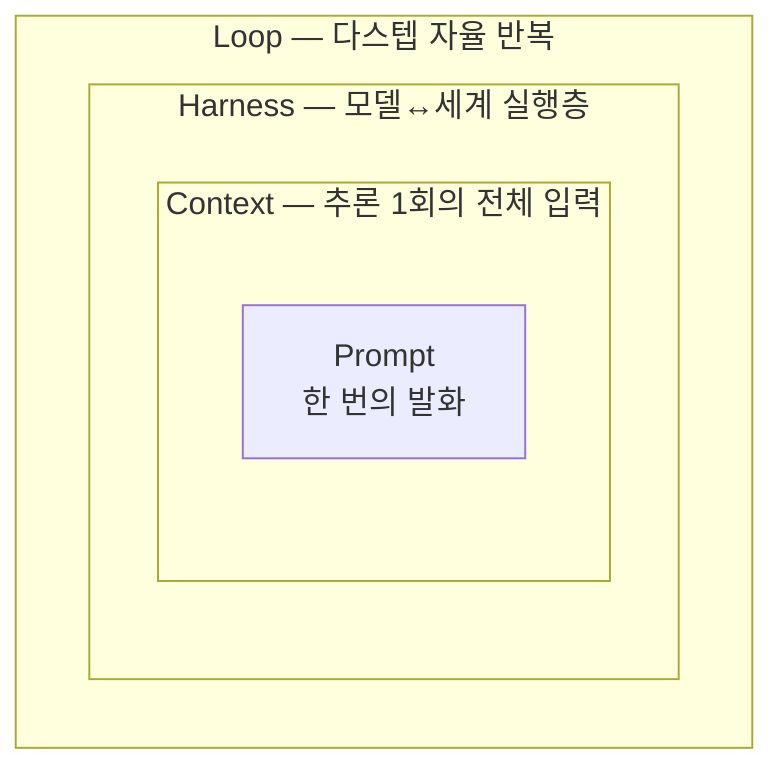
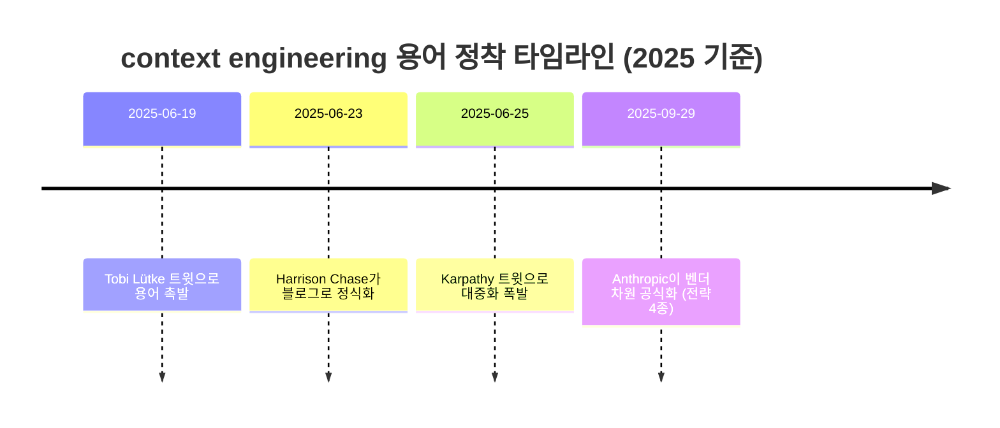
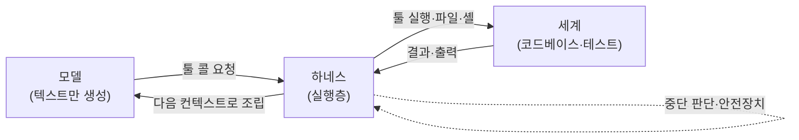
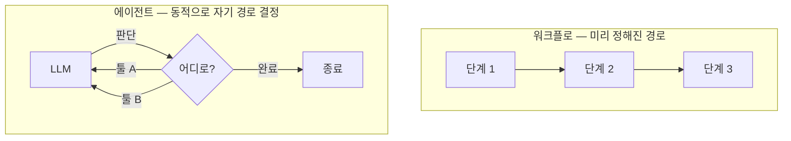
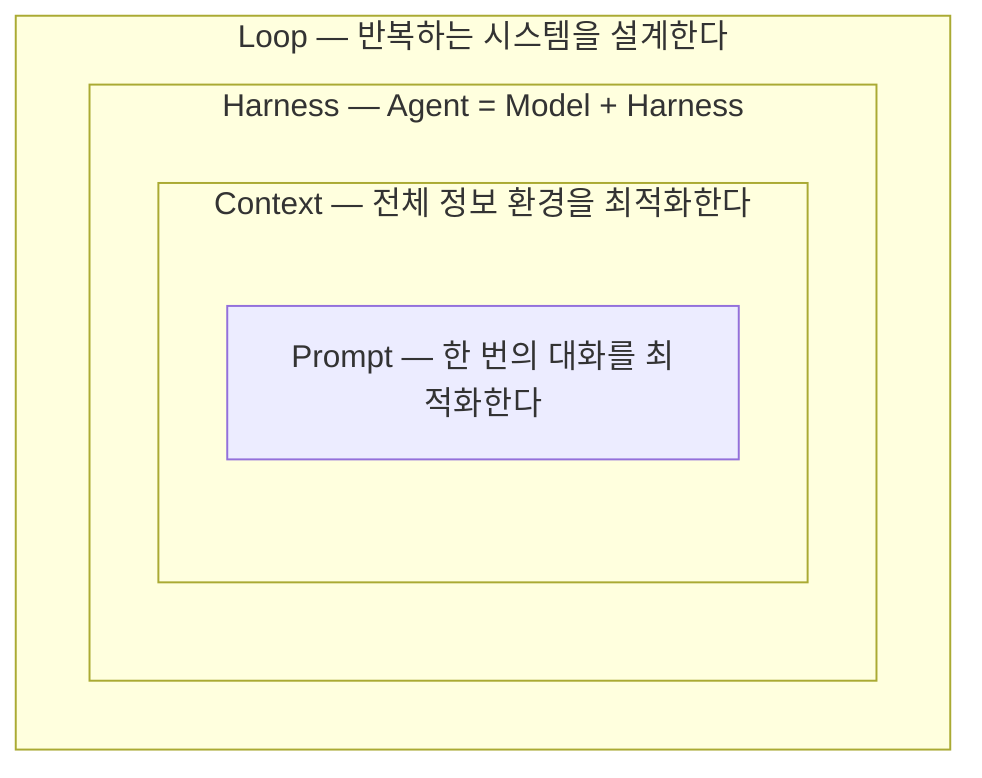
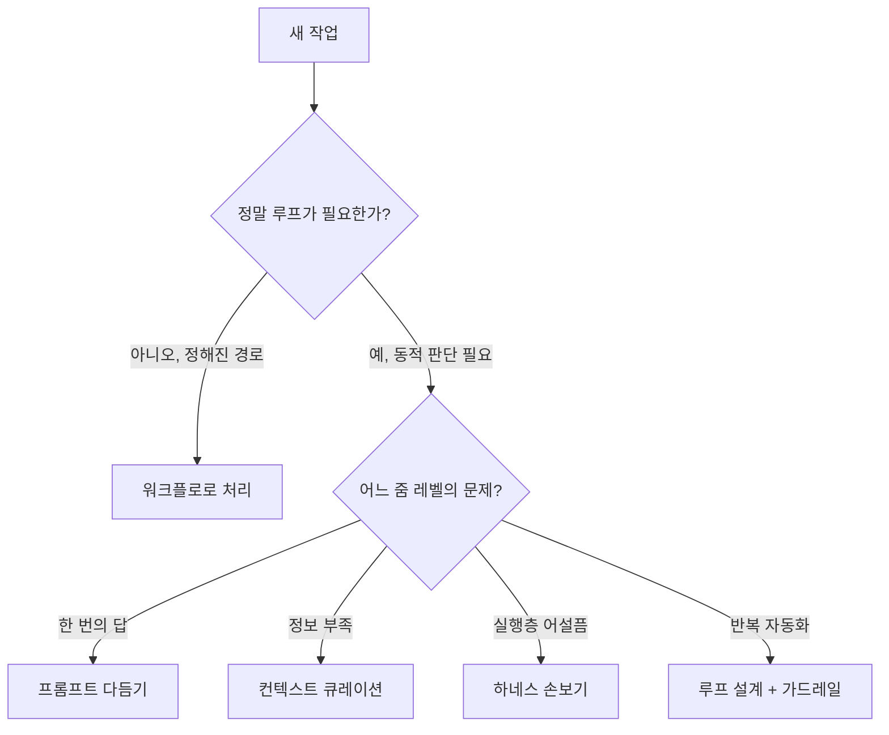

# 네 겹의 엔지니어링 — 프롬프트에서 루프까지, AI 코딩을 떠받치는 4개의 동심원

## 저자
Toby-AI

**판본:** v1.1.0 · 2026-06-10

---

## 판권

**네 겹의 엔지니어링 — 프롬프트에서 루프까지, AI 코딩을 떠받치는 4개의 동심원**
**판본:** v1.1.0
**발행일:** 2026-06-10
**저자:** Toby-AI
**식별자:** urn:uuid:8fe8d219-c888-438e-9cd0-a37be4e45209

### 라이선스

이 책은 [Creative Commons BY-NC-SA 4.0](https://creativecommons.org/licenses/by-nc-sa/4.0/) 라이선스로 배포된다.

- **저작자 표시(BY):** 출처를 밝힐 것.
- **비상업적 이용(NC):** 상업적 목적으로 이용할 수 없다.
- **동일조건 변경허락(SA):** 변경·재배포 시 동일한 라이선스를 적용해야 한다.

### 개정 이력

- **v1.1.0** (2026-06-10) — 5장 Loop Engineering 증보 (Osmani 1차 출처 기반 용어 계보·inner/outer loop·실패 모드 보강).
- **v1.0.0** (2026-06-10) — 초판.

### 출처

이 책은 [book-writer](https://github.com/tobyilee/book-writer) 하네스 v1.8.0로 자동 생성되었다.

---

## 머리말 — 이 책을 펼치기 전에

매일 코딩 에이전트를 쓴다. `CLAUDE.md`를 고치고, hook을 달고, "테스트 통과할 때까지 돌려"라고 시킨다. 그런데 막상 누가 옆에서 "context engineering이 prompt engineering이랑 뭐가 달라?"라고 물으면, 한 문장으로 답이 안 나온다. 분명 매일 쓰는 개념인데도 그렇다.

이 책은 바로 그 막막함에서 출발한다. prompt·context·harness·loop — 이 네 단어가 블로그마다, 강의마다, 마케팅 문구마다 조금씩 다른 뜻으로 쓰여서 우리는 매번 걸려 넘어진다. 이 책은 두 가지를 약속한다. 네 용어를 각각 **한 문장으로 또렷하게 정의하고**, 그 정의를 **오래 기억하게 만드는 것**. 그래서 책을 덮은 뒤에도 작업하다 "아, 이건 어느 줌 레벨의 문제지?" 하고 자연스럽게 떠오르게 한다.

### 누가 읽으면 좋은가

이 책은 **이미 Claude Code·Codex 같은 코딩 에이전트를 매일 쓰는 현업 개발자**를 위한 책이다. 도구 사용 경험은 전제하되, 네 용어의 정의·기원·관계는 처음부터 차근히 쌓는다. 그러니 도구를 한 번도 안 써본 사람에겐 다소 빠를 수 있고, 반대로 "그냥 쓰고는 있는데 용어가 헷갈린다"는 사람에겐 딱 맞는다.

읽고 나면 이렇게 달라진다. 네 용어를 각각 한 문장으로 정의하고, 동심원(줌 레벨)으로 관계를 설명할 수 있다. 자기가 매일 쓰는 도구의 어느 기능이 어느 엔지니어링에 해당하는지 분해해서 보고, `CLAUDE.md`·`AGENTS.md`·skills·hooks·loop 설정을 "왜 이렇게 쓰는지" 의식하며 다룬다. 그리고 모델을 갈아끼워도(Claude→Codex→Qwen) 무엇이 자산으로 남는지 안다.

### 어떻게 읽으면 좋은가

이 책은 **안에서 밖으로** 줌아웃하며 동심원을 그린다. 가장 국소적이고 익숙한 Prompt에서 출발해, Context → Harness → Loop로 한 겹씩 넓혀간다.

- **0장**은 "이 단어들 다 뭐가 다른 거야?"라는 1순위 고통을 정면으로 꺼내, 혼란의 진짜 이유가 **줌 레벨 차이**임을 짚는다.
- **1장**은 네 용어의 지도를 한꺼번에 펼친다. 동심원 프레임과 한 줄 정의 표를 먼저 머리에 심는다 — 이후 장들은 이 지도의 각 칸을 확대하는 셈이다.
- **2~5장**이 책의 본체다. 동심원을 안에서 밖으로 한 겹씩 확대한다: 프롬프트(2장) → 컨텍스트(3장) → 하네스(4장) → 루프(5장). **각 장은 그 용어 하나만 떼어 읽어도 끝낼 수 있게** 설계했다. 급하면 관심 있는 용어의 장부터 펼쳐도 좋다.
- **6장**은 네 엔지니어링이 실제 도구 안에서 어떻게 한꺼번에 구현되는지 해부한다.
- **7장**은 현장의 뜨거운 논쟁 다섯 가지에 책의 입장을 세운다.
- **8장**은 동심원을 다시 그리며, "어느 줌 레벨의 문제인가?"라는 사고 프레임워크로 독자를 월요일 아침의 실천으로 돌려보낸다.

처음 읽는다면 0장부터 순서대로 따라오길 권한다. 동심원이 안에서 밖으로 넓어지는 리듬을 그대로 타는 게 가장 잘 남는다. 이미 특정 용어가 급하다면, 1장으로 지도만 먼저 잡은 뒤 해당 장으로 건너뛰어도 된다.

> **표기에 관하여.** 이 책은 네 엔지니어링의 영문 용어(Prompt·Context·Harness·Loop Engineering)를 본문에서 한글(프롬프트·컨텍스트·하네스·루프)과 섞어 쓴다. 개념을 처음 정의할 때는 영문을, 풀어 설명할 때는 한글을 주로 쓴다 — 둘은 같은 것을 가리킨다. 도구별 컨텍스트 파일(`CLAUDE.md`·`AGENTS.md`·`GEMINI.md`)은 이름만 다르고 컨셉은 같으며, 이 점은 본문에서 거듭 짚는다.

---

## 목차

- 0장. 같은 단어, 다른 뜻 — 우리는 왜 이 네 용어에 걸려 넘어지는가
- 1장. 네 겹의 동심원 — 4대 엔지니어링의 지도를 먼저 펼친다
- 2장. 한 번의 발화를 벼리다 — Prompt Engineering
- 3장. 윈도에 무엇을 채울까 — Context Engineering
- 4장. 모델을 세상에 닿게 하다 — Harness Engineering
- 5장. 반복하는 시스템을 설계하다 — Loop Engineering
- 6장. 내 도구를 해부하기 — 네 엔지니어링이 한자리에서 만나는 곳
- 7장. 죽음·폭주·비용·썩음 — 현장의 다섯 가지 논쟁
- 8장. 네 겹을 다시 그리며 — 내일부터 무엇을 다르게 할까
- 에필로그 — 지도를 접고, 길을 나서며
- 참고문헌

---

# 0장. 같은 단어, 다른 뜻 — 우리는 왜 이 네 용어에 걸려 넘어지는가

옆자리 동료가 모니터에서 눈을 떼고 이렇게 묻는다고 해보자. "야, context engineering이 prompt engineering이랑 뭐가 달라? 그리고 요즘 harness engineering이라는 말도 보이던데, loop engineering은 또 뭐야?"

당신은 입을 연다. 그런데 막상 한 문장으로 정리하려니 말문이 막힌다. 분명히 매일 쓰는 개념들이다. `CLAUDE.md`도 고치고, hooks도 달고, Claude Code한테 "테스트 통과할 때까지 돌려"라고 시켜본 적도 있다. 그런데 그게 넷 중 어디에 해당하는 건지, 서로 무엇이 다른지 정작 말로 설명하려니 손에 잡히지 않는다.

이런 경험이 한 번쯤 있을 것이다. 그리고 이게 당신만의 문제가 아니라는 점을 먼저 짚고 싶다.

## 한 문장으로 말해봐, 라는 함정

개발자 커뮤니티를 조금만 둘러보면 같은 장면이 반복된다. 누군가 "prompt engineering이랑 context engineering 차이를 한 문장으로 말해보라"고 던지면, 댓글마다 정의가 다르다. 어떤 글은 둘을 거의 같은 것으로 취급하고, 어떤 강의는 prompt engineering은 한물갔으니 이제 context engineering을 배우라고 한다. 또 다른 블로그는 harness니 loop니 새 단어를 꺼내며 "이게 진짜 핵심"이라고 말한다.

문제는 이 단어들이 블로그마다, 강의마다, 마케팅 문구마다 조금씩 다른 뜻으로 쓰인다는 데 있다. 같은 단어인데 가리키는 대상이 미묘하게 어긋난다. 한쪽에서는 "이제 prompt engineering은 끝났고 context engineering의 시대"라고 단언한다. 다른 쪽에서는 "그게 그거 아니냐, 결국 모델에 말 잘 거는 일"이라고 받아친다. 둘 다 자신만만한데, 둘의 말이 부딪힌다. 누구 말이 맞는 걸까? 그러니 여러 글을 읽을수록 머릿속이 더 헝클어진다. 분명 열심히 읽었는데 오히려 더 헷갈리는 느낌, 꽤 찜찜하지 않은가?

여기서 한 가지 의문이 생긴다. 우리는 왜 이렇게까지 이 네 단어에 걸려 넘어지는 걸까? 정말 우리가 기초가 부족해서일까?

## 진짜 이유는 줌 레벨이 다르기 때문이다

결론을 먼저 던지는 대신, 잠시 다른 각도에서 생각해보자. 우리가 두 단어를 헷갈릴 때는 보통 두 가지 경우다. 하나는 둘이 거의 같은 뜻인 경우(이를테면 "버그"와 "결함"), 다른 하나는 둘이 같은 자리를 놓고 경쟁하는 경쟁어인 경우(이를테면 "탭"과 "스페이스")다.

그런데 prompt·context·harness·loop engineering은 둘 다 아니다. 이 네 단어는 같은 평면에서 경쟁하는 라이벌이 아니다. 서로 추상화 계층이 다른, 말하자면 **줌 레벨이 다른 용어들**이다.

지도 앱을 떠올리면 이해하기 쉽다. 같은 도시를 보더라도 건물 하나를 클로즈업한 화면과, 동네 전체를 담은 화면과, 도시 권역을 한눈에 보는 화면은 전혀 다르게 보인다. 그렇다고 셋 중 하나가 틀린 건 아니다. 그저 줌 레벨이 다를 뿐이다. 네 용어도 마찬가지다.

- **Prompt**는 가장 바짝 당긴 화면이다. 한 번의 발화, 즉 모델에게 건네는 한 번의 지시 그 자체에 초점을 맞춘다.
- **Context**는 한 걸음 물러난 화면이다. 그 한 번의 지시를 포함해, 추론 한 번에 모델이 보는 입력 전체를 다룬다.
- **Harness**는 더 물러난 화면이다. 모델을 실제로 행동하게 만드는 실행층 — 모델을 부르고, 툴을 돌리고, 멈출 때를 정하는 시스템을 본다.
- **Loop**는 가장 멀리서 잡은 화면이다. 그 실행을 한 번이 아니라 여러 번 반복하며 목표에 수렴하게 만드는 자율 반복 전체를 본다.

같은 풍경을 줌 레벨만 바꿔 보고 있는 셈이다. 그러니 "context가 prompt를 대체했다"는 말은, 엄밀히 따지면 "동네 지도가 건물 사진을 대체했다"는 말처럼 이상한 비교다. 하나가 다른 하나를 **감싸고 있을 뿐**, 대체하는 관계가 아니다.

조금 전에 부딪혔던 두 주장을 다시 떠올려보자. "prompt는 끝났고 context의 시대"라던 글과 "결국 말 잘 거는 일"이라던 글. 이제 보면 둘은 싸우고 있던 게 아니다. 그저 서로 다른 줌 레벨에서 같은 풍경을 가리키고 있었을 뿐이다. 당신이 읽으며 헷갈렸던 그 글들도, 알고 보면 각자 다른 배율의 화면을 설명하고 있었을지 모른다.

이 한 가지를 붙잡으면 많은 혼란이 풀린다. 당신이 그동안 헷갈렸던 건 머리가 나빠서가 아니다. 애초에 같은 줄에 세워 비교할 수 없는 것들을, 세상이 자꾸 같은 줄에 세워 놓고 비교하라고 했기 때문이다. 헷갈림은 당신의 무지가 아니라 **용어 구조의 문제**였다. 그렇게 생각하면 조금은 마음이 놓이지 않는가.

## 이 책이 하려는 약속

그래서 이 책은 딱 두 가지를 하려고 한다.

하나는 네 용어를 각각 **또렷하게 정의하는 것**이다. 어디서 와서 어떤 현상을 가리키는 말인지, 흔히 혼동되는 옆 용어와는 어떻게 갈라지는지를 짚는다. 단순히 사전식 정의 한 줄로 끝내지 않는다. 각 용어가 왜 생겨났는지, 어떤 문제를 풀려고 등장했는지를 함께 보면, 정의가 외워야 할 암기 항목이 아니라 납득되는 이야기로 바뀌기 때문이다.

다른 하나는 그 정의를 **오래 기억하게 만드는 것**이다. 정의를 읽고 그 자리에서 고개를 끄덕여도, 일주일 뒤면 다시 흐려지기 마련이다. 우리에게 필요한 건 시험 직전에 벼락치기로 외운 지식이 아니라, 실제로 작업하다가 "아, 이건 어느 줌 레벨의 문제지?" 하고 자연스럽게 떠오르는 감각이다. 그래서 이 책은 네 용어를 하나의 그림 — 안에서 밖으로 겹겹이 퍼지는 **동심원** — 에 얹는다. 책을 덮은 뒤에도 그 관계가 머릿속에 남도록 말이다.

다음 장에서 그 동심원을 한 장의 지도로 펼친다. 네 용어의 한 줄 정의와, 무엇이 무엇을 감싸는지를 먼저 한눈에 보고 시작하자. 지금 손에 잡히지 않던 그 네 단어가, 곧 제자리를 찾을 것이다.

---

# 1장. 네 겹의 동심원 — 4대 엔지니어링의 지도를 먼저 펼친다

흔히 우리는 prompt·context·harness·loop engineering을 **난이도 순서**로 줄 세우려 한다. 프롬프트는 초보가 하는 것, 컨텍스트는 한 단계 위, 하네스와 루프는 고수의 영역 — 이런 식으로 말이다. 그런데 이 줄 세우기가 바로 혼란의 출발점이다.

사실 이 넷은 순서가 아니다. **줌 레벨**이다. 앞 장에서 같은 풍경을 줌 레벨만 바꿔 본다고 했는데, 이 장에서는 그 네 화면을 한 장의 지도 위에 나란히 올려보려 한다. 이 지도 한 장만 머리에 심어두면, 앞으로 이어질 장들이 각각 이 지도의 어느 칸을 확대하는 것인지가 또렷해진다.

## 네 개의 한 줄 정의, 네 개의 기억 장치

먼저 네 용어를 한꺼번에 펼쳐보자. 각 용어마다 한 문장 정의 하나와, 오래 붙잡고 갈 **한 줄 기억 장치** 하나를 짝지었다. 이 네 개의 짧은 문구가 이 책 전체를 관통한다 — 2장부터 5장까지 각 용어를 본격적으로 다룰 때 이 문구를 글자 그대로 다시 꺼내 확장할 것이고, 마지막 8장에서 네 문구를 다시 한자리에 모아 매듭짓는다. 그러니 지금은 외우려 애쓰기보다, 네 문장의 결이 서로 어떻게 다른지를 느끼는 데 집중하자.

**Prompt Engineering — "한 번의 대화를 최적화한다."**
모델에게 건네는 단일 지시를 잘 쓰는 기술이다. 무엇을, 어떤 형식으로, 어떤 예시와 함께 말할지를 다룬다. 가장 국소적이고, 가장 익숙하다.

**Context Engineering — "전체 정보 환경을 최적화한다. 프롬프트는 그중 일부일 뿐."**
한 번의 추론에 모델이 보는 입력 전체를 동적으로 큐레이션하는 일이다. 프롬프트만이 아니라 대화 이력·검색 결과·툴 출력·에이전트 상태까지 윈도에 들어가는 모든 토큰을 다룬다.

**Harness Engineering — "Agent = Model + Harness. 모델이 아니면 다 하네스다."**
모델을 실제로 행동하는 에이전트로 바꾸는 실행 시스템을 설계하는 일이다. 모델 호출, 툴 실행, 컨텍스트 관리, 에러 처리, 중단 조건, 안전장치 — 모델 자체를 뺀 나머지 전부가 여기에 속한다.

**Loop Engineering — "한 번의 지시가 아니라, 반복하는 시스템을 설계한다."**
에이전트가 act → observe → reason → repeat의 반복 사이클로 목표에 수렴하도록 만드는 일이다. 매번 직접 타이핑하는 대신, 루프가 알아서 프롬프트하게 만든다.

네 문장을 다시 훑어보자. 뭔가 느껴지는 게 있는가? 뒤로 갈수록 다루는 범위가 넓어진다. 한 번의 발화에서 시작해, 입력 전체로, 실행 시스템으로, 반복 전체로. 이게 우연이 아니다. 바로 이 책의 척추인 동심원 구조다.

## 동심원: 무엇이 무엇을 감싸는가

네 용어의 관계를 한 줄로 적으면 이렇다.

> **Loop ⊃ Harness ⊃ Context ⊃ Prompt**

가장 안쪽에 Prompt가 있고, 그것을 Context가 감싸고, 다시 Harness가, 다시 Loop가 감싼다. 그림으로 보면 더 분명하다.


그림 1. 네 겹의 동심원 — 안쪽일수록 국소적, 바깥쪽일수록 넓은 시스템

여기서 한 가지는 분명히 짚고 넘어가자. 이 동심원은 칼로 자르는 위계가 아니다. "프롬프트는 컨텍스트의 부하 직원"이라는 식의 딱딱한 상하관계가 아니라는 말이다. 그보다는 앞서 말한 줌 레벨, 즉 **관점의 차이**로 보는 편이 정확하다. 같은 작업을 두고도 "지금 나는 한 번의 발화를 다듬는 중인가, 아니면 윈도 전체를 큐레이션하는 중인가, 아니면 반복 시스템을 설계하는 중인가"를 의식적으로 구분하자는 것이다.

그래서 포함 관계도 느슨하다. 프롬프트 하나를 잘 쓰는 일은 컨텍스트 설계의 일부이지만, 컨텍스트를 잘 짠다고 프롬프트가 사라지는 건 아니다. 안쪽 원은 바깥쪽 원 안에서 여전히 살아 숨 쉰다. 러시아 인형을 떠올리면 쉽다. 가장 큰 인형을 열면 그 안에 더 작은 인형이, 또 그 안에 더 작은 인형이 들어 있다. 큰 인형을 손에 쥐었다고 해서 안쪽 인형이 사라진 건 아니다. 그저 바깥 인형에 감싸여 있을 뿐, 열어보면 멀쩡히 거기 있다. 동심원도 똑같다. 루프를 설계하는 순간에도 그 한가운데에는 여전히 한 줄의 프롬프트가 자리 잡고 있다.

이 점을 기억해두면, 7장에서 다룰 "prompt engineering은 죽었다" 같은 자극적인 주장 앞에서도 흔들리지 않을 수 있다. 안쪽 원이 바깥 원에 감싸였다고 해서 없어진 게 아니니까.

## 한 표로 정렬하기

같은 내용을 다른 각도, 즉 **추상화 계층**과 **최적화 대상**으로 한 번 더 정리해보자. 동심원이 공간적 그림이라면, 이 표는 각 용어가 "무엇을 손보는 일인가"를 또렷하게 갈라준다.

| 용어 | 추상화 계층 | 최적화 대상 | 한 줄 정의 |
|------|-----------|-----------|-----------|
| Prompt Eng. | 단일 발화 | 한 번의 지시 | 무엇을·어떻게 말할까 |
| Context Eng. | 추론 1회의 전체 입력 | 컨텍스트 윈도 전체 | 윈도에 무엇을 채울까 |
| Harness Eng. | 에이전트 실행 1스텝 | 모델↔세계 실행층 | 모델을 어떻게 행동하게 할까 |
| Loop Eng. | 다스텝 자율 반복 | 반복 사이클 전체 | 언제까지·어떻게 반복할까 |

표가 압축한 걸 한 줄씩 풀어보면 이렇다. 각 엔지니어링은 결국 서로 다른 질문을 던지는 일이다.

- **Prompt Engineering**은 "이 한 번을 어떻게 말할까?"를 묻는다. 모델에게 건넬 단 하나의 지시를 어떻게 벼릴지가 관심사다.
- **Context Engineering**은 "이 추론에 무엇을 같이 넣어줄까?"를 묻는다. 지시 한 줄을 넘어, 모델이 한 번에 보는 입력 전체를 무엇으로 채울지가 관심사다.
- **Harness Engineering**은 "모델이 실제로 무엇을 만지게 할까?"를 묻는다. 모델이 파일을 읽고, 명령을 실행하고, 결과를 받아 다음을 정하는 실행층이 관심사다.
- **Loop Engineering**은 "언제까지, 어떤 조건에서 반복할까?"를 묻는다. 한 번의 실행이 아니라 그 실행을 거듭 돌리는 사이클 전체가 관심사다.

표를 위에서 아래로 읽으면, 최적화 대상이 "한 번의 지시 → 윈도 전체 → 실행 한 스텝 → 반복 사이클 전체"로 점점 커지는 게 보인다. 동심원을 안에서 밖으로 한 겹씩 넓혀가는 것과 정확히 같은 움직임이다.

## 같은 작업, 네 개의 줌 레벨

아직 표와 그림이 좀 추상적으로 느껴질 수 있다. 하나의 구체적인 작업에 네 개의 줌 레벨을 차례로 대보면 한결 손에 잡힌다. "기존 프로젝트에 입력값 검증 로직을 추가하고 테스트까지 통과시킨다"는 작업을 맡았다고 해보자.

**Prompt 줌 레벨에서 보면**, 우리는 모델에게 건넬 한 문장을 다듬는다. "검증 추가해줘"가 아니라 "이메일·전화번호 필드에 형식 검증을 넣되, 실패 시 400과 함께 어떤 필드가 왜 틀렸는지 응답에 담아줘" 같은 식으로. 한 번의 지시를 정확하게 벼리는 것, 그게 이 줌 레벨의 일이다.

**Context 줌 레벨에서 보면**, 시야가 넓어진다. 그 지시 한 줄만으로는 모델이 우리 프로젝트의 검증 컨벤션을 알 길이 없다. 그래서 우리는 모델이 보는 입력 전체를 챙긴다. 어떤 검증 라이브러리를 쓰는지, 기존 에러 응답 포맷은 어떤지, 관련 파일은 어디 있는지 — 이런 정보를 윈도에 적절히 채워 넣는 일이다.

**Harness 줌 레벨에서 보면**, 또 한 걸음 물러난다. 이제는 모델이 코드를 제안하는 것을 넘어, 실제로 파일을 고치고 테스트를 돌려야 한다. 그러려면 모델이 파일을 읽고 쓸 수 있는 툴, 테스트를 실행할 수 있는 통로, 결과를 받아 다음 행동을 정하는 실행층이 필요하다. 모델 바깥의 이 실행 시스템이 하네스다.

**Loop 줌 레벨에서 보면**, 가장 멀리서 전체를 조망한다. 검증을 추가했더니 테스트가 깨졌다면? 모델이 결과를 관찰하고, 원인을 따져, 다시 고치고, 또 테스트를 돌린다. 이 "고치고-돌리고-확인하고-다시"의 반복을 언제까지, 어떤 조건에서 멈출지를 설계하는 것이 이 줌 레벨의 일이다.

같은 작업 하나인데, 어느 줌 레벨에서 보느냐에 따라 손볼 대상이 완전히 달라진다. 그리고 중요한 건, 이 넷이 **동시에 살아 있다**는 점이다. 루프를 돌리는 와중에도 그 안에서는 매 스텝마다 컨텍스트가 채워지고 프롬프트가 건네진다. 바깥 원이 안쪽 원을 대체하는 게 아니라, 감싼 채로 함께 돌아가는 것이다.

## 이 지도를 들고 떠나는 여정

이제 이 책이 어느 길로 갈지 감이 올 것이다. 책의 본체인 2장부터 5장까지는 동심원을 **안에서 밖으로** 한 겹씩 확대해 나간다. 가장 익숙한 Prompt(2장)에서 출발해, Context(3장)로 한 걸음 물러나고, Harness(4장)로 더 물러난 뒤, Loop(5장)에서 가장 멀리서 전체를 조망한다. 각 장은 그 용어 하나의 정의·기원·실습을 한 묶음으로 다루니, 어느 한 장만 따로 읽어도 그 용어는 끝낼 수 있다.

네 겹을 다 그린 다음에는 한 발 물러나 응용으로 넘어간다. 6장에서 네 겹이 실제 도구 안에서 어떻게 한꺼번에 구현되는지를 해부하고, 7장에서 현장의 뜨거운 논쟁들에 책의 입장을 세운 뒤, 8장에서 동심원을 처음부터 다시 그리며 매듭짓는다.

왜 가장 바깥의 Loop가 아니라 가장 안쪽의 Prompt부터 갈까? 당신이 이미 매일 하고 있는 일이기 때문이다. 손에 익은 곳에서 출발해야, 추상적인 용어들이 비로소 손에 잡힌다. 그 가장 안쪽 칸 — 한 번의 발화 — 에는, 매일 무심코 지나쳤을 뿐 생각보다 깊은 세계가 들어 있다.

---

# 2장. 한 번의 발화를 벼리다 — Prompt Engineering

앞 장에서 우리는 가장 안쪽 원을 'Prompt'라 불렀다. 네 겹의 동심원에서 한가운데, 가장 국소적이고 가장 익숙한 자리다. 이제 그 원 안으로 먼저 들어가보자.

가장 익숙한 곳부터 시작하는 데는 이유가 있다. 프롬프트 쓰기는 당신이 이미 매일 하는 일이다. Claude Code에 "이 함수 리팩토링해줘"라고 치는 순간, 당신은 이미 프롬프트 엔지니어링을 하고 있다. 다만 그걸 하나의 분과로 의식한 적이 별로 없었을 뿐이다. 이 장은 그 익숙한 행위에 정확한 이름과 범위를 붙여주는 일이다. 그래서 의도적으로 가볍게 간다 — 다음 3장부터 본격적으로 밀도를 올릴 테니, 여기서는 호흡을 좀 편하게 하자.

## 한 번의 대화를 최적화한다

프롬프트 엔지니어링의 기억 장치를 다시 꺼내자. **"한 번의 대화를 최적화한다."** 1장에서 본 그 한 줄이다. 여기서 핵심은 "한 번"이라는 말에 있다. 프롬프트 엔지니어링이 다루는 무대는 모델에게 건네는 **단일 지시 하나**다. 그 한 번의 발화를, 무엇을·어떤 형식으로·어떤 예시와 함께 말할지를 벼리는 기술이다.

구체적으로 무엇을 손볼까? 크게 다섯 가지다.

- **지시문 문구** — 무엇을 시킬지 명확하고 구체적으로 적는다.
- **역할 지정** — "너는 숙련된 백엔드 개발자다"처럼 모델에게 페르소나를 준다.
- **출력 형식** — JSON으로, 표로, 마크다운으로 — 받고 싶은 모양을 지정한다.
- **few-shot 예시** — 원하는 입출력 예를 한두 개 보여줘 패턴을 잡게 한다.
- **chain-of-thought 유도** — "단계별로 생각해"처럼 추론 과정을 밟게 한다.

다섯 가지가 따로 노는 게 아니다. 결국 하나의 목표로 모인다. **한 번의 지시를 정확하고, 구체적이고, 검증 가능하게** 만드는 것. 모델이 헤매지 않도록, 그리고 받은 결과가 맞는지 우리가 확인할 수 있도록 말이다.

여기서 "검증 가능하게"라는 말에 잠깐 머물러보자. 의외로 자주 놓치는 부분이다. 우리는 모델에게 무엇을 시킬지는 열심히 고민하면서, 정작 결과가 맞는지 어떻게 확인할지는 잘 생각하지 않는다. 그런데 검증할 수 없는 지시는, 결과가 그럴듯해 보이면 그냥 넘어가게 만든다. 그래서 좋은 프롬프트는 종종 검증의 기준까지 품고 있다. "테스트가 통과하도록 고쳐줘"는 "고쳐줘"보다 강하다. 통과/실패라는 명확한 합격선을 함께 건넸기 때문이다. 한 번의 발화를 벼린다는 건, 결국 모델이 무엇을 해야 할지와 우리가 무엇을 확인할지를 같은 문장에 담는 일이다.

## 프롬프트가 일급 변수가 된 순간

이 분과는 어디서 왔을까? 잠시 시간을 거슬러 올라가보자.

프롬프트 엔지니어링이라는 말은 2020년 무렵 GPT-3와 함께 등장했다. 용어 자체는 흔히 Gwern Branwen이 GPT-3 입력을 작성하던 맥락에서 처음 쓴 것으로 널리 귀속된다. (다만 이 귀속은 2차 소스에 기댄 것이라, 누가 최초였는지를 단정하기는 조심스럽다.)

용어의 출생보다 더 중요한 건 그 배경에 있던 발견이다. GPT-3(2020) 이전에는 모델의 행동을 바꾸려면 보통 파인튜닝, 즉 모델을 다시 학습시켜야 한다고 여겼다. 그런데 GPT-3가 보여준 건 달랐다. **파인튜닝을 전혀 하지 않고도, 프롬프트 문구를 어떻게 쓰느냐에 따라 출력 품질이 극적으로 달라진다**는 것이었다(Brown et al., 2020 — GPT-3 논문).

이게 얼마나 낯선 일이었는지는, 지금 당신이 매일 겪는 장면을 떠올리면 금방 와닿는다. 똑같은 모델에게 "이거 요약해줘"라고만 던졌을 때와, "세 문장으로, 핵심 결론을 맨 앞에 두고 요약해줘"라고 던졌을 때 결과가 얼마나 다른가. 모델은 그대로인데, 말을 거는 방식 하나로 쓸 만한 답과 버리는 답이 갈린다. 2020년 무렵 사람들이 GPT-3에서 마주친 놀라움이 바로 이것이었다. 같은 모델인데 말을 거는 방식만 바꿔도 결과가 천차만별이라니. 이 발견이 "프롬프트를 어떻게 쓰는가"를 갑자기 일급 변수로 끌어올렸다.

그 뒤로 2021~2022년 동안 커뮤니티와 각종 가이드가 베스트 프랙티스를 쌓아 올렸다. 그중에서도 대표 테크닉 하나가 학술적으로 정리됐는데, 바로 chain-of-thought, 줄여서 CoT다(Wei et al., 2022). "답만 말하지 말고 단계별로 생각해보라"고 시키면 복잡한 추론 문제에서 정확도가 눈에 띄게 올라간다는 것이었다. 지금 우리가 무심코 쓰는 "단계별로 생각해"라는 한마디에도 이런 뿌리가 있다.

## 프롬프트는 더 큰 그림의 일부다

여기서 한 가지를 미리 짚어두고 싶다. 다음 장으로 넘어가는 다리이기도 하다.

Anthropic은 프롬프트 엔지니어링을 이렇게 정의한다(2025-09-29 기준). "최적의 결과를 위해 LLM에게 줄 지시를 쓰고 조직하는 방법." 여기까지는 우리가 본 정의와 같다. 그런데 같은 글에서 한 가지를 덧붙인다. 프롬프트 엔지니어링은 더 큰 분과인 **컨텍스트 엔지니어링의 부분집합**이라고 말이다.

이 말이 처음엔 좀 의아하게 들릴 수 있다. 프롬프트가 컨텍스트의 일부라고? 하지만 1장의 동심원을 떠올리면 자연스럽다. Prompt는 가장 안쪽 원이고, Context는 그것을 감싸는 한 겹 바깥 원이었다. 프로덕션 환경의 에이전트가 보는 입력에는 우리가 직접 쓴 프롬프트만 있는 게 아니다. 대화 이력, 검색해온 문서, 툴이 뱉은 출력, 에이전트의 현재 상태까지 — 온갖 토큰이 컨텍스트 윈도에 함께 들어간다. 우리가 정성껏 쓴 프롬프트는 그 거대한 입력의 **작은 한 조각**인 셈이다.

그렇다고 프롬프트가 사소하다는 뜻은 결코 아니다. 가장 안쪽 원은 가장 자주 손대는 원이고, 여기서의 한 끗 차이가 결과를 가른다. 다만 그것이 더 큰 그림 안의 한 조각임을 아는 것과 모르는 것은, 작업을 바라보는 시야 자체를 다르게 만든다. 이 다리를 건너면 바로 다음 장, 컨텍스트 엔지니어링이다.

## 오늘 당장 해볼 수 있는 것

이론은 이쯤 하고, 손을 움직여보자. 당신이 매일 쓰는 도구에서 한 번의 지시를 더 잘 벼리는 방법은 의외로 단순하다.

첫째, **모호한 동사를 구체적인 요구로 바꾸자.** "이 코드 개선해줘"보다 "이 함수의 중첩 if를 early return으로 풀고, 변수명을 의미가 드러나게 바꿔줘"가 낫다. 무엇을 개선이라 부를지 모델이 추측하지 않게 해야 한다.

둘째, **받고 싶은 모양을 미리 지정하자.** "리뷰해줘"보다 "심각도 높은 순으로, 각 항목마다 파일·라인·이유를 표로 정리해줘"가 결과를 훨씬 쓰기 좋게 만든다.

셋째, **헷갈릴 만한 작업엔 예시를 한두 개 붙이자.** 원하는 커밋 메시지 스타일이 있다면, "컨벤셔널 커밋 스타일로 써줘"라고 말로 풀어 설명하기보다 좋은 예 하나를 그대로 보여주는 편이 빠르다. 예를 들어 "`feat(auth): add token refresh on 401`처럼 써줘"라고 한 줄 붙이면, 모델은 형식·접두사·말투를 한 번에 잡아낸다. 말로 열 줄 설명하는 것보다 예시 하나가 정확하다.

넷째, **추론이 필요한 일엔 단계를 밟게 하자.** 복잡한 버그를 찾을 때 그냥 "이거 고쳐줘"라고 하면 모델은 눈에 띄는 첫 의심처를 곧장 뜯어고치기 쉽다. 반면 "원인을 단계별로 짚어본 다음에 고쳐줘"라고 하면, 재현 조건부터 의심 지점, 그 근거까지 한 번 짚고 들어간다. 결론을 서두르지 않게 만드는 이 한마디가, 엉뚱한 곳을 고치는 헛수고를 줄여준다.

이 네 가지에 거창한 건 없다. 다만 한 번 의식하고 나면, 무심코 던지던 한 줄짜리 지시가 달라진다. 가장 작은 변경으로 가장 큰 효과를 내는 지점을 찾는 것 — 그게 프롬프트 엔지니어링의 감각이다.

이렇게 가장 안쪽 원을 한 바퀴 돌았다. 그런데 여기서 자연스럽게 질문이 따라온다. 우리가 공들여 쓴 이 프롬프트가 더 큰 입력의 한 조각일 뿐이라면, 그 **나머지 조각들**은 누가, 어떻게 챙기는 걸까? 프롬프트 한 줄 바깥에 펼쳐진 그 입력 전체에도, 그것을 다루는 고유한 이름과 기술이 있다.

---

# 3장. 윈도에 무엇을 채울까 — Context Engineering

> "the delicate art and science of filling the context window with just the right information for the next step."
> — Andrej Karpathy (2025-06-25 기준)

다음 단계를 위해, 컨텍스트 윈도를 **딱 맞는 정보**로 채우는 섬세한 기예이자 과학. Karpathy가 이 한 문장을 트윗으로 던졌을 때, 사람들이 열광한 건 새로운 기술이 발표돼서가 아니다. 이미 모두가 어렴풋이 느끼던 일에 마침내 **이름이 붙었기** 때문이다.

생각해보자. 우리는 이미 매일 이 일을 하고 있다. 프롬프트만 쓰는 게 아니다. 어떤 파일을 열어 에이전트에게 보여줄지, `CLAUDE.md`에 무슨 규칙을 적어둘지, 긴 대화가 늘어지면 언제 새 세션을 열지 — 이 모든 선택이 사실은 "윈도에 무엇을 채울까"라는 하나의 질문이었다. 앞 장에서 우리는 가장 안쪽 원, 한 번의 발화를 벼렸다. 그리고 그 발화가 더 큰 그림의 작은 일부라는 복선을 남겨뒀다. 이제 그 한 겹 바깥, 컨텍스트 윈도 전체로 줌아웃해보자.

## "프롬프트는 그중 일부일 뿐"

1장의 지도에서 우리는 컨텍스트 엔지니어링에 한 줄 기억 장치를 붙여뒀다. 다시 글자 그대로 가져와보자.

> **전체 정보 환경을 최적화한다. 프롬프트는 그중 일부일 뿐.**

이 한 문장이 컨텍스트 엔지니어링의 전부라고 해도 과언이 아니다. 풀어보자. 프롬프트 엔지니어링이 "내가 지금 타이핑하는 이 한 문단을 어떻게 쓸까"였다면, 컨텍스트 엔지니어링은 그보다 훨씬 넓다. 모델이 다음 토큰을 추론하는 그 순간, **컨텍스트 윈도 안에 들어 있는 모든 토큰**이 대상이다. 내가 방금 친 지시문만이 아니다. 그 앞에 쌓인 대화 이력, 검색해서 끌어온 문서, 직전 툴이 뱉어낸 출력, 에이전트가 들고 있는 상태값 — 이 전부가 한 덩어리로 모델의 머릿속에 들어간다.

그러니까 프롬프트는 이 큰 그림의 한 조각이다. 중요한 조각이지만, 어디까지나 일부다. 프로덕션에서 돌아가는 에이전트를 떠올려보자. 사람이 직접 친 프롬프트는 전체 컨텍스트의 몇 퍼센트나 될까? 나머지 대부분은 시스템이 동적으로 조립한 것들이다. 검색 결과, 이전 단계의 작업 로그, 코드베이스에서 긁어온 함수 시그니처. 이 거대한 나머지를 어떻게 큐레이션하느냐 — 그게 컨텍스트 엔지니어링이다.

여기서 Anthropic의 정의를 빌려오면 한층 또렷해진다. Anthropic은 컨텍스트 엔지니어링을 "LLM 추론 중에 최적의 토큰(정보) 집합을 큐레이션하고 유지하는 전략의 집합"이라고 못 박았다 (2025-09-29 기준). 핵심 단어가 둘이다. 큐레이션과 유지. 한 번 잘 넣고 끝이 아니라, 추론이 진행되는 내내 좋은 상태로 관리해야 한다는 뜻이다.

## 한 사람이 아니라 네 사람이 같은 말을 했다

새로운 용어가 등장할 때 흔히 따라오는 의심이 있다. "또 누가 마케팅하려고 지어낸 신조어 아니야?" 충분히 들 수 있는 의심이다. 그런데 컨텍스트 엔지니어링은 조금 사정이 다르다. 비슷한 시기에, 서로 다른 위치에 있던 네 사람이 거의 같은 말을 했기 때문이다.

- **Tobi Lütke**(Shopify CEO): "the art of providing all the context for the task to be plausibly solvable by the LLM." — 작업이 그럴듯하게 풀릴 만큼의 컨텍스트를 모두 제공하는 기예.
- **Andrej Karpathy**: 앞서 본 "딱 맞는 정보로 채우는 섬세한 기예이자 과학."
- **Harrison Chase**(LangChain): "building dynamic systems to provide the right information and tools in the right format such that the LLM can plausibly accomplish the task." — 올바른 정보와 툴을, 올바른 형식으로, 동적으로 제공하는 시스템을 짓는 일.
- **Anthropic**: "추론 중 최적의 토큰 집합을 큐레이션·유지하는 전략."

표현은 제각각이지만 가리키는 손가락 끝은 한 점이다. "작업이 풀릴 만큼의 정보를, 딱 맞게, 동적으로." 한 사람의 주장이라면 유행어로 흘려들을 수도 있다. 그런데 CEO와 연구자와 프레임워크 제작자와 모델 회사가 각자의 자리에서 같은 결론에 도달했다면, 이건 누군가의 작명이 아니라 현장이 동시에 부딪힌 **실재하는 문제**라고 봐야 한다.

### 6일 사이에 벌어진 일

이 용어가 자리 잡은 과정은 유난히 빠르고 또렷해서, 타임라인으로 짚어둘 만하다.


그림 1. context engineering 용어의 6일과 그 후

6월 19일 Lütke가 트윗으로 불씨를 던지고, 나흘 뒤 Chase가 블로그로 개념을 정식화하고, 다시 이틀 뒤 Karpathy가 "+1 for context engineering"이라며 불을 붙였다. 단 6일 사이에 용어가 업계 공용어가 됐다. 그리고 9월 말, Anthropic이 엔지니어링 블로그로 전략 네 가지까지 갖춰 벤더 차원에서 공식화했다. 봄에 씨앗이 떨어져 가을에 제도가 된 셈이다.

왜 하필 2025년이었을까? 답은 도구의 변화에 있다. 그 무렵 코딩 에이전트들이 단발성 질의응답을 넘어 **여러 단계를 스스로 도는 시스템**으로 진화했다. 한 번 묻고 한 번 답받던 시절에는 프롬프트 한 줄만 잘 쓰면 됐다. 그런데 에이전트가 수십 번 툴을 호출하고, 그때마다 컨텍스트가 불어나기 시작하자, "윈도에 무엇을 어떻게 채울 것인가"가 갑자기 생사를 가르는 문제가 됐다. 용어는 그 절박함에 붙인 이름이다.

## 컨텍스트는 무한하지 않다

여기서 컨텍스트 엔지니어링의 가장 중요한 직관 하나로 들어가보자. 흔히 이렇게 생각하기 쉽다. "컨텍스트 윈도가 크면 클수록 좋은 거 아니야? 100만 토큰까지 넣을 수 있다는데, 일단 관련될 만한 건 다 넣자." 자연스러운 생각이다. 그런데 정말 그럴까?

물론 윈도가 크면 더 많이 담을 수는 있다. 하지만 담을 수 있다는 것과 담는 게 이롭다는 것은 전혀 다른 이야기다. 컨텍스트는 **유한 자원**처럼 다뤄야 한다. 토큰을 더 넣을수록 한계 효용이 줄어드는, 이른바 수확 체감(diminishing returns)이 작동하기 때문이다. 어느 지점을 넘어가면, 정보를 더 넣는 행위가 오히려 모델의 판단을 흐린다.

직관적으로 그려보자. 누군가에게 일을 부탁하는데 정작 필요한 한 페이지짜리 지시 대신 두꺼운 매뉴얼 열 권을 통째로 안겨준다고 해보자. 정보가 부족해서가 아니라 너무 많아서 핵심을 못 찾는 상황이 벌어진다. 모델도 똑같다. 관련 없는 토큰이 섞여 들수록 진짜 중요한 신호가 잡음에 묻힌다.

그래서 컨텍스트 엔지니어링의 본질은 "많이 넣기"가 아니라 **"딱 맞게 넣기"**다. Anthropic의 표현을 빌리면, **가장 작은 high-signal 토큰 집합**을 찾는 일이다. 신호가 가장 진하고 군더더기가 가장 적은, 그 최소 집합. 넣을 수 있는 최대치가 아니라, 작업을 풀어내는 데 꼭 필요한 최소치를 겨냥한다.

> 이 "딱 맞게"라는 직관은 감(感)에 기댄 조언처럼 들릴 수 있다. 하지만 여기엔 단단한 정량 근거가 있다. 입력이 길어질수록 모델 성능이 실제로 어떻게 무너지는지 — 그리고 그 무너지는 방식이 얼마나 반직관적인지 — 는 7장에서 숫자로 회수한다. 일단 여기서는 "길수록 좋은 게 아니다"라는 결론만 손에 쥐고 가자.

이 점을 기억해두자. 컨텍스트 엔지니어링을 잘한다는 건, 더 많이 넣을 줄 안다는 게 아니라 **무엇을 빼야 할지** 안다는 뜻에 가깝다.

## 그렇다면 무엇을 어떻게 채울까 — 네 가지 전략

원리는 알았다. "딱 맞게, 최소로." 그런데 막상 에이전트를 돌려보면 컨텍스트는 가만히 둬도 계속 불어난다. 단계를 거듭할수록 대화 이력이 쌓이고, 툴 출력이 누적되고, 어느새 윈도가 잡동사니로 가득 찬다. 이 불어남을 어떻게 다스릴까? Anthropic이 정리한 네 가지 전략을 살펴보자 (2025-09-29 기준).

### Compaction — 이력을 요약하고 다시 시작하기

긴 대화가 윈도를 잠식하기 시작하면, 지나온 이력을 통째로 들고 가는 대신 핵심만 요약해 압축한 뒤 그 요약본으로 새로 출발한다. 사람으로 치면, 길어진 회의 중간에 "지금까지 정한 것 세 줄로 정리하고 다시 가자"라고 끊는 것과 같다. 원본 수천 토큰이 요약 수백 토큰으로 줄어들면, 남은 공간을 더 중요한 일에 쓸 수 있다.

### Structured Note-Taking — 컨텍스트 밖에 메모를 남기기

모든 걸 컨텍스트 윈도 안에서 기억하려 들면 금세 한계에 부딪힌다. 그래서 윈도 바깥에 노트를 남긴다. 진행 상황, 결정 사항, 다음에 할 일을 파일에 적어두고, 필요할 때만 다시 불러온다. 윈도는 휘발성 작업 기억이고, 노트는 영속적 외장 기억인 셈이다. 컨텍스트가 압축되거나 세션이 바뀌어도, 노트에 적어둔 것은 사라지지 않는다.

### Sub-Agents — 깨끗한 컨텍스트에 일을 맡기기

특정 작업을 통째로 떼어, 깨끗한 별도 컨텍스트 윈도를 가진 서브 에이전트에게 맡긴다. 그 서브 에이전트는 자기만의 윈도에서 마음껏 탐색하고 시행착오를 겪은 뒤, 메인 에이전트에게는 결과 요약만 돌려준다. 그 과정에서 발생한 잡다한 중간 토큰은 메인 윈도를 더럽히지 않는다. 더러워지는 일을 격리된 방에서 처리하고, 깨끗한 결과만 받는 구조다.

### Just-in-Time — 미리 다 넣지 말고, 필요할 때 가져오기

처음부터 모든 정보를 윈도에 쏟아붓는 대신, 식별자(경로·링크·쿼리)만 들고 있다가 정작 필요한 순간에 동적으로 로드한다. 파일 전체를 미리 컨텍스트에 욱여넣는 게 아니라, "이 파일이 여기 있다"는 사실만 알아두고 실제 내용은 그 파일을 읽어야 하는 시점에 가져오는 식이다. 미리 다 안고 가면 무겁고, 막상 안 쓰면 낭비다. 그러니 제때, 딱 필요한 만큼만.

네 전략을 한 줄로 꿰면 이렇다. **부풀면 줄이고(Compaction), 잊을 것 같으면 밖에 적고(Note-Taking), 더러워질 일은 격리하고(Sub-Agents), 미리 다 넣지 말고 제때 가져온다(Just-in-Time).** 표현은 넷이지만 모두 같은 목표를 향한다 — 윈도를 가장 작은 high-signal 집합으로 유지하기.

## 매일 만지는 그 파일이 컨텍스트 엔지니어링이다

여기까지는 다소 추상적으로 들릴 수 있다. 그런데 사실 우리는 이미 컨텍스트 엔지니어링의 가장 기본적인 형태를 매일 손으로 하고 있다. 바로 프로젝트 규칙을 파일로 영속화하는 일이다.

Claude Code를 쓴다면 `CLAUDE.md`를, Codex를 쓴다면 `AGENTS.md`를, Gemini CLI를 쓴다면 `GEMINI.md`를 만져봤을 것이다. 이 파일들의 정체가 뭘까? 이름은 도구마다 다르지만 컨셉은 거의 같다. 에이전트가 매번 추론할 때 함께 따라 들어가는, 영속적인 컨텍스트다. 이 프로젝트의 빌드 명령은 무엇인지, 코딩 컨벤션은 어떤지, 절대 건드리면 안 되는 영역은 어디인지 — 이런 규칙을 파일에 적어두면, 세션을 새로 열어도 매번 똑같이 입력하지 않아도 된다.

이게 왜 컨텍스트 엔지니어링일까? 다시 정의로 돌아가보자. "전체 정보 환경을 최적화한다." `CLAUDE.md`에 한 줄을 적는 행위는, 곧 모델의 추론 윈도에 무엇을 상시 올려둘지 결정하는 행위다. 좋은 규칙을 적으면 매 추론의 신호가 강해지고, 잡다한 규칙을 잔뜩 적으면 — 짐작했겠지만 — 오히려 윈도를 잡음으로 채우는 셈이 된다. "딱 맞게"의 원리가 여기서도 그대로 작동한다.

그러니 다음에 `CLAUDE.md`나 `AGENTS.md`를 열거든, 그냥 메모장에 끄적이듯 적지 말자. **이 한 줄이 앞으로 모든 추론에 따라 들어갈 가치가 있는가?** 이 질문을 한 번 던져보는 것만으로도, 당신은 이미 컨텍스트 엔지니어링을 의식적으로 하고 있는 것이다.

> 도구마다 이 파일의 이름과 세부 동작은 조금씩 다르고, 빠르게 바뀐다. 정확한 파일명·로드 규칙은 각 도구의 공식 문서를 함께 확인하자. 여기서 중요한 건 파일명이 아니라 컨셉 — "프로젝트 규칙을 영속 컨텍스트로 박아둔다"는 발상이다.

---

컨텍스트 엔지니어링을 한 문장으로 다시 줄이면, "전체 정보 환경을 최적화한다. 프롬프트는 그중 일부일 뿐"이다. 그리고 그 최적화의 방향은 한결같이 **많이가 아니라 딱 맞게**였다. 부풀면 줄이고, 잊을 것 같으면 밖에 적고, 더러워질 일은 격리하고, 미리 다 넣지 말 것.

그런데 여기까지 오면 한 가지가 묘하게 비어 있다. 우리는 줄곧 "윈도에 무엇을 채울까"만 이야기했다. 정작 그 컨텍스트를 모델에게 떠먹이고, 툴을 실행하고, 결과를 받아 다음 입력으로 조립하는 — **채워 넣는 손 자체**는 누구일까? 컨텍스트가 "무엇"의 이야기였다면, 그 손은 "어떻게"의 이야기다. 그리고 그 손에도 이름이 있다.

---

# 4장. 모델을 세상에 닿게 하다 — Harness Engineering

똑같은 모델인데, 인터페이스만 바꿨더니 성능이 갈렸다.

2024년 SWE-agent 논문이 보인 게 정확히 이것이다. 모델은 그대로 두고 — 모델이 코드베이스를 어떻게 보고, 어떻게 명령을 내리고, 어떤 형태로 결과를 돌려받는지, 그 **인터페이스만** 손봤더니 실제 GitHub 이슈를 자동으로 고쳐내는 비율이 달라졌다. 당시 이 접근으로 SWE-bench라는 벤치마크에서 pass@1 12.5%를 기록했다 (2024 기준). 지금 눈으로 보면 낮아 보이는 숫자지만, 핵심은 점수 자체가 아니다. **모델을 한 글자도 안 바꿔도, 모델을 둘러싼 무언가를 바꾸면 결과가 달라진다**는 사실이다.

그 "둘러싼 무언가"에 이름이 있다. 하네스(harness)다. 앞 장에서 우리는 한 번의 추론에 무엇을 채울지를 다뤘다. 그런데 그 컨텍스트를 실제로 채워 넣고, 모델을 호출하고, 모델이 내놓은 결정을 진짜 행동으로 옮기는 손이 따로 있었다. 그 손이 바로 하네스다. 이번엔 그 손 안으로 들어가보자.

## "Agent = Model + Harness"

1장의 지도에서 하네스 엔지니어링에 붙여둔 기억 장치를 다시 글자 그대로 꺼내보자.

> **Agent = Model + Harness.** 모델이 아니면 다 하네스다.

이 짧은 등식이 하네스를 이해하는 가장 빠른 길이다. 우리가 흔히 "AI 에이전트"라고 부르는 것을 분해해보자. 거기엔 두 덩어리가 있다. 하나는 모델 — GPT든 Claude든, 텍스트를 받아 다음 텍스트를 추론하는 그 신경망 덩어리다. 그런데 모델 혼자서는 아무것도 못 한다. 파일을 읽지도, 명령을 실행하지도, 테스트를 돌리지도 못한다. 모델이 할 수 있는 일은 오직 하나, **텍스트를 내놓는 것**뿐이다.

그렇다면 그 텍스트를 받아 실제 세계에서 무언가를 일어나게 하는 건 누구일까? 바로 나머지 전부, 하네스다. 모델이 "이 파일을 읽어라"라는 텍스트를 내놓으면, 그 텍스트를 해석해 실제로 파일을 읽어다 주는 코드. 모델이 "테스트를 돌려라"라고 하면 실제로 셸 명령을 실행하고 그 출력을 다시 모델에게 먹여주는 코드. 그리고 언제 멈출지, 에러가 나면 어떻게 복구할지, 위험한 명령은 어떻게 막을지 — 이 모든 판단을 내리는 코드. 그게 전부 하네스다.

Hugging Face의 글로서리는 하네스를 이렇게 정의한다 (2026-05-25 기준). "에이전트 내부의 실행층 — 모델을 호출하고, 모델의 툴 콜을 처리하고, 언제 멈출지 결정한다." 다른 비유도 있다. "언어 모델과 실제 세계 사이의 모든 것. 하네스가 그 텍스트가 무엇을 건드릴 수 있는지를 결정한다." 모델이 아무리 똑똑한 말을 해도, 그 말이 무엇에 닿을 수 있는지는 하네스가 정한다. 모델은 두뇌고, 하네스는 그 두뇌에 달린 손과 발이자 안전벨트인 셈이다.

이 등식이 강력한 이유는, 복잡해 보이는 에이전트 도구를 깔끔하게 둘로 가를 수 있게 해주기 때문이다. 무언가가 헷갈릴 때마다 물어보자. "이게 모델이 하는 일인가, 아니면 모델을 둘러싼 코드가 하는 일인가?" 모델이 아니면, 답은 정해져 있다. 다 하네스다.

## 스캐폴드와 하네스는 다르다

여기서 이 책이 바로잡고 싶은 한 가지가 있다. 현장에서 **스캐폴드(scaffold)**와 **하네스(harness)**가 자주 같은 말처럼 쓰인다. 둘 다 "모델을 둘러싼 무언가"를 가리키니 헷갈릴 만도 하다. 하지만 둘은 다르다. 그리고 이 둘을 구분할 줄 알면, 에이전트 시스템을 훨씬 또렷하게 볼 수 있다.

가장 간단한 구분은 이렇다.

- **스캐폴드는 모델이 *무엇*을 보는가를 정한다.** 시스템 프롬프트, 툴 설명, 출력을 파싱하는 방식, 기억 구조 — 모델의 눈앞에 무엇이 놓이는지를 설계하는 층이다. 행동을 *정의*하는 층이라고 봐도 좋다.
- **하네스는 모델이 *어떻게* 실행하는가를 정한다.** 실제로 모델을 호출하고, 모델이 요청한 툴 콜을 받아 실행하고, 언제 루프를 멈출지 결정하는 층이다. 행동을 *실행*하는 층이다.

비유를 들어보자. 연극 무대를 떠올리면 쉽다. 스캐폴드는 **대본과 무대 세트**다. 배우(모델)에게 "당신은 이런 역할이고, 무대엔 이런 소품이 있고, 대사는 이렇게 받는다"를 일러주는 부분. 하네스는 **무대 감독과 조명·음향 시스템**이다. 실제로 막을 올리고, 배우가 신호를 보내면 조명을 켜고, 공연이 끝나면 막을 내리는 부분. 대본을 아무리 잘 써도(스캐폴드) 무대를 실제로 돌리는 장치(하네스)가 없으면 공연은 일어나지 않는다.

물론 실무에서 이 둘은 한 도구 안에 뒤섞여 있어서 칼로 자르듯 분리되지는 않는다. 하지만 구분의 가치는 분리 자체가 아니라 **진단**에 있다. 에이전트가 엉뚱한 짓을 할 때, 문제가 "모델이 잘못된 걸 보고 있어서(스캐폴드)"인지 "보긴 제대로 봤는데 실행·중단 처리가 엉켜서(하네스)"인지를 가를 수 있으면, 어디를 고쳐야 할지가 명확해진다. 헷갈리는 두 단어를 그냥 섞어 쓰면 이 진단력이 통째로 사라진다. 그러니 이 구분만큼은 기억해두자.

## 하네스는 어디서 왔나 — 두 편의 논문

하네스 엔지니어링이라는 *용어* 자체는 최근에 자리 잡았지만, 그것이 가리키는 *현상*은 그보다 먼저 학술 무대에서 입증됐다. 두 편의 논문이 하네스의 뿌리를 이룬다.

첫째는 앞서 오프닝에서 본 **SWE-agent**다 (Yang et al., 2024). 이 논문의 핵심 개념이 ACI, 즉 Agent-Computer Interface다. 사람이 쓰기 좋은 인터페이스(GUI, 화려한 IDE)와 모델이 쓰기 좋은 인터페이스는 다르다는 통찰이다. 모델에게는 군더더기 없이 명확한 명령과 간결한 출력이 더 잘 맞는다. 그래서 SWE-agent는 모델 전용 인터페이스를 따로 설계했고, 그 결과 "인터페이스 설계가 곧 성능"이라는 명제를 실증했다. 이게 오늘날 하네스 엔지니어링이 "모델이 쓰기 좋은 인터페이스를 짓는 일"을 핵심으로 두는 학술적 근거다.

둘째는 **Toolformer**다 (Schick et al., 2023). 이 논문은 한 발 더 안쪽을 짚는다. 왜 하네스는 하필 "툴 실행"을 그토록 중요한 컴포넌트로 둘까? Toolformer는 모델이 스스로 외부 툴을 언제 어떻게 호출할지를 학습할 수 있다는 걸 보였다. 모델이 텍스트 생성 도중에 "여기서 계산기를 부르자", "여기서 검색을 하자"를 스스로 끼워 넣도록 학습한 것이다. 모델 자체가 툴을 부르는 쪽으로 진화하고 있다면, 그 툴 콜을 받아 실제로 실행해주는 층 — 즉 하네스의 툴 실행 층 — 은 선택이 아니라 필연이 된다. Toolformer는 하네스가 왜 "툴 실행"을 심장에 두는지, 그 한 문장짜리 근거인 셈이다.

정리하면, SWE-agent는 "어떻게 보여줄 것인가(인터페이스)"의 뿌리고, Toolformer는 "왜 실행이 핵심인가(툴 콜)"의 뿌리다. 용어는 새것이어도, 그 아래 깔린 현상은 이렇게 단단한 학술적 지반 위에 서 있다.

## 내 도구를 하네스의 눈으로 분해하기

이제 추상을 손에 잡히는 것으로 바꿔보자. 매일 쓰는 도구를 하네스의 눈으로 다시 보면 어떻게 보일까? Claude Code를 예로 들어보자. 표면적으로는 그냥 "AI가 코드를 짜주는 터미널 도구"지만, 하네스 관점으로 분해하면 세 가지 장치가 또렷이 드러난다.

먼저 **Hooks**다. 특정 이벤트가 일어날 때 자동으로 끼어드는 핸들러다. 가령 모델이 파일을 수정하기 직전(PreToolUse)이나 직후(PostToolUse)에 린트를 돌리거나, 보안 검사를 강제하거나, 포맷을 자동으로 맞추게 할 수 있다. 이게 왜 하네스일까? 모델이 하는 일이 아니라 모델을 둘러싼 실행 흐름에 안전장치와 자동화를 끼워 넣는 일이기 때문이다. "모델이 아니면 다 하네스"라는 등식이 여기서 바로 적용된다.

다음은 **Subagents**다. 앞 장에서 컨텍스트 전략으로 만난 그 서브 에이전트가, 하네스 관점에서는 컨텍스트 격리 장치로 보인다. 별도의 깨끗한 컨텍스트 윈도에서 작업을 처리하고 요약만 돌려주는 이 구조는, 누가 만들어 돌리고 그 결과를 어떻게 메인 루프에 합칠지를 정하는 — 전형적인 실행층의 일이다.

마지막은 **MCP**(Model Context Protocol)다. 외부 툴과 데이터 소스를 모델에 연결하는 표준 통로다. 모델이 닿을 수 있는 세계의 범위를 넓히는 장치이니, "텍스트가 무엇을 건드릴 수 있는지를 결정한다"는 하네스의 정의에 정확히 들어맞는다. MCP 없이는 모델의 세계가 도구가 기본으로 쥐여준 것들로 한정되지만, MCP를 붙이면 사내 위키든 이슈 트래커든 데이터베이스든 모델의 손이 닿는 반경이 넓어진다. 손의 길이를 늘리는 일 — 이것도 모델이 하는 일이 아니라 모델을 둘러싼 실행층이 하는 일이다.

세 장치를 한자리에 두고 보면 공통점이 보인다. 셋 다 모델 바깥에 있고, 셋 다 "모델이 한 말을 실제 행동으로 옮기는 길목"에 자리한다. Hooks는 그 길목에 검문소를 세우고, Subagents는 길을 따로 내어 격리하고, MCP는 길이 닿는 범위를 넓힌다. 이름과 역할은 달라도 전부 하네스라는 한 우산 아래 있다.

세 장치를 ACI의 교훈으로 한 번 더 꿰어보자. 핵심은 언제나 **모델이 쓰기 좋게** 만드는 것이다. 훅이 던지는 에러 메시지가 장황하면 모델이 헷갈리고, 툴 설명이 모호하면 모델이 엉뚱한 걸 부른다. 인터페이스가 명확하고 간결할수록 같은 모델이 더 잘 일한다 — SWE-agent가 실증한 그 명제가, 내 손끝의 도구 설정에서도 똑같이 작동한다. 그러니 훅 하나, 툴 설명 한 줄을 손볼 때도 "사람이 보기 좋은가"가 아니라 "모델이 쓰기 좋은가"를 먼저 물어보는 편이 낫다.

> 도구마다 이 장치들의 이름과 세부 동작은 다르고, 빠르게 바뀐다. 여기서 든 Hooks·Subagents·MCP는 Claude Code의 사례일 뿐, 다른 도구에는 다른 이름의 비슷한 장치가 있다. 정확한 설정 방법은 각 도구의 공식 문서를 함께 확인하자. 변하지 않는 건 분류의 눈 — "이건 모델인가, 하네스인가"다.


그림 1. 모델 ↔ 하네스 ↔ 세계의 실행 흐름

이 그림을 한 바퀴 따라가보자. 모델은 텍스트(툴 콜 요청)만 내놓는다. 하네스가 그걸 받아 실제 세계에서 파일을 읽고 셸을 돌린다. 세계가 돌려준 결과를 하네스가 다시 다음 추론의 컨텍스트로 조립해 모델에게 먹인다. 그리고 그 와중에 "이제 멈출 때인가, 위험한 명령은 아닌가"를 끊임없이 판단한다. 모델은 이 원의 한 점일 뿐이고, 나머지 원 전체가 하네스다.

### 이 장의 핵심

- **Agent = Model + Harness.** 모델이 아니면 다 하네스다 — 호출·툴 실행·컨텍스트 조립·에러 처리·중단 판단·안전장치 전부.
- **스캐폴드(무엇을 보는가) ≠ 하네스(어떻게 실행하는가).** 둘을 가를 줄 알면 에이전트가 엉킬 때 어디를 고쳐야 할지가 보인다.
- 하네스의 학술 뿌리는 **SWE-agent의 ACI**("인터페이스 설계가 곧 성능")와 **Toolformer**("모델이 스스로 툴을 부른다 → 툴 실행층은 필연").
- 내 도구의 Hooks·Subagents·MCP는 전부 하네스다. 손볼 때 기준은 "사람이 보기 좋은가"가 아니라 **"모델이 쓰기 좋은가"**.

---

다시 등식으로 돌아가자. Agent = Model + Harness. 모델이 아니면 다 하네스다. 그리고 그 "다 하네스"는 호출·툴 실행·컨텍스트 조립·에러 처리·중단 판단·안전장치를 모두 품는다. 스캐폴드(무엇을 보는가)와 하네스(어떻게 실행하는가)를 가를 줄 알면, 도구가 엉킬 때 어디를 들여다봐야 할지가 보인다.

자, 그러면 당장 오늘 시험해볼 게 하나 생긴다. 지금 켜둔 도구의 설정을 열어, 눈에 띄는 기능 하나를 골라 물어보자. **"이건 모델이 하는 일인가, 하네스가 하는 일인가?"** 훅이라면 십중팔구 하네스다. 그 한 번의 분류가 익숙해지면, 도구 전체가 다르게 보이기 시작한다.

그런데 방금 그림에서 한 가지가 슬쩍 지나갔다. 하네스가 결과를 받아 "다음 컨텍스트로 조립"하고, 다시 모델을 부르고, 또 받고… 이 화살표가 한 바퀴로 끝나지 않고 **계속 돌고 있었다**. 모델을 한 번 부르는 게 아니라 목표에 닿을 때까지 반복해서 부르는 그 회전은 누가, 어떤 규칙으로 돌리는 걸까? 그 회전 자체를 설계하는 데에도 고유한 이름이 붙어 있다.

---

# 5장. 반복하는 시스템을 설계하다 — Loop Engineering

금요일 밤이다. 타임라인을 넘기다 "while 루프 하나로 자동으로 다 짜준다"는 트윗을 봤다고 해보자. 영상 속 화면에서는 에이전트가 혼자 코드를 쓰고, 테스트를 돌리고, 실패하면 다시 고치고, 또 돌린다. 사람은 손도 안 댄다. 솔깃하다. 나도 한번 해볼까 싶어 YOLO 모드를 켜고, 회사 레포에 "이 기능 완성해줘"를 던져두고 잠들고 싶어진다.

잠깐 멈춰서 생각해보자. 정말 그래도 될까? 아침에 일어나면 깔끔하게 완성된 PR이 기다리고 있을까, 아니면 끝없이 같은 자리를 맴돈 수백 번의 커밋과 청구서가 기다리고 있을까? 이 장은 그 트윗이 보여준 마법 — 에이전트가 스스로 반복하며 목표에 수렴하는 일 — 의 정체를 분해한다. 그리고 더 중요하게는, 그 마법을 하나의 **엔지니어링 분과**로 다루는 법, 그러니까 "맡기되 가드레일을 친다"의 설계를 익힌다.

## "반복하는 시스템을 설계한다"

1장의 지도에서 루프 엔지니어링에 붙여둔 기억 장치를 다시 글자 그대로 가져오자.

> **한 번의 지시가 아니라, 반복하는 시스템을 설계한다.**

지금까지 우리는 안에서 밖으로 한 겹씩 나왔다. 한 번의 발화(프롬프트), 한 번의 추론에 들어가는 전체 입력(컨텍스트), 그 추론을 실제 행동으로 옮기는 실행층(하네스). 그런데 앞 장 끝에서 화살표가 한 바퀴로 끝나지 않고 계속 돌고 있었다. 모델을 부르고, 결과를 받고, 다음 입력을 조립해 다시 부르고… 이 회전을 목표에 닿을 때까지 설계하는 일이 루프 엔지니어링이다. 에이전트가 act → observe → reason → repeat의 반복 사이클로 목표에 수렴하도록 만드는 일 — 매번 직접 타이핑하는 대신, 루프가 알아서 프롬프트하게 만든다.

이 "루프가 알아서 프롬프트하게 만든다"는 한 줄을, 2026년 들어 한 사람이 정확한 문장으로 못 박았다. 구글 크롬 엔지니어링 리드인 Addy Osmani가 「Loop Engineering」(2026-06-07 기준)에서 내린 정의다.

> "Loop engineering is replacing yourself as the person who prompts the agent. You design the system that does it instead."

직역하면 이렇다. 루프 엔지니어링은 에이전트에게 프롬프트를 넣는 사람의 자리에서 나 자신을 빼내는 일이다. 대신 그 일을 해주는 시스템을 설계한다. 그가 덧붙인 루프의 정의도 함께 보자. "목적(purpose)을 정해두면 AI가 완료될 때까지 반복하는 재귀적 목표"라는 것이다 (2026-06 기준). 1장에서 적어둔 기억 장치 그대로다 — 한 번의 지시가 아니라, 반복하는 시스템.

### 이름은 새로 붙었지만, 현상은 먼저 있었다

흥미로운 건 이 용어의 계보다. "loop engineering"이라는 명사구 자체는 Osmani가 붙이고 퍼뜨렸지만, 그의 글은 두 사람의 발언 위에 세워졌다. 먼저 Peter Steinberger가 "이제 코딩 에이전트에게 프롬프트하지 말고, 에이전트에게 프롬프트를 넣어줄 루프를 설계하라"며 불을 댕겼다 (2026 기준). 그다음 Anthropic에서 Claude Code를 책임지는 Boris Cherny가 이를 증폭했다 — Osmani가 인용한 그의 말은 "나는 더 이상 Claude에게 직접 프롬프트하지 않는다, 내 일은 루프를 쓰는 것이다"였다.

촉발(Steinberger) → 증폭(Cherny) → 명명(Osmani). 어디서 본 모양 아닌가? 3장에서 만난 컨텍스트 엔지니어링의 계보 — Lütke가 촉발하고, Karpathy가 대중화하고, Anthropic이 공식화한 — 와 정확히 똑같은 3단 패턴이다. 새 이름이 붙기 전에 현상이 먼저 자라고, 누군가 그 현상에 이름을 달면 비로소 하나의 분과가 된다. 그러니 "또 무슨 ~engineering이야"라고 피곤해할 필요는 없다. 이름은 새것이지만, 가리키는 일은 우리가 이미 매일 하던 일이다.

> 학술적 원형은 더 이르다 — 2022년 ReAct가 "추론과 행동을 교차하는 루프"(reason → act → observe → repeat)를 이미 제시했다. Osmani의 정의는 이 학술 사이클을 "사람을 루프 밖으로 빼는 설계"라는 실무 언어로 옮긴 셈이다.

## inner loop와 outer loop — 무엇이 하드코딩이고 무엇이 설계인가

여기서 한 가지 구분을 짚고 가야 길을 잃지 않는다. 루프라고 다 같은 루프가 아니다. Philipp Schmid는 이를 **inner loop**와 **outer loop**로 갈랐다 (2026-02-20 기준).

inner loop는 "한 작업 안에서, 에이전트가 사용자에게 텍스트로 답하기 전까지 벌어지는 일"이다. 모델이 툴을 부르고, 결과를 보고, 다시 추론하는 그 한 묶음. outer loop는 "여러 턴·세션에 걸쳐, 시간을 두고 사용자와 에이전트 사이에서 벌어지는 일"이다. 그가 남긴 한 줄이 핵심을 찌른다.

> "The loop is hardcoded. What the model does inside the loop is not."
> (루프는 하드코딩돼 있다. 루프 안에서 모델이 하는 행동은 그렇지 않다.)

무슨 뜻일까? inner loop, 즉 "툴 부르고-결과 보고-다시 추론하는" 그 골격은 4장에서 본 하네스가 이미 짜놓았다. 우리가 매번 코드로 짤 필요가 없다. 그렇다면 루프 엔지니어링이 설계하는 건 어디일까? 바로 **outer loop**다. 무슨 일을 찾아오고, 언제 멈추고, 무엇을 기록해 다음으로 넘길지 — 세션과 세션 사이를 엮는 바깥 회전. Osmani의 정의로 돌아가면, "에이전트에게 프롬프트를 넣는 사람의 자리에서 나를 빼낸다"는 건 결국 이 outer loop를 손수 설계한다는 말이다.

## 루프는 무엇으로 이루어지는가 — 하네스 위에 한 겹 더

그렇다면 outer loop를 설계한다는 건 구체적으로 무엇을 조립하는 일일까? Osmani는 루프가 돌아가려면 몇 가지가 필요하다고 했다. 그가 꼽은 목록을 옮기면 이렇다.

- **Automations** — 스케줄에 맞춰 알아서 일을 발견하고 분류하는 자동화.
- **Worktrees** — 두 에이전트가 병렬로 일해도 서로 발을 밟지 않게 격리하는 작업 공간.
- **Skills** — 에이전트가 그냥 추측하고 말 프로젝트 지식을 미리 적어두는 장치.
- **Plugins/Connectors** — 에이전트를 내가 이미 쓰는 도구들에 꽂아주는 연결부.
- **Sub-agents** — "하나가 아이디어를 내면, 다른 하나가 그걸 검사하도록" 나눈 서브에이전트.
- 그리고 하나 더, **State/Memory** — "마크다운 파일이든 Linear 보드든, 단일 대화 바깥에 살면서 무엇이 끝났고 무엇이 남았는지를 쥐고 있는" 상태 저장소.

이 목록을 보고 뭔가 눈치챘는가? 워크트리·스킬·플러그인·서브에이전트 — 전부 4장에서 하네스의 구성요소로 만났던 것들이다. 그래서 루프는 하네스를 부정하지 않는다. **하네스 요소들을 스케줄·검증·상태로 한 번 더 엮어, 사람이 매 턴 프롬프트하지 않아도 돌아가게 만든 것** — 그게 루프다. 1장에서 그린 동심원 `Loop ⊃ Harness`가 여기서 손에 잡힌다. 루프는 하네스를 감싸는 바깥 원이지, 다른 동네의 별개 기술이 아니다.

## 정말 루프가 필요한가 — Workflow vs Agent

자, 이제 가장 중요한 질문을 던질 차례다. 모든 일을 자율 루프로 돌려야 할까? 답부터 말하면, 아니다. 그리고 이 "아니다"를 이해하는 게 루프 엔지니어링의 절반이다.

Anthropic은 「Building Effective Agents」에서 두 가지를 또렷이 갈랐다 (2024-12 기준). 하나는 **워크플로(workflow)** — LLM과 툴이 미리 정해진 코드 경로를 따라 움직이는 구조다. 다른 하나는 **에이전트(agent)** — LLM이 자기 프로세스를 동적으로 스스로 지휘하며, 어떤 툴을 언제 쓸지를 그때그때 판단하는 구조다.

차이를 그림으로 보자.


그림 1. 워크플로와 에이전트 — 경로를 누가 정하는가

워크플로는 레일이 깔린 기차다. 어디로 갈지가 미리 정해져 있고, 그 위를 안정적으로 달린다. 에이전트는 운전대를 쥔 자동차다. 매 순간 어디로 갈지 스스로 정한다. 자유롭지만, 그만큼 엉뚱한 길로 빠질 여지도 크다.

그래서 "어디까지 맡겨도 되나"라는 질문은, 사실 "이건 워크플로로 충분한가, 진짜 에이전트가 필요한가?"라는 질문과 같다. 경로가 뻔히 정해진 일을 굳이 에이전트에게 자유 재량으로 맡기면, 통제는 잃고 비용만 늘어난다. 반대로 매번 상황이 달라 경로를 미리 그릴 수 없는 일이라면, 그제야 자율 에이전트가 빛난다. Anthropic이 이 글에서 천명한 원칙이 바로 이것이다. **가장 단순한 해법부터 시작하고, 필요할 때만 복잡도를 올려라.** 이 원칙은 책 마지막 장의 종합 사고 프레임워크에서 1번 질문으로 다시 끌어올린다 — "정말 루프(에이전트)가 필요한가?"

### 다섯 가지 워크플로 패턴, 그리고 루프 패턴

Anthropic은 같은 글에서 자주 쓰이는 워크플로·에이전트 패턴 다섯 가지를 정리했다. 그리고 우리 레퍼런스에는 루프 패턴이 따로 정리돼 있다. 둘을 나란히 놓고 보면, 서로 다른 이름으로 같은 구조를 가리키는 경우가 많다는 게 보인다. 매핑해보자.

| Anthropic 5패턴 | 무엇인가 | 루프 패턴과의 대응 |
|------------------|---------|------------------|
| Prompt chaining | 출력을 다음 입력으로 직렬 연결 | 단순 retry/순차 진행의 골격 |
| Routing | 입력을 분류해 알맞은 경로로 보냄 | explore-narrow(탐색 후 좁히기)의 분기 |
| Parallelization | 여러 작업을 병렬로 쪼개 처리 | 서브에이전트 병렬 실행 |
| Orchestrator-workers | 지휘자가 작업을 쪼개 일꾼에게 분배 | plan-execute(계획 후 실행) 구조 |
| Evaluator-optimizer | 생성 → 평가 → 개선을 반복 | **plan-execute-verify**와 거의 같음 |

특히 눈여겨볼 짝이 둘이다. 첫째, **plan-execute-verify ≈ evaluator-optimizer**다. 계획을 세우고, 실행하고, 그 결과를 스스로 검증해 다시 고치는 흐름 — 이게 루프 엔지니어링의 가장 실용적인 형태다. 둘째, **human-in-the-loop**는 어느 표에도 깔끔히 안 들어간다. 그럴 만하다. 이건 패턴이라기보다 **자율성 스펙트럼의 한쪽 끝**이기 때문이다. 완전 자율(YOLO)이 한쪽 끝이라면, 매 단계 사람이 승인하는 방식이 반대쪽 끝이다. 그 사이 어디에 다이얼을 둘지가 곧 설계다. (사람을 루프 안에 둘지 위에 둘지 — human-in-the-loop냐 human-on-the-loop냐 — 의 논쟁은 7장에서 정면으로 다룬다.)

매핑이 주는 교훈은 하나로 모인다. 패턴 이름에 압도되지 말자. 결국 다 **가장 단순한 해법부터, 필요할 때만 복잡도를 올리는** 같은 원칙의 변주다. retry로 될 일에 orchestrator-workers를 동원할 이유는 없다.

## 종료 조건 — 루프 엔지니어링에서 가장 어려운 한 가지

진짜 에이전트가 필요하다고 판단했다 치자. 그럼 자율 루프를 설계할 때 무엇이 가장 어려울까? 단연 **언제 멈출지**다. 사람이라면 "이쯤이면 됐다"를 감으로 안다. 하지만 비결정적인 에이전트는 스스로 "다 됐다"고 우기다가도 또 한 바퀴를 돌고, 안 되는 일을 붙잡고 영영 맴돌기도 한다. 그래서 종료 조건은 따로 설계해 박아 넣어야 한다. 자주 쓰이는 장치를 보자.

- **완료 약속(completion promise)** — 출력에 특정 문자열(예: `"DONE"`)이 정확히 찍히면 멈춘다. Claude Code의 Ralph 플러그인이 쓰는 기본 메커니즘이다 (2026-06 기준).
- **최대 반복(max iterations)** — 정해둔 횟수를 넘으면 무조건 멈추는 하드 캡. 공식 권고는 분명하다 — "`--max-iterations`를 1차 안전장치로 삼아라." 불가능한 작업을 붙잡고 무한히 도는 사고를 막는 가장 확실한 한 줄이다.
- **테스트=오라클(test as oracle)** — 깨끗하게 통과하는 테스트 스위트가 종료 신호 노릇을 한다. Willison의 말처럼 "이 모든 것에 공통으로 흐르는 주제는 자동화된 테스트"다 (2025-09 기준).
- **무진전 감지(no-progress)** — 연속 N회 아무 변화가 없으면 중단한다. 같은 자리를 맴도는 루프를 끊는다.

이 가운데 무엇 하나는 반드시 걸어두는 편이 낫다. 그리고 그중에서도 max iterations는 "1차 안전장치"라는 이름값을 한다. 다른 장치가 다 빗나가도 횟수 상한은 무조건 작동하기 때문이다.

## 검증은 여전히 사람 몫

종료 조건 못지않게 중요한 게 검증이다. 루프가 멈췄다고 해서 일이 제대로 됐다는 보장은 없다. Osmani가 남긴 가장 서늘한 한 줄이 이것이다.

> "Verification is still on you. A loop running unattended is also a loop making mistakes unattended."
> (검증은 여전히 네 몫이다. 무인으로 돌아가는 루프는, 무인으로 실수를 저지르는 루프이기도 하다.)

그래서 루프 안에 검증을 끼워 넣는다. 가장 단순한 형태는 앞서 말한 테스트다. 한 걸음 더 나아가면 **verifier 서브에이전트** — Osmani의 표현으로 "하나가 아이디어를 내면 다른 하나가 그걸 검사하는" 구조다. 검사 담당 에이전트가 결과를 받아 통과/실패의 boolean을 돌려주고, 실패면 루프가 다시 계획 단계로 돌아간다.

다만 검증에도 비용이 있다는 걸 기억하자. 매번 무겁게 검증하면 정확하지만 느리고 비싸다. 그래서 계층을 둔다 — 빠르고 싼 검증(구문 오류·컴파일 로그)을 inner loop에서 자주 돌리고, 느리고 비싼 검증(의미 검증·통합 시뮬레이션)은 outer loop에서 드물게 돌린다. 검증의 정확도와 비용 사이에서 다이얼을 맞추는 것, 이것도 루프 설계의 일부다.

## 세 가지 실패 모드 — 검증 공백·이해 부채·인지적 항복

Osmani의 글에서 가장 인용가치 높은 대목은 루프가 사람을 망가뜨리는 세 가지 방식이다. 기억하기 좋게 한국어 이름을 붙여두자(뒤 둘은 Osmani의 원어를 그대로 옮긴 것이고, 첫째는 이 책이 붙인 이름이다).

첫째, **검증 공백**이다. 방금 본 그대로 — 무인 루프는 무인 실수를 만든다. 검증을 빼먹은 자율 루프는 잘못된 코드를 잘못된 줄도 모르고 계속 출하한다.

둘째, **이해 부채**(comprehension debt)다. Osmani의 말을 옮기면, "루프가 네가 쓰지 않은 코드를 빨리 출하할수록, 실제로 존재하는 것과 네가 안다고 여기는 것 사이의 간극은 커진다." 빚처럼 쌓인다. 당장은 빠르지만, 어느 날 그 코드를 직접 손봐야 할 때 "이게 대체 뭐지?"가 청구서로 날아온다.

셋째, **인지적 항복**(cognitive surrender)이다. 루프가 알아서 돌아가면 "의견을 갖기를 멈추고 그냥 주는 대로 받아 삼키고" 싶어진다. Osmani가 정확히 못 박았다 — 루프를 설계하는 일은 "판단을 갖고 할 때는 치료약이지만, 생각하기를 피하려고 할 때는 가속 페달"이라고. 같은 행위가 약도 되고 독도 된다. 가르는 건 내가 판단을 유지하느냐다.

이 셋을 기억해두면, 루프를 켜둔 채 자리를 뜨고 싶어질 때마다 스스로에게 물을 수 있다. 나는 지금 생각을 덜기 위해 루프를 돌리는가, 아니면 판단을 유지한 채 레버리지를 키우는가?

## 오늘 당장 할 수 있는 작은 루프

여기까지 오면 한 가지 오해가 생기기 쉽다. "루프 엔지니어링이란 결국 거창한 무인 자동화를 짜는 거구나." 아니다. 무게중심은 거기가 아니라 **오늘 당장 의식적으로 설계할 수 있는 작은 루프**에 있다.

현업에서 Claude Code나 Codex로 기존 코드베이스를 만질 때, 우리는 사실 단일 세션 안에서 작은 루프를 이미 돌리고 있다. 다만 그걸 의식적으로 설계하지 않을 뿐이다. 의식적으로 설계한다는 건 이런 것이다.

첫째, **테스트를 종료 신호로 건다.** "이 함수 고쳐줘"가 아니라 "이 테스트가 통과할 때까지 고쳐줘"라고 하면, 루프에 명확한 종료 조건이 생긴다. 검증 신호가 곧 안전장치이기 때문이다 — 모델이 "다 됐다"고 우겨도, 테스트가 빨간불이면 루프는 끝나지 않는다.

둘째, **plan-execute-verify를 한 작업에 적용한다.** 큰일을 통째로 던지지 말고, 모델에게 먼저 계획을 세우게 하고(plan), 한 단계씩 실행하게 하고(execute), 매 단계 결과를 확인하게 한다(verify). 이 세 박자를 한 작업 안에서 의식적으로 돌리는 것만으로도, 막연한 "알아서 해줘"보다 훨씬 안정적인 결과가 나온다.

셋째, **한 번에 한 작업.** 루프가 길을 잃는 가장 흔한 이유는 한 번에 너무 많은 걸 맡기기 때문이다. 작업을 잘게 쪼개 하나씩 통과시키면, 어디서 틀어졌는지 추적하기도 쉽고 루프도 수렴하기 쉽다.

이 세 가지 — 테스트를 종료 신호로, plan-execute-verify를, 한 번에 한 작업 — 는 거창한 인프라 없이 **월요일 아침에 바로** 적용할 수 있다. 이것이 이 장이 권하는 루프 엔지니어링의 본체다. "맡기되 가드레일을 친다"의 가장 작고 실용적인 형태다.

## 가장 단순한 구현체 — Ralph loop

그렇다면 오프닝의 그 트윗, 무한 while 루프는 무엇이었을까? 대표 사례가 **Ralph loop**다 (Huntley, 2025-07-14 기준). 형태는 충격적일 만큼 단순하다.

```bash
while :; do cat PROMPT.md | claude-code; done
```

같은 프롬프트를 매번 신선한 컨텍스트로 무한 반복하고, 파일시스템을 메모리 삼아 진행 상황을 누적한다. 루프당 한 작업만 시키고, 서브에이전트로 병렬을 낸다. 그린필드 프로젝트를 통째로 자동 생성하는 데모로 화제가 됐다.

전에는 이 Ralph loop를 그저 "극단 사례"로만 봤다. 하지만 지금까지 분해한 눈으로 다시 보면 다르게 읽힌다. Ralph는 **loop engineering의 가장 단순한 구현체**다. outer loop를 `while :` 한 줄로 짜고, 상태는 파일시스템에 맡기고, 종료는 사람의 `CTRL+C`나 max iterations에 맡긴 — 군더더기를 다 걷어낸 골조. Osmani가 말한 Automations·State·Sub-agents가 가장 원시적인 형태로 다 들어 있다. 흥미롭게도, 적어도 내가 확인한 범위에서 Osmani의 글은 Huntley의 Ralph를 직접 인용하지는 않는다. 같은 현상을 다른 자리에서 따로 발견한 **수렴 진화**인 셈이다. 한쪽(Huntley)은 "어떻게 루프를 돌리는가"를, 다른 쪽(Osmani)은 "루프를 하나의 분과로 어떻게 설계·운영하는가"를 말했을 뿐, 가리키는 건 같은 회전이다.

물론 Ralph가 가장 단순하다는 게 가장 안전하다는 뜻은 아니다. 여기에 YOLO 모드(`--dangerously-skip-permissions` 류, 승인 없이 모든 행동을 자동 수락)를 얹으면 사람이 손을 완전히 떼는 풀 자율이 된다. 빈 그린필드, 한 번 돌려보는 실험에서는 빛나지만, 가드레일 없이 회사 운영 레포에 푸는 순간 멈출 줄 모르는 루프가 된다. 멈출 줄 모르는 루프가 어떤 청구서로 돌아오는지 — 그 비용과 위험은 7장에서 한 사고와 함께 정면으로 다룬다.

## 도구는 이미 루프를 일급 기능으로 품었다

루프가 마케팅 신조어가 아니라는 가장 확실한 증거는, 주요 도구들이 이미 루프를 **공식 기능**으로 박아 넣었다는 데 있다. 2026-06 기준으로 짧게 훑어보자 (이 영역은 빠르게 바뀌니 공식 문서를 함께 확인하자).

Claude Code에는 공식 **Ralph 플러그인**(ralph-wiggum / ralph-loop)이 있다. **Stop hook**으로 세션 종료를 가로채 같은 프롬프트를 재투입하는 방식이라, 외부 bash 루프 없이 현재 세션 안에서 루프가 돈다(종료는 `--max-iterations`·`--completion-promise`로 건다). Codex에는 **`/goal`** 슬래시 커맨드가 있어, "계획-실행-관찰-재계획-다시 실행"을 사람이 끼어들 필요 없이 자율로 돈다 — 사실상 내장된 Ralph 루프다. Cursor의 **Background Agents**는 서버사이드로 돌지만 "토큰 예산을 걸고 수십 분간 무인으로 돌리도록 설계된 것은 아니다"라는 평가처럼 실시간 인터랙티브 IDE 쪽에 가깝고, GitHub의 **Continuous AI**는 루프를 CI/CD로 옮긴 버전으로 문서·트리아지·테스트 개선 같은 워크플로를 돌리되 사람의 감독(human-on-the-loop)을 강조한다.

이름과 형태는 제각각이지만 공통점이 보인다. 모두 "사람을 매 턴의 프롬프트 자리에서 빼내고, 종료·검증을 시스템에 맡긴다"는 같은 일을 한다. 루프 엔지니어링이 실재하는 분과라는 건, 바로 이렇게 도구에 박힌 기능들이 증언한다.

### 이 장의 핵심

- 루프 엔지니어링 = **한 번의 지시가 아니라, 반복하는 시스템을 설계한다** (act → observe → reason → repeat). Osmani의 정의로는 "에이전트에게 프롬프트를 넣는 사람의 자리에서 나를 빼내는 일."
- 설계 대상은 **outer loop**다 — inner loop(툴 부르고-보고-추론)는 하네스가 이미 하드코딩했다. 루프는 하네스 요소를 스케줄·검증·상태로 한 겹 더 엮은 것(`Loop ⊃ Harness`).
- 첫 질문은 언제나 **"정말 루프가 필요한가, 워크플로면 충분한가?"** — 가장 단순한 해법부터, 필요할 때만 복잡도를 올린다.
- 가장 어려운 건 **종료 조건**(completion promise·max iterations·test-as-oracle·no-progress)과 **검증**("Verification is still on you"). max iterations를 1차 안전장치로.
- 세 실패 모드를 기억하자 — **검증 공백·이해 부채·인지적 항복.** 루프 설계는 판단을 갖고 하면 치료약, 생각을 피하려 하면 가속 페달.
- 무게중심은 거창한 자동화가 아니라 **오늘 당장의 작은 루프** — 테스트를 종료 신호로, plan-execute-verify를, 한 번에 한 작업. Ralph는 그 루프의 가장 단순한 구현체.

---

Osmani가 글을 닫으며 남긴 한 문장이 이 장 전체를 요약한다.

> "Cherny's point isn't that the work got easier. It's that the leverage point moved. Build the loop. But build it like someone who intends to stay the engineer, not just the person who presses go."

일이 쉬워졌다는 게 아니다. **레버리지의 지점이 옮겨갔다는 것이다.** 예전엔 프롬프트 한 줄을 잘 벼리는 데 지렛대가 있었다면, 이제는 그 프롬프트를 대신 넣어줄 루프를 설계하는 데 지렛대가 있다. 그러니 루프를 짓자. 다만 버튼을 누르는 사람이 아니라, 끝까지 엔지니어로 남으려는 사람의 자세로 짓자.

여기까지 우리는 동심원을 안에서 밖으로 한 겹씩 다 그렸다. 프롬프트, 컨텍스트, 하네스, 루프. 가장 안쪽의 한 발화에서 출발해 가장 바깥의 자율 반복까지, 네 겹의 원이 마침내 다 채워졌다. 지도는 완성됐다. 그런데 레버리지의 지점이 옮겨갔다면, 그 옮겨간 지점은 지금 어디에 있을까? 바로 당신의 터미널에서 돌아가는 도구다. 그 도구를 열어 네 겹이 각각 어디에 박혀 있는지 손가락으로 짚어보면 — 지도는 비로소 내 것이 된다.

---

# 6장. 내 도구를 해부하기 — 네 엔지니어링이 한자리에서 만나는 곳

우리는 매일 `CLAUDE.md`를 고치고, hook을 하나 달고, 짜증 나는 작업을 서브에이전트에게 떠넘긴다. 그런데 잠깐 멈춰서 생각해본 적이 있을까? 방금 손댄 그게 넷 중 어느 엔지니어링인지를. 컨텍스트를 만진 걸까, 하네스를 만진 걸까? 아마 한 번도 의식하지 않고 그냥 "도구를 썼다"고만 여겼을 것이다.

여기까지 다섯 겹의 동심원을 안에서 밖으로 그려왔다. 프롬프트 한 줄에서 출발해, 컨텍스트 윈도 전체로 넓히고, 모델을 세상에 닿게 하는 하네스를 지나, 스스로 반복하는 루프까지 왔다. 그런데 이 네 개의 원은 교과서 속에만 사는 추상이 아니다. 바로 당신의 터미널 안에, 지금 켜져 있는 그 도구 안에 전부 들어 있다. 단지 우리가 그걸 네 칸으로 나눠 보지 않았을 뿐이다.

이 장에서 해보려는 건 일종의 해부다. 매일 쓰는 도구를 열어 네 엔지니어링이 각각 어디에 박혀 있는지 짚어보자. 그러고 나면 도구가 바뀌어도, 모델이 바뀌어도 흔들리지 않는 시선 하나가 손에 남는다.

## 어떤 도구든 같은 네 칸으로 분해된다

먼저 가장 중요한 한 가지부터 못 박자. **이 장의 진짜 주제는 특정 도구의 기능 목록이 아니다.** "Claude Code에는 hook이 있고 Codex에는 AGENTS.md가 있다" 같은 카탈로그는 6개월만 지나도 절반은 낡는다. 대신 우리가 가져갈 건 도구를 들여다보는 **격자(grid)** 하나다.

격자는 단순하다. 어떤 코딩 에이전트를 앞에 두든, 다음 네 칸을 채워보는 것이다.

- **프롬프트** — 한 번의 발화를 어떻게 다듬게 해주는가?
- **컨텍스트** — 무엇을, 어떻게 윈도에 채우게 해주는가?
- **하네스** — 모델을 세상에 닿게 하는 실행층이 어디 있는가?
- **루프** — 스스로 반복하는 자율 사이클을 어떻게 굴리는가?

이 네 칸만 손에 들고 있으면, 처음 보는 도구를 만나도 "이 기능은 어느 칸이지?"라고 물으며 곧장 분해할 수 있다. 도구 설명서를 처음부터 끝까지 외울 필요가 없다. 격자가 있으면 새 기능이 나와도 "아, 이건 하네스 칸이군" 하고 제자리에 꽂으면 그만이다.

그렇다면 실제로 도구를 하나씩 격자에 올려보자.

## Claude Code를 격자에 올려보면

가장 많이 쓰는 Claude Code부터 해부해보자. 기능이 꽤 많아 보이지만, 네 칸으로 나누면 머릿속이 훨씬 정돈된다. (아래는 2026년 6월 시점의 기능 구성이며, 도구는 빠르게 바뀌니 세부는 공식 문서를 함께 확인하자.)

**컨텍스트 칸**에는 두 가지가 들어간다. `CLAUDE.md`는 늘 켜져 있는 컨텍스트다. 프로젝트 규칙, 빌드 방법, 컨벤션을 적어두면 매 추론에 함께 실린다. 그리고 Skills는 필요할 때만 로드되는 온디맨드 지식이다. 항상 들고 다니면 윈도만 잡아먹을 워크플로를, 필요한 순간에만 꺼내 쓰는 셈이다. 3장에서 배운 "딱 맞게 넣기"가 바로 이 두 장치로 구현돼 있다.

**하네스 칸**에는 셋이 들어간다. Hooks는 PreToolUse·PostToolUse 같은 이벤트마다 끼어드는 핸들러다. 린트나 보안 검사를 매번 강제로 돌리고 싶을 때 여기에 건다. MCP는 외부 툴을 모델에 연결하는 통로다. Subagents는 별도 컨텍스트 윈도에서 작업한 뒤 요약만 돌려주는 격리 장치다. 셋 다 "모델이 아니면 다 하네스"라는 4장의 정의에 정확히 들어맞는다. 모델 자체를 건드리는 게 아니라, 모델이 세상과 닿는 방식을 설계하는 일이니까.

**루프 칸**에는 `--dangerously-skip-permissions`, 흔히 YOLO 모드라 부르는 것과 단일 스레드 마스터 루프가 있다. 5장에서 다뤘듯 이건 가드레일 없이는 위험한 영역이라, 격자에 올려는 두되 함부로 켜지는 말자.

**프롬프트 칸**은 어디 있을까? 사실 프롬프트는 도구가 따로 기능으로 제공한다기보다, 당신이 매번 타이핑하는 그 지시문 자체다. 가장 안쪽 원이라 도구의 "기능 목록"엔 잘 안 보이지만, 모든 게 그 위에 얹힌다. 비어 있는 칸이라는 뜻이 아니다 — 오히려 프롬프트는 도구가 대신 채워줄 수 없는, 전적으로 당신 몫인 칸이다. 컨텍스트와 하네스가 아무리 잘 갖춰져도, 그 안에서 건네는 한 줄의 지시가 엉성하면 결과는 흔들린다.

이렇게 다섯 개 남짓한 기능이 네 칸에 깔끔히 떨어진다. 정신없어 보이던 기능 목록이 갑자기 지도처럼 읽히지 않는가?

## 이름만 다르고 컨셉은 같다

이제 다른 도구로 눈을 돌려보자. 흥미로운 건, 도구를 바꿔도 격자의 모양이 거의 그대로라는 점이다.

Codex CLI를 보자. 컨텍스트 칸의 주인공은 `AGENTS.md`다. 빌드·테스트·컨벤션을 담는 에이전트 전용 지침 파일인데, README가 사람을 위한 문서라면 AGENTS.md는 에이전트를 위한 문서다. 하네스 칸을 보면, Codex는 작업을 시작하기 전 instruction chain을 구성한다. 글로벌 설정에서 프로젝트 루트, 다시 현재 디렉터리로 내려오며 지침을 쌓는 식이다. 컨텍스트를 어떻게 조립하느냐가 곧 하네스의 일이라는 걸 잘 보여준다.

Gemini CLI는 어떨까? 컨텍스트 칸에 `GEMINI.md`가 있다. 흥미로운 건 계층적이라는 점이다. 홈 디렉터리의 글로벌 설정과 워크스페이스·상위 디렉터리의 설정을 찾아 연결한 뒤 매 프롬프트와 함께 보낸다.

눈치챘는가? `CLAUDE.md`, `AGENTS.md`, `GEMINI.md` — 이름만 다르고 하는 일은 거의 같다. "프로젝트 규칙을 파일로 영속화해서 매번 모델에게 함께 들려준다"는 컨텍스트 엔지니어링의 같은 아이디어를, 도구마다 제 이름표를 붙여 구현한 것뿐이다. 표로 정렬하면 이 동질성이 한눈에 보인다.

| 도구 | 영속 컨텍스트 파일 | 핵심 성격 |
|------|-----------------|----------|
| Claude Code | `CLAUDE.md` | 늘 켜진 프로젝트 컨텍스트 + 온디맨드 Skills |
| Codex CLI | `AGENTS.md` | 글로벌→루트→cwd instruction chain |
| Gemini CLI | `GEMINI.md` | 계층적 컨텍스트(글로벌+워크스페이스) |

실제로 2026년 중반 기준 `AGENTS.md`는 OpenAI Codex가 시작했지만 Cursor·Aider·Gemini CLI·VS Code 등 여러 도구가 같은 파일을 읽도록 채택해, 6만 개가 넘는 오픈소스 프로젝트가 쓰는 사실상의 업계 표준으로 자리잡았다. 이름이 수렴한다는 건 개념이 안정됐다는 신호다.

여기에 Aider 같은 도구를 하나 더 얹어보면 격자의 위력이 더 분명해진다. Aider는 터미널 페어 프로그래밍 도구인데, repository map으로 코드베이스 구조를 컨텍스트로 제공하고 변경을 자동으로 git에 커밋한다. 특이한 점은 Claude든 GPT 계열이든 DeepSeek이든 거의 모든 LLM을 갈아 끼울 수 있다는 것이다. 다시 말해 **하네스가 모델과 분리돼 있다.** Aider라는 하네스는 그대로 두고 안쪽 모델만 바꿔 끼우는 셈인데, 이 그림이 이 장의 가장 중요한 논지로 곧장 이어진다.

## 오픈웨이트도 같은 격자 위에 있다

대상 독자 중에는 Claude나 Codex만 쓰는 게 아니라, 가끔 오픈웨이트 모델 — Qwen Code 계열, DeepSeek, GLM, Kimi Code 같은 — 도 꺼내 쓰는 사람이 많다. 자가 호스팅으로 비용을 낮추거나, 라이선스가 자유로워 파인튜닝까지 하려는 동기에서다.

여기서 흔히 기대하는 게 "그래서 어느 모델이 제일 점수가 높냐"는 표일 것이다. 그런데 이 책은 일부러 그 표를 그리지 않는다. 왜 그럴까? 그런 벤치마크 점수는 한 달이 멀다 하고 뒤집힌다. 2026년 4~5월 기준이라고 못 박아 적어둬도, 책이 독자 손에 닿을 즈음이면 이미 새 버전이 나와 순위가 바뀌어 있을 가능성이 높다. 점수표는 책의 수명을 갉아먹는다. 개별 모델의 SWE-Bench Pro 점수 같은 구체 수치는 변동성이 매우 높아, 일부러 본문에 박지 않는다.

그래서 점수 나열 대신, 단 하나의 교훈만 남기자.

> **어떤 오픈웨이트 모델이든, 구조화된 하네스 안에서 raw chat보다 훨씬 잘한다.**

같은 모델이라도 채팅창에 질문 하나 던지고 답을 받는 것과, 툴 실행·컨텍스트 관리·종료 로직이 갖춰진 하네스 안에서 돌리는 것은 결과가 완전히 다르다. 4장의 SWE-agent가 "인터페이스만 바꿔도 성능이 갈린다"고 보여준 것과 같은 이야기다. 그러니 오픈웨이트로 갈아타려는 사람에게 진짜 중요한 질문은 "이 모델 점수가 몇이냐"가 아니라 "내 하네스가 이 모델을 제대로 받쳐주느냐"다.

여기서 두 가지를 기억해두자. 첫째, **하네스 투자는 선택이 아니라 필수다.** 좋은 모델을 raw chat으로 쓰는 것보다, 평범한 모델을 잘 만든 하네스로 굴리는 편이 나은 경우가 흔하다. 둘째, 모델 비교가 필요하면 책이 아니라 **최신 리더보드에서 확인하자.** 2026년 중반 기준으로 Qwen·DeepSeek·GLM·Kimi 같은 오픈웨이트 모델군이 빠르게 성장 중이라는 큰 그림만 머리에 두고, 구체 순위는 그때그때 살아 있는 출처를 보는 게 맞다. 어느 모델이 어떤 라이선스인지, 컨텍스트 윈도가 얼마인지도 버전마다 바뀌니 도구 공식 문서와 함께 확인하자.

## 모델을 갈아끼워도 남는 것

이제 이 장이 처음부터 향해온 자리에 도착했다. 격자를 도구마다 채워보고, 오픈웨이트까지 같은 격자에 올려놓고 나면, 자연스럽게 떠오르는 질문이 하나 있다. **그래서 내가 투자한 것 중 무엇이 남는가?**

모델은 휘발성이 높다. 오늘 최고였던 모델이 다음 분기엔 2등이 되고, 가격이 바뀌고, 새 모델이 나온다. 모델만 좇으며 살면 매번 처음부터 다시 시작하는 기분이 든다. 그런데 격자를 들여다보면 모델은 네 칸 중 어디에도 들어가지 않는다는 걸 알게 된다. 모델은 격자가 감싸는 안쪽의 부품일 뿐이다.

그렇다면 진짜 자산은 격자의 나머지 칸에 쌓인다. `CLAUDE.md`·`AGENTS.md`에 정성껏 적어둔 프로젝트 규칙(컨텍스트), hook과 서브에이전트로 구조화한 자동화(하네스), 테스트를 종료 신호로 건 일상 루프(루프). 이것들은 **모델 무관 자산이다.** Claude에서 Codex로, 다시 Qwen으로 모델을 갈아끼워도 그대로 남아 새 모델을 떠받친다. Aider가 모델만 바꿔 끼울 수 있었던 것도 같은 이치다 — 하네스에 투자해뒀기 때문이다.

이게 왜 그렇게 중요할까? 현업의 시간은 유한하기 때문이다. 매번 바뀌는 모델 벤치마크를 좇느라 시간을 쓰는 대신, 갈아끼워도 남는 곳 — 컨텍스트 파일과 하네스 — 에 투자하는 편이 훨씬 남는 장사다. 모델은 빌려 쓰는 것이고, 하네스와 컨텍스트는 쌓아 올리는 것이다.

도구를 네 칸으로 해부하는 눈을 얻었다면, 이 장은 제 몫을 다했다. 다음에 새 코딩 에이전트가 등장하더라도, 화려한 기능 목록에 휘둘리지 말고 조용히 격자 네 칸을 채워보자. "컨텍스트는 어디? 하네스는? 루프는?" 그 질문 하나면 어떤 도구든 같은 깊이로 읽어낼 수 있다. 그리고 그 사이에 떠도는 뜨거운 주장들 — "프롬프트는 죽었다", "자율 루프는 위험하다" 같은 — 도, 이제 정의를 손에 쥐었으니 한번 정면으로 따져볼 차례다.

---

# 7장. 죽음·폭주·비용·썩음 — 현장의 다섯 가지 논쟁

네 개의 에이전트가 11일 동안 멈추지 않았다. 누구도 끄지 않았고, 예산 캡도 걸려 있지 않았다. 11일째 누군가 청구서를 열어봤을 때, 거기엔 $47,000이 찍혀 있었다. (2025년 11월에 보도된 이 사례는 단일 일화이며, 액수·정황은 매체 재인용이다.)

이 이야기가 왜 등골을 서늘하게 할까? 무한 루프 자체가 무서워서가 아니다. **저 청구서 앞에서 우리는 어떤 입장을 세워야 하는지** 헷갈리기 때문이다. 자율 루프는 위험하니 아예 쓰지 말아야 하는 건지, 아니면 가드레일만 잘 치면 되는 건지 — 막상 묻고 나면 답이 선뜻 안 나온다. 현장에는 이런 뜨거운 주장들이 끊임없이 떠다닌다. "프롬프트 엔지니어링은 죽었다", "컨텍스트는 길수록 좋다", "에이전트는 비싸서 아직 못 쓴다", "하네스니 루프니 다 마케팅 신조어다". 하나같이 자극적이고, 하나같이 클릭을 부른다.

여기까지 책을 읽어온 우리에겐 무기가 하나 생겼다. 네 용어의 정의다. 정의를 손에 쥐고 나면, 이 주장들이 진짜인지 클릭베이트인지 비로소 가려낼 수 있다. 다섯 개의 논쟁을 하나씩 정면으로 따져보자.

## 논쟁 A — "프롬프트 엔지니어링은 죽었다"

가장 자주 보는 헤드라인이다. 어떤 곳에서는 "context engineering is in, prompt engineering is out"이라고까지 못 박는다. 2026년 어느 설문에서는 리더의 82%가 "프롬프트만으로는 프로덕션에 불충분하다"고 답하고, 95%가 그해 컨텍스트 엔지니어링 투자를 계획한다고 했다는 인용도 돈다. 다만 이 설문 수치는 2차 매체 재인용으로 1차 보고서가 확인되지 않았다.

잠깐, 저 82%라는 숫자를 곧이곧대로 읽어보자. "프롬프트만으로는 프로덕션에 불충분하다"는 응답이다. 그런데 이건 "프롬프트가 죽었다"와 전혀 다른 말이다. 프로덕션 에이전트를 굴리려면 프롬프트 한 줄로는 부족하고 컨텍스트·하네스·루프가 함께 필요하다는 — 이 책이 처음부터 한 이야기 — 뜻일 뿐이다. 헤드라인은 이 응답을 "프롬프트의 사망 선고"로 부풀려 옮겼다. 수치가 사실이라 해도, 그게 가리키는 건 죽음이 아니라 확장이다.

그러니 "죽음"이라는 표현이 정확할까? 2장과 3장을 거쳐온 우리는 답을 안다. 정확하지 않다. Karpathy도, Anthropic도, Chase도 입을 모아 말한 건 "대체"가 아니라 **포함 관계**였다. 컨텍스트 엔지니어링이 프롬프트 엔지니어링을 집어삼킨 게 아니라, 감싼 것이다. `context ⊃ prompt`. 프롬프트를 잘 쓰는 일은 여전히 중요하다 — 단지 그게 더 큰 정보 환경의 일부가 됐을 뿐이다. 실제로 컨텍스트를 아무리 잘 큐레이션해도, 그 안에서 모델에게 건네는 한 줄의 지시가 엉성하면 결과는 무너진다. 가장 안쪽 원이 부실하면 바깥 원들도 흔들린다.

그러니 "죽었다"는 클릭베이트다. 죽은 게 아니라 한 겹 안쪽 원이 됐을 뿐이다. 동심원을 떠올리면 이 논쟁은 싱겁게 풀린다. 다만 한 가지는 새겨두자. 헤드라인이 "X는 죽었다"고 외칠 때, 대개 진짜로 일어난 일은 "X가 더 큰 무언가의 일부가 됐다"는 것이다. 죽음 서사는 잘 팔리고, 포함 관계는 안 팔릴 뿐이다.

## 논쟁 B+C — 자율 루프는 도박인가, 그리고 지금 쓸 만한가

다시 첫머리의 $47,000으로 돌아가자. 이게 자율 루프의 본질일까? 한쪽에서는 정반대 이야기를 한다. Ralph loop 같은 방식으로 "$50,000짜리 계약을 $297에 그린필드로 자동화했다"는 무용담도 있다. (이 비용 주장 역시 저자 본인의 단일 사례라 일반화할 수 없다.)

같은 자율 루프인데 한쪽은 $297, 한쪽은 $47,000이다. 무엇이 둘을 갈랐을까? 도구가 아니다. **설계**다. 가드레일이 있었느냐 없었느냐, 검증 신호가 있었느냐 없었느냐, 샌드박스 안이었느냐 회사 운영 환경이었느냐. 5장에서 배운 그대로다. 자율 루프는 깨끗한 테스트라는 검증 신호와 하드 가드레일, 샌드박스가 갖춰질 때만 net-positive가 된다.

여기에 현업 독자의 1순위 질문이 붙는다. **"그래서 지금 회사에서 써도 되나? 비용은 감당되나?"** 비용 구조를 정직하게 보자. 에이전트는 단순 챗봇 대비 토큰을 훨씬 많이 먹는다 — 대략 50배 수준, 자율 디버깅처럼 길게 도는 작업은 100배를 넘기기도 한다. 단계 수에 따라 비용이 3.2배에서 100배 이상까지 폭증한다는 정리도 있다. (이 배수들은 2026년 커뮤니티 분석 기반으로 작업 유형·도구마다 편차가 크다.)

왜 이렇게 폭증할까? 직관은 의외로 단순하다. 챗봇은 한 번 묻고 한 번 답하면 끝이지만, 에이전트는 한 작업을 위해 수십 번 모델을 부른다. 그때마다 지금까지의 대화·툴 출력·파일 내용이 컨텍스트로 다시 실려 들어간다. 단계가 쌓일수록 매 호출이 더 무거워지니, 비용은 단계 수에 비례하는 정도가 아니라 그보다 가파르게 불어난다. $47,000 사고가 가능했던 것도 이 메커니즘 때문이다 — 11일 동안 멈추지 않고 도는 루프는, 매 바퀴마다 점점 더 비싼 호출을 했던 셈이다.

그럼 답은 "비싸니 쓰지 말자"일까? 그렇게 단순하지 않다. Simon Willison 같은 관찰자는 2025년 11월 무렵을 "mostly works(웬만하면 된다)에서 actually works(실제로 된다)로 넘어간 변곡점"으로 본다. 오픈웨이트 모델이 성숙하며 비용도 내려가는 중이다. 정리하면 이렇다 — 비용은 분명 무겁지만, **검증 신호·가드레일·샌드박스로 통제하면** 충분히 net-positive가 될 수 있는 단계에 들어섰다.

그렇다면 현업에서 무엇을 보고 결정하면 될까? 세 가지를 점검하자. 첫째, 이 작업에 **검증 신호**(통과/실패가 분명한 테스트)가 있는가 — 없으면 에이전트가 "다 됐다"고 우길 때 막을 길이 없다. 둘째, **예산 캡**을 알림이 아니라 강제 차단으로 걸 수 있는가 — $47,000은 캡이 없어서 났다. 셋째, **샌드박스** 안에서 돌릴 수 있는가 — 실수해도 회사 운영 환경을 망가뜨리지 않는 격리. 이 셋이 갖춰지면 "써도 된다"에 가깝고, 하나라도 빠지면 신중해지는 편이 낫다. $47,000은 도구의 죄가 아니라 캡을 안 건 설계의 죄였음을 기억하자.

## 논쟁 E — 컨텍스트는 길수록 좋은가 (3장의 약속을 회수한다)

3장에서 우리는 컨텍스트 엔지니어링의 본질을 "많이 넣기"가 아니라 "딱 맞게 넣기"라고 했다. 그리고 그 직관에는 정량 근거가 있으니 7장에서 회수하겠다고 약속했다. 이제 그 청구서를 갚을 차례다.

근거는 Chroma의 2025년 연구 "Context Rot"다. 18개 프런티어 모델을 대상으로 입력 길이를 늘려가며 성능(F1)을 측정했더니, **18개 모델 모두에서 입력이 길어질수록 성능이 전반적으로 떨어졌다.** (2025년 Chroma 연구 기준이며, 하락 정도와 양상은 모델마다 달랐다 — 어떤 모델은 특정 길이에서 급락했고, 어떤 모델은 완만히 내려갔다.) 길수록 똑똑해지기는커녕 멍청해진 것이다. lost-in-the-middle(가운데 정보가 묻힘), attention dilution(주의가 흩어짐), distractor interference(딴 정보가 방해함) 같은 이름들이 이 현상을 설명한다.

여기까지는 3장의 직관을 수치로 확인한 정도다. 그런데 같은 연구에 3장에서 미처 말하지 않은 반전이 하나 있다. 연구진은 같은 정보를 두 가지로 넣어봤다 — 논리적으로 잘 정리된 일관된 문서로, 그리고 순서를 뒤섞은 건초더미로. 직관적으로는 잘 정리된 쪽이 나아야 한다. 그런데 결과는 반대였다. **셔플해서 뒤섞은 건초더미에서 성능이 더 좋게 나왔다.**

이상하지 않은가? 구조적 일관성이 오히려 성능을 해쳤다는 뜻이다. 잘 정리된 긴 문서를 통째로 밀어 넣는 것이, 어설프게 도움이 되기는커녕 모델을 더 헷갈리게 할 수 있다는 경고다. 이 반전이야말로 "딱 맞게 넣기"가 단순한 절약 미덕이 아니라 성능 전략임을 못 박아준다.

이게 실무에서 무슨 의미일까? "혹시 모르니 관련 문서를 다 넣어두자"는 흔한 습관이 실은 성능을 깎고 있을지 모른다는 것이다. `CLAUDE.md`를 자꾸 늘리고, 검색 결과를 통째로 컨텍스트에 붓고, 긴 로그를 다 끌어다 붙이는 — 그 친절이 모델에겐 소음이 된다. 컨텍스트는 유한 자원이다. 많이 넣고 싶은 욕심을 누르고, high-signal 토큰만 골라 넣자. 3장의 4대 전략(Compaction·Structured Note-Taking·Sub-Agents·Just-in-Time)이 결국 "어떻게 하면 적게 넣고도 충분하게 만들까"의 답이었음을, 이 수치들이 뒤늦게 증명해준 셈이다.

## 논쟁 D — 하네스·루프 엔지니어링은 실체인가, 신조어 인플레이션인가

마지막 논쟁은 조금 메타적이다. "매달 새로운 ~엔지니어링이 튀어나온다. 하네스니 루프니, 이거 다 강좌 팔아먹으려는 마케팅 신조어 아니냐?"는 피로감이다. 실제로 "loop engineering"이라는 명사구는 2026년 6월 Osmani가 못 박아 대중화했을 만큼 갓 나온 단어다.

이 피로감 자체는 정당하다. 용어 인플레이션은 분명 있다. 하지만 여기서 두 가지를 갈라야 한다. **신조어 마케팅과 실재하는 분과는 다르다.** 용어가 새롭다는 사실이, 그 용어가 가리키는 현상까지 가짜라는 뜻은 아니다. 5장에서 봤듯, "loop engineering"도 현상이 먼저 자라고 Osmani가 뒤늦게 이름을 붙인 것이다 — 3장 컨텍스트 엔지니어링이 걸어온 촉발 → 증폭 → 명명의 길과 똑같은 모양으로. 이름은 신상이지만 가리키는 일은 그 전부터 매일 하던 것이었다.

생각해보자. "Agent = Model + Harness"라는 분해는 단어가 생기기 한참 전부터 코딩 에이전트를 굴리던 사람들이 매일 부딪히던 현실이었다. 하네스라는 이름이 붙기 전에도 hook과 서브에이전트와 종료 로직은 존재했다. 이름이 나중에 따라붙었을 뿐, 현상은 실재한다. 학술적으로도 그렇다 — 루프의 원형은 2022년 ReAct까지 거슬러 올라가고, 하네스의 뿌리는 SWE-agent의 인터페이스 연구에 있다. 단어는 신상이지만 뿌리는 깊다.

그렇다면 신조어와 실재 분과를 가르는 실용적인 기준은 없을까? 한 가지 질문이면 대개 가려진다. **"이 용어를 빼고도 그 현상을 설명할 수 있는가, 아니면 설명이 어색해지는가?"** "loop engineering"이라는 말을 지워도 "에이전트가 종료 조건까지 반복하게 설계하는 일"은 여전히 거기 있다 — 이름이 없으면 매번 길게 풀어 말해야 할 뿐이다. 이름이 없을 때 설명이 번거로워진다면, 그 용어는 실재하는 무언가에 손잡이를 붙인 것이다. 반대로 이름을 지워도 아무 손해가 없다면, 그건 그냥 마케팅이다.

그러니 이렇게 정리하자. 새 ~엔지니어링이 나올 때마다 "또 마케팅이군" 하고 냉소하지도, "와 신기술!" 하고 무비판적으로 받아들이지도 말자. 이 책이 줄곧 한 일이 바로 그 둘 사이를 가르는 것이었다 — 이름이 가리키는 현상이 실재하는지를 정의로 따져보는 일.

## 다섯 개의 입장을 손에 쥐고

다섯 논쟁을 지나오며 책의 입장이 분명해졌다. 프롬프트는 죽지 않았고 한 겹 안으로 들어갔을 뿐이다. 자율 루프는 도박이 아니라 설계의 문제이며, 비용은 무겁지만 통제하면 쓸 만한 단계에 왔다. 컨텍스트는 길수록 좋기는커녕 딱 맞을 때 가장 좋다. 그리고 새 용어들은 신조어이되, 가리키는 현상은 실재한다.

공통점이 보이는가? 다섯 논쟁 모두, 정의 없이는 한 발도 못 나가는 질문들이었다. 자극적인 헤드라인 앞에서 휘둘리지 않게 해준 건 결국 우리가 차곡차곡 쌓아온 네 용어의 정의였다. 다음 장에서는 한 발 물러나, 그 네 겹의 원을 처음부터 다시 그려보며 내일 아침의 실천으로 돌아가자.

---

# 8장. 네 겹을 다시 그리며 — 내일부터 무엇을 다르게 할까

앞 장에서 우리는 논쟁마다 입장을 세웠다. 프롬프트는 죽지 않았고, 자율 루프는 설계의 문제이며, 컨텍스트는 딱 맞을 때 가장 좋고, 새 용어는 신조어이되 현상은 실재한다고. 이제 한 발 물러나, 그 모든 걸 떠받쳐온 네 겹의 원을 처음부터 다시 그려보자. 마지막으로 한 바퀴 도는 이 회고가, 책을 덮은 뒤에도 오래 남을 지도가 되어줄 것이다.

## 안에서 밖으로, 한 번 더

우리는 가장 안쪽 원에서 출발했다. **프롬프트** — "한 번의 대화를 최적화한다." 무엇을, 어떤 형식으로, 어떤 예시와 함께 말할지를 다듬는 가장 국소적인 기술이다. 2장에서 우리는 이 한 줄의 지시가 모든 것의 토대임을, 그리고 가장 익숙하지만 결코 사소하지 않음을 봤다.

그 원을 한 겹 넓히면 **컨텍스트**가 나온다 — "전체 정보 환경을 최적화한다. 프롬프트는 그중 일부일 뿐." 프롬프트 한 줄이 아니라 윈도에 들어가는 모든 토큰을, 많이가 아니라 딱 맞게 큐레이션하는 일이었다. 3장에서 "딱 맞게 넣기"가 본질임을 배웠고, 7장에서 그 직관이 수치로 증명되는 걸 봤다.

또 한 겹 넓히면 **하네스**다 — "Agent = Model + Harness." 모델이 아니면 다 하네스다. 모델을 실제로 행동하는 에이전트로 바꾸는 실행층, hook과 서브에이전트와 MCP가 사는 자리. 4장에서 우리는 인터페이스 설계가 곧 성능이라는, 의외로 강한 교훈을 만났다.

가장 바깥 원은 **루프**였다 — "한 번의 지시가 아니라, 반복하는 시스템을 설계한다." 매번 직접 타이핑하는 대신 act→observe→reason→repeat의 사이클이 스스로 목표에 수렴하게 만드는 일. 5장에서 우리는 그 자율성에 가드레일을 함께 채우는 법을 익혔다.

네 문장을 나란히 다시 읽어보자. 1장에서 처음 만났고, 2장부터 5장까지 각 장의 첫머리에서 다시 만났던 바로 그 네 문장이다. 반복은 우연이 아니었다. 이 책의 약속이 "오래 기억하게"였으니까. 이 네 문장만 입에 붙어 있으면, 당신은 이미 네 용어를 한 문장으로 정의할 수 있는 사람이다.


그림 1. 네 겹의 동심원과 각 겹의 기억 장치

## 새 작업 앞에서 던지는 질문 절차

이 동심원을 단지 외우라고 그린 게 아니다. **새 작업을 만났을 때 꺼내 쓰는 사고 도구**로 삼자는 것이다. 월요일 아침, 처리할 일이 하나 떨어졌다고 해보자. 어디서부터 생각하면 될까? 순서가 있다.

**1번 질문: 정말 루프(에이전트)가 필요한가, 아니면 워크플로면 충분한가?**

이 질문이 가장 먼저 와야 한다. 5장에서 천명한 Anthropic의 원칙 — "가장 단순한 해법부터, 필요할 때만 복잡도를 올려라" — 을 맨 앞으로 끌어올린 것이다. 우리는 자율 에이전트라는 말의 매력에 휘둘려, 사실은 미리 정의된 코드 경로(워크플로) 하나면 끝날 일에 거창한 루프를 돌리곤 한다. 그런데 결과가 예측 가능하고 단계가 정해진 작업이라면, 자율 루프는 비용만 키우는 과잉 설계다. $47,000 사고를 떠올리자 — 거기에 진짜 필요했던 건 자율성이 아니었을지 모른다.

그러니 먼저 묻자. 이건 매번 같은 순서로 흘러가는 일인가(→ 워크플로), 아니면 모델이 상황을 보고 스스로 다음 수를 정해야 하는 일인가(→ 에이전트)? 예를 들어 "PR마다 같은 체크리스트를 돌리는 일"은 단계가 정해져 있으니 워크플로로 충분하다. 반면 "낯선 버그를 추적해 고치는 일"은 무엇을 시도할지 모델이 그때그때 판단해야 하니 에이전트가 어울린다. 워크플로로 충분하면 거기서 멈추자. 가장 단순한 해법이 가장 좋은 해법인 경우가 생각보다 많다 — 그리고 단순한 쪽은 거의 언제나 더 싸고, 더 예측 가능하고, 덜 위험하다.

**2번 질문: 어느 줌 레벨의 문제인가?**

루프가 필요하다고 판단했든 아니든, 다음은 "이 문제가 동심원의 어느 겹에 있는가"를 짚는 것이다. 내려가며 물어보자.

- 모델이 한 번에 더 잘 답하게 하면 풀리는 일인가? → **프롬프트** 문제. 지시를 더 정확·구체·검증가능하게.
- 모델이 필요한 정보를 못 보고 있어서 생긴 일인가? → **컨텍스트** 문제. `CLAUDE.md`/`AGENTS.md`를 다듬거나, 딱 맞는 정보를 큐레이션.
- 모델이 세상에 닿는 방식(툴·실행·격리)이 어설퍼서인가? → **하네스** 문제. hook·서브에이전트·MCP를 손보자.
- 같은 작업을 반복하느라 사람이 매번 타이핑하고 있는가? → **루프** 문제. 단, 1번 질문으로 돌아가 "정말 자율 루프인가"를 다시 확인.


그림 2. 새 작업 앞에서의 결정 흐름

이 두 질문 — "정말 복잡도가 필요한가"와 "어느 줌 레벨인가" — 만 몸에 배면, 막연하던 작업이 손에 잡히는 행동으로 환원된다. 문제를 정확한 겹에서 풀면, 엉뚱한 겹을 붙들고 씨름하는 시간이 사라진다. 흔히 우리는 프롬프트만 자꾸 고쳐 쓰며 안 되는 이유를 찾는데, 사실은 모델이 필요한 파일을 못 보고 있던 컨텍스트 문제였던 경우가 많다. 겹을 잘못 짚으면 아무리 노력해도 헛심을 쓰게 된다. 그래서 "어느 겹인가"를 먼저 묻는 습관이 그토록 중요하다.

## 모델은 빌리고, 하네스는 쌓는다

여기서 6장의 결론 하나를 다시 불러오자. 모델은 휘발성이 높다. 오늘의 1등이 다음 분기엔 2등이 되고, 가격이 바뀌고, 새 모델이 나온다. 하지만 컨텍스트 파일과 하네스에 들인 투자는 모델을 갈아끼워도 남는다. **모델은 빌려 쓰는 것이고, 하네스와 컨텍스트는 쌓아 올리는 것이다.**

그러니 매번 바뀌는 벤치마크를 좇는 데 시간을 쓰기보다, 갈아끼워도 남는 곳에 투자하는 편이 낫다. 이 한 문장이 6장의 긴 해부를 압축한 결론이다.

## 내일 아침, 작은 것 하나부터

마지막으로, 거창한 결심 대신 내일 당장 할 수 있는 작은 것 하나를 정하자. 큰 변화는 작은 습관에서 온다.

- `CLAUDE.md`나 `AGENTS.md`에 그동안 매번 설명하던 규칙 한 줄을 적어두기. (컨텍스트)
- 매번 손으로 돌리던 린트나 테스트를 hook 하나로 자동화하기. (하네스)
- 자율 루프를 쓴다면, 예산 캡이나 max iteration 가드레일 하나를 강제 차단으로 걸기. (루프)
- 다음에 막막한 작업을 만나면, 일단 멈추고 "이건 어느 줌 레벨의 문제지?"부터 묻기. (사고 절차)

이 책을 펼쳤을 때 우리는 네 단어가 서로 뭐가 다른지 한 문장으로 말하지 못했다. 이제는 다르다. 네 겹의 동심원을 그릴 수 있고, 자기 도구를 네 칸으로 해부할 수 있고, 새 작업 앞에서 어느 겹의 문제인지 물을 수 있다. 모델이 또 바뀌어도 — Claude에서 Codex로, Codex에서 그다음으로 — 이 지도는 그대로 남아 당신을 안내할 것이다.

네 겹의 원. 안에서 밖으로 프롬프트·컨텍스트·하네스·루프. 이 그림 하나면 충분하다. 이제 터미널을 열고, 내일의 작은 것 하나부터 시작해보자.

---

## 에필로그 — 지도를 접고, 길을 나서며

여기까지 왔다. 우리는 네 개의 헷갈리던 단어에서 출발해, 그것들을 안에서 밖으로 겹겹이 감싸는 하나의 동심원으로 묶었다. 프롬프트는 한 번의 대화를 최적화하고, 컨텍스트는 전체 정보 환경을 최적화하며, 하네스는 모델을 세상에 닿게 하고, 루프는 그 모든 걸 반복하는 시스템으로 엮는다. 이제 누가 "context engineering이 prompt engineering이랑 뭐가 달라?"라고 물어도, 당신은 한 문장으로 답할 수 있다 — 줌 레벨이 다를 뿐이라고.

하지만 정직하게 짚어둘 게 있다. 이 책이 모든 답을 준 건 아니다.

먼저, **용어 자체는 계속 움직인다.** loop engineering은 이 책을 쓰는 지금도 막 자리 잡는 중인 신조어다. 1년 뒤엔 또 다른 ~engineering이 등장해 있을지 모른다. 그러나 이 책의 진짜 자산은 특정 단어가 아니라, 새 단어를 만났을 때 "이건 어느 줌 레벨이지? 이름을 빼도 현상이 남는가?"라고 물을 줄 아는 분류의 눈이다. 그 눈은 단어가 바뀌어도 낡지 않는다.

다음으로, **숫자와 벤치마크는 빠르게 낡는다.** 이 책이 일부러 모델 점수표를 그리지 않은 이유가 그것이다. SWE-bench 점수도, 토큰 비용 배수도, 오픈웨이트 모델 순위도 — 이 책이 독자에게 닿을 즈음이면 이미 달라져 있을 것이다. 그러니 구체 수치가 필요할 땐 늘 살아 있는 1차 출처를 직접 확인하길 권한다. 책은 사고의 틀을 주고, 최신 숫자는 리더보드가 준다.

그리고 이 책이 다 다루지 못한 영역도 있다. 멀티 에이전트 오케스트레이션을 어떻게 설계할지, 팀 단위로 컨텍스트 파일과 하네스를 어떻게 공유·버전 관리할지, 평가(eval)를 어떻게 자동화할지 — 이런 질문들은 네 겹의 동심원 위에 다시 한 겹을 더 쌓는 일이다. 이 책이 준 지도가 그 다음 탐험의 출발점이 되어주길 바란다.

마지막 제안은 단순하다. 책을 덮고 터미널을 열어, 내일의 작은 것 하나부터 시작하자. `CLAUDE.md`에 규칙 한 줄, hook 하나, 가드레일 하나. 그리고 막막한 작업을 만날 때마다 조용히 자문하자 — **"이건 어느 줌 레벨의 문제지?"** 그 질문 하나를 손에 쥐고 있는 한, 도구가 바뀌고 모델이 바뀌고 용어가 바뀌어도, 당신은 길을 잃지 않는다.

지도는 이미 당신 머릿속에 있다. 이제 길을 나설 차례다.

---

## 참고문헌

본문에서 인용·참조한 자료를 종류별로 묶어 정리했다. 빠르게 변하는 주제 특성상, 발행일·검색 시점을 함께 적는다. URL과 구체 수치는 시간이 지나면 달라질 수 있으니, 실제 확인 시점의 1차 출처를 함께 살피기를 권한다.

### 학술 논문

- Brown, Tom B. et al. "Language Models are Few-Shot Learners" (GPT-3 논문). arXiv:2005.14165, 2020.
- Wei, Jason et al. "Chain-of-Thought Prompting Elicits Reasoning in Large Language Models." arXiv:2201.11903, 2022.
- Yao, Shunyu et al. "ReAct: Synergizing Reasoning and Acting in Language Models." arXiv:2210.03629, 2022.
- Schick, Timo et al. "Toolformer: Language Models Can Teach Themselves to Use Tools." arXiv:2302.04761, 2023.
- Yang, John et al. "SWE-agent: Agent-Computer Interfaces Enable Automated Software Engineering" (ACI·SWE-bench pass@1 12.5%). arXiv:2405.15793, 2024.

### 벤더·기관 1차 자료

- Anthropic. "Building Effective Agents" (워크플로 vs 에이전트, 5대 패턴, "가장 단순한 해법부터"). anthropic.com 엔지니어링 블로그, 2024-12.
- Anthropic. "Effective Context Engineering for AI Agents" (컨텍스트 엔지니어링 정의, 4대 전략, 가장 작은 high-signal 토큰 집합, 프롬프트 ⊂ 컨텍스트). anthropic.com 엔지니어링 블로그, 2025-09-29.
- Hugging Face. Glossary — "Harness" 정의(에이전트 내부 실행층). huggingface.co, 2026-05-25 확인.

### 영향력자·실무자 1차 발언

- Lütke, Tobi (Shopify CEO). context engineering 정의 트윗("the art of providing all the context…"). X(Twitter), 2025-06-19.
- Chase, Harrison (LangChain). "The rise of context engineering" (동적 시스템 정의). blog.langchain.com, 2025-06-23.
- Karpathy, Andrej. context engineering 대중화 트윗("the delicate art and science of filling the context window…"). X(Twitter), 2025-06-25.
- Willison, Simon. 에이전틱 루프 정의("Runs tools in a loop to achieve a goal") 및 "mostly works → actually works" 변곡점 논평. simonwillison.net, 2025-09 / 2025-11.
- Huntley, Geoffrey. "Ralph loop" (`while :; do cat PROMPT.md | claude-code; done`, 그린필드 자동화 사례). ghuntley.com, 2025-07-14.
- Osmani, Addy (Google, Chrome 엔지니어링 리드). "Loop Engineering" (loop engineering 정의·명명, 5+1 구성요소, 세 가지 실패 모드, "Verification is still on you", "leverage point moved" 클로징). addyosmani.com/blog/loop-engineering, 2026-06-07 (검색: 2026-06-10). **loop engineering 용어의 1차 정전.**
- Steinberger, Peter. "designing loops that prompt your agents"(촉발) 및 "I ship code I don't read"("Just Talk To It"). x.com/steipete · steipete.me/posts/just-talk-to-it, 2025-10 / 2026 (검색: 2026-06-10).
- Cherny, Boris (Anthropic, Claude Code 책임자). "내 일은 루프를 쓰는 것"(증폭) — Osmani 글이 인용한 형태로 확보. 원 발언 1차 링크는 미확보로, 본문에서 "Osmani가 인용한 Cherny"로 표기. 2026 (검색: 2026-06-10).
- Schmid, Philipp. "Agents: Inner Loop vs Outer Loop" (inner/outer loop 정의, "The loop is hardcoded. What the model does inside the loop is not."). philschmid.de/inner-loop-vs-outer-loop, 2026-02-20 (검색: 2026-06-10).

### 연구 리포트·커뮤니티 자료 (1차 미확인·변동성 높음 — 시점 명기)

- Chroma Research. "Context Rot: How Increasing Input Tokens Impacts LLM Performance" (18개 프런티어 모델에서 F1이 전반적으로 감소 — 단, 하락 양상은 모델마다 비균일, 셔플 건초더미 역설). research.trychroma.com, 2025.
- "prompt engineering" 용어 최초 귀속(Gwern Branwen): 2차 소스 기반으로 1차 출처 미확보. 본문에서 "널리 ~로 귀속된다" 식 완충 표현으로 처리. (참고: "loop engineering" 용어 귀속은 v1.1.0 개정에서 Osmani 1차 출처(2026-06-07)로 확정 — 위 "영향력자·실무자 1차 발언" 참조.)
- 리더 설문 수치(82% "프롬프트만으로 프로덕션 불충분" · 95% 컨텍스트 엔지니어링 투자 계획, 2026): 2차 매체 재인용으로 1차 보고서 미확인.
- 에이전트 토큰 비용 배수(챗봇 대비 ~50배, 자율 디버깅 100배+, 단계 수에 따라 3.2~100배+) 및 $297·$47,000 비용 일화: 2025–2026 커뮤니티 분석·매체 보도 기반 단일 사례로, 작업·도구마다 편차가 크다. 일반화 불가.
- Gemini CLI(`GEMINI.md` 계층 컨텍스트)·Aider(모델 무관 하네스)·`AGENTS.md` 채택 현황(6만+ 프로젝트, 2026 중반): 각 도구 공식 문서·리포지터리 기준이며 빠르게 변동.
