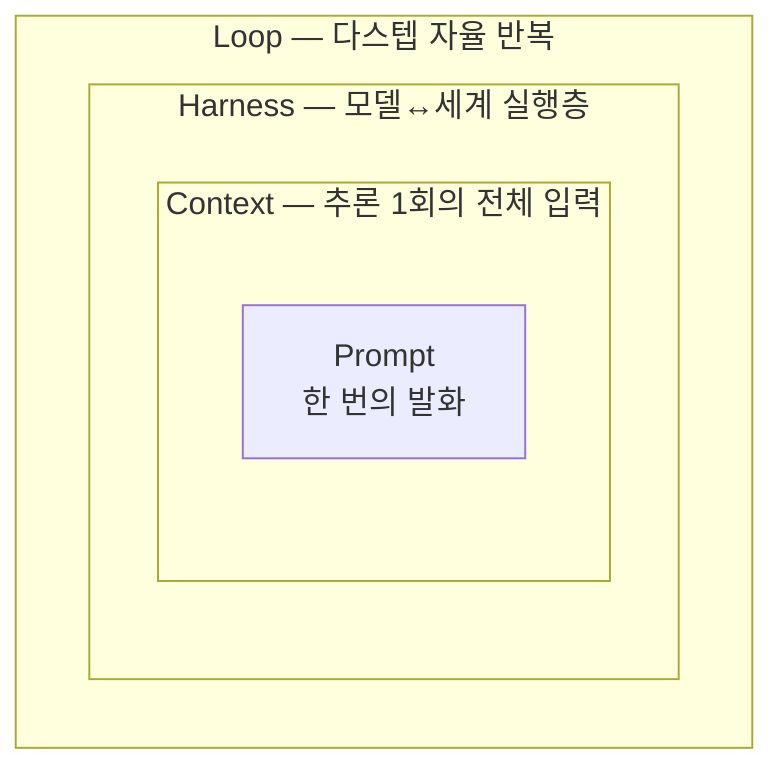

# 1장. 네 겹의 동심원 — 4대 엔지니어링의 지도를 먼저 펼친다

흔히 우리는 prompt·context·harness·loop engineering을 **난이도 순서**로 줄 세우려 한다. 프롬프트는 초보가 하는 것, 컨텍스트는 한 단계 위, 하네스와 루프는 고수의 영역 — 이런 식으로 말이다. 그런데 이 줄 세우기가 바로 혼란의 출발점이다.

사실 이 넷은 순서가 아니다. **줌 레벨**이다. 앞 장에서 같은 풍경을 줌 레벨만 바꿔 본다고 했는데, 이 장에서는 그 네 화면을 한 장의 지도 위에 나란히 올려보려 한다. 이 지도 한 장만 머리에 심어두면, 앞으로 이어질 장들이 각각 이 지도의 어느 칸을 확대하는 것인지가 또렷해진다.

## 네 개의 한 줄 정의, 네 개의 기억 장치

먼저 네 용어를 한꺼번에 펼쳐보자. 각 용어마다 한 문장 정의 하나와, 오래 붙잡고 갈 **한 줄 기억 장치** 하나를 짝지었다. 이 네 개의 짧은 문구가 이 책 전체를 관통한다 — 2장부터 5장까지 각 용어를 본격적으로 다룰 때 이 문구를 글자 그대로 다시 꺼내 확장할 것이고, 마지막 8장에서 네 문구를 다시 한자리에 모아 매듭짓는다. 그러니 지금은 외우려 애쓰기보다, 네 문장의 결이 서로 어떻게 다른지를 느끼는 데 집중하자.

**Prompt Engineering — "한 번의 대화를 최적화한다."**
모델에게 건네는 단일 지시를 잘 쓰는 기술이다. 무엇을, 어떤 형식으로, 어떤 예시와 함께 말할지를 다룬다. 가장 국소적이고, 가장 익숙하다.

**Context Engineering — "전체 정보 환경을 최적화한다. 프롬프트는 그중 일부일 뿐."**
한 번의 추론에 모델이 보는 입력 전체를 동적으로 큐레이션하는 일이다. 프롬프트만이 아니라 대화 이력·검색 결과·툴 출력·에이전트 상태까지 윈도에 들어가는 모든 토큰을 다룬다.

**Harness Engineering — "Agent = Model + Harness. 모델이 아니면 다 하네스다."**
모델을 실제로 행동하는 에이전트로 바꾸는 실행 시스템을 설계하는 일이다. 모델 호출, 툴 실행, 컨텍스트 관리, 에러 처리, 중단 조건, 안전장치 — 모델 자체를 뺀 나머지 전부가 여기에 속한다.

**Loop Engineering — "한 번의 지시가 아니라, 반복하는 시스템을 설계한다."**
에이전트가 act → observe → reason → repeat의 반복 사이클로 목표에 수렴하도록 만드는 일이다. 매번 직접 타이핑하는 대신, 루프가 알아서 프롬프트하게 만든다.

네 문장을 다시 훑어보자. 뭔가 느껴지는 게 있는가? 뒤로 갈수록 다루는 범위가 넓어진다. 한 번의 발화에서 시작해, 입력 전체로, 실행 시스템으로, 반복 전체로. 이게 우연이 아니다. 바로 이 책의 척추인 동심원 구조다.

## 동심원: 무엇이 무엇을 감싸는가

네 용어의 관계를 한 줄로 적으면 이렇다.

> **Loop ⊃ Harness ⊃ Context ⊃ Prompt**

가장 안쪽에 Prompt가 있고, 그것을 Context가 감싸고, 다시 Harness가, 다시 Loop가 감싼다. 그림으로 보면 더 분명하다.

그림 1. 네 겹의 동심원 — 안쪽일수록 국소적, 바깥쪽일수록 넓은 시스템

여기서 한 가지는 분명히 짚고 넘어가자. 이 동심원은 칼로 자르는 위계가 아니다. "프롬프트는 컨텍스트의 부하 직원"이라는 식의 딱딱한 상하관계가 아니라는 말이다. 그보다는 앞서 말한 줌 레벨, 즉 **관점의 차이**로 보는 편이 정확하다. 같은 작업을 두고도 "지금 나는 한 번의 발화를 다듬는 중인가, 아니면 윈도 전체를 큐레이션하는 중인가, 아니면 반복 시스템을 설계하는 중인가"를 의식적으로 구분하자는 것이다.

그래서 포함 관계도 느슨하다. 프롬프트 하나를 잘 쓰는 일은 컨텍스트 설계의 일부이지만, 컨텍스트를 잘 짠다고 프롬프트가 사라지는 건 아니다. 안쪽 원은 바깥쪽 원 안에서 여전히 살아 숨 쉰다. 러시아 인형을 떠올리면 쉽다. 가장 큰 인형을 열면 그 안에 더 작은 인형이, 또 그 안에 더 작은 인형이 들어 있다. 큰 인형을 손에 쥐었다고 해서 안쪽 인형이 사라진 건 아니다. 그저 바깥 인형에 감싸여 있을 뿐, 열어보면 멀쩡히 거기 있다. 동심원도 똑같다. 루프를 설계하는 순간에도 그 한가운데에는 여전히 한 줄의 프롬프트가 자리 잡고 있다.

이 점을 기억해두면, 7장에서 다룰 "prompt engineering은 죽었다" 같은 자극적인 주장 앞에서도 흔들리지 않을 수 있다. 안쪽 원이 바깥 원에 감싸였다고 해서 없어진 게 아니니까.

## 한 표로 정렬하기

같은 내용을 다른 각도, 즉 **추상화 계층**과 **최적화 대상**으로 한 번 더 정리해보자. 동심원이 공간적 그림이라면, 이 표는 각 용어가 "무엇을 손보는 일인가"를 또렷하게 갈라준다.

| 용어 | 추상화 계층 | 최적화 대상 | 한 줄 정의 |
|------|-----------|-----------|-----------|
| Prompt Eng. | 단일 발화 | 한 번의 지시 | 무엇을·어떻게 말할까 |
| Context Eng. | 추론 1회의 전체 입력 | 컨텍스트 윈도 전체 | 윈도에 무엇을 채울까 |
| Harness Eng. | 에이전트 실행 1스텝 | 모델↔세계 실행층 | 모델을 어떻게 행동하게 할까 |
| Loop Eng. | 다스텝 자율 반복 | 반복 사이클 전체 | 언제까지·어떻게 반복할까 |

표가 압축한 걸 한 줄씩 풀어보면 이렇다. 각 엔지니어링은 결국 서로 다른 질문을 던지는 일이다.

- **Prompt Engineering**은 "이 한 번을 어떻게 말할까?"를 묻는다. 모델에게 건넬 단 하나의 지시를 어떻게 벼릴지가 관심사다.
- **Context Engineering**은 "이 추론에 무엇을 같이 넣어줄까?"를 묻는다. 지시 한 줄을 넘어, 모델이 한 번에 보는 입력 전체를 무엇으로 채울지가 관심사다.
- **Harness Engineering**은 "모델이 실제로 무엇을 만지게 할까?"를 묻는다. 모델이 파일을 읽고, 명령을 실행하고, 결과를 받아 다음을 정하는 실행층이 관심사다.
- **Loop Engineering**은 "언제까지, 어떤 조건에서 반복할까?"를 묻는다. 한 번의 실행이 아니라 그 실행을 거듭 돌리는 사이클 전체가 관심사다.

표를 위에서 아래로 읽으면, 최적화 대상이 "한 번의 지시 → 윈도 전체 → 실행 한 스텝 → 반복 사이클 전체"로 점점 커지는 게 보인다. 동심원을 안에서 밖으로 한 겹씩 넓혀가는 것과 정확히 같은 움직임이다.

## 같은 작업, 네 개의 줌 레벨

아직 표와 그림이 좀 추상적으로 느껴질 수 있다. 하나의 구체적인 작업에 네 개의 줌 레벨을 차례로 대보면 한결 손에 잡힌다. "기존 프로젝트에 입력값 검증 로직을 추가하고 테스트까지 통과시킨다"는 작업을 맡았다고 해보자.

**Prompt 줌 레벨에서 보면**, 우리는 모델에게 건넬 한 문장을 다듬는다. "검증 추가해줘"가 아니라 "이메일·전화번호 필드에 형식 검증을 넣되, 실패 시 400과 함께 어떤 필드가 왜 틀렸는지 응답에 담아줘" 같은 식으로. 한 번의 지시를 정확하게 벼리는 것, 그게 이 줌 레벨의 일이다.

**Context 줌 레벨에서 보면**, 시야가 넓어진다. 그 지시 한 줄만으로는 모델이 우리 프로젝트의 검증 컨벤션을 알 길이 없다. 그래서 우리는 모델이 보는 입력 전체를 챙긴다. 어떤 검증 라이브러리를 쓰는지, 기존 에러 응답 포맷은 어떤지, 관련 파일은 어디 있는지 — 이런 정보를 윈도에 적절히 채워 넣는 일이다.

**Harness 줌 레벨에서 보면**, 또 한 걸음 물러난다. 이제는 모델이 코드를 제안하는 것을 넘어, 실제로 파일을 고치고 테스트를 돌려야 한다. 그러려면 모델이 파일을 읽고 쓸 수 있는 툴, 테스트를 실행할 수 있는 통로, 결과를 받아 다음 행동을 정하는 실행층이 필요하다. 모델 바깥의 이 실행 시스템이 하네스다.

**Loop 줌 레벨에서 보면**, 가장 멀리서 전체를 조망한다. 검증을 추가했더니 테스트가 깨졌다면? 모델이 결과를 관찰하고, 원인을 따져, 다시 고치고, 또 테스트를 돌린다. 이 "고치고-돌리고-확인하고-다시"의 반복을 언제까지, 어떤 조건에서 멈출지를 설계하는 것이 이 줌 레벨의 일이다.

같은 작업 하나인데, 어느 줌 레벨에서 보느냐에 따라 손볼 대상이 완전히 달라진다. 그리고 중요한 건, 이 넷이 **동시에 살아 있다**는 점이다. 루프를 돌리는 와중에도 그 안에서는 매 스텝마다 컨텍스트가 채워지고 프롬프트가 건네진다. 바깥 원이 안쪽 원을 대체하는 게 아니라, 감싼 채로 함께 돌아가는 것이다.

## 이 지도를 들고 떠나는 여정

이제 이 책이 어느 길로 갈지 감이 올 것이다. 책의 본체인 2장부터 5장까지는 동심원을 **안에서 밖으로** 한 겹씩 확대해 나간다. 가장 익숙한 Prompt(2장)에서 출발해, Context(3장)로 한 걸음 물러나고, Harness(4장)로 더 물러난 뒤, Loop(5장)에서 가장 멀리서 전체를 조망한다. 각 장은 그 용어 하나의 정의·기원·실습을 한 묶음으로 다루니, 어느 한 장만 따로 읽어도 그 용어는 끝낼 수 있다.

네 겹을 다 그린 다음에는 한 발 물러나 응용으로 넘어간다. 6장에서 네 겹이 실제 도구 안에서 어떻게 한꺼번에 구현되는지를 해부하고, 7장에서 현장의 뜨거운 논쟁들에 책의 입장을 세운 뒤, 8장에서 동심원을 처음부터 다시 그리며 매듭짓는다.

왜 가장 바깥의 Loop가 아니라 가장 안쪽의 Prompt부터 갈까? 당신이 이미 매일 하고 있는 일이기 때문이다. 손에 익은 곳에서 출발해야, 추상적인 용어들이 비로소 손에 잡힌다. 그 가장 안쪽 칸 — 한 번의 발화 — 에는, 매일 무심코 지나쳤을 뿐 생각보다 깊은 세계가 들어 있다.
