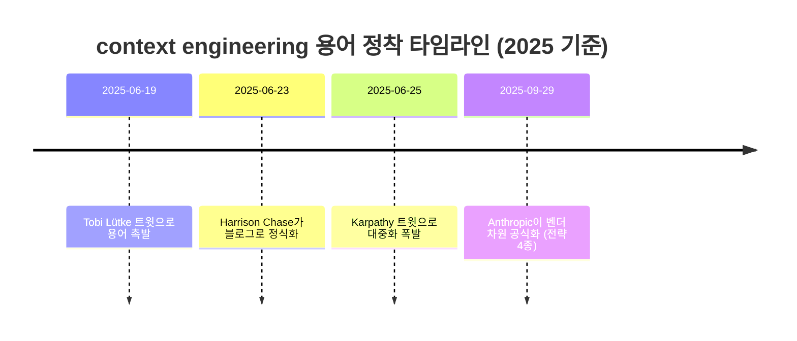

# 3장. 윈도에 무엇을 채울까 — Context Engineering

> "the delicate art and science of filling the context window with just the right information for the next step."
> — Andrej Karpathy (2025-06-25 기준)

다음 단계를 위해, 컨텍스트 윈도를 **딱 맞는 정보**로 채우는 섬세한 기예이자 과학. Karpathy가 이 한 문장을 트윗으로 던졌을 때, 사람들이 열광한 건 새로운 기술이 발표돼서가 아니다. 이미 모두가 어렴풋이 느끼던 일에 마침내 **이름이 붙었기** 때문이다.

생각해보자. 우리는 이미 매일 이 일을 하고 있다. 프롬프트만 쓰는 게 아니다. 어떤 파일을 열어 에이전트에게 보여줄지, `CLAUDE.md`에 무슨 규칙을 적어둘지, 긴 대화가 늘어지면 언제 새 세션을 열지 — 이 모든 선택이 사실은 "윈도에 무엇을 채울까"라는 하나의 질문이었다. 앞 장에서 우리는 가장 안쪽 원, 한 번의 발화를 벼렸다. 그리고 그 발화가 더 큰 그림의 작은 일부라는 복선을 남겨뒀다. 이제 그 한 겹 바깥, 컨텍스트 윈도 전체로 줌아웃해보자.

## "프롬프트는 그중 일부일 뿐"

1장의 지도에서 우리는 컨텍스트 엔지니어링에 한 줄 기억 장치를 붙여뒀다. 다시 글자 그대로 가져와보자.

> **전체 정보 환경을 최적화한다. 프롬프트는 그중 일부일 뿐.**

이 한 문장이 컨텍스트 엔지니어링의 전부라고 해도 과언이 아니다. 풀어보자. 프롬프트 엔지니어링이 "내가 지금 타이핑하는 이 한 문단을 어떻게 쓸까"였다면, 컨텍스트 엔지니어링은 그보다 훨씬 넓다. 모델이 다음 토큰을 추론하는 그 순간, **컨텍스트 윈도 안에 들어 있는 모든 토큰**이 대상이다. 내가 방금 친 지시문만이 아니다. 그 앞에 쌓인 대화 이력, 검색해서 끌어온 문서, 직전 툴이 뱉어낸 출력, 에이전트가 들고 있는 상태값 — 이 전부가 한 덩어리로 모델의 머릿속에 들어간다.

그러니까 프롬프트는 이 큰 그림의 한 조각이다. 중요한 조각이지만, 어디까지나 일부다. 프로덕션에서 돌아가는 에이전트를 떠올려보자. 사람이 직접 친 프롬프트는 전체 컨텍스트의 몇 퍼센트나 될까? 나머지 대부분은 시스템이 동적으로 조립한 것들이다. 검색 결과, 이전 단계의 작업 로그, 코드베이스에서 긁어온 함수 시그니처. 이 거대한 나머지를 어떻게 큐레이션하느냐 — 그게 컨텍스트 엔지니어링이다.

여기서 Anthropic의 정의를 빌려오면 한층 또렷해진다. Anthropic은 컨텍스트 엔지니어링을 "LLM 추론 중에 최적의 토큰(정보) 집합을 큐레이션하고 유지하는 전략의 집합"이라고 못 박았다 (2025-09-29 기준). 핵심 단어가 둘이다. 큐레이션과 유지. 한 번 잘 넣고 끝이 아니라, 추론이 진행되는 내내 좋은 상태로 관리해야 한다는 뜻이다.

## 한 사람이 아니라 네 사람이 같은 말을 했다

새로운 용어가 등장할 때 흔히 따라오는 의심이 있다. "또 누가 마케팅하려고 지어낸 신조어 아니야?" 충분히 들 수 있는 의심이다. 그런데 컨텍스트 엔지니어링은 조금 사정이 다르다. 비슷한 시기에, 서로 다른 위치에 있던 네 사람이 거의 같은 말을 했기 때문이다.

- **Tobi Lütke**(Shopify CEO): "the art of providing all the context for the task to be plausibly solvable by the LLM." — 작업이 그럴듯하게 풀릴 만큼의 컨텍스트를 모두 제공하는 기예.
- **Andrej Karpathy**: 앞서 본 "딱 맞는 정보로 채우는 섬세한 기예이자 과학."
- **Harrison Chase**(LangChain): "building dynamic systems to provide the right information and tools in the right format such that the LLM can plausibly accomplish the task." — 올바른 정보와 툴을, 올바른 형식으로, 동적으로 제공하는 시스템을 짓는 일.
- **Anthropic**: "추론 중 최적의 토큰 집합을 큐레이션·유지하는 전략."

표현은 제각각이지만 가리키는 손가락 끝은 한 점이다. "작업이 풀릴 만큼의 정보를, 딱 맞게, 동적으로." 한 사람의 주장이라면 유행어로 흘려들을 수도 있다. 그런데 CEO와 연구자와 프레임워크 제작자와 모델 회사가 각자의 자리에서 같은 결론에 도달했다면, 이건 누군가의 작명이 아니라 현장이 동시에 부딪힌 **실재하는 문제**라고 봐야 한다.

### 6일 사이에 벌어진 일

이 용어가 자리 잡은 과정은 유난히 빠르고 또렷해서, 타임라인으로 짚어둘 만하다.

그림 1. context engineering 용어의 6일과 그 후

6월 19일 Lütke가 트윗으로 불씨를 던지고, 나흘 뒤 Chase가 블로그로 개념을 정식화하고, 다시 이틀 뒤 Karpathy가 "+1 for context engineering"이라며 불을 붙였다. 단 6일 사이에 용어가 업계 공용어가 됐다. 그리고 9월 말, Anthropic이 엔지니어링 블로그로 전략 네 가지까지 갖춰 벤더 차원에서 공식화했다. 봄에 씨앗이 떨어져 가을에 제도가 된 셈이다.

왜 하필 2025년이었을까? 답은 도구의 변화에 있다. 그 무렵 코딩 에이전트들이 단발성 질의응답을 넘어 **여러 단계를 스스로 도는 시스템**으로 진화했다. 한 번 묻고 한 번 답받던 시절에는 프롬프트 한 줄만 잘 쓰면 됐다. 그런데 에이전트가 수십 번 툴을 호출하고, 그때마다 컨텍스트가 불어나기 시작하자, "윈도에 무엇을 어떻게 채울 것인가"가 갑자기 생사를 가르는 문제가 됐다. 용어는 그 절박함에 붙인 이름이다.

## 컨텍스트는 무한하지 않다

여기서 컨텍스트 엔지니어링의 가장 중요한 직관 하나로 들어가보자. 흔히 이렇게 생각하기 쉽다. "컨텍스트 윈도가 크면 클수록 좋은 거 아니야? 100만 토큰까지 넣을 수 있다는데, 일단 관련될 만한 건 다 넣자." 자연스러운 생각이다. 그런데 정말 그럴까?

물론 윈도가 크면 더 많이 담을 수는 있다. 하지만 담을 수 있다는 것과 담는 게 이롭다는 것은 전혀 다른 이야기다. 컨텍스트는 **유한 자원**처럼 다뤄야 한다. 토큰을 더 넣을수록 한계 효용이 줄어드는, 이른바 수확 체감(diminishing returns)이 작동하기 때문이다. 어느 지점을 넘어가면, 정보를 더 넣는 행위가 오히려 모델의 판단을 흐린다.

직관적으로 그려보자. 누군가에게 일을 부탁하는데 정작 필요한 한 페이지짜리 지시 대신 두꺼운 매뉴얼 열 권을 통째로 안겨준다고 해보자. 정보가 부족해서가 아니라 너무 많아서 핵심을 못 찾는 상황이 벌어진다. 모델도 똑같다. 관련 없는 토큰이 섞여 들수록 진짜 중요한 신호가 잡음에 묻힌다.

그래서 컨텍스트 엔지니어링의 본질은 "많이 넣기"가 아니라 **"딱 맞게 넣기"**다. Anthropic의 표현을 빌리면, **가장 작은 high-signal 토큰 집합**을 찾는 일이다. 신호가 가장 진하고 군더더기가 가장 적은, 그 최소 집합. 넣을 수 있는 최대치가 아니라, 작업을 풀어내는 데 꼭 필요한 최소치를 겨냥한다.

> 이 "딱 맞게"라는 직관은 감(感)에 기댄 조언처럼 들릴 수 있다. 하지만 여기엔 단단한 정량 근거가 있다. 입력이 길어질수록 모델 성능이 실제로 어떻게 무너지는지 — 그리고 그 무너지는 방식이 얼마나 반직관적인지 — 는 7장에서 숫자로 회수한다. 일단 여기서는 "길수록 좋은 게 아니다"라는 결론만 손에 쥐고 가자.

이 점을 기억해두자. 컨텍스트 엔지니어링을 잘한다는 건, 더 많이 넣을 줄 안다는 게 아니라 **무엇을 빼야 할지** 안다는 뜻에 가깝다.

## 그렇다면 무엇을 어떻게 채울까 — 네 가지 전략

원리는 알았다. "딱 맞게, 최소로." 그런데 막상 에이전트를 돌려보면 컨텍스트는 가만히 둬도 계속 불어난다. 단계를 거듭할수록 대화 이력이 쌓이고, 툴 출력이 누적되고, 어느새 윈도가 잡동사니로 가득 찬다. 이 불어남을 어떻게 다스릴까? Anthropic이 정리한 네 가지 전략을 살펴보자 (2025-09-29 기준).

### Compaction — 이력을 요약하고 다시 시작하기

긴 대화가 윈도를 잠식하기 시작하면, 지나온 이력을 통째로 들고 가는 대신 핵심만 요약해 압축한 뒤 그 요약본으로 새로 출발한다. 사람으로 치면, 길어진 회의 중간에 "지금까지 정한 것 세 줄로 정리하고 다시 가자"라고 끊는 것과 같다. 원본 수천 토큰이 요약 수백 토큰으로 줄어들면, 남은 공간을 더 중요한 일에 쓸 수 있다.

### Structured Note-Taking — 컨텍스트 밖에 메모를 남기기

모든 걸 컨텍스트 윈도 안에서 기억하려 들면 금세 한계에 부딪힌다. 그래서 윈도 바깥에 노트를 남긴다. 진행 상황, 결정 사항, 다음에 할 일을 파일에 적어두고, 필요할 때만 다시 불러온다. 윈도는 휘발성 작업 기억이고, 노트는 영속적 외장 기억인 셈이다. 컨텍스트가 압축되거나 세션이 바뀌어도, 노트에 적어둔 것은 사라지지 않는다.

### Sub-Agents — 깨끗한 컨텍스트에 일을 맡기기

특정 작업을 통째로 떼어, 깨끗한 별도 컨텍스트 윈도를 가진 서브 에이전트에게 맡긴다. 그 서브 에이전트는 자기만의 윈도에서 마음껏 탐색하고 시행착오를 겪은 뒤, 메인 에이전트에게는 결과 요약만 돌려준다. 그 과정에서 발생한 잡다한 중간 토큰은 메인 윈도를 더럽히지 않는다. 더러워지는 일을 격리된 방에서 처리하고, 깨끗한 결과만 받는 구조다.

### Just-in-Time — 미리 다 넣지 말고, 필요할 때 가져오기

처음부터 모든 정보를 윈도에 쏟아붓는 대신, 식별자(경로·링크·쿼리)만 들고 있다가 정작 필요한 순간에 동적으로 로드한다. 파일 전체를 미리 컨텍스트에 욱여넣는 게 아니라, "이 파일이 여기 있다"는 사실만 알아두고 실제 내용은 그 파일을 읽어야 하는 시점에 가져오는 식이다. 미리 다 안고 가면 무겁고, 막상 안 쓰면 낭비다. 그러니 제때, 딱 필요한 만큼만.

네 전략을 한 줄로 꿰면 이렇다. **부풀면 줄이고(Compaction), 잊을 것 같으면 밖에 적고(Note-Taking), 더러워질 일은 격리하고(Sub-Agents), 미리 다 넣지 말고 제때 가져온다(Just-in-Time).** 표현은 넷이지만 모두 같은 목표를 향한다 — 윈도를 가장 작은 high-signal 집합으로 유지하기.

## 매일 만지는 그 파일이 컨텍스트 엔지니어링이다

여기까지는 다소 추상적으로 들릴 수 있다. 그런데 사실 우리는 이미 컨텍스트 엔지니어링의 가장 기본적인 형태를 매일 손으로 하고 있다. 바로 프로젝트 규칙을 파일로 영속화하는 일이다.

Claude Code를 쓴다면 `CLAUDE.md`를, Codex를 쓴다면 `AGENTS.md`를, Gemini CLI를 쓴다면 `GEMINI.md`를 만져봤을 것이다. 이 파일들의 정체가 뭘까? 이름은 도구마다 다르지만 컨셉은 거의 같다. 에이전트가 매번 추론할 때 함께 따라 들어가는, 영속적인 컨텍스트다. 이 프로젝트의 빌드 명령은 무엇인지, 코딩 컨벤션은 어떤지, 절대 건드리면 안 되는 영역은 어디인지 — 이런 규칙을 파일에 적어두면, 세션을 새로 열어도 매번 똑같이 입력하지 않아도 된다.

이게 왜 컨텍스트 엔지니어링일까? 다시 정의로 돌아가보자. "전체 정보 환경을 최적화한다." `CLAUDE.md`에 한 줄을 적는 행위는, 곧 모델의 추론 윈도에 무엇을 상시 올려둘지 결정하는 행위다. 좋은 규칙을 적으면 매 추론의 신호가 강해지고, 잡다한 규칙을 잔뜩 적으면 — 짐작했겠지만 — 오히려 윈도를 잡음으로 채우는 셈이 된다. "딱 맞게"의 원리가 여기서도 그대로 작동한다.

그러니 다음에 `CLAUDE.md`나 `AGENTS.md`를 열거든, 그냥 메모장에 끄적이듯 적지 말자. **이 한 줄이 앞으로 모든 추론에 따라 들어갈 가치가 있는가?** 이 질문을 한 번 던져보는 것만으로도, 당신은 이미 컨텍스트 엔지니어링을 의식적으로 하고 있는 것이다.

> 도구마다 이 파일의 이름과 세부 동작은 조금씩 다르고, 빠르게 바뀐다. 정확한 파일명·로드 규칙은 각 도구의 공식 문서를 함께 확인하자. 여기서 중요한 건 파일명이 아니라 컨셉 — "프로젝트 규칙을 영속 컨텍스트로 박아둔다"는 발상이다.

---

컨텍스트 엔지니어링을 한 문장으로 다시 줄이면, "전체 정보 환경을 최적화한다. 프롬프트는 그중 일부일 뿐"이다. 그리고 그 최적화의 방향은 한결같이 **많이가 아니라 딱 맞게**였다. 부풀면 줄이고, 잊을 것 같으면 밖에 적고, 더러워질 일은 격리하고, 미리 다 넣지 말 것.

그런데 여기까지 오면 한 가지가 묘하게 비어 있다. 우리는 줄곧 "윈도에 무엇을 채울까"만 이야기했다. 정작 그 컨텍스트를 모델에게 떠먹이고, 툴을 실행하고, 결과를 받아 다음 입력으로 조립하는 — **채워 넣는 손 자체**는 누구일까? 컨텍스트가 "무엇"의 이야기였다면, 그 손은 "어떻게"의 이야기다. 그리고 그 손에도 이름이 있다.
