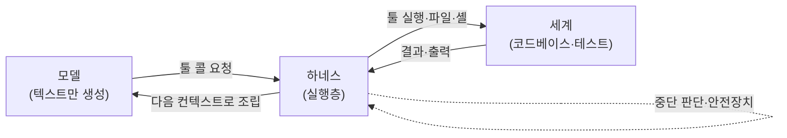

# 4장. 모델을 세상에 닿게 하다 — Harness Engineering

똑같은 모델인데, 인터페이스만 바꿨더니 성능이 갈렸다.

2024년 SWE-agent 논문이 보인 게 정확히 이것이다. 모델은 그대로 두고 — 모델이 코드베이스를 어떻게 보고, 어떻게 명령을 내리고, 어떤 형태로 결과를 돌려받는지, 그 **인터페이스만** 손봤더니 실제 GitHub 이슈를 자동으로 고쳐내는 비율이 달라졌다. 당시 이 접근으로 SWE-bench라는 벤치마크에서 pass@1 12.5%를 기록했다 (2024 기준). 지금 눈으로 보면 낮아 보이는 숫자지만, 핵심은 점수 자체가 아니다. **모델을 한 글자도 안 바꿔도, 모델을 둘러싼 무언가를 바꾸면 결과가 달라진다**는 사실이다.

그 "둘러싼 무언가"에 이름이 있다. 하네스(harness)다. 앞 장에서 우리는 한 번의 추론에 무엇을 채울지를 다뤘다. 그런데 그 컨텍스트를 실제로 채워 넣고, 모델을 호출하고, 모델이 내놓은 결정을 진짜 행동으로 옮기는 손이 따로 있었다. 그 손이 바로 하네스다. 이번엔 그 손 안으로 들어가보자.

## "Agent = Model + Harness"

1장의 지도에서 하네스 엔지니어링에 붙여둔 기억 장치를 다시 글자 그대로 꺼내보자.

> **Agent = Model + Harness.** 모델이 아니면 다 하네스다.

이 짧은 등식이 하네스를 이해하는 가장 빠른 길이다. 우리가 흔히 "AI 에이전트"라고 부르는 것을 분해해보자. 거기엔 두 덩어리가 있다. 하나는 모델 — GPT든 Claude든, 텍스트를 받아 다음 텍스트를 추론하는 그 신경망 덩어리다. 그런데 모델 혼자서는 아무것도 못 한다. 파일을 읽지도, 명령을 실행하지도, 테스트를 돌리지도 못한다. 모델이 할 수 있는 일은 오직 하나, **텍스트를 내놓는 것**뿐이다.

그렇다면 그 텍스트를 받아 실제 세계에서 무언가를 일어나게 하는 건 누구일까? 바로 나머지 전부, 하네스다. 모델이 "이 파일을 읽어라"라는 텍스트를 내놓으면, 그 텍스트를 해석해 실제로 파일을 읽어다 주는 코드. 모델이 "테스트를 돌려라"라고 하면 실제로 셸 명령을 실행하고 그 출력을 다시 모델에게 먹여주는 코드. 그리고 언제 멈출지, 에러가 나면 어떻게 복구할지, 위험한 명령은 어떻게 막을지 — 이 모든 판단을 내리는 코드. 그게 전부 하네스다.

Hugging Face의 글로서리는 하네스를 이렇게 정의한다 (2026-05-25 기준). "에이전트 내부의 실행층 — 모델을 호출하고, 모델의 툴 콜을 처리하고, 언제 멈출지 결정한다." 다른 비유도 있다. "언어 모델과 실제 세계 사이의 모든 것. 하네스가 그 텍스트가 무엇을 건드릴 수 있는지를 결정한다." 모델이 아무리 똑똑한 말을 해도, 그 말이 무엇에 닿을 수 있는지는 하네스가 정한다. 모델은 두뇌고, 하네스는 그 두뇌에 달린 손과 발이자 안전벨트인 셈이다.

이 등식이 강력한 이유는, 복잡해 보이는 에이전트 도구를 깔끔하게 둘로 가를 수 있게 해주기 때문이다. 무언가가 헷갈릴 때마다 물어보자. "이게 모델이 하는 일인가, 아니면 모델을 둘러싼 코드가 하는 일인가?" 모델이 아니면, 답은 정해져 있다. 다 하네스다.

## 스캐폴드와 하네스는 다르다

여기서 이 책이 바로잡고 싶은 한 가지가 있다. 현장에서 **스캐폴드(scaffold)**와 **하네스(harness)**가 자주 같은 말처럼 쓰인다. 둘 다 "모델을 둘러싼 무언가"를 가리키니 헷갈릴 만도 하다. 하지만 둘은 다르다. 그리고 이 둘을 구분할 줄 알면, 에이전트 시스템을 훨씬 또렷하게 볼 수 있다.

가장 간단한 구분은 이렇다.

- **스캐폴드는 모델이 *무엇*을 보는가를 정한다.** 시스템 프롬프트, 툴 설명, 출력을 파싱하는 방식, 기억 구조 — 모델의 눈앞에 무엇이 놓이는지를 설계하는 층이다. 행동을 *정의*하는 층이라고 봐도 좋다.
- **하네스는 모델이 *어떻게* 실행하는가를 정한다.** 실제로 모델을 호출하고, 모델이 요청한 툴 콜을 받아 실행하고, 언제 루프를 멈출지 결정하는 층이다. 행동을 *실행*하는 층이다.

비유를 들어보자. 연극 무대를 떠올리면 쉽다. 스캐폴드는 **대본과 무대 세트**다. 배우(모델)에게 "당신은 이런 역할이고, 무대엔 이런 소품이 있고, 대사는 이렇게 받는다"를 일러주는 부분. 하네스는 **무대 감독과 조명·음향 시스템**이다. 실제로 막을 올리고, 배우가 신호를 보내면 조명을 켜고, 공연이 끝나면 막을 내리는 부분. 대본을 아무리 잘 써도(스캐폴드) 무대를 실제로 돌리는 장치(하네스)가 없으면 공연은 일어나지 않는다.

물론 실무에서 이 둘은 한 도구 안에 뒤섞여 있어서 칼로 자르듯 분리되지는 않는다. 하지만 구분의 가치는 분리 자체가 아니라 **진단**에 있다. 에이전트가 엉뚱한 짓을 할 때, 문제가 "모델이 잘못된 걸 보고 있어서(스캐폴드)"인지 "보긴 제대로 봤는데 실행·중단 처리가 엉켜서(하네스)"인지를 가를 수 있으면, 어디를 고쳐야 할지가 명확해진다. 헷갈리는 두 단어를 그냥 섞어 쓰면 이 진단력이 통째로 사라진다. 그러니 이 구분만큼은 기억해두자.

## 하네스는 어디서 왔나 — 두 편의 논문

하네스 엔지니어링이라는 *용어* 자체는 최근에 자리 잡았지만, 그것이 가리키는 *현상*은 그보다 먼저 학술 무대에서 입증됐다. 두 편의 논문이 하네스의 뿌리를 이룬다.

첫째는 앞서 오프닝에서 본 **SWE-agent**다 (Yang et al., 2024). 이 논문의 핵심 개념이 ACI, 즉 Agent-Computer Interface다. 사람이 쓰기 좋은 인터페이스(GUI, 화려한 IDE)와 모델이 쓰기 좋은 인터페이스는 다르다는 통찰이다. 모델에게는 군더더기 없이 명확한 명령과 간결한 출력이 더 잘 맞는다. 그래서 SWE-agent는 모델 전용 인터페이스를 따로 설계했고, 그 결과 "인터페이스 설계가 곧 성능"이라는 명제를 실증했다. 이게 오늘날 하네스 엔지니어링이 "모델이 쓰기 좋은 인터페이스를 짓는 일"을 핵심으로 두는 학술적 근거다.

둘째는 **Toolformer**다 (Schick et al., 2023). 이 논문은 한 발 더 안쪽을 짚는다. 왜 하네스는 하필 "툴 실행"을 그토록 중요한 컴포넌트로 둘까? Toolformer는 모델이 스스로 외부 툴을 언제 어떻게 호출할지를 학습할 수 있다는 걸 보였다. 모델이 텍스트 생성 도중에 "여기서 계산기를 부르자", "여기서 검색을 하자"를 스스로 끼워 넣도록 학습한 것이다. 모델 자체가 툴을 부르는 쪽으로 진화하고 있다면, 그 툴 콜을 받아 실제로 실행해주는 층 — 즉 하네스의 툴 실행 층 — 은 선택이 아니라 필연이 된다. Toolformer는 하네스가 왜 "툴 실행"을 심장에 두는지, 그 한 문장짜리 근거인 셈이다.

정리하면, SWE-agent는 "어떻게 보여줄 것인가(인터페이스)"의 뿌리고, Toolformer는 "왜 실행이 핵심인가(툴 콜)"의 뿌리다. 용어는 새것이어도, 그 아래 깔린 현상은 이렇게 단단한 학술적 지반 위에 서 있다.

## 내 도구를 하네스의 눈으로 분해하기

이제 추상을 손에 잡히는 것으로 바꿔보자. 매일 쓰는 도구를 하네스의 눈으로 다시 보면 어떻게 보일까? Claude Code를 예로 들어보자. 표면적으로는 그냥 "AI가 코드를 짜주는 터미널 도구"지만, 하네스 관점으로 분해하면 세 가지 장치가 또렷이 드러난다.

먼저 **Hooks**다. 특정 이벤트가 일어날 때 자동으로 끼어드는 핸들러다. 가령 모델이 파일을 수정하기 직전(PreToolUse)이나 직후(PostToolUse)에 린트를 돌리거나, 보안 검사를 강제하거나, 포맷을 자동으로 맞추게 할 수 있다. 이게 왜 하네스일까? 모델이 하는 일이 아니라 모델을 둘러싼 실행 흐름에 안전장치와 자동화를 끼워 넣는 일이기 때문이다. "모델이 아니면 다 하네스"라는 등식이 여기서 바로 적용된다.

다음은 **Subagents**다. 앞 장에서 컨텍스트 전략으로 만난 그 서브 에이전트가, 하네스 관점에서는 컨텍스트 격리 장치로 보인다. 별도의 깨끗한 컨텍스트 윈도에서 작업을 처리하고 요약만 돌려주는 이 구조는, 누가 만들어 돌리고 그 결과를 어떻게 메인 루프에 합칠지를 정하는 — 전형적인 실행층의 일이다.

마지막은 **MCP**(Model Context Protocol)다. 외부 툴과 데이터 소스를 모델에 연결하는 표준 통로다. 모델이 닿을 수 있는 세계의 범위를 넓히는 장치이니, "텍스트가 무엇을 건드릴 수 있는지를 결정한다"는 하네스의 정의에 정확히 들어맞는다. MCP 없이는 모델의 세계가 도구가 기본으로 쥐여준 것들로 한정되지만, MCP를 붙이면 사내 위키든 이슈 트래커든 데이터베이스든 모델의 손이 닿는 반경이 넓어진다. 손의 길이를 늘리는 일 — 이것도 모델이 하는 일이 아니라 모델을 둘러싼 실행층이 하는 일이다.

세 장치를 한자리에 두고 보면 공통점이 보인다. 셋 다 모델 바깥에 있고, 셋 다 "모델이 한 말을 실제 행동으로 옮기는 길목"에 자리한다. Hooks는 그 길목에 검문소를 세우고, Subagents는 길을 따로 내어 격리하고, MCP는 길이 닿는 범위를 넓힌다. 이름과 역할은 달라도 전부 하네스라는 한 우산 아래 있다.

세 장치를 ACI의 교훈으로 한 번 더 꿰어보자. 핵심은 언제나 **모델이 쓰기 좋게** 만드는 것이다. 훅이 던지는 에러 메시지가 장황하면 모델이 헷갈리고, 툴 설명이 모호하면 모델이 엉뚱한 걸 부른다. 인터페이스가 명확하고 간결할수록 같은 모델이 더 잘 일한다 — SWE-agent가 실증한 그 명제가, 내 손끝의 도구 설정에서도 똑같이 작동한다. 그러니 훅 하나, 툴 설명 한 줄을 손볼 때도 "사람이 보기 좋은가"가 아니라 "모델이 쓰기 좋은가"를 먼저 물어보는 편이 낫다.

> 도구마다 이 장치들의 이름과 세부 동작은 다르고, 빠르게 바뀐다. 여기서 든 Hooks·Subagents·MCP는 Claude Code의 사례일 뿐, 다른 도구에는 다른 이름의 비슷한 장치가 있다. 정확한 설정 방법은 각 도구의 공식 문서를 함께 확인하자. 변하지 않는 건 분류의 눈 — "이건 모델인가, 하네스인가"다.

그림 1. 모델 ↔ 하네스 ↔ 세계의 실행 흐름

이 그림을 한 바퀴 따라가보자. 모델은 텍스트(툴 콜 요청)만 내놓는다. 하네스가 그걸 받아 실제 세계에서 파일을 읽고 셸을 돌린다. 세계가 돌려준 결과를 하네스가 다시 다음 추론의 컨텍스트로 조립해 모델에게 먹인다. 그리고 그 와중에 "이제 멈출 때인가, 위험한 명령은 아닌가"를 끊임없이 판단한다. 모델은 이 원의 한 점일 뿐이고, 나머지 원 전체가 하네스다.

### 이 장의 핵심

- **Agent = Model + Harness.** 모델이 아니면 다 하네스다 — 호출·툴 실행·컨텍스트 조립·에러 처리·중단 판단·안전장치 전부.
- **스캐폴드(무엇을 보는가) ≠ 하네스(어떻게 실행하는가).** 둘을 가를 줄 알면 에이전트가 엉킬 때 어디를 고쳐야 할지가 보인다.
- 하네스의 학술 뿌리는 **SWE-agent의 ACI**("인터페이스 설계가 곧 성능")와 **Toolformer**("모델이 스스로 툴을 부른다 → 툴 실행층은 필연").
- 내 도구의 Hooks·Subagents·MCP는 전부 하네스다. 손볼 때 기준은 "사람이 보기 좋은가"가 아니라 **"모델이 쓰기 좋은가"**.

---

다시 등식으로 돌아가자. Agent = Model + Harness. 모델이 아니면 다 하네스다. 그리고 그 "다 하네스"는 호출·툴 실행·컨텍스트 조립·에러 처리·중단 판단·안전장치를 모두 품는다. 스캐폴드(무엇을 보는가)와 하네스(어떻게 실행하는가)를 가를 줄 알면, 도구가 엉킬 때 어디를 들여다봐야 할지가 보인다.

자, 그러면 당장 오늘 시험해볼 게 하나 생긴다. 지금 켜둔 도구의 설정을 열어, 눈에 띄는 기능 하나를 골라 물어보자. **"이건 모델이 하는 일인가, 하네스가 하는 일인가?"** 훅이라면 십중팔구 하네스다. 그 한 번의 분류가 익숙해지면, 도구 전체가 다르게 보이기 시작한다.

그런데 방금 그림에서 한 가지가 슬쩍 지나갔다. 하네스가 결과를 받아 "다음 컨텍스트로 조립"하고, 다시 모델을 부르고, 또 받고… 이 화살표가 한 바퀴로 끝나지 않고 **계속 돌고 있었다**. 모델을 한 번 부르는 게 아니라 목표에 닿을 때까지 반복해서 부르는 그 회전은 누가, 어떤 규칙으로 돌리는 걸까? 그 회전 자체를 설계하는 데에도 고유한 이름이 붙어 있다.
