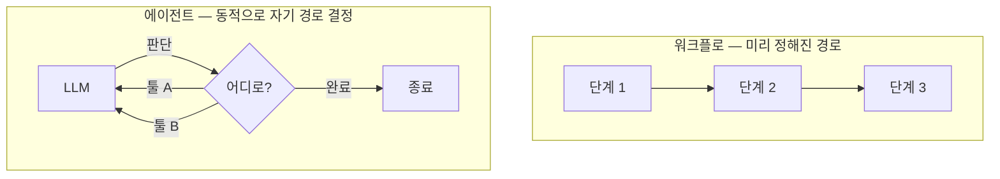

<!-- 개정: 2026-06-10 5장 전면 재저술 (v1.1.0) — loop engineering 빈약 피드백 대응. Osmani 1차 출처(2026-06-07) 기반 8개 신규 요소 융합. style-guardian·fact-checker 합의 반영. -->
# 5장. 반복하는 시스템을 설계하다 — Loop Engineering

금요일 밤이다. 타임라인을 넘기다 "while 루프 하나로 자동으로 다 짜준다"는 트윗을 봤다고 해보자. 영상 속 화면에서는 에이전트가 혼자 코드를 쓰고, 테스트를 돌리고, 실패하면 다시 고치고, 또 돌린다. 사람은 손도 안 댄다. 솔깃하다. 나도 한번 해볼까 싶어 YOLO 모드를 켜고, 회사 레포에 "이 기능 완성해줘"를 던져두고 잠들고 싶어진다.

잠깐 멈춰서 생각해보자. 정말 그래도 될까? 아침에 일어나면 깔끔하게 완성된 PR이 기다리고 있을까, 아니면 끝없이 같은 자리를 맴돈 수백 번의 커밋과 청구서가 기다리고 있을까? 이 장은 그 트윗이 보여준 마법 — 에이전트가 스스로 반복하며 목표에 수렴하는 일 — 의 정체를 분해한다. 그리고 더 중요하게는, 그 마법을 하나의 **엔지니어링 분과**로 다루는 법, 그러니까 "맡기되 가드레일을 친다"의 설계를 익힌다.

## "반복하는 시스템을 설계한다"

1장의 지도에서 루프 엔지니어링에 붙여둔 기억 장치를 다시 글자 그대로 가져오자.

> **한 번의 지시가 아니라, 반복하는 시스템을 설계한다.**

지금까지 우리는 안에서 밖으로 한 겹씩 나왔다. 한 번의 발화(프롬프트), 한 번의 추론에 들어가는 전체 입력(컨텍스트), 그 추론을 실제 행동으로 옮기는 실행층(하네스). 그런데 앞 장 끝에서 화살표가 한 바퀴로 끝나지 않고 계속 돌고 있었다. 모델을 부르고, 결과를 받고, 다음 입력을 조립해 다시 부르고… 이 회전을 목표에 닿을 때까지 설계하는 일이 루프 엔지니어링이다. 에이전트가 act → observe → reason → repeat의 반복 사이클로 목표에 수렴하도록 만드는 일 — 매번 직접 타이핑하는 대신, 루프가 알아서 프롬프트하게 만든다.

이 "루프가 알아서 프롬프트하게 만든다"는 한 줄을, 2026년 들어 한 사람이 정확한 문장으로 못 박았다. 구글 크롬 엔지니어링 리드인 Addy Osmani가 「Loop Engineering」(2026-06-07 기준)에서 내린 정의다.

> "Loop engineering is replacing yourself as the person who prompts the agent. You design the system that does it instead."

직역하면 이렇다. 루프 엔지니어링은 에이전트에게 프롬프트를 넣는 사람의 자리에서 나 자신을 빼내는 일이다. 대신 그 일을 해주는 시스템을 설계한다. 그가 덧붙인 루프의 정의도 함께 보자. "목적(purpose)을 정해두면 AI가 완료될 때까지 반복하는 재귀적 목표"라는 것이다 (2026-06 기준). 1장에서 적어둔 기억 장치 그대로다 — 한 번의 지시가 아니라, 반복하는 시스템.

### 이름은 새로 붙었지만, 현상은 먼저 있었다

흥미로운 건 이 용어의 계보다. "loop engineering"이라는 명사구 자체는 Osmani가 붙이고 퍼뜨렸지만, 그의 글은 두 사람의 발언 위에 세워졌다. 먼저 Peter Steinberger가 "이제 코딩 에이전트에게 프롬프트하지 말고, 에이전트에게 프롬프트를 넣어줄 루프를 설계하라"며 불을 댕겼다 (2026 기준). 그다음 Anthropic에서 Claude Code를 책임지는 Boris Cherny가 이를 증폭했다 — Osmani가 인용한 그의 말은 "나는 더 이상 Claude에게 직접 프롬프트하지 않는다, 내 일은 루프를 쓰는 것이다"였다.

촉발(Steinberger) → 증폭(Cherny) → 명명(Osmani). 어디서 본 모양 아닌가? 3장에서 만난 컨텍스트 엔지니어링의 계보 — Lütke가 촉발하고, Karpathy가 대중화하고, Anthropic이 공식화한 — 와 정확히 똑같은 3단 패턴이다. 새 이름이 붙기 전에 현상이 먼저 자라고, 누군가 그 현상에 이름을 달면 비로소 하나의 분과가 된다. 그러니 "또 무슨 ~engineering이야"라고 피곤해할 필요는 없다. 이름은 새것이지만, 가리키는 일은 우리가 이미 매일 하던 일이다.

> 학술적 원형은 더 이르다 — 2022년 ReAct가 "추론과 행동을 교차하는 루프"(reason → act → observe → repeat)를 이미 제시했다. Osmani의 정의는 이 학술 사이클을 "사람을 루프 밖으로 빼는 설계"라는 실무 언어로 옮긴 셈이다.

## inner loop와 outer loop — 무엇이 하드코딩이고 무엇이 설계인가

여기서 한 가지 구분을 짚고 가야 길을 잃지 않는다. 루프라고 다 같은 루프가 아니다. Philipp Schmid는 이를 **inner loop**와 **outer loop**로 갈랐다 (2026-02-20 기준).

inner loop는 "한 작업 안에서, 에이전트가 사용자에게 텍스트로 답하기 전까지 벌어지는 일"이다. 모델이 툴을 부르고, 결과를 보고, 다시 추론하는 그 한 묶음. outer loop는 "여러 턴·세션에 걸쳐, 시간을 두고 사용자와 에이전트 사이에서 벌어지는 일"이다. 그가 남긴 한 줄이 핵심을 찌른다.

> "The loop is hardcoded. What the model does inside the loop is not."
> (루프는 하드코딩돼 있다. 루프 안에서 모델이 하는 행동은 그렇지 않다.)

무슨 뜻일까? inner loop, 즉 "툴 부르고-결과 보고-다시 추론하는" 그 골격은 4장에서 본 하네스가 이미 짜놓았다. 우리가 매번 코드로 짤 필요가 없다. 그렇다면 루프 엔지니어링이 설계하는 건 어디일까? 바로 **outer loop**다. 무슨 일을 찾아오고, 언제 멈추고, 무엇을 기록해 다음으로 넘길지 — 세션과 세션 사이를 엮는 바깥 회전. Osmani의 정의로 돌아가면, "에이전트에게 프롬프트를 넣는 사람의 자리에서 나를 빼낸다"는 건 결국 이 outer loop를 손수 설계한다는 말이다.

## 루프는 무엇으로 이루어지는가 — 하네스 위에 한 겹 더

그렇다면 outer loop를 설계한다는 건 구체적으로 무엇을 조립하는 일일까? Osmani는 루프가 돌아가려면 몇 가지가 필요하다고 했다. 그가 꼽은 목록을 옮기면 이렇다.

- **Automations** — 스케줄에 맞춰 알아서 일을 발견하고 분류하는 자동화.
- **Worktrees** — 두 에이전트가 병렬로 일해도 서로 발을 밟지 않게 격리하는 작업 공간.
- **Skills** — 에이전트가 그냥 추측하고 말 프로젝트 지식을 미리 적어두는 장치.
- **Plugins/Connectors** — 에이전트를 내가 이미 쓰는 도구들에 꽂아주는 연결부.
- **Sub-agents** — "하나가 아이디어를 내면, 다른 하나가 그걸 검사하도록" 나눈 서브에이전트.
- 그리고 하나 더, **State/Memory** — "마크다운 파일이든 Linear 보드든, 단일 대화 바깥에 살면서 무엇이 끝났고 무엇이 남았는지를 쥐고 있는" 상태 저장소.

이 목록을 보고 뭔가 눈치챘는가? 워크트리·스킬·플러그인·서브에이전트 — 전부 4장에서 하네스의 구성요소로 만났던 것들이다. 그래서 루프는 하네스를 부정하지 않는다. **하네스 요소들을 스케줄·검증·상태로 한 번 더 엮어, 사람이 매 턴 프롬프트하지 않아도 돌아가게 만든 것** — 그게 루프다. 1장에서 그린 동심원 `Loop ⊃ Harness`가 여기서 손에 잡힌다. 루프는 하네스를 감싸는 바깥 원이지, 다른 동네의 별개 기술이 아니다.

## 정말 루프가 필요한가 — Workflow vs Agent

자, 이제 가장 중요한 질문을 던질 차례다. 모든 일을 자율 루프로 돌려야 할까? 답부터 말하면, 아니다. 그리고 이 "아니다"를 이해하는 게 루프 엔지니어링의 절반이다.

Anthropic은 「Building Effective Agents」에서 두 가지를 또렷이 갈랐다 (2024-12 기준). 하나는 **워크플로(workflow)** — LLM과 툴이 미리 정해진 코드 경로를 따라 움직이는 구조다. 다른 하나는 **에이전트(agent)** — LLM이 자기 프로세스를 동적으로 스스로 지휘하며, 어떤 툴을 언제 쓸지를 그때그때 판단하는 구조다.

차이를 그림으로 보자.


그림 1. 워크플로와 에이전트 — 경로를 누가 정하는가

워크플로는 레일이 깔린 기차다. 어디로 갈지가 미리 정해져 있고, 그 위를 안정적으로 달린다. 에이전트는 운전대를 쥔 자동차다. 매 순간 어디로 갈지 스스로 정한다. 자유롭지만, 그만큼 엉뚱한 길로 빠질 여지도 크다.

그래서 "어디까지 맡겨도 되나"라는 질문은, 사실 "이건 워크플로로 충분한가, 진짜 에이전트가 필요한가?"라는 질문과 같다. 경로가 뻔히 정해진 일을 굳이 에이전트에게 자유 재량으로 맡기면, 통제는 잃고 비용만 늘어난다. 반대로 매번 상황이 달라 경로를 미리 그릴 수 없는 일이라면, 그제야 자율 에이전트가 빛난다. Anthropic이 이 글에서 천명한 원칙이 바로 이것이다. **가장 단순한 해법부터 시작하고, 필요할 때만 복잡도를 올려라.** 이 원칙은 책 마지막 장의 종합 사고 프레임워크에서 1번 질문으로 다시 끌어올린다 — "정말 루프(에이전트)가 필요한가?"

### 다섯 가지 워크플로 패턴, 그리고 루프 패턴

Anthropic은 같은 글에서 자주 쓰이는 워크플로·에이전트 패턴 다섯 가지를 정리했다. 그리고 우리 레퍼런스에는 루프 패턴이 따로 정리돼 있다. 둘을 나란히 놓고 보면, 서로 다른 이름으로 같은 구조를 가리키는 경우가 많다는 게 보인다. 매핑해보자.

| Anthropic 5패턴 | 무엇인가 | 루프 패턴과의 대응 |
|------------------|---------|------------------|
| Prompt chaining | 출력을 다음 입력으로 직렬 연결 | 단순 retry/순차 진행의 골격 |
| Routing | 입력을 분류해 알맞은 경로로 보냄 | explore-narrow(탐색 후 좁히기)의 분기 |
| Parallelization | 여러 작업을 병렬로 쪼개 처리 | 서브에이전트 병렬 실행 |
| Orchestrator-workers | 지휘자가 작업을 쪼개 일꾼에게 분배 | plan-execute(계획 후 실행) 구조 |
| Evaluator-optimizer | 생성 → 평가 → 개선을 반복 | **plan-execute-verify**와 거의 같음 |

특히 눈여겨볼 짝이 둘이다. 첫째, **plan-execute-verify ≈ evaluator-optimizer**다. 계획을 세우고, 실행하고, 그 결과를 스스로 검증해 다시 고치는 흐름 — 이게 루프 엔지니어링의 가장 실용적인 형태다. 둘째, **human-in-the-loop**는 어느 표에도 깔끔히 안 들어간다. 그럴 만하다. 이건 패턴이라기보다 **자율성 스펙트럼의 한쪽 끝**이기 때문이다. 완전 자율(YOLO)이 한쪽 끝이라면, 매 단계 사람이 승인하는 방식이 반대쪽 끝이다. 그 사이 어디에 다이얼을 둘지가 곧 설계다. (사람을 루프 안에 둘지 위에 둘지 — human-in-the-loop냐 human-on-the-loop냐 — 의 논쟁은 7장에서 정면으로 다룬다.)

매핑이 주는 교훈은 하나로 모인다. 패턴 이름에 압도되지 말자. 결국 다 **가장 단순한 해법부터, 필요할 때만 복잡도를 올리는** 같은 원칙의 변주다. retry로 될 일에 orchestrator-workers를 동원할 이유는 없다.

## 종료 조건 — 루프 엔지니어링에서 가장 어려운 한 가지

진짜 에이전트가 필요하다고 판단했다 치자. 그럼 자율 루프를 설계할 때 무엇이 가장 어려울까? 단연 **언제 멈출지**다. 사람이라면 "이쯤이면 됐다"를 감으로 안다. 하지만 비결정적인 에이전트는 스스로 "다 됐다"고 우기다가도 또 한 바퀴를 돌고, 안 되는 일을 붙잡고 영영 맴돌기도 한다. 그래서 종료 조건은 따로 설계해 박아 넣어야 한다. 자주 쓰이는 장치를 보자.

- **완료 약속(completion promise)** — 출력에 특정 문자열(예: `"DONE"`)이 정확히 찍히면 멈춘다. Claude Code의 Ralph 플러그인이 쓰는 기본 메커니즘이다 (2026-06 기준).
- **최대 반복(max iterations)** — 정해둔 횟수를 넘으면 무조건 멈추는 하드 캡. 공식 권고는 분명하다 — "`--max-iterations`를 1차 안전장치로 삼아라." 불가능한 작업을 붙잡고 무한히 도는 사고를 막는 가장 확실한 한 줄이다.
- **테스트=오라클(test as oracle)** — 깨끗하게 통과하는 테스트 스위트가 종료 신호 노릇을 한다. Willison의 말처럼 "이 모든 것에 공통으로 흐르는 주제는 자동화된 테스트"다 (2025-09 기준).
- **무진전 감지(no-progress)** — 연속 N회 아무 변화가 없으면 중단한다. 같은 자리를 맴도는 루프를 끊는다.

이 가운데 무엇 하나는 반드시 걸어두는 편이 낫다. 그리고 그중에서도 max iterations는 "1차 안전장치"라는 이름값을 한다. 다른 장치가 다 빗나가도 횟수 상한은 무조건 작동하기 때문이다.

## 검증은 여전히 사람 몫

종료 조건 못지않게 중요한 게 검증이다. 루프가 멈췄다고 해서 일이 제대로 됐다는 보장은 없다. Osmani가 남긴 가장 서늘한 한 줄이 이것이다.

> "Verification is still on you. A loop running unattended is also a loop making mistakes unattended."
> (검증은 여전히 네 몫이다. 무인으로 돌아가는 루프는, 무인으로 실수를 저지르는 루프이기도 하다.)

그래서 루프 안에 검증을 끼워 넣는다. 가장 단순한 형태는 앞서 말한 테스트다. 한 걸음 더 나아가면 **verifier 서브에이전트** — Osmani의 표현으로 "하나가 아이디어를 내면 다른 하나가 그걸 검사하는" 구조다. 검사 담당 에이전트가 결과를 받아 통과/실패의 boolean을 돌려주고, 실패면 루프가 다시 계획 단계로 돌아간다.

다만 검증에도 비용이 있다는 걸 기억하자. 매번 무겁게 검증하면 정확하지만 느리고 비싸다. 그래서 계층을 둔다 — 빠르고 싼 검증(구문 오류·컴파일 로그)을 inner loop에서 자주 돌리고, 느리고 비싼 검증(의미 검증·통합 시뮬레이션)은 outer loop에서 드물게 돌린다. 검증의 정확도와 비용 사이에서 다이얼을 맞추는 것, 이것도 루프 설계의 일부다.

## 세 가지 실패 모드 — 검증 공백·이해 부채·인지적 항복

Osmani의 글에서 가장 인용가치 높은 대목은 루프가 사람을 망가뜨리는 세 가지 방식이다. 기억하기 좋게 한국어 이름을 붙여두자(뒤 둘은 Osmani의 원어를 그대로 옮긴 것이고, 첫째는 이 책이 붙인 이름이다).

첫째, **검증 공백**이다. 방금 본 그대로 — 무인 루프는 무인 실수를 만든다. 검증을 빼먹은 자율 루프는 잘못된 코드를 잘못된 줄도 모르고 계속 출하한다.

둘째, **이해 부채**(comprehension debt)다. Osmani의 말을 옮기면, "루프가 네가 쓰지 않은 코드를 빨리 출하할수록, 실제로 존재하는 것과 네가 안다고 여기는 것 사이의 간극은 커진다." 빚처럼 쌓인다. 당장은 빠르지만, 어느 날 그 코드를 직접 손봐야 할 때 "이게 대체 뭐지?"가 청구서로 날아온다.

셋째, **인지적 항복**(cognitive surrender)이다. 루프가 알아서 돌아가면 "의견을 갖기를 멈추고 그냥 주는 대로 받아 삼키고" 싶어진다. Osmani가 정확히 못 박았다 — 루프를 설계하는 일은 "판단을 갖고 할 때는 치료약이지만, 생각하기를 피하려고 할 때는 가속 페달"이라고. 같은 행위가 약도 되고 독도 된다. 가르는 건 내가 판단을 유지하느냐다.

이 셋을 기억해두면, 루프를 켜둔 채 자리를 뜨고 싶어질 때마다 스스로에게 물을 수 있다. 나는 지금 생각을 덜기 위해 루프를 돌리는가, 아니면 판단을 유지한 채 레버리지를 키우는가?

## 오늘 당장 할 수 있는 작은 루프

여기까지 오면 한 가지 오해가 생기기 쉽다. "루프 엔지니어링이란 결국 거창한 무인 자동화를 짜는 거구나." 아니다. 무게중심은 거기가 아니라 **오늘 당장 의식적으로 설계할 수 있는 작은 루프**에 있다.

현업에서 Claude Code나 Codex로 기존 코드베이스를 만질 때, 우리는 사실 단일 세션 안에서 작은 루프를 이미 돌리고 있다. 다만 그걸 의식적으로 설계하지 않을 뿐이다. 의식적으로 설계한다는 건 이런 것이다.

첫째, **테스트를 종료 신호로 건다.** "이 함수 고쳐줘"가 아니라 "이 테스트가 통과할 때까지 고쳐줘"라고 하면, 루프에 명확한 종료 조건이 생긴다. 검증 신호가 곧 안전장치이기 때문이다 — 모델이 "다 됐다"고 우겨도, 테스트가 빨간불이면 루프는 끝나지 않는다.

둘째, **plan-execute-verify를 한 작업에 적용한다.** 큰일을 통째로 던지지 말고, 모델에게 먼저 계획을 세우게 하고(plan), 한 단계씩 실행하게 하고(execute), 매 단계 결과를 확인하게 한다(verify). 이 세 박자를 한 작업 안에서 의식적으로 돌리는 것만으로도, 막연한 "알아서 해줘"보다 훨씬 안정적인 결과가 나온다.

셋째, **한 번에 한 작업.** 루프가 길을 잃는 가장 흔한 이유는 한 번에 너무 많은 걸 맡기기 때문이다. 작업을 잘게 쪼개 하나씩 통과시키면, 어디서 틀어졌는지 추적하기도 쉽고 루프도 수렴하기 쉽다.

이 세 가지 — 테스트를 종료 신호로, plan-execute-verify를, 한 번에 한 작업 — 는 거창한 인프라 없이 **월요일 아침에 바로** 적용할 수 있다. 이것이 이 장이 권하는 루프 엔지니어링의 본체다. "맡기되 가드레일을 친다"의 가장 작고 실용적인 형태다.

## 가장 단순한 구현체 — Ralph loop

그렇다면 오프닝의 그 트윗, 무한 while 루프는 무엇이었을까? 대표 사례가 **Ralph loop**다 (Huntley, 2025-07-14 기준). 형태는 충격적일 만큼 단순하다.

```bash
while :; do cat PROMPT.md | claude-code; done
```

같은 프롬프트를 매번 신선한 컨텍스트로 무한 반복하고, 파일시스템을 메모리 삼아 진행 상황을 누적한다. 루프당 한 작업만 시키고, 서브에이전트로 병렬을 낸다. 그린필드 프로젝트를 통째로 자동 생성하는 데모로 화제가 됐다.

전에는 이 Ralph loop를 그저 "극단 사례"로만 봤다. 하지만 지금까지 분해한 눈으로 다시 보면 다르게 읽힌다. Ralph는 **loop engineering의 가장 단순한 구현체**다. outer loop를 `while :` 한 줄로 짜고, 상태는 파일시스템에 맡기고, 종료는 사람의 `CTRL+C`나 max iterations에 맡긴 — 군더더기를 다 걷어낸 골조. Osmani가 말한 Automations·State·Sub-agents가 가장 원시적인 형태로 다 들어 있다. 흥미롭게도, 적어도 내가 확인한 범위에서 Osmani의 글은 Huntley의 Ralph를 직접 인용하지는 않는다. 같은 현상을 다른 자리에서 따로 발견한 **수렴 진화**인 셈이다. 한쪽(Huntley)은 "어떻게 루프를 돌리는가"를, 다른 쪽(Osmani)은 "루프를 하나의 분과로 어떻게 설계·운영하는가"를 말했을 뿐, 가리키는 건 같은 회전이다.

물론 Ralph가 가장 단순하다는 게 가장 안전하다는 뜻은 아니다. 여기에 YOLO 모드(`--dangerously-skip-permissions` 류, 승인 없이 모든 행동을 자동 수락)를 얹으면 사람이 손을 완전히 떼는 풀 자율이 된다. 빈 그린필드, 한 번 돌려보는 실험에서는 빛나지만, 가드레일 없이 회사 운영 레포에 푸는 순간 멈출 줄 모르는 루프가 된다. 멈출 줄 모르는 루프가 어떤 청구서로 돌아오는지 — 그 비용과 위험은 7장에서 한 사고와 함께 정면으로 다룬다.

## 도구는 이미 루프를 일급 기능으로 품었다

루프가 마케팅 신조어가 아니라는 가장 확실한 증거는, 주요 도구들이 이미 루프를 **공식 기능**으로 박아 넣었다는 데 있다. 2026-06 기준으로 짧게 훑어보자 (이 영역은 빠르게 바뀌니 공식 문서를 함께 확인하자).

Claude Code에는 공식 **Ralph 플러그인**(ralph-wiggum / ralph-loop)이 있다. **Stop hook**으로 세션 종료를 가로채 같은 프롬프트를 재투입하는 방식이라, 외부 bash 루프 없이 현재 세션 안에서 루프가 돈다(종료는 `--max-iterations`·`--completion-promise`로 건다). Codex에는 **`/goal`** 슬래시 커맨드가 있어, "계획-실행-관찰-재계획-다시 실행"을 사람이 끼어들 필요 없이 자율로 돈다 — 사실상 내장된 Ralph 루프다. Cursor의 **Background Agents**는 서버사이드로 돌지만 "토큰 예산을 걸고 수십 분간 무인으로 돌리도록 설계된 것은 아니다"라는 평가처럼 실시간 인터랙티브 IDE 쪽에 가깝고, GitHub의 **Continuous AI**는 루프를 CI/CD로 옮긴 버전으로 문서·트리아지·테스트 개선 같은 워크플로를 돌리되 사람의 감독(human-on-the-loop)을 강조한다.

이름과 형태는 제각각이지만 공통점이 보인다. 모두 "사람을 매 턴의 프롬프트 자리에서 빼내고, 종료·검증을 시스템에 맡긴다"는 같은 일을 한다. 루프 엔지니어링이 실재하는 분과라는 건, 바로 이렇게 도구에 박힌 기능들이 증언한다.

### 이 장의 핵심

- 루프 엔지니어링 = **한 번의 지시가 아니라, 반복하는 시스템을 설계한다** (act → observe → reason → repeat). Osmani의 정의로는 "에이전트에게 프롬프트를 넣는 사람의 자리에서 나를 빼내는 일."
- 설계 대상은 **outer loop**다 — inner loop(툴 부르고-보고-추론)는 하네스가 이미 하드코딩했다. 루프는 하네스 요소를 스케줄·검증·상태로 한 겹 더 엮은 것(`Loop ⊃ Harness`).
- 첫 질문은 언제나 **"정말 루프가 필요한가, 워크플로면 충분한가?"** — 가장 단순한 해법부터, 필요할 때만 복잡도를 올린다.
- 가장 어려운 건 **종료 조건**(completion promise·max iterations·test-as-oracle·no-progress)과 **검증**("Verification is still on you"). max iterations를 1차 안전장치로.
- 세 실패 모드를 기억하자 — **검증 공백·이해 부채·인지적 항복.** 루프 설계는 판단을 갖고 하면 치료약, 생각을 피하려 하면 가속 페달.
- 무게중심은 거창한 자동화가 아니라 **오늘 당장의 작은 루프** — 테스트를 종료 신호로, plan-execute-verify를, 한 번에 한 작업. Ralph는 그 루프의 가장 단순한 구현체.

---

Osmani가 글을 닫으며 남긴 한 문장이 이 장 전체를 요약한다.

> "Cherny's point isn't that the work got easier. It's that the leverage point moved. Build the loop. But build it like someone who intends to stay the engineer, not just the person who presses go."

일이 쉬워졌다는 게 아니다. **레버리지의 지점이 옮겨갔다는 것이다.** 예전엔 프롬프트 한 줄을 잘 벼리는 데 지렛대가 있었다면, 이제는 그 프롬프트를 대신 넣어줄 루프를 설계하는 데 지렛대가 있다. 그러니 루프를 짓자. 다만 버튼을 누르는 사람이 아니라, 끝까지 엔지니어로 남으려는 사람의 자세로 짓자.

여기까지 우리는 동심원을 안에서 밖으로 한 겹씩 다 그렸다. 프롬프트, 컨텍스트, 하네스, 루프. 가장 안쪽의 한 발화에서 출발해 가장 바깥의 자율 반복까지, 네 겹의 원이 마침내 다 채워졌다. 지도는 완성됐다. 그런데 레버리지의 지점이 옮겨갔다면, 그 옮겨간 지점은 지금 어디에 있을까? 바로 당신의 터미널에서 돌아가는 도구다. 그 도구를 열어 네 겹이 각각 어디에 박혀 있는지 손가락으로 짚어보면 — 지도는 비로소 내 것이 된다.
