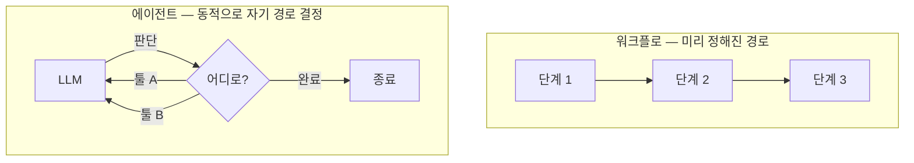

# 5장. 반복하는 시스템을 설계하다 — Loop Engineering

금요일 밤이다. 타임라인을 넘기다 "while 루프 하나로 자동으로 다 짜준다"는 트윗을 봤다고 해보자. 영상 속 화면에서는 에이전트가 혼자 코드를 쓰고, 테스트를 돌리고, 실패하면 다시 고치고, 또 돌린다. 사람은 손도 안 댄다. 솔깃하다. 나도 한번 해볼까 싶어 YOLO 모드를 켜고, 회사 레포에 "이 기능 완성해줘"를 던져두고 잠들고 싶어진다.

잠깐 멈춰서 생각해보자. 정말 그래도 될까? 아침에 일어나면 깔끔하게 완성된 PR이 기다리고 있을까, 아니면 끝없이 같은 자리를 맴돈 수백 번의 커밋과 청구서가 기다리고 있을까? 이 장은 그 트윗이 보여준 마법 — 에이전트가 스스로 반복하며 목표에 수렴하는 일 — 의 정체를 분해한다. 그리고 더 중요하게는, 그 마법이 정말 필요한 순간과 안 그런 순간을 가르는 눈을 기른다.

## "반복하는 시스템을 설계한다"

1장의 지도에서 루프 엔지니어링에 붙여둔 기억 장치를 다시 글자 그대로 가져오자.

> **한 번의 지시가 아니라, 반복하는 시스템을 설계한다.**

지금까지 우리는 안에서 밖으로 한 겹씩 나왔다. 한 번의 발화(프롬프트), 한 번의 추론에 들어가는 전체 입력(컨텍스트), 그 추론을 실제 행동으로 옮기는 실행층(하네스). 그런데 앞 장 끝에서 화살표가 한 바퀴로 끝나지 않고 계속 돌고 있었다. 모델을 부르고, 결과를 받고, 다음 입력을 조립해 다시 부르고… 이 회전을 목표에 닿을 때까지 설계하는 일이 루프 엔지니어링이다.

핵심은 "직접 매번 타이핑하는 대신 루프가 프롬프트하게 만든다"는 데 있다. 내가 한 번 묻고 한 번 답받는 게 아니라, **act → observe → reason → repeat** — 행동하고, 관찰하고, 추론하고, 다시 반복하는 사이클을 시스템이 알아서 돌게 만든다. 정의를 두 곳에서 나란히 들어보자. Anthropic은 에이전트를 "LLM이 툴을 루프 안에서 자율적으로 사용하는 것"이라 했고 (2025-09-29 기준), Simon Willison은 에이전틱 루프를 "목표를 달성하기 위해 툴을 루프 안에서 돌리는 것"이라 했다 (2025-09 기준). 표현은 다르지만 둘 다 한 단어를 공유한다. **루프(loop)다.**

> "loop engineering"이라는 용어 자체는 2026년에야 막 퍼지기 시작했고, 1차 출처가 또렷하지 않다. 그래서 이 책은 용어의 작명자를 따지기보다, 위처럼 벤더(Anthropic)와 영향력 있는 실무자(Willison)의 1차 정의를 나란히 두어 개념으로 단단히 세운다. 학술적 원형은 더 이르다 — 2022년 ReAct가 "추론과 행동을 교차하는 루프"를 이미 제시했다.

## 정말 루프가 필요한가 — Workflow vs Agent

여기서 가장 중요한 질문을 먼저 던지자. 모든 일을 자율 루프로 돌려야 할까? 답부터 말하면, 아니다. 그리고 이 "아니다"를 이해하는 게 루프 엔지니어링의 절반이다.

Anthropic은 「Building Effective Agents」에서 두 가지를 또렷이 갈랐다 (2024-12 기준). 하나는 **워크플로(workflow)** — LLM과 툴이 미리 정해진 코드 경로를 따라 움직이는 구조다. 다른 하나는 **에이전트(agent)** — LLM이 자기 프로세스를 동적으로 스스로 지휘하며, 어떤 툴을 언제 쓸지를 그때그때 판단하는 구조다.

차이를 그림으로 보자.


그림 1. 워크플로와 에이전트 — 경로를 누가 정하는가

워크플로는 레일이 깔린 기차다. 어디로 갈지가 미리 정해져 있고, 그 위를 안정적으로 달린다. 에이전트는 운전대를 쥔 자동차다. 매 순간 어디로 갈지 스스로 정한다. 자유롭지만, 그만큼 엉뚱한 길로 빠질 여지도 크다.

그래서 "어디까지 맡겨도 되나"라는 질문은, 사실 "이건 워크플로로 충분한가, 진짜 에이전트가 필요한가?"라는 질문과 같다. 경로가 뻔히 정해진 일을 굳이 에이전트에게 자유 재량으로 맡기면, 통제는 잃고 비용만 늘어난다. 반대로 매번 상황이 달라 경로를 미리 그릴 수 없는 일이라면, 그제야 자율 에이전트가 빛난다. Anthropic이 이 글에서 천명한 원칙이 바로 이것이다. **가장 단순한 해법부터 시작하고, 필요할 때만 복잡도를 올려라.** 이 원칙은 책 마지막 장의 종합 사고 프레임워크에서 1번 질문으로 다시 끌어올린다 — "정말 루프(에이전트)가 필요한가?"

## 다섯 가지 워크플로 패턴, 그리고 루프 패턴

Anthropic은 같은 글에서 자주 쓰이는 워크플로·에이전트 패턴 다섯 가지를 정리했다. 그리고 우리 레퍼런스에는 루프 패턴이 따로 정리돼 있다. 둘을 나란히 놓고 보면, 서로 다른 이름으로 같은 구조를 가리키는 경우가 많다는 게 보인다. 매핑해보자.

| Anthropic 5패턴 | 무엇인가 | 루프 패턴과의 대응 |
|------------------|---------|------------------|
| Prompt chaining | 출력을 다음 입력으로 직렬 연결 | 단순 retry/순차 진행의 골격 |
| Routing | 입력을 분류해 알맞은 경로로 보냄 | explore-narrow(탐색 후 좁히기)의 분기 |
| Parallelization | 여러 작업을 병렬로 쪼개 처리 | 서브에이전트 병렬 실행 |
| Orchestrator-workers | 지휘자가 작업을 쪼개 일꾼에게 분배 | plan-execute(계획 후 실행) 구조 |
| Evaluator-optimizer | 생성 → 평가 → 개선을 반복 | **plan-execute-verify**와 거의 같음 |

특히 눈여겨볼 짝이 둘이다. 첫째, **plan-execute-verify ≈ evaluator-optimizer**다. 계획을 세우고, 실행하고, 그 결과를 스스로 검증해 다시 고치는 흐름 — 이게 루프 엔지니어링의 가장 실용적인 형태다. 둘째, **human-in-the-loop**는 어느 표에도 깔끔히 안 들어간다. 그럴 만하다. 이건 패턴이라기보다 **자율성 스펙트럼의 한쪽 끝**이기 때문이다. 완전 자율(YOLO)이 한쪽 끝이라면, 매 단계 사람이 승인하는 방식이 반대쪽 끝이다. 그 사이 어디에 다이얼을 둘지가 곧 설계다.

매핑이 주는 교훈은 하나로 모인다. 패턴 이름에 압도되지 말자. 결국 다 **가장 단순한 해법부터, 필요할 때만 복잡도를 올리는** 같은 원칙의 변주다. retry로 될 일에 orchestrator-workers를 동원할 이유는 없다.

## 자율 루프를 떠받치는 다섯 기둥

그렇다면 진짜 에이전트가 필요하다고 판단했을 때, 자율 루프는 무엇으로 이루어질까? 다섯 가지가 빠지면 안 된다.

- **명확한 목표** — 무엇이 "완료"인지 한 문장으로 말할 수 있어야 한다. 목표가 흐릿하면 루프는 영영 멈추지 못한다.
- **유용한 툴** — 모델이 관찰하고 행동할 손발. 4장에서 본 하네스의 툴 실행층이 여기서 살아난다.
- **컨텍스트 관리** — 루프가 돌수록 컨텍스트가 불어난다. 3장의 compaction·노트·서브에이전트가 여기서 필수가 된다.
- **종료 로직** — 언제 멈출지. 이게 가장 자주 빠지고, 가장 위험하다. 뒤에서 따로 다룬다.
- **진짜 에러 처리** — 실패를 무시하고 다음으로 넘어가는 게 아니라, 실패를 관찰해 다음 행동을 바꾸는 처리.

지금까지의 장들이 여기서 한자리에 모인다는 점을 눈치챘는가? 프롬프트(목표 진술), 컨텍스트(관리), 하네스(툴 실행)가 루프 안에서 함께 돈다. 루프는 가장 바깥 원답게, 안쪽 세 겹을 모두 품는다.

## 오늘 당장 할 수 있는 작은 루프

여기까지 오면 한 가지 오해가 생기기 쉽다. "루프 엔지니어링이란 결국 무한 while 루프를 돌려 밤새 자동화하는 거구나." 아니다. 오히려 그런 극단은 드물고, 우리가 매일 할 수 있는 루프는 훨씬 작고 안전하다. 무게중심을 거기에 두자.

현업에서 Claude Code나 Codex로 기존 코드베이스를 만질 때, 우리는 사실 단일 세션 안에서 작은 루프를 이미 돌리고 있다. 다만 그걸 의식적으로 설계하지 않을 뿐이다. 의식적으로 설계한다는 건 이런 것이다.

첫째, **테스트를 종료 신호로 건다.** "이 함수 고쳐줘"가 아니라 "이 테스트가 통과할 때까지 고쳐줘"라고 하면, 루프에 명확한 종료 조건이 생긴다. 깨끗하게 통과하는 테스트 스위트는 루프의 가치를 증폭시키는 가장 확실한 장치다. 검증 신호가 곧 안전장치이기 때문이다 — 모델이 "다 됐다"고 우겨도, 테스트가 빨간불이면 루프는 끝나지 않는다.

둘째, **plan-execute-verify를 한 작업에 적용한다.** 큰일을 통째로 던지지 말고, 모델에게 먼저 계획을 세우게 하고(plan), 한 단계씩 실행하게 하고(execute), 매 단계 결과를 확인하게 한다(verify). 이 세 박자를 한 작업 안에서 의식적으로 돌리는 것만으로도, 막연한 "알아서 해줘"보다 훨씬 안정적인 결과가 나온다.

셋째, **한 번에 한 작업.** 루프가 길을 잃는 가장 흔한 이유는 한 번에 너무 많은 걸 맡기기 때문이다. 작업을 잘게 쪼개 하나씩 통과시키면, 어디서 틀어졌는지 추적하기도 쉽고 루프도 수렴하기 쉽다.

이 세 가지 — 테스트를 종료 신호로, plan-execute-verify를, 한 번에 한 작업 — 는 거창한 인프라 없이 **월요일 아침에 바로** 적용할 수 있다. 이것이 이 장이 권하는 루프 엔지니어링의 본체다. "맡기되 가드레일을 친다"의 가장 작고 실용적인 형태다.

## 루프의 극단 — Ralph와 YOLO

그렇다면 오프닝의 그 트윗, 무한 while 루프는 무엇이었을까? 대표 사례가 **Ralph loop**다 (Huntley, 2025-07-14 기준). 형태는 충격적일 만큼 단순하다.

```bash
while :; do cat PROMPT.md | claude-code; done
```

같은 프롬프트를 매번 신선한 컨텍스트로 무한 반복하고, 파일시스템을 메모리 삼아 진행 상황을 누적한다. 루프당 한 작업만 시키고, 서브에이전트로 병렬을 낸다. 그린필드 프로젝트를 통째로 자동 생성하는 데모로 화제가 됐다. 여기에 YOLO 모드(`--dangerously-skip-permissions` 류, 승인 없이 모든 행동을 자동 수락)를 얹으면, 사람이 손을 완전히 떼는 풀 자율이 된다.

흥미롭고 강력하다. 하지만 분명히 못 박아두자. 이건 **극단 사례**다. Ralph·YOLO가 빛나는 자리는 그린필드, 단일 일화다 — 잃을 게 없는 빈 프로젝트, 한 번 돌려보는 실험. 무한 while 루프를 회사의 운영 레포에 돌릴 일은 드물다. 가드레일 없는 자율 루프는 멈출 줄 모르고, 멈출 줄 모르는 루프는 비용과 사고로 이어진다(이 위험은 7장에서 한 사고와 함께 정면으로 다룬다). 데모의 화려함을 일상의 규범으로 일반화하지 말자. 오프닝에서 든 충동 — 금요일 밤 회사 레포에 YOLO를 던지고 자는 것 — 은 바로 이 일반화의 함정이다.

## 맡기되, 가드레일을 친다

극단을 봤으니 안전 설계로 매듭짓자. 자율성을 높일수록 가드레일은 더 단단해야 한다.

가장 든든한 안전장치는 앞서 말한 **깨끗한 테스트 스위트**다. 루프가 무슨 짓을 하든, 통과해야 할 테스트가 빨간불이면 "완료"가 될 수 없다. 검증 신호가 루프를 붙들어준다.

그다음은 **하드 가드레일**이다. 핵심은 "알림"이 아니라 "강제 차단"이라는 데 있다. 최대 반복 횟수(max iteration)를 넘으면 멈춘다. 일정 횟수 동안 진전이 없으면(no-progress) 멈춘다. 토큰·비용 예산을 넘으면 경고만 띄우는 게 아니라 차단한다. 알림은 사람이 보고 있을 때만 작동하지만, 우리는 보통 루프를 켜두고 자리를 뜬다. 그러니 사람의 주의에 기대지 말고, 시스템이 스스로 끊게 설계하는 편이 낫다.

마지막으로 **YOLO는 샌드박스에서만.** 풀 자율을 쓰고 싶다면, 컨테이너나 외부 머신처럼 폭발 반경(blast radius)이 격리된 곳에서, 네트워크를 잠그고 돌리자. 운영 환경에 직접 풀 자율을 푸는 건, 안전벨트 없이 가속 페달을 묶어두는 것과 같다.

### 이 장의 핵심

- 루프 엔지니어링 = **한 번의 지시가 아니라, 반복하는 시스템을 설계한다** (act→observe→reason→repeat).
- 첫 질문은 언제나 **"정말 루프가 필요한가, 워크플로면 충분한가?"** — 가장 단순한 해법부터, 필요할 때만 복잡도를 올린다.
- 5대 워크플로 패턴은 루프 패턴의 변주다. **plan-execute-verify ≈ evaluator-optimizer**, human-in-the-loop는 자율성 스펙트럼의 한쪽 끝.
- 무게중심은 거창한 자동화가 아니라 **오늘 당장의 작은 루프** — 테스트를 종료 신호로, plan-execute-verify를, 한 번에 한 작업.
- Ralph·YOLO는 **그린필드·단일 일화의 극단 사례**. 가드레일(테스트·max iteration·예산 강제 차단·샌드박스)은 자율성에 비례해 단단해져야 한다.

---

루프 엔지니어링의 한 문장을 다시 줄이면, "한 번의 지시가 아니라 반복하는 시스템을 설계한다"였다. 그런데 그 시스템을 설계하기 전에 던져야 할 질문이 먼저였다. **정말 루프가 필요한가?** 맡기는 일에는 늘 가드레일이 따라붙어야 했다.

여기까지 우리는 동심원을 안에서 밖으로 한 겹씩 다 그렸다. 프롬프트, 컨텍스트, 하네스, 루프. 가장 안쪽의 한 발화에서 출발해 가장 바깥의 자율 반복까지, 네 겹의 원이 마침내 다 채워졌다. 지도는 완성됐다. 그런데 이 지도는 교과서 속 그림이 아니다. 바로 지금 당신의 터미널에서 돌아가는 도구가, 알게 모르게 이 네 겹을 전부 품고 있다. 그 도구를 열어 네 겹이 각각 어디에 박혀 있는지 손가락으로 짚어보면 — 지도는 비로소 내 것이 된다.
