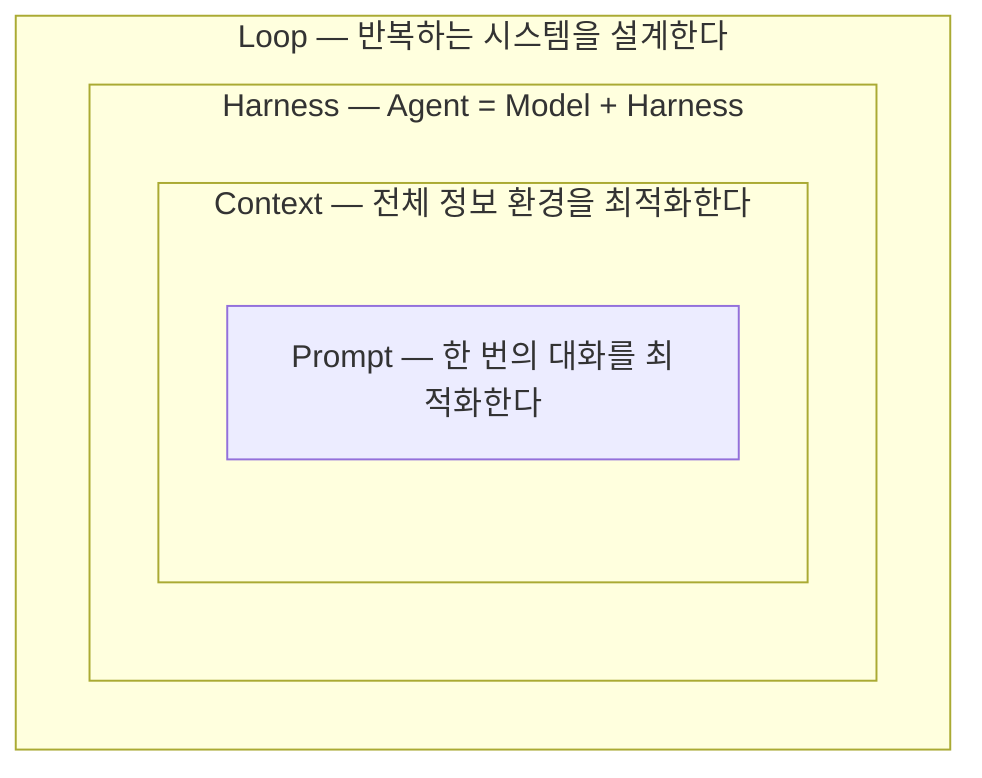
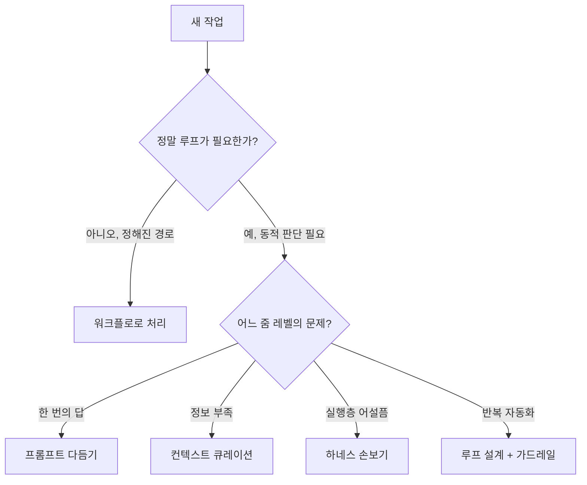

# 8장. 네 겹을 다시 그리며 — 내일부터 무엇을 다르게 할까

앞 장에서 우리는 논쟁마다 입장을 세웠다. 프롬프트는 죽지 않았고, 자율 루프는 설계의 문제이며, 컨텍스트는 딱 맞을 때 가장 좋고, 새 용어는 신조어이되 현상은 실재한다고. 이제 한 발 물러나, 그 모든 걸 떠받쳐온 네 겹의 원을 처음부터 다시 그려보자. 마지막으로 한 바퀴 도는 이 회고가, 책을 덮은 뒤에도 오래 남을 지도가 되어줄 것이다.

## 안에서 밖으로, 한 번 더

우리는 가장 안쪽 원에서 출발했다. **프롬프트** — "한 번의 대화를 최적화한다." 무엇을, 어떤 형식으로, 어떤 예시와 함께 말할지를 다듬는 가장 국소적인 기술이다. 2장에서 우리는 이 한 줄의 지시가 모든 것의 토대임을, 그리고 가장 익숙하지만 결코 사소하지 않음을 봤다.

그 원을 한 겹 넓히면 **컨텍스트**가 나온다 — "전체 정보 환경을 최적화한다. 프롬프트는 그중 일부일 뿐." 프롬프트 한 줄이 아니라 윈도에 들어가는 모든 토큰을, 많이가 아니라 딱 맞게 큐레이션하는 일이었다. 3장에서 "딱 맞게 넣기"가 본질임을 배웠고, 7장에서 그 직관이 수치로 증명되는 걸 봤다.

또 한 겹 넓히면 **하네스**다 — "Agent = Model + Harness." 모델이 아니면 다 하네스다. 모델을 실제로 행동하는 에이전트로 바꾸는 실행층, hook과 서브에이전트와 MCP가 사는 자리. 4장에서 우리는 인터페이스 설계가 곧 성능이라는, 의외로 강한 교훈을 만났다.

가장 바깥 원은 **루프**였다 — "한 번의 지시가 아니라, 반복하는 시스템을 설계한다." 매번 직접 타이핑하는 대신 act→observe→reason→repeat의 사이클이 스스로 목표에 수렴하게 만드는 일. 5장에서 우리는 그 자율성에 가드레일을 함께 채우는 법을 익혔다.

네 문장을 나란히 다시 읽어보자. 1장에서 처음 만났고, 2장부터 5장까지 각 장의 첫머리에서 다시 만났던 바로 그 네 문장이다. 반복은 우연이 아니었다. 이 책의 약속이 "오래 기억하게"였으니까. 이 네 문장만 입에 붙어 있으면, 당신은 이미 네 용어를 한 문장으로 정의할 수 있는 사람이다.

그림 1. 네 겹의 동심원과 각 겹의 기억 장치

## 새 작업 앞에서 던지는 질문 절차

이 동심원을 단지 외우라고 그린 게 아니다. **새 작업을 만났을 때 꺼내 쓰는 사고 도구**로 삼자는 것이다. 월요일 아침, 처리할 일이 하나 떨어졌다고 해보자. 어디서부터 생각하면 될까? 순서가 있다.

**1번 질문: 정말 루프(에이전트)가 필요한가, 아니면 워크플로면 충분한가?**

이 질문이 가장 먼저 와야 한다. 5장에서 천명한 Anthropic의 원칙 — "가장 단순한 해법부터, 필요할 때만 복잡도를 올려라" — 을 맨 앞으로 끌어올린 것이다. 우리는 자율 에이전트라는 말의 매력에 휘둘려, 사실은 미리 정의된 코드 경로(워크플로) 하나면 끝날 일에 거창한 루프를 돌리곤 한다. 그런데 결과가 예측 가능하고 단계가 정해진 작업이라면, 자율 루프는 비용만 키우는 과잉 설계다. $47,000 사고를 떠올리자 — 거기에 진짜 필요했던 건 자율성이 아니었을지 모른다.

그러니 먼저 묻자. 이건 매번 같은 순서로 흘러가는 일인가(→ 워크플로), 아니면 모델이 상황을 보고 스스로 다음 수를 정해야 하는 일인가(→ 에이전트)? 예를 들어 "PR마다 같은 체크리스트를 돌리는 일"은 단계가 정해져 있으니 워크플로로 충분하다. 반면 "낯선 버그를 추적해 고치는 일"은 무엇을 시도할지 모델이 그때그때 판단해야 하니 에이전트가 어울린다. 워크플로로 충분하면 거기서 멈추자. 가장 단순한 해법이 가장 좋은 해법인 경우가 생각보다 많다 — 그리고 단순한 쪽은 거의 언제나 더 싸고, 더 예측 가능하고, 덜 위험하다.

**2번 질문: 어느 줌 레벨의 문제인가?**

루프가 필요하다고 판단했든 아니든, 다음은 "이 문제가 동심원의 어느 겹에 있는가"를 짚는 것이다. 내려가며 물어보자.

- 모델이 한 번에 더 잘 답하게 하면 풀리는 일인가? → **프롬프트** 문제. 지시를 더 정확·구체·검증가능하게.
- 모델이 필요한 정보를 못 보고 있어서 생긴 일인가? → **컨텍스트** 문제. `CLAUDE.md`/`AGENTS.md`를 다듬거나, 딱 맞는 정보를 큐레이션.
- 모델이 세상에 닿는 방식(툴·실행·격리)이 어설퍼서인가? → **하네스** 문제. hook·서브에이전트·MCP를 손보자.
- 같은 작업을 반복하느라 사람이 매번 타이핑하고 있는가? → **루프** 문제. 단, 1번 질문으로 돌아가 "정말 자율 루프인가"를 다시 확인.

그림 2. 새 작업 앞에서의 결정 흐름

이 두 질문 — "정말 복잡도가 필요한가"와 "어느 줌 레벨인가" — 만 몸에 배면, 막연하던 작업이 손에 잡히는 행동으로 환원된다. 문제를 정확한 겹에서 풀면, 엉뚱한 겹을 붙들고 씨름하는 시간이 사라진다. 흔히 우리는 프롬프트만 자꾸 고쳐 쓰며 안 되는 이유를 찾는데, 사실은 모델이 필요한 파일을 못 보고 있던 컨텍스트 문제였던 경우가 많다. 겹을 잘못 짚으면 아무리 노력해도 헛심을 쓰게 된다. 그래서 "어느 겹인가"를 먼저 묻는 습관이 그토록 중요하다.

## 모델은 빌리고, 하네스는 쌓는다

여기서 6장의 결론 하나를 다시 불러오자. 모델은 휘발성이 높다. 오늘의 1등이 다음 분기엔 2등이 되고, 가격이 바뀌고, 새 모델이 나온다. 하지만 컨텍스트 파일과 하네스에 들인 투자는 모델을 갈아끼워도 남는다. **모델은 빌려 쓰는 것이고, 하네스와 컨텍스트는 쌓아 올리는 것이다.**

그러니 매번 바뀌는 벤치마크를 좇는 데 시간을 쓰기보다, 갈아끼워도 남는 곳에 투자하는 편이 낫다. 이 한 문장이 6장의 긴 해부를 압축한 결론이다.

## 내일 아침, 작은 것 하나부터

마지막으로, 거창한 결심 대신 내일 당장 할 수 있는 작은 것 하나를 정하자. 큰 변화는 작은 습관에서 온다.

- `CLAUDE.md`나 `AGENTS.md`에 그동안 매번 설명하던 규칙 한 줄을 적어두기. (컨텍스트)
- 매번 손으로 돌리던 린트나 테스트를 hook 하나로 자동화하기. (하네스)
- 자율 루프를 쓴다면, 예산 캡이나 max iteration 가드레일 하나를 강제 차단으로 걸기. (루프)
- 다음에 막막한 작업을 만나면, 일단 멈추고 "이건 어느 줌 레벨의 문제지?"부터 묻기. (사고 절차)

이 책을 펼쳤을 때 우리는 네 단어가 서로 뭐가 다른지 한 문장으로 말하지 못했다. 이제는 다르다. 네 겹의 동심원을 그릴 수 있고, 자기 도구를 네 칸으로 해부할 수 있고, 새 작업 앞에서 어느 겹의 문제인지 물을 수 있다. 모델이 또 바뀌어도 — Claude에서 Codex로, Codex에서 그다음으로 — 이 지도는 그대로 남아 당신을 안내할 것이다.

네 겹의 원. 안에서 밖으로 프롬프트·컨텍스트·하네스·루프. 이 그림 하나면 충분하다. 이제 터미널을 열고, 내일의 작은 것 하나부터 시작해보자.
