# AI 에이전트, 무엇으로 갈리나

**프레임워크·데이터·평가·런타임 선택 가이드**

## 저자
Toby-AI

**판본:** v1.0.0 · 2026-07-26

---

## 판권

**AI 에이전트, 무엇으로 갈리나**
**부제:** 프레임워크·데이터·평가·런타임 선택 가이드
**판본:** v1.0.0
**발행일:** 2026-07-26
**저자:** Toby-AI
**식별자:** urn:uuid:09e884f2-25c5-4a95-947f-1dbc5f2dc617

### 시점 고지

이 책에 나오는 **모든 버전·가격·리비전·상태 표시·리더보드 수치는 2026년 7월 기준이다.** 특정 시점에 1차 소스에서 확인한 값이며, 그 이후의 변경은 반영돼 있지 않다. 이 분야에서 그 시차는 짧지 않다. 무엇을 언제 다시 확인해야 하는지는 12장 「6개월 뒤 다시 열어볼 목록」에 정리해뒀다.

### 라이선스

이 책은 [Creative Commons BY-NC-SA 4.0](https://creativecommons.org/licenses/by-nc-sa/4.0/) 라이선스로 배포된다.

- **저작자 표시(BY):** 출처를 밝힐 것.
- **비상업적 이용(NC):** 상업적 목적으로 이용할 수 없다.
- **동일조건 변경허락(SA):** 변경·재배포 시 동일한 라이선스를 적용해야 한다.

### 출처

이 책은 [book-writer](https://github.com/tobyilee/book-writer) 하네스 v1.9.1로 자동 생성되었다.

---

## 서문

요구사항이 하나 떨어졌다고 해보자. "우리 서비스에도 에이전트를 하나 붙여봅시다."

LLM API는 이미 써봤다. chat completion을 호출해봤고, tool use로 함수를 붙여도 봤고, 돌아온 JSON을 파싱해 화면에 뿌려도 봤다. 그러니 못 할 일 같지는 않다. 그런데 자료를 찾기 시작하면 사정이 달라진다. 프레임워크만 스무 개가 나오고 저마다 자기가 표준이라고 한다. 벡터 DB를 반드시 붙여야 한다는 글과 이제 필요 없다는 글이 같은 주에 올라온다. 평가는 어떻게 하냐고 물으면 리더보드 링크가 돌아온다. 사내에 물어볼 선례도 없다.

며칠쯤 이러고 나면 뒷맛이 찜찜해진다. 막힌 지점이 만드는 방법이 아니라는 걸 알게 되기 때문이다. 막힌 것은 **무엇을 조합할지**다.

이 책은 그 자리에 서 있는 사람을 위해 썼다.

### 누구를 위한 책인가

명시적으로 적어두자. 이 책이 상정한 독자는 **LLM API는 써봤지만 에이전트를 직접 설계·배포·운영해본 적은 없는 백엔드·풀스택 개발자와 테크리드**다. 실무 도입을 앞두고 무엇을 어떻게 조합할지 결정해야 하는 사람.

이 가정에서 네 가지가 따라온다.

입문 설명을 반복하지 않는다. "LLM이란 무엇인가"를 설명하는 문단은 이 책에 없다. 토큰이 무엇인지, 프롬프트를 어떻게 쓰는지도 다루지 않는다. 이미 안다고 가정한다.

결정할 수 있게 쓴다. 소개로 끝나면 이 책은 실패한 것이다. 각 장은 "그래서 무엇을 기준으로 고르나"까지 간다.

백엔드 감각을 다리로 쓴다. MCP는 LSP에 비유하고, 메모리 계층은 RAM과 디스크와 페이징으로, 프레임워크 논쟁은 Spring IoC의 모듈성 감각으로 설명한다. 새 어휘를 외우게 하는 대신 이미 가진 감각 위에 얹는다.

양쪽을 준다. 이 분야에는 아직 닫히지 않은 논쟁이 많다. 워크플로로 충분한가 자율 에이전트가 필요한가, RAG인가 롱 컨텍스트인가, 전용 벡터 DB인가 pgvector인가, 프레임워크를 살 것인가 직접 만들 것인가. 이런 질문을 한쪽으로 봉합하면 독자의 결정을 대신 내려버리는 셈이 된다. 그래서 결론이 나지 않은 곳에서는 양쪽 근거를 나란히 놓고, 무엇이 갈림길인지만 분명히 한다.

전제로 삼는 경험은 HTTP API, 컨테이너, DB 운영 정도다. 머신러닝 배경이나 모델 학습 지식은 필요 없다.

### 이 책이 약속하는 것

책을 덮었을 때 도착하는 자리를 한 문장으로 적으면 이렇다.

**도구 이름을 더 많이 아는 상태가 아니라, 새 도구가 나와도 어느 축에 놓고 판단할지 아는 상태.**

이건 겸양이 아니라 설계다. 제품별로 장을 나눠 각각의 사용법을 정리하는 책이 되면, 그 책은 지형이 움직일 때마다 통째로 낡는다. 반면 "명시적 그래프냐 역할 위임이냐" 같은 축은 내년에 나올 프레임워크도 그 위에 놓을 수 있다. 그래서 이 책의 챕터는 제품이 아니라 독자가 한 번에 내리는 결정을 단위로 나뉘어 있다.

여정은 통제 경계가 안에서 밖으로 넓어지는 순서로 흐른다.

- **1~3장 — 원리.** 에이전트 하나의 안쪽을 본다. 에이전트는 마법이 아니라 루프이고, 그 루프의 비용과 실패와 재시도가 전부 구조에서 나온다. 여기서 뒤의 모든 선택에 쓰일 어휘가 만들어진다.
- **4~7장 — 무엇을 사고 무엇을 사지 않을 것인가.** 어느 층을 사고, 데이터 계층은 아예 붙이지 않아도 되는지. 각 갈림길이 무엇으로 갈리는지를 축으로 익힌다.
- **8~11장 — 데모와 프로덕션 사이.** 평가·관측성·가드레일·런타임. 데모까지는 잘 되던 것이 프로덕션에서 무너지는 네 지점이다.
- **12장 — 종합.** 여섯 용도에 대해 다섯 계층을 채우고, 각 조합을 쓰지 말아야 할 조건까지 함께 들고 나온다.

### 어떻게 읽으면 좋은가

처음 읽는다면 순서대로 읽는 편이 낫다. 뒷장이 앞장에서 세운 어휘를 그대로 다시 쓰기 때문이다. 3장의 "정책이 아니라 확률"이 10장에서 다시 나오고, 6장의 세 질문이 12장 표의 셀 안에 들어가 있다.

다만 각 장은 혼자서도 읽히도록 썼다. 지금 당장 걸린 문제가 있다면 거기부터 펼쳐도 된다.

- 프레임워크를 골라야 한다 → 4장, 5장
- 벡터 DB를 붙일지 말지 결정해야 한다 → 6장
- 이미 붙였는데 검색이 안 맞는다 → 7장
- "잘 되는지 어떻게 아냐"는 질문을 받았다 → 8장, 9장
- 보안 검토를 통과해야 한다 → 10장
- 에이전트가 만든 코드를 실행해야 한다 → 11장

급하다면 **12장부터 읽고 걸리는 셀의 근거 장으로 거슬러 올라가는** 방법도 나쁘지 않다. 12장의 모든 셀은 "무엇 때문에 갈렸나 → 그래서 기본값"의 형태라, 화살표 앞쪽이 곧 앞 장의 목차 역할을 한다.

### 이 책이 스스로 밝히는 반감기

한 가지는 미리 말해두는 편이 정직하다.

**이 책의 모든 버전·가격·상태 표시는 2026년 7월 기준이고, 6개월이면 상당 부분이 낡는다.**

이건 이 책의 결함이 아니라 이 분야의 성질이다. 조사 과정에서 실제로 마주친 것들만 적어봐도 이렇다. 어떤 프레임워크는 메이저 버전이 출시된 지 닷새 됐고, 어떤 라이브러리는 자기 소개문을 조용히 바꿔 다른 종류의 제품이 됐고, 어떤 저장소는 이름 자체를 SDK에서 하네스로 갈아치웠다. 표준 규약 하나는 아직 `Status: Development`이고 태그된 릴리스가 없다.

그래서 이 책은 두 가지를 한다. 하나, 수치를 쓸 때마다 언제 기준인지 붙인다. 둘, 12장에 재확인 목록을 둔다 — 6개월 뒤 다시 열어봐야 할 항목과, 그것을 직접 확인하는 명령까지 함께. 5장의 생존 신호 네 가지는 그 목록을 스스로 돌리기 위한 절차다.

책이 자기 유통기한을 밝히는 것이 손해처럼 보일 수도 있다. 그런데 반대다. 낡을 것과 오래 갈 것을 갈라두면, 독자는 낡은 셀을 만났을 때 책 전체를 버리는 대신 그 셀만 갱신할 수 있다. 오래 가는 쪽은 표 안의 이름이 아니라 그 이름이 그 자리에 놓인 이유다.

### 표기와 인용에 대한 몇 가지

읽기 전에 알아두면 편한 규칙 넷.

논문은 arXiv ID로만 인용한다. 발표 학회를 확인하지 못한 논문에 학회명을 붙이지 않았다. 확인된 것만 참고문헌에 적었고, 본문에서는 ID로 통일했다. 검증할 수 없는 문장을 하나라도 줄이는 쪽을 택했다.

2차 소스는 그렇게 표시한다. 회사 기술블로그에서 온 수치는 본문에서 2차 소스임을 밝힌다. 실측이고 코드가 공개돼 있어도 그렇다.

커뮤니티 발언은 "한 개발자는 ~라고 말한다" 형태로 귀속한다. 그 발언의 수치를 사실로 단정하지 않는다. 이런 발언이 값진 이유는 통계가 아니라 현장의 감각을 알려주기 때문이다.

확인하지 못한 것은 확인하지 못했다고 적는다. 이 책에는 "이 값은 확인하지 못했다"는 문장이 여러 번 나온다. 청킹 오버랩 권장치, durable execution 가격, 벤더별 프롬프트 캐싱 단가 같은 것들이다. 빈칸을 그럴듯한 숫자로 메우는 대신, 빈칸이 어디인지 알려주고 그 자리에서 무엇을 물어야 하는지를 대신 준다.

번역어가 정착하지 않은 몇몇 용어는 원어를 유지했다. `durable execution`(실행이 중간에 죽어도 이어서 완주하게 만드는 계층), `pass@k`·`pass^k`, `microVM`이 그렇다. 억지로 옮기면 원문 자료를 찾을 때 오히려 걸림돌이 된다.

자, 그러면 시작해보자. 첫 질문은 의외로 소박하다. 우리가 만들려는 그것을 정말 에이전트라고 불러도 되는가?

## 목차

- 1장. 에이전트라고 부르기 전에 — 정의, 경계, 그리고 루프의 조상
- 2장. 루프는 왜 비싸고 어떻게 실패하는가
- 3장. 손을 달아주는 일 — MCP, A2A, 그리고 재시도라는 함정
- 4장. SDK 위의 새 층 — 하네스라는 것이 왜 2026년에 생겼나
- 5장. 프레임워크 지형 — 무엇으로 갈리고, 언제 직접 만드나
- 6장. 벡터 DB를 사기 전에 — 필요 없는 경우부터 세어보자
- 7장. 검색을 붙인다면 — 차원 한계, 하이브리드, 청킹, 리랭킹
- 8장. 무엇을 재야 하나 — 리더보드를 덮고 시작하자
- 9장. 실패는 조용하다 — 관측성과 비용
- 10장. 가드레일은 필터 하나가 아니다 — 네 층, 그리고 권한
- 11장. 어디서 돌릴 것인가 — 격리 강도, 그리고 며칠짜리 실행
- 12장. 그래서 무엇을 조합할 것인가 — 용도별 기본값과 금기

---

# 1장. 에이전트라고 부르기 전에 — 정의, 경계, 그리고 루프의 조상

에이전트라는 말을 들으면 대개 비슷한 그림이 떠오른다. 목표만 던져주면 알아서 계획을 세우고, 필요한 도구를 골라 쓰고, 사람 손을 거의 타지 않는 무언가. 그런데 이 분야에서 가장 많이 인용되는 문서 두 개가 하는 말은 그 그림과 거의 반대다. 둘 다 에이전트 제품을 파는 회사가 쓴 문서인데, 정작 결론은 "가능하면 쓰지 말라"는 쪽에 가깝다.

### 자기 제품과 반대 방향으로 말하는 두 문서

Microsoft Learn의 Agent Framework 개요 문서에 이런 문장이 있다(2026-07-10 갱신 기준).

> *"If you can write a function to handle the task, do that instead of using an AI agent."*

함수로 처리할 수 있는 일이면 에이전트 대신 함수를 쓰라는 말이다. 에이전트 프레임워크를 소개하는 문서의 앞머리에 놓이기에는 묘하다. 같은 문서는 판단 표까지 제공한다. 에이전트는 과제가 열려 있거나 대화형이고 자율적인 도구 사용과 계획이 필요할 때. 워크플로는 단계가 이미 정의돼 있고 실행 순서를 명시적으로 통제해야 하거나, 여러 에이전트를 조율해야 할 때.

여기 쓰인 워크플로와 에이전트라는 두 단어의 출처는 다른 회사다. Anthropic이 2024-12-19에 낸 「Building effective agents」가 이 구분을 업계 공용어로 만들었다.

> **워크플로:** *"Systems where LLMs and tools are orchestrated through predefined code paths."*
> **에이전트:** *"Systems where LLMs dynamically direct their own processes and tool usage, maintaining control over how they accomplish tasks."*

옮겨보면 경계가 더 또렷해진다. 워크플로는 LLM과 도구가 미리 정해진 코드 경로를 따라 조율되는 시스템이고, 에이전트는 LLM이 자기 과정과 도구 사용을 스스로 지시하면서 목표를 어떻게 달성할지에 대한 통제권을 쥐는 시스템이다. 갈림길은 모델의 똑똑함이 아니다. **다음에 무엇을 할지 결정하는 주체가 코드인가 모델인가**, 그 하나다.

이 구분이 실무에서 왜 값이 나갈까? 경로가 코드 안에 있으면 우리는 그 경로를 그림으로 그릴 수 있고, 리뷰에 올릴 수 있고, 단위 테스트를 붙일 수 있고, 장애가 났을 때 어느 분기에서 틀어졌는지 코드를 읽어 좁힐 수 있다.

결정을 모델에게 넘기는 순간 그 네 가지가 전부 흔들린다. 같은 입력에 대해 실행마다 다른 경로가 나올 수 있으니 **경로 자체가 산출물이 되고**, 무슨 일이 있었는지는 실행 기록을 남겨두지 않으면 알 수 없다. 에이전트를 도입하는 결정이 사실은 **"우리 시스템의 제어 흐름을 런타임에 생성되게 두겠다"는 결정**이라는 걸 알아두자. 그러면 뒤에 나오는 평가·가드레일 장들과 실행 기록을 다루는 장이 왜 그렇게 두툼한지 납득이 된다.

같은 글은 대가도 분명히 적어뒀다. 에이전트를 택하면 *"higher costs, and the potential for compounding errors"* — 더 높은 비용과 오류가 누적될 가능성을 함께 받는다. 그래서 *"extensive testing in sandboxed environments, along with appropriate guardrails"*가 필요하다고 못 박는다. 샌드박스에서의 충분한 테스트, 그리고 적절한 가드레일. 3장부터 10장까지 이 책이 하는 이야기의 목록이 사실 이 한 문장 안에 이미 들어 있다.

시점 하나를 붙여두자. Anthropic 글은 2024-12-19 발행이고 2026년 7월 기준으로 1년 7개월이 지났다. 정의와 패턴 분류는 지금도 그대로 인용되지만, 글 안에 언급된 프레임워크 정보는 이미 구버전이다. 이 책이 다루는 거의 모든 것이 그렇다. 개념은 오래 가고 제품 정보는 빨리 낡는다.

### 워크플로에는 다섯 가지 모양이 있다

Anthropic의 같은 글이 제시한 워크플로 패턴 다섯 종은 사실상 표준 분류가 됐다. prompt chaining(프롬프트 체이닝), routing(라우팅), parallelization(병렬화), orchestrator-workers(오케스트레이터와 워커), evaluator-optimizer(평가자와 최적화기)다.

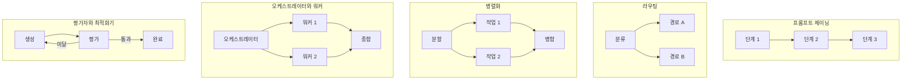
그림 1. 워크플로 패턴 다섯 종 — 어느 쪽이든 경로를 그린 사람은 개발자다

다섯 개를 한 장에 놓고 보자. 공통점이 눈에 들어온다. **화살표를 그린 주체가 전부 개발자다.** LLM은 각 노드 안에서 문장을 만들거나 분류를 하거나 점수를 매기지만, 노드에서 노드로 넘어가는 결정은 코드가 한다. 심지어 평가자와 최적화기 패턴처럼 루프가 도는 모양조차 그렇다. 루프가 있으니 에이전트라고 부르고 싶어지지만, **언제 다시 돌고 언제 빠져나올지를 코드가 쥐고 있다면 그건 워크플로다.**

평가자와 최적화기 패턴을 조금 더 들여다보면 2장에서 다룰 이야기의 씨앗이 보인다. 이 패턴이 성립하려면 평가 칸이 실제로 판정을 해줘야 한다. 판정 없이 "다시 해봐"를 반복하는 모양은 패턴이 아니라 낭비다. 워크플로에서는 이 조건이 눈에 잘 보인다. 평가 노드를 우리가 직접 짜야 하니 무엇으로 판정할지 정하지 않고는 코드가 완성되지 않기 때문이다. 결정을 모델에게 넘기면 이 조건이 슬그머니 사라진다.

판단 기준도 같은 글에 있다. **서브태스크가 고정적이고 일관성이 우선이라면 워크플로, 단계를 미리 정할 수 없는 열린 문제라면 에이전트.** 자기 과제를 이 축에 올려놓는 연습을 지금 한 번 해보자. "사용자가 올린 계약서에서 조항 열두 개를 뽑아 표로 만든다"는 과제라면, 뽑을 조항 목록이 이미 정해져 있으니 경로를 그릴 수 있다. "사용자 질문을 받아 사내 시스템 어디를 얼마나 뒤져야 할지 그때그때 정한다"는 과제라면 미리 그릴 수 없다. 앞쪽을 에이전트로 만들면 비용과 오류 누적을 값도 없이 사는 셈이다. 몇 주를 들여 만든 뒤에 "이건 함수로 됐잖아"라는 말을 리뷰에서 듣는 상황은 뒷맛이 꽤 찜찜하다.

### 그렇다면 자율성은 언제 사야 하나

여기서 논쟁 하나를 정직하게 펼쳐두자. "워크플로로 충분한가, 자율 에이전트가 필요한가"는 아직 닫히지 않은 질문이다.

한쪽에는 방금 본 벤더 두 곳의 권고가 있다. Anthropic은 *"Start with simple prompts"*로 시작해 단순한 해법이 부족할 때만 복잡도를 더하라고 하고, Microsoft는 함수로 되면 함수로 하라고 한다. 서로 다른 회사가 서로 다른 제품을 팔면서 같은 결론에 도달했다는 점이 이 권고의 무게다.

다른 쪽에는 제품 구조가 하는 증언이 있다. 역할 기반 자율 위임의 대표 프레임워크인 CrewAI는 역할과 목표를 선언하면 위임 판단을 LLM이 하는 Crews를 내세운다. 그런데 CrewAI는 Flows를 별도로 뒀다. 공식 문서가 Flows의 용도로 밝힌 것은 *"event-driven workflows requiring state management, conditional branching, human oversight, or orchestration across multiple crews"* — 상태 관리, 조건 분기, 사람 개입(HITL), 여러 crew에 걸친 조율이 필요한 이벤트 기반 워크플로다. 프리미티브도 `@start`·`@listen`·`@router`·`@persist`처럼 노골적으로 명시적이다. 자율 위임 진영의 대표 주자가 스스로 명시적 워크플로 층을 제품에 추가했다는 사실은, 순수 자율 위임만으로는 프로덕션이 안 되는 지점이 실재한다는 증언으로 읽을 수 있다.

이 논쟁은 지금 한쪽으로 기울어 있다. **결정적 워크플로를 기본값으로 두고, 자율성은 필요한 만큼만 사는 것**이 벤더 공통 권고다. 다만 기울어 있다는 말과 반대쪽 근거가 없다는 말은 다르다. CrewAI Flows가 존재한다는 사실은 사라지지 않으며, 그 사실이 알려주는 것은 "자율이냐 결정이냐"가 아니라 **하나의 시스템 안에서 두 성질을 어떻게 섞을 것인가**가 실제 설계 문제라는 점이다.

한 가지 더. 워크플로 쪽 기본값에는 이미 성숙한 도구가 있다. Prefect와 Dagster는 데이터 계보 중심의 워크플로 오케스트레이터이며 에이전트 프레임워크가 아니다. 결정론이 요구사항인 파이프라인에서는 이쪽이 정답이고, 에이전트가 아예 불필요할 수 있다. 에이전트가 유일한 선택지처럼 보인다면 그건 기술의 문제가 아니라 시야의 문제인 경우가 많다.

### 이 루프의 조상

에이전트가 새로운 종류의 소프트웨어가 아니라는 걸 가장 빨리 이해하는 방법은 뭘까? 계보를 보는 것이다. 오늘 우리가 쓰는 거의 모든 루프의 원형은 2022년 논문 하나에 이미 있다. ReAct(arXiv:2210.03629, v1 2022-10-06 / v3 2023-03-10)다.

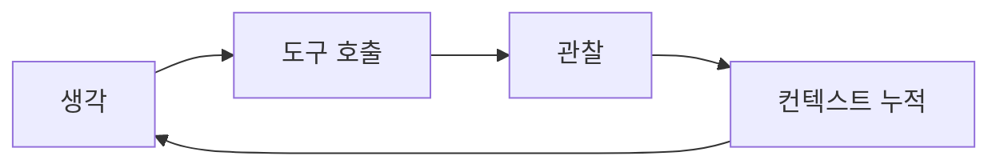
그림 2. ReAct 루프 — 관찰이 컨텍스트로 되먹여지고, 회차마다 컨텍스트가 커진다

생각하고, 도구 호출(tool use)을 하고, 결과를 관찰하고, 그 관찰을 컨텍스트에 되먹여 다시 생각한다. 이게 전부다. 프레임워크 스무 개가 서로 다른 이름과 추상화를 붙여 팔고 있지만, 그래프든 역할 위임이든 핸드오프든 안쪽에서 도는 것은 이 네 칸이다.

이 논문에서 실무자가 챙길 함의는 따로 있다. **"생각"은 장식이 아니라 도구 호출 오류를 잡는 채널이다.** 모델이 중간에 자기 판단을 텍스트로 뱉게 만드는 이유는 사람이 읽고 감탄하기 위해서가 아니라, 잘못된 인자나 잘못된 도구 선택이 그 텍스트 단계에서 걸러지기 때문이다. 그렇다면 대가는 어디로 청구될까? 스텝마다 히스토리를 다시 보낸다. 그림 2에서 컨텍스트 누적 칸이 왜 굳이 그려져 있는지, 2장에서 청구서로 확인하게 된다.

그런데 "생각을 시키면 좋아진다"를 전역 기본값으로 삼으면 곤란해진다. Chain-of-Thought(arXiv:2201.11903)의 원논문이 주장한 이득 범위는 산술·상식·기호 추론이었다. 그리고 100편이 넘는 연구를 모은 메타분석 「To CoT or not to CoT」(arXiv:2409.12183, ICLR 2025)는 CoT의 이득이 주로 수학과 논리에 한정된다고 보고한다. MMLU에서는 등호가 없는 문항이라면 CoT 없이도 정확도가 거의 같았다. 실무 번역은 간단하다. 모든 요청에 단계별 사고를 켜두는 것은 품질 향상이 아니라 토큰 낭비일 수 있다. 어떤 태스크에서 켜고 어떤 태스크에서 끌지를 재보는 편이 낫다. 참고로 이 메타분석은 프롬프트로 유도하는 CoT를 대상으로 하므로, 추론이 학습에 들어간 모델까지 일반화하지는 말자.

계보를 보는 일이 교양 쌓기로 끝나지 않는 이유가 하나 더 있다. 프레임워크를 고를 때 우리가 실제로 비교하는 것은 이 네 칸을 누가 얼마나 대신 관리해주느냐이기 때문이다. 어떤 도구는 컨텍스트에 무엇을 남기고 무엇을 버릴지를 대신 정해주고, 어떤 도구는 그 결정을 전부 우리에게 맡긴다. 어떤 도구는 관찰 결과가 이상할 때 사람에게 물어보는 지점을 미리 뚫어두고, 어떤 도구는 그 지점을 직접 만들라고 한다. 루프 자체가 새로울 게 없다는 사실을 알고 나면, 제품 소개 문서를 읽는 눈이 바뀐다. "무엇을 할 수 있나"가 아니라 "이 네 칸 중 어디를 대신 해주고, 그 대가로 무엇을 포기하게 하나"를 묻게 된다.

나머지 조상들은 이름과 자리만 먼저 걸어두겠다. 여기 걸린 논문들의 논증은 2장이 소유한다. 루프의 비용과 실패를 이야기하려면 어차피 이 넷을 다시 불러와야 하기 때문이다.

| 논문 | arXiv | 실무자에게 의미하는 것 |
|------|-------|-------------|
| Reflexion | 2303.11366 | 재시도를 "다시 호출"이 아니라 실패 원인을 텍스트로 요약해 다음 시도에 넣기로 |
| Self-Refine | 2303.17651 | 자기 피드백으로 출력을 고쳐 쓰기. 비용이 호출 횟수에 선형으로 붙는다 |
| ReWOO | 2305.18323 | 관찰을 기다리지 않고 계획을 먼저 세워 재전송을 줄이는 비용 구조 결정 |
| Tree of Thoughts | 2305.10601 | 한 줄기 대신 여러 줄기를 펼쳐 탐색하기 |
| Toolformer | 2302.04761 | 오늘의 도구 호출의 학술 뿌리. 도구는 모델의 약점을 메우는 것 |
| MemGPT | 2310.08560 | 컨텍스트 윈도를 RAM, 외부 저장소를 디스크로 보는 은유 |

이 표를 처음 보면 논문 여섯 편이 숙제처럼 느껴져 막막할 수 있다. 그럴 필요는 없다. 각 행은 결국 "루프의 어느 칸을 건드려서 무엇을 얻었나"의 기록이고, 우리가 프레임워크를 고를 때 비교하는 항목과 같은 자리를 가리킨다.

표에 학회명이 없는 것은 실수가 아니다. 이 논문들의 발표처는 확인되지 않았고, "어느 학회에서 발표된 무슨 논문"이라고 쓰는 순간 검증할 수 없는 문장이 하나 늘어난다. arXiv ID만으로도 원문을 찾는 데는 충분하다.

여기까지 오면 1장의 질문에 답할 재료가 모였다. 우리가 만들려는 것이 에이전트인지 워크플로인지는 취향이 아니라 통제권의 위치로 갈린다. 그리고 그 통제권을 모델에게 넘기기로 했다면, 넘긴 만큼 값을 치른다. 그 값이 어디서 어떻게 청구되는지가 다음 장의 이야기다.


# 2장. 루프는 왜 비싸고 어떻게 실패하는가

한 시간이 지났다. 터미널에는 도구 호출과 관찰이 수백 줄 쌓였고, 토큰 사용량 표시는 계속 올라갔다. 그리고 에이전트가 말한다. "해결했습니다." 반가운 마음으로 확인해보면 아무것도 고쳐지지 않았다. 그래서 사람이 다시 알려준다. 해결되지 않았고, 에러 메시지가 아까와 똑같다고.

이 장면은 특정 제품의 버그 리포트가 아니다. 커뮤니티 자료를 훑다 보면 같은 실패가 표현만 바꿔 최소 여섯 곳에서 반복 서술된다. 한 개발자는 이렇게 요약했다. *"한 시간 동안 문제를 풀려고 루프를 돌다가, '해결했습니다'라고 하고, 그러면 당신이 문제가 해결되지 않았다고, 에러 메시지가 똑같다고 말해줘야 한다."* 한 시간의 청구서와 거짓 성공 선언이 한 문장에 붙어 있다는 게 중요하다. 그 한 문장을 둘로 쪼개보자. 한쪽은 청구서고, 다른 쪽은 거짓 성공이다.

### 비용은 선형이 아니다

먼저 청구서 쪽이다. 루프가 열 바퀴를 돌면 비용도 열 배쯤 되겠다고 생각하기 쉽다. 그렇지 않다. 한 개발자가 이 구조를 아주 간결하게 정리했다. *"루프 한 바퀴마다 컨텍스트 전체가 다시 모델에 들어가므로 비용은 선형이 아니라 그보다 가파르게 붙습니다."*

당연한 얘기인데도 자주 잊힌다. 1장 그림 2에서 컨텍스트 누적 칸을 따로 그려둔 이유가 여기 있다. 회차마다 이전 생각과 도구 출력이 컨텍스트에 쌓이고, 다음 요청은 그 쌓인 것을 전부 다시 실어 보낸다. 한 바퀴에 들어가는 입력 토큰이 회차와 함께 커지므로, 총량은 회차 수의 곱셈이 아니라 그보다 가파른 곡선을 그린다. 커뮤니티에 올라오는 "한밤중에 크레딧이 녹았다"류의 사고 보고들이 왜 그렇게 극적인 숫자로 끝나는지, 이 한 문장이 설명한다.

그래서 이 문제를 아키텍처로 공격한 논문이 일찍 나왔다. ReWOO(arXiv:2305.18323)는 관찰이 올 때까지 기다리며 한 스텝씩 진행하는 대신 계획을 먼저 통째로 세워 재전송 자체를 없애는 방향을 택했고, HotpotQA에서 토큰 효율을 다섯 배로 바꿨다(GPT-3.5 기준). 대가는 분명하다. 중간 관찰에 맞춰 계획을 고치는 능력을 잃는다. 여기서 챙길 것은 다섯 배라는 숫자가 아니라, **회차마다 무엇을 다시 보낼지가 아키텍처 결정**이라는 사실이다. 비용은 모델 단가를 협상해서 줄이는 것이 아니라 루프 모양을 바꿔서 줄인다.

### 검증기 없는 루프는 넣지 마라

이제 거짓 성공 쪽이다. 재시도와 자기 반성을 붙이면 품질이 올라간다는 이야기는 널리 퍼져 있다. Reflexion(arXiv:2303.11366)이 그 대표다. 실패를 그냥 다시 호출하는 대신 실패 원인을 텍스트로 요약해 다음 시도의 컨텍스트에 넣는 방식으로, HumanEval `pass@1`을 91%까지 올렸다고 보고했다(GPT-4 세대 기준). 그런데 반대편에는 "LLM은 스스로를 교정하지 못한다"는 연구(arXiv:2310.01798)가 있다. 둘 중 하나가 틀린 걸까?

둘은 모순이 아니다. Reflexion이 효과를 본 환경에는 값싼 외부 판정 신호가 있었다. 컴파일러, 테스트, 게임 결과처럼 모델의 의견과 무관하게 참·거짓을 돌려주는 것들이다. 반박된 것은 그런 신호 없이 모델이 자기 답을 다시 들여다보며 고치는 방식이다. 실제로 논문 여러 편을 나란히 놓고 보면 리플렉션·트리 탐색·멀티에이전트 토론이 성과를 낸 사례에는 예외 없이 값싼 외부 판정이 붙어 있었다. Tree of Thoughts(arXiv:2305.10601)가 성과를 낸 태스크들도 **정답 검증이 값싼** 문제였다.

그래서 설계 규칙은 "리플렉션 루프를 넣어라"가 아니다. **검증기를 먼저 붙여라. 그것 없는 리플렉션은 토큰 낭비이거나 후퇴다.** 검증기라고 해서 거창한 걸 만들 필요는 없다. 테스트 스위트, 타입 체커, JSON 스키마 검증, HTTP 상태 코드, 파서가 던지는 예외까지 전부 검증기로 쓸 수 있다. 백엔드 개발자라면 이미 손에 쥐고 있는 것들이다. 새로 만들기 전에 손에 있는 것부터 꺼내 쓰자.

여기서 한 걸음 더 나가보자. 검증기가 없는 태스크를 만났을 때 우리가 할 수 있는 일은 포기 말고도 있다. 태스크의 일부를 검증 가능한 모양으로 바꾸는 것이다. 보고서를 만드는 에이전트에게 출력 스키마를 강제하면 최소한 형식은 코드가 판정한다. 인용을 붙이라고 요구하고 그 인용이 원문에 실제로 존재하는지 문자열로 대조하면, 지어낸 근거의 상당 부분이 루프 안에서 걸린다. 요약 결과를 다시 원문과 대조해 숫자가 바뀌지 않았는지 확인하는 것도 값싼 판정이다. 완벽한 판정기를 만들라는 게 아니다. **모델의 의견이 아니라 코드가 참·거짓을 돌려주는 지점을 하나라도 만들면 루프가 의미를 갖는다.**

그리고 정말로 신호가 없는 문제라면? 루프를 넣지 말고 사람에게 올리는 편이 낫다. Self-Refine(arXiv:2303.17651)이 7개 태스크에서 평균 20% 남짓한 절대 향상을 보고했지만(당시 모델 기준) 비용은 호출 횟수에 선형으로 붙는다. 판정할 수 없는 문제에 회차를 더 사는 것은, 답이 좋아졌는지 알 수 없는 상태로 청구서만 키우는 일이다. 뒷맛이 찜찜한 종류의 낭비다.

### 루프가 실패하는 네 가지 방식

검증기 문제를 알고 나면 실패 목록이 정리된다. 현장에서 반복 보고되는 것은 크게 네 가지다.

**첫째, 증거 없는 성공 선언.** 오픈소스 이슈 트래커에 올라온 사례에서 에이전트의 최종 출력은 `"Done. All tests passed. Ready to publish."`였는데, 보고자의 지적은 이랬다. 명령 출력도, 트레이스 증거도, 사람의 승인도 아무것도 첨부되지 않았을 수 있다는 것이다. 모델은 "성공했다"는 문장을 만들 수 있고, 그 문장은 성공의 증거가 아니다. 종료 판정을 모델의 서술에 맡기지 말고, 검증기의 출력에 맡겨야 하는 이유다.

**둘째, `max_iter`는 양방향으로 틀린다.** 한 개발자의 정리가 정확하다. *"너무 일찍 멈추면 아직 개선 중이던 루프를 잘라내고, 너무 늦게 멈추면 루프가 이미 최선의 답을 찾은 뒤의 반복에 돈을 내고 — 게다가 마지막 시도를 출하하는데 그게 때로는 이전 것보다 더 나쁘다."* 프레임워크 이슈에서도 같은 진단이 독립적으로 나왔다. 맹목적인 `max_iter` 카운터가 유효한 15단계 워크플로를 11단계에서 죽인다는 것이다. 회차 상한은 안전장치이지 종료 조건이 아니다. 상한만 걸어두고 종료 조건을 설계하지 않으면, 상한을 몇으로 잡아도 틀린다.

**셋째, 지터 루프.** 같은 도구를 같은 인자로 부르며 도는 루프는 눈에 잘 띄고 막기도 쉽다. 문제는 매번 질의를 조금씩 바꿔가며 도는 루프다. 인자 해시로 중복을 걸러내는 방어는 이걸 잡지 못한다. 진전이 있는 것처럼 보이는데 실제로는 같은 자리를 도는 셈이라 난감하다. 걸러내려면 호출 단위가 아니라 태스크 진척 단위의 판정이 필요해진다.

**넷째, 재시도가 실행 증폭기가 되는 경우.** 프레임워크 이슈에 올라온 표현을 그대로 옮기면 이렇다. *"같은 툴 호출이 같은 인자 패턴으로 실패하는데 재시도 루프가 이걸 일반적으로 취급하면, 사실상 실행 증폭기(execution amplifier)가 된다."* 결정적으로 실패하는 호출을 일시적 실패처럼 다루면, 재시도는 복구가 아니라 증폭이다. 이 실패 모드는 도구 쪽 사정과도 맞물려 있어서, 3장에서 프로토콜 층까지 내려가 다시 본다.

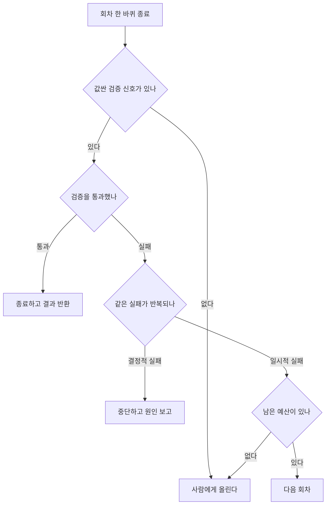
그림 1. 루프 종료 판단 — 상한 카운터 하나가 아니라 세 갈래 판정이 필요하다

그림 1에서 눈여겨볼 지점은 맨 위 분기다. 검증 신호가 없으면 나머지 판정이 전부 무의미해진다. 루프를 설계할 때 먼저 물어야 할 두 질문은 그래서 이렇게 정리된다. 값싼 검증 신호가 있는가, 그리고 종료 조건이 무엇인가.

### 컨텍스트 예산이 지배 변수다

비용도 실패도 결국 한 곳으로 수렴한다. 컨텍스트다. Anthropic의 실무 문서는 이 사정을 담담하게 적어뒀다. *"Claude's context window fills up fast, and performance degrades as it fills."* 컨텍스트 윈도는 빨리 차고, 차는 만큼 성능이 떨어진다. 크기를 키우면 해결되는 문제가 아니라는 게 여러 갈래 연구가 도달한 결론이다.

백엔드 개발자에게 이 사정을 가장 잘 옮겨주는 은유는 MemGPT(arXiv:2310.08560)에서 나왔다. **컨텍스트 윈도는 RAM, 외부 저장소는 디스크, 그래서 필요한 것은 페이징 정책이다.** RAM이 부족한 서버를 만났을 때 우리가 하는 일을 떠올려보자. 램을 늘리기도 하지만, 그보다 먼저 무엇을 메모리에 상주시키고 무엇을 스왑으로 내릴지를 정한다. 에이전트의 메모리도 같은 종류의 설계 문제다. 그런데 실무에서는 이 자리에 "메모리는 벡터 DB에 넣는다" 한 줄이 들어가고 끝나는 경우가 많다. 계층을 나누지 않으면 페이징 정책도 없는 셈이다.

계층으로 쪼개야 할 근거는 셋이다.

**하나, 위치가 성능을 바꾼다.** Lost in the Middle(arXiv:2307.03172)이 보여준 것은 긴 입력의 중간에 놓인 정보가 덜 쓰인다는 사실이다. 무엇을 넣느냐뿐 아니라 어디에 놓느냐가 세금처럼 붙는다.

**둘, 오래 도는 루프는 자기 역사를 잃는다.** 한 개발자는 이렇게 관찰한다. *"어려운 부분은 코드 양이나 토큰 비용이 아니다. 상태 연속성이다."* 그는 장기 실행 루프에서 대략 50~60턴을 넘으면 큰 컨텍스트 윈도가 있어도 앞선 정보에 가중치를 덜 주기 시작하고 이미 해결한 문제를 다시 풀기 시작한다고 말한다. 이 턴 수는 한 사람의 관찰이므로 임계값으로 외울 값은 아니다. 다만 메커니즘 쪽은 위의 연구가 뒷받침한다. 그리고 같은 관찰자의 처방이 실용적이다. 명시적 검색을 갖춘 파일 기반 메모리가 컨텍스트에 밀어넣기보다 더 신뢰할 만하다는 것이다.

**셋, 서브에이전트는 사실 별도의 컨텍스트 윈도다.** Claude Code 문서의 표현으로는 *"Subagents run in separate context windows and report back summaries"* — 서브에이전트는 분리된 컨텍스트 윈도에서 돌고 요약만 돌려준다.

이 소절의 결론은 한 줄로 요약된다. 메모리를 벡터 DB 하나로 뭉뚱그리지 말고 계층으로 쪼개자. 무엇을 항상 실을지, 무엇을 필요할 때 검색해 올릴지, 무엇을 파일로 내려두고 경로만 기억할지, 무엇을 다른 컨텍스트 윈도로 격리할지. 이 네 칸을 채우는 일이 컨텍스트 예산 설계다. 6장과 7장에서 데이터 계층을 고를 때, 여기서 나눈 칸이 그대로 기준으로 쓰인다.

### 루프를 여럿 돌릴 때

컨텍스트 이야기를 하다 보면 자연히 멀티에이전트로 넘어간다. 하나가 안 되면 여럿으로 나누자는 발상은 자연스럽다. 그런데 이 판단은 아직 논쟁 중이라 양쪽을 함께 봐야 한다.

이득이 있다는 쪽에는 Multiagent Debate(arXiv:2305.14325)가 있다. 여러 인스턴스가 서로 토론하게 하면 수학·전략 추론과 사실성이 향상된다는 보고다. 회의적인 쪽에는 MAST(arXiv:2503.13657, v3 2025-10-26)가 있다. 7개 프레임워크에서 1,600건이 넘는 실행 기록을 뜯어본 이 연구는 멀티에이전트의 성능 향상이 종종 미미하다고 적고, 실패를 14개 모드 3범주로 분류한다. 범주 이름 자체가 읽을 값이 있다. 시스템 설계, 에이전트 간 정렬, 태스크 검증이다. 셋 중 둘이 조율이 아니라 설계와 검증에 있다. 세 번째 관점은 현장에서 나온다. 한 개발자는 단일 에이전트로는 한 번의 호출에 담을 컨텍스트가 부족해서 병렬 에이전트가 필요하다고 말하며, 자기들이 사실상 *"에이전트를 스레드로, 역할을 함수로 취급하고 있다"*고 표현한다.

이 세 갈래를 나란히 놓으면 질문이 바뀐다. "멀티에이전트냐"가 아니라 **"왜 멀티에이전트냐"**다. 그리고 이 지점에는 공식 문서·논문·현장 경험이 각각 다른 경로로 도달한 답이 있어서 강하게 말할 수 있다. 정당한 이유는 둘이다. **컨텍스트 격리와 병렬성.** 서브에이전트의 실질 가치가 조율이 아니라 깨끗한 컨텍스트라는 관찰, 별도 컨텍스트 윈도라는 벤더 문서의 서술, 그리고 성능 향상이 종종 미미하다는 연구가 같은 곳을 가리킨다. 뒤집어 말하면 "정확도가 올라가니까"를 근거로 멀티에이전트를 제안하면 MAST가 반박한다. 정확도를 근거로 쓰고 싶다면 자기 도메인에서 직접 재본 숫자여야 한다.

숨은 비용도 둘이다. 하나는 청구서다. 팬아웃은 곱셈이라, 서브에이전트를 여럿 띄우면 앞 절에서 본 가파른 곡선이 그 수만큼 곱해진다. 한 개발자는 자기 지시를 에이전트가 잊어버려 값비싼 모델 여러 개가 동시에 돌아갔고 그 결과로 크레딧이 순식간에 사라졌다고 보고한다. 지시가 잊히는 일이 곧 비용 사고가 되는 구조라는 게 이 사례의 요점이다. 다른 하나는 더 조용하다. *"가장 과소평가된 문제는 상태 조율이다. …두 에이전트가 공유 상태에서 서로의 작업을 조용히 덮어쓰는 것을 막는 일. 고전적인 경쟁 조건인데, AI 시스템에서는 출력이 그럴듯해 보여서 프로덕션까지 알아채지 못한다."* 경쟁 조건은 백엔드 개발자에게 낯선 문제가 아니다. 낯선 것은 결과물이 그럴듯해서 아무도 알람을 못 받는다는 부분이다.

마지막으로 정의를 날카롭게 해주는 인용 하나를 남겨두자. *"하나를 고른다. 그게 돈다. 맞기를 바란다. 그건 멀티에이전트가 아니다 — 채팅 히스토리가 있는 단일 에이전트다."*

정의를 이렇게 좁혀두면 다음 결정도 좁아진다. 에이전트를 몇 개 둘지 세기 전에, 지금 도는 루프 하나가 무엇을 쥐고 무엇을 넘기는지부터 정하게 되기 때문이다.

### 이 장의 핵심

- 루프 비용은 회차에 비례하지 않는다. 회차마다 컨텍스트 전체가 다시 실리므로 그보다 가파르게 붙는다.
- 값싼 외부 검증 신호가 없는 루프는 개선이 아니라 낭비다. 신호가 없으면 회차를 늘리지 말고 사람에게 올린다.
- 회차 상한은 안전장치이고 종료 조건이 아니다. 상한만 걸면 어느 값으로 잡아도 틀린다.
- 메모리는 벡터 DB 하나가 아니라 계층이다. 무엇을 상주시키고 무엇을 내려둘지 정하는 것이 컨텍스트 예산 설계다.
- 멀티에이전트를 정당화하는 근거는 컨텍스트 격리와 병렬성이다. 정확도 향상을 근거로 쓰면 반박당한다.

정리하고 나면 한 가지가 계속 걸린다. 이 장의 규칙 대부분이 "검증 신호가 있다면"이라는 조건절에 매달려 있다는 점이다. 테스트가 있는 코딩 태스크라면 어렵지 않다. 그런데 사내 문서를 요약하는 에이전트, 고객 문의에 답하는 에이전트, 몇 개 시스템을 뒤져 보고서를 만드는 에이전트에게는 컴파일러도 테스트도 없다. 그렇다면 그 검증 신호는 어디서 구하나?


# 3장. 손을 달아주는 일 — MCP, A2A, 그리고 재시도라는 함정

도구 호출이 실패했을 때, 다시 부를지는 누가 결정할까?

이 질문을 받으면 백엔드 개발자는 반사적으로 답을 안다. 재시도 정책은 코드에 있다. 몇 번, 얼마 간격으로, 어떤 오류 코드에서 다시 부를지가 클라이언트 설정이나 서킷 브레이커에 적혀 있고, 그 파일은 리뷰를 거쳐 머지된다. 그런데 에이전트에서는 그 답이 통하지 않는다. 이 장은 도구를 붙이면 무엇이 늘어나는지 보고, 늘어난 것 가운데 가장 위험한 하나가 재시도라는 이야기를 한다.

### MCP는 LSP를 닮았다

도구를 붙이는 방식은 원래 벤더별로 흩어져 있었다. 모델마다 함수 정의 스키마가 다르고, 같은 도구를 세 벤더에 붙이려면 세 번 짰다. MCP가 표준화한 것이 이 지점이다.

MCP를 이해하는 최단 경로는 스펙 자신이 알려준다. 설계 계보를 Language Server Protocol(LSP)에서 얻었다고 밝히기 때문이다. 에디터마다 언어별 지원을 따로 만들던 세계에서, LSP는 에디터와 언어 서버 사이에 프로토콜 하나를 세워 M×N을 M+N으로 바꿨다. MCP가 하는 일이 정확히 같은 모양이다. 모델·에이전트 쪽과 도구·데이터 쪽 사이에 프로토콜을 하나 세운다.

구조도 낯설지 않다. JSON-RPC 2.0 위에, 상태를 유지하는 연결과 능력 협상(capability negotiation)이 얹혀 있다. 역할은 셋이다. 연결을 시작하는 LLM 앱이 Hosts, 호스트 안의 커넥터가 Clients, 컨텍스트와 능력을 제공하는 쪽이 Servers다.

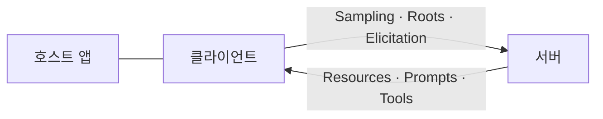
그림 1. MCP의 세 역할과 양방향 제공 능력 — 화살표가 한쪽으로만 흐르지 않는다

버전 이야기를 먼저 정리하고 넘어가자. 현행 스펙 리비전은 `2025-11-25`다(2026-07 기준). 이 점은 확인해둘 값이 있다. `2025-06-18`을 최신으로 적어둔 자료가 여전히 많이 돌아다닌다. 그리고 2026년에는 새 리비전이 나오지 않았다. 스펙은 안정화 국면이고, 움직이는 것은 SDK와 레지스트리다. 실제로 Python SDK는 `1.28.1`(2026-06-26), 레지스트리는 `v1.8.0`(2026-07-13)까지 왔지만 TypeScript SDK의 최신 릴리스는 `v1.29.0`(2026-03-30)으로 넉 달 가까이 태그가 멈춰 있다. 같은 프로토콜 이름 아래에서 언어별 SDK의 속도가 다르다는 것은 도입 계획을 세울 때 실제로 걸리는 사정이다. **스펙이 멈춰 있다는 말과 생태계가 멈춰 있다는 말은 다르다.**

라이선스는 따로 봐야 한다. MCP 스펙 레포의 라이선스 판정이 `NOASSERTION`이라, 2026년 7월 기준으로는 "MCP는 오픈소스다"라고 단정할 근거가 없다. 사내 배포 정책을 통과해야 한다면 문구를 직접 확인하는 편이 낫다.

### 한국어 자료가 자주 빠뜨리는 절반

MCP 소개 글을 몇 개 읽어보면 대개 서버 쪽 이야기로 끝난다. 서버가 제공하는 것은 셋이다. Resources는 컨텍스트와 데이터, Prompts는 템플릿 워크플로, Tools는 모델이 실행하는 함수다. 여기까지는 어디에나 나온다.

그런데 그림 1의 아래쪽 화살표를 보자. 클라이언트도 제공한다. Sampling은 서버가 주도해 LLM 호출을 다시 요청하는 것이고, Roots는 URI와 파일시스템 경계를 알려주는 것이고, Elicitation은 서버가 사용자에게 추가 정보를 요청하는 통로다. 이 셋을 빼놓고 MCP를 이해하면 "도구 목록을 꽂는 규격"으로만 남는다.

셋 다 설계 결정으로 이어진다. Sampling이 있다는 것은 서버가 모델을 다시 쓸 수 있다는 뜻이므로, 비용과 루프의 발원지가 우리 코드 밖에도 생긴다는 뜻이다. Roots가 있다는 것은 파일시스템 경계를 프로토콜 층에서 다룰 수 있다는 뜻이고, Elicitation이 있다는 것은 사람에게 묻는 지점을 서버가 열 수 있다는 뜻이다. 2장에서 남긴 질문 하나가 여기서 실마리를 얻는다. 검증 신호가 없을 때 사람에게 올리는 통로 말이다. 그 통로가 프롬프트 안의 부탁이 아니라 프로토콜의 기능일 수 있다.

### 수직과 수평 — MCP와 A2A는 경쟁하지 않는다

MCP와 나란히 언급되는 이름이 A2A다. 둘을 경쟁 관계로 소개하는 자료가 있는데, 그렇게 읽으면 설계가 꼬인다. 방향이 다르다.

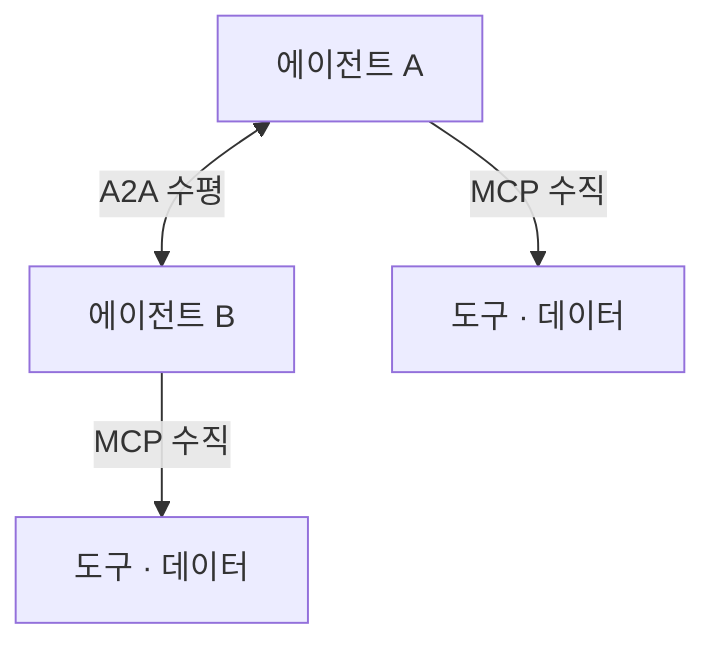
그림 2. MCP는 수직, A2A는 수평 — 두 축은 직교한다

**MCP는 에이전트와 도구·컨텍스트 사이의 수직 방향이고, A2A는 에이전트와 에이전트 사이의 수평 방향이다.** 한 시스템이 둘을 동시에 쓰는 것이 자연스럽고, 실제로 Google ADK는 양쪽을 함께 내장한다.

A2A는 `v1.0.0`에 도달했다(릴리스 2026-05-28). 핵심 개념 둘만 기억해두면 나머지는 따라온다. 하나는 Agent Card로, 스펙의 표현으로는 *"A JSON metadata document ... describing its identity, capabilities, skills, service endpoint, and authentication requirements"* — 정체·능력·스킬·엔드포인트·인증 요구사항을 담은 JSON 메타데이터 문서다. 서비스 디스커버리 문서를 에이전트용으로 만든 것이라고 보면 감이 온다. 다른 하나는 Task로, *"The fundamental unit of work managed by A2A ... stateful and progress through a defined lifecycle"* — 상태를 갖고 정의된 생애주기를 따라 진행하는 작업의 기본 단위다. 전송은 JSON-RPC 2.0, gRPC, HTTP+JSON 세 바인딩을 지원하고, 스트리밍은 SSE, 비동기 통지는 웹훅 푸시를 쓴다.

여기서 한 가지 조심할 것이 있다. A2A를 "Google 프로젝트"나 "Linux Foundation 프로젝트"로 소개하는 자료가 있는데, 스펙 사이트가 명시하는 것은 `a2aproject` 커뮤니티 거버넌스뿐이다. 거버넌스 귀속은 사내 채택 심사에서 실제로 질문받는 항목이니, 확인되지 않은 소속을 옮겨 적지 않는 편이 안전하다.

### 공식 문서가 말하지 않는 것 — 도구를 붙이면 컨텍스트가 붙는다

프로토콜 문서를 읽고 나면 도구를 붙이는 일이 깔끔한 배관 작업처럼 느껴진다. 현장 서술을 읽으면 다른 그림이 나온다.

첫째, 도구 정의는 매 요청마다 실린다. 한 개발자의 관찰이 이 사정을 정확히 짚는다. *"MCP 툴은 매 요청마다 전송된다. notion MCP를 보면 search 툴 설명이 사실상 미니 튜토리얼이다. 이게 컨텍스트 윈도로 곧장 들어간다."* **도구를 하나 붙이는 결정은 사실 모든 요청의 입력 토큰을 늘리는 결정이다.** 2장에서 본 가파른 곡선의 출발점이 여기서 한 칸 올라간다.

둘째, 도구 출력도 컨텍스트로 곧장 들어온다. MCP를 옹호하는 쪽에서도 이 대목은 인정한다. *"더 나쁜 문제는 MCP의 출력이 어딘가로 파이프되는 대신 에이전트의 컨텍스트로 곧장 들어간다는 점이다."* 셸에서 우리가 하는 일과 대비하면 아쉬움이 선명해진다. 우리는 큰 출력을 파이프로 넘기고 필요한 줄만 뽑는다. 에이전트는 기본적으로 전문을 읽는다. 그래서 **도구의 출력 크기를 줄이는 일이 프롬프트를 다듬는 일보다 효과가 클 때가 많다.**

셋째, 도구가 많아지면 에이전트가 더 나빠진다. *"에이전트가 너무 많은 선택지에 혼란스러워진다. 플러그인 인터페이스 뒤에 '숨겨두는' 게 실제로 프로덕션에서 에이전트 안정성에 더 좋다"*는 관찰이 있다. 도구 서른 개를 꽂아두면 서른 개를 쓸 수 있는 에이전트가 되는 게 아니라, **서른 개 중에서 헤매는 에이전트가 된다.**

세 번째 항목은 API 설계 감각으로 옮기면 더 잘 보인다. 우리가 외부에 공개하는 REST API를 떠올려보자. 엔드포인트를 서른 개 열어두면서 문서와 예시를 각각 붙여두면, 클라이언트 개발자는 자기 화면에 필요한 세 개를 찾아내야 한다. 사람은 그걸 검색과 경험으로 해낸다. 모델은 매 요청마다 서른 개 설명을 처음 읽는 신입 개발자처럼 행동한다. 그러니 도구를 설계할 때 좋은 질문은 "이 기능을 노출할까"가 아니라 "이번 태스크를 끝내는 데 필요한 최소 호출 집합이 무엇인가"다. 도메인 하나를 처리하려고 네 번 부르게 만들어둔 도구 네 개를, 한 번에 끝나는 도구 하나로 합치는 편이 나은 경우가 많다. 4장에서 볼 국내 사례가 정확히 그 작업의 실측 기록이다.

이 셋을 합치면 이 장의 첫 번째 실무 규칙이 나온다. **도구 표면은 최소로 유지하는 편이 낫다.** 여기서는 컨텍스트 팽창과 선택지 혼란이라는 근거만으로도 충분하다. 같은 규칙에는 훨씬 무거운 근거가 하나 더 있는데, 그건 권한과 보안 이야기라서 10장이 따로 가져간다.

### 재시도 정책이 프롬프트 안에 있다

이제 장을 열었던 질문으로 돌아가자. 도구 호출이 실패했을 때 다시 부를지는 누가 결정하나. 한 개발자가 이 질문에 이 책이 훔칠 만한 답을 적어뒀다.

> *"전통적 클라이언트는 재시도할지를 코드가 결정하지만, 에이전트는 모델이 결정합니다. 모델은 도구가 실패했다고 판단하면(혹은 실패했다고 오판하면) 그냥 다시 부릅니다. 재시도 정책이 프롬프트 안에 있는 셈이고, 그건 정책이 아니라 확률입니다."*

**정책이 아니라 확률.** 이 문장을 읽고 나면 재시도 관련 코드 리뷰를 하는 감각이 바뀐다. 우리는 `max_retries=3`을 리뷰하고 있었는데, 실제로 재시도를 결정하는 것은 프롬프트에 적힌 문장과 모델의 그날 판단이다. 게다가 모델은 실패했다고 오판할 수도 있다.

프로토콜이 이걸 대신 막아주면 좋겠지만, 사정은 이렇다. 같은 저자의 별개 문장이다.

> *"즉 MCP는 멱등성에 대해 어휘는 주지만 도구는 주지 않습니다. 서버가 '나는 멱등해요'라고 주장할 수는 있는데, 그 주장은 (a) 강제되지 않고 (b) 신뢰할 수 없는 서버에서 오면 믿지 말라고 스펙이 직접 경고하며 (c) 멱등하지 않은 도구를 재시도 안전하게 만들 방법은 프로토콜에 아예 없습니다."*

근거는 스키마에서 직접 확인된다. 2,573줄짜리 스키마 전체에서 `idempotentHint`는 선언되는 그 한 곳에만 등장하고, `retry`라는 단어는 스키마에 한 번도 나오지 않는다. 즉 **멱등성을 말할 어휘는 있지만, 그 주장을 검사하거나 강제할 장치는 없다.** 같은 저자는 애노테이션 기본값들을 훑고 나서 이렇게 정리한다. 애노테이션이 없으면 모든 도구는 파괴적이고 멱등하지 않은 쓰기 작업으로 취급해야 한다는 뜻이며, *"이건 좋은 설계입니다."* 프로토콜이 비관적 기본값을 택했다는 것은, 낙관은 우리 코드가 근거를 들고 만들어야 한다는 뜻이다.

가장 비직관적인 결과는 그다음에 온다. 멱등 재시도를 제대로 구현하면 루프가 오히려 늘어날 수 있다. 널리 쓰이는 결제 API의 멱등 키 관행을 예로 들며 저자는 두 가지를 지적한다.

> *"하나는 500까지 재생한다는 것 — 멱등 재시도는 '다시 시도'가 아니라 '원래 결과를 다시 보여주기'입니다. 모델이 실패를 보고 재시도하면 실패를 다시 봅니다. 이건 버그가 아니라 설계이고, 모델이 이걸 이해하지 못하면 무한 루프에 빠집니다. 다른 하나는 24시간입니다. 며칠에 걸쳐 도는 장기 실행 에이전트가 어제의 키로 재시도하면, 그건 재시도가 아니라 새 부작용입니다."*

이 두 숫자는 저자가 서술한 내용이고, 이 책이 해당 벤더의 동작을 직접 확인한 것은 아니다. 그러니 특정 API의 스펙으로 외우지는 말자. 지금 쓰는 결제·발송 API의 멱등 동작은 그 벤더의 현재 문서에서 확인하는 게 맞다. 그러나 논지 자체는 벤더와 무관하게 성립한다. **멱등 재시도는 사람이 짠 클라이언트를 전제로 설계된 관행이다.** 사람이 짠 코드는 같은 응답을 두 번 받으면 로그를 남기고 멈춘다. 모델은 같은 실패를 두 번 보면 세 번째를 시도한다. 초난감한 상황은 이렇게 만들어진다. 부작용 방지를 위해 넣은 장치가 루프의 연료가 되는 것이다.

그러면 어떻게 해야 할까. 여기서 이 책의 관점 하나를 저자의 종합으로 밝혀두겠다. **추론은 확률적으로 하게 두고, 집행은 결정적으로 만드는 편이 낫다.** 이것은 어느 소스가 그 문장으로 말해준 합의가 아니라, 서로 다른 층위의 근거 셋을 내가 한 줄로 묶은 것이다. 근거 하나는 벤더 문서다. 함수로 되면 함수로 하라는 권고와 단순한 것부터 시작하라는 권고가 "무엇을 모델에게 맡길지"를 좁히라고 말한다. 둘은 논문 쪽이다. 검증기 없는 루프를 넣지 말라는 원칙이 "루프를 어떻게 설계할지"를 규정한다. 셋은 방금 본 현장 서술이다. 재시도가 확률이라면, 부작용의 경계는 프롬프트가 아니라 코드가 그어야 한다. 세 근거의 층위가 다르므로 업계 합의로 읽지는 말고, 내 종합으로 읽어주기 바란다.

### 가장 위험한 실패는 성공 뒤에 숨어 있다

그리고 이 장에서 가장 조심할 지점이 하나 남았다. 지금까지는 도구가 실패한 경우를 이야기했다. 더 위험한 쪽은 반대다.

> *"재시도가 위험한 건 도구가 실패했을 때만이 아닙니다. 도구가 성공했는데 응답이 유실됐을 때가 더 위험합니다. 이때 모델이 보는 건 '결과 없음'이고, 모델의 합리적 행동은 재시도입니다. 그리고 부작용은 이미 일어났습니다."*

타임아웃, 커넥션 리셋, 게이트웨이의 502. 우리가 익숙하게 다루던 상황이다. 다만 익숙한 처방이 여기서는 반대로 작동한다. 사람이 짠 클라이언트라면 응답 유실 뒤 재시도는 대개 옳다. 모델이 결정하는 재시도에서는 그 옳음이 보장되지 않는다. 결제가 두 번 될 수도 있고, 메일이 두 번 나갈 수도 있다.

그래서 이 장이 도구 표면에 대해 남기는 것은 세 가지다. 첫째, 노출을 줄이면 컨텍스트도 줄고 모델이 헤맬 여지도 줄어든다. 이번 태스크에 필요한 도구만 보이게 하는 것으로 두 문제가 함께 완화된다. 둘째, **부작용의 경계는 프롬프트 밖에 있어야 한다.** 재시도를 결정하는 쪽이 확률이라면, 두 번 일어나면 안 되는 일을 막는 장치는 그 확률 바깥에 있어야 하기 때문이다. 그 장치를 어느 층에 어떻게 거는지는 10장이 따로 다룬다. 셋째, **응답 유실을 실패와 구분한다.** 도구 호출의 결과를 우리 쪽에 먼저 기록해두면, "결과 없음"을 만난 모델이 재시도하기 전에 코드가 그 호출의 진짜 결말을 알고 있다.

여기까지 읽었으면 지금 당장 해볼 일이 하나 있다. 지금 만들고 있는 에이전트에 붙어 있는 도구 목록을 열어보자. 그리고 이번 태스크에 정말 필요한 것에 표시를 해보자. 표시가 안 붙은 것이 몇 개인가? 그 개수가 매 요청마다 실려 나가는 무게이고, 모델이 헤맬 선택지의 수이며, 언젠가 예상하지 못한 순서로 불릴 후보의 수다.


# 4장. SDK 위의 새 층 — 하네스라는 것이 왜 2026년에 생겼나

*"마구(馬具)처럼 에이전트의 행동을 묶고, 방향을 잡고, 안전하게 제어하는 구조."*

AWS Korea 기술블로그가 2026-04-22 글에서 쓴 표현이다. 며칠 앞선 2026-04-17에는 우아한형제들 기술블로그에 이런 문장이 올라왔다. *"AI가 길을 잃지 않고 안정적으로 일할 수 있도록 외부 통제 환경을 구축하는 것."*

같은 달에, 서로 다른 조직에서, 같은 것을 가리키는 정의가 두 번 나왔다는 뜻이다. 그리고 뒤쪽 글은 그 정의에 이름까지 붙여둔다. *"최근 업계에서 이를 '하네스 엔지니어링(harness engineering)'이라고 부르며 중요성을 강조하고 있는 것도 같은 맥락일 것입니다."*

두 글 다 벤더 기술블로그이므로 2차 소스로 읽어야 한다. 그래도 흥미로운 사실 하나는 남는다. 국내 두 조직이 한 주 간격으로, 서로를 인용하지 않고 같은 단어를 꺼냈다. 말을 다루는 도구에서 온 비유다. 고삐와 안장은 말을 더 빠르게 만들지 않는다. 말이 어디로 갈지를 사람이 정할 수 있게 만든다. 하네스(harness)라는 말이 2026년에 갑자기 늘어난 이유가 그 대비 안에 있다.

비유를 조금 더 밀어보면 이 말을 왜 골랐는지가 보인다. 마구를 채우는 쪽은 사람이고, 채운 뒤에도 달리는 쪽은 말이다. 말의 힘을 줄이지 않으면서 방향과 멈춤을 사람 쪽에 남겨두는 장치가 마구다. 에이전트 이야기로 옮기면 이렇게 된다. 모델의 판단력을 깎지 않으면서, 어디까지 갈 수 있고 어디서 멈추는지를 우리 코드 쪽에 남겨두는 층. 2장에서 종료 조건을 이야기하고 3장에서 부작용 경계를 이야기했으니, 그 두 이야기가 갈 자리가 이제 생긴 셈이다.

### 프레임워크를 골랐다고 결정이 끝나지 않는다

2장과 3장을 지나온 지금, 우리 손에는 해결되지 않은 목록이 하나 있다. 컨텍스트를 무엇으로 채우고 무엇을 버릴지, 긴 작업의 할 일 목록을 어디에 적어둘지, 도구 승인을 어디서 물어볼지, 무슨 일이 있었는지를 어떻게 남길지. 프레임워크를 하나 고른다고 이 목록이 채워지지 않는다.

그런데 2026년의 지형에서 눈에 띄는 변화가 있다. **이 목록을 미리 조립해서 파는 층이 생겼고, 서로 다른 네 조직이 비슷한 시기에 같은 이름을 붙였다.** 층을 두 개로 나눠 보자.

**SDK 층**은 루프·도구 호출·핸드오프만 제공한다. 대표적으로 OpenAI Agents SDK는 자기 소개에서 추상화가 *"very few abstractions"*라고 밝히고, 원시 개념을 다섯 개(Agents/Handoffs/Guardrails/Sessions/Runner)로 유지한다. 추상화를 최소화한 SDK 층이라는 성격이 그 다섯 개에 그대로 드러난다.

**하네스 층**은 그 위에서 계획·todo 추적·컨텍스트 압축·파일과 메모리 접근·도구 승인 정책·관측성(observability)을 미리 조립해서 준다. 같은 용어를 쓴 제품들을 나란히 놓아보자.

- `deepagents`는 자기를 *"The batteries-included agent harness"*로 소개한다. LangGraph 위에 계획·서브에이전트·컨텍스트 관리를 얹어주는 층이고, 버전은 `0.6.12`(릴리스 2026-06-25, 2026-07 기준)다.
- Strands는 레포 이름 자체를 `strands-agents/sdk-python`에서 `strands-agents/harness-sdk`로 바꿨다. Python 패키지는 `1.50.1`(2026-07-24 기준). SDK라는 이름을 하네스로 갈아치운 셈이니, 용어 이동이 문서가 아니라 레포 주소에서 일어났다.
- Microsoft Agent Framework의 Harness는 문서가 아예 목록을 적어뒀다. *"An opinionated agent with batteries-included capabilities for long, multi-step tasks — planning and todo tracking, context compaction, file access and memory, don't-ask-again tool approval, and observability."* 프레임워크 버전은 `1.12.1`(2026-07-23 기준)이다.
- Claude Agent SDK는 Claude Code의 에이전트 루프를 그대로 라이브러리로 노출한 것이다. 파일 도구·서브에이전트·훅·권한이 그 안에 함께 온다. Python 쪽 릴리스가 `v0.2.128`(2026-07-25 기준)까지 올라와 있다. 릴리스 번호가 세 자리라는 것 자체가 이 층의 배포 빈도를 말해준다.

왜 하필 이 시점인가? 순서를 되짚어보면 자연스럽다. 처음에는 벤더 API에 도구 호출이 붙었고, 그 위에 루프를 돌려주는 얇은 층이 생겼다. 그 단계에서는 추상화를 줄이는 것이 미덕이었다. 도구 두세 개를 부르고 답을 만드는 작업에는 루프와 핸드오프면 충분했으니까. 그런데 사람들이 에이전트에게 맡기는 작업의 길이가 늘어났다. 수십 분에서 몇 시간, 도구 호출 수십 번, 중간 산출물 여러 개. 2장에서 본 컨텍스트 예산 문제와 3장에서 본 도구 표면 문제가 이 길이에서 폭발한다. 그러니 위층은 누군가의 아이디어가 아니라 작업 길이가 만든 수요다.

목록을 읽으면서 위의 Microsoft 인용문과 대조해보자. 계획, todo 추적, 컨텍스트 압축, 파일 접근과 메모리, 다시 묻지 않는 도구 승인, 관측성. 우리가 2장과 3장에서 미해결로 남겨둔 항목들과 거의 겹친다. 서로 다른 조직이 같은 목록에 도달했다는 것은, 이 항목들이 취향이 아니라 긴 작업을 돌리면 반드시 만나는 문제라는 뜻이다.

### 세 층으로 보기

이 층 이야기를 가장 깔끔하게 보여주는 것은 LangChain 진영의 배치다. 아래에 저수준 오케스트레이션과 런타임인 `langgraph`가 있고, 그 위에 `langchain`의 `create_agent`가 진입 경로로 있고, 그 위에 `deepagents`가 하네스로 얹힌다.

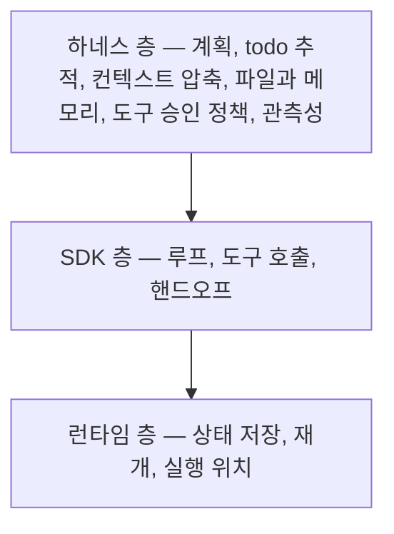
그림 1. 런타임·SDK·하네스 세 층 — 위층은 아래층을 대체하지 않고 그 위에 조립된다

각 층의 성격을 이 책의 표현으로 고정해두자. 뒤 장들이 같은 말을 계속 쓴다.

LangGraph는 저수준 오케스트레이션과 런타임이다. 명시적 그래프 상태, 감사 추적, 재개, 사람 개입 승인이 요구사항일 때 고른다. 대가는 보일러플레이트다. 공식 문서 스스로 초보자에게는 `create_agent`를 권한다. 그 `create_agent`는 LangGraph 위의 진입 경로이고, 그래프를 직접 다루지 않아도 되는 기본값이다.

그리고 하네스 층은 위에서 본 목록을 미리 조립해 제공하는 층으로, **긴 다단계 작업에 쓴다.** 뒤 장들이 이 세 규정을 그대로 다시 쓰므로, 지금 이 자리를 기준점으로 삼아도 좋다.

여기서 잠깐 멈추고 생각해보자. 이 그림이 왜 결정에 영향을 주는가? 프레임워크 비교 표만 놓고 고르면 우리는 같은 층 안에서만 비교하게 된다. 그런데 실제 질문은 "어느 프레임워크냐"가 아니라 "우리 과제에 몇 개 층이 필요한가"인 경우가 많다. 층을 모르면 SDK 하나를 고른 뒤 위층에 해당하는 일을 전부 직접 만들면서, 자기가 무엇을 만들고 있는지도 모른 채 시간을 쓴다. 반대로 짧은 작업에 하네스를 얹어놓고 왜 이렇게 느리고 비싼지 의아해하기도 한다.

### 사례 — 팀 규약을 AI 환경에 구조화하기

층 이야기를 추상적으로 끝내지 않으려면 실측 기록이 하나 필요하다. 우아한형제들 사례를 보자. 앞서 인용한 2026-04-17 기술블로그 글로, 저자가 확인된 2차 소스다. 사내 API를 다루는 에이전트 작업 환경을 정비한 기록이다.

이 글의 핵심 주장은 개인의 프롬프트 역량이 아니다. **팀 규약을 AI 환경에 구조화하는 것**이 성능을 가른다는 쪽이다. 규약을 문서로만 두면 사람은 눈치로 지키지만 에이전트는 매번 처음부터 읽는다. 그래서 규약을 도구·파일·경계의 모양으로 환경에 박아 넣는다.

결과가 컨텍스트 크기로 남아 있다.

| 규모 | 전처리 전 | 전처리 후 |
|------|---------|---------|
| 대규모 | 41,944 bytes | 1,763 bytes |
| 중규모 | 29,386 bytes | 668 bytes |
| 소규모 | 9,749 bytes | 539 bytes |

그리고 API 도메인 하나를 처리할 때의 도구 호출이 4회에서 1회로 줄었다. 3장 끝에서 도구 네 개를 하나로 합치는 편이 나은 경우가 많다고 했는데, 그 작업의 실측치가 이 한 줄이다.

표가 알려주는 것은 어느 제품이 좋다는 이야기가 아니다. 모델과 도구 사이에 전처리 계층이 하나 들어갔고, 그 계층이 응답에서 이번 작업에 필요한 부분만 남겼다는 것이다. 4만 바이트가 컨텍스트로 들어오면 그 안의 대부분은 이번 판단에 쓰이지 않는 필드다. 쓰이지 않는데도 값은 매 회차 지불된다. 백엔드에서 우리가 응답 DTO를 화면별로 나누는 이유와 정확히 같은 종류의 최적화다. 다른 점은 소비자가 브라우저가 아니라 모델이고, **낭비의 청구서가 대역폭이 아니라 토큰으로 온다는 것**뿐이다.

이 표를 규모별 세 행으로 그대로 옮긴 데는 이유가 있다. 이 수치를 하나의 평균 절감률로 뭉쳐 인용한 자료가 돌아다니는데, 원문에 그런 단일 숫자는 없다. 규모에 따라 감소 폭이 다르다는 것 자체가 정보다. 큰 응답일수록 잘라낼 것이 많고, 작은 응답에서는 절감이 상대적으로 덜하다. 그래서 우리 시스템에서 얼마나 줄 수 있는지는 우리 응답의 크기 분포를 봐야 안다.

### 언제 하네스이고 언제 SDK인가

이제 판단 기준이다. **긴 다단계 작업이라면 하네스부터 보는 편이 낫다.** 코딩 에이전트나 리서치 에이전트처럼 수십 번의 도구 호출과 중간 산출물이 쌓이는 작업에서는, 계획·압축·승인·기록을 결국 만들게 된다. 남이 조립해둔 것을 쓰는 편이 싸다.

반대로 **도구 호출 1~3회짜리 짧은 작업에는 SDK만으로 충분하고, 하네스는 오히려 비용과 지연을 늘린다.** 계획 단계를 위해 모델을 한 번 더 부르고, 압축을 위해 또 부르고, 남기기 위해 또 쓴다. 세 번 부르면 끝날 일에 그 오버헤드를 얹는 것은 아깝다.

그러니 도구를 고르기 전에 자기 과제의 길이를 재보자. 한 번의 사용자 요청이 도구 호출 몇 번으로 끝나는가? 중간 산출물을 다음 단계가 다시 읽어야 하는가? 사람이 중간에 승인해야 하는 지점이 있는가? 이 셋에 답하면 몇 개 층이 필요한지가 대체로 드러난다.

미리 조립된 것을 산다는 데에는 늘 같은 대가가 따른다는 점도 챙겨두자. 조립 방식이 우리 요구와 어긋날 때 뜯어내기가 번거롭다. 컨텍스트를 어느 시점에 어떻게 압축하는지, 승인 프롬프트를 언제 띄우는지가 우리 도메인의 규칙과 맞지 않으면, 그 층을 우회하는 코드를 쓰게 된다. 그래서 하네스를 볼 때는 기능 목록만 읽지 말고 그 층이 정한 기본 정책을 함께 읽는 편이 낫다. 이 감각은 5장에서 프레임워크를 고를 때 쓰는 감각과 같은 것이다.

3장의 문제와 이어 붙이면 하네스가 파는 것의 정체가 더 분명해진다. 도구 정의가 매 요청마다 실리고 도구 출력이 컨텍스트로 곧장 들어온다는 문제 앞에서, 하네스가 내놓는 상품의 상당 부분은 결국 **컨텍스트 압축과 승인 정책**이다. 다시 말해 하네스는 새로운 능력을 파는 층이 아니라, 2장과 3장에서 우리를 난감하게 만든 항목들을 미리 처리해둔 층이다.

층이 보이면 지형도가 다르게 읽힌다. 스무 개가 넘는 프레임워크 이름을 한 줄로 늘어놓으면 무엇을 골라야 할지 막막하지만, 각 이름이 어느 층에서 무엇을 대신해주는지를 물으면 목록이 줄어든다. 그러면 이제 그 지형도를 펼쳐볼 차례다.


# 5장. 프레임워크 지형 — 무엇으로 갈리고, 언제 직접 만드나

새 프로젝트의 기술 스택 회의에 들어갔다고 해보자. 아젠다는 한 줄이다 — "에이전트 프레임워크 선정". 그런데 누군가 미리 정리해온 후보 목록이 스무 개를 넘는다. 이름은 다 들어봤고, 각각의 README는 다 그럴듯하다. 회의 시작 10분 만에 대화는 "그거 써본 사람 있어요?"로 흘러간다.

이 상황에서 후보를 하나씩 비교하는 방식은 끝이 없다. 스무 개를 두 명이 각각 반씩 조사해도, 조사가 끝날 무렵에는 새 후보가 셋쯤 더 생겨 있다. 그러니 제품을 줄이는 대신 **축을 세우자.** 축이 있으면 새로 나온 것도 놓을 자리가 생긴다.

축을 세 개 세우자. 그래프냐 위임이냐, 어느 언어 생태계냐, 이게 지금 살아 있는 프로젝트인가. 그리고 마지막으로 "아예 안 산다"는 선택지까지 놓고 보면 된다.

### 축 ① 명시적 그래프 상태냐, 역할 기반 자율 위임이냐

첫 축은 제어를 누가 쥐느냐다.

한쪽 극단에는 LangGraph가 있다. 자기 정의가 이미 성격을 다 말해준다 — *"a low-level orchestration framework and runtime for building, managing, and deploying long-running, stateful agents"*. 상태 전이를 그래프로 명시하고, 결정적으로 코딩한 단계와 LLM이 주도하는 단계를 같은 그래프 안에서 섞는다. 감사 추적과 재개, 사람 개입 승인이 요구사항이거나 상태 전이를 코드로 설명해야 하는 규제 도메인이라면 이쪽이 맞다.

대가는 보일러플레이트다. 이건 비판자의 주장이 아니라 공식 문서가 스스로 인정하는 부분이다 — 초보자에게는 그래프를 직접 다루는 대신 LangChain의 `create_agent`부터 쓰라고 권한다. 참고로 흔한 오해 하나를 여기서 정리하자. "LangGraph를 쓰려면 LangChain이 필요하다"는 말은 사실이 아니다. 공식 문서가 *"you don't need to use LangChain to use LangGraph"*라고 못 박는다.

반대쪽 극단은 CrewAI다. 역할(role)과 목표(goal)를 선언하면 팀이 구성되고, 누가 무엇을 할지 **위임 판단을 LLM이 한다.** 선언이 짧고 결과가 인상적이어서 데모가 가장 잘 나오는 방식이기도 하다.

그런데 여기서 아주 흥미로운 사실이 하나 있다. CrewAI는 Crews 말고 Flows를 별도로 두고 있다. 공식 설명은 *"event-driven workflows requiring state management, conditional branching, human oversight, or orchestration across multiple crews"*용이고, `@start`·`@listen`·`@router`·`@persist` 같은 프리미티브를 쓴다. 무슨 뜻일까? **역할 기반 자율 위임의 대표 프레임워크가 "자율 위임만으로는 프로덕션이 안 된다"를 제품 구조로 인정한 셈이다.** 축을 이해하는 데 이보다 좋은 증거를 찾기 어렵다.

그 사이에 Google ADK가 있다. 완전 자율과 완전 명시 사이에 Sequential·Parallel·Loop 3종 템플릿을 두는 템플릿 중간항이고, 2.0부터 그래프 워크플로도 들어왔다.

| 도구 | 버전 (2026-07 기준) | 이 책이 쓰는 성격 규정 |
|------|-------------------|--------------------|
| LangGraph (Python) | `1.2.9` | 저수준 오케스트레이션 + 런타임. 명시적 그래프 상태·감사 추적·재개·사람 개입 승인이 요구사항일 때. 대가는 보일러플레이트 |
| LangChain `create_agent` | `langchain-core 1.5.1` | LangGraph 위의 진입 경로. 그래프를 직접 다루지 않아도 되는 기본값 |
| CrewAI (Crews) | `1.15.6` | 역할·목표 선언 기반 자율 위임. 위임 판단을 LLM이 한다 |
| CrewAI Flows | 같은 패키지 | 결정적 분기 + 상태 관리 + 사람 개입이 필요할 때 |
| Google ADK (Python) | `v2.5.0` | 자율과 명시 사이의 템플릿 중간항. A2A·MCP 내장 |

### 축 ② 언어와 타입 시스템 — 가장 실질적인 기준

두 번째 축은 김빠질 만큼 실용적이다. **우리 팀이 쓰는 언어와 타입 시스템에 맞느냐.**

이 축을 낮게 보는 사람이 많다. "파이썬으로 에이전트만 따로 띄우면 되지"라고 생각하기 쉽다. 그런데 에이전트는 결국 우리 서비스의 도메인 객체를 만지고, 우리 인증을 통과해야 하고, 우리 배포 파이프라인에 올라가야 한다. 언어가 다르면 그 접점 전부가 새 코드가 된다. 그리고 팀에서 그 코드를 리뷰할 수 있는 사람이 줄어든다. 그래서 이 축은 프레임워크의 기능 목록보다 대체로 더 세다.

| 스택 | 선택지 (2026-07 기준) | 이 책이 쓰는 성격 규정 |
|------|---------------------|--------------------|
| FastAPI·Pydantic | Pydantic AI `2.18.0` | 타입 안전 + 의존성 주입. FastAPI/Pydantic 스택에서 학습 곡선 최소 |
| Node·Next.js | Mastra `1.52.1` | TypeScript 네이티브 풀스택 — 에이전트·워크플로·RAG·평가·로컬 playground 일체 |
| JVM (Java·Kotlin) | Google ADK Java `v1.7.0` | 언어를 바꾸지 않고 들어갈 수 있는 사실상 유일한 대형 선택지 |
| .NET·C# | Microsoft Agent Framework `1.12.1` | Semantic Kernel·AutoGen의 공식 후속. .NET 우선 + Python·Go(preview) |
| Go | Google ADK Go `v2.1.0` | Go 진영 최대 규모 |

JVM·Go 진영이라면 선택지가 좁다는 사실 자체가 정보다. 후보가 스무 개라는 착시는 대체로 파이썬 생태계를 볼 때만 성립한다.

### 축 ③ 죽어가는 것을 피하는 절차

세 번째 축이 실무에서 가장 비싸다. 프로젝트 중반에 의존하는 프레임워크의 릴리스가 멈추면, 우리가 할 수 있는 일이 거의 없다.

그런데 이 절에서 "이건 쓰지 마라"고 적어주는 건 정직하지 않다. 그런 판정은 6개월이면 낡고, 낡은 판정은 반쯤 틀린 채로 인용된다. 그래서 결론 대신 절차를 주려고 한다. 6개월 뒤에도 독자가 직접 돌릴 수 있는 절차다.

신호는 넷이다.

1. 최신 릴리스 이후 경과 시간. 몇 달인지 센다.
2. 마지막 push와 릴리스의 격차. 둘 다 봐야 한다. 커밋이 릴리스보다 한참 앞서가는 경우도 신호인데, 방향이 반대다 — 정체가 아니라 릴리스 태깅을 안 하는 관행일 수 있다.
3. 공식 후속 문서의 존재. 벤더가 "이건 후속이 있다"고 명문화했는지.
4. 자기 정의의 이동. 저장소 소개문이나 홈페이지 한 줄이 바뀌었는지. 이게 가장 조용하고 가장 중요한 신호다.

확인 방법도 함께 두자. 이 책의 버전 원장이 정확히 이 방법으로 만들어졌다.

```
# 최신 릴리스 태그와 발행일
gh api repos/{owner}/{repo}/releases/latest

# 저장소 메타 — archived 플래그와 pushed_at
gh api repos/{owner}/{repo}

# 패키지 레지스트리의 최신 배포 시점
https://pypi.org/pypi/{package}/json
https://registry.npmjs.org/{package}/latest
```

첫 명령에서 404가 돌아오는 경우가 있다. 이때 "죽은 저장소"라고 판정하면 오독이다. 릴리스를 태깅하지 않고 태그만 굴리는 프로젝트가 적지 않고, 그런 저장소는 `releases/latest`에 답이 없어도 태그 목록에는 버전이 있다. 이 책의 버전 원장에도 그렇게 태그에서 읽어온 값이 몇 개 있다. 그러니 404가 났으면 두 번째 명령의 `pushed_at`을 보자. 404인데 push가 최근이면 판정은 정체가 아니라 **릴리스 노트를 안 쓰는 프로젝트**다.

네 신호를 실제로 읽으면 어떤 모양이 나오는지 보자. 아래는 2026-07-25에 위 절차로 확인한 값이고, 읽는 법 칸이 이 절의 핵심이다.

| 도구 | 신호 (2026-07-25 확인) | 읽는 법 |
|------|---------------------|--------|
| AutoGen | 최신 릴리스 `python-v0.7.5`(2025-09-30) — 약 10개월 경과. 마지막 push 2026-04-15. `archived: false` | 공식 후속(Microsoft Agent Framework)이 명문화돼 있고 릴리스가 정지 상태다. 신규 프로젝트를 여기서 시작하라고 권할 근거는 없다 |
| OpenAI Swarm | 릴리스 태그 이력 자체가 0개. push 2026-04-15. `archived: false` | 공식 후속이 있는 교육용 실험이다. 후속은 OpenAI Agents SDK |
| LlamaIndex | `v0.14.23`(2026-06-24), 여전히 `0.14.x`. 커밋은 당일까지 활발 | 활동은 왕성한데 자기 정의가 "document agent and OCR platform"으로 이동했다 — 범용 에이전트 프레임워크로 고르면 축이 어긋난다 |
| deepagents | `0.6.12`(2026-06-25)인데 push는 2026-07-25 | 커밋이 릴리스보다 앞서가는 쪽이다. 신호 2를 반대 방향으로 읽어야 하는 예 |
| Haystack | `v3.0.0`(2026-07-20) | 메이저 릴리스가 방금 나왔다. v2 기준으로 쓰인 자료는 이제 구버전이다 |

여기서 서술의 경계선을 분명히 하자. **"AutoGen은 개발이 중단됐다"거나 "Swarm은 폐기됐다"고 말할 근거는 없다.** 둘 다 저장소가 아카이브되지 않았고 벤더의 폐기 공지도 없다. 확인된 사실은 "공식 후속이 있다"와 "릴리스가 멈춰 있다"까지다. 이 둘만으로도 실무 판단에는 충분하고, 그 이상을 말하면 틀린 말이 된다. 그리고 저장소가 이전되는 경우도 잦으니 URL도 함께 확인하자 — Strands는 저장소 이름이 `strands-agents/sdk-python`에서 `strands-agents/harness-sdk`로 바뀌었다.

이 절차의 목적은 2026년 7월의 판정표를 주는 것이 아니다. **독자가 6개월 뒤 스스로 판정할 수 있게 하는 것이다.**

### 그럼 아예 안 사면 되지 않나 — 프레임워크 논쟁

여기서 가장 뜨거운 논쟁으로 들어가자. 프레임워크를 아예 쓰지 말자는 주장이다. 커뮤니티 발언이 근거이니 대표성을 과대평가하지는 말되, 불만의 내용은 꽤 구체적이다.

**버리라는 쪽.** 어떤 개발자는 LangChain을 아직 쓰냐는 질문에 "불행히도, 그렇다. 선택은 아니고"라고 답했고, 같은 사람이 라이브러리를 두고 "절대적으로 끔찍하고, 좋게 말할 게 사실상 아무것도 없다"고 평가했다(2025년). 품질이 아니라 초기 시장 지배력으로 살아남았다는 평가도 같은 스레드에 있다. 감정적인 표현들이지만, 그 안에서 가장 구체적인 불만은 이것이다.

> "모든 그래프의 상태가 타이핑이 거의 없는 멍청한 JSON 덩어리라서 멍청한 런타임 타입 에러를 고치는 데 시간을 다 쓰고, 데이터가 시스템을 어떻게 흐르는지 알아내기가 너무 어렵다. …테스트를 쓰기 어렵다."
> — 한 개발자의 발언 (2025-06)

이 인용 하나가 "왜 추상화를 버리는가"의 절반을 설명한다. 백엔드 개발자에게 타입이 없어서 테스트를 쓰기 어렵다는 말은 취향의 문제가 아니다. 실제로 "에이전트는 그냥 루프다"를 260줄 Rust 구현으로 논증한 글도 있었다. 버전 업그레이드가 도구 인자 바인딩을 깨서 무한 루프를 유발한 이슈 리포트도 있다. 이런 일을 겪으면 뒷맛이 찜찜해진다.

**남으라는 쪽.** 반대편 논거는 단순하고 무겁다. 직접 만들면 상태 관리·재시도·관측성·내구성을 전부 우리가 만들어야 하는데, 그게 정확히 가장 과소평가되는 비용이다. 프레임워크 등급을 나눠 보라는 조언도 있다 — LangGraph를 "가장 덜 나쁜" 것으로 두고, 대안으로 OpenAI Agents SDK와 Pydantic AI를 든다.

그리고 관찰 하나가 논쟁의 성격이 변했음을 보여준다. 불만의 방향이 이동했다. 한 발언은 인기 프레임워크들이 무거운 편인데도 "루프나 실패 같은 신뢰성 문제에 대한 내장 안전장치는 더 적다"고 지적한다(2026-01). **"추상화가 너무 많다"에서 "정작 필요한 신뢰성 안전장치는 안 준다"로 불만이 옮겨간 것이다.** 이건 프레임워크를 버릴 이유가 아니라, 프레임워크에 요구할 것이 달라졌다는 뜻이다.

그리고 논쟁을 다시 세우는 세 번째 관점. 이 관점이 우리에게 가장 유용하다. 자바·Spring 배경의 한 개발자가 남긴 진단이다.

> "파이썬에 Spring 같은 게 없는 걸 여전히 아쉬워한다. …Spring을 쓰려면 Spring IoC를 채택해야 하지만, 그 너머는 전부 모듈식이다. ORM, 메시징, 캐싱처럼 필요한 추상화만 골라 쓸 수 있다."
> — 한 개발자의 발언 (2024-06 — 이후 프레임워크 지형이 바뀌었을 수 있다)

읽는 순간 무릎을 치게 되는 진단이다. 불만의 정체는 **"추상화가 있다"가 아니라 "추상화를 골라 쓸 수 없다"**였다. Spring IoC를 채택했다고 ORM까지 그 회사 것을 써야 하는 건 아니다. 그런데 초기 에이전트 프레임워크들은 전체를 사거나 전체를 버리는 선택을 강요하는 느낌이었다.

같은 스레드에서 2024년에 나온 요구가 특히 재미있다 — "LangChain은 관측성 도구가 좀 있는데 그건 진짜 유용해 보인다. 이 도구들만 쓸 방법이 있나?" 이 질문이 그 뒤 실제로 일어난 일을 1년 앞서 예고했다. 오늘 반복 관찰되는 조합은 관측성만 따로 사고(Langfuse 같은 도구), 오케스트레이션은 따로 고르고, LLM 인터페이스 래퍼는 직접 쓰는 방식이다. 프레임워크 이슈 트래커도 이 공백을 스스로 메우려 한다 — 승인 노드 요청이나 도구별 권한 미들웨어 요청에 수십 개의 댓글이 붙는다.

그래서 2026년 7월 시점의 무게중심은 "전체를 사거나 버리거나"가 아니다. **계층별로 갈라 사는 쪽이다.**

### 그래서 무엇을 사고 무엇을 직접 쓰나

정리해보자. 결정은 프레임워크 이름이 아니라 계층별 판단으로 내린다.

- 상태 전이를 코드로 설명해야 하거나 재개·승인이 요구사항이라면 명시적 그래프 쪽이 낫다. 보일러플레이트는 대가로 받아들이고, 대신 진입은 `create_agent` 같은 상위 경로로 시작하자.
- 역할 선언으로 빠르게 만들어봐야 하는 단계라면 자율 위임 쪽이 빠르다. 다만 프로덕션에 올릴 때 결정적 분기가 필요해진다는 점은 예상해두는 편이 낫다. CrewAI가 Flows를 따로 둔 이유가 그것이다.
- 팀 언어가 JVM·.NET·Go라면 축 ②가 사실상 결정을 내려준다. 후보가 하나이거나 둘이다.
- 관측성은 처음부터 분리해서 고른다. 프레임워크에 딸려 오는 것에 묶이면 나중에 바꾸기가 어려워진다.
- 직접 만들 부분은 LLM 호출 래퍼와 도구 정의처럼 얇고 자주 바뀌는 층으로 한정한다. 상태·재시도·내구성까지 직접 만들겠다는 결정은 그 넷을 만드는 비용을 먼저 견적 내본 뒤에 내린다.

축 세 개와 이 다섯 줄이면 스무 개짜리 목록은 대개 둘이나 셋으로 줄어든다. 그리고 무엇보다, 새 프레임워크가 나왔을 때 우리는 그것을 놓을 자리를 이미 갖고 있다.

한 가지만 덧붙이고 이 장을 닫자. 이 분야에서 가장 비싼 선택은 잘못 고른 프레임워크가 아니다. 고르고 나서 다시 묻지 않는 것이다.


# 6장. 벡터 DB를 사기 전에 — 필요 없는 경우부터 세어보자

검색을 붙이는 일은 보통 "무엇을 고를까"의 문제로 시작한다. 후보를 늘어놓고, 벤치마크를 비교하고, 매니지드냐 자체 운영이냐를 따진다. 그런데 먼저 세어봐야 하는 건 후보의 개수가 아니라 고를 이유의 개수다.

이 순서를 뒤집어야 하는 이유는 단순하다. 벡터 DB는 붙이는 순간 운영 대상이 하나 늘어난다. 임베딩 파이프라인, 재색인 배치, 원본과 인덱스의 동기화, 그리고 검색 품질이라는 새로운 종류의 장애가 따라온다.

이 목록이 추상적으로 들릴 수 있으니 구체적으로 하나만 보자. 임베딩 모델을 바꾸는 순간 무슨 일이 생길까? 모델이 다르면 벡터 공간이 다르므로, 기존 인덱스를 전부 버리고 코퍼스 전체를 다시 임베딩해야 한다. 문서 10만 건이면 그게 그날 하루 작업이 되고, 그 사이 검색 결과는 낡은 인덱스에서 나온다. 그런데 임베딩 모델은 1년에 한 번은 갈아탈 만한 이유가 생기는 영역이다. 게다가 검색 품질이 떨어졌다는 사실은 예외가 아니라 점수로만 드러나므로, 회귀를 잡을 평가 세트가 없으면 아무도 모르는 채로 몇 달이 지나간다. 뒤늦게 발견하면 꽤 난감하다. 벡터 계층은 이런 종류의 지속 비용을 데리고 들어온다.

그런데 이 비용을 치르지 않아도 되는 경우가 생각보다 많다. 더 재미있는 건, 그 근거를 대부분 벤더와 모델 제공자 자신이 써놨다는 점이다. 자기 제품을 팔지 않는 방향으로 쓴 문장들이라 무게가 다르다.

세어보자. 다섯 개다.

### 근거 1 — 다 들어가면 그냥 넣자

가장 먼저 확인할 것은 코퍼스 크기다.

> *"If your knowledge base is smaller than 200,000 tokens (about 500 pages of material), you can just include the entire knowledge base in the prompt that you give the model, with no need for RAG or similar methods."*
> — Anthropic, *Introducing Contextual Retrieval*, 2024-09-19

**20만 토큰, 약 500페이지.** 모델 제공자가 자기 발표문에 "RAG(검색 증강 생성)나 비슷한 방법이 필요 없다"고 직접 쓴 임계값이다.

여기서 시점을 꼭 붙여 읽자. 이건 2024년 Anthropic 기준이고, 그 뒤로 컨텍스트 윈도는 더 커졌다. 그러니 이 숫자를 오늘의 정확한 경계선으로 쓰면 안 된다. 대신 보수적 하한으로 쓰는 편이 낫다. "20만 토큰이면 확실히 안 붙여도 된다. 우리 코퍼스는 그보다 크니 다시 계산해보자"는 식이다.

우리 사내 문서가 몇 토큰인지 세본 적이 있는가? 위키 전체를 덤프해 토큰 수를 재보면 의외로 작은 경우가 있다. 확인하는 데 30분이면 되고, 이 30분이 벡터 DB 운영 몇 달을 절약해줄 수도 있다.

### 근거 2 — 코드에는 인덱스보다 탐색 도구가 맞았다

두 번째 근거는 코딩 에이전트 쪽에서 나온다. 코드베이스만큼 검색이 절실해 보이는 대상도 없다. 파일이 수만 개고 심볼이 수십만 개다. 그런데 공식 문서가 전제하는 코드베이스 탐색 방식은 임베딩 인덱스가 아니라 에이전트가 직접 도구를 써서 훑는 방식이다.

컨텍스트가 모자란 문제는 인덱스로 풀지 않는다. 서브에이전트로 푼다.

> *"Subagents run in separate context windows and report back summaries"*
> *"CLI tools are the most context-efficient way to interact with external services"*
> — Anthropic, *Claude Code Best practices*

정직하게 선을 그어두자. 이 문서에 "우리는 RAG를 쓰지 않는다"는 **명시적 부정 문장은 없다.** 확인 가능한 서술의 상한선은 여기까지다 — **공식 문서가 권장하는 워크플로가 인덱스가 아니라 탐색 도구와 서브에이전트 기반이다.** 그 이상을 주장하면 없는 문장을 만들어내는 셈이 된다.

현장의 관찰도 같은 방향을 가리킨다. 한 개발자는 코드 검색에 대해 순수 임베딩 기반 검색이 비자명한 상속 계층이나 다형성이 있는 코드베이스에서 실패하는 경향이 있다고 말한다. 생각해보면 당연하다. `PaymentService`를 상속한 클래스가 어디 있는지는 의미적 유사도의 문제가 아니라 구문 구조의 문제다. 그런 질문에는 구조적 검색이 임베딩보다 잘 맞는다.

물론 구조적 검색이 항상 이긴다는 뜻은 아니다. "환불 정책을 담당하는 코드가 어디냐"처럼 개념으로 묻는 질문에는 심볼 이름을 몰라도 찾아주는 의미 검색이 유용할 수 있다. 그래서 코드 도메인의 현실적인 답은 둘 중 하나를 고르는 것이 아니라, 탐색 도구를 기본으로 두고 의미 검색을 보조로 얹는 순서에 가깝다. 다만 순서가 중요하다. 인덱스를 먼저 만들고 시작하면, 그 인덱스가 정말 필요했는지 끝까지 알 수 없게 된다.

### 근거 3 — 검색이 안 맞을 때 DB를 바꾸는 건 오진이다

이미 검색을 붙였고 결과가 시원치 않은 팀이 가장 자주 내리는 판단이 "엔진을 바꿔보자"다. 그런데 이 판단을 정면으로 반박하는 실험이 있다.

Anthropic의 2024-09-19 실험에서 top-20 검색 실패율은 5.7%에서 1.9%로 떨어졌다. 벡터 DB를 바꾼 결과가 아니었다. 청킹에 컨텍스트를 보강하고, BM25 키워드 검색을 함께 돌리고, 리랭커를 얹은 결과였다. 2024년의 이 실험에서 나온 수치이니 그대로 재현된다고 기대하지는 말자. 다만 이득이 어디서 났는지는 기억해두자. 엔진이 아니었다.

그리고 벡터 검색의 역할 자체를 다시 정의해야 한다. 매니지드 검색 서비스인 Turbopuffer의 공식 문서는 자기 제품의 역할을 이렇게 규정한다.

> *"first-stage retrieval to efficiently narrow millions of documents ... down to tens or hundreds"*

**벡터 검색은 정답 선택기가 아니라 1차 후보 축소기다.** 수백만 개를 수십~수백 개로 줄이는 것이 그의 일이고, 그중 무엇이 정답인지 고르는 건 리랭커와 LLM의 일이다. 이 프레이밍이 왜 값진가? "벡터 검색 정확도"를 올리는 데 몇 주를 쏟는 과투자를 막아준다. 축소기가 놓치지 않고 100개를 건져오면 충분하다. 그 100개를 정렬하는 일은 뒤 단계가 한다.

### 근거 4와 5 — 구조가 있으면 SQL이고, 메모리는 검색이 아니다

네 번째는 굳이 인용이 필요 없는 이야기다. 정형 데이터에는 이미 답이 있다. 주문 상태, 재고 수량, 결제 내역처럼 스키마가 있는 데이터를 임베딩해서 유사도로 찾겠다는 설계는 SQL 한 줄로 정확히 답이 나오는 질문을 확률적으로 만드는 일이다. 이건 이 책의 주장이고, 인용할 1차 소스는 붙이지 않는다. 그럴 필요가 없을 만큼 자명하다고 보기 때문이다.

다섯 번째는 이 책의 구조 때문에 특히 못 박아야 하는 경계다. 이 책은 벡터 DB에 두 장을 쓴다. 그래서 자연스럽게 오해가 생길 수 있다 — 에이전트의 기억이 곧 벡터 DB라는 오해다.

그렇지 않다. **메모리는 검색이 아니다.** 에이전트의 기억은 하나의 물건이 아니라 계층이다. 지금 컨텍스트 윈도에 올라와 있는 것, 세션 안에서 유지되는 상태, 파일이나 DB에 적어둔 장기 기록, 그리고 필요할 때 가져오는 외부 지식이 각각 다른 층이다. 벡터 검색은 그중 마지막 층 하나를 구현하는 방법 중 하나일 뿐이다. 메모리 계층을 어떻게 설계하는지는 앞서 루프의 컨텍스트 예산을 다룰 때 이미 본 이야기이므로 여기서 다시 펼치지 않는다. 여기서 세울 선은 하나다. "기억을 붙이자"는 요구를 "벡터 DB를 붙이자"로 번역하지 말자.

### 그렇다면 롱 컨텍스트가 다 해결해주는가

여기서 반대편 극단이 등장한다. 컨텍스트 윈도가 계속 커지고 있으니 검색은 곧 필요 없어진다는 주장이다.

학술 쪽만 봐도 진영이 넷이고, 서로 다른 이야기를 한다.

| 진영 | 근거 |
|------|------|
| 롱 컨텍스트가 검색을 대체한다 | LOFT(arXiv:2406.13121) — 롱 컨텍스트 모델이 명시적 학습 없이도 SOTA 검색·RAG 시스템에 맞먹는 능력을 보였다 |
| 검색이 이긴다 | Retrieval meets Long Context(arXiv:2310.03025) — 4K 컨텍스트에 단순 검색을 붙인 쪽이 16K 파인튜닝 모델과 비슷한 성능을 훨씬 적은 계산으로 냈다. 당시 컨텍스트 규모 기준 |
| 많이 넣으면 오히려 떨어진다 | OP-RAG(arXiv:2409.01666) — 검색 청크 수를 늘리면 품질이 올랐다가 떨어지는 역U자 곡선. 스위트 스팟이 존재한다 |
| 롱 컨텍스트 자체가 위치에 취약하다 | Lost in the Middle(arXiv:2307.03172) — 관련 정보가 중간에 있으면 성능이 유의하게 떨어진다. 명시적 롱 컨텍스트 모델도 마찬가지였다 |

표에 없는 실무 조건 하나를 더 얹자. 출처 표기가 요구사항인지를 따져봐야 한다. 사내 문서 Q&A에서 "이 답변의 근거 문서를 링크로 보여달라"가 요구사항이면, 컨텍스트에 전부 밀어넣는 방식으로는 이걸 깔끔하게 만들기 어렵다. 모델이 어느 문단을 근거로 삼았는지 사후에 특정하는 일이 되기 때문이다. 검색을 거치면 반대다 — 어떤 청크를 가져왔는지가 시스템 안에 기록으로 남으므로 출처가 공짜로 따라온다. 반대로 출처 표기가 요구사항이 아니라면, 검색을 붙일 이유가 한 겹 더 줄어드는 셈이다.

현장 쪽 관점도 갈린다. 코드 도메인에서는 구조적 검색이 임베딩을 이긴다는 관찰이 있는 반면, "RAG는 끝났다"는 주장에 대한 한 반박은 규모를 지적한다 — grep은 로컬 파일시스템의 수천 개 파일에서 훌륭하지만, 대부분의 엔터프라이즈 용례는 분산 시스템에 걸친 수백만 개 문서이고, 200만 토큰 컨텍스트 윈도가 있어도 지식 베이스 전체를 넣을 수는 없다는 것이다.

넷 다 맞고 셋 다 다른 이야기를 하는 상황을 어떻게 정리할까? 이 논쟁을 "누가 이기나"로 읽으면 답이 안 나온다. **"무엇을 최적화하나"로 읽으면 정리된다.** 정확도만 보면 접전이다. 여기에 비용과 지연을 넣으면 검색 쪽으로 기운다. 반대로 코퍼스가 작고 지연에 여유가 있으면 다 넣는 쪽이 단순하고, 대신 Lost in the Middle이라는 세금을 낸다. 이항 질문 자체가 낡았다.

### 세 질문으로 줄이자

그래서 결정은 세 질문으로 좁힌다.

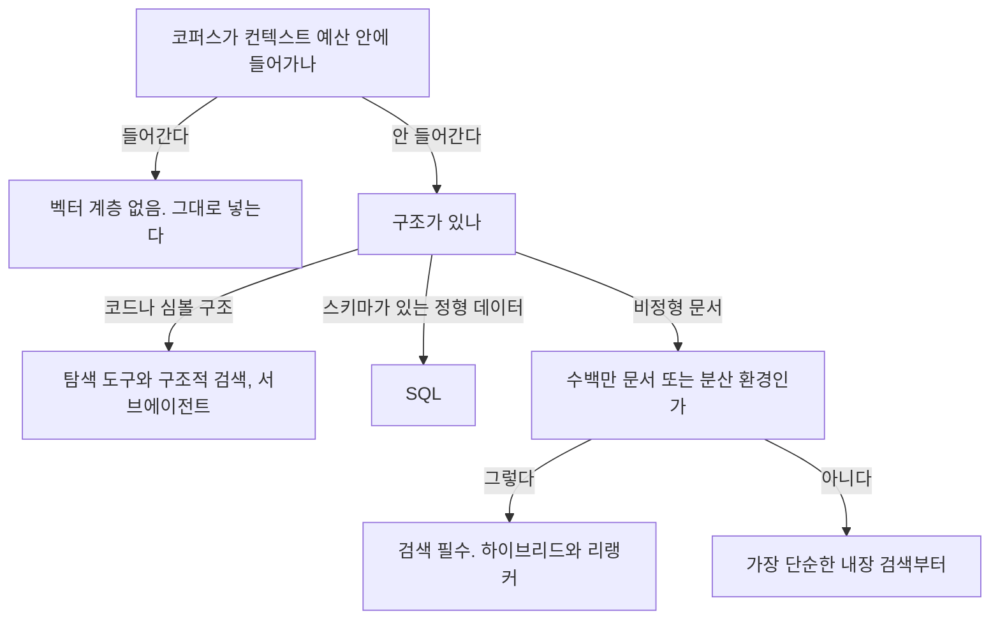
그림 1. 검색을 붙일지 결정하는 흐름

첫째, **컨텍스트 예산 안에 들어가나?** 들어가면 벡터 계층은 없다. 여기서 "컨텍스트 윈도에 들어가나"가 아니라 "컨텍스트 예산에 들어가나"로 묻는 게 중요하다. 루프는 회차마다 컨텍스트를 다시 실어 보내므로, 윈도에 물리적으로 들어가는 것과 매 회차 그 값을 지불할 수 있는 것은 다른 이야기다.

둘째, **구조가 있나?** 코드·심볼처럼 구문 구조가 있으면 구조적 검색과 탐색 도구가 낫고, 스키마가 있으면 SQL이다.

셋째, **수백만 문서이거나 분산 환경인가?** 그렇다면 검색은 선택이 아니다.

세 질문 중 어느 것도 "엔진을 무엇으로 할까"가 아니라는 점을 눈여겨보자. 도구를 고르는 일은 이 셋을 통과한 뒤에야 시작된다. 순서를 지키면 좋은 점이 하나 더 있다 — 나중에 "왜 벡터 DB를 붙였느냐"는 질문을 받았을 때, 세 질문 중 어느 것이 걸려서 붙였다고 한 문장으로 답할 수 있다. 도입 근거를 문장으로 적을 수 없는 인프라는 대개 나중에 아무도 책임지지 않는다.

셋 다 "아니다"로 나오는 프로젝트가 실제로 꽤 있다. 그런 경우에 벡터 DB를 도입하면, 운영 대상 하나와 장애 유형 하나를 얻는 대신 얻는 것이 거의 없다.

그래도 붙이기로 했다면 — 그때부터는 전혀 다른 종류의 질문이 시작된다. 어떤 엔진이냐가 아니라, **우리 임베딩의 차원이 몇이냐**부터다.


# 7장. 검색을 붙인다면 — 차원 한계, 하이브리드, 청킹, 리랭킹

pgvector의 HNSW·IVFFlat 인덱스는 `vector` 타입 **2,000차원**까지다. 그런데 OpenAI `text-embedding-3-large`의 기본 차원은 **3,072**다.

이 조합은 그냥 안 된다.

벡터 DB 선택이 "규모가 커지면 전용 엔진으로 간다" 같은 막연한 이야기로 시작할 거라 예상했다면 조금 허탈할 수도 있다. 첫 갈림길은 규모가 아니라 이 아주 구체적인 숫자다. 그리고 이 숫자를 모른 채 임베딩 모델을 먼저 고르고 나면, 인덱스를 만드는 순간에야 알게 된다. 그때는 이미 파이프라인이 다 붙어 있다. 꽤 난감한 순서다.

### 첫 갈림길은 규모가 아니라 차원이다

숫자를 먼저 정리해두자. 모두 2026년 7월 기준으로 확인된 값이다.

| 항목 | 값 |
|------|-----|
| pgvector `vector` 인덱스 최대 차원 | 2,000 (`halfvec`은 4,000) |
| `text-embedding-3-large` 기본 차원 | 3,072 (`dimensions`로 축소 가능) |
| `text-embedding-3-small` 기본 차원 | 1,536 |
| MongoDB Atlas Vector Search 최대 차원 | 8,192 |

그렇다면 선택지는 몇 개일까? 셋이다.

첫째, 차원을 줄인다. OpenAI 임베딩은 `dimensions` 파라미터로 출력 차원을 낮출 수 있다. 1,536으로 내리면 pgvector 인덱스에 그대로 들어간다. Cohere `embed-v4.0`도 256·512·1024·1536 중에서 고르는 구조이고, Google `gemini-embedding-2`는 128부터 3,072까지 유연하게 잡을 수 있다. 최근 세대 임베딩 모델은 — 방금 본 세 모델처럼 — 차원이 고정 상수가 아니라 설정값이다.

둘째, `halfvec`을 쓴다. 반정밀도 타입으로 4,000차원까지 인덱스를 만들 수 있으니 3,072가 들어간다. 대신 정밀도를 한 단계 낮추는 선택이라는 점은 알고 쓰자.

셋째, 전용 엔진이나 다른 매니지드로 간다. Atlas처럼 8,192까지 받는 곳이면 이 제약이 아예 없다.

여기서 pgvector와 전용 엔진 논쟁을 잠깐 정리하고 가자. 이 논쟁은 결론이 나 있지 않고, 나 있는 척하면 안 된다. pgvector 쪽 논거는 강하다 — 새로 운영할 인프라가 0이고, 본문·메타데이터와 벡터가 같은 트랜잭션에 들어간다. 원본과 인덱스를 동기화하는 파이프라인을 따로 만들 필요가 없다는 뜻이고, 이건 운영 사고를 한 종류 통째로 없애준다. 전용 엔진 쪽 논거도 강하다 — 방금 본 차원 한계가 실제 벽이고, 하이브리드 검색 표현력과 다중 벡터 필드에서 앞선다.

갈리는 지점은 셋이다: 임베딩 차원, 하이브리드 요구 수준, 그리고 운영 인력. 규모는 그다음이다.

### 무엇을 운영할 수 있나 — 인프라, 운영 부담, 그리고 라이선스

두 번째 축은 "얼마나 강한 검색이 필요한가"보다 "무엇을 운영할 수 있는가"다. 운영 부담을 스펙트럼으로 늘어놓으면 자기 팀의 위치가 보인다.

서버가 아예 없는 쪽부터 시작하자. `sqlite-vec`은 SQLite 확장이라 프로세스 밖에 아무것도 띄우지 않는다. Chroma와 LanceDB는 임베디드로 시작할 수 있다. pgvector는 이미 있는 Postgres에 확장 하나를 얹는다. Qdrant·Weaviate·Milvus는 전용 서비스를 하나 더 운영하는 결정이고, Vespa는 그중 가장 무거운 대신 검색·랭킹·ML 추론을 한 엔진에서 처리한다. Pinecone·Turbopuffer·MongoDB Atlas는 운영을 돈으로 치환하는 쪽이다.

버전도 함께 확인해두면 좋다(2026-07 기준). Qdrant `v1.18.3`, Weaviate `v1.38.6`, Milvus `v2.6.21`, Elasticsearch `v9.4.4`, OpenSearch `3.7.0`, pgvector `0.8.5`. 여기서 `sqlite-vec`은 `v0.1.9`(2026-03-31)로 몇 달 정체된 데다 아직 `0.1.x` 대라는 점을 알고 고르는 편이 낫다. LanceDB는 Python SDK가 `0.34.0`인데 저장소의 최신 태그는 베타 채널이라 버전 라인이 하나로 읽히지 않는다. 에이전트 생태계에서는 이런 버전 라인 불일치가 예외가 아니라 기본값에 가깝다.

그리고 라이선스다. 이 축은 성능 열과 같은 급으로 다루는 것이 바람직하다. 사내 배포 정책에서 실제로 걸리는 항목이기 때문이다.

- `Apache-2.0`: Qdrant, Milvus, Chroma, LanceDB, Vespa, OpenSearch, sqlite-vec
- `BSD-3-Clause`: Weaviate / `MIT`: FAISS
- `GPL-3.0`: Typesense — 배포 형태에 따라 사내 정책과 충돌할 수 있다
- SPDX 판정이 `NOASSERTION`으로 남는 것들: Elasticsearch(Elastic License 계열), Redis의 RediSearch, Meilisearch, 그리고 pgvector까지

마지막 줄을 한 번 더 보자. pgvector도 GitHub API의 라이선스 판정이 `NOASSERTION`이다. 여기서 조심할 것이 하나 있다. `NOASSERTION`은 "상용 독점 라이선스다"라는 뜻이 아니라 **"자동 판정이 안 됐다"**는 뜻이다. 그래서 이 책은 이 항목들을 "오픈소스"라고 단정하지 않는다. 실제 라이선스 문구를 확인하지 않았기 때문이다. 사내 검토서에 넣을 때는 저장소의 LICENSE 파일을 직접 열어보는 절차를 한 줄 넣어두자. 이건 이 책이 확인하지 못한 부분이고, 감추기보다 밝혀두는 쪽을 택했다.

### 하이브리드는 지원 여부가 아니라 손잡이 수로 갈린다

하이브리드 검색을 비교할 때 흔히 "지원한다/안 한다"로 표를 만든다. 그런데 2026년 7월 기준 주요 엔진은 대부분 지원한다. 실제로 갈리는 것은 융합 알고리즘과 조절 손잡이의 개수다.

| 엔진 | 융합 방식 | 조절 손잡이 |
|------|----------|-----------|
| Weaviate | Relative Score Fusion(v1.24+ 기본), Ranked Fusion | `alpha` 하나 — 1이면 순수 벡터, 0이면 순수 키워드. 키워드는 BM25F |
| Qdrant | RRF, DBSF | `prefetch` + 융합 + Formula Queries. 표현력이 가장 넓다 |
| Milvus | RRF Ranker, Weighted Ranker | 내장 BM25로 sparse 임베딩을 자동 생성 — 키워드 파이프라인을 따로 짜지 않아도 된다 |
| Elasticsearch | RRF | retriever 문법 |

이 표가 알려주는 건 취향의 차이가 아니다. 손잡이가 하나면 튜닝이 쉽고 표현력이 낮다. 손잡이가 많으면 표현력이 높고 튜닝이 프로젝트가 된다. Weaviate의 `alpha` 하나는 "제품명 검색 비중을 조금 올려보자"를 5분에 끝낼 수 있게 해준다. Qdrant의 다단계 쿼리는 1차로 키워드 후보를 넓게 뽑고 2차로 벡터로 좁히는 식의 설계를 가능하게 하지만, 그 설계를 누가 유지보수할지 정해야 한다. Milvus의 내장 BM25는 "BM25를 붙이고 싶은데 색인 파이프라인 만들 사람이 없다"는 팀에게 실질적인 차이를 만든다.

기본값에 대해서는 조심하자. Weaviate `alpha`의 기본값과 Elasticsearch `rank_constant`·`rank_window_size`의 기본값은 이번에 확인하지 못했다. 이 값들은 검색 결과를 실제로 바꾸므로, 공식 문서에서 직접 확인하고 우리 설정 파일에 명시적으로 박아두는 편이 낫다. 기본값에 의존하는 검색 품질은 버전이 올라갈 때 조용히 바뀐다.

### 품질은 엔진이 아니라 파이프라인에서 온다

검색이 잘 안 맞을 때 가장 먼저 떠오르는 생각은 "DB를 바꿔야 하나"다. 그런데 이 판단을 뒤집는 근거가 꽤 강하게 수렴한다.

Anthropic이 2024-09-19에 공개한 실험에서 top-20 검색 실패율은 **5.7%에서 1.9%로** 떨어졌다. 경로가 중요하다. 벡터 DB를 바꾼 게 아니었다. **컨텍스트를 보강한 청킹 → BM25 병용 → 리랭킹**을 차례로 얹은 결과였고, 단계별 실패율 감소는 컨텍스트 임베딩 단독 35%, BM25를 더해 49%, 리랭킹까지 더해 67%였다. 2024년의 이 실험에서 나온 수치이므로 모델이 바뀐 지금 그대로 재현된다는 보장은 없다. 하지만 이득이 발생한 위치는 시간에 훨씬 강건하다.

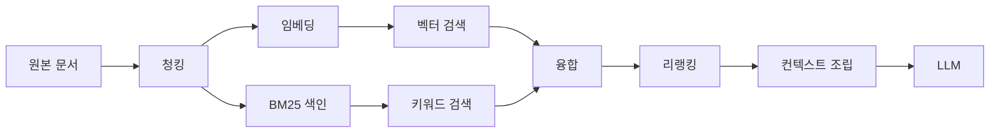
그림 1. 검색 파이프라인 — 품질 이득은 엔진 교체가 아니라 청킹·키워드 병용·리랭킹 세 지점에서 발생한다

리랭킹은 특히 값이 싸다. Voyage의 `rerank-2.5-lite`는 1M 토큰당 $0.02이고 `rerank-2.5`는 $0.05다. 같은 회사의 임베딩 `voyage-4-large`가 $0.12인 것과 비교하면, 리랭커를 하나 얹는 비용은 임베딩 비용보다 작다. 값싼 층을 안 붙이고 비싼 층을 갈아치우는 것이 순서상 이상하다는 뜻이다.

여기서 임베딩 단가에 대해 한 가지 짚어야 한다. **OpenAI 공식 표면 두 곳이 서로 다른 값을 말한다.** 모델 카드는 `text-embedding-3-large`를 1M 토큰당 $0.13으로 적는다(직접 확인, 2026-07 기준). 반면 가격 페이지가 $0.065로 표기한다는 보고가 있고, 이 불일치는 개발자 포럼에 버그로 올라와 있다(2025-08 시점 보고, 이 책이 직접 검증하지 못했다). 참고로 `text-embedding-3-small`은 모델 카드 기준 $0.02다.

이 상황에서 할 수 있는 정직한 대응은 하나다. **어느 쪽으로도 봉합하지 않고, 총비용 예시를 만들지 않는 것.** 두 값의 차이가 2배이므로 이 단가로 월 비용을 계산해 의사결정을 하면 2배 틀린 근거로 결정하게 된다. Cohere 임베딩·리랭커의 토큰 단가는 현재 가격 페이지에 노출되지 않아 이 책이 확인하지 못했다. 단가 비교가 결정에 중요하다면 각 벤더의 현재 가격 페이지를 직접 열어 확인하자.

### 청킹 — 정량 근거가 없다는 사실이 정보다

청킹은 이 파이프라인에서 가장 먼저 손대는 곳인데, 아쉽게도 기댈 숫자가 가장 없는 곳이다.

인용할 수 있는 지침은 이 정도다. Anthropic은 청크를 "보통 몇백 토큰을 넘지 않게"라고 쓴다(2024-09 문서). Pinecone 문서는 작은 청크 128–256 토큰, 큰 청크 512–1024 토큰을 예로 든다(발행일 미확인). 전략은 여섯 가지가 정리돼 있다 — 고정 크기, 문장·문단 기준, recursive character, 문서 구조 기반, semantic, 그리고 LLM으로 컨텍스트를 덧붙이는 contextual chunking.

오버랩은 어떨까? "10~20% 정도 겹치게 하라"는 조언을 흔히 보는데, 이 책은 그 수치의 1차 소스를 찾지 못했다. 그래서 숫자를 적지 않는다. **오버랩은 권장값이 아니라 튜닝 대상이다.**

학술 쪽은 더 비어 있다. 하이브리드 검색과 청킹 전략의 정량 비교는 사실상 공백이고, 청킹에 대해 지지할 수 있는 정량 주장은 OP-RAG(arXiv:2409.01666)가 보고한 역U자 곡선 하나다. 여기서 흔한 오독을 하나 막아두자. OP-RAG의 역U자는 청크의 *수*에 관한 것이고, 청크의 *크기*에 관한 것이 아니다. 검색해서 넣는 청크 개수를 늘리면 품질이 올라가다가 어느 지점부터 떨어진다는 관찰이지, "청크를 512로 하면 최적"이라는 이야기가 전혀 아니다. 청크 크기의 학술 근거는 없다.

그러니 청킹은 이렇게 접근하자. 문서 구조를 살리는 것부터 시작하고(제목·섹션 경계를 넘지 않게), 크기와 오버랩은 우리 문서와 질의로 A/B를 돌려 정한다. 그런데 A/B를 돌리려면 판정할 기준이 있어야 한다. 청킹 튜닝은 평가 세트 없이는 감으로 하는 일이 된다 — 그 세트를 어떻게 만드는지는 곧 평가를 다룰 때 함께 본다.

### 후보를 셋 이하로 줄이는 절차

정리하자. 결정은 다음 순서로 좁힌다.

1. 임베딩 차원을 먼저 확정한다. 3,072를 유지해야 한다면 pgvector `vector` 인덱스는 후보에서 빠진다. `halfvec`이나 전용 엔진, Atlas로 간다. 1,536으로 내려도 품질이 충분하다면 후보가 다시 넓어진다.
2. 키워드 결합이 요구사항인지 판단한다. 제품명·코드·오타·약어가 질의에 자주 들어오면 하이브리드는 선택이 아니다. 손잡이 하나로 빨리 조절하고 싶으면 Weaviate, 다단계 설계가 필요하면 Qdrant, 키워드 파이프라인을 따로 만들 사람이 없으면 Milvus의 내장 BM25가 실질적인 답이다.
3. 운영 인력을 센다. 전용 엔진 하나를 24시간 책임질 사람이 없으면 pgvector 또는 매니지드다. 이건 기술 평가가 아니라 조직 평가다.
4. 라이선스로 마지막 필터를 건다. GPL 계열과 비-OSI 계열이 사내 정책에 걸리는지 확인하고, 판정이 `NOASSERTION`인 항목은 LICENSE 파일을 직접 읽는다.

**정합성과 운영 단순함이 최우선이고 차원을 1,536 이하로 맞출 수 있다면 pgvector**, **차원·하이브리드 표현력·다중 벡터 필드 중 하나라도 양보할 수 없다면 전용 엔진**이다. 그리고 어느 쪽을 골라도, 품질 개선의 순서는 엔진 교체가 아니라 청킹·병용·리랭킹이라는 점은 바뀌지 않는다.

### 이 장의 핵심

- 첫 갈림길은 규모가 아니라 인덱스 차원 한계다. pgvector `vector` 2,000 / `halfvec` 4,000 / Atlas 8,192 / `text-embedding-3-large` 3,072 (2026-07 기준)
- 하이브리드는 지원 여부가 아니라 융합 방식과 조절 손잡이 수로 갈린다
- 검색 품질은 엔진 교체가 아니라 청킹·키워드 병용·리랭킹에서 온다. 리랭커는 임베딩보다 값싼 층이다
- 청킹 크기·오버랩에는 인용할 정량 근거가 없다. 튜닝 대상으로 다루고, 평가 세트로 판정한다
- 라이선스는 성능과 같은 급의 선택 축이다. `NOASSERTION`은 "오픈소스"가 아니라 "판정 안 됨"이다

자, 여기서 한 가지를 직접 해보자. 지금 쓰거나 쓰려는 임베딩 모델의 **출력 차원을 확인해보자.** 문서에서 숫자 하나를 찾는 데 1분이면 된다. 그리고 그 숫자만으로 후보 목록에서 빠지는 엔진이 몇 개인지 세어보자. 아직 아무 코드도 쓰지 않았는데 선택지가 절반으로 줄어드는 경험은, 이 장에서 가장 값싼 이득이다.


# 8장. 무엇을 재야 하나 — 리더보드를 덮고 시작하자

우리가 만든 에이전트가 잘 동작한다는 것을 무엇으로 증명할 수 있을까? 리더보드 점수로 될까?

리더보드는 근거처럼 생겼다. 모델 이름 옆에 백분율이 붙어 있고, 순위가 있고, 친절한 곳은 오차 범위까지 적어준다. 그래서 기술 검토 문서에 그 표를 그대로 옮겨 붙이고 싶어진다. 옮기기 전에 딱 하나만 물어보자. 저 점수를 매긴 **채점기는 누가 감사했나?**

이 질문에 대한 답이 이 장의 출발점이고, 답은 꽤 불편하다.

### 채점기를 먼저 감사하라

먼저 원논문 쪽 이야기를 정직하게 들어보자. 이 분야의 대표 벤치마크들이 세운 공은 작지 않다. SWE-bench(arXiv:2310.06770)는 사람이 쓴 채점 기준 대신 실제 GitHub 이슈와 실제 테스트 실행으로 채점한다. GAIA(arXiv:2311.12983)는 도구를 쓰지 않으면 풀 수 없는 과제를 모았고, WebArena(arXiv:2307.13854)는 실제로 동작하는 웹사이트 위에서 브라우저 에이전트를 굴린다. 사람의 주관적 선호가 아니라 실행 결과로 채점한다는 설계는 그 자체로 큰 진보다. 이 점을 지워버리면 "그럼 아무것도 못 재느냐"는 냉소로 빠진다.

그런데 같은 벤치마크를 열어본 후속 논문들이 보고한 것이 문제다.

SWE-Bench+(arXiv:2410.06992)는 성공 판정을 받은 패치를 하나씩 뒤졌다. 그중 32.67%에서 해답 유출이 발견됐다 — 고쳐야 할 답이 이슈 본문이나 코멘트에 이미 적혀 있었다. 또 31.08%는 테스트가 너무 약해서 엉뚱한 패치도 통과했다. 이 둘을 걸러내고 다시 재자 어떤 결과가 나왔을까. 같은 에이전트의 해결률이 12.47%에서 3.97%로 떨어졌다. 3배 이상이다. 같은 논문은 데이터셋의 이슈 상당수가 모델의 지식 컷오프 이전에 만들어진 것들이라는 점도 함께 지적한다.

ABC(arXiv:2507.02825)는 범위를 넓혀 태스크 설정과 보상 설계를 감사했고, 그 결함이 성능을 상대적으로 최대 100%까지 과대 또는 과소 평가할 수 있다고 보고한다. 이 논문이 든 예가 특히 아프다 — SWE-bench Verified는 테스트 케이스가 불충분하고, TAU-bench는 빈 응답을 성공으로 계산한다는 것이다.

빈 응답이 성공. 이 한 줄을 읽고 나면 리더보드 순위를 근거로 모델을 고른 지난 회의가 조금 찜찜해진다.

여기서 끌어낼 교훈은 "벤치마크는 다 거짓말이다"가 아니다. 결함이 **모델 쪽이 아니라 보상 설계 쪽에 있었다**는 것, 그리고 그 결함 하나가 점수를 3배까지 흔들었다는 것이다. 그래서 논문 여러 편이 독립적으로 도달한 규칙이 하나 있다. **채점기를 먼저 감사하라.**

우리가 사내 평가(eval)를 만들 때도 순서가 같다. 지표를 고르기 전에 그 지표가 무엇을 성공으로 세는지 먼저 열어보는 편이 낫다. 위 두 논문이 찾아낸 결함을 우리 쪽 언어로 옮기면 감사 질문 셋이 된다.

- 정답이 입력에 새어 들어가 있지 않은가? 실패 로그를 데이터셋으로 옮길 때, 사람이 나중에 남긴 해결 코멘트가 같이 딸려오는 일이 흔하다. 해답 유출이 별난 사고가 아니라 데이터셋을 만들면 기본으로 생기는 오염이라는 뜻이다.
- 통과 조건이 실제로 정답만 통과시키는가? 아무것도 하지 않은 응답, 빈 문자열, "확인해보겠습니다" 같은 회피 응답이 통과하지 않는지 직접 넣어봐야 안다. 채점기에 일부러 오답을 먹여보는 것은 테스트 코드에 대한 테스트와 같은 일이다.
- 점수가 오를 때 실력이 오른 것인가, 채점이 느슨해진 것인가? 프롬프트를 만지면서 채점 기준도 함께 만지면 이 구분이 사라진다. 기준을 고칠 때는 기준 변경만 따로 커밋하고, 이전 기준으로 한 번 더 재보자.

순위 자체가 흔들린다는 사실도 알아두면 좋다. 이번 리서치가 점수를 직접 읽어낼 수 있었던 유일한 에이전트 리더보드는 Terminal-Bench 2.0이었는데(2026-07-25 스냅샷), 상위권이 80%대에 ±2%대 오차로 몰려 있어 **1~5위가 통계적으로 겹친다.** "1위 모델을 쓰기로 했습니다"라는 문장이 성립하지 않는 구조다.

### `pass@k`와 `pass^k` — 이 장이 주는 단 하나의 개념

이 장에서 하나만 가져간다면 이것을 가져가자.

`pass@k`는 k번 시도해서 한 번이라도 성공하면 성공으로 센다. `pass^k`는 k번 모두 성공해야 성공으로 센다. 정의만 보면 사소한 차이 같은데, 백엔드 개발자에게는 전혀 사소하지 않다. 우리가 API를 운영할 때 쓰는 언어로 바꿔보자. `pass@k`는 "재시도를 허용하면 언젠가는 된다"에 가깝고, `pass^k`는 연속 성공률, 즉 SLO에 가깝다. 같은 태스크를 여덟 번 돌렸을 때 여덟 번 모두 성공했는지를 묻는 것이다.

프로덕션이 요구하는 건 후자다. 그런데 논문과 리더보드가 주로 보고하는 건 전자다.

이 격차를 정량화한 것이 τ-bench(arXiv:2406.12045)다. 고객 응대 도메인을 시뮬레이션해 측정했더니 gpt-4o가 태스크의 50%도 넘기지 못했고, retail 도메인에서 `pass^8`은 25% 미만이었다. 2024년 모델 기준 수치이므로 지금의 절대값을 말해주지는 않는다. 하지만 이 논문이 보여준 것은 절대값이 아니라 격차의 구조다. 한 번 되는 것과 여덟 번 다 되는 것 사이에 그만큼의 낙차가 있다는 사실은 모델이 좋아져도 사라지지 않는다.

관련해서 또 하나 — 정확도 하나만 보고하지 말자는 지적도 여러 논문이 공유한다. AI Agents That Matter(arXiv:2407.01502)는 정확도만 쫓는 좁은 초점 때문에 최고 성능 에이전트들이 "불필요하게 복잡하고 비싸다"고 지적하고, 홀드아웃 세트가 없어 벤치마크에 과적합된다는 점도 함께 짚는다. 우리 팀 대시보드에도 정확도 옆에 비용과 분산을 나란히 놓는 것이 바람직하다.

### 벤치마크도 늙는다

여기서 한 가지 의문이 생긴다. 그렇다면 "업계 표준 벤치마크"를 몇 개 골라 걸어두면 되지 않을까?

그것도 마음이 놓이지 않는다. 벤치마크 자체가 정체하기 때문이다. 프로젝트의 릴리스·푸시 날짜를 보면 바로 드러난다(2026-07-25 확인 기준). WebArena의 최신 릴리스는 2023-10-21이다. AgentBench는 마지막 푸시가 2026-02-08로 5개월 멈춰 있고, SWE-bench도 2026-04-01 이후 4개월째다. 이름이 유명하다는 것과 지금 관리되고 있다는 것은 다른 이야기다.

그렇다면 공개 벤치마크는 쓸모가 없는 걸까? 그렇지는 않다. 다만 점수를 빌리는 대신 설계를 빌리는 쪽이 훨씬 오래간다. SWE-bench가 실제 테스트로 채점한 방식, WebArena가 실제로 동작하는 사이트를 세워 과제를 낸 방식은 우리 도메인 평가를 만들 때 그대로 참고할 수 있는 자산이다. 반면 그 위에 붙은 백분율은 모델 세대가 한 번 바뀌면 의미가 흐려진다. 남의 리더보드에서 가져올 것은 순위가 아니라 태스크를 판정 가능한 모양으로 만든 방법이다.

다만 설계를 빌린다는 게 통째로 베낀다는 뜻은 아니다. 방금 본 것처럼 채점 규칙에 결함이 보고된 부분까지 따라가면 같은 함정에 같이 빠진다. 틀을 참고하고, 통과 조건은 우리 손으로 다시 쓴다.

이건 5장에서 프레임워크를 판정할 때 썼던 신호와 정확히 같은 신호다. 도구에 쓴 절차를 벤치마크에도 그대로 돌려보자 — 최신 릴리스가 언제인지, 커밋은 계속 올라오는지, 공식 후속이 있는지. "표준 벤치마크입니다"라고 목록만 던지면, 독자든 동료든 죽은 벤치마크로 보내는 셈이 된다.

### 심판을 세울 때 — judge와 플랫폼

결정적 채점기를 만들 수 없는 태스크가 많다. 요약의 품질, 상담 응답의 적절성 같은 것은 테스트 코드로 통과·실패를 가릴 수 없다. 그래서 LLM을 심판으로 쓰는 방식(LLM-as-judge)이 널리 쓰인다. 신뢰할 수 있을까?

양쪽 근거가 다 있다. MT-Bench 계열 연구(arXiv:2306.05685)는 GPT-4 판정이 인간 선호와 80%를 넘게 일치한다고 보고한다 — 사람끼리의 일치도와 비슷한 수준이다. 판정자가 GPT-4 세대라는 시점 조건이 붙지만, 쓸 수 있다는 근거로는 충분히 강하다.

반대쪽도 만만치 않다. 응답의 **등장 순서만 바꿔도 순위가 뒤집힌다**는 보고가 있다(arXiv:2305.17926). 같은 연구는 판정자를 두고 Vicuna-13B가 80개 질의 중 66개에서 이기게 만들 수 있었다고 밝힌다. 순서를 흔들어서 만든 승률이다. 그리고 평가자가 자기 출력을 편애한다는 통제 실험도 있다(arXiv:2404.13076) — 자기 글을 알아보는 능력과 자기 편애의 강도가 함께 움직인다는 결과다. 덧붙여, MT-Bench 논문 자신이 인정한 편향 목록이 이미 세 개다: **position(위치), verbosity(장황함), self-enhancement(자기 편애).**

judge를 버릴 이유는 없다. 실무 규칙은 "쓰지 마라"가 아니라 이 셋이다 — 응답 순서를 무작위화하고, 양방향으로 집계하고, 심판과 피심판을 분리하자. 우리 에이전트가 GPT 계열이면 심판은 다른 계열로 두는 것이 바람직하다. 순서 무작위화와 양방향 집계 없이 뽑은 judge 점수는 아예 보고하지 않는 것도 방법이다.

세 가지 채점 방식을 나란히 놓으면 어디에 무엇을 쓸지가 조금 더 분명해진다.

| 채점 방식 | 언제 쓰나 | 대가 |
|----------|----------|------|
| 결정적 채점기 (테스트·스키마·상태 비교) | 정답이 기계로 판정되는 항목 — 코드 수정, 계산, DB 상태 변화, API 호출 결과 | 만들 수 있는 항목이 생각보다 적다. 태스크를 판정 가능한 모양으로 쪼개는 설계 노동이 든다 |
| LLM judge | 요약 품질, 응답 적절성처럼 기계 판정이 불가능한 항목 | 순서·장황함·자기 편애 편향. 통제 장치를 함께 걸지 않으면 점수가 아니라 소음이다 |
| 사람 평가 | 기준 자체를 만드는 단계, 그리고 judge를 검증할 기준선 | 가장 느리고 가장 비싸다. 그래서 표본으로만 돌린다 |

한 평가 도구 창업자는 2024년에 이렇게 말했다 — 이 지표들 상당수가 LLM 심판 기반이고, 그것을 최종 평가 기준으로 생각하면 안 되며 골든 기준은 인간 평가자여야 한다는 것이다. 2024년 발언이라 모델 지형은 그새 움직였지만, 심판을 검증할 기준선이 필요하다는 구조는 그대로다.

도구를 살 것인가 만들 것인가도 이 소절에서 함께 정리하자. 매니지드 평가 플랫폼 쪽 논거는 명확하다 — 데이터셋 관리와 지표 계산을 직접 만들면 그것 자체가 프로젝트가 된다. 반대쪽 논거는 더 뼈아프다. 그 도구를 만드는 회사의 창업자들이 스스로 "우리 평가 지표의 신뢰성이 목표 달성의 가장 큰 걸림돌"이라고 말한다. 도구를 사도 평가 설계와 라벨링 노동은 이전되지 않는다.

수렴점은 소유의 경계에 있다. **트레이싱은 사도 된다. 골든 데이터셋과 판정 기준은 직접 소유하자.** 이 둘은 애초에 다른 물건이다. 한 가지 주의도 함께 기억해두자 — 이 논쟁의 발언자 다수가 평가 도구를 파는 벤더다. 그들의 진단은 값지지만 처방은 한 겹 걸러 듣는 편이 낫다.

### 재는 단위가 다르다

마지막으로 단위 이야기를 하고 가자. 프롬프트 하나를 놓고 여러 버전을 비교하는 것은 LLM 애플리케이션 평가의 익숙한 방식이다. 에이전트는 다르다. 한 실무자의 정리가 이 차이를 잘 짚는다 — LLM 운영 쪽 평가는 보통 프롬프트 단위지만, 에이전트 평가는 보통 세션 또는 실행 단위다. 도구를 여섯 번 호출하고 두 번 재시도하고 서브에이전트를 하나 띄운 실행 하나가 평가 대상 한 건이다.

단위가 바뀌면 데이터셋의 한 행도 바뀐다. 프롬프트 단위 평가에서 한 행은 입력과 기대 출력 한 쌍이다. 세션 단위 평가에서 한 행은 초기 상태 + 사용자 요청 + 도구 환경 + 종료 시점에 성립해야 하는 조건이다. "환불 요청을 처리했다"를 판정하려면 응답 문장이 아니라 주문 레코드의 상태를 봐야 한다. 그래서 에이전트 평가를 세우다 보면 결국 테스트용 환경을 하나 만들게 된다. 번거로운 일이지만, 이 환경이 있어야 재시도와 도구 호출까지 포함한 실행 하나를 재현할 수 있다.

그리고 함정이 하나 더 있다. 스키마를 통과했다고 정답인 것은 아니다. 커뮤니티에서 이 실패에는 이미 이름이 붙었다 — **구조화된 출력은 거짓 확신을 만든다.** JSON 파싱이 성공했고 필수 필드가 다 있다는 것은, 값이 맞다는 뜻이 전혀 아니다. 파싱 성공률을 정확도로 착각한 대시보드는 아주 조용히 우리를 속인다.

### 그래서 무엇부터 세우나

정리하면 순서는 이렇게 된다.

1. 우리 도메인의 실패 사례를 데이터셋으로 만든다. 리더보드가 아니라 우리 로그가 출발점이다.
2. 결정적 채점기를 먼저 붙인다. 테스트·스키마 검증·상태 코드·DB 상태 비교처럼 코드로 판정되는 것부터 채운다.
3. 결정적 채점이 불가능한 항목에만 judge를 쓴다. 순서 무작위화·양방향 집계·심판 분리를 함께 건다.
4. `pass^k`로 보고한다. 한 번 성공을 자랑하지 말고, 연속 성공을 보고하자.

여기서 흔한 오해 하나를 정정하고 가자. 평가 세트를 만드는 일이 큰 프로젝트라고 생각해서 시작을 미루는 경우가 많다. 수백 건을 라벨링해야 할 것 같고, 그러려면 사람을 붙여야 할 것 같다. 그런데 실제로 값을 하는 첫 세트는 훨씬 작다. 어제 실패한 실행 몇 건이면 시작할 수 있다. 그 몇 건에 대해 "무엇이 성립해야 성공인가"를 한 줄씩 적는 순간, 우리는 이미 채점기를 설계하고 있다. 그리고 그 기록은 리더보드가 절대 알려줄 수 없는 것 — 우리 도메인이 어디서 깨지는지 — 를 담고 있다.

도구 선택도 이 순서에서 자연스럽게 갈린다. **판정 기준이 아직 흔들리는 초기**라면 트레이싱 도구만 붙이고 데이터셋은 저장소에 텍스트로 들고 있으면 충분하다. **판정 기준이 굳었고 회귀를 CI에서 돌려야 하는 단계**라면 평가 도구를 사서 실행을 자동화하자. 어느 쪽이든 데이터셋과 기준의 소유권은 넘기지 않는다.

여기까지 오면 이 장의 결론은 도구 이름이 아니라 질문 하나로 남는다.

**우리 도메인의 실패 사례 다섯 개를 지금 적을 수 있는가?**

적을 수 있다면 골든 데이터셋의 첫 다섯 행은 이미 우리 손에 있다. 적을 수 없다면, 평가 도구를 고르는 일은 아직 우리 차례가 아니다.


# 9장. 실패는 조용하다 — 관측성과 비용

프로덕션에서 돌아간 멀티에이전트 세션 하나를 끝까지 계산해본 기록이 있다. 세션 하나에 **$4.13**. 그리고 그중 토큰 비용 비중이 **약 98%**였다.

이 사례를 앞으로 「AWS Deep Insight 사례」로 부르자. AWS Korea 기술블로그가 2026년 4월에 공개한 프로덕션 멀티에이전트 시스템이다. 벤더 블로그이므로 2차 소스로 취급해야 한다. 다만 실측치를 숫자로 공개하고 코드까지 열어둔 사례는 드물어서, 이 등급에서는 상위에 속하는 자료다.

놀라운 건 액수가 아니다. 자기 시스템에 대해 이만큼을 말할 수 있는 팀이 거의 없다는 사실이다. 우리 에이전트가 사용자 요청 하나를 처리하는 데 얼마를 쓰는지, 지난주에 몇 번 조용히 틀렸는지 지금 대답할 수 있을까? 관측성을 붙인다는 건 대시보드를 하나 더 만드는 일이 아니다. 저 두 질문에 숫자로 답할 수 있는 상태를 만드는 일이다.

### 조용한 실패라는 새로운 장애 유형

백엔드를 운영해본 사람에게 장애는 대체로 소리가 난다. 5xx가 튀고, 큐가 적체되고, p99가 올라간다. 그래서 우리는 신호를 기다리는 방식으로 시스템을 감시하는 습관을 갖고 있다.

에이전트는 그 습관을 배신한다. 한 개발자는 이렇게 정리한다. *"대부분의 에이전트 실패는 조용하다. 대부분의 실패는 테스트 중에 아무 문제도 보이지 않았던 컴포넌트에서 발생한다."* 왜 조용할까? 잘못된 답은 예외가 아니기 때문이다. 도구 호출은 200을 받고, 모델은 문법에 맞는 문장을 만들고, 파이프라인은 끝까지 완주하고, 응답은 스키마를 통과한다. 상태 코드로 표현할 자리가 어디에도 없다.

그래서 이 유형의 실패는 사람이 발견한다. 루프가 한참 돌다가 "해결했습니다"라고 말하고, 사용자가 "에러 메시지가 똑같다"고 되짚어줘야 비로소 알려진다. 장애 감지 경로에 사람이 들어가 있다는 뜻이다. 서비스 규모가 커질수록 이 구조는 뒷맛이 찜찜해진다. 사용자가 신고하지 않은 조용한 실패는 몇 건이었을까? 지금 구조로는 셀 방법이 없다.

앞 장들에서 본 루프의 실패들이 로그에서 어떤 모양으로 남는지 떠올려보면 사정이 더 분명해진다. 증거 없이 성공을 선언한 실행은 로그상 정상 종료다. 질의를 조금씩 바꿔가며 도는 루프는 서로 다른 호출 여러 건으로 남으니 중복으로도 잡히지 않는다. 결정적 실패를 일시적 실패로 오해한 재시도는 재시도 카운터를 따로 남기지 않는 한 그냥 호출 수 증가로만 보인다. 어느 쪽도 에러율 그래프를 건드리지 않는다. 그래서 기존 계측을 그대로 쓰면 이 실패들은 통계에서 성공으로 집계된다.

한 가지만 더 짚어두자. 조용한 실패는 정확도 문제로만 청구되지 않는다. 같은 일을 두 번 하는 루프는 토큰 청구서인 동시에 **부작용이 두 번 일어난다**는 뜻이다. 그래서 관측성과 비용은 한 몸이다. 둘은 같은 데이터에서 나온다.

### 단위 원가는 호출당이 아니라 사용자 액션당이다

관측 도구를 붙였는데도 조용한 실패가 안 보이는 팀이 많다. 도구가 부실해서가 아니라 집계 단위가 어긋나 있어서 그렇다. 트레이스를 이루는 스팬(span)을 어떤 단위로 묶느냐의 문제다. 한 개발자가 이 어긋남을 가장 정확하게 짚었다.

> *"비용은 '이 호출이 토큰을 몇 개 썼나'가 아니라 '이 사용자 액션 하나가 모든 에이전트 루프·재시도·툴 호출·임베딩을 합쳐 토큰을 몇 개 썼나'다. 대부분의 관측 도구는 LLM 호출을 하나의 평평한 span으로 보여준다."*

자기 관측 도구를 파는 맥락에서 나온 말이니 처방보다 진단만 가져오자. 진단은 정확하다. 스팬이 평평하게 나열되면 호출 100건의 목록은 보이지만, 그 100건이 사용자 액션 몇 건이었는지는 사라진다. 액션당 원가를 모르면 요금제도, 한도도, 최적화 대상도 정할 수 없다.

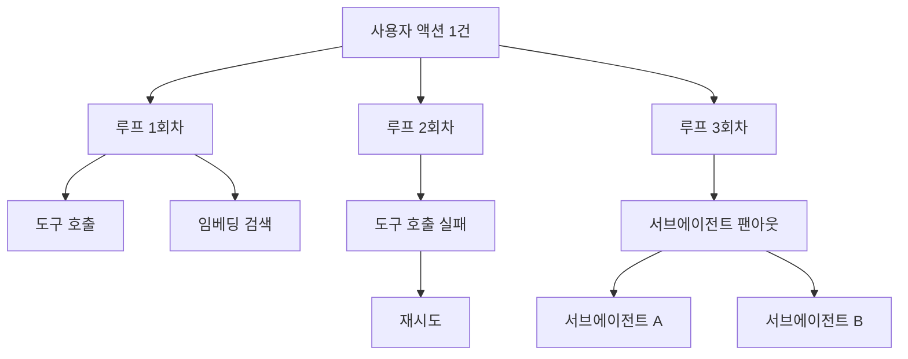
그림 1. 사용자 액션 한 건이 만드는 스팬 트리 — 평평한 목록으로 보면 이 구조가 사라진다

트리로 보면 질문이 달라진다. 이 액션은 왜 3회차까지 돌았나, 재시도는 왜 났나, 팬아웃은 누가 결정했나. 평평한 목록에서는 셋 다 물을 수 없다.

집계 단위를 맞추면 최적화 우선순위도 뒤집힌다. AWS Deep Insight 사례의 한 세션은 22.5분 동안 830건을 처리하면서 코드 실행 환경을 79번 띄웠다. 그 세션에서 순수 코드 실행 시간은 19.8초였고, LLM 추론 시간은 그 **61배**였다. 22.5분을 쓰는 동안 컴퓨팅이 20초를 썼다는 얘기다. 여기서 컨테이너 사양을 조이거나 병렬도를 손보는 건 오진이다. 비용의 98%가 토큰이라면 **컴퓨팅 최적화는 두 번째 문제**다. 첫 번째 문제는 회차 수와 컨텍스트 크기다.

그 둘을 한 지표로 묶어 보면 앞에서 여러 번 나온 명제가 청구서 위에서 다시 확인된다. 루프 한 바퀴마다 컨텍스트 전체가 다시 모델에 들어가므로, 회차가 늘면 입력 토큰은 회차 수보다 가파르게 늘어난다. 그러니 트레이스에 총 토큰만 남기지 말고 회차별 입력 토큰을 따로 남겨보자. 그래프가 계단이 아니라 곡선으로 휘면 컨텍스트가 회차마다 부풀고 있다는 신호다. 압축이나 요약을 어디에 넣을지도 그 곡선이 알려준다. 컨텍스트 예산이 지배 변수라는 말은 설계 원칙이기 전에 관측 지표다.

### 경고보다 하드 컷오프

비용 이야기에서 현장의 관심이 옮겨간 지점이 있다. 알림에서 자동 차단으로다. 한 개발자의 말이 이유를 그대로 설명한다. *"알림도 유용하지만 자동 한계선이 더 중요하다 — 소규모 사업자라서 새벽 2시의 루프가 날 파산시키지 않도록."*

경고로 안 되는 이유는 단순하다. 경고는 사람이 받아야 작동하는데, 루프는 사람이 자는 동안에도 돈다. 게다가 팬아웃이 붙으면 증가가 곱셈으로 온다. 어떤 사용자는 한 시간 남짓 만에 크레딧이 통째로 녹았다고 보고했는데, 원인이 특히 뼈아프다. *"서브에이전트에는 저렴한 모델을 쓰라"*는 지시를 에이전트가 잊어버려서 최상위 모델 여러 개를 동시에 돌리고 있었다는 것이다. 한 사람의 보고이므로 그 규모를 일반적인 수치로 받아들일 필요는 없다. 대신 구조를 보자. **지시가 잊혀지는 것이 그대로 비용 사고가 되는 구조**다. 프롬프트에 적어둔 절약 규칙은 절약을 보장하지 않는다.

그래서 예산은 프롬프트가 아니라 코드에서 강제하는 편이 낫다. 세션당 토큰 상한, 루프 회차 상한, 서브에이전트 동시 실행 상한을 넘으면 호출 자체가 거절되게 만든다. 한도를 넘긴 실행은 실패로 기록하고 사람에게 올린다. 이 컷오프가 이 책에서 예산을 다루는 기준점이고, 뒤에서 가드레일을 층으로 나눌 때 코드로 강제하는 층의 대표 예시가 된다.

### 트레이스를 어디에 남기나 — 표준은 왔지만 아직 흔들린다

여기서 자연스러운 질문이 나온다. 그럼 스키마는 표준을 따르면 되지 않을까? 반은 맞다.

OpenTelemetry의 GenAI semantic conventions는 이제 Agent Spans까지 규약 범위에 넣었다. 에이전트 실행을 벤더 중립적으로 기술할 스키마가 논의되고 있다는 뜻이고, 이건 반가운 진전이다. 그런데 같은 사실을 반대편에서 보면 이렇다. 2026년 7월 기준 이 규약의 상태는 `Status: Development`이고(stable도, experimental 승격도 아니다), 코어 semantic conventions에서 별도 리포로 막 분리됐으며, 태그된 릴리스가 아예 없다. 구 문서 URL에는 이 위치에서 더 이상 유지되지 않는다는 안내만 남아 있다.

정확한 서술은 이렇다. 표준화가 진행 중이고 지금 붙이면 스키마 변경을 감수해야 한다. "OTel을 따르면 벤더 중립이 된다"는 현시점에서 과장이다. 그래도 붙이는 편이 낫다고 보는데, 이유는 중립성이 아니라 계측 지점을 지금 정해두는 값이다. 다만 스키마 이름은 바뀔 수 있다고 가정하고 얇은 매핑 계층을 하나 두자. 이 부분은 빠르게 움직이니 공식 리포의 상태 표시를 함께 확인해두면 좋다.

붙이는 방식은 대체로 세 갈래다. 첫째는 프록시형이다. Helicone처럼 게이트웨이를 한 줄 갈아 끼워 호출을 통과시키는 방식이라 도입이 가장 빠르다. 대신 애플리케이션 쪽 구조는 모르니 사용자 액션 단위 트리를 만들기는 어렵다. 둘째는 계측 SDK형이다. OpenLLMetry처럼 OpenTelemetry 규약에 맞춰 애플리케이션 안에서 스팬을 직접 만들면 백엔드를 나중에 갈아탈 여지가 생긴다. 셋째는 플랫폼형이다. Langfuse나 Arize Phoenix는 셀프호스팅으로 굴릴 수 있고, LangSmith·Braintrust 같은 매니지드는 운영 부담이 낮은 대신 데이터가 밖으로 나간다.

여기서 라이선스도 성능과 같은 급으로 한 번 보고 가자. Langfuse와 Phoenix는 2026년 7월 기준 GitHub의 라이선스 판정이 `NOASSERTION`으로 나온다. 오픈소스라고 단정하기 전에 실제 라이선스 문구를 직접 확인하는 편이 낫다. 셀프호스팅으로 운영할 계획이라면 특히 그렇다.

Langfuse는 조금 더 짚어둘 값이 있다. 트레이싱·관측성을 분리 구매하는 대표 경로이고, **평가와 다른 물건이다.** 버전을 언급할 때는 계열을 특정하자 — 2026년 7월 기준 플랫폼은 `v3.224.1`, Python SDK는 `4.14.1`, JS SDK는 `3.38.x`로 세 계열이 서로 다르다. "Langfuse 4.x를 쓴다"고 적으면 제품 버전으로 오독된다.

그리고 도구를 산 뒤에도 남는 한계가 하나 있다. 트레이싱은 일회성 디버깅에는 강하지만 **1%에서만 나는 에러의 회귀 테스트 능력이 없다.** 어제 그 트레이스를 열어 원인을 찾는 일과, 그 실패가 다시 나지 않는지 매 배포마다 확인하는 일은 다른 작업이다. 앞 장에서 골든 데이터셋과 판정 기준은 직접 소유하라는 결론에 도달한 이유가 여기에 있다. 트레이싱 도구는 사도 되고, 무엇이 정답인지를 정하는 일은 팔지 않는다.

### 최소 관측 세트

정리하면, 에이전트를 프로덕션에 올릴 때 처음부터 갖추면 좋은 것은 네 가지다. 완벽한 관측 스택이 아니라 최소 세트다.

**① 사용자 액션 단위 원가 집계.** 트레이스 루트를 LLM 호출이 아니라 사용자 액션으로 잡는다. 그 아래에 루프 회차·도구 호출·임베딩·재시도를 모두 매단다. 이게 없으면 나머지 셋이 다 반쪽이 된다.

**② 루프 회차와 재시도 카운터.** 회차 수, 재시도 수, 그리고 종료 이유를 값으로 남긴다. 종료 이유가 특히 중요하다. 검증을 통과해서 끝났는지, 상한에 걸려 잘렸는지, 모델이 스스로 끝났다고 선언했는지가 구분돼야 한다. 마지막 경우가 조용한 실패의 후보군이다.

**③ 하드 예산 컷오프.** 앞 소절의 그 컷오프다. 관측 지표에 붙여 자동으로 작동하게 한다.

**④ 사후 진단이 되는 트레이스 내용.** 사고가 난 다음에 열었을 때 답이 나와야 하는 것들을 남긴다 — 도구 호출의 인자와 결과, 회차 번호, 재시도 사유, 사용한 모델과 버전, 그리고 컨텍스트에 무엇이 들어갔는지. 프롬프트 전문을 남길지는 개인정보 정책과 함께 정할 문제이지만, 최소한 무엇이 들어갔는지의 요약은 남겨두자. 남기지 않은 것은 나중에 복원되지 않는다.

한 가지 공백은 솔직히 밝혀두는 게 낫겠다. 이 비용 구조의 주된 완화 수단은 프롬프트 캐싱인데, 이 책은 벤더별 캐싱 단가를 1차 소스로 확인하지 못했다. 커뮤니티에는 절감률 주장이 돌아다니지만 개인 주장이라 여기에 옮기지 않았다. 그래서 캐싱은 "구조상 가장 큰 레버"라는 정성 판단까지만 쓰고, 구체 단가는 마지막 장의 재확인 목록에 넣어둔다. 각자 쓰는 공급사의 현재 가격 페이지를 직접 열어보자.

에이전트의 가장 비싼 실패는 요란하게 터지는 실패가 아니라, 아무 일도 없었던 것처럼 완주하는 실패다.


# 10장. 가드레일은 필터 하나가 아니다 — 네 층, 그리고 권한

커뮤니티에 이런 제목의 토론이 올라온 적이 있다. **"우리는 탈옥은 고쳤다. 에이전트는 못 고쳤다."**

제목 한 줄이 지형을 정확히 찍는다. 스레드가 전제하는 대로, 모델에게 나쁜 말을 시키는 문제는 그래도 손에 잡히는 편이 됐다. 그런데 그 모델에 도구를 붙이고 자격증명을 쥐여주고 며칠을 돌게 하면, 고쳤다고 믿었던 방어가 다시 무력해진다. 같은 스레드의 한 참가자가 이유를 더 정확하게 짚었다. *"에이전트 시스템에서 더 큰 문제는 경계 혼동인 것 같다 — 신뢰할 수 없는 콘텐츠가 결국 툴이 어떻게 사용되는지에 영향을 준다."*

프롬프트에 "위험한 일은 하지 마"라고 적어두는 것은 이 문제에 대한 답이 될까? 그게 보장인지 부탁인지부터 갈라보자.

### 가드레일은 층이다

확인된 벤더 권장 배치를 모아보면 가드레일은 필터 하나가 아니라 네 층으로 정리된다. 여기에 에이전트에만 있는 ②′층이 덧붙는다. 아래 나오는 제품의 상태 표시와 입력 한도는 2026년 7월에 확인한 각 벤더 문서 기준이다.

**① 입력단.** 주입·탈옥 전용 분류기를 앞에 세운다. Azure의 Prompt Shields(입력 한도 1만 자), Meta의 Prompt Guard가 이 자리의 제품이다. 여기서 비용 이야기를 한 줄 끼워두자. 공식 문서가 권하는 배치는 *"값싼 경량 모델이 비싼 모델을 호출하기 전에 가드레일 검사를 돌려서, 차단될 요청의 비용을 줄인다"*는 순서다. 안전장치가 오히려 비용을 깎아주는 드문 지점이라 순서를 이렇게 잡자.

**② 실행 중 — 도구 승인과 권한 축소.** 부작용을 실제로 만들어내는 층이라 여기가 무게중심이다. 예를 들어 Claude Code는 기본 동작이 권한 요청이고, 그 마찰을 줄이는 방법을 세 가지로 제시한다. 자동 모드 분류기로 *"권한 상승, 알 수 없는 인프라, 적대적 콘텐츠가 유발한 행동"*만 골라 막는 방식, 허용목록, 그리고 OS 레벨 샌드박싱이다. 사람이 없는 배치 실행에서는 허용할 도구를 인자로 못 박는다(`--allowedTools`).

**②′ 실행 중 — 도구 사용 이탈 감시.** 에이전트에만 필요한 층이다. Azure의 Task adherence API(preview)는 *"AI 에이전트의 도구 사용이 어긋났거나 의도되지 않았거나 성급한 시점을 탐지한다"*고 스스로를 규정한다(입력 한도 10만 자). 요청과 행동의 정렬을 보는 층이라, 입력이 깨끗하고 출력이 그럴듯한데도 중간에서 궤도를 벗어나는 실패를 잡는다.

**③ 출력단.** 근거성·콘텐츠 검사다. Azure의 Groundedness detection(preview), 그리고 OpenAI Moderation이 여기 온다. 후자는 무료이고 13개 카테고리에 이미지 입력까지 받는다 — 붙이지 않을 이유를 찾기가 오히려 어렵다.

**④ 코드로 강제하는 결정적 게이트.** 앞의 셋이 판정이라면 이 층은 집행이다. 마이그레이션 폴더 쓰기를 차단하는 훅처럼, 조건이 맞으면 그냥 실행되지 않는다. 앞 장에서 본 예산 컷오프도 이 층의 식구다.

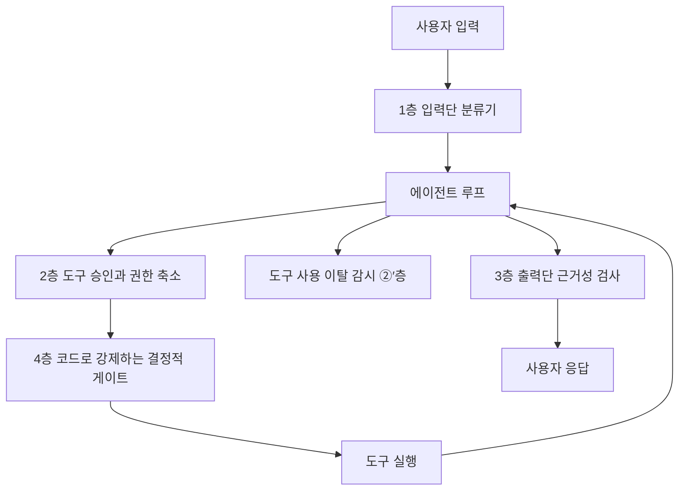
그림 1. 요청과 응답이 통과하는 가드레일 네 층과, 도구 사용 이탈을 보는 ②′층

층으로 그려보면 흔한 오해 하나가 눈에 보인다. 많은 팀이 ①과 ③만 붙이고 가드레일을 세웠다고 말한다. 입출력 검사는 대화형 챗봇의 방어 배치다. 부작용을 만드는 것은 ②의 도구 호출인데, 그 층이 비어 있는 상태로 프로덕션에 나가는 경우가 흔하다.

### 프롬프트는 정책이 아니다

독자가 가장 자주 틀리는 지점을 하나만 꼽자면 이것이다. advisory 지시와 결정적 훅의 구분이다. 규칙 파일이나 시스템 프롬프트에 적은 "하지 마"는 조언이고, 코드로 만든 훅은 집행이다. Claude Code 문서가 이 차이를 한 문장으로 말한다. *"advisory인 CLAUDE.md 지시와 달리, 훅은 결정적이고 그 동작이 일어남을 보장한다."*

앞서 도구 재시도를 다룰 때 나온 문장이 여기서 다시 쓰인다. 재시도 정책이 프롬프트 안에 있으면 *"그건 정책이 아니라 확률"*이다. 같은 논리가 금지에도 그대로 적용된다. 프롬프트에 적은 금지는 대체로 지켜지고, 대체로 지켜진다는 말은 보장이 아니다. 파괴적 명령 하나가 지켜지지 않는 경우를 상상해보면 아찔하다.

여기서 이 책이 반복해서 쓰는 원칙 하나를 꺼내자. **추론은 확률적으로 하되, 집행은 결정적으로 한다.** 미리 밝혀두는데 이 문장은 어느 벤더나 논문이 그대로 말한 것이 아니라 저자의 종합이다. 세 갈래 근거를 나란히 놓으면 이렇게 모인다. 공식 문서 쪽에서는 두 벤더가 "단순한 것부터 시작하라", "함수로 쓸 수 있으면 함수로 쓰라"고 권한다. 학술 쪽에서는 검증 신호 없는 루프가 개선이 아니라 낭비라는 결론이 나온다. 현장에서는 "정책이 아니라 확률"이라는 진단과, 부작용 경계를 코드로 집행하라는 실천이 반복된다. 셋의 층위가 서로 다르므로 업계 합의라고 부를 수는 없다. 다만 세 갈래가 같은 방향을 가리키는 것은 사실이다.

### 모델 축이냐 시스템 축이냐

그렇다면 프롬프트 인젝션은 원리적으로 막을 수 있을까? 이 질문에 학계는 아직 한 답을 내지 않았다. 네 갈래 연구를 모델을 고쳐서 막을 수 있느냐, 시스템을 설계해서 막느냐라는 한 축에 올려놓으면 지형이 보인다.

축의 한쪽 끝에는 비관이 있다. 간접 인젝션을 다룬 연구(arXiv:2302.12173)는 LLM 통합 애플리케이션이 데이터와 명령의 경계를 흐린다고 지적하면서, 그 시점에는 효과적 완화가 없다고 적었다(2023년 논문). 그 다음, 모델을 키우는 방향이 답이 아니라는 실증이 나왔다. AgentDojo(arXiv:2406.13352)는 97개 태스크와 629개 보안 테스트로 지형을 재면서, *"더 유능한 모델이 오히려 공격하기 쉬운, 일종의 역스케일링"* 경향을 보고한다. 모델 업그레이드가 보안을 개선해줄 거라는 기대에 근거가 없다는 뜻이다. **보안은 모델 축이 아니라 시스템 축이다.**

축의 반대쪽에서 답이 나온다. CaMeL(arXiv:2503.18813)은 제어 흐름과 데이터 흐름을 분리하는 설계로 AgentDojo 태스크의 77%를 증명 가능한 보안 상태로 해결했다. 무방어 상태에서 풀리던 것이 84%였으니, 방어를 걸면 풀 수 있는 일이 조금 줄어든다. 같은 방향의 후속 연구(arXiv:2506.08837)는 이런 저항 패턴들을 카탈로그로 정리하면서 유틸리티 대가를 함께 명시한다. 개별 패턴의 효과 크기는 초록에 정량 결과가 없으므로 여기서 숫자로 옮기지 않는다.

그런데 이 축에서 가장 값싸고 효과가 컸던 방어는 정교한 설계가 아니었다. **도구 노출 최소화**다. AgentDojo(v3 기준) 본문은 이렇게 적는다. *"우리의 단순한 도구 필터링 방어가 특히 효과적이었고, 공격 성공률을 7.5%로 낮췄다."* 사용자가 이메일을 읽기만 하면 되는 요청에 `send_email`을 붙여두지 않는 것, 그게 방어다. 앞에서 도구를 줄이라고 말한 이유가 컨텍스트 팽창과 선택지 혼란이었다면, 여기서는 이유가 하나 더 붙는다. 노출하지 않은 도구는 인젝션이 호출할 수 없다.

은탄환은 아니다. 논문 스스로 한계를 밝힌다. 사용자 태스크가 읽기만 요구하고 공격자 태스크가 쓰기를 요구할 때 잘 통하고, 그렇지 않으면 실패한다. 안전 정렬을 통제로 계산하는 것도 위험하다. AgentHarm(arXiv:2410.09024)은 선도 모델들이 탈옥 없이도 놀랍도록 순응적이었고, 탈옥 이후에도 일관되고 유해한 다단계 능력이 유지된다고 보고한다. 통제는 모델의 성향이 아니라 도구 계층과 권한 계층에 두는 편이 낫다.

77%와 84%의 간격을 다시 보자. 실무자가 결국 하는 질문은 "안전한가"가 아니다. *"이 에이전트의 자유도를 얼마나 깎아야 안전해지는가"*이고, 저 간격이 그 대가의 크기다.

### 경계 혼동 — 커뮤니티가 더한 프레이밍

문서와 논문에 없는 프레이밍을 현장이 하나 더 준다. 문제는 탈옥이 아니라 경계 혼동이다. 신뢰할 수 없는 콘텐츠가 도구를 어떻게 쓰는지에 영향을 준다는 관찰인데, 층으로 나눈 우리 그림에서 보면 ①을 통과한 텍스트가 ②의 판단을 흔든다는 뜻이다. 그래서 ②를 사람이나 코드가 아니라 모델의 자제심에 맡기면 방어선이 실제로는 하나도 없다.

두 위험을 섞지 않는 것도 중요하다. 한 개발자가 MCP 서버를 두 위험으로 갈라준다. *"하나는 툴 출력을 통한 프롬프트·컨텍스트 인젝션. 다른 하나는 훨씬 더 전통적인, 전이 의존성을 가진 신뢰할 수 없는 코드를 내 머신에서 실행하는 위험. 컨테이너화는 두 번째만 돕고 첫 번째는 돕지 않는다."* 뒤쪽은 우리가 이미 아는 공급망 위험이다. 남이 만든 서버를 붙이는 일은 남의 의존성 트리를 내 실행 환경에 들이는 일이고, 그 판단 기준은 npm 패키지를 고를 때와 같아야 한다. 앞쪽은 격리로 해결되지 않는다. 컨테이너 안에서 돌아도 인젝션은 여전히 내 자격증명으로 합법적인 API를 호출한다.

에이전트가 차선을 벗어나는 이유에 대한 관찰도 새겨둘 만하다. 한 샌드박스 사업자는 자기 플랫폼의 세션 로그를 분석하고 이렇게 적었다. *"'이 함수의 유닛 테스트를 써줘'라고 요청받은 에이전트는, 완전히 지시받지 않았는데도, 테스트하려던 소스 코드를 수정하고, 패키지를 설치하고, 네트워크 요청을 시도한다. 악의적인 게 아니다. 에이전트는 그냥 '도움이 되려고' 하는 것이다."* 벤더 자체 로그이므로 관찰로만 받아들이자. 그래도 함의는 크다. 악의를 막는 방어와 선의를 막는 방어는 설계가 다르다. 후자는 탐지로 잡기 어렵고, 애초에 할 수 없게 만들어야 잡힌다.

책임 논쟁도 한 단락으로 짚고 지나가자. 프로덕션 DB 삭제 사건 이후 도구 문제냐 운영자 문제냐를 두고 논쟁이 붙었다. 한쪽은 검증 없이 파괴적 명령을 실행할 수 있게 만든 도구·권한 설계의 실패라고 본다. 다른 쪽은 후속 스레드 제목으로 반박했다 — *"AI가 네 DB를 지운 게 아니라, 네가 지웠다."* 이 논쟁은 결국 "최소 권한을 실제로 어떻게 거는가"라는 공학 질문으로 수렴했고, 그 수렴점이 이 장의 논지와 같다. 다만 하나는 남겨두자. 사고 뒤에 에이전트에게 "왜 그랬어?"라고 묻고 그 답을 원인으로 적는 일은 하지 않는 편이 낫다. 에이전트는 결정을 하고 나서 행동하는 것이 아니라 텍스트를 출력한다. 그 텍스트는 사후 합리화이고 트레이스가 아니다.

### 무엇부터 손대나

층을 다 세우는 데는 시간이 걸린다. 순서를 정해보자.

먼저 **도구 표면**이다. 이번 태스크에 필요 없는 도구를 목록에서 뺀다. 가장 싸고 근거가 가장 강한 조치다. 다음은 **자격증명 범위**다. 에이전트가 쓰는 토큰이 읽기 전용인지, 어느 테이블·버킷·리포까지 닿는지 적어본다.

그다음이 **승인 게이트**다. 되돌릴 수 없는 행동 — 결제, 발송, 삭제, 배포 — 을 목록으로 만들고 그 앞에 사람 개입이나 결정적 훅을 세운다. 프레임워크가 도와주는 부분도 있다. 예컨대 OpenAI Agents SDK는 가드레일이 발동하면 `{Input,Output}GuardrailTripwireTriggered`를 즉시 발생시키고 실행을 중단한다.

마지막이 **분류기**다. ①과 ③은 위 셋이 선 다음에 붙이는 편이 낫다. 순서를 뒤집으면 판정만 있고 집행이 없는 상태가 된다. 그리고 이 자리의 도구를 고를 때 하나 주의하자. 인젝션 방어를 검색하면 아직도 Rebuff 같은 프로젝트가 상단에 나오는데, 2026년 7월 기준 리포는 아카이브 상태이고 마지막 릴리스가 2024년 1월이다. 이 분야는 죽은 프로젝트가 검색 결과에 오래 남는다.

마지막으로 한국어 서비스를 만드는 사람에게 직접 걸리는 이야기가 있다. 한 보고자는 인젝션 벡터 18개 중 12개가 방어를 우회했고 비영어 벡터는 전부 통과했다고 주장했다. 방법론과 대상 제품이 공개되지 않은 미검증 주장이므로 수치를 사실로 받아들이지는 말자. 다만 짚고 갈 값은 있다. 분류기의 학습·평가 데이터가 영어 중심이라면 한국어 입력에서 성능이 같을 이유가 없다. 우리 서비스의 언어로 우리가 직접 재보지 않으면 알 수 없는 값이다.

에이전트가 새로운 종류의 취약점을 만들어내는 건 아니라는 관찰도 함께 두자. 한 리뷰어는 에이전트가 만든 코드에서 찾은 보안 문제들이 새로운 종류는 하나도 없었고 주니어가 늘 만들던 고전들이었으며, 다만 훨씬 높은 처리량으로 생산됐을 뿐이라고 말한다. 그리고 시니어 리뷰 단계가 많은 워크플로에서 조용히 사라졌다고 덧붙인다. 필요한 것은 새 방어가 아니라, 사라진 검증 단계를 코드로 되돌려놓는 일일지도 모른다.

자, 여기서 한 가지만 해보자. 지금 우리 에이전트가 쓸 수 있는 자격증명을 종이에 적어보는 것이다. 어떤 키를 쥐고 있고, 그 키로 어느 데이터베이스의 어느 테이블에 쓸 수 있고, 어느 외부 API를 호출할 수 있는지. 적다 보면 줄일 것이 보인다. 그리고 대개는 생각보다 많이 보인다.


# 11장. 어디서 돌릴 것인가 — 격리 강도, 그리고 며칠짜리 실행

에이전트가 방금 스크립트 하나를 써냈다고 해보자. 마흔 줄쯤 되는 파이썬이고, 우리가 요청한 대로 로그 파일을 파싱해서 집계 결과를 낸다. 읽어보니 그럴듯하다. 그런데 이걸 실행해도 될까?

읽어봤으니 괜찮다고 답하고 싶은데, 그 답은 오늘 한 번만 유효하다. 내일은 이 에이전트가 하루에 스크립트 수백 개를 써낼 것이고 그때는 아무도 다 읽지 못한다. 그러면 질문을 바꿔야 한다. **누가 썼는지가 아니라, 그 코드가 무엇에 닿을 수 있는지를 묻는 편이 낫다.** 파일 시스템은 어디까지, 네트워크는 어디까지, 우리 프로세스의 메모리는 볼 수 있나.

여기에 질문 하나가 더 붙는다. 그 실행이 세 시간짜리, 혹은 사람 승인을 기다리는 사흘짜리라면 중간에 프로세스가 죽었을 때 무엇이 이어서 완주시킬까. 실행환경을 고를 때 실제로 갈리는 것은 이 둘이다.

### 격리 강도와 시작 지연 — 유일한 진짜 트레이드오프

실행환경에는 축이 하나뿐이다. 강한 격리를 택하면 시작 지연(콜드 스타트)이 늘고, 빠른 시작을 택하면 격리가 얇아진다. 강한 쪽부터 늘어놓으면 이렇다. microVM(Firecracker), 유저스페이스 커널(gVisor), 컨테이너(Docker·Podman), 그리고 Wasm capability 샌드박스(Wasmtime·WasmEdge)다.

Wasm이 목록 끝에 있는 것은 격리가 약해서가 아니다. 기본값이 "아무것도 못 함"인 capability 모델이라 격리는 오히려 강한 편인데, 대신 생태계 제약이 크다. 임의의 파이썬 스크립트를 그냥 던져 넣을 수 있는 환경이 아니다. 그래서 이 목록은 강도 순서일 뿐이고 용도 순서가 아니다.

지연 쪽은 숫자로 이야기하기가 어렵다. 솔직히 말해두는 편이 낫겠다. 이 책이 조사한 범위에서 주요 샌드박스 제공자의 신규 시작 지연은 1차 소스로 확인되지 않았다. Firecracker 자체를 다룬 논문의 부팅 시간 수치가 돌아다니지만, 그건 2020년의 서버리스 워크로드 측정이라 에이전트 샌드박스가 몇 밀리초에 뜬다는 주장으로 옮기면 사실이 아니게 된다. 벤더가 자기 표현으로 말하는 정도가 지금 인용할 수 있는 최대치다. 예컨대 Fly.io Machines 문서는 *"빠르게 시작하는 VM이며, 1초 미만 속도로 시작·정지할 수 있다"*고 적는다. 그러니 이 축은 순서로 판단하고, 절대값은 자기 워크로드로 직접 재보자.

용도 배정에서는 확인된 것과 확인되지 않은 것을 갈라야 한다. 신뢰할 수 없는 에이전트 생성 코드 실행에 컨테이너 단독은 불충분하다 — 이건 여러 제공자가 같은 방향으로 말한다. Vercel Sandbox는 *"각 샌드박스는 자체 파일 시스템과 네트워크를 가진 안전한 Firecracker microVM에서 실행된다"*고 명시하고, Modal Sandbox는 자기 제품을 *"신뢰할 수 없는 사용자 또는 에이전트 코드를 실행하기 위한 안전한 컨테이너"*로 규정한다. 다만 주의할 점이 하나 있다. **Firecracker 사용이 명시적으로 확인된 것은 Vercel Sandbox뿐이다.** 다른 제공자가 내부적으로 무엇을 쓰는지는 이 책이 확인하지 못했고, 커뮤니티에 널리 퍼진 추측을 사실로 옮기지 않았다. 격리 기술을 요구사항으로 삼는다면 계약 전에 직접 물어보자.

그래서 현실적인 답은 분업이다. 에이전트가 만든 코드 실행에는 microVM 샌드박스를 쓰고, 플러그인·도구 자체의 격리에는 Wasm을 쓴다. 둘은 경쟁하는 선택지가 아니라 서로 다른 자리다.

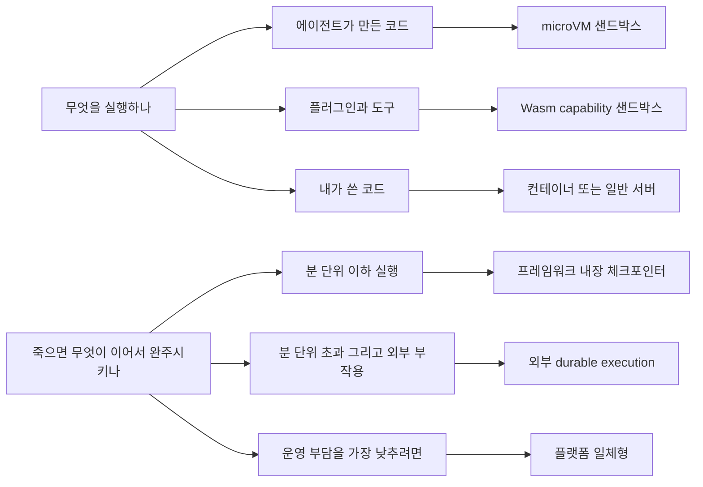
그림 1. 무엇을 어디서 실행하고, 어디서 이어서 완주시키나

### 프로덕션은 실제로 어디서 갈랐나

앞에서 비용 구조를 볼 때 인용한 AWS Deep Insight 사례를 격리 관점에서 다시 보자. 이 시스템의 설계 결정 세 개가 그대로 교과서다.

첫째, 코드 실행 환경을 분리했다. 에이전트 런타임과 코드 실행 컨테이너를 다른 프로세스 경계에 두었고, 근거를 이렇게 적었다(AWS Korea 기술블로그, 2차 소스). *"에이전트가 생성한 코드를 Runtime 내부에서 그대로 실행하면 악성코드나 무한루프가 같은 세션에서 돌고 있는 에이전트 로직에 영향을 줄 수 있습니다."* 악성코드만 걱정한 게 아니라 무한루프를 나란히 적었다는 점을 눈여겨보자. 격리는 공격을 막기 위한 것만이 아니라 사고를 격리하기 위한 것이다.

둘째, 중간 저장소를 두고 데이터를 그리로 흘렸다. 에이전트들이 결과를 객체 스토리지에 쓰고 서로 그걸 읽는 구조인데, 부수 효과가 크다. 분산된 에이전트 사이의 데이터 허브가 되면서, 사람이 중간 결과를 열어보고 피드백을 넣는 지점도 같이 생긴다.

셋째, 네트워크를 완전히 격리했다. 프라이빗 서브넷과 VPC 엔드포인트만 쓰고 퍼블릭 인터넷을 경유하지 않는다. 앞 장에서 본 인젝션의 관점에서 보면 이게 왜 중요한지 분명하다. 인젝션이 성공해도 데이터를 밖으로 보낼 경로가 없으면 피해의 상당 부분이 사라진다.

이 세 결정에 공통점이 있다. 어느 것도 모델이나 프롬프트를 건드리지 않는다. 전부 프로세스 경계와 네트워크 경계를 어디에 그을지의 문제다.

### 며칠짜리 실행을 무엇이 완주시키나

이제 두 번째 축이다. 여기서 만나는 용어가 durable execution — 실행이 중간에 죽어도 이어서 완주하게 만드는 계층이다. Temporal의 공식 정의가 간결하다. *"Durable Execution은 불리한 조건에서도 애플리케이션이 올바르게 동작하도록 보장한다 — 끝까지 완주할 것을 보장함으로써."*

선택지는 세 갈래다.

**프레임워크 내장 체크포인터.** LangGraph의 체크포인터, CrewAI의 `@persist()`, Cloudflare Durable Objects가 여기에 속한다. 분 단위 이하 실행, 외부 부작용이 적을 때 충분하다. 새로 운영할 것이 없다는 게 가장 큰 장점이다.

**외부 durable execution.** Temporal, Restate, DBOS, Inngest, Cloudflare Workflows가 이 자리에 있다. Temporal은 이 계층의 대표 경로다. 이벤트 히스토리를 남기고 리플레이로 상태를 복원한다. DBOS는 Postgres 하나로 같은 보장을 라이브러리로 제공하므로, 이미 Postgres를 쓰는 팀에게는 운영 부담이 가장 적은 경로다.

**플랫폼 일체형.** Cloudflare Agents SDK가 대표적이다. Durable Objects·Workflows·Sandbox·Browser·MCP 도구가 같은 플랫폼 안에서 맞물린다. 운영 부담이 가장 낮고 락인이 가장 강하다.

여기서 백엔드 개발자가 눈여겨봐야 할 대가가 하나 있다. **결정론 제약**이다. 리플레이 방식이 왜 이 제약을 낳는지 따라가보면 납득이 쉽다. 프로세스가 죽었다가 다시 뜨면, 이 계층은 워크플로 함수를 처음부터 다시 실행하면서 이미 기록된 결과를 히스토리에서 꺼내 채워 넣는다. 즉 같은 코드가 여러 번 실행되고, 매번 같은 순서로 같은 지점에 도달해야 한다. 그런데 워크플로 코드 안에서 현재 시각을 읽거나 난수를 뽑거나 HTTP 요청을 직접 보내면, 재실행할 때마다 값이 달라져서 기록된 히스토리와 어긋난다. 그래서 그런 작업은 워크플로 본문에 둘 수 없고, 결과가 히스토리에 기록되는 단위 — Temporal 용어로는 Activity — 로 밀어내야 한다.

LLM 호출이 정확히 그런 작업이다. 같은 입력에 같은 출력이 나온다는 보장이 없으니 워크플로 본문에 둘 수 없다. 결과적으로 **에이전트 코드의 구조가 이 제약을 따라 바뀐다.** 루프의 뼈대는 결정적인 워크플로 코드로 쓰고, 모델 호출과 도구 호출은 전부 Activity 경계 밖으로 나간다. 처음 겹치는 순간에는 꽤 난감하다. 그런데 이 강제가 나쁜 것만은 아니다. 확률적인 부분과 결정적인 부분을 코드 구조에서 갈라놓는 일이기 때문이다. 앞 장에서 집행을 결정적으로 하자고 말한 것과 같은 이야기가, 여기서는 프레임워크가 강제하는 형태로 돌아온다.

두 가지 사실을 함께 기억해두자. 하나, Temporal의 공식 개념 문서는 AI 에이전트를 언급하지 않는다. 에이전트를 위해 만들어진 도구가 아니라 범용 durable execution 도구를 에이전트에 쓰는 것이고, 그래서 에이전트 특화 편의는 우리가 얹어야 한다. 둘, 라이선스를 성능과 같은 급으로 확인하는 것이 바람직하다. 2026년 7월 기준 Temporal 서버와 DBOS는 MIT로 판정되지만, Restate와 Inngest는 **서버 리포의 라이선스 판정이 `NOASSERTION`이고 각자의 SDK는 MIT·Apache-2.0으로 다르게 나온다.** 서버와 SDK의 라이선스가 다른 구조이므로 "오픈소스"라고 뭉쳐서 판단하지 말고 실제 문구를 열어보자.

### 위임할지 말지 — 세 조건과 판단표

그렇다면 언제 외부로 위임할까. 판단 기준은 세 조건이고, 셋을 함께 놓고 보자. 실행이 분 단위를 넘는가, 외부 부작용(결제·발송·쓰기)을 만드는가, 중간 실패 후 재개해야 하는가.

셋이 모두 참이면 외부 durable execution이고, 그 외에는 내장 체크포인터로 충분하다. 여기에 격리 축을 겹치면 대개 이렇게 갈린다.

| 상황 | 격리 | 내구성 계층 |
|------|------|-----------|
| 내가 쓴 코드, 초·분 단위 실행 | 컨테이너 또는 일반 서버 | 내장 체크포인터 |
| 에이전트 생성 코드 실행, 짧은 실행 | microVM 샌드박스 | 내장 체크포인터 |
| 외부 부작용 + 재개 필요, 시간·일 단위 | 용도에 따라 | 외부 durable execution |
| 사람 승인을 며칠 기다리는 흐름 | 용도에 따라 | 외부 durable execution 또는 플랫폼 일체형 |
| 운영 인력이 거의 없는 팀 | 매니지드 샌드박스 | 플랫폼 일체형 (락인 감수) |

표에서 "용도에 따라"라고 적은 칸이 중요하다. 두 축은 독립이다. 며칠짜리 실행이라는 사실 자체가 격리 수준을 결정해주지는 않는다.

### 가격 없이 비용을 판단하는 법

이 카테고리에는 공백이 하나 있다. 밝혀두자. **durable execution 제품군의 가격 데이터를 이 책은 확보하지 못했다.** 비용이 선택을 가장 크게 좌우하는 카테고리인데 확인된 데이터 포인트가 없다. 그래서 여기에 비교표를 만들지 않았다. 커뮤니티에는 체크포인트 직렬화 오버헤드처럼 숫자로 보이는 값들이 돌아다니는데, 사용자가 제출한 재현 스크립트 수준이고 메인테이너가 확정한 것이 아니라 그것으로 내장과 외부를 비교하지 않았다.

대신 확인된 것을 쓰자. 과금 축이다. 벤더 견적을 비교할 때 물어야 할 것을 다섯 가지로 정리하면 가격 숫자 없이도 판단이 선다. 아래 나오는 한도·지연 값은 모두 2026년 7월에 확인한 각 벤더 문서 기준이다.

첫 질문은 과금 단위다. 실제 경과 시간(wall-clock)으로 재는가, 활성 CPU 시간으로 재는가? 이것이 첫 질문이어야 하는 이유가 있다. Vercel Sandbox 가격 문서(2026-06 기준)는 *"I/O를 기다리는 시간 — 네트워크 요청, 데이터베이스 질의, AI 모델 호출 같은 것 — 은 활성 CPU에 포함되지 않는다"*고 적는다. 에이전트 워크로드는 모델 응답을 기다리는 시간이 지배적이다. 그러니 두 과금 방식은 같은 워크로드에 자릿수가 다른 청구서를 낸다. 견적서에서 단가만 나란히 놓고 이 축을 놓치면 비교 자체가 헛일이 된다.

두 번째 질문은 첫 질문의 연장이다. 사람 승인을 기다리는 시간이 과금되는가? 앞 장에서 되돌릴 수 없는 행동 앞에 승인 게이트를 세우자고 했는데, 그 게이트를 세운 순간 이 질문이 비용 질문으로 바뀐다. 사흘을 기다리는 흐름이 사흘짜리 실행으로 계산되는 제품과 그렇지 않은 제품은 같은 설계에 전혀 다른 값을 매긴다.

남은 세 가지는 한도에 관한 질문이라 표로 모아두자.

| 물어볼 것 | 확인된 사실 | 무엇이 갈리나 |
|---|---|---|
| 대기 중인 인스턴스가 동시성 한도를 먹는가 | Cloudflare Workflows 한도 문서는 `waiting` 상태 인스턴스가 동시성 한도에 포함되지 않는다고 적는다 | 승인을 며칠씩 기다리는 실행을 수만 개 띄우는 설계가 가능한가 |
| 최대 sleep은 얼마이고, 재우고 깨우는 값은 얼마인가 | 같은 문서 기준 최대 sleep은 365일. E2B는 pause에 1GiB RAM당 약 4초, resume에 약 1초가 들고 pause된 샌드박스는 무기한 보존된다고 적는다 | 긴 대기를 프로세스를 띄운 채 버틸지, 재워두고 넘길지 |
| pause와 resume 이후 연속 실행 한도가 리셋되는가 | 같은 E2B 문서가 리셋된다고 적는다 | 몇 시간을 넘기는 실행을 잘게 나눠 이어갈 수 있는가 |

자릿수 감각이 필요하면 샌드박스 원가 쪽에 확인된 3행이 있다. 같은 문서(2026-06 기준, CPU를 100% 쓴다고 가정한 계산)에서 5분·2vCPU가 약 $0.03, 30분·4vCPU가 약 $0.34, 2시간·8vCPU가 약 $2.73이다. 앞 장에서 본 비용 구조와 나란히 놓으면 시사점이 분명하다. 이 정도 액수는 토큰 청구서 옆에서 대체로 작다. 실행환경 선택은 비용 최적화 문제가 아니라 **격리 요구사항과 운영 부담의 문제**로 다루는 편이 낫다.

세 질문만 남겨두자. 우리 에이전트의 이 실행은 분 단위를 넘는가. 외부에 흔적을 남기는가. 중간에 죽으면 이어서 가야 하는가.


# 12장. 그래서 무엇을 조합할 것인가 — 용도별 기본값과 금기

1장에서 우리가 던진 질문은 하나였다. 다음에 무엇을 할지 정하는 주체가 코드인가 모델인가. 열한 개 장을 지나오는 동안 그 질문은 바뀌지 않았다. 바뀐 것은 질문을 걸어야 할 자리의 개수다.

### 통제 경계가 다섯 번 넓어졌다

처음 세 장은 루프 안이었다. 1장이 결정 주체를 물었고, 2장은 그 결정을 넘긴 값이 회차마다 컨텍스트를 다시 싣는 청구서로 돌아온다는 것을, 3장은 도구를 붙이는 결정이 모든 요청에 정의와 출력을 싣는 결정이라는 것을 봤다. 통제권을 넘긴 값은 컨텍스트로 청구된다.

그 청구서를 누가 관리하느냐가 4장에서 층을 드러냈고, 층이 보인 뒤에야 5장의 후보 스무 개가 축 셋으로 줄었다. 6장과 7장에서는 순서가 뒤집혔다 — 고를 후보가 아니라 고를 이유부터. 8장은 무엇을 재야 하는지, 9장은 왜 실패가 안 보이는지, 10장은 무엇을 코드로 집행해야 하는지를 물었다. 셋의 결론은 한 곳에 모인다 — 확률적 판단 위에 결정적 집행을 얹지 않으면 아무것도 보장되지 않는다. 11장은 그 집행의 장소를 물었다.

물음은 하나다. **무엇을 모델에게 맡기고 무엇을 코드에 남길까?** 이 물음을 여섯 용도에 걸어보자.

### 읽는 쪽 — 사내 문서 Q&A와 고객 지원

계층마다 갈림길을 먼저 정해두자. 프레임워크 열은 작업 길이와 도구 호출 횟수로 갈린다 — SDK만으로 되는지, 하네스 층이 필요한지. 데이터 열은 6장의 세 질문 중 어느 것이 걸렸는지로 갈린다. 평가·관측성 열은 무엇까지 직접 소유하느냐와 트레이스가 필수냐로, 가드레일 열은 10장 네 층 중 어느 층이 필수냐로 갈린다. 런타임 열은 11장의 세 조건이다.

그래서 아래 셀은 제품명이 아니라 "무엇 때문에 갈렸나 → 그래서 기본값"의 형태다. **화살표 앞쪽이 우리 상황과 다르면 뒤쪽은 우리 기본값이 아니다.** 여섯 용도를 둘씩 짝지어 보자. 짝이 서로를 설명해준다.

| 계층 | 사내 문서 Q&A | 고객 지원 |
|------|-------------|---------|
| 프레임워크 | 도구 호출 1~3회로 끝난다 → SDK만으로 충분. Pydantic AI 또는 LangGraph | 결정적 분기와 사람 개입이 요구사항이다 → CrewAI Flows 또는 LangGraph. 호출 수는 적어 하네스 불필요 |
| 데이터 | 첫 질문이 갈랐다 → 예산에 들어가면 벡터 계층 없음. 넘으면 pgvector, 차원이 2,000을 넘으면 `halfvec` 또는 전용 엔진 | 셋째 질문에 제품명·오타 질의가 겹쳤다 → 하이브리드 필수 + 리랭커. pgvector 또는 Qdrant |
| 평가·관측성 | 골든 데이터셋과 판정 기준 자체 소유, 출처 일치는 결정적 채점 / 단계가 얕아 트레이스는 선택 | 판정 기준 자체 소유(도메인 시뮬레이션), judge는 편향 통제와 함께 / 세션 단위 트레이스 필수, `pass^k`로 보고 |
| 가드레일 | ①+③ 필수 — 입력단 분류기와 출력단 근거성 검사 | ③+② — 출력단 콘텐츠 검사에 도구 승인 게이트를 더한다 |
| 런타임 | 세 조건 모두 미해당 → 일반 서버 | 세 조건 미해당, 대화 상태만 필요 → 일반 서버 + 세션 상태 |

두 용도를 나란히 두면 런타임 열이 먼저 눈에 들어온다. 둘 다 비어 있다. 남이 쓴 코드를 실행하지 않고 며칠을 기다리지도 않으니 11장의 격리·내구성 결정이 전부 "해당 없음"으로 끝난다. 그렇다면 실제로 갈리는 곳은 어디일까? 데이터와 가드레일이다.

사내 문서 Q&A의 첫 계산은 엔진 비교가 아니라 코퍼스 크기다. 6장에서 본 20만 토큰은 2024년 Anthropic 기준이고 그 뒤 컨텍스트 창이 커졌으니, 오늘의 경계선이 아니라 보수적 하한으로 읽는 편이 낫다. 위키를 덤프해 토큰을 세보는 30분이 인프라 한 종류를 없앨 수도 있다. 고객 지원은 사정이 다르다. 질의에 제품명과 오타와 약어가 섞여 들어오니 의미 유사도만으로는 자꾸 빗나가고, 하이브리드가 요구사항이 된다. 대신 오답의 값이 비싸다. 잘못된 환불 안내 한 건은 잘못된 문서 요약 백 건보다 비싸다.

**쓰지 말아야 할 때(사내 문서 Q&A):** 코퍼스가 임계값 아래이면 벡터 계층 자체를 버린다. 그리고 출처 표기가 요구사항이 아니라면 검색을 붙일 이유가 한 겹 더 줄어든다.

**쓰지 말아야 할 때(고객 지원):** 오답 비용이 높은 도메인이다. 사람 개입 지점을 설계하지 못했다면 이 조합은 아직 우리 것이 아니다. 자동 응답률을 목표로 삼는 순간 위험해진다.

### 쓰는 쪽 — 코딩 에이전트와 브라우저·컴퓨터 사용 자동화

| 계층 | 코딩 에이전트 | 브라우저·컴퓨터 사용 자동화 |
|------|-------------|------------------------|
| 프레임워크 | 긴 다단계 작업이다 → 하네스 층 필수. Claude Agent SDK · deepagents · Strands Harness | 호출이 길게 이어지고 세션이 살아 있어야 한다 → 하네스 쪽. 플랫폼 일체형이면 Cloudflare Agents SDK, A2A·MCP 내장이 필요하면 Google ADK |
| 데이터 | 둘째 질문이 갈랐다 → 구조가 있으니 인덱스 대신 탐색 도구, 컨텍스트는 서브에이전트로 분리 | 세 질문 모두 미해당 → 데이터 계층 없음. 대상이 문서가 아니라 화면이다 |
| 평가·관측성 | 골든 데이터셋은 우리 리포의 실패 사례, 채점은 테스트 실행으로 결정적 / 단계가 많아 트레이스 필수, `pass^k`로 보고 | 판정 기준과 시나리오 자체 소유, 공개 벤치마크는 점수 대신 설계만 빌린다 / 되돌릴 수 없는 단계가 많아 트레이스 필수 |
| 가드레일 | ②+④ 최우선 — 도구 승인 게이트와 결정적 훅. OS 레벨 샌드박싱 병행 | ②+④에 ①까지 — 외부 콘텐츠가 그대로 입력이 되므로 입력단을 비울 수 없다 |
| 런타임 | 신뢰할 수 없는 코드를 실행한다 → microVM. 재개는 대개 불필요 | 신뢰할 수 없는 콘텐츠 + 세션 영속 → 강한 격리와 스냅샷 |

이 두 용도에서는 표를 읽는 순서가 반대다. 프레임워크부터 고르고 싶어지는데, 정말 그 순서가 맞을까? 먼저 굳는 것은 가드레일과 런타임이다. 부작용이 우리 프로세스 안에 머물지 않기 때문이다. 코딩 에이전트는 실행되는 코드를 만들고, 브라우저 자동화는 실세계에 클릭을 남긴다. 승인 게이트도 격리 환경도 없이 그 둘을 맡기는 상황은 상상만 해도 아찔하다. 특히 브라우저 쪽은 노출면이 여섯 용도 중 가장 크다. 통제하지 않는 웹페이지의 텍스트가 그대로 컨텍스트에 들어오고, 그 컨텍스트가 다음 클릭을 고른다. 10장의 경계 혼동이 가장 노골적으로 드러나는 자리다.

코딩 에이전트에는 조합 이전의 논쟁이 하나 더 붙어 있다. 이게 정말 생산성을 올리느냐다. 한쪽은 순손실이 가능하다고 본다. 방향을 잡아주고 결과를 이중 확인하는 데 드는 사람의 자원이 빌드가 느려서 잃는 것보다 많아질 수 있다는 관찰이고, 1년 넘게 쓰다 전면 철수한 사례도 보고된다. 다른 쪽은 맥락에 따라 이득이 크다고 본다. 한 달 전에는 순손실이었던 작업을 오늘은 20분에 끝냈다는 보고가 그 예다. 둘 다 커뮤니티 발언이니 어느 쪽 수치도 사실로 받아들이지 않는 편이 낫다.

값이 큰 쪽은 이 논쟁이 정책으로 구체화된 지점이다. Redox OS는 LLM이 생성한 코드를 받지 않는 정책을 내걸며 근거를 이렇게 적었다. *"과거에는 코드 자체가 일종의 노력의 증거였다. …노력이 들어갔을 수도 있지만, 더 자세히 리뷰하는 데 시간을 쓰지 않고는 알 방법이 없다."* 개인의 속도가 빨라졌다는 데는 대체로 동의가 모이는데, 그 이득이 어디로 이전되는지에 대한 회의가 커졌다. 생산성을 개인 처리량이 아니라 **시스템 처리량**으로 다시 재는 중이라고 보는 편이 정확하다.

**쓰지 말아야 할 때(코딩 에이전트):** 생성 코드를 격리해 실행할 환경이 없으면 쓰지 않는다. 컨테이너 단독은 이 용도에 불충분하다. 그리고 늘어난 리뷰 부담을 감수할 인력이 없으면, 개인 속도 이득이 시스템 처리량에서 순손실로 뒤집힐 수 있다.

**쓰지 말아야 할 때(브라우저·컴퓨터 사용 자동화):** 프롬프트 인젝션 노출면이 가장 큰 용도다. 최소 권한 자격증명과 승인 게이트가 없으면 쓰지 않는다. 부작용이 실세계에 남는다.

### 양 극단 — 데이터 파이프라인과 장기 실행·다단계 리서치

| 계층 | 데이터 파이프라인 | 장기 실행·다단계 리서치 |
|------|----------------|-------------------|
| 프레임워크 | 결정론이 요구사항이다 → 에이전트가 아예 불필요할 수 있다. Prefect·Dagster. 넣더라도 SDK 이하로 | 긴 다단계에 중간 산출물이 쌓인다 → 하네스 층 필수. deepagents 또는 Microsoft Agent Framework Harness |
| 데이터 | 둘째 질문이 갈랐다 → 스키마가 있으니 원본 DB와 SQL. 벡터 계층 없음 | 첫 질문이 과제마다 갈린다 → 예산을 넘는 코퍼스에만 하이브리드 |
| 평가·관측성 | 채점 기준을 코드가 전부 소유(결정적 단위 테스트) / 트레이스는 선택 — 기존 파이프라인 계측으로 충분 | 골든 데이터셋과 단계별 판정 기준 자체 소유 / 트레이스 필수 — 없으면 어느 단계에서 틀어졌는지 복원 불가. `pass^k`로 보고 |
| 가드레일 | ④ 중심 — 스키마 검증을 결정적 게이트로 | ④ 최우선 — 단계별 예산과 스텝 상한을 코드로. ②를 함께 |
| 런타임 | 외부 부작용 + 재개 필요 → Temporal 또는 DBOS. 이미 Postgres를 쓰면 후자 | 분 단위 초과 + 재개 필요 → 외부 durable execution, 또는 대기 인스턴스가 동시성 한도를 먹지 않고 sleep이 365일까지 가는 플랫폼 일체형 |

이 짝은 여섯 용도의 양 끝이다. 에이전트가 가장 필요 없는 쪽과 가장 많이 필요한 쪽.

데이터 파이프라인의 프레임워크 셀이 "불필요할 수 있다"로 시작하는 것은 겸양이 아니다. 매일 같은 시각에 같은 소스를 읽어 같은 변환을 거는 일에 필요한 계보 추적·재시도·백필은 성숙한 워크플로 오케스트레이터가 이미 하는 일이다. 여기에 에이전트를 얹으면 재현 가능했던 파이프라인이 실행마다 다른 경로를 타게 된다. 뒷맛이 찜찜한 종류의 개선이다. 그런데 런타임 열은 요구가 가장 세다. 외부 부작용이 있고 중간에 죽으면 이어서 가야 하니 11장의 세 조건이 그대로 걸린다. 에이전트가 가장 덜 필요한 용도에서 내구성 계층은 가장 많이 필요하다.

장기 실행 리서치는 반대다. 프레임워크 요구가 가장 크고, 그만큼 2장의 실패 네 가지가 가장 비싸게 발현된다. 증거 없는 성공 선언, 양방향으로 틀리는 회차 상한, 질의를 조금씩 바꿔가며 도는 지터 루프, 결정적 실패를 일시적 실패로 다루는 재시도. 단계가 열 개를 넘으면 이 넷이 서로를 먹인다. 그래서 가드레일 셀에 예산과 스텝 상한이 들어가 있고, 그것을 코드에 두라는 것이 9장의 하드 컷오프와 10장 ④층의 결론이다.

**쓰지 말아야 할 때(데이터 파이프라인):** 결정론이 요구사항이면 에이전트가 아예 불필요할 수 있다. 성숙한 워크플로 오케스트레이터로 되는 일에 에이전트를 넣지 않는다.

**쓰지 말아야 할 때(장기 실행·다단계 리서치):** 단계별 예산·스텝 상한·종료 조건이 설계돼 있지 않으면 시작할 자리가 아니다. 2장의 실패 네 가지가 가장 비싸게 발현되는 용도다.

### 여섯 칸을 관통하는 것들

세로로 읽으면 용도와 무관하게 반복되는 것이 다섯 개다. 첫째, 비용은 토큰이 지배한다. 9장의 실측대로 컴퓨팅 최적화는 두 번째 문제다. 둘째, 컨텍스트 예산이 지배 변수다. 창을 키우는 것으로 해결되지 않는다. 

셋째, 에이전트에게 스스로 돌릴 수 있는 검증을 준다. 테스트든 빌드든 비교할 스크린샷이든, 그것이 지켜봐야 하는 실행과 맡겨둘 수 있는 실행을 가른다. 넷째, 실패 패턴을 미리 안다. 범위 없는 탐색이 컨텍스트를 태우고, 그럴듯한데 엣지 케이스를 놓친 구현이 신뢰 뒤에 숨는다. 

다섯째, 라이선스를 성능과 같은 급으로 검토한다. 자동 판정이 `NOASSERTION`으로 남은 항목은 저장소 문구를 직접 읽자 — 판정이 안 됐다는 것은 오픈소스라는 뜻이 아니다.

벤더의 레퍼런스 아키텍처를 이 다섯 개와 나란히 놓으면 걸리는 것이 있다. 권장 조합이 대체로 자기 플랫폼 안에서 닫힌다. 프레임워크·런타임·샌드박스·도구를 한 회사 안에서 맞물리게 하니 실질적으로 락인 축으로 갈린다. 나쁘다는 말이 아니다. 플랫폼 일체형은 운영 부담이 가장 낮고, 인력이 얇은 팀에는 그게 결정적일 수 있다. 값이 어디에 붙는지는 알고 사는 편이 낫다.

대비되는 수렴도 관찰된다. 플랫폼을 특정하지 않은 조합은 한 모양으로 모인다 — 프레임워크는 Pydantic AI나 LangGraph, 내구성은 Temporal이나 DBOS, 샌드박스는 E2B나 Modal, 도구 연결은 MCP. 더 나은 스택이라는 뜻이 아니라, 락인 없이 다섯 계층을 다 채울 수 있다는 사실 자체가 판단 재료라는 뜻이다.

### 6개월 뒤 다시 열어볼 목록

이 책의 버전·가격·상태는 2026년 7월 기준이고, 이 분야에서 그건 유통기한 표시다.

- **생존 신호.** 5장의 네 신호를 다시 돌린다 — 최신 릴리스 이후 경과 시간, push와 릴리스의 격차, 공식 후속 문서의 존재, 자기 정의의 이동. `gh api repos/{owner}/{repo}/releases/latest`, 리포 메타의 `archived` 플래그, `pypi.org/pypi/{package}/json`·npm 레지스트리로 본다. 8장에서 본 대로 벤치마크도 늙으니 그 저장소에도 돌리자.
- **프로토콜 리비전.** MCP는 현행 `2025-11-25`다.
- **벤더별 프롬프트 캐싱 단가.** 9장에서 이관했다. 가장 큰 레버인데 1차 소스가 없다.
- **durable execution 가격.** 11장에서 이관했다. 데이터가 0건이라 비교표가 없으니 그 장의 과금 축 다섯 질문을 견적서에 묻자.
- **7장이 넘긴 세 가지.** 임베딩 단가는 OpenAI 공식 표면 두 곳이 다르고, Cohere 계열은 가격 페이지에 없다. 청킹 오버랩과 Weaviate `alpha`·Elasticsearch 융합 상수 기본값도 근거가 없다. 20만 토큰은 2024년 기준 하한이니 창이 커졌다면 다시 센다.
- **관측성 규약의 상태.** OpenTelemetry의 GenAI semantic conventions는 `Status: Development`이고 태그된 릴리스가 없다. 승격과 스키마 변경을 보자.

공백도 남겨두자. 감추면 다음 사람이 같은 자리를 다시 판다. 국내 프로덕션 사례는 세 건뿐이고 둘은 벤더 기술블로그다. 그래서 앞 장들에 같은 사례가 여러 번 등장했고, 호칭을 고정해 드러냈다.

### 남는 것

이 열두 장에서 우리는 도구 목록을 외우지 않았다. 대신 축을 세웠다. 통제권이 코드에 있나 모델에 있나. 이 작업은 SDK로 되나 하네스가 필요한가. 코퍼스가 예산에 들어가나. 무엇을 사고 무엇을 직접 소유하나. 어느 층이 판정이고 어느 층이 집행인가. 이 실행은 격리와 재개를 요구하나.

여섯 개 조합은 그 축들을 오늘 좌표에 찍어본 것이다. 셀은 낡는다. 여섯 달이면 어떤 이름은 사라지고 어떤 이름은 성격이 바뀔 것이다. 그런데 **화살표 앞쪽, 갈린 이유는 훨씬 오래 간다.** 도구 호출이 세 번이냐 서른 번이냐는 제품이 바뀌어도 층을 가르고, 오답 비용이 비싸냐는 여전히 사람 개입 지점을 요구하고, 신뢰할 수 없는 코드를 실행하느냐는 여전히 격리 수준을 정한다.

그래서 이 책이 성공했다면 우리가 도착한 곳은 도구 이름을 더 많이 아는 상태가 아니다. **새 도구의 소개 문서를 열었을 때 그것을 어느 축의 어디에 놓을지 아는 상태다.** 다음에 새 프레임워크가 나오면 기능 목록부터 읽지 말고 물어보자. 이건 어느 층인가? 무엇을 대신해주고, 그 대가로 무엇을 포기하게 하나? 그 질문을 던질 수 있다면 목록이 스무 개든 마흔 개든 상관없다.

---

## 참고문헌

본문이 실제로 인용한 것만 실었다. 정렬은 **본문 첫 등장 순서**이고, 괄호 안의 장 번호가 그 자리다.

논문의 발표처는 **확인된 것만** 적었다. 학회명이 없는 항목은 발표되지 않았다는 뜻이 아니라, 이 책이 확인하지 않았다는 뜻이다. arXiv는 리비전마다 내용과 수치가 바뀌므로 확인한 버전을 함께 적었다.

### 1차 소스 — 공식 문서·스펙

1. Microsoft Learn. *Agent Framework Overview*. 2026-07-10 갱신. https://learn.microsoft.com/en-us/agent-framework/overview/ (1·4장)
2. Anthropic. *Building effective agents*. 2024-12-19. https://www.anthropic.com/engineering/building-effective-agents (1장)
3. CrewAI. *Flows*. https://docs.crewai.com/en/concepts/flows (1·5장)
4. Anthropic. *Claude Code Best practices*. 발행일 미표기(상시 갱신). https://code.claude.com/docs/en/best-practices (2·6·10장)
5. Model Context Protocol. *Specification* (리비전 2025-11-25). https://modelcontextprotocol.io/specification/latest (3장)
6. A2A Project. *A2A Protocol Specification v1.0.0*. https://a2a-protocol.org/latest/specification/ (3장)
7. OpenAI. *Agents SDK*. https://openai.github.io/openai-agents-python/ · *Guardrails*. https://openai.github.io/openai-agents-python/guardrails/ (4·10장)
8. LangChain. *LangGraph Overview* (1.x). https://docs.langchain.com/oss/python/langgraph/overview (5장)
9. Google. *Agent Development Kit*. https://adk.dev/ (5장)
10. Anthropic. *Introducing Contextual Retrieval*. 2024-09-19. https://www.anthropic.com/news/contextual-retrieval (6·7장)
11. Turbopuffer. *Docs*. https://turbopuffer.com/docs (6장)
12. pgvector. README. https://github.com/pgvector/pgvector (7장)
13. OpenAI. *text-embedding-3-large / text-embedding-3-small 모델 카드*. https://developers.openai.com/api/docs/models/text-embedding-3-large (7장)
14. Cohere. *Embed*. https://docs.cohere.com/docs/cohere-embed · Voyage AI. *Embeddings·Pricing*. https://docs.voyageai.com/docs/pricing · Google. *Gemini embeddings*. https://ai.google.dev/gemini-api/docs/embeddings (7장)
15. Qdrant. *Hybrid queries*. https://qdrant.tech/documentation/concepts/hybrid-queries/ (7장)
16. Weaviate. *Hybrid search*. https://docs.weaviate.io/weaviate/search/hybrid (7장)
17. Milvus. *Multi-vector search*. https://milvus.io/docs/multi-vector-search.md (7장)
18. Elastic. *Hybrid search*. https://www.elastic.co/docs/solutions/search/hybrid-search (7장)
19. Pinecone. *Indexing overview*. https://docs.pinecone.io/guides/index-data/indexing-overview (7장)
20. Terminal-Bench. *Leaderboard 2.0*. https://www.tbench.ai/leaderboard/terminal-bench/2.0 (8장, 2026-07-25 스냅샷)
21. OpenTelemetry. *GenAI semantic conventions* (Status: Development). https://github.com/open-telemetry/semantic-conventions-genai (9장)
22. Microsoft Azure. *AI Content Safety overview*. 2026-06-05 갱신. https://learn.microsoft.com/en-us/azure/ai-services/content-safety/overview (10장)
23. Fly.io. *Machines*. https://fly.io/docs/machines/ (11장, 2026-07-25 확인)
24. Temporal. *Understanding Temporal*. https://docs.temporal.io/evaluate/understanding-temporal (11장)
25. Vercel. *Sandbox*. https://vercel.com/docs/sandbox (2026-06-30) · *Sandbox Pricing*. https://vercel.com/docs/sandbox/pricing (2026-06-16) (11장)
26. Modal. *Sandbox*. https://modal.com/docs/guide/sandbox (11장)
27. E2B. *Sandbox persistence*. https://e2b.dev/docs/sandbox/persistence (11장)
28. Cloudflare. *Agents*. https://developers.cloudflare.com/agents/ · *Workflows limits*. https://developers.cloudflare.com/workflows/reference/limits/ · *Durable Objects limits*. https://developers.cloudflare.com/durable-objects/platform/limits/ (11장)

각 도구의 버전 값은 해당 프로젝트의 GitHub Releases·PyPI·npm 레지스트리에서 2026년 7월에 직접 확인했다. 확인 절차는 5장에 명령까지 적어뒀다.

### 회사·벤더 엔지니어링 블로그 (2차 소스)

29. 이재홍. *하네스 엔지니어링으로 팀 맞춤형 AI 환경 구축하기*. 우아한형제들 기술블로그, 2026-04-17. https://techblog.woowahan.com/26177/ (4장)
30. Yoonseo Kim 외. *하네스 엔지니어링으로 본 Deep Insight*. AWS Korea 기술블로그, 2026-04-22. https://aws.amazon.com/ko/blogs/tech/harness-engineering-from-deep-insight/ · 코드: https://github.com/aws-samples/sample-deep-insight (9·11·12장)

### 학술 문헌

31. Yao, S. et al. *ReAct: Synergizing Reasoning and Acting in Language Models*. arXiv:2210.03629v3. (1장)
32. Wei, J. et al. *Chain-of-Thought Prompting Elicits Reasoning in Large Language Models*. arXiv:2201.11903v6. (1장)
33. Sprague, Z. et al. *To CoT or not to CoT? Chain-of-thought helps mainly on math and symbolic reasoning*. arXiv:2409.12183v3. ICLR 2025. (1장)
34. Shinn, N. et al. *Reflexion: Language Agents with Verbal Reinforcement Learning*. arXiv:2303.11366v4. (1·2장)
35. Madaan, A. et al. *Self-Refine: Iterative Refinement with Self-Feedback*. arXiv:2303.17651v2. (1·2장)
36. Xu, B. et al. *ReWOO: Decoupling Reasoning from Observations for Efficient Augmented Language Models*. arXiv:2305.18323v1. (1·2장)
37. Yao, S. et al. *Tree of Thoughts: Deliberate Problem Solving with Large Language Models*. arXiv:2305.10601v2. NeurIPS 2023. (1·2장)
38. Schick, T. et al. *Toolformer: Language Models Can Teach Themselves to Use Tools*. arXiv:2302.04761v1. (1장)
39. Packer, C. et al. *MemGPT: Towards LLMs as Operating Systems*. arXiv:2310.08560v2. (1·2장)
40. Huang, J. et al. *Large Language Models Cannot Self-Correct Reasoning Yet*. arXiv:2310.01798v2. ICLR 2024. (2장)
41. Liu, N. F. et al. *Lost in the Middle: How Language Models Use Long Contexts*. arXiv:2307.03172v3. TACL 2023. (2·6장)
42. Du, Y. et al. *Improving Factuality and Reasoning in Language Models through Multiagent Debate*. arXiv:2305.14325v1. (2장)
43. Cemri, M. et al. *Why Do Multi-Agent LLM Systems Fail?* (MAST). arXiv:2503.13657v3 (v1 2025-03-17 / v3 2025-10-26). (2장)
44. Lee, J. et al. *Can Long-Context Language Models Subsume Retrieval, RAG, SQL, and More?* (LOFT). arXiv:2406.13121 (리비전 미확인). (6장)
45. Xu, P., Ping, W. et al. *Retrieval meets Long Context Large Language Models*. arXiv:2310.03025v2. ICLR 2024. (6장)
46. Yu, T., Xu, A., Akkiraju, R. *In Defense of RAG in the Era of Long-Context Language Models* (OP-RAG). arXiv:2409.01666 (리비전 미확인). (6·7장)
47. Jimenez, C. et al. *SWE-bench: Can Language Models Resolve Real-World GitHub Issues?* arXiv:2310.06770v3. ICLR 2024. (8장)
48. Mialon, G. et al. *GAIA: A Benchmark for General AI Assistants*. arXiv:2311.12983 (리비전 미확인). (8장)
49. Zhou, S. et al. *WebArena: A Realistic Web Environment for Building Autonomous Agents*. arXiv:2307.13854v4. (8장)
50. Aleithan, R. et al. *SWE-Bench+: Enhanced Coding Benchmark for LLMs*. arXiv:2410.06992v2. (8장)
51. Zhu, Y., Jin, X. et al. *Establishing Best Practices for Building Rigorous Agentic Benchmarks* (ABC). arXiv:2507.02825v5. (8장)
52. Yao, S., Shinn, N. et al. *τ-bench: A Benchmark for Tool-Agent-User Interaction in Real-World Domains*. arXiv:2406.12045v1. (8장)
53. Kapoor, S., Stroebl, B. et al. *AI Agents That Matter*. arXiv:2407.01502 (리비전 미확인). (8장)
54. Zheng, L. et al. *Judging LLM-as-a-Judge with MT-Bench and Chatbot Arena*. arXiv:2306.05685v4. NeurIPS 2023 Datasets & Benchmarks. (8장)
55. Wang, P. et al. *Large Language Models are not Fair Evaluators*. arXiv:2305.17926v2. (8장)
56. Panickssery, A., Bowman, S., Feng, S. *LLM Evaluators Recognize and Favor Their Own Generations*. arXiv:2404.13076 (리비전 미확인). (8장)
57. Greshake, K. et al. *Not what you've signed up for: Compromising Real-World LLM-Integrated Applications with Indirect Prompt Injection*. arXiv:2302.12173v2. (10장)
58. Debenedetti, E. et al. *AgentDojo: A Dynamic Environment to Evaluate Prompt Injection Attacks and Defenses for LLM Agents*. arXiv:2406.13352v3. **본문 수치는 v3 기준이다** — v1에서 v3 사이에 구현 버그가 수정돼 값이 바뀌었다. (10장)
59. Debenedetti, E. et al. *Defeating Prompt Injections by Design* (CaMeL). arXiv:2503.18813v2. (10장)
60. Beurer-Kellner, L. et al. *Design Patterns for Securing LLM Agents against Prompt Injections*. arXiv:2506.08837v3. (10장)
61. Andriushchenko, M. et al. *AgentHarm: A Benchmark for Measuring Harmfulness of LLM Agents*. arXiv:2410.09024v3. ICLR 2025. (10장)
62. Agache, A. et al. *Firecracker: Lightweight Virtualization for Serverless Applications*. USENIX NSDI '20, 2020-02. (11장 — 부팅 시간 수치를 **에이전트 샌드박스에 옮기지 않는** 근거로만 참조)

### 커뮤니티 소스

본문에서 "한 개발자는 ~라고 말한다" 형태로 인용한 발언들은 2026년 7월에 수집한 Hacker News 스레드와 GitHub Issues·PR에서 가져왔다. 개별 스레드 번호를 여기에 나열하지 않은 이유는 이 책의 인용 규율 때문이다 — 이 발언들은 **익명 개인의 관찰**로 인용됐고, 대표성이나 검증된 사실로 쓰이지 않았다. 수치가 등장하는 경우에는 본문에서 그때마다 "한 사람의 보고"임을 밝혔다.

저자가 확인되는 소스 하나는 따로 적어둔다.

63. Youngju Kim. *에이전트 프로덕션 실패 분류와 멱등성*. 2026-07-17. https://www.youngju.dev/blog/2026-07-17-agent-production-failure-taxonomy-idempotency (3장 — 재시도·멱등성 논의의 인용 출처)
