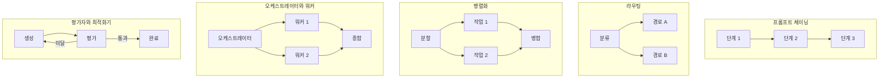
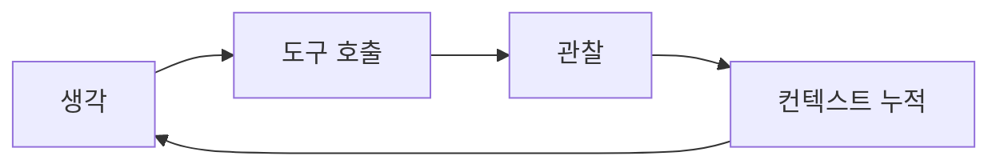

# 1장. 에이전트라고 부르기 전에 — 정의, 경계, 그리고 루프의 조상

에이전트라는 말을 들으면 대개 비슷한 그림이 떠오른다. 목표만 던져주면 알아서 계획을 세우고, 필요한 도구를 골라 쓰고, 사람 손을 거의 타지 않는 무언가. 그런데 이 분야에서 가장 많이 인용되는 문서 두 개가 하는 말은 그 그림과 거의 반대다. 둘 다 에이전트 제품을 파는 회사가 쓴 문서인데, 정작 결론은 "가능하면 쓰지 말라"는 쪽에 가깝다.

### 자기 제품과 반대 방향으로 말하는 두 문서

Microsoft Learn의 Agent Framework 개요 문서에 이런 문장이 있다(2026-07-10 갱신 기준).

> *"If you can write a function to handle the task, do that instead of using an AI agent."*

함수로 처리할 수 있는 일이면 에이전트 대신 함수를 쓰라는 말이다. 에이전트 프레임워크를 소개하는 문서의 앞머리에 놓이기에는 묘하다. 같은 문서는 판단 표까지 제공한다. 에이전트는 과제가 열려 있거나 대화형이고 자율적인 도구 사용과 계획이 필요할 때. 워크플로는 단계가 이미 정의돼 있고 실행 순서를 명시적으로 통제해야 하거나, 여러 에이전트를 조율해야 할 때.

여기 쓰인 워크플로와 에이전트라는 두 단어의 출처는 다른 회사다. Anthropic이 2024-12-19에 낸 「Building effective agents」가 이 구분을 업계 공용어로 만들었다.

> **워크플로:** *"Systems where LLMs and tools are orchestrated through predefined code paths."*
> **에이전트:** *"Systems where LLMs dynamically direct their own processes and tool usage, maintaining control over how they accomplish tasks."*

옮겨보면 경계가 더 또렷해진다. 워크플로는 LLM과 도구가 미리 정해진 코드 경로를 따라 조율되는 시스템이고, 에이전트는 LLM이 자기 과정과 도구 사용을 스스로 지시하면서 목표를 어떻게 달성할지에 대한 통제권을 쥐는 시스템이다. 갈림길은 모델의 똑똑함이 아니다. **다음에 무엇을 할지 결정하는 주체가 코드인가 모델인가**, 그 하나다.

이 구분이 왜 실무에서 값이 나가는지 잠깐 생각해보자. 경로가 코드 안에 있으면 우리는 그 경로를 그림으로 그릴 수 있고, 리뷰에 올릴 수 있고, 단위 테스트를 붙일 수 있고, 장애가 났을 때 어느 분기에서 틀어졌는지 코드를 읽어 좁힐 수 있다. 결정을 모델에게 넘기는 순간 그 네 가지가 전부 흔들린다. 같은 입력에 대해 실행마다 다른 경로가 나올 수 있으니 경로 자체가 산출물이 되고, 무슨 일이 있었는지는 실행 기록을 남겨두지 않으면 알 수 없다. 에이전트를 도입하는 결정이 사실은 "우리 시스템의 제어 흐름을 런타임에 생성되게 두겠다"는 결정이라는 걸 알아두면, 뒤에 나오는 평가·가드레일 장들과 실행 기록을 다루는 장이 왜 그렇게 두툼한지 납득이 된다.

같은 글은 대가도 분명히 적어뒀다. 에이전트를 택하면 *"higher costs, and the potential for compounding errors"* — 더 높은 비용과 오류가 누적될 가능성을 함께 받는다. 그래서 *"extensive testing in sandboxed environments, along with appropriate guardrails"*가 필요하다고 못 박는다. 샌드박스에서의 충분한 테스트, 그리고 적절한 가드레일. 3장부터 10장까지 이 책이 하는 이야기의 목록이 사실 이 한 문장 안에 이미 들어 있다.

시점 하나를 붙여두자. Anthropic 글은 2024-12-19 발행이고 2026년 7월 기준으로 1년 7개월이 지났다. 정의와 패턴 분류는 지금도 그대로 인용되지만, 글 안에 언급된 프레임워크 정보는 이미 구버전이다. 이 책이 다루는 거의 모든 것이 그렇다. 개념은 오래 가고 제품 정보는 빨리 낡는다.

### 워크플로에는 다섯 가지 모양이 있다

Anthropic의 같은 글이 제시한 워크플로 패턴 다섯 종은 사실상 표준 분류가 됐다. prompt chaining(프롬프트 체이닝), routing(라우팅), parallelization(병렬화), orchestrator-workers(오케스트레이터와 워커), evaluator-optimizer(평가자와 최적화기)다.

그림 1. 워크플로 패턴 다섯 종 — 어느 쪽이든 경로를 그린 사람은 개발자다

다섯 개를 한 장에 놓고 보면 공통점이 눈에 들어온다. 화살표를 그린 주체가 전부 개발자다. LLM은 각 노드 안에서 문장을 만들거나 분류를 하거나 점수를 매기지만, 노드에서 노드로 넘어가는 결정은 코드가 한다. 심지어 평가자와 최적화기 패턴처럼 루프가 도는 모양조차 그렇다. 루프가 있으니 에이전트라고 부르고 싶어지지만, 언제 다시 돌고 언제 빠져나올지를 코드가 쥐고 있다면 그건 워크플로다.

평가자와 최적화기 패턴을 조금 더 들여다보면 2장에서 다룰 이야기의 씨앗이 보인다. 이 패턴이 성립하려면 평가 칸이 실제로 판정을 해줘야 한다. 판정 없이 "다시 해봐"를 반복하는 모양은 패턴이 아니라 낭비다. 워크플로에서는 이 조건이 눈에 잘 보인다. 평가 노드를 우리가 직접 짜야 하니 무엇으로 판정할지 정하지 않고는 코드가 완성되지 않기 때문이다. 결정을 모델에게 넘기면 이 조건이 슬그머니 사라진다.

판단 기준도 같은 글에 있다. 서브태스크가 고정적이고 일관성이 우선이라면 워크플로. 단계를 미리 정할 수 없는 열린 문제라면 에이전트. 자기 과제를 이 축에 올려놓는 연습을 지금 한 번 해보자. "사용자가 올린 계약서에서 조항 열두 개를 뽑아 표로 만든다"는 과제라면, 뽑을 조항 목록이 이미 정해져 있으니 경로를 그릴 수 있다. "사용자 질문을 받아 사내 시스템 어디를 얼마나 뒤져야 할지 그때그때 정한다"는 과제라면 미리 그릴 수 없다. 앞쪽을 에이전트로 만들면 비용과 오류 누적을 값도 없이 사는 셈이다. 몇 주를 들여 만든 뒤에 "이건 함수로 됐잖아"라는 말을 리뷰에서 듣는 상황은 뒷맛이 꽤 찜찜하다.

### 그렇다면 자율성은 언제 사야 하나

여기서 논쟁 하나를 정직하게 펼쳐두는 게 낫다. "워크플로로 충분한가, 자율 에이전트가 필요한가"는 아직 닫히지 않은 질문이다.

한쪽에는 방금 본 벤더 두 곳의 권고가 있다. Anthropic은 *"Start with simple prompts"*로 시작해 단순한 해법이 부족할 때만 복잡도를 더하라고 하고, Microsoft는 함수로 되면 함수로 하라고 한다. 서로 다른 회사가 서로 다른 제품을 팔면서 같은 결론에 도달했다는 점이 이 권고의 무게다.

다른 쪽에는 제품 구조가 하는 증언이 있다. 역할 기반 자율 위임의 대표 프레임워크인 CrewAI는 역할과 목표를 선언하면 위임 판단을 LLM이 하는 Crews를 내세운다. 그런데 CrewAI는 Flows를 별도로 뒀다. 공식 문서가 Flows의 용도로 밝힌 것은 *"event-driven workflows requiring state management, conditional branching, human oversight, or orchestration across multiple crews"* — 상태 관리, 조건 분기, 사람 개입(HITL), 여러 crew에 걸친 조율이 필요한 이벤트 기반 워크플로다. 프리미티브도 `@start`·`@listen`·`@router`·`@persist`처럼 노골적으로 명시적이다. 자율 위임 진영의 대표 주자가 스스로 명시적 워크플로 층을 제품에 추가했다는 사실은, 순수 자율 위임만으로는 프로덕션이 안 되는 지점이 실재한다는 증언으로 읽을 수 있다.

이 논쟁은 지금 한쪽으로 기울어 있다. 결정적 워크플로를 기본값으로 두고 자율성은 필요한 만큼만 사는 것이 벤더 공통 권고다. 다만 기울어 있다는 말과 반대쪽 근거가 없다는 말은 다르다. CrewAI Flows가 존재한다는 사실은 사라지지 않으며, 그 사실이 알려주는 것은 "자율이냐 결정이냐"가 아니라 **하나의 시스템 안에서 두 성질을 어떻게 섞을 것인가**가 실제 설계 문제라는 점이다.

한 가지 더. 워크플로 쪽 기본값에는 이미 성숙한 도구가 있다. Prefect와 Dagster는 데이터 계보 중심의 워크플로 오케스트레이터이며 에이전트 프레임워크가 아니다. 결정론이 요구사항인 파이프라인에서는 이쪽이 정답이고, 에이전트가 아예 불필요할 수 있다. 에이전트가 유일한 선택지처럼 보인다면 그건 기술의 문제가 아니라 시야의 문제인 경우가 많다.

### 이 루프의 조상

에이전트가 새로운 종류의 소프트웨어가 아니라는 걸 가장 빨리 이해하는 방법은 계보를 보는 것이다. 오늘 우리가 쓰는 거의 모든 루프의 원형은 2022년 논문 하나에 이미 있다. ReAct(arXiv:2210.03629, v1 2022-10-06 / v3 2023-03-10)다.

그림 2. ReAct 루프 — 관찰이 컨텍스트로 되먹여지고, 회차마다 컨텍스트가 커진다

생각하고, 도구 호출(tool use)을 하고, 결과를 관찰하고, 그 관찰을 컨텍스트에 되먹여 다시 생각한다. 이게 전부다. 프레임워크 스무 개가 서로 다른 이름과 추상화를 붙여 팔고 있지만, 그래프든 역할 위임이든 핸드오프든 안쪽에서 도는 것은 이 네 칸이다.

이 논문에서 실무자가 챙길 함의는 따로 있다. **"생각"은 장식이 아니라 도구 호출 오류를 잡는 채널이다.** 모델이 중간에 자기 판단을 텍스트로 뱉게 만드는 이유는 사람이 읽고 감탄하기 위해서가 아니라, 잘못된 인자나 잘못된 도구 선택이 그 텍스트 단계에서 걸러지기 때문이다. 대가도 명확하다. 스텝마다 히스토리를 다시 보낸다. 그림 2에서 컨텍스트 누적 칸이 왜 굳이 그려져 있는지, 2장에서 청구서로 확인하게 된다.

그런데 "생각을 시키면 좋아진다"를 전역 기본값으로 삼으면 곤란해진다. Chain-of-Thought(arXiv:2201.11903)의 원논문이 주장한 이득 범위는 산술·상식·기호 추론이었다. 그리고 100편이 넘는 연구를 모은 메타분석 「To CoT or not to CoT」(arXiv:2409.12183, ICLR 2025)는 CoT의 이득이 주로 수학과 논리에 한정된다고 보고한다. MMLU에서는 등호가 없는 문항이라면 CoT 없이도 정확도가 거의 같았다. 실무 번역은 간단하다. 모든 요청에 단계별 사고를 켜두는 것은 품질 향상이 아니라 토큰 낭비일 수 있다. 어떤 태스크에서 켜고 어떤 태스크에서 끌지를 재보는 편이 낫다. 참고로 이 메타분석은 프롬프트로 유도하는 CoT를 대상으로 하므로, 추론이 학습에 들어간 모델까지 일반화하지는 말자.

계보를 보는 일이 교양 쌓기로 끝나지 않는 이유가 하나 더 있다. 프레임워크를 고를 때 우리가 실제로 비교하는 것은 이 네 칸을 누가 얼마나 대신 관리해주느냐이기 때문이다. 어떤 도구는 컨텍스트에 무엇을 남기고 무엇을 버릴지를 대신 정해주고, 어떤 도구는 그 결정을 전부 우리에게 맡긴다. 어떤 도구는 관찰 결과가 이상할 때 사람에게 물어보는 지점을 미리 뚫어두고, 어떤 도구는 그 지점을 직접 만들라고 한다. 루프 자체가 새로울 게 없다는 사실을 알고 나면, 제품 소개 문서를 읽는 눈이 바뀐다. "무엇을 할 수 있나"가 아니라 "이 네 칸 중 어디를 대신 해주고, 그 대가로 무엇을 포기하게 하나"를 묻게 된다.

나머지 조상들은 이름과 지분만 먼저 걸어두겠다. 여기 걸린 논문들의 논증은 2장이 소유한다. 루프의 비용과 실패를 이야기하려면 어차피 이 넷을 다시 불러와야 하기 때문이다.

| 논문 | arXiv | 실무자에게 의미하는 것 |
|------|-------|-------------|
| Reflexion | 2303.11366 | 재시도를 "다시 호출"이 아니라 실패 원인을 텍스트로 요약해 다음 시도에 넣기로 |
| Self-Refine | 2303.17651 | 자기 피드백으로 출력을 고쳐 쓰기. 비용이 호출 횟수에 선형으로 붙는다 |
| ReWOO | 2305.18323 | 관찰을 기다리지 않고 계획을 먼저 세워 재전송을 줄이는 비용 구조 결정 |
| Tree of Thoughts | 2305.10601 | 한 줄기 대신 여러 줄기를 펼쳐 탐색하기 |
| Toolformer | 2302.04761 | 오늘의 도구 호출의 학술 뿌리. 도구는 모델의 약점을 메우는 것 |
| MemGPT | 2310.08560 | 컨텍스트 윈도를 RAM, 외부 저장소를 디스크로 보는 은유 |

이 표를 처음 보면 논문 여섯 편이 숙제처럼 느껴져 막막할 수 있다. 그럴 필요는 없다. 각 행은 결국 "루프의 어느 칸을 건드려서 무엇을 얻었나"의 기록이고, 우리가 프레임워크를 고를 때 비교하는 항목과 같은 자리를 가리킨다.

표에 학회명이 없는 것은 실수가 아니다. 이 논문들의 발표처는 확인되지 않았고, "어느 학회에서 발표된 무슨 논문"이라고 쓰는 순간 검증할 수 없는 문장이 하나 늘어난다. arXiv ID만으로도 원문을 찾는 데는 충분하다.

여기까지 오면 1장의 질문에 답할 재료가 모였다. 우리가 만들려는 것이 에이전트인지 워크플로인지는 취향이 아니라 통제권의 위치로 갈린다. 그리고 그 통제권을 모델에게 넘기기로 했다면, 넘긴 만큼 값을 치른다. 그 값이 어디서 어떻게 청구되는지가 다음 장의 이야기다.
