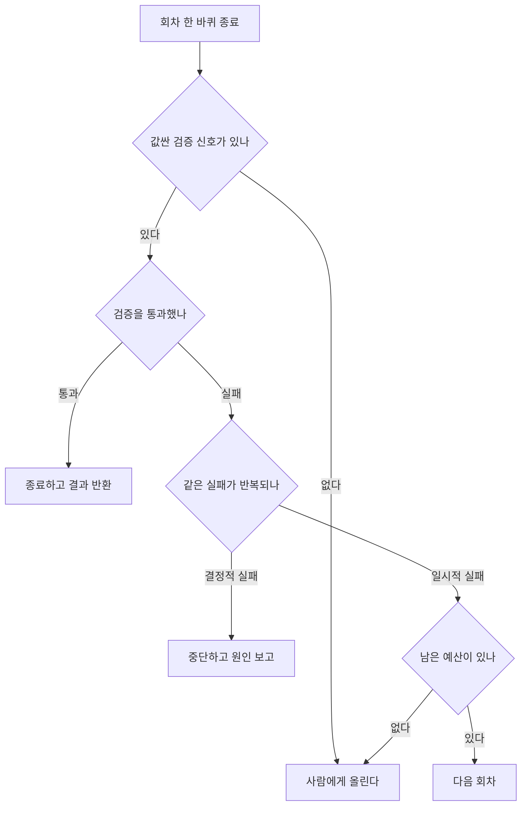

# 2장. 루프는 왜 비싸고 어떻게 실패하는가

한 시간이 지났다. 터미널에는 도구 호출과 관찰이 수백 줄 쌓였고, 토큰 사용량 표시는 계속 올라갔다. 그리고 에이전트가 말한다. "해결했습니다." 반가운 마음으로 확인해보면 아무것도 고쳐지지 않았다. 그래서 사람이 다시 알려준다. 해결되지 않았고, 에러 메시지가 아까와 똑같다고.

이 장면은 특정 제품의 버그 리포트가 아니다. 커뮤니티 자료를 훑다 보면 같은 실패가 표현만 바꿔 최소 여섯 곳에서 반복 서술된다. 한 개발자는 이렇게 요약했다. *"한 시간 동안 문제를 풀려고 루프를 돌다가, '해결했습니다'라고 하고, 그러면 당신이 문제가 해결되지 않았다고, 에러 메시지가 똑같다고 말해줘야 한다."* 한 시간의 청구서와 거짓 성공 선언이 한 문장에 붙어 있다는 게 중요하다. 이 장은 그 문장을 둘로 쪼개서 각각 어디서 오는지 본다.

### 비용은 선형이 아니다

먼저 청구서 쪽이다. 루프가 열 바퀴를 돌면 비용도 열 배쯤 되겠다고 생각하기 쉽다. 그렇지 않다. 한 개발자가 이 구조를 아주 간결하게 정리했다. *"루프 한 바퀴마다 컨텍스트 전체가 다시 모델에 들어가므로 비용은 선형이 아니라 그보다 가파르게 붙습니다."*

당연한 얘기인데도 자주 잊힌다. 1장 그림 2에서 컨텍스트 누적 칸을 따로 그려둔 이유가 여기 있다. 회차마다 이전 생각과 도구 출력이 컨텍스트에 쌓이고, 다음 요청은 그 쌓인 것을 전부 다시 실어 보낸다. 한 바퀴에 들어가는 입력 토큰이 회차와 함께 커지므로, 총량은 회차 수의 곱셈이 아니라 그보다 가파른 곡선을 그린다. 커뮤니티에 올라오는 "한밤중에 크레딧이 녹았다"류의 사고 보고들이 왜 그렇게 극적인 숫자로 끝나는지, 이 한 문장이 설명한다.

그래서 이 문제를 아키텍처로 공격한 논문이 일찍 나왔다. ReWOO(arXiv:2305.18323)는 관찰이 올 때까지 기다리며 한 스텝씩 진행하는 대신 계획을 먼저 통째로 세워 재전송 자체를 없애는 방향을 택했고, HotpotQA에서 토큰 효율을 다섯 배로 바꿨다(GPT-3.5 기준). 대가는 분명하다. 중간 관찰에 맞춰 계획을 고치는 능력을 잃는다. 여기서 챙길 것은 다섯 배라는 숫자가 아니라, **회차마다 무엇을 다시 보낼지가 아키텍처 결정**이라는 사실이다. 비용은 모델 단가를 협상해서 줄이는 것이 아니라 루프 모양을 바꿔서 줄인다.

### 검증기 없는 루프는 넣지 마라

이제 거짓 성공 쪽이다. 재시도와 자기 반성을 붙이면 품질이 올라간다는 이야기는 널리 퍼져 있다. Reflexion(arXiv:2303.11366)이 그 대표다. 실패를 그냥 다시 호출하는 대신 실패 원인을 텍스트로 요약해 다음 시도의 컨텍스트에 넣는 방식으로, HumanEval `pass@1`을 91%까지 올렸다고 보고했다(GPT-4 세대 기준). 그런데 반대편에는 "LLM은 스스로를 교정하지 못한다"는 연구(arXiv:2310.01798)가 있다. 둘 중 하나가 틀린 걸까?

둘은 모순이 아니다. Reflexion이 효과를 본 환경에는 값싼 외부 판정 신호가 있었다. 컴파일러, 테스트, 게임 결과처럼 모델의 의견과 무관하게 참·거짓을 돌려주는 것들이다. 반박된 것은 그런 신호 없이 모델이 자기 답을 다시 들여다보며 고치는 방식이다. 실제로 논문 여러 편을 나란히 놓고 보면 리플렉션·트리 탐색·멀티에이전트 토론이 성과를 낸 사례에는 예외 없이 값싼 외부 판정이 붙어 있었다. Tree of Thoughts(arXiv:2305.10601)가 성과를 낸 태스크들도 **정답 검증이 값싼** 문제였다.

그래서 설계 규칙은 "리플렉션 루프를 넣어라"가 아니다. **검증기를 먼저 붙여라. 그것 없는 리플렉션은 토큰 낭비이거나 후퇴다.** 검증기라고 해서 거창한 걸 만들 필요는 없다. 테스트 스위트, 타입 체커, JSON 스키마 검증, HTTP 상태 코드, 파서가 던지는 예외까지 전부 검증기다. 백엔드 개발자라면 이미 손에 쥐고 있는 것들이다.

여기서 한 걸음 더 나가보자. 검증기가 없는 태스크를 만났을 때 우리가 할 수 있는 일은 포기 말고도 있다. 태스크의 일부를 검증 가능한 모양으로 바꾸는 것이다. 보고서를 만드는 에이전트에게 출력 스키마를 강제하면 최소한 형식은 코드가 판정한다. 인용을 붙이라고 요구하고 그 인용이 원문에 실제로 존재하는지 문자열로 대조하면, 지어낸 근거의 상당 부분이 루프 안에서 걸린다. 요약 결과를 다시 원문과 대조해 숫자가 바뀌지 않았는지 확인하는 것도 값싼 판정이다. 완벽한 판정기를 만들라는 게 아니다. **모델의 의견이 아니라 코드가 참·거짓을 돌려주는 지점을 하나라도 만들면 루프가 의미를 갖는다.**

그리고 정말로 신호가 없는 문제라면? 루프를 넣지 말고 사람에게 올리는 편이 낫다. Self-Refine(arXiv:2303.17651)이 7개 태스크에서 평균 20% 남짓한 절대 향상을 보고했지만(당시 모델 기준) 비용은 호출 횟수에 선형으로 붙는다. 판정할 수 없는 문제에 회차를 더 사는 것은, 답이 좋아졌는지 알 수 없는 상태로 청구서만 키우는 일이다. 뒷맛이 찜찜한 종류의 낭비다.

### 루프가 실패하는 네 가지 방식

검증기 문제를 알고 나면 실패 목록이 정리된다. 현장에서 반복 보고되는 것은 크게 네 가지다.

**첫째, 증거 없는 성공 선언.** 오픈소스 이슈 트래커에 올라온 사례에서 에이전트의 최종 출력은 `"Done. All tests passed. Ready to publish."`였는데, 보고자의 지적은 이랬다. 명령 출력도, 트레이스 증거도, 사람의 승인도 아무것도 첨부되지 않았을 수 있다는 것이다. 모델은 "성공했다"는 문장을 만들 수 있고, 그 문장은 성공의 증거가 아니다. 종료 판정을 모델의 서술에 맡기지 말고, 검증기의 출력에 맡겨야 하는 이유다.

**둘째, `max_iter`는 양방향으로 틀린다.** 한 개발자의 정리가 정확하다. *"너무 일찍 멈추면 아직 개선 중이던 루프를 잘라내고, 너무 늦게 멈추면 루프가 이미 최선의 답을 찾은 뒤의 반복에 돈을 내고 — 게다가 마지막 시도를 출하하는데 그게 때로는 이전 것보다 더 나쁘다."* 프레임워크 이슈에서도 같은 진단이 독립적으로 나왔다. 맹목적인 `max_iter` 카운터가 유효한 15단계 워크플로를 11단계에서 죽인다는 것이다. 회차 상한은 안전장치이지 종료 조건이 아니다. 상한만 걸어두고 종료 조건을 설계하지 않으면, 상한을 몇으로 잡아도 틀린다.

**셋째, 지터 루프.** 같은 도구를 같은 인자로 부르며 도는 루프는 눈에 잘 띄고 막기도 쉽다. 문제는 매번 질의를 조금씩 바꿔가며 도는 루프다. 인자 해시로 중복을 걸러내는 방어는 이걸 잡지 못한다. 진전이 있는 것처럼 보이는데 실제로는 같은 자리를 도는 셈이라 난감하다. 걸러내려면 호출 단위가 아니라 태스크 진척 단위의 판정이 필요해진다.

**넷째, 재시도가 실행 증폭기가 되는 경우.** 프레임워크 이슈에 올라온 표현을 그대로 옮기면 이렇다. *"같은 툴 호출이 같은 인자 패턴으로 실패하는데 재시도 루프가 이걸 일반적으로 취급하면, 사실상 실행 증폭기(execution amplifier)가 된다."* 결정적으로 실패하는 호출을 일시적 실패처럼 다루면, 재시도는 복구가 아니라 증폭이다. 이 실패 모드는 도구 쪽 사정과도 맞물려 있어서, 3장에서 프로토콜 층까지 내려가 다시 본다.

그림 1. 루프 종료 판단 — 상한 카운터 하나가 아니라 세 갈래 판정이 필요하다

그림 1에서 눈여겨볼 지점은 맨 위 분기다. 검증 신호가 없으면 나머지 판정이 전부 무의미해진다. 루프를 설계할 때 먼저 물어야 할 두 질문은 그래서 이렇게 정리된다. 값싼 검증 신호가 있는가, 그리고 종료 조건이 무엇인가.

### 컨텍스트 예산이 지배 변수다

비용도 실패도 결국 한 곳으로 수렴한다. 컨텍스트다. Anthropic의 실무 문서는 이 사정을 담담하게 적어뒀다. *"Claude's context window fills up fast, and performance degrades as it fills."* 컨텍스트 윈도는 빨리 차고, 차는 만큼 성능이 떨어진다. 크기를 키우면 해결되는 문제가 아니라는 게 여러 갈래 연구가 도달한 결론이다.

백엔드 개발자에게 이 사정을 가장 잘 옮겨주는 은유는 MemGPT(arXiv:2310.08560)에서 나왔다. **컨텍스트 윈도는 RAM, 외부 저장소는 디스크, 그래서 필요한 것은 페이징 정책이다.** RAM이 부족한 서버를 만났을 때 우리가 하는 일을 떠올려보자. 램을 늘리기도 하지만, 그보다 먼저 무엇을 메모리에 상주시키고 무엇을 스왑으로 내릴지를 정한다. 에이전트의 메모리도 같은 종류의 설계 문제다. 그런데 실무에서는 이 자리에 "메모리는 벡터 DB에 넣는다" 한 줄이 들어가고 끝나는 경우가 많다. 계층을 나누지 않으면 페이징 정책도 없는 셈이다.

계층으로 쪼개야 할 근거는 셋이다. 하나, 위치가 성능을 바꾼다. Lost in the Middle(arXiv:2307.03172)이 보여준 것은 긴 입력의 중간에 놓인 정보가 덜 쓰인다는 사실이다. 무엇을 넣느냐뿐 아니라 어디에 놓느냐가 세금처럼 붙는다. 둘, 오래 도는 루프는 자기 역사를 잃는다. 한 개발자는 이렇게 관찰한다. *"어려운 부분은 코드 양이나 토큰 비용이 아니다. 상태 연속성이다."* 그는 장기 실행 루프에서 대략 50~60턴을 넘으면 큰 컨텍스트 윈도가 있어도 앞선 정보에 가중치를 덜 주기 시작하고 이미 해결한 문제를 다시 풀기 시작한다고 말한다. 이 턴 수는 한 사람의 관찰이므로 임계값으로 외울 값은 아니다. 다만 메커니즘 쪽은 위의 연구가 뒷받침한다. 그리고 같은 관찰자의 처방이 실용적이다. 명시적 검색을 갖춘 파일 기반 메모리가 컨텍스트에 밀어넣기보다 더 신뢰할 만하다는 것이다. 셋, 서브에이전트는 사실 별도의 컨텍스트 윈도다. Claude Code 문서의 표현으로는 *"Subagents run in separate context windows and report back summaries"* — 서브에이전트는 분리된 컨텍스트 윈도에서 돌고 요약만 돌려준다.

이 소절의 결론은 한 줄로 요약된다. 메모리를 벡터 DB 하나로 뭉뚱그리지 말고 계층으로 쪼개자. 무엇을 항상 실을지, 무엇을 필요할 때 검색해 올릴지, 무엇을 파일로 내려두고 경로만 기억할지, 무엇을 다른 컨텍스트 윈도로 격리할지. 이 네 칸을 채우는 일이 컨텍스트 예산 설계다. 6장과 7장에서 데이터 계층을 고를 때, 여기서 나눈 칸이 그대로 기준으로 쓰인다.

### 루프를 여럿 돌릴 때

컨텍스트 이야기를 하다 보면 자연히 멀티에이전트로 넘어간다. 하나가 안 되면 여럿으로 나누자는 발상은 자연스럽다. 그런데 이 판단은 아직 논쟁 중이라 양쪽을 함께 봐야 한다.

이득이 있다는 쪽에는 Multiagent Debate(arXiv:2305.14325)가 있다. 여러 인스턴스가 서로 토론하게 하면 수학·전략 추론과 사실성이 향상된다는 보고다. 회의적인 쪽에는 MAST(arXiv:2503.13657, v3 2025-10-26)가 있다. 7개 프레임워크에서 1,600건이 넘는 실행 기록을 뜯어본 이 연구는 멀티에이전트의 성능 향상이 종종 미미하다고 적고, 실패를 14개 모드 3범주로 분류한다. 범주 이름 자체가 읽을 값이 있다. 시스템 설계, 에이전트 간 정렬, 태스크 검증이다. 셋 중 둘이 조율이 아니라 설계와 검증에 있다. 세 번째 관점은 현장에서 나온다. 한 개발자는 단일 에이전트로는 한 번의 호출에 담을 컨텍스트가 부족해서 병렬 에이전트가 필요하다고 말하며, 자기들이 사실상 *"에이전트를 스레드로, 역할을 함수로 취급하고 있다"*고 표현한다.

이 세 갈래를 나란히 놓으면 질문이 바뀐다. "멀티에이전트냐"가 아니라 **"왜 멀티에이전트냐"**다. 그리고 이 지점에는 공식 문서·논문·현장 경험이 각각 다른 경로로 도달한 답이 있어서 강하게 말할 수 있다. 정당한 이유는 둘이다. **컨텍스트 격리와 병렬성.** 서브에이전트의 실질 가치가 조율이 아니라 깨끗한 컨텍스트라는 관찰, 별도 컨텍스트 윈도라는 벤더 문서의 서술, 그리고 성능 향상이 종종 미미하다는 연구가 같은 곳을 가리킨다. 뒤집어 말하면 "정확도가 올라가니까"를 근거로 멀티에이전트를 제안하면 MAST가 반박한다. 정확도를 근거로 쓰고 싶다면 자기 도메인에서 직접 재본 숫자여야 한다.

숨은 비용도 둘이다. 하나는 청구서다. 팬아웃은 곱셈이라, 서브에이전트를 여럿 띄우면 앞 절에서 본 가파른 곡선이 그 수만큼 곱해진다. 한 개발자는 자기 지시를 에이전트가 잊어버려 값비싼 모델 여러 개가 동시에 돌아갔고 그 결과로 크레딧이 순식간에 사라졌다고 보고한다. 지시가 잊히는 일이 곧 비용 사고가 되는 구조라는 게 이 사례의 요점이다. 다른 하나는 더 조용하다. *"가장 과소평가된 문제는 상태 조율이다. …두 에이전트가 공유 상태에서 서로의 작업을 조용히 덮어쓰는 것을 막는 일. 고전적인 경쟁 조건인데, AI 시스템에서는 출력이 그럴듯해 보여서 프로덕션까지 알아채지 못한다."* 경쟁 조건은 백엔드 개발자에게 낯선 문제가 아니다. 낯선 것은 결과물이 그럴듯해서 아무도 알람을 못 받는다는 부분이다.

마지막으로 정의를 날카롭게 해주는 인용 하나를 남겨두자. *"하나를 고른다. 그게 돈다. 맞기를 바란다. 그건 멀티에이전트가 아니다 — 채팅 히스토리가 있는 단일 에이전트다."*

### 이 장의 핵심

- 루프 비용은 회차에 비례하지 않는다. 회차마다 컨텍스트 전체가 다시 실리므로 그보다 가파르게 붙는다.
- 값싼 외부 검증 신호가 없는 루프는 개선이 아니라 낭비다. 신호가 없으면 회차를 늘리지 말고 사람에게 올린다.
- 회차 상한은 안전장치이고 종료 조건이 아니다. 상한만 걸면 어느 값으로 잡아도 틀린다.
- 메모리는 벡터 DB 하나가 아니라 계층이다. 무엇을 상주시키고 무엇을 내려둘지 정하는 것이 컨텍스트 예산 설계다.
- 멀티에이전트를 정당화하는 근거는 컨텍스트 격리와 병렬성이다. 정확도 향상을 근거로 쓰면 반박당한다.

정리하고 나면 한 가지가 계속 걸린다. 이 장의 규칙 대부분이 "검증 신호가 있다면"이라는 조건절에 매달려 있다는 점이다. 테스트가 있는 코딩 태스크라면 어렵지 않다. 그런데 사내 문서를 요약하는 에이전트, 고객 문의에 답하는 에이전트, 몇 개 시스템을 뒤져 보고서를 만드는 에이전트에게는 컴파일러도 테스트도 없다. 그렇다면 그 검증 신호는 어디서 구하나?
