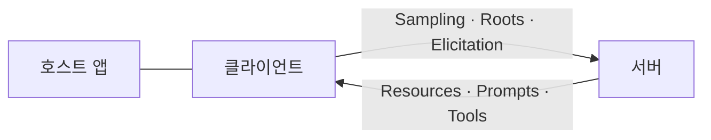
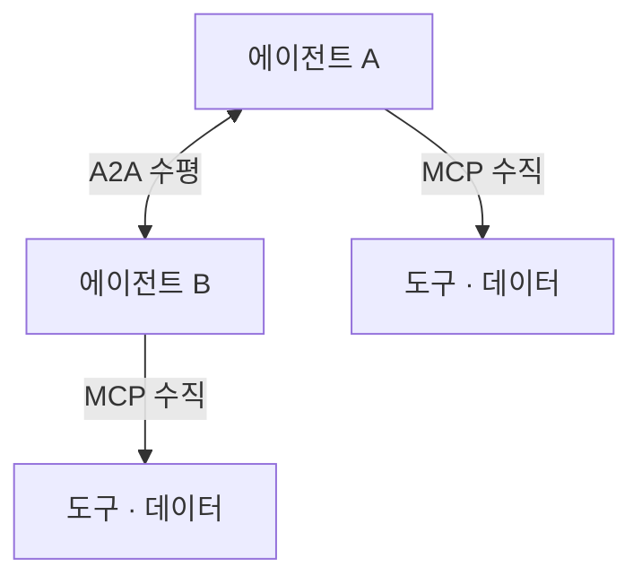

# 3장. 손을 달아주는 일 — MCP, A2A, 그리고 재시도라는 함정

도구 호출이 실패했을 때, 다시 부를지는 누가 결정할까?

이 질문을 받으면 백엔드 개발자는 반사적으로 답을 안다. 재시도 정책은 코드에 있다. 몇 번, 얼마 간격으로, 어떤 오류 코드에서 다시 부를지가 클라이언트 설정이나 서킷 브레이커에 적혀 있고, 그 파일은 리뷰를 거쳐 머지된다. 그런데 에이전트에서는 그 답이 통하지 않는다. 이 장은 도구를 붙이면 무엇이 늘어나는지 보고, 늘어난 것 가운데 가장 위험한 하나가 재시도라는 이야기를 한다.

### MCP는 LSP를 닮았다

도구를 붙이는 방식은 원래 벤더별로 흩어져 있었다. 모델마다 함수 정의 스키마가 다르고, 같은 도구를 세 벤더에 붙이려면 세 번 짰다. MCP가 표준화한 것이 이 지점이다.

MCP를 이해하는 최단 경로는 스펙 자신이 알려준다. 설계 계보를 Language Server Protocol(LSP)에서 얻었다고 밝히기 때문이다. 에디터마다 언어별 지원을 따로 만들던 세계에서, LSP는 에디터와 언어 서버 사이에 프로토콜 하나를 세워 M×N을 M+N으로 바꿨다. MCP가 하는 일이 정확히 같은 모양이다. 모델·에이전트 쪽과 도구·데이터 쪽 사이에 프로토콜을 하나 세운다.

구조도 낯설지 않다. JSON-RPC 2.0 위에, 상태를 유지하는 연결과 능력 협상(capability negotiation)이 얹혀 있다. 역할은 셋이다. 연결을 시작하는 LLM 앱이 Hosts, 호스트 안의 커넥터가 Clients, 컨텍스트와 능력을 제공하는 쪽이 Servers다.

그림 1. MCP의 세 역할과 양방향 제공 능력 — 화살표가 한쪽으로만 흐르지 않는다

버전 이야기를 먼저 정리하고 넘어가자. 현행 스펙 리비전은 `2025-11-25`다(2026-07 기준). 이 점은 확인해둘 값이 있다. `2025-06-18`을 최신으로 적어둔 자료가 여전히 많이 돌아다닌다. 그리고 2026년에는 새 리비전이 나오지 않았다. 스펙은 안정화 국면이고, 움직이는 것은 SDK와 레지스트리다. 실제로 Python SDK는 `1.28.1`(2026-06-26), 레지스트리는 `v1.8.0`(2026-07-13)까지 왔지만 TypeScript SDK의 최신 릴리스는 `v1.29.0`(2026-03-30)으로 넉 달 넘게 태그가 멈춰 있다. 같은 프로토콜 이름 아래에서 언어별 SDK의 속도가 다르다는 것은 도입 계획을 세울 때 실제로 걸리는 사정이다. **스펙이 멈춰 있다는 말과 생태계가 멈춰 있다는 말은 다르다.**

라이선스는 따로 봐야 한다. MCP 스펙 레포의 라이선스 판정이 `NOASSERTION`이라, 2026년 7월 기준으로는 "MCP는 오픈소스다"라고 단정할 근거가 없다. 사내 배포 정책을 통과해야 한다면 문구를 직접 확인하는 편이 낫다.

### 한국어 자료가 자주 빠뜨리는 절반

MCP 소개 글을 몇 개 읽어보면 대개 서버 쪽 이야기로 끝난다. 서버가 제공하는 것은 셋이다. Resources는 컨텍스트와 데이터, Prompts는 템플릿 워크플로, Tools는 모델이 실행하는 함수다. 여기까지는 어디에나 나온다.

그런데 그림 1의 아래쪽 화살표를 보자. 클라이언트도 제공한다. Sampling은 서버가 주도해 LLM 호출을 다시 요청하는 것이고, Roots는 URI와 파일시스템 경계를 알려주는 것이고, Elicitation은 서버가 사용자에게 추가 정보를 요청하는 통로다. 이 셋을 빼놓고 MCP를 이해하면 "도구 목록을 꽂는 규격"으로만 남는다.

셋 다 설계 결정으로 이어진다. Sampling이 있다는 것은 서버가 모델을 다시 쓸 수 있다는 뜻이므로, 비용과 루프의 발원지가 우리 코드 밖에도 생긴다는 뜻이다. Roots가 있다는 것은 파일시스템 경계를 프로토콜 층에서 다룰 수 있다는 뜻이고, Elicitation이 있다는 것은 사람에게 묻는 지점을 서버가 열 수 있다는 뜻이다. 2장에서 남긴 질문 하나가 여기서 실마리를 얻는다. 검증 신호가 없을 때 사람에게 올리는 통로 말이다. 그 통로가 프롬프트 안의 부탁이 아니라 프로토콜의 기능일 수 있다.

### 수직과 수평 — MCP와 A2A는 경쟁하지 않는다

MCP와 나란히 언급되는 이름이 A2A다. 둘을 경쟁 관계로 소개하는 자료가 있는데, 그렇게 읽으면 설계가 꼬인다. 방향이 다르다.

그림 2. MCP는 수직, A2A는 수평 — 두 축은 직교한다

**MCP는 에이전트와 도구·컨텍스트 사이의 수직 방향이고, A2A는 에이전트와 에이전트 사이의 수평 방향이다.** 한 시스템이 둘을 동시에 쓰는 것이 자연스럽고, 실제로 Google ADK는 양쪽을 함께 내장한다.

A2A는 `v1.0.0`에 도달했다(릴리스 2026-05-28). 핵심 개념 둘만 기억해두면 나머지는 따라온다. 하나는 Agent Card로, 스펙의 표현으로는 *"A JSON metadata document ... describing its identity, capabilities, skills, service endpoint, and authentication requirements"* — 정체·능력·스킬·엔드포인트·인증 요구사항을 담은 JSON 메타데이터 문서다. 서비스 디스커버리 문서를 에이전트용으로 만든 것이라고 보면 감이 온다. 다른 하나는 Task로, *"The fundamental unit of work managed by A2A ... stateful and progress through a defined lifecycle"* — 상태를 갖고 정의된 생애주기를 따라 진행하는 작업의 기본 단위다. 전송은 JSON-RPC 2.0, gRPC, HTTP+JSON 세 바인딩을 지원하고, 스트리밍은 SSE, 비동기 통지는 웹훅 푸시를 쓴다.

여기서 한 가지 조심할 것이 있다. A2A를 "Google 프로젝트"나 "Linux Foundation 프로젝트"로 소개하는 자료가 있는데, 스펙 사이트가 명시하는 것은 `a2aproject` 커뮤니티 거버넌스뿐이다. 거버넌스 귀속은 사내 채택 심사에서 실제로 질문받는 항목이니, 확인되지 않은 소속을 옮겨 적지 않는 편이 안전하다.

### 공식 문서가 말하지 않는 것 — 도구를 붙이면 컨텍스트가 붙는다

프로토콜 문서를 읽고 나면 도구를 붙이는 일이 깔끔한 배관 작업처럼 느껴진다. 현장 서술을 읽으면 다른 그림이 나온다.

첫째, 도구 정의는 매 요청마다 실린다. 한 개발자의 관찰이 이 사정을 정확히 짚는다. *"MCP 툴은 매 요청마다 전송된다. notion MCP를 보면 search 툴 설명이 사실상 미니 튜토리얼이다. 이게 컨텍스트 윈도로 곧장 들어간다."* **도구를 하나 붙이는 결정은 사실 모든 요청의 입력 토큰을 늘리는 결정이다.** 2장에서 본 가파른 곡선의 출발점이 여기서 한 칸 올라간다.

둘째, 도구 출력도 컨텍스트로 곧장 들어온다. MCP를 옹호하는 쪽에서도 이 대목은 인정한다. *"더 나쁜 문제는 MCP의 출력이 어딘가로 파이프되는 대신 에이전트의 컨텍스트로 곧장 들어간다는 점이다."* 셸에서 우리가 하는 일과 대비하면 아쉬움이 선명해진다. 우리는 큰 출력을 파이프로 넘기고 필요한 줄만 뽑는다. 에이전트는 기본적으로 전문을 읽는다. 그래서 **도구의 출력 크기를 줄이는 일이 프롬프트를 다듬는 일보다 효과가 클 때가 많다.**

셋째, 도구가 많아지면 에이전트가 더 나빠진다. *"에이전트가 너무 많은 선택지에 혼란스러워진다. 플러그인 인터페이스 뒤에 '숨겨두는' 게 실제로 프로덕션에서 에이전트 안정성에 더 좋다"*는 관찰이 있다. 도구 서른 개를 꽂아두면 서른 개를 쓸 수 있는 에이전트가 되는 게 아니라, **서른 개 중에서 헤매는 에이전트가 된다.**

세 번째 항목은 API 설계 감각으로 옮기면 더 잘 보인다. 우리가 외부에 공개하는 REST API를 떠올려보자. 엔드포인트를 서른 개 열어두면서 문서와 예시를 각각 붙여두면, 클라이언트 개발자는 자기 화면에 필요한 세 개를 찾아내야 한다. 사람은 그걸 검색과 경험으로 해낸다. 모델은 매 요청마다 서른 개 설명을 처음 읽는 신입 개발자처럼 행동한다. 그러니 도구를 설계할 때 좋은 질문은 "이 기능을 노출할까"가 아니라 "이번 태스크를 끝내는 데 필요한 최소 호출 집합이 무엇인가"다. 도메인 하나를 처리하려고 네 번 부르게 만들어둔 도구 네 개를, 한 번에 끝나는 도구 하나로 합치는 편이 나은 경우가 많다. 4장에서 볼 국내 사례가 정확히 그 작업의 실측 기록이다.

이 셋을 합치면 이 장의 첫 번째 실무 규칙이 나온다. **도구 표면은 최소로 유지하는 편이 낫다.** 여기서는 컨텍스트 팽창과 선택지 혼란이라는 근거만으로도 충분하다. 같은 규칙에는 훨씬 무거운 근거가 하나 더 있는데, 그건 권한과 보안 이야기라서 10장이 따로 가져간다.

### 재시도 정책이 프롬프트 안에 있다

이제 장을 열었던 질문으로 돌아가자. 도구 호출이 실패했을 때 다시 부를지는 누가 결정하나. 한 개발자가 이 질문에 이 책이 훔칠 만한 답을 적어뒀다.

> *"전통적 클라이언트는 재시도할지를 코드가 결정하지만, 에이전트는 모델이 결정합니다. 모델은 도구가 실패했다고 판단하면(혹은 실패했다고 오판하면) 그냥 다시 부릅니다. 재시도 정책이 프롬프트 안에 있는 셈이고, 그건 정책이 아니라 확률입니다."*

**정책이 아니라 확률.** 이 문장을 읽고 나면 재시도 관련 코드 리뷰를 하는 감각이 바뀐다. 우리는 `max_retries=3`을 리뷰하고 있었는데, 실제로 재시도를 결정하는 것은 프롬프트에 적힌 문장과 모델의 그날 판단이다. 게다가 모델은 실패했다고 오판할 수도 있다.

프로토콜이 이걸 대신 막아주면 좋겠지만, 사정은 이렇다. 같은 저자의 별개 문장이다.

> *"즉 MCP는 멱등성에 대해 어휘는 주지만 도구는 주지 않습니다. 서버가 '나는 멱등해요'라고 주장할 수는 있는데, 그 주장은 (a) 강제되지 않고 (b) 신뢰할 수 없는 서버에서 오면 믿지 말라고 스펙이 직접 경고하며 (c) 멱등하지 않은 도구를 재시도 안전하게 만들 방법은 프로토콜에 아예 없습니다."*

근거는 스키마에서 직접 확인된다. 2,573줄짜리 스키마 전체에서 `idempotentHint`는 선언되는 그 한 곳에만 등장하고, `retry`라는 단어는 스키마에 한 번도 나오지 않는다. 즉 **멱등성을 말할 어휘는 있지만, 그 주장을 검사하거나 강제할 장치는 없다.** 같은 저자는 애노테이션 기본값들을 훑고 나서 이렇게 정리한다. 애노테이션이 없으면 모든 도구는 파괴적이고 멱등하지 않은 쓰기 작업으로 취급해야 한다는 뜻이며, *"이건 좋은 설계입니다."* 프로토콜이 비관적 기본값을 택했다는 것은, 낙관은 우리 코드가 근거를 들고 만들어야 한다는 뜻이다.

가장 비직관적인 결과는 그다음에 온다. 멱등 재시도를 제대로 구현하면 루프가 오히려 늘어날 수 있다. 널리 쓰이는 결제 API의 멱등 키 관행을 예로 들며 저자는 두 가지를 지적한다.

> *"하나는 500까지 재생한다는 것 — 멱등 재시도는 '다시 시도'가 아니라 '원래 결과를 다시 보여주기'입니다. 모델이 실패를 보고 재시도하면 실패를 다시 봅니다. 이건 버그가 아니라 설계이고, 모델이 이걸 이해하지 못하면 무한 루프에 빠집니다. 다른 하나는 24시간입니다. 며칠에 걸쳐 도는 장기 실행 에이전트가 어제의 키로 재시도하면, 그건 재시도가 아니라 새 부작용입니다."*

이 두 숫자는 저자가 서술한 내용이고, 이 책이 해당 벤더의 동작을 직접 확인한 것은 아니다. 그러니 특정 API의 스펙으로 외우지는 말자. 지금 쓰는 결제·발송 API의 멱등 동작은 그 벤더의 현재 문서에서 확인하는 게 맞다. 그러나 논지 자체는 벤더와 무관하게 성립한다. **멱등 재시도는 사람이 짠 클라이언트를 전제로 설계된 관행이다.** 사람이 짠 코드는 같은 응답을 두 번 받으면 로그를 남기고 멈춘다. 모델은 같은 실패를 두 번 보면 세 번째를 시도한다. 초난감한 상황은 이렇게 만들어진다. 부작용 방지를 위해 넣은 장치가 루프의 연료가 되는 것이다.

그러면 어떻게 해야 할까. 여기서 이 책의 관점 하나를 저자의 종합으로 밝혀두겠다. **추론은 확률적으로 하게 두고, 집행은 결정적으로 만드는 편이 낫다.** 이것은 어느 소스가 그 문장으로 말해준 합의가 아니라, 서로 다른 층위의 근거 셋을 내가 한 줄로 묶은 것이다. 근거 하나는 벤더 문서다. 함수로 되면 함수로 하라는 권고와 단순한 것부터 시작하라는 권고가 "무엇을 모델에게 맡길지"를 좁히라고 말한다. 둘은 논문 쪽이다. 검증기 없는 루프를 넣지 말라는 원칙이 "루프를 어떻게 설계할지"를 규정한다. 셋은 방금 본 현장 서술이다. 재시도가 확률이라면, 부작용의 경계는 프롬프트가 아니라 코드가 그어야 한다. 세 근거의 층위가 다르므로 업계 합의로 읽지는 말고, 내 종합으로 읽어주기 바란다.

### 가장 위험한 실패는 성공 뒤에 숨어 있다

그리고 이 장에서 가장 조심할 지점이 하나 남았다. 지금까지는 도구가 실패한 경우를 이야기했다. 더 위험한 쪽은 반대다.

> *"재시도가 위험한 건 도구가 실패했을 때만이 아닙니다. 도구가 성공했는데 응답이 유실됐을 때가 더 위험합니다. 이때 모델이 보는 건 '결과 없음'이고, 모델의 합리적 행동은 재시도입니다. 그리고 부작용은 이미 일어났습니다."*

타임아웃, 커넥션 리셋, 게이트웨이의 502. 우리가 익숙하게 다루던 상황이다. 다만 익숙한 처방이 여기서는 반대로 작동한다. 사람이 짠 클라이언트라면 응답 유실 뒤 재시도는 대개 옳다. 모델이 결정하는 재시도에서는 그 옳음이 보장되지 않는다. 결제가 두 번 될 수도 있고, 메일이 두 번 나갈 수도 있다.

그래서 이 장이 도구 표면에 대해 남기는 것은 세 가지다. 첫째, 노출을 줄이면 컨텍스트도 줄고 모델이 헤맬 여지도 줄어든다. 이번 태스크에 필요한 도구만 보이게 하는 것으로 두 문제가 함께 완화된다. 둘째, **부작용의 경계는 프롬프트 밖에 있어야 한다.** 재시도를 결정하는 쪽이 확률이라면, 두 번 일어나면 안 되는 일을 막는 장치는 그 확률 바깥에 있어야 하기 때문이다. 그 장치를 어느 층에 어떻게 거는지는 10장이 따로 다룬다. 셋째, **응답 유실을 실패와 구분한다.** 도구 호출의 결과를 우리 쪽에 먼저 기록해두면, "결과 없음"을 만난 모델이 재시도하기 전에 코드가 그 호출의 진짜 결말을 알고 있다.

여기까지 읽었으면 지금 당장 해볼 일이 하나 있다. 지금 만들고 있는 에이전트에 붙어 있는 도구 목록을 열어보자. 그리고 이번 태스크에 정말 필요한 것에 표시를 해보자. 표시가 안 붙은 것이 몇 개인가? 그 개수가 매 요청마다 실려 나가는 무게이고, 모델이 헤맬 선택지의 수이며, 언젠가 예상하지 못한 순서로 불릴 후보의 수다.
