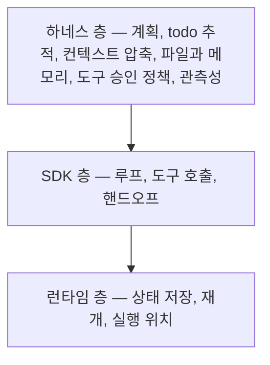

# 4장. SDK 위의 새 층 — 하네스라는 것이 왜 2026년에 생겼나

*"마구(馬具)처럼 에이전트의 행동을 묶고, 방향을 잡고, 안전하게 제어하는 구조."*

AWS Korea 기술블로그가 2026-04-22 글에서 쓴 표현이다. 며칠 앞선 2026-04-17에는 우아한형제들 기술블로그에 이런 문장이 올라왔다. *"AI가 길을 잃지 않고 안정적으로 일할 수 있도록 외부 통제 환경을 구축하는 것."*

같은 달에, 서로 다른 조직에서, 같은 것을 가리키는 정의가 두 번 나왔다는 뜻이다. 그리고 뒤쪽 글은 그 정의에 이름까지 붙여둔다. *"최근 업계에서 이를 '하네스 엔지니어링(harness engineering)'이라고 부르며 중요성을 강조하고 있는 것도 같은 맥락일 것입니다."*

두 글 다 벤더 기술블로그이므로 2차 소스로 읽어야 한다. 그래도 흥미로운 사실 하나는 남는다. 국내 두 조직이 한 주 간격으로, 서로를 인용하지 않고 같은 단어를 꺼냈다. 말을 다루는 도구에서 온 비유다. 고삐와 안장은 말을 더 빠르게 만들지 않는다. 말이 어디로 갈지를 사람이 정할 수 있게 만든다. 하네스(harness)라는 말이 2026년에 갑자기 늘어난 이유가 그 대비 안에 있다.

비유를 조금 더 밀어보면 이 말을 왜 골랐는지가 보인다. 마구를 채우는 쪽은 사람이고, 채운 뒤에도 달리는 쪽은 말이다. 말의 힘을 줄이지 않으면서 방향과 멈춤을 사람 쪽에 남겨두는 장치가 마구다. 에이전트 이야기로 옮기면 이렇게 된다. 모델의 판단력을 깎지 않으면서, 어디까지 갈 수 있고 어디서 멈추는지를 우리 코드 쪽에 남겨두는 층. 2장에서 종료 조건을 이야기하고 3장에서 부작용 경계를 이야기했으니, 그 두 이야기가 갈 자리가 이제 생긴 셈이다.

### 프레임워크를 골랐다고 결정이 끝나지 않는다

2장과 3장을 지나온 지금, 우리 손에는 해결되지 않은 목록이 하나 있다. 컨텍스트를 무엇으로 채우고 무엇을 버릴지, 긴 작업의 할 일 목록을 어디에 적어둘지, 도구 승인을 어디서 물어볼지, 무슨 일이 있었는지를 어떻게 남길지. 프레임워크를 하나 고른다고 이 목록이 채워지지 않는다.

그런데 2026년의 지형에서 눈에 띄는 변화가 있다. **이 목록을 미리 조립해서 파는 층이 생겼고, 서로 다른 네 조직이 비슷한 시기에 같은 이름을 붙였다.** 층을 두 개로 나눠 보자.

**SDK 층**은 루프·도구 호출·핸드오프만 제공한다. 대표적으로 OpenAI Agents SDK는 자기 소개에서 추상화가 *"very few abstractions"*라고 밝히고, 원시 개념을 다섯 개(Agents/Handoffs/Guardrails/Sessions/Runner)로 유지한다. 추상화를 최소화한 SDK 층이라는 성격이 그 다섯 개에 그대로 드러난다.

**하네스 층**은 그 위에서 계획·todo 추적·컨텍스트 압축·파일과 메모리 접근·도구 승인 정책·관측성(observability)을 미리 조립해서 준다. 같은 용어를 쓴 제품들을 나란히 놓아보자.

- `deepagents`는 자기를 *"The batteries-included agent harness"*로 소개한다. LangGraph 위에 계획·서브에이전트·컨텍스트 관리를 얹어주는 층이고, 버전은 `0.6.12`(릴리스 2026-06-25, 2026-07 기준)다.
- Strands는 레포 이름 자체를 `strands-agents/sdk-python`에서 `strands-agents/harness-sdk`로 바꿨다. Python 패키지는 `1.50.1`(2026-07-24 기준). SDK라는 이름을 하네스로 갈아치운 셈이니, 용어 이동이 문서가 아니라 레포 주소에서 일어났다.
- Microsoft Agent Framework의 Harness는 문서가 아예 목록을 적어뒀다. *"An opinionated agent with batteries-included capabilities for long, multi-step tasks — planning and todo tracking, context compaction, file access and memory, don't-ask-again tool approval, and observability."* 프레임워크 버전은 `1.12.1`(2026-07-23 기준)이다.
- Claude Agent SDK는 Claude Code의 에이전트 루프를 그대로 라이브러리로 노출한 것이다. 파일 도구·서브에이전트·훅·권한이 그 안에 함께 온다. Python 쪽 릴리스가 `v0.2.128`(2026-07-25 기준)까지 올라와 있다. 릴리스 번호가 세 자리라는 것 자체가 이 층의 배포 빈도를 말해준다.

왜 하필 이 시점인가? 순서를 되짚어보면 자연스럽다. 처음에는 벤더 API에 도구 호출이 붙었고, 그 위에 루프를 돌려주는 얇은 층이 생겼다. 그 단계에서는 추상화를 줄이는 것이 미덕이었다. 도구 두세 개를 부르고 답을 만드는 작업에는 루프와 핸드오프면 충분했으니까. 그런데 사람들이 에이전트에게 맡기는 작업의 길이가 늘어났다. 수십 분에서 몇 시간, 도구 호출 수십 번, 중간 산출물 여러 개. 2장에서 본 컨텍스트 예산 문제와 3장에서 본 도구 표면 문제가 이 길이에서 폭발한다. 그러니 위층은 누군가의 아이디어가 아니라 작업 길이가 만든 수요다.

목록을 읽으면서 위의 Microsoft 인용문과 대조해보자. 계획, todo 추적, 컨텍스트 압축, 파일 접근과 메모리, 다시 묻지 않는 도구 승인, 관측성. 우리가 2장과 3장에서 미해결로 남겨둔 항목들과 거의 겹친다. 서로 다른 조직이 같은 목록에 도달했다는 것은, 이 항목들이 취향이 아니라 긴 작업을 돌리면 반드시 만나는 문제라는 뜻이다.

### 세 층으로 보기

이 층 이야기를 가장 깔끔하게 보여주는 것은 LangChain 진영의 배치다. 아래에 저수준 오케스트레이션과 런타임인 `langgraph`가 있고, 그 위에 `langchain`의 `create_agent`가 진입 경로로 있고, 그 위에 `deepagents`가 하네스로 얹힌다.

그림 1. 런타임·SDK·하네스 세 층 — 위층은 아래층을 대체하지 않고 그 위에 조립된다

각 층의 성격을 이 책의 표현으로 고정해두자. 뒤 장들이 같은 말을 계속 쓴다.

LangGraph는 저수준 오케스트레이션과 런타임이다. 명시적 그래프 상태, 감사 추적, 재개, 사람 개입 승인이 요구사항일 때 고른다. 대가는 보일러플레이트다. 공식 문서 스스로 초보자에게는 `create_agent`를 권한다. 그 `create_agent`는 LangGraph 위의 진입 경로이고, 그래프를 직접 다루지 않아도 되는 기본값이다.

그리고 하네스 층은 위에서 본 목록을 미리 조립해 제공하는 층으로, **긴 다단계 작업에 쓴다.** 뒤 장들이 이 세 규정을 그대로 다시 쓰므로, 지금 이 자리를 기준점으로 삼아도 좋다.

여기서 잠깐 멈추고 생각해보자. 이 그림이 왜 결정에 영향을 주는가? 프레임워크 비교 표만 놓고 고르면 우리는 같은 층 안에서만 비교하게 된다. 그런데 실제 질문은 "어느 프레임워크냐"가 아니라 "우리 과제에 몇 개 층이 필요한가"인 경우가 많다. 층을 모르면 SDK 하나를 고른 뒤 위층에 해당하는 일을 전부 직접 만들면서, 자기가 무엇을 만들고 있는지도 모른 채 시간을 쓴다. 반대로 짧은 작업에 하네스를 얹어놓고 왜 이렇게 느리고 비싼지 의아해하기도 한다.

### 사례 — 팀 규약을 AI 환경에 구조화하기

층 이야기를 추상적으로 끝내지 않으려면 실측 기록이 하나 필요하다. 우아한형제들 사례를 보자. 앞서 인용한 2026-04-17 기술블로그 글로, 저자가 확인된 2차 소스다. 사내 API를 다루는 에이전트 작업 환경을 정비한 기록이다.

이 글의 핵심 주장은 개인의 프롬프트 역량이 아니다. **팀 규약을 AI 환경에 구조화하는 것**이 성능을 가른다는 쪽이다. 규약을 문서로만 두면 사람은 눈치로 지키지만 에이전트는 매번 처음부터 읽는다. 그래서 규약을 도구·파일·경계의 모양으로 환경에 박아 넣는다.

결과가 컨텍스트 크기로 남아 있다.

| 규모 | 전처리 전 | 전처리 후 |
|------|---------|---------|
| 대규모 | 41,944 bytes | 1,763 bytes |
| 중규모 | 29,386 bytes | 668 bytes |
| 소규모 | 9,749 bytes | 539 bytes |

그리고 API 도메인 하나를 처리할 때의 도구 호출이 4회에서 1회로 줄었다. 3장 끝에서 도구 네 개를 하나로 합치는 편이 나은 경우가 많다고 했는데, 그 작업의 실측치가 이 한 줄이다.

표가 알려주는 것은 어느 제품이 좋다는 이야기가 아니다. 모델과 도구 사이에 전처리 계층이 하나 들어갔고, 그 계층이 응답에서 이번 작업에 필요한 부분만 남겼다는 것이다. 4만 바이트가 컨텍스트로 들어오면 그 안의 대부분은 이번 판단에 쓰이지 않는 필드다. 쓰이지 않는데도 값은 매 회차 지불된다. 백엔드에서 우리가 응답 DTO를 화면별로 나누는 이유와 정확히 같은 종류의 최적화다. 다른 점은 소비자가 브라우저가 아니라 모델이고, **낭비의 청구서가 대역폭이 아니라 토큰으로 온다는 것**뿐이다.

이 표를 규모별 세 행으로 그대로 옮긴 데는 이유가 있다. 이 수치를 하나의 평균 절감률로 뭉쳐 인용한 자료가 돌아다니는데, 원문에 그런 단일 숫자는 없다. 규모에 따라 감소 폭이 다르다는 것 자체가 정보다. 큰 응답일수록 잘라낼 것이 많고, 작은 응답에서는 절감이 상대적으로 덜하다. 그래서 우리 시스템에서 얼마나 줄 수 있는지는 우리 응답의 크기 분포를 봐야 안다.

### 언제 하네스이고 언제 SDK인가

이제 판단 기준이다. **긴 다단계 작업이라면 하네스부터 보는 편이 낫다.** 코딩 에이전트나 리서치 에이전트처럼 수십 번의 도구 호출과 중간 산출물이 쌓이는 작업에서는, 계획·압축·승인·기록을 결국 만들게 된다. 남이 조립해둔 것을 쓰는 편이 싸다.

반대로 **도구 호출 1~3회짜리 짧은 작업에는 SDK만으로 충분하고, 하네스는 오히려 비용과 지연을 늘린다.** 계획 단계를 위해 모델을 한 번 더 부르고, 압축을 위해 또 부르고, 남기기 위해 또 쓴다. 세 번 부르면 끝날 일에 그 오버헤드를 얹는 것은 아깝다.

그러니 도구를 고르기 전에 자기 과제의 길이를 재보자. 한 번의 사용자 요청이 도구 호출 몇 번으로 끝나는가? 중간 산출물을 다음 단계가 다시 읽어야 하는가? 사람이 중간에 승인해야 하는 지점이 있는가? 이 셋에 답하면 몇 개 층이 필요한지가 대체로 드러난다.

미리 조립된 것을 산다는 데에는 늘 같은 대가가 따른다는 점도 챙겨두자. 조립 방식이 우리 요구와 어긋날 때 뜯어내기가 번거롭다. 컨텍스트를 어느 시점에 어떻게 압축하는지, 승인 프롬프트를 언제 띄우는지가 우리 도메인의 규칙과 맞지 않으면, 그 층을 우회하는 코드를 쓰게 된다. 그래서 하네스를 볼 때는 기능 목록만 읽지 말고 그 층이 정한 기본 정책을 함께 읽는 편이 낫다. 이 감각은 5장에서 프레임워크를 고를 때 쓰는 감각과 같은 것이다.

3장의 문제와 이어 붙이면 하네스가 파는 것의 정체가 더 분명해진다. 도구 정의가 매 요청마다 실리고 도구 출력이 컨텍스트로 곧장 들어온다는 문제 앞에서, 하네스가 내놓는 상품의 상당 부분은 결국 **컨텍스트 압축과 승인 정책**이다. 다시 말해 하네스는 새로운 능력을 파는 층이 아니라, 2장과 3장에서 우리를 난감하게 만든 항목들을 미리 처리해둔 층이다.

층이 보이면 지형도가 다르게 읽힌다. 스무 개가 넘는 프레임워크 이름을 한 줄로 늘어놓으면 무엇을 골라야 할지 막막하지만, 각 이름이 어느 층에서 무엇을 대신해주는지를 물으면 목록이 줄어든다. 그러면 이제 그 지형도를 펼쳐볼 차례다.
