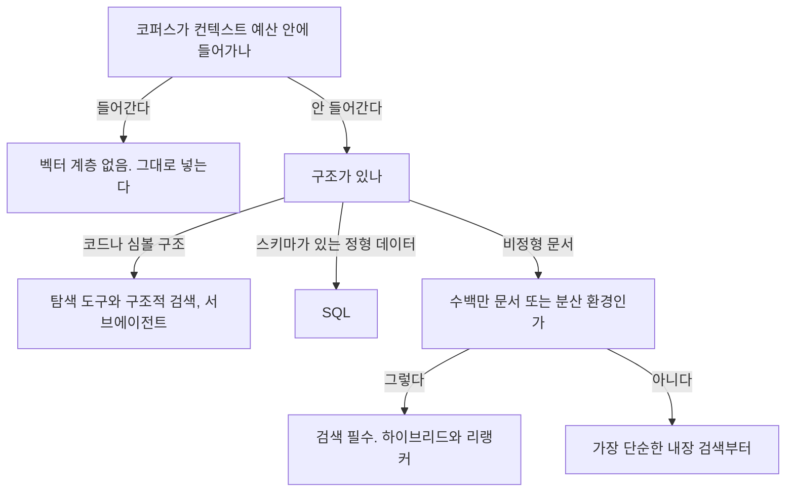

# 6장. 벡터 DB를 사기 전에 — 필요 없는 경우부터 세어보자

검색을 붙이는 일은 보통 "무엇을 고를까"의 문제로 시작한다. 후보를 늘어놓고, 벤치마크를 비교하고, 매니지드냐 자체 운영이냐를 따진다. 그런데 먼저 세어봐야 하는 건 후보의 개수가 아니라 고를 이유의 개수다.

이 순서를 뒤집어야 하는 이유는 단순하다. 벡터 DB는 붙이는 순간 운영 대상이 하나 늘어난다. 임베딩 파이프라인, 재색인 배치, 원본과 인덱스의 동기화, 그리고 검색 품질이라는 새로운 종류의 장애가 따라온다.

이 목록이 추상적으로 들릴 수 있으니 구체적으로 하나만 보자. 임베딩 모델을 바꾸는 순간 무슨 일이 생길까? 모델이 다르면 벡터 공간이 다르므로, 기존 인덱스를 전부 버리고 코퍼스 전체를 다시 임베딩해야 한다. 문서 10만 건이면 그게 그날 하루 작업이 되고, 그 사이 검색 결과는 낡은 인덱스에서 나온다. 그런데 임베딩 모델은 1년에 한 번은 갈아탈 만한 이유가 생기는 영역이다. 게다가 검색 품질이 떨어졌다는 사실은 예외가 아니라 점수로만 드러나므로, 회귀를 잡을 평가 세트가 없으면 아무도 모르는 채로 몇 달이 지나간다. 뒤늦게 발견하면 꽤 난감하다. 벡터 계층은 이런 종류의 지속 비용을 데리고 들어온다.

그런데 이 비용을 치르지 않아도 되는 경우가 생각보다 많다. 더 재미있는 건, 그 근거를 대부분 벤더와 모델 제공자 자신이 써놨다는 점이다. 자기 제품을 팔지 않는 방향으로 쓴 문장들이라 무게가 다르다.

세어보자. 다섯 개다.

### 근거 1 — 다 들어가면 그냥 넣자

가장 먼저 확인할 것은 코퍼스 크기다.

> *"If your knowledge base is smaller than 200,000 tokens (about 500 pages of material), you can just include the entire knowledge base in the prompt that you give the model, with no need for RAG or similar methods."*
> — Anthropic, *Introducing Contextual Retrieval*, 2024-09-19

**20만 토큰, 약 500페이지.** 모델 제공자가 자기 발표문에 "RAG(검색 증강 생성)나 비슷한 방법이 필요 없다"고 직접 쓴 임계값이다.

여기서 시점을 꼭 붙여 읽자. 이건 2024년 Anthropic 기준이고, 그 뒤로 컨텍스트 윈도는 더 커졌다. 그러니 이 숫자를 오늘의 정확한 경계선으로 쓰면 안 된다. 대신 보수적 하한으로 쓰는 편이 낫다. "20만 토큰이면 확실히 안 붙여도 된다. 우리 코퍼스는 그보다 크니 다시 계산해보자"는 식이다.

우리 사내 문서가 몇 토큰인지 세본 적이 있는가? 위키 전체를 덤프해 토큰 수를 재보면 의외로 작은 경우가 있다. 확인하는 데 30분이면 되고, 이 30분이 벡터 DB 운영 몇 달을 절약해줄 수도 있다.

### 근거 2 — 코드에는 인덱스보다 탐색 도구가 맞았다

두 번째 근거는 코딩 에이전트 쪽에서 나온다. 코드베이스만큼 검색이 절실해 보이는 대상도 없다. 파일이 수만 개고 심볼이 수십만 개다. 그런데 공식 문서가 전제하는 코드베이스 탐색 방식은 임베딩 인덱스가 아니라 에이전트가 직접 도구를 써서 훑는 방식이다.

컨텍스트가 모자란 문제는 인덱스로 풀지 않는다. 서브에이전트로 푼다.

> *"Subagents run in separate context windows and report back summaries"*
> *"CLI tools are the most context-efficient way to interact with external services"*
> — Anthropic, *Claude Code Best practices*

정직하게 선을 그어두자. 이 문서에 "우리는 RAG를 쓰지 않는다"는 **명시적 부정 문장은 없다.** 확인 가능한 서술의 상한선은 여기까지다 — **공식 문서가 권장하는 워크플로가 인덱스가 아니라 탐색 도구와 서브에이전트 기반이다.** 그 이상을 주장하면 없는 문장을 만들어내는 셈이 된다.

현장의 관찰도 같은 방향을 가리킨다. 한 개발자는 코드 검색에 대해 순수 임베딩 기반 검색이 비자명한 상속 계층이나 다형성이 있는 코드베이스에서 실패하는 경향이 있다고 말한다. 생각해보면 당연하다. `PaymentService`를 상속한 클래스가 어디 있는지는 의미적 유사도의 문제가 아니라 구문 구조의 문제다. 그런 질문에는 구조적 검색이 임베딩보다 잘 맞는다.

물론 구조적 검색이 항상 이긴다는 뜻은 아니다. "환불 정책을 담당하는 코드가 어디냐"처럼 개념으로 묻는 질문에는 심볼 이름을 몰라도 찾아주는 의미 검색이 유용할 수 있다. 그래서 코드 도메인의 현실적인 답은 둘 중 하나를 고르는 것이 아니라, 탐색 도구를 기본으로 두고 의미 검색을 보조로 얹는 순서에 가깝다. 다만 순서가 중요하다. 인덱스를 먼저 만들고 시작하면, 그 인덱스가 정말 필요했는지 끝까지 알 수 없게 된다.

### 근거 3 — 검색이 안 맞을 때 DB를 바꾸는 건 오진이다

이미 검색을 붙였고 결과가 시원치 않은 팀이 가장 자주 내리는 판단이 "엔진을 바꿔보자"다. 그런데 이 판단을 정면으로 반박하는 실험이 있다.

Anthropic의 2024-09-19 실험에서 top-20 검색 실패율은 5.7%에서 1.9%로 떨어졌다. 벡터 DB를 바꾼 결과가 아니었다. 청킹에 컨텍스트를 보강하고, BM25 키워드 검색을 함께 돌리고, 리랭커를 얹은 결과였다. 2024년의 이 실험에서 나온 수치이니 그대로 재현된다고 기대하지는 말자. 다만 이득이 어디서 났는지는 기억해두자. 엔진이 아니었다.

그리고 벡터 검색의 역할 자체를 다시 정의해야 한다. 매니지드 검색 서비스인 Turbopuffer의 공식 문서는 자기 제품의 역할을 이렇게 규정한다.

> *"first-stage retrieval to efficiently narrow millions of documents ... down to tens or hundreds"*

**벡터 검색은 정답 선택기가 아니라 1차 후보 축소기다.** 수백만 개를 수십~수백 개로 줄이는 것이 그의 일이고, 그중 무엇이 정답인지 고르는 건 리랭커와 LLM의 일이다. 이 프레이밍이 왜 값진가? "벡터 검색 정확도"를 올리는 데 몇 주를 쏟는 과투자를 막아준다. 축소기가 놓치지 않고 100개를 건져오면 충분하다. 그 100개를 정렬하는 일은 뒤 단계가 한다.

### 근거 4와 5 — 구조가 있으면 SQL이고, 메모리는 검색이 아니다

네 번째는 굳이 인용이 필요 없는 이야기다. 정형 데이터에는 이미 답이 있다. 주문 상태, 재고 수량, 결제 내역처럼 스키마가 있는 데이터를 임베딩해서 유사도로 찾겠다는 설계는 SQL 한 줄로 정확히 답이 나오는 질문을 확률적으로 만드는 일이다. 이건 이 책의 주장이고, 인용할 1차 소스는 붙이지 않는다. 그럴 필요가 없을 만큼 자명하다고 보기 때문이다.

다섯 번째는 이 책의 구조 때문에 특히 못 박아야 하는 경계다. 이 책은 벡터 DB에 두 장을 쓴다. 그래서 자연스럽게 오해가 생길 수 있다 — 에이전트의 기억이 곧 벡터 DB라는 오해다.

그렇지 않다. **메모리는 검색이 아니다.** 에이전트의 기억은 하나의 물건이 아니라 계층이다. 지금 컨텍스트 윈도에 올라와 있는 것, 세션 안에서 유지되는 상태, 파일이나 DB에 적어둔 장기 기록, 그리고 필요할 때 가져오는 외부 지식이 각각 다른 층이다. 벡터 검색은 그중 마지막 층 하나를 구현하는 방법 중 하나일 뿐이다. 메모리 계층을 어떻게 설계하는지는 앞서 루프의 컨텍스트 예산을 다룰 때 이미 본 이야기이므로 여기서 다시 펼치지 않는다. 여기서 세울 선은 하나다. "기억을 붙이자"는 요구를 "벡터 DB를 붙이자"로 번역하지 말자.

### 그렇다면 롱 컨텍스트가 다 해결해주는가

여기서 반대편 극단이 등장한다. 컨텍스트 윈도가 계속 커지고 있으니 검색은 곧 필요 없어진다는 주장이다.

학술 쪽만 봐도 진영이 넷이고, 서로 다른 이야기를 한다.

| 진영 | 근거 |
|------|------|
| 롱 컨텍스트가 검색을 대체한다 | LOFT(arXiv:2406.13121) — 롱 컨텍스트 모델이 명시적 학습 없이도 SOTA 검색·RAG 시스템에 맞먹는 능력을 보였다 |
| 검색이 이긴다 | Retrieval meets Long Context(arXiv:2310.03025) — 4K 컨텍스트에 단순 검색을 붙인 쪽이 16K 파인튜닝 모델과 비슷한 성능을 훨씬 적은 계산으로 냈다. 당시 컨텍스트 규모 기준 |
| 많이 넣으면 오히려 떨어진다 | OP-RAG(arXiv:2409.01666) — 검색 청크 수를 늘리면 품질이 올랐다가 떨어지는 역U자 곡선. 스위트 스팟이 존재한다 |
| 롱 컨텍스트 자체가 위치에 취약하다 | Lost in the Middle(arXiv:2307.03172) — 관련 정보가 중간에 있으면 성능이 유의하게 떨어진다. 명시적 롱 컨텍스트 모델도 마찬가지였다 |

표에 없는 실무 조건 하나를 더 얹자. 출처 표기가 요구사항인지를 따져봐야 한다. 사내 문서 Q&A에서 "이 답변의 근거 문서를 링크로 보여달라"가 요구사항이면, 컨텍스트에 전부 밀어넣는 방식으로는 이걸 깔끔하게 만들기 어렵다. 모델이 어느 문단을 근거로 삼았는지 사후에 특정하는 일이 되기 때문이다. 검색을 거치면 반대다 — 어떤 청크를 가져왔는지가 시스템 안에 기록으로 남으므로 출처가 공짜로 따라온다. 반대로 출처 표기가 요구사항이 아니라면, 검색을 붙일 이유가 한 겹 더 줄어드는 셈이다.

현장 쪽 관점도 갈린다. 코드 도메인에서는 구조적 검색이 임베딩을 이긴다는 관찰이 있는 반면, "RAG는 끝났다"는 주장에 대한 한 반박은 규모를 지적한다 — grep은 로컬 파일시스템의 수천 개 파일에서 훌륭하지만, 대부분의 엔터프라이즈 용례는 분산 시스템에 걸친 수백만 개 문서이고, 200만 토큰 컨텍스트 윈도가 있어도 지식 베이스 전체를 넣을 수는 없다는 것이다.

넷 다 맞고 셋 다 다른 이야기를 하는 상황을 어떻게 정리할까? 이 논쟁을 "누가 이기나"로 읽으면 답이 안 나온다. **"무엇을 최적화하나"로 읽으면 정리된다.** 정확도만 보면 접전이다. 여기에 비용과 지연을 넣으면 검색 쪽으로 기운다. 반대로 코퍼스가 작고 지연에 여유가 있으면 다 넣는 쪽이 단순하고, 대신 Lost in the Middle이라는 세금을 낸다. 이항 질문 자체가 낡았다.

### 세 질문으로 줄이자

그래서 결정은 세 질문으로 좁힌다.

그림 1. 검색을 붙일지 결정하는 흐름

첫째, **컨텍스트 예산 안에 들어가나?** 들어가면 벡터 계층은 없다. 여기서 "컨텍스트 윈도에 들어가나"가 아니라 "컨텍스트 예산에 들어가나"로 묻는 게 중요하다. 루프는 회차마다 컨텍스트를 다시 실어 보내므로, 윈도에 물리적으로 들어가는 것과 매 회차 그 값을 지불할 수 있는 것은 다른 이야기다.

둘째, **구조가 있나?** 코드·심볼처럼 구문 구조가 있으면 구조적 검색과 탐색 도구가 낫고, 스키마가 있으면 SQL이다.

셋째, **수백만 문서이거나 분산 환경인가?** 그렇다면 검색은 선택이 아니다.

세 질문 중 어느 것도 "엔진을 무엇으로 할까"가 아니라는 점을 눈여겨보자. 도구를 고르는 일은 이 셋을 통과한 뒤에야 시작된다. 순서를 지키면 좋은 점이 하나 더 있다 — 나중에 "왜 벡터 DB를 붙였느냐"는 질문을 받았을 때, 세 질문 중 어느 것이 걸려서 붙였다고 한 문장으로 답할 수 있다. 도입 근거를 문장으로 적을 수 없는 인프라는 대개 나중에 아무도 책임지지 않는다.

셋 다 "아니다"로 나오는 프로젝트가 실제로 꽤 있다. 그런 경우에 벡터 DB를 도입하면, 운영 대상 하나와 장애 유형 하나를 얻는 대신 얻는 것이 거의 없다.

그래도 붙이기로 했다면 — 그때부터는 전혀 다른 종류의 질문이 시작된다. 어떤 엔진이냐가 아니라, **우리 임베딩의 차원이 몇이냐**부터다.
