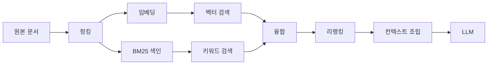

# 7장. 검색을 붙인다면 — 차원 한계, 하이브리드, 청킹, 리랭킹

pgvector의 HNSW·IVFFlat 인덱스는 `vector` 타입 **2,000차원**까지다. 그런데 OpenAI `text-embedding-3-large`의 기본 차원은 **3,072**다.

이 조합은 그냥 안 된다.

벡터 DB 선택이 "규모가 커지면 전용 엔진으로 간다" 같은 막연한 이야기로 시작할 거라 예상했다면 조금 허탈할 수도 있다. 첫 갈림길은 규모가 아니라 이 아주 구체적인 숫자다. 그리고 이 숫자를 모른 채 임베딩 모델을 먼저 고르고 나면, 인덱스를 만드는 순간에야 알게 된다. 그때는 이미 파이프라인이 다 붙어 있다. 꽤 난감한 순서다.

### 첫 갈림길은 규모가 아니라 차원이다

숫자를 먼저 정리해두자. 모두 2026년 7월 기준으로 확인된 값이다.

| 항목 | 값 |
|------|-----|
| pgvector `vector` 인덱스 최대 차원 | 2,000 (`halfvec`은 4,000) |
| `text-embedding-3-large` 기본 차원 | 3,072 (`dimensions`로 축소 가능) |
| `text-embedding-3-small` 기본 차원 | 1,536 |
| MongoDB Atlas Vector Search 최대 차원 | 8,192 |

그렇다면 선택지는 몇 개일까? 셋이다.

첫째, 차원을 줄인다. OpenAI 임베딩은 `dimensions` 파라미터로 출력 차원을 낮출 수 있다. 1,536으로 내리면 pgvector 인덱스에 그대로 들어간다. Cohere `embed-v4.0`도 256·512·1024·1536 중에서 고르는 구조이고, Google `gemini-embedding-2`는 128부터 3,072까지 유연하게 잡을 수 있다. 최근 세대 임베딩 모델은 — 방금 본 세 모델처럼 — 차원이 고정 상수가 아니라 설정값이다.

둘째, `halfvec`을 쓴다. 반정밀도 타입으로 4,000차원까지 인덱스를 만들 수 있으니 3,072가 들어간다. 대신 정밀도를 한 단계 낮추는 선택이라는 점은 알고 쓰자.

셋째, 전용 엔진이나 다른 매니지드로 간다. Atlas처럼 8,192까지 받는 곳이면 이 제약이 아예 없다.

여기서 pgvector와 전용 엔진 논쟁을 잠깐 정리하고 가자. 이 논쟁은 결론이 나 있지 않고, 나 있는 척하면 안 된다. pgvector 쪽 논거는 강하다 — 새로 운영할 인프라가 0이고, 본문·메타데이터와 벡터가 같은 트랜잭션에 들어간다. 원본과 인덱스를 동기화하는 파이프라인을 따로 만들 필요가 없다는 뜻이고, 이건 운영 사고를 한 종류 통째로 없애준다. 전용 엔진 쪽 논거도 강하다 — 방금 본 차원 한계가 실제 벽이고, 하이브리드 검색 표현력과 다중 벡터 필드에서 앞선다.

갈리는 지점은 셋이다: 임베딩 차원, 하이브리드 요구 수준, 그리고 운영 인력. 규모는 그다음이다.

### 무엇을 운영할 수 있나 — 인프라, 운영 부담, 그리고 라이선스

두 번째 축은 "얼마나 강한 검색이 필요한가"보다 "무엇을 운영할 수 있는가"다. 운영 부담을 스펙트럼으로 늘어놓으면 자기 팀의 위치가 보인다.

서버가 아예 없는 쪽부터 시작하자. `sqlite-vec`은 SQLite 확장이라 프로세스 밖에 아무것도 띄우지 않는다. Chroma와 LanceDB는 임베디드로 시작할 수 있다. pgvector는 이미 있는 Postgres에 확장 하나를 얹는다. Qdrant·Weaviate·Milvus는 전용 서비스를 하나 더 운영하는 결정이고, Vespa는 그중 가장 무거운 대신 검색·랭킹·ML 추론을 한 엔진에서 처리한다. Pinecone·Turbopuffer·MongoDB Atlas는 운영을 돈으로 치환하는 쪽이다.

버전도 함께 확인해두면 좋다(2026-07 기준). Qdrant `v1.18.3`, Weaviate `v1.38.6`, Milvus `v2.6.21`, Elasticsearch `v9.4.4`, OpenSearch `3.7.0`, pgvector `0.8.5`. 여기서 `sqlite-vec`은 `v0.1.9`(2026-03-31)로 몇 달 정체된 데다 아직 `0.1.x` 대라는 점을 알고 고르는 편이 낫다. LanceDB는 Python SDK가 `0.34.0`인데 저장소의 최신 태그는 베타 채널이라 버전 라인이 하나로 읽히지 않는다. 에이전트 생태계에서는 이런 버전 라인 불일치가 예외가 아니라 기본값에 가깝다.

그리고 라이선스다. 이 축은 성능 열과 같은 급으로 다루는 것이 바람직하다. 사내 배포 정책에서 실제로 걸리는 항목이기 때문이다.

- `Apache-2.0`: Qdrant, Milvus, Chroma, LanceDB, Vespa, OpenSearch, sqlite-vec
- `BSD-3-Clause`: Weaviate / `MIT`: FAISS
- `GPL-3.0`: Typesense — 배포 형태에 따라 사내 정책과 충돌할 수 있다
- SPDX 판정이 `NOASSERTION`으로 남는 것들: Elasticsearch(Elastic License 계열), Redis의 RediSearch, Meilisearch, 그리고 pgvector까지

마지막 줄을 한 번 더 보자. pgvector도 GitHub API의 라이선스 판정이 `NOASSERTION`이다. 여기서 조심할 것이 하나 있다. `NOASSERTION`은 "상용 독점 라이선스다"라는 뜻이 아니라 **"자동 판정이 안 됐다"**는 뜻이다. 그래서 이 책은 이 항목들을 "오픈소스"라고 단정하지 않는다. 실제 라이선스 문구를 확인하지 않았기 때문이다. 사내 검토서에 넣을 때는 저장소의 LICENSE 파일을 직접 열어보는 절차를 한 줄 넣어두자. 이건 이 책이 확인하지 못한 부분이고, 감추기보다 밝혀두는 쪽을 택했다.

### 하이브리드는 지원 여부가 아니라 손잡이 수로 갈린다

하이브리드 검색을 비교할 때 흔히 "지원한다/안 한다"로 표를 만든다. 그런데 2026년 7월 기준 주요 엔진은 대부분 지원한다. 실제로 갈리는 것은 융합 알고리즘과 조절 손잡이의 개수다.

| 엔진 | 융합 방식 | 조절 손잡이 |
|------|----------|-----------|
| Weaviate | Relative Score Fusion(v1.24+ 기본), Ranked Fusion | `alpha` 하나 — 1이면 순수 벡터, 0이면 순수 키워드. 키워드는 BM25F |
| Qdrant | RRF, DBSF | `prefetch` + 융합 + Formula Queries. 표현력이 가장 넓다 |
| Milvus | RRF Ranker, Weighted Ranker | 내장 BM25로 sparse 임베딩을 자동 생성 — 키워드 파이프라인을 따로 짜지 않아도 된다 |
| Elasticsearch | RRF | retriever 문법 |

이 표가 알려주는 건 취향의 차이가 아니다. 손잡이가 하나면 튜닝이 쉽고 표현력이 낮다. 손잡이가 많으면 표현력이 높고 튜닝이 프로젝트가 된다. Weaviate의 `alpha` 하나는 "제품명 검색 비중을 조금 올려보자"를 5분에 끝낼 수 있게 해준다. Qdrant의 다단계 쿼리는 1차로 키워드 후보를 넓게 뽑고 2차로 벡터로 좁히는 식의 설계를 가능하게 하지만, 그 설계를 누가 유지보수할지 정해야 한다. Milvus의 내장 BM25는 "BM25를 붙이고 싶은데 색인 파이프라인 만들 사람이 없다"는 팀에게 실질적인 차이를 만든다.

기본값에 대해서는 조심하자. Weaviate `alpha`의 기본값과 Elasticsearch `rank_constant`·`rank_window_size`의 기본값은 이번에 확인하지 못했다. 이 값들은 검색 결과를 실제로 바꾸므로, 공식 문서에서 직접 확인하고 우리 설정 파일에 명시적으로 박아두는 편이 낫다. 기본값에 의존하는 검색 품질은 버전이 올라갈 때 조용히 바뀐다.

### 품질은 엔진이 아니라 파이프라인에서 온다

검색이 잘 안 맞을 때 가장 먼저 떠오르는 생각은 "DB를 바꿔야 하나"다. 그런데 이 판단을 뒤집는 근거가 꽤 강하게 수렴한다.

Anthropic이 2024-09-19에 공개한 실험에서 top-20 검색 실패율은 **5.7%에서 1.9%로** 떨어졌다. 경로가 중요하다. 벡터 DB를 바꾼 게 아니었다. **컨텍스트를 보강한 청킹 → BM25 병용 → 리랭킹**을 차례로 얹은 결과였고, 단계별 실패율 감소는 컨텍스트 임베딩 단독 35%, BM25를 더해 49%, 리랭킹까지 더해 67%였다. 2024년의 이 실험에서 나온 수치이므로 모델이 바뀐 지금 그대로 재현된다는 보장은 없다. 하지만 이득이 발생한 위치는 시간에 훨씬 강건하다.

그림 1. 검색 파이프라인 — 품질 이득은 엔진 교체가 아니라 청킹·키워드 병용·리랭킹 세 지점에서 발생한다

리랭킹은 특히 값이 싸다. Voyage의 `rerank-2.5-lite`는 1M 토큰당 $0.02이고 `rerank-2.5`는 $0.05다. 같은 회사의 임베딩 `voyage-4-large`가 $0.12인 것과 비교하면, 리랭커를 하나 얹는 비용은 임베딩 비용보다 작다. 값싼 층을 안 붙이고 비싼 층을 갈아치우는 것이 순서상 이상하다는 뜻이다.

여기서 임베딩 단가에 대해 한 가지 짚어야 한다. **OpenAI 공식 표면 두 곳이 서로 다른 값을 말한다.** 모델 카드는 `text-embedding-3-large`를 1M 토큰당 $0.13으로 적는다(직접 확인, 2026-07 기준). 반면 가격 페이지가 $0.065로 표기한다는 보고가 있고, 이 불일치는 개발자 포럼에 버그로 올라와 있다(2025-08 시점 보고, 이 책이 직접 검증하지 못했다). 참고로 `text-embedding-3-small`은 모델 카드 기준 $0.02다.

이 상황에서 할 수 있는 정직한 대응은 하나다. **어느 쪽으로도 봉합하지 않고, 총비용 예시를 만들지 않는 것.** 두 값의 차이가 2배이므로 이 단가로 월 비용을 계산해 의사결정을 하면 2배 틀린 근거로 결정하게 된다. Cohere 임베딩·리랭커의 토큰 단가는 현재 가격 페이지에 노출되지 않아 이 책이 확인하지 못했다. 단가 비교가 결정에 중요하다면 각 벤더의 현재 가격 페이지를 직접 열어 확인하자.

### 청킹 — 정량 근거가 없다는 사실이 정보다

청킹은 이 파이프라인에서 가장 먼저 손대는 곳인데, 아쉽게도 기댈 숫자가 가장 없는 곳이다.

인용할 수 있는 지침은 이 정도다. Anthropic은 청크를 "보통 몇백 토큰을 넘지 않게"라고 쓴다(2024-09 문서). Pinecone 문서는 작은 청크 128–256 토큰, 큰 청크 512–1024 토큰을 예로 든다(발행일 미확인). 전략은 여섯 가지가 정리돼 있다 — 고정 크기, 문장·문단 기준, recursive character, 문서 구조 기반, semantic, 그리고 LLM으로 컨텍스트를 덧붙이는 contextual chunking.

오버랩은 어떨까? "10~20% 정도 겹치게 하라"는 조언을 흔히 보는데, 이 책은 그 수치의 1차 소스를 찾지 못했다. 그래서 숫자를 적지 않는다. **오버랩은 권장값이 아니라 튜닝 대상이다.**

학술 쪽은 더 비어 있다. 하이브리드 검색과 청킹 전략의 정량 비교는 사실상 공백이고, 청킹에 대해 지지할 수 있는 정량 주장은 OP-RAG(arXiv:2409.01666)가 보고한 역U자 곡선 하나다. 여기서 흔한 오독을 하나 막아두자. OP-RAG의 역U자는 청크의 *수*에 관한 것이고, 청크의 *크기*에 관한 것이 아니다. 검색해서 넣는 청크 개수를 늘리면 품질이 올라가다가 어느 지점부터 떨어진다는 관찰이지, "청크를 512로 하면 최적"이라는 이야기가 전혀 아니다. 청크 크기의 학술 근거는 없다.

그러니 청킹은 이렇게 접근하자. 문서 구조를 살리는 것부터 시작하고(제목·섹션 경계를 넘지 않게), 크기와 오버랩은 우리 문서와 질의로 A/B를 돌려 정한다. 그런데 A/B를 돌리려면 판정할 기준이 있어야 한다. 청킹 튜닝은 평가 세트 없이는 감으로 하는 일이 된다 — 그 세트를 어떻게 만드는지는 곧 평가를 다룰 때 함께 본다.

### 후보를 셋 이하로 줄이는 절차

정리하자. 결정은 다음 순서로 좁힌다.

1. 임베딩 차원을 먼저 확정한다. 3,072를 유지해야 한다면 pgvector `vector` 인덱스는 후보에서 빠진다. `halfvec`이나 전용 엔진, Atlas로 간다. 1,536으로 내려도 품질이 충분하다면 후보가 다시 넓어진다.
2. 키워드 결합이 요구사항인지 판단한다. 제품명·코드·오타·약어가 질의에 자주 들어오면 하이브리드는 선택이 아니다. 손잡이 하나로 빨리 조절하고 싶으면 Weaviate, 다단계 설계가 필요하면 Qdrant, 키워드 파이프라인을 따로 만들 사람이 없으면 Milvus의 내장 BM25가 실질적인 답이다.
3. 운영 인력을 센다. 전용 엔진 하나를 24시간 책임질 사람이 없으면 pgvector 또는 매니지드다. 이건 기술 평가가 아니라 조직 평가다.
4. 라이선스로 마지막 필터를 건다. GPL 계열과 비-OSI 계열이 사내 정책에 걸리는지 확인하고, 판정이 `NOASSERTION`인 항목은 LICENSE 파일을 직접 읽는다.

**정합성과 운영 단순함이 최우선이고 차원을 1,536 이하로 맞출 수 있다면 pgvector**, **차원·하이브리드 표현력·다중 벡터 필드 중 하나라도 양보할 수 없다면 전용 엔진**이다. 그리고 어느 쪽을 골라도, 품질 개선의 순서는 엔진 교체가 아니라 청킹·병용·리랭킹이라는 점은 바뀌지 않는다.

### 이 장의 핵심

- 첫 갈림길은 규모가 아니라 인덱스 차원 한계다. pgvector `vector` 2,000 / `halfvec` 4,000 / Atlas 8,192 / `text-embedding-3-large` 3,072 (2026-07 기준)
- 하이브리드는 지원 여부가 아니라 융합 방식과 조절 손잡이 수로 갈린다
- 검색 품질은 엔진 교체가 아니라 청킹·키워드 병용·리랭킹에서 온다. 리랭커는 임베딩보다 값싼 층이다
- 청킹 크기·오버랩에는 인용할 정량 근거가 없다. 튜닝 대상으로 다루고, 평가 세트로 판정한다
- 라이선스는 성능과 같은 급의 선택 축이다. `NOASSERTION`은 "오픈소스"가 아니라 "판정 안 됨"이다

자, 여기서 한 가지를 직접 해보자. 지금 쓰거나 쓰려는 임베딩 모델의 **출력 차원을 확인해보자.** 문서에서 숫자 하나를 찾는 데 1분이면 된다. 그리고 그 숫자만으로 후보 목록에서 빠지는 엔진이 몇 개인지 세어보자. 아직 아무 코드도 쓰지 않았는데 선택지가 절반으로 줄어드는 경험은, 이 장에서 가장 값싼 이득이다.
