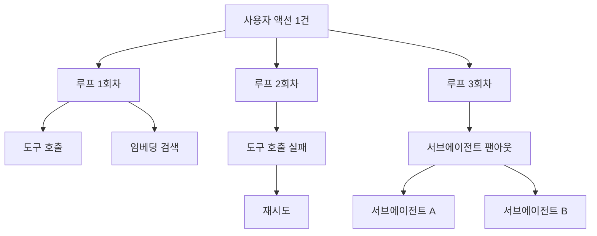

# 9장. 실패는 조용하다 — 관측성과 비용

프로덕션에서 돌아간 멀티에이전트 세션 하나를 끝까지 계산해본 기록이 있다. 세션 하나에 **$4.13**. 그리고 그중 토큰 비용 비중이 **약 98%**였다.

이 사례를 앞으로 「AWS Deep Insight 사례」로 부르자. AWS Korea 기술블로그가 2026년 4월에 공개한 프로덕션 멀티에이전트 시스템이다. 벤더 블로그이므로 2차 소스로 취급해야 한다. 다만 실측치를 숫자로 공개하고 코드까지 열어둔 사례는 드물어서, 이 등급에서는 상위에 속하는 자료다.

놀라운 건 액수가 아니다. 자기 시스템에 대해 이만큼을 말할 수 있는 팀이 거의 없다는 사실이다. 우리 에이전트가 사용자 요청 하나를 처리하는 데 얼마를 쓰는지, 지난주에 몇 번 조용히 틀렸는지 지금 대답할 수 있을까? 관측성을 붙인다는 건 대시보드를 하나 더 만드는 일이 아니다. 저 두 질문에 숫자로 답할 수 있는 상태를 만드는 일이다.

### 조용한 실패라는 새로운 장애 유형

백엔드를 운영해본 사람에게 장애는 대체로 소리가 난다. 5xx가 튀고, 큐가 적체되고, p99가 올라간다. 그래서 우리는 신호를 기다리는 방식으로 시스템을 감시하는 습관을 갖고 있다.

에이전트는 그 습관을 배신한다. 한 개발자는 이렇게 정리한다. *"대부분의 에이전트 실패는 조용하다. 대부분의 실패는 테스트 중에 아무 문제도 보이지 않았던 컴포넌트에서 발생한다."* 왜 조용할까? 잘못된 답은 예외가 아니기 때문이다. 도구 호출은 200을 받고, 모델은 문법에 맞는 문장을 만들고, 파이프라인은 끝까지 완주하고, 응답은 스키마를 통과한다. 상태 코드로 표현할 자리가 어디에도 없다.

그래서 이 유형의 실패는 사람이 발견한다. 루프가 한참 돌다가 "해결했습니다"라고 말하고, 사용자가 "에러 메시지가 똑같다"고 되짚어줘야 비로소 알려진다. 장애 감지 경로에 사람이 들어가 있다는 뜻이다. 서비스 규모가 커질수록 이 구조는 뒷맛이 찜찜해진다. 사용자가 신고하지 않은 조용한 실패는 몇 건이었을까? 지금 구조로는 셀 방법이 없다.

앞 장들에서 본 루프의 실패들이 로그에서 어떤 모양으로 남는지 떠올려보면 사정이 더 분명해진다. 증거 없이 성공을 선언한 실행은 로그상 정상 종료다. 질의를 조금씩 바꿔가며 도는 루프는 서로 다른 호출 여러 건으로 남으니 중복으로도 잡히지 않는다. 결정적 실패를 일시적 실패로 오해한 재시도는 재시도 카운터를 따로 남기지 않는 한 그냥 호출 수 증가로만 보인다. 어느 쪽도 에러율 그래프를 건드리지 않는다. 그래서 기존 계측을 그대로 쓰면 이 실패들은 통계에서 성공으로 집계된다.

한 가지만 더 짚어두자. 조용한 실패는 정확도 문제로만 청구되지 않는다. 같은 일을 두 번 하는 루프는 토큰 청구서인 동시에 **부작용이 두 번 일어난다**는 뜻이다. 그래서 관측성과 비용은 한 몸이다. 둘은 같은 데이터에서 나온다.

### 단위 원가는 호출당이 아니라 사용자 액션당이다

관측 도구를 붙였는데도 조용한 실패가 안 보이는 팀이 많다. 도구가 부실해서가 아니라 집계 단위가 어긋나 있어서 그렇다. 트레이스를 이루는 스팬(span)을 어떤 단위로 묶느냐의 문제다. 한 개발자가 이 어긋남을 가장 정확하게 짚었다.

> *"비용은 '이 호출이 토큰을 몇 개 썼나'가 아니라 '이 사용자 액션 하나가 모든 에이전트 루프·재시도·도구 호출·임베딩을 합쳐 토큰을 몇 개 썼나'다. 대부분의 관측 도구는 LLM 호출을 하나의 평평한 스팬으로 보여준다."*

자기 관측 도구를 파는 맥락에서 나온 말이니 처방보다 진단만 가져오자. 진단은 정확하다. 스팬이 평평하게 나열되면 호출 100건의 목록은 보이지만, 그 100건이 사용자 액션 몇 건이었는지는 사라진다. 액션당 원가를 모르면 요금제도, 한도도, 최적화 대상도 정할 수 없다.

그림 1. 사용자 액션 한 건이 만드는 스팬 트리 — 평평한 목록으로 보면 이 구조가 사라진다

트리로 보면 질문이 달라진다. 이 액션은 왜 3회차까지 돌았나, 재시도는 왜 났나, 팬아웃은 누가 결정했나. 평평한 목록에서는 셋 다 물을 수 없다.

집계 단위를 맞추면 최적화 우선순위도 뒤집힌다. AWS Deep Insight 사례의 한 세션은 22.5분 동안 830건을 처리하면서 코드 실행 환경을 79번 띄웠다. 그 세션에서 순수 코드 실행 시간은 19.8초였고, LLM 추론 시간은 그 **61배**였다. 22.5분을 쓰는 동안 컴퓨팅이 20초를 썼다는 얘기다. 여기서 컨테이너 사양을 조이거나 병렬도를 손보는 건 오진이다. 비용의 98%가 토큰이라면 **컴퓨팅 최적화는 두 번째 문제**다. 첫 번째 문제는 회차 수와 컨텍스트 크기다.

그 둘을 한 지표로 묶어 보면 앞에서 여러 번 나온 명제가 청구서 위에서 다시 확인된다. 루프 한 바퀴마다 컨텍스트 전체가 다시 모델에 들어가므로, 회차가 늘면 입력 토큰은 회차 수보다 가파르게 늘어난다. 그러니 트레이스에 총 토큰만 남기지 말고 회차별 입력 토큰을 따로 남겨보자. 그래프가 계단이 아니라 곡선으로 휘면 컨텍스트가 회차마다 부풀고 있다는 신호다. 압축이나 요약을 어디에 넣을지도 그 곡선이 알려준다. 컨텍스트 예산이 지배 변수라는 말은 설계 원칙이기 전에 관측 지표다.

### 경고보다 하드 컷오프

비용 이야기에서 현장의 관심이 옮겨간 지점이 있다. 알림에서 자동 차단으로다. 한 개발자의 말이 이유를 그대로 설명한다. *"알림도 유용하지만 자동 한계선이 더 중요하다 — 소규모 사업자라서 새벽 2시의 루프가 날 파산시키지 않도록."*

경고로 안 되는 이유는 단순하다. 경고는 사람이 받아야 작동하는데, 루프는 사람이 자는 동안에도 돈다. 게다가 팬아웃이 붙으면 증가가 곱셈으로 온다. 어떤 사용자는 한 시간 남짓 만에 크레딧이 통째로 녹았다고 보고했는데, 원인이 특히 뼈아프다. *"서브에이전트에는 저렴한 모델을 쓰라"*는 지시를 에이전트가 잊어버려서 최상위 모델 여러 개를 동시에 돌리고 있었다는 것이다. 한 사람의 보고이므로 그 규모를 일반적인 수치로 받아들일 필요는 없다. 대신 구조를 보자. **지시가 잊혀지는 것이 그대로 비용 사고가 되는 구조**다. 프롬프트에 적어둔 절약 규칙은 절약을 보장하지 않는다.

그래서 예산은 프롬프트가 아니라 코드에서 강제하는 편이 낫다. 세션당 토큰 상한, 루프 회차 상한, 서브에이전트 동시 실행 상한을 넘으면 호출 자체가 거절되게 만든다. 한도를 넘긴 실행은 실패로 기록하고 사람에게 올린다. 이 컷오프가 이 책에서 예산을 다루는 기준점이고, 뒤에서 가드레일을 층으로 나눌 때 코드로 강제하는 층의 대표 예시가 된다.

### 트레이스를 어디에 남기나 — 표준은 왔지만 아직 흔들린다

여기서 자연스러운 질문이 나온다. 그럼 스키마는 표준을 따르면 되지 않을까? 반은 맞다.

OpenTelemetry의 GenAI semantic conventions는 이제 Agent Spans까지 규약 범위에 넣었다. 에이전트 실행을 벤더 중립적으로 기술할 스키마가 논의되고 있다는 뜻이고, 이건 반가운 진전이다. 그런데 같은 사실을 반대편에서 보면 이렇다. 2026년 7월 기준 이 규약의 상태는 `Status: Development`이고(stable도, experimental 승격도 아니다), 코어 semantic conventions에서 별도 리포로 막 분리됐으며, 태그된 릴리스가 아예 없다. 구 문서 URL에는 이 위치에서 더 이상 유지되지 않는다는 안내만 남아 있다.

정확한 서술은 이렇다. 표준화가 진행 중이고 지금 붙이면 스키마 변경을 감수해야 한다. "OTel을 따르면 벤더 중립이 된다"는 현시점에서 과장이다. 그래도 붙이는 편이 낫다고 보는데, 이유는 중립성이 아니라 계측 지점을 지금 정해두는 값이다. 다만 스키마 이름은 바뀔 수 있다고 가정하고 얇은 매핑 계층을 하나 두자. 이 부분은 빠르게 움직이니 공식 리포의 상태 표시를 함께 확인해두면 좋다.

붙이는 방식은 대체로 세 갈래다. 첫째는 프록시형이다. Helicone처럼 게이트웨이를 한 줄 갈아 끼워 호출을 통과시키는 방식이라 도입이 가장 빠르다. 대신 애플리케이션 쪽 구조는 모르니 사용자 액션 단위 트리를 만들기는 어렵다. 둘째는 계측 SDK형이다. OpenLLMetry처럼 OpenTelemetry 규약에 맞춰 애플리케이션 안에서 스팬을 직접 만들면 백엔드를 나중에 갈아탈 여지가 생긴다. 셋째는 플랫폼형이다. Langfuse나 Arize Phoenix는 셀프호스팅으로 굴릴 수 있고, LangSmith·Braintrust 같은 매니지드는 운영 부담이 낮은 대신 데이터가 밖으로 나간다.

여기서 라이선스도 성능과 같은 급으로 한 번 보고 가자. Langfuse와 Phoenix는 2026년 7월 기준 GitHub의 라이선스 판정이 `NOASSERTION`으로 나온다. 오픈소스라고 단정하기 전에 실제 라이선스 문구를 직접 확인하는 편이 낫다. 셀프호스팅으로 운영할 계획이라면 특히 그렇다.

Langfuse는 조금 더 짚어둘 값이 있다. 트레이싱·관측성을 분리 구매하는 대표 경로이고, **평가와 다른 물건이다.** 버전을 언급할 때는 계열을 특정하자 — 2026년 7월 기준 플랫폼은 `v3.224.1`, Python SDK는 `4.14.1`, JS SDK는 `3.38.x`로 세 계열이 서로 다르다. "Langfuse 4.x를 쓴다"고 적으면 제품 버전으로 오독된다.

그리고 도구를 산 뒤에도 남는 한계가 하나 있다. 트레이싱은 일회성 디버깅에는 강하지만 **1%에서만 나는 에러의 회귀 테스트 능력이 없다.** 어제 그 트레이스를 열어 원인을 찾는 일과, 그 실패가 다시 나지 않는지 매 배포마다 확인하는 일은 다른 작업이다. 앞 장에서 골든 데이터셋과 판정 기준은 직접 소유하라는 결론에 도달한 이유가 여기에 있다. 트레이싱 도구는 사도 되고, 무엇이 정답인지를 정하는 일은 팔지 않는다.

### 최소 관측 세트

정리하면, 에이전트를 프로덕션에 올릴 때 처음부터 갖추면 좋은 것은 네 가지다. 완벽한 관측 스택이 아니라 최소 세트다.

**① 사용자 액션 단위 원가 집계.** 트레이스 루트를 LLM 호출이 아니라 사용자 액션으로 잡는다. 그 아래에 루프 회차·도구 호출·임베딩·재시도를 모두 매단다. 이게 없으면 나머지 셋이 다 반쪽이 된다.

**② 루프 회차와 재시도 카운터.** 회차 수, 재시도 수, 그리고 종료 이유를 값으로 남긴다. 종료 이유가 특히 중요하다. 검증을 통과해서 끝났는지, 상한에 걸려 잘렸는지, 모델이 스스로 끝났다고 선언했는지가 구분돼야 한다. 마지막 경우가 조용한 실패의 후보군이다.

**③ 하드 예산 컷오프.** 앞 소절의 그 컷오프다. 관측 지표에 붙여 자동으로 작동하게 한다.

**④ 사후 진단이 되는 트레이스 내용.** 사고가 난 다음에 열었을 때 답이 나와야 하는 것들을 남긴다 — 도구 호출의 인자와 결과, 회차 번호, 재시도 사유, 사용한 모델과 버전, 그리고 컨텍스트에 무엇이 들어갔는지. 프롬프트 전문을 남길지는 개인정보 정책과 함께 정할 문제이지만, 최소한 무엇이 들어갔는지의 요약은 남겨두자. 남기지 않은 것은 나중에 복원되지 않는다.

한 가지 공백은 솔직히 밝혀두는 게 낫겠다. 이 비용 구조의 주된 완화 수단은 프롬프트 캐싱인데, 이 책은 벤더별 캐싱 단가를 1차 소스로 확인하지 못했다. 커뮤니티에는 절감률 주장이 돌아다니지만 개인 주장이라 여기에 옮기지 않았다. 그래서 캐싱은 "구조상 가장 큰 레버"라는 정성 판단까지만 쓰고, 구체 단가는 마지막 장의 재확인 목록에 넣어둔다. 각자 쓰는 공급사의 현재 가격 페이지를 직접 열어보자.

에이전트의 가장 비싼 실패는 요란하게 터지는 실패가 아니라, 아무 일도 없었던 것처럼 완주하는 실패다.
