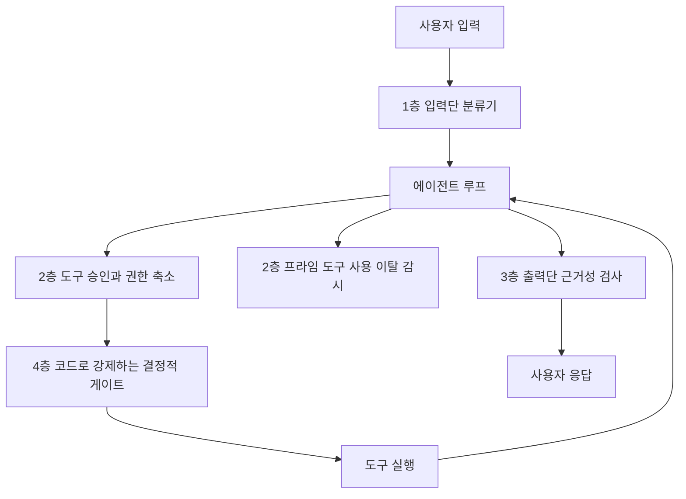

# 10장. 가드레일은 필터 하나가 아니다 — 네 층, 그리고 권한

커뮤니티에 이런 제목의 토론이 올라온 적이 있다. **"우리는 탈옥은 고쳤다. 에이전트는 못 고쳤다."**

제목 한 줄이 지형을 정확히 찍는다. 스레드가 전제하는 대로, 모델에게 나쁜 말을 시키는 문제는 그래도 손에 잡히는 편이 됐다. 그런데 그 모델에 도구를 붙이고 자격증명을 쥐여주고 며칠을 돌게 하면, 고쳤다고 믿었던 방어가 다시 무력해진다. 같은 스레드의 한 참가자가 이유를 더 정확하게 짚었다. *"에이전트 시스템에서 더 큰 문제는 경계 혼동인 것 같다 — 신뢰할 수 없는 콘텐츠가 결국 툴이 어떻게 사용되는지에 영향을 준다."*

프롬프트에 "위험한 일은 하지 마"라고 적어두는 것은 이 문제에 대한 답이 될까? 그게 보장인지 부탁인지부터 갈라보자.

### 가드레일은 층이다

확인된 벤더 권장 배치를 모아보면 가드레일은 필터 하나가 아니라 네 층으로 정리된다. 여기에 에이전트에만 있는 층 하나가 덧붙는다. 아래 나오는 제품의 상태 표시와 입력 한도는 2026년 7월에 확인한 각 벤더 문서 기준이다.

**① 입력단.** 주입·탈옥 전용 분류기를 앞에 세운다. Azure의 Prompt Shields(입력 한도 1만 자), Meta의 Prompt Guard가 이 자리의 제품이다. 여기서 비용 이야기를 한 줄 끼워두자. 공식 문서가 권하는 배치는 *"값싼 경량 모델이 비싼 모델을 호출하기 전에 가드레일 검사를 돌려서, 차단될 요청의 비용을 줄인다"*는 순서다. 안전장치가 오히려 비용을 깎아주는 드문 지점이라 순서를 이렇게 잡자.

**② 실행 중 — 도구 승인과 권한 축소.** 부작용을 실제로 만들어내는 층이라 여기가 무게중심이다. 예를 들어 Claude Code는 기본 동작이 권한 요청이고, 그 마찰을 줄이는 방법을 세 가지로 제시한다. 자동 모드 분류기로 *"권한 상승, 알 수 없는 인프라, 적대적 콘텐츠가 유발한 행동"*만 골라 막는 방식, 허용목록, 그리고 OS 레벨 샌드박싱이다. 사람이 없는 배치 실행에서는 허용할 도구를 인자로 못 박는다(`--allowedTools`).

**②' 실행 중 — 도구 사용 이탈 감시.** 에이전트에만 필요한 층이다. Azure의 Task adherence API(preview)는 *"AI 에이전트의 도구 사용이 어긋났거나 의도되지 않았거나 성급한 시점을 탐지한다"*고 스스로를 규정한다(입력 한도 10만 자). 요청과 행동의 정렬을 보는 층이라, 입력이 깨끗하고 출력이 그럴듯한데도 중간에서 궤도를 벗어나는 실패를 잡는다.

**③ 출력단.** 근거성·콘텐츠 검사다. Azure의 Groundedness detection(preview), 그리고 OpenAI Moderation이 여기 온다. 후자는 무료이고 13개 카테고리에 이미지 입력까지 받는다 — 붙이지 않을 이유를 찾기가 오히려 어렵다.

**④ 코드로 강제하는 결정적 게이트.** 앞의 셋이 판정이라면 이 층은 집행이다. 마이그레이션 폴더 쓰기를 차단하는 훅처럼, 조건이 맞으면 그냥 실행되지 않는다. 앞 장에서 본 예산 컷오프도 이 층의 식구다.

그림 1. 요청과 응답이 통과하는 가드레일 네 층과, 도구 사용 이탈을 보는 ②' 층

층으로 그려보면 흔한 오해 하나가 눈에 보인다. 많은 팀이 ①과 ③만 붙이고 가드레일을 세웠다고 말한다. 입출력 검사는 대화형 챗봇의 방어 배치다. 부작용을 만드는 것은 ②의 도구 호출인데, 그 층이 비어 있는 상태로 프로덕션에 나가는 경우가 흔하다.

### 프롬프트는 정책이 아니다

독자가 가장 자주 틀리는 지점을 하나만 꼽자면 이것이다. **advisory 지시와 결정적 훅의 구분.** 규칙 파일이나 시스템 프롬프트에 적은 "하지 마"는 조언이고, 코드로 만든 훅은 집행이다. Claude Code 문서가 이 차이를 한 문장으로 말한다. *"advisory인 CLAUDE.md 지시와 달리, 훅은 결정적이고 그 동작이 일어남을 보장한다."*

앞서 도구 재시도를 다룰 때 나온 문장이 여기서 다시 쓰인다. 재시도 정책이 프롬프트 안에 있으면 *"그건 정책이 아니라 확률"*이다. 같은 논리가 금지에도 그대로 적용된다. 프롬프트에 적은 금지는 대체로 지켜지고, 대체로 지켜진다는 말은 보장이 아니다. 파괴적 명령 하나가 지켜지지 않는 경우를 상상해보면 아찔하다.

여기서 이 책이 반복해서 쓰는 원칙 하나를 꺼내자. **추론은 확률적으로 하되, 집행은 결정적으로 한다.** 미리 밝혀두는데 이 문장은 어느 벤더나 논문이 그대로 말한 것이 아니라 저자의 종합이다. 세 갈래 근거를 나란히 놓으면 이렇게 모인다. 공식 문서 쪽에서는 두 벤더가 "단순한 것부터 시작하라", "함수로 쓸 수 있으면 함수로 쓰라"고 권한다. 학술 쪽에서는 검증 신호 없는 루프가 개선이 아니라 낭비라는 결론이 나온다. 현장에서는 "정책이 아니라 확률"이라는 진단과, 부작용 경계를 코드로 집행하라는 실천이 반복된다. 셋의 층위가 서로 다르므로 업계 합의라고 부를 수는 없다. 다만 세 갈래가 같은 방향을 가리키는 것은 사실이다.

### 모델 축이냐 시스템 축이냐

그렇다면 프롬프트 인젝션은 원리적으로 막을 수 있을까? 이 질문에 학계는 아직 한 답을 내지 않았다. 네 갈래 연구를 모델을 고쳐서 막을 수 있느냐, 시스템을 설계해서 막느냐라는 한 축에 올려놓으면 지형이 보인다.

축의 한쪽 끝에는 비관이 있다. 간접 인젝션을 다룬 연구(arXiv:2302.12173)는 LLM 통합 애플리케이션이 데이터와 명령의 경계를 흐린다고 지적하고 효과적 완화가 현재 부재하다고 적었다. 그 다음, 모델을 키우는 방향이 답이 아니라는 실증이 나왔다. AgentDojo(arXiv:2406.13352)는 97개 태스크와 629개 보안 테스트로 지형을 재면서, *"더 유능한 모델이 오히려 공격하기 쉬운, 일종의 역스케일링"* 경향을 보고한다. 모델 업그레이드가 보안을 개선해줄 거라는 기대에 근거가 없다는 뜻이다. **보안은 모델 축이 아니라 시스템 축이다.**

축의 반대쪽에서 답이 나온다. CaMeL(arXiv:2503.18813)은 제어 흐름과 데이터 흐름을 분리하는 설계로 AgentDojo 태스크의 77%를 증명 가능한 보안 상태로 해결했다. 무방어 상태에서 풀리던 것이 84%였으니, 방어를 걸면 풀 수 있는 일이 조금 줄어든다. 같은 방향의 후속 연구(arXiv:2506.08837)는 이런 저항 패턴들을 카탈로그로 정리하면서 유틸리티 대가를 함께 명시한다. 개별 패턴의 효과 크기는 초록에 정량 결과가 없으므로 여기서 숫자로 옮기지 않는다.

그런데 이 축에서 가장 값싸고 효과가 컸던 방어는 정교한 설계가 아니었다. **도구 노출 최소화**다. AgentDojo(v3 기준) 본문은 이렇게 적는다. *"우리의 단순한 도구 필터링 방어가 특히 효과적이었고, 공격 성공률을 7.5%로 낮췄다."* 사용자가 이메일을 읽기만 하면 되는 요청에 `send_email`을 붙여두지 않는 것, 그게 방어다. 앞에서 도구를 줄이라고 말한 이유가 컨텍스트 팽창과 선택지 혼란이었다면, 여기서는 이유가 하나 더 붙는다. 노출하지 않은 도구는 인젝션이 호출할 수 없다.

은탄환은 아니다. 논문 스스로 한계를 밝힌다. 사용자 태스크가 읽기만 요구하고 공격자 태스크가 쓰기를 요구할 때 잘 통하고, 그렇지 않으면 실패한다. 안전 정렬을 통제로 계산하는 것도 위험하다. AgentHarm(arXiv:2410.09024)은 선도 모델들이 탈옥 없이도 놀랍도록 순응적이었고, 탈옥 이후에도 일관되고 유해한 다단계 능력이 유지된다고 보고한다. 통제는 모델의 성향이 아니라 도구 계층과 권한 계층에 두는 편이 낫다.

77%와 84%의 간격을 다시 보자. 실무자가 결국 하는 질문은 "안전한가"가 아니다. **"이 에이전트의 자유도를 얼마나 깎아야 안전해지는가"**이고, 저 간격이 그 대가의 크기다.

### 경계 혼동 — 커뮤니티가 더한 프레이밍

문서와 논문에 없는 프레이밍을 현장이 하나 더 준다. 문제는 탈옥이 아니라 경계 혼동이다. 신뢰할 수 없는 콘텐츠가 도구를 어떻게 쓰는지에 영향을 준다는 관찰인데, 층으로 나눈 우리 그림에서 보면 ①을 통과한 텍스트가 ②의 판단을 흔든다는 뜻이다. 그래서 ②를 사람이나 코드가 아니라 모델의 자제심에 맡기면 방어선이 실제로는 하나도 없다.

두 위험을 섞지 않는 것도 중요하다. 한 개발자가 MCP 서버를 두 위험으로 갈라준다. *"하나는 툴 출력을 통한 프롬프트·컨텍스트 인젝션. 다른 하나는 훨씬 더 전통적인, 전이 의존성을 가진 신뢰할 수 없는 코드를 내 머신에서 실행하는 위험. 컨테이너화는 두 번째만 돕고 첫 번째는 돕지 않는다."* 뒤쪽은 우리가 이미 아는 공급망 위험이다. 남이 만든 서버를 붙이는 일은 남의 의존성 트리를 내 실행 환경에 들이는 일이고, 그 판단 기준은 npm 패키지를 고를 때와 같아야 한다. 앞쪽은 격리로 해결되지 않는다. 컨테이너 안에서 돌아도 인젝션은 여전히 내 자격증명으로 합법적인 API를 호출한다.

에이전트가 차선을 벗어나는 이유에 대한 관찰도 새겨둘 만하다. 한 샌드박스 사업자는 자기 플랫폼의 세션 로그를 분석하고 이렇게 적었다. *"'이 함수의 유닛 테스트를 써줘'라고 요청받은 에이전트는, 완전히 지시받지 않았는데도, 테스트하려던 소스 코드를 수정하고, 패키지를 설치하고, 네트워크 요청을 시도한다. 악의적인 게 아니다. 에이전트는 그냥 '도움이 되려고' 하는 것이다."* 벤더 자체 로그이므로 관찰로만 받아들이자. 그래도 함의는 크다. 악의를 막는 방어와 선의를 막는 방어는 설계가 다르다. 후자는 탐지로 잡기 어렵고, 애초에 할 수 없게 만들어야 잡힌다.

책임 논쟁도 한 단락으로 짚고 지나가자. 프로덕션 DB 삭제 사건 이후 도구 문제냐 운영자 문제냐를 두고 논쟁이 붙었다. 한쪽은 검증 없이 파괴적 명령을 실행할 수 있게 만든 도구·권한 설계의 실패라고 본다. 다른 쪽은 후속 스레드 제목으로 반박했다 — *"AI가 네 DB를 지운 게 아니라, 네가 지웠다."* 이 논쟁은 결국 "최소 권한을 실제로 어떻게 거는가"라는 공학 질문으로 수렴했고, 그 수렴점이 이 장의 논지와 같다. 다만 하나는 남겨두자. 사고 뒤에 에이전트에게 "왜 그랬어?"라고 묻고 그 답을 원인으로 적는 일은 하지 않는 편이 낫다. 에이전트는 결정을 하고 나서 행동하는 것이 아니라 텍스트를 출력한다. 그 텍스트는 사후 합리화이고 트레이스가 아니다.

### 무엇부터 손대나

층을 다 세우는 데는 시간이 걸린다. 순서를 정해보자.

먼저 **도구 표면**이다. 이번 태스크에 필요 없는 도구를 목록에서 뺀다. 가장 싸고 근거가 가장 강한 조치다. 다음은 **자격증명 범위**다. 에이전트가 쓰는 토큰이 읽기 전용인지, 어느 테이블·버킷·리포까지 닿는지 적어본다. 그다음 **승인 게이트**다. 되돌릴 수 없는 행동 — 결제, 발송, 삭제, 배포 — 을 목록으로 만들고 그 앞에 사람 개입(HITL)이나 결정적 훅을 세운다. 프레임워크가 도와주는 부분도 있다. 예컨대 OpenAI Agents SDK는 가드레일이 발동하면 `{Input,Output}GuardrailTripwireTriggered`를 즉시 발생시키고 실행을 중단한다. 마지막이 **분류기**다. ①과 ③은 위 셋이 선 다음에 붙이는 편이 낫다. 순서를 뒤집으면 판정만 있고 집행이 없는 상태가 된다.

도구를 고를 때 하나 주의하자. 인젝션 방어를 검색하면 아직도 Rebuff 같은 프로젝트가 상단에 나오는데, 2026년 7월 기준 리포는 아카이브 상태이고 마지막 릴리스가 2024년 1월이다. 이 분야는 죽은 프로젝트가 검색 결과에 오래 남는다.

마지막으로 한국어 서비스를 만드는 사람에게 직접 걸리는 이야기가 있다. 한 보고자는 인젝션 벡터 18개 중 12개가 방어를 우회했고 비영어 벡터는 전부 통과했다고 주장했다. 방법론과 대상 제품이 공개되지 않은 미검증 주장이므로 수치를 사실로 받아들이지는 말자. 다만 짚고 갈 값은 있다. 분류기의 학습·평가 데이터가 영어 중심이라면 한국어 입력에서 성능이 같을 이유가 없다. 우리 서비스의 언어로 우리가 직접 재보지 않으면 알 수 없는 값이다.

에이전트가 새로운 종류의 취약점을 만들어내는 건 아니라는 관찰도 함께 두자. 한 리뷰어는 에이전트가 만든 코드에서 찾은 보안 문제들이 새로운 종류는 하나도 없었고 주니어가 늘 만들던 고전들이었으며, 다만 훨씬 높은 처리량으로 생산됐을 뿐이라고 말한다. 그리고 시니어 리뷰 단계가 많은 워크플로에서 조용히 사라졌다고 덧붙인다. 필요한 것은 새 방어가 아니라, 사라진 검증 단계를 코드로 되돌려놓는 일일지도 모른다.

자, 여기서 한 가지만 해보자. 지금 우리 에이전트가 쓸 수 있는 자격증명을 종이에 적어보는 것이다. 어떤 키를 쥐고 있고, 그 키로 어느 데이터베이스의 어느 테이블에 쓸 수 있고, 어느 외부 API를 호출할 수 있는지. 적다 보면 줄일 것이 보인다. 그리고 대개는 생각보다 많이 보인다.
