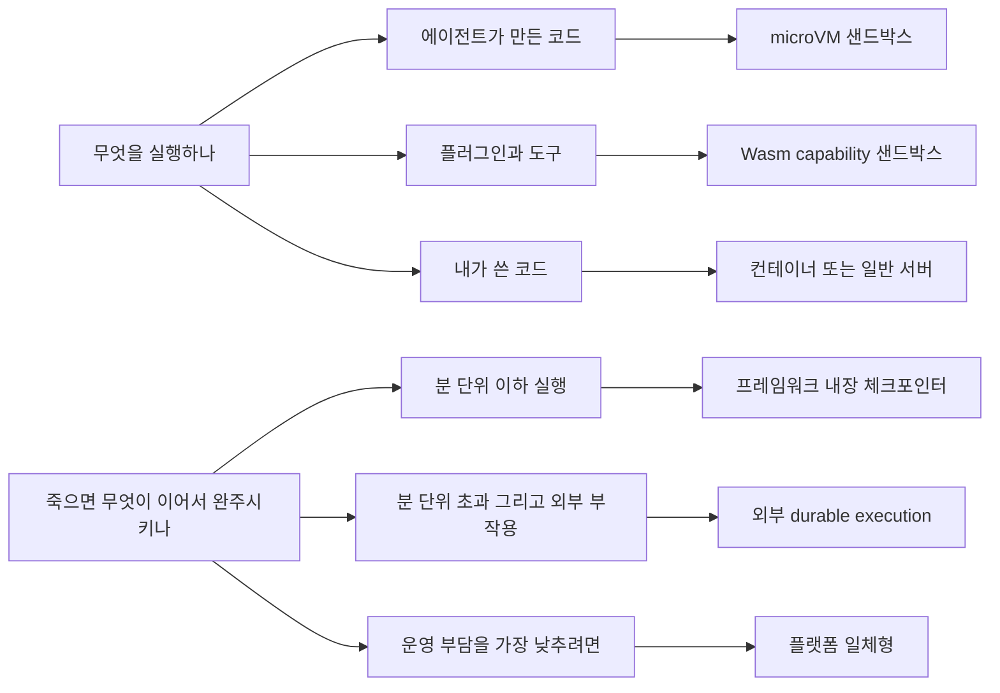

# 11장. 어디서 돌릴 것인가 — 격리 강도, 그리고 며칠짜리 실행

에이전트가 방금 스크립트 하나를 써냈다고 해보자. 마흔 줄쯤 되는 파이썬이고, 우리가 요청한 대로 로그 파일을 파싱해서 집계 결과를 낸다. 읽어보니 그럴듯하다. 그런데 이걸 실행해도 될까?

읽어봤으니 괜찮다고 답하고 싶은데, 그 답은 오늘 한 번만 유효하다. 내일은 이 에이전트가 하루에 스크립트 수백 개를 써낼 것이고 그때는 아무도 다 읽지 못한다. 그러면 질문을 바꿔야 한다. **누가 썼는지가 아니라, 그 코드가 무엇에 닿을 수 있는지를 묻는 편이 낫다.** 파일 시스템은 어디까지, 네트워크는 어디까지, 우리 프로세스의 메모리는 볼 수 있나.

여기에 질문 하나가 더 붙는다. 그 실행이 세 시간짜리, 혹은 사람 승인을 기다리는 사흘짜리라면 중간에 프로세스가 죽었을 때 무엇이 이어서 완주시킬까. 실행환경을 고를 때 실제로 갈리는 것은 이 둘이다.

### 격리 강도와 시작 지연 — 유일한 진짜 트레이드오프

실행환경에는 축이 하나뿐이다. 강한 격리를 택하면 시작 지연(콜드 스타트)이 늘고, 빠른 시작을 택하면 격리가 얇아진다. 강한 쪽부터 늘어놓으면 이렇다. microVM(Firecracker), 유저스페이스 커널(gVisor), 컨테이너(Docker·Podman), 그리고 Wasm capability 샌드박스(Wasmtime·WasmEdge)다.

Wasm이 목록 끝에 있는 것은 격리가 약해서가 아니다. 기본값이 "아무것도 못 함"인 capability 모델이라 격리는 오히려 강한 편인데, 대신 생태계 제약이 크다. 임의의 파이썬 스크립트를 그냥 던져 넣을 수 있는 환경이 아니다. 그래서 이 목록은 강도 순서일 뿐이고 용도 순서가 아니다.

지연 쪽은 숫자로 이야기하기가 어렵다. 솔직히 말해두는 편이 낫겠다. 이 책이 조사한 범위에서 주요 샌드박스 제공자의 신규 시작 지연은 1차 소스로 확인되지 않았다. Firecracker 자체를 다룬 논문의 부팅 시간 수치가 돌아다니지만, 그건 2020년의 서버리스 워크로드 측정이라 에이전트 샌드박스가 몇 밀리초에 뜬다는 주장으로 옮기면 사실이 아니게 된다. 벤더가 자기 표현으로 말하는 정도가 지금 인용할 수 있는 최대치다. 예컨대 Fly.io Machines 문서는 *"빠르게 시작하는 VM이며, 1초 미만 속도로 시작·정지할 수 있다"*고 적는다. 그러니 이 축은 순서로 판단하고, 절대값은 자기 워크로드로 직접 재보자.

용도 배정에서는 확인된 것과 확인되지 않은 것을 갈라야 한다. 신뢰할 수 없는 에이전트 생성 코드 실행에 컨테이너 단독은 불충분하다 — 이건 여러 제공자가 같은 방향으로 말한다. Vercel Sandbox는 *"각 샌드박스는 자체 파일 시스템과 네트워크를 가진 안전한 Firecracker microVM에서 실행된다"*고 명시하고, Modal Sandbox는 자기 제품을 *"신뢰할 수 없는 사용자 또는 에이전트 코드를 실행하기 위한 안전한 컨테이너"*로 규정한다. 다만 주의할 점이 하나 있다. **Firecracker 사용이 명시적으로 확인된 것은 Vercel Sandbox뿐이다.** 다른 제공자가 내부적으로 무엇을 쓰는지는 이 책이 확인하지 못했고, 커뮤니티에 널리 퍼진 추측을 사실로 옮기지 않았다. 격리 기술을 요구사항으로 삼는다면 계약 전에 직접 물어보자.

그래서 현실적인 답은 분업이다. 에이전트가 만든 코드 실행에는 microVM 샌드박스를 쓰고, 플러그인·도구 자체의 격리에는 Wasm을 쓴다. 둘은 경쟁하는 선택지가 아니라 서로 다른 자리다.

그림 1. 무엇을 어디서 실행하고, 어디서 이어서 완주시키나

### 프로덕션은 실제로 어디서 갈랐나

앞에서 비용 구조를 볼 때 인용한 AWS Deep Insight 사례를 격리 관점에서 다시 보자. 이 시스템의 설계 결정 세 개가 그대로 교과서다.

첫째, 코드 실행 환경을 분리했다. 에이전트 런타임과 코드 실행 컨테이너를 다른 프로세스 경계에 두었고, 근거를 이렇게 적었다(AWS Korea 기술블로그, 2차 소스). *"에이전트가 생성한 코드를 Runtime 내부에서 그대로 실행하면 악성코드나 무한루프가 같은 세션에서 돌고 있는 에이전트 로직에 영향을 줄 수 있습니다."* 악성코드만 걱정한 게 아니라 무한루프를 나란히 적었다는 점을 눈여겨보자. 격리는 공격을 막기 위한 것만이 아니라 사고를 격리하기 위한 것이다.

둘째, 중간 저장소를 두고 데이터를 그리로 흘렸다. 에이전트들이 결과를 객체 스토리지에 쓰고 서로 그걸 읽는 구조인데, 부수 효과가 크다. 분산된 에이전트 사이의 데이터 허브가 되면서, 사람이 중간 결과를 열어보고 피드백을 넣는 지점도 같이 생긴다.

셋째, 네트워크를 완전히 격리했다. 프라이빗 서브넷과 VPC 엔드포인트만 쓰고 퍼블릭 인터넷을 경유하지 않는다. 앞 장에서 본 인젝션의 관점에서 보면 이게 왜 중요한지 분명하다. 인젝션이 성공해도 데이터를 밖으로 보낼 경로가 없으면 피해의 상당 부분이 사라진다.

이 세 결정에 공통점이 있다. 어느 것도 모델이나 프롬프트를 건드리지 않는다. 전부 프로세스 경계와 네트워크 경계를 어디에 그을지의 문제다.

### 며칠짜리 실행을 무엇이 완주시키나

이제 두 번째 축이다. 여기서 만나는 용어가 durable execution — 실행이 중간에 죽어도 이어서 완주하게 만드는 계층이다. Temporal의 공식 정의가 간결하다. *"Durable Execution은 불리한 조건에서도 애플리케이션이 올바르게 동작하도록 보장한다 — 끝까지 완주할 것을 보장함으로써."*

선택지는 세 갈래다.

**프레임워크 내장 체크포인터.** LangGraph의 체크포인터, CrewAI의 `@persist()`, Cloudflare Durable Objects가 여기에 속한다. 분 단위 이하 실행, 외부 부작용이 적을 때 충분하다. 새로 운영할 것이 없다는 게 가장 큰 장점이다.

**외부 durable execution.** Temporal, Restate, DBOS, Inngest, Cloudflare Workflows가 이 자리에 있다. Temporal은 이 계층의 대표 경로다. 이벤트 히스토리를 남기고 리플레이로 상태를 복원한다. DBOS는 Postgres 하나로 같은 보장을 라이브러리로 제공하므로, 이미 Postgres를 쓰는 팀에게는 운영 부담이 가장 적은 경로다.

**플랫폼 일체형.** Cloudflare Agents SDK가 대표적이다. Durable Objects·Workflows·Sandbox·Browser·MCP 도구가 같은 플랫폼 안에서 맞물린다. 운영 부담이 가장 낮고 락인이 가장 강하다.

여기서 백엔드 개발자가 눈여겨봐야 할 대가가 하나 있다. **결정론 제약**이다. 리플레이 방식이 왜 이 제약을 낳는지 따라가보면 납득이 쉽다. 프로세스가 죽었다가 다시 뜨면, 이 계층은 워크플로 함수를 처음부터 다시 실행하면서 이미 기록된 결과를 히스토리에서 꺼내 채워 넣는다. 즉 같은 코드가 여러 번 실행되고, 매번 같은 순서로 같은 지점에 도달해야 한다. 그런데 워크플로 코드 안에서 현재 시각을 읽거나 난수를 뽑거나 HTTP 요청을 직접 보내면, 재실행할 때마다 값이 달라져서 기록된 히스토리와 어긋난다. 그래서 그런 작업은 워크플로 본문에 둘 수 없고, 결과가 히스토리에 기록되는 단위 — Temporal 용어로는 Activity — 로 밀어내야 한다.

LLM 호출이 정확히 그런 작업이다. 같은 입력에 같은 출력이 나온다는 보장이 없으니 워크플로 본문에 둘 수 없다. 결과적으로 **에이전트 코드의 구조가 이 제약을 따라 바뀐다.** 루프의 뼈대는 결정적인 워크플로 코드로 쓰고, 모델 호출과 도구 호출은 전부 Activity 경계 밖으로 나간다. 처음 겹치는 순간에는 꽤 난감하다. 그런데 이 강제가 나쁜 것만은 아니다. 확률적인 부분과 결정적인 부분을 코드 구조에서 갈라놓는 일이기 때문이다. 앞 장에서 집행을 결정적으로 하자고 말한 것과 같은 이야기가, 여기서는 프레임워크가 강제하는 형태로 돌아온다.

두 가지 사실을 함께 기억해두자. 하나, Temporal의 공식 개념 문서는 AI 에이전트를 언급하지 않는다. 에이전트를 위해 만들어진 도구가 아니라 범용 durable execution 도구를 에이전트에 쓰는 것이고, 그래서 에이전트 특화 편의는 우리가 얹어야 한다. 둘, 라이선스를 성능과 같은 급으로 확인하는 것이 바람직하다. 2026년 7월 기준 Temporal 서버와 DBOS는 MIT로 판정되지만, Restate와 Inngest는 **서버 리포의 라이선스 판정이 `NOASSERTION`이고 각자의 SDK는 MIT·Apache-2.0으로 다르게 나온다.** 서버와 SDK의 라이선스가 다른 구조이므로 "오픈소스"라고 뭉쳐서 판단하지 말고 실제 문구를 열어보자.

### 위임할지 말지 — 세 조건과 판단표

그렇다면 언제 외부로 위임할까. 판단 기준은 세 조건이고, 셋을 함께 놓고 보자. 실행이 분 단위를 넘는가, 외부 부작용(결제·발송·쓰기)을 만드는가, 중간 실패 후 재개해야 하는가.

셋이 모두 참이면 외부 durable execution이고, 그 외에는 내장 체크포인터로 충분하다. 여기에 격리 축을 겹치면 대개 이렇게 갈린다.

| 상황 | 격리 | 내구성 계층 |
|------|------|-----------|
| 내가 쓴 코드, 초·분 단위 실행 | 컨테이너 또는 일반 서버 | 내장 체크포인터 |
| 에이전트 생성 코드 실행, 짧은 실행 | microVM 샌드박스 | 내장 체크포인터 |
| 외부 부작용 + 재개 필요, 시간·일 단위 | 용도에 따라 | 외부 durable execution |
| 사람 승인을 며칠 기다리는 흐름 | 용도에 따라 | 외부 durable execution 또는 플랫폼 일체형 |
| 운영 인력이 거의 없는 팀 | 매니지드 샌드박스 | 플랫폼 일체형 (락인 감수) |

표에서 "용도에 따라"라고 적은 칸이 중요하다. 두 축은 독립이다. 며칠짜리 실행이라는 사실 자체가 격리 수준을 결정해주지는 않는다.

### 가격 없이 비용을 판단하는 법

이 카테고리에는 공백이 하나 있다. 밝혀두자. **durable execution 제품군의 가격 데이터를 이 책은 확보하지 못했다.** 비용이 선택을 가장 크게 좌우하는 카테고리인데 확인된 데이터 포인트가 없다. 그래서 여기에 비교표를 만들지 않았다. 커뮤니티에는 체크포인트 직렬화 오버헤드처럼 숫자로 보이는 값들이 돌아다니는데, 사용자가 제출한 재현 스크립트 수준이고 메인테이너가 확정한 것이 아니라 그것으로 내장과 외부를 비교하지 않았다.

대신 확인된 것을 쓰자. 과금 축이다. 벤더 견적을 비교할 때 물어야 할 것을 다섯 가지로 정리하면 가격 숫자 없이도 판단이 선다. 아래 나오는 한도·지연 값은 모두 2026년 7월에 확인한 각 벤더 문서 기준이다.

첫 질문은 과금 단위다. 실제 경과 시간(wall-clock)으로 재는가, 활성 CPU 시간으로 재는가? 이것이 첫 질문이어야 하는 이유가 있다. Vercel Sandbox 가격 문서(2026-06 기준)는 *"I/O를 기다리는 시간 — 네트워크 요청, 데이터베이스 질의, AI 모델 호출 같은 것 — 은 활성 CPU에 포함되지 않는다"*고 적는다. 에이전트 워크로드는 모델 응답을 기다리는 시간이 지배적이다. 그러니 두 과금 방식은 같은 워크로드에 자릿수가 다른 청구서를 낸다. 견적서에서 단가만 나란히 놓고 이 축을 놓치면 비교 자체가 헛일이 된다.

두 번째 질문은 첫 질문의 연장이다. 사람 승인을 기다리는 시간이 과금되는가? 앞 장에서 되돌릴 수 없는 행동 앞에 승인 게이트를 세우자고 했는데, 그 게이트를 세운 순간 이 질문이 비용 질문으로 바뀐다. 사흘을 기다리는 흐름이 사흘짜리 실행으로 계산되는 제품과 그렇지 않은 제품은 같은 설계에 전혀 다른 값을 매긴다.

남은 세 가지는 한도에 관한 질문이라 표로 모아두자.

| 물어볼 것 | 확인된 사실 | 무엇이 갈리나 |
|---|---|---|
| 대기 중인 인스턴스가 동시성 한도를 먹는가 | Cloudflare Workflows 한도 문서는 `waiting` 상태 인스턴스가 동시성 한도에 포함되지 않는다고 적는다 | 승인을 며칠씩 기다리는 실행을 수만 개 띄우는 설계가 가능한가 |
| 최대 sleep은 얼마이고, 재우고 깨우는 값은 얼마인가 | 같은 문서 기준 최대 sleep은 365일. E2B는 pause에 1GiB RAM당 약 4초, resume에 약 1초가 들고 pause된 샌드박스는 무기한 보존된다고 적는다 | 긴 대기를 프로세스를 띄운 채 버틸지, 재워두고 넘길지 |
| pause와 resume 이후 연속 실행 한도가 리셋되는가 | 같은 E2B 문서가 리셋된다고 적는다 | 몇 시간을 넘기는 실행을 잘게 나눠 이어갈 수 있는가 |

자릿수 감각이 필요하면 샌드박스 원가 쪽에 확인된 3행이 있다. 같은 문서(2026-06 기준, CPU를 100% 쓴다고 가정한 계산)에서 5분·2vCPU가 약 $0.03, 30분·4vCPU가 약 $0.34, 2시간·8vCPU가 약 $2.73이다. 앞 장에서 본 비용 구조와 나란히 놓으면 시사점이 분명하다. 이 정도 액수는 토큰 청구서 옆에서 대체로 작다. 실행환경 선택은 비용 최적화 문제가 아니라 **격리 요구사항과 운영 부담의 문제**로 다루는 편이 낫다.

세 질문만 남겨두자. 우리 에이전트의 이 실행은 분 단위를 넘는가. 외부에 흔적을 남기는가. 중간에 죽으면 이어서 가야 하는가.
