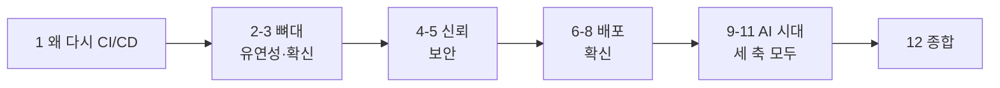

# GitHub·AWS·Cloudflare를 쓰는 개발자를 위한 CI/CD 저술 계획

- genre: tech-book / slug: `cicd-github-aws-cloudflare` / 저자: Toby-AI / delegation_mode: production
- 근거 레퍼런스: `01_reference.md` (합성 2026-09-26). 원장 참조 표기(W-n, P-n, C-…)는 레퍼런스를 따른다.
- 시점 기준: 본문의 모든 버전·가격·기능 상태는 **"2026년 9월 기준"**으로 못 박는다.

## 제목 후보

1. **GitHub에서 AWS와 Cloudflare까지, AI 시대의 CI/CD** — 톤: 정직한 실무서, 포지셔닝: 세 플랫폼 조합을 쓰는 팀을 위한 한 권짜리 파이프라인 안내서. 검색성이 가장 좋다.
2. **워크플로는 멍청하게, 배포는 의심하며** — 톤: 선배의 경구, 포지셔닝: 휴리스틱 중심의 태도 책. 기억에 남지만 다루는 플랫폼이 제목에서 보이지 않는다.
3. **배포는 검증이다: GitHub·AWS·Cloudflare로 짜는 AI 시대의 CI/CD** — 톤: 논지를 앞세운 실무서, 포지셔닝: "코드를 만드는 비용이 0에 가까워질수록 가치는 검증으로 이동한다"(W-49)는 책의 척추를 제목에 싣고, 부제로 플랫폼과 AI를 명시.

**추천:** 3번. 책 전체가 "CI/CD = 사람과 AI가 만든 변경을 믿을 수 있게 만드는 검증 장치"라는 한 문장으로 수렴하도록 설계했기 때문에, 제목이 그 논지를 선언하는 편이 낫다. 부제가 플랫폼 검색성을 보완한다.

## 책 특성

- 장르: tech-book (Toby 문체, 평어체·청유형)
- 분량: 약 108,000자 (12장, 장당 7,000~10,000자 + 앞뒤 부속)
- 난이도: 중급 — GitHub에 코드를 올리고 AWS나 Cloudflare에 한 번이라도 배포해본 실무자. YAML·컨테이너·IAM 기초는 안다고 가정한다.
- 독자 여정: "워크플로 YAML을 복붙해 돌아가게는 만들었지만, 장기 액세스 키가 시크릿에 박혀 있고, 배포가 성공했는지 로그로만 믿고, 팀원들이 Claude Code·Copilot으로 PR을 쏟아내기 시작해 불안한 상태" → "워크플로를 얇게 설계하고, 장기 자격증명 없이 AWS·Cloudflare에 점진 배포하고, 공급망과 AI 에이전트를 위협 모델 안에 넣고, AI가 만든 변경도 같은 게이트로 검증하는 파이프라인을 스스로 짜고 설명할 수 있는 상태"

### 러닝 예제: `ticketbox`

책 전체를 관통하는 가상의 서비스. 5명 스타트업 팀이 운영하는 소규모 공연 티켓 예매 서비스로, 오픈 순간 트래픽이 치솟는 성격 때문에 점진 배포·롤백이 실제로 중요해진다.

| 구성 요소 | 위치 | 배포 대상 | 처음 등장 |
|---|---|---|---|
| `apps/edge` — SPA 정적 에셋 + 엣지 API 라우팅 | Cloudflare Workers (정적 에셋) + D1(공지·대기열 메타데이터) | wrangler | 1장 소개, 7장 본격 |
| `apps/api` — 예매 API (컨테이너) | AWS ECS(Fargate) + ALB, RDS | ECR → ECS | 1장 소개, 6장 본격 |
| `functions/notify` — 예매 알림 발송 | AWS Lambda | aws-lambda-deploy | 6장 |
| `infra/` — AWS 인프라 | Terraform | plan-on-PR / apply-on-merge | 6장 |

- 모노레포 하나, GitHub 조직 저장소(프라이빗). 팀은 Claude Code와 Copilot을 쓰고, 9장부터 claude-code-action과 Copilot cloud agent를 파이프라인에 들인다.
- 오리진 보호: Cloudflare 앞단 + AWS 오리진 (Tunnel 또는 Authenticated Origin Pulls, 7장).
- 1장에서 "지금 ticketbox의 배포는 누군가의 노트북에서 스크립트로 한다"로 시작해, 장마다 파이프라인 한 조각을 붙이고, 12장에서 완성된 전체 그림을 한 장의 다이어그램으로 회수한다.
- 저술가 규칙: 예제 코드는 **발췌 스니펫**이다(완전한 저장소가 아님). 서비스 이름·디렉터리 구조·환경 이름(`preview`, `staging`, `production`)은 위 표와 이 절을 정전으로 삼는다. AWS 리전 예시는 `ap-northeast-2`, cron 타임존 예시는 `Asia/Seoul`.

## 내러티브 아크

책은 "왜 → 뼈대 → 신뢰 → 배포 → 안전한 배포 → AI → 종합"의 순서로 걷는다. 1장은 AI가 코드를 쏟아내는 2026년에 CI/CD가 왜 다시 중심 주제가 되는지를, CI의 실증 근거와 DORA 지표, 그리고 "AI는 증폭기"라는 관점으로 세운다. 여기서 Hilton 등이 정리한 CI의 세 긴장 축 — 확신(Assurance)·보안(Security)·유연성(Flexibility) — 을 책의 지도로 제시하고, 이후 장들이 이 세 축 중 어디를 다루는지 독자가 알 수 있게 한다.

2~3장은 **파이프라인의 뼈대(유연성·확신 축)**다. 워크플로를 얇게 두고 로직을 로컬에서 도는 스크립트로 빼는 원칙, 그리고 그 뼈대를 빠르고 싸게 만드는 러너·캐시·모노레포 전략을 다룬다. 뼈대가 먼저 오는 이유는, 뒤의 보안·배포 장이 모두 "얇은 워크플로 + 스크립트" 구조를 전제로 설명되기 때문이다.

4~5장은 **신뢰(보안 축)**다. 배포를 하기 전에 "파이프라인이 무엇으로 클라우드에 들어가는가"(OIDC, Cloudflare의 비대칭)와 "파이프라인에 무엇이 들어오는가"(공급망, 태그는 움직인다)를 먼저 다진다. 배포 장보다 보안 장을 앞에 둔 것은 의도적이다 — 장기 키로 배포하는 법을 먼저 배우고 나중에 고치는 순서는 실무에서 흔한 실수의 순서를 그대로 재현하기 때문이다. 5장에서 SHA 고정을 다룬 뒤부터 책의 모든 예제는 SHA 고정 형태로 바뀐다(아래 "예제 표기 규약").

6~8장은 **배포(확신 축)**다. AWS(ECS·Lambda·Terraform), Cloudflare(Workers·프리뷰·D1)를 각각 한 장씩 다루고, 8장에서 두 플랫폼의 점진 배포·롤백을 나란히 놓아 "배포 성공이란 무엇인가"를 다시 정의한다. 플랫폼별 장을 먼저 두고 비교 장을 뒤에 둔 이유는, 독자가 각 플랫폼의 모델을 알아야 비교가 의미를 갖기 때문이다.

9~11장은 **AI 코딩 도구 시대의 파이프라인**이다. 9장은 AI 에이전트를 파이프라인의 참여자로 들이는 법(claude-code-action·codex-action·Copilot cloud agent의 권한·자격증명·격리), 10장은 그 에이전트가 공격면이 되는 사례(s1ngularity, PromptPwnd, Comment and Control, Clinejection), 11장은 AI가 만든 PR 홍수 속에서 리뷰와 품질 게이트를 어떻게 설계하고 무엇으로 측정할지를 다룬다. AI 장을 뒤에 모은 이유는 "AI는 증폭기"라는 1장의 논지대로, 증폭될 기본기(2~8장)가 먼저 있어야 하기 때문이다. 대신 2~8장 각각에 짧은 고정 소절 `### AI와 함께 쓸 때`를 두어, AI 코딩을 쓰는 독자가 매 장에서 바로 적용할 팁을 얻게 한다(장별 초점은 챕터 목록에 배정).

12장은 ticketbox의 완성된 파이프라인 전체를 한 장에 펼쳐 세 축을 회수하고, GitHub Actions 자체에 대한 논쟁(떠날 것인가)과 플랫폼 장애 시 수동 배포 런북, 그리고 출간 직후 바뀔 항목(신선도 감시 목록)을 남기며 닫는다.

## 설계 근거

- **채택한 구조: "관심사(뼈대 → 신뢰 → 배포 → AI) 순서 + 러닝 예제 + AI 소절 직조"**
  1. 파이프라인의 문제(자격증명·공급망·롤백·리뷰)는 GitHub·AWS·Cloudflare를 가로지른다. 관심사로 자르면 한 문제를 한 장에서 세 플랫폼에 걸쳐 끝낼 수 있다. 플랫폼 고유 지식(ECS 네이티브 blue/green, Worker Previews)만 6·7장에 모았다.
  2. 레퍼런스의 교차 관찰(P 교차관찰 1)이 "CI는 품질 손실 없이 처리량↑ / DORA는 작은 배치·테스트가 성과를 가름 / 에이전트 PR도 작고 CI를 통과해야 병합"으로 세 층에서 같은 결론을 낸다. 이 척추를 살리려면 AI를 별도 부록이 아니라 기본기 위에 올라타는 마지막 막으로 두는 편이 설득력이 있다. 그러면서도 사용자가 요청한 "AI 코딩 팁"의 비중은 전용 3장 + 7개 장의 고정 소절로 확보한다.
  3. 러닝 예제 `ticketbox`가 "Cloudflare Worker 앞단 + AWS 백엔드"라는 독자의 실제 조합을 그대로 재현하므로, 장마다 새 예제를 만들 때 생기는 맥락 전환 비용이 없고 12장의 종합이 자연스럽다.
- **기각한 대안 1: 플랫폼별 3부 구성(1부 GitHub Actions / 2부 AWS / 3부 Cloudflare / 4부 AI)** — 기각 사유: 목차는 직관적이지만 OIDC·시크릿·롤백·공급망이 부마다 반복되거나 한 부에 몰려 다른 부가 얇아진다. 특히 "AWS는 OIDC로 장기 키가 없는데 Cloudflare는 장기 API 토큰을 쓸 수밖에 없다"는 비대칭(W-33, W-34)은 한 장에 나란히 있어야 보이는데, 플랫폼별로 나누면 이 핵심 통찰이 쪼개진다. ECS canary와 Workers gradual deployment의 비교(8장)도 사라진다.
- **기각한 대안 2: AI 우선 구성(모든 장을 "AI 에이전트와 함께 하는 X"로 프레이밍, 1장부터 에이전트 도입)** — 기각 사유: 사용자 요청의 AI 비중을 가장 크게 반영하지만, (a) AI 도구 사양(claude-code-action v1.0.x, Copilot 명칭 변경, Worker Previews 같은 최신 기능)은 반년 단위로 바뀌어 책 전체의 수명이 가장 휘발적인 부분에 묶이고, (b) DORA 2024·2025 모두 AI 도입과 전달 안정성의 음(−)의 관계를 보고하므로(P-39, P-40) "기본기 없이 AI부터"라는 순서는 책의 논지와 모순된다. 휘발성은 9~11장과 소절에 격리해 개정 시 그 부분만 갈아끼우게 했다.
- **기각한 대안 3: 하나의 긴 핸즈온 튜토리얼(저장소를 처음부터 만들며 장마다 커밋)** — 기각 사유: 독자의 배포 대상이 제각각(ECS만, Lambda만, Workers만)이라 선형 튜토리얼은 절반의 독자에게 절반이 무관해진다. 또 액션·wrangler 버전이 거의 매일 바뀌어(W-0) 따라 치는 코드가 출간 전에 깨질 위험이 크다. 러닝 예제는 유지하되 "발췌 스니펫 + 원칙" 방식으로 바꿨다.

## 용어 표기

- **CI/CD**: 그대로. 본문에서 "지속적 통합(CI)", "지속적 배포/전달(CD)"은 1장 첫 정의에서 한 번만 풀어 쓴다.
- **GitHub Actions**: 풀네임으로 쓴다. `GHA` 약어는 본문에서 쓰지 않는다(커뮤니티 인용문 안은 원문 유지).
- **워크플로 / 잡 / 스텝 / 액션 / 러너**: 한글 음차. 처음 등장 시 괄호로 영문(`workflow`, `job`, `step`, `action`, `runner`). "워크플로우" 아님.
- **GitHub 호스티드 러너 / self-hosted 러너 / 대형 러너(larger runner)**: 이 표기로 고정.
- **재사용 워크플로**: `reusable workflow`의 번역. "공용 워크플로" 등 쓰지 않는다.
- **OIDC / 신뢰 정책(trust policy) / `sub` 클레임 / `aud` 클레임**: 클레임 이름은 코드 서식.
- **SHA 고정**: pinning의 번역. "핀 고정", "해시 피닝" 쓰지 않는다.
- **공급망 공격**, **프롬프트 인젝션**, **스크립트 인젝션**: 이 표기로 고정.
- **GitHub 환경(environment)**: 배포 보호 규칙·시크릿 스코프를 가진 GitHub 기능을 가리킬 때. 일반적인 "환경"과 구분하려고 처음 몇 번은 "GitHub 환경"으로 쓴다.
- **블루/그린 배포, 카나리 배포, 선형(linear) 배포**: ECS 문맥. **점진 배포(gradual deployment)**: Workers 문맥이자 두 방식을 묶는 상위어.
- **Cloudflare 프리뷰 3종**: `Worker Previews`, `Preview URLs`, `Version URLs` — 영문 고유명 그대로 쓰고 섞지 않는다. PR 테스트 환경은 항상 Worker Previews. 일반 명사 "프리뷰 환경"은 GitHub·Cloudflare 무관한 개념어로만.
- **Workers 정적 에셋(static assets)**: Pages에서 옮겨가는 대상. Pages를 "폐지", "deprecated"라고 쓰지 않는다 — "Workers로의 마이그레이션을 권장한다" 수준으로(W-31).
- **ECS Express Mode**: 영문 그대로. App Runner는 "2026년 4월 30일부터 신규 고객을 받지 않는다"로만 언급(W-28).
- **Copilot cloud agent**: 처음 등장 시 "Copilot cloud agent(2025년 GA 당시 이름은 coding agent)", 이후 Copilot cloud agent. Copilot code review와 구분.
- **AI 코딩 에이전트(에이전트)**: 저장소에서 코드를 쓰고 PR을 여는 도구 전반. **AI 리뷰 봇**: 리뷰만 하는 도구. "AI 팀원" 같은 의인화는 인용 밖에서 쓰지 않는다.
- **지시 파일**: `AGENTS.md`, `CLAUDE.md`, `.github/copilot-instructions.md` 등을 묶는 말.
- **DORA 지표 5종**(2024년~): 변경 리드타임 · 배포 빈도 · 실패 배포 복구 시간 · 변경 실패율 · 배포 재작업률. Accelerate(2018)의 4지표는 "원전"으로 구분(P-38, W-46).
- **머지 큐 / 필수 체크(required check)**: 이 표기로 고정.
- **wrangler 4.x**: 본문은 메이저만. 특정 기능 최소 버전(Worker Previews 4.135.0+ 등)만 정확히 쓴다.

### 예제 표기 규약 (전 저술가 공통)

- 액션 버전 기준표는 레퍼런스 §0(2026-09-26 조회)을 따른다. `actions/checkout`은 v7로 통일.
- **1~4장:** 예제는 메이저 태그(`@v7`)로 쓰되, 처음 등장하는 곳(2장)에 "5장에서 이 표기를 바꾼다"는 한 줄 예고를 둔다.
- **5장부터:** 서드파티·공식 액션 모두 `uses: actions/checkout@<commit-sha> # v7.0.1` 형태. `<commit-sha>`는 리터럴 자리표시자로 두고 실제 SHA를 지어내지 않는다.
- 모든 예제 워크플로 최상단에 `permissions:` 블록을 명시한다(4장 이후 필수, 2~3장은 `contents: read`부터).
- 시크릿·계정 ID·ARN은 `123456789012`, `ticketbox-deploy` 같은 명백한 더미 값.

### 사실·신선도 규율 (계획 단계에서 못 박는 것)

- **본문 하중을 싣지 말 것(레퍼런스 §4.3 #14):** "98% 더 많은 PR / 91% 긴 리뷰", Cursor 논문의 "3~5배·41%·30%·806 vs 1,380", "SHA pinning 6.3%", 에이전트별 병합률, Hilton "릴리스 2배", DORA 2024 "25% 증가" 조건·"39,000명", GitHub Actions 가용성 "91%", Clinejection "약 4,000대". 쓰려면 "보도·주장" 수준으로 한 번 언급하고 논지를 기대지 않는다.
- **날짜·상태 함정:** ECS blue/green은 2026년 9월 기준 linear·canary 지원("all-at-once만"은 구버전). s1ngularity는 2025년 8월(THN의 "March 2026" 금지). tj-actions는 "23,000개 이상 저장소가 사용"과 "최소 218개 저장소에서 비밀 유출 확인"을 구분. self-hosted 러너 과금은 "연기". `pull_request_target` 퍼블릭 저장소 기본 차단은 "2026년 11월 2일 강제 예정"(출간 시점 확인 문구 필수). GitHub 2026 보안 로드맵의 잠금·egress 방화벽은 "로드맵". Cloudflare의 GitHub OIDC 수용은 "2026년 9월 기준 공식 문서에서 확인하지 못했다"로(단정 금지).
- **검증 필요 항목은 사례 소재로만:** Mini Shai-Hulud 재활성화, PostHog·TanStack 사례, `wrangler deploy --temporary`, D1 `--remote` 누락 함정(#221), ECS 단일 태스크 감지 100분, OIDC immutable `sub` 변경, CDKTF 종료. 본문에 쓰면 `(사실 확인 필요)`를 남겨 fact-checker가 판정하게 한다.
- **옛 수치엔 "당시":** USENIX 2022의 "99.8% 과권한"(P-14), Pearce 2022의 "약 40% 취약"(2021 Copilot, P-45), Bouzenia 2024 비용(연구 시점 가격, P-7).
- **AI 생산성은 한 수치만 인용하지 않는다:** +55.8%(P-41), −19%(P-42), 2.09배(P-44)를 함께 놓고 "측정 방식에 따라 부호가 바뀐다"로 다룬다(11장 담당, 1장은 한 줄 예고만).

### 통권 장치

- **`### AI와 함께 쓸 때`**: 2~8장에 고정 헤딩으로 1개씩, 600~1,200자. 장별 초점은 아래 배정을 따른다(같은 조언이 두 장에 나오지 않게). 9~11장은 장 전체가 AI이므로 두지 않는다. 1·12장에도 두지 않는다.
- **`### 이 장의 핵심`**: 개념 밀도가 높은 4·5·6·7·9·10장에만. 3~5개 불릿, 본문 결론만.
- **그림**: 장마다 mermaid 1~2개. 제안은 각 장에 적었다. 캡션 `그림 N. …`, 장마다 1부터.
- **소절 규모(분량 오버라이드 스케일 규칙):** 장 목표 7,000~10,000자 → 소절 5~8개, 소절당 순수 산문 3,000자 상한.

## 챕터 목록

### 1장. 코드는 넘쳐나고, 믿을 수 있는 변경은 부족하다
- **핵심 질문:** AI가 코드를 쏟아내는 지금, CI/CD는 왜 "자동화 편의"가 아니라 "검증 장치"로 다시 봐야 하는가?
- **주요 내용:**
  - CI의 정의(토스 SLASH 23의 한국어 정의, W-50)와 실증 근거: 품질 손실 없는 처리량 증가(P-1), "민간요법이 아니라 데이터"(P-2), 그리고 CI 극장 — 돌리고는 있지만 깨진 빌드를 나흘 넘게 방치하는 현실(P-4)
  - DORA 지표 5종(2024~)과 Accelerate 원전의 구분(P-38, W-46). 이 책이 성공을 재는 자
  - "AI는 증폭기": DORA 2025의 AI 사용 90%, 안정성과의 음(−)의 관계(P-40, W-46). 생성 비용이 0에 가까워지면 가치는 검증으로 이동한다(W-49, C-패턴11)
  - 책의 지도: CI의 세 긴장 축 확신·보안·유연성(P-3)과 장별 배치
  - 러닝 예제 `ticketbox` 소개: 현재 상태("누군가의 노트북에서 배포")와 12장에서 도달할 목표 아키텍처(그림)
- **독자가 얻는 것:** 이 책의 판단 기준(DORA 5지표, 세 축)과 러닝 예제의 전체 그림. "CI를 돌리고 있다"와 "CI가 작동한다"의 차이.
- **오프닝 기법:** 충격적 수치·사실 — DORA 2025: 응답자 90%가 AI를 쓰고, AI 도입은 여전히 전달 안정성과 음의 관계에 있다(P-40).
- **클로징 기법:** 자기 진단 질문 — 독자 팀의 파이프라인이 "CI 극장"인지 가늠하는 질문 3개를 던지고 멈춘다(다음 장 예고 문장 없이).
- **스캐폴드 유형:** 개념 도입형
- **그림 제안:** ticketbox 목표 아키텍처(Cloudflare Workers ↔ AWS ECS/Lambda, GitHub Actions가 둘을 잇는 구조)
- **예상 분량:** 7,000자

### 2장. 워크플로는 멍청하게, 로직은 스크립트로
- **핵심 질문:** 수백 줄짜리 YAML이 왜 팀의 발목을 잡고, 워크플로와 로직의 경계를 어디에 그어야 하는가?
- **주요 내용:**
  - 워크플로·잡·스텝·액션·러너의 해부 — 필요한 만큼만(재사용 워크플로 한도 10단 중첩·50개 호출, W-2)
  - "An ideal action has 2 steps" 휴리스틱과 그 이유: 로컬 재현성, 벤더 종속 회피(C-휴1, C-패턴1, C-휴10). Makefile·mise·언어별 태스크 러너 선택지
  - 반론 병기: 상태가 필요한 오케스트레이션, 셸 vs 스크립트 언어(4.1-B). `act`는 80%짜리 도구, 디버깅은 upterm(C-패턴2)
  - ticketbox 첫 워크플로: `ci.yml`(checkout + `make test`) → 트리거(`pull_request`, `push`), `permissions: contents: read`, concurrency 두 얼굴(PR은 `cancel-in-progress`, 배포는 `queue: max`, W-3), cron의 `timezone: "Asia/Seoul"`(W-4)
  - 재사용 워크플로로 표준화할 때의 폭발 반경 — 토스의 경고(W-50), 워크플로 파일에 CODEOWNERS
  - `### AI와 함께 쓸 때` — **초점: 지시 파일과 CI가 같은 명령을 부르게 하기.** AGENTS.md에 적는 빌드·테스트 명령은 사실상 CI 정의다(W-45). 에이전트가 로컬에서 `make test`로 CI와 똑같은 검증을 돌리게 하고, 에이전트가 `.github/workflows/`를 고치는 PR은 CODEOWNERS로 사람이 보게 한다.
- **독자가 얻는 것:** 로컬에서 그대로 돌아가는 CI 뼈대, 워크플로에 로직을 넣고 싶을 때의 판단 기준.
- **오프닝 기법:** 인용·일화 — HN의 "An ideal action has 2 steps…"(C-패턴1)를 먼저 던지고, 곧바로 ticketbox의 280줄짜리 찜찜한 `deploy.yml` 발췌로 대비.
- **클로징 기법:** 적용 과제 — "오늘 워크플로 하나를 골라 `run:` 블록 가장 긴 것을 스크립트로 빼고, 로컬에서 먼저 돌려보자"는 구체 과제 하나로 닫는다.
- **스캐폴드 유형:** 문제-해결형
- **그림 제안:** 워크플로(얇은 층) → 스크립트(로직) → 도구 체인의 계층도
- **예상 분량:** 9,000자

### 3장. 빠르고 싼 파이프라인: 러너, 캐시, 모노레포
- **핵심 질문:** 빌드 시간과 CI 비용을 줄이는 여러 선택지 중 무엇을, 어떤 상황에서 골라야 하는가?
- **주요 내용:**
  - CI 비용의 실체: 연구 시점 평균 유료 저장소 연 $504, 자원의 91.2%가 테스트·빌드(P-7, "당시 가격" 명기) + 2026년 가격표(최대 39% 인하, 분당 요금, 무료 분은 대형 러너에 못 씀, W-8)
  - 러너 선택지 비교: GitHub 호스티드 x64 vs arm64(Graviton 배포와의 궁합, W-9) vs 대형 러너 vs self-hosted(ARC, 버즈빌 사례 W-10). self-hosted 과금 소동은 "연기" 상태로(4.3 #5), 논쟁 G 병기
  - 캐시: 효과(P-30)와 유지보수 비용(P-13), 10GB 한도와 eviction(W-7, C-패턴3 — 벤더 수치는 이해관계 명시)
  - 모노레포: path 필터 + 프로젝트별 워크플로(F-Lab W-12, 레몬베이스 W-11 — 롤백 시 path 필터 함정), 필수 체크가 스킵될 때의 충돌, affected graph와 main의 전체 실행 카나리(C-휴8, 단일 발언임을 밝힘)
  - 머지 큐와 `merge_group` 트리거(W-6)
  - 플레이키 테스트: 재시도로 덮지 말고 격리 — 170회 재실행(P-26), 재시도는 통과를 보장하지 않는다(P-29), Google의 "가까운 코드" 선택(P-27)
  - `### AI와 함께 쓸 때` — **초점: 에이전트 PR이 늘면 CI 분이 는다.** PR용 concurrency 취소, 머지 큐로 main 보호, Copilot cloud agent의 "Approve and run workflows" 승인 전 CI 미실행(W-42)이 비용 게이트 역할도 한다는 점.
- **독자가 얻는 것:** "우리 팀은 어디서 시간을 쓰고 있나"를 진단하고 러너·캐시·필터 중 무엇부터 손댈지 정하는 의사결정 가이드.
- **오프닝 기법:** 수사적 질문 — "빌드가 12분 걸린다. 그런데 이게 정말 문제일까, 아니면 12분 중 어디가 문제일까?"
- **클로징 기법:** 한 줄 공식으로 여운 — "(PR 수 × 실행 분 × 분당 요금) + 기다린 사람의 시간"이라는 봉투 뒷면 계산을 남기고, 뒤쪽 항이 대개 더 크다는 한 문장으로 닫는다.
- **스캐폴드 유형:** 비교 대조형
- **그림 제안:** 러너 선택 의사결정 트리
- **예상 분량:** 9,000자

### 4장. 비밀 없는 배포: OIDC, 그리고 Cloudflare의 비대칭
- **핵심 질문:** 파이프라인은 무엇으로 클라우드에 들어가야 하고, 장기 자격증명을 없앨 수 없는 곳에서는 어떻게 피해를 줄이는가?
- **주요 내용:**
  - 장기 키가 새는 규모: NDSS 2019의 10만+ 저장소(P-23), IaC 하드코딩 비밀의 중앙 수명 20개월(P-36, 당시 도구 중심)
  - AWS OIDC의 흐름: 공급자 URL·`aud`·`id-token: write`, configure-aws-credentials v6.3.0(W-13, W-14). 문서 예제 `repo:octo-org/octo-repo:*`가 왜 넓은지, `environment:production`/`ref:refs/heads/main`으로 좁히기, custom properties 클레임(W-5)
  - OIDC가 안 될 때: `sub`/`aud` 글자 단위 불일치, `id-token: write` 누락, JWT 디코딩 비교(C-패턴6)
  - GitHub 환경(environment)으로 배포 시크릿을 main·리뷰 후에만: build/test 잡엔 시크릿 0(C-휴3), `deployment: false` 옵션(W-4)
  - Cloudflare의 비대칭: wrangler-action은 API 토큰(W-33), GitHub OIDC 수용은 2026년 9월 기준 공식 문서에서 확인 못 함 → 계정 소유 토큰 + Specified Workers + Editor(삭제 권한 없음)로 폭발 반경 줄이기(W-34)
  - `### AI와 함께 쓸 때` — **초점: 에이전트의 자격증명.** claude-code-action의 워크로드 아이덴티티 페더레이션(OIDC로 Claude API·Bedrock 접근), PAT 금지 이유(W-38, W-39). 로컬 에이전트는 git 자격증명 없는 컨테이너에서(C-휴6).
  - `### 이 장의 핵심`
- **독자가 얻는 것:** ticketbox의 AWS 역할 신뢰 정책(environment로 좁힌 `sub`)과 Cloudflare 토큰 스코프 설계.
- **오프닝 기법:** 상황 가정 — "ticketbox의 `AWS_SECRET_ACCESS_KEY`가 GitHub 시크릿에 들어간 지 14개월째라고 해보자. 누가 넣었는지, 어디에 또 복사됐는지 아는 사람이 없다."
- **클로징 기법:** 열린 문제로 넘기기 — AWS 쪽은 키가 사라졌지만 Cloudflare 토큰은 여전히 남아 있다는 비대칭을 인정하고, "남은 시크릿을 노리는 쪽은 파이프라인 안으로 들어오는 코드"라는 한 문장으로 공급망 문제를 연다.
- **스캐폴드 유형:** 개념 도입형
- **그림 제안:** GitHub OIDC 토큰 → AWS STS → 역할 가정 시퀀스 다이어그램
- **예상 분량:** 9,000자

### 5장. 태그는 움직인다: 공급망과 워크플로 보안
- **핵심 질문:** 내가 쓴 적 없는 코드가 내 파이프라인에서 실행되는 경로는 무엇이고, 어디서 막아야 하는가?
- **주요 내용:**
  - 사례 1 tj-actions/changed-files(CVE-2025-30066): 태그 소급 변경 → 러너 메모리에서 시크릿 추출 → 로그 노출. 23,000개 사용 vs 218개 유출 확인 구분(W-16, W-17). reviewdog 연쇄
  - 사례 2 s1ngularity(2025-08): PR 제목 + `pull_request_target` → npm 토큰 탈취(W-22). AI CLI 악용 부분은 10장에서 다시 다룬다는 한 줄
  - 분석 틀: CI 보안 4속성(P-14)과 GitHub 공식 하드닝의 세 규칙 — 최소 권한, 신뢰 불가 입력은 env로, SHA 고정(W-15, P 교차관찰 3). 99.8% 과권한은 "2022년 당시"
  - SHA 고정: "태그는 움직인다"(P-18), 조직 정책으로 강제·`!` 차단(W-18), Renovate/Dependabot으로 갱신하되 자동 머지 금지, Dependabot 기본 3일 쿨다운(W-24). 논쟁 C(불충분·과함·권한이 본질) 병기. **여기서 예제 표기를 SHA 고정으로 전환**
  - `pull_request_target`: 2026-11-02 퍼블릭 저장소 기본 차단 예정, checkout v7의 포크 코드 거부와 `allow-unsafe-pr-checkout` 조건(W-21)
  - 증명과 불변성: artifact attestation·SLSA Build L2/L3, `actions/attest`, `gh attestation verify`(W-25), immutable releases(W-19). 투명성·유효성·분리(P-21)
  - 스캐너는 여러 관점으로 — 9개 스캐너 불일치(P-17), CodeQL 워크플로 분석(W-23), LLM 감사 κ=0.28(P-12)
  - `### AI와 함께 쓸 때` — **초점: AI가 써준 워크플로 YAML을 검토하는 눈.** 태그 참조, `run:`에 박힌 `${{ github.event.* }}`, 빠진 `permissions:`를 세 가지 체크 포인트로. LLM에게 보안 감사를 맡기면 판정이 흔들린다(P-12)는 근거.
  - `### 이 장의 핵심`
- **독자가 얻는 것:** ticketbox 저장소·조직에 바로 거는 보안 기본기 체크리스트(레퍼런스 §5.2 기반)와 그 이유.
- **오프닝 기법:** 실패 장면(in medias res) — 2025년 3월 14일, 평소처럼 돈 CI 로그에 base64로 인코딩된 시크릿 덩어리가 찍혀 있다(tj-actions).
- **클로징 기법:** 체크리스트로 매듭 — 보안 기본기 체크리스트를 이 장에서 딱 한 번 제시하고, "이 목록은 사람의 규율이 아니라 정책으로 강제될 때만 지켜진다"는 한 문장으로 닫는다.
- **스캐폴드 유형:** 사례 분석형
- **그림 제안:** 신뢰할 수 없는 입력이 러너 안에서 실행되기까지의 경로(포크 PR·서드파티 액션·태그)
- **예상 분량:** 10,000자

### 6장. AWS로 보내기: ECS, Lambda, 그리고 Terraform
- **핵심 질문:** 컨테이너·함수·인프라를 각각 어떤 파이프라인으로 AWS에 올리고, "배포 성공"을 무엇으로 확인하는가?
- **주요 내용:**
  - 이미지 빌드와 ECR: 커밋 SHA 태그(`:latest` 금지), arm64 러너로 Graviton 네이티브 빌드(W-9), amazon-ecr-login
  - ECS 배포: amazon-ecs-deploy-task-definition v2, 네이티브 blue/green(2025-07)·linear·canary(2025-10)·NLB 확장(2026-02), CloudWatch 알람·circuit breaker 롤백, "CodeDeploy는 이제 필수가 아니다"(W-26, W-27 — 구버전 문장 인용 금지)
  - "성공"의 함정: 롤백 후 안정화돼도 액션은 성공을 보고한다(#191, C-패턴7) → 안정화 후 "내 리비전이 active인가"를 확인하는 스텝을 스크립트로(C-휴4)
  - 새 컨테이너 앱이라면: App Runner는 2026-04-30부터 신규 불가 → ECS Express Mode(W-28)
  - Lambda: aws-lambda-deploy(함수 코드) vs SAM/CDK(인프라 전체)의 경계(W-29)
  - Terraform: plan-on-PR·apply-on-merge, setup-terraform v4, 큰 plan은 아티팩트/Step Summary로(W-30). CDK vs Terraform 논쟁(4.1-D)은 "플랫폼 팀 vs 앱 팀" 관점으로 짧게. CDKTF 상태는 확인 필요 표기
  - `### AI와 함께 쓸 때` — **초점: AI가 쓴 IaC와 plan 리뷰.** 하드코딩 비밀 스멜(P-36)이 AI 제안에서도 나오고, AI를 쓴 사람이 오히려 안전하다고 믿기 쉽다(P-46) → plan-on-PR 코멘트가 사람이 보는 마지막 지점. 에이전트에게 `apply` 권한을 주지 않는다.
  - `### 이 장의 핵심`
- **독자가 얻는 것:** ticketbox `apps/api`·`functions/notify`·`infra/`의 배포 워크플로 골격과 배포 검증 스텝.
- **오프닝 기법:** 앞 장 콜백 — "앞 장에서 우리는 태그 대신 SHA를 박았다. 이제 그 SHA로 만든 이미지를 AWS에 올릴 차례다. 그런데 올린 이미지가 정말 돌고 있는지는 누가 알려줄까?"
- **클로징 기법:** 한 문장 여운 — "배포 로그의 초록색 체크가 아니라, active 리비전을 믿자." 이 한 줄로 닫는다.
- **스캐폴드 유형:** 문제-해결형
- **그림 제안:** ticketbox AWS 배포 파이프라인(빌드 → ECR → ECS canary → 알람 → 검증 스텝)
- **예상 분량:** 10,000자

### 7장. Cloudflare로 보내기: Workers, 프리뷰, D1
- **핵심 질문:** Workers 배포 모델은 AWS와 무엇이 다르고, PR마다 안전한 프리뷰를 어떻게 만드는가?
- **주요 내용:**
  - Pages에서 Workers 정적 에셋으로: `pages_build_output_dir` → `assets.directory`, `not_found_handling`, 정적 에셋 요청 무료(W-31). "폐지"가 아니라 마이그레이션 권장. 전환기 혼란(C-패턴8): 외부 DNS 커스텀 도메인 제약 — Route 53을 쓰는 팀에 직접 관련
  - wrangler-action v4: `apiToken`·`accountId`, `wranglerVersion` 고정, `deployment-url`, `gitHubToken`으로 GitHub Deployments(W-33). 공식 액션 의존 자체가 리스크 — `cloudflare/pages-action` 삭제 사례와 wrangler 직접 호출 대안(C-패턴8)
  - 프리뷰 3종을 확실히 구분: Worker Previews(4.135.0+, PR용 권장, 바인딩 격리 사본 — 단 service binding은 프로덕션 호출), Preview URLs(`--preview-alias`), Version URLs(프로덕션 리소스 사용, PR 테스트 금지)(W-32). ticketbox의 `pr-${{ number }}` 프리뷰. 매우 최근 기능이라는 휘발성 경고
  - D1 마이그레이션: CI에선 확인 단계 생략·백업은 남음, 실패 시 해당 마이그레이션 롤백(W-36). `--remote` 누락 함정은 확인 필요 표기. 롤백이 데이터를 되돌리지 않으므로 expand/contract
  - Cloudflare 앞단 + AWS 오리진 보호: Tunnel, Authenticated Origin Pulls(mTLS), IP 허용 목록 단독의 약점(W-37). 논쟁 H(egress 비용·장애 전파) 짧게
  - `### AI와 함께 쓸 때` — **초점: 프리뷰를 에이전트 PR의 검증 무대로.** 에이전트가 연 PR은 Worker Previews URL로 사람이 직접 눌러보고, 에이전트·CI용 Cloudflare 토큰은 Specified Workers + Editor로(W-34 changelog가 "agent or CI/CD workflow"를 명시).
  - `### 이 장의 핵심`
- **독자가 얻는 것:** ticketbox `apps/edge`의 배포·PR 프리뷰·D1 마이그레이션 워크플로와 오리진 보호 선택 기준.
- **오프닝 기법:** 정의 뒤집기 — "흔히 프리뷰는 '미리 보는 배포'라고 한다. Cloudflare에서는 어떤 프리뷰냐에 따라 '프로덕션 데이터를 만지는 배포'가 되기도 한다."
- **클로징 기법:** 비교표로 매듭 — 프리뷰 3종(용도·리소스 격리·최소 wrangler 버전·PR 적합성)을 표 하나로 정리하고 한 문장 당부로 닫는다.
- **스캐폴드 유형:** 개념 도입형
- **그림 제안:** Worker Previews의 바인딩 격리와 service binding 예외
- **예상 분량:** 10,000자

### 8장. 조금씩 내보내고 빨리 되돌리기: 점진 배포와 롤백
- **핵심 질문:** ECS와 Workers는 트래픽을 어떻게 나눠 옮기고, 롤백은 무엇을 되돌리고 무엇을 되돌리지 않는가?
- **주요 내용:**
  - 원리: 나쁜 롤아웃을 광역 장애 전에 멈추는 대규모 사례(Gandalf P-33, Facebook 설정 관리 P-32)를 소규모 팀 버전으로 번역
  - ECS linear/canary vs Workers gradual deployments(`versions upload` → `versions deploy`, 최대 2개 버전, 최근 100개 버전, `Cloudflare-Workers-Version-Key`로 사용자 고정, W-35) 나란히 비교
  - 롤백이 되돌리지 않는 것: Workers 롤백은 바인딩·D1 데이터·시크릿을 복원하지 않는다(W-35), ECS도 DB 스키마는 모른다 → 두 플랫폼에 걸친 expand/contract 스키마 변경 절차(RDS·D1)
  - 무엇을 신호로 멈출까: CloudWatch 알람, Workers 메트릭의 릴리스 흐름 표시(2026-09-25 changelog), 헬스체크 실패 시 이전 SHA 태그로 되돌리고 그것도 실패하면 파이프라인 실패(한국 사이드 프로젝트 패턴, C-패턴7)
  - 교훈: 설정도 배포다 — Cloudflare 2025-11-18 장애 사후분석 논의(C-논쟁G), "빠르게 전체 네트워크로 밀어내는 시스템"의 위험
  - 플랫폼이 멈출 때: GitHub Actions 장애 시 수동 배포 런북(스크립트화된 로직 덕에 가능해진다 — 2장 회수)
  - `### AI와 함께 쓸 때` — **초점: 에이전트가 만든 변경일수록 작게, 천천히.** DORA의 AI–안정성 음의 관계(P-39, P-40)를 배포 전략으로 번역: 작은 배치, 카나리 비율·bake time을 사람이 정하고 에이전트가 바꾸지 못하게 보호.
- **독자가 얻는 것:** ticketbox의 두 플랫폼 점진 배포 설정, 롤백 범위표, 수동 배포 런북 초안.
- **오프닝 기법:** 상황 가정 — "티켓 오픈 10분 전, 새 버전의 카나리가 트래픽 10%를 받고 있다. 에러율 그래프가 아주 조금 올라간다. 멈출까, 기다릴까?"
- **클로징 기법:** 런북 스케치로 매듭 — 롤백 판단 3단계(신호 → 되돌리기 → 되돌려지지 않는 것 확인)를 짧은 런북으로 제시하고 닫는다.
- **스캐폴드 유형:** 비교 대조형
- **그림 제안:** ECS canary와 Workers gradual deployment의 트래픽 이동 비교 / 롤백 범위(되돌려지는 것 vs 아닌 것)
- **예상 분량:** 9,000자

### 9장. AI 에이전트를 파이프라인에 들이기
- **핵심 질문:** 코드를 쓰고 PR을 여는 AI 에이전트를 CI/CD 안에 들일 때, 어떤 권한·자격증명·격리를 줘야 하는가?
- **주요 내용:**
  - 세 가지 모델: claude-code-action(멘션형 interactive vs `prompt` automation, W-38), openai/codex-action(W-40), Copilot cloud agent(이슈 할당 → `copilot/` 브랜치 드래프트 PR, 스스로 Ready·승인·머지 불가, W-42). Copilot code review와 구분
  - 누가 트리거할 수 있나: 쓰기 권한 사용자만(기본값), `allowed_non_write_users`는 "RISKY", 봇 루프 방지 `allowed_bots`, 포크 PR에서 시크릿이 안 내려가는 이유(W-38, W-39)
  - 무엇으로 인증하나: OIDC 워크로드 아이덴티티 페더레이션, PAT 금지(4장 소절을 심화)
  - 어디서 돌리나: codex-action의 `drop-sudo`/`unprivileged-user`, 에이전트 잡과 게시 잡 분리, 액션은 마지막 스텝(W-40). 디버그 모드(`ACTIONS_STEP_DEBUG`)의 full output 자동 활성(W-39)
  - 함정: `GITHUB_TOKEN`으로 한 커밋은 워크플로를 트리거하지 않는다 → 에이전트 커밋에 CI를 돌리려면 GitHub App 토큰(W-38). 기본 설정에서 Claude는 PR을 자동 생성하지 않는다
  - 지시 파일의 두 얼굴: CLAUDE.md·AGENTS.md는 규칙을 컨텍스트에 넣을 뿐 가드레일이 아니다(C-휴6). AGENTS.md 생태계와 지시 파일 목록(W-45). 권한이 가드레일이다
  - 비용 통제: `--max-turns`, concurrency(W-38)
  - ticketbox에 `@claude` 리뷰 워크플로와 Copilot cloud agent 이슈 할당 흐름 추가
  - `### 이 장의 핵심`
- **독자가 얻는 것:** ticketbox에 적용한 "최소 권한 에이전트 워크플로" 템플릿과 트리거·자격증명·격리 결정표.
- **오프닝 기법:** 정의 뒤집기 — "AI 에이전트를 흔히 '팀원'이라 부른다. 하지만 파이프라인 입장에서 에이전트는 팀원보다 '신뢰할 수 없는 외부 기여자'에 훨씬 가깝다."
- **클로징 기법:** 설정 템플릿 + 당부 — "최소 안전 설정" 워크플로 발췌(permissions·트리거 조건·도구 제한)를 마지막에 두고, 이 템플릿에서 무엇 하나를 풀 때마다 이유를 PR에 적자는 당부로 닫는다.
- **스캐폴드 유형:** 개념 도입형
- **그림 제안:** 에이전트 잡과 게시 잡의 분리(권한 경계)
- **예상 분량:** 10,000자

### 10장. 에이전트가 공격면이 될 때: CI 속 프롬프트 인젝션
- **핵심 질문:** 이슈 제목 한 줄이 어떻게 릴리스 토큰 탈취로 이어지고, 에이전트 워크플로의 신뢰 경계는 어디에 그어야 하는가?
- **주요 내용:**
  - 뿌리는 같다: "데이터와 지시의 경계가 흐려진다"(P-54) — 5장의 스크립트 인젝션(W-15, P-15)과 같은 문제의 새 판
  - 사례 해부: s1ngularity의 AI CLI 악용(`--dangerously-skip-permissions`/`--yolo`, W-22), PromptPwnd(이슈 제목·본문이 프롬프트로, W-41), Comment and Control(15개 액션, P-55), Clinejection(`allowed_non_write_users: "*"` + 캐시 포이즈닝 — 피해 규모는 보도 수준, C-패턴12), CodeRabbit RCE(C-패턴12)
  - 인젝션 벡터 목록: PR 제목·본문의 숨은 HTML 주석, 커밋 메시지, AGENTS.md 같은 지시 파일 자체, 스크린샷(W-40). claude-code-action의 정제 목록과 "새 우회 기법이 나올 수 있다"(W-39)
  - 방어: 쓰기 권한자 트리거, 도구 최소화(Bash·WebFetch 제한), 이슈·PR 쓰기 금지, 트리아지·릴리스 워크플로 간 캐시 키 분리(구체 설정값은 공식 문서 대조, C-휴7), 에이전트 출력은 신뢰할 수 없는 코드(W-41)
  - 에이전트 워크플로를 지시 파일로 짜는 흐름(gh-aw): 9.4%만 인젝션 방어를 명시(P-56, 최신 프리프린트임을 밝힘)
  - 최신 사건 감시: Mini Shai-Hulud는 "검증 필요" 수준으로만
  - `### 이 장의 핵심`
- **독자가 얻는 것:** ticketbox 에이전트 워크플로의 위협 모델과 신뢰 경계 그림, 사례별 "어디서 끊었어야 했나" 판단력.
- **오프닝 기법:** 실패 장면(in medias res) — s1ngularity의 악성 페이로드가 개발자 머신에서 설치된 AI CLI를 찾아 권한 확인을 건너뛰는 플래그로 실행하는 순간.
- **클로징 기법:** 위협 모델 그림으로 매듭 — ticketbox의 신뢰 경계 다이어그램 한 장(입력 → 에이전트 → 도구 → 시크릿)을 마지막에 두고 "선을 넘는 화살표마다 누가 승인하는지 적어두자"로 닫는다.
- **스캐폴드 유형:** 사례 분석형
- **그림 제안:** (클로징) 에이전트 워크플로 신뢰 경계도
- **예상 분량:** 9,000자

### 11장. AI가 쓴 PR을 어떻게 믿을까: 리뷰와 품질 게이트
- **핵심 질문:** 코드가 사람이 읽는 속도보다 빨리 만들어질 때, 리뷰·게이트·측정을 어떻게 다시 설계해야 하는가?
- **주요 내용:**
  - 현상: 리뷰가 병목이 된다 — 리뷰어 1인당 부하 약 2배·되돌림률 유지(P-44), GeekNews·Lobsters의 현장 목소리(C-패턴11, 4.2). 미확인 통계(98%/91%)는 하중을 싣지 않는다
  - 에이전트 PR 실증: 작고 CI를 통과한 PR이 병합된다(P-50), 과제 유형이 병합률을 좌우(문서 82.1% vs 신기능 66.1%, P-51), 병합 PR의 절반 이상은 수정 없이(P-49) → 에이전트에게 맡길 일의 기준
  - AI 리뷰 봇 논쟁(4.1-E): 버그를 잡는다 vs 신호 대 잡음 vs 이해상충·공격면. 합의점은 "사람 리뷰의 앞단 필터" — 심각도 순 상위 N개(C-휴5), 규칙 파일로 기준 명문화(kt cloud W-47, `.cursor/BUGBOT.md` W-44), Evidence·Mitigation 2단 판정으로 오탐 거르기(하이퍼리즘 W-48), PR 종료 시간이 오히려 늘 수 있다(P-47)
  - 게이트 설계: AI 리뷰를 필수 체크로 걸 때의 함정(Bugbot 기본 `neutral`, W-44), 머지 큐, PR 크기 상한, 정적 분석·복잡도 게이트(P-43, 수치 인용 없이 방향만), SAST·시크릿 스캔 강제(P-46 과신 근거)
  - AI 사용을 PR에 밝혀야 하나(4.1-F): 공개 vs "코드는 코드" vs 작성자 책임 강화 — 이 책의 권장은 작성자 책임(의도·근거·기각 대안을 PR에)
  - 체감이 아니라 측정으로: +55.8%·−19%·2.09배가 공존하는 이유(4.1-I), DORA 2024·2025 비교 시 방법론 주의 → 1장의 DORA 5지표로 돌아가 재기
- **독자가 얻는 것:** ticketbox의 PR 규약·필수 체크 구성·AI 리뷰 봇 운영 기준, 그리고 AI 도입 효과를 재는 방법.
- **오프닝 기법:** 인용·일화 — GeekNews의 "사람이 코드를 읽고 검토할 수 있는 속도보다, 코드가 만들어지는 속도가 빨라진 것이 더 근본적인 변화"(C-패턴11).
- **클로징 기법:** 팀 합의 문서 초안 — ticketbox 팀의 "PR 규약" 초안(크기 상한, PR 본문에 적을 것, AI 리뷰 코멘트 처리 규칙, 필수 체크 목록)을 짧게 제시하고 "이 초안을 팀 회의에 가져가 고쳐 쓰자"로 닫는다.
- **스캐폴드 유형:** 비교 대조형
- **그림 제안:** PR이 머지되기까지의 게이트 층(스위스 치즈 모델, W-49)
- **예상 분량:** 9,000자

### 12장. 배포는 검증이다: ticketbox 파이프라인 전체 그림
- **핵심 질문:** 지금까지 붙인 조각들은 어떻게 하나의 파이프라인으로 맞물리고, 책을 덮은 뒤 무엇을 지켜봐야 하는가?
- **주요 내용:**
  - ticketbox 파이프라인 전체도: PR → CI(얇은 워크플로·캐시) → 보안 게이트(SHA 고정·권한·스캐너) → AI 리뷰·사람 리뷰 → 머지 큐 → OIDC → AWS canary / Workers gradual → 검증·롤백
  - 세 축으로 되짚기: 확신(2·3·6·7·8·11장), 보안(4·5·9·10장), 유연성(2·3·12장) — 나열이 아니라 서로 어떻게 기대는지(예: 스크립트화가 수동 런북을 가능하게 하고, OIDC가 에이전트 인증까지 이어진다)
  - "GitHub Actions를 떠날 것인가" 논쟁(4.1-A): 불만의 목소리와 "대안은 있지만 대체재는 없다"를 병기, 이 책의 원칙(얇은 워크플로)이 곧 이식성 보험이라는 결론
  - 신선도 감시 목록: `pull_request_target` 기본 차단 강제(2026-11-02 예정), GitHub 2026 보안 로드맵(잠금·egress 방화벽), Worker Previews의 변화, self-hosted 러너 과금 재개 여부, Cloudflare의 OIDC 지원 여부 — 무엇을 어디서 확인할지
  - 다음 걸음: 이번 주·이번 달·이번 분기에 할 일
- **독자가 얻는 것:** 자기 팀 파이프라인을 세 축으로 점검하는 사고 절차와 우선순위 로드맵.
- **오프닝 기법:** 앞 장 콜백 — 1장 끝의 자기 진단 질문 3개를 그대로 다시 불러와, ticketbox가 이제 각 질문에 어떻게 답하는지 보여주며 연다.
- **클로징 기법:** 닫는 매듭(회고) — 책 전체 여정을 회수하고 "코드를 만드는 비용이 0에 가까워질수록 가치는 검증으로 옮겨간다. 파이프라인은 그 검증을 팀의 습관으로 만드는 장치다"라는 관점을 독자가 가져가게 한다.
- **스캐폴드 유형:** 종합 정리형
- **그림 제안:** ticketbox 최종 파이프라인 전체도
- **예상 분량:** 7,000자

## 통권 변주 배정표 (요약)

| 장 | 오프닝 기법 | 클로징 기법 | 스캐폴드 | `AI와 함께 쓸 때` 초점 | 분량 |
|---|---|---|---|---|---|
| 1 | 충격적 수치·사실 | 자기 진단 질문 | 개념 도입형 | — | 7,000 |
| 2 | 인용·일화 | 적용 과제 | 문제-해결형 | 지시 파일과 CI가 같은 명령 | 9,000 |
| 3 | 수사적 질문 | 한 줄 공식 여운 | 비교 대조형 | 에이전트 PR과 CI 분 | 9,000 |
| 4 | 상황 가정 | 열린 문제로 넘기기 | 개념 도입형 | 에이전트의 자격증명 | 9,000 |
| 5 | 실패 장면 | 체크리스트 매듭 | 사례 분석형 | AI가 쓴 YAML 검토 | 10,000 |
| 6 | 앞 장 콜백 | 한 문장 여운 | 문제-해결형 | AI가 쓴 IaC·plan 리뷰 | 10,000 |
| 7 | 정의 뒤집기 | 비교표 매듭 | 개념 도입형 | 프리뷰를 에이전트 PR 검증 무대로 | 10,000 |
| 8 | 상황 가정 | 런북 스케치 | 비교 대조형 | 에이전트 변경일수록 작게·천천히 | 9,000 |
| 9 | 정의 뒤집기 | 설정 템플릿 + 당부 | 개념 도입형 | (장 전체) | 10,000 |
| 10 | 실패 장면 | 위협 모델 그림 | 사례 분석형 | (장 전체) | 9,000 |
| 11 | 인용·일화 | 팀 합의 문서 초안 | 비교 대조형 | (장 전체) | 9,000 |
| 12 | 앞 장 콜백 | 닫는 매듭(회고) | 종합 정리형 | — | 7,000 |

- 상황 가정 2/12(1/3 이하), 인접 장의 오프닝 중복 없음, 클로징 12종 모두 다름.
- 저술 묶음 제안(연속 묶음, 최대 4명): 1~3 / 4~6 / 7~9 / 10~12. 5장이 예제 표기를 SHA 고정으로 바꾸므로 4~6 묶음 저술가는 전환 지점을 5장 본문에서 명시하고, 7~12장 저술가는 처음부터 SHA 고정 형태로 쓴다. 10장은 5장(s1ngularity 1차 서술)·9장(방어 설정)과 겹치지 않게 "사례 해부와 신뢰 경계"에 집중한다.

## 레퍼런스 한계와 계획상의 대응

- 한국 소스가 빈약하다(웹·커뮤니티 약 80%가 영어, 2025~2026 한국 대형 테크 블로그의 GitHub Actions·OIDC·Cloudflare 글 미확보). 한국 사례는 토스(GoCD 기반)·레몬베이스·F-Lab·버즈빌(구버전 가능)·kt cloud·하이퍼리즘에 기대며, 오프닝의 현장 목소리는 영어 인용 번역이 많을 수 있다. 치명적이지는 않으나, 한국 독자 친밀도를 높이려면 리서치 보강 여지가 있다.
- Lambda 배포 함정, 롤백 개인 서사, harden-runner 기능 상세, Renovate 공식 문서가 없다 → 6장 Lambda는 경계 설명 위주로 짧게, harden-runner는 이름과 역할 한 줄 이상 쓰지 않는다.
- AWS 공식 CDK diff-on-PR 가이드가 없어 6장 IaC는 Terraform 중심이다.

## 사용자 판단이 필요한 것

1. **제목:** 추천 3번(『배포는 검증이다』)으로 갈지.
2. **러닝 예제 `ticketbox`의 구성:** ECS(Fargate)+Lambda+Terraform / Workers+D1 조합이 독자 대다수를 대표하는지. ECS 대신 Lambda 중심으로 바꾸길 원하면 6·8장 비중이 달라진다.
3. **범위 밖으로 둔 것:** GHES(GitHub Enterprise Server), AWS CodePipeline·CodeBuild·Amplify, Cloudflare Pages 신규 구축, Kubernetes(EKS) 배포. 이 중 넣어야 할 것이 있는지.
4. **발행 시점 신선도:** `pull_request_target` 기본 차단(2026-11-02 강제 예정) 이후 출간이면 5장·12장 표현을 "시행"으로 바꿔야 한다.
