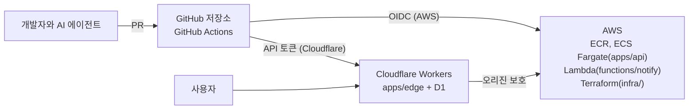

# 1장. 코드는 넘쳐나고, 믿을 수 있는 변경은 부족하다

열에 아홉이다. 2025년 9월에 나온 DORA 보고서가 약 5,000명의 기술 실무자에게 물었더니, 응답자의 90%가 일하면서 AI를 쓰고 있었다. 80% 이상은 AI 덕분에 생산성이 올랐다고 느꼈다. 여기까지는 놀랍지 않다. 주변을 둘러보면 Claude Code나 Copilot 없이 코드를 쓰는 동료를 찾기가 더 어려운 시절이다. 그런데 같은 보고서에는 이런 문장이 함께 실려 있다.

> "AI adoption does continue to have a negative relationship with software delivery stability."

AI 도입은 여전히 소프트웨어 전달 안정성과 음(−)의 관계에 있다는 말이다. "여전히"라는 단어에 눈길이 간다. 한 해 전인 2024년 보고서도 비슷한 경고를 했다. AI 도입이 늘어날수록 전달 처리량은 약 1.5%, 전달 안정성은 약 7.2% 줄어드는 것으로 추정된다고 했다. 2025년에는 처리량 쪽의 관계가 양(+)으로 돌아섰다. 코드가 더 빨리, 더 많이 나오게 된 것이다. 하지만 안정성과의 음의 관계는 그대로 남았다. 30%의 응답자는 AI가 만든 코드를 거의 또는 전혀 신뢰하지 않는다고 답했다.

이 숫자들을 한 문장으로 줄이면 이렇다. 우리는 코드를 전보다 훨씬 쉽게 만들 수 있게 됐지만, 그 코드가 운영 환경에서 멀쩡히 버틸 거라는 확신은 그만큼 늘지 않았다. 그렇다면 그 간극은 무엇이 메워야 할까? 리뷰어의 눈에 맡기기에는 이미 PR이 너무 많다. 누군가의 감에 맡기기에는 변경이 너무 빠르다. 이 책은 그 간극을 메우는 장치로 CI/CD를 다시 불러낸다. 한 개인 블로그는 이 흐름을 이렇게 요약했다.

> "코드를 생성하는 비용이 0에 가까워질수록, 가치의 원천은 생성이 아니라 검증으로 이동한다" — Flowkater.io (2026-03-08)

## CI/CD를 다시 정의해보자

CI/CD라는 말은 너무 익숙해서 오히려 뜻을 곱씹어 볼 기회가 없다. 한번 풀어서 적어보자. CI는 지속적 통합(Continuous Integration), CD는 지속적 전달(Continuous Delivery) 또는 지속적 배포(Continuous Deployment)를 뜻한다. 전달은 언제든 배포할 수 있는 상태를 유지하는 것이고, 배포는 그 상태에서 프로덕션까지 자동으로 밀어 넣는 것이다. 이 책에서는 둘을 굳이 가르지 않고 CI/CD로 묶어 부르겠다.

정의 가운데 가장 마음에 드는 것은 토스가 SLASH 23 발표에서 쓴 한국어 문장이다.

> "CI는 Continuous Integration의 약자로, 변경 사항에 대하여 자동으로 검증을 진행하고 성공했을 때에만 반영하는 것을 말합니다." — 토스 SLASH 23 (2023-10-12)

이 문장의 무게중심은 "자동으로"보다 "성공했을 때에만"에 있다. CI/CD를 자동화 편의로 보면, 사람이 손으로 하던 빌드·테스트·배포를 스크립트가 대신 해주는 도구 모음이 된다. 그렇게 보면 목표는 "덜 귀찮게"다. 반면 검증 장치로 보면 질문 자체가 바뀐다. 이 변경을 main에 합쳐도 되는가? 이 버전을 사용자에게 내보내도 되는가? 내보낸 버전이 정말 돌고 있는가? CI/CD는 이 질문들에 대한 증거를 매번, 똑같은 방식으로 만들어내는 장치가 된다.

이 차이는 생각보다 크다. 자동화 편의 관점에서는 테스트가 느리면 빼고, 배포가 실패하면 재시도 버튼을 누르고, 경고가 많으면 끄는 게 합리적이다. 검증 장치 관점에서는 그 하나하나가 증거를 버리는 행동이다. 사람이 쓴 코드든 AI가 쓴 코드든, 파이프라인을 통과했다는 사실이 "믿어도 된다"는 뜻이 되려면 파이프라인이 무엇을 검증하는지 우리가 설명할 수 있어야 한다.

## 민간요법에서 데이터로

그렇다면 CI가 정말 효과가 있기는 한 걸까? 다행히 이 질문에는 십 년 가까이 쌓인 연구가 있다.

2015년 Vasilescu 등은 GitHub 프로젝트의 이력을 분석해, CI를 도입한 팀이 외부 기여를 더 많이 통합하면서도 코드 품질이 눈에 띄게 떨어지지 않았다는 결과를 냈다. 속도와 품질을 맞바꾼 게 아니었다는 얘기다. 물론 이 연구는 상관관계를 본 관측 연구라서, CI가 원인이라고 단정할 수는 없다. 하지만 "CI를 붙이면 느려지고 번거로워질 뿐"이라는 흔한 반론에 맞설 근거로는 충분하다.

이듬해 Hilton 등은 GitHub 프로젝트 34,544개, 빌드 1,529,291건을 분석하고 개발자 442명에게 설문을 돌렸다. 결론은 CI가 프로젝트의 릴리스를 더 자주 하도록 돕는다는 것이었다. 이 논문의 초록에는 두고두고 인용할 만한 문장이 하나 있다. 개발자와 도구 제작자, 연구자들이 "데이터 대신 민간요법(folklore)에 기대어 결정을 내린다"는 것이다. CI/CD에 관한 팀의 결정 가운데 얼마나 많은 것이 "예전 회사에서 그렇게 했으니까"에 기대고 있는지 떠올려보면, 뜨끔한 지적이다.

그런데 CI를 쓰기만 하면 효과가 저절로 따라올까? 2019년 Felidre 등은 Travis CI를 쓰는 프로젝트 1,270개를 들여다보고, 이들 중 상당수가 CI 도구를 켜두기만 했을 뿐 CI의 관행은 지키지 않는다는 사실을 발견했다. 약 60%는 커밋이 드물었다. 그리고 85%의 프로젝트에서 깨진 빌드가 나흘 넘게 고쳐지지 않은 채 방치된 적이 최소 한 번 있었다. 흥미롭게도 대부분의 빌드는 이른바 "10분 규칙" 안에 끝났다. 빌드는 빨랐는데, 빨간 불이 켜져도 아무도 서두르지 않았던 것이다. 연구진은 이 상태에 "CI 극장(Continuous Integration Theater)"이라는 이름을 붙였다.

CI 극장이라는 말을 들으면 뒷맛이 찜찜하다. 우리 팀 저장소에도 초록색 배지가 달려 있고, PR마다 체크가 돌아간다. 그런데 그 체크가 실패하면 누가, 언제, 무엇을 멈추는가? "CI를 돌리고 있다"와 "CI가 작동한다"는 전혀 다른 문장이다. 이 책이 줄곧 붙들고 갈 구분이기도 하다.

## 성공을 재는 자: DORA 지표 다섯 개

검증이 잘 되고 있는지는 무엇으로 알 수 있을까? 느낌으로 재면 금세 민간요법으로 돌아간다. 그래서 이 책은 하나의 자를 정해두고 간다. DORA 지표다.

원전은 2018년 Forsgren, Humble, Kim이 쓴 『Accelerate』다. 여러 해에 걸친 State of DevOps 조사를 통계적으로 분석해 소프트웨어 전달 성과를 재는 네 가지 지표(배포 빈도, 변경 리드타임, 변경 실패율, 복구 시간)를 제시했고, 속도와 안정성이 서로를 깎아 먹는 관계가 아니라는 주장을 폈다. 그 뒤 DORA는 지표를 조금씩 다듬어 왔고, 2024년부터 dora.dev가 제시하는 현행 지표는 다섯 가지다.

| 지표 | 묻는 질문 |
|---|---|
| 변경 리드타임 | 커밋이 프로덕션에 닿기까지 얼마나 걸리는가 |
| 배포 빈도 | 얼마나 자주 프로덕션에 배포하는가 |
| 실패 배포 복구 시간 | 배포가 실패했을 때 되돌리거나 고치는 데 얼마나 걸리는가 |
| 변경 실패율 | 배포 가운데 문제를 일으킨 비율은 얼마인가 |
| 배포 재작업률 | 사고를 수습하려고 계획에 없던 배포를 치른 비율은 얼마인가 |

마지막 배포 재작업률은 2024년에 새로 들어온 지표로, 사고를 수습하려고 계획에 없이 치른 배포가 얼마나 되는지를 본다(사실 확인 필요). 앞의 두 지표가 얼마나 빨리 흘려보내는지를 본다면, 뒤의 지표들은 흘려보낸 것이 얼마나 자주 말썽을 부리고 그걸 얼마나 빨리 수습하는지를 본다. 이 책에서 원전의 네 지표를 말할 때는 "Accelerate의 원전 지표"라고 구분해 부르고, 그냥 DORA 지표라고 하면 이 다섯 가지를 가리킨다.

이 자를 먼저 꺼내 두는 이유가 있다. 앞으로 나올 기법은 모두 이 다섯 지표 중 하나 이상을 움직이려는 시도다. 캐시와 러너를 고르는 일은 리드타임을 줄이려는 것이고, 카나리 배포는 변경 실패율의 피해 반경을 줄이려는 것이며, 롤백 절차를 스크립트로 만들어두는 것은 복구 시간을 줄이려는 것이다. 어떤 기법이 이 중 무엇도 움직이지 못한다면, 그 기법을 들이는 이유를 다시 물어보는 편이 낫다.

## AI는 증폭기다

다시 처음의 숫자로 돌아가보자. AI를 쓰는 사람은 늘었고, 처리량은 올랐는데, 안정성은 여전히 흔들린다. 이걸 어떻게 해석해야 할까? 2025년 DORA 보고서는 한 문장으로 답한다.

> "AI doesn't fix a team; it amplifies what's already there."

AI는 팀을 고쳐주지 않는다. 이미 있는 것을 증폭할 뿐이다. 테스트가 탄탄하고 배포가 작은 단위로 쪼개져 있고 롤백이 몸에 밴 팀이라면, AI는 검증된 변경을 더 빨리 흘려보내는 가속 페달이 된다. 반대로 테스트가 듬성듬성하고 배포가 한 달에 한 번 몰아치는 팀이라면, AI는 검증되지 않은 변경을 더 빨리 쌓아 올리는 장치가 된다. 같은 도구가 팀에 따라 정반대의 결과를 낸다는 게 증폭기라는 말의 뜻이다.

이 관점은 이 책의 여러 근거가 서로 다른 층위에서 같은 결론을 내고 있다는 점에서 더 설득력을 얻는다. 고전 연구는 CI가 품질을 잃지 않고 처리량을 올린다고 했다. DORA는 작은 배치와 테스트 같은 기본기가 성과를 가른다고 말해 왔다. 그리고 최근의 에이전트 PR 연구는, 머지되지 못한 에이전트 PR일수록 변경이 크고 건드린 파일이 많으며 프로젝트의 CI/CD 검증을 통과하지 못한 경우가 많다고 보고한다. 사람이 쓰든 에이전트가 쓰든, 작고 초록색인 변경이 살아남는다.

AI가 개발자를 얼마나 빠르게 만드는지에 대해서는 연구마다 숫자가 다르고, 심지어 부호가 뒤집히기도 한다. 이 숫자들은 11장에서 나란히 놓고 따져보자. 지금 기억해둘 것은 하나다. AI가 무엇을 증폭할지는 AI가 정하지 않는다. 그 방향을 정하는 것은 우리가 깔아둔 파이프라인이다. 한 GeekNews 사용자의 말이 이 지점을 잘 짚는다.

> "코드를 빨리 만들었다는 것은 일을 끝낸 것이 아니라, 그 코드가 작동한다는 증거를 만드는 단계로 일을 넘긴 것"

## 이 책의 지도: 확신, 보안, 유연성

파이프라인을 설계하다 보면 늘 무언가를 맞바꾸게 된다. 테스트를 더 돌리면 안심이 되지만 느려진다. 시크릿을 넓게 열어두면 편하지만 위험해진다. 설정을 자유롭게 열어두면 강력하지만 쓰기 어려워진다. 2017년 Hilton 등은 개발자 인터뷰와 두 차례의 설문으로 이 긴장을 세 축으로 정리했다.

> "developers face trade-offs between speed and certainty (Assurance), between better access and information security (Security), and between more configuration options and greater ease of use (Flexibility)."

속도와 확실성 사이의 긴장은 확신(Assurance), 접근성과 정보 보안 사이의 긴장은 보안(Security), 설정 자유도와 사용 편의 사이의 긴장은 유연성(Flexibility)이다. 이 세 축을 책의 지도로 삼자. 각 장이 어느 축을 다루는지 알고 읽으면, 기법들이 따로 노는 팁이 되지 않고 하나의 설계 안에서 제자리를 찾는다.

| 부분 | 장 | 주로 다루는 축 |
|---|---|---|
| 뼈대 | 2~3장 | 유연성, 확신 |
| 신뢰 | 4~5장 | 보안 |
| 배포 | 6~8장 | 확신 |
| AI 시대의 파이프라인 | 9~11장 | 세 축 모두 |
| 종합 | 12장 | 세 축의 회수 |

순서에 대해 한 가지만 짚고 가자. 배포를 다루는 6~8장보다 보안을 다루는 4~5장이 먼저 나온다. 일부러 그렇게 짰다. 실무에서 가장 흔한 순서는 장기 액세스 키로 배포하는 법을 먼저 배우고, 한참 뒤에 그 키가 어디에 복사돼 있는지 모른다는 걸 깨닫고 고치는 것이다. 책까지 그 실수의 순서를 따라갈 이유는 없다. 파이프라인이 무엇으로 클라우드에 들어가는지, 파이프라인 안으로 무엇이 들어오는지를 먼저 다진 다음에 배포로 넘어가자.

AI를 다루는 9~11장이 뒤쪽에 모여 있는 것도 같은 이유다. AI가 증폭기라면 증폭할 기본기가 먼저 있어야 한다. 그렇다고 AI 코딩 도구를 쓰는 독자가 9장까지 기다려야 하는 것은 아니다. 2~8장에는 장마다 `AI와 함께 쓸 때`라는 짧은 소절을 두었다. 그 장의 기본기를 AI 코딩 도구와 함께 쓸 때 바로 적용할 수 있는 조언 하나씩이다.

## 러닝 예제: ticketbox

원칙만 늘어놓으면 손에 잡히지 않는다. 그래서 책 전체에 걸쳐 하나의 가상 서비스를 함께 키워 가려 한다. 이름은 `ticketbox`다. 다섯 명짜리 스타트업이 운영하는 작은 공연 티켓 예매 서비스다. 평소에는 한산하다가 인기 공연의 예매가 열리는 순간 트래픽이 치솟는다. 이런 서비스에서 배포 실수는 곧 매출 손실이고, 그래서 조금씩 내보내고 빨리 되돌리는 능력이 실제로 중요해진다.

`ticketbox`는 GitHub 조직의 프라이빗 모노레포 하나에 들어 있고, 네 덩어리로 이뤄진다.

| 구성 요소 | 하는 일 | 배포 대상 |
|---|---|---|
| `apps/edge` | SPA 정적 에셋과 엣지 API 라우팅, 공지·대기열 메타데이터 | Cloudflare Workers(정적 에셋) + D1 |
| `apps/api` | 예매 API(컨테이너) | AWS ECS(Fargate) + ALB, RDS |
| `functions/notify` | 예매 알림 발송 | AWS Lambda |
| `infra/` | AWS 인프라 정의 | Terraform |

사용자의 요청은 Cloudflare를 먼저 거친다. 정적 화면과 가벼운 라우팅은 Workers가 처리하고, 실제 예매는 AWS의 API가 받는다. 환경은 `preview`, `staging`, `production` 세 가지이고, AWS 리전은 `ap-northeast-2`(서울)를 쓴다. 팀원들은 Claude Code와 Copilot으로 코드를 쓰고 있고, 요즘 들어 PR이 눈에 띄게 늘었다.

지금 `ticketbox`의 배포는 어떻게 이뤄지고 있을까? 솔직히 말하면 누군가의 노트북에서 이뤄진다. 팀에서 가장 오래 일한 개발자의 노트북에 `~/.aws`의 장기 액세스 키와 `wrangler` 로그인 세션이 들어 있고, 그 노트북에서 `./deploy.sh`를 돌리면 이미지가 빌드되고 ECS 서비스가 갱신되고 Workers가 올라간다. 몇 달 전 누군가 이 스크립트를 GitHub Actions로 옮겨보겠다며 280줄짜리 `deploy.yml`을 만들었지만, 한 번 크게 데인 뒤로는 아무도 그 워크플로를 믿지 않는다. main 브랜치에는 보호 규칙이 없고, 테스트는 PR에서 돌긴 하지만 실패해도 머지할 수 있다. 배포가 성공했는지는 배포한 사람이 브라우저를 열어 몇 번 눌러보는 것으로 판단한다.

낯선 풍경일까? 아마 많은 팀에게 그렇지 않을 것이다. 그리고 이 상태에서 AI 코딩 도구로 PR 수가 두세 배로 늘어난다고 생각해보자. 노트북 한 대와 사람의 눈 몇 쌍이 감당할 수 있는 양이 아니다. 난감한 일이다.

장마다 이 `ticketbox`에 파이프라인을 한 조각씩 붙여 나간다. 2장에서는 280줄짜리 워크플로를 얇게 만들고, 4장에서는 노트북 속 장기 키를 없애고, 6~8장에서는 두 플랫폼에 점진 배포와 롤백을 붙이고, 9~11장에서는 AI 에이전트를 파이프라인 안으로 들인다. 12장에 이르면 아래 그림 같은 모습이 된다.

그림 1. ticketbox의 목표 아키텍처: GitHub Actions가 Cloudflare와 AWS 양쪽으로 변경을 내보낸다

그림의 두 화살표에 붙은 라벨이 서로 다르다는 데 주목하자. AWS 쪽은 OIDC로 짧게 사는 자격증명을 받아 들어가지만, Cloudflare 쪽은 API 토큰을 쓴다. 이 비대칭이 왜 생기고 어떻게 다뤄야 하는지는 4장의 주제다. 한 가지 더 일러둘 것이 있다. 책에 나오는 `ticketbox` 코드는 완전한 저장소가 아니라 설명에 필요한 부분만 잘라낸 발췌다. 버전·가격·기능 상태는 모두 2026년 9월 기준이다.

## 우리 팀은 어디쯤일까

책장을 넘기기 전에, 세 가지 질문에 스스로 답해보자. 가볍게 답해보면 된다. 지금 우리 팀의 파이프라인이 무대 위의 극장인지, 실제로 일하는 검증 장치인지 가늠해보는 질문이다.

첫째, 최근 석 달 안에 main 브랜치의 빌드가 깨진 채로 하루 넘게 방치된 적이 있는가?

둘째, 방금 한 배포가 정말로 새 버전으로 돌고 있다는 것을, 배포 로그의 초록색 체크 말고 무엇으로 확인하는가?

셋째, 팀원이나 AI 에이전트가 연 PR이 머지되기 전에 반드시 통과해야 하는 검사를 빠짐없이 말할 수 있는가? 그리고 그 검사를 누가 끌 수 있는가?

셋 중 하나라도 대답이 망설여진다면, 그 망설임이 이 책의 출발점이다.
