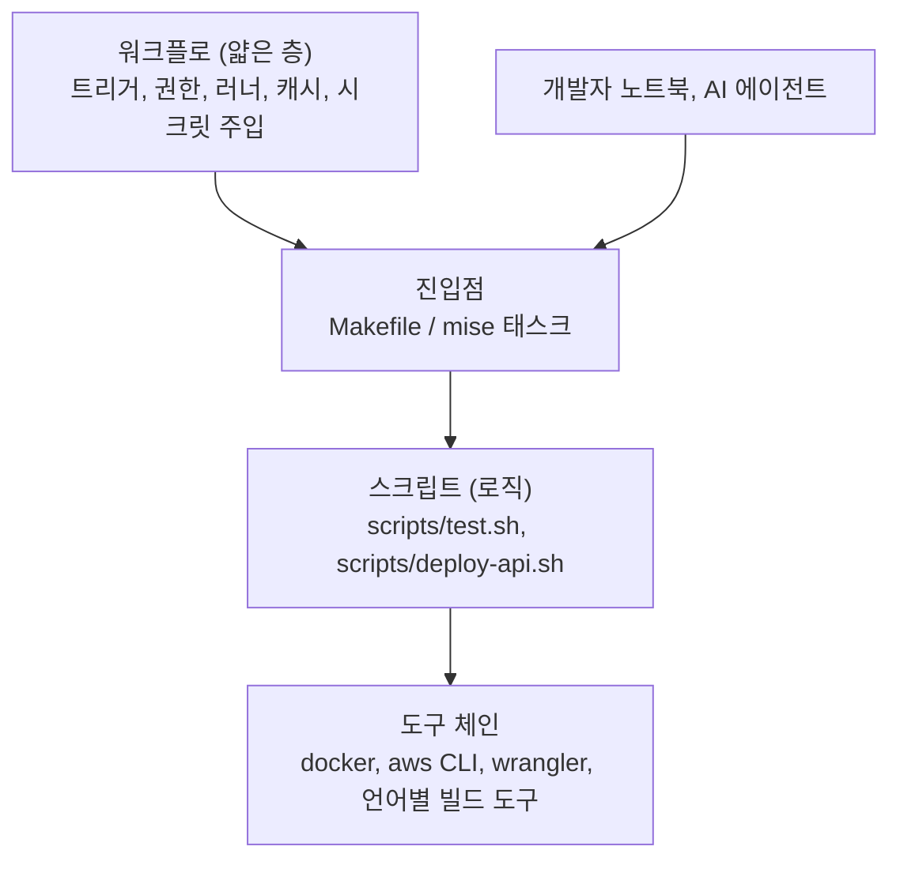

# 2장. 워크플로는 멍청하게, 로직은 스크립트로

2026년 1월, Hacker News에 "I hate GitHub Actions with passion"이라는 제목의 글이 올라왔다. 제목부터 감정이 실린 이 글에는 공감하는 댓글이 줄을 이었는데, 그중 한 사용자가 남긴 두 문장이 이 스레드의 요지를 잘 담고 있다.

> "The pain is real. I think everyone that's ever used GitHub actions has come to this conclusion. An ideal action has 2 steps: (1) check out the code, (2) invoke a sane script that you can test locally." — iamcalledrob (HN, 2026-01)

이상적인 워크플로는 두 단계면 충분하다는 것이다. 코드를 체크아웃하고, 로컬에서도 테스트할 수 있는 멀쩡한 스크립트를 부른다. 너무 단순해서 반박하고 싶어질 정도다. 그렇다면 이 말을 1장에서 만난 `ticketbox`의 280줄짜리 `deploy.yml`과 나란히 놓아보자. 아래는 그중 일부다.

```yaml
# .github/workflows/deploy.yml (280줄 중 일부 — 따라 하지 말 것)
name: deploy
on:
  push:
    branches: [main]
jobs:
  deploy:
    runs-on: ubuntu-latest
    steps:
      - uses: actions/checkout@v7
      - name: Configure AWS
        run: |
          aws configure set aws_access_key_id ${{ secrets.AWS_ACCESS_KEY_ID }}
          aws configure set aws_secret_access_key ${{ secrets.AWS_SECRET_ACCESS_KEY }}
          aws configure set region ap-northeast-2
      - name: Build and deploy api
        if: ${{ contains(github.event.head_commit.message, '[api]') || contains(github.event.head_commit.message, '[all]') }}
        run: |
          TAG=$(date +%Y%m%d%H%M)
          if [ "${{ github.ref_name }}" = "main" ]; then ENV=production; else ENV=staging; fi
          aws ecr get-login-password | docker login --username AWS --password-stdin 123456789012.dkr.ecr.ap-northeast-2.amazonaws.com
          docker build -t 123456789012.dkr.ecr.ap-northeast-2.amazonaws.com/ticketbox-api:$TAG apps/api
          docker push 123456789012.dkr.ecr.ap-northeast-2.amazonaws.com/ticketbox-api:$TAG
          # ... 태스크 정의 JSON을 sed로 고쳐 쓰는 40줄 ...
          for i in 1 2 3; do
            aws ecs update-service --cluster ticketbox-$ENV --service api --force-new-deployment && break
            sleep 10
          done
      - name: Deploy edge
        if: ${{ contains(github.event.head_commit.message, '[edge]') || contains(github.event.head_commit.message, '[all]') }}
        run: |
          cd apps/edge && npm ci && npm run build
          npx wrangler deploy --env $ENV
```

이 YAML을 처음 본 순간 어딘가 찜찜하지 않은가? 커밋 메시지에 `[api]`를 붙여야 API가 배포되고, 이미지 태그는 빌드한 시각이며, `update-service`가 실패하면 조용히 세 번까지 재시도한다. 게다가 마지막 스텝의 `$ENV`는 비어 있다. 앞 스텝에서 정한 셸 변수는 다음 스텝으로 넘어가지 않기 때문이다. 이 사실을 팀이 알게 된 경로도 뻔하다. main에 푸시하고, 기다리고, 빨간 X를 보고, 한 줄 고쳐 다시 푸시한다. 이 파일의 커밋 이력에 "fix ci"가 일곱 번 연달아 찍혀 있는 데는 이유가 있다.

## 워크플로의 해부: 필요한 만큼만

무엇이 문제인지 짚으려면 GitHub Actions의 부품 이름을 맞춰둘 필요가 있다. 깊이 들어가지는 않고, 이 장의 논의에 필요한 만큼만 살펴보자.

워크플로(`workflow`)는 `.github/workflows/` 아래에 있는 YAML 파일 하나다. `push`, `pull_request`, `schedule` 같은 이벤트가 일어나면 실행된다. 워크플로 안에는 하나 이상의 잡(`job`)이 있다. 잡은 각자 별도의 러너(`runner`), 즉 깨끗한 가상 머신이나 컨테이너 위에서 돌고, 따로 지정하지 않으면 서로 병렬로 실행된다. 순서가 필요하면 `needs`로 이어준다. 잡 안에는 스텝(`step`)이 순서대로 놓인다. 같은 잡의 스텝들은 파일 시스템을 공유하지만, `run:` 스텝은 저마다 새 셸 프로세스에서 돈다. 앞의 `$ENV`가 사라진 이유가 여기에 있다. 스텝 가운데 `uses:`로 다른 사람이 만든 재사용 단위를 불러오는 것이 액션(`action`)이다. `actions/checkout`이 대표적이다.

이 책에서는 액션을 `actions/checkout@v7`처럼 메이저 태그로 적는다. 버전은 2026년 9월 기준이다. 다만 태그는 누군가 옮길 수 있고, 그게 어떤 사고로 이어지는지 5장에서 보고 나면 이 표기를 바꿀 것이다.

부품이 하나 더 있다. 워크플로 전체를 다른 워크플로에서 불러 쓰는 재사용 워크플로(`reusable workflow`)다. 조직 안에서 파이프라인을 표준화할 때 주로 쓰는데, 2025년 11월부터 중첩은 10단계까지, 한 실행에서 호출할 수 있는 워크플로는 50개까지로 한도가 늘었다. 한도가 넉넉해졌다는 건 그만큼 깊고 넓게 얽을 수 있게 됐다는 뜻이기도 하다. 이 이야기는 장 뒤쪽에서 다시 하자.

이렇게 부품을 늘어놓고 보면 한 가지가 눈에 들어온다. 워크플로는 무엇을 언제 어디서 돌릴지 정하는 데는 훌륭한 도구다. 반면 "무엇을" 자체, 즉 빌드하고 테스트하고 배포하는 로직을 담기에는 여러모로 불편하다. 디버거가 없고, 로컬에서 돌려볼 수 없고, YAML 문자열 안에 셸과 표현식(`${{ }}`)이 뒤섞인다.

## 280줄 안에서 새는 것들

부품 이름을 맞췄으니 앞의 `deploy.yml`을 다시 들여다보자. 무엇이 문제인지 하나씩 짚어보면, 단순히 "길어서 보기 싫다"보다 훨씬 구체적인 결함들이 드러난다.

첫째, 배포 여부가 커밋 메시지에 묶여 있다. `[api]`를 빠뜨리면 API는 배포되지 않고, 오타를 내면 아무것도 배포되지 않는데 워크플로는 초록색으로 끝난다. 무엇이 배포돼야 하는지는 코드가 바뀐 경로가 알려주는 편이 정확하다. 이 이야기는 3장의 모노레포 절에서 이어간다.

둘째, 재시도 루프가 실패를 삼킨다. `update-service`가 세 번 다 실패해도 루프는 조용히 끝나고, 다음 스텝이 이어서 돈다. 빌드 깨짐을 다룬 한 대규모 연구는 재시도나 대기 같은 조치가 빌드 시간을 늘릴 뿐 통과를 보장하지도 않는다고 보고했다. 실패는 숨길 대상이 아니다. 드러나야 고칠 수 있다.

셋째, 이미지 태그가 빌드 시각이다. 지금 돌고 있는 이미지가 어느 커밋에서 나왔는지 알려면 시각을 거꾸로 추적해야 한다. 커밋 SHA로 태그를 다는 이유와 방법은 6장에서 다룬다.

넷째, 장기 액세스 키가 셸 명령 안에 박혀 있다. 이 키가 언제 누가 넣은 것이고 어디에 또 복사돼 있는지는 4장의 첫 장면이 된다.

이 넷보다 더 근본적인 문제가 하나 남는다. 위의 결함 하나하나를 고치려 해도, 고친 결과를 확인할 곳이 러너밖에 없다는 점이다. 그렇다면 이렇게 고쳐보면 어떨까? 긴 `run:` 블록을 컴포지트 액션으로 묶고, 환경별 분기는 재사용 워크플로의 입력으로 받는다. 파일은 여러 개로 쪼개지고 보기에는 한결 정돈된다. 하지만 이것도 찜찜하다. 로직은 여전히 YAML과 표현식 안에 있고, 여전히 푸시해야만 돌려볼 수 있다. 정리한 것은 겉모습뿐이고, 피드백 루프는 그대로다.

## 이상적인 액션은 두 단계다

셸 한 줄을 고칠 때마다 푸시하고 기다려야 하는 구조, 이것이 핵심이다. 커뮤니티에서 가장 많이, 가장 감정적으로 나오는 불만이 바로 이 "푸시하고, 기다리고, 빨간 X를 보는" 피드백 루프다. 같은 스레드의 다른 사용자는 해법을 이렇게 요약했다.

> "Don't have logic in your workflows. Workflows should be dumb and simple (KISS) and they should call your scripts. ... Having standalone scripts will allow you to develop/modify and test locally without having to get caught in a loop of hell." — 1a527dd5 (HN)

또 다른 사용자는 이것이 GitHub Actions만의 문제도 아니라고 덧붙였다. 로직은 스크립트로 가고, CI는 체크아웃·도구 설치·아티팩트·캐시 같은 CI 고유의 일만 맡는다. 어떤 CI를 쓰든 이렇게 하지 않으면 고생한다는 것이다. 이 휴리스틱을 실천하는 방식은 여러 가지다. 얇은 `Makefile`을 두는 팀도 있고, mise의 태스크 기능을 쓰는 팀도 있고, 아예 프로젝트 언어로 CI 로직을 짜는 팀도 있다. 어느 쪽이든 핵심은 같다. 개발자의 노트북에서 똑같이 돌아가야 한다.

이 원칙을 지키면 무엇이 좋아질까? 먼저 디버깅이 로컬로 돌아온다. 스크립트가 실패하면 노트북에서 같은 명령을 돌려 보면 된다. 다음으로, 워크플로 파일이 거의 바뀌지 않게 된다. 한 연구는 워크플로 파일의 7.3%가 매주 바뀐다고 보고했는데, 로직을 스크립트로 빼면 바뀌는 곳이 YAML 밖으로 옮겨가서 리뷰하기도 테스트하기도 쉬워진다. 그리고 비용 논리로 같은 결론에 도달한 사람도 있다. GitHub Actions 가격 변경 논의에서 한 사용자는 이렇게 썼다.

> "There's always been this lesson with CI/CD - don't couple yourself to a specific product. If you do, you're gonna get screwed eventually. It happened with TravisCI, CircleCI, now it's happening with GitHub." — physicsguy (HN)

특정 CI 제품에 로직을 묶어두면 언젠가 옮겨야 할 때 대가를 치른다. 로직이 스크립트에 있으면 CI를 바꿔도 새로 짜야 하는 것은 얇은 껍데기뿐이다. 8장에서 GitHub Actions 자체가 멈췄을 때의 수동 배포 런북을 다루는데, 그 런북이 현실적인 문서가 되는 것도 로직이 이미 스크립트로 빠져 있기 때문이다.

아래 그림은 이 장이 권하는 층 구조다.


그림 1. 워크플로는 무엇을 언제 돌릴지만 정하고, 로직은 로컬에서도 도는 층에 둔다

그림에서 눈여겨볼 곳은 진입점으로 들어오는 화살표가 둘이라는 점이다. CI도, 개발자도, 뒤에서 이야기할 AI 에이전트도 같은 문으로 들어온다.

## 반론도 들어보자

물론 이 원칙에도 반론은 있다. 가장 날카로운 것은 이런 질문이다.

> "How do you orchrestate a full CI/CD pipeline where you need state? You just move that complex logic to another monolithic script with its own problems?" — mlrtime (HN)

상태가 필요한 오케스트레이션은 어떻게 하느냐는 것이다. 잡 사이의 의존 관계, 승인 대기, 여러 환경에 차례로 내보내기 같은 흐름을 전부 스크립트 하나로 옮기면, 결국 또 다른 거대한 스크립트가 생길 뿐이지 않느냐는 반문이다. 옳은 지적이다. 그래서 경계를 이렇게 그어보자. 잡의 순서, 병렬화, GitHub 환경(environment)의 승인 규칙, 잡 사이의 아티팩트 전달처럼 플랫폼이 잘하는 조율은 워크플로에 남긴다. 각 잡이 실제로 수행하는 일, 즉 빌드·테스트·배포의 내용은 스크립트로 뺀다. 워크플로는 지휘자이고, 연주는 스크립트가 맡는 셈이다.

두 번째 논쟁은 스크립트를 무엇으로 쓰느냐다. 한쪽은 "셸 이상의 것이 필요해지면 그 자체가 냄새"라고 말하고, 다른 쪽은 "디버거가 있는 도구로만 로직을 구현하라"고 말한다. 둘 다 일리가 있다. 명령 몇 개를 이어 붙이는 접착제는 셸로 충분하다. 하지만 조건 분기가 늘고 JSON을 주무르기 시작하면, 앞의 예처럼 `sed`로 태스크 정의를 고쳐 쓰는 순간이 오면, 프로젝트 언어로 옮길 때가 된 것이다. 셸 스크립트를 쓴다면 첫 줄에 `set -euo pipefail`을 두는 습관만큼은 들여두자. 실패를 삼키지 않게 해준다.

세 번째는 도구에 대한 기대다. 워크플로를 로컬에서 돌려주는 `act` 같은 도구가 있는데, 굳이 스크립트로 뺄 필요가 있을까? 써본 사람들의 평가는 대체로 "80%짜리"라는 쪽으로 모인다. 단순한 워크플로는 잘 돌지만, Postgres 같은 서비스 컨테이너를 붙이면 네트워킹에서 막히는 식의 이슈가 꾸준히 보고된다. 반대로 "GitHub 환경을 완벽히 재현하진 못해도 내 용도엔 충분하고 아주 편하다"는 목소리도 있다. 정리하면 `act`는 단순한 워크플로의 문법을 빨리 확인하는 용도로 좋고, 로직을 로컬에서 검증하는 주된 수단은 여전히 스크립트다. 러너 위에서만 재현되는 실패를 파고들어야 한다면, 실패한 러너에 원격 셸로 붙는 upterm(`action-upterm`) 같은 도구를 쓰는 방법도 있다. 비슷한 용도로 널리 쓰이던 action-tmate는 기반 서비스인 tmate.io의 공식 중계 서버가 종료를 예고하면서, upterm 쪽으로 옮겨 가는 프로젝트가 늘고 있다(2026년 9월 기준).

## ticketbox의 첫 워크플로

이제 `ticketbox`에 첫 번째 제대로 된 워크플로를 만들어보자. 목표는 소박하다. PR과 main 푸시마다 테스트를 돌리고, 그 테스트를 개발자가 노트북에서 똑같이 돌릴 수 있게 하는 것이다. 진입점은 저장소 루트의 `Makefile`이다.

```makefile
# Makefile (발췌) — CI와 사람과 에이전트가 모두 이 문으로 들어온다
.PHONY: ci lint test deploy-api deploy-edge

ci: lint test

lint:
	./scripts/lint.sh

test:
	./scripts/test.sh

deploy-api:
	./scripts/deploy-api.sh $(ENV)

deploy-edge:
	./scripts/deploy-edge.sh $(ENV)
```

스크립트를 뺄 때 한 가지 규칙을 같이 정해두면 좋다. 스크립트는 필요한 값을 인자와 환경 변수로만 받는다. 워크플로 문법인 `${{ }}`는 스크립트 안에 들어가지 않고, 워크플로가 그 값을 환경 변수로 넘겨주는 역할만 맡는다. 이렇게 하면 노트북에서는 `ENV=staging make deploy-api`처럼 같은 값을 손으로 넣어 똑같이 돌릴 수 있다. 덤으로 보안상 이점도 생긴다. PR 제목 같은 외부 입력을 `run:` 안에 표현식으로 곧장 넣지 말고 중간 환경 변수로 넘기라는 것이 GitHub 공식 보안 가이드의 권고이기도 한데, 그 이유는 5장에서 사고 사례와 함께 보자.

노트북과 러너가 같은 결과를 내려면 도구 버전도 맞아야 한다. 러너에는 최신 Node가, 노트북에는 반년 전 Node가 깔려 있다면 "내 자리에서는 되는데"가 다시 시작된다. 언어 런타임과 CLI 도구의 버전은 저장소 안의 파일 하나로 못 박아두고, CI도 그 파일을 읽어 설치하게 하자. mise 같은 도구가 이 일을 잘한다. 어떤 도구를 쓰든 기준은 하나다. 버전을 정하는 곳이 워크플로 YAML 안에만 있으면 안 된다.

그리고 워크플로는 정말로 두 단계다.

```yaml
# .github/workflows/ci.yml
name: ci
on:
  pull_request:
  push:
    branches: [main]

permissions:
  contents: read

concurrency:
  group: ci-${{ github.ref }}
  cancel-in-progress: ${{ github.event_name == 'pull_request' }}

jobs:
  test:
    runs-on: ubuntu-24.04
    timeout-minutes: 15
    steps:
      - uses: actions/checkout@v7
      - run: make ci   # 언어 런타임 설치 스텝은 생략했다
```

몇 줄 안 되지만 하나하나 이유가 있다. 트리거는 `pull_request`와 main의 `push`다. PR에서 한 번 검증하고, 머지된 결과를 main에서 다시 확인한다. `permissions:` 블록은 이 워크플로가 받는 `GITHUB_TOKEN`을 저장소 내용 읽기로 제한한다. 테스트를 돌리는 데 쓰기 권한은 필요 없다. 앞으로 모든 예제 워크플로의 맨 위에 이 블록을 두는데, 왜 기본값에 기대지 말고 명시해야 하는지는 5장에서 근거와 함께 살펴보자. `timeout-minutes`는 멈춘 테스트가 러너 시간을 끝없이 잡아먹지 않게 막는다.

concurrency는 두 얼굴을 가진 설정이다. PR에서는 같은 브랜치에 새 커밋이 올라오면 이전 실행을 취소하는 게 맞다. 이미 낡은 커밋을 끝까지 검증할 이유가 없으니까. 위 설정은 PR일 때만 `cancel-in-progress`가 켜지도록 표현식을 썼다. 반면 배포는 사정이 다르다. 배포 도중에 다음 배포가 들어왔다고 앞의 것을 취소하면, 반쯤 갱신된 상태가 남을 수 있다. 배포는 취소하지 말고 줄을 세우는 편이 낫다.

예전에는 줄 세우기가 생각만큼 되지 않았다. 동시성 그룹 하나에는 실행 중인 것 하나와 대기 중인 것 하나만 있을 수 있었고, 새 실행이 들어오면 대기 중이던 것이 취소되고 교체됐다. 2026년 5월부터는 그룹당 최대 100개의 실행이나 잡을 들어온 순서대로(FIFO) 대기시킬 수 있다. `ticketbox`의 배포 워크플로는 이렇게 시작한다.

```yaml
# .github/workflows/deploy.yml (얇아진 모습 — 자격증명은 4장에서 채운다)
name: deploy
on:
  push:
    branches: [main]

permissions:
  contents: read

concurrency:
  group: deploy-production
  cancel-in-progress: false
  queue: max

jobs:
  deploy-api:
    runs-on: ubuntu-24.04
    environment: production
    steps:
      - uses: actions/checkout@v7
      # AWS 자격증명 스텝은 4장에서 OIDC로 추가한다
      - run: make deploy-api ENV=production
```

`queue: max`는 `cancel-in-progress: true`와 함께 쓸 수 없다는 점을 기억해두자. 줄을 세우겠다면서 앞사람을 내보내는 설정은 말이 되지 않으니 당연한 제약이다. 280줄짜리 파일에 있던 이미지 빌드, 태스크 정의 수정, 서비스 갱신은 모두 `scripts/deploy-api.sh`로 옮겨갔다. 그 스크립트의 속은 6장에서 채운다. 지금 중요한 것은 `make deploy-api ENV=staging`을 노트북에서 돌리면 CI와 똑같은 일이 일어난다는 사실이다.

야간에 도는 작업도 하나 있다. 공연 데이터 정합성을 밤마다 점검하는 스케줄 워크플로다. cron 표현식은 UTC 기준이라, 예전에는 "새벽 3시"를 원하면 머릿속으로 9시간을 빼서 `0 18 * * *`처럼 적어야 했다. 2026년 3월부터는 cron과 함께 IANA 타임존을 지정할 수 있다.

```yaml
on:
  schedule:
    - cron: "0 3 * * *"
      timezone: "Asia/Seoul"
```

`timezone`은 `cron`과 같은 항목 안에 나란히 둔다. 공식 문서의 예제도 이 형태다.

## 표준화의 폭발 반경

워크플로를 얇게 만들고 나면 다음 욕심이 생긴다. 이 좋은 구조를 조직의 모든 저장소에 퍼뜨리고 싶어진다. 이때 쓰는 도구가 앞서 말한 재사용 워크플로다. 공통 CI 절차를 한 곳에 두고 여러 저장소에서 `uses:`로 부르면, 표준을 한 번 고쳐서 모두에게 적용할 수 있다.

그런데 이 장점은 그대로 위험이기도 하다. 토스는 2023년 SLASH 23에서 GoCD 기반의 파이프라인 템플릿 운영 경험을 이렇게 전했다.

> "Template을 수정하면 많은 Pipeline에 한 번에 적용되기 때문에 실수를 했을 때 영향이 굉장히 큽니다." — 토스 SLASH 23

도구는 달라도 원리는 같다. 재사용 워크플로의 한 줄 실수는 그것을 부르는 모든 저장소의 파이프라인을 한꺼번에 멈추거나, 더 나쁘게는 조용히 틀리게 만든다. 그래서 토스가 권한 것처럼, 공통 템플릿을 바꿀 때는 일부 파이프라인에서 먼저 검증한 뒤 넓히는 편이 낫다. 파이프라인 자체도 배포 대상처럼 다루자는 얘기다.

두 번째 안전장치는 사람의 리뷰다. 워크플로 파일은 코드가 어떻게 검증되고 어디로 배포되는지를 정하는 파일이다. 그 파일을 바꾸는 PR은 일반 기능 PR과 다른 눈으로 봐야 한다. GitHub의 공식 보안 가이드도 워크플로 파일을 CODEOWNERS로 보호하라고 권한다. `ticketbox`에서는 워크플로뿐 아니라 로직이 옮겨간 곳까지 함께 묶어둔다.

```text
# .github/CODEOWNERS (발췌)
/.github/workflows/   @ticketbox/platform
/Makefile             @ticketbox/platform
/scripts/             @ticketbox/platform
```

로직을 스크립트로 뺐다면, 스크립트도 파이프라인의 일부다. CODEOWNERS를 워크플로 디렉터리에만 걸어두면 정작 배포 로직이 바뀌는 PR은 아무 제약 없이 지나간다. 다섯 명짜리 팀에서 `@ticketbox/platform`이 결국 두 명뿐이더라도, 브랜치 보호 규칙에서 코드 오너의 리뷰를 필수로 켜두면 이 경로들의 변경에는 그 두 사람 중 한 명의 승인이 반드시 따라붙는다. 파일을 적어두는 것만으로는 리뷰 요청이 갈 뿐이니, 필수 설정까지 함께 챙기자.

### AI와 함께 쓸 때

AI 코딩 에이전트는 코드를 고친 뒤 스스로 빌드하고 테스트해서 변경을 검증하려 한다. 그때 무슨 명령을 쓸지는 지시 파일에서 읽는다. GitHub는 2025년 8월 Copilot의 에이전트가 `AGENTS.md`를 읽도록 지원하면서, 지시 파일로 Copilot에게 프로젝트를 "어떻게 빌드하고, 테스트하고, 변경을 검증할지" 안내할 수 있다고 설명했다. 같은 에이전트가 `CLAUDE.md`, `.github/copilot-instructions.md` 같은 파일도 함께 읽는다.

이 말을 뒤집어 보면, 지시 파일에 적은 빌드·테스트 명령은 사실상 또 하나의 CI 정의다. 문제는 두 정의가 어긋날 때 생긴다. `AGENTS.md`에는 `npm test`라고 적혀 있는데 CI는 `make ci`로 린트까지 돈다면, 에이전트는 로컬에서 초록불을 보고 PR을 올리고, CI에서는 빨간 X를 받는다. 사람이 그 차이를 메우느라 번거로운 왕복이 생긴다. 해법은 간단하다. 지시 파일도 CI와 같은 문으로 들어오게 하자.

```markdown
<!-- AGENTS.md (발췌) -->
## 검증
- 변경을 마치면 반드시 `make ci`를 실행하고 통과를 확인한다. CI도 같은 명령을 쓴다.
- 배포 명령(`make deploy-*`)은 실행하지 않는다.
```

그리고 에이전트가 `.github/workflows/`, `Makefile`, `scripts/`를 건드리는 PR은 앞의 CODEOWNERS 규칙에 따라 사람이 반드시 보게 된다. 에이전트가 테스트를 통과시키려고 테스트 명령 자체를 슬쩍 바꾸는 일을 막는 가장 싼 장치다. 지시 파일의 "하지 말 것"은 부탁일 뿐 강제력이 없다는 점은 9장에서 다시 다룬다.

## 가장 긴 run: 블록부터

`ticketbox`의 280줄짜리 파일은 하루아침에 생기지 않았다. 급한 배포 때마다 한 줄씩 붙은 결과다. 거꾸로 줄이는 것도 한 번에 할 필요는 없다.

오늘 할 일을 하나만 정하자. 팀의 워크플로 하나를 열어 가장 긴 `run:` 블록을 찾는다. 그 블록을 `scripts/` 아래 파일로 옮기고, 맨 위에 `set -euo pipefail`을 붙이고, 워크플로에는 그 스크립트를 부르는 한 줄만 남긴다. 그리고 푸시하기 전에, 노트북에서 먼저 돌려보자. 거기서 실패하는 스크립트라면 러너에서도 실패한다. 이제 그 사실을 푸시 전에 알 수 있다.
