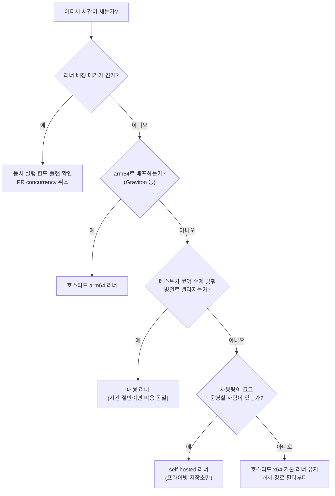

# 3장. 빠르고 싼 파이프라인: 러너, 캐시, 모노레포

빌드가 12분 걸린다. 그런데 이게 정말 문제일까, 아니면 12분 중 어디가 문제일까?

2장에서 `ticketbox`의 CI를 두 단계짜리 워크플로로 다시 짰다. 이제 PR마다 `make ci`가 돌고, 노트북에서도 같은 명령이 돈다. 그런데 팀원들의 불만이 슬슬 들려온다. PR 하나 올리면 12분을 기다려야 한다는 것이다. 누군가는 더 큰 러너를 쓰자고 하고, 누군가는 캐시를 붙이자고 하고, 누군가는 아예 사무실 구석의 남는 서버에 self-hosted 러너를 띄우자고 한다. 셋 다 그럴듯하다. 그렇다면 무엇부터 해야 할까?

답하기 전에 먼저 할 일이 있다. 12분을 쪼개보는 것이다. GitHub Actions의 실행 화면은 스텝마다 걸린 시간을 보여준다. `ticketbox`의 경우를 펼쳐 보면, 러너를 배정받기까지 기다린 시간, 체크아웃, 의존성 설치, 빌드, 테스트가 각각 얼마씩 먹는지가 드러난다. 의존성 설치가 4분이라면 러너를 키워도 크게 달라지지 않는다. 테스트가 7분인데 그중 대부분이 이번 PR과 상관없는 `apps/edge`의 테스트라면, 필요한 건 빠른 기계보다 덜 돌리는 방법이다. 측정 없이 고른 해법은 대개 엉뚱한 곳을 빠르게 만든다.

## CI 비용의 실체

시간 말고 돈 이야기도 해보자. 2024년 ICSE에 실린 Bouzenia와 Pradel의 연구는 GitHub Actions 워크플로의 자원 사용을 처음으로 폭넓게 측정했다. 유료 플랜 저장소는 평균적으로 연간 504달러를 CI/CD에 썼고, 자원의 91.2%가 테스트와 빌드에 들어갔다. 워크플로를 깨우는 이벤트는 PR이 50.7%, 푸시가 30.9%, 스케줄이 15.5%였다. 이 금액은 연구 당시의 가격 기준이라 지금 요금과 바로 비교할 수는 없다. 그래도 돈이 어디로 가는지에 대한 감각, 즉 테스트와 빌드가 거의 전부이고 PR이 가장 큰 방아쇠라는 사실은 지금도 유효하다.

2026년 9월 기준의 가격은 어떨까? GitHub는 2026년 1월 1일부터 호스티드 러너 가격을 최대 39% 내렸다. 새 가격에는 분당 0.002달러의 "Actions cloud platform charge"가 포함돼 있다. 자주 쓰는 러너의 분당 요금은 다음과 같다.

| 러너 | 분당 요금 (2026년 9월 기준) |
|---|---|
| Linux 2-core (x64) | $0.006 |
| Linux 2-core (arm64) | $0.005 |
| Linux 4-core | $0.012 |
| Linux 8-core | $0.022 |
| Linux 16-core | $0.042 |
| Windows 2-core (x64) | $0.010 |
| macOS 3-4 core | $0.062 |

표만 보면 부담스럽지 않은 숫자다. GitHub도 이 가격 변경으로 고객의 96%는 청구액에 변화가 없다고 밝혔다. `ticketbox`처럼 다섯 명이 하루에 PR 스무 개쯤 올리는 팀이라면 러너 비용은 한 달 커피값 수준일 가능성이 높다. 조심할 것은 두 가지다. 플랜에 포함된 무료 사용 시간은 대형 러너(larger runner)에는 쓸 수 없고, 대형 러너는 퍼블릭 저장소에서도 무료가 아니다. 그리고 돈이 적게 드는 것과 비용이 적은 것은 다른 이야기다. 12분을 기다리는 사람의 시간은 이 표 어디에도 없다. 이 이야기는 장 끝에서 다시 꺼내자.

## 러너 고르기: 네 가지 선택지

러너를 고르는 일은 비교 문제다. 선택지를 하나씩 놓고 장단점을 따져보자.

첫 번째는 기본값인 GitHub 호스티드 러너의 x64 2-core다. 아무 설정 없이 `ubuntu-24.04`를 적으면 받는 러너이고, 매번 깨끗한 머신이 뜨므로 이전 실행의 찌꺼기를 걱정할 필요가 없다. 대부분의 팀에게는 이것으로 충분하다. 단점은 성능을 고를 수 없다는 것 정도다.

두 번째는 GitHub 호스티드 arm64 러너다. 2025년 8월 퍼블릭 저장소에 4 vCPU로 무료 제공되기 시작했고, 2026년 1월 29일부터는 프라이빗 저장소에서도 2 vCPU로 쓸 수 있다(플랜의 무료 사용 시간에서 차감된다). 라벨은 `ubuntu-24.04-arm`, `ubuntu-22.04-arm`, `windows-11-arm`이다. 분당 요금이 x64보다 조금 싸다는 점도 반갑지만, 진짜 장점은 따로 있다. AWS의 Graviton처럼 arm64 위에서 ECS나 Lambda를 돌리는 팀이라면, 에뮬레이션 없이 네이티브로 이미지를 빌드할 수 있다. x64 러너에서 에뮬레이션으로 arm64 이미지를 빌드해본 사람은 그게 얼마나 느린지 안다. 이 조합은 6장에서 `apps/api` 이미지를 빌드할 때 다시 만난다.

세 번째는 대형 러너다. 4-core, 8-core, 16-core처럼 코어 수를 늘린 호스티드 러너인데, 앞의 표에서 보듯 코어가 두 배가 되면 분당 요금도 대략 두 배가 된다. 그러니 계산은 단순하다. 테스트가 코어 수에 비례해 병렬로 빨라진다면, 4-core로 시간이 절반이 될 때 돈은 그대로이고 기다리는 시간만 절반으로 준다. 반대로 테스트가 한 줄로 순서대로 도는 구조라면 코어를 늘려도 시간이 거의 줄지 않고 돈만 두 배가 된다. 12분을 쪼개보라고 한 이유가 여기서도 나온다.

네 번째는 self-hosted 러너다. 직접 관리하는 머신에 러너를 설치해 GitHub에 붙이는 방식이다. 버즈빌은 2024년 글에서 빌드 환경을 완전히 통제하고 워크플로 성격별로 리소스를 최적화하려고 Kubernetes 위에 ARC(Actions Runner Controller)로 self-hosted 러너를 운영한 경험을 공유했다. 커뮤니티판 ARC는 시간당 GitHub API 호출 한도를 넘겨 속도 제한에 걸렸고, 그래서 GitHub가 지원하는 Runner Scale Set 방식을 택했다고 한다. 2024년 글이라 세부는 지금과 다를 수 있다. 2026년 2월에는 Kubernetes 없이 쓸 수 있는 Go 기반 Runner Scale Set Client가 퍼블릭 프리뷰로 나오기도 했다.

self-hosted 러너를 둘러싼 커뮤니티의 목소리는 선명하게 갈린다. 베어메탈 서버에 LXC 컨테이너로 러너를 띄웠더니 "절감 효과가 어마어마하다"는 사람이 있고, 서버 한 대 값으로 청구서가 고정돼서 좋다는 사람도 있다. 반대편에서는 운영과 보안의 부담을 든다. GitHub의 공식 보안 가이드는 self-hosted 러너를 퍼블릭 저장소에 쓰는 일은 "거의 절대" 없어야 한다고 적고 있다. 외부 기여자의 코드가 우리 머신 위에서 돌 수 있기 때문이다. 캐시도 문제다. self-hosted 러너에서는 GitHub의 캐시 저장소까지 퍼블릭 인터넷을 거쳐 오가서 느리고 전송 비용까지 붙는다는 보고가 있다.

플랫폼 리스크도 있다. GitHub는 2025년 12월, self-hosted 러너에도 분당 0.002달러의 플랫폼 요금을 매기겠다고 발표했다가(당초 2026년 3월 1일 시행 예정) 반발에 부딪혀 시행을 연기했다. 공식 문구는 "접근 방식을 재검토할 시간을 갖기 위해 연기한다"는 것이고, 2026년 9월 기준으로 재개 여부는 공식적으로 확인되지 않는다. 한국 블로그 가운데는 이미 과금이 시작됐다고 적은 글도 있는데, 1차 공지와는 다르니 주의하자. 당시 토론에서는 "컨트롤 플레인 값은 이미 내고 있다"는 반발과 "그 정도 요금은 낼 수 있다"는 반응이 맞섰다. 어느 쪽이든, 남의 플랫폼 위에서 절감을 설계할 때는 그 플랫폼이 가격표를 바꿀 수 있다는 사실을 계산에 넣어두는 편이 낫다.

여기서 흔한 오해 하나를 짚고 가자. self-hosted 러너가 언제나 싸다고 여기기 쉽다. 하지만 호스티드 러너의 요금표와 비교하려면 서버 값에 더해야 할 것이 있다. 러너 이미지를 최신으로 유지하고, 디스크가 차면 비우고, 러너가 멈추면 새벽에 일어나서 살리는 사람의 시간까지 더해야 한다. 이미 인프라를 운영하는 플랫폼 팀이 있고 CI 사용량이 큰 조직이라면 계산이 맞을 수 있다. 다섯 명짜리 `ticketbox` 팀이라면 그 새벽의 주인공이 누가 될지부터 생각해보자.


그림 1. 러너 선택 의사결정 트리: 러너를 바꾸기 전에 시간이 어디서 새는지부터 본다

## 캐시: 공짜 점심은 없다

의존성 설치가 매번 4분씩 걸린다면 캐시가 가장 먼저 떠오른다. 효과는 분명하다. 빌드 환경을 캐시하고 의존성을 추론해 영향 없는 단계를 건너뛰는 도구를 다룬 한 연구에서는, 빌드 기록 14,364건 가운데 87.9% 이상이 가속 대상이었고 가속된 빌드의 74%가 두 배 빨라졌다. 연구용 도구가 낸 결과이니 우리 CI에서도 그만큼 나온다고 기대하기보다는, 캐시가 어디까지 효과를 낼 수 있는지 가늠하는 상한선 정도로 읽어두자. 앞의 Bouzenia와 Pradel 연구에서는 유료 저장소의 32.9%만 캐시를 쓰고 있었다. 아직 손대지 않은 여지가 많다는 뜻이다.

그런데 캐시는 한 번 붙이고 잊어버려도 되는 설정일까? 2026년의 한 프리프린트는 저장소 952곳의 캐시 설정 변경 17,185건을 추적해, 캐시를 도입한 저장소가 평균 9.37번 캐시 관련 설정을 고쳤다고 보고했다. 파라미터를 고치는 것은 주로 사람이었고, 액션 버전을 올리는 것은 주로 봇이었다. 캐시 키를 잘못 설계하면 오래된 의존성이 복원되고, 너무 잘게 나누면 적중률이 떨어진다. 캐시에도 유지보수 비용이 따른다.

용량 한도도 알아두자. GitHub는 저장소당 10GB의 캐시를 추가 비용 없이 제공하고, 2025년 11월부터는 Pro·Team·Enterprise 플랜에서 초과분을 종량 과금으로 쓸 수 있게 했다. 캐시 크기에 따른 축출 한도와 보존 기간은 엔터프라이즈, 조직, 저장소 순으로 내려오며 설정할 수 있다. 한도를 넘으면 오래된 캐시부터 밀려나고, 그러면 따뜻해야 할 빌드가 차갑게 시작한다. 캐시 최적화를 파는 벤더들은 1.2GB짜리 `node_modules` 캐시를 복원하는 데 38초가 걸린 반면 캐시 없이 `npm ci`를 돌리니 6초였다는 식의 사례를 내놓기도 한다. 이해관계가 있는 쪽의 수치이니 그대로 믿을 것은 아니지만, 캐시 복원이 설치보다 느려지는 경우도 있다는 교훈은 새겨둘 만하다. 결국 여기서도 답은 측정이다.

`ticketbox`는 잠금 파일의 해시로 캐시 키를 만든다. 잠금 파일이 바뀌면 새 캐시를 만들고, 그렇지 않으면 이전 캐시를 그대로 쓴다.

```yaml
      - uses: actions/cache@v6
        with:
          path: ~/.npm
          key: npm-${{ runner.os }}-${{ runner.arch }}-${{ hashFiles('apps/edge/package-lock.json') }}
          restore-keys: |
            npm-${{ runner.os }}-${{ runner.arch }}-
```

키에 `runner.arch`를 넣은 것은 x64와 arm64 러너를 섞어 쓸 때 서로 다른 아키텍처의 캐시가 뒤섞이지 않게 하려는 것이다. `node_modules`를 통째로 캐시하기보다 패키지 매니저의 다운로드 캐시(`~/.npm`)를 캐시하는 편이 크기도 작고 안전하다. 캐시를 붙인 뒤에는 복원에 걸린 시간과 설치에 걸린 시간을 비교해보자. 복원이 더 느리다면 캐시를 빼는 것도 정당한 선택이다.

## 모노레포: 바뀐 것만 돌리기

`ticketbox`는 모노레포다. `apps/edge`의 CSS 한 줄을 고친 PR에서 `apps/api`의 통합 테스트까지 돌 이유가 있을까? 모노레포 CI의 기본 전략은 바뀐 경로에 해당하는 것만 돌리는 것이다.

F-Lab은 2023년 글에서 `dorny/paths-filter`로 변경된 프로젝트만 CI를 돌리고 프로젝트별로 워크플로 파일을 분리해 CI 실행 시간을 절반 수준으로 줄였다고 밝혔다. GitHub Actions에 내장된 경로 필터로도 같은 구조를 만들 수 있다.

```yaml
# .github/workflows/api-ci.yml
name: api-ci
on:
  pull_request:
    paths:
      - "apps/api/**"
      - "Makefile"
      - "scripts/**"
permissions:
  contents: read
jobs:
  test:
    runs-on: ubuntu-24.04
    steps:
      - uses: actions/checkout@v7
      - run: make -C apps/api ci   # 프로젝트별 Makefile
```

`Makefile`과 `scripts/**`를 함께 넣은 것에 주목하자. 2장에서 로직을 스크립트로 뺐으니, 스크립트가 바뀌면 그 스크립트를 쓰는 모든 프로젝트의 CI가 돌아야 한다. 경로 필터를 짤 때 가장 흔한 실수가 이런 공유 의존성을 빠뜨리는 것이다.

경로 필터에는 함정이 두 가지 있다. 하나는 필수 체크(required check)와의 충돌이다. `api-ci`를 main 브랜치의 필수 체크로 걸어두면, `apps/edge`만 고친 PR에서는 경로 필터 때문에 워크플로가 아예 시작되지 않는다. 그러면 필수 체크는 결과를 영영 보고받지 못한 채 대기 상태로 남고, PR은 머지할 수 없게 된다. GitHub 공식 문서에도 경로 필터로 건너뛴 워크플로의 체크는 'Pending'으로 남아 머지를 막는다고 적혀 있다. 흔히 쓰는 해법은 경로 판단을 워크플로 밖의 트리거가 아니라 워크플로 안의 잡으로 옮기는 것이다. 워크플로는 항상 시작하고, 첫 잡이 바뀐 경로를 계산해 필요한 테스트 잡만 돌린 뒤, 마지막에 항상 실행되는 요약 잡 하나가 결과를 모아 보고한다. 그리고 필수 체크로는 그 요약 잡 하나만 건다.

다른 하나는 배포와 엮였을 때다. 레몬베이스는 배포 파이프라인을 병렬화하고 Docker 이미지를 재사용해 배포 시간을 27분에서 12분으로 55% 줄인 경험을 공유했는데, 그 과정에서 path-filter를 썼다가 롤백할 때 문제가 되는 상황을 발견하고, 개발자가 배포 대상을 워크플로 옵션으로 직접 고르는 방식으로 바꿨다고 한다. 소개글에는 어떤 상황이었는지까지는 나오지 않는다. 그러니 여기서부터는 추측이다. 경로 필터는 "이번에 무엇이 바뀌었나"로 판단한다. 롤백처럼 이전 버전을 다시 내보내야 하는 순간에는 바뀐 경로와 배포해야 할 대상이 일치하지 않을 수 있다. 테스트를 줄이는 데 쓰는 필터를 배포 대상을 고르는 데까지 쓸 때는 한 번 더 따져보자.

경로 필터만으로 충분할까? 2026년 9월 HN의 한 사용자는 이렇게 조언했다. 단일 발언이라 널리 합의된 견해라고 보기는 어렵지만, 방향은 곱씹어볼 만하다.

> "In a monorepo, path filters alone are not enough. You want an affected graph (packages and tests), fail-closed when the graph is unsure, and a canary on main that still runs the full suite." — thedefaultman (HN, 2026-09)

세 가지를 담고 있다. 경로가 아니라 패키지와 테스트의 의존 그래프로 영향 범위를 계산할 것, 그래프가 확신하지 못하면 전부 돌리는 쪽으로 실패할 것, 그리고 main에서는 전체 테스트를 계속 돌려 필터가 놓친 것을 잡을 것. 이 방향을 뒷받침하는 오래된 근거도 있다. Google은 2017년 발표에서 자사 테스트 가운데 실패하는 것은 매우 드물고, 실패하는 테스트는 대개 대상 코드에 "가까운" 테스트라고 보고했다. 바뀐 코드 가까이의 테스트를 먼저, 전체는 main에서 돌리는 전략이 여기서 나온다.

## 머지 큐: 초록 PR 두 개가 빨간 main을 만들 때

PR A도 초록, PR B도 초록인데 둘을 차례로 머지했더니 main이 빨개진다. 각각은 옛 main을 기준으로 테스트를 통과했지만, 둘이 합쳐진 조합은 누구도 테스트하지 않았기 때문이다. PR이 적을 때는 드문 일이지만, PR이 많아질수록 자주 겪는다.

머지 큐는 이 틈을 메운다. PR을 곧장 머지하는 대신 큐에 넣으면, GitHub가 main에 앞선 PR들을 합친 임시 브랜치를 만들어 CI를 돌리고, 통과한 것만 순서대로 머지한다. 여기서 놓치기 쉬운 설정이 하나 있다. 머지 큐를 쓰려면 필수 체크를 수행하는 워크플로에 `merge_group` 이벤트를 트리거로 추가해야 한다. 공식 문서도 이 부분은 "must"로 강조한다. 빠뜨리면 큐에 들어간 PR의 체크가 돌지 않는다.

```yaml
on:
  pull_request:
  merge_group:
```

큐가 한 번에 몇 개의 `merge_group`을 동시에 검증할지는 1에서 100 사이로 정할 수 있다. `ticketbox`처럼 작은 팀은 작은 값에서 시작해 큐가 밀리는지 보며 늘리는 편이 낫다.

## 플레이키 테스트: 재시도로 덮지 말자

12분 가운데 가장 억울한 시간은 아무 이유 없이 실패한 테스트를 다시 돌리는 시간이다. 같은 코드에서 어떤 때는 통과하고 어떤 때는 실패하는 테스트, 즉 플레이키 테스트다. 이게 얼마나 흔할까? 한 서베이가 인용한 설문에서는 개발자의 59%가 월, 주, 또는 매일 단위로 플레이키 테스트를 겪는다고 답했다.

가장 손쉬운 대응은 실패하면 자동으로 한두 번 다시 돌리는 것이다. 그런데 이게 정말 괜찮을까? Python 프로젝트 22,352개와 테스트 876,186개를 분석한 연구는 이런 계산을 내놓았다. 통과한 테스트가 플레이키가 아니라고 95% 신뢰하려면 평균 170번을 다시 돌려야 한다. 한두 번의 재실행으로는 아무것도 증명되지 않는다는 얘기다. 588개 프로젝트의 빌드 924,616건을 분석한 다른 연구도 재시도나 대기 같은 조치가 빌드를 길게 만들면서 통과를 보장하지도 않는다고 보고했다. 재시도는 빨간 불을 끄는 것이지 원인을 고치는 것이 아니다.

그렇다면 어떻게 해야 할까? 격리하자. 플레이키로 의심되는 테스트를 발견하면 필수 체크에서 빼서 별도 잡으로 옮기고, 추적용 이슈를 연다. 격리된 테스트는 계속 돌면서 기록을 남기되 머지를 막지는 않는다. 고쳐지면 다시 필수 체크로 돌려보낸다. 격리 목록이 줄지 않고 늘기만 한다면 그건 팀이 테스트를 믿지 않게 됐다는 신호이니, 1장에서 본 CI 극장의 입구에 서 있는 셈이다.

이제 처음의 질문으로 돌아가 정리해보자. 러너 배정을 기다리는 시간이 길다면 동시 실행과 러너를 본다. 의존성 설치가 길다면 캐시를 본다. 이번 PR과 상관없는 테스트가 길다면 경로 필터와 영향 그래프를 본다. 이유 없이 빨개진다면 플레이키 격리를 본다. 초록 PR들이 빨간 main을 만든다면 머지 큐를 본다. 12분을 쪼개보면, 이 가운데 어디부터 손댈지가 보인다.

### AI와 함께 쓸 때

AI 코딩 에이전트를 팀에 들이면 PR 수가 늘고, PR 수가 늘면 CI 사용량도 는다. 앞의 연구에서 PR이 워크플로 실행의 절반을 깨운다는 것을 봤으니 당연한 결과다. 에이전트가 리뷰 코멘트를 받아 같은 PR에 수정 커밋을 거듭 올리면, 그때마다 CI도 다시 돈다.

여기서 이 장의 도구들이 비용 통제 장치로도 일한다. 첫째, 2장에서 건 PR용 concurrency 취소가 에이전트의 연속 푸시를 받아낸다. 새 커밋이 올라오면 낡은 실행은 취소되므로, 에이전트가 커밋을 열 번 올려도 끝까지 도는 것은 마지막 한 번이다. 둘째, 머지 큐가 main을 지킨다. 에이전트 PR이 몰려 여러 개가 동시에 초록이 되는 날일수록, 조합을 검증하지 않고 머지하는 위험이 커진다. 셋째, 사람의 승인 지점이 CI 비용의 문지기 역할을 한다. Copilot cloud agent(2025년 GA 당시 이름은 coding agent)는 기본 설정에서, 쓰기 권한을 가진 사람이 코드를 검토하고 "Approve and run workflows" 버튼을 누르기 전까지 워크플로를 실행하지 않는다. 보안을 위한 장치이지만, 사람이 보기도 전에 돌 CI 분을 아끼는 효과도 함께 낸다. 이 승인 단계를 귀찮다고 우회하지 말자. 비용과 보안을 동시에 지키는 몇 안 되는 지점이다.

## 봉투 뒷면의 계산

CI 비용을 봉투 뒷면에 적어본다면 이런 식이 될 것이다.

(PR 수 × 실행 분 × 분당 요금) + 기다린 사람의 시간

앞쪽 항은 청구서에 찍히고, 뒤쪽 항은 어디에도 찍히지 않는다. 그리고 대개는 뒤쪽 항이 훨씬 크다.
