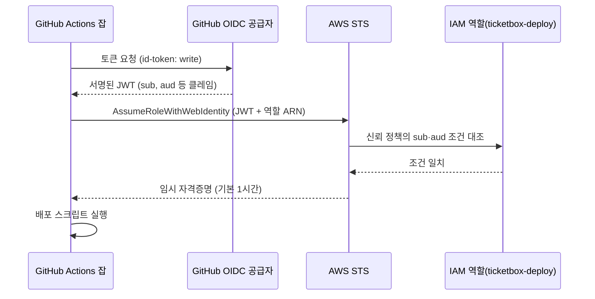

# 4장. 비밀 없는 배포: OIDC, 그리고 Cloudflare의 비대칭

ticketbox 저장소의 GitHub 시크릿 목록에 `AWS_SECRET_ACCESS_KEY`가 들어간 지 14개월째라고 해보자. 처음 넣은 사람은 이미 퇴사했다. 이 키가 어느 IAM 사용자에 붙어 있는지, 그 사용자에게 어떤 정책이 달려 있는지 아는 사람이 없다. 누군가의 노트북 `~/.aws/credentials`에도, 예전에 잠깐 쓰던 다른 CI 서비스의 설정 화면에도 같은 키가 복사돼 있을지 모른다. 교체하자니 무엇이 깨질지 몰라 무섭고, 그대로 두자니 뒷맛이 찜찜하다.

앞의 두 장에서 우리는 워크플로를 얇게 만들고 빠르게 돌렸다. 이제 그 파이프라인이 클라우드에 무언가를 올릴 차례다. 그런데 올리려면 문을 열어야 하고, 문을 열려면 열쇠가 필요하다. 이 열쇠를 무엇으로 만들지가 이 장의 질문이다. 그리고 우리가 쓰는 두 클라우드는 이 질문에 서로 다르게 답한다는 사실도 함께 살펴보자.

## 장기 키는 어디로 새는가

장기 액세스 키가 위험하다는 말은 누구나 한 번쯤 들었다. 그런데 얼마나 위험할까? 감으로 말하지 말고 데이터를 먼저 보자.

2019년 NDSS에 실린 한 연구는 공개 GitHub 저장소를 대상으로 약 6개월간 새로 올라오는 커밋을 실시간으로 스캔했다. 결론은 이렇다. 시크릿 유출은 10만 개가 넘는 저장소에 퍼져 있고, 매일 새롭고 고유한 시크릿이 수천 개씩 새어 나온다. 같은 해 ICSE에 발표된 인프라 코드(IaC) 연구는 다른 각도에서 문제를 짚었다. 스크립트에 하드코딩된 비밀은 길게는 98개월, 중앙값으로 20개월 동안 그 자리에 머물렀다. 이 연구는 Puppet 같은 당시 도구를 중심으로 분석했으니 오늘날의 Terraform에 그대로 옮길 수는 없다. 하지만 "한번 박힌 비밀은 생각보다 오래 산다"는 감각은 충분히 전해진다.

ticketbox의 14개월짜리 키가 딱 그 중앙값 근처에 있다. 왜 이렇게 오래 살아남을까? 장기 키에는 만료가 없기 때문이다. 만료가 없으니 교체할 계기도 없다. 교체할 계기가 없으니 어디에 복사됐는지 추적하는 사람도 없다. 결국 키의 수명이 조직의 기억보다 길어진다. 시크릿 저장소에 안전하게 넣어두었다는 사실은 이 문제를 해결하지 못한다. 키가 존재하는 한, 그 키를 읽을 수 있는 경로는 언제든 새로 생길 수 있다. 다음 장에서 보겠지만 러너 메모리를 긁어 로그에 찍는 공격은 이미 현실이 됐다.

그렇다면 답은 키를 더 잘 숨기는 쪽에 있지 않다. 애초에 오래 사는 키를 만들지 않는 쪽에 있다.

## OIDC: 빌려 쓰고 돌려주는 자격증명

### 흐름부터 잡아보자

OIDC(OpenID Connect)라는 이름이 조금 딱딱하게 들릴 수 있다. 하지만 GitHub Actions와 AWS 사이에서 일어나는 일은 단순하다. 호텔 프런트를 떠올리면 이해하기 쉽다. 투숙객은 방 열쇠를 집에 가져가지 않는다. 체크인할 때 신분증을 보여주면 프런트가 신분을 확인하고, 정해진 기간 동안만 열리는 카드키를 내준다. 체크아웃하면 카드키는 그냥 쓸모가 없어진다.

GitHub Actions에서 신분증 역할을 하는 것이 OIDC 토큰이다. 잡(job)이 실행되면 GitHub의 OIDC 공급자(`https://token.actions.githubusercontent.com`)가 "이 토큰은 어느 저장소의, 어느 브랜치 또는 환경에서, 어떤 이벤트로 실행된 잡이 발급받았다"는 정보를 담은 서명된 토큰을 내준다. 잡은 이 토큰을 AWS STS에 내밀고, STS는 미리 등록된 신뢰 정책(trust policy)과 토큰 내용을 대조한 뒤 조건이 맞으면 임시 자격증명을 돌려준다. 시크릿 목록에는 아무것도 남지 않는다.


그림 1. GitHub OIDC 토큰으로 AWS 역할을 가정하는 흐름

워크플로 쪽에서 해야 할 일은 두 가지다. 잡에 `id-token: write` 권한을 주고, `aws-actions/configure-aws-credentials`에 가정할 역할과 리전을 알려주면 된다. 2026년 9월 기준 이 액션의 최신 릴리스는 v6.3.0이다. ticketbox의 예매 API 배포 잡이라면 대략 이렇게 생겼다.

```yaml
name: deploy-api
on:
  push:
    branches: [main]

permissions:
  contents: read

jobs:
  deploy:
    runs-on: ubuntu-latest
    environment: production
    permissions:
      contents: read
      id-token: write
    steps:
      - uses: actions/checkout@v7
      - uses: aws-actions/configure-aws-credentials@v6
        with:
          role-to-assume: arn:aws:iam::123456789012:role/ticketbox-deploy
          aws-region: ap-northeast-2
      - run: ./scripts/deploy-api.sh
```

최상단 `permissions:`에서 워크플로 전체를 `contents: read`로 묶고, 토큰이 필요한 잡에서만 `id-token: write`를 더했다는 점에 주목하자. 테스트 잡까지 토큰을 발급받을 이유는 없다. 이렇게 받은 임시 자격증명은 기본적으로 3600초, 즉 1시간 동안 유효하다(`role-duration-seconds`로 900~43,200초 사이에서 조정할 수 있다). 세션 이름은 따로 지정하지 않으면 `GitHubActions`로 찍힌다. CloudTrail에서 누가 무엇을 했는지 찾을 때 이 이름이 단서가 되니, 서비스별로 이름을 붙여두는 편이 나중에 편하다. 예제의 액션 참조는 아직 메이저 태그(`@v6`, `@v7`)로 두었다. 다음 장에서 이 표기를 바꾸게 된다.

### 신뢰 정책은 문서 예제보다 좁게

흐름을 이해했다면 이제 진짜 중요한 부분으로 들어가보자. AWS가 토큰을 믿는 기준은 오로지 신뢰 정책의 조건이다. GitHub 공식 문서의 예제는 이렇게 생겼다.

```json
"Condition": {
  "StringLike": { "token.actions.githubusercontent.com:sub": "repo:octo-org/octo-repo:*" },
  "StringEquals": { "token.actions.githubusercontent.com:aud": "sts.amazonaws.com" }
}
```

`aud` 클레임이 `sts.amazonaws.com`인지 확인하는 부분은 좋다. 문제는 `sub` 클레임 쪽이다. `repo:octo-org/octo-repo:*`라는 와일드카드는 무엇을 허용할까? 이 저장소에서 실행되는 모든 잡, 즉 아무 브랜치의 push도, 누군가 방금 만든 실험 브랜치도, PR에서 돈 워크플로도 전부 이 역할을 가정할 수 있다는 뜻이다. 프로덕션 배포 역할을 이렇게 열어두면, 리뷰도 받지 않은 브랜치의 워크플로가 프로덕션 자격증명을 손에 쥐게 된다. 아찔한 일이다.

그렇다면 어떻게 좁혀야 할까? 두 가지 방법이 흔하다. 하나는 브랜치로 좁히는 것이다. `sub`를 `repo:ticketbox-org/ticketbox:ref:refs/heads/main`으로 두면 main 브랜치에서 돈 잡만 역할을 가정할 수 있다. 다른 하나는 GitHub 환경(environment)으로 좁히는 것이다. 잡이 `environment: production`을 선언하면 토큰의 `sub`가 환경 이름을 담은 형태로 바뀌므로, 신뢰 정책에 `repo:ticketbox-org/ticketbox:environment:production`을 적으면 된다. ticketbox는 뒤쪽을 택하자. 이유는 잠시 뒤 GitHub 환경을 다루면서 설명하겠다.

```json
{
  "Version": "2012-10-17",
  "Statement": [
    {
      "Effect": "Allow",
      "Principal": {
        "Federated": "arn:aws:iam::123456789012:oidc-provider/token.actions.githubusercontent.com"
      },
      "Action": "sts:AssumeRoleWithWebIdentity",
      "Condition": {
        "StringEquals": {
          "token.actions.githubusercontent.com:aud": "sts.amazonaws.com",
          "token.actions.githubusercontent.com:sub": "repo:ticketbox-org/ticketbox:environment:production"
        }
      }
    }
  ]
}
```

와일드카드를 없앴으니 연산자도 `StringLike` 대신 `StringEquals`로 바꿨다. 역할을 여러 개로 나누는 것도 잊지 말자. PR에서 Terraform plan을 돌리는 읽기 전용 역할과, 프로덕션 환경에서만 가정할 수 있는 배포 역할은 서로 다른 역할이어야 한다. 이 분리는 6장에서 인프라 파이프라인을 짤 때 다시 쓴다.

조직 저장소가 많아지면 저장소 이름을 하나하나 신뢰 정책에 나열하기가 번거로워진다. 2026년 4월 GitHub는 저장소의 custom properties를 OIDC 토큰의 클레임으로 넣을 수 있는 기능을 GA로 내놓았다. 예를 들어 "배포 등급이 production인 저장소"처럼 저장소에 붙인 속성으로 신뢰 정책을 세밀하게 짤 수 있다. 저장소가 몇 개 안 되는 ticketbox에는 아직 필요 없지만, 저장소가 수십 개로 늘어나는 조직이라면 눈여겨볼 만하다.

## OIDC가 안 될 때

설정을 다 했는데 이런 에러가 뜬다. `Not authorized to perform sts:AssumeRoleWithWebIdentity`. 한국이든 해외든, 처음 OIDC로 배포하려는 사람이 가장 많이 부딪히는 벽이다. velog에 OIDC 설정 튜토리얼이 대량으로 쌓여 있다는 사실 자체가 이 벽이 얼마나 흔한지 말해준다. configure-aws-credentials 저장소의 이슈와 AWS re:Post에도 같은 질문이 반복해서 올라온다.

원인은 대개 셋 중 하나다. 가장 흔한 것은 신뢰 정책의 `sub`·`aud` 조건과 실제 토큰의 클레임이 글자 단위로 어긋나는 경우다. 브랜치 push를 가정하고 `ref:refs/heads/main` 조건을 써뒀는데 잡에 `environment:`를 붙여 `sub` 형태가 바뀌었다거나, PR에서 도는 잡이 발급받은 토큰은 PR을 나타내는 별도 형태의 `sub`를 가진다는 걸 놓친 경우가 여기에 해당한다. 대소문자 하나, 조직 이름의 오타 하나로도 실패한다. 두 번째는 `aud`가 `sts.amazonaws.com`이 아닌 경우, 세 번째는 워크플로의 `permissions:`에 `id-token: write`를 빠뜨린 경우다. 특히 워크플로 최상단에 `permissions:` 블록을 새로 추가하면, 명시하지 않은 권한은 전부 사라진다는 점을 기억해두자. 보안을 강화하려고 권한을 좁혔는데 OIDC가 갑자기 깨지는 흔한 경로다.

그렇다면 어떻게 디버깅할까? 추측으로 신뢰 정책을 이리저리 고치는 것은 시간 낭비다. 토큰을 직접 들여다보는 편이 빠르다. 커뮤니티에서 자주 권하는 방법은 actions-oidc-debugger 같은 도구로 실제 발급된 JWT를 디코딩해 출력하고, 그 `sub`·`aud` 값을 신뢰 정책 조건과 한 글자씩 나란히 비교하는 것이다. 에러 메시지는 "권한이 없다"고만 말하지만, 토큰은 무엇이 다른지 정확히 보여준다.

한 가지 더 조심할 것이 있다. 한 블로그는 2026년 7월 이후 GitHub의 immutable subject claim에 옵트인한 저장소는 기존의 이름 기반 `sub` 조건으로는 역할 가정에 실패한다고 주장한다(사실 확인 필요). GitHub 공식 changelog로 확인되지 않은 내용이니, 저장소 설정을 바꾼 뒤 OIDC가 갑자기 깨진다면 공식 문서를 먼저 확인해보자. 이런 부분은 빠르게 바뀔 수 있다.

## GitHub 환경으로 배포 시크릿 가두기

신뢰 정책을 `environment:production`으로 좁힌 이유를 이제 이야기할 차례다. GitHub 환경에는 이름표 이상의 기능이 있다. 우선 배포 보호 규칙을 걸 수 있다. 특정 브랜치에서만 이 환경을 쓸 수 있게 제한하고, 필요하면 지정된 리뷰어의 승인을 받아야 잡이 시작되게 만들 수 있다. 그리고 환경마다 시크릿과 변수를 따로 둘 수 있다.

이 둘을 합치면 무엇이 생길까? "main 브랜치에서, 필요하면 사람의 승인을 거친 뒤에만 `production` 환경에 들어갈 수 있다"는 규칙이 GitHub 쪽에 생기고, "`production` 환경의 잡만 배포 역할을 가정할 수 있다"는 규칙이 AWS 쪽에 생긴다. 두 겹의 자물쇠가 같은 문을 지키는 셈이다. 어느 한쪽 설정이 실수로 풀려도 다른 쪽이 버틴다.

커뮤니티의 오래된 조언도 같은 곳을 가리킨다. tj-actions 사고 뒤 Lobsters에서 한 개발자는 이렇게 말했다. "main 브랜치(즉, 리뷰를 거친 뒤)만 배포 시크릿을 갖게 하고, 'build/test' 같은 워크플로는 시크릿을 아예 갖지 않게 할 수 있다." 다른 개발자는 한발 더 나아가 프로덕션·릴리스 토큰은 평소 CI를 돌리는 시스템과 같은 곳에 있지 않는 편이 이상적이라고 덧붙였다. ticketbox에 옮기면 원칙은 간단하다. 빌드·테스트 잡에는 시크릿이 0개다. 배포 잡만 환경을 선언하고, 그 환경을 통해서만 자격증명에 닿는다.

그런데 이런 경우도 있다. 배포는 아니지만 스테이징용 API 키 같은 시크릿을 환경 단위로 묶어두고 싶을 때다. 환경을 쓰면 잡이 실행될 때마다 배포 기록이 생겨 PR 화면이 지저분해진다. 2026년 3월부터는 환경 설정에 `deployment: false`를 두면 시크릿·변수 스코프 기능만 쓰고 배포 레코드는 만들지 않을 수 있다. 다만 커스텀 배포 보호 규칙을 구현한 환경에서는 이 옵션을 쓸 수 없으니, 보호 규칙이 걸린 프로덕션 환경에는 해당하지 않는다고 생각하자.

## Cloudflare의 비대칭

### 같은 문제, 다른 답

여기까지 오면 ticketbox의 AWS 쪽 시크릿 목록은 깨끗해진다. 역할 ARN은 비밀이 아니니 워크플로 파일에 그대로 적어도 된다. 그렇다면 Cloudflare 쪽도 같은 방식으로 정리할 수 있을까?

아쉽게도 사정이 다르다. Cloudflare의 공식 GitHub Actions 배포 도구인 `cloudflare/wrangler-action`은 `apiToken`과 `accountId`로 인증한다. 공식 README가 "`CLOUDFLARE_API_TOKEN`을 저장소에 절대 커밋하지 말라"고 강조하는 것도 이 토큰이 장기 자격증명이기 때문이다. 2026년 9월 기준, Cloudflare가 GitHub의 OIDC 토큰을 받아 임시 자격증명으로 교환해주는 기능은 공식 문서에서 확인하지 못했다. 이 부분은 바뀔 수 있으니 도입 전에 공식 문서를 한 번 더 확인해보자. 지금으로서는 AWS에서는 없앤 장기 키를 Cloudflare에서는 시크릿으로 품고 있을 수밖에 없다. 이 비대칭을 모른 척하지 말고 정면으로 다루자.

```yaml
jobs:
  deploy-edge:
    runs-on: ubuntu-latest
    environment: production
    permissions:
      contents: read
    steps:
      - uses: actions/checkout@v7
      - run: make build-edge
      - uses: cloudflare/wrangler-action@v4
        with:
          apiToken: ${{ secrets.CLOUDFLARE_API_TOKEN }}
          accountId: ${{ secrets.CLOUDFLARE_ACCOUNT_ID }}
```

여기서도 토큰은 저장소 시크릿 대신 `production` 환경의 시크릿으로 둔다. 키를 없앨 수 없다면, 키에 닿을 수 있는 잡을 줄이는 것이 차선이다.

### 없앨 수 없다면 폭발 반경을 줄이자

키를 없앨 수 없을 때 남는 질문은 하나다. 이 키가 새면 무엇까지 할 수 있는가? 이 질문의 답을 작게 만드는 것이 우리가 할 일이다.

2026년 9월 15일 Cloudflare는 Worker 단위 권한을 내놓았다. 역할은 네 가지다. 코드에는 접근하지 않고 설정·메트릭·로그·트레이스만 보는 Metadata Read-Only, Content Read-Only, 배포와 수정은 할 수 있지만 삭제 권한은 없는 Editor, 그리고 Admin이다. 여기에 계정 소유 API 토큰을 특정 Worker로 스코프하는 기능이 붙었다. 공식 체인지로그의 안내가 흥미롭다. "에이전트나 CI/CD 워크플로라면 Manage Account > Account API Tokens에서 계정 소유 API 토큰을 만들고, 범위를 Specified Workers로 지정하라."

ticketbox에 적용하면 이렇다. 먼저 토큰을 개인 사용자 계정이 아니라 계정 소유로 만든다. 만든 사람이 퇴사해도 토큰의 주인이 사라지지 않고, 누구의 개인 권한에 묶여 있는지 헷갈릴 일도 없다. 다음으로 범위를 `apps/edge`가 배포하는 Worker 하나로 제한하고, 역할은 Editor로 준다. 그러면 이 토큰이 새더라도 공격자는 계정의 다른 Worker를 건드리지 못하고, 우리 Worker를 통째로 지워버리지도 못한다. 물론 악성 코드를 배포할 수는 있으니 안심할 일은 아니다. 하지만 "계정 전체"와 "Worker 하나, 삭제 불가" 사이의 거리는 사고가 났을 때 복구 시간의 차이로 그대로 돌아온다. 토큰을 처음 만들 때 "Edit Cloudflare Workers" 템플릿에서 시작하되, 템플릿이 주는 범위를 그대로 받아들이지 말고 여기까지 좁혀두자.

### AI와 함께 쓸 때

파이프라인에 AI 에이전트를 들이면 자격증명 질문이 하나 더 생긴다. 에이전트는 무엇으로 인증해야 할까? 가장 손쉬운 답은 Claude API 키나 개인 액세스 토큰(PAT)을 시크릿에 넣는 것이다. 하지만 이 장을 여기까지 읽었다면 그 답이 왜 찜찜한지 이미 알 것이다.

claude-code-action의 공식 문서는 장기 시크릿을 아예 두지 않는 길을 안내한다. 워크로드 아이덴티티 페더레이션을 쓰면, 액션이 워크플로의 GitHub OIDC 토큰을 Claude Console 서비스 계정을 통해 Claude API 접근 권한으로 교환한다. AWS 역할을 가정할 때와 같은 원리다. Bedrock·Vertex·Foundry를 거쳐 모델을 쓰는 경우에도 OIDC로 인증할 수 있다. 에이전트 잡에도 `id-token: write`를 주고, API 키 시크릿은 지우자.

PAT에 대해서는 문서가 더 단호하다. 보안 문서는 개인 액세스 토큰을 쓰지 말라고 하면서 이유를 이렇게 든다. 정적 토큰은 실행마다 교체되지 않으므로, 프롬프트 인젝션을 통해 시간을 두고 일부 또는 전부가 복원될 수 있다. 사람의 실수만이 아니라 에이전트가 읽는 입력 자체가 유출 경로가 된다는 뜻이다. 이 경로는 10장에서 자세히 해부한다.

로컬에서 에이전트를 돌릴 때도 같은 원칙이 통한다. HN의 한 개발자는 Claude Code를 git 자격증명이 없는 Docker 컨테이너 안에서 돌린다고 했다. 에이전트는 git 이력을 보고 로컬 커밋까지는 할 수 있지만, 리뷰 없이 푸시할 수는 없다. 에이전트에게 주는 권한은 "무엇을 할 수 있어야 하는가"가 아니라 "새면 무엇까지 잃는가"로 정하자.

### 이 장의 핵심

- 장기 키는 만료가 없어 조직의 기억보다 오래 산다. 더 잘 숨기기보다 만들지 않는 편이 낫다.
- AWS는 GitHub OIDC로 장기 키를 없앨 수 있다. 신뢰 정책의 `sub`는 문서 예제의 와일드카드 대신 `environment:production`이나 `ref:refs/heads/main`으로 좁힌다.
- OIDC 실패는 대개 `sub`·`aud` 글자 단위 불일치나 `id-token: write` 누락이다. 추측하지 말고 JWT를 디코딩해 비교한다.
- 빌드·테스트 잡에는 시크릿을 두지 않고, 배포 자격증명은 GitHub 환경을 거쳐서만 닿게 한다.
- Cloudflare는 2026년 9월 기준 장기 API 토큰이 필요하다. 계정 소유 토큰 + Specified Workers + Editor로 폭발 반경을 줄인다.

## 남은 비밀 하나

솔직하게 인정하자. ticketbox의 AWS 쪽에서는 키가 사라졌지만, Cloudflare 토큰은 여전히 `production` 환경의 시크릿 목록에 남아 있다. 범위를 좁히고 삭제 권한을 뺐어도 비밀은 비밀이다. 그리고 AWS의 임시 자격증명조차 잡이 실행되는 한 시간 동안은 러너 안에 살아 있다.

그렇다면 그 한 시간 동안, 그 러너 안에서 무슨 코드가 돌고 있는지 우리는 정말 알고 있을까? 우리가 `uses:` 한 줄로 불러온 액션들, 그리고 그 액션이 또 불러오는 코드들 말이다. 남은 시크릿을 노리는 쪽은 이제 문 밖이 아니라 파이프라인 안으로 들어오는 코드다.
