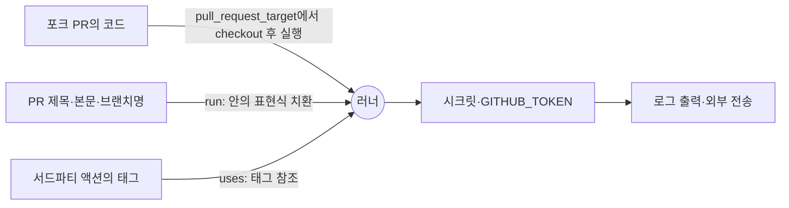

# 5장. 태그는 움직인다: 공급망과 워크플로 보안

2025년 3월 14일, 평소와 다를 것 없는 PR 하나에 CI가 돈다. 테스트는 초록색으로 끝났다. 그런데 로그를 내려보던 누군가가 이상한 줄을 발견한다. 변경된 파일 목록을 뽑는 스텝 아래에 base64로 두 번 인코딩된 긴 문자열 덩어리가 찍혀 있다. 디코딩해보니 이 워크플로가 쓰던 시크릿들이다. 저장소가 공개 저장소라면, 이 로그는 전 세계 누구나 읽을 수 있다.

워크플로 파일은 한 줄도 바뀌지 않았다. 몇 달 전 누군가 `uses: tj-actions/changed-files@v45`라고 적어둔 그대로다. 우리가 바꾼 것이 없는데 파이프라인은 어제와 다른 코드를 실행했다. 어떻게 이런 일이 일어났을까?

## 사례 1: 태그가 가리키는 곳이 바뀌었다

`tj-actions/changed-files`는 PR에서 바뀐 파일 목록을 알려주는, 아주 평범하고 인기 있는 액션이었다. GitHub Advisory와 미국 CISA의 경보에 따르면 공격자는 이 액션의 버전 태그 여러 개를 악성 커밋을 가리키도록 소급해서 바꿨다. v1부터 v45.0.7까지, 사실상 사람들이 쓰던 거의 모든 태그가 대상이었다. 악성 코드는 러너 워커 프로세스의 메모리에서 시크릿을 긁어내 GitHub Actions 로그에 출력했고, 공개 저장소에서는 그 로그가 곧 공개 문서가 됐다. 영향 기간은 2025년 3월 14일부터 15일까지, 취약점 번호는 CVE-2025-30066, CVSS 3.1 점수는 8.6(High)이다. 수정은 v46.0.1에서 이뤄졌다.

피해 규모를 말할 때는 두 숫자를 구분해야 한다. 흔히 인용되는 "23,000개 이상의 저장소"는 이 액션을 쓰던 저장소의 수다. 실제로 비밀 정보가 로그에 유출된 것으로 확인된 저장소는 국내 보안 매체 데일리시큐의 2025년 3월 23일 보도 기준 최소 218개다. 둘 다 사실이지만 서로 다른 것을 잰다. 앞의 숫자는 노출 면적이고, 뒤의 숫자는 확인된 피해다.

더 곤란한 대목은 사고가 거기서 멈추지 않았다는 점이다. 같은 시기 `reviewdog/action-setup@v1`도 침해됐고(CVE-2025-30154), 이 연쇄가 tj-actions 사고와 이어져 있었다. 데일리시큐 보도는 시작점을 한 봇 계정의 PAT 유출로 짚는다. 누군가의 장기 토큰 하나가 액션 하나를 뚫고, 그 액션이 2만 개가 넘는 저장소의 러너 안으로 들어간 것이다. 앞 장에서 장기 자격증명을 없애자고 했던 이유가 여기서 다른 얼굴로 돌아온다.

이 사건에서 기억해둘 것은 하나다. `@v45`는 이름표일 뿐이다. git 태그는 저장소 주인이 언제든 다른 커밋으로 옮길 수 있다. 우리가 워크플로에 적은 것은 "이 코드를 실행하라"가 아니라 "그 이름표가 지금 가리키는 코드를 실행하라"였다.

## 사례 2: PR 제목 한 줄이 명령이 되다

두 번째 사례는 결이 다르다. 2025년 8월, 빌드 도구 Nx의 저장소에서 일어난 이른바 s1ngularity 공격이다. Wiz의 분석(2025년 8월 27일 최초 게시)에 따르면 발단은 2025년 8월 21일에 추가된 워크플로 하나였다. 이 워크플로는 `pull_request_target` 이벤트로 돌면서 PR 제목을 검증 없이 셸 명령에 끼워 넣었다. Wiz의 표현을 빌리면 "검증되지 않은 PR 제목과 `pull_request_target` 권한이 결합해 명령 인젝션이 가능해졌다."

공격자는 PR 제목에 명령을 심은 PR을 열었고, 워크플로는 그 제목을 코드로 실행했다. 이렇게 npm 게시 토큰을 탈취한 공격자는 악성 Nx 패키지를 게시했다. 피해 보고는 무겁다. 유효한 GitHub 토큰 1,000개 이상, 유효한 클라우드 자격증명과 npm 토큰 수십 개, 그리고 약 2만 개의 추가 파일이 유출됐고, 400개가 넘는 사용자·조직과 5,500개가 넘는 저장소가 영향을 받았다. 이 사건의 페이로드가 개발자 머신에 설치된 AI CLI를 악용한 부분은 10장에서 따로 해부하자.

tj-actions와 비교해보면 흥미롭다. tj-actions에서는 우리가 불러온 코드가 바뀌었다. s1ngularity에서는 코드는 그대로였는데, 우리가 데이터로 여긴 문자열이 코드로 실행됐다. 경로는 다르지만 결과는 같다. 우리가 쓴 적 없는 코드가 우리 시크릿 옆에서 실행됐다.

## 무엇이 뚫렸나: 네 가지 속성과 세 가지 규칙

### 분석의 틀

두 사례를 나란히 놓으면 질문이 생긴다. 이런 공격을 하나하나 외워야 할까? 그보다는 틀을 하나 가지는 편이 낫다. 2022년 USENIX Security에 실린 한 연구는 CI 시스템이 지켜야 할 보안 속성을 네 가지로 정리했다. 누가 파이프라인을 트리거할 수 있는가(Admittance Control), 파이프라인 안에서 무엇이 실행될 수 있는가(Execution Control), 어떤 코드가 들어오는가(Code Control), 그리고 시크릿에 누가 닿을 수 있는가(Access to Secrets)다.

이 틀로 보면 s1ngularity는 외부인이 트리거할 수 있는 워크플로(Admittance)에서 신뢰할 수 없는 입력이 실행되고(Execution) 시크릿에 닿은(Access to Secrets) 사건이다. tj-actions는 외부 코드가 검증 없이 들어와(Code Control) 시크릿에 닿은 사건이다. 두 사건 모두 마지막 칸, 시크릿에서 피해가 확정됐다.

같은 연구가 당시 44만 7천여 개 워크플로를 분석해 내놓은 수치도 기억해둘 만하다. 2022년 당시 워크플로의 99.8%가 과권한 상태였다. 읽기 전용이면 충분한 자리에서 저장소 읽기·쓰기 권한을 쥐고 있었다는 뜻이다. 저장소의 97%는 검증되지 않은 제작자의 액션을 최소 하나 실행했고, 18%는 보안 업데이트가 빠진 액션을 쓰고 있었다. 오래된 수치이고, GitHub는 2023년 2월부터 새로 만드는 조직·저장소의 `GITHUB_TOKEN` 기본 권한을 읽기 전용으로 바꿨다. 다만 이미 있던 조직·저장소의 설정은 그대로 두었다. 게다가 2026년 EASE에 실린 연구도 95개 Java 워크플로를 30개 기준으로 점검해 전체 준수율 28%, 권한 통제 항목은 4%라는 결과를 냈다. 권한을 제대로 명시하지 않는 습관은 여전하다고 봐야 한다.

GitHub의 공식 보안 하드닝 문서는 이 문제들을 세 가지 규칙으로 압축한다. 최소 권한, 신뢰할 수 없는 입력은 환경변수로, 그리고 SHA 고정이다. 흥미롭게도 논문들이 지적한 문제도 정확히 이 세 곳, 기본값과 참조 방식에 몰려 있다. 하나씩 보자.


그림 1. 신뢰할 수 없는 입력이 러너 안에서 실행되기까지의 세 경로

### 규칙 1: 권한은 명시하고 좁게

첫 번째 규칙은 이미 앞 장에서 연습했다. 모든 워크플로 최상단에 `permissions:` 블록을 두고, `GITHUB_TOKEN`의 기본 권한은 저장소 콘텐츠 읽기만 허용하자. 쓰기가 필요한 잡에만 필요한 권한을 더한다. 기본값이 무엇이든 거기에 기대지 말고 파일에 적어두는 편이 낫다. 기본값은 조직 설정에 따라, 그리고 시점에 따라 달라지지만 파일에 적힌 권한은 리뷰할 수 있기 때문이다.

### 규칙 2: 신뢰할 수 없는 입력은 환경변수로

두 번째 규칙이 s1ngularity를 막았을 규칙이다. 먼저 찜찜한 코드부터 보자.

```yaml
- name: PR 제목 기록
  run: echo "PR 제목: ${{ github.event.pull_request.title }}"
```

무엇이 문제일까? `${{ }}` 표현식은 셸이 실행되기 전에 스크립트 텍스트에 그대로 치환된다. PR 제목에 따옴표를 닫고 `$(...)` 같은 명령 치환을 심으면, 그 문자열은 제목이 아니라 스크립트의 일부가 된다. 제목, 본문, 브랜치 이름, 커밋 메시지처럼 외부인이 정할 수 있는 값은 모두 이 경로가 될 수 있다.

GitHub 문서의 처방은 간단하다. 표현식의 값을 중간 환경변수에 담고, 스크립트에서는 그 변수를 참조하자.

```yaml
- name: PR 제목 기록
  env:
    PR_TITLE: ${{ github.event.pull_request.title }}
  run: echo "PR 제목: $PR_TITLE"
```

이제 제목은 환경변수의 값으로 전달된다. 셸은 그 값을 문자열로 다룰 뿐 실행하지 않는다. 2023년 USENIX Security에 실린 ARGUS 연구는 워크플로 약 278만 개와 액션 약 3만 2천 개를 분석해 워크플로 4,307개와 액션 80개에서 치명적인 인젝션 취약점을 찾았다. 생각보다 흔한 실수다. 2장에서 로직을 스크립트로 빼자고 했던 원칙이 여기서도 도움이 된다. 입력을 인자나 환경변수로 받는 스크립트는 애초에 표현식을 셸 텍스트에 끼워 넣을 일이 적다.

## SHA 고정: 움직이지 않는 참조

### 태그는 움직인다

세 번째 규칙이 tj-actions를 막았을 규칙이다. GitHub 문서는 이렇게 단언한다. "액션을 전체 길이의 커밋 SHA로 고정하는 것이 현재로서는 액션을 불변 릴리스로 쓰는 유일한 방법이다."

태그가 움직이는 일은 공격자만 하는 것도 아니다. 2026년 ACM REP에 실린 연구는 Software Heritage에 보관된 3억 2,840만 개 저장소에서 태그가 삭제되거나 강제로 옮겨진 사례 1,020만 건을 찾았다. 영향받은 저장소는 18만 9천 개였고, Nixpkgs와 교차 분석한 결과 바뀐 태그를 참조하던 패키지 32개 중 7개에서 실제 빌드 오류가 났다. 연구진의 권고는 명료하다. 빌드 시스템과 패키지 관리자는 의존성을 암호학적 커밋 해시로 고정하라.

그래서 이 장부터 이 책의 예제 표기가 바뀐다. 지금까지는 `actions/checkout@v7`처럼 메이저 태그로 적었지만, 이제부터는 모든 액션을 커밋 SHA로 고정하고 사람이 읽을 수 있도록 버전을 주석으로 붙인다. 책에서는 실제 SHA 대신 `<commit-sha>`라는 자리표시자를 쓴다. 여러분의 저장소에서는 해당 릴리스의 40자리 커밋 SHA를 넣으면 된다.

```yaml
permissions:
  contents: read

jobs:
  test:
    runs-on: ubuntu-latest
    steps:
      - uses: actions/checkout@<commit-sha> # v7.0.1
      - run: make test
```

### 사람의 규율을 정책으로

SHA 고정의 약점은 사람이 지켜야 한다는 데 있다. 팀원 다섯 명 중 한 명이 급한 날 `@v4`라고 적으면 끝이다. 에이전트가 만든 PR이라면 더하다. 그래서 규칙은 정책으로 강제하는 편이 낫다. 2025년 8월부터 GitHub는 조직·저장소 정책으로 전체 SHA로 고정되지 않은 액션의 실행을 거부할 수 있게 했다. 같은 정책에서 액션 이름 앞에 `!`를 붙여 특정 액션이나 버전을 차단할 수도 있는데, 차단 목록은 마지막에 평가되어 다른 허용 정책을 덮어쓴다. 사고가 난 액션을 조직 전체에서 한 번에 막을 수 있다는 뜻이다. HN의 한 개발자가 짧게 정리했다. "조직 수준에서 해시로 고정된 액션만 허용하도록 강제할 수 있다."

### 갱신은 봇에게, 머지는 사람에게

SHA로 고정하면 새 버전이 나와도 자동으로 따라가지 않는다. 보안 패치도 마찬가지다. 그렇다면 40자리 해시를 손으로 갱신해야 할까? 번거로운 일은 봇에게 맡기자. Renovate는 태그 참조를 SHA로 바꾸는 PR을 올리고, 이후 버전을 올릴 때도 SHA를 올리면서 어느 태그인지 주석으로 남겨준다. Dependabot도 `github-actions` 생태계를 갱신 대상으로 삼을 수 있다.

```yaml
# .github/dependabot.yml
version: 2
updates:
  - package-ecosystem: "github-actions"
    directory: "/"
    schedule:
      interval: "weekly"
```

2026년 7월부터 Dependabot은 새 릴리스가 레지스트리에 올라온 뒤 최소 3일이 지나야 버전 업데이트 PR을 연다. 이 기본 쿨다운은 공급망 방어로서도 의미가 있다. 막 게시된 악성 버전이 발견되고 내려갈 시간을 버는 셈이기 때문이다. 보안 업데이트는 쿨다운을 무시하고 바로 올라온다.

그런데 함정이 하나 있다. Lobsters의 한 개발자에 따르면, tj-actions 사고에서 가장 심하게 당한 프로젝트들이 바로 SHA 고정을 하고 봇으로 해시를 갱신하던 곳이었다. 그는 수백 개 프로젝트가 고정된 해시를 올리는 봇 PR을 자동으로 수락하고 있었다고 지적했다. 봇이 악성 커밋의 SHA를 제안하고 자동 머지가 그걸 받아들이면, SHA 고정은 아무것도 지켜주지 못한다. 갱신은 봇이 하되, 머지는 사람이 변경 내용을 보고 하자.

### SHA 고정은 충분한가

물론 SHA 고정이 만능은 아니다. 커뮤니티의 논쟁은 크게 세 갈래다. 첫째, 불충분하다는 쪽이 있다. 내가 고정한 액션이 내부에서 다른 액션을 태그로 부르면 그 부분은 여전히 움직인다. "SHA 고정은 한 단계만 막아준다"는 지적이고, GitHub Actions에는 전이 의존까지 묶는 잠금 파일이 없다는 불만이다. 둘째, 과하다는 쪽이 있다. 취약점 알림을 잃고 유지보수 부담이 늘며, 불변 릴리스가 보급되면 가치가 사라진다는 주장이다. 셋째, 핵심은 코드 감사보다 권한 축소라는 쪽이다. 러너가 애초에 불필요한 권한을 갖지 않으면 악성 코드가 할 수 있는 일도 줄어든다.

이 책의 입장은 세 관점을 겹쳐 쓰는 것이다. SHA 고정은 가장 싸고 확실한 첫 단계이고, 권한 축소가 그 뒤를 받치며, 전이 의존은 아직 남은 구멍으로 인정한다. GitHub는 2026년 3월 발표한 보안 로드맵에서 직·간접 의존을 모두 커밋 SHA로 잠그는 `dependencies:` 기능을 예고했다. 어디까지나 로드맵이고, 2026년 9월 기준 출시 여부는 확인하지 못했다. 이 부분은 빠르게 바뀔 수 있으니 공식 발표를 지켜보자.

## pull_request_target과 포크 PR

s1ngularity의 무대였던 `pull_request_target`을 조금 더 들여다보자. 이 이벤트는 포크에서 온 PR에 대해 워크플로를 기준 저장소의 맥락에서 실행한다. 그래서 시크릿과 쓰기 권한 토큰에 닿을 수 있다. 라벨을 붙이거나 코멘트를 다는 용도로 만들어진 기능인데, 여기서 PR의 코드를 체크아웃해 실행하는 순간 외부인의 코드가 우리 시크릿 옆에서 돈다.

GitHub는 이 문제에 기본값으로 대응하고 있다. 퍼블릭 저장소에서 `pull_request_target` 이벤트를 막는 기본 정책이 현재 평가(evaluate) 모드로 돌고 있고, 2026년 11월 2일에 강제될 예정이다. 프라이빗·내부 저장소에는 적용되지 않는다. 날짜가 이 책의 출간 시점과 가깝다. 여러분이 이 문단을 읽는 시점에는 이미 시행됐을 수 있으니, 공식 문서에서 현재 상태를 확인해보자.

`actions/checkout`도 바뀌었다. 2026년 6월 18일 나온 v7은 `pull_request_target`과 `workflow_run` 워크플로에서 포크 PR의 코드를 가져오기를 거부하고, 이 변경은 2026년 7월 16일까지 지원 중인 이전 버전에도 백포트됐다. 굳이 가져와야 한다면 `allow-unsafe-pr-checkout: true`로 우회할 수 있지만, 문서가 붙인 조건을 잘 읽어두자. 체크아웃한 코드를 오직 데이터로만 들여다보고, 절대 실행하지 않을 때만이다. 테스트를 돌리거나 `npm install`을 하는 순간 그 조건은 깨진다.

ticketbox는 프라이빗 저장소라 포크 PR이 들어올 일은 드물다. 그래도 원칙은 같다. 외부 기여를 검증하는 워크플로는 시크릿이 없는 `pull_request`로 돌리고, `pull_request_target`은 가능하면 쓰지 않는다.

## 증명과 불변성

지금까지는 들어오는 코드를 막는 이야기였다. 방향을 뒤집어보자. 우리가 내보내는 산출물을 받는 쪽은 그것이 정말 우리 파이프라인에서 만들어졌다는 걸 어떻게 알 수 있을까?

GitHub의 artifact attestation은 산출물의 다이제스트를 in-toto 형식의 SLSA provenance에 묶고, Sigstore의 단기 인증서로 서명한다. "이 파일은 이 저장소의 이 워크플로가 이 커밋에서 만들었다"는 증명서를 붙이는 셈이다. 공식 문서에 따르면 attestation만으로 SLSA v1.0 Build Level 2를 충족하고, 재사용 워크플로로 빌드 지침을 저장소 밖에 두면 Level 3까지 올라간다. 2026년 9월 기준 신규 구현에는 `actions/attest`(v4.2.2)를 쓰도록 권장하며, 예전의 `attest-build-provenance`는 v4부터 이 액션의 래퍼가 됐다. 받는 쪽은 `gh attestation verify`로 증명을 검증한다. 6장에서 ECR에 올리는 ticketbox 이미지에 이 증명을 붙이게 된다.

우리가 직접 액션이나 라이브러리를 배포하는 쪽이라면 불변 릴리스도 챙기자. 2025년 10월 GA된 immutable releases는 한번 게시한 릴리스의 에셋을 추가·수정·삭제할 수 없게 하고, 태그도 옮기거나 지울 수 없게 막는다. 발표 당시 HN의 반응이 이 장의 주제를 요약한다. "잠깐, 전에는 불변이 아니었다고?"

2022년 SCORED에 실린 한 연구는 안전한 공급망의 속성을 투명성, 유효성, 분리 세 단어로 정리했다. 이 장에서 다룬 도구들을 여기에 얹어보면 그림이 선명해진다. attestation과 서명은 무엇이 어디서 만들어졌는지 드러내는 투명성과 유효성이다. 4장의 OIDC 단기 자격증명과 GitHub 환경, 빌드 잡과 배포 잡의 시크릿 분리는 분리다.

## 스캐너는 여러 관점으로

규칙을 다 알아도 수십 개 워크플로를 사람 눈으로만 점검하기는 번거롭다. 도구의 도움을 받자. 2025년 4월 GA된 CodeQL의 워크플로 분석은 워크플로 YAML 자체를 코드로 보고 권한 누락이나 스크립트 인젝션을 찾는다. 프리뷰 기간에만 158,000개가 넘는 저장소에서 80만 건 이상의 잠재 취약점을 찾았고, 그중 약 15%가 수정됐다. 가장 흔한 발견 중 하나가 `actions/missing-workflow-permissions`, 즉 `permissions:` 블록 누락이었다.

그렇다고 스캐너 하나를 돌리고 안심해도 될까? 2026년 한 프리프린트는 워크플로 보안 스캐너 9종을 2,722개 워크플로에 돌려 비교했다. 결론은 스캐너마다 분석 전략이 근본적으로 달라, 보고하는 약점의 종류와 수에 큰 격차가 난다는 것이다. 하나의 스캐너가 조용하다는 것은 "이 스캐너가 보는 방식으로는 문제가 없다"는 뜻일 뿐이다. 관점이 다른 도구를 둘 이상 겹쳐 쓰는 편이 낫다. 러너의 외부 통신을 감시하고 통제하는 step-security/harden-runner 같은 도구도 선택지로 알아두자.

### AI와 함께 쓸 때

요즘은 워크플로 YAML도 AI에게 부탁해 받는 경우가 많다. 빠르고 편하다. 문제는 AI가 학습한 수많은 예제가 이 장 이전의 표기, 즉 태그 참조와 권한 블록 없는 워크플로라는 점이다. AI가 써준 워크플로를 받았다면 적어도 세 곳은 직접 눈으로 확인하자.

첫째, `uses:` 줄이다. 태그로 적혀 있다면 SHA로 바꾸고 버전 주석을 붙인다. 조직 정책으로 SHA 고정을 강제해두었다면 이 실수는 실행 단계에서 막힌다. 둘째, `run:` 블록 안의 `${{ github.event.* }}`다. PR 제목이나 이슈 본문 같은 값이 셸 텍스트에 직접 들어가 있다면 환경변수로 옮긴다. 셋째, `permissions:` 블록이다. 빠져 있거나 `write-all`처럼 넓다면 필요한 최소한으로 줄인다.

그렇다면 이 검토 자체를 LLM에게 맡기면 어떨까? 앞서 본 2026년 EASE 연구는 LLM을 워크플로 감사에 써봤다. 여러 LLM의 판정 일치도는 Fleiss κ=0.28로 낮았다. 같은 워크플로를 두고 모델마다 판정이 흔들린다는 뜻이다. 연구진은 다단계 판정으로 검증 노력을 81% 줄일 수 있었지만, 전문가를 대체할 수는 없다고 결론 내렸다. LLM 감사는 사람이 볼 곳을 좁혀주는 1차 필터로 쓰고, 최종 판단은 CodeQL 같은 결정적 도구와 사람의 리뷰에 맡기자.

### 이 장의 핵심

- 태그는 이름표일 뿐이다. tj-actions는 태그를 소급해 옮겨 23,000개 이상 저장소가 쓰던 액션을 오염시켰고, 최소 218개 저장소에서 시크릿 유출이 확인됐다.
- s1ngularity는 `pull_request_target`과 셸 텍스트에 치환된 PR 제목이 만나 명령 인젝션이 된 사건이다. 신뢰할 수 없는 입력은 환경변수로 넘긴다.
- GitHub 공식 하드닝의 세 규칙은 최소 권한, 입력은 env로, SHA 고정이다. 논문이 지적한 문제도 같은 곳에 몰려 있다.
- SHA 고정은 조직 정책으로 강제하고, 갱신은 봇에 맡기되 자동 머지는 하지 않는다. 전이 의존은 아직 남은 구멍이다.
- 스캐너와 LLM 감사는 하나로 안심하지 말고 겹쳐 쓴다. attestation으로 내보내는 산출물의 출처도 증명한다.

## 체크리스트로 매듭짓기

ticketbox 저장소와 조직에 걸어둘 보안 기본기를 한곳에 모아보자. 이 목록은 이 책에서 딱 한 번만 제시한다.

1. 모든 워크플로에 `permissions:` 블록을 명시하고, `GITHUB_TOKEN`의 기본 권한은 콘텐츠 읽기로 둔다.
2. `${{ github.event.* }}` 같은 외부 입력은 `run:`에 직접 넣지 않고 환경변수로 넘긴다.
3. 모든 액션을 전체 커밋 SHA로 고정하고, 조직 정책으로 강제한다. 갱신은 Renovate나 Dependabot으로 하되 자동 머지하지 않는다.
4. 클라우드 인증은 OIDC로 하고, 신뢰 정책의 `sub`는 환경이나 브랜치로 좁힌다.
5. 빌드·테스트 잡에는 시크릿을 두지 않고, 배포 시크릿은 main과 GitHub 환경에만 둔다.
6. 퍼블릭 저장소에는 self-hosted 러너를 쓰지 않는다.
7. 포크 PR은 `pull_request`로 처리하고 `pull_request_target`은 피한다. checkout v7의 기본 거부를 우회하지 않는다.
8. `.github/workflows/`는 CODEOWNERS로 보호한다.
9. 워크플로 스캐너는 관점이 다른 것을 둘 이상 쓰고, LLM 감사는 1차 필터로만 쓴다.
10. 내보내는 산출물에 attestation을 붙이고 배포 전에 검증한다.

열 줄짜리 목록은 누구나 고개를 끄덕이며 읽는다. 그리고 다음 달이면 누군가 급한 PR에서 3번을 잊는다. 이 목록은 사람의 규율이 아니라 정책으로 강제될 때만 지켜진다.
