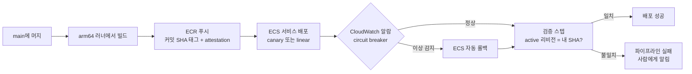

# 6장. AWS로 보내기: ECS, Lambda, 그리고 Terraform

앞 장에서 우리는 태그 대신 SHA를 박았다. 워크플로가 부르는 액션은 이제 움직이지 않는다. 4장에서는 장기 키도 걷어냈다. 이제 그 파이프라인으로 만든 이미지를 AWS에 올릴 차례다.

그런데 한 가지 짚고 가자. 이미지를 올리고, 배포 액션이 초록색 체크로 끝났다고 해보자. 방금 올린 그 이미지가 지금 실제로 트래픽을 받고 있는지는 누가 알려줄까? 배포 로그일까, 아니면 다른 무엇일까? 이 질문을 품고 ticketbox의 AWS 쪽 세 구성 요소, 예매 API 컨테이너(`apps/api`), 알림 함수(`functions/notify`), 그리고 인프라(`infra/`)의 파이프라인을 차례로 짜보자.

## 이미지부터: 커밋 SHA로 이름 붙이기

ECS 배포는 이미지에서 시작한다. 이미지에 붙이는 태그부터 정하자. 가장 흔한 실수는 `:latest`다. 편하지만, `:latest`가 지금 무엇을 가리키는지는 마지막으로 푸시한 사람만 안다. 5장에서 액션의 태그가 움직여서 곤란했던 것처럼, 이미지 태그도 움직이면 곤란하다. 롤백하려 해도 "이전 버전"이 무엇이었는지 특정할 수 없다.

그래서 ticketbox는 이미지 태그로 커밋 SHA를 쓴다. `ticketbox-api:3f9c2e1...`처럼 말이다. 그러면 어떤 이미지가 어떤 코드에서 나왔는지 태그만 보고 알 수 있고, 롤백은 "이전 커밋의 SHA로 다시 배포"라는 단순한 동작이 된다. 한국의 사이드 프로젝트 저장소들에서도 `:latest` 대신 커밋 SHA로 이미지 태그를 고정하자는 이슈가 반복해서 올라온다. 한번 데여본 사람들이 공통으로 도착하는 결론인 셈이다.

빌드할 러너도 골라보자. ticketbox의 ECS 태스크와 Lambda가 Graviton(arm64)에서 돈다면, 빌드도 arm64 러너에서 하는 편이 자연스럽다. GitHub의 arm64 호스티드 러너는 2025년 8월 퍼블릭 저장소에, 2026년 1월 프라이빗 저장소에 열렸다(`ubuntu-24.04-arm` 라벨). 가상화나 에뮬레이션 없이 네이티브로 빌드하니, x64 러너에서 QEMU로 arm64 이미지를 만드느라 기다리던 시간이 사라진다. 3장에서 봤듯 분당 요금도 x64보다 싸다.

레지스트리 로그인은 `aws-actions/amazon-ecr-login`이 맡는다. 4장의 OIDC로 역할을 가정한 뒤 이 액션을 부르면 ECR에 푸시할 준비가 끝난다. 여기서 역할을 하나 더 나누자. 이미지를 푸시하는 빌드 잡은 ECR 쓰기만 할 수 있는 `ticketbox-ecr-push` 역할을 쓰고, 신뢰 정책은 main 브랜치(`ref:refs/heads/main`)로 좁힌다. ECS 서비스를 바꾸는 배포 역할(`ticketbox-deploy`)은 4장에서 만든 대로 `production` 환경에서만 가정할 수 있다. 빌드 잡이 뚫려도 서비스까지는 닿지 못하게 하는 분리다.

마지막으로, 5장에서 예고했듯 푸시한 이미지에 출처 증명을 붙이자. 빌드 잡 끝에서 `actions/attest`로 이미지 다이제스트에 attestation을 만들어두면, 나중에 배포하기 전이나 사고를 조사할 때 `gh attestation verify`로 "이 이미지는 ticketbox 저장소의 이 워크플로가 이 커밋에서 만들었다"를 확인할 수 있다. 입력 설정은 액션 버전에 따라 달라지니 공식 문서의 컨테이너 이미지 예제를 따르자.

## ECS에 올리기

### CodeDeploy 없이 점진 배포

ECS에 새 버전을 안전하게 내보내는 방법은 최근 1년 사이 크게 바뀌었다. 예전에는 blue/green 배포를 하려면 AWS CodeDeploy를 따로 붙여야 했다. 2025년 7월 17일, ECS가 자체 blue/green 배포를 내놓았다. ALB·NLB·Service Connect와 함께 동작하고, Lambda로 구현하는 라이프사이클 훅, 베이크 기간 중의 자동 롤백, CloudWatch 알람과 배포 circuit breaker 연동을 지원한다. 2025년 10월 30일에는 linear와 canary 방식이 추가됐고, 2026년 2월에는 NLB에서도 linear·canary를 쓸 수 있게 됐다.

linear는 트래픽을 같은 비율의 단계로 나눠 옮기며 단계마다 베이크 시간을 둔다. canary는 소량의 트래픽을 먼저 보낸 뒤 canary 베이크 시간이 지나면 나머지를 한 번에 옮긴다. 2026년 9월 기준으로 정리하면, ECS의 점진 배포에 CodeDeploy는 이제 필수가 아니다.

여기서 주의할 것이 하나 있다. 2025년 9월에 나온 AWS 블로그의 CodeDeploy 이관 가이드에는 "ECS blue/green은 all-at-once만 지원한다"는 문장이 있다. 글이 쓰일 당시에는 맞았지만 한 달 반 뒤에 틀린 말이 됐다. 검색하다 이 문장을 만나면 날짜를 확인하자. 같은 글에서 여전히 유효한 설명도 있다. CodeDeploy는 TaskSet이라는 단위로, ECS 네이티브 배포는 ServiceRevision이라는 단위로 배포를 다룬다. CodeDeploy에서 쓰던 대기 시간(wait time) 옵션은 ECS에서는 훅으로 구현해야 한다.

트래픽을 몇 퍼센트씩, 얼마 동안 옮길지는 서비스의 배포 설정으로 정해두고, 워크플로는 새 태스크 정의를 서비스에 건네기만 한다. 카나리 비율과 베이크 시간을 어떻게 고를지, Cloudflare Workers의 점진 배포와는 무엇이 다른지는 8장에서 두 플랫폼을 나란히 놓고 비교하자. 이 장에서는 파이프라인의 골격에 집중한다.

### 배포 워크플로 골격

ticketbox의 `apps/api` 배포 워크플로를 짜보자. 5장의 규약대로 모든 액션은 SHA로 고정했고, 로직은 2장의 원칙대로 스크립트로 뺐다.

```yaml
name: deploy-api
on:
  push:
    branches: [main]

permissions:
  contents: read

concurrency:
  group: deploy-api-production
  cancel-in-progress: false
  queue: max

jobs:
  build:
    runs-on: ubuntu-24.04-arm
    permissions:
      contents: read
      id-token: write
    steps:
      - uses: actions/checkout@<commit-sha> # v7.0.1
      - uses: aws-actions/configure-aws-credentials@<commit-sha> # v6.3.0
        with:
          role-to-assume: arn:aws:iam::123456789012:role/ticketbox-ecr-push
          aws-region: ap-northeast-2
      - id: ecr
        uses: aws-actions/amazon-ecr-login@<commit-sha> # v2.1.7
      - run: ./scripts/build-and-push-api.sh "${{ steps.ecr.outputs.registry }}" "$GITHUB_SHA"

  deploy:
    needs: build
    runs-on: ubuntu-latest
    environment: production
    permissions:
      contents: read
      id-token: write
    steps:
      - uses: actions/checkout@<commit-sha> # v7.0.1
      - uses: aws-actions/configure-aws-credentials@<commit-sha> # v6.3.0
        with:
          role-to-assume: arn:aws:iam::123456789012:role/ticketbox-deploy
          aws-region: ap-northeast-2
      - run: ./scripts/render-taskdef.sh "$GITHUB_SHA" > taskdef.json
      - uses: aws-actions/amazon-ecs-deploy-task-definition@<commit-sha> # v2.6.3
        with:
          task-definition: taskdef.json
          cluster: ticketbox
          service: ticketbox-api
          wait-for-service-stability: true
      - run: ./scripts/verify-ecs-deploy.sh ticketbox ticketbox-api "$GITHUB_SHA"
```

몇 가지를 짚어보자. 배포 워크플로의 concurrency는 2장에서 이야기한 대로 취소하지 않고 줄을 세운다(`queue: max`). 배포 도중에 다음 push가 들어왔다고 진행 중인 배포를 끊으면, 서비스가 어중간한 상태에 남을 수 있다. 빌드 잡은 arm64 러너에서 ECR 푸시 역할로, 배포 잡은 `production` 환경을 거쳐 배포 역할로 돈다. 태스크 정의에 새 이미지 태그를 끼워 넣는 일은 `render-taskdef.sh`가 한다. 이 스크립트는 로컬에서도 똑같이 돌려볼 수 있다.

그리고 마지막 줄, `verify-ecs-deploy.sh`가 이 장의 핵심이다. 배포 액션이 이미 서비스가 안정될 때까지 기다렸는데, 왜 한 번 더 확인해야 할까?

## "성공"의 함정

`amazon-ecs-deploy-task-definition` 저장소의 이슈 #191은 제목부터 등골이 서늘하다. 요약하면 이렇다. circuit breaker가 롤백을 일으킨 뒤 서비스가 안정화되면, 이 GitHub 액션은 성공을 보고한다.

상황을 그려보자. 새 태스크 정의로 배포가 시작됐다. 새 컨테이너가 헬스체크를 계속 통과하지 못하자 circuit breaker가 작동해 서비스를 이전 태스크 정의로 되돌렸다. 이전 버전은 멀쩡하니 서비스는 곧 안정된다. 액션은 "서비스가 안정됐다"를 확인하고 초록색 체크를 띄운다. 팀은 새 기능이 나갔다고 믿고 퇴근한다. 실제로 트래픽을 받는 건 어제 버전인데 말이다. 롤백이 제대로 작동했다는 점에서는 다행이지만, 파이프라인이 그 사실을 알려주지 않았다는 점에서는 끔찍한 일이다.

무엇이 잘못됐을까? "서비스가 안정됐다"와 "내가 올린 버전이 배포됐다"를 같은 것으로 취급했다. 이슈에서 제안된 해법도 여기서 출발한다. 안정화된 뒤에, 기대한 태스크 리비전이 active 배포에 들어 있는지 확인하라. 이 확인을 스크립트로 만들자.

```bash
#!/usr/bin/env bash
# scripts/verify-ecs-deploy.sh CLUSTER SERVICE EXPECTED_SHA
set -euo pipefail
cluster="$1"; service="$2"; expected="$3"

read -r task_def rollout < <(aws ecs describe-services \
  --cluster "$cluster" --services "$service" \
  --query 'services[0].deployments[?status==`PRIMARY`] | [0].[taskDefinition, rolloutState]' \
  --output text)

image=$(aws ecs describe-task-definition --task-definition "$task_def" \
  --query 'taskDefinition.containerDefinitions[0].image' --output text)

if [[ "$image" != *":${expected}" || "$rollout" != "COMPLETED" ]]; then
  echo "::error::active 리비전이 기대와 다르다 (image=${image}, rollout=${rollout})"
  exit 1
fi
echo "active 리비전 확인: ${image}"
```

스크립트가 하는 일은 단순하다. 서비스의 현재 주 배포(PRIMARY)가 가리키는 태스크 정의를 찾고, 그 이미지 태그가 방금 배포한 커밋 SHA로 끝나는지, 롤아웃이 완료 상태인지 본다. 롤백이 일어났다면 주 배포는 이전 태스크 정의를 가리킬 테고, 이미지 태그가 맞지 않으니 파이프라인이 실패한다. 이미지 태그를 커밋 SHA로 붙여둔 덕분에 이 비교가 한 줄로 끝난다. 앞에서 한 선택이 여기서 값을 한다. 다만 이 스크립트는 롤링 배포를 기준으로 짠 것이다. 네이티브 blue/green·linear·canary 배포는 서비스 리비전(ServiceRevision)과 서비스 배포 단위로 진행되니, `rolloutState`가 롤링 배포와 같은 의미로 채워진다고 가정하지 말자. 그런 서비스라면 `aws ecs list-service-deployments`와 `describe-service-deployments`로 최근 서비스 배포의 상태와 대상 리비전을 조회하도록 스크립트를 바꾸는 편이 확실하다.


그림 1. ticketbox `apps/api`의 AWS 배포 파이프라인과 검증 스텝

한국의 사이드 프로젝트 저장소들에서도 비슷한 패턴이 보인다. 헬스체크가 실패하면 이전 이미지 태그로 되돌리고, 그 롤백마저 실패하면 파이프라인을 분명하게 실패시킨다. 어느 쪽이든 원칙은 같다. 배포가 성공했는지는 배포 도구의 종료 코드가 아니라 실제로 돌고 있는 것을 보고 판정한다.

circuit breaker 자체도 과신하지 말자. AWS containers-roadmap 이슈 #1488에는 자동 롤백을 켜두었는데도 circuit breaker가 FAILED 상태에 머문 채 롤백하지 않았다는 보고가 올라와 있다. 안전장치에도 사각지대가 있다. 검증 스텝이 그 사각지대를 메우는 마지막 그물이다.

## 새 컨테이너 앱이라면: ECS Express Mode

ticketbox 팀에 새 요구가 생겼다고 해보자. 관리자용 작은 API 하나를 따로 띄우고 싶다. ALB, 타깃 그룹, 오토스케일링까지 하나하나 Terraform으로 짜기에는 번거롭다. 예전 같으면 AWS App Runner가 떠올랐을 것이다.

그런데 App Runner는 2026년 4월 30일부터 신규 고객을 받지 않는다. 그 전에 가입한 기존 고객은 계속 쓸 수 있지만, 이 책을 읽고 새로 시작하는 팀은 쓸 수 없다. AWS가 대안으로 내놓은 것은 2025년 11월 발표된 ECS Express Mode다. 이미지 하나만 주면 ECS 서비스와 HTTPS 엔드포인트, 오토스케일링을 만들어주고, 만들어진 리소스는 계정 안에 그대로 드러난다. 모든 AWS 리전에서 추가 요금 없이 쓸 수 있고, 2026년 9월에는 Graviton도 지원하게 됐다.

리소스가 계정에 노출된다는 점이 파이프라인 관점에서 반갑다. 간편하게 시작하되, 나중에 이 장에서 본 점진 배포나 검증 스텝을 붙이고 싶어질 때 ECS의 세계를 벗어나지 않아도 되기 때문이다.

## Lambda: 함수 코드와 인프라의 경계

알림 함수 `functions/notify`는 Lambda에서 돈다. 2025년 8월 AWS는 공식 GitHub 액션 `aws-actions/aws-lambda-deploy`를 내놓았다. zip과 컨테이너 이미지를 모두 지원하고, 패키징을 자동으로 해주며, OIDC로 인증한다. 런타임·메모리·타임아웃·환경변수를 선언적으로 설정할 수 있고, dry-run을 지원하며, 큰 패키지는 S3를 거쳐 올린다.

```yaml
      - uses: aws-actions/aws-lambda-deploy@<commit-sha> # 릴리스 페이지에서 버전 확인
        with:
          function-name: ticketbox-notify
          code-artifacts-dir: functions/notify/dist
```

zip으로 배포할 때는 `code-artifacts-dir`에 넘긴 디렉터리를 액션이 압축해 올린다. 입력 이름은 2026년 9월 기준 공식 README를 따랐다. 그런데 여기서 한 가지 경계를 정해야 한다. 이 액션은 함수 코드를 올리는 도구다. 함수가 존재한다는 사실 자체, 함수가 쓰는 IAM 역할, 어떤 SQS 큐나 이벤트가 이 함수를 깨우는지 같은 인프라는 누가 관리할까? ticketbox에서는 그것을 `infra/`의 Terraform이 맡는다. 함수 코드는 액션이, 함수를 둘러싼 인프라는 Terraform이 소유한다.

이 경계를 흐리면 곤란해진다. 예를 들어 메모리 설정을 액션의 선언적 설정으로도 바꾸고 Terraform으로도 관리하면, 둘이 서로의 변경을 덮어쓰며 조용히 싸운다. 설정 하나에 주인은 하나만 두자. 반대로 함수와 이벤트 소스, 권한까지 한 덩어리로 배포하고 싶다면 SAM이나 CDK처럼 인프라 전체를 다루는 도구가 맞는다. 공식 액션은 "코드만 바꾸는 배포"에 쓸 때 가장 깔끔하다.

## Terraform: plan은 PR에서, apply는 머지 후에

### 두 개의 워크플로, 두 개의 역할

인프라 변경은 코드 변경보다 되돌리기 어렵다. 그래서 HashiCorp가 권하는 흐름은 리뷰를 인프라 변경의 한가운데 둔다. PR에 커밋이 올라올 때마다 추측 실행(speculative plan)을 돌려 결과를 PR에 붙이고, 리뷰어는 코드 diff와 함께 "이 변경이 실제 인프라에 무엇을 할지"를 본다. main에 머지되면 그때 apply한다.

```yaml
name: infra-plan
on:
  pull_request:

permissions:
  contents: read
  id-token: write
  pull-requests: write

jobs:
  plan:
    runs-on: ubuntu-latest
    steps:
      - uses: actions/checkout@<commit-sha> # v7.0.1
      - uses: aws-actions/configure-aws-credentials@<commit-sha> # v6.3.0
        with:
          role-to-assume: arn:aws:iam::123456789012:role/ticketbox-infra-plan
          aws-region: ap-northeast-2
      - uses: hashicorp/setup-terraform@<commit-sha> # v4.0.1
      - run: ./scripts/tf-plan.sh infra
```

여기서 4장의 역할 분리가 진가를 발휘한다. PR에서 도는 plan 잡은 `ticketbox-infra-plan` 역할을 쓰고, 이 역할의 신뢰 정책은 PR 이벤트의 `sub`(`repo:ticketbox-org/ticketbox:pull_request`, 2026년 7월 15일 이후 만든 저장소라면 4장에서 본 ID가 붙은 형식)를 받아들인다. 대신 권한은 리소스 조회와 상태 파일 읽기, 잠금에 필요한 만큼으로 제한한다. 왜 이렇게까지 조일까? PR 브랜치에서는 누구든 `tf-plan.sh`를 고쳐 `terraform apply`를 부르게 만들 수 있기 때문이다. 스크립트가 무엇을 하든, 역할이 쓰기 권한을 갖고 있지 않으면 아무것도 바꾸지 못한다. apply 워크플로는 main push에서 `production` 환경을 거쳐, 쓰기 권한을 가진 별도 역할로 돈다.

### plan이 너무 클 때

plan 결과를 PR 코멘트로 붙이는 방식은 편하지만 한계가 있다. PR 코멘트에는 길이 제한이 있어서(GitHub API의 오류 메시지 기준 최대 65,536자) 리소스가 많이 바뀌는 plan은 코멘트 게시 자체가 실패할 수 있다. 그렇다고 plan을 잘라서 보여주면 리뷰어가 정작 중요한 부분을 못 볼 수도 있다.

그래서 ticketbox의 `tf-plan.sh`는 역할을 나눈다. PR 코멘트에는 추가·변경·삭제 리소스 개수와 삭제되는 리소스 목록처럼 리뷰어가 먼저 봐야 할 요약만 남긴다. plan 전문은 워크플로 아티팩트로 올리고, 잡의 Step Summary에도 기록한다. 리뷰어는 요약에서 위험 신호를 보고, 필요하면 전문을 연다. 특히 "destroy"가 한 줄이라도 있으면 요약 맨 위에 올려두자. 사람의 눈이 가장 먼저 닿아야 할 곳이다.

### CDK냐 Terraform이냐

AWS 인프라를 코드로 다루는 도구를 두고 커뮤니티의 의견은 꽤 갈린다. Terraform 쪽은 드리프트 감지와 변경 미리보기, 파이프라인 도구가 성숙했고 git에 커밋된 Terraform 코드가 조직의 기억 역할을 한다고 말한다. CDK·CloudFormation 쪽은 AWS만 쓴다면 진짜 프로그래밍 언어로 추상화할 수 있고, 흔한 스택에서는 롤백이 조용하게 잘 된다고 말한다. SAM이나 순수 CloudFormation, Pulumi, Terraform의 라이선스 변경 뒤 등장한 OpenTofu를 고르는 사람들도 있다.

한 HN 댓글이 이 논쟁을 다른 각도에서 비춘다. Terraform에 대한 불만은 대개 본질적으로 수명이 짧은 인프라를 관리하는 사람의 시각에서 나온다는 것이다. 여러 팀이 공유하는 오래가는 인프라를 관리하는 플랫폼 팀과, 자기 서비스에 딸린 리소스를 자주 바꾸는 앱 팀은 같은 도구에서 다른 경험을 한다. ticketbox는 다섯 명이 AWS와 Cloudflare를 함께 쓰는 앱 팀이다. 변경 미리보기를 PR 리뷰에 붙이기 쉽고, 나중에 Cloudflare 쪽 설정까지 같은 도구로 다룰 여지가 있다는 점에서 Terraform을 택했다. 참고로 Terraform CDK(CDKTF)는 HashiCorp가 2025년 12월 10일부로 개발·유지보수를 끝내고 저장소를 보관(archive) 상태로 돌렸다. 코드는 읽기 전용으로 남아 있지만 호환성 업데이트도 없으니, 새로 도입할 선택지는 아니다.

### AI와 함께 쓸 때

Terraform 코드도 이제 AI가 많이 써준다. 여기서 두 연구를 겹쳐 보자. 2019년 ICSE에 실린 IaC 보안 스멜 연구는 293개 저장소의 스크립트 1만 5천여 개에서 스멜 21,201건을 찾았고, 그중 하드코딩된 비밀번호가 1,326건이었다. AI 코딩 도구가 학습한 공개 코드에도 이런 스멜이 섞여 있을 가능성이 크다. AI가 제안한 IaC에서 같은 스멜이 나와도 놀랄 일은 아니다. 2023년 CCS에 실린 사용자 실험은 더 불편한 사실을 보여준다. AI 어시스턴트를 쓴 참가자는 덜 안전한 코드를 썼을 뿐 아니라, 자기가 안전한 코드를 썼다고 믿는 경향이 더 강했다.

AI를 쓴 사람이 오히려 안심한다면, 안심하지 않는 장치가 파이프라인에 있어야 한다. ticketbox에서 그 장치는 plan-on-PR 코멘트다. 누가 썼든, AI가 썼든, 인프라 변경은 PR의 plan 요약을 사람이 읽고 승인해야 main에 들어간다. 그 코멘트가 사람이 보는 마지막 지점이다. 요약 맨 위의 destroy 목록과 보안 그룹·IAM 정책 변경은 특히 천천히 읽자.

그리고 에이전트에게 apply 권한을 주지 말자. 에이전트가 PR을 열고 plan을 돌려보는 것까지는 좋다. plan 역할은 읽기 전용이니 무엇을 시도하든 인프라는 바뀌지 않는다. apply는 `production` 환경을 거쳐야만 가정할 수 있는 역할로 하도록 앞에서 설계해뒀다. 에이전트가 main에 직접 푸시할 수 없고 환경 보호 규칙이 걸려 있는 한, 이 설계가 곧 에이전트의 한계선이 된다.

### 이 장의 핵심

- 이미지 태그는 `:latest` 대신 커밋 SHA로 붙인다. 롤백과 배포 검증이 단순해진다. Graviton에 배포한다면 arm64 러너에서 네이티브로 빌드한다.
- 2026년 9월 기준 ECS는 CodeDeploy 없이 blue/green·linear·canary 배포와 알람 기반 자동 롤백을 지원한다. "all-at-once만 지원"은 구버전 정보다.
- ECS 배포 액션은 롤백 뒤 안정화돼도 성공을 보고할 수 있다. 배포 뒤에 "active 리비전이 내 SHA인가"를 확인하는 스텝을 스크립트로 둔다.
- Lambda는 공식 액션으로 함수 코드를, Terraform으로 함수 주변 인프라를 관리한다. 설정 하나에 주인은 하나다.
- Terraform은 PR에서 읽기 전용 역할로 plan, main 머지 뒤 `production` 환경의 역할로 apply한다. AI가 쓴 IaC도 plan 요약을 사람이 읽는 지점을 지난다.

## 초록색 체크 너머

이 장을 시작하며 던진 질문으로 돌아가자. 방금 올린 이미지가 지금 트래픽을 받고 있는지는 누가 알려줄까? 이제 ticketbox의 파이프라인은 스스로 답한다. 배포 액션이 끝난 뒤, 검증 스크립트가 서비스에 직접 물어보고, 답이 틀리면 빨간불을 켠다.

배포 로그의 초록색 체크가 아니라, active 리비전을 믿자.
