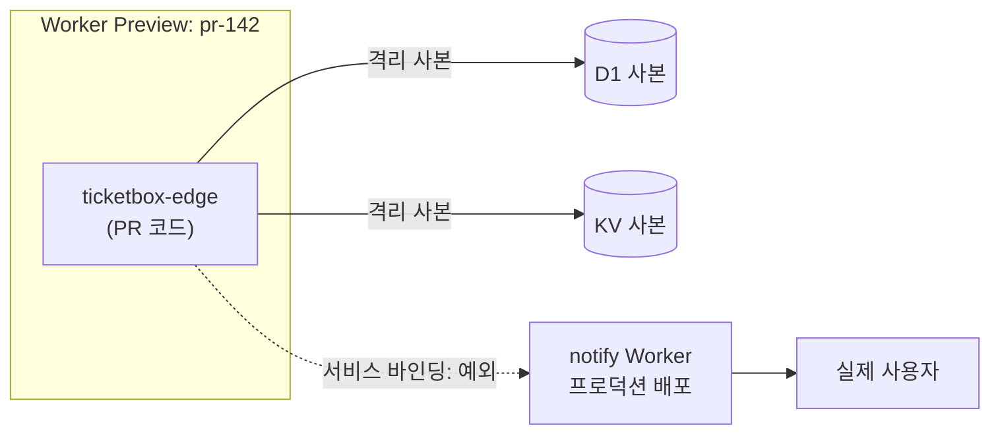

# 7장. Cloudflare로 보내기: Workers, 프리뷰, D1

흔히 프리뷰는 "미리 보는 배포"라고 한다. 프로덕션에 나가기 전에 변경을 안전한 곳에 띄워 놓고 눌러보는 것, 그래서 뭘 해도 괜찮은 연습장이라는 뜻이다. 그런데 Cloudflare에서는 어떤 프리뷰를 쓰느냐에 따라 프리뷰가 "프로덕션 데이터를 만지는 배포"가 되기도 한다.

ticketbox 팀의 한 사람이 공지 편집 화면을 고치는 PR을 올렸다고 해보자. 리뷰어가 눌러볼 수 있게 URL을 하나 만들어 PR에 붙였고, 리뷰어는 그 URL에서 공지를 몇 개 만들고 지우며 화면을 확인했다. 리뷰도 통과했다. 문제는 그 URL이 바라보던 D1이 프로덕션 데이터베이스였다는 점이다. 테스트로 만든 공지가 실제 사용자 화면에 떴다가 사라졌고, 누군가는 그걸 캡처했다. 아무도 규칙을 어기지 않았는데 사고가 났다. 이름에 "preview"가 들어간 기능이 셋이나 있고, 그중 하나는 공식 문서가 "PR 테스트에 쓰지 말라"고 못 박아 둔 기능이었을 뿐이다.

앞 장에서 우리는 컨테이너와 함수를 AWS에 올리고, 배포가 성공했는지를 active 리비전으로 확인했다. 이번에는 ticketbox의 앞단, `apps/edge`를 Cloudflare Workers로 보낼 차례다. AWS와는 배포의 단위부터 다르다. 그 차이를 먼저 짚고, 프리뷰와 D1, 그리고 AWS 오리진을 지키는 방법까지 걸어가 보자.

## Workers의 배포는 무엇을 올리는가

6장에서 AWS로 무언가를 보낼 때 우리가 옮긴 것은 이미지였다. 이미지를 빌드해 ECR에 밀어 넣고, ECS가 태스크를 새 이미지로 갈아 끼우고, 새 태스크가 헬스체크를 통과하는지 지켜봤다. 서버는 보이지 않아도 "태스크"라는 실체가 있었고, 배포란 그 실체를 교체하는 일이었다.

Workers에는 교체할 태스크가 없다. 우리가 올리는 것은 코드 번들과 설정이다. `wrangler`가 번들을 만들어 Cloudflare에 업로드하면 그것이 하나의 **버전(version)**이 되고, 어떤 버전에 트래픽을 얼마나 보낼지 정하는 것이 **배포(deployment)**가 된다. 버전을 올리는 일과 트래픽을 보내는 일이 분리돼 있다는 점이 핵심이다. `wrangler versions upload`로 버전만 올려 두고 `wrangler versions deploy`로 트래픽을 나눠 줄 수 있는 것도 이 분리 덕분이다. 이 이야기는 8장에서 점진 배포를 다룰 때 본격적으로 쓴다.

그렇다면 데이터는 어디에 있을까? D1 데이터베이스, KV, 시크릿 같은 것들은 버전 안에 들어 있지 않다. Worker가 **바인딩(binding)**으로 연결해 쓰는 바깥 자원이다. 코드는 버전별로 쌓이지만 바인딩된 자원은 하나가 계속 살아 있다. 이 구분을 머릿속에 넣어 두자. 이 장의 프리뷰 이야기도, 8장의 롤백 이야기도 결국 "코드는 버전을 따라가지만 자원은 따라가지 않는다"는 한 문장으로 수렴한다.

자격증명도 다르다. 4장에서 봤듯이 AWS에는 OIDC로 들어가 장기 키가 사라졌지만, Cloudflare에는 API 토큰을 GitHub 시크릿에 두고 들어간다. Cloudflare가 GitHub OIDC 토큰을 받아들이는지는 2026년 9월 기준 공식 문서에서 확인하지 못했다. 그래서 이 장의 모든 워크플로는 "장기 토큰이 하나 있다"는 전제 위에 서 있고, 그 토큰의 폭발 반경을 줄이는 일이 설계의 일부가 된다.

ticketbox의 `apps/edge`는 세 가지 일을 한다. 예매 화면인 SPA 정적 에셋을 내려주고, `/api/*` 요청을 AWS의 예매 API로 넘기고, 공지와 대기열 메타데이터처럼 엣지에서 바로 읽어야 하는 작은 데이터를 D1에서 꺼낸다. 이 셋이 이 장의 세 가지 배포 문제, 곧 정적 에셋 배포, 오리진 보호, 데이터베이스 마이그레이션과 그대로 짝을 이룬다.

## Pages에서 Workers 정적 에셋으로

ticketbox의 SPA는 원래 Cloudflare Pages에 있었다. 저장소를 연결해 두면 빌드와 배포가 알아서 돌았으니 처음엔 편했다. 그런데 엣지 API 라우팅을 붙이려고 Worker를 따로 만들고 나니, 같은 도메인의 두 조각이 서로 다른 제품에서 다른 방식으로 배포되고 있었다. 배포 파이프라인도, 롤백 방법도 두 벌이 된다.

Cloudflare는 현재 Pages에서 Workers로의 마이그레이션을 권장한다. Workers의 **정적 에셋(static assets)** 기능이 Pages가 하던 일을 흡수하고 있기 때문이다. 공식 마이그레이션 가이드는 Workers 쪽이 "Durable Objects, Cron Triggers, 더 포괄적인 Observability를 포함해 뚜렷하게 더 넓은 기능"을 갖는다고 설명한다. 여기서 한 가지 조심하자. 몇몇 블로그가 "Pages가 폐지됐다(deprecated)"고 쓰지만 공식 문서의 표현은 그렇지 않다. 두 제품을 합쳐 가는 중이고 Workers로 옮기기를 권한다는 수준이다. 당장 Pages 프로젝트가 멈추는 것은 아니니 급하게 뜯어낼 이유는 없다.

옮기는 작업 자체는 생각보다 가볍다. 정적 사이트라면 Pages 설정의 `pages_build_output_dir`이 Workers 설정의 `assets.directory`로 바뀌는 정도다.

```jsonc
// apps/edge/wrangler.jsonc (발췌, 2026년 9월 기준)
{
  "name": "ticketbox-edge",
  "main": "src/index.ts",
  "compatibility_date": "2026-09-25",
  "assets": {
    "directory": "./dist/client/",
    // SPA라서 없는 경로는 index.html로 (값 이름은 사실 확인 필요)
    "not_found_handling": "single-page-application"
  }
}
```

SPA를 옮길 때 자주 놓치는 것이 `not_found_handling`이다. Workers는 404와 SPA 라우팅을 어떻게 처리할지 명시적으로 적게 한다. 적지 않으면 `/events/123` 같은 클라이언트 라우트로 바로 들어온 사용자가 빈 404를 만난다. 또 하나, 기본 동작은 정적 에셋이 먼저 응답하는 것이다. 요청이 오면 먼저 에셋에서 찾아보고 없을 때 Worker 코드가 돈다. 모든 요청에 Worker 코드를 먼저 돌려야 한다면 `run_worker_first`로 바꿀 수 있다. ticketbox는 `/api/*`만 Worker가 처리하면 되므로 기본값이 맞다. 덤으로 정적 에셋 요청은 무료다. 오픈 순간 예매 화면을 수십만 번 내려줘야 하는 서비스에게 반가운 조건이다.

다만 전환기에는 혼란이 따른다. 2025년 8월 HN 스레드에서 AWS를 도메인 등록 기관으로 쓰는 한 개발자는 Workers가 "Cloudflare 존 밖의 커스텀 도메인"을 지원하지 않아 Pages에 남을 수밖에 없었다고 털어놓았다(이 제약이 2026년 9월에도 그대로인지는 사실 확인 필요). DNS를 Route 53에 두고 서브도메인을 AWS 서비스와 촘촘히 엮어 둔 팀이라면 남 일이 아니다. 옮기기 전에 도메인이 어느 존에 있는지부터 확인하자. wrangler 메이저 버전이 올라가며 Pages 배포가 깨졌다는 이슈(3.114.x에선 되고 4.x에선 실패)나, 이전 과정에서 "Missing entry-point to Worker script or to assets directory"를 만났다는 질문도 흔하다. 대부분 설정 파일 한두 줄의 문제지만, 한 번 겪으면 하루가 사라진다.

## wrangler-action, 그리고 액션에 기대는 위험

이제 배포 워크플로를 짜보자. Cloudflare가 제공하는 `cloudflare/wrangler-action`은 2026년 9월 기준 v4.1.3이다. 필요한 입력은 두 개뿐이다. API 토큰(`apiToken`)과 계정 ID(`accountId`). 여기에 몇 가지를 더 챙기면 쓸 만한 배포 잡이 된다.

```yaml
# .github/workflows/deploy-edge.yml (발췌)
name: deploy-edge
on:
  push:
    branches: [main]
    paths: ["apps/edge/**"]

permissions:
  contents: read
  deployments: write   # gitHubToken으로 GitHub Deployments를 만들 때

concurrency:
  group: deploy-edge-production
  cancel-in-progress: false
  queue: max

jobs:
  deploy:
    runs-on: ubuntu-24.04
    environment: production
    steps:
      - uses: actions/checkout@<commit-sha> # v7.0.1
      - run: make build-edge
      - id: deploy
        uses: cloudflare/wrangler-action@<commit-sha> # v4.1.3
        with:
          apiToken: ${{ secrets.CLOUDFLARE_API_TOKEN }}
          accountId: ${{ secrets.CLOUDFLARE_ACCOUNT_ID }}
          wranglerVersion: "4.141.0"   # 팀이 검증한 버전으로 고정
          workingDirectory: apps/edge   # (사실 확인 필요)
          gitHubToken: ${{ secrets.GITHUB_TOKEN }}
      - run: ./scripts/verify-edge.sh "${{ steps.deploy.outputs.deployment-url }}"
```

몇 줄씩 이유를 달아 두자. `environment: production`은 4장에서 만든 GitHub 환경이다. Cloudflare 토큰을 이 환경의 시크릿으로만 두면 PR 빌드나 테스트 잡은 토큰을 볼 수조차 없다. concurrency는 2장에서 말한 배포 쪽의 얼굴, 곧 취소하지 않고 줄을 세우는 설정이다. `gitHubToken`을 넘기면 액션이 GitHub Deployments 레코드를 만들어 주고, 그래서 `deployments: write` 권한이 필요하다. 배포 기록이 저장소 화면에 남는 것은 사소해 보여도 장애가 났을 때 "지금 무엇이 나가 있는가"를 찾는 시간을 줄여준다. 출력 `deployment-url`은 배포 직후 검증 스크립트에 넘긴다. 6장의 교훈을 여기서도 그대로 가져오자. 초록색 체크 대신, 방금 올린 것이 실제로 응답하는지를 확인하는 스텝이 있어야 한다.

`wranglerVersion`을 고정하는 이유는 wrangler가 거의 매일 마이너 버전을 올리기 때문이다. 2026년 9월 26일 기준 최신은 전날 나온 4.141.0이다. 고정하지 않으면 어제와 오늘의 배포가 서로 다른 도구로 돌 수 있다. 버전 올리기는 Renovate나 Dependabot의 PR로 받아 두고, 다른 의존성처럼 리뷰해서 합치면 된다.

이 워크플로는 5장의 규칙대로 액션을 SHA로 고정했다. 그런데 액션에 기대는 것 자체에도 리스크가 있다. Pages 배포에 흔히 쓰이던 `cloudflare/pages-action` 저장소가 사라지자, 이 액션을 쓰던 워크플로가 일제히 "Unable to resolve action"을 내며 멈췄다. 한 한국 개인 저장소의 PR 기록을 보면 해결책은 액션을 버리고 `wrangler`를 직접 부르는 것이었다. SHA로 고정했어도 저장소 자체가 없어지면 소용이 없다.

그래서 ticketbox는 액션을 "얇은 편의층"으로만 쓴다. 빌드와 검증 로직은 `make`와 `scripts/`에 있고, 액션이 하는 일은 wrangler를 설치하고 한 줄 명령을 부르는 것뿐이다. 액션이 사라지는 날이 와도 그 자리에 이 두 줄을 넣으면 된다.

```yaml
      - run: npx wrangler@4.141.0 deploy
        working-directory: apps/edge
        env:
          CLOUDFLARE_API_TOKEN: ${{ secrets.CLOUDFLARE_API_TOKEN }}
          CLOUDFLARE_ACCOUNT_ID: ${{ secrets.CLOUDFLARE_ACCOUNT_ID }}
```

사실 2장에서 만든 `scripts/deploy-edge.sh`가 속으로 하는 일도 이 호출이다. 그러니 노트북에서 `make deploy-edge ENV=production`을 돌려도 같은 배포가 일어난다. 2장에서 "워크플로는 멍청하게"를 고집한 보상이 이런 순간에 돌아온다.

## 프리뷰 세 가지를 구분하자

이제 이 장을 연 사고로 돌아가 보자. Cloudflare에는 이름에 "preview"나 그 비슷한 말이 붙은 기능이 세 가지 있다. 셋 다 "프로덕션이 아닌 URL"을 주지만, 그 URL 뒤에서 무엇이 격리되는지는 전혀 다르다. 하나씩 살펴보자.

**Preview URLs**는 2025년 7월에 나온 기능이다. `--preview-alias` 옵션으로 버전에 사람이 읽을 수 있는 별칭 URL을 붙인다(wrangler 4.21.0 이상. 어느 명령의 옵션인지는 사실 확인 필요). 버전마다 기억하기 쉬운 주소를 준다는 점에서 편리하다.

**Version URLs**는 `wrangler versions upload`로 올린 버전마다 생기는 URL이다. 올려 두기만 하고 트래픽은 보내지 않은 버전을 직접 호출해 볼 수 있다. 문제는 이 URL 뒤의 Worker가 **프로덕션 리소스를 그대로 쓴다**는 점이다. 프로덕션 D1, 프로덕션 KV에 읽고 쓴다. 그래서 공식 문서는 분명하게 적어 두었다. "Version URL을 브랜치나 PR 테스트에 쓰지 말라. 대신 Previews를 쓰라." 이 장을 연 사고의 URL이 바로 이것이었다.

**Worker Previews**가 그 "대신"이다. `wrangler preview` 명령으로 만들며, wrangler 4.135.0 이상이 필요하다. 공식 문서의 설명대로 "같은 Worker 아래 브랜치마다 격리된, 프로덕션과 닮은 환경"을 준다. 대부분의 바인딩이 프리뷰마다 격리된 사본으로 붙기 때문에, 프리뷰에서 공지를 만들고 지워도 프로덕션 D1은 모른다. Cloudflare가 "프로덕션 전에 변경을 테스트하는 권장 방식"이라고 부르는 것도 이것이다.

여기까지 들으면 "그럼 Worker Previews면 다 안전하겠네" 싶다. 정말 그럴까? 문서에는 예외가 적혀 있다. 서비스 바인딩(service binding)으로 다른 Worker를 부르면, 프리뷰에서 부른 호출도 **그 Worker의 프로덕션 배포**로 간다. Workflow 바인딩도 격리 대상에서 빠진다. ticketbox의 edge Worker가 알림 발송용 Worker를 서비스 바인딩으로 부르고 있다면, 프리뷰에서 누른 "알림 보내기" 버튼이 실제 사용자에게 알림을 보낼 수 있다는 뜻이다.


그림 1. Worker Previews의 바인딩 격리와 서비스 바인딩 예외

그림에서 점선 화살표 하나가 격리의 구멍이다. 이 구멍을 막는 방법은 두 가지다. 프리뷰에서는 서비스 바인딩을 부르는 코드 경로가 실제 부작용을 내지 않도록 환경 변수로 막거나, 부르는 쪽 Worker가 호출자가 프리뷰인지 구분할 수 있게 하는 것이다. 어느 쪽이든 "프리뷰는 격리돼 있다"는 믿음을 서비스 바인딩 앞에서는 한 번 의심하는 편이 낫다.

그렇다면 ticketbox의 PR 프리뷰 워크플로는 어떻게 생겼을까? wrangler-action의 `command`에 `preview`를 넘기면 된다. Cloudflare 문서의 예제는 wrangler 4.136.3 이상을 전제로 한다.

```yaml
# .github/workflows/preview-edge.yml (발췌)
on:
  pull_request:
    paths: ["apps/edge/**"]

permissions:
  contents: read
  deployments: write

concurrency:
  group: preview-edge-${{ github.event.pull_request.number }}
  cancel-in-progress: true

jobs:
  preview:
    runs-on: ubuntu-24.04
    environment: preview
    steps:
      - uses: actions/checkout@<commit-sha> # v7.0.1
      - run: make build-edge
      - uses: cloudflare/wrangler-action@<commit-sha> # v4.1.3
        with:
          apiToken: ${{ secrets.CLOUDFLARE_PREVIEW_TOKEN }}
          accountId: ${{ secrets.CLOUDFLARE_ACCOUNT_ID }}
          wranglerVersion: "4.141.0"
          command: preview --name pr-${{ github.event.pull_request.number }}
```

프로덕션 배포와 달라진 곳을 보자. concurrency가 이번에는 `cancel-in-progress: true`다. 같은 PR에 커밋이 연달아 올라오면 이전 프리뷰 빌드는 취소해도 된다. GitHub 환경도 `production`이 아니라 `preview`이고, 거기에는 프로덕션 배포 토큰과 다른 토큰을 둔다. 프리뷰 토큰이 새더라도 프로덕션 배포는 못 하게 하려는 것이다. 또 퍼블릭 저장소라면 포크에서 온 PR에는 시크릿이 내려가지 않으므로 이 워크플로는 같은 저장소 브랜치의 PR에서만 돈다. ticketbox는 프라이빗 저장소라 이 제약을 신경 쓸 일이 적지만, 오픈소스라면 포크 PR 프리뷰를 위해 `pull_request_target`에 손대고 싶은 유혹이 들 것이다. 5장을 떠올리자. 그 유혹이 공급망 사고의 단골 입구다.

마지막으로 신선도 경고를 하나 붙여 둔다. Worker Previews는 2026년 하반기에 나온, 아주 새 기능이다. 명령 이름, 최소 버전, 격리 예외 목록이 이 책이 나온 뒤에도 바뀔 수 있다. 워크플로를 짜기 전에 공식 문서를 함께 확인해두자.

### AI와 함께 쓸 때

에이전트가 PR을 여는 속도는 사람이 코드를 읽는 속도보다 빠르다. 그렇다면 에이전트가 연 PR은 무엇으로 확인해야 할까? diff만 읽어서는 부족하다. 특히 UI나 라우팅을 건드린 변경은 코드로 보면 그럴듯한데 눌러보면 깨져 있는 경우가 많다.

Worker Previews는 이 문제에 딱 맞는 무대다. ticketbox 팀은 에이전트가 연 PR이 `apps/edge`를 건드리면 프리뷰 워크플로가 PR에 URL을 남기고, 리뷰어가 그 URL에서 바뀐 화면을 직접 눌러본 뒤에만 승인하기로 했다. 리뷰 체크리스트에 "프리뷰에서 확인한 흐름"을 한 줄 적게 하면 이 습관이 굳는다. 앞에서 본 서비스 바인딩 예외 때문에, 에이전트에게 맡기는 변경이 알림처럼 바깥으로 부작용을 내는 경로를 건드린다면 프리뷰에서도 눌러보기 전에 한 번 더 생각하자.

토큰도 따로 떼어 두자. 4장에서 Cloudflare 토큰은 계정 소유 토큰을 "Specified Workers"로 스코프하고 Editor 역할(배포·수정은 되지만 삭제는 안 되는 역할)을 주는 것으로 폭발 반경을 줄였다. 이 기능을 소개한 2026년 9월 15일 Cloudflare 체인지로그는 토큰을 만드는 절차를 설명하며 대상을 "에이전트나 CI/CD 워크플로"라고 적었다. 에이전트가 쓰는 토큰은 에이전트용으로 따로 만들고, 프리뷰용 Worker만 지정해 두자. 에이전트가 무엇을 하든 프로덕션 Worker에는 손이 닿지 않게 하는 것, 그것이 지시 파일에 "프로덕션은 건드리지 마"라고 적는 것보다 훨씬 확실한 방어다.

## D1 마이그레이션: 되돌릴 수 없는 것을 배포할 때

코드는 버전을 따라가지만 데이터는 따라가지 않는다고 했다. 이 문장이 가장 아프게 다가오는 곳이 데이터베이스 마이그레이션이다.

ticketbox의 공지 테이블에 "노출 시작 시각" 컬럼을 추가한다고 해보자. 로컬에서는 `wrangler d1 migrations apply`로 마이그레이션을 적용하며 확인 프롬프트에 "y"를 누른다. CI에서는 누가 "y"를 누를까? D1 문서에 답이 있다. CI 같은 비대화형 환경에서는 확인 단계를 건너뛰되, 백업은 그대로 남긴다. 적용하다 오류가 나면 그 마이그레이션만 롤백되고 이전까지 성공한 마이그레이션은 유지된다. 어디까지 적용됐는지는 `d1_migrations` 테이블에 기록된다. 한 파일 단위로는 원자적으로 움직여 준다는 뜻이니 꽤 든든하다.

```yaml
      - name: D1 migrations
        run: npx wrangler@4.141.0 d1 migrations apply ticketbox-db --remote
        working-directory: apps/edge
        env:
          CLOUDFLARE_API_TOKEN: ${{ secrets.CLOUDFLARE_API_TOKEN }}
          CLOUDFLARE_ACCOUNT_ID: ${{ secrets.CLOUDFLARE_ACCOUNT_ID }}
```

여기서 `--remote`에 주목하자. wrangler-action 저장소에는 "CI에서 D1 마이그레이션이 조용히 실패한다"는 이슈(#221)가 있는데, `--remote`를 빠뜨리면 원격 D1이 아니라 러너 안의 로컬 DB에 마이그레이션이 적용되고 잡은 성공으로 끝난다는 내용이다(사실 확인 필요). 성공 로그가 찍혔는데 프로덕션 스키마는 그대로인 상황, 찜찜하다. 이런 실수는 사람의 주의력으로 막기보다 검증 스텝으로 막는 편이 낫다. 마이그레이션 뒤에 원격 DB의 `d1_migrations`를 조회해 기대한 마이그레이션 이름이 있는지 확인하는 스크립트를 한 줄 붙여 두자. 6장에서 "내 리비전이 active인가"를 확인한 것과 같은 태도다.

그런데 더 큰 문제가 있다. 마이그레이션은 적용된 뒤에는 되돌리기 어렵고, Worker를 이전 버전으로 롤백해도 스키마는 그대로 남는다. 새 코드가 새 컬럼을 전제로 짜여 있다가 롤백되면, 이전 코드는 모르는 컬럼이 붙은 테이블을 만나게 된다. 반대로 컬럼을 지우는 마이그레이션을 먼저 돌렸다면 롤백한 이전 코드가 없는 컬럼을 찾다가 깨진다.

그래서 스키마 변경은 **확장-축소(expand/contract)** 순서로 쪼갠다. 먼저 이전 코드와 새 코드가 모두 견딜 수 있는 방향으로 스키마를 넓힌다. 컬럼을 추가하되 기본값을 두어 이전 코드가 몰라도 괜찮게 만드는 식이다. 그다음 새 코드를 배포한다. 새 코드가 충분히 안정된 뒤에야 더 이상 쓰지 않는 것을 지우는 축소 마이그레이션을 따로 배포한다. 한 번에 끝날 일을 두세 번의 배포로 나누니 번거롭다. 하지만 이 수고를 받아들여야 "언제든 코드를 롤백할 수 있다"는 약속이 지켜진다. 이 절차를 RDS와 D1에 걸쳐 어떻게 맞추는지는 8장에서 롤백 범위를 따질 때 구체적으로 짚어 보자.

## AWS 오리진을 Cloudflare 뒤에 숨기기

ticketbox의 edge Worker는 `/api/*` 요청을 AWS의 ALB로 넘긴다. 사용자는 Cloudflare를 거쳐 예매 API에 닿는다. 여기서 질문을 하나 던져 보자. ALB가 퍼블릭 주소를 갖고 있다면, 누군가 Cloudflare를 건너뛰고 ALB로 곧장 요청을 보내면 어떻게 될까? Cloudflare 앞단에 걸어 둔 WAF도, 속도 제한도, 봇 관리도 모두 무용지물이 된다. 오픈 순간 매크로가 몰리는 티켓 서비스라면 가장 먼저 막아야 할 틈이다.

Cloudflare 문서는 오리진을 보호하는 수단을 여러 층으로 소개한다. ticketbox 팀이 고를 만한 것은 세 가지다.

**Cloudflare Tunnel**은 오리진에서 Cloudflare 쪽으로 연결을 여는 방식이다. 문서의 표현대로 "공개적으로 라우팅되는 IP 주소 없이" 자원을 Cloudflare에 연결한다. ALB나 태스크를 프라이빗 서브넷에 두고 공개 입구 자체를 없앨 수 있으니 가장 확실하다. 대신 터널을 띄우는 에이전트(cloudflared)를 AWS 안에서 운영해야 하고, 그것도 배포 대상이 하나 느는 셈이다.

**Authenticated Origin Pulls**는 Cloudflare와 오리진 사이에 mTLS를 거는 방식이다. 오리진은 Cloudflare의 클라이언트 인증서를 제시한 연결만 받는다. SSL 모드가 Full 또는 Full (strict)여야 한다는 조건이 있다. 기존 ALB 구성을 크게 바꾸지 않고 적용할 수 있다는 것이 장점이다.

**Cloudflare IP 허용 목록**은 보안 그룹에 Cloudflare의 IP 대역만 열어 두는 방식이다. 가장 쉽고 많이들 쓴다. 하지만 공식 문서도 이 방식에 "IP 스푸핑에 취약하다"는 딱지를 붙여 두었다. 게다가 IP 대역은 Cloudflare 고객 모두가 공유하므로, 다른 Cloudflare 고객의 Worker에서 출발한 트래픽도 이 목록을 통과한다는 지적이 있다. IP 허용 목록은 다른 수단에 덧대는 한 겹으로만 쓰고, 단독으로 믿지 않는 편이 낫다.

ticketbox는 어떻게 골랐을까? 처음엔 Authenticated Origin Pulls와 IP 허용 목록을 겹쳐 쓰고, 운영 여력이 생기면 Tunnel로 옮기기로 했다. 여기에 edge Worker가 요청에 비밀 헤더를 붙이고 API가 그 헤더를 검증하는 방식을 한 겹 더 얹을 수도 있다. 이 비밀 헤더 값 역시 Cloudflare 쪽과 AWS 쪽 양쪽에 두는 시크릿이므로 회전 주기를 정해 두자.

Cloudflare를 AWS 앞에 두는 구성 자체에 대한 반론도 알아 두자. 하나는 비용이다. AWS가 대역폭 제휴(Bandwidth Alliance)에 들어 있지 않아 앞단 CDN을 둬도 AWS 쪽 송신(egress) 요금이 생각보다 줄지 않는다는 주장이 커뮤니티에 있다(사실 확인 필요). 다른 하나는 장애 전파다. 2025년 11월 18일 Cloudflare 장애처럼 앞단이 멈추면 멀쩡한 AWS 오리진도 사용자에게 닿지 못한다. 이것은 8장에서 "설정도 배포다"라는 교훈으로 다시 만난다. 그리고 앞에서 본 대로, Route 53에 DNS를 두는 팀은 Workers 커스텀 도메인 제약부터 확인해야 한다. 이 셋은 Cloudflare를 쓰지 말자는 근거라기보다, 쓰기로 했을 때 비용표와 장애 대응 계획에 미리 적어 둘 항목이다.

### 이 장의 핵심

- Workers는 코드 번들을 "버전"으로 올리고, 트래픽을 보낼 버전을 "배포"로 정한다. 바인딩된 자원(D1·KV·시크릿)은 버전을 따라가지 않는다.
- Pages에서 Workers 정적 에셋으로의 이전은 마이그레이션 권장 단계다. SPA는 `not_found_handling`을 챙기고, Route 53을 쓰는 팀은 커스텀 도메인 제약부터 확인한다.
- wrangler-action은 SHA로 고정하고 `wranglerVersion`도 고정하되, 로직은 스크립트에 두어 액션이 사라져도 wrangler 직접 호출로 바꿀 수 있게 한다.
- PR 테스트는 Worker Previews로 하고 Version URLs는 쓰지 않는다. 서비스 바인딩은 프리뷰에서도 프로덕션을 부른다.
- D1 마이그레이션은 `--remote`를 확인하는 검증 스텝과 함께 돌리고, 스키마 변경은 확장-축소 순서로 쪼갠다. 오리진은 Tunnel이나 Authenticated Origin Pulls로 보호하고 IP 허용 목록 단독에 기대지 않는다.

## 프리뷰 세 가지, 한 장의 표로

이 장을 연 사고는 기능 이름 하나를 잘못 고른 데서 시작됐다. 그러니 마지막은 그 이름들을 한 장에 나란히 두는 것으로 매듭짓자.

| 구분 | 만드는 방법 | 리소스 격리 | 최소 wrangler 버전 | PR 테스트 적합성 |
|---|---|---|---|---|
| Worker Previews | `wrangler preview` | 대부분의 바인딩이 프리뷰별 격리 사본. 단 서비스 바인딩·Workflow 바인딩은 예외 | 4.135.0 (wrangler-action 예제는 4.136.3) | 적합. 공식 권장 방식 |
| Preview URLs | `--preview-alias` 옵션 | 버전 단위 별칭 URL. 격리 환경을 따로 만들지 않음 | 4.21.0 | PR 테스트용으로 설계되지 않음 |
| Version URLs | `wrangler versions upload` | 없음. 프로덕션 리소스를 그대로 사용 | — | 부적합. 문서가 PR 테스트 금지를 명시 |

(표의 버전과 동작은 2026년 9월 기준이다. Preview URLs의 리소스 격리 범위는 사실 확인 필요.)

PR마다 URL이 하나씩 생긴다는 것만으로 안심하지 말자. 그 URL 뒤에서 어떤 데이터베이스가 대답하고 있는지를 알고 있을 때, 프리뷰는 비로소 연습장이 된다.
