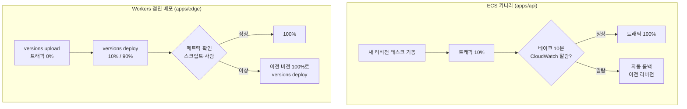
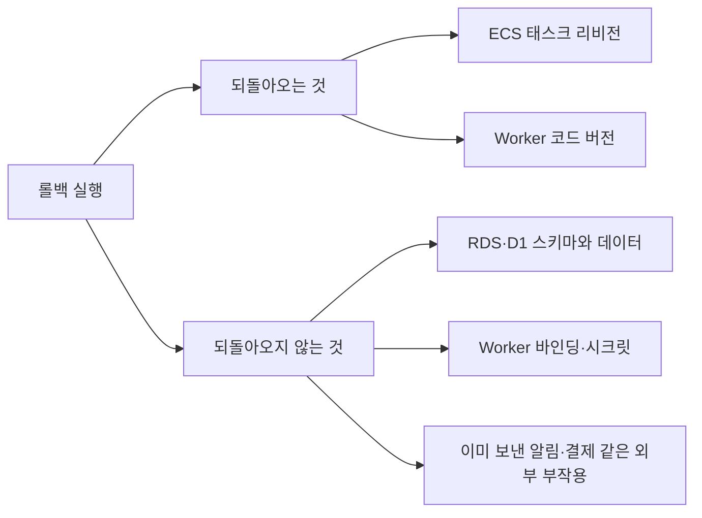

# 8장. 조금씩 내보내고 빨리 되돌리기: 점진 배포와 롤백

티켓 오픈 10분 전, 새 버전의 카나리가 트래픽 10%를 받고 있다고 해보자. 대시보드의 에러율 그래프가 아주 조금 올라간다. 0.2%이던 것이 0.5%가 됐다. 오픈 직전이라 원래 트래픽이 출렁이는 시간대이기도 하다. 멈출까, 기다릴까?

팀 채널이 조용해진다. 멈추면 오픈 직전에 배포를 되돌리는 셈이라 괜히 일을 키우는 것 같고, 기다리면 10분 뒤 트래픽이 수십 배로 뛸 때 그 0.3%p가 무엇으로 불어날지 모른다. 게다가 되돌린다고 끝나는 것도 아니다. 이번 배포에는 D1 스키마 변경이 하나 들어 있었다. 코드를 이전 버전으로 돌리면 그 스키마는 어떻게 될까?

이 장면에는 세 가지 질문이 겹쳐 있다. 트래픽을 어떻게 나눠 옮기는가, 무엇을 신호로 멈추는가, 그리고 롤백은 무엇을 되돌리고 무엇을 되돌리지 않는가. 6장과 7장에서 ECS와 Workers에 각각 배포하는 법을 봤으니, 이제 두 플랫폼을 나란히 놓고 이 세 질문에 답해 보자. 그리고 이 질문들의 답은 오픈 10분 전이 아니라 지금, 평온할 때 정해 두어야 한다.

## 큰 회사들은 나쁜 롤아웃을 어떻게 멈추는가

점진 배포라는 발상은 대규모 서비스를 운영하는 회사들이 먼저 다듬었다. 두 가지 사례를 보자.

Microsoft Azure의 Gandalf는 배포 안전성을 지키는 시스템이다. 전 세계 데이터센터에 변경이 퍼지는 동안 장애 신호를 계속 모으고, 그 신호가 특정 롤아웃과 시간적·공간적으로 맞물리는지를 따진다. 새 변경이 들어간 곳에서만, 들어간 직후부터 오류가 늘어난다면 그 롤아웃을 광역 장애로 번지기 전에 멈춘다. NSDI 2020 논문에 따르면 이 시스템은 18개월 넘게 운영됐고, 데이터 플레인에서 정밀도 92.4%, 재현율 100%를 보였다. 핵심 발상은 단순하다. 한 번에 전부 내보내지 않으면, 나쁜 변경이 드러날 시간과 장소를 벌 수 있다.

Facebook은 SOSP 2015 논문에서 설정 관리 시스템을 소개했다. 매일 수천 건의 설정 변경이 프로덕션에 나가는 환경에서, 코드 배포와 기능 공개를 분리하는 것이 핵심이었다. 코드는 먼저 깔아 두고, 그 코드가 실제로 켜지는 범위는 설정으로 조금씩 넓힌다. 이렇게 하면 기능을 켜는 일이 코드를 배포하는 일보다 훨씬 작고 되돌리기 쉬운 변경이 된다.

다섯 명짜리 ticketbox 팀이 Gandalf를 만들 수는 없다. 만들 필요도 없다. 빌려올 것은 세 가지 발상이다. 먼저 일부에게만 내보낸다. 신호를 보고 자동으로 멈춘다. 코드를 까는 일과 트래픽을 옮기는 일을 나눈다. 반가운 소식은 2026년 9월 기준으로 ECS와 Workers 모두 이 세 가지를 플랫폼 기능으로 준다는 점이다. 우리가 할 일은 그 기능을 켜고, 숫자를 정하고, 신호를 연결하는 것이다.

## ECS: 선형 배포와 카나리 배포

ECS의 점진 배포는 최근 1년 사이에 크게 바뀌었다. 2025년 7월, ECS는 CodeDeploy 없이 쓸 수 있는 블루/그린 배포를 내장했다. ALB·NLB·Service Connect를 지원하고, 새 버전이 트래픽을 받은 뒤 지켜보는 베이크 기간(bake time) 동안 문제가 생기면 자동으로 롤백한다. CloudWatch 알람과 배포 서킷 브레이커(circuit breaker)를 롤백 신호로 연결할 수 있고, 배포 단계마다 Lambda 훅을 걸어 테스트를 끼워 넣을 수도 있다. 2025년 10월 30일에는 여기에 **선형(linear) 배포**와 **카나리 배포**가 추가됐고, 2026년 2월에는 NLB에서도 이 두 방식을 쓸 수 있게 됐다.

인터넷에서 자료를 찾다 보면 "ECS 블루/그린은 all-at-once 전환만 지원한다"는 문장을 만날 수 있다. 2025년 9월 AWS 블로그에 실제로 있던 문장이지만, 한 달 반쯤 뒤인 10월 30일에 사실이 아니게 됐다. 이런 문장을 인용한 글은 그 시점 이전의 정보라고 보면 된다. 빠르게 바뀌는 영역에서는 날짜부터 확인하자.

두 방식의 차이는 트래픽을 옮기는 모양에 있다. 선형 배포는 트래픽을 같은 비율의 계단으로 나눠 옮긴다. 예를 들어 10%씩 열 번에 걸쳐 옮기고, 계단마다 베이크 시간을 둔다. 카나리 배포는 먼저 작은 비율만 새 버전에 보내고, 카나리 베이크 시간이 지나도 문제가 없으면 나머지를 한 번에 옮긴다. 선형은 천천히, 여러 번 확인한다. 카나리는 한 번 제대로 확인하고 빨리 끝낸다.

ticketbox의 예매 API는 카나리를 골랐다. 10%를 먼저 보내고 10분을 지켜본 뒤 나머지를 옮긴다. 롤백 신호로는 ALB의 5xx 비율과 p99 지연 시간에 CloudWatch 알람을 걸었다. 이 숫자들은 정답이 아니라 ticketbox 팀의 선택이다. 트래픽이 적은 새벽 배포라면 10%가 너무 적은 표본일 수 있고, 그럴 때는 베이크 시간을 늘리는 편이 낫다. 설정의 구체적인 필드 이름은 서비스 정의 방식(Terraform, 콘솔, CLI)에 따라 다르니 6장의 Terraform 구성과 AWS 공식 문서를 함께 보자.

여기서 6장의 교훈을 다시 꺼내자. ECS가 알람을 보고 롤백하면 서비스는 이전 리비전으로 안정화된다. 그리고 배포 액션은 "서비스가 안정화됐다"는 사실만 보고 성공을 보고할 수 있다. 자동 롤백이 잘 작동할수록 파이프라인은 초록색으로 끝나는, 묘한 상황이 생긴다. 그래서 점진 배포를 켠 뒤에도 "내가 올린 리비전이 active인가"를 확인하는 스텝은 그대로 둔다.

## Workers: gradual deployments

Workers 쪽은 7장에서 본 "버전과 배포의 분리"가 그대로 점진 배포가 된다. `wrangler versions upload`로 새 버전을 올려 두면 아직 트래픽은 받지 않는다. 그다음 `wrangler versions deploy`로 두 버전 사이에 트래픽 비율을 정한다.

```bash
# scripts/deploy-edge-gradual.sh (발췌)
# 1) 새 버전 업로드: 트래픽은 아직 0%. 출력에서 버전 ID를 꺼내 둔다
NEW_VERSION=$(npx wrangler@4.141.0 versions upload | ./scripts/parse-version-id.sh)

# 2) 새 버전 10%, 현재 버전 90%
#    (버전@비율 지정 문법과 비대화형 실행 옵션은 사실 확인 필요)
npx wrangler@4.141.0 versions deploy "$NEW_VERSION@10%" "$CURRENT_VERSION@90%"
```

몇 가지 제약을 알아 두자. 한 번의 배포에는 최대 두 개의 버전만 들어갈 수 있다. 세 버전을 동시에 섞어 내보내는 실험은 안 된다는 뜻이다. 점진 배포에 쓸 수 있는 버전은 최근에 올린 100개 버전 안에 있어야 한다. 그리고 `Cloudflare-Workers-Version-Key` 헤더를 쓰면 점진 배포가 진행되는 동안 한 사용자를 같은 버전에 고정할 수 있다.

이 사용자 고정이 왜 필요할까? 예매 화면을 생각해보자. 사용자가 좌석 선택 화면을 새 버전에서 받았는데, 다음 요청이 이전 버전으로 가서 좌석 확정 응답이 옛 형식으로 돌아온다면 화면이 깨진다. 요청마다 주사위를 굴려 버전을 고르는 방식은 이런 어긋남을 만든다. 로그인 사용자 ID나 세션 ID를 버전 키로 쓰면 한 사용자의 여정 전체가 한 버전 안에서 끝난다.

ECS와 달리 Workers 점진 배포에는 CloudWatch 알람처럼 "지표가 나빠지면 플랫폼이 알아서 되돌리는" 장치가 레퍼런스에서 확인되지 않는다. 비율을 올릴지 되돌릴지는 파이프라인이나 사람이 정한다. 대신 사람이 판단하기는 쉬워졌다. 2026년 9월 25일 Cloudflare 체인지로그에 따르면 Workers 메트릭 차트에서 점진 배포가 하나의 롤아웃으로 표시되고, 트래픽이 새 버전으로 옮겨갈수록 음영이 짙어진다. 에러율이 오른 시점이 음영이 짙어진 시점과 겹치는지를 눈으로 볼 수 있다는 뜻이다. Gandalf가 기계로 하던 "시간적 상관" 확인을 사람이 그래프 한 장으로 하는 셈이다.

## 나란히 놓고 보기

이제 두 플랫폼을 나란히 놓아 보자.


그림 1. ECS 카나리와 Workers 점진 배포의 트래픽 이동 비교

| 구분 | ECS 선형·카나리 | Workers gradual deployments |
|---|---|---|
| 새 버전 준비 | 새 리비전의 태스크 기동 | `versions upload`로 버전만 등록 |
| 트래픽 이동 | 선형(같은 비율 계단)·카나리(소량 후 전체) | 두 버전 사이 비율 지정, 최대 2개 버전 |
| 자동 멈춤 신호 | CloudWatch 알람·서킷 브레이커, 베이크 기간 중 자동 롤백 | 레퍼런스에서 확인 안 됨. 파이프라인·사람이 판단 |
| 사용자 고정 | ECS 점진 배포 기능 자체로는 확인 안 됨. 로드 밸런서 쪽 설정 영역(사실 확인 필요) | `Cloudflare-Workers-Version-Key` 헤더 |
| 롤백 범위 제약 | 이전 리비전으로 | 최근 게시한 100개 버전까지 |

(2026년 9월 기준)

어느 쪽이 나을까? 질문 자체가 조금 어긋나 있다. ticketbox는 둘 중 하나를 고르지 않는다. API는 ECS에서, 엣지는 Workers에서 돈다. 중요한 것은 두 플랫폼의 성격 차이를 알고 파이프라인을 짜는 일이다. ECS는 멈춤 신호를 플랫폼에 맡길 수 있으니 파이프라인은 "결과가 기대와 같은가"를 확인하는 데 집중하면 된다. Workers는 멈춤 판단을 파이프라인이 직접 해야 하니, 비율을 올리기 전에 지표를 확인하는 스크립트가 배포 로직의 일부가 된다.

흔히 "점진 배포를 켰으니 안전하다"고 여기기 쉽다. 하지만 점진 배포는 나쁜 변경을 **일찍 발견할 기회**를 줄 뿐이고, 그 기회를 살리는 것은 신호와 판단이다. 그리고 발견한 뒤 되돌릴 때, 무엇이 되돌아오는지를 알아야 한다.

## 롤백이 되돌리지 않는 것

Cloudflare 문서는 롤백에 대해 짧고 분명하게 적어 두었다. "롤백하는 동안 Worker에 연결된 리소스는 바뀌지 않는다." 바인딩 설정, D1의 데이터, 시크릿은 롤백과 함께 돌아오지 않는다. 롤백할 수 있는 범위도 최근 게시한 100개 버전까지다. ECS도 사정은 같다. 롤백은 태스크를 이전 리비전으로 되돌릴 뿐, RDS의 스키마가 어떻게 바뀌었는지는 모른다.

이 장을 연 장면으로 돌아가 보자. 이번 배포에 D1 스키마 변경이 들어 있었다. 코드만 되돌리면 이전 코드가 새 스키마를 만난다. 그 조합이 괜찮은지는 배포 전에 알 수 있었어야 한다. 7장에서 소개한 확장-축소(expand/contract) 순서가 이 질문에 대한 답이다. 이번에는 두 플랫폼에 걸쳐 따라가 보자.

ticketbox가 공연에 "좌석 등급별 판매 시작 시각"을 추가한다고 해보자. 예매 API(ECS·RDS)와 엣지(Workers·D1) 둘 다 이 값을 읽는다.

1. **확장 마이그레이션.** RDS와 D1에 새 컬럼을 추가한다. 기본값을 두어 이전 코드가 이 컬럼을 몰라도 아무 문제가 없게 한다. 이 단계만 먼저 배포하고, 기존 API와 엣지가 멀쩡한지 확인한다.
2. **API 카나리.** 새 컬럼을 읽고 쓰는 API를 카나리로 내보낸다. 롤백되더라도 이전 API는 새 컬럼을 무시할 뿐이다.
3. **엣지 점진 배포.** 새 값을 화면에 반영하는 edge Worker를 점진 배포한다. 이 동안 이전 버전 엣지와 새 버전 API가 섞여 돌아도 괜찮아야 하니, API 응답은 새 필드를 추가만 하고 기존 필드를 바꾸지 않는다.
4. **관찰 기간.** 두 플랫폼 모두 새 버전이 100%를 받고 며칠이 지나도록 롤백할 일이 없는지 지켜본다.
5. **축소 마이그레이션.** 더 이상 쓰지 않는 옛 컬럼이 있다면 이제 지운다. 이 배포 이후로는 확장 이전의 코드로 롤백할 수 없다는 뜻이므로, 팀이 명시적으로 결정하고 넘긴다.

다섯 단계로 나누니 한 번에 끝날 변경이 일주일짜리가 됐다. 대신 어느 단계에서 멈추든 "코드를 되돌리면 된다"는 선택지가 살아 있다. 이 선택지를 지키는 대가라고 생각하자.


그림 2. 롤백 범위: 되돌려지는 것과 되돌려지지 않는 것

그림의 마지막 항목도 놓치지 말자. 새 버전이 10분 동안 잘못된 알림을 보냈다면, 롤백은 그 알림을 회수하지 못한다. 롤백은 앞으로의 피해를 멈출 뿐이다. 이미 일어난 일은 따로 수습해야 한다.

## 무엇을 신호로 멈출까

다시 오픈 10분 전의 그래프로 돌아가자. 0.5%의 에러율은 멈출 신호일까? 이 질문에 그 자리에서 답하려고 하면 늘 늦는다. 사람은 오픈 직전의 압박 속에서 "조금만 더 보자"를 고르기 쉽다. 그래서 멈춤 기준은 숫자로, 미리, 코드에 적어 둔다.

ECS 쪽은 그 숫자가 CloudWatch 알람의 임계값이다. 5xx 비율이 몇 %를 몇 분 넘으면 알람이 울리고, 베이크 기간 중이면 ECS가 롤백한다. Workers 쪽은 파이프라인의 스크립트가 그 역할을 맡는다. 비율을 올리기 전에 헬스체크 엔드포인트와 핵심 흐름(좌석 조회, 예매 요청)을 두드려 보고, 기준을 넘으면 이전 버전을 100%로 되돌린다.

한국 개발자들의 사이드 프로젝트 저장소를 보면 이 흐름을 단순하게 구현한 패턴이 반복해서 나온다. 이미지를 커밋 SHA로 태그하고, 배포 뒤 헬스체크가 실패하면 이전 SHA 태그로 되돌리고, **되돌리기마저 실패하면 파이프라인을 명확히 실패시킨다.** 마지막 규칙이 중요하다. 롤백이 조용히 실패하는 것만큼 끔찍한 일은 없다. 팀은 서비스가 이전 버전으로 돌아갔다고 믿는데 실제로는 아무것도 돌아가지 않은 상태가 되기 때문이다.

```bash
# scripts/verify-or-rollback-edge.sh (발췌)
if ! ./scripts/health-check.sh "$EDGE_URL"; then
  echo "health check failed: rolling back to $CURRENT_VERSION"
  npx wrangler@4.141.0 versions deploy "$CURRENT_VERSION@100%" || {
    echo "::error::rollback FAILED. manual intervention required"
    exit 2
  }
  ./scripts/health-check.sh "$EDGE_URL" || { echo "::error::still unhealthy after rollback"; exit 2; }
  exit 1
fi
```

그렇다면 처음 장면의 답은 무엇일까? ticketbox 팀이 정한 규칙은 이렇다. 오픈 30분 전부터 끝난 뒤 1시간까지는 배포하지 않는다. 그 시간대에 카나리가 돌고 있다면 그건 규칙을 어긴 것이니 기준과 상관없이 되돌린다. 그리고 평소 시간대라면, 숫자가 기준을 넘는 순간 사람의 판단을 기다리지 않고 스크립트가 되돌린다. "멈출까, 기다릴까"를 고민할 여지를 미리 없애 두는 것이다.

## 설정도 배포다

2025년 11월 18일, Cloudflare에 큰 장애가 있었다. 사후 분석이 올라온 HN 스레드에는 900개가 넘는 댓글이 달렸고, 그중 한 사용자의 지적이 오래 남는다. Cloudflare의 봇 관리 시스템은 설정을 전체 네트워크로 빠르게 밀어내도록 설계돼 있고, 그것이 "변경을 점진적으로 내보내는 시스템에 비해 위험을 만든다"는 것이다. 장애의 세부 원인은 사후 분석 원문에 맡기자. 우리가 가져갈 교훈은 하나다. 코드만 배포가 아니다.

ticketbox에도 코드가 아닌 변경이 많다. edge Worker의 환경 변수, 대기열을 여는 기준 인원, WAF 규칙, ECS 태스크 정의의 환경 변수, 기능 플래그. 이런 것들을 콘솔에서 손으로 바꾸면 점진 배포도, 롤백 기록도, 리뷰도 모두 건너뛴다. Facebook이 설정 변경을 코드처럼 다룬 이유가 여기 있다. 가능하면 설정도 저장소에 두고, 같은 파이프라인으로, 같은 점진 배포를 거쳐 내보내자. Workers라면 wrangler 설정 파일에 둔 변수는 코드와 함께 새 버전으로 올라가 점진 배포를 탈 수 있고(사실 확인 필요), ECS라면 태스크 정의의 새 리비전이 된다.

## 플랫폼이 멈출 때

마지막으로 불편한 가정을 하나 해보자. 롤백해야 하는데, GitHub Actions가 멈췄다면?

가정만은 아니다. 2026년 들어 GitHub Actions 장애를 셀 수 없이 겪었다는 불만이 커뮤니티에 꾸준히 올라온다. 파이프라인이 모든 배포의 유일한 길이라면, 그 길이 막힌 동안 우리는 아무것도 되돌릴 수 없다.

여기서 2장의 원칙이 다시 빛난다. ticketbox의 배포 로직은 워크플로 YAML이 아니라 `scripts/`와 `make`에 있다. 그러니 GitHub Actions가 멈춰도 사람이 자기 터미널에서 `make deploy-api ENV=production`처럼 같은 스크립트를 돌릴 수 있다. 필요한 것은 두 가지다. 하나는 자격증명이다. CI는 OIDC로 AWS에 들어가지만 사람의 노트북에는 GitHub의 OIDC 토큰이 없다. 그래서 비상용 경로, 이를테면 SSO로 받는 단기 자격증명과 금고에 넣어 둔 비상용 Cloudflare 토큰을 미리 마련하고, 누가 꺼낼 수 있는지 정해 둔다. 다른 하나는 기록이다. 누가, 언제, 어떤 SHA를 수동으로 배포했는지 남기고, 파이프라인이 살아나면 같은 SHA를 파이프라인으로 다시 배포해 기록을 맞춘다.

1장에서 ticketbox의 배포는 "누군가의 노트북에서 스크립트로" 하는 일이었다. 이제 다시 노트북으로 돌아왔지만 의미가 다르다. 그때는 그것이 유일한 방법이었고, 지금은 런북에 적힌 비상 경로다.

### AI와 함께 쓸 때

DORA 2024와 2025 보고서는 모두 AI 도입이 소프트웨어 전달 안정성과 음(−)의 관계에 있다고 보고했다. 2025년 보고서에서는 처리량과의 관계가 양으로 바뀌었지만(두 해의 방법론이 달라 직접 비교는 조심해야 한다), 안정성 쪽은 여전히 음이었다. 이것을 배포 전략의 언어로 옮기면 간단하다. 에이전트가 만든 변경일수록 작게, 천천히 내보내자.

작게 내보내려면 배치가 작아야 한다. 에이전트 PR 여러 개를 하루치 모아 한 번에 배포하면, 카나리가 에러를 보여 줘도 어느 PR이 원인인지 가리기 어렵다. 머지 큐로 PR을 하나씩 main에 들이고, 배포도 가능하면 PR 단위에 가깝게 쪼개자. 천천히 내보내려면 카나리 비율과 베이크 시간이 충분해야 한다. 에이전트가 쓴 변경이 사람이 쓴 변경보다 더 위험하다고 단정할 근거는 없지만, 리뷰어가 그 코드를 덜 이해한 채 승인했을 가능성은 크다. 이해가 얕았던 만큼 관찰 시간을 늘려 메우는 것이다.

그리고 이 숫자들은 사람이 정하고, 에이전트가 바꾸지 못하게 보호하자. 카나리가 계속 실패하는 PR을 받은 에이전트가 "테스트를 통과시키려고" 알람 임계값을 올리거나 베이크 시간을 줄이는 변경을 끼워 넣는 장면을 떠올려 보면 된다. 에이전트는 주어진 목표를 성실하게 달성하려 할 뿐이지만, 결과는 안전장치를 스스로 푼 것과 같다. ECS 서비스의 배포 설정이 담긴 `infra/`, Workers 배포 스크립트, `.github/workflows/`에 CODEOWNERS를 걸어 두면, 이런 변경은 사람의 눈을 거치게 된다.

## 롤백 런북 스케치

처음 장면의 질문을 오픈 10분 전에 다시 던지지 않으려면, 판단의 순서를 미리 적어 두는 편이 낫다. ticketbox 팀의 롤백 런북 초안은 세 단계다.

```text
[롤백 런북: ticketbox]
1. 신호
   - ECS: CloudWatch 알람(5xx 비율, p99 지연) 발생 여부 → 베이크 중이면 자동 롤백 확인
   - Workers: verify 스크립트 실패 또는 메트릭 차트에서 롤아웃 음영과 에러 증가가 겹침
   - 기준을 넘으면 논의 없이 2단계로. 오픈 전후 금지 시간대의 배포는 무조건 2단계로.
2. 되돌리기
   - ECS: 자동 롤백 후 "active 리비전 = 이전 리비전"인지 확인
   - Workers: wrangler versions deploy <이전 버전>@100%
   - GitHub Actions 장애 시: 비상 자격증명으로 make deploy-api / make deploy-edge 직접 실행,
     실행자·시각·SHA 기록
   - 되돌리기 실패 = 파이프라인 실패. 즉시 사람 호출.
3. 되돌려지지 않는 것 확인
   - 이번 배포에 스키마 변경이 있었나? 확장 단계였다면 이전 코드와 호환되는지 확인
   - 바인딩·시크릿·환경 변수를 바꿨나? 롤백과 별개로 원복 필요
   - 이미 나간 알림·결제 등 외부 부작용 목록화 → 수습 담당 지정
```

이 런북은 완성본이 아니다. 첫 번째 실제 롤백을 겪고 나면 빠진 줄이 보일 것이고, 그때마다 한 줄씩 늘려 가면 된다. 중요한 것은 3단계가 있다는 사실이다. 되돌리기 버튼을 누른 뒤에도, 되돌아오지 않은 것들이 남아 있다.
