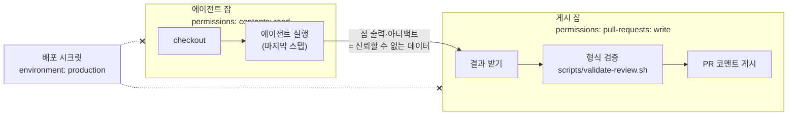

# 9장. AI 에이전트를 파이프라인에 들이기

AI 에이전트를 흔히 "팀원"이라 부른다. 이슈를 맡기면 코드를 쓰고, PR을 열고, 리뷰 코멘트에 답한다. 하는 일만 보면 부지런한 동료 같다. 하지만 파이프라인 입장에서 에이전트는 팀원보다 "신뢰할 수 없는 외부 기여자"에 훨씬 가깝다.

왜 그럴까? 팀원을 믿는 근거를 떠올려 보자. 우리는 팀원이 누구인지 알고, 그가 무엇을 읽고 판단했는지 물어볼 수 있고, 사고가 나면 함께 책임을 진다. 에이전트는 어떤가. 에이전트는 이슈 본문, PR 코멘트, 저장소의 파일처럼 누가 썼는지 모를 텍스트를 읽고 그대로 판단의 재료로 삼는다. 그 판단은 매번 조금씩 다르고, 왜 그렇게 했는지 끝까지 캐물을 방법도 마땅치 않다. 게다가 에이전트가 쥔 권한은 에이전트를 부른 사람의 의도와 상관없이, 에이전트가 읽은 텍스트에 따라 쓰일 수 있다.

좋은 소식은 GitHub가 "신뢰할 수 없는 외부 기여자"를 다루는 도구를 이미 오래전부터 갖고 있다는 점이다. 포크에서 온 PR에는 시크릿을 내려주지 않고, 처음 기여하는 사람의 워크플로는 승인 전에 돌리지 않고, 쓰기 권한이 없는 사람은 브랜치에 직접 푸시하지 못한다. 에이전트를 팀원이 아니라 외부 기여자로 보는 순간, 이 도구들이 그대로 에이전트용 가드레일이 된다. 이 관점을 들고 ticketbox에 에이전트를 들여 보자.

## 세 가지 모델: 멘션, 자동화, 할당

2026년 9월 기준, GitHub 저장소에서 에이전트를 돌리는 방식은 크게 세 갈래다.

첫째는 **claude-code-action**이다. 2026년 9월 기준 v1 계열(최신 v1.0.235)이고, Claude Code에서 `/install-github-app`을 실행하면 설정을 빠르게 잡아준다. 이 액션은 두 가지 모드로 움직인다. `prompt` 입력이 없으면 PR이나 이슈 코멘트에서 `@claude`라고 멘션할 때만 반응하는 대화형(interactive)이 되고, `prompt`를 주면 PR이 열릴 때마다 정해진 지시를 수행하는 자동화(automation)가 된다. 같은 액션이지만 위험의 모양이 다르다. 대화형은 누군가 부를 때만 깨어나고, 자동화는 이벤트가 오면 누가 만든 이벤트든 깨어난다.

둘째는 **openai/codex-action**이다. 워크플로 안에서 Codex를 실행하는 액션으로, 이 장에서는 특히 이 액션의 보안 문서가 짚은 러너 격리 문제를 빌려 쓴다. 에이전트가 러너 위에서 무엇을 볼 수 있는지에 대해 가장 솔직하게 적어 둔 문서이기 때문이다.

셋째는 **Copilot cloud agent**다. 2025년 9월 25일 GA 당시 이름은 Copilot coding agent였고, 2026년 문서부터 cloud agent로 불린다. 앞의 두 액션이 우리 워크플로 안에서 도는 것과 달리, 이쪽은 이슈를 Copilot에게 할당하면 GitHub Actions 기반의 별도 환경에서 작업하고 `copilot/`로 시작하는 브랜치에 드래프트 PR을 연다. 2025년 11월부터는 저장소에서 GitHub Actions를 켜지 않아도 쓸 수 있게 됐다. PR 리뷰만 하는 Copilot code review와는 다른 제품이다. 리뷰 봇 이야기는 11장에서 따로 하자.

| 모델 | 깨우는 방법 | 실행 위치 | 결과물 | 기본 안전장치 |
|---|---|---|---|---|
| claude-code-action (대화형) | `@claude` 멘션 | 우리 워크플로·러너 | 코멘트, 브랜치 커밋, PR 생성 링크 | 쓰기 권한자만 트리거, 봇 거부 |
| claude-code-action·codex-action (자동화) | PR·이슈 이벤트 + `prompt` | 우리 워크플로·러너 | 코멘트, 리뷰, 파일 | 쓰기 권한자만 실행(기본값) |
| Copilot cloud agent | 이슈 할당 | GitHub가 준비한 Actions 기반 환경 | `copilot/` 브랜치의 드래프트 PR | 쓰기 권한자만 할당, 방화벽, 승인 전 CI 미실행, 스스로 머지 불가 |

(2026년 9월 기준. 액션 버전과 기본값은 자주 바뀌니 공식 문서를 함께 확인하자.)

세 모델을 고르는 기준은 뒤에서 결정표로 정리하고, 먼저 모든 모델에 공통으로 던져야 할 세 질문을 따라가 보자. 누가 깨울 수 있나, 무엇으로 인증하나, 어디서 돌리나.

## 누가 깨울 수 있나

에이전트의 위험은 대부분 입구에서 시작된다. 누가 에이전트를 깨울 수 있느냐는 곧 누가 에이전트에게 지시를 넣을 수 있느냐다.

claude-code-action의 기본값은 보수적이다. 문서에 따르면 이슈와 PR 이벤트에서는 트리거한 사용자가 저장소 쓰기 권한을 가져야 한다. codex-action도 기본적으로 쓰기 권한 사용자만 실행할 수 있다. 쓰기 권한이 있다는 것은 이미 main 근처의 코드를 바꿀 수 있는 사람이라는 뜻이니, 에이전트를 깨울 자격도 그 선에 맞춘 것이다.

이 선을 넓히는 옵션이 `allowed_non_write_users`다. 공식 보안 문서는 이 옵션에 "RISKY"라는 딱지를 붙여 두었다. 쓰기 권한 없는 사람, 극단적으로는 GitHub 계정을 가진 누구나 에이전트를 깨울 수 있게 되기 때문이다. 이 옵션이 실제로 어떤 사고로 이어졌는지는 10장에서 해부한다. 여기서는 규칙 하나만 정하자. 이 옵션을 켜야 한다면 그 워크플로에는 시크릿도, 쓰기 도구도 없어야 한다.

봇도 입구다. claude-code-action은 기본적으로 봇 행위자를 거부하고, `allowed_bots`에 적은 봇만 받는다. 문서가 밝힌 이유는 루프 방지다. 봇의 코멘트에 에이전트가 답하고, 그 답에 봇이 다시 반응하는 고리가 한번 생기면 러너 시간과 API 비용이 끝없이 샌다. Dependabot PR을 에이전트가 리뷰하게 하고 싶다면 그 봇 하나만 명시해서 열자.

퍼블릭 저장소라면 포크 PR도 따져야 한다. GitHub는 포크 PR이 트리거한 실행에 시크릿을 내려주지 않는다. 그래서 문서의 표현대로 리뷰는 같은 저장소의 브랜치에서 온 PR에서만 돈다. 외부 기여자의 PR도 에이전트가 리뷰해 주면 좋겠다는 생각에 `pull_request_target`으로 바꾸고 싶어질 수 있다. 5장을 떠올리자. 그것은 신뢰할 수 없는 코드와 시크릿을 한 러너에 올리는 가장 흔한 실수다.

Copilot cloud agent는 입구를 두 번 지킨다. 이슈를 에이전트에게 할당할 수 있는 사람이 쓰기 권한자로 제한되고, 에이전트가 PR을 올린 뒤에도 쓰기 권한자가 **Approve and run workflows** 버튼을 누르기 전에는 워크플로가 돌지 않는다. 3장에서는 이 버튼을 CI 비용을 아끼는 관문으로 봤다. 여기서는 보안의 관문이다. 에이전트가 올린 커밋에 `.github/workflows/` 수정이 섞여 있다면, 버튼을 누르는 순간 그 워크플로가 우리 러너에서 돈다. 버튼을 누르기 전에 diff에서 워크플로 파일부터 확인하는 습관을 들이자.

## 무엇으로 인증하나

4장의 `AI와 함께 쓸 때`에서 에이전트의 자격증명 원칙을 세웠다. claude-code-action은 워크로드 아이덴티티 페더레이션으로 워크플로의 GitHub OIDC 토큰을 Claude Console 서비스 계정을 통한 Claude API 접근으로 바꿀 수 있고, Bedrock·Vertex·Foundry를 거칠 때도 OIDC를 쓸 수 있다. 개인 액세스 토큰(PAT)은 쓰지 않는다. 정적 토큰은 실행마다 바뀌지 않아서 프롬프트 인젝션으로 조금씩, 혹은 통째로 새어 나갈 수 있기 때문이다. 여기서는 그 원칙을 파이프라인 전체로 넓혀 보자.

먼저 에이전트 잡이 받는 `GITHUB_TOKEN`의 권한이다. 모델 API에 들어가는 자격증명만큼이나 중요한 것이 저장소에 대한 권한이다. 리뷰만 하는 에이전트라면 코드는 읽기만 하고, 코멘트를 달 권한만 있으면 된다. 코드를 고쳐 커밋하는 에이전트라면 `contents: write`가 필요하지만, 그 권한은 에이전트가 만든 브랜치에 쓰는 데만 쓰여야 한다. 브랜치 보호 규칙과 필수 체크가 main을 지키고 있다면, 에이전트가 쓸 수 있는 곳은 자기 브랜치로 한정된다. 그리고 배포 자격증명은 에이전트 잡에 없어야 한다. 4장에서 배포 시크릿을 GitHub 환경 `production`에 가두었으니, 에이전트 워크플로에 `environment: production`을 붙이지 않는 것만으로 이 선은 지켜진다.

여기서 많은 팀이 한 번씩 걸려 넘어지는 함정이 있다. 에이전트가 PR 브랜치에 커밋을 푸시했는데 CI가 돌지 않는다. 필수 체크는 대기 상태로 멈춰 있고, 머지 버튼은 회색이다. 무엇이 잘못됐을까? GitHub는 기본 `GITHUB_TOKEN`으로 만든 커밋에 대해 워크플로를 트리거하지 않는다. 워크플로가 워크플로를 무한히 부르는 사고를 막기 위한 설계이고, claude-code-action 문서도 이 점을 짚는다. 에이전트의 커밋에도 CI가 돌게 하려면 GitHub App으로 발급한 토큰처럼 다른 신원으로 푸시해야 한다.

다만 그 대가도 알아 두자. GitHub App을 쓰면 App의 개인 키라는 장기 시크릿이 하나 생긴다. 이 키는 모델을 부르는 에이전트 스텝이 볼 수 있는 곳에 두지 않는 편이 낫다. 에이전트가 파일을 만들고 끝나면, 에이전트가 없는 다음 잡이 App 토큰으로 푸시하는 구조가 안전하다. 뒤에서 볼 "에이전트 잡과 게시 잡의 분리"가 여기에도 그대로 쓰인다.

하나 더 기억해두자. 기본 설정에서 Claude는 PR을 자동으로 만들지 않는다. 브랜치에 변경을 올리고 PR 생성 링크를 줄 뿐이다. 문서는 이것을 병합 제안 전에 사람의 감독을 보장하기 위한 것이라고 설명한다. 링크를 눌러 PR을 여는 사람이 그 PR의 작성자가 되고, 그 사람이 변경의 의도와 근거를 설명할 책임을 진다. 11장에서 "작성자 책임"을 이야기할 때 이 장면으로 다시 돌아온다.

## 어디서 돌리나

같은 권한을 줘도 에이전트가 러너에서 무엇을 볼 수 있느냐는 또 다른 문제다. codex-action의 보안 문서가 이 점을 아주 구체적으로 짚는다.

GitHub 호스티드 러너에서는 비밀번호 없이 `sudo`를 쓸 수 있다. 그래서 Codex를 읽기 전용 샌드박스로 묶어 두더라도, 권한 상승 경로가 열려 있으면 procfs를 통해 프로세스 환경에 있는 API 키가 노출될 수 있다. 문서는 `drop-sudo`(기본값)나 `unprivileged-user` 중 하나를 반드시 쓰라고 적었다. 또 권한 프로필(permission profiles)은 Codex가 실행하는 명령을 제한할 뿐 액션의 `safety-strategy`를 대신하지 않는다고 못 박았다. 명령을 막는 것과 러너 자체의 권한을 내리는 것은 다른 층의 방어라는 뜻이다.

같은 문서에는 섬뜩한 문장이 하나 더 있다. 느슨한 권한으로 Codex를 돌렸다면, 액션이 끝난 뒤 호스트가 어떤 상태인지 아무것도 보장할 수 없다는 것이다. 에이전트가 러너에 무엇을 남겼는지 모른다면, 그 러너에서 이어지는 스텝도 믿을 수 없다. 그래서 권고는 두 가지다. 에이전트 액션은 잡의 마지막 스텝에 둔다. 그리고 결과를 게시하는 일은 별도의 잡으로 넘긴다.


그림 1. 에이전트 잡과 게시 잡의 분리(권한 경계)

그림에서 권한은 한 방향으로만 흐른다. 에이전트 잡은 코드를 읽을 수만 있고, 쓰기 권한을 가진 게시 잡에는 에이전트가 없다. 두 잡 사이를 건너는 것은 에이전트의 출력뿐이고, 게시 잡은 그 출력을 외부에서 들어온 데이터로 취급한다. 5장의 규칙대로 셸 텍스트에 직접 넣지 않고 환경 변수로 받으며, 길이와 형식을 검증한 뒤에 게시한다. 에이전트가 속았더라도, 속은 에이전트가 할 수 있는 일은 "이상한 텍스트를 출력하는 것"까지로 줄어든다.

ticketbox 팀은 PR이 열릴 때 자동으로 도는 리뷰에 이 구조를 적용했다.

```yaml
# .github/workflows/agent-review.yml (발췌)
on:
  pull_request:
    types: [opened, synchronize]

permissions: {}   # 잡마다 필요한 것만 연다

jobs:
  review:
    runs-on: ubuntu-24.04
    timeout-minutes: 15
    permissions:
      contents: read
    outputs:
      result: ${{ steps.codex.outputs.final-message }}   # 출력 이름은 사실 확인 필요
    steps:
      - uses: actions/checkout@<commit-sha> # v7.0.1
      - id: codex
        uses: openai/codex-action@<commit-sha> # 버전은 릴리스에서 확인
        with:
          prompt-file: .github/agent/review-prompt.md   # 입력 이름은 사실 확인 필요
          safety-strategy: drop-sudo
        # 이 스텝 뒤에는 아무것도 두지 않는다

  publish:
    needs: review
    runs-on: ubuntu-24.04
    permissions:
      pull-requests: write
    steps:
      - uses: actions/checkout@<commit-sha> # v7.0.1
      - env:
          REVIEW: ${{ needs.review.outputs.result }}
          PR: ${{ github.event.pull_request.number }}
          GH_TOKEN: ${{ github.token }}
        run: ./scripts/validate-review.sh && gh pr comment "$PR" --body-file review.md
```

`validate-review.sh`는 환경 변수 `REVIEW`를 읽어 길이 상한을 넘지 않는지, 멘션이나 숨은 HTML 같은 것이 섞여 있지 않은지 확인하고 `review.md`로 떨어뜨린다. 대단한 검사는 아니다. 하지만 "에이전트 출력은 검증이 필요한 신뢰할 수 없는 코드처럼 다루라"는 원칙이 파이프라인의 구조로 박힌다는 데 의미가 있다.

격리에 대해 두 가지를 덧붙이자. 첫째, 디버그 모드를 조심하자. `ACTIONS_STEP_DEBUG` 시크릿을 `true`로 두면 claude-code-action의 전체 출력(full output)이 자동으로 켜진다. 에이전트가 읽은 파일과 도구 호출 결과가 통째로 로그에 남을 수 있다는 뜻이다. 문제를 추적하느라 잠깐 켠 디버그 설정을 잊고 두는 일은 생각보다 흔하다. 에이전트 워크플로가 있는 저장소에서는 디버그를 켰다면 끄는 것까지 한 세트로 기록하자. 둘째, 퍼블릭 저장소의 에이전트 잡은 self-hosted 러너에서 돌리지 않는다. GitHub 공식 하드닝 문서는 퍼블릭 저장소에 self-hosted 러너를 거의 쓰지 말라고 권하는데, 신뢰할 수 없는 입력을 읽는 에이전트라면 더욱 그렇다. 매 실행마다 새로 뜨고 사라지는 GitHub 호스티드 러너가 에이전트에게는 더 나은 격리다.

## 지시 파일은 가드레일이 아니다

2장에서 `AGENTS.md`에 "배포 명령은 실행하지 않는다"라고 적어 두었다. 이 한 줄은 얼마나 믿을 만할까?

지시 파일은 이제 생태계가 됐다. `AGENTS.md`는 2025년 12월 9일 Linux Foundation 산하 AAIF로 옮겨 갔고, 발표에 따르면 6만 개가 넘는 오픈소스 프로젝트와 에이전트 프레임워크가 채택했다. Copilot 에이전트는 루트와 하위 디렉터리의 `AGENTS.md`, `.github/copilot-instructions.md`, `.github/instructions/` 아래의 지시 파일, `CLAUDE.md`, `GEMINI.md`를 읽는다. claude-code-action 문서도 저장소 루트에 `CLAUDE.md`를 두고 코드 스타일, 리뷰 기준, 프로젝트 규칙을 적으라고 권한다. 지시 파일이 유용하다는 데는 이견이 없다. 에이전트가 팀의 빌드 명령과 관례를 알고 일하는 것과 모르고 일하는 것은 결과물의 질이 크게 다르다.

문제는 지시 파일을 가드레일로 착각할 때 생긴다. HN의 한 개발자가 이 점을 정확하게 짚었다. `CLAUDE.md`에 "프로덕션에 연결돼 있으면 실행하지 말라"고 적는 것은 Claude Code가 무엇을 하는 것을 "막지" 않는다. 그 지시를 컨텍스트 창에 넣을 뿐이다. 지시는 판단의 재료가 되고, 판단은 다른 재료, 이를테면 이슈 본문에 숨어 들어온 문장에 밀릴 수 있다. 부탁에는 강제력이 없다.

그렇다면 ticketbox의 "배포 명령은 실행하지 않는다"는 왜 지켜질까? 에이전트가 그 문장을 성실히 따라서가 아니다. 에이전트 잡에는 배포 자격증명이 없고, `environment: production`도 없고, 배포 스크립트가 쓸 Cloudflare 토큰도 없기 때문이다. 에이전트가 `make deploy-api`를 실행해도 AWS 역할을 가정하지 못하고 실패한다. 지시 파일의 문장은 에이전트가 헛수고하지 않게 돕는 안내문이고, 실제로 선을 긋는 것은 권한이다. 권한이 가드레일이다.

| 원하는 것 | 지시 파일에 쓰는 것(안내) | 권한으로 강제하는 것(가드레일) |
|---|---|---|
| 프로덕션 배포 금지 | "배포 명령은 실행하지 않는다" | 에이전트 잡에 배포 시크릿·`environment: production` 없음 |
| main 직접 변경 금지 | "PR로만 변경한다" | 브랜치 보호, 필수 체크, 에이전트는 자기 브랜치에만 푸시 |
| 워크플로 변경 금지 | "`.github/`는 건드리지 않는다" | CODEOWNERS로 사람 리뷰 필수, Copilot은 승인 전 CI 미실행 |
| 검증 후 제출 | "변경 후 `make ci`를 돌린다" | 필수 체크가 통과하지 않으면 머지 불가 |

표의 오른쪽 열이 비어 있는 항목이 있다면, 그 항목은 아직 지켜지지 않는다고 보는 편이 낫다. 그리고 지시 파일에는 한 얼굴이 더 있다. 에이전트가 가장 믿고 읽는 파일이기에 공격자에게도 매력적인 입구라는 점이다. 이 이야기는 10장에서 이어진다.

## 비용이라는 또 하나의 폭발 반경

에이전트는 한 번 깨어나면 여러 차례 생각하고, 도구를 부르고, 다시 생각한다. 그 한 바퀴 한 바퀴가 러너 시간이자 모델 사용료다. 잘못 설계한 트리거가 루프를 만들거나, 누군가 멘션을 연달아 달면 비용이 조용히 불어난다.

claude-code-action 문서는 두 가지 통제 수단을 안내한다. `claude_args`에 `--max-turns`를 넘겨 반복 횟수의 상한을 두고, GitHub의 concurrency 설정으로 병렬 실행 수를 제한하는 것이다. 여기에 GitHub Actions의 `timeout-minutes`를 더하면 시간 상한까지 생긴다. 셋 모두 에이전트가 무언가 잘못됐을 때 피해가 커지는 속도를 늦추는 장치다. 권한이 "무엇을 망칠 수 있나"의 폭발 반경이라면, 이 셋은 "얼마나 오래, 얼마나 많이"의 폭발 반경이다.

## ticketbox에 들이기

이제 ticketbox 팀이 실제로 들인 두 흐름을 정리해 보자.

첫 번째는 PR에서 `@claude`를 멘션하면 도는 대화형 리뷰다. 팀원이 PR을 올리고 "@claude 결제 취소 경로에서 빠진 예외 처리가 있는지 봐줘"라고 코멘트를 남기면, 쓰기 권한자의 멘션일 때만 액션이 깨어나 코멘트로 답한다. 코드를 고쳐 달라고 하면 PR 브랜치에 커밋을 올리는데, 앞에서 본 이유로 이 커밋에는 CI가 돌지 않는다. ticketbox 팀은 에이전트가 커밋을 올린 뒤 사람이 확인하고 빈 커밋이나 자기 커밋을 한 번 더 올려 CI를 돌리는 쪽을 택했다. 번거롭지만, 에이전트의 커밋을 사람이 한 번은 보게 만드는 부수 효과가 있다.

두 번째는 Copilot cloud agent에 이슈를 할당하는 흐름이다. 모든 이슈를 맡기지는 않는다. 11장에서 다시 보겠지만 에이전트 PR의 병합률은 과제 유형에 따라 크게 갈린다. 그래서 ticketbox는 문서 수정, 테스트 보강, 작은 버그 수정처럼 범위가 좁은 이슈에만 `agent-ok` 라벨을 붙이고, 그 이슈만 할당한다. 흐름은 이렇다. 쓰기 권한자가 이슈를 할당한다. 에이전트가 `copilot/` 브랜치에 드래프트 PR을 연다. 사람이 diff, 특히 워크플로와 설정 파일 변경을 먼저 훑고 Approve and run workflows를 누른다. CI가 돌고, `apps/edge`를 건드렸다면 7장의 Worker Previews가 URL을 남긴다. 사람이 프리뷰를 눌러보고 PR을 Ready for review로 바꾸고 리뷰를 거쳐 머지 큐에 넣는다. 에이전트는 스스로 Ready로 바꾸지도, 승인하지도, 머지하지도 못한다. 커밋 작성자는 Copilot이고 할당한 사람이 공동 작성자로 남는다. 흐름의 모든 관문에 사람이 한 명씩 서 있는 셈이다.

두 흐름을 설계하며 내린 결정을 한 장에 모으면 다음과 같다.

| 결정 | 대화형 `@claude` | 자동 리뷰(codex) | Copilot cloud agent |
|---|---|---|---|
| 트리거 | 쓰기 권한자의 멘션만. `allowed_non_write_users` 미사용 | 같은 저장소 브랜치의 PR만 | `agent-ok` 라벨 이슈를 쓰기 권한자가 할당 |
| 봇 | `allowed_bots` 비움 | 해당 없음 | 해당 없음 |
| 모델 자격증명 | OIDC 워크로드 아이덴티티 페더레이션 | API 키 시크릿(에이전트 잡에만) | GitHub 관리 |
| 저장소 권한 | 코멘트 + PR 브랜치 쓰기 | 에이전트 잡 읽기 전용, 게시 잡만 쓰기 | `copilot/` 브랜치만 |
| 배포 자격증명 | 없음 | 없음 | 없음 |
| 격리 | GitHub 호스티드 러너, 디버그 모드 끔 | `drop-sudo`, 액션은 마지막 스텝, 잡 분리 | 방화벽, 승인 전 CI 미실행 |
| 비용 | `--max-turns`, concurrency, `timeout-minutes` | `timeout-minutes`, PR당 concurrency | 할당 대상 이슈 제한 |

### 이 장의 핵심

- 파이프라인에서 에이전트는 신뢰할 수 없는 외부 기여자로 다룬다. GitHub가 외부 기여자에게 쓰던 도구가 그대로 가드레일이 된다.
- 누가 깨울 수 있나: 쓰기 권한자만(기본값). `allowed_non_write_users`는 "RISKY"이고, 봇은 `allowed_bots`로 명시한 것만 받는다.
- 무엇으로 인증하나: 모델은 OIDC 워크로드 아이덴티티 페더레이션, PAT는 쓰지 않는다. 에이전트 잡에는 배포 자격증명이 없다. `GITHUB_TOKEN` 커밋은 CI를 트리거하지 않는다.
- 어디서 돌리나: 에이전트 액션은 마지막 스텝에 두고, 결과 게시는 에이전트 없는 별도 잡이 검증 후 한다. 디버그 모드는 전체 출력을 연다.
- 지시 파일은 안내문이고 가드레일은 권한이다.

## 최소 안전 설정

마지막으로, ticketbox가 새 에이전트 워크플로를 만들 때 출발점으로 쓰는 템플릿을 남긴다. 대화형 `@claude` 워크플로를 기준으로 했다.

```yaml
# .github/workflows/claude.yml — 최소 안전 설정 템플릿 (2026년 9월 기준)
name: claude
on:
  issue_comment:
    types: [created]
  pull_request_review_comment:
    types: [created]

permissions:
  contents: read          # 코드를 고치게 할 때만 write로. 그때는 PR에 이유를 적는다
  pull-requests: write    # 코멘트로 답하기 위해 (필요 권한 조합은 액션 문서 예제 기준, 사실 확인 필요)
  id-token: write         # 모델 인증: OIDC 워크로드 아이덴티티 페더레이션

concurrency:
  group: claude-${{ github.event.issue.number || github.event.pull_request.number }}
  cancel-in-progress: false

jobs:
  claude:
    if: contains(github.event.comment.body, '@claude')
    runs-on: ubuntu-24.04     # GitHub 호스티드 러너. self-hosted 금지
    timeout-minutes: 15
    # environment: 없음 — 배포 시크릿이 닿지 않게
    steps:
      - uses: actions/checkout@<commit-sha> # v7.0.1
      - uses: anthropics/claude-code-action@<commit-sha> # v1.0.235
        with:
          # 인증: 워크로드 아이덴티티 페더레이션. PAT·API 키 시크릿 사용 안 함
          #   (입력 이름은 공식 문서 기준으로 채운다)
          # allowed_non_write_users: 설정하지 않음 (RISKY)
          # allowed_bots: 설정하지 않음 (루프 방지)
          claude_args: "--max-turns 10"
          #   허용 도구 제한도 claude_args로 넘긴다 (옵션 이름은 사실 확인 필요)
```

이 템플릿은 에이전트가 할 수 있는 일을 일부러 좁게 잡았다. 쓰다 보면 답답한 순간이 올 것이다. 에이전트가 코드를 직접 고치게 하고 싶어지고, 외부 기여자의 이슈에도 반응하게 하고 싶어지고, 도구를 몇 개 더 열어 주고 싶어진다. 그럴 때 푸는 것 자체를 두려워할 필요는 없다. 다만 템플릿에서 무엇 하나를 풀 때마다, 무엇을 왜 풀었고 새면 무엇까지 잃는지를 그 변경의 PR에 한 줄로 적어 두자. 그 한 줄들이 쌓이면 팀의 에이전트 권한은 그 자체로 결정의 기록이 된다.
