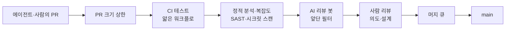

# 11장. AI가 쓴 PR을 어떻게 믿을까: 리뷰와 품질 게이트

GeekNews에 올라온 한 글에 이런 문장이 있다. "사람이 코드를 읽고 검토할 수 있는 속도보다, 코드가 만들어지는 속도가 빨라진 것이 더 근본적인 변화." 같은 글은 한 걸음 더 나간다. "코드를 빨리 만들었다는 것은 일을 끝낸 것이 아니라, 그 코드가 작동한다는 증거를 만드는 단계로 일을 넘긴 것"(C-패턴11).

ticketbox 팀도 이 변화를 몸으로 겪는 중이다. 9장에서 Copilot cloud agent와 `@claude` 워크플로를 들인 뒤로 PR 목록이 눈에 띄게 길어졌다. 문구 수정, 의존성 갱신, 테스트 보강 같은 PR은 에이전트가 몇 분 만에 올린다. 사람 개발자들도 Claude Code로 전보다 큰 PR을 전보다 자주 연다. 그런데 리뷰할 수 있는 사람은 여전히 다섯 명이고, 결제 코드를 제대로 아는 사람은 그중 둘이다. 월요일 아침, 그 둘 앞에 리뷰 요청이 스무 건 쌓여 있다. 어디서부터 봐야 할까? 아니, 스무 건을 다 봐야 하기는 할까?

답은 하나가 아니다. 무엇을 에이전트에게 맡길지, AI 리뷰 봇을 어디에 둘지, 어떤 게이트를 필수로 걸지, 그리고 효과를 무엇으로 잴지. 선택지마다 얻는 것과 새는 곳이 다르니 하나씩 나란히 놓고 따져보자.

## 리뷰가 병목이 되는 순간

먼저 현상을 정확히 보자. 체감만으로는 "요즘 리뷰가 너무 많다"는 푸념에 그치기 쉽다. 2026년 공개된 한 프리프린트는 엔터프라이즈 조직의 개발자 802명이 2024년 1월부터 2026년 4월까지 만든 PR 196,212건을 추적했다(P-44). 이 조직은 AI 도구로 처리량을 두 배로 늘린다는 목표를 세웠고, 2026년 4월에 1인당 처리량이 기준선 대비 2.09배에 이르렀다. 목표를 이뤘으니 성공담일까? 같은 논문은 이렇게 덧붙인다. "리뷰어 1인당 부하는 대략 두 배가 됐고 자동 리뷰가 사람 리뷰를 넘어섰다. 병합률과 되돌림률은 유지됐다."

이 문장은 두 가지로 읽힌다. 좋은 소식은 품질 지표가 무너지지 않았다는 것이다. 되돌림률이 유지됐다는 것은 늘어난 PR이 곧바로 사고로 이어지지는 않았다는 뜻이다. 걱정스러운 소식은 그 품질을 지키는 비용이 리뷰어에게 고스란히 옮겨 갔다는 것이다. 생성은 자동화됐지만 검증은 아직 사람의 시간으로 치르고 있다.

현장의 목소리는 이 비용이 어떤 모양인지 알려준다. 한 개발자는 AI로 만든 변경을 읽고 나서 "이 변경이 맞는지 판단할 만큼 코드베이스를 안다는 느낌이 들지 않았다"고 털어놨다(C-패턴11). 또 다른 개발자는 AI 코드가 자신감 있고 매끈해서 오히려 문제를 놓치기 쉽다고 했다. 그래서 그는 "이 함수를 깨뜨리려면 어떤 입력을 넣어야 하나"를 먼저 묻고, 그럴듯하지만 존재하지 않는 API 호출을 자주 잡아낸다고 한다(C-패턴11). 매끈한 코드일수록 리뷰어의 경계가 느슨해진다니, 난감한 일이다.

## 에이전트에게 무엇을 맡길까

리뷰 부하를 줄이는 가장 근본적인 방법은 리뷰하기 쉬운 PR만 에이전트에게 받는 것이다. 그렇다면 어떤 PR이 리뷰하기 쉽고, 병합까지 가는가? 에이전트 PR에 대한 실증 연구가 2026년 MSR 등 학회를 중심으로 잇달아 나오고 있어서, 이 질문에는 데이터로 답할 수 있다.

병합되지 못한 에이전트 PR 약 3만 3천 건을 분석한 MSR 2026 논문의 결론은 간결하다. "병합되지 않은 PR은 더 큰 코드 변경을 포함하고, 더 많은 파일을 건드리며, 프로젝트의 CI/CD 파이프라인 검증을 통과하지 못하는 경우가 많다"(P-50). 반대로 문서·CI·빌드 설정을 갱신하는 과제는 병합률이 가장 높았다. 같은 해의 다른 연구는 과제 유형이 병합률을 좌우하는 지배 요인이라고 보고한다. 문서 작업은 82.1%가 병합됐지만 신기능 작업은 66.1%에 그쳐, 16%p의 격차가 났다(P-51). 에이전트 간 순위는 조사 시점에 따라 바뀌니 "어느 에이전트가 가장 낫다"는 식으로 읽지는 말자.

Claude Code가 만든 PR 567개를 본 연구도 흥미롭다. 83.8%가 병합됐고, 그중 54.9%는 사람의 수정 없이 병합됐다(P-49). 절반 이상은 손대지 않고 들어갔다는 뜻이지만, 뒤집어 보면 나머지 절반 가까이는 사람의 손이 필요했다는 뜻이기도 하다.

이 연구들을 ticketbox의 규칙으로 옮기면 이렇다. 에이전트에게는 작고, 경계가 분명하고, CI가 정답을 판정할 수 있는 일을 맡긴다. 문서 갱신, 테스트 보강, 의존성 갱신, 린트 경고 정리가 여기에 속한다. 예매 흐름을 바꾸는 신기능처럼 판단이 많이 필요한 일은 사람이 주도하고 에이전트를 도구로 쓴다. 이슈를 Copilot cloud agent에 할당하기 전에 "이 변경을 CI가 판정할 수 있는가?"를 한 번 물어보는 것만으로도 리뷰 큐의 모양이 달라진다. 1장에서 본 교차 관찰이 여기서 다시 확인된다. 작은 배치와 초록 CI는 사람에게도 에이전트에게도 똑같이 통하는 기본기다.

## AI 리뷰 봇: 세 가지 시선

리뷰어가 부족하면 리뷰도 AI에게 맡기면 되지 않을까? Copilot code review는 2026년 3월 에이전트 구조로 GA가 되면서 누적 6,000만 건의 리뷰를 내세웠고(W-43), Cursor의 Bugbot, CodeRabbit 같은 도구도 자리를 잡았다. 그런데 이 봇들을 바라보는 개발자들의 시선은 크게 셋으로 갈린다.

### 첫째 시선: 버그를 잡는다

긍정론의 근거는 실제로 잡힌 버그다. HN의 한 개발자는 자기가 회고 분석을 해보니 AI 리뷰가 치명적인 버그를 "아마 80% 정도는" 찾아냈다고 했다(C-패턴10). 모든 PR을 사람보다 먼저 Copilot에 통과시킨다는 다른 개발자는 "거의 항상 맞는다"고 말한다(C-휴5). 혼자 개발하는 사람에게는 효과가 더 크다. 한 1인 개발자는 CodeRabbit을 "5분만에 적용할 수 있었다"며 혼자 놓치던 부분에 도움을 받는다고 적었다(C-패턴10). 학술 쪽에서도 Beko의 22개 저장소에 Qodo PR-Agent를 적용한 사례에서 자동 코멘트의 73.8%가 해결 처리됐다는 보고가 있다(P-47, 사실 확인 필요).

### 둘째 시선: 소음이 가치를 잡아먹는다

앞에서 "80%는 잡는다"고 말한 바로 그 개발자가 이어서 이렇게 말했다. "신호 대 잡음 비가 나쁘다. 치명적인 오류 하나와 함께, 코드가 문제일 수 있는 매우 추측성 짙은 이유 스무 개를 늘어놓지 않게 만들기가 정말 어렵다"(C-패턴10). 도구 대부분이 비용 때문에 diff만 컨텍스트로 본다는 지적도 있고, 리뷰의 목적 중 상당 부분은 코드베이스의 변화를 팀원들에게 전파하는 데 있다는 반론도 있다(C-패턴10). 봇이 리뷰를 대신하면 팀의 이해는 전파되지 않는다.

측정도 이 우려를 뒷받침한다. 앞의 Beko 사례에서 PR이 닫히기까지 걸린 평균 시간은 오히려 늘었다고 보고됐다(P-47, 사실 확인 필요). 한국의 하이퍼리즘은 Claude Agent SDK로 리뷰 에이전트를 직접 만들면서 1단계에서 공격적으로 탐지하게 했더니, 57건 중 32건이 오탐이었다고 공개했다(W-48). 절반 넘게 헛것을 본 셈이다.

### 셋째 시선: 이해상충과 공격면

세 번째 시선은 조금 더 차갑다. AI 리뷰 회사가 "AI 코드는 버그가 더 많다"는 보고서를 내면, 그 결론은 자기 제품의 필요를 말하는 것이기도 하다(4.1-E). 그리고 10장에서 본 CodeRabbit RCE 사례처럼, 수많은 저장소에 설치된 리뷰 봇은 그 자체로 공격면이다. 리뷰 봇에게 저장소 쓰기 권한과 시크릿을 넉넉히 주면 10장의 신뢰 경계 그림에 새 화살표가 생긴다.

### 합의점: 사람 리뷰의 앞단 필터

세 시선은 서로 부딪히지만, 현장에서 수렴하는 결론이 하나 있다. AI 리뷰는 사람 리뷰를 대체하는 자리보다 앞에 두는 필터의 자리에서 가장 잘 작동한다. 커뮤니티의 실무 팁이 구체적이다. AI에게 문제를 심각도 순으로 나열하고 각각이 얼마나 심각한지 등급을 매기게 한 뒤, 사람은 상위 몇 개만 깊이 본다. "상위 서너 개가 대개 깊이 볼 만한 것"이라는 경험담이 반복된다(C-휴5).

한국 팀들의 사례는 이 필터를 어떻게 다듬는지 보여준다. kt cloud는 GitHub Actions 대신 사내 VM 폴러와 Claude Code로 리뷰를 돌리면서 아키텍처 규칙을 파일로 명문화했다. 그 결과 "모든 PR이 동일한 기준으로 검증되기 때문에 리뷰어에 따른 품질 편차가 사라진다"고 했다(W-47). Cursor Bugbot도 `.cursor/BUGBOT.md` 규칙 파일을 계층으로 읽는다(W-44). 하이퍼리즘은 앞의 오탐 문제를 2단계 판정으로 풀었다. 1단계에서 넓게 의심하고, 2단계에서 각 의심 항목의 근거(Evidence)와 완화 요인(Mitigation)을 모아 오탐을 걸러낸다(W-48). 공통점이 보인다. 리뷰 기준을 코드처럼 저장소에 두고, 봇의 출력을 사람이 보기 전에 한 번 더 거른다. 하이퍼리즘의 회고에 붙은 한 문장도 곱씹어볼 만하다. "지금 방식은 에이전트라기 보다는 워크플로우에 가깝습니다"(W-48). 잘 작동하는 리뷰 봇은 자유롭게 판단하는 동료보다는, 단계가 정해진 검증 파이프라인에 가깝다는 뜻이다. 이 책이 2장부터 말해온 얇은 워크플로와 스크립트의 원칙이 리뷰 봇에도 그대로 적용되는 셈이다.

어느 시선이 옳을까? 상황에 따라 다르다. 혼자 개발하거나 리뷰어가 한 명뿐인 팀이라면 봇의 이득이 소음을 크게 앞선다. 리뷰어가 여럿이고 도메인 지식 전파가 중요한 팀이라면, 봇은 사람 리뷰 앞에서 뻔한 것을 걸러주는 역할에 한정하는 편이 낫다. 공개 저장소에서 외부 기여를 받는다면 봇의 권한부터 10장의 기준으로 점검하자.

## 게이트를 겹쳐 쌓기

리뷰가 사람의 판단이라면, 게이트는 사람의 판단 없이도 PR을 멈춰 세우는 장치다. 코드 생성 속도가 리뷰 속도를 앞지른 상황에서는 게이트의 비중이 커질 수밖에 없다. 그렇다면 어떤 게이트를 걸어야 할까? 하나의 완벽한 게이트는 없다. 개인 블로그 Flowkater.io는 이를 스위스 치즈 모델로 설명한다. 구멍 난 치즈 여러 장을 겹쳐 "구멍이 정렬되지 않도록" 불완전한 필터를 겹겹이 쌓으라는 것이다(W-49).


그림 1. ticketbox의 게이트 층 — 각 층은 구멍이 있고, 겹쳐서 막는다

각 층이 무엇을 잡고 어디서 새는지 나란히 놓아보자.

| 게이트 | 잘 잡는 것 | 새는 곳 | 운영 주의 |
|---|---|---|---|
| PR 크기 상한 | 리뷰 불가능한 대형 변경 | 작게 쪼갠 나쁜 변경 | 상한을 넘으면 자동 차단보다 경고부터 |
| CI 테스트 | 기존 동작의 회귀 | 테스트가 없는 새 동작 | 에이전트가 테스트를 고쳐 통과시키는지 확인 |
| 정적 분석·복잡도 | 누적되는 복잡도·경고 | 논리 오류 | 신규 경고만 막고 기존 부채는 따로 |
| SAST·시크릿 스캔 | 하드코딩 비밀, 알려진 취약 패턴 | 설계 수준 결함 | 스캐너는 여러 관점으로(5장) |
| AI 리뷰 봇 | 사람이 흘리는 세부 버그 | 추측성 소음, 컨텍스트 밖 문제 | 필수 체크로 걸 때 판정 기본값 확인 |
| 사람 리뷰 | 의도·설계·도메인 판단 | 피로·매끈한 코드에 대한 방심 | 봇이 거른 상위 항목부터 |
| 머지 큐 | main에서의 조합 충돌 | 개별 PR의 결함 | `merge_group` 트리거 필수(3장) |

몇 가지는 설명을 덧붙여야 한다. 정적 분석·복잡도 게이트를 권하는 근거는 Cursor 도입 효과를 추적한 MSR 2026 논문이다. 도입 뒤 개발 속도는 크게 올랐지만 일시적이었고, 정적 분석 경고와 코드 복잡도는 지속적으로 늘었으며, 누적된 복잡도가 이후 속도를 다시 떨어뜨렸다(P-43). 속도의 청구서가 복잡도로 날아온다는 뜻이니, 복잡도는 PR 단위에서 막는 편이 싸다.

SAST와 시크릿 스캔을 사람의 선택이 아니라 CI의 강제로 두는 이유도 있다. CCS 2023의 사용자 연구에서 AI 어시스턴트를 쓴 참가자들은 그렇지 않은 참가자보다 자기 코드가 안전하다고 믿는 경향이 더 강했다(P-46). 작성자의 자신감이 올라갈수록 작성자의 판단에 맡기는 검사는 약해진다.

AI 리뷰 봇을 필수 체크로 걸 때는 판정 기본값을 꼭 확인하자. Cursor Bugbot 문서는 이렇게 경고한다. "상태 체크를 필수로 지정하는 것만으로는 발견 사항이 있어도 머지가 막히지 않는다. 발견 사항의 기본 판정이 `neutral`이기 때문이다"(W-44). 해결되지 않은 발견 사항이 있을 때 실패로 보고하도록 따로 설정해야 게이트가 된다. 필수 체크 목록에 이름만 올려두고 안심하는 것은 위험하다. 초록색 체크가 무엇을 의미하는지는 도구마다 다르다.

## AI 사용을 PR에 밝혀야 할까

게이트 이야기를 하다 보면 자연스럽게 나오는 질문이 있다. 이 PR을 AI가 썼는지 알면 리뷰를 다르게 할 텐데, 밝히게 해야 하지 않을까? 여기서도 시선이 셋으로 갈린다(C-논쟁E).

첫째는 밝혀야 하고, 필요하면 금지해야 한다는 쪽이다. 사람들이 AI 사용을 투명하게 밝히지 않는다는 불만이 있고, 어떤 오픈소스 프로젝트는 LLM이 생성한 코드를 전면 금지했다. 둘째는 코드는 코드일 뿐이라는 쪽이다. "코드는 스스로 말한다." 게다가 밝히면 낙인이 찍히니 결국 아무도 밝히지 않는다는 현실론도 있다. 셋째는 누가 썼는지보다 작성자의 책임을 강화하자는 쪽이다. 변경을 이해하고 요약을 직접 쓰라, 코드를 가지고 놀면서 깨뜨려보고 테스트를 직접 더 쓰라는 주문이다.

ticketbox 팀은 세 번째를 택하기로 했다. 첫째 방식은 신고를 강제할 수단이 없고, 둘째 방식은 리뷰어가 얻을 수 있는 정보를 버린다. 셋째 방식은 AI를 썼든 안 썼든 똑같이 적용된다는 장점이 있다. PR을 연 사람은 도구와 무관하게 무엇을 왜 바꿨는지, 어떤 대안을 버렸는지, 무엇으로 검증했는지를 PR 본문에 적는다. 커뮤니티에서 자주 언급되는 규칙도 같은 방향이다. PR을 400줄 안팎으로 제한하고, 의도·근거·기각한 대안을 명시하라(C-패턴11). 작성자가 설명하지 못하는 PR은 리뷰어의 시간을 쓸 자격이 없다. Copilot cloud agent가 연 PR이라면 이 설명의 책임은 이슈를 할당한 사람에게 있다. 커밋에 공동 저자로 이름이 남는 사람도 바로 그 사람이다(W-42).

## 체감 대신 측정으로

마지막으로 가장 어려운 질문이 남았다. 이 모든 도구와 게이트가 우리 팀을 실제로 빠르게 만들었는가? AI 생산성에 대한 연구 결과를 나란히 놓으면 당혹스럽다.

GitHub 소속 저자가 참여한 2023년 통제 실험에서는 Copilot을 쓴 그룹이 과제를 55.8% 빨리 끝냈다(P-41). 그런데 METR이 숙련된 오픈소스 개발자 16명에게 실제 과제 246개를 맡긴 2025년 무작위 대조 실험에서는 AI를 허용했을 때 완료 시간이 오히려 19% 늘었다(P-42). 더 눈여겨볼 대목은 따로 있다. 참가자들은 시작 전에 24% 빨라질 거라 예상했고, 실험이 끝난 뒤에도 20% 빨라졌다고 믿었다. 그리고 앞에서 본 엔터프라이즈 연구는 처리량 2.09배를 보고했다(P-44).

+55.8%, −19%, 2.09배. 어느 숫자가 진짜일까? 셋 다 진짜다. 단일 그린필드 과제인지, 익숙한 대형 코드베이스인지, 몇 주인지, 2년 넘는 기간인지에 따라 측정 대상 자체가 다르다. 측정 방식에 따라 부호까지 바뀌는 효과를 한 숫자로 요약하는 것은 위험하다. METR 실험이 보여주듯 체감은 측정과 따로 논다.

DORA 보고서끼리 비교할 때도 조심하자. 2024년 보고서는 AI 도입이 늘수록 전달 처리량과 안정성이 모두 조금씩 줄어드는 관계를 보고했고(P-39), 2025년 보고서는 처리량과는 양(+)의 관계로 돌아섰지만 안정성과는 여전히 음(−)의 관계라고 했다(P-40). 다만 두 해 사이에 방법론과 지표 구성이 바뀌었을 수 있어서, 이것을 "1년 만에 좋아졌다"로 읽기는 이르다(P-39, P-40).

그렇다면 ticketbox 팀은 무엇으로 재야 할까? 1장에서 이 책의 자로 삼은 DORA 5지표로 돌아가자. 변경 리드타임, 배포 빈도, 실패 배포 복구 시간, 변경 실패율, 배포 재작업률(W-46). 에이전트를 들이기 전 한 분기와 들인 뒤 한 분기를 이 다섯 개로 비교한다. 여기에 이 장에서 본 두 숫자를 곁들이면 좋다. 리뷰 대기 시간, 그리고 리뷰어 한 사람당 주간 리뷰 건수.

이 숫자들을 모으려고 별도의 대시보드부터 살 필요는 없다. 배포 빈도와 변경 리드타임의 재료는 이미 GitHub 안에 있다. 6·7장에서 배포 잡을 GitHub 환경(environment)에 묶어두었다면, 환경마다 배포 레코드가 쌓인다. wrangler-action에 `gitHubToken`을 넘기면 Workers 배포도 GitHub Deployments로 기록된다(W-33). 다만 4장에서 본 `deployment: false` 옵션을 켠 환경은 시크릿 스코프로만 쓰이고 배포 레코드를 만들지 않으니(W-4), 측정에 쓸 환경과 시크릿 보관용 환경을 구분해두자. 변경 실패율과 복구 시간은 8장의 롤백 기록에서 나온다. 롤백을 사람이 손으로 했다면 그 사실을 이슈 하나로라도 남기는 습관이 필요하다. 기록되지 않은 롤백은 측정되지 않는다.

PR 수가 두 배가 됐는데 변경 실패율과 배포 재작업률이 그대로라면 게이트가 제 몫을 하고 있는 것이다. 리뷰 대기 시간만 늘었다면 병목이 리뷰어에게 옮겨 간 것이니 에이전트에게 맡기는 일의 범위를 다시 좁히자.

## ticketbox의 PR 규약 초안

이 장에서 나란히 놓은 선택지들을 ticketbox 팀의 결정으로 모아보면 이런 초안이 나온다. 저장소 루트의 `CONTRIBUTING.md`에 두고, 핵심 항목은 `.github/pull_request_template.md`로 PR 본문에 자동으로 들어가게 한다.

```markdown
# ticketbox PR 규약 (초안 v0.1)

## 크기
- 변경은 400줄 안팎을 목표로 한다. 넘으면 PR 본문에 쪼갤 수 없는 이유를 적는다.
- 에이전트에게는 CI가 판정할 수 있는 일만 할당한다(문서·테스트·의존성·린트).

## PR 본문에 적을 것 (작성 도구와 무관하게)
- 무엇을, 왜 바꿨나
- 검토했다가 버린 대안과 그 이유
- 무엇으로 검증했나 (추가한 테스트, 수동 확인, 프리뷰 URL)
- 에이전트가 연 PR은 이슈를 할당한 사람이 위 항목을 채운다

## AI 리뷰 코멘트 처리
- 봇의 코멘트는 심각도 상위 항목만 사람 리뷰 전에 처리한다
- 채택하지 않은 코멘트는 한 줄 사유와 함께 resolve 한다
- 리뷰 기준은 저장소의 규칙 파일로 관리하고, 바꿀 때는 PR로 바꾼다

## 필수 체크
- ci / test (pull_request, merge_group)
- 정적 분석: 신규 경고·복잡도 증가 차단
- SAST·시크릿 스캔
- AI 리뷰: 미해결 발견 사항이 있으면 실패로 보고하도록 설정한 경우에만 필수로 건다
- 사람 승인 1명 이상, 결제·인증·워크플로 파일은 CODEOWNERS 승인
```

숫자와 문구는 모두 출발점일 뿐이다. 400줄이 너무 빡빡한 팀도 있고, AI 리뷰를 아예 필수에서 빼는 게 맞는 팀도 있다. 중요한 것은 이 규칙들이 누군가의 머릿속이 아니라 저장소 안의 파일로 존재하고, 바꿀 때도 PR을 거친다는 점이다. 이 초안을 다음 팀 회의에 가져가 함께 고쳐 쓰자.
