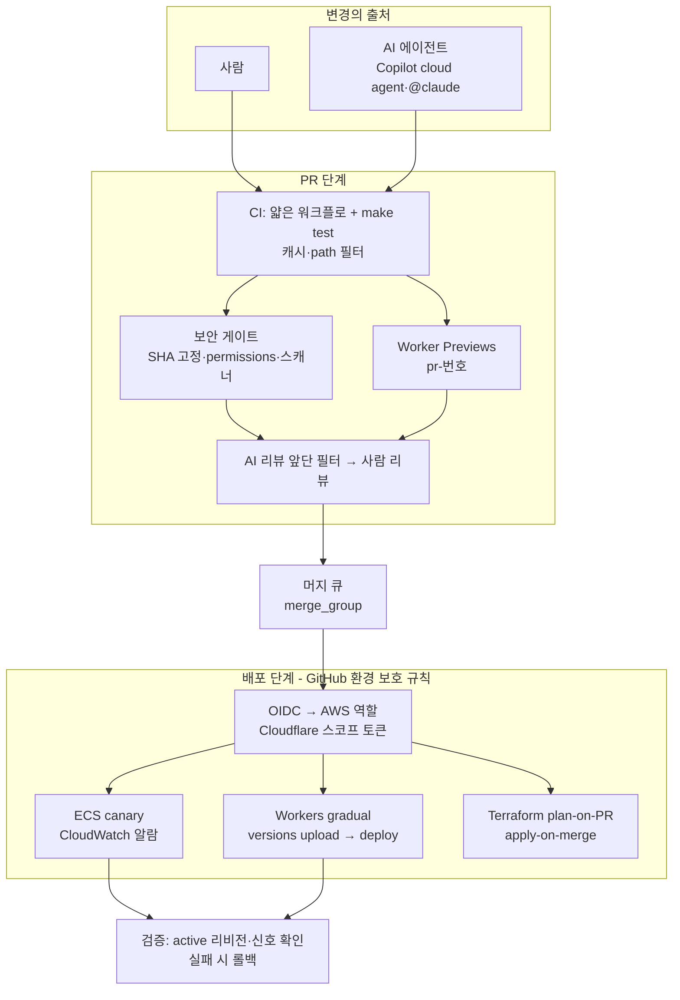

# 12장. 배포는 검증이다: ticketbox 파이프라인 전체 그림

<!-- editor 확인: 아래 세 질문은 1장 클로징의 "자기 진단 질문 3개"를 되부르는 자리다. 1장 최종본의 질문 문구와 맞춰 다듬어야 한다. -->

1장의 끝에서 세 가지 질문을 던지고 멈췄다. 그 질문들은 이랬다.

1. main이 깨졌을 때, 다시 초록색이 되기까지 얼마나 걸리는가?
2. 배포가 성공했다는 것을, 로그의 초록색 체크 말고 무엇으로 아는가?
3. 사람이 쓴 코드와 AI가 쓴 코드가 같은 게이트를 통과하는가?

그때 ticketbox는 어느 질문에도 자신 있게 답하지 못했다. 배포는 누군가의 노트북에서 스크립트로 했고, 그 누군가가 휴가를 가면 배포도 쉬었다. 이제 같은 질문을 다시 던져보자.

첫 번째 질문에는 이렇게 답한다. main에 들어가는 모든 변경은 머지 큐에서 CI를 한 번 더 통과하고, 그 CI는 누구의 노트북에서나 `make test`로 똑같이 재현된다. 깨졌을 때 원인을 찾으려고 커밋-푸시-대기를 반복할 필요가 없다. 두 번째 질문에는 이렇게 답한다. ECS에서는 안정화 뒤에 내가 올린 리비전이 active인지 확인하는 스텝이, Workers에서는 점진 배포의 신호가 성공을 판정한다. 초록색 체크는 그 판정이 끝난 뒤에야 켜진다. 세 번째 질문에는 이렇게 답한다. 그렇다. Copilot cloud agent의 PR도, 사람이 Claude Code로 만든 PR도, 손으로 쓴 PR도 같은 필수 체크와 같은 리뷰 규칙과 같은 머지 큐를 지난다.

세 답이 나오기까지 열한 개의 장이 필요했다. 이제 그 조각들을 한 장의 그림으로 펼쳐보자.

## ticketbox 파이프라인 한눈에 보기

그림 1. ticketbox 최종 파이프라인 전체도

그림 1은 위에서 아래로 읽는다. 변경은 사람에게서도, 에이전트에게서도 온다. 출처가 둘이지만 입구는 하나다. PR이 열리면 2장의 얇은 워크플로가 `make test`를 부르고, 3장의 캐시와 path 필터가 그 시간을 줄인다. 같은 PR에서 5장의 보안 게이트가 액션 참조와 권한을 확인하고, 7장의 Worker Previews가 `pr-번호` 이름의 격리된 환경을 띄운다. 사람 리뷰어는 11장의 규약대로 AI 리뷰 봇이 걸러낸 상위 항목과 프리뷰 URL을 함께 보고 판단한다.

승인된 PR은 머지 큐에 들어가 main과 합쳐진 상태로 CI를 한 번 더 통과한다. main에 들어온 뒤에야 배포 잡이 GitHub 환경의 보호 규칙을 지나 시크릿과 자격증명을 얻는다. AWS에는 4장의 OIDC로 들어가 장기 키가 없고, Cloudflare에는 Specified Workers와 Editor 역할로 좁힌 토큰으로 들어간다. 6장의 ECS는 canary로, 8장의 Workers는 gradual deployment로 트래픽을 조금씩 옮긴다. 그리고 마지막 상자, 검증이 있다. 배포 로그 대신 실제로 돌고 있는 리비전과 에러율 신호가 성공을 판정하고, 실패하면 되돌린다. 9·10장의 에이전트 워크플로는 이 그림의 왼쪽 위 한 칸에만 들어가 있다. 에이전트는 변경을 제안할 수 있지만, 그 아래 어떤 상자도 건너뛰지 못한다.

## 변경 하나가 지나가는 길

그림만으로는 추상적이니, 변경 하나가 실제로 어떤 길을 지나는지 따라가보자. 다음 주 인기 공연의 티켓 오픈을 앞두고, 대기열 화면의 안내 문구가 헷갈린다는 이슈가 올라왔다. 담당자는 이 이슈를 Copilot cloud agent에 할당한다. 문구 수정은 작고 경계가 분명하며 CI가 판정할 수 있는 일이니, 11장의 기준으로 보면 에이전트에게 맡기기 좋은 일이다.

에이전트는 `copilot/` 브랜치에 드래프트 PR을 올린다. 쓰기 권한을 가진 담당자가 변경을 훑어보고 "Approve and run workflows"를 누르기 전까지 CI는 돌지 않는다(W-42). 버튼이 눌리면 `apps/edge`에 대한 CI가 돌고, path 필터 덕분에 `apps/api`의 테스트는 건너뛴다. 동시에 `pr-번호` 이름의 Worker Preview가 뜬다. 담당자는 휴대폰으로 프리뷰 URL을 열어 바뀐 문구를 직접 확인한다. AI 리뷰 봇은 문구 옆의 접근성 속성이 빠졌다는 지적 하나를 상위 항목으로 올린다. 에이전트가 이를 반영하고, 담당자는 11장의 규약대로 PR 본문에 무엇을 왜 바꿨는지와 프리뷰에서 확인한 내용을 채운다. Copilot cloud agent는 스스로 PR을 Ready로 바꾸거나 승인할 수 없으니(W-42), 이 단계부터는 사람의 몫이다.

승인된 PR은 머지 큐에서 main과 합쳐진 상태로 한 번 더 검증된다. 배포 잡은 `production` 환경의 보호 규칙을 통과한 뒤에야 Cloudflare 토큰을 받는다. `wrangler versions upload`로 새 버전을 올리고 `wrangler versions deploy`로 트래픽의 일부만 옮긴다(W-35). 에러율에 변화가 없음을 확인한 뒤 나머지를 옮긴다. 이슈가 올라온 지 반나절, 누구의 노트북도 거치지 않았고 누구도 장기 키를 만지지 않았다. 사람은 판단이 필요한 세 지점, 워크플로 실행 승인과 프리뷰 확인과 머지 승인에만 있었다.

## 세 축은 서로 기댄다

1장에서 Hilton 등이 정리한 CI의 세 긴장 축을 이 책의 지도로 삼았다. 빠르고 확실하게 검증하는 확신(Assurance), 접근을 통제하고 정보를 지키는 보안(Security), 설정하기 쉽고 선택지가 넓은 유연성(Flexibility)(P-3). 장별로 보면 확신은 2·3·6·7·8·11장, 보안은 4·5·9·10장, 유연성은 2·3장과 이 장에서 주로 다뤘다.

그런데 파이프라인을 다 짜고 나서 돌아보면, 세 축은 각자 따로 서 있지 않다. 한 축에서 한 일이 다른 축을 떠받친다. 몇 가지 연결이 특히 선명하다.

2장에서 워크플로 로직을 스크립트로 뺀 것은 유연성을 위한 결정이었다. 로컬에서 재현되고, 벤더에 덜 묶인다. 그런데 이 결정이 8장에서 확신의 도구가 됐다. GitHub Actions가 멈춘 날에도 같은 스크립트를 사람이 직접 실행하는 수동 배포 런북이 가능해졌기 때문이다. 워크플로 안에 수백 줄의 로직이 박혀 있었다면 그 런북은 쓸 수 없었다.

4장에서 AWS 배포를 OIDC로 바꾼 것은 보안을 위한 결정이었다. 그 결정이 9장에서 그대로 이어졌다. claude-code-action도 같은 워크로드 아이덴티티 페더레이션으로 Claude API에 접근하므로(W-38), 에이전트를 들일 때 새 장기 키를 만들 필요가 없었다. 한 번 익힌 원칙이 새 참여자에게도 그대로 적용됐다.

5장에서 `permissions:` 블록을 모든 워크플로 최상단에 명시하고 SHA 고정을 정책으로 강제한 것은 공급망을 위한 결정이었다. 10장에서 에이전트 잡과 게시 잡의 권한을 나눌 때, 우리는 새 개념을 배울 필요가 없었다. 이미 모든 잡이 자기 권한을 선언하고 있었으니 경계를 긋는 일은 한 줄을 옮기는 일이었다.

11장에서 PR을 작게 유지하고 머지 큐로 main을 지킨 것은 리뷰를 위한 결정이었다. 그런데 작은 PR은 8장의 canary에도 이롭다. 변경이 작으면 canary에서 문제가 보였을 때 원인을 찾기 쉽고, 되돌려도 잃는 것이 적다. DORA가 반복해서 말하는 작은 배치의 효과가 리뷰 단계와 배포 단계에서 동시에 나타나는 셈이다.

세 축을 긴장 관계로만 보면 하나를 얻을 때마다 다른 하나를 내줘야 할 것 같다. 실제로 짜보면 기본기 하나가 여러 축을 동시에 받친다. 좋은 파이프라인은 세 축 사이에서 타협한 결과라기보다, 서로 기대는 결정들이 쌓인 결과에 가깝다.

## 여러분 팀의 파이프라인을 점검하는 네 질문

ticketbox는 예제일 뿐이다. 여러분 팀의 파이프라인은 배포 대상도, 규모도, 역사도 다르다. 그래서 설정을 그대로 베끼기보다, 이 책이 되풀이해 던진 질문을 가져가는 편이 낫다. 어떤 변경이든 main에 들어가기 전에 다음 네 가지를 물어보자.

첫째, 이 변경은 무엇이 검증하는가? 사람의 눈인지, 테스트인지, 스캐너인지, 프리뷰에서의 확인인지. 검증 주체가 사람뿐이라면 그 사람이 휴가를 가거나 피곤한 날 구멍이 난다. 둘째, 이 변경은 무엇으로 클라우드에 들어가는가? 장기 키인지, OIDC인지, 좁힌 토큰인지. 그 자격증명을 얻을 수 있는 잡은 어디까지인지. 셋째, 이 변경을 만든 쪽이 무엇을 할 수 있는가? 사람이라면 리뷰를, 에이전트라면 권한과 도구를. 신뢰 경계 그림에서 이름표가 없는 화살표는 없는지. 넷째, 이 변경은 어떻게 되돌리는가? 코드는 되돌려도 데이터와 바인딩과 시크릿은 되돌아오지 않는다는 8장의 교훈까지 포함해서.

네 질문 모두에 "누가 만들었는가"는 들어 있지 않다. 사람이 썼든 에이전트가 썼든 질문은 같다. 그것이 이 책이 AI 시대의 CI/CD에 대해 내린 가장 짧은 결론이다.

## GitHub Actions를 떠나야 할까

책을 마무리하기 전에 피해 갈 수 없는 논쟁이 하나 있다. GitHub Actions 자체에 대한 불만이다. 2026년 2월 Ian Duncan은 GitHub Actions를 "CI의 Internet Explorer"라 불렀고, 표현식 문법과 권한 모델, 마켓플레이스, 브라우저를 멈추게 하는 로그 뷰어와 씨름하는 일상을 비판했다(C-논쟁A). 신뢰성에 대한 불만도 컸다. HN에서는 2026년 들어서만 장애를 몇 번 겪었는지 세다가 잊었다는 푸념이 나왔다(C-패턴4). 가동률에 대한 비공식 집계도 돌았지만 검증된 수치는 아니니, 개발자들이 그만큼 불편을 느꼈다는 신호 정도로 읽자. Buildkite나 Concourse가 훨씬 나았다는 경험담도 이어졌다.

반대편의 목소리도 만만치 않다. Lobsters의 한 개발자는 "빌드 시스템으로 진입하는 발판으로만 쓴다면 대부분의 CI는 괜찮다"고 했다(C-논쟁A). 카카오엔터프라이즈 팀은 젠킨스 인스턴스를 관리하던 부담에서 벗어나 GitHub 화면에서 바로 빌드 결과를 확인하고 실행할 수 있다는 점을 GitHub Actions의 장점으로 꼽았다. GeekNews의 한 요약은 이 논쟁을 이렇게 정리했다. "GitHub의 대안은 있지만 대체재는 없다."

어느 쪽이 옳을까? 이 책의 답은 떠날지 말지를 지금 정하지 않아도 되는 파이프라인을 짜자는 것이다. 첫 번째 목소리가 괴로워한 것들, 즉 표현식 문법, 권한 모델, 디버깅할 수 없는 로직은 대부분 워크플로가 두꺼울 때 생기는 고통이다. 두 번째 목소리가 말한 "발판으로만 쓴다"는 조건은 2장의 원칙과 같다. 워크플로가 체크아웃과 스크립트 호출 정도로 얇다면, 옮기는 비용은 트리거와 자격증명을 다시 연결하는 일 정도로 줄어든다. `make test`는 어느 CI에서나 `make test`다. 얇은 워크플로는 좋은 설계이면서 동시에 이식성 보험이다. 보험을 들어두면 떠날지 말지는 그때 가서 정해도 된다.

## 신선도 감시 목록

이 책의 많은 내용은 2026년 9월 기준이고, 그중 일부는 출간 직후부터 바뀔 것이다. 무엇이 바뀔지 알고 있으면 덜 당황한다. 지켜볼 항목과 확인할 곳을 표 하나로 모았다.

| 항목 | 2026년 9월 기준 상태 | 어디서 확인할까 |
|---|---|---|
| 퍼블릭 저장소의 `pull_request_target` 기본 차단 | 평가(evaluate) 모드, 2026년 11월 2일 강제 예정. 프라이빗·내부 저장소는 대상 아님 (W-21) | GitHub Docs "Securely using pull_request_target", GitHub Changelog |
| GitHub Actions 2026 보안 로드맵 | 의존성 잠금·실행 정책·scoped secrets(발표 당시 프리뷰 3~6개월 예고), 러너 밖 egress 방화벽(프리뷰 6~9개월 예고). 2026년 3월 발표된 로드맵이며 출시 여부 미확인 (W-20) | GitHub Blog, GitHub Changelog |
| Cloudflare Worker Previews | wrangler 4.135.0 이상, 도입된 지 얼마 되지 않은 기능 (W-32) | Cloudflare Workers 문서, Cloudflare Changelog |
| self-hosted 러너 과금 | 발표 후 연기, 재개 여부 불확실 (W-8) | GitHub Actions 가격 문서, GitHub Changelog |
| Cloudflare의 GitHub OIDC 수용 | 공식 문서에서 확인하지 못함 (W-33) | Cloudflare API 토큰 문서, Cloudflare Changelog |
| 액션·도구 버전 | configure-aws-credentials v6.3.0, wrangler-action v4.1.3, claude-code-action v1.0.x 등 (W-0) | 각 저장소 릴리스, Dependabot·Renovate PR |

마지막 줄은 조금 다르게 다루자. 액션 버전은 사람이 챙기기보다 5장에서 설정한 Dependabot이나 Renovate가 SHA 갱신 PR로 알려주게 두고, 우리는 그 PR의 체인지로그를 읽는 쪽에 시간을 쓰는 편이 낫다. 나머지 다섯 줄은 분기마다 한 번씩 확인하는 일정을 캘린더에 넣어두자. 특히 `pull_request_target` 항목은 이 책이 나온 시점에 이미 "예정"이 아니라 "시행"으로 바뀌어 있을 수 있다.

## 다음 걸음

책을 덮고 나서 어디부터 손대야 할까? 모든 것을 한 번에 바꾸려 하면 아무것도 바뀌지 않는다. 시간 단위로 나누면 순서가 보인다.

이번 주에는 되돌리기 쉽고 효과가 큰 것부터 한다. 모든 워크플로 최상단에 `permissions:` 블록을 적고, 빌드·테스트 잡에서 시크릿을 걷어낸다. 서드파티 액션을 SHA로 고정하고 조직 정책으로 강제한다. 그리고 2장의 과제, 가장 긴 `run:` 블록 하나를 스크립트로 빼서 로컬에서 먼저 돌려보는 일을 아직 하지 않았다면 이번 주에 하자.

이번 달에는 자격증명과 배포 판정을 바꾼다. AWS 장기 키를 OIDC로 교체하고 `sub` 조건을 GitHub 환경으로 좁힌다. Cloudflare 토큰은 Specified Workers와 Editor 역할로 다시 발급한다. 배포 워크플로 끝에 "내 리비전이 active인가"를 확인하는 스텝을 넣고, PR마다 Worker Previews를 띄운다. 팀에 에이전트 워크플로가 있다면 10장처럼 신뢰 경계 그림을 한 장 그린다.

이번 분기에는 구조를 바꾼다. ECS canary와 Workers gradual deployment로 점진 배포를 도입하고, 8장의 롤백 런북을 팀이 실제로 한 번 연습한다. 머지 큐와 필수 체크를 정비하고 11장의 PR 규약을 팀 합의로 확정한다. 그리고 DORA 5지표의 기준선을 잰다. 다음 분기에 무엇이 좋아졌는지 말하려면 지금의 숫자가 필요하다.

## 검증을 습관으로

돌아보면 이 책은 한 가지 이야기를 여러 번 했다. 2장에서는 YAML 속에 숨은 로직을 로컬에서 재현되는 스크립트로 꺼냈다. 4장에서는 열네 달 묵은 액세스 키를 실행마다 새로 발급되는 토큰으로 바꿨다. 5장에서는 움직이는 태그 대신 고정된 SHA를 박았다. 6장에서는 초록색 체크 위에 active 리비전 확인을 한 겹 더 얹었다. 8장에서는 한 번에 전부 내보내던 배포를 신호를 보며 조금씩 옮기는 배포로 바꿨다. 10장에서는 에이전트의 판단력에 기대던 자리에 권한의 벽을 세웠고, 11장에서는 "빨라진 것 같다"는 체감을 DORA 지표로 다시 쟀다.

모두 같은 문장의 변주다. 믿고 싶은 것 대신, 확인할 수 있는 것을 믿자.

AI 코딩 도구가 코드를 쏟아내는 지금, 이 문장의 무게는 더 커졌다. 한 개인 블로그의 표현을 빌리면, 코드를 만드는 비용이 0에 가까워질수록 가치는 생성에서 검증으로 옮겨간다(W-49). 누구나 빠르게 코드를 만들 수 있는 세상에서 팀을 구별하는 것은 그 코드를 얼마나 빨리, 얼마나 확실하게 믿을 수 있게 만드느냐다. 파이프라인은 그 검증을 누군가의 성실함에 맡기지 않고 팀의 습관으로 만드는 장치다. 오늘 합쳐진 변경도, 내일 에이전트가 올릴 변경도 같은 길을 지나게 만드는 장치.

배포는 검증이다. ticketbox의 파이프라인은 여기서 완성됐지만, 여러분 팀의 파이프라인은 이제 시작이다. 첫 번째 `permissions:` 블록부터 적어보자.
