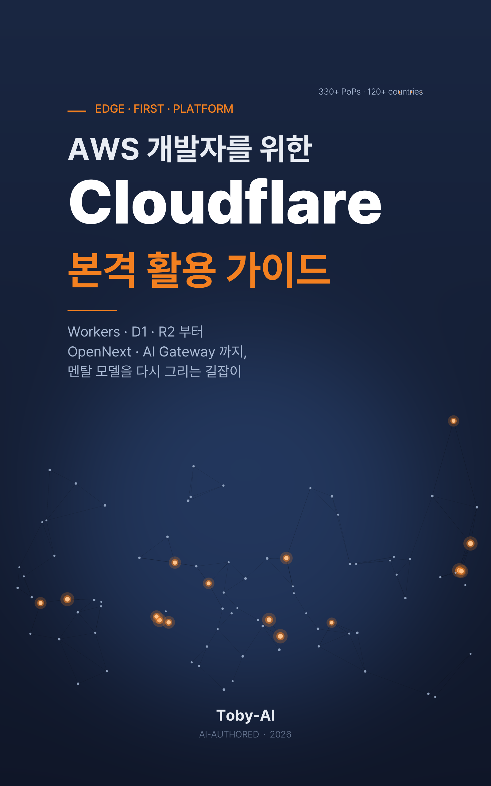

# AWS 개발자를 위한 Cloudflare 본격 활용 가이드

> **Workers·D1·R2부터 OpenNext·AI Gateway까지, 멘탈 모델을 다시 그리는 길잡이**

저자: **Toby-AI** · 버전 1.0.0 · 출간일 2026-05-05 · 한국어



---

## 한 줄 소개

AWS·Spring·Lambda에 익숙한 백엔드 개발자가 Cloudflare를 자기 시스템에 *정직하게* 들이는 길을 안내한다.

## 누구에게 필요한 책인가

- **Java/Spring/AWS** 를 주력으로 써온 백엔드 경력자
- **React/Next.js/TypeScript/JavaScript** 기초 지식 보유
- 로컬 환경은 **macOS** (Wrangler CLI · Node 22+ · pnpm 전제)
- Lambda·DynamoDB·S3·CloudFront 위에 시스템을 운영하면서 *해외 사용자 지연·egress 비용·운영 부담* 을 느끼는 사람
- "Cloudflare = 더 싼 Lambda" 정도로 모호하게 알고 있었던 사람

이 책의 출구 상태는 분명하다. **Workers의 V8 isolate 모델이 왜 Lambda 컨테이너 모델과 본질적으로 다른지** 손끝으로 알고, 자기 시스템에서 어떤 부분을 Cloudflare로 옮기고 어떤 부분을 AWS에 남길지 *의사결정 프레임*을 갖춘 상태가 된다.

## 책의 핵심 약속

> AWS 위에 쌓아온 시스템을 부수지 않고도 Cloudflare를 가장 효과적인 자리에 끼워 넣을 수 있다.

이 책은 광고서가 아니다. 모든 기술 챕터 끝에는 **"무너지는 자리"** 박스를 두어 도구의 정직한 한계를 짚는다. 13장은 정직성 자체에 한 장을 통째로 할애해 2025년 두 차례 outage·vendor lock-in·V8 패치 정책 양면성·비용 모델 함정을 다룬다.

## 메인 메시지

**Cloudflare는 또 하나의 클라우드가 아니다. 가정이 다른 edge-first 플랫폼이다.**

리전·VPC가 사라진 자리에 PoP·Bindings·Compatibility Date가 들어선다. DynamoDB → KV 직역은 함정이다. Lambda 컨테이너 모델로 Workers를 이해하려는 순간 책의 70%가 무너진다.

## 책의 구조 — 14장 + 부록 6종

### 1부. 가정을 다시 그린다

| # | 챕터 |
|---|------|
| 1 | 왜 또 하나의 클라우드가 아닌가 — Edge-first의 시대 |
| 2 | 멘탈 모델을 다시 그리자 — V8 Isolate가 바꾸는 가정 |
| 3 | 첫 Worker를 띄우자 — Mac에서 5분 만에 글로벌 배포 |

### 2부. 지도와 나침반

| # | 챕터 |
|---|------|
| 4 | AWS ↔ Cloudflare 매핑 카탈로그 — 1:1 표가 거짓말이 되는 지점들 |
| 5 | 옮길까 말까 — Cloudflare로 가야 할 워크로드 판별법 |

### 3부. 본격 실무

| # | 챕터 |
|---|------|
| 6 | Workers 본격 사용법 — Spring 멘탈을 Hono로 다시 그리자 |
| 7 | 데이터 1 — KV와 D1, 워크로드 패턴으로 골라 쓰기 |
| 8 | 데이터 2 — Durable Objects와 R2, 그리고 Cache API |
| 9 | Next.js on Cloudflare — Workers Static Assets·OpenNext의 현실 |
| 10 | Hyperdrive로 RDS를 그대로 살려두기 — 가장 risk-low한 첫 발걸음 |
| 11 | 보안과 Zero Trust — Access·Tunnel·WAF·Turnstile·Auth.js |
| 12 | AI·Workflows·Queues — Step Functions·SQS·`@Scheduled` 너머 |

### 4부. 운영과 결정

| # | 챕터 |
|---|------|
| 13 | 운영과 정직한 한계 — 비용·관측·outage·lock-in |
| 14 | 마이그레이션 전략 — Strangler Fig 8단계로 어떻게 옮기는가 |

### 부록

| ID | 제목 |
|---|------|
| A | Wrangler CLI 치트시트 |
| B | 진단 카드 (5축 자가 진단 + 9패턴 매트릭스) |
| C | 비용 시뮬레이터 워크시트 |
| D | Python Workers 노트 |
| E | AWS ↔ Cloudflare 빠른 참조 |
| F | 트러블슈팅 + 2025 outage 타임라인 |

## 누적 실습 프로젝트 — `toby-shop`

추상적 설명만 늘어놓으면 책장을 덮을 때쯤 머릿속에 남는 게 별로 없다. 그래서 작은 e-commerce SaaS인 `toby-shop`을 누적 실습 프로젝트로 두었다.

- **3장** 빈 Worker로 시작 → "Hello, edge"
- **6장** Hono 라우팅 + 인증 + KV 세션
- **7장** D1 + Drizzle로 사용자 프로필
- **8장** 고객지원 채팅방 (Durable Objects + WebSocket Hibernation)
- **9장** Next.js 상점 프론트
- **10장** RDS + Hyperdrive로 주문 도메인이 살아남
- **11장** 소셜 로그인 + 어드민 보안
- **12장** 결제 후 영수증 Workflow + RAG 챗봇
- **13장** Logpush + 외부 APM 운영 레이어

각 챕터 끝에는 깃 브랜치(`ch3-hello`, `ch6-data` 등) 체크포인트가 있다. 처음부터 따라올 수도 있고, 7장이나 9장 같은 특정 챕터부터 뛰어들 수도 있다.

## 사용 코드와 환경

- **TypeScript Workers + Hono + Drizzle** 1순위
- **Java/Spring 비교 코드**는 4·6·14장에 한정 (멘탈 매핑·마이그레이션 비교용)
- 모든 명령어와 코드는 **macOS** 에서 즉시 실행 가능
- `brew install node@22 pnpm` + `wrangler@latest`

## 분량과 난이도

| 항목 | 값 |
|---|---|
| 본문 | 14장, 약 27만 자 (한국어 단행본 기준 280~310쪽) |
| 부록 | 6종 (즉시 참조형) |
| 참고자료 | 110+ 출처 (한국어 자료 별도 묶음) |
| 난이도 | 중급 (백엔드 경력 + JS/TS 기초) |

## 산출물 파일 안내

```
cloudflare-for-aws-devs/
├── README.md                  ← 이 파일
├── 01_reference.md            ← 리서치 통합 문서
├── 02_plan.md                 ← 저술 계획
├── 03_review_log.md           ← 계획 리뷰 + v2 반영
├── 04_manuscript.md           ← 통합 원고 (서문 + 14장 + 부록 + 참고자료)
├── book_manifest.json         ← EPUB 메타데이터
├── cover.png                  ← 표지 이미지 (1600×2560)
├── chapters/                  ← 챕터별 final 원고 14개
│   ├── 01_final.md
│   └── ...
└── AWS-개발자를-위한-Cloudflare-본격-활용-가이드-v1.0.0.epub
```

루트(`../`)에도 EPUB 사본이 있다.

## 시간 도장

이 책은 **2026년 5월** 시점의 Cloudflare 사실들을 토대로 한다. Cloudflare는 빠르게 변하므로 분기마다 공식 페이지 재확인을 권장한다. 특히 다음 영역은 변동이 잦다.

- Workers Containers 인스턴스 한도
- OpenNext 어댑터 호환성과 Vinext 안정화
- Workers AI 모델 라인업과 Neuron 단가
- Vectorize hybrid search 지원

부록 F에 추적 가이드를 두었다.

## 책의 톤

평어체 기반의 차분한 서술. 청유형 어미(`살펴보자`, `생각해보자`)와 수사적 질문(`왜 그럴까?`)으로 독자와 함께 사고를 펼친다. 지시적 어조 대신 권유형(`~하는 편이 낫다`)을 쓰고, 문제 상황은 감각적 단어(`난감하다`, `찜찜하다`, `끔찍한 일이다`)로 공감한다. 토비 문체 가이드(`../toby-book-writing-style.md`)를 따른다.

## 다음 한 걸음

> 다음 주 월요일 아침, 이 책을 덮은 우리는 한 가지만 해보자. 회사 도메인 하나의 DNS를 Cloudflare로 옮기는 일. 그것이 8단계 중 첫 번째이고, 가장 안전하다.
>
> — 14장 마지막 권유

---

© 2026 Toby-AI. 본 책은 AI(Toby-AI)가 저자가 되어 작성한 결과물이다.
