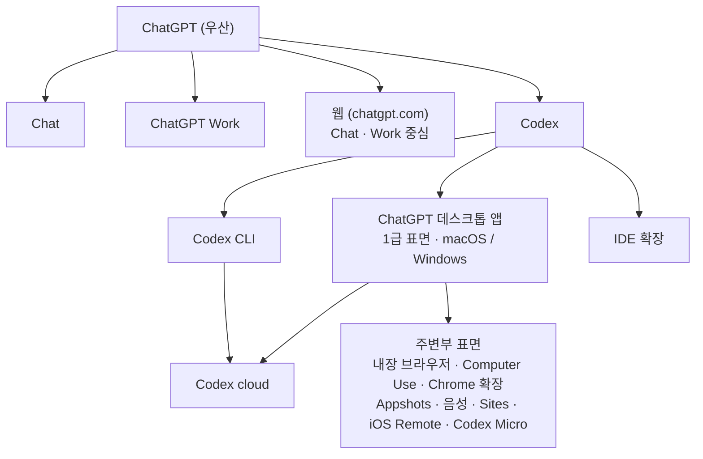
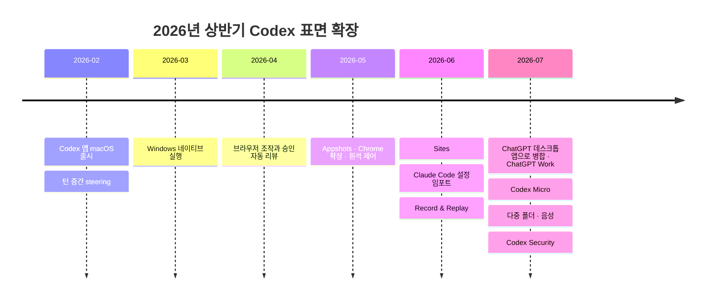
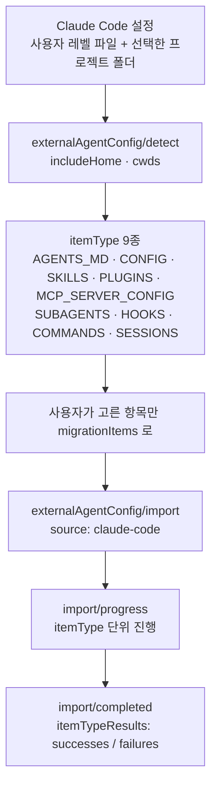
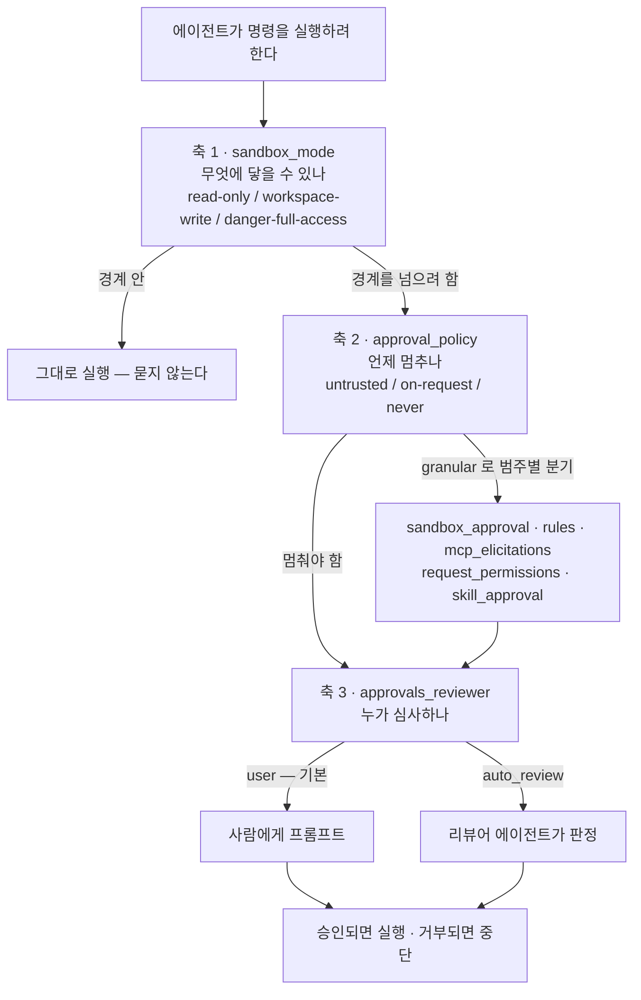
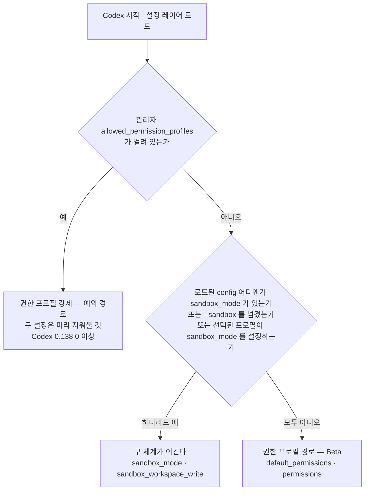
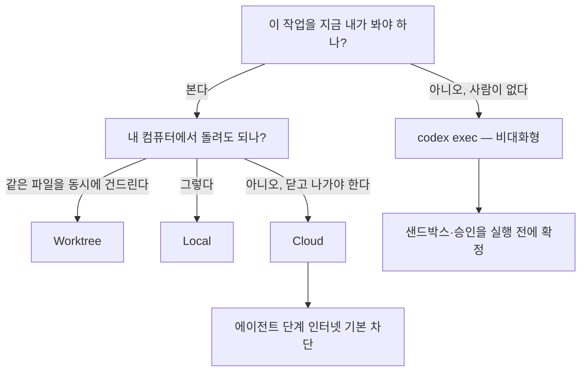

# 같은 이름, 다른 동작 — Claude Code 사용자를 위한 OpenAI Codex 완전 정리

## 저자
Toby-AI

**판본:** v1.0.0 · 2026-08-02

---

## 판권

**같은 이름, 다른 동작 — Claude Code 사용자를 위한 OpenAI Codex 완전 정리**
**판본:** v1.0.0
**발행일:** 2026-08-02
**저자:** Toby-AI
**식별자:** urn:uuid:882cf2c0-4843-41b5-8799-f979fe9cc244

### 라이선스

이 책은 [Creative Commons BY-NC-SA 4.0](https://creativecommons.org/licenses/by-nc-sa/4.0/) 라이선스로 배포된다.

- **저작자 표시(BY):** 출처를 밝힐 것.
- **비상업적 이용(NC):** 상업적 목적으로 이용할 수 없다.
- **동일조건 변경허락(SA):** 변경·재배포 시 동일한 라이선스를 적용해야 한다.

### 출처

이 책은 [book-writer](https://github.com/tobyilee/book-writer) 하네스 v1.10.0으로 자동 생성되었다.

본문에 인용된 공식 문서·GitHub 이슈·커뮤니티 게시물·학술 문헌의 저작권은 각 저작자에게 있다. 인용은 출처와 게시일을 병기하는 방식으로만 이뤄졌으며, 전체 목록은 권말 참고문헌에 있다.

---

## 서문

Codex를 처음 켜면 대개 이런 인상을 받는다. **어, 거의 똑같은데?**

지침 파일이 있고, 훅이 있고, 스킬이 있고, MCP 서버를 붙인다. 부르는 이름까지 겹치는 것이 한둘이 아니다. 그래서 손이 먼저 나간다. 이미 한 도구를 몇 달씩 자기 손에 맞춰 다듬어온 사람일수록 더 그렇다.

문제는 그다음이다. 같은 이름을 단 명령이 다른 일을 하는데, 그 사실을 알려주는 에러는 대개 뜨지 않는다. 되돌렸다고 믿은 파일 수정이 워킹 트리에 그대로 남아 있고, 폴더마다 공들여 써둔 지침이 읽히지 않은 채로 에이전트가 일한다. 파국이 아니라서 더 고약하다. 이 책의 제목이 『같은 이름, 다른 동작』인 이유가 여기 있다.

### 이 책이 약속하는 것

두 가지다.

첫째, **대응 관계**다. 이 책은 Codex를 백지에서 소개하지 않는다. 독자가 이미 하나의 하네스를 다룰 줄 안다고 전제하고, 그 위에 두 번째 하네스를 얹는다. 그래서 열두 개 장 전부에 "내가 알던 것과 무엇이 어떻게 다른가"라는 축이 박혀 있다. 손버릇 교정표, 전환 마찰 원장, 용어 대응 정전, 확장 자산 이식 판단표 — 이 책이 만드는 물건들은 전부 그 축 위에 있다.

둘째, **빠짐없이**다. 이 책은 Codex 공식 문서 **148개 URL**(별칭 중복을 제외하면 고유 문서 약 140개)을 전수 수집한 원장 위에서 쓰였다. 여기에 `openai/codex` 저장소의 이슈, 국내외 커뮤니티의 1차 증언, 그리고 코딩 에이전트를 다룬 학술·기술 리포트를 겹쳤다. 어느 장을 펼쳐도 근거가 어디서 왔는지 추적할 수 있게 해뒀고, 전체 목록은 권말 참고문헌에 URL과 확인 등급까지 붙여 실었다.

### 이 책이 약속하지 않는 것

정직하게 세 가지를 먼저 밝혀두자.

어느 도구가 **더 낫다는 판정**을 하지 않는다. 이 책의 독자는 이미 한 도구를 쓰고 있고, 앞으로도 버리지 않을 가능성이 높다. 그러니 유용한 결론은 "무엇을 고를까"가 아니라 "성질이 다른 둘을 어떻게 함께 쓸까"다. 마지막 장이 그 자리다.

상대 도구에 대한 **새로운 사실 주장**을 만들지 않는다. 이 책의 리서치는 Codex 공식 문서를 1차로 수집했고, 그 반대편 제품 문서는 수집하지 않았다. 그래서 비교는 리서치가 확보한 범위 안에서만 했고, 근거가 없는 자리는 빈칸으로 남겼다. 대응표에 빈칸이 보인다면 그건 대응물이 없다는 뜻이 아니라 **이 책이 근거를 갖고 말할 수 없다**는 뜻이다. 그 자리는 두 도구를 나란히 열어보면 독자가 훨씬 정확하게 채울 수 있다.

**오래 유효한 수치**를 약속하지 않는다. 이 주제는 주 단위로 변한다. 요금과 한도, 모델 라인업, 이슈의 열림·닫힘, 기능에 붙은 Beta·experimental 딱지 — 전부 이 책이 인쇄되는 순간부터 낡기 시작한다. 그래서 이 책은 3장부터 마지막 장까지 같은 말을 반복한다. **표를 외우지 말고 번호를 열어보자.**

### 누가 읽으면 좋은가

AI 에이전틱 코딩을 실무에서 써본 개발자를 전제한다. 에이전트·MCP·훅·샌드박스 같은 용어를 처음부터 설명하지 않는다. 구체적으로는 이런 사람이다.

- 이미 하나의 코딩 에이전트로 실무를 해봤고, 지침 파일·훅·스킬·MCP를 자기 손에 맞춰 세팅해둔 **개인 개발자**
- Codex를 깔아봤거나 깔 예정이고, "설정을 다시 다 해야 하나", "내 습관 중 뭐가 위험한가", "요금은 어떻게 되나"가 머릿속에 있는 사람
- 두 도구를 동시에 굴리면서 지침을 이중 관리하다 지친 사람

반대로 이 책이 잘 맞지 않는 독자도 분명하다. 코딩 에이전트를 처음 배우는 사람에게는 전제가 너무 많고, 조직에 Codex를 배포해야 하는 관리자에게는 시점이 맞지 않는다. 이 책은 **끝까지 개인 개발자의 자리에서** 쓰였다. 엔터프라이즈 설정을 다루는 대목에서도 질문은 끝까지 **"내 설정이 왜 안 먹히는가"**다.

### 어떻게 읽으면 좋은가

처음 읽는다면 1장부터 순서대로 가는 편이 낫다. 이 책의 순서는 **전환자가 실제로 겪는 시간 순서**를 따르기 때문이다. 옮기고(2장), 데이고(3장), 다시 세우고(4~6장), 매일 운용하고(7·8장), 반경을 넓히고(9~11장), 갈라진 자리에서 둘을 함께 쓴다(12장).

급하다면 이렇게 골라 읽어도 좋다.

- 오늘 당장 옮겨야 한다 → 2장(임포트 5분 절차)과 3장(손버릇 교정표). 이 둘만으로 첫 주의 사고 대부분을 피할 수 있다.
- 설정이 안 먹힌다 → 4장(지침 탐색과 여섯 층)과 5장(승인·샌드박스 3축). 조직 계정이라면 11장 후반을 함께 보자.
- 요금이 걱정된다 → 8장. 확인 가능한 것과 확인 불가능한 것의 경계를 그어뒀다.
- 자동화에 붙이려 한다 → 9장(위임·비대화형)과 11장(SDK·app-server·MCP).
- 두 도구를 함께 쓰는 법만 알고 싶다 → 12장 마지막 절.

각 장 끝에는 그 장이 만든 물건이 표나 목록으로 남는다. 개념 밀도가 높은 4·5·6·8장에는 `이 장의 핵심` 상자를 따로 뒀다. 다시 펼칠 때는 그 상자와 표만 훑어도 된다.

### 이 책의 표기 약속

읽기 전에 네 가지만 알아두자.

하나, 용어 정전은 **2장 표 2**다. 두 제품을 오가며 열두 장을 쓰는 동안 같은 것을 다른 이름으로 부르기 시작하면 독자는 매번 "이게 아까 그건가"를 확인하느라 논지를 놓친다. 그래서 대응 관계를 이야기하는 모든 장이 그 표의 이름과 표기를 벗어나지 않는다.

둘, 시점 앵커는 **`(2026-08-02 문서 기준)` 하나로 고정한다.** Codex 공식 문서에는 페이지별 발행·갱신일 표기가 없다. 그래서 이 책이 쓸 수 있는 시점 표시는 수집 시점 하나뿐이며, 변형 표기를 쓰지 않는다. 장마다 첫 등장에 한 번, 그리고 수치 표의 캡션에 붙였다.

셋, 인용에는 **게시일과 출처**를 붙였다. 커뮤니티 진술은 어느 플랫폼의 누가 언제 남긴 것인지를 함께 적었고, 진영이 갈리는 자리에서는 출신 커뮤니티까지 밝혔다. 날짜를 지우고 읽으면 그 문장들은 쓸모를 잃는다.

넷, **확인 등급**을 병기했다. 공식 문서에서 그대로 옮긴 값, 커뮤니티가 관측했으나 공식 문서로 확인할 수 없는 값, 벤더가 자기 제품에 대해 자체 보고한 값 — 이 셋은 무게가 다르다. 본문에서 그 구분을 매번 밝혔고, 참고문헌에도 같은 등급 체계를 그대로 실었다.

그럼 시작하자. 첫 장에서 할 일은 명령어를 외우는 것이 아니라 지도를 펴는 일이다.

---

## 목차

- 서문
- 1장. Codex는 제품이 아니다 — 표면의 집합을 먼저 이해하기
- 2장. 이주는 이미 구현돼 있다 — `/codex/import`가 말해주는 것
- 3장. 손이 먼저 기억한다 — 첫 주에 나는 사고들
- 4장. 지침과 설정 — `AGENTS.md`와 `config.toml`을 다시 세우기
- 5장. 승인은 샌드박스가 아니다 — 세 개의 축과 Beta 딱지
- 6장. 확장 모델 — 스킬·플러그인·훅, 그리고 테스트되는 규칙
- 7장. 한 chat, 한 결과 — 프롬프팅과 작업 운영
- 8장. 모델 선택이 곧 비용 설계다
- 9장. 내 노트북 밖으로 — 위임의 세 가지 모양
- 10장. 두 개의 "검토" — 코드 리뷰와 Codex Security
- 11장. 내 손 밖으로 — SDK·app-server·MCP, 그리고 조직이 개인을 이기는 지점
- 12장. 갈라진 진화 — Codex에만 있는 것, 그리고 두 하네스와 함께 사는 법
- 에필로그
- 참고문헌

---

# 1장. Codex는 제품이 아니다 — 표면의 집합을 먼저 이해하기

Codex를 "OpenAI가 만든 Claude Code"라고 부르는 사람이 많다. 이름값만 보면 그럴듯하다. 터미널에서 부르고, 저장소를 읽고, 파일을 고치고, 테스트를 돌린다. 하는 일이 이렇게 겹치니 같은 종류의 물건이라고 여기게 된다.

그런데 실제로는 반대에 가깝다. Codex는 CLI 하나로 시작해 CLI 하나로 끝나는 도구가 아니라, **ChatGPT라는 우산 아래 놓인 여러 표면(surface) 가운데 하나**다. 공식 문서를 펼쳐보면 이 사실이 첫 페이지부터 드러난다. 문서는 Codex의 사용법을 알려주기 전에, "ChatGPT를 어떤 모드로 쓸 것인가"부터 나눈다.

말장난처럼 들리겠지만 실무에 그대로 걸린다. 표면이 여럿이라는 말은 곧, 같은 기능이 표면마다 다르게 동작하고, 문서가 표면별로 갈라지고, 내가 만든 설정이 어느 표면에서 유효한지를 매번 따져야 한다는 뜻이다. 손에 익은 명령어를 외우기 전에 지도를 먼저 펴는 편이 낫다. 지도 없이 들어가면 나중에 "분명히 설정했는데 왜 안 먹히지?" 하는 순간이 온다. 그 순간은 꽤 난감하다.

그러니 명령어는 잠시 미뤄두자. 먼저 붙들 질문은 이것 하나다. **내가 아는 "CLI 하나로 시작해서 CLI 하나로 끝나는 도구"라는 전제는, Codex에 얼마나 통하는가?**

## 문서가 먼저 그어놓은 세 개의 선

Codex 공식 문서를 펼치면 기능 목록보다 분류표가 먼저 나온다. `/codex/use-chatgpt` 페이지는 ChatGPT를 쓰는 방식을 세 갈래로 나눈다. 원문 표를 그대로 옮기면 이렇다.

| Choose | When you want to | Examples |
|---|---|---|
| Chat | Work through something with ChatGPT | Ask a question, search the web, brainstorm, draft a message, compare options |
| ChatGPT Work | Define an outcome and get a reviewable result | Create a deck, analyze files, draft a report, build a project plan |
| Codex | Use developer tools and see technical details | Debug code, run tests, review a PR, implement a feature |

표 1. `/codex/use-chatgpt`의 3분법 원문

짧은 표지만 담긴 정보는 적지 않다. Chat은 주고받으며 생각을 정리하는 자리, ChatGPT Work는 "결과물"을 정의하고 검토 가능한 산출물을 받는 자리, 그리고 Codex는 **개발자 도구와 기술적 세부를 보고 싶을 때** 고르는 자리다. 셋은 같은 엔진 위에 얹힌 세 개의 시야다.

여기서 잠시 멈추고 생각해보자. 이 3분법에 대응하는 개념이 우리에게 있었나? 없다. Claude Code 사용자에게 익숙한 구도는 "CLI가 1급 표면인 단일 도구"이고, 거기에는 "비개발자용 산출물 모드"라는 형제가 없다. Codex의 3분법은 기능 분류가 아니라 **제품 전략**이다. 코딩 에이전트를 코딩 도구 시장에 놓는 대신, 일반 사용자용 어시스턴트와 같은 우산 아래 배치한 것이다.

더 흥미로운 건 이 세 갈래가 서로를 품고 있다는 점이다. 문서는 Codex 안에서도 Quick chat 아이콘을 눌러 가벼운 질문이나 브레인스토밍으로 빠질 수 있다고 안내한다. 질문하고, 웹을 검색하고, 낯선 개념을 쉬운 말로 설명받고, 시작하기 전에 요구사항을 정리하는 용도다. 개발 작업을 하다가 "이거 잠깐 물어볼 데가 없나" 싶을 때 창을 옮기지 않아도 된다는 뜻이다. 경계가 이렇게 물렁하다는 것은, 뒤집어 말하면 지금 내가 어느 모드에 있는지 스스로 알고 있어야 한다는 뜻이기도 하다.

문서는 심지어 Work와 Codex가 겹친다는 것도 인정한다. 데스크톱 앱에서 둘을 비교하는 표를 따로 두고, 차이를 "어디서 시작하는가 / 어떤 대화 목록이 보이는가 / 기술적 세부를 감추는가 드러내는가 / 에이전트가 어떤 말투로 보고하는가"로 설명한다. 다시 말해 같은 일을 시켜도 **Codex 뷰는 diff와 셸 명령을 보여주고, Work 뷰는 그걸 감춘다.**

이 지점이 첫 번째 교정이다. Codex를 고른다는 것은 같은 엔진을 개발자 시야로 여는 일에 가깝다. 그러니 "Codex가 이 작업을 할 수 있나?"라는 질문은 종종 잘못된 질문이 된다. 더 나은 질문은 **"이 작업을 어느 표면에서 해야 하나?"**다.

## 표면 전수 지도 — 어디서 무엇을 하는가

이제 표면이 몇 개이고 각각 무엇을 담당하는지 세어볼 차례다. `/codex/features`가 이 지도의 목록 역할을 하고, 표면별 상세는 각 표면 문서로 갈라진다. 정리하면 이렇게 된다.


그림 1. Codex 표면 지도 — 우산은 ChatGPT, Codex는 그 아래 한 갈래다

**데스크톱 앱이 1급 표면이다.** 이 문장이 Claude Code 사용자에게 가장 낯설 것이다. 2026년 7월 9일, 별도로 존재하던 Codex 앱은 ChatGPT 데스크톱 앱으로 병합됐다. 원문은 이렇게 못 박는다 — "The updated desktop app is available globally on every ChatGPT plan, including Free." 무료 플랜을 포함한 모든 플랜에 깔린다는 뜻이다. 코딩 에이전트가 개발자 전용 배포 채널을 갖지 않는다는 것, 이게 이 제품의 성격을 요약한다.

앱의 온보딩에는 우리에게 없던 단계가 하나 있다. 작업할 폴더를 명시적으로 고르는 단계다. 문서는 "ChatGPT can read and modify files in the folder you choose"라고 적는다. 터미널에서 `cd` 한 번으로 작업 위치가 암묵적으로 정해지던 감각과는 결이 다르다. 익숙해지기 전까지는 조금 번거롭게 느껴질 수 있다. 다만 이 명시성 덕분에 "에이전트가 어디까지 볼 수 있는가"가 실행 전에 화면에 드러난다는 이점도 함께 온다. 이 명시성은 2026년 7월 20~24일 주간에 한 걸음 더 나갔다. 하나의 로컬 프로젝트가 **여러 폴더**를 품을 수 있게 됐고, 그중 primary 폴더가 새 채팅·Git 작업·`AGENTS.md`와 스킬과 `config.toml`의 자동 탐색을 담당한다. secondary 폴더는 파일 검색·읽기·편집까지만 허용된다. 지침 파일이 어디서 읽히는지가 폴더 등급에 달려 있다는 뜻이다.

앱에는 또 하나, 컴포저의 **Work locally** 컨트롤이 있다. 로컬에서 돌릴지 클라우드로 넘길지를 대화 단위로 고르는 스위치다. 클라우드를 고르는 이유는 문서가 두 가지로 정리한다. 앱을 닫거나 컴퓨터를 꺼도 계속 돌아간다는 것, 그리고 웹·모바일에서 같은 대화를 이어갈 수 있다는 것.

**CLI는 여전히 두껍다.** 표면이 여러 개라고 해서 CLI가 곁가지가 된 건 아니다. `/codex/cli/reference` 한 페이지가 전역 플래그 20개, 서브커맨드 28개, 내장 슬래시 명령 약 60개를 한꺼번에 담는다. 우선순위 규칙도 문서가 직접 밝힌다 — "The CLI inherits most defaults from `~/.codex/config.toml`. Any `-c key=value` overrides you pass at the command line take precedence for that invocation." 설정 파일이 기본이고, 명령줄 오버라이드가 그 호출에 한해 이긴다. 이 계층은 4장에서 본격적으로 파헤친다.

IDE 확장은 컨텍스트 수집 방식이 다르다. 원문 Note가 차이를 정확히 짚는다 — "The IDE extension automatically includes your open files as context. In the CLI, mention paths explicitly, or attach files with `/mention` and `@` path autocomplete." 열어둔 파일이 자동으로 들어가는 표면과, 경로를 손으로 짚어야 하는 표면. 같은 프롬프트를 써도 결과가 갈릴 수밖에 없다. 반대로 잃는 것도 있다. Visualizations는 CLI와 IDE 확장에서는 렌더링되지 않는다.

웹과 cloud는 성격이 또 다르다. 웹(chatgpt.com)은 Chat과 ChatGPT Work를 제공하고, Codex 전용 개발자 뷰는 데스크톱 앱·CLI·IDE 쪽에 있다. Codex cloud는 작업을 격리 환경에 위임하는 표면인데, 여기엔 결정적인 제약이 하나 걸려 있다. 원문이 "Currently, you can't change the default model for Codex cloud chats"라고 잘라 말한다. 모델을 고를 수 없는 표면이 하나 있다는 사실은 뒤에서 모델과 위임을 다룰 때 되짚는다. 지금은 "표면마다 고를 수 있는 것의 범위가 다르다"는 것만 기억해두자.

그리고 주변부가 있다. 화면과 입력을 다루는 쪽으로는 내장 브라우저와 Computer Use, Chrome 확장, Appshots, 음성이 있다. 산출물과 하드웨어 쪽으로는 Sites, iOS Remote, Codex Micro가 있고, Amazon Bedrock을 경유해 쓰는 경로도 따로 있다. 목록만 봐도 짐작되겠지만 이 중 상당수는 터미널 도구의 문법으로는 설명되지 않는 것들이다. 이들은 12장에서 한 자리에 모아 다룬다.

용어가 헷갈릴 때 기댈 곳도 미리 알아두면 좋다. `/codex/glossary`는 **표면으로 필터링되는** 용어집이다("Filter by term, definition, or surface"). 같은 단어가 표면마다 다른 것을 가리킬 수 있다는 걸 문서 스스로 전제하고 있는 셈이다. 이 책은 2장에서 용어 대응 표를 하나 세우고 그것을 끝까지 정전으로 쓸 텐데, 그 표의 근거 가운데 하나가 여기다.

## 오픈소스 경계는 CLI 층에서 정확히 뒤집혀 있다

표면 지도를 그리고 나면 자연스럽게 따라오는 질문이 있다. 이 중 어디까지가 열려 있고 어디부터가 닫혀 있을까? 커뮤니티에서 "Codex는 오픈소스"라는 말이 자주 돌아다니는데, 이 문장은 그대로 쓰면 **사실 오류**가 된다.

`/codex/open-source`가 컴포넌트별로 경계를 그어놓았다.

| 컴포넌트 | 공개 여부 | 위치 |
|---|---|---|
| Codex CLI | 오픈소스 | `openai/codex` |
| Codex SDK | 오픈소스 | `openai/codex/codex-sdk` |
| Codex App Server | 오픈소스 | `openai/codex/codex-rs/app-server` |
| Skills | 오픈소스 | `openai/skills` |
| IDE 확장 | **Not open source** | — |
| Codex cloud | **Not open source** | — |
| Universal cloud environment | 오픈소스 | `openai/codex-universal` |

표 2. `/codex/open-source`의 컴포넌트별 공개 경계 (2026-08-02 문서 기준)

경계가 어디를 지나는지 보이는가. **터미널에 가까운 층이 열려 있고, GUI와 서버 쪽이 닫혀 있다.** CLI·SDK·app-server·skills는 GitHub에서 소스를 읽을 수 있고, IDE 확장과 cloud는 문서가 "Not open source"라고 명시한다.

그런데 Claude Code 사용자에게 이 구도는 익숙한 것과 정확히 반대다. Claude Code는 CLI 층이 비공개다. 즉 **같은 CLI라는 자리에서 두 제품의 공개 정책이 서로 뒤집혀 있다.** 이것이 취향 차이로 보이지 않는 이유는, 이 경계가 곧 "내가 무엇을 직접 확인하고 무엇을 믿어야 하는가"의 경계이기도 하기 때문이다. Codex에서는 샌드박스 구현이나 설정 파싱 순서가 궁금할 때 소스를 열어볼 수 있다. 반대로 IDE 확장이 왜 그렇게 동작하는지는 열어볼 수 없다.

이 개방성에는 운영상의 부수 효과도 있다. 문서는 버그 리포트와 기능 요청 창구를 하나로 모아둔다 — CLI든 SDK든 IDE 확장이든 cloud든, 전부 `openai/codex` 저장소의 이슈로 간다. 그래서 앞으로 자주 인용할 GitHub 이슈들은 **제품 전체의 공식 접수창구에 쌓인 1차 기록**이다. 3장에서 전환 마찰 원장을 만들 때 이 이슈 번호들이 뼈대가 되는데, 그 자료의 성격이 여기서 정해진다고 보면 된다.

한 가지 더. 오픈소스 프로젝트 메인테이너를 위한 별도 프로그램(Codex for OSS)도 문서에 걸려 있다. API 크레딧, Codex가 포함된 ChatGPT Pro, 그리고 Codex Security에 대한 선별적 접근을 신청할 수 있다. 여기서는 "그런 통로가 있다" 정도로만 알아두면 충분하다.

## 2026년 상반기에 무슨 일이 있었나 — 표면이 늘어난 연표

표면이 이렇게 많아진 게 원래부터 그랬던 걸까? 아니다. 그리고 이 "아니다"가 이 책에서 꽤 중요한 사실이 된다.

공식 문서에는 주간 소식 페이지(`/codex/whats-new`)와 릴리스 노트(`/codex/changelog`)가 따로 있다. 앞쪽은 "일하는 방식을 바꿀 만한 변화"만 골라 주 단위로 묶고, 뒤쪽은 버전별 변경·버그 픽스까지 전부 담는다. 색인해보면 2025년 5월부터 2026년 7월까지 여든 건이 넘는 항목이 쌓여 있다. 여기서 굵은 마디만 뽑아 시간순으로 세워보자.


그림 2. 2026년 상반기 Codex 표면 확장 연표

2월 — Codex 앱이 macOS에 출시된다. 병렬 프로젝트 chat, 내장 Git 리뷰, worktree, 스킬, 예약 작업을 한 창에 담은 데스크톱 작업 공간이었다. 같은 주에 턴 중간 steering(응답을 멈추지 않고 방향을 바꾸는 것)과 이미지 외 파일 첨부가 들어왔다. 그 다음 주에는 chat 포크와 항상 위에 떠 있는 창이 붙었다. 여기까지는 "터미널 도구에 GUI를 씌운 것"으로 읽힌다.

3월 — Windows 네이티브 실행이 도착한다. PowerShell과 샌드박스를 네이티브로 지원하고, WSL은 리눅스 환경을 선호하는 개발자를 위해 남았다. 같은 주 GPT-5.4가 Codex에 들어왔다(모델 라인업이 이후 어떻게 바뀌는지는 8장에서 다룬다). 이어서 터미널 출력 검사, 컴포저에서 도구를 고르는 방식, 플러그인 패키징이 차례로 붙는다.

4월 — 방향이 꺾이는 지점이다. 앱에서 풀 리퀘스트를 검토하고 머지하는 흐름이 들어오고, 이어서 **Codex가 브라우저를 직접 조작하고 승인 요청을 자동으로 리뷰**하기 시작한다. 터미널 도구의 어휘로는 더 이상 설명되지 않는 기능이 이때 처음 등장한다.

5월 — 확장이 화면 밖으로 나간다. Chrome 확장으로 브라우저 탭의 맥락을 가져오고, Appshots로 맥의 아무 앱이나 그 상태를 캡처해 컨텍스트로 넣는다. 장기 목표(goal)를 따라가는 기능, 데스크톱 작업을 모바일에서 이어받는 기능, 원격 제어가 같은 달에 들어온다.

6월 — 우리와 가장 직접 관련된 항목이 여기 있다. 6월 9일 릴리스 노트가 이렇게 적는다. "Added Import to Codex flows for importing supported setup from Claude Code and Claude Cowork, including during onboarding." 다른 코딩 에이전트의 설정을 온보딩 중에 가져오는 흐름이 공식 기능으로 들어왔고, 그 지원 소스에 **Claude Code가 이름으로 박혔다.** 이게 무슨 의미인지는 바로 다음 장에서 통째로 다룬다. 같은 달에 Sites(웹사이트·대시보드·앱을 만들어 호스팅)와 Record & Replay(맥에서 워크플로를 시연해 스킬로 만드는 기능)가 나왔다.

7월 — 한 달에 네 개의 마디가 몰려 있다. 7월 9일, Codex 앱이 ChatGPT 데스크톱 앱으로 병합되고 같은 날 ChatGPT Work가 출시된다. 앞서 본 3분법이 제품 화면으로 실현된 날이다. 7월 15일에는 OpenAI와 Work Louder가 Codex Micro를 내놨다. 한정 생산된 물리 컨트롤 표면으로, 키가 최대 여섯 개 chat의 상태를 보여주고 아날로그 스틱과 다이얼로 추론 강도까지 조절한다. 7월 20~24일 주간에는 다중 폴더와 ChatGPT Voice가 들어왔다. 그리고 7월 28일, 별도 제품인 Codex Security가 공개된다(커뮤니티 관측 — Hacker News 출시 스레드, 2026-07-28).

반년의 궤적을 한 줄로 요약하면 이렇게 된다. **터미널 도구 → 데스크톱 앱 → GUI·브라우저·컴퓨터 조작·음성·전용 하드웨어.** 방향이 뚜렷하고, 속도도 빠르다. 그리고 같은 기간 Claude Code는 CLI/SDK 중심을 지켰다.

이 대비를 지금 붙들어두자. 12장에서 이 연표를 다시 꺼내 "두 도구의 진화 방향이 갈렸다"는 논지의 증거로 쓸 것이다. 지금 시점에서 가져갈 실무적 함의는 이것 하나다 — **표면 목록은 고정된 사실이 아니라 몇 주 단위로 갱신되는 목록이다.** 이 책의 서술 시점 이후에 새 표면이 하나 더 늘어 있어도 놀랄 일이 아니다.

## 정의표는 있는데 명단이 없다

몇 주 단위로 표면이 늘어나는 제품에는 필연적으로 따라오는 문제가 있다. 어떤 기능은 믿고 써도 되고, 어떤 것은 내일 사라져도 이상하지 않다. 그 구분을 어디서 확인하는가가 문제다.

Codex 문서에는 이 질문에 답하려는 페이지가 있다. `/codex/feature-maturity`가 네 등급을 정의한다.

| Maturity | What it means | Guidance |
|---|---|---|
| Under development | Not ready for use. | Don't use. |
| Experimental | Unstable and OpenAI may remove or change it. | Use at your own risk. |
| Beta | Ready for broad testing; complete in most respects, but some aspects may change based on user feedback. | OK for most evaluation and pilots; expect small changes. |
| Stable | Fully supported, documented, and ready for broad use; behavior and configuration remain consistent over time. | Safe for production use; removals typically go through a deprecation process. |

표 3. `/codex/feature-maturity`의 성숙도 4등급 정의

깔끔해 보인다. 그런데 이 페이지에는 정의표 말고 아무것도 없다. **어떤 기능이 어느 등급인지 알려주는 목록이 없다.** 라벨은 각 기능 문서에 인라인으로 흩어져 붙어 있고, 심지어 실제로 쓰이는 표현("research preview", "public beta")과 정의된 등급명이 딱 맞아떨어지지도 않는다.

그래서 이런 문장을 쓰면 곤란해진다. "Codex는 4단계 성숙도 체계를 쓴다." 정의표가 있다는 사실만 보고 체계가 일관되게 적용된다고 넘겨짚는 것인데, 이건 과잉 일반화다. 정확한 서술은 **"성숙도 등급의 정의는 문서화돼 있지만, 기능별 등급 명단은 문서화돼 있지 않다"**다.

이 구분은 곧바로 실무에 걸린다. 앞으로 다룰 것 중 상당수에 라벨이 붙어 있기 때문이다. 권한 프로필은 Beta, Chronicle은 리서치 프리뷰, Python SDK도 beta다. CLI 서브커맨드 중 일부는 `experimental`로 표시돼 있다. 이들을 전부 같은 무게로 읽으면 "문서에 있으니 써도 되겠지" 하고 프로덕션에 넣게 된다. 그러다 다음 릴리스에서 동작이 바뀌면 뒷맛이 꽤 찜찜해진다.

그래서 이 책은 성숙도를 다룰 때 규칙을 하나 세우고 간다. **새 기능을 실무에 넣기 전에, 그 기능의 문서 페이지에서 라벨을 직접 확인하는 편이 낫다.** 성숙도 정의 페이지는 "이 라벨이 무슨 뜻인가"만 알려줄 뿐, "이 기능이 어느 라벨인가"는 알려주지 않는다. 앞으로 라벨이 걸린 기능은 그 사실을 함께 적어둔다.

한 가지 덧붙이자면, 라벨이 붙었다는 사실 자체를 부정적으로 읽을 필요는 없다. 문서가 Beta를 "평가와 파일럿에는 괜찮고, 작은 변경은 예상하라"로 정의하는 것은 꽤 정직한 안내다. 문제는 라벨이 **어디에 붙어 있는지 찾기 어렵다는 데** 있다. 그러니 실무 규칙은 단순해진다. 라벨을 확인했으면 그 기능이 바뀔 수 있다는 전제로 설계하고, 확인하지 못했으면 확인할 때까지는 프로덕션 경로에 넣지 않는 편이 낫다.

## 왜 이 책이 필요한가 — 하네스가 성능을 만든다

여기까지 읽고 나면 이런 생각이 들 수 있다. 표면이 몇 개든 결국 같은 모델이 일하는 것 아닌가. 어느 창에서 부르든 GPT-5.6 계열이 코드를 쓴다면, 지도를 이렇게까지 자세히 그릴 필요가 있을까?

최근 연구들은 반대 방향을 가리킨다.

Gorinova 등이 2026년에 낸 preprint(arXiv:2606.17799)는 코딩 벤치마크의 구조적 결함을 지적한다. 점수는 모델의 몫과 하네스·컨텍스트·환경의 몫을 구분하지 못한다는 것이다. 그리고 이들이 실측으로 보여준 것이 결정적이다 — **하네스 요소 하나를 바꾸는 것이, 모델 세대를 통째로 올리는 것만큼 점수를 바꾼다.** 아직 동료 심사를 거치지 않은 preprint라는 점은 감안해서 읽자. 다만 방향은 더 앞선 연구와 일치한다. Yang 등의 SWE-agent(NeurIPS 2024, arXiv:2405.15793)는 모델을 그대로 두고 **인터페이스만 설계해서** 성능을 크게 끌어올렸다. 에이전트가 파일을 어떻게 보고, 어떻게 편집하고, 어떤 단위로 피드백을 받는지가 곧 성능이었다.

이 두 발견을 이 장의 지도 위에 얹어보자. 표면을 고르는 일은 UI 취향의 문제로 끝나지 않는다. 어떤 컨텍스트가 자동으로 들어가는지, 어디까지 손댈 수 있는지, **무엇을 승인해야 하는지가 표면마다 다르다.** IDE 확장이 열린 파일을 자동으로 넣고 CLI가 경로를 명시하게 하는 차이, 앱이 폴더를 명시적으로 고르게 하고 primary와 secondary를 나누는 차이, cloud가 모델 선택을 잠가두는 차이 — 이 전부가 하네스의 구성요소다. 표면을 잘못 고르면 모델을 잘못 고른 것과 비슷한 크기의 손해가 난다.

그렇다면 Claude Code에서 Codex로 옮기는 일은 무엇일까? **두 번째 하네스를 손에 익히는 일**이다. 이미 하나를 잘 다루는 사람에게 이 작업은 백지에서 배우는 것보다 오히려 까다롭다. 손이 기억하는 동작이 있기 때문이다. 그래서 이 책은 기능 목록을 훑는 대신, 우리가 이미 아는 것을 하나씩 대응시키며 간다. 지침과 설정에서 시작해 승인과 샌드박스, 확장 모델을 지나 비용과 위임까지. 그 순서의 출발점이 표면이었을 뿐이다.

이제 처음의 질문으로 돌아가자. **CLI 하나로 시작해서 CLI 하나로 끝나는 도구**라는 전제는 Codex에 얼마나 통했는가? 통하는 부분이 있다. CLI는 여전히 두껍고, 플래그와 설정 파일로 거의 모든 것을 통제할 수 있으며, 소스까지 열려 있다. 통하지 않는 부분도 분명하다. 1급 표면은 데스크톱 앱이고, 문서는 표면별로 갈라지며, 같은 기능이 표면마다 다른 이름과 다른 제약을 갖는다.

그래서 이런 질문이 남는다. 이미 잘 세팅해둔 지침 파일과 설정, 훅과 스킬과 MCP 서버들 — 표면이 다른 이 제품 위에서 그것들을 처음부터 다시 만들어야 할까? 답을 미리 말하지 않겠다. 다만 힌트는 방금 연표 안에 지나갔다. 2026년 6월 9일 릴리스 노트에 적힌 한 줄이었다.

---

# 2장. 이주는 이미 구현돼 있다 — `/codex/import`가 말해주는 것

OpenAI 공식 문서 안에 이런 문장이 한 줄 들어 있다.

> "Import /Users/me/project/CLAUDE.md to /Users/me/project/AGENTS.md."

이 문장이 실린 곳은 `/codex/app-server` 문서의 JSON-RPC 응답 예시다. API 스펙 본문이다. 같은 페이지의 요청 예시에는 `"source": "claude-code"`라는 파라미터가 버젓이 들어 있고, 조금 아래에는 `~/.claude/skills`에서 `~/.agents/skills`로 스킬 폴더를 복사한다는 설명까지 붙어 있다. 경쟁 제품의 이름과 디렉터리 경로가, 남의 회사 프로토콜 스펙의 예시 값으로 남아 있는 것이다.

이걸 어떻게 읽어야 할까? 나는 여기서 제품 판단 하나를 읽는다. **"Claude Code에서 넘어오는 개발자"는 예외 사례가 아니라 설계된 유입 경로다.** 그리고 그 판단은 아주 실용적인 결론을 준다. 몇 달 동안 다듬어온 지침 파일과 훅, 스킬, MCP 서버 목록을 처음부터 다시 만들 필요가 없다는 것이다. 옮기는 버튼이 이미 있고, 그 버튼 뒤에 무엇이 어디로 가는지도 표로 공개돼 있다.

그래서 여기서는 순서를 한 번 뒤집는다. 승인이 어떻게 동작하는지, 샌드박스가 무엇을 막는지 배우기 전에 일단 옮겨놓고 시작하자. 백지에서 배우는 사람에게는 이상한 순서겠지만, 이미 자기 세팅을 가진 사람에게는 이쪽이 자연스럽다. 손에 익은 것이 새 도구 위에 얹혀 있어야 무엇이 달라졌는지도 보인다.

다만 조건이 하나 붙는다. 되돌아올 길을 먼저 만들어두자.

## 옮기기 전 5분, 되돌아올 길부터 만들자

임포트 버튼을 누르는 시점의 당신은 Codex의 승인 모델도, 샌드박스 경계도 아직 모른다. 그것들은 뒤에서 제대로 다룬다. 모르는 상태로 설정을 통째로 옮겨놓고 에이전트를 풀어두면, 다음 장에 도착하기도 전에 사고가 난다. 그러니 5분만 쓰자. 이 5분이 없으면 뒤에 나올 모든 이야기가 사고 수습기가 된다.

**첫째, `~/.codex/config.toml`을 백업하자.** 왜 하필 이 파일일까. 임포트가 건드릴 수 있는 바로 그 파일이기 때문이다. GitHub 이슈 [#24515](https://github.com/openai/codex/issues/24515)(2026-05-26 개설, CLI 0.133.0, macOS arm64, 👍 0, 여전히 open)의 보고는 이렇다. 프로젝트에 Claude Code 설정은 있는데 프로젝트 레벨 `.codex/config.toml`이 없는 상태에서 설정 마이그레이션 프롬프트를 수락했더니, **임포트가 손댄 파일은 사용자 레벨 `~/.codex/config.toml`이었다.** 보고자가 손봐뒀던 `approvals_reviewer` 값이 기본값으로 되돌아갔고, 그 뒤로는 모든 명령이 일일이 승인을 물었다. 보고자의 표현을 빌리면 "Every subsequent Codex command prompts for user approval"이다.

이건 단일 보고자의 커뮤니티 관측이고, 공식 문서가 인정한 동작이 아니다. 재현 절차와 환경이 명시돼 있어 신뢰할 만하지만 👍는 0이고 상태는 open이다. 그래도 대응 비용이 `cp` 한 줄이라면 안 할 이유가 없지 않은가. 더 고약한 건 증상이 원인을 가린다는 점이다. 승인 폭탄이 터졌을 때 "임포트 때문"이라고 의심하기는 정말 어렵다.

**둘째, 출발점은 깨끗한 git 트리여야 한다.** 커뮤니티가 거의 합의에 이른 몇 안 되는 노하우 중 하나다(suparious, [#11626](https://github.com/openai/codex/issues/11626) 댓글). 커밋되지 않은 변경이 섞여 있으면, 에이전트가 만든 diff와 내가 만들던 diff가 한 덩어리가 된다. 여기에 3장에서 자세히 볼 사실 하나가 겹친다 — Codex에서 대화를 되감아도 파일 수정은 워킹 트리에 그대로 남는다. 즉 **당신의 되돌리기 장치는 지금 git뿐이다.** 그 장치를 깨끗한 상태에서 출발시키자.

**셋째, 임포트를 끝낸 뒤 처음 일을 시킬 때는 `--sandbox read-only`로 시작하자.** CLI의 `--sandbox`는 `read-only`, `workspace-write`, `danger-full-access` 세 값을 받는다. 5장에서 제대로 배우기 전까지의 안전 기본값으로는 첫 번째가 낫다. 옮겨온 훅과 스킬이 새 환경에서 어떻게 동작하는지 모르는 상태에서 쓰기 권한부터 주는 건 아무래도 찜찜하다. 문서 자신도 강한 톤으로 못 박는다. "avoid `--dangerously-bypass-approvals-and-sandbox` unless you are inside a dedicated sandbox VM."

**넷째, 임포트 직후의 첫 명령은 `/debug-config`다.** CLI 개발자 명령 중 하나이고, 원문 설명은 설정 레이어를 우선순위 순으로(낮은 것부터) 출력하고 각 레이어의 on/off 상태와 정책 출처를 보여준다는 것이다. `allowed_approval_policies`, `allowed_sandbox_modes`, `mcp_servers`, `rules` 같은 항목이 함께 찍힌다. 문서가 붙여둔 한 문장이 이 명령의 존재 이유를 정확히 요약한다. "Use this output to debug why an effective setting differs from `config.toml`." 지금 유효한 설정이 내가 쓴 파일과 왜 다른지 — 임포트 직후에 이보다 더 정확한 질문은 없다. 레이어 구조 자체는 나중에 다시 펼쳐본다.

**다섯째, 문서가 지정한 "임포트 후 검토 목록" 다섯 항목을 눈으로 대조하자.** 원문이 열거하는 것은 이렇다. 옮겨온 스킬·에이전트의 도구 제한과 권한 / 커스텀 인증·헤더·환경 변수·트랜스포트를 쓰는 MCP 서버 설정(재로그인이 필요할 수 있다) / 임포트 후 동작이 달라질 수 있는 훅 / 수동 후속 조치가 필요한 플러그인과 마켓플레이스 / 인자·셸 보간·파일 경로 플레이스홀더에 의존하는 프롬프트 템플릿. 자동화가 끝나는 경계선을 공급자가 스스로 그어준 목록이니, 이 다섯 줄은 그냥 넘기지 말자.

## 문서가 보증하는 이주 경로

준비가 끝났으면 이제 표를 보자. `/codex/import`가 공개한 임포트 대응표는 이 책 전체에서 가장 값어치 있는 원장 중 하나다. 추측한 대응이 아니라 **공급자가 자기 문서에 실어둔 보증**이기 때문이다(2026-08-02 문서 기준).

| Imported item | Destination |
|---|---|
| Instruction files | `AGENTS.md` |
| `settings.json` | `config.toml` |
| Skills | Skills |
| Plugins | Plugins |
| Existing project folders | Projects using the same folders |
| Chats from the last 30 days | ChatGPT chats |
| MCP server configuration | Codex MCP configuration |
| Hooks | Codex hooks |
| **Slash commands** | **Skills** |
| Subagents | Codex agents |

표 1. `/codex/import`의 임포트 대응표 10행 (원문 그대로)

열 개 행 가운데 유독 한 행이 눈에 들어온다. **슬래시 명령이 스킬로 접힌다.** 나머지 아홉 행은 이름만 바뀌는 1:1 대응인데, 이 행만 개념 자체가 한 단계 접힌다. 왜 그럴까? Codex에도 커스텀 프롬프트라는 자리가 있기는 하지만, 그쪽은 이미 폐기 예정으로 표기돼 있다. 재사용할 지시 묶음은 스킬이라는 한 가지 그릇으로 모으겠다는 방향이 정해져 있는 것이다. 그러니 임포트가 슬래시 명령을 스킬로 보내는 건 제품이 가려는 쪽으로 곧장 착지시키는 셈이다. 이 한 행이 두 제품 확장 모델 차이의 압축판이다.

그다음으로 눈여겨볼 행은 "Chats from the last 30 days"다. 최근 30일치 대화만 넘어온다. 반년 치 세션 이력을 자산이라고 여기고 있었다면 여기서 한 번 마음을 접어야 한다.

나머지 행들의 담백한 겉모습은 조심해서 읽자. `settings.json`이 `config.toml`이 된다는 행을 확장자 교체로 읽으면 곤란하다. 형식이 JSON에서 TOML로 바뀌는 건 겉면이고, 그 안의 키 지형과 계층 규칙은 따로 익혀야 한다 — 4장이 통째로 그 이야기다. "Existing project folders" 행도 그렇다. 폴더가 그대로 프로젝트가 된다는 건 1장에서 본 사실, 그러니까 Codex는 작업할 폴더를 온보딩에서 명시적으로 고르게 한다는 성질과 짝을 이룬다. 옮겨온 폴더 목록이 곧 "이 도구가 어디를 읽고 고칠 수 있는가"의 초기값이다. 항목을 고를 때 이 행만큼은 한 번 더 보자.

버튼은 어디 있을까. 문서가 안내하는 경로는 ChatGPT 데스크톱 앱의 **Settings > Import**이고, 아직 Import 섹션이 안 보이면 General에서 Import other agent setup을 찾으라고 적혀 있다. 에이전트를 고르고, 가져올 항목을 고르고, 끝나면 임포트된 프로젝트를 열어 이어서 작업하는 5단계다. 그런데 하루 종일 터미널에 사는 사람에게 이 경로는 살짝 어긋난다. CLI에도 입구가 있다 — `/import`다. 원문 설명은 "Import Claude Code setup, project files, and recent chats"이고, 제품 이름이 명령 설명문에 직접 등장하는 흔치 않은 경우다. 제약도 명시돼 있다. **로컬 TUI 세션에서만** 쓸 수 있고, 작업이 실행 중이거나 원격 세션이거나 로컬 app-server 데몬에 연결된 상태에서는 사용할 수 없다.

그리고 지원 소스에 Claude Code와 Claude Cowork가 이름으로 명시돼 있다(changelog 2026-06-09 항목). 앞 장에서 펼친 연표에 이 날짜가 하나의 마디로 찍혀 있었다는 것도 함께 기억해두자.

## 프로토콜에도 박혀 있다 — `externalAgentConfig`

UI 버튼은 언제든 바뀔 수 있다. 그런데 이 이주 경로는 UI보다 한 층 아래, 프로토콜에도 내려가 있다. `/codex/app-server` 문서가 두 개의 JSON-RPC 메서드를 정의한다.

> "Use `externalAgentConfig/detect` to discover external-agent artifacts that can be migrated, then pass the selected entries to `externalAgentConfig/import`."

먼저 `detect`가 `includeHome`과 `cwds`를 받아서 옮길 거리가 있는 항목을 훑는다. 사용자 레벨 설정은 내 머신의 파일에서, 프로젝트 레벨 설정은 내가 고른 저장소·폴더에서 나온다. 그다음 사용자가 고른 항목만 `migrationItems`에 담아 `import`로 넘긴다. 이때 함께 넘어가는 것이 앞서 본 `"source": "claude-code"`다. 문서의 설명은 담백하다. 이 파라미터는 "선택된 마이그레이션 항목을 만들어낸 제품을 이름표로 붙이는" 역할이다.

옮길 수 있는 항목의 종류는 `itemType`이라는 이름으로 아홉 가지가 열거돼 있다.

> "Supported `itemType` values are `AGENTS_MD`, `CONFIG`, `SKILLS`, `PLUGINS`, `MCP_SERVER_CONFIG`, `SUBAGENTS`, `HOOKS`, `COMMANDS`, and `SESSIONS`."


그림 1. 감지에서 완료까지 — 임포트 흐름과 `itemType` 9종

응답으로 돌아오는 것은 `importId` 하나다. 그 뒤로 `externalAgentConfig/import/progress`가 항목 타입 단위로 진행 상황을 알리고, 동기·백그라운드 임포트가 전부 끝나면 `externalAgentConfig/import/completed`가 온다. 두 알림 모두 타입별 `successes`와 `failures`를 담은 `itemTypeResults`를 포함하고, 지나간 이력은 `externalAgentConfig/import/readHistories`로 다시 볼 수 있다.

여기까지 읽고 나면 아홉 종류라는 숫자가 조금 다르게 보인다. 이건 "가져오기 지원"이라는 마케팅 항목이 아니라 **성공과 실패를 타입별로 세는 데이터 구조**다. 실패를 집계하고 이력을 남기는 상시 기능으로 설계했다는 뜻이다.

`detect`가 `cwds`를 배열로 받는다는 점도 지나치기 아깝다. 저장소 여러 개를 한 번에 훑을 수 있으니, 프로젝트마다 지침 파일을 깔아둔 사람에게는 시간이 꽤 줄어든다. 홈 디렉터리를 포함할지, 어떤 작업 폴더를 볼지는 호출자가 지정한다. 임포트가 알아서 내 디스크 전체를 뒤지지 않는다.

한 가지 단서는 붙여두자. `codex app-server`는 실험적(experimental) 등급으로 표기된 명령이고, 문서 자신이 예고 없이 바뀔 수 있다고 적어뒀다. 프로토콜 이름과 필드에 자동화를 걸 생각이라면 이 점을 계산에 넣는 편이 낫다.

## 건드리지 않는다는 약속, 그리고 그 약속의 가장자리

임포트 문서에서 가장 안심되는 문장은 이것이다.

> "Importing doesn't change or delete your existing agent setup."

기존 에이전트 설정은 바뀌지도 지워지지도 않는다. 옮겨간다기보다 복사해 온다는 쪽이 정확하다. 그래서 두 도구를 당분간 함께 쓰겠다는 선택이 처음부터 가능하다. 이 책의 마지막 장이 "둘 중 하나를 고르라"로 끝나지 않는 이유의 절반은 여기 있다.

비파괴 원칙은 Codex 쪽에도 적용된다. 문서가 밝히는 중복 방지 규칙이 꽤 구체적이다.

> "Detection returns only items that still have work to do. For example, Codex skips AGENTS migration when `AGENTS.md` already exists and is non-empty, and skill imports don't overwrite existing skill directories."

이미 내용이 있는 `AGENTS.md`는 건너뛰고, 스킬 임포트는 기존 스킬 디렉터리를 덮어쓰지 않는다. 두 번 눌러도 두 번 망가지지 않는다는 뜻이라 마음이 놓인다. 다만 뒤집으면 한 번 만들어진 `AGENTS.md`는 **그다음부터 임포트의 관심 밖**이라는 뜻이기도 하다. 나중에 Claude Code 쪽 지침을 크게 고쳐놓고 임포트를 다시 눌러도 감지 목록에 그 항목이 뜨지 않는다. 두 도구를 나란히 쓰기로 했다면 지침 동기화는 처음부터 내 몫이다. 여기에 마켓플레이스 추론까지 구현돼 있다. Codex가 플러그인을 감지할 때 `.claude/settings.json`의 `extraKnownMarketplaces`에서 마켓플레이스 출처를 읽는데, `enabledPlugins`에 `claude-plugins-official` 소속 플러그인이 있는데 출처가 비어 있으면 `anthropics/claude-plugins-official`을 출처로 추론한다고 적혀 있다. 남의 제품 설정 파일의 키 이름을 자기 문서에 그대로 적어둔 문장을 보면, 이 회사가 이주 경로를 얼마나 진지하게 다뤘는지 짐작이 간다.

물론 경계는 있다. **일반 Claude Chat 데이터는 임포트되지 않는다**고 문서가 못 박는다. 대화 쪽에서 넘어오는 것은 앞서 본 최근 30일치뿐이다.

그렇다면 앞의 약속은 어디까지 유효할까? 여기서 소절 1의 [#24515](https://github.com/openai/codex/issues/24515)와 짝이 맞는다. 문서가 보증한 것은 "your existing agent setup", 그러니까 **떠나온 쪽** 설정을 건드리지 않는다는 것이다. 도착한 쪽 설정, 즉 이미 손봐둔 `~/.codex/config.toml`까지 그대로 둔다는 약속은 저 문장에 들어 있지 않다. 보고된 사고는 정확히 그 틈에서 났다. 문서를 읽을 때 약속의 주어가 무엇인지 확인하는 습관은 앞으로도 여러 번 쓰게 된다.

## 로그인 — 어디에 무엇이 저장되는가

설정을 옮겼으면 이제 인증이다. CLI의 로그인 계열은 여섯 개로 정리된다.

```bash
codex login                                          # ChatGPT 브라우저 로그인
printenv OPENAI_API_KEY | codex login --with-api-key
printenv CODEX_ACCESS_TOKEN | codex login --with-access-token
codex login --device-auth                            # 헤드리스 (beta)
codex login status                                   # 현재 인증 방식 확인
codex logout
```

자격증명은 `~/.codex/auth.json`에 캐시되거나 OS 자격증명 저장소에 들어간다. 어느 쪽을 쓸지는 `cli_auth_credentials_store` 설정 키가 정하고 값은 `file`·`keyring`·`auto` 셋이다. `CODEX_HOME`의 기본값은 `~/.codex`이고, `file` 저장을 쓸 때만 이 경로를 옮기면 인증 캐시도 함께 따라간다. `keyring`이면 자격증명이 OS 키체인에 있으니 그대로 남는다. 파일 저장이라면 문서의 경고도 그대로 받아들이자 — `~/.codex/auth.json`은 액세스 토큰이 든 평문 파일이고, 비밀번호처럼 다뤄야 한다. 커밋하지도, 티켓에 붙여넣지도, 채팅에 공유하지도 말라고 적혀 있다.

문서가 알려주는 사실 하나가 실무에서 특히 성가시다. **CLI와 IDE 확장은 같은 캐시를 공유한다.** 한쪽에서 로그아웃하면 다음에 다른 쪽을 켤 때도 다시 로그인해야 한다.

원격 서버나 컨테이너에서는 어떻게 로그인할까? 브라우저를 띄울 수 없으니 콜백이 완성되지 않는다. 문서가 권하는 1순위는 device code 로그인(`codex login --device-auth`, beta)이고, 계정 보안 설정이나 워크스페이스 권한에서 먼저 켜둬야 한다. 폴백도 명시돼 있다. 브라우저가 있는 머신에서 로그인한 뒤 `auth.json`을 복사하거나, 콜백 포트를 그대로 터널링하는 방법이다.

```bash
ssh -L 1455:localhost:1455 user@remote
```

로컬 콜백 포트는 `1455`다. 원격 개발 환경을 쓴다면 이 한 줄을 미리 챙겨두자.

마지막으로 환경 변수 셋. `OPENAI_API_KEY`, `CODEX_ACCESS_TOKEN`, 그리고 사내 TLS 가로채기나 사설 루트 CA를 쓰는 환경을 위한 `CODEX_CA_CERTIFICATE`다. 마지막 값이 없으면 `SSL_CERT_FILE`로 폴백한다. 그리고 API 키로 로그인할 때는 문서가 조건을 하나 달아둔다. "Some features might not be available." 어떤 기능이 빠지는지는 이 문장만으로 알 수 없으니, 개인 작업이라면 ChatGPT 로그인 쪽이 무난하다.

## 용어 대응 빠른 지도 — 이 책의 정전

임포트 표가 "문서가 보증하는 이주 경로"라면, 이제 필요한 것은 "개념끼리의 대응"이다. 임포트 표에는 옮겨지는 것만 실린다. 애초에 상대 쪽에 없는 것은 거기 나타날 자리가 없다.

| Codex | Claude Code | 성격 |
|---|---|---|
| `AGENTS.md` | `CLAUDE.md` | 거의 대응 (중첩 로딩 동작이 다름 — 3장) |
| `config.toml` | `settings.json` | 형식만 다른 대응 |
| Skills (`.agents/skills`) | Skills (`.claude/skills`) | 대응 (디렉터리명이 벤더 중립) |
| `$skill` 호출 | `/skill` 호출 | **접두사가 다름** |
| execpolicy `.rules` | `permissions.allow/deny/ask` | 대응 + Codex가 테스트 하네스 보유 |
| Hooks | Hooks | **부분 대응** (커버리지 차이) |
| Subagents (`.codex/agents/*.toml`) | Subagents | 대응 |
| Custom prompts (`~/.codex/prompts/`) | 커스텀 슬래시 명령 | 대응하나 **Codex 쪽은 deprecated** |
| `codex exec` | `claude -p` | 비대화형 실행 |
| Codex cloud · Chronicle · Computer Use · Appshots | (대응 없음) | Codex 고유 |

표 2. 용어 대응 빠른 지도 — 이 책의 용어 정전

**이 표를 이 책의 용어 정전으로 삼는다.** 앞으로 어느 장에서 대응 관계를 이야기하든 여기 적힌 이름과 표기를 벗어나지 않는다. 두 제품을 오가며 열두 장을 쓰는 동안 같은 것을 다른 이름으로 부르기 시작하면, 독자는 매번 "이게 아까 그건가"를 확인하느라 논지를 놓치기 때문이다.

표를 임포트 표와 나란히 놓으면 세 가지가 도드라진다. 첫째, 임포트 표가 "Skills → Skills"라고 담백하게 적은 행이 여기서는 접두사 차이라는 함정을 드러낸다. `/`가 손에 붙은 사람에게 `$`는 생각보다 오래 걸려 교정된다. 둘째, Hooks 행은 임포트 표에서 온전한 1:1로 보이지만 실제 성격은 **부분 대응**이다. 옮겨진다는 것과 똑같이 동작한다는 것은 다른 이야기이고, 그 간극은 6장에서 확인한다. 셋째, 마지막 행에는 아예 짝이 없다. Codex cloud도 Chronicle도 Computer Use도 임포트할 대상이 없으니 임포트 표에 나올 수 없었을 뿐이다. 원래 이쪽에만 있는 것들이다. 덧붙여 execpolicy 행 하나는 눈여겨봐 두자. 권한 규칙을 두는 자리는 양쪽에 다 있는데, 그 규칙을 테스트하는 장치는 Codex 쪽에만 딸려 있다.

정리하면 이렇다. **임포트 표는 "무엇이 자동으로 넘어오는가"를 답하고, 정전 표는 "무엇이 같은 것이고 무엇이 다른 것인가"를 답한다.** 이주를 마친 다음 날부터 우리를 괴롭히는 건 대체로 두 번째 질문 쪽이다.

## 다시, 다섯 줄로

여기까지 흩어놓은 절차를 한 목록으로 모으자. 가져갈 물건은 사실상 이 다섯 줄이다.

1. **`~/.codex/config.toml`을 백업한다.** 임포트가 사용자 레벨 설정을 덮어썼다는 보고가 있고([#24515](https://github.com/openai/codex/issues/24515), open), 대응 비용은 복사 한 번이다.
2. **깨끗한 git 트리에서 시작한다.** Codex에서 대화를 되감아도 파일은 되돌아오지 않는다. 되돌리기 장치는 git뿐이다.
3. **임포트 후 첫 작업은 `--sandbox read-only`로 연다.** 승인과 샌드박스를 제대로 배우는 건 5장이다. 그전까지의 기본값으로 삼자.
4. **`/debug-config`로 레이어 순서와 정책 출처를 확인한다.** 유효한 설정이 내 파일과 왜 다른지 여기서 드러난다.
5. **문서의 "임포트 후 검토" 다섯 항목을 눈으로 대조한다.** 스킬·에이전트의 권한, MCP 서버 인증, 훅, 플러그인·마켓플레이스, 프롬프트 템플릿.

다섯 줄을 끝냈다면 이제 당신의 세팅은 Codex 위에 올라와 있다. 그리고 바로 여기서부터, 옮겨온 것들이 같은 이름을 달고 다른 일을 하기 시작한다.

---

# 3장. 손이 먼저 기억한다 — 첫 주에 나는 사고들

> "I don't get it. So is there 'rewind' feature in Codex CLI or not? E.g. i am used to Claude code. I can REWIND changes OR conversation OR both. I don't care about the damn conversation rewind :) It's important that i can revert / rewind the changes agent made if things go sideways!"
>
> — archneon, GitHub 이슈 [#11626](https://github.com/openai/codex/issues/11626) 댓글 (2026-02-17)

> "No - the `rewind` or `undo` does NOT exist in Codex CLI. Hence this issue. We really need it."
>
> — Alek2077, 같은 스레드 (2026-02-17, 그 스레드에서 반응이 가장 많이 붙은 답변)

이 두 댓글 사이의 간격이 전환 첫 주에 벌어지는 일의 거의 전부다.

앞사람은 Claude Code를 쓰던 손으로 <kbd>Esc</kbd>를 두 번 눌렀다. 화면의 대화는 깔끔하게 되감겼다. 그래서 코드도 함께 돌아왔으리라 믿었다. 그런데 이슈 본문의 재현 절차는 다른 결말을 적는다 — 파일 수정은 워킹 트리에 그대로 남는다. "대화 되감기는 아무래도 상관없다"는 그 투덜거림에는, 되돌렸다고 믿은 채로 다음 작업을 얹었을지 모른다는 서늘함이 깔려 있다.

앞 장에서 우리는 임포트로 설정을 옮겼다. `CLAUDE.md`는 `AGENTS.md`가 됐고, `settings.json`은 `config.toml`이 됐고, 슬래시 명령은 스킬로 접혔다. 파일은 전부 제자리를 찾았다. 그런데 왜 사고가 나는가?

옮겨지지 않은 것이 하나 있기 때문이다. **손이다.** 이주는 파일을 옮기는 일이지만 전환은 손을 옮기는 일이고, 손은 설정 파일처럼 한 번에 복사되지 않는다. 게다가 손버릇은 이름을 보고 움직인다. 이름이 같으면 같은 결과를 기대하게 되는데, 그 기대가 틀렸다는 사실은 대개 되돌릴 수 없게 된 워킹 트리가 알려준다.

그래서 이 장은 사고 기록에 가깝다. 첫 주에 실제로 사람들이 어디서 넘어졌는지를 이슈 번호와 함께 따라가보자. 넘어진 자리를 알면 같은 자리는 피할 수 있다.

## 위험한 순서대로 — 첫 주의 사고 세 가지

새 도구를 배울 때 우리는 보통 문서를 위에서부터 읽는다. 전환자는 그렇게 배우면 손해다. 이미 아는 것이 90%이고 나머지 10%가 사고를 내는데, 문서는 그 10%를 눈에 띄게 표시해주지 않기 때문이다. 위험도가 높은 순서로 셋만 먼저 보자 (2026-08-02 문서 기준).

**ⓐ `/clear`는 새 chat을 연다.** Codex CLI 문서는 `/clear`의 동작을 이렇게 적는다.

> "Codex clears the terminal, resets the visible transcript, and starts a fresh chat in the same CLI session."

터미널을 지우고, 보이던 트랜스크립트를 초기화하고, 같은 CLI 세션 안에서 새 chat을 시작한다. Claude Code에서 `/clear`는 컨텍스트 초기화다. 이름이 같으니 손이 먼저 나간다. 문제는 여기서 시작된다. Codex에서 그 한 번의 타이핑은 화면 스크롤백까지 함께 날려버린다. 방금 에이전트가 어떤 파일을 왜 고쳤는지 눈으로 되짚으려던 근거가, 컨텍스트를 비우겠다는 의도만으로 사라지는 것이다.

억울한 건, 문서가 대안까지 친절하게 적어뒀다는 점이다.

> "Unlike <kbd>Ctrl</kbd>+<kbd>L</kbd>, `/clear` starts a new chat."
> "<kbd>Ctrl</kbd>+<kbd>L</kbd> only clears the terminal view and keeps the current chat."

읽고 나면 단순하다. 한 덩어리였던 손버릇을 셋으로 쪼개면 된다. 화면만 정리하고 싶다면 <kbd>Ctrl</kbd>+<kbd>L</kbd>이다. 화면은 남긴 채 새 chat만 열고 싶다면 `/new`가 있다 — 문서는 여기서도 대비를 명시한다. "Unlike `/clear`, `/new` doesn't clear the current terminal view first." 그리고 긴 대화가 무거워져서 정리하려던 것이라면, 애초에 필요한 건 `/compact`다. 요약으로 앞부분을 접어 토큰을 되찾는 쪽이 목적에 맞다.

작은 안전장치도 하나 있다. `/clear`와 <kbd>Ctrl</kbd>+<kbd>L</kbd>은 작업이 진행 중일 때는 둘 다 비활성화된다. 달리는 에이전트 위에 손이 미끄러지는 사고까지는 막아준다는 뜻이다.

**ⓑ <kbd>Esc</kbd> 두 번은 분기다.** 가장 위험한 항목이 여기다. 문서의 대화형 단축키 목록에 이렇게 적혀 있다.

> "Press <kbd>Esc</kbd> twice with an empty composer to edit the previous user message and fork the chat from that point."

빈 컴포저에서 <kbd>Esc</kbd>를 두 번 누르면 이전 사용자 메시지를 편집해 그 지점에서 chat을 fork한다. 문장 어디에도 파일 이야기가 없다. 분기는 대화에만 일어난다. 작업은 그대로다. 이슈 #11626의 재현 절차가 그 결과를 그대로 보여준다. ⓐ Codex CLI에 파일 수정을 요청한다 ⓑ <kbd>Esc</kbd>를 두 번 눌러 이전 메시지로 되감고 fork한다 ⓒ 대화는 되감기지만 **이전 파일 수정은 워킹 트리에 그대로 남는다.**

이 사고가 최고 위험인 이유는 파괴력이 커서가 아니라 **조용해서**다. 에러가 나지 않는다. 경고도 없다. 화면상으로는 분명히 그 시점으로 돌아왔고, 그래서 우리는 되돌아간 세계를 전제로 다음 지시를 내린다. 두 번, 세 번 그렇게 쌓이고 나면 워킹 트리에는 되돌린 줄 알았던 수정과 새 수정이 뒤엉켜 있다. 이쯤 되면 뒷맛이 찜찜한 정도를 넘어 아찔하다.

그렇다면 어떻게 해야 할까? 도구가 안 해주는 일은 습관이 대신해야 한다. 같은 이슈 스레드에서 suparious가 내놓은 대응이 커뮤니티에서 가장 널리 받아들여진 형태다.

> "When you open codex in a repo, you must start from a clean git tree. ... I also always engineer in 'COMMIT but do not PUSH' in the context too. That way I am always the gatekeeper for changes to go into the repository."
>
> — suparious, #11626 댓글 (2026-05-01)

두 줄로 요약된다. 깨끗한 git 트리에서 시작하고, "커밋은 하되 푸시는 하지 마"를 지침에 박아둔다. 앞의 것은 되돌릴 기준점을 만드는 일이고, 뒤의 것은 되돌릴 수 있는 상태를 유지하는 일이다. `/rewind`가 없는 자리를 git이 메우는 셈인데, 이 대응에는 값이 붙는다 — 그 대가는 이 장 끝에서 다시 이야기하자.

**ⓒ 중첩 `AGENTS.md`는 자동으로 읽히지 않는다.** 세 번째는 워낙 큰 사안이라 다음 절 전체를 여기에 쓴다. 한 줄만 먼저 박아두자. Claude Code는 작업 디렉터리에서 위로 올라가며 지침 파일을 모두 로드해 연결하지만, **Codex는 중첩 `AGENTS.md`를 자동으로 로드하지 않는다.** 모노레포에서 패키지마다 규칙을 나눠 둔 사람이라면, 이주 직후의 Codex는 그 규칙들을 대부분 못 본 채로 일하고 있다.

지금까지 본 것과 앞으로 볼 것을 한 장에 모으면 이렇게 된다.

| 손버릇 | Claude Code에서의 결과 | Codex에서의 결과 | 위험도 | 대응 |
|---|---|---|---|---|
| `/clear` | 컨텍스트 초기화 | 터미널을 지우고 **새 chat 시작** | 높음 | 화면만 → <kbd>Ctrl</kbd>+<kbd>L</kbd> / 새 chat만 → `/new` / 컨텍스트 절약 → `/compact` |
| 되돌리기(<kbd>Esc</kbd> 두 번) | 대화·코드 양쪽 되돌리기 | **대화만 되감고 파일 수정은 워킹 트리에 남음** | 최고 | 깨끗한 git 트리에서 시작 + "커밋은 하되 푸시는 하지 마" |
| 중첩 지침 파일 | 상위로 올라가며 모두 로드·연결 | **중첩 `AGENTS.md`를 자동 로드하지 않음** | 최고 | 규칙을 루트로 합치거나 폴더마다 작성 (설정 손잡이는 4장) |
| 스킬 호출 접두사 | `/` | **`$`** (ChatGPT 표면은 `@`) | 중간 | 슬래시 목록에도 스킬이 뜨지만, 명시 호출은 `$` |
| 위험 플래그 이름 | `--dangerously-skip-permissions` | `--dangerously-bypass-approvals-and-sandbox` (별칭 `--yolo`) | 중간 | 평소엔 `--sandbox workspace-write`, 디렉터리는 `--add-dir`로 |
| 훅 커버리지 | 29+ 이벤트 (이슈 [#21753](https://github.com/openai/codex/issues/21753)이 대조군으로 제시한 수치) | **부분 지원** — `PreToolUse`/`PostToolUse`가 Partial | 높음 | 훅에 의존하는 검사는 이식 전 재확인 (6장) |

표 1. 손버릇 교정표

여섯 줄 중 셋은 이번 장에서 이미 봤고, 넷째와 다섯째는 잠시 뒤에, 여섯째는 6장에서 다시 만난다. 이 표를 책상 옆에 두고 첫 주를 보내면 사고 대부분은 피할 수 있다.

## 중첩 `AGENTS.md`는 폴더마다 다시 쓰게 만든다

모노레포를 쓰는 사람은 지침을 한 파일에 몰아넣지 않는다. 루트에는 공통 규칙을 두고, `packages/api`에는 API 규약을, `packages/web`에는 프런트 컨벤션을 따로 둔다. 도구가 작업 디렉터리에서 위로 올라가며 지침 파일을 전부 읽어 연결해준다는 전제 위에서 만들어진 구조다. 그 전제가 사라지면 어떻게 될까? 파일은 그대로 있는데 아무도 읽지 않는 상태가 된다. **지침이 없는 것보다 나쁘다.** 없으면 없는 줄이라도 알지만, 이쪽은 잘 관리하고 있다고 믿게 만들기 때문이다.

이슈 [#12115](https://github.com/openai/codex/issues/12115) "Dynamically loading nested AGENTS.md"가 이 문제를 다룬다. 2026-02-18 개설, 👍 102, open이다. 이 이슈를 특별하게 만드는 건 반응 수보다 이슈에 붙은 메타데이터다. 고객 요청으로 Wix가 제출자로 기록돼 있고(Andrew Ginns, 2026-05-05), 영향 계정으로 Stripe LLC가 우선순위 `Must have`로 올라 있다(최근 근거 2026-07-13). 대형 조직의 도입 블로커로 추적되고 있다는 뜻이다.

기술적 근거도 이슈 안에서 정리돼 있다. miraclebakelaser는 `AGENTS.md` 표준 문서 자체를 인용해 반박한다.

> "It's also part of the AGENTS.md standard: '4. Large monorepo? Use nested AGENTS.md files for subprojects... Agents automatically read the nearest file in the directory tree, so the closest one takes precedence.' For example, at time of writing the main OpenAI repo has 88 AGENTS.md files."
>
> — miraclebakelaser, #12115 댓글 (2026-02-18)

표준이 중첩을 권하고, OpenAI 자신의 저장소에도 `AGENTS.md`가 88개 있는데, 정작 Codex는 가장 가까운 파일을 알아서 읽어주지 않는다. 문서가 말하는 규칙과 도구가 실제로 하는 일이 어긋나는 지점이다.

이 어긋남의 비용은 정확히 무엇일까? 스레드에 답이 있다. 전환을 포기한 이유로 이 항목을 직접 지목한 댓글이 둘이다.

> "This is keeping me from switching from Claude Code, it's really tough to have pretty well-configured AGENTS.md files everywhere only to have Codex ignore them entirely."
>
> — anrooo, #12115 댓글 (2026-05-15)

> "Will be staying on Claude Code until this is fixed."
>
> — leonardo-panseri, #12115 댓글 (2026-06-04)

기능 요청 스레드에서 "이래서 안 옮긴다"는 말이 나오는 건 흔치 않다. 대개는 불편하다는 선에서 멈춘다. 여기서 사람들이 전환 자체를 접는 이유는, 이 문제가 **관리 방식 전체를 바꾸라고 요구**하기 때문이다. 한 번 고치고 끝나는 설정 항목과는 무게가 다르다.

한국어로 남은 1차 증언도 같은 지점을 짚는다. dcinside 특이점갤의 코유키1357이 2026-04-28에 올린 글이다(조회 7,507).

> "코덱스의 경우 hook은 있는데 rules가 없어 각 폴더 루트마다 AGENTS.md를 작성해야하고 이로 인해 프롬프트 관리가 까다로워지는 문제가 있음"

"각 폴더 루트마다 작성해야 하고"라는 표현이 정확하다. 자동 로드가 없으니 남는 선택지는 둘뿐이다. 규칙을 루트 한 파일로 모으거나, 필요한 폴더마다 사람이 직접 챙기거나. 전자는 파일이 비대해지고 관련 없는 규칙까지 매번 컨텍스트에 실린다. 후자는 관리 지점이 폴더 수만큼 늘어난다. 어느 쪽이든 이전보다 손이 더 간다.

여기서 한 가지 덧붙일 게 있다. 이 문제에는 설정 손잡이가 몇 개 있고, 파일명 자체를 바꾸는 방법도 있다. 다만 그 손잡이들은 지침·설정을 통째로 다시 세우는 다음 장의 소재다. 지금 이 장에서 가져갈 결론은 하나로 충분하다. 임포트가 끝난 직후, 내 저장소의 `AGENTS.md`가 몇 개이고 **그중 몇 개가 실제로 읽히고 있는지** 확인하자. 이 확인을 건너뛴 채 "지침을 옮겼다"고 넘어가는 것이, 첫 주에 가장 조용히 손해를 보는 길이다.

**전환 마찰**을 구체적으로 남긴 한국어 1차 증언이 이 한 건뿐이라는 사실도 그대로 적어둘 만하다. 이 책을 준비하며 국내 커뮤니티를 훑었지만, 전환 경험을 구체적으로 남긴 한국어 1차 자료는 놀랄 만큼 적었다. 남의 후기로 검증할 수 없다면 스스로 확인하는 수밖에 없다는 뜻이기도 하다.

## 마찰은 어디에 모여 있는가

국내에 실명과 소속을 밝힌 심층 비교가 하나 있다 — Kyutae Park(AWS AI 스페셜리스트 SA), AWS 한국 기술블로그, 2026-06-11. 두 도구의 실행 스타일 차이를 다룬 자료이고, 그 논의는 프롬프팅을 본격적으로 다루는 7장에서 꺼낸다. 여기서는 존재만 알아두자.

지금 필요한 건 다른 종류의 자료다. **번호가 붙은 마찰** 말이다.

도구 비교 글은 대체로 믿기 어렵다. 어느 쪽이 더 낫더라는 후기는 쓴 사람의 코드베이스와 그날의 모델 버전에 크게 좌우되고, 무엇보다 반박할 방법이 없다. 반면 GitHub 이슈는 성격이 다르다. 개설일이 있고, 반응 수가 있고, 상태가 있고, 재현 절차가 붙어 있으며, 무엇보다 지금 열어서 확인할 수 있다. 그래서 이 책은 전환 마찰을 이슈 번호로 다룬다.

한 가지 더 좋은 점이 있다. 이슈는 **누가 아쉬워하는지**까지 보여준다. 앞 절에서 본 것처럼 이슈 메타데이터에 기업 이름이 붙기도 하고, 댓글에는 "그래서 안 옮긴다"는 판단이 그대로 남는다. 마케팅 문구로는 절대 얻을 수 없는 종류의 정보다. 이 책이 다룰 마찰을 한 표에 모으면 이렇게 된다.

| 마찰 | 이슈 | 개설일 | 👍 | 상태 | 주 서술 장 |
|---|---|---|---|---|---|
| `/rewind` 부재 — 코드가 안 돌아간다 | [#11626](https://github.com/openai/codex/issues/11626) | 2026-02-12 | 192 | open | **3장** |
| 질문이 60초 뒤 자동 응답된다 | [#28969](https://github.com/openai/codex/issues/28969) | 2026-06-18 | 186 | open | **3장** |
| 중첩 `AGENTS.md` 미로드 (Wix·Stripe 신호) | [#12115](https://github.com/openai/codex/issues/12115) | 2026-02-18 | 102 | open | **3장** |
| macOS가 번들 `rg`를 차단한다 | [#28190](https://github.com/openai/codex/issues/28190) | 2026-06-14 | 79 | open | 9장 |
| Plan mode로 시작하는 기본 옵션이 없다 | [#13942](https://github.com/openai/codex/issues/13942) | 2026-03-08 | 34 | open | 7장 |
| 스킬 메타데이터 컨텍스트 예산 2% 하드코딩 | [#19679](https://github.com/openai/codex/issues/19679) | 2026-04-26 | 31 | open | 6장 |
| 훅 커버리지 부분 지원 | [#21753](https://github.com/openai/codex/issues/21753) | 2026-05-08 | 22 | open | 6장 |
| Claude 설정 마이그레이션이 사용자 config를 덮어쓴다 | [#24515](https://github.com/openai/codex/issues/24515) | 2026-05-26 | 0 | open | 2장 |

표 2. 전환 마찰 원장 (2026-08-02 문서 기준)

이 표는 이 장의 요약이자 남은 장들의 목차다. 위 세 줄은 이번 장이 맡고, 나머지는 각자 제 자리에서 다시 나온다. 마찰이 여덟 개나 되는데 왜 흩어 놓았을까? 마찰만 모아 한 장에 몰면 그 장은 불평 목록이 되고, 정작 필요한 대응은 어디에도 붙지 못하기 때문이다. 훅 커버리지는 확장 모델을 이야기하는 자리에서, Plan mode는 프롬프팅을 이야기하는 자리에서 다뤄야 대응까지 함께 손에 잡힌다. 원장은 지도 역할만 하면 된다.

한 가지 덧붙이면, 이 여덟 줄은 "Codex의 결함 목록"이 아니라 **"Claude Code를 쓰던 손이 걸려 넘어지는 지점"**의 목록이다. 둘은 다르다. Codex를 처음 배우는 사람에게는 대부분 문제가 되지 않는 항목들이고, 반대로 우리에게는 문서 어디에도 경고로 적혀 있지 않은 항목들이다. 기대가 있어야 배신도 있는 법이니까.

읽을 때 조심할 게 하나 있다. **반응 수는 위험도가 아니다.** 맨 아래 #24515를 보자. 👍가 0인데도 2장이 임포트 전 백업 절차를 따로 세운 이유가 이것이다 — 프로젝트 설정이 없을 때 사용자 레벨 `~/.codex/config.toml`을 덮어써 승인 폭탄을 만드는 사고다. 반응이 안 붙은 건 아마 사고를 당한 사람이 원인을 그 이슈와 연결짓지 못했기 때문일 것이다. 반대로 👍가 세 자리인 항목은 대개 매일 부딪히는 마찰이다. 두 축은 다르다.

또 하나. 여덟 줄이 **지금 전부 open**이다. 이걸 어떻게 읽어야 할까? 두 가지로 읽을 수 있다. 하나는 나쁜 소식이다 — 첫 주에 겪을 불편이 곧 사라지지는 않는다. 다른 하나는 좋은 소식에 가깝다. 이 여덟 줄은 공개적으로 추적되는 목록이고, 그래서 우리는 각 항목의 현재 상태를 언제든 직접 확인할 수 있다. 이 책을 읽는 시점에는 몇 줄이 닫혀 있을 것이다. 표를 외우는 대신 번호를 열어보는 습관을 들이는 편이 낫다.

## 글자 한 개 차이 — `$`, `@`, 그리고 `--yolo`

앞의 셋이 조용히 손해를 입히는 사고였다면, 이번 절의 것들은 시끄럽게 실패한다. 명령이 안 먹거나, 엉뚱한 팝업이 뜨거나, 아예 못 알아듣는다. 그래서 덜 위험하지만 더 자주 짜증난다.

먼저 스킬 호출 접두사다. Codex 문서는 이렇게 못 박는다.

> "ChatGPT supports `@` mentions, while Codex supports `$` mentions for skills."

Claude Code에서 스킬은 `/`로 부른다. Codex 개발자 표면에서는 `$`이고, ChatGPT 표면에서는 `@`다. 같은 제품 안에서도 표면에 따라 갈리는 셈이라, 데스크톱 앱과 CLI를 오가며 쓰는 사람은 하루에도 몇 번씩 헷갈린다.

여기에 함정이 하나 더 겹친다. CLI에서 `@`는 **파일 검색**이다. 문서의 대화형 단축키 항목에 그렇게 적혀 있다. "Type `@` to search for a file in the workspace and add its path to the prompt." 스킬을 부르려고 `@`를 쳤는데 파일 목록이 뜨는 이유가 이것이다. `/`도 여전히 쓸모가 있다. 슬래시 팝업에는 활성화된 스킬이 함께 나타나기 때문이다. 다만 **명시적으로 호출할 때의 문법은 `$`**라는 것만 손에 익히면 된다.

정리하면 이렇다. **`$`는 스킬, `@`는 (CLI에서) 파일, `/`는 명령.** 세 글자를 각각 다른 서랍에 넣어두자.

접두사 하나가 뭐 그리 대수인가 싶을 수 있다. 다만 이 차이는 두 제품이 확장 기능을 어떻게 바라보는지를 압축해 보여준다. 앞 장에서 임포트 매핑을 볼 때 이미 한 번 마주쳤다 — 슬래시 명령이 스킬로 접혔다. 명령과 스킬을 한 서랍에 넣는 쪽과, 명령은 명령대로 두고 스킬에 별도의 문법을 주는 쪽. 손끝의 글자 한 개는 그 설계 차이가 표면으로 튀어나온 자리다.

다음은 위험 플래그다. 이름이 길어서 오히려 다행인 경우다.

| | 플래그 |
|---|---|
| Claude Code | `--dangerously-skip-permissions` |
| Codex | `--dangerously-bypass-approvals-and-sandbox` (별칭 `--yolo`) |

표 3. 위험 플래그 이름 대조

익숙한 쪽을 그대로 치면 당연히 안 먹는다. 이건 사고라기보다 재학습 비용이다. 진짜 주의할 점은 **범위**다. Codex 쪽 플래그 이름을 천천히 읽어보자 — 승인(approvals)과 샌드박스(sandbox)를 **둘 다** 우회한다고 적혀 있다. 승인과 샌드박스가 별개의 축이라는 사실이 플래그 이름에 박혀 있는 것이다. 이 구분이 왜 결정적인지는 5장에서 세 개의 축으로 제대로 풀어보자.

문서 자신의 권고도 분명하다.

> "Use `--sandbox workspace-write` for unattended local work that can stay inside the workspace, and avoid `--dangerously-bypass-approvals-and-sandbox` unless you are inside a dedicated sandbox VM."
> "When you need to grant Codex write access to more directories, prefer `--add-dir` rather than forcing `--sandbox danger-full-access`."

자리를 비운 채 돌릴 거면 `--sandbox workspace-write`를 쓰고, 디렉터리가 더 필요하면 권한 등급을 올리지 말고 `--add-dir`로 필요한 만큼만 열어라. 전권을 주고 싶은 유혹이 들 때마다 이 두 줄을 떠올리면 좋겠다.

마지막으로 자주 검색해서 만나게 되는 함정 하나. **`--full-auto`는 이미 deprecated다.** 문서의 플래그 표에 "Deprecated compatibility flag. Prefer `--sandbox workspace-write`; Codex prints a warning when this flag is used."라고 적혀 있다. 인터넷의 조금 오래된 글들이 여전히 이 플래그를 추천하고 있으므로, 경고 문구를 보고도 "원래 이런가 보다" 하고 넘기지 않도록 기억해두자. 경고는 대개 미래의 제거 예고다.

## 달리는 중에 말 걸기 — Steering과 Queuing, 그리고 60초

에이전트가 일하는 중에 뭔가를 덧붙이고 싶어지는 순간이 있다. "아, 그 파일은 건드리지 마"라거나 "끝나면 테스트도 돌려줘" 같은 것들이다. 이 둘은 성격이 완전히 다르다. 앞의 것은 **지금 이 실행을 바꾸는** 말이고, 뒤의 것은 **끝난 다음에 할 일**이다. Codex는 이 둘에 각각 이름을 붙여 나눠뒀다.

> "Steer adds the message to the current run. Use it to change direction, add a missing detail, or share new information."
> "Queue saves the message for the next run. Use it for a follow-up that should wait until the current work finishes."

CLI에서는 키가 다르다. 작업 중에 <kbd>Enter</kbd>를 누르면 현재 턴에 지시가 주입되고(steer), <kbd>Tab</kbd>을 누르면 다음 턴을 위해 저장된다(queue). 슬래시 명령이나 셸 명령도 같은 방식으로 큐에 넣을 수 있는데, 큐에 들어간 슬래시 명령은 실행될 때 파싱되므로 메뉴나 오류가 현재 턴이 끝난 뒤에야 나타난다. 미리 알아두지 않으면 "명령을 쳤는데 아무 반응이 없다"고 오해하기 쉽다.

데스크톱 앱에서는 기본 동작을 **Settings > General > Follow-up behavior**에서 고른다. 큐에 든 메시지는 컴포저 위에 쌓여서 편집·재정렬·전송·삭제가 가능하고, 기본값을 바꾸지 않은 채 이번 한 번만 반대로 동작시키는 단축키도 그 설정 화면에 표시된다. IDE 확장 쪽에는 `chatgpt.followUpQueueMode` 설정 키가 따로 있고 기본값은 `queue`다.

두 모드를 이름(Steer / Queue)과 단축키(<kbd>Enter</kbd> / <kbd>Tab</kbd>), 그리고 설정 키(`chatgpt.followUpQueueMode`)로 각각 갈라 노출한 것이 Codex의 방식이다. 익숙한 감각으로 <kbd>Enter</kbd>를 눌러 "그 파일은 건드리지 마"를 보냈는데 그게 다음 턴으로 미뤄진다면, 하지 말라고 한 일이 이미 끝난 뒤에 지시가 도착한다. 반대로 다음 턴에 시키려던 일이 지금 실행에 끼어들면 방향이 어긋난다. 첫날에 이 키 두 개부터 확인해두자. 손버릇 교정 중 가장 값싸고 효과가 큰 항목이다.

다만 이 steering 감각을 정면으로 배신하는 동작이 하나 보고돼 있다. 이슈 [#28969](https://github.com/openai/codex/issues/28969) "Add setting to disable the auto-resolve in 60 seconds for questions"다. 2026-06-18 개설, 👍 186, open — 전환 마찰 원장에서 두 번째로 큰 항목이다. 재현 절차는 이렇다. ⓐ plan mode로 들어간다 ⓑ 모델이 질문을 하게 만드는 프롬프트를 쓴다 ⓒ 질문에 답할 시간이 **60초**뿐임을 확인한다. 그 안에 답하지 않으면 Codex가 권장 답을 스스로 수락하고 진행한다.

스레드의 반응은 격했다.

> "Who thought this was a good idea to auto enable for everyone?"
>
> — ScyDev, #28969 댓글 (2026-06-28)

> "This is a blocker for everyone using Codex for proper planning and production level development and renders the `request_user_input` tool completely useless."
>
> — gergo-hortobagyi, #28969 댓글 (2026-06-24)

불평에서 끝나지 않는다. 계획 도구로서의 신뢰를 문제 삼고, 나아가 실패하는 편이 낫다는 말까지 나온다.

> "If your project has high complexity, 60 seconds is simply too little. ... I'd honestly prefer an option for the tool to fail rather than the bot merrily implementing changes I did not request."
>
> — irm-codebase, #28969 댓글 (2026-06-28)

마지막 문장이 이 마찰의 핵심을 짚는다. 사람에게 물어놓고 사람이 답하기 전에 스스로 답해버리는 것은, 계획 단계에서 사람을 관문에 세우겠다는 약속 자체를 무르는 일이다. 커피를 타러 다녀온 사이 결정이 끝나 있는 셈이다. 잠깐 자리를 뜰 생각이라면 질문이 나올 만한 프롬프트는 던져놓고 나가지 않는 편이 낫다. 그리고 이 항목이야말로 표를 외우지 말고 번호를 열어보라고 한 이유에 해당한다 — 설정 옵션이 추가됐는지 여부가 곧바로 작업 방식을 바꾸기 때문이다.

## 이름과 문법만 먼저 익히는 서랍들

지금까지는 이름이 같은데 다르게 움직이는 것들을 봤다. 이제 반대쪽이다. 손이 아예 기억하지 못하는 것들, 즉 Codex에만 있는 조작이다. 여기서는 **무엇이 있고 어떻게 부르는지까지만** 익히자. 언제 쓰는 게 좋은지는 chat을 작업 단위로 쪼개는 원칙과 함께 7장에서 다루는 편이 자연스럽다. 도구를 먼저 알고 용도를 나중에 배우는 순서가 이 경우엔 맞다.

chat을 쪼개는 세 가지부터 보자. `/fork`는 현재 chat을 새 ID의 새 chat으로 복제한다. 원본 트랜스크립트는 손대지 않으므로 다른 접근을 나란히 시험해볼 수 있다. 저장된 세션을 복제하려면 터미널에서 `codex fork`를 실행해 세션 선택기를 연다. `/side`(별칭 `/btw`)는 조금 다르다. 본 chat에서 빠져나가지 않은 채 일회성 곁가지를 여는 것이고, 곁가지의 트랜스크립트는 부모와 분리된다. 곁가지에 있는 동안에도 TUI는 부모 chat의 상태를 계속 보여주므로 본 작업이 아직 돌고 있는지 확인할 수 있다. 다만 곁가지 안에서 또 `/side`를 열 수는 없고, 리뷰 모드에서도 쓸 수 없다.

지속 목표를 거는 `/goal`도 있다. `/goal <objective>`로 목표를 걸어두면 작업이 이어지는 동안 chat에 붙어 있는다. `/goal`만 치면 현재 목표를 보고, `/goal edit`으로 고치고, `/goal pause`·`/goal resume`·`/goal clear`로 멈추거나 지운다. 길이 제한이 있다는 점은 기억해두자 — 목표는 비어 있으면 안 되고 **최대 4,000자**다. 더 긴 지시가 필요하면 내용을 파일에 넣고 목표가 그 파일을 가리키게 하라고 문서는 권한다. 목표를 먼저 다듬고 싶다면 `/plan`으로 형태를 잡은 뒤 `/goal`로 확정하는 순서가 있다.

화면과 출력을 손보는 것들도 있다. `/raw`는 raw 스크롤백을 켜고 꺼서 터미널에서 선택·복사를 쉽게 만든다(<kbd>Alt</kbd>+<kbd>R</kbd> 기본 바인딩, `tui.raw_output_mode`로 고정 가능). `/statusline`은 푸터에 무엇을 어떤 순서로 띄울지 골라 `tui.status_line`에 남기고, `/title`은 터미널 창·탭 제목 항목을 정한다. `/theme`은 문법 강조 테마를 고른다.

입력과 응답 쪽은 이렇다. `/personality`는 응답 스타일을 고른다 — `friendly`, `pragmatic`, `none` 세 가지이고, 활성 모델이 지원하지 않으면 이 명령 자체가 보이지 않는다. `/keymap`은 TUI 단축키를 다시 매핑해 `config.toml`에 저장한다. `/vim`은 컴포저를 Vim 모드로 전환하며, 새 세션의 기본값으로 삼으려면 `tui.vim_mode_default = true`를 설정한다.

목록이 길다고 느껴진다면 정상이다. CLI 레퍼런스 한 페이지가 **전역 플래그 20개 + 서브커맨드 28개 + 내장 슬래시 명령 약 60개**를 한꺼번에 담고 있다. 처음부터 다 외울 필요는 없고, 그럴 수도 없다. 대신 문서를 뒤질 때 알아두면 좋은 함정이 하나 있다. 표면별 명령 페이지가 서로 별칭으로 중복돼 있다. 예를 들어 `/codex/cli/reference`와 `/codex/cli/slash-commands`는 바이트 단위로 같은 문서다. 이런 쌍이 여섯 개다. 이 책이 훑은 148개 URL 기준으로 고유 문서는 약 140개다. 두 URL을 다른 문서로 착각해 "여기엔 있는데 저기엔 없다"를 찾아 헤매지 않도록 하자.

## 편의에는 청구서가 붙는다

이 장이 준 것은 두 장의 종이다. 손버릇 교정표와 전환 마찰 원장. 이 둘만 있으면 첫 주에 나는 사고의 대부분은 넘길 수 있다. 그런데 그 편의가 무엇을 대가로 요구하는지도 정직하게 적어두자.

첫째, **되돌리기를 도구에서 습관으로 옮겨야 한다.** `/rewind`가 없는 자리를 깨끗한 git 트리와 "커밋은 하되 푸시는 하지 마"가 메운다고 했다. 이건 매 작업 앞에 붙는 세금이다. 작업을 시작하기 전에 트리를 정리하고, 지침에 관문 규칙을 박아두고, 에이전트가 끝날 때마다 diff를 눈으로 확인해야 한다. 도구가 대신 기억해주던 일을 사람이 떠맡는 것이므로, 잊으면 그날 그대로 사고가 난다.

둘째, **원장에는 유효기간이 있다.** 여덟 줄이 지금 전부 열려 있다는 사실은 곧 여덟 줄이 언젠가 닫힌다는 뜻이기도 하다. 이 표를 지식으로 외워두면, 고쳐진 뒤에도 고쳐지지 않은 세계에 맞춰 우회하고 있는 자신을 발견하게 된다. 표를 믿지 말고 번호를 열어보자.

셋째, **명령이 많다는 것 자체가 비용이다.** `/fork`와 `/side`와 `/goal`은 분명 없던 자유를 준다. 그러나 자유는 판단을 요구한다. 언제 갈라야 하고 언제 한 chat으로 밀어붙여야 하는지를 모르면, 늘어난 명령은 늘어난 혼란일 뿐이다.

세 장의 청구서를 다 받아들일 각오가 됐다면, 첫 주는 넘긴 셈이다.

---

# 4장. 지침과 설정 — `AGENTS.md`와 `config.toml`을 다시 세우기

32,768.

이 숫자가 자기 지침 파일과 무슨 상관인지 아는 사람은 많지 않다. Codex 설정 키 하나의 기본값이고, 이름은 `project_doc_max_bytes`, 하는 일은 지침을 어디까지 읽어들일지 정하는 것이다. 32 KiB. 결합된 지침이 그 선에 닿으면 Codex는 거기서 파일 추가를 멈춘다.

손버릇을 다 고쳐도 남는 문제가 있다. 내가 써둔 규칙이 애초에 모델에게 도착하지 않는 경우다. 이때 에이전트는 규칙을 어기는 것이 아니다. **모른 채로 일한다.** 그리고 이쪽이 훨씬 잡기 어렵다. 어긴 것은 결과에 흔적을 남기지만, 모르는 것은 아무 흔적도 남기지 않기 때문이다.

지침이 도착하지 않는 경로는 생각보다 여러 개다. 파일이 탐색 경로 밖에 있을 수도 있고, 예산에 걸려 뒷부분이 잘렸을 수도 있고, 이름이 인식 목록에 없을 수도 있다. 설정 쪽도 사정이 비슷하다. 같은 키를 여섯 개의 층이 각자 들고 있고, 그중 하나만 이긴다.

그래서 이 장은 두 개의 질문을 붙들고 간다. 내 지침은 정말 다 읽히고 있는가? 그리고 설정은 어느 층에서 이기는가?

## 에이전트를 위한 README — `AGENTS.md`의 자리

Codex 문서가 `AGENTS.md`를 정의하는 방식은 담백하다.

> "Think of `AGENTS.md` as an open-format README for agents."

README에 빗댄 것이 핵심이다. 사람이 읽는 README가 그렇듯 이 파일도 정확할 때 쓸모가 생긴다. 길이는 그다음 문제다. 문서는 그 점을 곧바로 못 박는다.

> "Keep it practical. A short, accurate `AGENTS.md` is more useful than a long file full of vague rules. Start with the basics, then add new rules only after you notice repeated mistakes."

처음부터 완벽한 규칙 세트를 쓰려 하지 말고, 기본만 적은 뒤 반복되는 실수를 관찰한 다음에 규칙을 늘리라는 얘기다. 이 운영 방식을 한 문장으로 요약한 대목도 있다.

> "When Codex makes the same mistake twice, ask it for a retrospective and update `AGENTS.md`."

같은 실수가 두 번 나오면 회고를 시키고 그 결과를 파일에 반영한다. 지침 파일을 **피드백 루프의 저장소**로 다루라는 뜻이다. 문서는 갱신 시점을 여러 갈래로 구체화한다. 같은 실수가 반복될 때, 맞는 파일을 찾긴 하는데 너무 많이 읽을 때(이때는 어느 디렉터리를 우선 볼지 라우팅 안내를 넣는다), 같은 리뷰 피드백을 두 번 이상 남기게 될 때, 그리고 예약 작업으로 지침 공백을 주기적으로 점검하고 싶을 때. 여기에 하나가 더 붙는다 — GitHub 풀 리퀘스트 코멘트에서 `@codex`를 태그해 **갱신 자체를 맡기는 경로**다.

시작이 막막하면 `/init`이 스캐폴드를 만들어준다. 이름도 역할도 손에 익은 그대로다.

배치 원칙도 문서가 정해준다. 전역 파일과 저장소 파일의 역할을 이렇게 나눈다 — 전역 파일에는 Codex가 나와 어떻게 소통할지(리뷰 스타일, 상세함의 정도, 개인 기본값)를 담고, 저장소 파일은 팀과 코드베이스의 규칙에 집중시킨다. 저장소 쪽에 들어갈 항목의 예시도 구체적이다. 빌드·테스트 명령, 리뷰 기대치, 저장소 고유 관례, 그리고 디렉터리별 지시사항.

한 가지 덜 알려진 용법도 있다. `AGENTS.md`에 `## Code Review Rules` 섹션을 두면 GitHub에서 도는 Codex 코드 리뷰가 그 규칙을 읽는다. 저장소 전체에 걸리는 검사는 루트에, 특정 서비스에만 걸리는 검사는 그 코드에 가장 가까운 파일에 둔다. 문서의 조언은 여기서도 같다. 규칙은 짧게 쓰고, 무엇을 지적할지와 안전한 우회로를 함께 적고, 포매팅과 린트 검사는 CI에 맡기라는 것이다. 리뷰 이야기는 10장에서 본격적으로 다룬다.

마지막으로 짚어둘 것은 `AGENTS.md`가 혼자 일하지 않는다는 점이다. 문서는 커스터마이즈를 다섯 층으로 나눈다. 지침(`AGENTS.md`), 메모리, 스킬, MCP, 서브에이전트. 그리고 이들의 관계를 이렇게 정리한다 — "These are complementary, not competing." `AGENTS.md`는 행동을 규정하고, 메모리는 이전 맥락을 실어 나르고, 스킬은 반복 절차를 포장하고, MCP는 바깥 시스템을 연결한다. 이 장은 첫 번째 층과 그 층을 떠받치는 설정을 다룬다. 스킬과 MCP는 확장 모델을 세우는 6장의 몫이다.

## 문서에 박혀 있는 32 KiB 예산

이제 서두의 숫자로 돌아가자. `AGENTS.md`를 찾는 규칙과 함께, 문서는 읽어들이는 양의 상한도 명시한다.

> "Codex skips empty files and stops adding files once the combined size reaches the limit defined by `project_doc_max_bytes` (32 KiB by default). … Raise the limit or split instructions across nested directories when you hit the cap."

이 한 문장에 실무 정보가 세 개 들어 있다. 빈 파일은 건너뛴다는 것, **결합 크기**가 기준이라는 것, 그리고 한도에 닿으면 더 붙이지 않는다는 것. 전역 파일과 저장소 루트 파일과 하위 디렉터리 파일을 다 합친 크기가 32 KiB에 닿으면, 그 뒤에 붙었어야 할 내용은 이번 세션에 존재하지 않는다.

32 KiB가 작은 수치일까? 한글 기준으로 대략 만 자 남짓이다. 지침 파일 하나로는 넉넉하다. 그런데 이 예산은 파일 하나가 아니라 체인 전체를 대상으로 한다. 전역 파일에 개인 취향을 길게 적어두고, 저장소 루트에 팀 규약을 얹고, 작업 디렉터리에 세부 규칙을 더한 상태라면 셋의 합이 기준이 된다. 각 파일이 "이 정도면 짧지" 싶은 크기여도 합계는 다른 이야기가 된다.

이게 왜 성가신가. 지침이 잘려도 눈에 띄는 신호가 없기 때문이다. 커뮤니티에는 정확히 그 제목의 이슈가 있다 — [#13386](https://github.com/openai/codex/issues/13386) "AGENTS.md is silently truncated and instructions near the end ignored"(2026-03-03 개설, 👍 11, open). 긴 지침 파일의 뒷부분이 조용히 무시된다는 보고다. 다만 이건 익명 보고자의 커뮤니티 관측이고, 공식 문서가 "경고 없이 자른다"고 인정한 것은 아니다. 문서가 인정하는 것은 잘림 자체와 그 대처법까지다(2026-08-02 문서 기준). 그럼에도 이 이슈를 알아둘 값어치는 있다. 대응 비용이 설정 한 줄이기 때문이다.

```toml
# ~/.codex/config.toml
project_doc_max_bytes = 65536
```

문서가 제시하는 두 갈래는 한도를 올리거나, 지침을 하위 디렉터리로 쪼개는 것이다. 그런데 쪼개는 쪽을 고르려면 다음 절을 먼저 읽어야 한다. 쪼갠 파일이 실제로 읽히는지가 위치에 달려 있다.

같은 자리에 손잡이가 하나 더 있다. `project_doc_fallback_filenames`다.

```toml
project_doc_fallback_filenames = ["TEAM_GUIDE.md", ".agents.md"]
```

이렇게 두면 Codex는 각 디렉터리에서 `AGENTS.override.md` → `AGENTS.md` → `TEAM_GUIDE.md` → `.agents.md` 순으로 찾는다. 문서의 경고도 함께 기억해두자 — "Filenames not on this list are ignored for instruction discovery." 목록에 없는 이름은 지침 파일로 취급되지 않는다.

이 키의 의미는 단순한 편의 이상이다. **지침 파일의 이름 자체가 설정 대상**이라는 뜻이기 때문이다. 이미 다른 이름으로 팀 규약 문서를 운영하는 저장소라면 파일을 옮기지 않고 목록에 이름만 얹으면 된다. 지침 파일 이름을 바꾼다는 발상 자체를 해본 적 없는 손이라면, 여기서 한 번 갈린다.

## 어디까지 올라가고 어디서 멈추는가

3장에서 확인한 현상 — 폴더마다 규칙을 나눠둔 저장소에서 Codex가 그 규칙 대부분을 못 본 채 일한다는 것 — 의 메커니즘이 여기 있다. 문서가 발견 순서를 세 단계로 명시한다.

첫째, 전역 범위. Codex 홈 디렉터리(기본 `~/.codex`, `CODEX_HOME`으로 변경 가능)에서 `AGENTS.override.md`가 있으면 그것을, 없으면 `AGENTS.md`를 읽는다. 이 층에서는 비어 있지 않은 첫 파일 하나만 쓴다.

둘째, 프로젝트 범위. 프로젝트 루트(보통 Git 루트)에서 시작해 현재 작업 디렉터리까지 내려오면서 경로상의 각 디렉터리를 확인한다. 디렉터리마다 `AGENTS.override.md` → `AGENTS.md` → fallback 이름 순으로 보고, 디렉터리당 최대 한 파일만 포함한다.

셋째, 병합. 루트부터 아래로 이어 붙이되 빈 줄로 잇는다. 가까운 파일이 뒤에 놓이므로 앞의 지침을 덮는다.

문제는 둘째 단계의 방향이다. 탐색은 루트에서 cwd로 내려오면서 이뤄지고, 원문은 여기에 한 문장을 덧붙인다 — "Codex stops searching once it reaches your current directory." 즉 **현재 디렉터리보다 아래는 보지 않는다.** 저장소 루트에서 Codex를 띄우면 `packages/api/AGENTS.md`도 `services/payments/AGENTS.md`도 경로 위에 없으니 로드 대상이 아니다. 모노레포에서 규칙을 패키지마다 나눠둔 사람이 겪는 일이 정확히 이것이고, 문서가 권하는 정공법은 작업할 디렉터리에서 Codex를 여는 것이다. 반대 방향으로도 보고가 있다 — [#28903](https://github.com/openai/codex/issues/28903) "AGENTS.md not loaded from ancestor directories above repo root"(2026-06-18, open)는 저장소 루트보다 위쪽 조상 디렉터리가 로드되지 않는다는 이슈다.

그 대신 앞 장에서 보지 못한 손잡이가 하나 나온다. `AGENTS.override.md`다. 같은 디렉터리에 `AGENTS.md`와 나란히 두면 override 쪽이 이기고 원래 파일은 무시된다. 문서의 예시도 이 용법을 보여준다 — `services/payments/`에 `AGENTS.override.md`를 두면 그 디렉터리에서 시작한 세션은 결제 서비스 규칙을 마지막에 얹는다. 전역 층에서는 쓰임이 더 좋다. 기본 파일을 지우지 않고 임시로 전역 지침만 갈아끼울 수 있고, override 파일을 지우면 원래 지침이 그대로 돌아온다.

이 편리함에는 대가도 있다. 어느 날 갑자기 엉뚱한 지침이 적용된다면 트리 위쪽이나 Codex 홈에 잊고 있던 `AGENTS.override.md`가 남아 있을 확률이 높다. 문서의 트러블슈팅 항목도 정확히 그 순서를 안내한다 — 잘못된 지침이 보이면 상위 디렉터리와 Codex 홈의 override 파일을 먼저 찾고, 그 파일 이름을 바꾸거나 지워 원래 파일로 되돌리라는 것이다. 아무것도 로드되지 않을 때의 점검 순서도 있다. `codex status`가 보고하는 워크스페이스 루트가 내가 생각한 그 저장소인지 확인하고, 지침 파일이 비어 있지는 않은지 본다(빈 파일은 무시된다). 그리고 `echo $CODEX_HOME`. 이 값이 기본이 아니면 내가 편집한 홈과 Codex가 읽는 홈이 서로 다른 디렉터리다.

그래서 실무 규칙은 이렇게 정리된다. **지침은 "작업을 시작하는 위치"를 기준으로 배치한다.** 루트에서 주로 일한다면 규칙을 루트로 모으고, 패키지 단위로 들어가 일한다면 그 패키지에 두고 거기서 Codex를 연다. 어느 쪽이든 확인 절차는 있다.

```bash
codex --cd services/payments --ask-for-approval never "List the instruction sources you loaded."
```

문서가 기대 결과까지 적어둔 명령이다. 전역 파일이 먼저, 저장소 루트 `AGENTS.md`가 다음, 해당 디렉터리 override가 마지막으로 보고되어야 한다. 더 확실히 보고 싶으면 평문 TUI 로그를 켜서 실제로 어떤 파일이 로드됐는지 들여다볼 수 있다.

```bash
codex -c log_dir=./.codex-log
```

지침이 낡아 보일 때 캐시를 지울 필요는 없다. Codex는 실행할 때마다(TUI라면 세션을 띄울 때마다) 지침 체인을 다시 만든다. 파일을 고쳤으면 다시 띄우면 그만이다.

## `config.toml`이라는 지형 — 그리고 여섯 층의 우선순위

지침이 무엇을 시킬지 정한다면, `config.toml`은 그 일을 어떤 조건에서 하게 할지 정한다. 규모부터 보자. 설정 키는 270개가 넘고, 관리자가 강제하는 `requirements.toml` 쪽에 116개가 더 있다. 다 외울 물건은 아니다. 외울 필요도 없다. 공식 JSON 스키마가 `https://learn.chatgpt.com/docs/config-schema.json`에 공개돼 있기 때문이다. 편집기에 TOML 확장을 깔고 파일 맨 위에 스키마 한 줄을 얹어두면 자동완성과 진단을 받을 수 있다.

정작 중요한 것은 **어느 값이 이기는가**다. 문서는 해석 순서를 여섯 단계로 못 박는다.

| 순위 | 층 | 위치 |
|---|---|---|
| 1 (최우선) | CLI 플래그와 `--config` 오버라이드 | 명령줄 |
| 2 | 프로젝트 설정 | `.codex/config.toml` (루트 → cwd 순, 가까운 것이 이김 · 신뢰한 프로젝트만) |
| 3 | 프로필 | `~/.codex/profile-name.config.toml` (`--profile`로 선택) |
| 4 | 사용자 설정 | `~/.codex/config.toml` |
| 5 | 시스템 설정 | `/etc/codex/config.toml` (Unix, 있을 때만) |
| 6 | 내장 기본값 | — |

표 1. `config.toml` 값 해석 순서 (2026-08-02 문서 기준)

이 표에서 실무적으로 가장 자주 물리는 곳은 2번 줄 끝의 괄호다. **신뢰하지 않은 프로젝트에서는 프로젝트 범위 `.codex/` 층이 통째로 건너뛰어진다.** 설정과 함께 훅과 규칙까지 빠진다. 사용자·시스템 층은 그대로 로드되므로 Codex 자체는 멀쩡히 돌아가고, 그래서 증상이 더 헷갈린다. "저장소에 설정을 넣어뒀는데 하나도 안 먹는다" 싶으면 문법보다 신뢰 여부를 먼저 확인하는 편이 낫다.

문서가 권하는 운용은 세 계층으로 단순하다. 개인 기본값은 `~/.codex/config.toml`에, 저장소마다 다른 값은 `.codex/config.toml`에, 그리고 일회성은 명령줄에 둔다.

```bash
codex --profile deep-review
codex --config model_reasoning_effort='"high"'
```

`--profile`은 `~/.codex/profile-name.config.toml`을 얹는 방식이라, 리뷰용·실험용처럼 묶음으로 달라지는 값을 통째로 갈아끼우기 좋다. `-c`/`--config`는 TOML로 파싱되므로 문자열 값에는 따옴표가 한 겹 더 필요하다는 점만 주의하자.

오타에 대한 방어책도 하나 있다. 기본 동작은 알 수 없는 키를 무시하는 것인데, `--strict-config`로 띄우면 그런 키를 오류로 처리한다. 설정을 크게 손본 직후에 한 번 돌려보자. 조용히 무시되고 있던 줄이 그때 드러난다.

마지막으로 `[features]` 테이블이 있다. 선택적·실험적 기능을 켜고 끄는 자리인데, 성숙도 라벨이 표 안에 함께 적혀 있다는 점이 이 테이블의 미덕이다.

| 키 | 기본값 | 성숙도 |
|---|---|---|
| `hooks` | true | Stable |
| `goals` | true | Stable |
| `multi_agent` | true | Stable |
| `memories` | **false** | **Experimental** |
| `web_search` | true | Deprecated (상위 `web_search` 설정을 쓸 것) |

표 2. `[features]` 테이블에서 자주 건드리는 항목 (2026-08-02 문서 기준 · 원문 표의 일부)

`codex --enable feature_name`으로 한 번만 켤 수도 있다. 다만 Experimental·Deprecated 라벨이 붙은 줄은 예고 없이 바뀔 수 있으니, 여기 적힌 기본값을 외우기보다 자기 버전에서 표를 직접 열어보자.

## `/debug-config` — 왜 내 설정이 안 먹히는가

층이 여섯 개나 되면 반드시 생기는 증상이 있다. 분명히 값을 넣었는데 다르게 동작하는 것이다. 이럴 때 어디부터 봐야 할까? 파일을 다시 들여다보며 오타를 찾는 건 대개 헛수고다. 값은 멀쩡한데 **다른 층이 이기고 있는** 경우가 훨씬 많기 때문이다.

문서도 같은 진단을 내놓는다.

> "Many quality issues are really setup issues, like the wrong working directory, missing write access, wrong model defaults, or missing tools and connectors."

품질 문제로 보이는 것의 상당수가 실은 설정 문제라는 얘기다. 잘못된 작업 디렉터리, 없는 쓰기 권한, 어긋난 모델 기본값, 빠진 도구와 커넥터. 앞 절에서 본 신뢰하지 않은 프로젝트 문제도 정확히 이 목록의 성격이다.

그래서 Codex는 진단 명령을 두 개 준비해뒀다. `/status`는 지금 이 세션의 결과를 보여준다. 활성 모델, 승인 정책, 쓰기 가능 루트, 토큰 사용량. 반면 `/debug-config`는 그 결과가 어떻게 만들어졌는지를 보여준다. 설정 층이 우선순위 순서(낮은 것부터)로 나열되고, 각 층의 on·off 상태와 정책의 출처가 함께 찍힌다. 출력에는 `allowed_approval_policies`·`allowed_sandbox_modes`·`mcp_servers`·`rules` 같은 항목이 포함되고, 설정돼 있다면 `enforce_residency`·`experimental_network`까지 나온다. 문서가 이 명령의 용도를 한 줄로 적어둔 것이 정확하다 — 실효 설정이 `config.toml`과 다른 이유를 디버깅하는 데 쓰라는 것이다.

이 명령을 언제 쓰면 좋을까. 2장에서 임포트 직후 절차의 마지막 단계로 `/debug-config`를 넣어둔 이유가 여기 있다. 남의 도구에서 옮겨온 설정은 어느 층에 떨어졌는지가 눈에 보이지 않고, 그 상태로 승인·샌드박스를 만지면 진단이 두 배로 어려워진다. 옮긴 직후에 한 번, 그리고 "왜 이러지" 싶을 때마다 한 번. 이 두 시점이면 충분하다.

한 가지 예고를 붙여둔다. 지금까지 본 여섯 층은 **내 컴퓨터 안에서 끝나는 층**이다. 조직이 관리하는 기기에서는 `requirements.toml`이라는 층이 하나 더 얹히고, 그 층은 사용자가 덮을 수 없다. 관리자가 `approval_policy = "never"`나 `sandbox_mode = "danger-full-access"`를 금지해뒀다면 내 `config.toml`에 뭘 적든 그 값은 서지 않는다. `/debug-config`의 출력에 정책 출처가 함께 나오는 것도 이 때문이다. 이 이야기는 11장에서 제대로 다룬다.

## 무엇이 남고 무엇이 안 남는가

지침과 설정을 세우고 나면 그다음 질문이 자연스럽게 온다. 매번 다시 설명하지 않아도 되는 것들은 어디에 쌓이는가?

Codex는 이 자리를 세 층으로 나눠뒀다.

첫째, 개인 지침. 성격(personality)을 Friendly·Pragmatic·None 중에서 고르고, 응답 스타일 같은 개인 취향은 커스텀 인스트럭션으로 둔다. 여기서 짚어둘 것이 하나 있다. 문서에 따르면 Codex에서 이 개인 지침은 **전역 `AGENTS.md` 파일에 저장된다.** 설정 UI에서 만졌든 파일을 직접 열어 적었든 도착지는 같은 곳이라는 뜻이다. 이 층은 별도의 저장소가 아니라 지침 체인의 맨 첫 칸이다. 전역 파일에는 "나와 어떻게 대화할지"를 두고 저장소 파일에는 "이 코드베이스의 규칙"을 두라던 권고가 여기서 그대로 이어진다.

둘째, 메모리. 이전 작업에서 얻은 맥락을 다음 작업으로 실어 나르는 층이다. ChatGPT 웹은 ChatGPT 메모리를 쓰고, 로컬 Codex 클라이언트는 별도의 로컬 메모리 저장소를 쓴다. 두 저장소가 다르다는 점은 기억해둘 값어치가 있다. 웹에서 나눈 대화가 로컬 세션의 메모리로 흘러들지 않는다는 뜻이기 때문이다. 대화 단위 제어는 `/memories`로 한다 — 이 대화가 기존 메모리를 쓸지, 그리고 앞으로의 메모리에 재료가 될지를 각각 정한다. `[features]` 표가 보여주듯 이 기능은 기본값이 `false`이고 라벨은 Experimental이다. 켜야 쓸 수 있고, 켜더라도 동작이 바뀔 수 있다.

셋째, Chronicle. 화면에서 최근 맥락을 끌어와 메모리를 보강하는 기능이다. 다만 여기에는 조건과 경고가 촘촘히 붙어 있다. opt-in 리서치 프리뷰이고, macOS의 ChatGPT Pro 구독자만 쓸 수 있으며, 화면 녹화와 손쉬운 사용 권한을 요구한다. 문서 자신이 켜기 전에 알아야 할 위험을 세 가지로 적어둔다 — 사용량 한도를 빨리 소모하고, 프롬프트 인젝션 위험을 높이며, 메모리를 기기에 **암호화하지 않은 채** 저장한다. 자기 기능의 위험을 이만큼 앞세워 적어둔 문서는 흔치 않으니, 켜기 전에 그 절을 직접 읽어보길 권한다. Chronicle이 어떤 성격의 표면인지는 12장에서 다시 만난다.

세 층을 관통하는 원칙은 문서가 한 문장으로 정리해준다.

> "Keep required team guidance in `AGENTS.md` or checked-in documentation. Treat memories as a helpful recall layer, not as the only source for rules that must always apply."

**반드시 적용돼야 하는 규칙은 메모리에 맡기지 않는다.** 메모리는 도움이 되는 회상 층으로만 다루고, 항상 적용돼야 하는 것은 `AGENTS.md`나 체크인된 문서에 둔다. 이유는 간단하다. 메모리는 내 기기에 쌓이지만 저장소 파일은 팀 전체에 쌓인다. 개인화 층이 아무리 편해도 이 선은 지키는 편이 낫다.

## 어느 문서를 열어야 하는가

1장에서 표면이 여럿이라고 했다. 설정 문서도 그만큼 갈라져 있다. 어느 페이지를 열어야 하는지 헷갈릴 때 쓸 지도를 한 장 만들어두자.

| 표면 | 담당 문서 | 설정 위치 | 개인화 가능 항목 | 주의 |
|---|---|---|---|---|
| ChatGPT 데스크톱 앱 | `/codex/reference/settings` | 앱 Settings UI (+ `[desktop]`은 **Open in 커스텀 파일 핸들러 전용**) | 성격·커스텀 인스트럭션·메모리·알림·외형·펫·브라우저·Computer Use | 개인화 항목 대부분이 **Settings > Personalization** 한 곳에 모여 있다 |
| IDE 확장 | `/codex/ide` · `/codex/config-file/config-basic` | CLI와 **같은 설정 층**을 공유 | 기어 아이콘 > Codex Settings > Open config.toml | 열린 파일이 자동으로 컨텍스트에 들어간다(1장) — 설정이 아니라 표면 특성이다 |
| CLI | `/codex/developer-settings` | `~/.codex/config.toml` · `.codex/config.toml` · `--profile` · `-c` | `/model`·`/permissions`·`/personality`·`/keymap`·`/statusline`·`/theme`·`/vim` | TUI 피커는 세션 한정인 것과 저장되는 것이 섞여 있다 |
| Windows · WSL | `/codex/windows/windows-app` · `/codex/windows/wsl` | 위와 같음 + `[windows]` 테이블 | `sandbox = "elevated"`(권장) / `"unelevated"`(폴백) | 관리자 권한이 없거나 elevated 설정이 실패할 때만 `unelevated`를 쓴다 |

표 3. 표면별 설정 지형도

표에서 가장 중요한 줄은 두 번째다. **CLI와 IDE 확장은 같은 설정 층을 공유한다.** 두 표면을 오가며 쓰는 사람에게 이건 좋은 소식이다. 한 번 세워둔 `config.toml`이 양쪽에 그대로 적용되니 이중 관리가 필요 없다. 반대로 데스크톱 앱은 자기 UI에서 바꾸는 항목이 많으므로, "CLI에서 고쳤는데 앱에서는 왜 그대로지" 같은 상황이 생기면 표의 첫 줄을 먼저 떠올리는 게 빠르다.

TUI 피커에 대해서도 한 줄 덧붙인다. `/model`이나 `/personality` 같은 명령은 어떤 것은 이번 세션에만 적용되고 어떤 것은 저장할지 물어본다. 다음 세션에도 유지하고 싶으면 대응하는 설정 키를 직접 적어두는 편이 확실하다. `/statusline`이나 `/theme`처럼 선택 즉시 `config.toml`의 `[tui]` 아래에 남는 것도 있다. 어느 쪽인지 헷갈릴 때는 피커에서 고른 뒤 파일을 열어보면 바로 확인된다.

윈도우 사용자를 위해 한 줄 더. 네이티브로 돌릴 때는 `[windows]` 테이블의 샌드박스 모드를 `elevated`로 두는 것이 문서의 권장이고, `unelevated`는 관리자 권한이 없거나 elevated 설정이 실패할 때 쓰는 폴백이다. WSL 쪽은 리눅스 환경을 선호하는 사람을 위해 계속 남아 있는 선택지다.

마지막으로 두 도구를 함께 쓰는 사람들이 자주 부딪히는 문제를 하나 짚자. 지침 파일을 양쪽에 하나씩 두면 곧바로 이중 관리가 시작된다. 한쪽만 고치고 다른 쪽을 잊는 일이 반복되면 어느 쪽이 진짜인지 알 수 없게 된다. Hacker News의 한 사용자(steve-atx-7600, 2026-07-09)가 자기 방식을 이렇게 적었다.

> "I was a claude only user and just have my user level `AGENTS.md` for codex and others simply point at my user `CLAUDE.md`. Have a script that syncs my skills (just directories) between all models."

사용자 레벨 `AGENTS.md`가 기존 파일을 가리키게 하고, 스킬은 디렉터리 동기화 스크립트로 맞춘다는 것이다. 익명 사용자의 개인 운용법이고 공식 문서가 보증하는 구성은 아니다. 그럼에도 소개할 값어치가 있는 이유는 방향이 앞에서 본 문서 권고와 같기 때문이다 — 전역 파일은 "나"를 담고, 저장소 파일은 "이 코드베이스"를 담는다. 전역 층에 한 번만 포인터를 두면 개인 취향은 한 곳에서만 관리된다.

여기까지 왔으면 오늘 자기 환경에서 해볼 일이 하나 정해진다. **평소 Codex를 띄우는 그 디렉터리에서, 아래 한 줄을 실행해보자.**

```bash
codex --ask-for-approval never "Summarize the current instructions."
```

돌아온 요약에 당신이 기대한 규칙이 전부 들어 있는지 확인하면 된다. 빠진 게 있다면 원인은 셋 중 하나다. 파일이 탐색 경로 위에 없거나(위치를 옮기거나 그 디렉터리에서 연다), 32 KiB 예산에 걸렸거나(`project_doc_max_bytes`를 올리거나 쪼갠다), 이름이 목록에 없거나(`project_doc_fallback_filenames`에 얹는다). 세 원인 모두 이 장에서 손잡이를 봤다. 확인에 드는 시간은 1분이고, 이 1분이 "왜 시킨 대로 안 하지"라는 의문을 몇 주치 줄여준다.

### 이 장의 핵심

- `AGENTS.md`는 **피드백 루프의 저장소**로 다룬다. 같은 실수가 두 번 나오면 회고를 시키고 그 결과를 파일에 반영한다.
- 지침에는 **32 KiB(`project_doc_max_bytes`) 예산**이 있고, 결합 크기가 한도에 닿으면 뒤쪽이 붙지 않는다. 한도를 올리거나 지침을 나눈다.
- 지침 탐색은 **루트에서 현재 디렉터리까지 내려오며** 이뤄지고 거기서 멈춘다. cwd 아래의 파일은 읽히지 않으므로, 지침은 "작업을 시작하는 위치"를 기준으로 배치한다.
- 설정 값은 **여섯 층**에서 해석된다. 신뢰하지 않은 프로젝트에서는 `.codex/` 층이 통째로 빠지므로, 저장소 설정이 안 먹으면 문법보다 신뢰 여부를 먼저 본다.
- 실효 설정이 파일과 다를 때는 `/status`로 결과를, **`/debug-config`로 그 결과가 만들어진 층 순서**를 확인한다.

---

# 5장. 승인은 샌드박스가 아니다 — 세 개의 축과 Beta 딱지

승인 모드는 흔히 **다이얼**로 이해된다. 왼쪽으로 돌리면 에이전트가 일일이 물어보고, 오른쪽으로 돌리면 알아서 더 많은 일을 한다. 그러니 "승인을 자동으로 넘긴다"는 건 곧 "에이전트에게 더 넓은 권한을 준다"는 뜻이라고 여기게 된다.

문서는 그 이해를 정면으로 부정한다.

> "Changing who reviews a request doesn't expand the sandbox. For example, Approve for me keeps the same workspace boundary as Ask for approval; it sends requests to cross that boundary to automatic review."

승인 방식을 바꿔도 샌드박스는 넓어지지 않는다. Approve for me는 Ask for approval과 똑같은 워크스페이스 경계를 유지하고, 경계를 넘으려는 요청을 사람 대신 자동 검토로 보낼 뿐이다. 다이얼이 아니라 스위치가 두 개, 정확히는 세 개 따로 있다는 이야기다.

이 오해가 왜 위험한지는 금방 드러난다. 물어보는 횟수를 줄이려고 승인 쪽을 만졌는데 경계는 그대로여서 아무것도 편해지지 않거나, 반대로 경계를 열어야 할 자리에서 승인만 풀어놓고 "이제 안전 장치를 걸었다"고 믿게 된다. 둘 다 같은 뿌리에서 나온다. 축을 하나로 뭉쳐서 이해한 것이다.

특히 두 번째 실패는 조용해서 더 고약하다. 승인 프롬프트가 뜨지 않는 상태는 겉보기에 "잘 돌아가는 상태"와 구별되지 않는다. 경계가 열려 있고 정지선도 없는데, 화면에는 작업이 순조롭게 진행되는 모습만 보인다. 무언가 잘못됐다는 신호는 대개 되돌리기 어려운 일이 이미 끝난 뒤에 온다. 그래서 여기서 세울 목표는 하나다. **지금 내 세 축의 값을 말할 수 있게 되는 것.** 그것만 되면 나머지는 문서를 찾아보면 된다.

## 문서가 못 박는 분리 — 경계와 정지선

`/codex/permission-modes`의 두 문장이 이 장 전체를 지탱한다.

> "The sandbox defines which files and network resources ChatGPT can access."
> "Approvals determine when ChatGPT pauses before an action or sends the request to automatic review."

샌드박스는 **무엇에 닿을 수 있나**를 정하고, 승인은 **언제 멈추나**를 정한다. `/codex/sandboxing`은 같은 말을 조금 더 건조하게 되풀이한다.

> "Sandboxing and approvals are different controls that work together. The sandbox defines technical boundaries. The approval policy decides when the agent must stop and ask before crossing them."

여기서 한 가지 사실을 함께 챙겨두자. 샌드박스는 에이전트의 파일 편집에만 걸리는 게 아니다.

> "The sandbox applies to spawned commands, not just to built-in file operations. If the agent runs tools like `git`, package managers, or test runners, those commands inherit the same sandbox boundaries."

에이전트가 부른 `git`도, 패키지 매니저도, 테스트 러너도 같은 경계를 물려받는다. 이 점이 중요한 이유는 실무의 사고 대부분이 "모델이 부른 명령이 무언가를 했다" 쪽에서 나기 때문이다. 경계가 프로세스 단위로 상속된다는 말은, 내가 승인한 것이 **실행 환경 전체**라는 뜻이다.

그렇다면 샌드박스는 무엇을 위해 있을까? 문서 자신의 대답이 인상적이다.

> "The sandbox reduces approval fatigue. Instead of asking you to confirm every low-risk command, the agent can read files, make edits, and run routine project commands within the boundary you already approved."

경계를 세우는 목적이 승인 피로를 줄이는 것이라고 말한다. 안전과 편의를 맞바꾸는 장치로 읽으면 곤란하다. 미리 그어둔 선 덕분에 그 안에서는 묻지 않아도 되게 만드는 장치다. 이어지는 문장은 이 책 전체에서 가장 인용할 만한 대목이다.

> "You aren't just trusting the agent's intentions; you are trusting that the agent is operating inside enforced limits."

에이전트의 의도를 믿는 것과, 에이전트가 강제된 한계 안에서 움직인다는 사실을 믿는 것은 전혀 다른 종류의 신뢰다. 프롬프트로 "위험한 짓 하지 마"라고 적어두는 것과, OS 커널이 쓰기를 거부하는 것 사이의 거리이기도 하다. 이 거리를 감각으로 익히는 것이 이 장의 목표다.

`/codex/agent-approvals-security`는 같은 분리를 한 번 더, 이번에는 설정 키의 이름으로 정의한다.

> "Sandbox mode: What Codex can do technically (for example, where it can write and whether it can reach the network) when it executes model-generated commands."
> "Approval policy: When Codex must ask you before it executes an action (for example, leaving the sandbox, using the network, or running commands outside a trusted set)."

세 개의 문서가 같은 분리를 세 번 되풀이한다는 사실 자체가 하나의 신호다. 제품 팀이 이 지점에서 사람들이 헷갈린다는 걸 알고 있다는 뜻이다.

그래서 기본값도 상황에 따라 다르게 잡혀 있다. 문서가 밝히는 출발점은 이렇다 — 버전 관리되는 폴더는 `Auto`(워크스페이스 쓰기 + on-request 승인)로 열리고, 버전 관리되지 않는 폴더는 `read-only`로 열린다. 작업 디렉터리를 명시적으로 신뢰하기 전까지 `read-only`로 시작할 수도 있다. 워크스페이스에는 현재 디렉터리와 `/tmp` 같은 임시 디렉터리가 포함되며, 어떤 디렉터리가 워크스페이스에 들어 있는지는 `/status`로 확인한다. 지금 자기 환경이 궁금하다면 이 명령부터 쳐보자. 이 장의 나머지는 그 출력에 나온 값들을 하나씩 설명하는 일이다.

## 통제 축은 셋이다

여기서부터가 실제로 손을 대는 부분이다. 손잡이가 놓인 자리는 앞 장에서 지형을 익힌 `config.toml`이다. 그런데 그 설정을 축 둘로만 읽으면 절반이 설명되지 않는다.

**축 1 — `sandbox_mode`: 무엇에 닿을 수 있나.** 세 값의 원문 정의는 이렇다. `read-only`는 "The agent can inspect files, but it can't edit files or run commands without approval", `workspace-write`는 "The agent can read files, edit within the workspace, and run routine local commands inside that boundary. This is the default low-friction mode for local work.", `danger-full-access`는 "The agent runs without sandbox restrictions."

**축 2 — `approval_policy`: 언제 멈추나.** `untrusted`는 "asks before running commands that aren't in its trusted set", `on-request`는 "works inside the sandbox by default and asks when it needs to go beyond that boundary", `never`는 "doesn't stop for approval prompts"다.

**축 3 — `approvals_reviewer`: 누가 심사하나.** 이 축이 가장 늦게 알려졌고 가장 자주 빠진다. 원문은 "When approvals are interactive, you can also choose who reviews them with `approvals_reviewer`"로 조건을 붙인 뒤 두 값을 준다. `user`는 "approval prompts surface to the user. This is the default.", `auto_review`는 "eligible approval prompts go to a reviewer agent"다.

그리고 축 2에는 하위 구조가 하나 더 붙는다. `approval_policy`에 값 대신 테이블을 넣으면 프롬프트 범주별로 켜고 끌 수 있다.

> "`approval_policy = { granular = { ... } }` lets you keep specific approval prompt categories interactive while automatically rejecting others. The granular policy covers sandbox approvals, execpolicy-rule prompts, MCP prompts, `request_permissions` prompts, and skill-script approvals."

다섯 범주가 그대로 다섯 개의 토글이 된다.


그림 1. 세 축은 순서대로 걸린다 — 경계가 먼저, 정지선이 다음, 심사자가 마지막

도식이 보여주듯 세 축은 나란한 선택지가 아니라 **차례로 걸리는 관문**이다. 경계 안에서 끝나는 일은 축 2와 축 3을 아예 만나지 않는다. 그래서 승인 프롬프트가 너무 잦다고 느낄 때 손대야 할 곳은 대개 축 1이다. 이 순서 감각 하나가 여기서 가져갈 가장 실용적인 물건이다.

| 축·토글 | 무엇을 통제하는가 | 값 | Claude Code 대응 (이 책의 화이트리스트 기준) |
|---|---|---|---|
| `sandbox_mode` | 파일·네트워크의 접근 경계 | `read-only` · `workspace-write` · `danger-full-access` | 가장 거친 등급의 플래그 이름만 맞물린다 — `--dangerously-bypass-approvals-and-sandbox`(별칭 `--yolo`) ↔ `--dangerously-skip-permissions` |
| `approval_policy` | 경계를 넘기 전에 멈추는 시점 | `untrusted` · `on-request` · `never` | 규칙으로 허용·차단·질문을 가르는 자리가 대응한다 — execpolicy `.rules` ↔ `permissions.allow/deny/ask` |
| `approvals_reviewer` | 승인 요청을 누가 심사하는가 | `user`(기본) · `auto_review` | 대응 항목이 레퍼런스에 없다 — 이 책은 판정하지 않는다 |
| `granular.sandbox_approval` | 샌드박스 경계 승인 프롬프트 | `true` · `false` | 같음 (판정 없음) |
| `granular.rules` | execpolicy 규칙 프롬프트 | `true` · `false` | 같음 (판정 없음) |
| `granular.mcp_elicitations` | MCP 프롬프트 | `true` · `false` | 같음 (판정 없음) |
| `granular.request_permissions` | `request_permissions` 프롬프트 | `true` · `false` | 같음 (판정 없음) |
| `granular.skill_approval` | 스킬 스크립트 승인 | `true` · `false` | 같음 (판정 없음) |

표 1. 3축 + granular 5토글 대응표

마지막 열에 빈칸이 많은 것은 실수가 아니다. 이 책의 리서치는 Codex 공식 문서를 1차로 수집했고 Claude Code 문서는 수집하지 않았다. 그래서 대응 관계를 주장할 수 있는 범위를 레퍼런스가 확보한 항목으로 한정해뒀다. 확보되지 않은 자리에 그럴듯한 대응을 채워 넣으면 표 전체의 신뢰가 함께 내려간다. 빈칸이 말하는 것은 **"이 책이 근거를 갖고 말할 수 없다"**는 사실 하나뿐이다. 대응물이 실제로 있는지 없는지는 별개의 문제이고, 그 자리는 당신이 직접 쓰는 도구를 열어 채우는 편이 정확하다.

축을 어떻게 조합할지 막막하다면 문서가 프리셋을 알려준다.

> "Full access means using `sandbox_mode = "danger-full-access"` together with `approval_policy = "never"`. By contrast, the lower-risk local automation preset is `sandbox_mode = "workspace-write"` together with `approval_policy = "on-request"`, or the matching CLI flags `--sandbox workspace-write --ask-for-approval on-request`. You can then keep `approvals_reviewer = "user"` for manual approvals or set `approvals_reviewer = "auto_review"` for automatic approval review."

읽어보면 "Full access"라는 UI 라벨 하나가 실은 두 축을 동시에 끝까지 민 상태라는 것을 알 수 있다. 라벨은 하나인데 뒤에서 움직이는 손잡이는 둘이다. 다음 소절이 정확히 이 지점을 다룬다.

## 세 층이 겹쳐 있다 — 라벨·설정 값·토글

지금 내 Codex는 어떤 모드로 돌고 있을까? 이 물음에 자신 있게 답하기 어렵다면 이유는 대개 하나다. 같은 대상을 세 가지 언어로 부르고 있다는 사실을 모르면, 문서를 읽을수록 헷갈린다.

첫째 층은 **UI 라벨**이다. 데스크톱 앱과 IDE 확장이 메뉴에 보여주는 이름이고, 처음 쓰는 사람이 만나는 유일한 표현이다. 둘째 층은 **구 설정 값**이다. `approval_policy`와 `sandbox_mode`의 조합이며 CLI 플래그와 1:1로 맞물린다. 셋째 층은 방금 본 **`granular` 토글**이다. 문제는 세 층이 1:1로 대응하지 않는다는 점이다. 라벨 하나가 설정 두 개를 동시에 움직이고, 토글은 라벨에 아예 노출되지 않는다.

여기에 함정이 하나 더 있다. **모드 개수가 페이지마다 다르다.** `/codex/permission-modes`는 세 가지를 소개한다 — Ask for approval은 언제나 쓸 수 있고, Approve for me(설정 화면에서는 Auto-review로 표기된다)와 Full access는 켜야 메뉴에 나타난다. 문서가 이 대목에 붙인 단서가 실무에서 자주 걸린다.

> "Enabling a mode makes it available in the menu; it doesn't select the mode or change an existing chat."

켜는 것과 고르는 것은 다른 동작이고, 이미 열려 있는 chat은 바뀌지 않는다. 설정에서 켰는데 왜 그대로냐는 물음의 답이 여기 있다.

그런데 `/codex/sandboxing`의 데스크톱·IDE 절을 열면 목록이 늘어난다.

> "Depending on your configuration, the menu can include Ask for approval, Approve for me for eligible approval requests, Full access, and named or custom permissions profiles."

이름이 붙은 권한 프로필과 커스텀 프로필이 메뉴에 함께 올라온다. 그러니 "Codex의 권한 모드는 N가지다"라고 외우면 어느 쪽이든 틀린다. 표면과 설정 상태에 따라 노출 범위가 달라진다고 이해하는 편이 정확하다. 표면별로 보면 CLI는 `/permissions`로 피커를 열고, 웹은 아예 다르다.

> "ChatGPT web doesn't expose the local Codex sandbox or approval-mode selector."

웹에는 로컬 샌드박스도 승인 모드 선택기도 없다. 로컬 파일을 다루지 않으니 당연한 결과이고, 그래서 이 장의 이야기는 처음부터 데스크톱 앱·CLI·IDE 확장의 이야기다.

층을 헷갈리지 않는 가장 빠른 길은 플래그 조합으로 외우는 것이다. 문서가 의도별 조합표를 직접 제공한다.

| 의도 | 플래그 · 설정 (원문 표기) | 결과 |
|---|---|---|
| 기본 프리셋 | *(플래그 없음)* 또는 `--sandbox workspace-write --ask-for-approval on-request` | 워크스페이스 안에서 읽고 고치고 명령을 돌린다. 밖으로 나가거나 네트워크를 쓰려면 승인이 필요하다 |
| 안전한 읽기 전용 | `--sandbox read-only --ask-for-approval on-request` | 읽고 답한다. 편집·명령 실행·네트워크는 승인이 필요하다 |
| 비대화형 읽기 전용 (CI) | `--sandbox read-only --ask-for-approval never` | 읽기만 한다. 승인을 묻지 않는다 |
| 편집은 자동, 낯선 명령만 승인 | `--sandbox workspace-write --ask-for-approval untrusted` | 읽고 고치되, 신뢰 집합 밖의 명령 앞에서 멈춘다 |
| Auto-review 모드 | `--sandbox workspace-write --ask-for-approval on-request -c approvals_reviewer=auto_review` | 경계는 그대로고, 승인 요청만 리뷰어 에이전트로 간다 |
| 위험한 전체 접근 | `--dangerously-bypass-approvals-and-sandbox` (별칭 `--yolo`) | 샌드박스도 승인도 없다 *(권장하지 않음)* |

표 2. 의도별 조합 — 플래그·설정 열은 원문 표기, 결과 열은 우리말로 풀었다

표에서 가장 오해받는 값은 `untrusted`다. 이름만 보면 "믿을 수 없으니 전부 물어본다"로 읽히는데, 문서의 설명은 조금 다르다.

> "With `--ask-for-approval untrusted`, Codex runs only known-safe read operations automatically. Commands that can mutate state or trigger external execution paths (for example, destructive Git operations or Git output/config-override flags) require approval."

안전하다고 알려진 읽기 연산만 자동으로 돌고, 상태를 바꾸거나 외부 실행 경로를 건드릴 수 있는 명령에서 멈춘다. 파괴적인 Git 연산과 출력·설정 오버라이드 플래그가 예로 명시돼 있다. 편집 자체는 막지 않으므로, "고치는 건 맡기되 낯선 명령 앞에서는 멈춰라"에 가깝다.

비대화형 실행에도 짝이 있다. 스크립트나 CI에서는 `codex exec --sandbox workspace-write`를 쓰라고 문서가 권한다. 예전에 쓰던 `codex exec --full-auto`는 호환 경로로 남아 있지만 폐기 예정 표시가 붙었고, 실행하면 경고가 찍힌다. 자동화 스크립트에 그 플래그가 아직 박혀 있다면 지금 바꿔두는 편이 낫다.

표의 마지막 행에는 문서에 적히지 않은 부작용이 하나 딸려 온다. `--yolo`는 웹 검색의 기본값까지 조용히 바꾼다.

> "Codex defaults to using a web search cache to access results. ... This reduces exposure to prompt injection from arbitrary live content, but you should still treat web results as untrusted. If you are using `--yolo` or another full access sandbox setting, web search defaults to live results."

평소 Codex는 OpenAI가 관리하는 색인 캐시에서 검색 결과를 가져온다. 미리 색인된 결과를 주므로 임의의 실시간 페이지에 노출될 여지가 줄어든다. 그런데 `--yolo`나 다른 전체 접근 설정을 쓰면 검색 기본값이 **live**로 바뀐다. 샌드박스를 끄겠다고 누른 플래그 하나가 프롬프트 인젝션 노출면까지 함께 넓히는 셈이다. 위험 플래그의 진짜 비용은 이렇게 표에 안 적힌 자리에 숨어 있다. 참고로 `web_search`는 `cached`(기본)·`live`·`disabled`·`indexed` 네 값을 갖는다.

## 권한 프로필은 아직 Beta다

지금까지 본 `sandbox_mode`·`approval_policy` 체계 옆에, 새 체계가 하나 더 들어와 있다. 권한 프로필이다. 원문 정의는 이렇다.

> "Permission profiles let you apply least-privilege boundaries to local commands Codex runs on your behalf. A profile is a named policy that combines filesystem rules, which define what commands can read or write, with network rules, which define which destinations commands can reach."

파일시스템 규칙과 네트워크 규칙을 하나의 이름 붙은 정책으로 묶는다. 경로별로 `read`·`write`·`deny`를 지정하고 도메인별로 `allow`·`deny`를 지정할 수 있으니, 표현력만 놓고 보면 구 체계보다 훨씬 세밀하다. 넓은 `deny` 안에 좁은 `write`를 다시 뚫는 것도 된다. 우선순위 규칙도 명시돼 있다 — 더 구체적인 항목이 넓은 항목을 이기고, 같은 경로면 `deny`가 `write`를, `write`가 `read`를 이긴다.

솔깃하다. 그런데 페이지 다섯째 줄에 이런 딱지가 붙어 있다.

> "Beta. Permission profiles are under active development and may change."

그래서 이 책은 권한 프로필을 정전으로 서술하지 않는다. **기본 경로는 여전히 구 체계이고, 권한 프로필은 그 옆에서 Beta로 병행한다**(2026-08-02 문서 기준). 이 구도를 뒤집어 읽으면 설정이 통째로 안 먹는 상황을 만나게 된다.

왜 그런지는 폴백 규칙 원문을 보면 분명하다.

> "Permission profiles do not compose with the older sandbox settings. Configure either `default_permissions` and `[permissions]`, or `sandbox_mode` / `sandbox_workspace_write`, but not both. If `sandbox_mode` appears in any loaded config file, you pass `--sandbox`, or the selected config profile sets `sandbox_mode`, Codex uses those older sandbox settings instead of `default_permissions`."

두 체계는 섞이지 않는다. 그리고 셋 중 어느 하나라도 걸리면 구 체계가 이긴다. 로드된 config 파일 어디엔가 `sandbox_mode`가 있거나, `--sandbox`를 넘겼거나, 선택된 config 프로필이 `sandbox_mode`를 설정하거나. 여기서 "어디엔가"가 무섭다. 몇 달 전 전역 설정에 적어둔 한 줄이 오늘 새로 쓴 프로필을 통째로 무력화한다. 게다가 조용히 무력화한다 — 오류도, 경고도 없이 그냥 구 체계로 동작한다.

예외는 하나뿐이다.

> "Managed `allowed_permission_profiles` is the exception: it makes Codex use permission profiles. Remove older settings such as `sandbox_mode` and `[sandbox_workspace_write]` before deploying a managed profile allowlist. For a mixed-version enterprise rollout, you can keep the managed `allowed_sandbox_modes` requirement as a temporary compatibility constraint until every client runs Codex 0.138.0 or later."

관리자가 내려보내는 `allowed_permission_profiles`가 걸려 있으면 프로필 쪽이 강제된다. 버전 앵커도 함께 붙어 있다 — 이 경로는 Codex `0.138.0` 이상에서 동작한다.


그림 2. 어느 체계가 이기는가 — 폴백 결정 흐름

프로필을 쓰기로 했다면 바닥부터 짜지 말자. 내장 프로필이 셋 있다. `:read-only`는 "keeps local command execution read-only", `:workspace`는 "allows writes inside the active workspace roots and system temp directories", `:danger-full-access`는 "removes local sandbox restrictions and should be used only when that broad access is intentional"이다. 상속에는 제약이 붙는다.

> "A profile can extend `:read-only`, `:workspace`, or another named profile. It cannot extend `:danger-full-access`; Codex also rejects unknown parents and inheritance cycles."

가장 위험한 프로필은 상속의 출발점이 될 수 없고, 알 수 없는 부모와 상속 순환도 거부된다. 문서가 상속을 권하는 이유도 명확하다 — `:workspace`를 확장하면 워크스페이스 루트의 `.codex` 디렉터리가 읽기 전용으로 남는 보호가 그대로 따라온다. 바닥부터 짜면 그 보호를 스스로 다시 만들어야 한다.

이 절의 결론은 담백하다. 권한 프로필은 방향으로는 분명히 옳지만 딱지가 아직 붙어 있고, 폴백 규칙 때문에 "썼다고 생각했는데 안 쓰고 있는" 상태가 쉽게 만들어진다. 지금 단계에서는 구 체계로 일상을 굴리면서 프로필을 실험하는 쪽이 안전하다. 이 부분은 빠르게 바뀔 수 있으니 공식 문서의 Beta 딱지가 언제 떨어지는지를 함께 확인해두자.

덧붙여, 여기서 고른 값이 조직 기기에서는 그대로 서지 않을 수 있다. 관리자가 허용 목록 자체를 좁혀두는 층이 따로 있고, 그 이야기는 11장의 몫이다.

## Auto-review — 바뀌는 것은 심사자뿐이다

축 3의 `auto_review`가 무엇인지 이제 제대로 보자. 정의부터 담백하다.

> "Auto-review replaces manual approval at the sandbox boundary with a separate reviewer agent. The main Codex agent still runs inside the same sandbox, with the same approval policy and the same network and filesystem limits. The difference is who reviews eligible escalation requests."

주 에이전트는 같은 샌드박스, 같은 승인 정책, 같은 네트워크·파일시스템 한계 안에 그대로 있다. 달라지는 것은 심사 주체 하나다. 문서는 이 점을 오해하지 말라고 한 번 더 못 박는다.

> "Auto-review is a reviewer swap, not a permission grant. It does not expand `writable_roots`, enable network access, or weaken protected paths."

쓰기 가능 루트를 넓히지도, 네트워크를 열지도, 보호 경로를 약화시키지도 않는다. 이 장의 오프닝에서 뒤집은 바로 그 오해가 여기서 다시 등장하는 셈이다.

작동 순서는 다섯 단계다. 주 에이전트가 `read-only`나 `workspace-write` 안에서 일하다가, 경계를 넘어야 할 때 승인을 요청하고, `approvals_reviewer = "auto_review"`면 그 요청이 사람 대신 리뷰어 에이전트로 간다. 리뷰어는 실행 여부를 판단하고 근거를 함께 돌려준다. 승인되면 실행이 이어지고, 거부되면 주 에이전트는 "실질적으로 더 안전한 경로를 찾거나, 멈추고 사용자에게 물으라"는 지시를 받는다.

리뷰어가 무엇을 보는지도 공개돼 있다. 압축된 대화 기록과 정확한 승인 요청, 그러니까 사용자 메시지·표면화된 어시스턴트 업데이트·관련 도구 호출과 출력이다. 그리고 한 문장이 더 붙는다.

> "Hidden assistant reasoning is not included. Auto-review sees retained chat items and tool evidence, not private chain-of-thought."

숨은 추론은 넘어가지 않는다. 리뷰어는 남아 있는 기록과 도구 증거만으로 판단한다. 자동 심사에 무엇을 기대할 수 있는지 가늠할 때 이 조건이 중요하다.

그리고 이 절에서 가장 자주 틀리는 수치가 나온다. 서킷 브레이커 조건이다.

> "Codex also applies a rejection circuit breaker per turn. In the current open-source implementation, Auto-review interrupts the turn after `3` consecutive denials or `10` denials within a rolling window of the last `50` reviews in the same turn."

**연속 3회 거부, 또는 같은 턴의 최근 50건 리뷰 안에서 10회 거부.** 뒤 조건을 "턴당 10회"로만 옮기면 틀린 서술이 된다. 창 크기 50이 함께 있어야 조건이 성립한다. 거부가 아닌 응답이 하나라도 나오면 연속 카운터는 초기화되고, 브레이커가 걸리면 Codex는 경고를 내고 현재 턴을 중단한다. 에이전트가 우회로를 찾아 계속 두드리는 상황을 막으려는 장치다.

거부가 부당하다고 느낄 때를 위한 출구도 좁게 하나 열려 있다. TUI에서 `/approve`를 치면 Auto-review Denials 피커가 열리고, 최근 거부된 동작 하나를 골라 한 번의 재시도만 승인할 수 있다. Codex는 작업당 최근 거부를 최대 10건까지 기록한다. 이 승인은 좁다 — 정확히 그 동작에만 적용되고, 비슷한 미래의 동작에는 적용되지 않으며, **재시도 역시 Auto-review를 다시 통과해야 한다.** 정책이 그 종류의 거부를 사용자가 덮을 수 없다고 규정하면 리뷰어는 다시 거부할 수 있다.

리뷰가 너무 잦다면 어떻게 해야 할까? 문서의 답이 앞서 본 순서 감각과 정확히 같다.

> "Auto-review works best when the sandbox already covers your common safe workflows. If too many mundane actions need review, fix the boundary first instead of teaching the reviewer to approve noisy escalations forever."

리뷰어를 길들이지 말고 경계를 고치라는 것이다. 규칙을 더할 때도 좁게 쓰라고 권한다 — `["cargo", "test"]`나 `["pnpm", "run", "lint"]` 같은 정확한 접두사가 `["python"]`이나 `["curl"]` 같은 넓은 패턴보다 낫다. 넓은 규칙은 Auto-review가 지키려던 경계 자체를 지워버린다.

마지막으로 문서 스스로 붙인 한계를 옮겨둔다.

> "Auto-review improves the default operating point for long-running agentic work, but it is not a deterministic security guarantee."

제품 문서가 스스로 이 한계를 적어뒀다. 판단하는 쪽도 결국 모델이기 때문이다. 이 솔직함은 신뢰할 만하고, 동시에 마지막 소절의 논지로 곧장 이어진다.

## OS가 실제로 막아주는 것

경계가 "강제된 한계"라면 강제하는 주체가 있어야 한다. 그 주체는 운영체제다.

macOS는 Seatbelt를 쓴다. 선택한 `--sandbox` 모드에 대응하는 프로파일을 `-p`로 넘겨 `sandbox-exec`로 명령을 돌린다. Linux는 기본적으로 `bwrap`과 `seccomp`를 조합한다. Windows는 PowerShell에서 돌 때 네이티브 Windows 샌드박스를, WSL2에서 돌 때 Linux 샌드박스 구현을 쓴다.

버전 앵커가 하나 붙어 있다.

> "WSL1 was supported through Codex `0.114`; starting in `0.115`, the Linux sandbox moved to `bwrap`, so WSL1 is no longer supported."

WSL1은 `0.114`까지 지원됐고 `0.115`부터 샌드박스가 `bwrap`으로 옮겨가면서 더는 지원되지 않는다. 아직 WSL1에 남아 있다면 손볼 것은 환경 자체다.

그래서 Linux에는 준비물이 하나 더 붙는다. `bubblewrap`을 설치해두지 않으면 샌드박스가 제 성능을 내지 못한다. Codex는 `PATH`에서 처음 찾은 `bwrap` 실행 파일을 쓰고, 없으면 번들 헬퍼로 폴백하지만 그 헬퍼는 비특권 사용자 네임스페이스 생성을 지원해야 한다. 설치는 Ubuntu·Debian이 `sudo apt install bubblewrap`, Fedora가 `sudo dnf install bubblewrap`이다. 배포판에 따라 AppArmor 설정이 한 번 더 필요할 수도 있다 — 문서는 Ubuntu 25.04에서는 추가 설정 없이 동작하지만 24.04에서는 사용자 네임스페이스를 만들지 못한다는 경고가 계속 뜰 수 있다고 적어뒀다. 컨테이너 안에서 돌릴 때도 비슷한 벽을 만난다. 호스트나 컨테이너 설정이 네임스페이스나 `seccomp` 동작을 막으면 샌드박스가 동작하지 않는다. 설정을 아무리 잘 써둬도 강제해줄 층이 없으면 소용이 없다는 이야기다.

여기서 가장 반가운 발견 하나를 짚어두자. **샌드박스를 직접 시험해 볼 수 있는 서브커맨드가 있다.**

```bash
codex sandbox macos   [--permissions-profile <name>] [--log-denials] [COMMAND]...
codex sandbox linux   [--permissions-profile <name>] [COMMAND]...
codex sandbox windows [--permissions-profile <name>] [COMMAND]...
```

내가 건 경계 안에서 임의의 명령이 어떻게 되는지를 에이전트 없이 확인할 수 있다. `sandbox` 명령은 `codex debug`로도 제공되고, 플랫폼 헬퍼에는 `codex sandbox seatbelt`·`codex sandbox landlock` 같은 별칭이 있다. macOS에는 `--log-denials`가 붙어 거부된 접근을 찍어볼 수 있다. 권한 설정을 문서로만 이해하는 것과, 명령 하나를 던져 거부 로그를 눈으로 보는 것은 학습 속도가 다르다. 설정을 새로 짤 때 이 명령부터 한 번 돌려보자.

그렇다면 쓰기 가능한 루트 안에서는 무엇이든 고칠 수 있을까? 그렇지 않다. **보호 경로**가 따로 있다.

> - "`<writable_root>/.git` is protected as read-only whether it appears as a directory or file."
> - "`<writable_root>/.agents` is protected as read-only when it exists as a directory."
> - "`<writable_root>/.codex` is protected as read-only when it exists as a directory."
> - "Protection is recursive, so everything under those paths is read-only."

쓰기 가능한 루트 안에 있어도 `.git`·`.agents`·`.codex`는 읽기 전용이고, 보호는 재귀적이다. `.git`이 포인터 파일(`gitdir: ...`)이면 그 파일이 가리키는 실제 Git 디렉터리까지 함께 보호된다. 무엇을 막는 장치인지는 목록만 봐도 읽힌다. Git 내부와 에이전트 자신의 설정이다. **에이전트가 자기를 묶어둔 밧줄을 스스로 풀지 못하게 하는 자기참조 방어**이며, 이런 종류의 보호가 명문화돼 있다는 사실 자체가 이 제품의 성격을 보여준다.

네트워크는 별도의 게이트를 하나 더 지난다. 로컬에서는 기본이 차단이고 `sandbox_workspace_write.network_access`로 열며, `features.network_proxy`를 켜면 도메인 단위 허용·차단을 걸 수 있다. 두 스위치의 관계가 진리표로 정리돼 있다 — 네트워크가 꺼져 있으면 프록시를 켜도 아무 일도 일어나지 않고, 네트워크만 켜면 제한 없는 직접 통신이 되며, 둘 다 켜야 정책이 실제로 걸린다. 클라우드로 위임한 작업은 규칙이 또 다르다. 에이전트 단계에서 인터넷이 기본 차단되고 셋업 스크립트만 네트워크를 쓴다. 이 이야기는 위임을 다루는 9장의 몫이다.

## 설정으로 안전을 살 수는 없다

여기까지 오면 손에 쥔 손잡이가 꽤 많다. 그런데 이 손잡이들을 아무리 잘 돌려도 남는 위험이 있다. 이 소절은 그 잔여 위험의 크기를 숫자로 확인하는 자리다.

먼저 OpenAI 자신의 보고다. GPT-5.2-Codex 시스템 카드 애드덤(2025-12-18)은 파괴적 행동을 피하는 능력을 모델 세대별로 이렇게 적었다 — gpt-5-codex `0.66`, gpt-5.1-codex `0.70`, gpt-5.1-codex-max `0.75`, gpt-5.2-codex `0.76`. 꾸준히 오르고 있다. 그리고 가장 높은 값이 `0.76`이다. **네 번에 한 번쯤은 파괴적 행동을 피하지 못한다는 뜻이다.** 같은 문서가 왜 이런 일이 생기는지도 적어뒀다.

> "Simple instructions like 'clean the folder' or 'reset the branch' can mask dangerous operations (rm -rf, git clean -xfd, git reset –hard, push –force) that lead to data loss, repo corruption, or security boundary violations."

"폴더 정리해줘" 같은 평범한 지시가 위험한 연산을 덮고 있을 수 있다는 것이다. 이 수치는 벤더 자체 보고이므로 그 점을 감안해 읽어야 한다. 한 가지 덧붙이면, 이 애드덤에는 **프롬프트 인젝션 정량 평가표가 없다.** 어디선가 "OpenAI가 인젝션 방어율을 몇 퍼센트로 보고했다"는 문장을 보게 되면 출처를 의심하자.

바깥의 측정도 하나 있다. IssueTrojanBench(Singh, Yang, Chen, arXiv:2607.20759, 2026-07-22)는 악의적으로 조작된 이슈의 **66.5%가 모든 가드레일을 통과했다**고 보고했다. 그리고 이렇게 덧붙였다.

> "rejection is almost entirely from LLMs rather than the agent frameworks"

거부는 거의 전부 모델에서 나오지 프레임워크에서 나오지 않는다는 것이다. 이 문장이 이 소절 제목의 근거다. **조건을 반드시 함께 읽자.** 66.5%는 이 벤치마크가 설계한 공격 시나리오 집합 기준이며 실사용 환경의 침해율이 아니다. 아직 동료 심사를 거치지 않은 preprint이기도 하다. 그럼에도 인용하는 이유는, Cursor·Claude Code·Codex Desktop을 이름으로 직접 평가한 보안 벤치마크가 이것뿐이기 때문이다.

그렇다면 무엇을 해야 할까? 커뮤니티가 도달한 결론은 의외로 소박하다. miki123211이 Hacker News에서 2026-07-14에 남긴 요령이 대표적이다.

> "You can poke specific holes in the sandbox (E.G. my Codex one can write to `~/go`, `~/.cache` and `~/.cargo`). You can have explicit deny rules..."

샌드박스를 끄지 말고 필요한 만큼만 구멍을 뚫으라는 이야기다. 개인 후기이므로 공식 권고와 같은 무게로 읽을 것은 아니지만, 방향은 문서와 정확히 같다. 문서는 쓰기 권한을 더 줘야 할 때 `danger-full-access`로 미는 대신 `--add-dir`를 먼저 쓰라고 권하고, 예외가 필요한 워크플로에는 규칙을 쓰라고 권한다.

> "When a workflow needs a specific exception, use rules. Rules let you allow, prompt, or forbid command prefixes outside the sandbox, which is often a better fit than broadly expanding access."

승인 창이 떴을 때 고르는 범위에도 같은 원칙이 적용된다.

> "When an approval offers different scopes, such as approving once or for the session, choose the narrowest scope that lets the task continue. Keep the project boundary as the default; use separate projects or worktrees instead of broadening access across unrelated repositories."

가장 좁은 범위를 고르고, 접근을 넓히는 대신 프로젝트나 worktree를 분리하라. 세 인용이 한 방향을 가리킨다. 안전은 설정 하나로 사는 물건이 아니라 경계를 계속 좁게 유지하는 습관에 가깝다는 것이다.

한 가지 안전장치는 설정과 무관하게 늘 켜져 있다는 점도 기억해두자. 도구가 자신을 파괴적이라고 표시하면, 다른 힌트가 함께 붙어 있더라도 승인이 강제된다.

> "Destructive app/MCP tool calls always require approval when the tool advertises a destructive annotation, even if it also advertises other hints (for example, read-only hints)."

내가 어떤 조합을 골랐든 이 규칙은 남는다. 뒤집어 말하면 **표시하지 않는 도구는 이 그물에 걸리지 않는다**는 뜻이기도 하다. 직접 만든 MCP 서버를 붙일 때 애너테이션을 성실히 다는 일이 왜 안전 문제인지가 여기서 드러난다. 남이 만든 그물에 기대는 대신, 내 도구가 그물에 걸리도록 표시해두는 쪽이 낫다.

## 한 화면으로 압축하면

이 장에서 세운 개념 전부가 결국 몇 줄의 설정으로 내려앉는다. 축이 어디에 있고 기본값이 무엇인지를 아래 스키마로 기억해두자.

```toml
# ─ 축 1 · 무엇에 닿을 수 있나 ────────────────────────────
sandbox_mode = "workspace-write"   # read-only | workspace-write | danger-full-access

[sandbox_workspace_write]
network_access = false             # 로컬 기본은 차단

# ─ 축 2 · 언제 멈추나 ───────────────────────────────────
approval_policy = "on-request"     # untrusted | on-request | never

# 범주별로 나누고 싶을 때만 (값 대신 테이블)
# approval_policy = { granular = {
#   sandbox_approval    = true,
#   rules               = true,
#   mcp_elicitations    = true,
#   request_permissions = false,
#   skill_approval      = false
# } }

# ─ 축 3 · 누가 심사하나 ─────────────────────────────────
approvals_reviewer = "user"        # user(기본) | auto_review

# ─ 참고 · 위험 플래그가 함께 바꾸는 것 ──────────────────
web_search = "cached"              # cached(기본) | live | disabled | indexed
                                   # --yolo 계열을 쓰면 기본이 live로 바뀐다
```

`sandbox_mode`가 한 줄이라도 어딘가에 살아 있는 한, 이 파일이 이기고 권한 프로필은 잠들어 있다. 세 축의 값이 각각 무엇인지 말할 수 없다면 아직 설정을 끝낸 것이 아니다.

### 이 장의 핵심

- **샌드박스는 경계를, 승인은 정지선을, `approvals_reviewer`는 심사자를 정한다.** 승인 쪽을 아무리 풀어도 경계는 넓어지지 않는다.
- 세 축은 **차례로 걸리는 관문**이다. 프롬프트가 잦으면 승인보다 경계를 먼저 손보자.
- 같은 대상을 **UI 라벨 · 구 설정 값 · `granular` 토글** 세 언어로 부른다. 모드 개수는 표면마다 다르므로 숫자로 외우지 말자.
- **권한 프로필은 Beta이고, 구 설정이 어디엔가 있으면 조용히 진다.** 관리자 `allowed_permission_profiles`(Codex `0.138.0` 이상)만이 예외다.
- Auto-review는 심사자만 바꾼다. 쓰기 루트도 네트워크도 보호 경로도 그대로다. 서킷 브레이커는 **연속 3회 또는 최근 50건 중 10회** 거부에서 턴을 끊는다.

---

# 6장. 확장 모델 — 스킬·플러그인·훅, 그리고 테스트되는 규칙

임포트가 끝났고, 손버릇도 얼추 고쳤고, 지침과 승인도 다시 세웠다고 해보자. 이제 남은 폴더 하나를 연다. 몇 달에 걸쳐 한 줄씩 쌓아온 것들이 거기 있다. 스킬 몇 개, 훅 몇 개, 서브에이전트 정의 몇 개, 그리고 무엇을 허용하고 무엇을 막을지 적어둔 권한 규칙.

임포트 매핑 표는 이 항목들을 전부 대상으로 잡고 있었다. 스킬은 스킬로, 훅은 훅으로, 서브에이전트는 Codex agents로. 그러면 옮기기 버튼 한 번으로 끝난 걸까?

여기서 두 가지 질문을 구분하는 편이 낫다. 파일이 옮겨졌는가와 그 파일이 하던 일이 옮겨졌는가. 앞의 것은 임포트가 답해준다. 뒤의 것은 항목마다 다르고, 그 편차가 이 장의 내용 전부다. 어떤 자산은 정말 그대로 동작한다. 어떤 것은 문법만 바꾸면 된다. 그리고 어떤 것은 다시 써야 한다 — 심지어 Codex 쪽에서 이미 폐기 예정으로 표시해둔 것도 하나 있다.

여섯 종류를 하나씩 저울에 올려보자. 마지막에 판단표 한 장으로 모을 것이다 (2026-08-02 문서 기준).

## 스킬과 플러그인 — 문서가 그은 경계부터

원문 정의를 먼저 읽어두는 편이 편하다. 이 두 단어는 제품마다 조금씩 다른 뜻으로 쓰이기 때문에, 감으로 짐작하고 들어가면 나중에 어긋난다.

> "A skill packages instructions and supporting resources for a specific task or workflow."
> "A plugin is an installable bundle that can include skills, connectors, or both. Connectors are backed by Model Context Protocol (MCP) servers and can optionally include custom ChatGPT UI."

스킬은 묶음이고 플러그인은 설치 가능한 번들이다. 그리고 번들 안의 커넥터는 MCP 서버로 뒷받침된다. 이 마지막 구절이 중요하다 — 우리가 MCP 서버라고 부르며 따로 관리하던 것들이, Codex의 어휘에서는 플러그인의 한 구성 요소로도 들어앉을 수 있다는 뜻이기 때문이다.

그렇다면 내 확장 자산은 어느 쪽에 해당할까? 문서는 이 선택도 직접 답해준다. 초점이 좁은 작업에 재사용할 지시가 필요하면 스킬, 지시에 연결된 서비스나 다른 도구까지 함께 담아 설치 가능한 꾸러미로 만들고 싶으면 플러그인이다. 기준을 한 번 더 뒤집어 말하면 이렇다. **혼자 쓸 절차면 스킬, 남에게 건넬 물건이면 플러그인.** 대부분의 개인 개발자가 옮겨올 자산은 앞쪽이다.

여기서 스킬의 구성 요소도 미리 봐두자. 문서는 스킬이 세 가지를 담는다고 적는다. ⓐ 언제 이 스킬이 적용되는지 알아보게 하는 이름과 설명 ⓑ 절차와 기대 결과를 정의하는 워크플로 지시 ⓒ 템플릿·예시·스키마·연결된 도구 같은 보조 자원. 이 셋 중 첫 번째가 다음 절에서 값을 치르는 부분이니 기억해두자 — 이름과 설명은 스킬을 쓸지 말지 판단하는 근거이자, 세션마다 컨텍스트에 상주하는 비용이기도 하다. 여기에 하나가 더 있다. macOS에서는 워크플로를 직접 시연해 스킬로 만들어주는 Record & Replay 경로도 있는데, 이건 이 장 끝에서 따로 보자.

호출 문법은 3장에서 익혔다(`$`, ChatGPT 표면은 `@`). 여기서는 한 가지만 덧붙이자. 스킬 스캐폴딩 도구 자체가 스킬이다. 새 스킬을 만들 때는 `$skill-creator`를 부르고(ChatGPT 표면에서는 `@skill-creator`), 목표와 단계와 기대 형식을 설명하면 초안이 나온다. 도구를 만드는 도구가 같은 문법으로 불린다는 건, 확장 모델이 한 겹으로 통일돼 있다는 신호로 읽어도 좋다.

플러그인 쪽에서 하나 기억해둘 제약이 있다. **플러그인은 IDE 확장에서는 쓸 수 없다.** 원문이 "Plugins aren't available in the IDE extension."이라고 못 박는다. 데스크톱 앱·웹·CLI에서 브라우저를 열어 설치해야 한다. IDE 안에서 모든 걸 끝내던 사람이라면 여기서 한 번 걸린다.

## 스킬은 어디에 놓이고, 얼마를 먹는가

경로부터 보자. Codex는 저장소·사용자·관리자·시스템 위치에서 스킬을 읽는데, 저장소의 경우 현재 작업 디렉터리에서 저장소 루트까지 올라가며 모든 `.agents/skills`를 훑는다.

| 범위 | 경로 | 쓰임 |
|---|---|---|
| REPO | `$CWD/.agents/skills` | 지금 작업 중인 폴더에만 해당하는 스킬 |
| REPO | `$CWD/../.agents/skills` | 중첩 폴더 구조에서 상위 공유 영역용 |
| REPO | `$REPO_ROOT/.agents/skills` | 저장소 전체가 쓰는 루트 스킬 |
| USER | `$HOME/.agents/skills` | 어느 저장소에서든 따라오는 개인 스킬 |
| ADMIN | `/etc/codex/skills` | 머신·컨테이너 공용, SDK 스크립트나 기본 관리자 스킬 |
| SYSTEM | Codex에 번들 | `$skill-creator`·plan 같은 기본 제공 스킬 — 설치하면 누구에게나 있다 |

표 1. 스킬 탐색 위치

두 가지가 눈에 띈다. 첫째, 디렉터리 이름이 **`.agents`**다. 벤더 이름 대신 역할 이름을 골랐다. 개인 스킬은 `$HOME/.agents/skills`, 팀 공유 스킬은 저장소에 체크인한 `.agents/skills`. 임포트가 `~/.claude/skills`를 `~/.agents/skills`로 옮긴다는 매핑도 여기서 이해된다. 벤더 중립 경로를 고른 쪽이 결과적으로 이주를 쉽게 만든다.

둘째, 저장소 스킬은 현재 디렉터리에서 저장소 루트까지 올라가며 모인다. 4장에서 본 지침 파일과 방향이 반대인데(지침은 루트에서 현재 디렉터리로 내려온다), 훑는 디렉터리 집합 자체는 같다. 진짜 차이는 모으는 방식에 있다. 지침은 디렉터리당 한 파일만 쓰고 결합 크기가 32 KiB에 닿으면 뒤가 잘리지만, 스킬은 범위가 넷(저장소·사용자·관리자·시스템)으로 늘어나고 심볼릭 링크까지 따라간다. 그리고 **이름이 같아도 병합 없이 둘 다 목록에 오른다.** 같은 이름의 스킬이 두 줄 뜨는 걸 보고 당황하지 않으려면 이 규칙을 알아두는 편이 낫다.

이제 값을 치를 차례다. 스킬은 점진적 공개로 컨텍스트를 아낀다. 처음에는 이름과 설명만 싣고, 실제로 쓰기로 정한 뒤에야 `SKILL.md` 전문을 읽는다. 그런데 그 "이름과 설명" 목록에도 값이 붙는다. 원문은 이렇게 적는다.

> "In Codex, the initial list also includes each skill's file path. To avoid crowding out the rest of the prompt, this list uses at most 2% of the model's context window, or 8,000 characters when the context window is unknown. If many skills are installed, Codex shortens skill descriptions first. For large skill sets, Codex may omit some skills from the initial list and show a warning."

**설명이 먼저 줄고, 그다음엔 스킬이 목록에서 빠진다.** 초기 목록에만 적용되는 예산이니 선택된 스킬의 본문은 온전히 읽히지만, 애초에 목록에 못 오르면 선택될 기회 자체가 없다. 조용한 실패다.

스킬을 서른 개쯤 쌓아둔 사람이라면 여기서 잠깐 멈추게 된다. 그중 몇 개가 지금 목록에 올라 있을까? 세어본 적이 없다면, 아마 지금까지 "이 스킬은 왜 안 불리지" 하고 넘긴 순간들이 이 예산 때문이었을 수 있다. 짚이는 데가 있다면 뒷맛이 조금 찜찜할 것이다.

이 2%가 설정으로 열려 있지 않다는 점을 문제 삼은 이슈가 [#19679](https://github.com/openai/codex/issues/19679)다(2026-04-26 개설, 👍 31, open). 보고자는 코드 위치까지 짚었고, 실제로 뜨는 경고 문자열도 함께 적어뒀다 — 스킬 설명이 평균 몇 글자씩 잘렸다고 알려주는 그 문장이다. 대응할 기준점도 스레드 안에 있다. aldegad가 2026-04-28에 남긴 실측인데, 로컬·프로젝트 스킬의 설명문만 다듬어 총 페이로드를 15,822자에서 13,992자로 줄이자 경고가 사라졌다(codex-cli 0.125.0-alpha.3, macOS). 단일 환경 측정이라 그대로 우리 숫자가 되지는 않지만, **"설명문 길이가 곧 예산"**이라는 감각을 잡기엔 충분하다.

그러니 스킬을 옮길 때 할 일은 파일 복사가 아니다. **설명문 다이어트다.** 이름과 설명은 "언제 이 스킬을 쓰고 언제 쓰지 말아야 하는지"만 정확히 담고, 나머지 서술은 `SKILL.md` 본문으로 내리자. 원문이 요구하는 필수 필드도 딱 그 둘(`name`·`description`)이다.

덧붙여, 이 2% 예산은 이 책에서 만나는 컨텍스트 예산 이야기의 첫 번째다. 남은 둘은 모델의 실측 컨텍스트 창과 MCP 서버가 세션 시작부터 차지하는 몫인데, 각각 8장과 11장에서 다시 만난다. 세 이야기의 결론은 같다. 컨텍스트는 무한하지 않고, 무엇을 상주시킬지는 우리가 고르는 것이다.

## 이미 폐기 예정인 것을 옮기지 말자 — 커스텀 프롬프트

여섯 자산 중 하나는 저울에 올리기도 전에 답이 나온다. `/codex/custom-prompts` 문서는 첫 문장이 이렇다.

> "Custom prompts are deprecated. Use skills for reusable instructions that Codex can invoke explicitly or implicitly."

폐기 예정이니 스킬을 쓰라는 안내가 페이지 맨 앞에 붙어 있다. 그런데 이 기능은 이름과 생김새 때문에 오해받기 딱 좋은 자리에 있다. `~/.codex/prompts/`에 파일을 두면 슬래시 목록에 `/prompts:<이름>` 형태로 뜨는데, 이 모양만 보면 "커스텀 슬래시 명령을 만드는 법"으로 읽힌다. 익숙한 것을 찾던 손이 정확히 여기로 온다.

그래서 주의할 점은 이렇다. **이 기능을 "Codex에서 커스텀 슬래시 명령 만들기"로 소개하는 글을 만나면, 폐기 예정 기능을 추천받고 있는 것이다.** 검색해서 나온 정리 글이든 사내 위키든 마찬가지다. 3장에서 이슈 번호를 열어보라고 한 것과 같은 이유로, 확장 기능은 공식 문서의 첫 문장부터 확인하자.

2장에서 임포트 매핑 표를 볼 때 유독 눈에 띄던 행이 있었다. 슬래시 명령이 스킬로 접힌다는 행이다. 커스텀 프롬프트의 폐기 예정 표시는 그 수렴이 제품이 실제로 가는 방향임을 확인해준다. 임포트 경로에만 적용된 편의였다면 원본 기능을 이렇게 정리하지 않는다. 확장 기능의 단위를 하나로 모으고 있는 것이다.

그런데 왜 슬래시 명령 계열이 스킬로 흡수되는 쪽이 더 나은 설계일까? 확장 단위가 둘이면 관리도 둘이 되기 때문이다. 커스텀 프롬프트로 만든 것은 사람이 명시적으로 불러야만 동작하지만, 스킬은 이름과 설명을 보고 Codex가 알아서 고를 수도 있고 우리가 `$`로 직접 부를 수도 있다. 같은 지시를 담더라도 **호출 경로가 하나 더 있는 쪽**이 확장 자산으로서 값이 크다. 원문이 "explicitly or implicitly"라고 적은 대목이 정확히 그 차이를 가리킨다.

따라서 이식 판단은 단순하다. 커스텀 프롬프트는 **다시 쓴다.** 다행히 재작성 비용은 낮은 편이다. 프롬프트 한 덩어리를 `SKILL.md` 하나로 옮기고, 앞에 `name`과 `description`을 붙이고, 언제 쓰고 언제 쓰지 말아야 하는지를 한 줄로 적으면 형태가 갖춰진다. 어차피 앞 절에서 설명문을 다듬기로 했으니, 옮기는 김에 같이 하면 된다.

## 경쟁 제품의 환경 변수가 훅 문서에 박혀 있다

훅은 이 장에서 가장 흥미로운 항목이다. 문서를 읽다 보면 낯익은 이름이 튀어나오기 때문이다.

> "Codex also sets `CLAUDE_PLUGIN_ROOT` and `CLAUDE_PLUGIN_DATA` for compatibility with existing plugin hooks."

플러그인 훅에 넘기는 환경 변수 목록이다. Codex 고유 확장인 `PLUGIN_ROOT`·`PLUGIN_DATA`를 설명한 바로 다음 줄에, **기존 플러그인 훅과의 호환을 위해 `CLAUDE_`로 시작하는 두 변수도 함께 설정한다**고 적혀 있다. 경쟁 제품의 환경 변수 이름을 자기 공식 문서에 그대로 실어둔 것이다. 2장에서 임포트 API의 `"source": "claude-code"`를 보며 했던 이야기가 여기서 한 번 더 확인된다 — 넘어오는 사람을 예외가 아니라 경로로 취급하고 있다.

호환의 깊이도 얕지 않다. 이벤트 이름, `stdout`으로 넘기는 JSON 스키마, 그리고 **차단할 때 종료 코드 `2`와 함께 이유를 `stderr`에 적는 관례**까지 같은 모양이다. `PreToolUse`에서 도구 호출을 막고 싶으면 `permissionDecision: "deny"`와 이유를 JSON으로 돌려주거나, 종료 코드 `2`에 이유를 실어 보내면 된다. 손에 익은 훅 스크립트가 그대로 도는 이유가 이것이다.

문서가 정의한 훅 이벤트를 실행 시점으로 묶으면 이렇다. 턴이 도는 동안 여덟 개(`PreToolUse`·`PermissionRequest`·`PostToolUse`·`PreCompact`·`PostCompact`·`UserPromptSubmit`·`SubagentStop`·`Stop`), 세션이나 서브에이전트가 시작할 때 둘(`SessionStart`·`SubagentStart`), 메인 스레드가 끝날 때 하나(`SessionEnd` — 아카이브·삭제·정상 종료, 그리고 어디에도 열려 있지 않은 채 30분이 지났을 때 발화한다). 모두 열한 개이고, `SessionEnd`는 서브에이전트에는 걸리지 않는다.

Codex 쪽에만 있는 장치도 하나 있다. **해시 기반 훅 신뢰 검토**다. 관리형이 아닌 명령 훅은 실행되기 전에 사람이 정의를 검토하고 신뢰 표시를 해야 하는데, Codex는 그 신뢰를 훅의 현재 해시에 대고 기록한다. 그래서 훅이 새로 생기거나 내용이 바뀌면 다시 검토 대상이 되고, 그때까지는 건너뛴다. 검토·신뢰·비활성화는 CLI의 `/hooks`에서 하고, 시작할 때 검토 대기 항목이 있으면 경고가 뜬다. 외부에서 이미 검증을 끝낸 자동화라면 `--dangerously-bypass-hook-trust`로 그 실행에 한해 건너뛸 수 있는데, 이름이 왜 이렇게 길게 지어졌는지는 3장의 위험 플래그 이야기와 같은 맥락으로 읽으면 된다.

여기까지는 좋은 소식이다. 문제는 커버리지다. 이슈 [#21753](https://github.com/openai/codex/issues/21753)(2026-05-08 개설, 👍 22, open)은 훅 패리티를 추적하는 엄브렐라 이슈인데, 본문의 이벤트 매트릭스가 항목별 상태를 직접 적어뒀다. `SessionStart`와 `UserPromptSubmit`은 반영됨, `PreToolUse`와 `PostToolUse`는 **Partial**, 그리고 몇몇 이벤트는 아예 없음으로 표시돼 있다. 제목에 붙은 "29+"라는 수치는 이 이슈가 대조군으로 제시한 숫자다.

Partial이 왜 함정인지는 이슈 본문의 한 줄이 정확히 짚는다.

> "Coverage must be consistent across every tool handler, not only selected paths."

**있다고 적힌 이벤트가 모든 경로에서 발화하지는 않는다는 뜻이다.** 훅으로 품질 게이트를 세워둔 사람에게 이건 성가신 수준을 넘는다. 게이트는 우회 경로가 하나만 있어도 게이트 구실을 잃기 때문이다. 그러니 훅을 옮긴 뒤에는 **일부러 게이트를 건드려보는 확인**을 한 번 하자. 막아야 할 명령을 실제로 시켜보고 훅이 발화하는지 눈으로 보는 것, 그 이상 확실한 방법이 없다. 이 항목은 커뮤니티 이슈가 근거이므로 상태가 바뀔 수 있다. 번호를 열어 현재 매트릭스를 확인하는 게 먼저다.

## execpolicy — 규칙에 이유를 적고, 규칙을 테스트한다

권한 규칙으로 넘어가자. Codex에서 "샌드박스 밖에서 어떤 명령을 돌릴 수 있는가"를 통제하는 것은 `.rules` 파일이고, 이 파일은 `~/.codex/rules/default.rules`처럼 활성 설정 레이어 옆의 `rules/` 폴더에 놓인다. 시작할 때 활성 레이어마다 `rules/`를 훑고, 프로젝트 로컬 규칙(`<repo>/.codex/rules/`)은 그 프로젝트의 `.codex/` 레이어가 신뢰됐을 때만 로드된다.

먼저 고지부터 하자. 문서는 "Rules are experimental and may change."라고 적는다. 실험적 기능이니 예고 없이 바뀔 수 있다. 그럼에도 이 절을 길게 쓰는 이유는, 여기가 이 책에서 **"Codex 쪽이 확실히 더 준다"**고 말할 수 있는 몇 안 되는 자리이기 때문이다.

규칙 하나를 보자. 원문 예시를 그대로 옮긴다.

```python
prefix_rule(
    pattern = ["gh", "pr", "view"],
    decision = "prompt",
    justification = "Viewing PRs is allowed with approval",
    match = [
        "gh pr view 7888",
        "gh pr view --repo openai/codex",
        "gh pr view 7888 --json title,body,comments",
    ],
    not_match = [
        "gh pr --repo openai/codex view 7888",
    ],
)
```

세 가지가 눈에 들어온다.

첫째, `justification`이 있다. 규칙에 이유를 사람 말로 적어두는 필드이고, Codex는 승인 프롬프트나 거부 메시지에 이 문장을 띄울 수 있다. 규칙을 막는 데 그치지 않고 왜 막는지를 그 자리에서 알려주는 것이다. `forbidden` 규칙이라면 여기에 대안까지 적어두라고 문서는 권한다 — 원문 예시가 "`grep` 대신 `rg`를 쓰라"는 문장이다. 반년 뒤의 내가 이 줄을 다시 읽을 것을 생각하면, 이유 없는 deny 목록과의 차이는 작지 않다.

둘째, `match`와 `not_match`가 있다. 문서는 이 둘을 "인라인 단위 테스트"라고 부른다. 규칙이 잡아야 할 명령과 잡으면 안 되는 명령을 예시로 적어두면, Codex가 규칙을 로드할 때 그 예시들을 검증한다. 위 예시의 `not_match` 항목이 좋은 교보재다 — `gh pr --repo openai/codex view 7888`은 접두사가 정확히 일치하지 않으므로 걸리지 않는다. 이런 착각은 대개 사고가 난 뒤에야 발견된다. 예시 한 줄이 그 시점을 앞으로 당긴다.

셋째, 규칙을 CI에서 돌릴 수 있다.

```shell
codex execpolicy check --pretty \
  --rules ~/.codex/rules/default.rules \
  -- gh pr view 7888 --json title,body,comments
```

이 명령은 가장 엄격한 판정과 어떤 규칙이 걸렸는지를, 걸린 규칙의 `justification`까지 붙여 JSON으로 뱉는다. `--rules`를 여러 번 넘겨 파일을 합칠 수도 있다. 즉 **권한 규칙을 코드처럼 다룰 수 있다** — 저장소에 넣고, 변경할 때 테스트를 돌리고, 통과하지 못하면 병합을 막는다. 2장에서 세운 용어 정전 표가 `.rules` 행에 "대응 + Codex가 테스트 하네스 보유"라고 적어둔 이유가 여기 있다. 권한을 설정 파일로만 다뤄오던 손이라면 여기서 갈린다.

셸 래퍼 처리 규칙도 함께 익혀두자. `bash -lc "git add . && rm -rf /"` 같은 명령은 한 줄 안에 여러 동작을 숨길 수 있다. 그래서 Codex는 스크립트가 평범한 단어들이 `&&`·`||`·`;`·`|`로만 이어진 선형 사슬이면 이를 파싱해 개별 명령으로 쪼갠 뒤 각각을 규칙에 대본다. 위 예시는 `git add .`과 `rm -rf /` 두 개로 갈라지고, 가장 엄격한 판정이 이긴다. `git add`를 허용해뒀더라도 뒤에 붙은 `rm -rf /` 때문에 전체가 자동 허용되지 않는다. 반대로 리다이렉션(`>`), 치환(`$(...)`), 환경 변수 대입, 와일드카드, 제어 흐름이 섞이면 Codex는 해석을 포기하고 전체를 하나의 명령으로 취급한다. 쪼갤 수 있을 때만 쪼개고 아니면 보수적으로 간다는 뜻이다.

이 처리 방식이 왜 중요할까? 권한 규칙을 우회하는 가장 흔한 수법이 안전한 명령 뒤에 위험한 명령을 붙여 한 줄로 보내는 것이기 때문이다. 쪼갤 수 있을 때 쪼개서 각각을 판정하면 그 수법이 통하지 않고, 쪼갤 수 없는 형태라면 통째로 보수적으로 판정하니 역시 새어 나가지 않는다. 규칙을 쓰는 사람 입장에서는 **접두사가 정확히 일치할 때만 걸린다**는 점만 잊지 않으면 된다.

규칙 언어 자체는 `Starlark`다. 문법은 파이썬을 닮았지만 부작용 없이 안전하게 실행되도록 설계된 언어라, 규칙 파일이 파일 시스템을 건드릴 걱정은 하지 않아도 된다.

## 이슈 세 건을 구분해서 읽자

마지막 자산이다. Codex는 내장 에이전트 세 개(`default`·`worker`·`explorer`)를 기본 제공하고, 그 위에 커스텀 에이전트를 얹을 수 있다. 개인용은 `~/.codex/agents/`, 프로젝트용은 `.codex/agents/` 아래 파일 하나당 에이전트 하나를 TOML로 둔다. 필수 필드는 셋이다 — `name`, `description`, `developer_instructions`. 파일명과 이름을 맞추는 게 편하지만, **진실의 출처는 `name` 필드**다. 그 밖에 `model`·`model_reasoning_effort`·`sandbox_mode`·`mcp_servers` 같은 설정 키도 함께 넣을 수 있고, 생략하면 부모 세션에서 상속된다.

모델 지정은 이 장에서 구조 문제로만 다룬다. 어떤 모델을 왜 고르는지, 그 선택이 얼마인지는 8장이 통째로 맡는다. 다만 문서를 읽을 때 걸릴 표기 하나는 짚어두자. `subagents` 페이지의 모델 안내는 이렇게 적혀 있다.

> "`gpt-5.6`: Start here for demanding agents."
> "`gpt-5.6-terra`: Use for agents that favor speed and efficiency over depth…"
> "`gpt-5.6-luna`: Use for fast, narrowly scoped agents handling clear, repeatable, or high-volume work."

접미사 없는 **`gpt-5.6`**이 그대로 쓰여 있다. 이건 원문 표기 그대로이며, 이 페이지는 `gpt-5.6`을 계열 또는 기본 구성의 이름으로 쓴다. 모델 목록 페이지가 정전으로 삼는 ID 표기와는 다르므로, 여기서 임의로 특정 모델 ID로 바꿔 읽지 않는 편이 낫다. 문서 안에서 표기가 갈리는 자리를 만나면, 우리가 할 일은 해석이 아니라 병기다.

이제 이슈다. 서브에이전트 모델 지정을 검색하면 번호 세 개가 한꺼번에 나오는데, 성격이 전부 다르다. **섞어 읽으면 "고쳐졌다"와 "안 고쳐졌다"가 동시에 참인 이상한 결론에 도달한다.**

| 이슈 | 성격 | 개설일 | 👍 | 상태 |
|---|---|---|---|---|
| [#14039](https://github.com/openai/codex/issues/14039) | **기능 요구** — 서브에이전트별 모델·프로바이더·프로파일 선택 | 2026-03-09 | 17 | open |
| [#31814](https://github.com/openai/codex/issues/31814) | **버그** — Sol이 서브에이전트 모델을 지정하지 못해 전부 Sol이 됨 | 2026-07-09 | 167 | closed |
| [#15250](https://github.com/openai/codex/issues/15250) | **문서 불일치** — `spawn_agent`가 일반 `agent_type`만 받아 이름 지정 불가 | 2026-03-20 | 16 | open |

표 2. 서브에이전트 모델 지정 — 성격이 다른 세 이슈 (2026-08-02 문서 기준)

가운데 줄이 closed다. 반응이 167로 가장 많으니 검색 상단에 뜨고, 닫혀 있으니 "해결됐구나" 싶다. 그런데 닫힌 것은 **특정 버그**다. 위아래 두 줄은 열려 있다. 기능 요구 자체가 아직 살아 있고, 문서가 말하는 대로 커스텀 에이전트를 이름으로 부르는 경로도 여전히 어긋나 있다. #15250 보고자의 표현이 이 어긋남을 잘 요약한다 — "That is not the behavior the docs imply."(CLI 0.144.1에서 재현 보고). 게다가 #31814에는 후속 이슈([#34301](https://github.com/openai/codex/issues/34301), 2026-07-20, 👍 23, open)가 하나 더 달려 있어서, closed 하나로 이 축이 정리됐다고 보기는 이르다.

이런 상태에서 우리가 할 수 있는 건 하나다. **문서를 믿되 확인하자.** 커스텀 에이전트를 정의했다면 실제로 스폰해보고, 의도한 설정으로 도는지 눈으로 본다. 그리고 앞의 훅과 마찬가지로, 이 표는 유효기간이 있는 표다.

끝으로 Record & Replay를 한 문단으로 소개한다. macOS에서 워크플로를 직접 시연하면 그 녹화를 스킬로 만들어주는 기능이다(초기 가용 지역에서 유럽경제지역·영국·스위스는 제외되며, Computer Use가 가능하고 켜져 있어야 한다). 설명하기보다 보여주기가 쉬운 반복 작업 — 문서가 드는 예는 경비 처리나 정기 보고서 내려받기 같은 것들이다. 프롬프트로 옮겨 적기 어려운 손 습관이 있다면, 스킬을 글로 쓰는 대신 한 번 해 보이는 경로가 있다는 것만 기억해두자.

## 여섯 자산을 저울에 올리면

여섯 종류를 하나씩 봤으니 이제 한 장에 모으자. 판단 기준은 세 등급이다 — **그대로 감 / 문법만 바꿈 / 다시 씀.**

| 자산 | 이식 난이도 | 해야 할 일 | 알려진 함정 |
|---|---|---|---|
| 스킬 | 문법만 바꿈 | `~/.agents/skills`·저장소 `.agents/skills`로 경로 정리, `name`·`description` 다이어트, 호출은 `$` | 초기 목록 2% 예산 — 설명이 잘리고 스킬이 목록에서 빠진다 ([#19679](https://github.com/openai/codex/issues/19679), open) |
| 플러그인 | 문법만 바꿈 | 플러그인 브라우저에서 다시 설치·활성화, 새 세션에서 확인 | IDE 확장에서는 쓸 수 없다 / 설치해도 번들 훅은 신뢰 전까지 건너뛴다 |
| 훅 | 그대로 감 (단, 검증 필요) | 파일을 옮긴 뒤 `/hooks`에서 검토·신뢰, 게이트를 일부러 건드려 발화 확인 | `PreToolUse`·`PostToolUse`가 Partial — 선택된 경로에서만 발화 ([#21753](https://github.com/openai/codex/issues/21753), open) |
| 권한 규칙 | 다시 씀 | `.rules`로 옮기며 `justification`·`match`·`not_match`를 붙이고 `codex execpolicy check`를 CI에 건다 | Rules는 experimental — 예고 없이 바뀔 수 있다 / 접두사는 정확히 일치해야 걸린다 |
| 서브에이전트 | 문법만 바꿈 | `~/.codex/agents/`·`.codex/agents/`에 TOML 하나씩, `name`·`description`·`developer_instructions` 필수 | 모델 지정 축에 성격이 다른 이슈 셋 ([#14039] open / [#31814] closed / [#15250] open) |
| 커스텀 프롬프트 | 다시 씀 | `SKILL.md` 하나로 옮기고 `name`·`description`을 붙인다 | 이미 deprecated — "커스텀 슬래시 명령 만들기"로 소개하는 글에 속지 말자 |

표 3. 확장 자산 이식 판단표 (2026-08-02 문서 기준)

표를 세로로 훑으면 결이 보인다. **문법만 바꾸면 되는 것이 셋, 다시 써야 하는 것이 둘, 그대로 가되 검증이 필요한 것이 하나.** 전부 다시 만들어야 할까 봐 걱정했다면 다행이고, 복사만 하면 끝날 줄 알았다면 조금 아쉬운 결과다.

그리고 "다시 씀"으로 분류된 둘의 성격이 서로 다르다는 점을 봐두면 좋다. 커스텀 프롬프트는 **줄어드는 쪽**의 재작성이다. 스킬로 접히면서 관리 단위가 하나 사라진다. 반면 권한 규칙은 **늘어나는 쪽**이다. 같은 통제를 옮기는데 이유와 테스트 예시가 붙는다. 손이 더 가는 대신, 반년 뒤에 그 규칙을 읽는 사람이 왜 그것이 거기 있는지 알게 된다.

그러니 오후 한나절을 잡고 이 순서로 옮겨보자.

1. 스킬 디렉터리부터 정리한다. 개인 스킬은 `$HOME/.agents/skills`, 팀 공유는 저장소의 `.agents/skills`. 옮기면서 각 `SKILL.md`의 `description`을 "언제 쓰고 언제 쓰지 않는가" 한두 줄로 줄인다.
2. 스킬 목록 경고가 뜨는지 확인한다. 경고가 보이면 설명문을 더 줄인다. 목록에 못 오른 스킬은 선택될 기회가 없다.
3. 커스텀 프롬프트를 스킬로 접는다. 프롬프트 한 덩어리 = `SKILL.md` 하나. 1번 작업과 같은 자리에서 끝내는 편이 낫다.
4. 훅 파일을 옮기고 `/hooks`에서 전부 검토·신뢰한다. 그다음 막아야 할 명령을 **일부러 한 번 시켜본다.** 발화하지 않는 경로가 하나라도 있으면 그 게이트는 아직 미완성이다.
5. 권한 규칙을 `.rules`로 옮기며 이유와 예시를 붙인다. 규칙마다 `justification` 한 줄, 그리고 잡아야 할 명령과 잡으면 안 되는 명령을 `match`·`not_match`에 적는다.
6. `codex execpolicy check`를 CI에 건다. 규칙 파일이 바뀔 때마다 돌게 해두면, 권한이 조용히 헐거워지는 일이 사라진다.
7. 서브에이전트 TOML을 옮기고 실제로 스폰해본다. 의도한 모델·권한으로 도는지 눈으로 확인한다.

일곱 단계 중 넷은 옮기는 일이고 셋은 확인하는 일이다. 확인이 이만큼 차지하는 게 이 장의 결론이라고 봐도 좋다.

### 이 장의 핵심

- 확장 자산은 **문법만 바꾸면 되는 것(스킬·플러그인·서브에이전트) / 다시 써야 하는 것(권한 규칙·커스텀 프롬프트) / 그대로 가되 검증이 필요한 것(훅)** 셋으로 갈린다.
- 스킬 초기 목록에는 **컨텍스트의 2%**라는 예산이 있다. 넘으면 설명이 잘리고, 더 넘으면 스킬이 목록에서 빠진다 — 조용히.
- 훅은 `CLAUDE_PLUGIN_ROOT`·`CLAUDE_PLUGIN_DATA`까지 호환으로 설정될 만큼 가깝지만, `PreToolUse`·`PostToolUse` 커버리지가 Partial이다. 옮긴 뒤 발화를 직접 확인하자.
- `.rules`는 규칙에 이유(`justification`)를 적고 예시(`match`·`not_match`)로 규칙 자체를 테스트하며 `codex execpolicy check`로 CI에서 검증한다. 다만 experimental이다.
- 서브에이전트 모델 지정은 **기능 요구·버그·문서 불일치 세 이슈가 얽혀 있다.** closed 하나를 보고 정리됐다고 읽지 말자.

---

# 7장. 한 chat, 한 결과 — 프롬프팅과 작업 운영

같은 프롬프트를 두 도구에 던졌는데 결과가 다르게 나왔다면, 프롬프트가 나빴던 걸까 도구가 다른 걸까?

이 질문에 답이 하나로 떨어지지 않는다는 것이 이 장의 출발점이다. 지침도 설정도 승인도 확장도 다 세웠는데, 정작 매일 하는 일은 프롬프트를 쓰고 결과를 받아보는 것이다. 그리고 그 자리에서 손버릇이 가장 오래 남는다. 설정 파일은 한 번 고치면 끝이지만, 프롬프트를 쓰는 방식은 하루에 스무 번씩 반복되기 때문이다.

그러니 여기서는 문서가 무엇을 권하는지부터 확인하고, 그다음에 현장의 관측을 겹쳐 보자. 다만 미리 밝혀둘 것이 있다. 이 장에서 다룰 것 중 일부는 누구도 아직 판정하지 못한 논쟁이다. 그 자리에서는 답 대신 양쪽 증언을 나란히 놓는다.

## 문서가 프레임을 두 개 준다

프롬프트를 어떻게 구성하라는 프레임이 공식 문서에 있다. 그런데 페이지마다 다르다.

`/codex/prompting`은 네 가지를 제시한다.

> - **Goal:** What should ChatGPT do?
> - **Context:** What information or sources will help?
> - **Output:** What format, length, or level of detail do you need?
> - **Boundaries:** What must stay unchanged? What should ChatGPT avoid or check with you before it acts?

반면 `/codex/learn/best-practices`의 프레임은 뒤쪽 두 항목이 다르다 — Goal / Context / Constraints / Done when이다. Output과 Boundaries 자리에 Constraints와 "Done when"이 들어간다.

어느 쪽이 맞을까. 둘 다 원문이므로 하나를 골라 다른 쪽을 지울 일이 아니다. 두 프레임을 겹쳐보면 오히려 쓸모가 보인다. 공통 항목인 Goal과 Context는 어느 페이지에서도 빠지지 않는다. 갈리는 것은 뒤쪽 두 칸인데, `prompting` 쪽은 결과물의 모양(Output)과 건드리면 안 되는 것(Boundaries)을 묻고, `best-practices` 쪽은 지켜야 할 제약(Constraints)과 무엇이 참이면 끝인가(Done when)를 묻는다. 앞쪽은 일반 작업용, 뒤쪽은 코드 작업용 어휘에 가깝다.

그래서 실무에서는 이렇게 쓰는 것이 편하다. Goal과 Context는 항상 채우고, 나머지 두 칸은 작업 성격에 따라 고른다. 문서 자신도 전부 채우라고 하지 않는다.

> "Use only the parts that help. You don't need to fill in every item or follow a required format."

Boundaries에 대해서도 같은 절제를 권한다. 경계란 "ChatGPT가 쓸데없는 일을 만들거나 의도하지 않은 행동을 하지 않도록 필요한 몇 개의 지시"이며, 문서는 가장 중요한 한두 개에 집중하라고 못 박는다. 모든 단계를 통제하려 들지 말라는 것이다.

Codex 표면에 한정한 정의도 따로 있다. 쓸모 있는 Codex 프롬프트는 원하는 동작을 이름 붙이고, 관련 코드나 재현 절차를 가리키고, 중요한 제약을 보존하고, **변경을 어떻게 검증할지까지 말한다.** 마지막 항목이 눈에 띈다. 검증 방법을 프롬프트에 넣으라는 요구는 "무엇이 통과하면 끝인지"를 미리 정하라는 뜻이다. 결과를 받아본 뒤에 판단하는 대신, 보내기 전에 합격선을 적어두는 것이다.

한 가지 더 짚어둘 것은 문서가 첫 프롬프트에 완벽을 요구하지 않는다는 점이다.

> "Your first prompt doesn't need to be perfect. Review the result, then ask for the specific change you want."

빠진 자료를 나중에 붙이거나, 방향을 고치거나, 다른 안을 요청하거나, 상세함의 정도를 바꾸는 일을 처음부터 다시 시작하지 않고 할 수 있다는 것이다. 프레임을 완벽하게 채우려 붙들고 있는 시간보다, 짧게 보내고 결과를 보며 조여가는 쪽이 대개 빠르다.

이 두 조언은 서로 모순처럼 들릴 수 있다. 검증 기준은 미리 정하라면서 첫 프롬프트는 완벽하지 않아도 된다니. 그런데 둘이 요구하는 대상이 다르다. 완벽하지 않아도 되는 것은 지시의 상세함이고, 미리 정해야 하는 것은 **끝났다는 판정 기준**이다. 상세함은 대화하며 채울 수 있지만, 합격선은 나중에 정하면 결과에 맞춰 움직인다.

## 전환의 축을 한 문장으로

프레임을 알아도 남는 문제가 있다. 두 도구가 같은 프롬프트에 다르게 반응한다는 감각이다. 이 감각을 가장 압축적으로 정리한 진술을 리서치가 하나 찾았다. r/codex의 한 사용자(PinEnvironmental6395, 2026-05-12)가 남긴 것이다.

> "GPT-5 is very good at doing what you say. But if you don't tell it what you want it won't do it. It's the opposite tradeoff Claude makes — it's good at figuring out what you want but at the cost of doing things you didn't want it to do. You have to prompt gpt to be proactive and Claude to be non-destructive."

시킨 것은 잘하지만 안 시키면 안 한다. 그리고 그 반대편에는 알아서 해주는 대신 안 시킨 것까지 하는 성향이 있다는 관측이다. 그래서 프롬프트의 방향이 서로 반대가 된다 — 한쪽은 **능동적이 되도록** 밀어야 하고, 다른 쪽은 **파괴적이지 않도록** 잡아야 한다는 것이다.

출처를 분명히 해두자. 이건 r/codex 게시물이고, 그 서브레딧은 Codex 사용자들이 모인 곳이다. 진영이 한쪽으로 기운 자리에서 나온 관측이며 공식 문서가 보증하는 성격 규정도 아니다. 그럼에도 이 문장을 옮기는 이유는 두 가지다. 첫째, 이 책이 찾은 여러 증언 가운데 양쪽의 실패 모드를 대칭으로 적은 유일한 진술이다. 대개의 후기는 한쪽만 칭찬하거나 한쪽만 깎는다. 둘째, 이 진술이 문서의 권고와 방향이 맞는다. 앞 절에서 본 Codex 프롬프트 정의가 동작·위치·제약·검증을 전부 명시하라고 요구하는 것은, 명시하지 않으면 안 한다는 성향을 전제한 요구로 읽힌다.

물론 이 관측이 모든 작업에서 참인지는 다른 문제다. 뒤에서 볼 실행 스타일 논쟁은 정확히 그 반대 방향의 증언들도 있다는 것을 보여준다. 지금 단계에서 가져갈 것은 점검 습관 하나로 충분하다. 프롬프트를 보내기 전에 "내가 원하는 것을 말하지 않고 알아서 해주기를 기대하는 칸이 있는가"를 한 번 훑는 것. 그 칸이 있다면 채우고 보내는 편이 낫다.

## 문서가 직접 적어둔 여덟 가지 실수

성격 논쟁보다 확실한 자료가 하나 있다. 문서가 하지 말라고 이름 붙여 적어둔 목록이다. `/codex/learn/best-practices`의 "흔한 실수" 항목은 여덟 개이고, 원문은 이렇게 적는다.

> - Overloading the prompt with durable rules instead of moving them into `AGENTS.md` or a skill
> - Not letting the agent see its work by not giving details on how to best run build and test commands
> - Skipping planning on multi-step and complex tasks
> - Giving Codex full permission to your computer before you understand the workflow
> - Running live tasks on the same files without using Git worktrees
> - Scheduling a recurring task before it's reliable manually
> - Treating Codex like something you have to watch step by step instead of using it in parallel with your own work
> - Using one chat for an entire project instead of one chat per coherent outcome. This leads to bloated context and worse results over time

이 목록이 값진 이유는 여덟 개 중 다섯 개가 **프롬프트 바깥의 문제**를 가리키기 때문이다. 지침 파일, 권한, 워크트리, 예약 실행, chat 관리. 프롬프트를 잘 쓰는 일과 문장을 잘 쓰는 일이 갈리는 지점이 여기다.

그리고 이 다섯은 우리가 이미 지나온 장들과 하나씩 짝을 이룬다. 지속 규칙을 어디에 둘 것인가는 지침 파일 문제였고, 전권을 언제 줄 것인가는 승인과 샌드박스 문제였다. 나머지 셋은 이 장과 뒤에 올 위임 이야기에 걸린다. 그러니 이 목록은 "프롬프트 잘 쓰는 법"이 아니라 여기까지 세운 것들이 실제로 작동하는지 점검하는 체크리스트로 읽는 편이 정확하다.

| # | 실수 | 왜 문제인가 | Codex에서의 대응 | 관련 장 |
|---|---|---|---|---|
| 1 | 지속 규칙을 프롬프트에 욱여넣기 | 매 프롬프트마다 다시 써야 하고, 빠뜨리면 그 세션만 규칙이 없다 | `AGENTS.md`나 스킬로 옮긴다 | 4·6장 |
| 2 | 빌드·테스트 실행법을 안 알려주기 | 에이전트가 자기 작업 결과를 확인할 길이 없다 | 실행 명령을 `AGENTS.md`에 적는다 | 4장 |
| 3 | 다단계 작업에 계획 생략 | 방향이 어긋난 채 편집이 진행된다 | `/plan`으로 접근부터 제안받는다 | 이 장 |
| 4 | 워크플로를 이해하기 전에 전권 부여 | 되돌릴 수 없는 동작이 승인 없이 지나간다 | 승인·샌드박스를 조인 채로 시작한다 | 5장 |
| 5 | 워크트리 없이 같은 파일에 동시 작업 | 병렬 작업이 서로의 편집을 덮는다 | Git 워크트리로 갈라놓는다 | 9장 |
| 6 | 수동으로도 불안정한 걸 예약 실행 | 아무도 안 볼 때 실패가 반복된다 | 일반 chat에서 먼저 통과시킨다 | 이 장 |
| 7 | 한 단계씩 지켜보며 감시하기 | 병렬로 쓸 수 있는 시간을 버린다 | 위임하고 자기 작업을 이어간다 | 9장 |
| 8 | 프로젝트 전체를 한 chat으로 | 컨텍스트가 부풀고 결과가 나빠진다 | 결과 하나에 chat 하나 | 이 장 |

표 1. `/codex/learn/best-practices`의 흔한 실수 여덟 가지와 대응

세 번째 줄의 `/plan`은 짚어둘 값어치가 있다. 다단계 작업에서 편집 전에 조사와 접근 제안을 먼저 받는 명령이다. 문서는 순서까지 정해준다 — 결과가 아직 흐릿하면 `/plan`으로 시작해 요구사항을 인터뷰받고, 측정 가능한 성공 기준이 잡히면 그것을 `/goal`로 확정하라는 것이다.

여기서 관련 이슈를 하나 걸어두자. Plan 모드로 시작하는 기본 옵션이 없다는 요청이 올라와 있다([#13942](https://github.com/openai/codex/issues/13942), 2026-03-08 개설, 👍 34, open — 2026-08-02 문서 기준). `/plan`을 매번 손으로 치는 대신 기본 진입 모드로 두고 싶다는 얘기다. 계획 모드를 기본으로 시작하는 감각에 익숙한 손이라면 이 이슈가 남 얘기로 읽히지 않을 것이다. 이슈 상태는 바뀔 수 있으니 표에 적힌 상태를 외우기보다 번호를 열어 확인하자.

## 결과 하나에 chat 하나

여덟 번째 실수가 이 장의 제목이 된 이유를 조금 더 보자. 문서의 원칙은 짧다.

> "Keep one chat per coherent unit of work. If the work is still part of the same problem, staying in the same chat is often better because it preserves the reasoning trail. Fork only when the work truly branches."

주목할 것은 가운데 문장이다. 같은 문제의 일부라면 **한 chat에 머무는 쪽이 대개 낫다** — 추론의 흔적이 보존되기 때문이다. 그러니 이 원칙을 "자주 새로 시작하라"로 읽으면 곤란하다. 기준은 빈도가 아니라 **일이 실제로 갈라졌는가**다.

그렇다면 갈라졌다는 건 어떻게 아는가? 실무적인 판별법이 하나 있다. 지금 하려는 질문의 답이 앞의 결정을 뒤집을 수 있으면 같은 chat이고, 앞의 결정과 무관하게 성립하면 다른 chat이다. 버그를 고치다 "이 함수 시그니처를 바꿔도 되나"를 묻는 것은 앞의 수정을 되돌릴 수 있으니 같은 흐름이다. 반면 "그러고 보니 CI 설정은 어디 있지"는 지금 수정과 아무 관계가 없다.

3장에서 우리는 Codex에만 있는 chat 조작들을 문법까지 익혀뒀다. 이제 그 각각을 언제 쓰는지 채울 차례다.

**`/fork`는 접근이 갈릴 때 쓴다.** 현재 chat을 새 chat으로 복제하되 원본 트랜스크립트는 그대로 두므로, 같은 지점에서 출발한 두 방향을 나란히 시험할 수 있다. 여기까지 쌓아온 맥락을 버리지 않고 분기하는 것이 핵심이다. 처음부터 다시 설명하는 비용이 사라진다.

**`/side`(별칭 `/btw`)는 일이 갈리지 않았을 때 쓴다.** 본 작업 도중 "이 함수 어디서 쓰이더라" 같은 질문이 떠올랐다고 해보자. 새 chat을 열면 맥락을 다시 깔아야 하고, 본 chat에 물으면 추론 흔적에 곁가지가 섞인다. 곁가지 chat은 이 둘 사이를 메운다. 트랜스크립트는 부모와 분리되고, 곁가지에 있는 동안에도 부모 chat의 상태가 계속 보인다.

**`/goal`은 완료 기준을 정할 수 있을 때 쓴다.** 이 명령의 성격은 문서 한 줄이 정확히 설명한다 — 목표 텍스트는 **첫 프롬프트인 동시에 완료 기준**이 된다. 그래서 문서는 목표를 쓸 때 세 가지를 넣으라고 안내한다. 수행할 활동 말고 원하는 결과를 적을 것(Outcome), 필요한 도구·경계·호환 요구·피해야 할 접근을 적을 것(Constraints), 그리고 일이 끝났음을 증명할 테스트·측정·리뷰 기준을 적을 것(Verification). 문서의 예시가 이 셋을 한 문단에 담고 있다.

> "Migrate this codebase from JavaScript to TypeScript. Preserve existing behavior, compile in strict mode without explicit `any` types, and make the full test suite pass."

결과, 제약, 검증이 각각 한 절씩이다. 앞 절에서 본 "변경을 어떻게 검증할지까지 말한다"는 요구가 여기서 명령 하나의 형식으로 굳어진 셈이다.

컨텍스트를 공급하는 방식도 표면마다 다르다는 점을 잊지 말자. 원문 Note가 짚는다 — IDE 확장은 열어둔 파일을 자동으로 컨텍스트에 넣지만, CLI에서는 경로를 명시하거나 `/mention`과 `@` 경로 자동완성으로 붙여야 한다. 같은 프롬프트를 두 표면에 그대로 옮겨 쓰면 CLI 쪽이 더 자주 헤매는 이유가 여기 있다. 프롬프트가 나쁜 게 아니라 파일이 안 들어간 것이다.

실행 중인 turn에 말을 거는 두 모드도 이 원칙과 짝을 이룬다. <kbd>Enter</kbd>는 현재 실행에 메시지를 더하고 <kbd>Tab</kbd>은 다음 실행으로 미룬다. 방향을 바꾸거나 빠뜨린 정보를 넣을 때는 앞쪽을, 지금 일이 끝난 뒤에 처리할 후속은 뒤쪽을 쓴다. 큐에 넣은 메시지는 컴포저 위에 쌓여서 보내기 전에 고치거나 순서를 바꿀 수 있다.

## 실행 스타일 논쟁을 어떻게 읽을 것인가

3장에서 국내 심층 비교 자료 하나의 존재만 알리고 넘어갔다. 이제 그것을 펼칠 자리다. 다만 펼치는 방식이 중요하다. 이 자료가 말하는 것과 정반대의 증언이 같은 기간에 여럿 있기 때문이다.

관점 A. Kyutae Park(AWS AI 스페셜리스트 SA)이 AWS 한국 기술블로그에 2026년 6월 11일 올린 비교다. 실명과 소속이 붙은 국내 유일의 심층 비교라 이 책이 확보한 한국어 자료 중 신뢰 등급이 가장 높다. 이 글은 두 도구의 실행 스타일을 이렇게 나눈다. 한쪽은 **단일 패스 작성자**에 가깝다 — 사전 정찰 없이 700~800줄을 한 번에 써 내려간다. 다른 한쪽, 그러니까 Codex는 **장인적 접근**을 취한다 — `pwd`와 `ls`로 현재 위치와 구조를 먼저 확인하고, `apply_patch`로 부분 수정을 넣고, 스스로 검증한다.

이 관측이 맞다면 앞 절의 조언과 잘 맞아떨어진다. 정찰하고 부분 수정하는 성향이라면 어디를 볼지 짚어주는 프롬프트가 효과를 낼 것이다.

관점 B. 그런데 Hacker News의 한 사용자(chandureddyvari, 2026-02-03)는 정확히 반대를 보고한다.

> "Codex feels lazy - I have to explicitly tell it to research existing code before it stops giving hand-wavy answers."

기존 코드를 조사하라고 명시적으로 말해야 두루뭉술한 답을 그만둔다는 것이다. 관점 A가 "알아서 정찰한다"고 본 자리에서, 관점 B는 "시켜야 정찰한다"고 본다.

관점 C. 조건이 붙은 반박도 있다. macOS/Swift 환경에서 레거시 Objective-C가 섞인 코드베이스를 다루는 r/codex 사용자(imperfectlyAware, 2026-04-24)의 보고다.

> "Codex ... replicates existing functionality and ignores existing patterns ... produces GitHub tutorial code."

기존 기능을 중복 구현하고 기존 패턴을 무시한 채 튜토리얼에나 나올 법한 코드를 내놓는다는 것이다. 관점 A가 강점으로 꼽은 "기존 구조 파악"이 여기서는 약점으로 지목된다.

세 관측을 한 줄로 정리하면 이렇게 된다. **셋 다 인용된 관측이고, 셋 다 서로를 반박한다.** 그러니 여기서 "Codex는 신중한 편이다" 같은 성격 규정을 내리면 그 문장은 셋 중 둘을 무시한 것이 된다.

그래도 단서 하나는 읽힌다. 관점 C에만 환경 정보가 붙어 있다는 점이다. 레거시가 섞이고 자체 패턴이 강한 코드베이스. 여기서 **코드베이스 성격이 변수일 수 있다**는 가설이 나온다. 프레임워크 관례가 뚜렷한 신규 프로젝트와, 팀 고유의 관례가 코드 곳곳에 흩어진 오래된 저장소는 "기존 패턴을 따른다"는 말의 난이도가 애초에 다르다. 다만 이건 가설이고, 이 책의 리서치는 이를 확인할 근거를 갖고 있지 않다.

지시 준수 쪽으로 가면 사정이 더 나쁘다. r/codex의 같은 스레드에서 **하루 차이로 정반대 증언**이 나온다. 한쪽(NootropicDiary, 2026-07-10)은 최신 모델이 지시에 지나치게 경직됐다고 보고하고, 다른 쪽(xoStardustt, 2026-07-11)은 이렇게 적는다.

> "Sol tends to go apeshit and refactor half my code ... even with an agents.md that explicitly forbids cleanup/refactor if it's out of scope"

정리·리팩터링을 명시적으로 금지한 `AGENTS.md`가 있는데도 코드 절반을 갈아엎는다는 것이다. 같은 모델, 같은 주, 정반대의 경험이다.

판정을 유보한다고 손 놓고 있으라는 얘기는 아니다. 이 논쟁이 실무에 주는 함의는 오히려 분명한 편이다. 관측이 이렇게 갈린다는 것은 **어느 쪽 성향을 가정하고 프롬프트를 짜도 절반은 틀린다**는 뜻이므로, 성향에 기대지 않는 프롬프트가 안전하다는 결론이 나온다. 정찰을 알아서 할 것이라 믿지 말고 어디를 볼지 적어주고, 기존 패턴을 지킬 것이라 믿지 말고 지킬 패턴을 이름으로 지목하고, 리팩터링을 삼갈 것이라 믿지 말고 건드리지 말 범위를 Boundaries에 적는다. 네 칸짜리 프레임이 성격 논쟁과 무관하게 쓸모 있는 이유가 여기 있다. 프레임의 값어치는 상대의 성향을 맞히지 않아도 되게 만든다는 데 있고, 그래서 논쟁이 끝나기를 기다릴 필요가 없다.

한 가지 더. 자기 코드베이스에서 어느 관측이 맞는지는 사흘이면 확인된다. 같은 작업을 한 번은 정찰 지시 없이, 한 번은 지시와 함께 시켜보고 결과를 비교하면 된다. 남의 후기를 읽고 판정하는 것보다 이쪽이 빠르다.

그래서 이 책은 지시 준수에 대해 판정을 내리지 않는다. 대신 독자에게 규율 하나를 넘긴다. "이 모델은 지시를 잘 따른다/안 따른다"는 문장을 볼 때는 반드시 버전과 시점을 확인하자. 그 두 가지가 없는 서술은 다음 릴리스에서 뒤집혀도 반박할 방법이 없다. 이 책에 적힌 관측들도 예외가 아니어서, 전부 게시일과 함께 적었다. 날짜를 지우고 읽으면 이 절은 쓸모를 잃는다.

## 프롬프트 밖에서 결과를 바꾸는 것들

여덟 가지 실수 중 다섯이 프롬프트 바깥을 가리켰다. 그 바깥이 무엇인지 이제 채우자. 크게 두 갈래다. 작업을 어떻게 굴리는가, 그리고 무엇을 넣고 무엇을 받는가.

작업을 담는 그릇부터. Projects는 관련된 chat과 파일과 지시를 한 묶음으로 유지하는 단위다. 로컬 프로젝트라면 폴더가 그 묶음의 기준이 되고, 1장에서 본 primary 폴더 개념이 여기에 걸린다.

chat을 결과 단위로 쪼개면 chat이 많아지는데, 그럼 관리는 어떻게 하는가? 프로젝트가 그 자리를 맡는다. 결과 단위로 쪼갠 chat들을 같은 프로젝트 아래 모아두는 구성이므로 두 원칙은 충돌하지 않는다. 오히려 짝을 이룬다 — 쪼개는 단위는 결과고, 묶는 단위는 프로젝트다. 저장소 하나에 프로젝트 하나를 두고 그 안에서 작업마다 chat을 여는 형태가 가장 단순하다.

예약 실행은 가장 조심스럽게 다뤄야 할 기능이다. 예약 작업은 사람이 안 보는 동안 돌고, 문서가 그 성질을 분명히 적어둔다 — 무인으로 실행되며 **기본 샌드박스 설정을 그대로 쓴다.** 5장에서 세운 경계가 그대로 적용된다는 뜻이고, 반대로 말하면 그 경계를 느슨하게 열어뒀다면 그 상태로 자동 실행된다는 뜻이다.

그래서 문서는 예약 전에 통과할 관문을 정해준다. 먼저 일반 chat에서 프롬프트를 손으로 돌려보고, 세 가지를 확인하라는 것이다. 프롬프트가 명확하고 범위가 제대로 잡혔는가. 모델·추론 강도·도구가 기대대로 동작하는가. 그리고 나온 결과가 검토 가능한 형태인가. 이 셋을 통과한 뒤에도 처음 몇 번의 실행 결과는 직접 보고 프롬프트나 주기를 조정하라고 덧붙인다.

앞의 실수 목록에 있던 "수동으로도 불안정한 걸 예약하지 마라"가 바로 이 절차의 요약이다. 자동화는 안정된 것을 반복시키는 도구다. 불안정한 것을 고쳐주지는 않는다. 실무적으로 하나 더 알아둘 것은 워크트리다. Git 저장소에 워크트리를 쓰는 예약 작업을 자주 돌리면 워크트리가 계속 쌓인다. 필요 없어진 실행 기록은 보관 처리하고, 유지할 생각이 없다면 실행을 고정해두지 않는 게 좋다.

목표를 여러 개 나란히 굴리는 것도 가능하다. 다만 이때 다섯 번째 실수가 곧바로 문제가 된다. 같은 파일을 건드리는 작업을 워크트리 없이 동시에 돌리면 서로의 편집을 덮어쓴다. 병렬은 chat을 여러 개 여는 것만으로 성립하지 않고, 작업 공간이 실제로 갈라져 있어야 성립한다.

알림은 이 그림의 마지막 조각이다. 데스크톱·웹·CLI·IDE가 각각 알림 설정을 갖고 있는데, 위임해두고 자기 일을 하려면 결국 "끝났다"는 신호를 어디서 받을지 정해야 한다. 지켜보지 말고 병렬로 쓰라는 일곱 번째 실수는 알림을 켜두지 않으면 실천하기 어렵다. 알림이 없으면 결국 창을 들여다보게 되고, 들여다보는 동안은 병렬이 아니기 때문이다.

이제 입출력 쪽이다. 웹 검색은 기본이 캐시 모드다. OpenAI가 관리하는 색인에서 결과를 가져오며, 문서는 그 효과를 정확한 강도로 적는다 — 프롬프트 인젝션 위험을 낮추지만 없애지는 않는다. 모드는 네 가지다. `cached`(기본), 검색 색인이 요청을 통과시킬 때만 외부 접근을 허용하는 `indexed`, 최신 정보를 그때그때 가져오는 `live`, 그리고 `disabled`. CLI의 `--search` 플래그는 그 호출에 한해 `live`로 올린다. 한 가지 주의할 조합이 있다. 전체 접근 권한으로 돌릴 때는 웹 검색이 기본적으로 live가 된다. 샌드박스를 열면서 검색까지 함께 열린다는 뜻이니, 5장의 경계 설정과 묶어서 생각하는 편이 낫다.

이미지도 양방향으로 쓸 수 있다. 스크린샷을 컨텍스트로 넣을 수 있고, 결과물로 이미지를 만들 수도 있다. 개발 작업에서 앞쪽이 특히 쓸모 있는데, 화면에 보이는 깨진 레이아웃이나 오류 대화상자를 말로 옮기는 것보다 그냥 찍어 넣는 쪽이 정확하기 때문이다. 프롬프트 4요소 중 Context 칸을 문장 대신 이미지로 채우는 셈이다.

시각화(Visualizations)는 사정이 조금 다르다. 가용성 표가 표면마다 다른 상태를 보여주는데, 개발자가 주로 쓰는 두 표면에 대해서는 이렇게 적혀 있다 — **CLI와 IDE 확장에서는 시각화가 렌더링되지 않는다.** 앱과 웹에서도 계정과 버전에 따라 갈리는 롤아웃 중이므로, 컴포저에 Visualize 제안이 뜨는지가 자기 계정에서 켜졌는지를 알려주는 신호다.

파일 산출물을 다루는 기능의 이름도 짚어두자. 문서 제목은 **"Work with files"**다. 생성한 문서를 미리 보고, 주석을 달아 고치고, 다시 받아보는 흐름을 담당한다. 결과물을 파일로 받는 작업이 많다면 이 페이지가 프롬프트 페이지만큼 자주 열릴 것이다.

## 빨라진 느낌을 의심하는 법

여기까지 오면 자연스럽게 드는 생각이 있다. 이렇게 챙길 게 많은데, 그래서 실제로 빨라지긴 하는가?

이 질문을 정면으로 측정한 연구가 하나 있다. METR의 무작위 대조 실험이다(Becker, Rush, Barnes, Rein, arXiv:2507.09089, 2025 — 아직 동료 심사를 거치지 않은 preprint다). 결과를 원문 그대로 옮긴다.

> "Before starting tasks, developers forecast that allowing AI will reduce completion time by 24%. After completing the study, developers estimate that allowing AI reduced completion time by 20%. Surprisingly, we find that allowing AI actually increases completion time by 19%—AI tooling slowed developers down."

세 숫자를 나란히 놓으면 이야기가 보인다. 시작 전에 개발자들은 24% 단축을 예상했다. 실험을 마친 뒤에는 20% 단축됐다고 느꼈다. 그런데 실측은 19% **증가**였다. 예상이 빗나간 것보다 뼈아픈 것은 두 번째 숫자다. 직접 겪고 나서도 방향을 반대로 기억했다.

여기서 멈추면 이 연구를 오용하게 된다. 조건을 반드시 함께 읽어야 한다. 참가자는 숙련 개발자 16명이었고, 과제는 246개였으며, 작업 대상은 평균 5년간 다뤄온 자기 저장소였다. 도구 기준 시점은 2025년 2월부터 6월까지다.

이 조건들을 하나씩 뜯어보면 무엇이 측정됐는지가 분명해진다. 자기가 5년 동안 만져온 코드베이스는 사람이 가장 빠른 영역이다. 파일 위치도 관례도 함정도 이미 머릿속에 있다. 반대로 에이전트에게는 가장 불리한 영역이다. 컨텍스트로 넣어야 알 수 있는 것들을 사람은 이미 알고 있으니, 설명하는 시간이 통째로 추가 비용이 된다. 다시 말해 이 실험은 **AI에게 가장 불리한 조건에서의 상한선 측정**에 가깝고, 낯선 코드베이스나 새 언어로 일반화할 수 없다. 참가자 16명이라는 규모도 함께 기억해두자.

그렇다면 이 연구에서 무엇을 가져가야 할까. 속도에 대한 결론은 이 조건에서 일반화되지 않는다. 남는 것은 **자기 체감이 방향까지 틀릴 수 있다**는 사실 하나다. 그리고 이 사실은 이 장에서 다룬 것들과 정확히 맞물린다.

한 chat에 프로젝트 전체를 밀어 넣으면 컨텍스트가 부풀고 결과가 나빠진다는 것을, 우리는 대화 속에서 알아차리기 어렵다. 응답은 계속 그럴듯하게 오기 때문이다. 예약 작업이 조용히 실패하고 있다는 것도, 결과를 열어보지 않으면 모른다. 실행 스타일이 내 코드베이스에서 어떻게 작동하는지도 인상만으로는 판정되지 않는다 — 같은 주에 정반대 증언이 나오는 것을 이미 봤다.

그래서 이 장의 도구들은 전부 같은 일을 한다. **느낌을 확인으로 바꾸는 것.** Done when을 프롬프트에 적는 것, `/goal`에 검증 기준을 넣는 것, 예약 전에 손으로 세 가지를 통과시키는 것, 관측에 게시일을 붙여 읽는 것. 형태는 달라도 모두 "잘 되고 있는 것 같다"를 "이것이 참이면 잘 된 것이다"로 바꾸는 장치다.

측정 없이 남는 것은 인상뿐이고, 인상은 24%를 예상했다가 19%를 잃고도 20%를 벌었다고 기억한다.

---

# 8장. 모델 선택이 곧 비용 설계다

똑같은 100만 토큰을 읽히는 데 Sol은 125크레딧을 쓰고 Luna는 5크레딧을 쓴다. **스물다섯 배다.** 출력 쪽도 같은 배율이다.

이 숫자를 처음 보면 대개 두 가지 반응 중 하나가 나온다. "그럼 다 Luna로 돌리면 되겠네"이거나, "어차피 정액제인데 무슨 상관이야"이거나. 둘 다 반쯤만 맞다. 정액제 안에서도 한도는 모델별로 따로 매겨져 있고, 그 한도를 다 쓰면 그다음부터는 크레딧이 실제로 나간다. 그러니까 모델을 고르는 행위는 성능을 고르는 행위인 동시에 **내 5시간을 몇 번의 시도로 나눌지 정하는 행위**다.

한 가지 더 짚어두자. 이 숫자는 **성능의 차이가 아니라 요율의 차이**다. Sol이 Luna보다 스물다섯 배 똑똑하다는 뜻이 전혀 아니다. 문서가 세 모델을 나란히 놓고 설명하는 방식도 그렇다. 더 어려운 일에 더 비싼 모델을 쓰라는 것이지, 비싼 모델이 모든 일을 더 잘한다고 말하지 않는다. 분류 작업 천 건을 Sol에게 맡기면 예산만 스물다섯 배 빨리 마른다.

여기까지가 이 장을 여는 이유다. 앞의 여러 장이 "무엇을 어떻게 시킬 것인가"를 다뤘다면, 이 장은 "그 시킴에 얼마가 붙는가"를 다룬다. 그리고 이 주제에는 성질이 다른 두 종류의 정보가 섞여 있다. 공식 문서에 표로 박혀 있어 그대로 옮기면 되는 것과, 사람들이 겪었다고 말하는데 문서로는 확인할 수도 반박할 수도 없는 것. 둘을 구분하지 못하면 요금 이야기는 금세 괴담이 된다. 그래서 이 장의 후반부는 확인 가능한 것과 확인 불가능한 것의 경계를 긋는 데 쓴다.

## 권장 모델은 셋이고, 확신이 없으면 Sol이다

문서는 선택을 아주 짧은 한 문장으로 요약한다.

> "Codex offers three GPT-5.6 models: Sol for detail and polish, Terra as the everyday workhorse, and Luna for clear, repeatable work. If you are unsure, start with Sol."

디테일과 완성도가 필요하면 Sol, 일상의 일꾼은 Terra, 명확하고 반복적인 일은 Luna. 그리고 확신이 없으면 Sol로 시작하라. 각 모델의 자리도 조금 더 풀어 설명한다.

Sol은 모호하거나 어렵거나 가치가 높은 작업, 그러니까 분석과 판단과 마무리가 더 필요한 일을 위한 자리다. 복잡한 코드 변경, 깊은 조사, 다듬어진 문서 같은 것들이다. 문서는 여기에 단서를 하나 붙인다. 범위가 좁은 작업에 Sol을 쓸 때는 **무엇이 완료인지 정의해두라**는 것이다. 판단력이 좋은 모델일수록 여백을 스스로 채우려 들기 때문이다.

Terra는 실용적인 만능형이다. 강한 추론과 도구 사용이 필요하지만 Sol의 깊이까지는 필요 없는 일상 업무가 이 자리다. 그리고 이 문장이 실무적으로 가장 유용하다.

> "It is a natural starting point for work you previously gave GPT-5.5."

이전에 GPT-5.5에 맡기던 일의 자연스러운 출발점이라는 것이다. 세대를 넘어오면서 무엇을 어디에 얹을지 헷갈릴 때 이 한 줄이 기준선을 준다.

Luna는 구체적이고 대량인 작업을 위한 자리다. 좋은 결과가 어떤 모습인지 이미 아는 일 — 추출, 분류, 변환, 구조화된 요약 같은 것들이다. 오프닝에서 본 스물다섯 배의 요율 차가 여기서 의미를 갖는다. 결과의 모양이 정해진 일을 비싼 모델에게 맡기는 것은 대체로 낭비다.

문서는 세 모델에 두 개의 눈금을 함께 붙여둔다. 역량과 속도다. 그리고 두 눈금이 서로 반대로 움직인다. Sol에서 Luna로 갈수록 역량 눈금은 내려가고 속도 눈금은 올라간다. 뒤에서 볼 크레딧 요율도 정확히 같은 방향으로 움직이므로, 결국 하나의 축을 세 가지 언어로 표시하고 있는 셈이다. 더 똑똑한 쪽은 더 느리고 더 비싸다. 당연해 보이지만, 이 당연함을 매번 떠올리는 사람이 의외로 적다. 우리는 대개 목록에서 가장 위에 있는 이름을 고르고 만다.

네 번째 이름도 있다. `gpt-5.3-codex-spark`는 거의 즉각적인 실시간 코딩 반복에 최적화된 텍스트 전용 리서치 프리뷰이며, 리서치 프리뷰 기간에는 ChatGPT Pro 구독자에게만 열린다. 별도의 사용 한도가 따로 걸려 있고, 출시 시점에는 API로도 제공되지 않는다. 문서는 이 모델을 뒤에 나올 Fast 모드와 구별해서 설명한다. Fast 모드가 지원 모델을 더 빠르게 돌리는 설정이라면, Codex-Spark는 그 자체가 별개의 모델 선택지다.

서브에이전트를 다루며 미뤄둔 물음이 이것이다. 서브에이전트 파일에 `model`과 `model_reasoning_effort`를 적을 때 넣을 값의 판단 기준이 이 절과 다음 두 절에 있다.

## cloud 열 하나가 선택을 바꾼다

모델을 골랐다고 끝이 아니다. 고른 모델을 내가 일하는 표면에서 쓸 수 있는지가 남는다.

| 모델 | 데스크톱 앱 | 웹 | CLI | IDE 확장 | Codex cloud | ChatGPT 크레딧 | API |
|---|---|---|---|---|---|---|---|
| `gpt-5.6-sol` | ✅ | ✅ | ✅ | ✅ | **✅** | ✅ | ✅ |
| `gpt-5.6-terra` | ✅ | ✅ | ✅ | ✅ | **❌** | ✅ | ✅ |
| `gpt-5.6-luna` | ✅ | ✅ | ✅ | ✅ | **❌** | ✅ | ✅ |
| `gpt-5.3-codex-spark` | ✅ | ❌ | ✅ | ✅ | ❌ | ❌ | ❌ |

표 1. 권장 모델 3종과 프리뷰 1종의 표면별 가용성 (2026-08-02 문서 기준)

어느 열을 먼저 봐야 할까? 하나면 된다. **Codex cloud에서 쓸 수 있는 것은 Sol뿐이다.** 나머지 두 모델은 로컬 표면 전체에서 되는데 클라우드에서만 안 된다. 이전 세대인 `gpt-5.5`·`gpt-5.4`·`gpt-5.4-mini`도 사정이 같다 — 클라우드만 막혀 있고 나머지는 열려 있다.

게다가 이건 바꿀 수 있는 설정도 아니다.

> "Currently, you can't change the default model for Codex cloud chats."

클라우드 chat의 기본 모델은 지금은 변경 불가다. 이 한 줄이 실무에서 의미하는 바는 꽤 크다. 위임을 다루는 9장에서 "이 작업을 클라우드로 보낼까"를 저울질할 때, 저울의 한쪽에는 자동으로 가장 비싼 모델이 올라간다는 뜻이기 때문이다. 로컬에서 Luna로 돌리던 반복 작업을 그대로 클라우드로 옮기면 모델이 조용히 Sol로 바뀐다. 비용 설계 관점에서는 표면 선택이 곧 모델 선택인 셈이다.

반대 방향의 제약도 하나 있다. Codex-Spark는 웹에서 안 되고 크레딧으로도, API로도 쓸 수 없다. 데스크톱 앱·CLI·IDE 확장이라는 세 개의 로컬 표면에서만 만난다.

그래서 모델을 고를 때 던져야 할 질문은 순서가 있다. 무엇을 시킬 것인가보다 **어디서 시킬 것인가**가 먼저다. 표면이 정해지면 후보가 줄고, 줄어든 후보 안에서 작업 성격에 맞는 것을 고르면 된다. 이 순서를 뒤집으면 "Terra로 정했는데 클라우드에서 안 되네" 같은 되돌리기를 반복하게 된다.

고르는 방법도 표면마다 다르다. 데스크톱 앱과 웹에서는 컴포저 아래의 모델·추론 컨트롤을 쓰고, CLI에서는 대화 중에 `/model`로 바꾸거나 시작할 때 플래그로 지정한다.

```bash
codex --model gpt-5.6
codex exec -m gpt-5.6 "Review the current changes"
```

`--model`에는 `-m`이라는 짧은 별칭이 있고, 같은 옵션이 비대화형 실행에도 그대로 걸린다. 자동화 스크립트에 모델을 못 박아둘 자리가 여기다.

표면에 따라서는 모델 이름 대신 성향 프리셋이 먼저 보이기도 한다. 기본값인 Power는 `gpt-5.6-sol`을 medium 추론으로 돌리고, 더 깊게 가려면 Smarter, 더 빠르고 저렴하게 가려면 Faster 쪽으로 옮긴다. `gpt-5.6-luna`처럼 특정 모델이나 강도·속도를 직접 지정하고 싶으면 Advanced를 연다. 프리셋 이름만 보면 성능 다이얼 같지만, 실제로는 지금까지 본 세 축(모델·추론 강도·속도)을 묶어둔 단축키다. 어느 축이 움직이는지 알고 쓰면 프리셋도 충분히 쓸 만하다.

## 추론 강도는 낮은 쪽에서 올린다

모델을 정했으면 다음은 강도다. 그런데 강도는 어느 쪽에서 출발해 조정하는 게 맞을까? 문서의 원칙은 한 문장으로 끝난다.

> "Use the lowest reasoning effort that produces the result you need. Increase it for tasks that need more planning, analysis, or checking."

필요한 결과를 내는 가장 낮은 강도를 쓰고, 계획·분석·검증이 더 필요할 때 올려라. 값의 이름은 표면에 따라 조금 다르다. 데스크톱 앱·웹·IDE 확장에서는 Light, CLI에서는 Low가 같은 자리를 차지하며 빠르고 범위가 분명한 작업에 맞는다. Medium은 계획이 더 필요한 작업에서 속도와 깊이의 균형을 잡고, High와 Extra High는 여러 단계·여러 출처·여러 절충이 얽힌 어려운 작업을 위한 자리다.

그 위에 성격이 다른 두 이름이 더 있다. Max는 선택한 모델에게 한 작업을 더 오래 생각할 시간을 준다. 속도나 사용량보다 깊이가 중요한 가장 어려운 문제에 쓰라고 적혀 있고, 옵션에 안 보이면 앱 설정에서 켜야 한다. Ultra는 결이 다르다. 서브에이전트를 써서 복잡한 작업의 각 부분을 병렬로 처리한다. 그래서 Ultra는 강도라기보다 실행 구조의 전환에 가깝고, 문서도 "작업을 의미 있는 부분으로 나눌 수 있을 때 고르라"고 조건을 단다. 그리고 곧바로 못 박는다 — **대부분의 작업에는 Max도 Ultra도 필요 없다.**

여기서 값 목록을 외우려는 독자에게 미리 알려둘 것이 있다. 설정 파일에 쓸 수 있는 강도 값의 목록은 문서 페이지마다 다르다. 설정 레퍼런스 페이지를 정전으로 삼고, 서브에이전트 페이지에만 등장하는 `ultra`·`max` 표기는 그 페이지의 표기로 따로 취급하자. 4장에서 층위마다 이름이 갈리는 상황을 이미 봤으니 처리 방식은 익숙할 것이다. 표기가 갈리는 자리에서는 해석하지 말고 병기하자. 6장에서 세운 원칙 그대로다.

그런데 이 절에서 가장 중요한 문장은 따로 있다.

> "There is no exact mapping from GPT-5.5 reasoning efforts to GPT-5.6. Try a familiar task at a lower setting and adjust based on the result."

이전 세대의 추론 강도와 GPT-5.6의 추론 강도 사이에는 정확한 대응이 없다. 익숙한 작업을 더 낮은 설정에서 시도해보고 결과를 보며 조정하라는 것이다. 세대를 넘어오면서 "나는 늘 High를 썼으니까"를 그대로 들고 오면 시간과 크레딧을 동시에 흘리게 된다. 문서가 직접 대응 없음을 밝힌 자리에서는 자기 작업으로 다시 눈금을 매기는 수밖에 없다.

속도를 돈으로 사는 손잡이도 하나 있다. Fast 모드는 지원 모델의 속도를 1.5배로 올리고 크레딧을 더 쓴다. 배율이 명시돼 있다 — GPT-5.6과 GPT-5.5는 표준 대비 2.5배, GPT-5.4는 2배다. CLI에서는 `/fast on`·`/fast off`·`/fast status`로 켜고 끄고 확인하며, 기본값으로 굳히려면 `config.toml`에 `service_tier = "fast"`와 `[features].fast_mode = true`를 함께 둔다. 데스크톱 앱·CLI·IDE 확장에서 ChatGPT 로그인으로 쓸 때 쓸 수 있고, API 키로 쓰면 ChatGPT 크레딧 배율 대신 API 토큰 가격이 적용된다. 급할 때 1.5배 빨라지는 대신 2.5배를 낸다는 교환을 알고 누르자.

## 8월 31일에 사라지는 두 모델

이 절은 유통기한이 붙은 정보다. 그래도 적어두는 이유는, 저장된 설정에 남아 있는 모델 이름이 조용히 실패하는 자리이기 때문이다.

`gpt-5.4`·`gpt-5.4-mini`는 **2026-08-31 은퇴 예정**이다(ChatGPT 로그인 사용자 한정 — API 키 인증은 영향 없음). 대체는 각각 Terra·Luna다. **2026-08-02 문서 기준으로는 아직 은퇴 전이다.** 이 책을 읽는 시점에는 이미 지난 날짜일 가능성이 높으므로, 은퇴 여부가 아니라 **대체 경로**를 기준으로 읽어라.

원문은 이렇게 적혀 있다.

> "GPT-5.4 and GPT-5.4 mini retire from Codex on August 31, 2026."
> "If you sign in with ChatGPT, replace `gpt-5.4` with `gpt-5.6-terra` and `gpt-5.4-mini` with `gpt-5.6-luna` in saved configurations, custom agents, and scheduled tasks. The OpenAI API and Codex authenticated with your own API key aren't affected."

바꿔야 할 자리를 문서가 셋으로 짚어줬다. **저장된 설정, 커스텀 에이전트, 예약된 작업.** 앞의 둘은 `config.toml`과 `.codex/agents/*.toml`이니 파일을 열어 확인하면 되지만, 세 번째가 사각지대다. 예약해둔 작업은 내가 보고 있지 않을 때 돌기 때문에, 모델 이름이 무효가 되는 순간을 실시간으로 알아채기 어렵다. 지금 자기 환경에서 `gpt-5.4`를 문자열로 한 번 검색해보자. 세 자리에서 나오면 셋 다 고치면 된다.

인증 방식에 따라 영향이 갈린다는 점도 놓치지 말자. ChatGPT 로그인으로 쓰는 사람에게만 해당하고, 자기 API 키로 인증한 경우에는 영향이 없다. 2장에서 로그인 방식을 정리할 때 "어떤 기능이 빠지는지는 그 문장만으로 알 수 없다"고 적었는데, 이 은퇴 고지는 반대 방향의 사례다. API 키 쪽이 오히려 영향을 덜 받는다.

은퇴가 실제로 어떻게 체감될지도 미리 생각해두자. 모델 이름이 사라지면 그 이름을 적어둔 설정은 에러로 멈추거나, 다른 모델로 조용히 대체되거나 둘 중 하나로 움직인다. 어느 쪽인지는 문서가 말해주지 않는다. 전자라면 금방 알아채지만 후자라면 알아채기 어렵다. Luna에게 맡기려던 대량 분류 작업이 어느 날부터 다른 모델로 돌고 있어도, 결과물이 그럴듯하면 아무도 묻지 않는다. 크레딧 명세서가 먼저 말해줄 것이다.

그래서 이 절의 실질적 지침은 날짜를 외우는 것이 아니다. **모델 이름을 설정 파일에 흩뿌려두지 않는 것**이다. 자주 쓰는 값은 한 곳에 모아두고, 서브에이전트 파일이나 예약 작업처럼 멀리 떨어진 자리에는 가능하면 명시하지 말고 상속에 맡기자. 은퇴는 이번 한 번으로 끝나지 않는다. 세대는 계속 넘어가고, 그때마다 고쳐야 할 자리가 적을수록 좋다.

한 가지 더. 조직 계정에서는 관리자가 워크스페이스 단위로 모델 가용성을 통제할 수 있다. 내 설정이 멀쩡한데도 특정 모델이 목록에 안 보인다면 이쪽을 의심할 자리가 있다는 뜻이다. 그 층의 이야기는 11장에서 회수한다.

## 한 장의 가격표

이제 숫자를 펼칠 차례다. 개인 개발자가 알아야 할 요금 구조는 세 층으로 나뉜다. 플랜 가격, 플랜별 사용 한도, 그리고 한도를 넘겼을 때 움직이는 크레딧 요율이다.

플랜 가격부터 보자. Free는 `$0`, Go는 `$8`, Plus는 `$20`이다. Pro는 `From $100`이고 `$200`/월 단계가 따로 있다. 문서는 Pro를 "Plus 대비 5배 또는 20배 한도"라고만 적고, 어느 금액이 어느 배수인지는 밝히지 않는다. Business는 사용자당 `$20`인데 조건이 붙는다 — 2명 이상, 연간 결제 기준이며 월 결제로 하면 사용자당 월 `$25`가 된다. 개인이 혼자 쓴다면 사실상 Plus와 Pro 사이의 선택이고, 그 선택을 좌우하는 것이 다음 층이다.

| 모델 | Local Messages / 5h | Cloud chats / 5h | Code Reviews / 5h |
|---|---|---|---|
| GPT-5.6 Sol | `10-100` | Not available | Not available |
| GPT-5.6 Terra | `25-200` | Not available | Not available |
| GPT-5.6 Luna | `250-2,000` | Not available | Not available |
| GPT-5.5 | `15-80` | Not available | Not available |
| GPT-5.4 | `20-100` | Not available | Not available |
| GPT-5.4 mini | `60-350` | Not available | Not available |

표 2. Plus 플랜의 5시간 한도 — 원문 표 전체 (2026-08-02 문서 기준)

이 표를 읽는 법부터 짚자. 우선 **값이 범위다.** Sol이 `10-100`이라는 것은 "열 번에서 백 번 사이"라는 뜻이고, 문서는 그 폭을 좁혀주지 않는다. 이걸 단일 수치로 뭉개서 "Plus는 5시간에 Sol 100번"이라고 옮기면 그 순간 틀린 문장이 된다. 범위가 넓다는 사실 자체가 정보다 — 메시지 하나가 소모하는 양이 작업에 따라 열 배까지 달라진다는 뜻이기 때문이다.

그다음으로 모델 간 배율을 보자. Sol의 상한이 100일 때 Luna는 2,000이다. 오프닝의 스물다섯 배가 여기서 스무 배로 다시 나타난다. 요율과 한도가 같은 방향으로 움직인다는 것을 확인할 수 있다.

그리고 표 아래에 붙은 각주가 실은 표 본문만큼 중요하다.

> "The usage limits for local messages and cloud chats share a five-hour window. Additional weekly limits may apply."

**로컬 메시지와 클라우드 chat이 같은 5시간 창을 공유한다.** 두 열이 나란히 있어서 각자 별도의 예산처럼 보이지만 지갑은 하나라는 뜻이다. 그러니 "로컬 한도가 아까우니 클라우드로 돌리자"는 회피 전략은 성립하지 않는다. 여기에 문장 하나가 더 붙는다 — 주간 한도가 추가로 적용될 수 있다. 5시간 창만 계산하고 있다가 이틀째에 막히는 경우가 생기는 이유가 이것이다.

한도를 다 쓰면 어떻게 될까? 문서의 답은 의외로 온건하다. 진행 중인 턴은 공정 사용 한도 안에서 계속 일할 수 있게 해주고, Plus와 Pro 사용자는 플랜을 올리지 않고 크레딧을 추가 구매해 이어갈 수 있다. 그리고 한 줄이 더 있다 — 한도에 가까워지고 있다면 더 작은 모델로 바꿔 한도를 더 오래 쓰라는 것이다. 공급자가 직접 "작은 모델을 쓰라"고 적어둔 셈이니, 모델 하향은 설계된 운용법이라고 봐도 좋다.

마지막 층이 크레딧 요율이다.

| 100만 토큰당 | 입력 | 캐시된 입력 | 출력 |
|---|---|---|---|
| GPT-5.6 Sol | 125 크레딧 | 12.5 크레딧 | 750 크레딧 |
| GPT-5.6 Terra | 50 크레딧 | 5 크레딧 | 300 크레딧 |
| GPT-5.6 Luna | 5 크레딧 | 0.5 크레딧 | 30 크레딧 |

표 3. 크레딧 요율 — 원문 표의 일부(GPT-5.6 계열 3행만 옮겼다. 원문에는 이전 세대와 이미지 모델을 포함해 아홉 행이 있다) (2026-08-02 문서 기준)

가운데 열을 눈여겨보자. **캐시된 입력은 일반 입력의 10분의 1이다.** 세 모델 모두 같은 비율이다. 같은 컨텍스트를 반복해서 읽히는 작업이라면 캐시가 실제 비용을 한 자릿수 낮춘다는 뜻이고, 이는 긴 지침 파일이나 상주 MCP 서버의 비용이 첫 호출에 몰린다는 이야기이기도 하다. 4장에서 본 지침 예산, 6장에서 본 스킬 메타데이터 예산이 여기서 돈으로 환산된다.

같은 지갑에 손을 넣는 것이 생각보다 많다는 점도 알아두자. 앞서 본 Fast 모드는 크레딧을 더 쓰는 만큼 포함된 한도도 더 빨리 소모한다. 이미지 생성은 품질과 크기에 따라 다르지만 평균적으로 같은 한도를 3~5배 빠르게 쓴다. 사용 한도는 다른 에이전트 기능과도 공유되기 시작했다. 그러니 "코딩 메시지 몇 개"로만 예산을 세면 실제보다 낙관적인 그림이 나온다.

체감으로 옮길 기준선도 문서가 하나 준다. **GPT-5.6 사용은 메시지당 평균 5~40크레딧**이다. 이 역시 여덟 배 폭의 범위이므로 단일 값으로 읽지 말자. 다만 이 범위와 앞의 요율표를 겹쳐 보면 대략의 감이 잡힌다. 메시지 하나에 실리는 컨텍스트가 클수록, 그리고 모델이 비쌀수록 위쪽 끝에 붙는다.

## 여기서부터는 확인할 수 없다

앞 절의 숫자들은 전부 공식 문서 한 곳에서 나왔다. 그리고 바로 그 점이 문제다.

**개인 요금제 한도의 1차 소스는 `/codex/pricing` 하나뿐이다.** 다른 페이지에 같은 값이 실려 교차 확인이 되지도 않고, 이 페이지에는 변경 이력도 없다. 지금 보이는 값이 언제부터 그 값이었는지, 지난달에는 무엇이었는지를 문서로는 알 수 없다는 뜻이다.

기업용 페이지를 열어보면 사정이 더 분명해진다. `/codex/enterprise/usage-limits`에는 **수치가 하나도 없다.** 전문이 마흔 줄이 안 되고, 관리자가 무엇을 통제할 수 있는지만 서술한다. 그리고 스스로 선을 긋는다.

> "These controls aren't a universal Codex limit system and don't govern OpenAI API Platform billing."

이 통제 장치는 보편적인 Codex 한도 체계가 아니며 API 플랫폼 과금을 다스리지도 않는다는 것이다. 구체 수치는 도움말 센터로 넘어간다. 그러니 "기업 문서를 보면 정확한 한도를 알 수 있겠지"라는 기대는 여기서 끊긴다.

이 구조를 알고 나면 다음 이야기를 읽는 자세가 달라진다.

2026년 6월 중순, 한도 소모 속도가 갑자기 몇 배로 뛰었다는 보고가 올라왔다. [#28879](https://github.com/openai/codex/issues/28879)(2026-06-18 개설, 👍 362, 💬 210, open)이며, 이 책의 리서치가 확보한 커뮤니티 항목 가운데 가장 정량적인 자료다. 보고자는 인상을 적지 않았다. 세션 로그의 `token_count`와 `rate_limits` 이벤트를 날짜별로 뽑아 나란히 놓았다.

| 시각 | 입력 토큰 | 리즈닝 토큰 | 5시간 한도 소모 |
|---|---|---|---|
| 06-12 06:51 | 57,112 | 3,645 | 9% → 11% |
| 06-18 07:22:30 | 20,480 | 0 | 45% |
| 06-18 07:22:50 | 23,839 | 0 | 77% |

표 4. [#28879] 보고자가 제시한 세션 로그 비교(4행 중 3행 발췌) — 커뮤니티 관측, 공식 문서로 확인 불가

입력 토큰이 3분의 1로 줄고 리즈닝 토큰이 0인데 한도 소모는 네 배 이상으로 뛰었다는 그림이다. 게다가 보고자는 **대안 가설을 명시적으로 배제했다** — 리즈닝 강도 변경, 컨텍스트 팽창, 자기 설정 변경, 주간 캡 도달을 하나씩 확인해 지웠다. 커뮤니티 자료로서는 보기 드물게 성실한 작업이다.

그런데 여기서 멈춰야 한다. **이 주장은 공식 문서로 확인할 수도, 반박할 수도 없다.** 앞서 본 대로 `/codex/pricing`에는 변경 이력이 없고 `/codex/enterprise/usage-limits`에는 수치가 없기 때문이다. 그러니 이 책은 여기까지만 쓴다 — **"커뮤니티 관측이며, 1차 소스로 확인 불가."** 요율이 실제로 바뀌었다고 단정하지도, 착각이라고 일축하지도 않는다.

같은 등급의 항목이 둘 더 있다. 하나는 [#34035](https://github.com/openai/codex/issues/34035)(2026-07-18 개설, 👍 131, open)로, 5시간 한도가 일시적으로 풀렸던 기간을 영구화해달라는 요구다. 요구가 존재한다는 사실 자체가 그런 기간이 있었음을 시사하지만, 그 역시 문서로는 확인되지 않는다. 다른 하나는 문서가 상위 플랜을 "5x or 20x higher rate limits"라고 표현하는 것과 실사용 체감이 "materially inconsistent"하다는 보고다. 이것도 같은 자리에 둔다.

정리하면 이 장의 후반부는 두 겹이다. 표 2와 표 3은 **공식 문서에서 그대로 옮긴 값**이고, 표 4와 그 주변 서술은 커뮤니티가 관측한 것이다. 두 겹을 구분해 읽는 습관 자체가 이 주제에서 가장 쓸모 있는 도구다. 요금과 한도는 이 책에서 가장 빨리 낡는 영역이므로, 표를 외우는 대신 자기 계정의 사용량 화면과 이슈 번호를 직접 열어보는 쪽을 권한다.

## 벤치마크로 모델을 고르지 마라

모델을 고르라는 장에서 이런 제목을 다는 데는 이유가 있다. 모델 선택을 고민하는 사람이 가장 먼저 손을 뻗는 곳이 리더보드인데, 그 숫자들이 실제로 무엇을 재고 있는지 확인해보면 기대와 꽤 다르기 때문이다.

첫 번째는 오염이다. Aleithan 등이 SWE-Bench+를 발표하며 보고한 내용인데(arXiv:2410.06992, 2024, 아직 동료 심사를 거치지 않은 preprint), 널리 쓰이는 벤치마크의 성공 패치 가운데 **32.67%가 이슈 본문에 답이 적혀 있었다.** 모델이 문제를 푼 게 아니라 문제 옆에 적힌 답을 옮긴 경우다. 그런 인스턴스를 제거하고 다시 재자 해결률이 12.47%에서 3.97%로 내려앉았다. 3분의 1 토막이다. 저자들은 이 결함이 정제판인 SWE-bench Verified에도 남아 있다고 명시한다.

두 번째는 대표성이다. Deng 등의 SWE-Bench Pro(arXiv:2509.16941, 2025, preprint)는 공개 저장소 세트와 상업 저장소 세트를 나눠 같은 모델을 평가했다. GPT-5 기준으로 공개 세트에서 23.3%, 상업 저장소 세트에서 14.9%가 나왔다. 프런티어 모델도 Pass@1이 25%에 못 미친다. 우리가 실제로 일하는 사내 코드베이스는 벤치마크가 재는 환경보다 어렵다는 이야기이고, 리더보드 점수를 자기 업무 성공률로 환산하면 크게 어긋난다.

세 번째는 광고와 실측의 간격이다. GPT-5.6 Sol의 컨텍스트 창을 두고 **1.05M으로 광고되는데 실측은 353K였고 이후 258K로 더 줄었다**는 보고가 있었다([#32806](https://github.com/openai/codex/issues/32806)). 이 이슈는 closed다. 다만 닫혔다는 사실이 곧 회복을 뜻하지는 않으므로, 이 책은 여기까지만 적는다 — 재현 보고는 닫혀 있고, 회복 여부는 문서에 적혀 있지 않다. 실제 값이 지금 얼마인지는 자기 세션에서 확인할 일이다.

이 세 번째 항목으로 컨텍스트 예산 이야기가 완결된다. 6장에서 스킬 메타데이터가 컨텍스트의 2%를 차지한다는 하드코딩을 봤고, 11장에서는 MCP 서버 몇 개를 붙이면 세션이 90%대에서 시작한다는 보고를 만나게 된다. 그리고 그 백분율의 분모가 여기 있다. 분모조차 광고값과 실측이 갈린다면, 예산을 아끼는 일은 기본기에 가깝다.

그렇다면 CLI 에이전트를 제대로 재는 벤치마크는 없을까? 있다. Terminal-Bench(Merrill 등, ICLR 2026, arXiv:2601.11868)는 실제 워크플로에서 뽑은 터미널 과제들로 구성되며, 각 과제에 고유한 컨테이너 환경과 사람이 작성한 정답 풀이, 검증 테스트가 딸려 있다. 컴파일·학습·환경 디버깅처럼 **끝까지 해내는 능력**을 잰다. 그리고 Codex CLI를 평가 대상으로 공식 지원한다. 다만 이 책은 **구체 순위나 점수를 옮기지 않는다.** 리더보드는 상시 갱신되고, 종이에 박힌 순위는 인쇄되는 순간 낡기 시작한다. 궁금하면 리더보드를 직접 열어보자.

그래서 결론은 처음으로 돌아간다. 모델 선택의 근거는 리더보드가 아니다. **표면별 가용성, 추론 강도, 크레딧 요율** — 이 장이 앞에서 다룬 세 가지다. 앞의 둘은 무엇을 할 수 있는지를 정하고, 마지막 하나는 얼마나 오래 할 수 있는지를 정한다.

## 그래서 무엇을 고를 것인가

지금까지의 축을 작업 유형별로 한 장에 모으면 이렇게 된다. 이 표는 앞 절들의 기준을 종합한 판단 가이드이며, 공식 문서에는 이런 표가 없다. 외우라고 만든 표가 아니니 자기 작업에 맞춰 고쳐 쓰자.

| 작업 유형 | 권장 모델 | 추론 강도 | 표면 제약 | 크레딧 부담 |
|---|---|---|---|---|
| 모호하고 어려운 설계·리팩터링 | Sol | High / Extra High | 제약 없음 | 가장 높음 (입력 125 · 출력 750) |
| 일상적인 기능 구현·버그 수정 | Terra | Medium | 클라우드 불가 | 중간 (입력 50 · 출력 300) |
| 추출·분류·변환·정형 요약 | Luna | Light 또는 Low | 클라우드 불가 | 가장 낮음 (입력 5 · 출력 30) |
| 클라우드에 위임하는 작업 | Sol (선택 불가) | 표면 기본값 | 모델 고정 | 가장 높음 — 위임 자체가 비용 결정 |
| 실시간에 가까운 반복 편집 | Codex-Spark | 해당 없음 | Pro 한정 · 로컬 3개 표면 | 별도 한도 |
| 서브에이전트에 위임 | 작업 성격을 따라 위와 동일 | 부모 세션 상속 또는 명시 | 6장 참조 | 병렬 실행이면 합산됨 |

표 5. 작업 유형별 모델·추론 강도 선택 가이드 (이 책의 종합 판단 · 요율은 표 3 기준)

마지막 행에 한 가지만 덧붙이자. 서브에이전트를 여러 개 띄우거나 Ultra를 고르면 실행이 병렬로 갈라지고, **크레딧도 갈라진 만큼 함께 쓰인다.** 깊이를 사는 손잡이(Max)와 병렬을 사는 손잡이(Ultra)는 비용의 모양이 다르다.

그리고 이 장에는 끝내 답하지 못한 것들이 남는다. 정직하게 적어두는 편이 낫겠다.

5시간 한도의 범위가 왜 그렇게 넓은지 문서는 설명하지 않는다. Sol의 `10-100`에서 무엇이 열 번짜리 메시지와 백 번짜리 메시지를 가르는지 알 수 없다. 주간 한도의 값도 공개돼 있지 않다. "추가로 적용될 수 있다"까지가 전부다. 2026년 6월의 요율 변화가 실제로 있었는지도 확인되지 않는다. 커뮤니티의 로그 비교는 성실했지만 대조할 공식 기록이 없다. 광고된 컨텍스트 창과 실측의 간격이 지금 어느 정도인지도 마찬가지다. 재현 보고는 닫혔고 회복 여부는 문서에 없다.

이것들은 이 책이 게을러서 비워둔 자리가 아니라 **1차 소스가 존재하지 않아서 비워둔 자리**다. 누군가 이 값들을 알아야 한다면 방법은 하나뿐이다. 자기 계정에서 직접 재고, 날짜와 조건을 적어 남기는 것. 지금 이 영역에서 가장 신뢰할 만한 자료가 커뮤니티의 세션 로그 비교였다는 사실이 이미 그 답을 보여주고 있다.

### 이 장의 핵심

- 권장 모델은 **Sol · Terra · Luna** 셋이고, 확신이 없으면 Sol에서 시작한다. Terra는 이전에 GPT-5.5에 맡기던 일의 출발점이다.
- **Codex cloud에서 쓸 수 있는 모델은 Sol뿐이고 변경할 수 없다.** 표면 선택이 곧 모델 선택이자 비용 결정이다.
- 추론 강도는 **필요한 결과를 내는 가장 낮은 값**에서 올린다. 이전 세대의 강도와 GPT-5.6 사이에는 정확한 대응이 없다.
- `gpt-5.4`·`gpt-5.4-mini`는 **2026-08-31 은퇴 예정**이며(ChatGPT 로그인 한정), 저장된 설정·커스텀 에이전트·예약 작업 세 자리를 바꿔야 한다.
- 입력 요율은 Sol과 Luna가 **25배** 차이나고, 로컬과 클라우드는 **같은 5시간 창을 공유한다.** 요금·한도의 공식 1차 소스는 한 페이지뿐이며 변경 이력이 없다.

---

# 9장. 내 노트북 밖으로 — 위임의 세 가지 모양

금요일 오후라고 해보자. 손이 많이 가지만 머리는 별로 안 쓰는 작업 하나가 남아 있다. 의존성 업그레이드든, 테스트 보강이든, 오래된 API 호출을 새 시그니처로 바꾸는 일이든. 노트북을 닫고 나가고 싶은데 이 작업은 두 시간쯤 걸린다. 그래서 클라우드에 던져놓고 월요일에 결과를 받기로 한다.

합리적인 계획으로 들린다. 그런데 이 계획에는 조용한 가정이 하나 깔려 있다. 월요일의 도구가 금요일의 도구와 같은 도구라는 가정이다. 한 달 동안 클라우드에 Rust 모듈 작성을 맡겨 잘 쓰던 사람이 남긴 글이 그 가정을 정면으로 흔든다(Hacker News, 2026-07-26 — 원문은 뒤에서 본다) — 같은 입력창, 같은 프롬프트, 같은 모델인데 결과가 완전히 달라졌다는 보고다. 무엇이 바뀌었는지는 뒤에서 보자.

위임은 편의를 주는 대신 **통제권의 일부를 가져간다.** 그러니 무엇을 어디로 보낼지 정하기 전에, 보낼 수 있는 곳이 몇 군데이고 각각 무엇을 내주는지부터 알아두자 (2026-08-02 문서 기준).

## 실행 위치는 세 갈래로 갈린다

데스크톱 앱에서 새 chat을 시작하면 컴포저 아래에서 실행 위치를 고르게 된다. 문서가 제시하는 선택지는 셋이다.

- Local — "work directly in your current project directory."
- Worktree — "isolate changes in a Git worktree."
- Cloud — "run remotely in a configured cloud environment."

여기서 놓치기 쉬운 사실이 하나 있다. **Local과 Worktree는 둘 다 내 컴퓨터에서 돈다.** 원격으로 나가는 것은 Cloud뿐이다. 즉 이 3지선다는 "어디서 실행하나"와 "파일을 어떻게 격리하나"라는 서로 다른 두 축이 한 줄에 접혀 있는 형태다. Local과 Worktree는 격리 수준에서 갈리고, Cloud만 실행 위치를 바꾼다.

클라우드를 고를 이유는 문서가 두 가지로 정리한다. 앱을 닫거나 컴퓨터를 꺼도 작업이 계속 돌아간다는 것, 그리고 웹이나 모바일에서 그 대화를 이어갈 수 있다는 것. 데스크톱 컴포저의 **Work locally** 컨트롤이 이 선택을 매번 노출한다. 금요일 오후의 시나리오가 클라우드를 부르는 이유도 정확히 첫 번째다. 다만 8장에서 본 값이 이 선택에 함께 붙는다는 것을 잊지 말자 — 클라우드 chat의 모델은 Sol로 고정돼 있고 바꿀 수 없으므로, 클라우드를 고르는 순간 요율도 함께 정해진다.

그리고 이 셋과 축이 다른 네 번째 경로가 있다. 사람이 화면 앞에 없는 실행, 즉 비대화형 모드다.

> "Non-interactive mode lets you run Codex from scripts (for example, continuous integration (CI) jobs) without opening the interactive TUI. You invoke it with `codex exec`."

2장에서 용어 대응을 정리할 때 `codex exec`를 `claude -p` 자리에 놓아뒀다. 이름만 대응시켜뒀던 그 자리를 지금 채우자. `codex exec`는 TUI를 열지 않고 스크립트에서 Codex를 부르는 진입점이고, 문서는 쓸 자리를 네 가지로 든다 — 파이프라인의 한 단계(CI·머지 전 검사·예약 작업), 다른 도구로 넘길 출력 생산, 명령 출력을 Codex에 물리고 그 출력을 또 다른 도구로 넘기는 CLI 워크플로, 그리고 샌드박스와 승인 설정을 미리 못 박아 둔 채 돌리는 실행이다.

마지막 항목이 중요하다. 사람이 없으면 승인 대화상자도 없다. 그래서 비대화형은 5장에서 세운 승인·샌드박스 축을 실행 전에 전부 확정해야 하는 모드다. 기본값은 다행히 보수적이다 — `codex exec`는 아무것도 지정하지 않으면 read-only 샌드박스에서 돈다. 편집이 필요하면 `--sandbox workspace-write`를 명시하고, `danger-full-access`는 문서 표현대로 "격리된 CI 러너나 컨테이너 같은 통제된 환경에서만" 쓰자.

스트림 규약도 알아두면 파이프라인을 짤 때 편하다.

> "While `codex exec` runs, Codex streams progress to `stderr` and prints only the final agent message to `stdout`."

진행 상황은 `stderr`로 흘리고 최종 메시지만 `stdout`에 찍는다. 그래서 `codex exec "…" | tee release-notes.md` 같은 형태가 그대로 성립한다. 로그와 결과물이 처음부터 분리돼 있는 셈이다. 반대 방향도 열려 있어서, stdin으로 내용을 물려주면서 프롬프트를 함께 주면 Codex는 프롬프트를 지시로, 파이프로 들어온 내용을 추가 맥락으로 다룬다.

출력을 기계가 읽어야 한다면 선택지가 둘 더 있다. `--json`을 붙이면 stdout이 JSON Lines 스트림이 되어 `thread.started`·`turn.started`·`item.*`·`turn.completed` 같은 이벤트가 줄 단위로 흐른다. 결과의 **모양**까지 고정하고 싶다면 `--output-schema`에 JSON Schema 파일을 넘겨 그 스키마를 만족하는 최종 응답을 요구할 수 있다. 파싱 코드를 방어적으로 짜는 대신 계약을 먼저 세우는 방식이라, 파이프라인 안정성 면에서 차이가 크다.

작은 것들도 몇 개 알아두면 좋다. `--ephemeral`은 세션 기록 파일을 디스크에 남기지 않고, `--ignore-user-config`는 `$CODEX_HOME/config.toml`을 로드하지 않으며, `--ignore-rules`는 사용자·프로젝트의 execpolicy 규칙을 건너뛴다. 뒤의 둘은 CI에서 "내 로컬 설정이 섞여 들어오는" 문제를 끊을 때 쓰지만, 6장에서 CI에 걸자고 한 규칙까지 함께 꺼진다는 점은 기억해두자. 이어서 작업하고 싶으면 `codex exec resume --last`로 직전 세션을 잇는다.

한 가지 제약도 있다. Codex는 파괴적 변경을 막기 위해 **명령이 Git 저장소 안에서 실행되기를 요구한다.** 문서는 환경이 안전하다고 확신할 때만 `--skip-git-repo-check`로 우회하라고 적는다. 3장에서 "깨끗한 git 트리에서 시작하라"고 한 습관이 여기서는 아예 도구의 전제 조건으로 굳어 있는 셈이다.



그림 1. 위임 결정 흐름

## 워크트리가 일급 시민이다

세 갈래 중 가운데 것을 먼저 보자. Codex 문서는 Git worktree에 독립된 페이지 하나를 통째로 내줬다. 워크트리를 chat 시작 화면의 기본 선택지로 올려놓은 것이다. 아는 사람만 쓰는 git 기능이라는 위치에서 끌어올린 셈이다.

문서가 정의하는 용어는 셋이다. Local checkout은 내가 만든 저장소이고(데스크톱 앱은 그냥 Local이라고 부른다), Worktree는 그 로컬 체크아웃에서 만들어낸 Git 워크트리이며, Handoff는 chat을 둘 사이에서 옮기는 흐름이다. 마지막 항목이 핵심 장치다 — 원문 표현으로 "Codex handles the Git operations required to move your work safely between them", 즉 옮기는 데 필요한 Git 조작을 Codex가 대신 처리한다.

왜 쓰는가도 문서가 답한다. 로컬 셋업을 건드리지 않고 병렬로 작업하기, 집중을 유지한 채 백그라운드 작업을 큐에 넣기, 그리고 검사나 테스트가 필요해지면 chat을 Local로 옮기기. 시작하는 절차는 간단하다. 새 chat 화면에서 Worktree를 고르고, 기준이 될 브랜치를 정하고, 프롬프트를 제출하면 Codex가 그 브랜치를 바탕으로 워크트리를 만든다. 기본값은 detached HEAD다.

실무에서 걸리는 지점은 따로 있다. 워크트리는 로컬 체크아웃과 다른 디렉터리에서 돌기 때문에, 저장소에 체크인되지 않은 것들이 거기엔 없다. 문서가 셋업 스크립트를 두는 이유를 이렇게 적는다.

> "your project might not be fully set up and might be missing dependencies or files that aren't checked into your repository."

`node_modules`가 없고, `.env`가 없고, 빌드 산출물이 없다. 그래서 Codex는 워크트리를 만들 때 셋업 스크립트를 자동 실행하고(플랫폼별로 다른 스크립트를 둘 수 있다), gitignore된 파일 중 워크트리에 꼭 필요한 것은 `.worktreeinclude`에 나열해 복사하게 한다. `AGENTS.override.md`는 목록에 적지 않아도 자동으로 따라간다.

| 항목 | 값 |
|---|---|
| 워크트리 기본 위치 | `$CODEX_HOME/worktrees` |
| 위치 변경 | Settings > Worktrees > Worktree root |
| 무시 파일 복사 목록 | `.worktreeinclude` (예: `.env`, `.env.local`, `config/secrets.json`) |
| 자동 복사 | `AGENTS.override.md` |
| 공유 메타데이터 | `.git` |

표 1. 워크트리 관련 경로와 설정

숫자 두 개만 기억해두자. Codex는 관리형 워크트리를 **최근 15개까지** 보존한다. 그리고 브랜치에는 Git 자체의 제약이 걸린다 — "Git only allows a branch to be checked out in one place at a time." 워크트리에서 어떤 브랜치를 체크아웃하면 로컬 체크아웃에서는 그 브랜치를 체크아웃할 수 없다. 병렬 작업을 늘리다 보면 여기서 한 번 막힌다.

그런데 이 격리가 왜 그렇게 중요할까? 7장에서 본 "흔한 실수" 목록에 워크트리 없이 같은 파일을 동시에 건드리는 것이 들어 있었기 때문이다. 에이전트를 둘 이상 굴리는 순간 이건 일상적 사고가 된다. 한쪽이 고친 파일을 다른 쪽이 읽고 판단하면, 둘 다 옳은 일을 하면서 결과는 망가진다.

로컬 실행에서 실제로 보고된 함정도 하나 짚어두자. 이슈 [#28190](https://github.com/openai/codex/issues/28190)(2026-06-14 개설, 👍 79, open)은 macOS에서 번들된 `rg`가 차단되는 문제를 다룬다. 원인 규명이 스레드에 있다 — Codex가 먼저 해석하는 번들 바이너리에 `com.apple.quarantine` 속성이 붙어 있어, 호출할 때마다 macOS가 검증 경고를 띄운다. 커뮤니티가 재현한 해결책은 그 속성을 지우는 `xattr -d com.apple.quarantine …` 한 줄이다. 다만 스레드에는 터미널 앱을 바꾸면 된다는 오해도 섞여 있고, 그 제안에 대해 backnotprop이 남긴 반박이 붙어 있다 — "the issue still occurs in ghostty. it is not a fix". **터미널을 바꿔봐야 소용이 없다.** 이 항목은 커뮤니티 보고이므로 상태가 바뀔 수 있다. 번호를 열어 현재 상태부터 확인하자.

## 클라우드 chat은 어떻게 도는가

이제 노트북 밖으로 나가보자. 클라우드에 맡긴 작업이 실제로 어떤 순서를 밟는지 알아두면, 뒤에서 볼 재현성 문제가 왜 생기는지도 함께 이해된다.

순서는 이렇다. Codex가 컨테이너를 만들고 지정된 브랜치나 커밋 SHA에서 저장소를 체크아웃한다. 셋업 스크립트를 실행한다(캐시된 컨테이너를 재개하는 경우라면 선택적인 maintenance 스크립트도 함께 돈다). 그다음 인터넷 접근 설정을 적용하고, 에이전트가 터미널 명령을 루프로 돌리며 코드를 고치고 검사를 실행한다. 저장소에 `AGENTS.md`가 있으면 프로젝트별 린트·테스트 명령을 거기서 읽는다. 끝나면 답변과 변경 diff를 보여주고, 우리는 PR을 열거나 후속 질문을 던진다.

이 순서에서 가장 중요한 대목은 세 번째다. 인터넷 접근이 단계마다 다르다.

> "Tasks delegated to the cloud run in isolated environments. Internet access is off during the agent phase unless you enable it for the environment."

셋업 단계에는 인터넷이 있고, **에이전트 단계에는 기본으로 없다.** 5장에서 승인·샌드박스 3축을 세우면서 클라우드 네트워크는 여기서 마저 보자고 미뤄뒀는데, 그 진리표의 나머지 절반이 이것이다. 로컬에서는 네트워크가 샌드박스 설정으로 갈리지만, 클라우드에서는 실행 단계 자체가 권한 경계가 된다. 의존성을 내려받는 일은 셋업에서 끝내라는 뜻이고, 에이전트가 도는 동안 외부를 호출해야 하는 작업이라면 환경 설정에서 따로 열어줘야 한다는 뜻이다. 열더라도 모든 아웃바운드 트래픽은 HTTP/HTTPS 프록시를 지나간다.

같은 원리가 비밀 값에도 적용된다.

| 구분 | 유효 범위 | 암호화 |
|---|---|---|
| Environment variables | chat 전 기간 (셋업 + 에이전트 단계) | 일반 |
| Secrets | **셋업 스크립트에서만**, 에이전트 단계 전에 제거된다 | 추가 암호화 |

표 2. 클라우드 환경의 변수와 시크릿

시크릿은 에이전트가 돌기 전에 사라진다. 인터넷을 끊는 것과 같은 발상이다 — 에이전트가 실행되는 순간의 권한 표면을 최소로 줄인다. 그러니 클라우드 위임을 설계할 때의 첫 질문은 이것이어야 한다. 이 작업에 필요한 것을 **셋업 단계에서 미리 끝낼 수 있는가?**

셋업을 어떻게 정의하는지도 두 갈래다. 자동 셋업은 npm·yarn·pnpm·pip·pipenv·poetry를 알아서 처리하고, 그보다 복잡하면 직접 Bash 스크립트를 쓴다. 문서가 드는 예시도 타입 체커를 깔고 의존성을 설치하는 몇 줄짜리다.

컨테이너 캐시도 알아두자. 캐시는 최대 12시간 유지되고, 셋업 스크립트나 변수가 바뀌면 자동으로 무효화된다. Business·Enterprise에서는 캐시가 접근 권한을 가진 사용자 전체에 공유되므로, 무효화도 전체에 영향을 준다. 기본 이미지에는 흔한 언어와 패키지가 미리 깔려 있고 Python·Node.js 같은 런타임은 버전을 핀으로 고정할 수 있다. 그 이미지의 레퍼런스는 `openai/codex-universal` 저장소다.

터미널을 떠나지 않고 클라우드를 다루는 경로도 있다. `codex cloud`가 대화형 선택기를 열고, `codex cloud exec --env {ENV_ID} --attempts 1-4`가 작업을 바로 제출하며(같은 작업을 최대 네 번까지 시도하게 할 수 있다), `codex cloud list --limit 1-20`이 최근 chat을 스크립트에서 다루기 좋은 형태로 돌려준다. 클라우드에서 나온 변경을 로컬로 가져올 때는 `codex apply {TASK_ID}`를 쓴다. 다만 `codex cloud`에는 딱지가 하나 붙어 있는데, 그 이야기는 이 장의 마지막 절에서 하자.

## 실행 환경이 내 것이 아닐 때

이제 서두에 꺼낸 그 보고를 펼쳐보자. 2026년 7월 26일 Hacker News에 ModernMech이라는 계정이 남긴 글이다.

> "the past month I had been using Codex cloud and it was working great writing Rust modules. Suddenly last week they made a few changes and everything went to shit, couldn't get a single good result out of it. Same text box, same prompting, same model, totally different results because they changed the cloud tool's resource limits. So whereas before my debugging time would have been spent in Rust docs looking up traits and such, these days I feel more like an AI therapist trying to figure out why it's not feeling up to task on any particular day."

익명 계정의 단일 보고이며, 공식 문서가 인정한 동작은 아니다. 그럼에도 인용할 값이 있는 이유는 대조 조건을 스스로 명시했기 때문이다. 입력창도 같고, 프롬프트도 같고, 모델도 같다. 바뀐 것은 공급자 쪽이라는 진술이다. 여기서 뽑아낼 원리는 이렇다. **클라우드는 실행 환경이 공급자 소유라, 내 쪽 변경이 하나도 없어도 어제와 다른 도구가 될 수 있다.**

로컬 CLI에서는 이런 일이 잘 일어나지 않는다. 버전을 올린 것은 나이고, 설정을 고친 것도 나이고, 무엇이 달라졌는지 `git diff`로 확인할 수 있다. 반면 클라우드에서는 컨테이너 이미지도 리소스 한도도 내 저장소 밖에 있다. 앞 절에서 본 12시간 캐시가 좋은 비유다 — 어제 돌던 컨테이너가 오늘은 캐시에서 재개될 수도, 처음부터 다시 만들어질 수도 있다. 재현성이라는 말이 로컬에서와 다른 뜻을 갖게 되는 지점이다.

"AI 심리상담사가 된 기분"이라는 마지막 문장이 이 상황을 정확히 짚는다. 원인이 내 손 밖에 있으면 디버깅이 추론이 아니라 **기분 살피기**가 된다. 그렇다면 어떻게 대응해야 할까?

커뮤니티가 내놓은 답은 놀랄 만큼 일관된다. 작업을 작게 쪼개는 것이다. tunesmith가 2026년 6월 13일 Hacker News에 정리한 루틴이 대표적인데, 채팅으로 구현 직전까지 합의를 끝낸 뒤 "커밋 하나 크기"의 작업을 Codex에 던지고, 로컬 개발 서버에서 짧게 확인하고, 수정을 요청하고, 커밋과 다음 단계 추천을 받는 식이다. 위임의 단위가 커밋 하나라면 결과가 어긋나도 잃는 것이 커밋 하나다.

여기서 이 책이 정직하게 밝혀둘 것이 하나 있다. **이 주제를 리서치하면서 확보한 클라우드 위임 성공 사례는 전부 커밋에서 MR 한 개 사이 크기였다.** 몇 시간짜리 대형 위임을 끝까지 밀어붙인 1차 후기는 찾지 못했다. 그런 후기가 세상에 없다고 단정할 수는 없고, 이 리서치의 범위 안에서 공백이라는 뜻이다. 다만 공백 자체가 신호일 수는 있다. 금요일 오후에 두 시간짜리 작업을 통째로 던지는 계획에는 아직 검증된 선례가 없다.

반대 방향의 관측도 함께 적어두자. knuckleheads가 2026년 6월 9일 Hacker News에 남긴 글은 Codex가 오히려 로컬 실행 쪽으로 사람을 밀고 있다고 느꼈다는 진술이다. 클라우드 컨테이너를 넉넉히 주던 시기와 비교하는 내용이라 시점 의존성이 크고, 역시 익명 단일 보고다. 두 진술을 나란히 놓으면 결론은 하나로 모인다 — **클라우드 위임의 조건은 공급자 사정에 따라 움직이며, 그 움직임을 우리가 통제하지 못한다.**

## 붙는 자리 — 여덟 개의 진입점

위임을 어디서 시작하느냐도 갈래가 여럿이다. 문서가 각각 독립된 페이지로 다루는 진입점이 여덟 군데인데, 산문으로 늘어놓으면 서로 뭉개진다. 표로 구별을 맡기고 산문은 고르는 흐름만 설명하자.

| 진입점 | 트리거 | 인증 | 실행 위치 | 알려진 제약 |
|---|---|---|---|---|
| `codex exec` (↔ `claude -p`) | 셸·스크립트 호출 | 저장된 CLI 인증 재사용, 또는 호출 단위 `CODEX_API_KEY` | 로컬 | Git 저장소 안에서만 실행(`--skip-git-repo-check`로 우회) |
| GitHub Action | 워크플로 이벤트(PR 등) | `openai-api-key` 시크릿 | Action 러너 | Linux·macOS 러너 전제, Windows는 `safety-strategy: unsafe` 필요 |
| `@codex` PR 코멘트 | PR 코멘트 멘션 | GitHub 연결 | 클라우드 | 리뷰 서술은 10장 |
| Slack | 채널·스레드에서 `@Codex` 멘션 | Slack 앱 설치 + GitHub 연결 | 클라우드 | Plus·Pro·Business·Enterprise·Edu 플랜 및 환경 1개 이상 필요 |
| Linear | 이슈 assign 또는 `@Codex` 멘션 | Linear 커넥터 | 클라우드 | 유료 플랜, 트리아지 규칙 사용 시 **이슈 작성자 계정**으로 실행 |
| Remote(모바일·SSH) | 모바일 앱에서 호스트 연결 | 같은 계정·워크스페이스 로그인 | 연결된 호스트 | 설정은 모바일 앱에서만 — CLI·IDE 확장에서는 못 한다 |
| 통합 터미널 | 앱 안에서 <kbd>Ctrl</kbd>+<kbd>&#96;</kbd> | (앱 로그인) | 로컬(현재 프로젝트·워크트리) | 데스크톱 앱 전용 |
| Amazon Bedrock | `model_provider = "amazon-bedrock"` | AWS 자격 증명 또는 Bedrock API 키 | 로컬(모델 요청만 Bedrock) | 데스크톱·IDE는 셸 환경 변수를 상속하지 않을 수 있어 `~/.codex/.env` 필요 |

표 3. 위임이 붙는 여덟 자리 (2026-08-02 문서 기준)

표를 세로로 훑으면 축이 두 개 보인다. 누가 트리거하는가와 어디서 도는가다. 여덟 줄 가운데 `codex exec`와 통합 터미널·Bedrock은 내 컴퓨터에서 돌고, Slack·Linear·PR 멘션은 클라우드로 나간다. 즉 **채팅 도구에서 시작하는 위임은 자동으로 클라우드 위임**이며, 재현성 이야기가 그대로 따라붙는다.

Slack과 Linear에는 공통된 함정이 하나 더 있다. **환경이 자동으로 골라진다.** 문서 표현으로 Codex는 접근 가능한 환경을 살펴 요청에 가장 잘 맞는 것을 고르고, 애매하면 "가장 최근에 쓴 환경"으로 폴백한다. 그리고 그 chat은 해당 환경의 저장소 지도에서 첫 번째 저장소의 기본 브랜치를 대상으로 돈다. 편리하지만 예측 가능성을 내주는 거래다. 문서 자신도 이 점을 트러블슈팅 항목으로 인정하며, 원하는 환경을 스레드에 답글로 명시한 뒤 다시 멘션하라고 안내한다. 저장소를 못 박고 싶다면 `@Codex fix the above in openai/codex`처럼 프롬프트에 직접 적는 편이 안전하다.

원격 접속 항목도 성격이 조금 다르다. 모바일 앱의 Remote로 연결하면 실행되는 곳은 **연결된 호스트**다. 문서가 이 점을 정확히 적는다 — "Remote access uses the connected host's projects, chats, files, credentials, permissions, plugins, Computer Use, browser setup, and local tools." 프로젝트도 자격 증명도 권한도 전부 그 호스트 것이라는 뜻이다. 연결은 보안 릴레이 계층을 통하며, 신뢰된 기기를 공개 인터넷에 직접 노출하지 않는다고 문서는 설명한다. 즉 이건 **기존 실행 위치에 붙는 원격 조작 창구**다. 실행 위치가 하나 늘어나는 게 아니다. 설정을 모바일 앱에서만 시작할 수 있다는 제약도 그래서 자연스럽다.

Linear의 트리아지 규칙에는 한 줄짜리 중요한 규정이 붙어 있다. 규칙으로 자동 배정된 chat은 **이슈 작성자의 계정으로 실행된다.** 감사 추적 관점에서 이건 무게가 있는 규정이다. "누구 권한으로 돌았나"를 문서가 명시적으로 정의한 드문 자리이니, 팀에 붙이기 전에 확인해두자.

CI 쪽에서 배울 것도 하나 있다. GitHub Action 문서의 예시 워크플로는 잡을 둘로 쪼갠다. Codex를 돌리는 잡에는 `contents: read`만 주고, 코멘트를 다는 쓰기 권한은 API 키가 없는 별도 잡으로 넘긴다. 안전 전략의 기본값도 `drop-sudo`인데, 이건 Codex 실행 전에 `sudo`를 제거하며 잡 단위로 되돌릴 수 없다. 문서의 보안 체크리스트가 "Run Codex as the last step in a job so later steps don't inherit state changes"라고 적은 이유가 여기 있다.

비대화형 인증에도 같은 원칙의 경고가 붙는다.

> "Do not set `OPENAI_API_KEY` or `CODEX_API_KEY` as a job-level environment variable in workflows that check out or run repository-controlled code."

저장소 코드를 체크아웃하거나 실행하는 워크플로에서 키를 잡 레벨 환경 변수로 두지 말라는 것이다. 같은 잡의 빌드 스크립트나 테스트, 의존성 라이프사이클 훅이 그 값을 읽을 수 있기 때문이다. 대신 `CODEX_API_KEY=<키> codex exec …`처럼 호출 하나에만 붙인다. 참고로 `CODEX_API_KEY`는 `codex exec`에서만 지원된다.

## `experimental` 딱지를 읽는 법

앞 절에서 미뤄둔 딱지 이야기를 하자. 클라우드를 터미널에서 다루는 `codex cloud`에는 성숙도 라벨 하나가 붙어 있다 — `experimental`이다.

Codex는 기능마다 성숙도 라벨을 달아두는데, 문서가 `experimental`에 대해 적은 설명은 짧고 분명하다. "Unstable and OpenAI may remove or change it." 안내는 더 짧다. **"Use at your own risk."** 그리고 CLI 서브커맨드 가운데 이 라벨이 붙은 것은 일곱 개다.

- `codex app-server`
- `codex remote-control`
- `codex debug app-server send-message-v2`
- `codex debug models`
- `codex debug prompt-input`
- `codex cloud`
- `codex execpolicy`

나머지 서브커맨드는 `stable`이다. 이 일곱을 한자리에 모아두면 눈에 들어오는 게 있다. 위임과 자동화의 핵심 경로가 여기 여럿 들어 있다. 앱을 프로그램으로 조종하는 `app-server`, 원격 제어, 클라우드 접근, 그리고 6장에서 CI에 걸자고 했던 `execpolicy`까지. 즉 이 장과 앞 장에서 다룬 확장·위임 축은 상당 부분이 아직 실험 딱지 위에 서 있다.

그러니 이 명령들을 자동화에 넣을 때는 규율을 하나 세우자. **파이프라인에 넣는 순간 그 명령은 내 인프라의 일부가 되지만, 문서상으로는 여전히 예고 없이 바뀔 수 있는 물건이다.** 문서 자신이 `codex app-server`에 대해 "may change without notice"라고 적는다. 그렇다면 대응은 무엇일까? 세 가지가 현실적이다. 실험적 명령에 의존하는 스크립트에는 그 사실을 주석으로 남기고, CLI 버전을 고정할 수 있는 자리에서는 고정하고(GitHub Action은 `codex-version` 입력을 제공한다), 업그레이드 뒤에는 그 경로부터 확인한다.

1장에서 성숙도 라벨을 다룰 때 개념만 짚고 목록은 미뤄뒀는데, 그 목록이 이것이다. 그리고 이 자리에 와서야 목록이 의미를 갖는다 — 라벨은 기능 소개 페이지에서는 각주처럼 보이지만, 자동화 설계도 위에서는 **의존성의 수명 예고**로 읽히기 때문이다.

`stable` 딱지가 안전을 보증하는 것도 아니라는 점은 덧붙여두자. 성숙도 라벨은 **변경 가능성에 대한 예고**이지 품질 등급이 아니다. 3장부터 이어온 태도가 여기서도 그대로 쓰인다 — 표를 외우지 말고, 자동화에 넣기 전에 지금 라벨이 무엇인지 열어보자.

## 그 금요일 위임은 어떻게 끝나는가

서두의 계획으로 돌아가자. 두 시간짜리 작업을 클라우드에 던져놓고 노트북을 닫는 계획이었다.

이 장을 지나온 지금은 그 계획을 다시 쓸 수 있다. 먼저 크기를 줄인다. 두 시간짜리 덩어리 하나를 커밋 하나 크기로 쪼갠다 — 커뮤니티가 확보한 클라우드 위임 성공 사례가 전부 그 크기였고, 그보다 큰 위임의 결말은 이 리서치가 찾지 못했다. 다음으로 필요한 것을 셋업 단계로 옮긴다. 에이전트 단계에는 인터넷이 없고 시크릿도 이미 제거돼 있으니, 의존성과 자격 증명은 그전에 자리를 잡아야 한다. 그리고 결과가 이상할 때 의심할 목록에 내 저장소 밖의 변화를 넣어둔다. 같은 프롬프트에 다른 결과가 나오는 일은 실제로 보고돼 있다.

이 재작성이 바꾼 것은 **기대**다. 도구는 그대로다. 위임을 쓰지 말자는 이야기가 아니다. 클라우드는 노트북을 닫아도 일이 계속 돌아가는 유일한 경로이고, 비대화형은 사람이 없는 시간을 일하게 만드는 유일한 경로다. 다만 두 경로 모두 **결과를 확인할 책임을 사람에게 남겨둔 채** 실행만 가져간다. 워크트리가 일급 선택지로 올라와 있는 것도, 셋업 단계에서 시크릿을 지우는 것도, Git 저장소 밖에서는 아예 돌지 않겠다는 고집도 전부 같은 방향을 가리킨다 — 도구는 자기가 안전하게 실패할 조건을 미리 좁혀두고, 나머지 판단을 우리에게 남긴다.

그래서 금요일 오후의 정답은 무엇일까? 문서와 커뮤니티가 함께 가리키는 답은 이렇다. 사람이 봐야 하는 일은 Local에, 같은 파일을 동시에 건드리는 일은 Worktree에, 닫고 나가야 하는 **작은** 일은 Cloud에, 사람이 아예 없는 일은 `codex exec`에 둔다. 그리고 마지막 한 가지 — 클라우드에 맡긴 작업의 결과는 월요일에 **읽는** 것이지 **믿는** 것이 아니다. 실행 환경이 내 것이 아닐 때 재현성은 확인 대상으로 내려온다.

---

# 10장. 두 개의 "검토" — 코드 리뷰와 Codex Security

국내 커뮤니티에 이런 조언이 돌아다닌다. GeekNews의 한 댓글(bungker, 2026-04-15)이 그 통념을 짧게 요약한다.

> "클로드로 짜고 코덱스로 리뷰하는 것 추천. 시간 걸리지만 회의 전에 걸어두면 완료율 높음"

영어권도 다르지 않다. Hacker News의 한 사용자(superfrank, 2026-05-15)는 두 도구를 나눠 쓰는 이유를 이렇게 정리했다.

> "Claude is far better at front end design. I think it's still better at big picture planning. Codex is far better at code review and catching bugs that actually matter."

이 통념은 이 책이 수집한 자료 중 가장 널리 공유되는 실무 합의다. 그런데 같은 자료 더미 안에 이 합의를 절반쯤 무너뜨리는 증언도 함께 들어 있다. 그것을 남긴 사람은 통념대로 쓰다가 자기 결과를 의심해본 쪽이었다.

이 장은 그 증언에서 시작해 "검토"라는 단어가 Codex에서 두 개의 서로 다른 물건을 가리킨다는 데까지 간다. 하나는 방금 말한 코드 리뷰이고, 다른 하나는 Codex Security라는 별개 제품이다. 이름이 비슷해 섞어 부르기 쉬운데, 문서는 두 곳에서 직접 선을 긋는다.

## 리뷰를 시작하는 세 개의 입구

먼저 지형부터 보자. 코드 리뷰라는 말로 묶여 있지만, Codex에서 리뷰를 시작하는 입구는 어디이고 각각 무엇이 다를까? 경로는 세 개다.

첫째, TUI와 앱의 `/review`. ChatGPT Work나 Codex 안에서 `/review`를 치면 리뷰가 시작되고, 결과는 리뷰 페인에 인라인 코멘트로 표시된다. 범위는 네 가지 중에서 고른다 — base 브랜치 대비, 커밋되지 않은 변경, 특정 커밋, 그리고 커스텀 리뷰 지시.

둘째, CLI의 `codex review`. 비대화형으로 도는 경로이며, 대상 지정 플래그는 `--uncommitted`·`--base`·`--commit` 셋 중 **하나만** 쓸 수 있다. 셋은 서로 충돌하므로 스크립트에 두 개를 같이 넣으면 그 자리에서 막힌다.

셋째, GitHub PR의 `@codex review`. PR 코멘트로 리뷰를 요청하는 방식이고, 저장소에 Codex 코드 리뷰가 미리 활성화돼 있어야 한다. 범위를 좁힌 요청도 가능하다 — `@codex review for security regressions` 같은 형태다. 리뷰가 끝난 뒤 `@codex fix the P1 issue`로 수정까지 이어붙일 수 있다. 여기서 P0·P1이라는 우선순위 라벨이 등장하는데, 이 라벨은 다음 절에서 다시 만난다.

한 가지 구조적 사실을 알아두면 문서를 읽을 때 헷갈리지 않는다. 코드 리뷰 페이지는 **웹·앱·CLI·IDE 네 표면별로 본문이 갈린다.** 같은 `/review`라도 표면마다 스코프 선택지와 설정 키가 다르다는 뜻이다. 어느 표면 이야기인지 확인하지 않고 읽으면 자기 환경에 없는 옵션을 찾게 된다.

설정 쪽에는 토글이 둘 있다. **Code review**로 기능 자체를 켜고, **Automatic reviews**로 사람이 부르지 않아도 리뷰가 돌게 만든다. 자동 리뷰를 켤 때는 권한이 맞아야 하고, PR 리뷰를 쓰려면 GitHub CLI 인증이 미리 되어 있어야 한다. 리뷰 대화를 본 작업에서 떼어내는 분리형 리뷰 chat 모드도 설정에서 고를 수 있는데, 7장에서 세운 원칙을 떠올리면 이 선택지의 의미가 분명해진다. 리뷰는 그 자체로 하나의 결과 단위이므로 본 작업 chat에 섞지 않는 편이 낫다.

리뷰 페인 자체는 Git 상태를 그대로 보여준다. unstaged, staged, 커밋, 브랜치, 그리고 마지막 턴의 변경까지. 여기서 인상적인 것은 조작 입도다. 전체 diff 단위, 파일 단위, hunk 단위 세 층위로 stage하거나 되돌릴 수 있다. 리뷰 결과를 통째로 받거나 버리는 대신 조각으로 다룰 수 있다는 뜻이다.

리뷰 규칙은 4장에서 세운 지침 파일에 얹는다. `AGENTS.md`에 `## Code Review Rules` 섹션을 두면 그 규칙이 리뷰에 적용된다. 문서가 규칙 작성 지침을 네 줄로 정리해뒀는데, 그대로 옮길 값어치가 있다. 결과에 영향을 주는 저장소 고유 동작에 집중할 것("Focus on consequential, repository-specific behavior"), 안전한 우회로나 예외를 함께 적을 것("State the safe path or exception"), 범위를 좁게 잡고 오래 갈 규칙만 남길 것("Keep rules scoped and durable"), 그리고 기계적 검사는 CI에 맡길 것("Leave mechanical checks in CI").

마지막 항목이 이 절의 핵심 경계선이다. 문서는 코드 리뷰의 지위도 함께 못 박는다 — **필수 승인을 대체하지 않고, 테스트나 브랜치 보호를 대체하지도 않는다.** 리뷰 자동화를 도입하면서 기존 게이트를 걷어내는 것은 문서가 지지하지 않는 구성이다.

## 통념은 어디까지 사실인가

이제 서두의 증언으로 돌아가자. "리뷰는 Codex"라는 통념을 뒷받침하는 관측은 여럿이다. 앞서 본 superfrank 외에도, 다른 사용자(bottlepalm, HN 2026-07-08)는 이유를 한 단어로 짚었다.

> "Currently I use Opus mostly, Codex for code reviews because it is pedantic, and Fable for tough problems and high level design."

깐깐하다는 것이다. 리뷰에서는 그 성질이 미덕이 된다.

그런데 r/codex의 한 사용자(Ok_Economist3865, 2026-03-17)가 남긴 기록은 결이 다르다. 이 책이 수집한 커뮤니티 자료 중 유일한 정량적 자기 반증이라 길게 인용한다.

> "Heavy CC user here, around 2 months ago, i started using codex as well. Just out of curiosity I started using gpt 5.2 xhigh to review opus 4.5/4.6 code against a small task. Almost 90 percent of the time, I found critical issues. After a month I got tired and realized that there has to be something wrong with my prompts. Visited anthropic official prompt engineering guideline for opus 4.5/4.6, improved my prompts. Now 5.2xhigh review results into 25-40 percent issues, down from 90. Then one day I tried the reverse, how about gpt 5.2xhigh codes and opus reviews but nope, opus says no critical and high issues."

읽는 순서가 중요하다. 처음에는 통념대로였다. 한쪽 도구로 짠 코드를 다른 쪽으로 리뷰하니 90%에서 심각한 문제가 나왔다. 그런데 이 사용자는 그 숫자를 성과로 받아들이지 않고 자기 프롬프트를 의심했다. 공식 프롬프트 가이드대로 프롬프트를 고치자 지적률이 25~40%로 떨어졌다.

여기서 나오는 결론은 통념의 절반을 깎는다. **"리뷰가 문제를 많이 잡는다"의 상당 부분이 실은 리뷰 대상 코드를 만든 프롬프트의 품질 문제였다.** 도구가 예리했던 게 아니라 원본이 허술했던 것이다.

다만 통념이 통째로 무너지지는 않는다. 같은 기록의 마지막 문장이 남는다. 방향을 뒤집어 반대쪽으로 리뷰하게 했더니 심각·높음 등급이 하나도 나오지 않았다는 것이다. **지적률은 90%에서 25~40%로 내려왔지만, 역방향 비대칭은 그대로 남았다.** 이건 프롬프트로 설명되지 않는 부분이다.

세 가지를 함께 기억해두자. 이 관측은 익명 커뮤니티 진술이고, 특정 모델 세대(인용문에 적힌 그대로 `gpt 5.2 xhigh`와 `opus 4.5/4.6`)에서의 경험이며, 표본은 한 사람이다. 그럼에도 인용하는 이유는 이 자료가 자기에게 불리한 방향으로 검증을 진행한 유일한 사례이기 때문이다.

문서 자신도 리뷰 도구의 실패 모드를 인정한다.

> "models must be trained specifically to identify P0 and P1-level bugs, and tuned to provide concise, high-signal feedback; overly verbose responses are ignored just as easily as noisy lint warnings."

장황한 응답은 시끄러운 린트 경고만큼이나 쉽게 무시된다는 것이다. 리뷰 도구의 성능 지표가 "얼마나 많이 잡는가"가 아님을 벤더 문서가 스스로 적어둔 셈이다. P0·P1 라벨이 여기서 의미를 얻는다. 등급을 나누는 목적은 **읽힐 양으로 줄이는 데** 있다.

그러니 도입 기대치는 이렇게 조정하는 편이 낫다. 리뷰 자동화는 놓친 결함을 잡아주는 장치이면서, 동시에 **내 프롬프트 품질을 드러내는 거울**이다. 지적이 쏟아진다면 두 가설을 나란히 세워보자. 리뷰가 예리한 것인가, 아니면 생성 단계가 부실한 것인가.

한 가지 더. 문서에는 이런 문장도 있다 — "At OpenAI, Codex reviews 100% of PRs." 인상적인 수치지만 출처 표기가 없는 벤더 자체 주장이고, 어떤 기준으로 셌는지도 밝혀져 있지 않다. 그대로 인용하려면 이 단서를 함께 붙이는 편이 정직하다.

## 같은 단어, 다른 제품

지금까지 다룬 코드 리뷰와, 지금부터 다룰 Codex Security는 이름이 겹칠 뿐 다른 제품이다. 헷갈리는 사람이 많다는 것을 문서도 아는 듯, 실행 보안 페이지가 첫머리에서 직접 선을 긋는다.

> "This page covers how to operate Codex safely, including sandboxing, approvals, and network access. If you are looking for Codex Security, the product for scanning connected GitHub repositories, see [Codex Security]."

5장에서 다룬 샌드박스·승인·네트워크 통제는 에이전트를 안전하게 굴리는 이야기였다. 승인 요청을 모델이 심사하는 자동 리뷰어도 그쪽 소관이었다. 반면 Codex Security는 **코드에서 취약점을 찾는 별개의 애플리케이션 보안 제품**이다. 문서의 정의는 이렇다.

> "Codex Security is an application security agent that helps security and engineering teams find, confirm, and fix vulnerabilities. Use it in Codex, from your terminal, through the TypeScript SDK, or with connected GitHub repositories."

찾고, 확인하고, 고친다. 이 세 동사가 제품 구조를 그대로 요약한다. 그리고 쓰는 경로가 넷이라는 점도 함께 적혀 있다 — Codex 안에서, 터미널에서, TypeScript SDK로, 그리고 연결된 GitHub 저장소로. CLI와 SDK는 공개 npm 패키지 `@openai/codex-security`로 배포된다.

경계는 제품 내부에서 한 번 더 갈린다. 데스크톱의 Security 워크벤치와 Codex CLI는 플러그인을 쓰고, 클라우드 스캔은 Codex cloud를 통해 연결된 GitHub 저장소를 훑는다. 그리고 클라우드 쪽에는 라벨이 하나 붙어 있다 — 원문 표현으로 "currently in research preview"다(2026-08-02 문서 기준). 4장에서 세운 규칙대로, 라벨이 붙은 기능은 바뀔 수 있다는 전제로 다룬다.

두 주제가 만나는 접점도 정확히 둘이다.

하나는 실행 권한이다. CI에서 스캔이나 수정을 돌리려면 `codex exec`를 `--sandbox workspace-write`로 띄워야 한다. 9장에서 확인한 대로 기본값이 읽기 전용이기 때문이다. 스캔은 임시 산출물을 쓰기 위해 그 권한이 필요한데, 문서는 곧바로 조건을 붙인다 — 프롬프트가 여전히 체크아웃을 건드리지 말 것을 요구해야 한다는 것이다. 권한은 열되 지시로 좁히는 구성이다.

다른 하나는 계정 자격이다. "For best results, use an account verified for Trusted Access for Cyber." 이 문장은 관련 문서 네 곳에서 반복된다. 스캔 품질이 모델 능력 통제 정책과 직접 묶여 있다는 뜻이다. 뒤에서 볼 커뮤니티 관측 하나가 이 조건과 정면으로 연결된다.

제품의 자기 규정도 짚어두자. FAQ에 세 번의 "No"가 있다. 기존 정적 분석 도구(SAST)를 대체하는가 — 아니다, 보완한다("Codex Security complements SAST. It adds semantic, LLM-based reasoning and automated validation, while existing SAST tools still provide broad deterministic coverage"). 수동 보안 리뷰를 대체하는가 — 아니다. 패치를 자동으로 적용하는가 — 아니다. LLM 추론과 결정적 커버리지의 역할을 나눠 적은 이 자기 규정은, 보안 도구를 도입할 때 기대치를 세우는 출발점으로 쓸 만하다.

## 스캔 한 번의 수명주기

Codex Security 문서는 스무 페이지가 넘는다. 페이지를 하나씩 따라가면 길을 잃으므로, 실무에서 밟게 되는 순서로 다시 세워보자.

| 단계 | 무엇을 하는가 | 언제 쓰는가 | 산출물 | 주의 |
|---|---|---|---|---|
| 위협 모델 세우기 | 저장소 동작을 짧은 보안 요약으로 정리 | 스캔 전 1회, 그리고 결과가 어긋날 때마다 | 프로젝트 개요(편집 가능) | "결과가 이상하면 가장 먼저 고칠 것"이라고 문서가 지목한다 |
| 표준 스캔 | 저장소 또는 폴더를 넓게 훑는다 | 첫 실행과 정기 점검 | `report.md` + 구조화 데이터 | 모노레포는 소유자·보안 경계가 뚜렷한 폴더 하나로 좁힌다 |
| 딥 스캔 | 같은 범위를 더 깊게, 실행 간 편차를 줄여 | 표준 스캔을 한 번 돌린 뒤 | 위와 같음 + 상세 리포트 | 위임 워커가 필요하고 시간·자원이 더 든다. PR·diff에는 쓸 수 없다 |
| 변경 리뷰 | 바뀐 파일과 직접 관련된 코드만 본다 | PR·커밋 단위 회귀 점검 | 변경 범위 리포트 | 전체 감사로 확장하지 않는다. 브랜치를 대신 체크아웃해주지도 않는다 |
| 트리아지 | 외부에서 들어온 finding을 저장소 증거로 판정 | 스캐너 티켓·CVE·버그바운티 보고가 쌓였을 때 | 판정 + 순위 큐 | 각 finding을 **입증되지 않은 주장**으로 취급한다 |
| 수정·검증 | 패치와 회귀 테스트를 만들고 재현을 다시 시도 | 사람이 finding을 수락한 뒤 | 패치 초안 + 검증 증거 | 한 번에 하나씩. 여러 finding을 한 chat에서 고치지 않는다 |
| 내보내기·리포트 | 결과를 JSON·CSV·SARIF로 빼거나 티켓으로 만든다 | 기존 보안 워크플로에 넘길 때 | 내보내기 파일 / 이슈 초안 | 봉인된 스캔 번들 자체는 바뀌지 않는다 |

표 1. Codex Security 스캔의 실무 수명주기 (2026-08-02 문서 기준)

일곱 줄을 다 밟아야 하는 것은 아니다. 처음 도입한다면 위 두 줄까지만 하고 멈춰도 좋다. 위협 모델과 표준 스캔 한 번이 나머지 다섯 단계의 정확도를 좌우하기 때문이다. 아래 다섯 줄은 finding이 쌓이기 시작한 뒤에 하나씩 붙이면 된다.

이 표에서 가장 먼저 손대야 할 줄은 맨 위다. 위협 모델은 문서의 표현으로 "저장소가 어떻게 동작하는지에 대한 짧은 보안 요약"이며, 시스템은 이것을 이후 스캔·우선순위·검토의 컨텍스트로 쓴다. 첫 초안은 코드에서 자동 생성되는데, 문서가 붙인 조언이 명료하다 — 결과가 어긋난다고 느껴지면 **가장 먼저 고칠 것이 이 문서**라는 것이다.

무엇을 적는가도 네 항목으로 정해져 있다. 진입점과 신뢰할 수 없는 입력, 신뢰 경계와 인증 가정, 민감 데이터 경로나 특권 동작, 그리고 팀이 먼저 검토받고 싶은 영역. 문서의 예시 마지막 문장이 이 넷을 실전에서 어떻게 쓰는지 보여준다.

> "Focus review on auth checks, upload parsing, and service-to-service trust boundaries."

우선순위를 문장으로 지목하는 것이다. 4장에서 지침 파일을 다룰 때 봤던 원리가 여기서 반복된다. 에이전트에게 시스템의 경계를 글로 설명해주면 판정 품질이 올라가고, 결과가 이상하면 코드보다 컨텍스트 문서를 먼저 고치는 쪽이 빠르다.

저장소에 두는 파일도 하나 더 늘어난다. `SECURITY.md`다. 문서는 여기에 위협 모델, 보안 불변식, 보고 대상 finding의 기준, 제외 대상, 심각도 맥락을 적으라고 안내한다. 그리고 로딩 규약이 눈에 익다 — **디렉터리별 중첩 파일을 둘 수 있고, 정책이 충돌하면 코드에 가장 가까운 파일이 이긴다.** 4장에서 본 지침 체인과 같은 원리다. 역할 분담도 명시돼 있다. `SECURITY.md`는 보안 정책 컨텍스트를 담고, 빌드·검증 명령은 `AGENTS.md`에 남긴다.

여기에 조용하지만 중요한 단서가 붙는다.

> "Codex Security treats these files as policy context, not executable instructions."

정책 컨텍스트로만 다룬다는 것이다. 저장소 파일을 통한 프롬프트 인젝션을 의식한 설계이며, 남이 보낸 PR이 `SECURITY.md`를 고쳐 스캐너를 조종하는 경로를 막는다.

표준 스캔 한 번이 내부적으로 거치는 국면도 문서에 나열돼 있다. 위협 모델링, finding 발견, 검증, 영향·경로 분석, 리포팅, 구조적 하드닝, 그리고 마무리. 마지막 국면에서 구조화된 스캔 계약을 검증하고 `report.md`를 만든다. 이 순서를 알아둘 실익은 하나다. 문서가 덧붙인 경고가 그것을 말해준다 — 초기 후보만 보고 판단하거나 한 국면이 오래 걸린다고 중단하지 말고 완결된 결과를 기다리라는 것이다.

## 같은 설정으로 돌려도 결과가 달라진다

보안 스캐너에 기대하는 성질이 하나 있다. 같은 코드에 같은 설정이면 같은 결과가 나와야 하지 않을까? 규칙 기반 도구라면 당연한 요구다. 그런데 Codex Security는 그 기대를 문서에서 직접 꺾는다.

> "AI-assisted scans can vary, even with the same scan configuration."

제품이 자기 비결정성을 스스로 명문화한 문장이다. 이 한 줄이 이 절 전체의 전제가 된다. 편차가 있다는 사실을 받아들이고 나면, 문서가 마련해둔 장치들이 왜 그런 모양인지 읽히기 시작한다.

첫째 장치는 딥 스캔이다. 딥 스캔의 정의부터가 편차 이야기다 — 저장소를 더 넓게 훑고 "실행 간 편차를 줄일 수 있다"고 적혀 있다. 표준과 딥의 차이를 문서가 표로 정리해뒀는데, 흥미로운 것은 범위(Scope) 행이 양쪽 다 같다는 점이다. 저장소 또는 명시한 폴더. 딥 스캔은 더 넓게 보는 게 아니라 **같은 범위를 더 파는** 것이고, 대가는 실행 시간과 자원이다. 그리고 위임 워커가 필요해서, 런타임이 요구 사항을 못 맞추면 표준 스캔으로 돌아가거나 여유가 생길 때 다시 시도해야 한다.

한 가지 제약도 못 박혀 있다. **딥 스캔은 PR과 diff에 쓸 수 없다.** 변경 리뷰 워크플로를 쓰라는 것이고, 문서는 한 번 더 강조한다 — "A deep scan never substitutes for the diff-focused workflow." 더 무거운 도구가 더 좋은 도구는 아니라는 얘기다.

둘째 장치는 등급 어휘다. 결과가 흔들릴 수 있으면 결과를 읽는 사람에게 확신의 등급이 필요하다. 그래서 이 제품에는 판정 어휘가 여러 겹으로 깔려 있다. 스캔 사이의 finding 상태 비교는 다섯 가지로 갈린다 — `new`, `persisting`, `reopened`, `resolved`, `unknown`. 커버리지는 세 등급이다 — `complete`, `partial`, `unknown`. 두 목록 모두 마지막 칸이 `unknown`이라는 점을 눈여겨보자. **"모른다"가 일급 값으로 들어 있다.**

트리아지 판정에서 이 설계가 가장 선명하게 드러난다. 외부에서 들어온 finding을 저장소 증거로 판정하는 워크플로인데, 결과는 세 가지다.

| 판정 | 의미 |
|---|---|
| `confirmed` | 저장소 증거가 취약 경로의 도달 가능성과 보안 경계 침범을 뒷받침한다 |
| `not_actionable` | 저장소 증거가 주장을 배제한다 — 영향 없는 버전, 도달 불가 경로, 유효한 가드, 배포되지 않는 표면 등 |
| `needs_review` | 증거가 판단에 부족하다 — 정보 누락, 모호함, 런타임·환경·정책 의존 |

표 2. 트리아지 판정 3종 (판정명은 원문 표기)

`needs_review`가 별도 판정으로 있다는 것이 핵심이다. 판단할 수 없는 상태를 "일단 아님"으로 밀어넣지 않는다. 순위 규약도 이 분리를 지킨다 — 정수 순위를 `1`부터 매기되 **각 판정 큐 안에서 독립적으로** 부여한다. 그래서 "고쳐야 할 것"의 1순위와 "더 알아봐야 할 것"의 1순위가 섞이지 않는다. 문서는 오해도 미리 막는다. 이 순위는 스캐너 심각도 점수가 아니며, `not_actionable`에는 순위를 매기지 않는다.

트리아지가 각 finding을 다루는 태도도 적혀 있다. 입증되지 않은 주장으로 취급하고, 주장을 뒷받침하는 증거와 반박하는 증거를 함께 찾고, 부족한 부분을 증명 공백으로 기록한다. 중복으로 보이는 항목도 병합하거나 버리지 않고 입력 순서대로 하나씩 결과를 남긴다. 출처 추적성을 유지하기 위해서다.

트리아지에 넣을 수 있는 입력도 넓다. 붙여넣은 SARIF 결과나 CVE·GHSA 식별자, 권고문, 스캐너 티켓, 버그바운티 보고서, 심지어 평문으로 쓴 취약점 주장까지 받는다. Jira와 Linear는 커넥터로, GitHub은 인증된 REST 접근으로 연결한다. 다만 한 가지 예외가 명시돼 있다 — **GitHub Issues는 기본 소스에 들어가지 않는다.** 이슈를 판정하고 싶으면 특정 이슈를 지정하거나 명시적으로 요청해야 한다.

증명 공백이라는 개념은 수정 단계까지 따라간다. finding을 고칠 때 문서가 요구하는 계약은 회귀 테스트다. 고치기 전에는 실패하고 고친 뒤에는 통과하는 테스트를 붙이라는 것이다. 그런데 조건절이 함께 붙어 있다.

> "If a regression test is unsafe or infeasible, Codex records the proof gap and provides the strongest repeatable validation artifact instead."

테스트가 안전하지 않거나 현실적으로 불가능하면 어떻게 하는가? 그냥 넘어가지 않는다. **증명 공백을 기록하고** 가능한 가장 강한 검증 산출물을 대신 남긴다. "못 했으면 못 했다고 적어라"를 계약으로 만든 셈이다. 검증 이후의 처리도 같은 태도다 — 검증에 성공했다고 finding이 자동으로 닫히지 않는다. 명령과 결과와 남은 증명 공백을 사람이 읽고, 정확한 사유와 함께 닫거나 열어둔 채로 둔다.

쓰기 동작에도 같은 원리가 걸려 있다. finding을 외부 이슈 트래커로 내보낼 때 문서는 승인 절차를 다섯 단계로 나누고, 마지막에 이렇게 못 박는다 — 승인한 것과 **정확히 같은 페이로드**만 나가며, 대상이나 공개 범위나 내용이 바뀌면 미리보기를 새로 받아야 한다. 그리고 배치 처리는 하나씩 진행하다 **첫 불확실 지점에서 멈추고**, 생성이나 갱신은 Codex가 결과를 **다시 읽어 확인한 뒤에야** 완료로 친다.

셋째 장치는 하드닝 보고서의 자기 한정이다. 구조적 하드닝 워크플로는 증거 묶음을 설계 대안으로 바꿔주는데, 문서가 결과물의 지위를 먼저 못 박는다.

> "The result is a design portfolio, not a patch, and doesn't prove that it fixes a vulnerability."

설계 포트폴리오이며, 취약점을 고친다는 증명까지는 아니라는 것이다. 작성 기준 여섯 개 중 마지막도 같은 방향이다 — **관측된 사실, 추론, 제안된 설계 속성을 분리해서 적을 것.** 심지어 이 워크플로는 "구조 변경보다 국소 수정이 더 적절하다"는 결론을 낼 수도 있다고 적혀 있다. 도구가 자기 산출물의 필요성을 부정할 여지를 남겨둔 셈이다.

마지막으로 시간 감각을 하나 조정해두자. 클라우드 스캔의 소요 시간에 대해 FAQ는 이렇게 답한다 — 저장소 크기와 빌드 시간, 검증까지 가는 finding 수에 따라 몇 시간이 걸릴 수 있고, 큰 저장소에서는 며칠이 걸릴 수도 있다. 이후 스캔은 새 커밋과 증분 변경에 집중하므로 대개 빨라진다. 처음 돌려보고 결과가 안 보인다고 티켓부터 열 일이 아니라는 뜻이다.

## 자동화로 붙이는 네 갈래

지금까지는 사람이 화면 앞에 있는 경우였다. 이제 자동으로 도는 경로를 보자. 네 갈래가 있고 각각 전제와 제약이 다르다.

| 경로 | 명령·설치 | 인증 | 출력 | 제약 |
|---|---|---|---|---|
| CLI 단건 | `npm install @openai/codex-security` → `codex-security scan` | `--auth {auto,chatgpt,api-key}` | `--format toon\|json\|yaml\|jsonl` | Node.js 22+ 필요. 스캔·내보내기에는 Python 3.10+ 추가 |
| 벌크 스캔 | `codex-security bulk-scan` | 위와 같음 | 위와 같음 | 저장소를 탐색해 이어서 재개 가능한 방식으로 돈다 |
| CI 통합 | `codex plugin add codex-security@openai-curated` → `codex exec` | `CODEX_API_KEY` 환경 변수 | `$TMPDIR/codex-security-scans/<저장소>/<스캔-id>/` | **`--sandbox workspace-write` 필수.** 새 러너에는 마켓플레이스 플러그인이 없으므로 먼저 설치해야 한다 |
| TypeScript SDK | `@openai/codex-security` 패키지 | 위와 같음 | 구조화 finding·커버리지 | 베타 접근 권한이 필요하다 |

표 3. Codex Security 자동화 경로 네 갈래 (2026-08-02 문서 기준)

표에서 가장 자주 걸리는 줄은 세 번째다. CI 러너는 매번 새로 만들어지므로 **마켓플레이스 플러그인이 기본으로 들어 있지 않다.** 문서가 이 함정을 직접 경고한다 — `codex exec`가 쓰는 `CODEX_HOME`에 Codex Security를 먼저 설치하라는 것이다. 그리고 앞에서 본 샌드박스 조건이 여기 붙는다. 기본이 읽기 전용이므로 스캔과 수정 모두 `--sandbox workspace-write`로 띄우되, 프롬프트에는 체크아웃을 건드리지 말라는 지시를 남긴다.

CLI 자체는 생각보다 넓다. 스캔 외에 저장된 스캔을 나열·비교·재실행하고, finding을 검토·갱신하고, CSV·JSON·SARIF로 내보내고, 후보를 검증하고, 패치까지 만드는 명령이 각각 따로 있다. Git 커밋 전에 도는 훅을 설치하는 명령도 포함된다.

`scan` 명령의 플래그 중 실무에서 먼저 알아야 할 것은 대상 선택이다. `--path`, `--diff`, `--working-tree` 세 가지가 상호 배타다. `--head`는 `--diff`와만, `--base`는 `--working-tree`와만 함께 쓴다. 그리고 diff·워킹트리 스캔은 저장소 인자가 Git 워크트리 루트여야 한다.

모델 설정에 대해서는 문서가 하나만 권한다.

> "For the best scan quality, use `gpt-5.6-sol` with `xhigh` reasoning effort."

이 문장은 관련 문서 여러 곳에서 같은 형태로 반복된다. `--model`과 `--effort` 플래그가 열려 있으니 다른 값을 넣을 수는 있지만, **스캔 품질에 대해 문서가 권하는 조합은 이것 하나뿐**이다. 예시 명령줄에 다른 모델 이름이 보이더라도 그건 플래그 사용법을 보여주는 문자열로 읽어야 한다. 8장에서 봤듯 모델 이름은 계열이 여럿이라 섞이기 쉬운 자리다.

비용 통제 플래그도 있다. `--max-cost`로 예상 지출 상한을, `--fail-on-severity`로 심각도 기준 실패를 걸 수 있다. 다만 `--max-cost`가 안전망으로 충분한지는 다음 절에서 다시 이야기한다.

버전 이야기로 이 절을 닫자. 여기가 이 장에서 가장 빨리 낡을 부분이다. 2026-08-02 문서 기준으로, 같은 Codex Security 플러그인인데도 **호스티드 데스크톱 카탈로그는 `0.1.15`, 공개 CLI 마켓플레이스는 `0.1.11`**이다. 어느 쪽에서 설치했느냐에 따라 쓸 수 있는 기능이 다르다는 뜻이고, 문서도 "긴 스캔을 시작하기 전에 체인지로그를 확인하라"고 권한다. 게다가 이 번호는 **Codex 앱·CLI·TypeScript SDK와 별개 계열**이라, CLI·SDK 패키지 쪽에서 본 `0.1.3` 같은 번호와 나란히 놓고 비교할 대상이 아니다. 계열이 다르기 때문이다.

릴리스 간격도 함께 보자. 2026년 7월 하순의 릴리스는 23일·25일·28일·30일에 나왔다. 2~3일 간격이다. 그러니 이 절의 버전 숫자는 자기 환경에서 직접 확인해야 할 항목의 목록으로 읽자.

## 부품으로 붙는가, 어디까지 붙는가

이 장을 여기까지 읽은 사람이라면 자연스럽게 드는 생각이 있을 것이다. 이건 경쟁 제품인가?

CLI에 흥미로운 통합 명령이 둘 있다. `codex-security mcp`는 CLI를 MCP 서버로 등록하고, `codex-security skills`는 Codex Security 스킬을 에이전트에 동기화한다. 에이전트 친화적인 진입점도 함께 열려 있다 — `--llms`로 에이전트가 읽을 수 있는 명령 매니페스트를 받고, `scan --schema --format json`으로 인자 스키마를 JSON으로 받는다. 표면만 보면 이 제품은 다른 에이전트의 부품으로 편입되도록 설계된 것처럼 읽힌다.

그런데 문서를 끝까지 읽으면 범위가 확 좁아진다.

> "MCP exposes only the read-only `info` metadata command. Scans, exports, authentication, validation, and patching remain CLI-only."

MCP로 내주는 것은 읽기 전용 `info` 하나뿐이다. 스캔·내보내기·인증·검증·패치는 전부 CLI에만 남는다. 그러니 "MCP를 통해 다른 에이전트가 스캔을 돌릴 수 있다"고 쓰면 사실과 어긋난다. **메타데이터 조회 통로가 열려 있을 뿐이다.**

부품화의 실제 경로는 오히려 다른 쪽이다. 스킬 동기화다. `skills add`로 Codex Security 스킬을 에이전트에 붙이면, 6장에서 본 스킬 호출 문법으로 워크플로를 부를 수 있다. 실제로 이 제품의 대화형 실행은 전부 그 형태다 — `$codex-security:security-scan`, `$codex-security:security-diff-scan`, `$codex-security:triage-finding` 같은 이름들이다. 스킬 디렉터리가 벤더 중립 경로에 놓인다는 사실을 2장에서 확인했으니, 이 통로가 왜 열리는지도 짐작할 수 있다.

정리하면 이렇다. 이 제품은 조합 가능한 부품에 가깝게 설계돼 있지만, 지금 열려 있는 폭은 **스킬 동기화와 메타데이터 조회까지**다. 실행 자체는 여전히 CLI를 통한다.

한계는 통합 범위만이 아니다. 출시 직후 커뮤니티에 남은 기록을 함께 읽어야 이 제품을 도입할지 판단할 수 있다. Codex Security는 2026년 7월 28일 Hacker News에 올라왔고(596 포인트, 댓글 227개), 그 스레드에는 OpenAI에서 이 CLI를 만든 사람이 직접 답변으로 상주했다. 그래서 사용자 불만과 벤더 확인이 같은 자리에 남아 있다. 다만 **출시 나흘째의 기록**이라는 점을 전제로 읽어야 한다. 초기 버그일 가능성이 높고, 지금은 달라졌을 수 있다.

가장 먼저 눈에 띄는 것은 비용이다. 한 사용자(gregwebs, HN 스레드, 2026-07-28)는 작은 저장소에 돌렸는데 거의 한 시간을 돌다 중단됐고, Pro 플랜 주간 사용량의 절반이 사라졌다고 적었다. 마지막에 받은 것은 스캔 중 저장소 HEAD가 바뀌었다는 오류였다. 벤더 측 답변은 방어적이지 않았다.

> "Oof, that's a bad outcome. Half your weekly usage and a 50-minute scan just to get a HEAD error at the end is not acceptable. `--max-cost` can help limit estimated spend, but that doesn't fix the underlying problem."

앞 절에서 본 `--max-cost`가 여기서 다시 나오는데, 벤더 자신이 그것으로 근본 문제가 해결되지 않는다고 인정한다. 다른 사용자(arpinum, 2026-07-29)의 경험은 그 한계를 구체적으로 보여준다. 상한을 100으로 걸었더니 끝내지 못하고 중단됐는데, 105달러였다면 결과를 받았을지 500달러였어야 했을지는 알 수 없었다는 것이다.

거절 문제도 기록돼 있다. 방어 목적의 스캔이 모델 가드레일에 걸려 거절되면서 토큰만 소모한 사례가 있었고, 벤더는 원인을 이렇게 설명했다 — CLI는 저장소 소유권 검사를 하지 않으며, 거절은 과도하게 조심스러울 수 있는 모델 가드레일에서 온다는 것이다. 우회 경로로 언급된 것이 Trusted Access for Cyber 승인이다. 그 자격이 왜 문서 네 곳에서 반복되는지가 여기서 설명된다.

마지막 하나가 도입 판단에서 가장 무겁다. 벤더 확인(2026-07-29)이다.

> "this isn't an offline scanner. The CLI runs locally but the code and context needed for analysis are sent to the hosted model. ... If your company doesn't allow source code to leave its environment, you shouldn't run this against that codebase."

CLI는 로컬에서 돌지만 분석에 필요한 코드와 컨텍스트는 호스팅 모델로 전송된다. 소스가 조직 밖으로 나갈 수 없는 환경이라면 쓰지 말라고 벤더가 직접 적었다. 5장에서 세운 샌드박스는 **에이전트가 내 기계에서 무엇에 닿는지**를 통제하는 장치였지, 데이터가 어디로 가는지를 통제하는 장치가 아니었다. 두 경계는 별개다.

그래서 이 제품을 어떻게 다룰 것인가. 문서 자신이 FAQ에 적어둔 한 줄이 이 장의 두 "검토" 모두에 그대로 적용된다.

> "Codex Security accelerates review and helps rank findings, but it does not replace code-level validation, exploitability checks, or human threat assessment."

---

# 11장. 내 손 밖으로 — SDK·app-server·MCP, 그리고 조직이 개인을 이기는 지점

Codex를 내가 여는 창이 아니라 **내 프로그램이 부르는 부품**으로 만들 수 있을까?

답부터 말하면 된다. 세 가지 경로가 문서에 열려 있고, 어느 것을 고를지도 문서가 직접 알려준다. 그런데 이 장에는 방향이 반대인 이야기가 하나 더 붙는다. 내가 Codex를 남의 프로그램에 끼우는 이야기가 앞이라면, 뒤는 **남의 정책이 내 설정을 덮는 이야기**다. 조직 워크스페이스에 계정이 들어간 순간부터 지금까지 쌓아온 설정 중 일부는 더 이상 내 것이 아니게 된다.

두 이야기는 방향만 반대일 뿐 같은 축이다. **내 손 밖에서 내 환경이 결정된다.** 앞쪽은 내가 그렇게 만드는 것이고, 뒤쪽은 그렇게 되는 것이다. 그리고 뒤쪽에서 우리가 던질 질문은 하나다. **내 설정이 왜 안 먹히는가.** 이 책의 독자는 관리자가 아니므로 "관리자가 무엇을 정할 수 있는가"는 우리 질문이 아니다.

## SDK는 app-server의 얇은 래퍼다

먼저 지형부터 정리하자. Codex를 코드에서 부르는 경로는 셋이고, 셋은 층이 다르다.

`/codex/codex-sdk`는 TypeScript와 Python 라이브러리를 제공한다. TypeScript는 `npm install @openai/codex-sdk`, Python은 `pip install openai-codex`로 설치하며 Node.js 18 이상, Python 3.10 이상을 요구한다. 코드는 짧다.

```typescript
import { Codex } from "@openai/codex-sdk";

const codex = new Codex();
const thread = codex.startThread();
const result = await thread.run(
  "Make a plan to diagnose and fix the CI failures"
);

console.log(result.finalResponse);
```

스레드를 만들고 돌리고 응답을 받는다. 이어서 같은 스레드에 `thread.run("Implement the plan")`을 부르거나, 스레드 ID로 `codex.resumeThread(threadId)` 해서 나중에 재개할 수도 있다. 2장에서 본 chat 개념이 그대로 객체가 된 모양이다.

그런데 이 SDK가 실제로 무엇을 하는지가 흥미롭다. 문서가 한 문장으로 밝힌다.

> "The Python SDK controls the local Codex app-server over JSON-RPC."

**SDK는 로컬 app-server를 JSON-RPC로 조종한다.** 임포트 흐름을 따라가며 이미 만난 그 프로토콜 위에 얹힌 얇은 층이라는 뜻이다. 그때 `externalAgentConfig/detect`와 `externalAgentConfig/import`를 봤는데, 그 메서드들이 사는 곳이 바로 여기다. 데스크톱 앱의 임포트 버튼도, SDK의 `thread.run()`도 결국 같은 프로토콜을 두드린다.

이 사실이 실무에서 갖는 의미가 둘이다. 첫째, SDK로 안 되는 일은 app-server를 직접 열면 대개 된다. SDK가 감싸지 않은 메서드가 프로토콜에는 있기 때문이다. 둘째, 반대로 app-server의 불안정성은 SDK로도 그대로 전달된다. 앞서 봤듯 `codex app-server`는 실험적 등급이고 문서가 예고 없이 바뀔 수 있다고 적어뒀다. 그 위에 얹힌 SDK도 같은 바람을 맞는다.

Python SDK 쪽에는 조건이 하나 더 붙는다. 2026-08-02 문서 기준으로 beta다. 설치 규칙도 그래서 조금 헷갈리게 적혀 있다.

> "While the Python SDK is in beta, `pip install openai-codex` selects the latest published beta build. After a stable SDK release exists, use `pip install --pre openai-codex` to opt in to newer prerelease builds."

베타인 동안에는 그냥 설치해도 베타 빌드가 잡히고, 안정판이 나온 뒤에 프리릴리스를 원하면 그때 `--pre`를 쓰라는 것이다. 지금 `--pre`를 붙일 이유는 없다.

app-server를 직접 열 생각이라면 두 가지를 미리 알아두면 좋다. 첫째, 이 프로토콜은 스레드·턴·아이템 세 층으로 대화를 모델링한다. 스레드를 시작하거나 재개하고, 그 안에서 턴을 돌리고, 턴이 아이템을 만든다. SDK가 노출하는 `startThread`·`run`·`resumeThread`가 이 층에 그대로 대응하므로, SDK를 먼저 익히면 프로토콜이 낯설지 않다.

둘째, 안정 표면과 실험 표면이 명시적으로 갈라져 있다. 초기화할 때 `experimentalApi` 능력을 켜야만 열리는 메서드와 필드가 따로 있고, 켜지 않으면 서버가 실험 메서드를 거절한다. 문서의 표현은 이렇다 — "Some app-server methods and fields are intentionally gated behind `experimentalApi` capability." 자동화를 오래 굴릴 생각이라면 이 스위치를 끈 채로 설계하는 쪽이 안전하다. 켜야만 되는 기능이 있다면, 그 기능이 예고 없이 바뀔 수 있다는 뜻이기도 하다.

세 번째 경로가 MCP다. 그리고 이 경로는 방향이 둘이다. Codex가 MCP 클라이언트가 되어 남의 서버를 부르는 방향과, Codex 자신이 MCP 서버가 되어 남에게 불리는 방향.

```mermaid
flowchart TB
  APP["내 프로그램 · CI · 사내 도구"]
  SDK["Codex SDK<br/>TypeScript · Python(beta)"]
  AS["Codex app-server<br/>JSON-RPC · experimental"]
  MS["codex mcp-server<br/>Codex를 MCP 서버로 노출"]
  OTHER["다른 에이전트 · Agents SDK 오케스트레이터"]
  EXT["외부 MCP 서버들"]
  CODEX["Codex 엔진"]

  APP -->|경로 1| SDK
  SDK --> AS
  APP -->|경로 2 · 직접| AS
  AS --> CODEX
  OTHER -->|경로 3| MS
  MS --> CODEX
  CODEX -->|MCP 클라이언트로서| EXT
```


그림 1. Codex를 부르는 세 경로 — SDK는 app-server 위에 얹히고, `mcp-server`는 반대 방향의 입구다

## 문서가 고르는 법을 알려준다

세 경로 중 무엇을 쓸지 고민할 필요가 별로 없다. 문서가 결정 규칙을 한 문장으로 준다.

> "Use the Codex SDK for coding-focused Codex threads. If Codex is one specialist inside a broader orchestrated workflow, run Codex CLI as an MCP server and orchestrate it with the Agents SDK."

코딩 중심의 Codex 스레드면 SDK, Codex가 더 큰 오케스트레이션 워크플로 안의 **한 전문가**라면 CLI를 MCP 서버로 띄우고 Agents SDK로 지휘하라. 기준이 "무엇을 시키느냐"보다 "Codex가 그 시스템에서 어떤 지위냐"에 걸려 있다는 점이 좋다. Codex가 주인공이면 SDK, 조연이면 MCP다.

SDK를 쓸 자리로 문서가 드는 예는 CI/CD 파이프라인 통합, 복잡한 엔지니어링 작업을 부리는 에이전트 구축, 사내 도구·워크플로 임베드, 커스텀 애플리케이션 편입이다. `codex exec`가 "명령줄에서 한 번 돌리는" 자리였다면, SDK는 그 호출을 프로그램의 제어 흐름 안에 넣는 자리다. 샌드박스도 코드에서 지정한다 — `Sandbox.read_only`, `Sandbox.workspace_write`, `Sandbox.full_access` 셋이고, 생략하면 app-server의 설정 기본값을 따른다. 5장에서 세운 축이 코드에서도 그대로 살아 있다는 뜻이다.

그리고 반대 방향, 이 장에서 가장 눈길이 가는 명령이 하나 있다.

```bash
codex mcp-server
```

문서의 설명은 이렇다 — "Run Codex itself as an MCP server over stdio. Useful when another agent consumes Codex." 다른 에이전트가 Codex를 소비할 때 유용하다는 것이다. 노출되는 도구는 정확히 둘이다. `codex`(대화 시작)와 `codex-reply`(대화 이어가기). `tools/list`로 확인할 수 있고, 붙기 전에 점검하려면 인스펙터를 쓴다.

```bash
npx @modelcontextprotocol/inspector codex mcp-server
```

`codex` 도구가 받는 파라미터에는 `prompt`(필수) 외에 `approval-policy`, `model`, `cwd`, `config`, `base-instructions`, `developer-instructions` 같은 것들이 있다. 즉 **부르는 쪽이 승인 정책과 모델과 작업 디렉터리를 지정한다.** 우리가 손으로 고르던 축이 여기서는 호출자의 인자가 된다.

이 한 명령의 함의가 작지 않다. MCP는 벤더 중립 프로토콜이므로, **MCP 클라이언트인 다른 에이전트가 Codex를 도구로 부르는 구성이 문서상 가능하다.** 10장에서 `codex-security` 계열이 스스로를 MCP 서버로 등록하고 스킬을 동기화한다는 것을 봤는데, 같은 설계가 Codex 본체에도 적용돼 있는 셈이다. 이 책의 마지막 장이 "둘 중 하나를 고르라"로 끝나지 않는 기술적 근거가 여기 있다. 두 하네스를 나란히 쓰는 것과 하나를 다른 하나의 부품으로 쓰는 것은 다른 이야기이고, 후자의 문이 열려 있다.

## MCP를 옮기면 컨텍스트부터 줄어든다

이제 반대 방향, Codex가 클라이언트인 경우다. 서버 목록만 옮기면 끝나는 일일까? 설정 이식 자체는 임포트가 다뤘다. `MCP_SERVER_CONFIG`가 항목으로 들어 있으니 서버 목록은 그대로 넘어온다. 문제는 그다음이다.

문법부터 보자. `config.toml`의 `[mcp_servers.<name>]` 아래에 STDIO 서버면 `command`와 `args`를, HTTP 서버면 `url`을 둔다. 인증은 베어러 토큰(`bearer_token_env_var`), 정적 헤더(`http_headers`), 환경 변수 기반 헤더(`env_http_headers`), OAuth 중에 고른다. 눈여겨볼 옵션은 타임아웃과 도구 통제 쪽이다. `startup_timeout_sec`은 기본 `10`초, `tool_timeout_sec`은 기본 `60`초다. `enabled_tools`로 허용 목록을, `disabled_tools`로 거부 목록을 걸 수 있고 거부가 나중에 적용된다. `default_tools_approval_mode`에는 `auto`·`prompt`·`writes`·`approve`가 있는데, `writes`는 읽기 전용으로 표시되지 않은 도구에만 승인을 묻는다. 승인 축이 MCP 층에도 따로 하나 더 있는 셈이다.

여기까지는 옮기면 되는 일이다. 그런데 커뮤니티가 보고한 진짜 함정은 그다음에 있었다.

buildxjordan은 r/codex에 2026-02-11에 MCP 서버 8개를 그대로 옮겼더니 **세션이 컨텍스트 90~91%에서 시작**하더라고 적었다. 도구 정의가 세션 시작부터 상주하기 때문이다. 같은 보고에서 `[features] search_tool = true`로 바꾸자 99%까지 회복됐다고 덧붙였다. 옮긴 직후에 할 일이 여기서 나온다 — **붙여둔 서버 목록을 세어보는 것이 첫 점검이다.** 여덟 개가 다 지금 필요한지, 지난달 실험하다 남긴 것이 섞여 있지는 않은지부터 확인하자.

같은 서브레딧의 ChoasMaster777은 2026-03-19에 선언되지 않은 MCP가 `rg`로 폴백하면서 메모리를 100GB까지 먹었다고 보고했다. 설정에서 지웠다고 생각한 서버가 실제로는 어딘가에 남아 다른 경로로 동작한 경우다. 그러니 메모리나 디스크가 이상하게 튀면 **선언되지 않은 서버가 남아 있는지부터 본다.** 4장에서 본 대로 유효 설정과 그 출처를 함께 찍어보면 어느 파일이 그 서버를 들고 있는지 드러난다.

역시 같은 서브레딧에서 tokovar는 2026-07-13에 상주 MCP 서버 하나가 Sol을 세 시간 멈춰 세웠다며 자기 진단 프롬프트를 공개했다. 이런 멈춤은 원인이 하나로 좁혀지지 않아 재현이 어렵다. **멈춤이 반복되면 상주 서버를 하나씩 내려보는 이분 탐색이 가장 빠르다.** 앞에서 본 `enabled = false`가 지우지 않고 끄는 스위치라, 이 탐색에 쓰기 좋게 만들어져 있다.

세 보고 전부 커뮤니티 관측이고 공식 문서가 인정한 동작은 아니다. 다만 세 보고가 가리키는 방향이 같다 — **MCP는 붙이는 순간이 아니라 붙여둔 동안 비용을 낸다.**

경로 문제도 하나 걸려 있다. WSL 환경에서 Windows 쪽 `config.toml`이 쓰이면서 "MCP etc. not being configured correctly"가 된다는 보고다([#13762](https://github.com/openai/codex/issues/13762), 👍 55, open). 설정이 안 먹는 것처럼 보이는데 원인은 어느 파일을 읽었느냐에 있다. 4장에서 `/debug-config`로 레이어를 확인하라고 했던 이유가 이런 자리다.

그리고 이 절에서 컨텍스트 예산 이야기가 끝난다. 6장에서 스킬 메타데이터가 컨텍스트의 2%를 차지하도록 하드코딩돼 있다는 것을 봤고, 뒤이어 그 백분율의 분모조차 광고값과 실측이 갈린다는 보고를 봤다. 그리고 여기서 MCP 서버 몇 개가 세션 시작부터 90%대를 차지한다. 세 이야기를 겹쳐 놓으면 결론이 하나로 모인다. **컨텍스트는 내가 쓰기 전에 이미 상당 부분 예약돼 있고, 그 예약을 하는 것은 내가 붙여둔 것들이다.** 스킬 설명문을 다이어트하고, 안 쓰는 MCP 서버를 `enabled = false`로 내리고, 도구 목록을 허용 목록으로 좁히는 일이 곧 예산 관리인 이유다.

## 내 설정이 왜 안 먹히는가 — 조직이 개인을 이기는 네 지점

여기서 이야기의 방향이 바뀐다. 지금까지는 내가 Codex를 어딘가에 끼우는 이야기였다. 이제부터는 내 계정이 조직 워크스페이스 안에 있을 때, 내가 지금까지 세운 설정 중 무엇이 무력화되는가를 본다.

먼저 큰 그림 하나. `/codex/enterprise/roles-and-workspace-permissions`가 통제 경계를 여러 겹으로 나누고, 그중 하나를 통과했다고 다른 경계가 열리지는 않는다고 못 박는다.

> "A request must pass every boundary that applies to it. For example, workspace access can make a plugin available, but the connected service still decides which data the signed-in account can read. A local permission profile can restrict a run in a supported local client, but it can't grant a workspace feature or model."

로컬 권한 프로필은 실행을 제한할 수는 있어도 워크스페이스 기능이나 모델을 부여하지는 못한다. 방향이 한쪽이다. 내 설정은 나를 더 좁힐 수만 있고, 조직이 닫아둔 것을 열지는 못한다. 이 비대칭을 알고 나면 아래 네 지점이 왜 전부 한 방향으로 작동하는지 이해된다.

**첫째, 관리형 설정이 내 `config.toml`을 이긴다.** `/codex/enterprise/managed-configuration`이 두 종류를 구분한다.

> "Requirements: admin-enforced constraints that users can't override."
> "Managed defaults: starting values applied when a supported client launches. Users can still change settings during a run; the client reapplies managed defaults the next time it starts."

요구사항은 내가 덮을 수 없고, 관리형 기본값은 세션 중에 바꿔도 다음 실행에서 되돌아온다. 무엇을 강제할 수 있는지도 원문이 열거한다 — 승인 정책, 승인 리뷰어, 자동 리뷰 정책, 샌드박스 모드, 권한 프로필, 웹 검색 모드, 관리형 훅, 어떤 MCP 서버를 켤 수 있는지, 어떤 플러그인 마켓플레이스 소스를 추가·설치·갱신할 수 있는지. 4·5·6장에서 우리가 손으로 세운 것들이 거의 그대로 목록에 있다.

충돌하면 어떻게 될까? 조용히 무시되지는 않는다.

> "When resolving configuration (for example from `config.toml`, profile files, or CLI config overrides), if a value conflicts with an enforced rule, the local client falls back to a compatible value and notifies the user."

호환되는 값으로 폴백하고 사용자에게 알린다. 그러니 "왜 내 설정과 다르게 동작하지"의 첫 확인처는 4장에서 배운 `/debug-config`다. 정책의 출처까지 함께 찍히기 때문이다. 거기서 세운 3계층이 여기서 한 층 더 얹혀 넷이 된다고 보면 된다.

관리형 요구사항이 실리는 위치도 여럿이다. 시스템 `requirements.toml`(Unix는 `/etc/codex/requirements.toml`, Windows는 `%ProgramData%\OpenAI\Codex\requirements.toml`), 클라우드 설정 번들, 재해석되는 레거시 필드, 그리고 macOS MDM의 `com.openai.codex:requirements_toml_base64`. 개인 개발자에게 중요한 것은 목록 자체보다 **내 눈에 안 보이는 곳에서 설정이 내려온다는 사실**이다. 클라우드 번들은 특히 그렇다 — 요청이 실패하고 유효한 캐시도 없으면 클라이언트는 조용히 시작하지 않고 오류를 낸다고 문서가 적어뒀다.

**둘째, `allowed_permission_profiles`가 내 권한 프로필을 제한한다.** 5장에서 우리는 권한 프로필이 Beta이고, 구 설정이 어디엔가 있으면 구 체계가 이긴다는 폴백 규칙을 봤다. 그리고 그 규칙에 **유일한 예외가 조직 설정**이라는 것도 그때 확인했다. 관리자가 프로필 허용 목록을 내려보내면 프로필 쪽이 강제된다. 버전 조건이 붙는다.

> "Permission-profile allowlists require Codex 0.138.0 or later. Codex 0.137.0 and earlier ignore `allowed_permission_profiles` and managed `default_permissions`."

`0.137.0` 이하는 이 설정을 무시한다. 조직이 정책을 내려보냈는데 내 클라이언트가 구버전이면 정책이 적용되지 않는다는 뜻이고, 이건 **양쪽이 서로 다른 규칙으로 도는 상황**이다. 개인에게 유리할 것도 없다. 팀 전체가 같은 버전선을 넘기 전까지 관리자가 `allowed_sandbox_modes` 같은 구 체계 제약을 임시 호환 장치로 남겨두는 이유도 여기 있다.

허용 목록의 성격도 알아둘 만하다. 이 키가 존재하면 그것이 허용 프로필의 완전한 목록이 되고, `true`로 적힌 것만 허용된다. 생략되거나 `false`인 것은 거부이며 앞으로 추가될 내장 프로필까지 포함해서 거부다. 화이트리스트 방식이라는 뜻이다.

**셋째, 워크스페이스 모델 가용성이 내 모델 목록을 줄인다.** 8장에서 우리는 표면별 가용성과 크레딧 요율을 보고 작업 유형별 모델 선택 가이드까지 만들었다. 그 설계 전체가 조직 정책 아래에서는 한 겹 더 걸린다. 목록에 없는 모델은 고를 수 없고, **내 설정이 멀쩡한데 특정 모델이 안 보인다면 이쪽을 의심할 자리**다. 크레딧 요율을 아무리 잘 계산해둬도, 그 계산의 전제인 후보 목록을 내가 정하지 못하는 상황이 생긴다는 뜻이다.

**넷째, access token 만료가 내 자동화를 끊는다.** 앞서 비대화형 실행을 다루며 CI에 Codex를 태우는 이야기를 했다. 그 인증을 access token으로 한다면 조건이 두 겹 붙는다. 하나는 플랜이고 하나는 시간이다. `/codex/enterprise/access-tokens`는 지원 범위를 이렇게 적는다.

> "Codex access tokens are currently supported for ChatGPT Business and Enterprise workspaces."

그리고 만료가 있다. 커스텀 만료의 최단은 하루이고, 문서는 7·30·60·90일 같은 유한 만료를 권한다. 만료 없음을 고르면 정기적으로 교체하라고 덧붙인다. 관리자 쪽에는 Access token expiration limit이라는 상한 설정이 따로 있고, 그 상한은 새로 만드는 토큰에만 적용되며 기존 토큰은 자기 만료를 유지한다. 그러니 어느 날 야간 파이프라인이 인증 오류로 멈췄다면, 조직이 상한을 조인 뒤 내가 토큰을 재발급한 시점을 의심해볼 만하다.

| 지점 | 조직이 설정하는 것 | 내 어느 설정을 덮는가 | 관련 장 | 최소 버전 요구 |
|---|---|---|---|---|
| 관리형 설정 | `requirements.toml`의 요구사항과 관리형 기본값 | `config.toml`·프로필 파일·CLI `-c` 오버라이드 | 4장 | — |
| 권한 프로필 허용 목록 | `allowed_permission_profiles`·관리형 `default_permissions` | 내가 정의한 권한 프로필과 기본 프로필 선택 | 5장 | Codex `0.138.0` 이상(이하 버전은 무시) |
| 워크스페이스 모델 가용성 | 워크스페이스에서 고를 수 있는 모델 목록 | 8장에서 세운 모델·비용 설계 | 8장 | — |
| access token 정책 | 발급 허용 여부와 만료 상한 | 비대화형·CI 자동화의 인증 수명 | 9장 | Business·Enterprise 워크스페이스 |

표 1. 조직이 개인을 이기는 네 지점 (2026-08-02 문서 기준)

네 지점의 공통점이 보인다. 전부 **내가 손댈 수 없는 층에서 내려와, 내가 이미 세운 설정을 덮는다.** 그리고 전부 조용하지 않다 — 폴백은 알림을 주고, 모델은 목록에서 사라지고, 토큰은 오류를 낸다. 문제는 그 신호를 어디서 봐야 하는지 모르면 원인을 엉뚱한 데서 찾게 된다는 것이다. 그래서 이 절의 실용적 결론은 짧다. **조직 계정에서 설정이 이상하면, 내 파일을 고치기 전에 유효 설정과 그 출처부터 확인하자.**

## 관리자에게 무엇을 물어야 하는가

그렇다면 이 네 가지를 확인하려면 어느 문서를 열어야 할까? 관리 관련 문서가 열일곱 개쯤 되는데, 개인 개발자가 그걸 다 읽을 이유는 없다. 필요한 것은 어떤 문제가 생겼을 때 누구에게 무엇을 물어야 하는지의 지도다.

한 가지를 미리 알리고 표를 보자. 아래 표의 오른쪽 열에 "위임"이 자주 등장한다. 게으른 정리로 읽으면 곤란하다. 문서의 실제 상태다. OpenAI 문서 여러 편이 구체 목록과 스키마를 자기 페이지에 두지 않고 Help Center나 인증이 필요한 레퍼런스로 넘긴다. 그 사실을 감추고 그럴듯한 값을 채워 넣는 쪽이 훨씬 나쁘다.

| 문서 | 무엇을 정하는가 | 개인 개발자에게 미치는 영향 | 문서가 위임하는 것 |
|---|---|---|---|
| 관리 개요(`administration`) | 관리 영역의 지도 | 어디서부터 물어야 할지의 출발점 | — |
| 관리자 롤아웃 가이드(`admin-setup`) | 도입 단계와 순서 | 우리 조직이 어느 단계인지 짐작 | — |
| Work 관리자 FAQ(`work-admin-faq`) | 내장 역할 Owner·Admin·Member | 내 계정이 무엇을 할 수 있는지의 뼈대 | 나머지 역할·권한 목록 → Help Center |
| 역할·워크스페이스 권한 | 통제 경계의 정전 지도 | "왜 이건 되고 저건 안 되나"의 개념 틀 | 현재 권한 목록·설정 절차 → Help Center |
| 그룹·프로비저닝 | 계정이 어떻게 만들어지고 묶이는가 | 내 그룹이 내 권한을 좌우한다 | — |
| 관리형 설정(`managed-configuration`) | 요구사항·관리형 기본값 | **네 지점 중 첫째** — 내 `config.toml`을 덮는다 | — |
| 워크스페이스 모델 가용성 | 고를 수 있는 모델 목록 | **네 지점 중 셋째** — 8장 설계에 걸린다 | — |
| access tokens | 발급 허용·만료 상한 | **네 지점 중 넷째** — CI 인증 수명 | — |
| 플러그인 통제(`apps-and-connectors`) | 설치 가능한 플러그인·커넥터 | 6장에서 옮긴 확장 자산이 막힐 수 있다 | 연결된 서비스의 권한 → 해당 서비스 |
| 스킬 통제(`enterprise/skills`) | 조직 배포 스킬 | 내 스킬과 조직 스킬이 함께 로드된다 | — |
| 거버넌스 | 정책·감사 방향 | 로그가 어디까지 남는지의 근거 | — |
| 워크스페이스 분석 | 사용량 집계 화면 | 내 사용량이 집계된다는 사실 | — |
| Analytics API · Compliance API | 사용량·감사 이벤트의 프로그래밍 접근 | 직접 쓸 일은 드물다 | 엔드포인트·스키마 → 인증된 레퍼런스 |
| HIPAA 구성 가이드 | 규제 환경의 로컬 구성 | 해당 조직이면 설정이 크게 좁아진다 | — |
| Windows 앱 배포 | 조직 배포 방식 | 내 설치본이 관리 배포본일 수 있다 | — |

표 2. 관리 문서 지도 — 개인 개발자 관점 (2026-08-02 문서 기준)

표에서 세 가지를 읽어두자.

첫째, **확정할 수 있는 내장 역할은 Owner·Admin·Member 셋뿐이다.** 역할·권한 문서가 그 이상을 자기 페이지에 두지 않고 명시적으로 위임한다 — "Because available seats, roles, and permissions change with product and plan updates, use the Help Center for the current permission list and setup procedure." 제품과 플랜이 바뀌면 목록도 바뀌기 때문이다. 그러니 이 책도 셋까지만 적는다.

둘째, **Analytics API와 Compliance API는 엔드포인트가 공개 문서에 없다.** 두 페이지 모두 계약을 자기 페이지에서 복제하지 않는다고 밝히고 인증된 레퍼런스로 넘긴다. 그런 API가 존재한다는 사실까지가 공개 정보다.

표에서 개인 개발자가 실제로 부딪힐 자리를 둘만 더 짚자. 조직 스킬 배포는 6장에서 옮긴 확장 자산과 같은 층에서 만난다. 내가 넣은 스킬과 조직이 배포한 스킬이 함께 로드되므로, 그때 본 스킬 메타데이터 예산도 나 혼자 관리하는 값이 아니게 된다. 플러그인 통제도 마찬가지다. 설치 가능한 플러그인과 커넥터가 목록으로 제한될 수 있고, 그 목록을 통과하더라도 연결된 서비스가 다시 자기 권한으로 데이터를 가른다. 앞 절에서 본 "모든 경계를 통과해야 한다"는 원칙이 여기서 구체적인 실패로 나타난다 — 플러그인은 설치됐는데 정작 데이터를 못 읽는 상황이 그것이다.

셋째, 위임되지 않은 항목들을 보면 공통점이 있다. 내 클라이언트의 런타임 동작을 실제로 바꾸는 것들이다. 관리형 설정, 모델 가용성, 토큰 정책, 플러그인 통제. 조직 구조에 관한 것은 Help Center로 가고, 내 노트북에서 벌어지는 일은 문서에 남아 있다. 개인 개발자에게는 다행스러운 배분이다.

그래서 관리자에게 물을 것도 네 가지로 줄어든다. 우리 워크스페이스에 관리형 요구사항이 걸려 있는지, 권한 프로필 허용 목록을 쓰는지(쓴다면 클라이언트 최소 버전은 무엇인지), 모델 목록이 제한돼 있는지, access token 발급이 허용되고 만료 상한이 얼마인지. 이 넷이면 앞 절의 네 지점을 그대로 덮는다.

## 인용 하나에 조건 셋을 붙여야 하는 문서

관리 문서 옆에는 성격이 다른 문서가 하나 더 있다. `/codex/guides/build-ai-native-engineering-team`은 설정도 API도 아니고 일하는 방식에 관한 글이다. 개인 개발자가 팀을 설계할 일은 없더라도, 이 문서가 제시하는 프레임 하나는 가져갈 만하다.

문서는 개발 주기의 각 단계마다 무엇을 위임하고(Delegate), 무엇을 검토하고(Review), 무엇을 소유할지(Own) 나눈다. 앞서 우리는 어떤 작업을 클라우드에 보낼지 저울질했는데, 그 저울질을 단계 단위로 올린 셈이다. 그리고 문서가 그 이동을 이렇게 요약한다.

> "In practice, this shifts much of the mechanical 'build work' from engineers to agents. The agent becomes the first-pass implementer; the engineer becomes the reviewer, editor, and source of direction."

에이전트가 1차 구현자가 되고 엔지니어가 리뷰어이자 편집자이자 방향의 출처가 된다는 것이다. 리뷰를 다루며 봤던 관점과 정확히 맞물린다. 다만 문서는 곧바로 선을 긋는다.

> "True ownership of code—especially for new or ambiguous problems—still rests with engineers, and certain challenges exceed the capabilities of current models."

코드의 진짜 소유는, 특히 새롭거나 모호한 문제에서는, 여전히 엔지니어에게 있다.

같은 문서에서 하나만 더 가져오자. 이 가이드가 내놓는 관점 중 개인 작업에도 곧바로 쓸 수 있는 것이 있다.

> "as agents remove barriers to generating code, tests serve a more and more important function as a source of truth for application functionality. Since agents can run the test suite and iterate based on the output, defining high quality tests is often the first step to allowing an agent to build a feature."

에이전트가 코드 생성의 장벽을 없앨수록 **테스트가 기능의 진실을 정의하는 자리**로 올라온다는 것이다. 에이전트가 테스트를 돌리고 그 출력으로 스스로를 고칠 수 있기 때문에, 좋은 테스트를 먼저 정의하는 것이 기능을 맡기는 첫 단계가 된다. 프롬프트에 "무엇이 완료인지" 적으라고 했던 조언의 코드판이라고 봐도 좋다. 완료 조건을 산문으로 적는 대신 실행 가능한 형태로 적어두면, 에이전트가 그것을 읽고 자기 결과를 검증한다.

여기까지는 인용해도 좋다. 문제는 이 문서에 실린 수치들이다. 조건 없이 옮기면 틀린 인용이 되므로 하나씩 짚어두자.

첫째, "모델이 2시간 17분 동안 연속 작업을 약 50% 신뢰도로 해낸다"는 수치가 나온다. 이건 **OpenAI의 측정이 아니라 METR의 연구 결과**이고, 원문이 스스로 2025년 8월 기준이라고 못 박는다. 지금 시점에서는 한 해가 지난 값이다. 게다가 같은 문단이 "과제 길이가 약 7개월마다 배증한다"고 덧붙이는데, 그 배증률로 오늘 값을 계산해내는 것은 문서에 없는 산수다. 그런 외삽은 하지 말자.

둘째, "개발자가 코드 리뷰에 주당 평균 2~5시간을 쓴다"는 수치도 있다. 이쪽은 사정이 더 단순하다. **출처가 표기돼 있지 않다.** 그러니 이 책은 이 값을 사실로 쓰지 않고, 이 가이드의 주장으로만 옮긴다.

셋째, "몇 주 걸리던 일이 며칠 만에 나온다"는 서술은 OpenAI 자신의 주장이다. 벤더 자체 보고를 다루며 세운 태도를 여기서도 적용하면 된다. 방향의 참고로는 쓰되 측정치로는 쓰지 않는다.

정리하면 이 문서는 **관점을 빌리기에는 좋고 수치를 빌리기에는 나쁘다.** 이런 구분이 필요한 문서를 만났을 때 쓸 수 있는 기준이 하나 있다. 문서가 자기 수치의 출처와 시점을 함께 적었는가. 적었다면 그대로 옮기고, 안 적었다면 "이 문서의 주장"으로 옮기자. 이 장에서 우리가 관리 문서를 다룰 때 "위임"을 정직하게 표기한 것과 같은 원칙이다.

## 더 읽을 곳

마지막으로 자료 경로만 짧게 남긴다. `/codex/developers`가 개발자용 기능의 목차 역할을 하는데, 이 페이지의 묶음 방식 자체가 한 번 볼 만하다. 개발 워크플로(코드 리뷰·통합 터미널), 확장과 자동화(스킬·플러그인·훅), 환경(로컬·클라우드·Git worktree), Codex로 만들기(SDK·App Server·MCP 서버·GitHub Action·비대화형 모드), 서드파티 통합(GitHub·Slack·Linear), 그리고 레퍼런스로 나뉜다.

이 여섯 묶음이 이 책이 지나온 순서와 꽤 겹친다. 우리는 지침과 설정에서 시작해 권한과 확장을 거쳐 운용과 위임으로 왔고, 지금 마지막 묶음인 "Codex로 만들기"에 와 있다. 그러니 어느 장을 다시 펼칠지 정할 때 이 목차를 역방향 색인처럼 쓸 수 있다. 문서의 한 카드에서 막히면 그 주제를 다룬 이 책의 장으로 돌아오고, 반대로 이 책이 압축한 부분이 아쉬우면 그 카드를 열면 된다.

그 밖에 사용 사례와 컬렉션, 리소스, 비디오 페이지가 따로 있다. 다만 이쪽은 동적으로 갱신되는 목록 페이지다. 항목 이름과 주소, 날짜는 신뢰할 수 있지만 **개수를 세어 외우는 것은 의미가 없다.** 오늘 몇 개인지가 다음 주에 달라지기 때문이다. 이 책이 여러 번 반복한 태도를 마지막으로 한 번 더 적용하자. 목록은 열어서 보고, 종이에는 열어야 할 자리만 적어둔다.

## 세 갈래 앞에서

이 장은 두 방향을 함께 봤다. 내가 Codex를 부품으로 만드는 방향과, 조직이 내 설정을 덮는 방향. 마지막으로 남는 것은 선택이다. 상황에 따라 갈림길이 셋으로 갈린다.

**Codex가 내 시스템의 주인공이라면 SDK다.** 코딩 스레드를 프로그램의 제어 흐름 안에 넣고, 스레드를 재개하고, 샌드박스를 코드에서 지정한다. TypeScript는 안정적으로 쓸 수 있고 Python은 아직 beta라는 조건만 계산에 넣자. SDK가 감싸지 않은 기능이 필요해지는 날에는 그 아래의 app-server가 기다리고 있다 — 다만 실험적 등급이라는 값을 함께 치러야 한다.

**Codex가 더 큰 워크플로의 한 전문가라면 MCP다.** `codex mcp-server`로 띄우고 오케스트레이터가 `codex`·`codex-reply` 두 도구를 부른다. 이 경로를 고르면 승인 정책과 모델을 호출자가 넘기게 되므로, 앞서 세운 기준이 사람의 손을 떠나 코드에 박힌다. 좋은 일이다. 다만 그 코드가 곧 정책이 되므로 리뷰 대상도 된다.

**세 번째 갈림길은 성격이 다르다.** 내 계정이 조직 워크스페이스 안에 있다면, 위의 두 선택 위에 조직의 네 지점이 얹힌다. 관리형 설정이 내 파일을 덮고, 허용 목록이 내 프로필을 좁히고, 모델 목록이 줄고, 토큰에 수명이 붙는다. 이 경우에 필요한 것은 더 나은 설정이 아니라 **더 나은 질문**이다. 앞 절의 네 가지를 관리자에게 묻고, 답을 받은 뒤에 내 설정을 세우자. 순서를 바꾸면 같은 설정을 두 번 쓰게 된다.

어느 갈래를 고르든 공통으로 남는 것이 하나 있다. 내 환경의 일부는 이제 내 손 밖에 있다. 그 사실을 알고 설계하는 것과 모르고 부딪히는 것의 차이가, 이 장이 실제로 다룬 내용이다.

---

# 12장. 갈라진 진화 — Codex에만 있는 것, 그리고 두 하네스와 함께 사는 법

1장에서 연표를 하나 세워두고, 12장에서 다시 꺼내겠다고 적어뒀다. 그 약속을 지킬 차례다.

마지막 장이 남은 기능을 훑는 자리가 되면 책은 부록으로 끝난다. 그래서 순서를 뒤집기로 하자. 무엇이 더 있는지 나열하는 대신, 왜 그것들이 여기 남았는가부터 묻는다. 답이 이 장의 논지이자 이 책의 결론이다.

## 연표를 다시 펼치자

1장의 그림 2는 2026년 상반기 여섯 달을 한 줄로 세운 것이었다. 다시 요약하면 이렇다. 2월에 macOS 데스크톱 앱이 나오고, 3월에 Windows 네이티브 실행이 붙고, 4월에 브라우저 조작과 승인 자동 리뷰가 들어오고, 5월에 Chrome 확장·Appshots·원격 제어가 이어지고, 6월에 Sites와 Record & Replay가 나오고, 7월에 ChatGPT 데스크톱 앱 병합·Codex Micro·다중 폴더·음성·Codex Security가 몰렸다.

한 줄로 압축하면 **터미널 도구 → 데스크톱 앱 → GUI·브라우저·컴퓨터 조작·음성·전용 하드웨어**다.

그때는 이 궤적을 "표면 목록은 몇 주 단위로 갱신된다"는 실무적 함의로만 썼다. 이제 논지의 증거로 쓸 차례인데, 증거로 승격하는 순간 먼저 밝혀둘 것이 있다.

**이 대비에서 이 책이 1차로 수집한 것은 Codex 쪽 연표뿐이다.**

Codex의 여섯 달은 공식 릴리스 노트와 주간 소식 페이지에서 날짜 단위로 확인했지만, 같은 기간 다른 도구가 어디로 갔는지는 이 책의 리서치 범위 밖이다. 그러니 "갈라졌다"는 판단의 나머지 절반은 독자 자신의 사용 경험에 맡긴다. 지난 반년 동안 손에 쥔 다른 도구의 표면이 몇 개나 늘었는지, 그 도구가 브라우저를 조작하거나 화면을 보기 시작했는지는 우리가 매일 확인하고 있는 사실이다. 이 책이 근거를 갖고 말할 수 있는 것은 Codex 쪽 궤적 하나이며, 그것만으로도 충분히 뚜렷하다.

그렇다면 이 궤적이 왜 우리에게 중요할까? 두 가지 이유에서다.

첫째, 표면이 늘어난다는 것은 배울 것이 늘어난다는 뜻만은 아니다. 3장에서 손버릇 교정표를 만들 때 우리는 이름이 같은 명령이 다른 일을 한다는 것 하나 때문에 첫 주를 조심해야 했다. 표면이 여덟 개면 그 함정도 여덟 겹이 된다. 반대로 어떤 표면은 아예 우리 작업과 무관해서, 존재를 아는 것만으로 충분하다.

둘째, 이 궤적은 제품 전략의 선언이다. 1장의 3분법(Chat / ChatGPT Work / Codex)이 개발자용 표면을 제품군 전체의 한 갈래로 배치했던 것을 기억하자. 터미널 도구로 시작한 물건이 화면을 보고 마우스를 움직이는 방향으로 간 것은, 컴퓨터를 쓰는 도구를 만들고 있다는 뜻으로 읽힌다. 개발자 도구라는 틀로는 다 설명되지 않는다.

이 궤적은 이 책의 구조도 결정했다. 1장에서 오픈소스 경계가 CLI 층에서 뒤집혀 있다는 사실을 확인했던 것을 떠올려보자 — CLI·SDK·app-server·skills는 공개돼 있고 IDE 확장과 cloud는 아니다. 공개된 층이 우리가 설정하고 확장하고 자동화하는 층이라는 뜻이고, 이 책이 4장부터 9장까지 그 층에 집중한 이유이기도 하다. 반대로 이번 장의 표면 대부분은 비공개 층 위에서 자라났다. 그래서 우리가 통제 장치를 걸 자리도, 동작을 검증할 방법도 앞의 장들과 다르다.

그러니 이 장은 잔여 기능 소개가 아니다. 남은 표면 목록을 훑는 김에, 이 책이 아홉 장에 걸쳐 세워온 판단 기준으로 그것들을 저울에 올려보자.

## 아홉 개의 표면을 한 장에

지금부터 볼 아홉 가지는 이 책의 다른 장에서 자리를 찾지 못한 것들이다. 자리를 못 찾은 이유는 하나로 모인다 — **대응물이 없어서 대응 관점으로 설명할 수 없기 때문이다.** 그래서 산문으로 하나씩 늘어놓는 대신 표에 맡기고, 산문은 그중 하나에만 쓴다.

| 표면 | 언제 | 조건·성숙도 | 무엇을 하나 |
|---|---|---|---|
| 내장 브라우저 | 2026-04 주간 | 데스크톱 앱·웹 (CLI·IDE 확장은 불가) | chat 안에서 사이트와 로컬 웹 앱을 함께 본다. 별도 브라우저 프로파일을 쓴다 |
| Computer Use | 2026-04 주간 | 지원 지역의 macOS·Windows 데스크톱 앱, 플러그인 설치 + 화면 기록·손쉬운 사용 권한 | GUI를 직접 보고 조작한다 |
| Chrome 확장 | 2026-05 주간 | Chrome | 이미 로그인된 사이트를 그 세션 그대로 읽고 조작한다 |
| Appshots | 2026-05 주간 | macOS 데스크톱 앱 | 양쪽 <kbd>Command</kbd> 키로 최상단 창을 캡처해 chat에 붙인다 |
| Sites | 2026-06 주간 | ChatGPT | 웹사이트·앱을 만들어 저장하고 게시한다 |
| ChatGPT Voice | 2026-07 주간 | 데스크톱 앱, Plus·Pro·Business·Edu·Enterprise | 말로 작업을 시작하고 진행을 확인하고 방향을 바꾼다 |
| Codex Micro | 2026-07-15 | 한정 생산 물리 키보드 + 데스크톱 앱 | 키로 chat을 오가고, 다이얼·스틱으로 자주 쓰는 동작을 부른다 |
| Chronicle | (4장에서 예고) | **opt-in 리서치 프리뷰**, ChatGPT Pro·macOS 한정 | 화면 맥락으로 메모리를 보강한다 |
| `/pets` | — | 인터페이스마다 다름 | 작업 진행을 따라다니는 애니메이션 동반자 |

표 1. Codex에만 있는 표면 아홉 가지 (2026-08-02 문서 기준)

표를 세로로 훑으면 세 덩어리가 보인다. 화면을 보는 것(Computer Use·Appshots·Chronicle), 웹을 다루는 것(내장 브라우저·Chrome 확장·Sites), 그리고 입력 방식을 바꾸는 것(음성·Micro·`/pets`)이다. 셋 다 터미널 밖으로 나가는 방향이라는 공통점이 있다.

각 덩어리에서 하나씩만 더 보자. 우리에게 당장 쓸모가 있는 건 어느 쪽일까? 화면을 보는 쪽에서 가장 가벼운 것은 Appshots다. 양쪽 <kbd>Command</kbd> 키를 누르면 최상단 창 하나를 잡아 chat에 붙이는데, 이미지와 함께 그 창이 내주는 텍스트까지 들어간다. 스크롤 밖의 텍스트도 앱이 제공하면 포함된다. 붙고 나면 첨부 파일처럼 다뤄지므로, 로그 창이나 디자인 도구를 띄워둔 채 "이 화면 기준으로"라고 말할 수 있다. 다만 최상단 창 하나만 잡히므로 여러 창을 함께 보여줄 수는 없다.

웹을 다루는 쪽에서 눈여겨볼 것은 Sites다. 웹사이트나 앱을 만들어 저장하고 게시하는 기능인데, 코드를 짜서 배포 파이프라인에 태우는 흐름과는 층이 다르다. 결과물을 남에게 보여주기까지가 한 자리에서 끝난다는 뜻이고, 그만큼 우리가 익힌 배포 통제(리뷰·CI·권한 분리)가 개입할 자리가 줄어든다는 뜻이기도 하다. 어느 쪽이 필요한 상황인지는 만들려는 것이 실험인지 제품인지에 달렸다.

입력 방식을 바꾸는 쪽은 성격이 또 다르다. ChatGPT Voice는 데스크톱 앱에서 말로 작업을 시작하고 진행을 확인하고 방향을 바꾸게 한다. 3장에서 본 steering의 음성 판본이라고 생각하면 이해가 빠르다. Codex Micro는 아예 물리 장치다 — 한정 생산된 키보드로, 키가 여러 chat의 상태를 보여주고 다이얼과 스틱으로 자주 쓰는 동작을 부른다. 병렬로 돌리는 chat이 늘어나면 무엇이 지금 사람을 기다리는가를 아는 일 자체가 비용이 되는데, 이 두 가지는 그 비용을 줄이려는 시도로 읽힌다.

조건 열도 함께 읽자. 아홉 중 상당수가 macOS 한정이거나 데스크톱 앱 전용이다. Appshots와 Chronicle은 macOS에서만 되고, 내장 브라우저는 CLI와 IDE 확장에서 아예 열리지 않는다. CLI에 머물러 일하는 사람이라면 이 표의 대부분이 당장은 남의 이야기라는 뜻이다. 그리고 Chronicle에는 리서치 프리뷰라는 딱지가 붙어 있다 — 9장에서 세운 규율대로, 자동화나 일상 워크플로에 넣기 전에 라벨부터 확인하자. 문서 자신도 이 기능이 한도를 빠르게 소모하고 위험을 늘린다고 미리 경고한다.

한 가지 짚어둘 것은, 이 목록이 기능의 가치 순서를 뜻하지 않는다는 점이다. `/pets`가 아홉 번째에 있는 건 순서일 뿐이다. 애초에 같은 축에 놓을 물건이 아니다. 표가 답하는 질문은 하나다. "이게 있다는 걸 알고 있었는가, 그리고 내 환경에서 쓸 수 있는가."

## 터미널 도구가 화면을 보기 시작했다

아홉 중 하나만 깊게 보자. 내장 브라우저와 Computer Use다. 이 둘이 이 장 논지의 결정적 증거이기 때문이다.

내장 브라우저부터. 문서는 이렇게 소개한다.

> "The built-in browser in the ChatGPT desktop app gives you and ChatGPT a shared view of websites and local web apps inside a chat."

핵심은 shared view다. 사람과 에이전트가 같은 화면을 함께 본다. URL을 읽어와 요약하는 것과는 층이 다르다. 그래서 만들고 있는 페이지를 미리 보고, 화면에 시각적 피드백을 남기고, 사이트 조작을 대신 시킬 수 있다. 이 브라우저는 평소 쓰던 브라우저와 분리된 프로파일을 쓴다. 기존 탭이나 세션이 자동으로 딸려 오지 않고, 계정이 필요하면 거기서 따로 로그인한다.

문서가 붙인 경고 한 줄이 중요하다.

> "Treat page content as untrusted context."

**페이지 내용을 신뢰할 수 없는 컨텍스트로 취급하라.** 5장에서 프롬프트 인젝션과 가드레일 이야기를 하며 세운 감각이 여기서 그대로 필요하다. 에이전트가 읽는 웹 페이지는 제3자가 쓴 텍스트이고, 그 텍스트가 지시처럼 읽힐 수 있다.

로그인된 세션이 필요하면 갈래가 하나 더 있다. Chrome 확장은 이미 로그인해 둔 내 Chrome을 조작한다. 문서가 직접 정리한 선택 기준은 이렇다 — 전용 통합이 있으면 플러그인, 로그인된 브라우저 맥락이 필요하면 Chrome, localhost는 내장 브라우저. 세 갈래가 각각 다른 신뢰 경계 위에 있다는 점을 눈여겨보자. 내장 브라우저는 격리된 프로파일이지만, Chrome 확장은 내 실제 세션을 내준다.

그리고 Computer Use는 여기서 한 걸음 더 나간다.

> "With Computer Use, ChatGPT can see and operate graphical user interfaces on macOS or Windows."

이번엔 운영체제의 GUI다. 문서가 드는 쓸 자리는 명확하다. 명령줄 도구나 구조화된 통합으로는 부족한 일 — 데스크톱 앱 상태 확인, 앱 설정 변경, 플러그인이 없는 데이터 소스 다루기, 그리고 GUI에서만 재현되는 버그 재현. 마지막 항목이 개발자에게 가장 실감난다. 스크린샷을 설명하는 대신 에이전트가 직접 그 화면에 들어가는 것이다.

대가도 분명하다. 설치 조건이 길다 — 지원 지역, macOS 또는 Windows 데스크톱 앱, 플러그인 설치, 그리고 macOS에서는 화면 기록과 손쉬운 사용 권한. 문서가 왜 이렇게 조심스러운지는 스스로 밝힌다.

> "Because Computer Use can affect app and system state outside your project workspace, use it for scoped tasks and review permission prompts before continuing."

**프로젝트 워크스페이스 밖의 앱과 시스템 상태에 영향을 준다.** 5장에서 우리는 샌드박스가 무엇에 닿을 수 있는지를 정하고, `protected paths`가 에이전트의 자기참조 방어를 맡는다고 배웠다. 그 경계는 전부 파일 시스템의 경계였다. Computer Use는 그 경계 바깥에서 움직인다. 마우스 클릭에는 워크스페이스 개념이 없기 때문이다. 그래서 통제 장치가 앱 단위 승인으로 바뀐다 — 승인한 앱은 "항상 허용" 목록에 쌓이고, Windows에서는 대상 앱을 활성 데스크톱에 띄워두어야 한다.

여기서 이 장의 논지가 완성된다. 앞서 세워온 통제 모델은 전부 파일과 명령을 대상으로 한 것이었다. `--sandbox`도, `.rules`도, 승인 축 셋도 그렇다. 그런데 화면을 보고 마우스를 움직이는 기능 앞에서는 그 모델이 통째로 적용되지 않는다. **새 표면은 새 통제 축을 요구한다.** 터미널 도구의 어휘로 설명되지 않는 기능이 늘어난다는 것은, 우리가 배워야 할 통제 장치도 함께 늘어난다는 뜻이다.

## 반대쪽 목록도 적어두자

표 하나를 아홉 줄로 채우고 나면 저울이 한쪽으로 기운 것처럼 보인다. 그래서 반대쪽도 적어야 공정하다. Claude Code 사용자가 Codex로 넘어오며 잃는 것으로 커뮤니티가 지목한 항목은 여섯이다.

- `/rewind` — 대화와 코드를 함께 되돌리기
- 중첩 지침 파일 자동 로드
- Plan Mode로 시작하는 기본값
- 상태 표시줄
- 서브에이전트별 모델 지정
- 훅 완전 커버리지

여섯 줄을 이렇게만 적어두면 목록으로 끝난다. 각각이 실무에서 무엇을 요구했는지 한 줄씩 붙여보자. `/rewind` 부재는 되돌리기를 도구에서 습관으로 옮기라고 요구했다 — 깨끗한 git 트리와 관문 규칙이 그 대가였다. 중첩 지침 파일 미로드는 규칙을 루트로 모으거나 폴더마다 챙기라는 양자택일을 안겼다. Plan Mode 기본값 부재는 매 세션 수동 전환이라는 작은 마찰로 남는다.

뒤의 셋은 확장·자동화 쪽이다. 상태 표시줄과 서브에이전트 모델 지정은 각각 `/statusline`과 커스텀 에이전트 파일로 부분적인 답이 나와 있지만, 커뮤니티가 요구한 형태와 정확히 같지는 않다. 그리고 훅 커버리지는 옮긴 뒤 직접 발화를 확인하라는 숙제를 남겼다.

이 여섯은 이 책이 처음 꺼내는 이야기가 아니다. 3장에서 손버릇 교정표를 만들 때 첫째와 둘째가 위험도 최고 항목이었고, 그 대응으로 "깨끗한 git 트리에서 시작하고 커밋은 하되 푸시는 하지 마"라는 습관을 세웠다. 여섯째는 6장에서 훅을 옮길 때 `PreToolUse`·`PostToolUse`가 Partial이라는 사실로 다시 만났고, 다섯째는 같은 장에서 이슈 세 건이 얽힌 자리로 봤다.

두 목록을 나란히 놓으면 무엇이 보일까? 비대칭이 하나 있다. 아홉 개짜리 목록은 없던 것을 얻는 쪽이고, 여섯 개짜리 목록은 있던 것을 잃는 쪽이다. 그런데 사람은 이 둘을 같은 무게로 느끼지 않는다. 새로 생긴 기능은 안 쓰면 그만이지만, 없어진 기능은 매일 그 자리에서 걸린다. 3장이 첫 주의 사고를 다루는 장이 된 이유가 여기 있다. 전환 비용은 잃은 기능이 하루에 몇 번 필요한가로 계산된다.

이 목록에 대해 이 책이 지켜온 규율을 마지막으로 한 번 더 밝혀두자. **여섯 항목을 벗어난 비교는 이 책에 없다.** 이 책의 리서치는 Codex 공식 문서를 1차로 수집했고 다른 도구의 문서는 수집하지 않았다. 그래서 "저쪽에는 이런 게 있고 없다"는 서술을 화이트리스트 안에서만 했고, 그 밖의 자리는 빈칸으로 두거나 Codex 쪽 진술로 돌렸다. 5장 표 1의 빈칸들, 그리고 그 아래 붙인 해명 문단이 그 결과다.

빈칸이 불편했다면, 그 불편이 정확한 감각이다. **이 책이 근거를 갖고 말할 수 있는 범위가 거기까지라는 뜻이지, 대응물이 없다는 뜻이 아니다.** 그 자리는 지금 우리 손에 있는 두 도구를 나란히 열어보면 30분 안에 채워진다. 그리고 그렇게 채운 표가 이 책의 어떤 문장보다 우리 환경에 정확할 것이다.

## 두 하네스와 함께 사는 법

지나온 길을 한 줄로 이어보자. 1장에서 Codex가 표면의 집합이라는 것을 확인했고, 2장에서 이주 경로가 문서와 프로토콜 양쪽에 이미 구현돼 있다는 것을 봤다. 3장에서 손버릇에 데였고, 4·5·6장에서 지침·승인·확장이라는 통제 장치를 다시 세웠다. 7장에서 프롬프트와 chat 단위를, 8장에서 모델 선택이 곧 비용 설계라는 것을 배웠고, 9·10·11장에서 노트북 밖으로·코드 밖으로·손 밖으로 반경을 넓혔다.

이 여정의 어디에도 "둘 중 하나를 고르라"는 대목이 없었다는 점을 눈치챘을 것이다. 의도한 것이다. 우리는 이미 한 도구를 쓰고 있고, 앞으로도 버리지 않을 것이기 때문이다. 그렇다면 남는 질문은 하나다. **성질이 다른 두 하네스를 어떻게 함께 쓰는가?**

네 가지 방법이 문서와 커뮤니티에 흩어져 있다.

첫째, 서로를 도구로 편입시킨다. `codex mcp-server`는 Codex 자신을 MCP 서버로 노출한다. 문서 표현대로 "다른 에이전트가 Codex를 소비할 때" 쓰는 경로다. 즉 한 도구가 다른 도구를 부품으로 부르는 구성이 문서상 가능하다. 11장에서 SDK·app-server·MCP 세 경로를 갈랐을 때 세운 기준이 여기서도 그대로다 — 코딩 스레드가 필요하면 SDK, 더 큰 워크플로의 한 전문가로 쓰려면 MCP 서버. 두 하네스를 함께 쓴다는 것은 대개 뒤쪽 구성이 된다.

둘째, 지침을 이중 관리하지 않는다. 같은 규칙을 두 파일에 유지하면 반드시 어긋난다. 커뮤니티가 정착시킨 방식은 단순하다 — 사용자 레벨 `AGENTS.md`가 기존 지침 파일을 가리키게 하고, 스킬 디렉터리는 스크립트로 동기화한다(steve-atx-7600, Hacker News 2026-07-09). 4장에서 본 계층 로딩과 6장에서 본 벤더 중립 경로(`.agents/skills`)가 이 방식을 실제로 가능하게 만든다.

셋째, 교차 리뷰를 쓴다. 국내에서 실명·소속을 밝힌 유일한 심층 비교인 AWS 한국 기술블로그(Kyutae Park, 2026-06-11)는 서로 다른 모델 계열이 서로 다른 맹점을 가진다는 점을 교차 리뷰의 근거로 든다. 한쪽이 못 본 버그를 다른 쪽이 잡는다는 것이다. 다만 반론도 함께 적어두자. BloondAndDoom(Hacker News, 2026-03-16)은 같은 모델에 "check again"을 반복해도 결국 버그를 찾아낸다며, 다른 모델을 부르는 것이 더 낫다는 직관을 의심한다. 10장에서 "코드 리뷰는 Codex"라는 통념에 자기 반증이 붙어 있던 것과 같은 구도다. **교차 리뷰는 시도할 값이 있는 가설이지, 검증된 우위가 아니다.**

넷째, 작업 성격으로 나눈다. 이 책이 아홉 장에 걸쳐 모은 기준을 그대로 쓰면 된다. 승인 축을 셋으로 갈라 걸어야 하는 일, 권한 규칙을 CI에서 테스트해야 하는 일, 클라우드에 위임해 노트북을 닫아야 하는 일, GUI에서만 재현되는 버그를 잡아야 하는 일 — 이런 자리에는 이 책이 다룬 도구가 확실한 답을 갖고 있다. 반대로 3장의 여섯 줄과 방금 본 여섯 항목이 걸리는 자리라면, 손에 익은 쪽을 그대로 쓰는 편이 낫다.

기준을 조금 더 구체적으로 적어보자. 이 책이 "확실히 답이 있다"고 말할 수 있었던 자리는 생각보다 적고, 그래서 오히려 기억하기 쉽다. 권한 규칙을 예시와 함께 저장소에 넣고 CI에서 검증하고 싶다면 `.rules`와 `codex execpolicy check`가 답이다. 노트북을 닫아도 돌아가야 하는 작은 작업이라면 9장의 클라우드 위임이고, 사람이 없는 시간에 파이프라인 한 단계로 끼워 넣을 일이라면 `codex exec`다. 화면에서만 재현되는 버그라면 이번 장의 Computer Use다. 이 네 자리는 대응물을 따질 필요 없이 그냥 쓰면 된다. 나머지 대부분의 일상 작업은 어느 쪽으로도 돌아가므로, 그때의 판단 기준은 내가 그 도구에서 어떤 실수를 하는가가 된다.

정답은 **작업의 성격**에 있다. 그리고 그 성격을 판별하는 기준을 스스로 갖는 것이, 이 책이 독자에게 남기려는 것이다.

## 남는 것, 그리고 이 책의 유효기간

마지막으로 도구 바깥 이야기를 조금 하자. 에이전트를 잘 쓰게 되면 무엇이 남을까?

에이전트가 만드는 문제는 대개 극적인 사고가 아니다. Liu et al.(arXiv:2603.28592, 2026, 아직 동료 심사를 거치지 않은 preprint)은 저장소 6,299개에서 AI가 작성한 커밋 302.6천 건을 분석했다. 총 484,366건의 이슈를 찾았고 그중 **89.3%가 코드 스멜**이었으며, 추적된 이슈의 **22.7%는 최신 버전에도 살아남아 있었다.** 통과하면서 조용히 쌓이는 부채다. 이 책이 승인·샌드박스·규칙 테스트에 여러 장을 쓴 이유가 여기 있다 — 막아야 할 것은 파국이 아니라 누적이다.

그리고 그 부채를 결국 갚는 것은 사람이다. Sawada et al.(EASE 2026, 동료 심사를 거친 논문)은 AI가 쓴 코드든 사람이 쓴 코드든 유지보수의 대부분을 사람 개발자가 수행한다고 보고한다. 소유권은 이전되지 않는다.

생산성 이야기는 더 조심스럽다. 무작위 대조 실험 세 편의 결과가 서로 어긋난다. 2023년 Copilot 연구는 **+55.8%**를 보고했고(그린필드 단일 과제, 저자에 해당 기업 소속이 포함), 2024년 사내 연구는 **+21%**를 보고했으며(96명, 저자 스스로 신뢰구간이 넓다고 밝힘), 2025년 METR 연구는 **−19%**를 보고했다(숙련 개발자 16명이 평균 5년간 다뤄온 자기 저장소에서 246개 과제, 2025년 2~6월 도구 기준). **평균을 내려 하지 말자.** 세 결과가 함께 말하는 것은 조건이 다르면 결과가 뒤집힌다는 사실이다. 7장에서 본 대로 개발자 자신의 체감마저 실측과 반대 방향으로 갈 수 있다면, 우리에게 필요한 것은 자기 환경의 측정이다.

마지막으로 이 책 자신에 대해 적어둘 것이 있다.

**이 책은 2026-08-02 문서 스냅샷 기준으로 쓰였다.** 그리고 이 주제는 주 단위로 변한다. 아래 항목들은 이 책을 읽는 시점에 이미 달라져 있을 가능성이 높다.

- **모델 라인업과 은퇴** — `gpt-5.4`·`gpt-5.4-mini`는 **2026-08-31 은퇴 예정**이다(ChatGPT 로그인 사용자 한정 — API 키 인증은 영향 없음). 대체는 각각 Terra·Luna다. **2026-08-02 문서 기준으로는 아직 은퇴 전이다.** 이 책을 읽는 시점에는 이미 지난 날짜일 가능성이 높으므로, 은퇴 여부가 아니라 **대체 경로**를 기준으로 읽어라.
- **요금과 한도** — 8장에서 판정을 유보한 구간이다. 공식 1차 소스가 한 페이지뿐이고 변경 이력이 없으며, 커뮤니티 관측([#28879](https://github.com/openai/codex/issues/28879)·[#34035](https://github.com/openai/codex/issues/34035))은 공식 문서로 확인도 반박도 되지 않았다.
- **권한 프로필의 Beta 딱지** — 5장의 논지는 "구 체계가 기본, 신 체계가 Beta로 병행"이었다. 이 구도가 바뀌면 그 절을 다시 읽어야 한다.
- **세 개의 전환 마찰** — `/rewind` 부재([#11626](https://github.com/openai/codex/issues/11626)), 중첩 `AGENTS.md` 미로드([#12115](https://github.com/openai/codex/issues/12115)), 60초 자동 응답([#28969](https://github.com/openai/codex/issues/28969)). 3장 전체가 이 셋 위에 서 있다.
- **Codex Security** — 10장에서 다룬 시점에 출시 며칠 차였다. 지금 관측은 대부분 초기 버전의 것이다.

이 목록이 이 책의 마지막 장치다. 기술서가 독자에게 줄 수 있는 가장 정직한 것은 **확인하는 습관**이라고 생각한다. 그래서 이 책은 3장부터 같은 말을 반복했다 — 표를 외우지 말고 번호를 열어보라고. 이슈 번호를 열고, 문서의 첫 문장을 읽고, 성숙도 라벨을 확인하고, 인용된 관측에 게시일이 붙어 있는지 보라고.

두 하네스를 함께 쓴다는 것도 결국 같은 습관의 다른 이름이다. 어느 도구가 더 낫냐는 질문은 답이 6개월마다 뒤집히지만, **내가 지금 하려는 일의 성격이 무엇이고 어떤 통제 장치가 필요한가**라는 질문은 뒤집히지 않는다. 그 질문을 스스로 던질 수 있게 됐다면, 이 책은 제 몫을 한 셈이다.

같은 이름을 단 두 도구가 다른 일을 한다는 사실에 처음 당황했던 자리에서 출발했다. 이제 그 당황은 첫 주의 사고가 아니라 판단의 재료가 된다.

---

---

# 에필로그

열두 장을 지나왔다. 마지막 장이 여정을 되짚었으니 여기서는 그 이야기를 되풀이하지 않겠다. 대신 이 책 자신에 대해 두 가지만 적어두자.

**하나, 이 책이 가장 공들인 것은 채운 자리가 아니라 비운 자리다.**

쓰면서 가장 자주 한 일은 지우는 것이었다. 커뮤니티에서 널리 인용되는 비교 수치들 가운데 산출 절차가 공개되지 않은 것들, 조건이 통제되지 않은 체감 진술, 게시일을 확인하지 못한 게시물, 출처가 표기되지 않은 벤더 주장 — 이런 것들을 쓰면 책은 훨씬 두껍고 훨씬 단정적이 됐을 것이다. 그리고 훨씬 빨리 틀렸을 것이다.

그래서 이 책에는 빈칸이 남았다. 5장 대응표의 빈칸이 그렇고, 8장의 요금·한도 유보 구간이 그렇고, 7장에서 판정을 내리지 않은 실행 스타일 논쟁이 그렇다. 클라우드에 몇 시간짜리 작업을 통째로 맡긴 1차 후기를 끝내 찾지 못했다는 고백도 9장에 그대로 남겼다. 그 빈칸들이 불편했다면 그 불편이 정확한 감각이다. 모르는 것을 모른다고 적는 것이, **이 주제에서 책이 할 수 있는 가장 쓸모 있는 일**이라고 생각했다.

**둘, 끝내 답하지 못한 질문들이 있다.**

5시간 한도의 범위가 왜 그렇게 넓은지, 주간 한도의 값이 얼마인지, 2026년 6월에 요율이 실제로 변했는지 — 8장이 열어둔 이 물음들에는 대조할 공식 기록이 없다. 광고된 컨텍스트 창과 실측의 간격이 지금 어느 정도인지도 마찬가지다. 실행 스타일과 지시 준수를 두고 갈린 관측들은 코드베이스 성격이 변수라는 가설까지만 갔고, 그 가설을 검증할 자료는 이 책에 없다. 한국어로 남은 전환 마찰 1차 증언이 거의 없다는 사실도 그대로 남아 있다.

이 목록을 부끄러워하지 않기로 했다. 다만 방향은 분명하다. 이 값들을 알아야 한다면 방법은 하나뿐이다. **자기 계정에서 직접 재고, 날짜와 조건을 적어 남기는 것.** 이 영역에서 확보한 가장 신뢰할 만한 자료가 어느 개인이 남긴 세션 로그 비교였다는 사실이, 이미 그 답을 보여주고 있다.

그러니 마지막 제안은 이것이다. 이 책을 덮고 나서 사흘만 기록해보자. 같은 작업을 어느 도구에 어떤 설정으로 맡겼고, 결과가 어땠고, 무엇을 다시 시켰는지. 사흘치 기록이면 이 책의 어떤 표보다 자기 환경에 정확한 판단 근거가 생긴다. 그리고 그 기록에는 이 책이 지킨 규율을 그대로 적용하자 — 날짜를 적고, 버전을 적고, 확인한 것과 짐작한 것을 나눠 적는 것.

이 책이 남기려 한 것은 Codex에 대한 지식보다 그 습관 쪽이다. 지식 쪽은 몇 달이면 낡는다. 습관 쪽은 다음 도구가 와도 그대로 쓸 수 있다.

---

# 참고문헌

이 책이 근거로 쓴 자료 전부를 종류별로 모았다. 본문의 인용은 모두 이 목록 안에 있다.

## 확인 등급 범례

자료마다 무게가 다르다. 그 차이를 본문에서 매번 밝혔고, 여기서도 같은 표기를 쓴다.

| 등급 | 뜻 |
|---|---|
| 🟢 원문(.md) | 문서 경로 끝에 `.md`를 붙여 받은 무손실 원문 markdown. 코드 블록·표·인용문을 그대로 옮겨도 안전하다 |
| 🟢 원문(HTML) | `.md`가 제공되지 않아 HTML을 변환해 복원했다. 본문 내용은 신뢰할 수 있다 |
| 🟡 목록 추출 | 동적으로 갱신되는 목록 페이지. 항목명·URL·날짜는 신뢰할 수 있으나 **개수를 단정하지 않는다** |
| ✅ | 동료 심사를 거친 학술 문헌 (학회·저널 게재 확인) |
| 📄 | preprint. 아직 동료 심사를 거치지 않았다 |
| ❌ | 벤더 자체 보고. 제품 공급자가 자기 제품에 대해 낸 수치·주장이다 |
| ⏳ | 문헌 자체는 유효하나 **본문이 시점 낡음을 명시한** 항목 |

커뮤니티 자료에는 등급 대신 성격을 적었다. **출처 명확**은 재현 절차·로그·설정 위치처럼 검증 가능한 근거가 붙은 것이고, **익명 관측**은 진술자를 특정할 수 없는 것이다. 어느 쪽이든 게시일과 출신 커뮤니티를 함께 적었다.

## 1. Codex 공식 문서

기준 URL은 `https://learn.chatgpt.com`이며, 아래 경로를 그 뒤에 붙이면 된다. 경로 끝에 `.md`를 붙이면 원문 markdown을 받을 수 있다(일부 페이지는 제공되지 않는다).

수집 결과는 **148개 URL 배정 / 148개 수집 성공 / 접근 실패 0건**이다. 다만 이 148개에는 별칭 중복이 포함돼 있다. `/codex/cli/reference`와 `/codex/cli/slash-commands`처럼 바이트 단위로 같은 문서가 여섯 쌍 있어, **고유 문서는 약 140개**다. 두 URL을 별개 문서로 세지 않도록 하자.

**A. 기초·개념·제품 표면 (web-1.md)**

| # | 경로 | 확인 등급 | 비고 |
|---|---|---|---|
| 1 | `/codex` | 🟢 원문(.md) |  |
| 2 | `/codex/quickstart` | 🟢 원문(.md) |  |
| 3 | `/codex/use-chatgpt` | 🟢 원문(.md) |  |
| 4 | `/codex/get-started-with-work` | 🟢 원문(.md) |  |
| 5 | `/codex/import` | 🟢 원문(.md) | ⚠️ `.md`가 HTML보다 **짧다** — 일부 문장은 HTML에만 존재 |
| 6 | `/codex/prompting` | 🟢 원문(.md) |  |
| 7 | `/codex/personalize` | 🟢 원문(.md) |  |
| 8 | `/codex/skills-and-plugins` | 🟢 원문(.md) |  |
| 9 | `/codex/permission-modes` | 🟢 원문(.md) |  |
| 10 | `/codex/whats-new` | 🟢 원문(.md) |  |
| 11 | `/codex/models` | 🟢 원문(.md) |  |
| 12 | `/codex/pricing` | 🟢 원문(.md) |  |
| 13 | `/codex/glossary` | 🟢 원문(.md) |  |
| 14 | `/codex/app` | 🟢 원문(.md) |  |
| 15 | `/codex/web` | 🟢 원문(.md) |  |
| 16 | `/codex/cli` | 🟢 원문(.md) |  |
| 17 | `/codex/ide` | 🟢 원문(.md) |  |
| 18 | `/codex/cloud` | 🟢 원문(.md) |  |
| 19 | `/codex/changelog` | 🟢 원문(HTML) | `.md` 404 → HTML 복원 |
| 20 | `/codex/feature-maturity` | 🟢 원문(.md) |  |
| 21 | `/codex/open-source` | 🟢 원문(.md) |  |
| 22 | `/codex/features` | 🟢 원문(.md) |  |
| 23 | `/codex/projects` | 🟢 원문(.md) |  |
| 24 | `/codex/visualizations` | 🟢 원문(.md) |  |
| 25 | `/codex/automations` | 🟢 원문(.md) |  |
| 26 | `/codex/long-running-work` | 🟢 원문(.md) |  |
| 27 | `/codex/notifications` | 🟢 원문(.md) |  |
| 28 | `/codex/pets` | 🟢 원문(.md) |  |
| 29 | `/codex/features/codex-micro` | 🟢 원문(.md) |  |
| 30 | `/codex/browser` | 🟢 원문(.md) |  |
| 31 | `/codex/computer-use` | 🟢 원문(.md) |  |
| 32 | `/codex/features/voice` | 🟢 원문(.md) |  |
| 33 | `/codex/plugins` | 🟢 원문(.md) |  |

**B. 기능·레퍼런스·설정·커스터마이징 (web-2.md)**

| # | 경로 | 확인 등급 | 비고 |
|---|---|---|---|
| 34 | `/codex/web-search` | 🟢 원문(.md) |  |
| 35 | `/codex/image-generation` | 🟢 원문(.md) |  |
| 36 | `/codex/image-inputs` | 🟢 원문(.md) |  |
| 37 | `/codex/appshots` | 🟢 원문(.md) |  |
| 38 | `/codex/chrome-extension` | 🟢 원문(.md) |  |
| 39 | `/codex/artifacts-viewer` | 🟢 원문(.md) | 실제 제목은 **"Work with files"** |
| 40 | `/codex/reference/commands` | 🟢 원문(.md) |  |
| 41 | `/codex/reference/slash-commands` | 🟢 원문(.md) |  |
| 42 | `/codex/reference/settings` | 🟢 원문(.md) |  |
| 43 | `/codex/reference/troubleshooting` | 🟢 원문(.md) |  |
| 44 | `/codex/configuration` | 🟢 원문(.md) |  |
| 45 | `/codex/customization/overview` | 🟢 원문(.md) |  |
| 46 | `/codex/customization/memories` | 🟢 원문(.md) |  |
| 47 | `/codex/customization/chronicle` | 🟢 원문(.md) |  |
| 48 | `/codex/config-file/config-basic` | 🟢 원문(.md) |  |
| 49 | `/codex/config-file/config-advanced` | 🟢 원문(.md) |  |
| 50 | `/codex/config-file/config-reference` | 🟢 원문(.md) | `ConfigTable` 2개 복원 → **config.toml 274키 + requirements.toml 116키** |
| 51 | `/codex/config-file/environment-variables` | 🟢 원문(.md) |  |
| 52 | `/codex/config-file/config-sample` | 🟢 원문(.md) |  |
| 53 | `/codex/agent-configuration/agents-md` | 🟢 원문(.md) |  |
| 54 | `/codex/agent-configuration/subagents` | 🟢 원문(.md) |  |
| 55 | `/codex/agent-configuration/speed` | 🟢 원문(.md) |  |
| 56 | `/codex/agent-configuration/rules` | 🟢 원문(.md) |  |
| 57 | `/codex/extend/record-and-replay` | 🟢 원문(.md) |  |
| 58 | `/codex/extend/mcp` | 🟢 원문(.md) |  |
| 59 | `/codex/windows/windows-app` | 🟢 원문(.md) |  |
| 60 | `/codex/windows/windows-sandbox` | 🟢 원문(.md) |  |
| 61 | `/codex/windows/wsl` | 🟢 원문(.md) |  |
| 62 | `/codex/cli-customization` | 🟢 원문(.md) |  |
| 63 | `/codex/developer-commands` | 🟢 원문(.md) | `ConfigTable` **29개 복원(174행)** |
| 64 | `/codex/developer-settings` | 🟢 원문(.md) |  |
| 65 | `/codex/hooks` | 🟢 원문(.md) |  |
| 66 | `/codex/build-skills` | 🟢 원문(.md) |  |
| 67 | `/codex/build-plugins` | 🟢 원문(.md) |  |

**C. 개발자 도구·환경·SDK·통합 (web-3.md)**

| # | 경로 | 확인 등급 | 비고 |
|---|---|---|---|
| 68 | `/codex/developers` | 🟢 원문(.md) |  |
| 69 | `/codex/code-review` | 🟢 원문(.md) |  |
| 70 | `/codex/integrated-terminal` | 🟢 원문(.md) |  |
| 71 | `/codex/environments/modes` | 🟢 원문(.md) |  |
| 72 | `/codex/environments/local-environment` | 🟢 원문(.md) |  |
| 73 | `/codex/environments/cloud-environment` | 🟢 원문(.md) |  |
| 74 | `/codex/environments/git-worktrees` | 🟢 원문(.md) |  |
| 75 | `/codex/codex-sdk` | 🟢 원문(.md) |  |
| 76 | `/codex/app-server` | 🟢 원문(.md) |  |
| 77 | `/codex/mcp-server` | 🟢 원문(.md) |  |
| 78 | `/codex/github-action` | 🟢 원문(.md) |  |
| 79 | `/codex/non-interactive-mode` | 🟢 원문(.md) |  |
| 80 | `/codex/third-party/github` | 🟢 원문(.md) |  |
| 81 | `/codex/third-party/slack` | 🟢 원문(.md) |  |
| 82 | `/codex/third-party/linear` | 🟢 원문(.md) |  |
| 83 | `/codex/remote-connections` | 🟢 원문(.md) |  |
| 84 | `/codex/amazon-bedrock` | 🟢 원문(.md) |  |
| 85 | `/codex/use-cases` | 🟡 목록 추출 | `.md` 미제공(동적 SPA). 항목·URL·날짜는 신뢰 가능, **개수 단정 금지** |
| 86 | `/codex/use-cases/collections` | 🟡 목록 추출 | `.md` 미제공(동적 SPA). 항목·URL·날짜는 신뢰 가능, **개수 단정 금지** |
| 87 | `/codex/resources` | 🟡 목록 추출 | `.md` 미제공(동적 SPA). 항목·URL·날짜는 신뢰 가능, **개수 단정 금지** |
| 88 | `/codex/videos` | 🟡 목록 추출 | `.md` 미제공(동적 SPA). 항목·URL·날짜는 신뢰 가능, **개수 단정 금지** |

**D. 보안·권한·샌드박스·Security 제품 (web-4.md)**

| # | 경로 | 확인 등급 | 비고 |
|---|---|---|---|
| 89 | `/codex/security-administration` | 🟢 원문(.md) |  |
| 90 | `/codex/permissions` | 🟢 원문(.md) |  |
| 91 | `/codex/sandboxing` | 🟢 원문(.md) |  |
| 92 | `/codex/sandboxing/auto-review` | 🟢 원문(.md) |  |
| 93 | `/codex/agent-approvals-security` | 🟢 원문(.md) |  |
| 94 | `/codex/cloud/internet-access` | 🟢 원문(.md) |  |
| 95 | `/codex/security` | 🟢 원문(.md) |  |
| 96 | `/codex/security/plugin` | 🟢 원문(.md) |  |
| 97 | `/codex/security/plugin/workbench` | 🟢 원문(.md) |  |
| 98 | `/codex/security/plugin/scans` | 🟢 원문(.md) |  |
| 99 | `/codex/security/plugin/deep-scans` | 🟢 원문(.md) |  |
| 100 | `/codex/security/plugin/code-changes` | 🟢 원문(.md) |  |
| 101 | `/codex/security/plugin/triage-backlog` | 🟢 원문(.md) |  |
| 102 | `/codex/security/plugin/fix-findings` | 🟢 원문(.md) |  |
| 103 | `/codex/security/plugin/export-findings` | 🟢 원문(.md) |  |
| 104 | `/codex/security/plugin/vulnerability-reports` | 🟢 원문(.md) |  |
| 105 | `/codex/security/plugin/security-hardening` | 🟢 원문(.md) |  |
| 106 | `/codex/security/plugin/changelog` | 🟢 원문(.md) |  |
| 107 | `/codex/security/setup` | 🟢 원문(.md) |  |
| 108 | `/codex/security/threat-model` | 🟢 원문(.md) |  |
| 109 | `/codex/security/faq` | 🟢 원문(.md) |  |
| 110 | `/codex/security/cli` | 🟢 원문(.md) |  |
| 111 | `/codex/security/cli/bulk-scans` | 🟢 원문(.md) |  |
| 112 | `/codex/security/cli/reference` | 🟢 원문(.md) |  |
| 113 | `/codex/security/cli/ci` | 🟢 원문(.md) |  |
| 114 | `/codex/security/cli/faq` | 🟢 원문(.md) |  |
| 115 | `/codex/security/sdk` | 🟢 원문(.md) |  |
| 116 | `/codex/cyber-safety` | 🟢 원문(.md) |  |

**E. 엔터프라이즈·관리·인증 (web-5.md)**

| # | 경로 | 확인 등급 | 비고 |
|---|---|---|---|
| 117 | `/codex/administration` | 🟢 원문(.md) |  |
| 118 | `/codex/enterprise/admin-setup` | 🟢 원문(.md) |  |
| 119 | `/codex/enterprise/work-admin-faq` | 🟢 원문(.md) |  |
| 120 | `/codex/auth` | 🟢 원문(.md) |  |
| 121 | `/codex/enterprise/access-tokens` | 🟢 원문(.md) |  |
| 122 | `/codex/enterprise/groups-and-provisioning` | 🟢 원문(.md) |  |
| 123 | `/codex/enterprise/roles-and-workspace-permissions` | 🟢 원문(.md) |  |
| 124 | `/codex/enterprise/managed-configuration` | 🟢 원문(.md) |  |
| 125 | `/codex/hipaa-configuration` | 🟢 원문(.md) |  |
| 126 | `/codex/enterprise/workspace-model-availability` | 🟢 원문(.md) |  |
| 127 | `/codex/enterprise/apps-and-connectors` | 🟢 원문(.md) |  |
| 128 | `/codex/enterprise/skills` | 🟢 원문(.md) |  |
| 129 | `/codex/enterprise/governance` | 🟢 원문(.md) |  |
| 130 | `/codex/enterprise/workspace-analytics` | 🟢 원문(.md) |  |
| 131 | `/codex/enterprise/analytics-api` | 🟢 원문(.md) |  |
| 132 | `/codex/enterprise/compliance-api` | 🟢 원문(.md) |  |
| 133 | `/codex/enterprise/windows-deployment` | 🟢 원문(.md) |  |

**F. 색인 대조로 추가 발견 (web-6.md)**

| # | 경로 | 확인 등급 | 비고 |
|---|---|---|---|
| 134 | `/codex/cli/reference` | 🟢 원문(.md) | 표 29개는 `.md`에 없어 **astro-island JSON 디코드로 복원** |
| 135 | `/codex/cli/slash-commands` | 🟢 원문(.md) | `/codex/cli/reference`와 바이트 단위 동일 문서 |
| 136 | `/codex/custom-prompts` | 🟢 원문(.md) | **deprecated** — skills가 후계 |
| 137 | `/codex/enterprise/usage-limits` | 🟢 원문(.md) | **수치 전무**(37줄). help.openai.com으로 위임 |
| 138 | `/codex/learn/best-practices` | 🟢 원문(HTML) | `.md` 404 → HTML 복원 |
| 139 | `/codex/overview` | 🟢 원문(HTML) | `.md` 404 → HTML 복원 / `/docs` 랜딩 — 산문 거의 없음 |
| 140 | `/codex/app/commands` | 🟢 원문(.md) | `/codex/reference/commands`와 동일 |
| 141 | `/codex/app/settings` | 🟢 원문(.md) | `/codex/reference/settings`와 동일 |
| 142 | `/codex/app/windows` | 🟢 원문(.md) | `/codex/windows/windows-app`와 동일 |
| 143 | `/codex/ide/commands` | 🟢 원문(.md) | `/codex/ide/slash-commands`와 동일 |
| 144 | `/codex/ide/settings` | 🟢 원문(.md) |  |
| 145 | `/codex/ide/slash-commands` | 🟢 원문(.md) | `/codex/ide/commands`와 동일 |
| 146 | `/codex/sites` | 🟢 원문(.md) |  |
| 147 | `/codex/community/codex-for-oss` | 🟢 원문(HTML) | `.md` 404 → HTML 복원 |
| 148 | `/codex/guides/build-ai-native-engineering-team` | 🟢 원문(HTML) | `.md` 404 → HTML 복원 |

## 2. GitHub 이슈 — `openai/codex`

Codex는 CLI·SDK·IDE 확장·cloud의 버그 리포트와 기능 요청을 이 저장소 하나로 모은다. 그래서 아래 이슈들은 제품 전체의 공식 접수창구에 쌓인 1차 기록이다. 개설일·반응 수·상태는 **2026-08-02 문서 기준**이며, 이 책이 여러 번 당부한 대로 지금 상태는 번호를 열어 직접 확인하는 편이 낫다.

| 이슈 | 주제 | 개설일 | 👍 | 상태 | 주 서술 장 |
|---|---|---|---|---|---|
| [#11626](https://github.com/openai/codex/issues/11626) | `/rewind` 부재 — 대화는 되감기지만 파일 수정은 남는다 | 2026-02-12 | 192 | open | 3장 |
| [#12115](https://github.com/openai/codex/issues/12115) | 중첩 `AGENTS.md` 동적 로드 (Wix 제출·Stripe 영향 계정) | 2026-02-18 | 102 | open | 3장 |
| [#13386](https://github.com/openai/codex/issues/13386) | `AGENTS.md`가 조용히 잘리고 뒷부분이 무시된다 | 2026-03-03 | 11 | open | 4장 |
| [#13762](https://github.com/openai/codex/issues/13762) | WSL 모드에서 `CODEX_HOME`·워크트리 경로와 MCP 오설정 | 2026-03-06 | 55 | open | 11장 |
| [#13942](https://github.com/openai/codex/issues/13942) | Plan mode로 시작하는 기본 옵션이 없다 | 2026-03-08 | 34 | open | 7장 |
| [#14039](https://github.com/openai/codex/issues/14039) | 서브에이전트별 모델·프로바이더·프로파일 선택 (기능 요구) | 2026-03-09 | 17 | open | 6장 |
| [#15250](https://github.com/openai/codex/issues/15250) | `spawn_agent`가 일반 `agent_type`만 받아 이름 지정 불가 (문서 불일치) | 2026-03-20 | 16 | open | 6장 |
| [#19679](https://github.com/openai/codex/issues/19679) | 스킬 메타데이터 컨텍스트 예산 2% 하드코딩 | 2026-04-26 | 31 | open | 6장 |
| [#21753](https://github.com/openai/codex/issues/21753) | 훅 커버리지 패리티 (이벤트 매트릭스 엄브렐라 이슈) | 2026-05-08 | 22 | open | 3·6장 |
| [#24515](https://github.com/openai/codex/issues/24515) | 설정 마이그레이션이 사용자 레벨 `config.toml`을 덮어쓴다 | 2026-05-26 | 0 | open | 2·3장 |
| [#28190](https://github.com/openai/codex/issues/28190) | macOS가 번들 `rg`를 차단한다 (`com.apple.quarantine`) | 2026-06-14 | 79 | open | 9장 |
| [#28879](https://github.com/openai/codex/issues/28879) | 레이트리밋 단가 급등 (세션 로그 기반, 대안 가설 배제) | 2026-06-18 | 362 | open | 8·12장 |
| [#28903](https://github.com/openai/codex/issues/28903) | 저장소 루트보다 위쪽 조상 디렉터리의 `AGENTS.md` 미로드 | 2026-06-18 | — | open | 4장 |
| [#28969](https://github.com/openai/codex/issues/28969) | 질문이 60초 뒤 자동 응답된다 (비활성화 설정 요청) | 2026-06-18 | 186 | open | 3·12장 |
| [#31814](https://github.com/openai/codex/issues/31814) | 서브에이전트 모델을 지정하지 못하는 버그 (원인 PR 특정) | 2026-07-09 | 167 | closed | 6장 |
| [#32806](https://github.com/openai/codex/issues/32806) | 광고된 컨텍스트 창과 실측의 간격 | 2026-07-13 | 54 | closed | 8장 |
| [#34035](https://github.com/openai/codex/issues/34035) | 일시 완화됐던 5시간 한도의 영구화 요구 | 2026-07-18 | 131 | open | 8·12장 |
| [#34301](https://github.com/openai/codex/issues/34301) | [#31814]의 후속 이슈 | 2026-07-20 | 23 | open | 6장 |

표 A. 본문이 인용한 `openai/codex` 이슈 18건 (2026-08-02 문서 기준)

#28903의 👍 칸에 있는 `—`는 본문이 확인해 싣지 않은 항목이다. 값이 없다는 뜻이 아니라 이 책이 검증하지 않았다는 뜻이므로, 필요하면 이슈를 직접 열어보자.

## 3. 학술·기술 리포트

본문이 인용한 문헌만 실었다. 저자·발표처·식별자는 리서치 원장의 서지 정보를 그대로 옮겼다.

| 저자 (연도) | 제목 | 식별자 | 발표처 | 등급 | 인용 장 |
|---|---|---|---|---|---|
| Yang, Jimenez, Wettig, Lieret, Yao, Narasimhan, Press (2024) | SWE-agent: Agent-Computer Interfaces Enable Automated Software Engineering | [arXiv:2405.15793](https://arxiv.org/abs/2405.15793) | NeurIPS 2024 | ✅ | 1장 |
| Merrill, Shaw, Carlini, Konwinski, Schmidt 외 (2026) | Terminal-Bench: Benchmarking Agents on Hard, Realistic Tasks in Command Line Interfaces | [arXiv:2601.11868](https://arxiv.org/abs/2601.11868) | ICLR 2026 | ✅ | 8장 |
| Sawada, Shirai, Kashiwa, Yamaguchi, Iwata, Iida (2026) | To What Extent Does Agent-generated Code Require Maintenance? An Empirical Study | [arXiv:2605.06464](https://arxiv.org/abs/2605.06464) | EASE 2026 | ✅ | 12장 |
| Kwa, West, Becker, Barnes, Chan (2025) | Measuring AI Ability to Complete Long Software Tasks | [arXiv:2503.14499](https://arxiv.org/abs/2503.14499) | NeurIPS 2025 | ✅ ⏳ | 11장(간접 — OpenAI 가이드가 인용) |
| Gorinova, Baker, Heineike, Shaposhnikov, Willoughby, Knox (2026) | Position: Coding Benchmarks Are Misaligned with Agentic Software Engineering | [arXiv:2606.17799](https://arxiv.org/abs/2606.17799) | arXiv cs.SE | 📄 | 1장 |
| Singh, Yang, Chen (2026) | IssueTrojanBench: Benchmarking AI Coding Agents Against Malicious Issue Requests | [arXiv:2607.20759](https://arxiv.org/abs/2607.20759) | arXiv cs.CR/cs.AI/cs.SE | 📄 | 5장 |
| Becker, Rush, Barnes, Rein (2025) | Measuring the Impact of Early-2025 AI on Experienced Open-Source Developer Productivity | [arXiv:2507.09089](https://arxiv.org/abs/2507.09089) | arXiv (METR) | 📄 | 7·12장 |
| Aleithan, Xue, Mohajer, Nnorom, Uddin, Wang (2024) | SWE-Bench+: Enhanced Coding Benchmark for LLMs | [arXiv:2410.06992](https://arxiv.org/abs/2410.06992) | arXiv cs.SE | 📄 | 8장 |
| Deng, Da, Pan 외 (2025) | SWE-Bench Pro: Can AI Agents Solve Long-Horizon Software Engineering Tasks? | [arXiv:2509.16941](https://arxiv.org/abs/2509.16941) | arXiv cs.SE | 📄 | 8장 |
| Liu, Widyasari, Zhao, Irsan, Chen, Lo (2026) | Debt Behind the AI Boom: A Large-Scale Empirical Study of AI-Generated Code in the Wild | [arXiv:2603.28592](https://arxiv.org/abs/2603.28592) | arXiv cs.SE | 📄 | 12장 |
| Peng, Kalliamvakou, Cihon, Demirer (2023) | The Impact of AI on Developer Productivity: Evidence from GitHub Copilot | [arXiv:2302.06590](https://arxiv.org/abs/2302.06590) | arXiv cs.SE | 📄 | 12장 |
| Paradis, Grey, Madison, Nam, Macvean, Meimand, Zhang, Ferrari-Church, Chandra (2024) | How much does AI impact development speed? An enterprise-based randomized controlled trial | [arXiv:2410.12944](https://arxiv.org/abs/2410.12944) | arXiv cs.SE/cs.HC | 📄 | 12장 |
| OpenAI (2025-12-18) | Addendum to GPT-5.2 System Card: GPT-5.2-Codex | https://openai.com/index/gpt-5-2-codex-system-card/ | 공식 기술 리포트 | ❌ | 5장 |

표 B. 본문이 인용한 학술·기술 문헌 13건

두 가지만 덧붙인다.

**preprint 비중이 높다.** 열세 건 가운데 여덟 건이 아직 동료 심사를 거치지 않았다. 이 분야의 속도 때문에 불가피한 일이고, 2026년 발표 문헌은 거의 전부 그렇다. 본문에서 이 문헌들을 인용할 때마다 "아직 동료 심사를 거치지 않은"이라는 단서를 붙인 이유가 여기 있다.

**⏳가 붙은 항목은 본문이 시점 낡음을 명시한 것이다.** 11장이 인용한 시간 지평 수치는 OpenAI 가이드가 METR을 인용하며 "2025년 8월 기준"이라고 밝힌 값이고, 본문에서 그 사실을 함께 적었다. 시간 지평 연구 자체의 서지는 위 항목이다 — 문헌은 유효하되 인용된 수치에는 한 해의 시차가 있다.

## 4. 커뮤니티 1차 소스

이 책은 커뮤니티 진술을 인용할 때 **누가·어디서·언제**를 반드시 함께 적었고, 비교를 다루는 자리에서는 출신 커뮤니티까지 밝혔다. 아래 목록도 같은 원칙을 따른다.

### 4-1. Hacker News

| 인용 | 게시일 | URL | 성격 | 인용 장 |
|---|---|---|---|---|
| 스토리 "Codex Security" (596 pts / 227 c, 벤더 상주 답변) | 2026-07-28 | https://news.ycombinator.com/item?id=49089755 | 출처 명확 (벤더 자기식별) | 1·10장 |
| gregwebs — 스캔 한 시간 중단 + 주간 사용량 절반 소모 | 2026-07-28 | (위 스토리 스레드) | 출처 명확 (로그 첨부) | 10장 |
| arpinum — `--max-cost` 상한의 한계 | 2026-07-29 | (위 스토리 스레드) | 익명 관측 | 10장 |
| ModernMech — 같은 프롬프트·같은 모델, 다른 결과 | 2026-07-26 | https://news.ycombinator.com/item?id=49057553 | 익명 관측 (대조 조건 명시) | 9장 |
| miki123211 — 샌드박스에 필요한 만큼만 구멍 뚫기 | 2026-07-14 | https://news.ycombinator.com/item?id=48904705 | 익명 관측 | 5장 |
| steve-atx-7600 — 사용자 레벨 `AGENTS.md` 포인터 + 스킬 동기화 스크립트 | 2026-07-09 | https://news.ycombinator.com/item?id=48851396 | 익명 관측 | 4·12장 |
| bottlepalm — "깐깐해서" 리뷰에 쓴다 | 2026-07-08 | https://news.ycombinator.com/item?id=48828605 | 익명 관측 | 10장 |
| tunesmith — "커밋 하나 크기" 위임 루틴 | 2026-06-13 | https://news.ycombinator.com/item?id=48519556 | 익명 관측 | 9장 |
| knuckleheads — 로컬 실행 쪽으로 밀린다는 반대 관측 | 2026-06-09 | https://news.ycombinator.com/item?id=48464767 | 익명 관측 | 9장 |
| superfrank — 영역별 강약 정리 | 2026-05-15 | https://news.ycombinator.com/item?id=48150929 | 익명 관측 | 10장 |
| BloondAndDoom — 교차 리뷰 무용론 ("check again") | 2026-03-16 | https://news.ycombinator.com/item?id=47405533 | 익명 관측 | 12장 |
| chandureddyvari — "Codex feels lazy" | 2026-02-03 | https://news.ycombinator.com/item?id=46866331 | 익명 관측 | 7장 |

### 4-2. Reddit

크롤러 차단 때문에 Atom RSS로 원문을 확보했고, **그 경로는 업보트 수를 제공하지 않는다.** 그래서 이 책의 Reddit 인용에는 "몇 명이 동의했는지"가 빠져 있다. GitHub 이슈와 Hacker News 인용에는 지표가 있다는 점과 함께 읽자.

| 인용 | 서브레딧 | 게시일 | 스레드 URL | 성격 | 인용 장 |
|---|---|---|---|---|---|
| PinEnvironmental6395 — "능동적이 되라고, 파괴적이 되지 말라고 프롬프트해야" | r/codex | 2026-05-12 | https://www.reddit.com/r/codex/comments/1tao42q/ | 익명 관측 (이 리서치 최다 재확인) | 7장 |
| Ok_Economist3865 — 리뷰 지적률 90% → 25~40%, 역방향 비대칭은 잔존 | r/codex | 2026-03-17 | https://www.reddit.com/r/codex/comments/1rwjmqp/ | 익명이나 **자기 반증 포함** | 10장 |
| imperfectlyAware — 레거시 Objective-C 혼재 코드베이스에서의 역전 | r/codex | 2026-04-24 | https://www.reddit.com/r/codex/comments/1rwjmqp/ | 익명 관측 (코드베이스 특정) | 7장 |
| NootropicDiary — 최신 모델이 지시에 지나치게 경직됐다 | r/codex | 2026-07-10 | https://www.reddit.com/r/codex/comments/1usogxo/ | 익명 관측 | 7장 |
| xoStardustt — 금지 지침이 있는데도 코드 절반을 리팩터링 | r/codex | 2026-07-11 | https://www.reddit.com/r/codex/comments/1usogxo/ | 익명 관측 | 7장 |
| buildxjordan — MCP 8개 이식 시 세션 시작 컨텍스트 90~91%, `search_tool`로 99% 회복 | r/codex | 2026-02-11 | https://www.reddit.com/r/codex/comments/1r22uk1/ | 출처 명확 (실측·설정 위치) | 11장 |
| ChoasMaster777 — 선언되지 않은 MCP가 `rg`로 폴백, 메모리 100GB | r/codex | 2026-03-19 | https://www.reddit.com/r/codex/comments/1rxu4ur/ | 출처 명확 (하드웨어·해결책) | 11장 |
| tokovar — 상주 MCP 서버 하나가 세 시간 멈춤, 진단 프롬프트 공개 | r/codex | 2026-07-13 | https://www.reddit.com/r/codex/comments/1uvigpf/ | 출처 명확 (진단 절차) | 11장 |

**진영 편향 고지.** 위 자료 상당수가 r/codex에서 나왔고, 이곳은 Codex 사용자들이 모인 커뮤니티다. 커뮤니티 자신도 이 편향을 자각하고 있다. 그래서 이 책은 비교를 다루는 자리마다 출신 서브레딧을 밝혔고, 자기 진영에 불리한 진술(Ok_Economist3865의 자기 반증이 대표적이다)에 더 큰 무게를 뒀다.

### 4-3. GitHub 이슈 댓글

본문이 문장 단위로 인용한 댓글이다. 스레드는 위 2절의 이슈 URL에서 볼 수 있다.

| 인용자 | 이슈 | 게시일 | 요지 | 인용 장 |
|---|---|---|---|---|
| archneon | #11626 | 2026-02-17 | "코드가 되돌아가는지가 중요하다" | 3장 |
| Alek2077 | #11626 | 2026-02-17 | rewind/undo가 존재하지 않는다 (해당 스레드 최다 반응 답변) | 3장 |
| suparious | #11626 | 2026-05-01 | 깨끗한 git 트리에서 시작 + "커밋은 하되 푸시는 하지 마" | 2·3장 |
| miraclebakelaser | #12115 | 2026-02-18 | `AGENTS.md` 표준의 중첩 권고 인용 | 3장 |
| anrooo | #12115 | 2026-05-15 | 이 문제 때문에 전환하지 못한다 | 3장 |
| leonardo-panseri | #12115 | 2026-06-04 | 고쳐질 때까지 옮기지 않겠다 | 3장 |
| ScyDev | #28969 | 2026-06-28 | 60초 자동 응답을 전체 기본값으로 켠 결정에 대한 반발 | 3장 |
| gergo-hortobagyi | #28969 | 2026-06-24 | `request_user_input` 도구를 무력화한다 | 3장 |
| irm-codebase | #28969 | 2026-06-28 | 차라리 실패하는 편이 낫다 | 3장 |
| aldegad | #19679 | 2026-04-28 | 설명문 다듬어 페이로드 15,822자 → 13,992자, 경고 해소 (단일 환경) | 6장 |
| backnotprop | #28190 | — | 터미널 앱 교체는 해결책이 아니다 | 9장 |

### 4-4. 국내 1차 소스

한국어로 남은 **전환 마찰** 1차 증언은 이 리서치가 확인한 범위에서 아래 한 건이 사실상 전부였다. 국내 개발자 커뮤니티·회사 기술블로그를 훑었으나 전환 경험을 구체적으로 남긴 자료를 찾지 못했다. 이 공백 자체를 3장에서 사실로 적어뒀다.

| 자료 | 저자 | 게시일 | URL | 성격 | 인용 장 |
|---|---|---|---|---|---|
| "Bedrock 위에서 Codex와 Claude Code 함께 쓰기: Harness Engineering", AWS 한국 기술블로그 | Kyutae Park, Ph.D (AWS AI 스페셜리스트 SA) | 2026-06-11 | https://aws.amazon.com/ko/blogs/tech/codex-claudecode-harness/ | **출처 명확 — 실명·소속. 국내 최고 신뢰 소스** | 3·7·12장 |
| "월 40만원 써가며 작성한 클로드와 코덱스 사용 후기(장문)", dcinside 특이점 갤러리 (조회 7,507) | 코유키1357 | 2026-04-28 | https://gall.dcinside.com/mgallery/board/view/?id=thesingularity&no=1149110 | 익명이나 환경·비용 구체 — **전환 마찰 한국어 1차 증언** | 3장 |
| GeekNews 댓글 — "클로드로 짜고 코덱스로 리뷰하는 것 추천" | bungker | 2026-04-15 | https://news.hada.io/topic?id=28538 | 국내 실사용 진술 | 10장 |

---

**참고문헌은 2026-08-02 문서 기준으로 마감했다.** 위 URL과 상태는 그 시점에 확인한 것이다. 지금 값이 궁금하면 이 목록에서 번호를 골라 열어보자.
