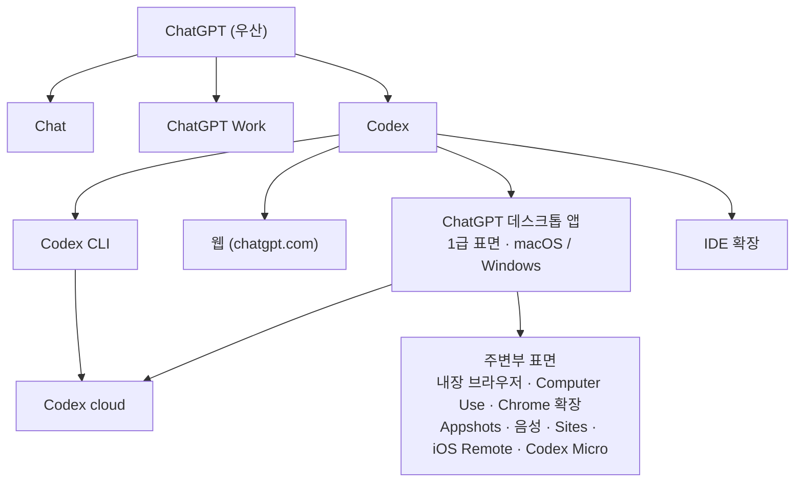
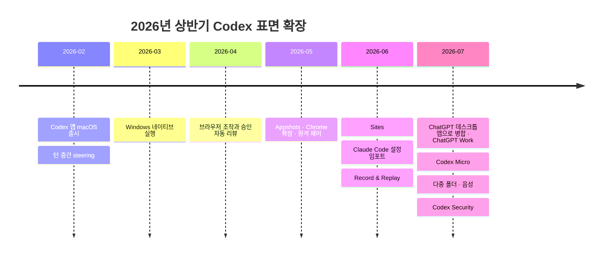

# 1장. Codex는 제품이 아니다 — 표면의 집합을 먼저 이해하기

Codex를 "OpenAI가 만든 Claude Code"라고 부르는 사람이 많다. 이름값만 보면 그럴듯하다. 터미널에서 부르고, 저장소를 읽고, 파일을 고치고, 테스트를 돌린다. 하는 일이 이렇게 겹치니 같은 종류의 물건이라고 여기게 된다.

그런데 실제로는 반대에 가깝다. Codex는 CLI 하나로 시작해 CLI 하나로 끝나는 도구가 아니라, **ChatGPT라는 우산 아래 놓인 여러 표면(surface) 가운데 하나**다. 공식 문서를 펼쳐보면 이 사실이 첫 페이지부터 드러난다. 문서는 Codex의 사용법을 알려주기 전에, "ChatGPT를 어떤 모드로 쓸 것인가"부터 나눈다.

말장난처럼 들리겠지만 실무에 그대로 걸린다. 표면이 여럿이라는 말은 곧, 같은 기능이 표면마다 다르게 동작하고, 문서가 표면별로 갈라지고, 내가 만든 설정이 어느 표면에서 유효한지를 매번 따져야 한다는 뜻이다. 손에 익은 명령어를 외우기 전에 지도를 먼저 펴는 편이 낫다. 지도 없이 들어가면 나중에 "분명히 설정했는데 왜 안 먹히지?" 하는 순간이 온다. 그 순간은 꽤 난감하다.

그러니 명령어는 잠시 미뤄두자. 먼저 붙들 질문은 이것 하나다. **내가 아는 "CLI 하나로 시작해서 CLI 하나로 끝나는 도구"라는 전제는, Codex에 얼마나 통하는가?**

## 문서가 먼저 그어놓은 세 개의 선

Codex 공식 문서를 펼치면 기능 목록보다 분류표가 먼저 나온다. `/codex/use-chatgpt` 페이지는 ChatGPT를 쓰는 방식을 세 갈래로 나눈다. 원문 표를 그대로 옮기면 이렇다.

| Choose | When you want to | Examples |
|---|---|---|
| Chat | Work through something with ChatGPT | Ask a question, search the web, brainstorm, draft a message, compare options |
| ChatGPT Work | Define an outcome and get a reviewable result | Create a deck, analyze files, draft a report, build a project plan |
| Codex | Use developer tools and see technical details | Debug code, run tests, review a PR, implement a feature |

표 1. `/codex/use-chatgpt`의 3분법 원문 (2026-08-02 문서 기준)

짧은 표지만 담긴 정보는 적지 않다. Chat은 주고받으며 생각을 정리하는 자리, ChatGPT Work는 "결과물"을 정의하고 검토 가능한 산출물을 받는 자리, 그리고 Codex는 **개발자 도구와 기술적 세부를 보고 싶을 때** 고르는 자리다. 셋은 같은 엔진 위에 얹힌 세 개의 시야다.

여기서 잠시 멈추고 생각해보자. 이 3분법에 대응하는 개념이 우리에게 있었나? 없다. Claude Code 사용자에게 익숙한 구도는 "CLI가 1급 표면인 단일 도구"이고, 거기에는 "비개발자용 산출물 모드"라는 형제가 없다. Codex의 3분법은 기능 분류가 아니라 **제품 전략**이다. 코딩 에이전트를 코딩 도구 시장에 놓는 대신, 일반 사용자용 어시스턴트와 같은 우산 아래 배치한 것이다.

더 흥미로운 건 이 세 갈래가 서로를 품고 있다는 점이다. 문서는 Codex 안에서도 Quick chat 아이콘을 눌러 가벼운 질문이나 브레인스토밍으로 빠질 수 있다고 안내한다. 질문하고, 웹을 검색하고, 낯선 개념을 쉬운 말로 설명받고, 시작하기 전에 요구사항을 정리하는 용도다. 개발 작업을 하다가 "이거 잠깐 물어볼 데가 없나" 싶을 때 창을 옮기지 않아도 된다는 뜻이다. 경계가 이렇게 물렁하다는 것은, 뒤집어 말하면 지금 내가 어느 모드에 있는지 스스로 알고 있어야 한다는 뜻이기도 하다.

문서는 심지어 Work와 Codex가 겹친다는 것도 인정한다. 데스크톱 앱에서 둘을 비교하는 표를 따로 두고, 차이를 "어디서 시작하는가 / 어떤 대화 목록이 보이는가 / 기술적 세부를 감추는가 드러내는가 / 에이전트가 어떤 말투로 보고하는가"로 설명한다. 다시 말해 같은 일을 시켜도 **Codex 뷰는 diff와 셸 명령을 보여주고, Work 뷰는 그걸 감춘다.**

이 지점이 첫 번째 교정이다. Codex를 고른다는 것은 같은 엔진을 개발자 시야로 여는 일에 가깝다. 그러니 "Codex가 이 작업을 할 수 있나?"라는 질문은 종종 잘못된 질문이 된다. 더 나은 질문은 **"이 작업을 어느 표면에서 해야 하나?"**다.

## 표면 전수 지도 — 어디서 무엇을 하는가

이제 표면이 몇 개이고 각각 무엇을 담당하는지 세어볼 차례다. `/codex/features`가 이 지도의 목록 역할을 하고, 표면별 상세는 각 표면 문서로 갈라진다. 정리하면 이렇게 된다.

그림 1. Codex 표면 지도 — 우산은 ChatGPT, Codex는 그 아래 한 갈래다

**데스크톱 앱이 1급 표면이다.** 이 문장이 Claude Code 사용자에게 가장 낯설 것이다. 2026년 7월 9일, 별도로 존재하던 Codex 앱은 ChatGPT 데스크톱 앱으로 병합됐다. 원문은 이렇게 못 박는다 — "The updated desktop app is available globally on every ChatGPT plan, including Free." 무료 플랜을 포함한 모든 플랜에 깔린다는 뜻이다. 코딩 에이전트가 개발자 전용 배포 채널을 갖지 않는다는 것, 이게 이 제품의 성격을 요약한다.

앱의 온보딩에는 우리에게 없던 단계가 하나 있다. 작업할 폴더를 명시적으로 고르는 단계다. 문서는 "ChatGPT can read and modify files in the folder you choose"라고 적는다. 터미널에서 `cd` 한 번으로 작업 위치가 암묵적으로 정해지던 감각과는 결이 다르다. 익숙해지기 전까지는 조금 번거롭게 느껴질 수 있다. 다만 이 명시성 덕분에 "에이전트가 어디까지 볼 수 있는가"가 실행 전에 화면에 드러난다는 이점도 함께 온다. 이 명시성은 2026년 7월 20~24일 주간에 한 걸음 더 나갔다. 하나의 로컬 프로젝트가 **여러 폴더**를 품을 수 있게 됐고, 그중 primary 폴더가 새 채팅·Git 작업·`AGENTS.md`와 스킬과 `config.toml`의 자동 탐색을 담당한다. secondary 폴더는 파일 검색·읽기·편집까지만 허용된다. 지침 파일이 어디서 읽히는지가 폴더 등급에 달려 있다는 뜻이다.

앱에는 또 하나, 컴포저의 **Work locally** 컨트롤이 있다. 로컬에서 돌릴지 클라우드로 넘길지를 대화 단위로 고르는 스위치다. 클라우드를 고르는 이유는 문서가 두 가지로 정리한다. 앱을 닫거나 컴퓨터를 꺼도 계속 돌아간다는 것, 그리고 웹·모바일에서 같은 대화를 이어갈 수 있다는 것.

**CLI는 여전히 두껍다.** 표면이 여러 개라고 해서 CLI가 곁가지가 된 건 아니다. `/codex/cli/reference` 한 페이지가 전역 플래그 20개, 서브커맨드 28개, 내장 슬래시 명령 약 60개를 한꺼번에 담는다. 우선순위 규칙도 문서가 직접 밝힌다 — "The CLI inherits most defaults from `~/.codex/config.toml`. Any `-c key=value` overrides you pass at the command line take precedence for that invocation." 설정 파일이 기본이고, 명령줄 오버라이드가 그 호출에 한해 이긴다. 이 계층은 4장에서 본격적으로 파헤친다.

IDE 확장은 컨텍스트 수집 방식이 다르다. 원문 Note가 차이를 정확히 짚는다 — "The IDE extension automatically includes your open files as context. In the CLI, mention paths explicitly, or attach files with `/mention` and `@` path autocomplete." 열어둔 파일이 자동으로 들어가는 표면과, 경로를 손으로 짚어야 하는 표면. 같은 프롬프트를 써도 결과가 갈릴 수밖에 없다. 반대로 잃는 것도 있다. Visualizations는 CLI와 IDE 확장에서는 렌더링되지 않는다.

웹과 cloud는 성격이 또 다르다. 웹(chatgpt.com)은 Chat과 ChatGPT Work를 제공하고, Codex 전용 개발자 뷰는 데스크톱 앱·CLI·IDE 쪽에 있다. Codex cloud는 작업을 격리 환경에 위임하는 표면인데, 여기엔 결정적인 제약이 하나 걸려 있다. 원문이 "Currently, you can't change the default model for Codex cloud chats"라고 잘라 말한다. 모델을 고를 수 없는 표면이 하나 있다는 사실은 뒤에서 모델과 위임을 다룰 때 되짚는다. 지금은 "표면마다 고를 수 있는 것의 범위가 다르다"는 것만 기억해두자.

그리고 주변부가 있다. 화면과 입력을 다루는 쪽으로는 내장 브라우저와 Computer Use, Chrome 확장, Appshots, 음성이 있다. 산출물과 하드웨어 쪽으로는 Sites, iOS Remote, Codex Micro가 있고, Amazon Bedrock을 경유해 쓰는 경로도 따로 있다. 목록만 봐도 짐작되겠지만 이 중 상당수는 터미널 도구의 문법으로는 설명되지 않는 것들이다. 이들은 12장에서 한 자리에 모아 다룬다.

용어가 헷갈릴 때 기댈 곳도 미리 알아두면 좋다. `/codex/glossary`는 **표면으로 필터링되는** 용어집이다("Filter by term, definition, or surface"). 같은 단어가 표면마다 다른 것을 가리킬 수 있다는 걸 문서 스스로 전제하고 있는 셈이다. 이 책은 2장에서 용어 대응 표를 하나 세우고 그것을 끝까지 정전으로 쓸 텐데, 그 표의 근거 가운데 하나가 여기다.

## 오픈소스 경계는 CLI 층에서 정확히 뒤집혀 있다

표면 지도를 그리고 나면 자연스럽게 따라오는 질문이 있다. 이 중 어디까지가 열려 있고 어디부터가 닫혀 있을까? 커뮤니티에서 "Codex는 오픈소스"라는 말이 자주 돌아다니는데, 이 문장은 그대로 쓰면 **사실 오류**가 된다.

`/codex/open-source`가 컴포넌트별로 경계를 그어놓았다.

| 컴포넌트 | 공개 여부 | 위치 |
|---|---|---|
| Codex CLI | 오픈소스 | `openai/codex` |
| Codex SDK | 오픈소스 | `openai/codex/sdk` |
| Codex App Server | 오픈소스 | `openai/codex/codex-rs/app-server` |
| Skills | 오픈소스 | `openai/skills` |
| IDE 확장 | **Not open source** | — |
| Codex cloud | **Not open source** | — |
| Universal cloud environment | 오픈소스 | `openai/codex-universal` |

표 2. `/codex/open-source`의 컴포넌트별 공개 경계 (2026-08-02 문서 기준)

경계가 어디를 지나는지 보이는가. **터미널에 가까운 층이 열려 있고, GUI와 서버 쪽이 닫혀 있다.** CLI·SDK·app-server·skills는 GitHub에서 소스를 읽을 수 있고, IDE 확장과 cloud는 문서가 "Not open source"라고 명시한다.

그런데 Claude Code 사용자에게 이 구도는 익숙한 것과 정확히 반대다. Claude Code는 CLI 층이 비공개다. 즉 **같은 CLI라는 자리에서 두 제품의 공개 정책이 서로 뒤집혀 있다.** 이것이 취향 차이로 보이지 않는 이유는, 이 경계가 곧 "내가 무엇을 직접 확인하고 무엇을 믿어야 하는가"의 경계이기도 하기 때문이다. Codex에서는 샌드박스 구현이나 설정 파싱 순서가 궁금할 때 소스를 열어볼 수 있다. 반대로 IDE 확장이 왜 그렇게 동작하는지는 열어볼 수 없다.

이 개방성에는 운영상의 부수 효과도 있다. 문서는 버그 리포트와 기능 요청 창구를 하나로 모아둔다 — CLI든 SDK든 IDE 확장이든 cloud든, 전부 `openai/codex` 저장소의 이슈로 간다. 그래서 앞으로 자주 인용할 GitHub 이슈들은 **제품 전체의 공식 접수창구에 쌓인 1차 기록**이다. 3장에서 전환 마찰 원장을 만들 때 이 이슈 번호들이 뼈대가 되는데, 그 자료의 성격이 여기서 정해진다고 보면 된다.

한 가지 더. 오픈소스 프로젝트 메인테이너를 위한 별도 프로그램(Codex for OSS)도 문서에 걸려 있다. API 크레딧, Codex가 포함된 ChatGPT Pro, 그리고 Codex Security에 대한 선별적 접근을 신청할 수 있다. 여기서는 "그런 통로가 있다" 정도로만 알아두면 충분하다.

## 2026년 상반기에 무슨 일이 있었나 — 표면이 늘어난 연표

표면이 이렇게 많아진 게 원래부터 그랬던 걸까? 아니다. 그리고 이 "아니다"가 이 책에서 꽤 중요한 사실이 된다.

공식 문서에는 주간 소식 페이지(`/codex/whats-new`)와 릴리스 노트(`/codex/changelog`)가 따로 있다. 앞쪽은 "일하는 방식을 바꿀 만한 변화"만 골라 주 단위로 묶고, 뒤쪽은 버전별 변경·버그 픽스까지 전부 담는다. 색인해보면 changelog 항목만 95개다. 여기서 굵은 마디만 뽑아 시간순으로 세워보자.

그림 2. 2026년 상반기 Codex 표면 확장 연표

2월 — Codex 앱이 macOS에 출시된다. 병렬 프로젝트 chat, 내장 Git 리뷰, worktree, 스킬, 예약 작업을 한 창에 담은 데스크톱 작업 공간이었다. 같은 주에 턴 중간 steering(응답을 멈추지 않고 방향을 바꾸는 것)과 이미지 외 파일 첨부가 들어왔다. 그 다음 주에는 chat 포크와 항상 위에 떠 있는 창이 붙었다. 여기까지는 "터미널 도구에 GUI를 씌운 것"으로 읽힌다.

3월 — Windows 네이티브 실행이 도착한다. PowerShell과 샌드박스를 네이티브로 지원하고, WSL은 리눅스 환경을 선호하는 개발자를 위해 남았다. 같은 주 GPT-5.4가 Codex에 들어왔다(모델 라인업이 이후 어떻게 바뀌는지는 8장에서 다룬다). 이어서 플러그인 패키징, 컴포저에서 도구를 고르는 방식, 터미널 출력 검사 기능이 붙는다.

4월 — 방향이 꺾이는 지점이다. 앱에서 풀 리퀘스트를 검토하고 머지하는 흐름이 들어오고, 이어서 **Codex가 브라우저를 직접 조작하고 승인 요청을 자동으로 리뷰**하기 시작한다. 터미널 도구의 어휘로는 더 이상 설명되지 않는 기능이 이때 처음 등장한다.

5월 — 확장이 화면 밖으로 나간다. Chrome 확장으로 브라우저 탭의 맥락을 가져오고, Appshots로 맥의 아무 앱이나 그 상태를 캡처해 컨텍스트로 넣는다. 장기 목표(goal)를 따라가는 기능, 데스크톱 작업을 모바일에서 이어받는 기능, 원격 제어가 같은 달에 들어온다.

6월 — 우리와 가장 직접 관련된 항목이 여기 있다. 6월 9일 릴리스 노트가 이렇게 적는다. "Added Import to Codex flows for importing supported setup from Claude Code and Claude Cowork, including during onboarding." 다른 코딩 에이전트의 설정을 온보딩 중에 가져오는 흐름이 공식 기능으로 들어왔고, 그 지원 소스에 **Claude Code가 이름으로 박혔다.** 이게 무슨 의미인지는 바로 다음 장에서 통째로 다룬다. 같은 달에 Sites(웹사이트·대시보드·앱을 만들어 호스팅)와 Record & Replay(맥에서 워크플로를 시연해 스킬로 만드는 기능)가 나왔다.

7월 — 한 달에 네 개의 마디가 몰려 있다. 7월 9일, Codex 앱이 ChatGPT 데스크톱 앱으로 병합되고 같은 날 ChatGPT Work가 출시된다. 앞서 본 3분법이 제품 화면으로 실현된 날이다. 7월 15일에는 OpenAI와 Work Louder가 Codex Micro를 내놨다. 한정 생산된 물리 컨트롤 표면으로, 키가 최대 여섯 개 chat의 상태를 보여주고 아날로그 스틱과 다이얼로 추론 강도까지 조절한다. 7월 20~24일 주간에는 다중 폴더와 ChatGPT Voice가 들어왔다. 그리고 7월 28일, 별도 제품인 Codex Security가 공개된다(커뮤니티 관측 — Hacker News 출시 스레드, 2026-07-28).

반년의 궤적을 한 줄로 요약하면 이렇게 된다. **터미널 도구 → 데스크톱 앱 → GUI·브라우저·컴퓨터 조작·음성·전용 하드웨어.** 방향이 뚜렷하고, 속도도 빠르다. 그리고 같은 기간 Claude Code는 CLI/SDK 중심을 지켰다.

이 대비를 지금 붙들어두자. 12장에서 이 연표를 다시 꺼내 "두 도구의 진화 방향이 갈렸다"는 논지의 증거로 쓸 것이다. 지금 시점에서 가져갈 실무적 함의는 이것 하나다 — **표면 목록은 고정된 사실이 아니라 몇 주 단위로 갱신되는 목록이다.** 이 책의 서술 시점 이후에 새 표면이 하나 더 늘어 있어도 놀랄 일이 아니다.

## 정의표는 있는데 명단이 없다

몇 주 단위로 표면이 늘어나는 제품에는 필연적으로 따라오는 문제가 있다. 어떤 기능은 믿고 써도 되고, 어떤 것은 내일 사라져도 이상하지 않다. 그 구분을 어디서 확인하는가가 문제다.

Codex 문서에는 이 질문에 답하려는 페이지가 있다. `/codex/feature-maturity`가 네 등급을 정의한다.

| Maturity | What it means | Guidance |
|---|---|---|
| Under development | Not ready for use. | Don't use. |
| Experimental | Unstable and OpenAI may remove or change it. | Use at your own risk. |
| Beta | Ready for broad testing; complete in most respects, but some aspects may change based on user feedback. | OK for most evaluation and pilots; expect small changes. |
| Stable | Fully supported, documented, and ready for broad use; behavior and configuration remain consistent over time. | Safe for production use; removals typically go through a deprecation process. |

표 3. `/codex/feature-maturity`의 성숙도 4등급 정의 (2026-08-02 문서 기준)

깔끔해 보인다. 그런데 이 페이지에는 정의표 말고 아무것도 없다. **어떤 기능이 어느 등급인지 알려주는 목록이 없다.** 라벨은 각 기능 문서에 인라인으로 흩어져 붙어 있고, 심지어 실제로 쓰이는 표현("research preview", "public beta")과 정의된 등급명이 딱 맞아떨어지지도 않는다.

그래서 이런 문장을 쓰면 곤란해진다. "Codex는 4단계 성숙도 체계를 쓴다." 정의표가 있다는 사실만 보고 체계가 일관되게 적용된다고 넘겨짚는 것인데, 이건 과잉 일반화다. 정확한 서술은 **"성숙도 등급의 정의는 문서화돼 있지만, 기능별 등급 명단은 문서화돼 있지 않다"**다.

이 구분은 곧바로 실무에 걸린다. 앞으로 다룰 것 중 상당수에 라벨이 붙어 있기 때문이다. 권한 프로필은 Beta, Chronicle은 리서치 프리뷰, Python SDK도 beta다. CLI 서브커맨드 중 일부는 `experimental`로 표시돼 있다. 이들을 전부 같은 무게로 읽으면 "문서에 있으니 써도 되겠지" 하고 프로덕션에 넣게 된다. 그러다 다음 릴리스에서 동작이 바뀌면 뒷맛이 꽤 찜찜해진다.

그래서 이 책은 성숙도를 다룰 때 규칙을 하나 세우고 간다. **새 기능을 실무에 넣기 전에, 그 기능의 문서 페이지에서 라벨을 직접 확인하는 편이 낫다.** 성숙도 정의 페이지는 "이 라벨이 무슨 뜻인가"만 알려줄 뿐, "이 기능이 어느 라벨인가"는 알려주지 않는다. 앞으로 라벨이 걸린 기능은 그 사실을 함께 적어둔다.

한 가지 덧붙이자면, 라벨이 붙었다는 사실 자체를 부정적으로 읽을 필요는 없다. 문서가 Beta를 "평가와 파일럿에는 괜찮고, 작은 변경은 예상하라"로 정의하는 것은 꽤 정직한 안내다. 문제는 라벨이 **어디에 붙어 있는지 찾기 어렵다는 데** 있다. 그러니 실무 규칙은 단순해진다. 라벨을 확인했으면 그 기능이 바뀔 수 있다는 전제로 설계하고, 확인하지 못했으면 확인할 때까지는 프로덕션 경로에 넣지 않는 편이 낫다.

## 왜 이 책이 필요한가 — 하네스가 성능을 만든다

여기까지 읽고 나면 이런 생각이 들 수 있다. 표면이 몇 개든 결국 같은 모델이 일하는 것 아닌가. 어느 창에서 부르든 GPT-5.6 계열이 코드를 쓴다면, 지도를 이렇게까지 자세히 그릴 필요가 있을까?

최근 연구들은 반대 방향을 가리킨다.

Gorinova 등이 2026년에 낸 프리프린트(arXiv:2606.17799)는 코딩 벤치마크의 구조적 결함을 지적한다. 점수는 모델의 몫과 하네스·컨텍스트·환경의 몫을 구분하지 못한다는 것이다. 그리고 이들이 실측으로 보여준 것이 결정적이다 — **하네스 요소 하나를 바꾸는 것이, 모델 세대를 통째로 올리는 것만큼 점수를 바꾼다.** 아직 동료 심사를 거치지 않은 프리프린트라는 점은 감안해서 읽자. 다만 방향은 더 앞선 연구와 일치한다. Yang 등의 SWE-agent(NeurIPS 2024, arXiv:2405.15793)는 모델을 그대로 두고 **인터페이스만 설계해서** 성능을 크게 끌어올렸다. 에이전트가 파일을 어떻게 보고, 어떻게 편집하고, 어떤 단위로 피드백을 받는지가 곧 성능이었다.

이 두 발견을 이 장의 지도 위에 얹어보자. 표면을 고르는 일은 UI 취향의 문제로 끝나지 않는다. 어떤 컨텍스트가 자동으로 들어가는지, 어디까지 손댈 수 있는지, **무엇을 승인해야 하는지가 표면마다 다르다.** IDE 확장이 열린 파일을 자동으로 넣고 CLI가 경로를 명시하게 하는 차이, 앱이 폴더를 명시적으로 고르게 하고 primary와 secondary를 나누는 차이, cloud가 모델 선택을 잠가두는 차이 — 이 전부가 하네스의 구성요소다. 표면을 잘못 고르면 모델을 잘못 고른 것과 비슷한 크기의 손해가 난다.

그렇다면 Claude Code에서 Codex로 옮기는 일은 무엇일까? **두 번째 하네스를 손에 익히는 일**이다. 이미 하나를 잘 다루는 사람에게 이 작업은 백지에서 배우는 것보다 오히려 까다롭다. 손이 기억하는 동작이 있기 때문이다. 그래서 이 책은 기능 목록을 훑는 대신, 우리가 이미 아는 것을 하나씩 대응시키며 간다. 지침과 설정에서 시작해 승인과 샌드박스, 확장 모델을 지나 비용과 위임까지. 그 순서의 출발점이 표면이었을 뿐이다.

이제 처음의 질문으로 돌아가자. **CLI 하나로 시작해서 CLI 하나로 끝나는 도구**라는 전제는 Codex에 얼마나 통했는가? 통하는 부분이 있다. CLI는 여전히 두껍고, 플래그와 설정 파일로 거의 모든 것을 통제할 수 있으며, 소스까지 열려 있다. 통하지 않는 부분도 분명하다. 1급 표면은 데스크톱 앱이고, 문서는 표면별로 갈라지며, 같은 기능이 표면마다 다른 이름과 다른 제약을 갖는다.

그래서 이런 질문이 남는다. 이미 잘 세팅해둔 지침 파일과 설정, 훅과 스킬과 MCP 서버들 — 표면이 다른 이 제품 위에서 그것들을 처음부터 다시 만들어야 할까? 답을 미리 말하지 않겠다. 다만 힌트는 방금 연표 안에 지나갔다. 2026년 6월 9일 릴리스 노트에 적힌 한 줄이었다.
