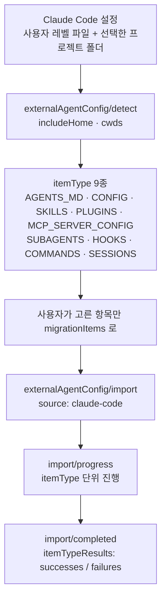

# 2장. 이주는 이미 구현돼 있다 — `/codex/import`가 말해주는 것

OpenAI 공식 문서 안에 이런 문장이 한 줄 들어 있다.

> "Import /Users/me/project/CLAUDE.md to /Users/me/project/AGENTS.md."

이 문장이 실린 곳은 `/codex/app-server` 문서의 JSON-RPC 응답 예시다. API 스펙 본문이다. 같은 페이지의 요청 예시에는 `"source": "claude-code"`라는 파라미터가 버젓이 들어 있고, 조금 아래에는 `~/.claude/skills`에서 `~/.agents/skills`로 스킬 폴더를 복사한다는 설명까지 붙어 있다. 경쟁 제품의 이름과 디렉터리 경로가, 남의 회사 프로토콜 스펙의 예시 값으로 남아 있는 것이다.

이걸 어떻게 읽어야 할까? 나는 여기서 제품 판단 하나를 읽는다. **"Claude Code에서 넘어오는 개발자"는 예외 사례가 아니라 설계된 유입 경로다.** 그리고 그 판단은 아주 실용적인 결론을 준다. 몇 달 동안 다듬어온 지침 파일과 훅, 스킬, MCP 서버 목록을 처음부터 다시 만들 필요가 없다는 것이다. 옮기는 버튼이 이미 있고, 그 버튼 뒤에 무엇이 어디로 가는지도 표로 공개돼 있다.

그래서 여기서는 순서를 한 번 뒤집는다. 승인이 어떻게 동작하는지, 샌드박스가 무엇을 막는지 배우기 전에 일단 옮겨놓고 시작하자. 백지에서 배우는 사람에게는 이상한 순서겠지만, 이미 자기 세팅을 가진 사람에게는 이쪽이 자연스럽다. 손에 익은 것이 새 도구 위에 얹혀 있어야 무엇이 달라졌는지도 보인다.

다만 조건이 하나 붙는다. 되돌아올 길을 먼저 만들어두자.

## 옮기기 전 5분, 되돌아올 길부터 만들자

임포트 버튼을 누르는 시점의 당신은 Codex의 승인 모델도, 샌드박스 경계도 아직 모른다. 그것들은 뒤에서 제대로 다룬다. 모르는 상태로 설정을 통째로 옮겨놓고 에이전트를 풀어두면, 다음 장에 도착하기도 전에 사고가 난다. 그러니 5분만 쓰자. 이 5분이 없으면 뒤에 나올 모든 이야기가 사고 수습기가 된다.

**첫째, `~/.codex/config.toml`을 백업하자.** 왜 하필 이 파일일까. 임포트가 건드릴 수 있는 바로 그 파일이기 때문이다. GitHub 이슈 [#24515](https://github.com/openai/codex/issues/24515)(2026-05-26 개설, CLI 0.133.0, macOS arm64, 👍 0, 여전히 open)의 보고는 이렇다. 프로젝트에 Claude Code 설정은 있는데 프로젝트 레벨 `.codex/config.toml`이 없는 상태에서 설정 마이그레이션 프롬프트를 수락했더니, **임포트가 손댄 파일은 사용자 레벨 `~/.codex/config.toml`이었다.** 보고자가 손봐뒀던 `approvals_reviewer` 값이 기본값으로 되돌아갔고, 그 뒤로는 모든 명령이 일일이 승인을 물었다. 보고자의 표현을 빌리면 "Every subsequent Codex command prompts for user approval"이다.

이건 단일 보고자의 커뮤니티 관측이고, 공식 문서가 인정한 동작이 아니다. 재현 절차와 환경이 명시돼 있어 신뢰할 만하지만 👍는 0이고 상태는 open이다. 그래도 대응 비용이 `cp` 한 줄이라면 안 할 이유가 없지 않은가. 더 고약한 건 증상이 원인을 가린다는 점이다. 승인 폭탄이 터졌을 때 "임포트 때문"이라고 의심하기는 정말 어렵다.

**둘째, 출발점은 깨끗한 git 트리여야 한다.** 커뮤니티가 거의 합의에 이른 몇 안 되는 노하우 중 하나다(suparious, [#11626](https://github.com/openai/codex/issues/11626) 댓글). 커밋되지 않은 변경이 섞여 있으면, 에이전트가 만든 diff와 내가 만들던 diff가 한 덩어리가 된다. 여기에 3장에서 자세히 볼 사실 하나가 겹친다 — Codex에서 대화를 되감아도 파일 수정은 워킹 트리에 그대로 남는다. 즉 **당신의 되돌리기 장치는 지금 git뿐이다.** 그 장치를 깨끗한 상태에서 출발시키자.

**셋째, 임포트를 끝낸 뒤 처음 일을 시킬 때는 `--sandbox read-only`로 시작하자.** CLI의 `--sandbox`는 `read-only`, `workspace-write`, `danger-full-access` 세 값을 받는다. 5장에서 제대로 배우기 전까지의 안전 기본값으로는 첫 번째가 낫다. 옮겨온 훅과 스킬이 새 환경에서 어떻게 동작하는지 모르는 상태에서 쓰기 권한부터 주는 건 아무래도 찜찜하다. 문서 자신도 강한 톤으로 못 박는다. "avoid `--dangerously-bypass-approvals-and-sandbox` unless you are inside a dedicated sandbox VM."

**넷째, 임포트 직후의 첫 명령은 `/debug-config`다.** CLI 개발자 명령 중 하나이고, 원문 설명은 설정 레이어를 우선순위 순으로(낮은 것부터) 출력하고 각 레이어의 on/off 상태와 정책 출처를 보여준다는 것이다. `allowed_approval_policies`, `allowed_sandbox_modes`, `mcp_servers`, `rules` 같은 항목이 함께 찍힌다. 문서가 붙여둔 한 문장이 이 명령의 존재 이유를 정확히 요약한다. "Use this output to debug why an effective setting differs from `config.toml`." 지금 유효한 설정이 내가 쓴 파일과 왜 다른지 — 임포트 직후에 이보다 더 정확한 질문은 없다. 레이어 구조 자체는 나중에 다시 펼쳐본다.

**다섯째, 문서가 지정한 "임포트 후 검토 목록" 다섯 항목을 눈으로 대조하자.** 원문이 열거하는 것은 이렇다. 옮겨온 스킬·에이전트의 도구 제한과 권한 / 커스텀 인증·헤더·환경 변수·트랜스포트를 쓰는 MCP 서버 설정(재로그인이 필요할 수 있다) / 임포트 후 동작이 달라질 수 있는 훅 / 수동 후속 조치가 필요한 플러그인과 마켓플레이스 / 인자·셸 보간·파일 경로 플레이스홀더에 의존하는 프롬프트 템플릿. 자동화가 끝나는 경계선을 공급자가 스스로 그어준 목록이니, 이 다섯 줄은 그냥 넘기지 말자.

## 문서가 보증하는 이주 경로 — 매핑 표 10행

준비가 끝났으면 이제 표를 보자. `/codex/import`가 공개한 임포트 대응표는 이 책 전체에서 가장 값어치 있는 원장 중 하나다. 추측한 대응이 아니라 **공급자가 자기 문서에 실어둔 보증**이기 때문이다(2026-08-02 문서 기준).

| Imported item | Destination |
|---|---|
| Instruction files | `AGENTS.md` |
| `settings.json` | `config.toml` |
| Skills | Skills |
| Plugins | Plugins |
| Existing project folders | Projects using the same folders |
| Chats from the last 30 days | ChatGPT chats |
| MCP server configuration | Codex MCP configuration |
| Hooks | Codex hooks |
| **Slash commands** | **Skills** |
| Subagents | Codex agents |

표 1. `/codex/import`의 임포트 대응표 10행 (원문 그대로)

열 개 행 가운데 유독 한 행이 눈에 들어온다. **슬래시 명령이 스킬로 접힌다.** 나머지 아홉 행은 이름만 바뀌는 1:1 대응인데, 이 행만 개념 자체가 한 단계 접힌다. 왜 그럴까? Codex에도 커스텀 프롬프트라는 자리가 있기는 하지만, 그쪽은 이미 폐기 예정으로 표기돼 있다. 재사용할 지시 묶음은 스킬이라는 한 가지 그릇으로 모으겠다는 방향이 정해져 있는 것이다. 그러니 임포트가 슬래시 명령을 스킬로 보내는 건 제품이 가려는 쪽으로 곧장 착지시키는 셈이다. 이 한 행이 두 제품 확장 모델 차이의 압축판이다.

그다음으로 눈여겨볼 행은 "Chats from the last 30 days"다. 최근 30일치 대화만 넘어온다. 반년 치 세션 이력을 자산이라고 여기고 있었다면 여기서 한 번 마음을 접어야 한다.

나머지 행들의 담백한 겉모습은 조심해서 읽자. `settings.json`이 `config.toml`이 된다는 행을 확장자 교체로 읽으면 곤란하다. 형식이 JSON에서 TOML로 바뀌는 건 겉면이고, 그 안의 키 지형과 계층 규칙은 따로 익혀야 한다 — 4장이 통째로 그 이야기다. "Existing project folders" 행도 그렇다. 폴더가 그대로 프로젝트가 된다는 건 1장에서 본 사실, 그러니까 Codex는 작업할 폴더를 온보딩에서 명시적으로 고르게 한다는 성질과 짝을 이룬다. 옮겨온 폴더 목록이 곧 "이 도구가 어디를 읽고 고칠 수 있는가"의 초기값이다. 항목을 고를 때 이 행만큼은 한 번 더 보자.

버튼은 어디 있을까. 문서가 안내하는 경로는 ChatGPT 데스크톱 앱의 **Settings > Import**이고, 아직 Import 섹션이 안 보이면 General에서 Import other agent setup을 찾으라고 적혀 있다. 에이전트를 고르고, 가져올 항목을 고르고, 끝나면 임포트된 프로젝트를 열어 이어서 작업하는 5단계다. 그런데 하루 종일 터미널에 사는 사람에게 이 경로는 살짝 어긋난다. CLI에도 입구가 있다 — `/import`다. 원문 설명은 "Import Claude Code setup, project files, and recent chats"이고, 제품 이름이 명령 설명문에 직접 등장하는 흔치 않은 경우다. 제약도 명시돼 있다. **로컬 TUI 세션에서만** 쓸 수 있고, 작업이 실행 중이거나 원격 세션이거나 로컬 app-server 데몬에 연결된 상태에서는 사용할 수 없다.

그리고 지원 소스에 Claude Code와 Claude Cowork가 이름으로 명시돼 있다(changelog 2026-06-09 항목). 앞 장에서 펼친 연표에 이 날짜가 하나의 마디로 찍혀 있었다는 것도 함께 기억해두자.

## 프로토콜에도 박혀 있다 — `externalAgentConfig`

UI 버튼은 언제든 바뀔 수 있다. 그런데 이 이주 경로는 UI보다 한 층 아래, 프로토콜에도 내려가 있다. `/codex/app-server` 문서가 두 개의 JSON-RPC 메서드를 정의한다.

> "Use `externalAgentConfig/detect` to discover external-agent artifacts that can be migrated, then pass the selected entries to `externalAgentConfig/import`."

먼저 `detect`가 `includeHome`과 `cwds`를 받아서 옮길 거리가 있는 항목을 훑는다. 사용자 레벨 설정은 내 머신의 파일에서, 프로젝트 레벨 설정은 내가 고른 저장소·폴더에서 나온다. 그다음 사용자가 고른 항목만 `migrationItems`에 담아 `import`로 넘긴다. 이때 함께 넘어가는 것이 앞서 본 `"source": "claude-code"`다. 문서의 설명은 담백하다. 이 파라미터는 "선택된 마이그레이션 항목을 만들어낸 제품을 이름표로 붙이는" 역할이다.

옮길 수 있는 항목의 종류는 `itemType`이라는 이름으로 아홉 가지가 열거돼 있다.

> "Supported `itemType` values are `AGENTS_MD`, `CONFIG`, `SKILLS`, `PLUGINS`, `MCP_SERVER_CONFIG`, `SUBAGENTS`, `HOOKS`, `COMMANDS`, and `SESSIONS`."


그림 1. 감지에서 완료까지 — 임포트 흐름과 `itemType` 9종

응답으로 돌아오는 것은 `importId` 하나다. 그 뒤로 `externalAgentConfig/import/progress`가 항목 타입 단위로 진행 상황을 알리고, 동기·백그라운드 임포트가 전부 끝나면 `externalAgentConfig/import/completed`가 온다. 두 알림 모두 타입별 `successes`와 `failures`를 담은 `itemTypeResults`를 포함하고, 지나간 이력은 `externalAgentConfig/import/readHistories`로 다시 볼 수 있다.

여기까지 읽고 나면 아홉 종류라는 숫자가 조금 다르게 보인다. 이건 "가져오기 지원"이라는 마케팅 항목이 아니라 **성공과 실패를 타입별로 세는 데이터 구조**다. 실패를 집계하고 이력을 남기는 상시 기능으로 설계했다는 뜻이다.

`detect`가 `cwds`를 배열로 받는다는 점도 지나치기 아깝다. 저장소 여러 개를 한 번에 훑을 수 있으니, 프로젝트마다 지침 파일을 깔아둔 사람에게는 시간이 꽤 줄어든다. 홈 디렉터리를 포함할지, 어떤 작업 폴더를 볼지는 호출자가 지정한다. 임포트가 알아서 내 디스크 전체를 뒤지지 않는다.

한 가지 단서는 붙여두자. `codex app-server`는 실험적(experimental) 등급으로 표기된 명령이고, 문서 자신이 예고 없이 바뀔 수 있다고 적어뒀다. 프로토콜 이름과 필드에 자동화를 걸 생각이라면 이 점을 계산에 넣는 편이 낫다.

## 건드리지 않는다는 약속, 그리고 그 약속의 가장자리

임포트 문서에서 가장 안심되는 문장은 이것이다.

> "Importing doesn't change or delete your existing agent setup."

기존 에이전트 설정은 바뀌지도 지워지지도 않는다. 옮겨간다기보다 복사해 온다는 쪽이 정확하다. 그래서 두 도구를 당분간 함께 쓰겠다는 선택이 처음부터 가능하다. 이 책의 마지막 장이 "둘 중 하나를 고르라"로 끝나지 않는 이유의 절반은 여기 있다.

비파괴 원칙은 Codex 쪽에도 적용된다. 문서가 밝히는 중복 방지 규칙이 꽤 구체적이다.

> "Detection returns only items that still have work to do. For example, Codex skips AGENTS migration when `AGENTS.md` already exists and is non-empty, and skill imports don't overwrite existing skill directories."

이미 내용이 있는 `AGENTS.md`는 건너뛰고, 스킬 임포트는 기존 스킬 디렉터리를 덮어쓰지 않는다. 두 번 눌러도 두 번 망가지지 않는다는 뜻이라 마음이 놓인다. 다만 뒤집으면 한 번 만들어진 `AGENTS.md`는 **그다음부터 임포트의 관심 밖**이라는 뜻이기도 하다. 나중에 Claude Code 쪽 지침을 크게 고쳐놓고 임포트를 다시 눌러도 감지 목록에 그 항목이 뜨지 않는다. 두 도구를 나란히 쓰기로 했다면 지침 동기화는 처음부터 내 몫이다. 여기에 마켓플레이스 추론까지 구현돼 있다. Codex가 플러그인을 감지할 때 `.claude/settings.json`의 `extraKnownMarketplaces`에서 마켓플레이스 출처를 읽는데, `enabledPlugins`에 `claude-plugins-official` 소속 플러그인이 있는데 출처가 비어 있으면 `anthropics/claude-plugins-official`을 출처로 추론한다고 적혀 있다. 남의 제품 설정 파일의 키 이름을 자기 문서에 그대로 적어둔 문장을 보면, 이 회사가 이주 경로를 얼마나 진지하게 다뤘는지 짐작이 간다.

물론 경계는 있다. **일반 Claude Chat 데이터는 임포트되지 않는다**고 문서가 못 박는다. 대화 쪽에서 넘어오는 것은 앞서 본 최근 30일치뿐이다.

그렇다면 앞의 약속은 어디까지 유효할까? 여기서 소절 1의 [#24515](https://github.com/openai/codex/issues/24515)와 짝이 맞는다. 문서가 보증한 것은 "your existing agent setup", 그러니까 **떠나온 쪽** 설정을 건드리지 않는다는 것이다. 도착한 쪽 설정, 즉 이미 손봐둔 `~/.codex/config.toml`까지 그대로 둔다는 약속은 저 문장에 들어 있지 않다. 보고된 사고는 정확히 그 틈에서 났다. 문서를 읽을 때 약속의 주어가 무엇인지 확인하는 습관은 앞으로도 여러 번 쓰게 된다.

## 로그인 — 어디에 무엇이 저장되는가

설정을 옮겼으면 이제 인증이다. CLI의 로그인 계열은 여섯 개로 정리된다.

```bash
codex login                                          # ChatGPT 브라우저 로그인
printenv OPENAI_API_KEY | codex login --with-api-key
printenv CODEX_ACCESS_TOKEN | codex login --with-access-token
codex login --device-auth                            # 헤드리스 (beta)
codex login status                                   # 현재 인증 방식 확인
codex logout
```

자격증명은 `~/.codex/auth.json`에 캐시되거나 OS 자격증명 저장소에 들어간다. 어느 쪽을 쓸지는 `cli_auth_credentials_store` 설정 키가 정하고 값은 `file`·`keyring`·`auto` 셋이다. `CODEX_HOME`의 기본값은 `~/.codex`이고, `file` 저장을 쓸 때만 이 경로를 옮기면 인증 캐시도 함께 따라간다. `keyring`이면 자격증명이 OS 키체인에 있으니 그대로 남는다. 파일 저장이라면 문서의 경고도 그대로 받아들이자 — `~/.codex/auth.json`은 액세스 토큰이 든 평문 파일이고, 비밀번호처럼 다뤄야 한다. 커밋하지도, 티켓에 붙여넣지도, 채팅에 공유하지도 말라고 적혀 있다.

문서가 알려주는 사실 하나가 실무에서 특히 성가시다. **CLI와 IDE 확장은 같은 캐시를 공유한다.** 한쪽에서 로그아웃하면 다음에 다른 쪽을 켤 때도 다시 로그인해야 한다.

원격 서버나 컨테이너에서는 어떻게 로그인할까? 브라우저를 띄울 수 없으니 콜백이 완성되지 않는다. 문서가 권하는 1순위는 device code 로그인(`codex login --device-auth`, beta)이고, 계정 보안 설정이나 워크스페이스 권한에서 먼저 켜둬야 한다. 폴백도 명시돼 있다. 브라우저가 있는 머신에서 로그인한 뒤 `auth.json`을 복사하거나, 콜백 포트를 그대로 터널링하는 방법이다.

```bash
ssh -L 1455:localhost:1455 user@remote
```

로컬 콜백 포트는 `1455`다. 원격 개발 환경을 쓴다면 이 한 줄을 미리 챙겨두자.

마지막으로 환경 변수 셋. `OPENAI_API_KEY`, `CODEX_ACCESS_TOKEN`, 그리고 사내 TLS 가로채기나 사설 루트 CA를 쓰는 환경을 위한 `CODEX_CA_CERTIFICATE`다. 마지막 값이 없으면 `SSL_CERT_FILE`로 폴백한다. 그리고 API 키로 로그인할 때는 문서가 조건을 하나 달아둔다. "Some features might not be available." 어떤 기능이 빠지는지는 이 문장만으로 알 수 없으니, 개인 작업이라면 ChatGPT 로그인 쪽이 무난하다.

## 용어 대응 빠른 지도 — 이 책의 정전

임포트 표가 "문서가 보증하는 이주 경로"라면, 이제 필요한 것은 "개념끼리의 대응"이다. 임포트 표에는 옮겨지는 것만 실린다. 애초에 상대 쪽에 없는 것은 거기 나타날 자리가 없다.

| Codex | Claude Code | 성격 |
|---|---|---|
| `AGENTS.md` | `CLAUDE.md` | 거의 대응 (중첩 로딩 동작이 다름 — 3장) |
| `config.toml` | `settings.json` | 형식만 다른 대응 |
| Skills (`.agents/skills`) | Skills (`.claude/skills`) | 대응 (디렉터리명이 벤더 중립) |
| `$skill` 호출 | `/skill` 호출 | **접두사가 다름** |
| execpolicy `.rules` | `permissions.allow/deny/ask` | 대응 + Codex가 테스트 하네스 보유 |
| Hooks | Hooks | **부분 대응** (커버리지 차이) |
| Subagents (`.codex/agents/*.toml`) | Subagents | 대응 |
| Custom prompts (`~/.codex/prompts/`) | 커스텀 슬래시 명령 | 대응하나 **Codex 쪽은 deprecated** |
| `codex exec` | `claude -p` | 비대화형 실행 |
| Codex cloud · Chronicle · Computer Use · Appshots | (대응 없음) | Codex 고유 |

표 2. 용어 대응 빠른 지도 — 이 책의 용어 정전

**이 표를 이 책의 용어 정전으로 삼는다.** 앞으로 어느 장에서 대응 관계를 이야기하든 여기 적힌 이름과 표기를 벗어나지 않는다. 두 제품을 오가며 열두 장을 쓰는 동안 같은 것을 다른 이름으로 부르기 시작하면, 독자는 매번 "이게 아까 그건가"를 확인하느라 논지를 놓치기 때문이다.

표를 임포트 표와 나란히 놓으면 세 가지가 도드라진다. 첫째, 임포트 표가 "Skills → Skills"라고 담백하게 적은 행이 여기서는 접두사 차이라는 함정을 드러낸다. `/`가 손에 붙은 사람에게 `$`는 생각보다 오래 걸려 교정된다. 둘째, Hooks 행은 임포트 표에서 온전한 1:1로 보이지만 실제 성격은 **부분 대응**이다. 옮겨진다는 것과 똑같이 동작한다는 것은 다른 이야기이고, 그 간극은 6장에서 확인한다. 셋째, 마지막 행에는 아예 짝이 없다. Codex cloud도 Chronicle도 Computer Use도 임포트할 대상이 없으니 임포트 표에 나올 수 없었을 뿐이다. 원래 이쪽에만 있는 것들이다. 덧붙여 execpolicy 행 하나는 눈여겨봐 두자. 권한 규칙을 두는 자리는 양쪽에 다 있는데, 그 규칙을 테스트하는 장치는 Codex 쪽에만 딸려 있다.

정리하면 이렇다. **임포트 표는 "무엇이 자동으로 넘어오는가"를 답하고, 정전 표는 "무엇이 같은 것이고 무엇이 다른 것인가"를 답한다.** 이주를 마친 다음 날부터 우리를 괴롭히는 건 대체로 두 번째 질문 쪽이다.

## 다시, 다섯 줄로

여기까지 흩어놓은 절차를 한 목록으로 모으자. 가져갈 물건은 사실상 이 다섯 줄이다.

1. **`~/.codex/config.toml`을 백업한다.** 임포트가 사용자 레벨 설정을 덮어썼다는 보고가 있고([#24515](https://github.com/openai/codex/issues/24515), open), 대응 비용은 복사 한 번이다.
2. **깨끗한 git 트리에서 시작한다.** Codex에서 대화를 되감아도 파일은 되돌아오지 않는다. 되돌리기 장치는 git뿐이다.
3. **임포트 후 첫 작업은 `--sandbox read-only`로 연다.** 승인과 샌드박스를 제대로 배우는 건 5장이다. 그전까지의 기본값으로 삼자.
4. **`/debug-config`로 레이어 순서와 정책 출처를 확인한다.** 유효한 설정이 내 파일과 왜 다른지 여기서 드러난다.
5. **문서의 "임포트 후 검토" 다섯 항목을 눈으로 대조한다.** 스킬·에이전트의 권한, MCP 서버 인증, 훅, 플러그인·마켓플레이스, 프롬프트 템플릿.

다섯 줄을 끝냈다면 이제 당신의 세팅은 Codex 위에 올라와 있다. 그리고 바로 여기서부터, 옮겨온 것들이 같은 이름을 달고 다른 일을 하기 시작한다.
