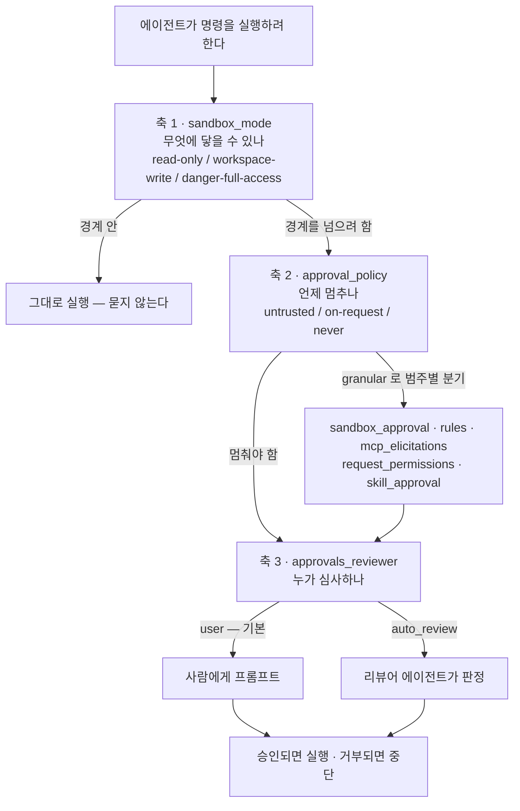
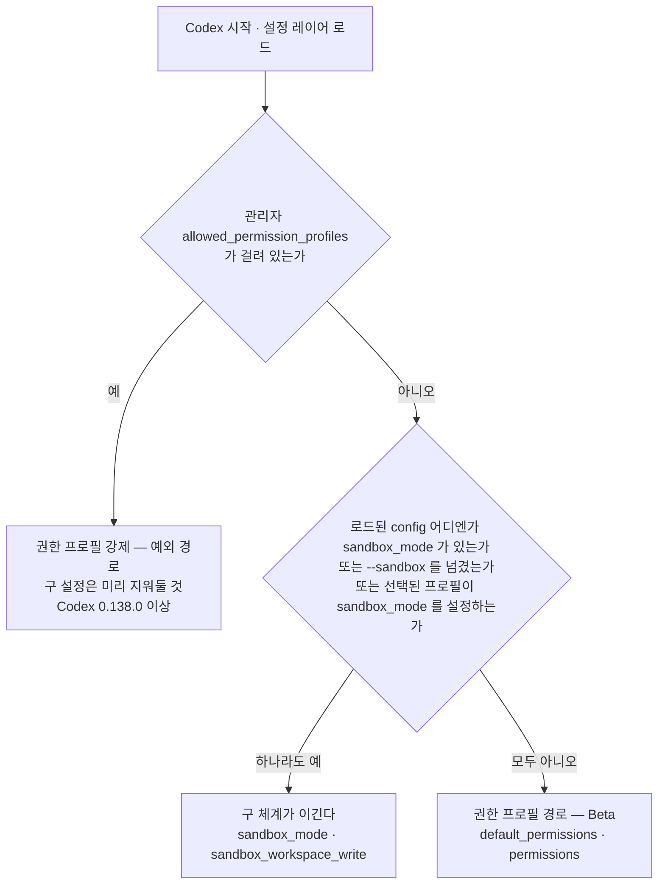

# 5장. 승인은 샌드박스가 아니다 — 세 개의 축과 Beta 딱지

승인 모드는 흔히 **다이얼**로 이해된다. 왼쪽으로 돌리면 에이전트가 일일이 물어보고, 오른쪽으로 돌리면 알아서 더 많은 일을 한다. 그러니 "승인을 자동으로 넘긴다"는 건 곧 "에이전트에게 더 넓은 권한을 준다"는 뜻이라고 여기게 된다.

문서는 그 이해를 정면으로 부정한다.

> "Changing who reviews a request doesn't expand the sandbox. For example, Approve for me keeps the same workspace boundary as Ask for approval; it sends requests to cross that boundary to automatic review."

승인 방식을 바꿔도 샌드박스는 넓어지지 않는다. Approve for me는 Ask for approval과 똑같은 워크스페이스 경계를 유지하고, 경계를 넘으려는 요청을 사람 대신 자동 검토로 보낼 뿐이다. 다이얼이 아니라 스위치가 두 개, 정확히는 세 개 따로 있다는 이야기다.

이 오해가 왜 위험한지는 금방 드러난다. 물어보는 횟수를 줄이려고 승인 쪽을 만졌는데 경계는 그대로여서 아무것도 편해지지 않거나, 반대로 경계를 열어야 할 자리에서 승인만 풀어놓고 "이제 안전 장치를 걸었다"고 믿게 된다. 둘 다 같은 뿌리에서 나온다. 축을 하나로 뭉쳐서 이해한 것이다.

특히 두 번째 실패는 조용해서 더 고약하다. 승인 프롬프트가 뜨지 않는 상태는 겉보기에 "잘 돌아가는 상태"와 구별되지 않는다. 경계가 열려 있고 정지선도 없는데, 화면에는 작업이 순조롭게 진행되는 모습만 보인다. 무언가 잘못됐다는 신호는 대개 되돌리기 어려운 일이 이미 끝난 뒤에 온다. 그래서 여기서 세울 목표는 하나다. **지금 내 세 축의 값을 말할 수 있게 되는 것.** 그것만 되면 나머지는 문서를 찾아보면 된다.

## 문서가 못 박는 분리 — 경계와 정지선

`/codex/permission-modes`의 두 문장이 이 장 전체를 지탱한다.

> "The sandbox defines which files and network resources ChatGPT can access."
> "Approvals determine when ChatGPT pauses before an action or sends the request to automatic review."

샌드박스는 **무엇에 닿을 수 있나**를 정하고, 승인은 **언제 멈추나**를 정한다. `/codex/sandboxing`은 같은 말을 조금 더 건조하게 되풀이한다.

> "Sandboxing and approvals are different controls that work together. The sandbox defines technical boundaries. The approval policy decides when the agent must stop and ask before crossing them."

여기서 한 가지 사실을 함께 챙겨두자. 샌드박스는 에이전트의 파일 편집에만 걸리는 게 아니다.

> "The sandbox applies to spawned commands, not just to built-in file operations. If the agent runs tools like `git`, package managers, or test runners, those commands inherit the same sandbox boundaries."

에이전트가 부른 `git`도, 패키지 매니저도, 테스트 러너도 같은 경계를 물려받는다. 이 점이 중요한 이유는 실무의 사고 대부분이 "모델이 부른 명령이 무언가를 했다" 쪽에서 나기 때문이다. 경계가 프로세스 단위로 상속된다는 말은, 내가 승인한 것이 **실행 환경 전체**라는 뜻이다.

그렇다면 샌드박스는 무엇을 위해 있을까? 문서 자신의 대답이 인상적이다.

> "The sandbox reduces approval fatigue. Instead of asking you to confirm every low-risk command, the agent can read files, make edits, and run routine project commands within the boundary you already approved."

경계를 세우는 목적이 승인 피로를 줄이는 것이라고 말한다. 안전과 편의를 맞바꾸는 장치로 읽으면 곤란하다. 미리 그어둔 선 덕분에 그 안에서는 묻지 않아도 되게 만드는 장치다. 이어지는 문장은 이 책 전체에서 가장 인용할 만한 대목이다.

> "You aren't just trusting the agent's intentions; you are trusting that the agent is operating inside enforced limits."

에이전트의 의도를 믿는 것과, 에이전트가 강제된 한계 안에서 움직인다는 사실을 믿는 것은 전혀 다른 종류의 신뢰다. 프롬프트로 "위험한 짓 하지 마"라고 적어두는 것과, OS 커널이 쓰기를 거부하는 것 사이의 거리이기도 하다. 이 거리를 감각으로 익히는 것이 이 장의 목표다.

`/codex/agent-approvals-security`는 같은 분리를 한 번 더, 이번에는 설정 키의 이름으로 정의한다.

> "Sandbox mode: What Codex can do technically (for example, where it can write and whether it can reach the network) when it executes model-generated commands."
> "Approval policy: When Codex must ask you before it executes an action (for example, leaving the sandbox, using the network, or running commands outside a trusted set)."

세 개의 문서가 같은 분리를 세 번 되풀이한다는 사실 자체가 하나의 신호다. 제품 팀이 이 지점에서 사람들이 헷갈린다는 걸 알고 있다는 뜻이다.

그래서 기본값도 상황에 따라 다르게 잡혀 있다. 문서가 밝히는 출발점은 이렇다 — 버전 관리되는 폴더는 `Auto`(워크스페이스 쓰기 + on-request 승인)로 열리고, 버전 관리되지 않는 폴더는 `read-only`로 열린다. 작업 디렉터리를 명시적으로 신뢰하기 전까지 `read-only`로 시작할 수도 있다. 워크스페이스에는 현재 디렉터리와 `/tmp` 같은 임시 디렉터리가 포함되며, 어떤 디렉터리가 워크스페이스에 들어 있는지는 `/status`로 확인한다. 지금 자기 환경이 궁금하다면 이 명령부터 쳐보자. 이 장의 나머지는 그 출력에 나온 값들을 하나씩 설명하는 일이다.

## 통제 축은 셋이다

여기서부터가 실제로 손을 대는 부분이다. 축을 둘로 세면 설정의 절반이 설명되지 않는다.

**축 1 — `sandbox_mode`: 무엇에 닿을 수 있나.** 세 값의 원문 정의는 이렇다. `read-only`는 "The agent can inspect files, but it can't edit files or run commands without approval", `workspace-write`는 "The agent can read files, edit within the workspace, and run routine local commands inside that boundary. This is the default low-friction mode for local work.", `danger-full-access`는 "The agent runs without sandbox restrictions."

**축 2 — `approval_policy`: 언제 멈추나.** `untrusted`는 "asks before running commands that aren't in its trusted set", `on-request`는 "works inside the sandbox by default and asks when it needs to go beyond that boundary", `never`는 "doesn't stop for approval prompts"다.

**축 3 — `approvals_reviewer`: 누가 심사하나.** 이 축이 가장 늦게 알려졌고 가장 자주 빠진다. 원문은 "When approvals are interactive, you can also choose who reviews them with `approvals_reviewer`"로 조건을 붙인 뒤 두 값을 준다. `user`는 "approval prompts surface to the user. This is the default.", `auto_review`는 "eligible approval prompts go to a reviewer agent"다.

그리고 축 2에는 하위 구조가 하나 더 붙는다. `approval_policy`에 값 대신 테이블을 넣으면 프롬프트 범주별로 켜고 끌 수 있다.

> "`approval_policy = { granular = { ... } }` lets you keep specific approval prompt categories interactive while automatically rejecting others. The granular policy covers sandbox approvals, execpolicy-rule prompts, MCP prompts, `request_permissions` prompts, and skill-script approvals."

다섯 범주가 그대로 다섯 개의 토글이 된다.


그림 1. 세 축은 순서대로 걸린다 — 경계가 먼저, 정지선이 다음, 심사자가 마지막

도식이 보여주듯 세 축은 나란한 선택지가 아니라 **차례로 걸리는 관문**이다. 경계 안에서 끝나는 일은 축 2와 축 3을 아예 만나지 않는다. 그래서 승인 프롬프트가 너무 잦다고 느낄 때 손대야 할 곳은 대개 축 1이다. 이 순서 감각 하나가 여기서 가져갈 가장 실용적인 물건이다.

| 축·토글 | 무엇을 통제하는가 | 값 | Claude Code 대응 (이 책의 화이트리스트 기준) |
|---|---|---|---|
| `sandbox_mode` | 파일·네트워크의 접근 경계 | `read-only` · `workspace-write` · `danger-full-access` | 가장 거친 등급의 플래그 이름만 맞물린다 — `--dangerously-bypass-approvals-and-sandbox`(별칭 `--yolo`) ↔ `--dangerously-skip-permissions` |
| `approval_policy` | 경계를 넘기 전에 멈추는 시점 | `untrusted` · `on-request` · `never` | 규칙으로 허용·차단·질문을 가르는 자리가 대응한다 — execpolicy `.rules` ↔ `permissions.allow/deny/ask` |
| `approvals_reviewer` | 승인 요청을 누가 심사하는가 | `user`(기본) · `auto_review` | 대응 항목이 레퍼런스에 없다 — 이 책은 판정하지 않는다 |
| `granular.sandbox_approval` | 샌드박스 경계 승인 프롬프트 | `true` · `false` | 같음 (판정 없음) |
| `granular.rules` | execpolicy 규칙 프롬프트 | `true` · `false` | 같음 (판정 없음) |
| `granular.mcp_elicitations` | MCP 프롬프트 | `true` · `false` | 같음 (판정 없음) |
| `granular.request_permissions` | `request_permissions` 프롬프트 | `true` · `false` | 같음 (판정 없음) |
| `granular.skill_approval` | 스킬 스크립트 승인 | `true` · `false` | 같음 (판정 없음) |

표 1. 3축 + granular 5토글 대응표

마지막 열에 빈칸이 많은 것은 실수가 아니다. 이 책의 리서치는 Codex 공식 문서를 1차로 수집했고 Claude Code 문서는 수집하지 않았다. 그래서 대응 관계를 주장할 수 있는 범위를 레퍼런스가 확보한 항목으로 한정해뒀다. 확보되지 않은 자리에 그럴듯한 대응을 채워 넣으면 표 전체의 신뢰가 함께 내려간다. 빈칸이 말하는 것은 **"이 책이 근거를 갖고 말할 수 없다"**는 사실 하나뿐이다. 대응물이 실제로 있는지 없는지는 별개의 문제이고, 그 자리는 당신이 직접 쓰는 도구를 열어 채우는 편이 정확하다.

축을 어떻게 조합할지 막막하다면 문서가 프리셋을 알려준다.

> "Full access means using `sandbox_mode = "danger-full-access"` together with `approval_policy = "never"`. By contrast, the lower-risk local automation preset is `sandbox_mode = "workspace-write"` together with `approval_policy = "on-request"`, or the matching CLI flags `--sandbox workspace-write --ask-for-approval on-request`. You can then keep `approvals_reviewer = "user"` for manual approvals or set `approvals_reviewer = "auto_review"` for automatic approval review."

읽어보면 "Full access"라는 UI 라벨 하나가 실은 두 축을 동시에 끝까지 민 상태라는 것을 알 수 있다. 라벨은 하나인데 뒤에서 움직이는 손잡이는 둘이다. 다음 소절이 정확히 이 지점을 다룬다.

## 세 층이 겹쳐 있다 — 라벨·설정 값·토글

지금 내 Codex는 어떤 모드로 돌고 있을까? 이 물음에 자신 있게 답하기 어렵다면 이유는 대개 하나다. 같은 대상을 세 가지 언어로 부르고 있다는 사실을 모르면, 문서를 읽을수록 헷갈린다.

첫째 층은 **UI 라벨**이다. 데스크톱 앱과 IDE 확장이 메뉴에 보여주는 이름이고, 처음 쓰는 사람이 만나는 유일한 표현이다. 둘째 층은 **구 설정 값**이다. `approval_policy`와 `sandbox_mode`의 조합이며 CLI 플래그와 1:1로 맞물린다. 셋째 층은 방금 본 **`granular` 토글**이다. 문제는 세 층이 1:1로 대응하지 않는다는 점이다. 라벨 하나가 설정 두 개를 동시에 움직이고, 토글은 라벨에 아예 노출되지 않는다.

여기에 함정이 하나 더 있다. **모드 개수가 페이지마다 다르다.** `/codex/permission-modes`는 세 가지를 소개한다 — Ask for approval은 언제나 쓸 수 있고, Approve for me(설정 화면에서는 Auto-review로 표기된다)와 Full access는 켜야 메뉴에 나타난다. 문서가 이 대목에 붙인 단서가 실무에서 자주 걸린다.

> "Enabling a mode makes it available in the menu; it doesn't select the mode or change an existing chat."

켜는 것과 고르는 것은 다른 동작이고, 이미 열려 있는 chat은 바뀌지 않는다. 설정에서 켰는데 왜 그대로냐는 물음의 답이 여기 있다.

그런데 `/codex/sandboxing`의 데스크톱·IDE 절을 열면 목록이 늘어난다.

> "Depending on your configuration, the menu can include Ask for approval, Approve for me for eligible approval requests, Full access, and named or custom permissions profiles."

이름이 붙은 권한 프로필과 커스텀 프로필이 메뉴에 함께 올라온다. 그러니 "Codex의 권한 모드는 N가지다"라고 외우면 어느 쪽이든 틀린다. 표면과 설정 상태에 따라 노출 범위가 달라진다고 이해하는 편이 정확하다. 표면별로 보면 CLI는 `/permissions`로 피커를 열고, 웹은 아예 다르다.

> "ChatGPT web doesn't expose the local Codex sandbox or approval-mode selector."

웹에는 로컬 샌드박스도 승인 모드 선택기도 없다. 로컬 파일을 다루지 않으니 당연한 결과이고, 그래서 이 장의 이야기는 처음부터 데스크톱 앱·CLI·IDE 확장의 이야기다.

층을 헷갈리지 않는 가장 빠른 길은 플래그 조합으로 외우는 것이다. 문서가 의도별 조합표를 직접 제공한다.

| 의도 | 플래그 · 설정 (원문 표기) | 결과 |
|---|---|---|
| 기본 프리셋 | *(플래그 없음)* 또는 `--sandbox workspace-write --ask-for-approval on-request` | 워크스페이스 안에서 읽고 고치고 명령을 돌린다. 밖으로 나가거나 네트워크를 쓰려면 승인이 필요하다 |
| 안전한 읽기 전용 | `--sandbox read-only --ask-for-approval on-request` | 읽고 답한다. 편집·명령 실행·네트워크는 승인이 필요하다 |
| 비대화형 읽기 전용 (CI) | `--sandbox read-only --ask-for-approval never` | 읽기만 한다. 승인을 묻지 않는다 |
| 편집은 자동, 낯선 명령만 승인 | `--sandbox workspace-write --ask-for-approval untrusted` | 읽고 고치되, 신뢰 집합 밖의 명령 앞에서 멈춘다 |
| Auto-review 모드 | `--sandbox workspace-write --ask-for-approval on-request -c approvals_reviewer=auto_review` | 경계는 그대로고, 승인 요청만 리뷰어 에이전트로 간다 |
| 위험한 전체 접근 | `--dangerously-bypass-approvals-and-sandbox` (별칭 `--yolo`) | 샌드박스도 승인도 없다 *(권장하지 않음)* |

표 2. 의도별 조합 — 플래그·설정 열은 원문 표기, 결과 열은 우리말로 풀었다

표에서 가장 오해받는 값은 `untrusted`다. 이름만 보면 "믿을 수 없으니 전부 물어본다"로 읽히는데, 문서의 설명은 조금 다르다.

> "With `--ask-for-approval untrusted`, Codex runs only known-safe read operations automatically. Commands that can mutate state or trigger external execution paths (for example, destructive Git operations or Git output/config-override flags) require approval."

안전하다고 알려진 읽기 연산만 자동으로 돌고, 상태를 바꾸거나 외부 실행 경로를 건드릴 수 있는 명령에서 멈춘다. 파괴적인 Git 연산과 출력·설정 오버라이드 플래그가 예로 명시돼 있다. 편집 자체는 막지 않으므로, "고치는 건 맡기되 낯선 명령 앞에서는 멈춰라"에 가깝다.

비대화형 실행에도 짝이 있다. 스크립트나 CI에서는 `codex exec --sandbox workspace-write`를 쓰라고 문서가 권한다. 예전에 쓰던 `codex exec --full-auto`는 호환 경로로 남아 있지만 폐기 예정 표시가 붙었고, 실행하면 경고가 찍힌다. 자동화 스크립트에 그 플래그가 아직 박혀 있다면 지금 바꿔두는 편이 낫다.

표의 마지막 행에는 문서에 적히지 않은 부작용이 하나 딸려 온다. `--yolo`는 웹 검색의 기본값까지 조용히 바꾼다.

> "Codex defaults to using a web search cache to access results. ... This reduces exposure to prompt injection from arbitrary live content, but you should still treat web results as untrusted. If you are using `--yolo` or another full access sandbox setting, web search defaults to live results."

평소 Codex는 OpenAI가 관리하는 색인 캐시에서 검색 결과를 가져온다. 미리 색인된 결과를 주므로 임의의 실시간 페이지에 노출될 여지가 줄어든다. 그런데 `--yolo`나 다른 전체 접근 설정을 쓰면 검색 기본값이 **live**로 바뀐다. 샌드박스를 끄겠다고 누른 플래그 하나가 프롬프트 인젝션 노출면까지 함께 넓히는 셈이다. 위험 플래그의 진짜 비용은 이렇게 표에 안 적힌 자리에 숨어 있다. 참고로 `web_search`는 `cached`(기본)·`live`·`disabled`·`indexed` 네 값을 갖는다.

## 권한 프로필은 아직 Beta다

지금까지 본 `sandbox_mode`·`approval_policy` 체계 옆에, 새 체계가 하나 더 들어와 있다. 권한 프로필이다. 원문 정의는 이렇다.

> "Permission profiles let you apply least-privilege boundaries to local commands Codex runs on your behalf. A profile is a named policy that combines filesystem rules, which define what commands can read or write, with network rules, which define which destinations commands can reach."

파일시스템 규칙과 네트워크 규칙을 하나의 이름 붙은 정책으로 묶는다. 경로별로 `read`·`write`·`deny`를 지정하고 도메인별로 `allow`·`deny`를 지정할 수 있으니, 표현력만 놓고 보면 구 체계보다 훨씬 세밀하다. 넓은 `deny` 안에 좁은 `write`를 다시 뚫는 것도 된다. 우선순위 규칙도 명시돼 있다 — 더 구체적인 항목이 넓은 항목을 이기고, 같은 경로면 `deny`가 `write`를, `write`가 `read`를 이긴다.

솔깃하다. 그런데 페이지 다섯째 줄에 이런 딱지가 붙어 있다.

> "Beta. Permission profiles are under active development and may change."

그래서 이 책은 권한 프로필을 정전으로 서술하지 않는다. **기본 경로는 여전히 구 체계이고, 권한 프로필은 그 옆에서 Beta로 병행한다**(2026-08-02 문서 기준). 이 구도를 뒤집어 읽으면 설정이 통째로 안 먹는 상황을 만나게 된다.

왜 그런지는 폴백 규칙 원문을 보면 분명하다.

> "Permission profiles do not compose with the older sandbox settings. Configure either `default_permissions` and `[permissions]`, or `sandbox_mode` / `sandbox_workspace_write`, but not both. If `sandbox_mode` appears in any loaded config file, you pass `--sandbox`, or the selected config profile sets `sandbox_mode`, Codex uses those older sandbox settings instead of `default_permissions`."

두 체계는 섞이지 않는다. 그리고 셋 중 어느 하나라도 걸리면 구 체계가 이긴다. 로드된 config 파일 어디엔가 `sandbox_mode`가 있거나, `--sandbox`를 넘겼거나, 선택된 config 프로필이 `sandbox_mode`를 설정하거나. 여기서 "어디엔가"가 무섭다. 몇 달 전 전역 설정에 적어둔 한 줄이 오늘 새로 쓴 프로필을 통째로 무력화한다. 게다가 조용히 무력화한다 — 오류도, 경고도 없이 그냥 구 체계로 동작한다.

예외는 하나뿐이다.

> "Managed `allowed_permission_profiles` is the exception: it makes Codex use permission profiles. Remove older settings such as `sandbox_mode` and `[sandbox_workspace_write]` before deploying a managed profile allowlist. For a mixed-version enterprise rollout, you can keep the managed `allowed_sandbox_modes` requirement as a temporary compatibility constraint until every client runs Codex 0.138.0 or later."

관리자가 내려보내는 `allowed_permission_profiles`가 걸려 있으면 프로필 쪽이 강제된다. 버전 앵커도 함께 붙어 있다 — 이 경로는 Codex `0.138.0` 이상에서 동작한다.


그림 2. 어느 체계가 이기는가 — 폴백 결정 흐름

프로필을 쓰기로 했다면 바닥부터 짜지 말자. 내장 프로필이 셋 있다. `:read-only`는 "keeps local command execution read-only", `:workspace`는 "allows writes inside the active workspace roots and system temp directories", `:danger-full-access`는 "removes local sandbox restrictions and should be used only when that broad access is intentional"이다. 상속에는 제약이 붙는다.

> "A profile can extend `:read-only`, `:workspace`, or another named profile. It cannot extend `:danger-full-access`; Codex also rejects unknown parents and inheritance cycles."

가장 위험한 프로필은 상속의 출발점이 될 수 없고, 알 수 없는 부모와 상속 순환도 거부된다. 문서가 상속을 권하는 이유도 명확하다 — `:workspace`를 확장하면 워크스페이스 루트의 `.codex` 디렉터리가 읽기 전용으로 남는 보호가 그대로 따라온다. 바닥부터 짜면 그 보호를 스스로 다시 만들어야 한다.

이 절의 결론은 담백하다. 권한 프로필은 방향으로는 분명히 옳지만 딱지가 아직 붙어 있고, 폴백 규칙 때문에 "썼다고 생각했는데 안 쓰고 있는" 상태가 쉽게 만들어진다. 지금 단계에서는 구 체계로 일상을 굴리면서 프로필을 실험하는 쪽이 안전하다. 이 부분은 빠르게 바뀔 수 있으니 공식 문서의 Beta 딱지가 언제 떨어지는지를 함께 확인해두자.

덧붙여, 여기서 고른 값이 조직 기기에서는 그대로 서지 않을 수 있다. 관리자가 허용 목록 자체를 좁혀두는 층이 따로 있고, 그 이야기는 11장의 몫이다.

## Auto-review — 바뀌는 것은 심사자뿐이다

축 3의 `auto_review`가 무엇인지 이제 제대로 보자. 정의부터 담백하다.

> "Auto-review replaces manual approval at the sandbox boundary with a separate reviewer agent. The main Codex agent still runs inside the same sandbox, with the same approval policy and the same network and filesystem limits. The difference is who reviews eligible escalation requests."

주 에이전트는 같은 샌드박스, 같은 승인 정책, 같은 네트워크·파일시스템 한계 안에 그대로 있다. 달라지는 것은 심사 주체 하나다. 문서는 이 점을 오해하지 말라고 한 번 더 못 박는다.

> "Auto-review is a reviewer swap, not a permission grant. It does not expand `writable_roots`, enable network access, or weaken protected paths."

쓰기 가능 루트를 넓히지도, 네트워크를 열지도, 보호 경로를 약화시키지도 않는다. 이 장의 오프닝에서 뒤집은 바로 그 오해가 여기서 다시 등장하는 셈이다.

작동 순서는 다섯 단계다. 주 에이전트가 `read-only`나 `workspace-write` 안에서 일하다가, 경계를 넘어야 할 때 승인을 요청하고, `approvals_reviewer = "auto_review"`면 그 요청이 사람 대신 리뷰어 에이전트로 간다. 리뷰어는 실행 여부를 판단하고 근거를 함께 돌려준다. 승인되면 실행이 이어지고, 거부되면 주 에이전트는 "실질적으로 더 안전한 경로를 찾거나, 멈추고 사용자에게 물으라"는 지시를 받는다.

리뷰어가 무엇을 보는지도 공개돼 있다. 압축된 대화 기록과 정확한 승인 요청, 그러니까 사용자 메시지·표면화된 어시스턴트 업데이트·관련 도구 호출과 출력이다. 그리고 한 문장이 더 붙는다.

> "Hidden assistant reasoning is not included. Auto-review sees retained chat items and tool evidence, not private chain-of-thought."

숨은 추론은 넘어가지 않는다. 리뷰어는 남아 있는 기록과 도구 증거만으로 판단한다. 자동 심사에 무엇을 기대할 수 있는지 가늠할 때 이 조건이 중요하다.

그리고 이 절에서 가장 자주 틀리는 수치가 나온다. 서킷 브레이커 조건이다.

> "Codex also applies a rejection circuit breaker per turn. In the current open-source implementation, Auto-review interrupts the turn after `3` consecutive denials or `10` denials within a rolling window of the last `50` reviews in the same turn."

**연속 3회 거부, 또는 같은 턴의 최근 50건 리뷰 안에서 10회 거부.** 뒤 조건을 "턴당 10회"로만 옮기면 틀린 서술이 된다. 창 크기 50이 함께 있어야 조건이 성립한다. 거부가 아닌 응답이 하나라도 나오면 연속 카운터는 초기화되고, 브레이커가 걸리면 Codex는 경고를 내고 현재 턴을 중단한다. 에이전트가 우회로를 찾아 계속 두드리는 상황을 막으려는 장치다.

거부가 부당하다고 느낄 때를 위한 출구도 좁게 하나 열려 있다. TUI에서 `/approve`를 치면 Auto-review Denials 피커가 열리고, 최근 거부된 동작 하나를 골라 한 번의 재시도만 승인할 수 있다. Codex는 작업당 최근 거부를 최대 10건까지 기록한다. 이 승인은 좁다 — 정확히 그 동작에만 적용되고, 비슷한 미래의 동작에는 적용되지 않으며, **재시도 역시 Auto-review를 다시 통과해야 한다.** 정책이 그 종류의 거부를 사용자가 덮을 수 없다고 규정하면 리뷰어는 다시 거부할 수 있다.

리뷰가 너무 잦다면 어떻게 해야 할까? 문서의 답이 앞서 본 순서 감각과 정확히 같다.

> "Auto-review works best when the sandbox already covers your common safe workflows. If too many mundane actions need review, fix the boundary first instead of teaching the reviewer to approve noisy escalations forever."

리뷰어를 길들이지 말고 경계를 고치라는 것이다. 규칙을 더할 때도 좁게 쓰라고 권한다 — `["cargo", "test"]`나 `["pnpm", "run", "lint"]` 같은 정확한 접두사가 `["python"]`이나 `["curl"]` 같은 넓은 패턴보다 낫다. 넓은 규칙은 Auto-review가 지키려던 경계 자체를 지워버린다.

마지막으로 문서 스스로 붙인 한계를 옮겨둔다.

> "Auto-review improves the default operating point for long-running agentic work, but it is not a deterministic security guarantee."

제품 문서가 스스로 이 한계를 적어뒀다. 판단하는 쪽도 결국 모델이기 때문이다. 이 솔직함은 신뢰할 만하고, 동시에 마지막 소절의 논지로 곧장 이어진다.

## OS가 실제로 막아주는 것

경계가 "강제된 한계"라면 강제하는 주체가 있어야 한다. 그 주체는 운영체제다.

macOS는 Seatbelt를 쓴다. 선택한 `--sandbox` 모드에 대응하는 프로파일을 `-p`로 넘겨 `sandbox-exec`로 명령을 돌린다. Linux는 기본적으로 `bwrap`과 `seccomp`를 조합한다. Windows는 PowerShell에서 돌 때 네이티브 Windows 샌드박스를, WSL2에서 돌 때 Linux 샌드박스 구현을 쓴다.

버전 앵커가 하나 붙어 있다.

> "WSL1 was supported through Codex `0.114`; starting in `0.115`, the Linux sandbox moved to `bwrap`, so WSL1 is no longer supported."

WSL1은 `0.114`까지 지원됐고 `0.115`부터 샌드박스가 `bwrap`으로 옮겨가면서 더는 지원되지 않는다. 아직 WSL1에 남아 있다면 손볼 것은 환경 자체다.

그래서 Linux에는 준비물이 하나 더 붙는다. `bubblewrap`을 설치해두지 않으면 샌드박스가 제 성능을 내지 못한다. Codex는 `PATH`에서 처음 찾은 `bwrap` 실행 파일을 쓰고, 없으면 번들 헬퍼로 폴백하지만 그 헬퍼는 비특권 사용자 네임스페이스 생성을 지원해야 한다. 설치는 Ubuntu·Debian이 `sudo apt install bubblewrap`, Fedora가 `sudo dnf install bubblewrap`이다. 배포판에 따라 AppArmor 설정이 한 번 더 필요할 수도 있다 — 문서는 Ubuntu 25.04에서는 추가 설정 없이 동작하지만 24.04에서는 사용자 네임스페이스를 만들지 못한다는 경고가 계속 뜰 수 있다고 적어뒀다. 컨테이너 안에서 돌릴 때도 비슷한 벽을 만난다. 호스트나 컨테이너 설정이 네임스페이스나 `seccomp` 동작을 막으면 샌드박스가 동작하지 않는다. 설정을 아무리 잘 써둬도 강제해줄 층이 없으면 소용이 없다는 이야기다.

여기서 가장 반가운 발견 하나를 짚어두자. **샌드박스를 직접 시험해 볼 수 있는 서브커맨드가 있다.**

```bash
codex sandbox macos   [--permissions-profile <name>] [--log-denials] [COMMAND]...
codex sandbox linux   [--permissions-profile <name>] [COMMAND]...
codex sandbox windows [--permissions-profile <name>] [COMMAND]...
```

내가 건 경계 안에서 임의의 명령이 어떻게 되는지를 에이전트 없이 확인할 수 있다. `sandbox` 명령은 `codex debug`로도 제공되고, 플랫폼 헬퍼에는 `codex sandbox seatbelt`·`codex sandbox landlock` 같은 별칭이 있다. macOS에는 `--log-denials`가 붙어 거부된 접근을 찍어볼 수 있다. 권한 설정을 문서로만 이해하는 것과, 명령 하나를 던져 거부 로그를 눈으로 보는 것은 학습 속도가 다르다. 설정을 새로 짤 때 이 명령부터 한 번 돌려보자.

그렇다면 쓰기 가능한 루트 안에서는 무엇이든 고칠 수 있을까? 그렇지 않다. **보호 경로**가 따로 있다.

> - "`<writable_root>/.git` is protected as read-only whether it appears as a directory or file."
> - "`<writable_root>/.agents` is protected as read-only when it exists as a directory."
> - "`<writable_root>/.codex` is protected as read-only when it exists as a directory."
> - "Protection is recursive, so everything under those paths is read-only."

쓰기 가능한 루트 안에 있어도 `.git`·`.agents`·`.codex`는 읽기 전용이고, 보호는 재귀적이다. `.git`이 포인터 파일(`gitdir: ...`)이면 그 파일이 가리키는 실제 Git 디렉터리까지 함께 보호된다. 무엇을 막는 장치인지는 목록만 봐도 읽힌다. Git 내부와 에이전트 자신의 설정이다. **에이전트가 자기를 묶어둔 밧줄을 스스로 풀지 못하게 하는 자기참조 방어**이며, 이런 종류의 보호가 명문화돼 있다는 사실 자체가 이 제품의 성격을 보여준다.

네트워크는 별도의 게이트를 하나 더 지난다. 로컬에서는 기본이 차단이고 `sandbox_workspace_write.network_access`로 열며, `features.network_proxy`를 켜면 도메인 단위 허용·차단을 걸 수 있다. 두 스위치의 관계가 진리표로 정리돼 있다 — 네트워크가 꺼져 있으면 프록시를 켜도 아무 일도 일어나지 않고, 네트워크만 켜면 제한 없는 직접 통신이 되며, 둘 다 켜야 정책이 실제로 걸린다. 클라우드로 위임한 작업은 규칙이 또 다르다. 에이전트 단계에서 인터넷이 기본 차단되고 셋업 스크립트만 네트워크를 쓴다. 이 이야기는 위임을 다루는 9장의 몫이다.

## 설정으로 안전을 살 수는 없다

여기까지 오면 손에 쥔 손잡이가 꽤 많다. 그런데 이 손잡이들을 아무리 잘 돌려도 남는 위험이 있다. 이 소절은 그 잔여 위험의 크기를 숫자로 확인하는 자리다.

먼저 OpenAI 자신의 보고다. GPT-5.2-Codex 시스템 카드 애드덤(2025-12-18)은 파괴적 행동을 피하는 능력을 모델 세대별로 이렇게 적었다 — gpt-5-codex `0.66`, gpt-5.1-codex `0.70`, gpt-5.1-codex-max `0.75`, gpt-5.2-codex `0.76`. 꾸준히 오르고 있다. 그리고 가장 높은 값이 `0.76`이다. **네 번에 한 번쯤은 파괴적 행동을 피하지 못한다는 뜻이다.** 같은 문서가 왜 이런 일이 생기는지도 적어뒀다.

> "Simple instructions like 'clean the folder' or 'reset the branch' can mask dangerous operations (rm -rf, git clean -xfd, git reset –hard, push –force) that lead to data loss, repo corruption, or security boundary violations."

"폴더 정리해줘" 같은 평범한 지시가 위험한 연산을 덮고 있을 수 있다는 것이다. 이 수치는 벤더 자체 보고이므로 그 점을 감안해 읽어야 한다. 한 가지 덧붙이면, 이 애드덤에는 **프롬프트 인젝션 정량 평가표가 없다.** 어디선가 "OpenAI가 인젝션 방어율을 몇 퍼센트로 보고했다"는 문장을 보게 되면 출처를 의심하자.

바깥의 측정도 하나 있다. IssueTrojanBench(Singh, Yang, Chen, arXiv:2607.20759, 2026-07-22)는 악의적으로 조작된 이슈의 **66.5%가 모든 가드레일을 통과했다**고 보고했다. 그리고 이렇게 덧붙였다.

> "rejection is almost entirely from LLMs rather than the agent frameworks"

거부는 거의 전부 모델에서 나오지 프레임워크에서 나오지 않는다는 것이다. 이 문장이 이 소절 제목의 근거다. **조건을 반드시 함께 읽자.** 66.5%는 이 벤치마크가 설계한 공격 시나리오 집합 기준이며 실사용 환경의 침해율이 아니다. 아직 동료 심사를 거치지 않은 preprint이기도 하다. 그럼에도 인용하는 이유는, Cursor·Claude Code·Codex Desktop을 이름으로 직접 평가한 보안 벤치마크가 이것뿐이기 때문이다.

그렇다면 무엇을 해야 할까? 커뮤니티가 도달한 결론은 의외로 소박하다. miki123211이 Hacker News에서 2026-07-14에 남긴 요령이 대표적이다.

> "You can poke specific holes in the sandbox (E.G. my Codex one can write to `~/go`, `~/.cache` and `~/.cargo`). You can have explicit deny rules..."

샌드박스를 끄지 말고 필요한 만큼만 구멍을 뚫으라는 이야기다. 개인 후기이므로 공식 권고와 같은 무게로 읽을 것은 아니지만, 방향은 문서와 정확히 같다. 문서는 쓰기 권한을 더 줘야 할 때 `danger-full-access`로 미는 대신 `--add-dir`를 먼저 쓰라고 권하고, 예외가 필요한 워크플로에는 규칙을 쓰라고 권한다.

> "When a workflow needs a specific exception, use rules. Rules let you allow, prompt, or forbid command prefixes outside the sandbox, which is often a better fit than broadly expanding access."

승인 창이 떴을 때 고르는 범위에도 같은 원칙이 적용된다.

> "When an approval offers different scopes, such as approving once or for the session, choose the narrowest scope that lets the task continue. Keep the project boundary as the default; use separate projects or worktrees instead of broadening access across unrelated repositories."

가장 좁은 범위를 고르고, 접근을 넓히는 대신 프로젝트나 worktree를 분리하라. 세 인용이 한 방향을 가리킨다. 안전은 설정 하나로 사는 물건이 아니라 경계를 계속 좁게 유지하는 습관에 가깝다는 것이다.

한 가지 안전장치는 설정과 무관하게 늘 켜져 있다는 점도 기억해두자. 도구가 자신을 파괴적이라고 표시하면, 다른 힌트가 함께 붙어 있더라도 승인이 강제된다.

> "Destructive app/MCP tool calls always require approval when the tool advertises a destructive annotation, even if it also advertises other hints (for example, read-only hints)."

내가 어떤 조합을 골랐든 이 규칙은 남는다. 뒤집어 말하면 **표시하지 않는 도구는 이 그물에 걸리지 않는다**는 뜻이기도 하다. 직접 만든 MCP 서버를 붙일 때 애너테이션을 성실히 다는 일이 왜 안전 문제인지가 여기서 드러난다. 남이 만든 그물에 기대는 대신, 내 도구가 그물에 걸리도록 표시해두는 쪽이 낫다.

## 한 화면으로 압축하면

이 장에서 세운 개념 전부가 결국 몇 줄의 설정으로 내려앉는다. 축이 어디에 있고 기본값이 무엇인지를 아래 스키마로 기억해두자.

```toml
# ─ 축 1 · 무엇에 닿을 수 있나 ────────────────────────────
sandbox_mode = "workspace-write"   # read-only | workspace-write | danger-full-access

[sandbox_workspace_write]
network_access = false             # 로컬 기본은 차단

# ─ 축 2 · 언제 멈추나 ───────────────────────────────────
approval_policy = "on-request"     # untrusted | on-request | never

# 범주별로 나누고 싶을 때만 (값 대신 테이블)
# approval_policy = { granular = {
#   sandbox_approval    = true,
#   rules               = true,
#   mcp_elicitations    = true,
#   request_permissions = false,
#   skill_approval      = false
# } }

# ─ 축 3 · 누가 심사하나 ─────────────────────────────────
approvals_reviewer = "user"        # user(기본) | auto_review

# ─ 참고 · 위험 플래그가 함께 바꾸는 것 ──────────────────
web_search = "cached"              # cached(기본) | live | disabled | indexed
                                   # --yolo 계열을 쓰면 기본이 live로 바뀐다
```

`sandbox_mode`가 한 줄이라도 어딘가에 살아 있는 한, 이 파일이 이기고 권한 프로필은 잠들어 있다. 세 축의 값이 각각 무엇인지 말할 수 없다면 아직 설정을 끝낸 것이 아니다.

### 이 장의 핵심

- **샌드박스는 경계를, 승인은 정지선을, `approvals_reviewer`는 심사자를 정한다.** 승인 쪽을 아무리 풀어도 경계는 넓어지지 않는다.
- 세 축은 **차례로 걸리는 관문**이다. 프롬프트가 잦으면 승인보다 경계를 먼저 손보자.
- 같은 대상을 **UI 라벨 · 구 설정 값 · `granular` 토글** 세 언어로 부른다. 모드 개수는 표면마다 다르므로 숫자로 외우지 말자.
- **권한 프로필은 Beta이고, 구 설정이 어디엔가 있으면 조용히 진다.** 관리자 `allowed_permission_profiles`(Codex `0.138.0` 이상)만이 예외다.
- Auto-review는 심사자만 바꾼다. 쓰기 루트도 네트워크도 보호 경로도 그대로다. 서킷 브레이커는 **연속 3회 또는 최근 50건 중 10회** 거부에서 턴을 끊는다.
