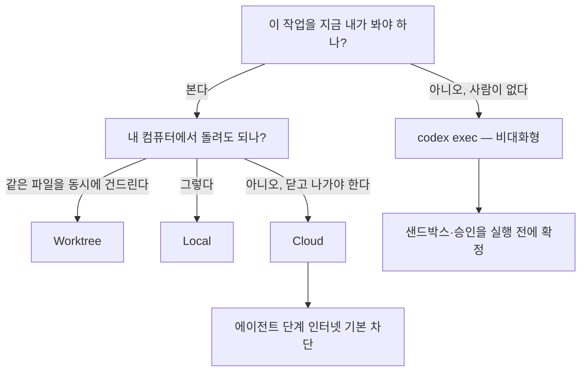

# 9장. 내 노트북 밖으로 — 위임의 세 가지 모양

금요일 오후라고 해보자. 손이 많이 가지만 머리는 별로 안 쓰는 작업 하나가 남아 있다. 의존성 업그레이드든, 테스트 보강이든, 오래된 API 호출을 새 시그니처로 바꾸는 일이든. 노트북을 닫고 나가고 싶은데 이 작업은 두 시간쯤 걸린다. 그래서 클라우드에 던져놓고 월요일에 결과를 받기로 한다.

합리적인 계획으로 들린다. 그런데 이 계획에는 조용한 가정이 하나 깔려 있다. 월요일의 도구가 금요일의 도구와 같은 도구라는 가정이다. 한 달 동안 클라우드에 Rust 모듈 작성을 맡겨 잘 쓰던 사람이 남긴 글이 그 가정을 정면으로 흔든다(Hacker News, 2026-07-26 — 원문은 뒤에서 본다) — 같은 입력창, 같은 프롬프트, 같은 모델인데 결과가 완전히 달라졌다는 보고다. 무엇이 바뀌었는지는 뒤에서 보자.

위임은 편의를 주는 대신 **통제권의 일부를 가져간다.** 그러니 무엇을 어디로 보낼지 정하기 전에, 보낼 수 있는 곳이 몇 군데이고 각각 무엇을 내주는지부터 알아두자 (2026-08-02 문서 기준).

## 실행 위치는 세 갈래로 갈린다

데스크톱 앱에서 새 chat을 시작하면 컴포저 아래에서 실행 위치를 고르게 된다. 문서가 제시하는 선택지는 셋이다.

- Local — "work directly in your current project directory."
- Worktree — "isolate changes in a Git worktree."
- Cloud — "run remotely in a configured cloud environment."

여기서 놓치기 쉬운 사실이 하나 있다. **Local과 Worktree는 둘 다 내 컴퓨터에서 돈다.** 원격으로 나가는 것은 Cloud뿐이다. 즉 이 3지선다는 "어디서 실행하나"와 "파일을 어떻게 격리하나"라는 서로 다른 두 축이 한 줄에 접혀 있는 형태다. Local과 Worktree는 격리 수준에서 갈리고, Cloud만 실행 위치를 바꾼다.

클라우드를 고를 이유는 문서가 두 가지로 정리한다. 앱을 닫거나 컴퓨터를 꺼도 작업이 계속 돌아간다는 것, 그리고 웹이나 모바일에서 그 대화를 이어갈 수 있다는 것. 데스크톱 컴포저의 **Work locally** 컨트롤이 이 선택을 매번 노출한다. 금요일 오후의 시나리오가 클라우드를 부르는 이유도 정확히 첫 번째다.

그리고 이 셋과 축이 다른 네 번째 경로가 있다. 사람이 화면 앞에 없는 실행, 즉 비대화형 모드다.

> "Non-interactive mode lets you run Codex from scripts (for example, continuous integration (CI) jobs) without opening the interactive TUI. You invoke it with `codex exec`."

2장에서 용어 대응을 정리할 때 `codex exec`를 `claude -p` 자리에 놓아뒀다. 이름만 대응시켜뒀던 그 자리를 지금 채우자. `codex exec`는 TUI를 열지 않고 스크립트에서 Codex를 부르는 진입점이고, 문서는 쓸 자리를 네 가지로 든다 — 파이프라인의 한 단계(CI·머지 전 검사·예약 작업), 다른 도구로 넘길 출력 생산, 명령 출력을 Codex에 물리고 그 출력을 또 다른 도구로 넘기는 CLI 워크플로, 그리고 샌드박스와 승인 설정을 미리 못 박아 둔 채 돌리는 실행이다.

마지막 항목이 중요하다. 사람이 없으면 승인 대화상자도 없다. 그래서 비대화형은 5장에서 세운 승인·샌드박스 축을 실행 전에 전부 확정해야 하는 모드다. 기본값은 다행히 보수적이다 — `codex exec`는 아무것도 지정하지 않으면 read-only 샌드박스에서 돈다. 편집이 필요하면 `--sandbox workspace-write`를 명시하고, `danger-full-access`는 문서 표현대로 "격리된 CI 러너나 컨테이너 같은 통제된 환경에서만" 쓰자.

스트림 규약도 알아두면 파이프라인을 짤 때 편하다.

> "While `codex exec` runs, Codex streams progress to `stderr` and prints only the final agent message to `stdout`."

진행 상황은 `stderr`로 흘리고 최종 메시지만 `stdout`에 찍는다. 그래서 `codex exec "…" | tee release-notes.md` 같은 형태가 그대로 성립한다. 로그와 결과물이 처음부터 분리돼 있는 셈이다. 반대 방향도 열려 있어서, stdin으로 내용을 물려주면서 프롬프트를 함께 주면 Codex는 프롬프트를 지시로, 파이프로 들어온 내용을 추가 맥락으로 다룬다.

출력을 기계가 읽어야 한다면 선택지가 둘 더 있다. `--json`을 붙이면 stdout이 JSON Lines 스트림이 되어 `thread.started`·`turn.started`·`item.*`·`turn.completed` 같은 이벤트가 줄 단위로 흐른다. 결과의 **모양**까지 고정하고 싶다면 `--output-schema`에 JSON Schema 파일을 넘겨 그 스키마를 만족하는 최종 응답을 요구할 수 있다. 파싱 코드를 방어적으로 짜는 대신 계약을 먼저 세우는 방식이라, 파이프라인 안정성 면에서 차이가 크다.

작은 것들도 몇 개 알아두면 좋다. `--ephemeral`은 세션 기록 파일을 디스크에 남기지 않고, `--ignore-user-config`는 `$CODEX_HOME/config.toml`을 로드하지 않으며, `--ignore-rules`는 사용자·프로젝트의 execpolicy 규칙을 건너뛴다. 뒤의 둘은 CI에서 "내 로컬 설정이 섞여 들어오는" 문제를 끊을 때 쓰지만, 6장에서 CI에 걸자고 한 규칙까지 함께 꺼진다는 점은 기억해두자. 이어서 작업하고 싶으면 `codex exec resume --last`로 직전 세션을 잇는다.

한 가지 제약도 있다. Codex는 파괴적 변경을 막기 위해 **명령이 Git 저장소 안에서 실행되기를 요구한다.** 문서는 환경이 안전하다고 확신할 때만 `--skip-git-repo-check`로 우회하라고 적는다. 3장에서 "깨끗한 git 트리에서 시작하라"고 한 습관이 여기서는 아예 도구의 전제 조건으로 굳어 있는 셈이다.

그림 1. 위임 결정 흐름

## 워크트리가 일급 시민이다

세 갈래 중 가운데 것을 먼저 보자. Codex 문서는 Git worktree에 독립된 페이지 하나를 통째로 내줬다. 워크트리를 chat 시작 화면의 기본 선택지로 올려놓은 것이다. 아는 사람만 쓰는 git 기능이라는 위치에서 끌어올린 셈이다.

문서가 정의하는 용어는 셋이다. Local checkout은 내가 만든 저장소이고(데스크톱 앱은 그냥 Local이라고 부른다), Worktree는 그 로컬 체크아웃에서 만들어낸 Git 워크트리이며, Handoff는 chat을 둘 사이에서 옮기는 흐름이다. 마지막 항목이 핵심 장치다 — 원문 표현으로 "Codex handles the Git operations required to move your work safely between them", 즉 옮기는 데 필요한 Git 조작을 Codex가 대신 처리한다.

왜 쓰는가도 문서가 답한다. 로컬 셋업을 건드리지 않고 병렬로 작업하기, 집중을 유지한 채 백그라운드 작업을 큐에 넣기, 그리고 검사나 테스트가 필요해지면 chat을 Local로 옮기기. 시작하는 절차는 간단하다. 새 chat 화면에서 Worktree를 고르고, 기준이 될 브랜치를 정하고, 프롬프트를 제출하면 Codex가 그 브랜치를 바탕으로 워크트리를 만든다. 기본값은 detached HEAD다.

실무에서 걸리는 지점은 따로 있다. 워크트리는 로컬 체크아웃과 다른 디렉터리에서 돌기 때문에, 저장소에 체크인되지 않은 것들이 거기엔 없다. 문서가 셋업 스크립트를 두는 이유를 이렇게 적는다.

> "your project might not be fully set up and might be missing dependencies or files that aren't checked into your repository."

`node_modules`가 없고, `.env`가 없고, 빌드 산출물이 없다. 그래서 Codex는 워크트리를 만들 때 셋업 스크립트를 자동 실행하고(플랫폼별로 다른 스크립트를 둘 수 있다), gitignore된 파일 중 워크트리에 꼭 필요한 것은 `.worktreeinclude`에 나열해 복사하게 한다. `AGENTS.override.md`는 목록에 적지 않아도 자동으로 따라간다.

| 항목 | 값 |
|---|---|
| 워크트리 기본 위치 | `$CODEX_HOME/worktrees` |
| 위치 변경 | Settings > Worktrees > Worktree root |
| 무시 파일 복사 목록 | `.worktreeinclude` (예: `.env`, `.env.local`, `config/secrets.json`) |
| 자동 복사 | `AGENTS.override.md` |
| 공유 메타데이터 | `.git` |

표 1. 워크트리 관련 경로와 설정

숫자 두 개만 기억해두자. Codex는 관리형 워크트리를 **최근 15개까지** 보존한다. 그리고 브랜치에는 Git 자체의 제약이 걸린다 — "Git only allows a branch to be checked out in one place at a time." 워크트리에서 어떤 브랜치를 체크아웃하면 로컬 체크아웃에서는 그 브랜치를 체크아웃할 수 없다. 병렬 작업을 늘리다 보면 여기서 한 번 막힌다.

그런데 이 격리가 왜 그렇게 중요할까? 7장에서 본 "흔한 실수" 목록에 워크트리 없이 같은 파일을 동시에 건드리는 것이 들어 있었기 때문이다. 에이전트를 둘 이상 굴리는 순간 이건 일상적 사고가 된다. 한쪽이 고친 파일을 다른 쪽이 읽고 판단하면, 둘 다 옳은 일을 하면서 결과는 망가진다.

로컬 실행에서 실제로 보고된 함정도 하나 짚어두자. 이슈 [#28190](https://github.com/openai/codex/issues/28190)(2026-06-14 개설, 👍 79, open)은 macOS에서 번들된 `rg`가 차단되는 문제를 다룬다. 원인 규명이 스레드에 있다 — Codex가 먼저 해석하는 번들 바이너리에 `com.apple.quarantine` 속성이 붙어 있어, 호출할 때마다 macOS가 검증 경고를 띄운다. 커뮤니티가 재현한 해결책은 그 속성을 지우는 `xattr -d com.apple.quarantine …` 한 줄이다. 다만 스레드에는 터미널 앱을 바꾸면 된다는 오해도 섞여 있고, 그 제안에 대해 "the issue still occurs in ghostty. it is not a fix"라는 반박이 붙어 있다. **터미널을 바꿔봐야 소용이 없다.** 이 항목은 커뮤니티 보고이므로 상태가 바뀔 수 있다. 번호를 열어 현재 상태부터 확인하자.

## 클라우드 chat은 어떻게 도는가

이제 노트북 밖으로 나가보자. 클라우드에 맡긴 작업이 실제로 어떤 순서를 밟는지 알아두면, 뒤에서 볼 재현성 문제가 왜 생기는지도 함께 이해된다.

순서는 이렇다. Codex가 컨테이너를 만들고 지정된 브랜치나 커밋 SHA에서 저장소를 체크아웃한다. 셋업 스크립트를 실행한다(캐시된 컨테이너를 재개하는 경우라면 선택적인 maintenance 스크립트도 함께 돈다). 그다음 인터넷 접근 설정을 적용하고, 에이전트가 터미널 명령을 루프로 돌리며 코드를 고치고 검사를 실행한다. 저장소에 `AGENTS.md`가 있으면 프로젝트별 린트·테스트 명령을 거기서 읽는다. 끝나면 답변과 변경 diff를 보여주고, 우리는 PR을 열거나 후속 질문을 던진다.

이 순서에서 가장 중요한 대목은 세 번째다. 인터넷 접근이 단계마다 다르다.

> "Tasks delegated to the cloud run in isolated environments. Internet access is off during the agent phase unless you enable it for the environment."

셋업 단계에는 인터넷이 있고, **에이전트 단계에는 기본으로 없다.** 5장에서 승인·샌드박스 3축을 세우면서 클라우드 네트워크는 여기서 마저 보자고 미뤄뒀는데, 그 진리표의 나머지 절반이 이것이다. 로컬에서는 네트워크가 샌드박스 설정으로 갈리지만, 클라우드에서는 실행 단계 자체가 권한 경계가 된다. 의존성을 내려받는 일은 셋업에서 끝내라는 뜻이고, 에이전트가 도는 동안 외부를 호출해야 하는 작업이라면 환경 설정에서 따로 열어줘야 한다는 뜻이다. 열더라도 모든 아웃바운드 트래픽은 HTTP/HTTPS 프록시를 지나간다.

같은 원리가 비밀 값에도 적용된다.

| 구분 | 유효 범위 | 암호화 |
|---|---|---|
| Environment variables | chat 전 기간 (셋업 + 에이전트 단계) | 일반 |
| Secrets | **셋업 스크립트에서만**, 에이전트 단계 전에 제거된다 | 추가 암호화 |

표 2. 클라우드 환경의 변수와 시크릿

시크릿은 에이전트가 돌기 전에 사라진다. 인터넷을 끊는 것과 같은 발상이다 — 에이전트가 실행되는 순간의 권한 표면을 최소로 줄인다. 그러니 클라우드 위임을 설계할 때의 첫 질문은 이것이어야 한다. 이 작업에 필요한 것을 **셋업 단계에서 미리 끝낼 수 있는가?**

셋업을 어떻게 정의하는지도 두 갈래다. 자동 셋업은 npm·yarn·pnpm·pip·pipenv·poetry를 알아서 처리하고, 그보다 복잡하면 직접 Bash 스크립트를 쓴다. 문서가 드는 예시도 타입 체커를 깔고 의존성을 설치하는 몇 줄짜리다.

컨테이너 캐시도 알아두자. 캐시는 최대 12시간 유지되고, 셋업 스크립트나 변수가 바뀌면 자동으로 무효화된다. Business·Enterprise에서는 캐시가 접근 권한을 가진 사용자 전체에 공유되므로, 무효화도 전체에 영향을 준다. 기본 이미지에는 흔한 언어와 패키지가 미리 깔려 있고 Python·Node.js 같은 런타임은 버전을 핀으로 고정할 수 있다. 그 이미지의 레퍼런스는 `openai/codex-universal` 저장소다.

터미널을 떠나지 않고 클라우드를 다루는 경로도 있다. `codex cloud`가 대화형 선택기를 열고, `codex cloud exec --env {ENV_ID} --attempts 1-4`가 작업을 바로 제출하며(같은 작업을 최대 네 번까지 시도하게 할 수 있다), `codex cloud list --limit 1-20`이 최근 chat을 스크립트에서 다루기 좋은 형태로 돌려준다. 클라우드에서 나온 변경을 로컬로 가져올 때는 `codex apply {TASK_ID}`를 쓴다. 다만 `codex cloud`에는 딱지가 하나 붙어 있는데, 그 이야기는 이 장의 마지막 절에서 하자.

## 실행 환경이 내 것이 아닐 때

이제 서두에 꺼낸 그 보고를 펼쳐보자. 2026년 7월 26일 Hacker News에 ModernMech이라는 계정이 남긴 글이다.

> "the past month I had been using Codex cloud and it was working great writing Rust modules. Suddenly last week they made a few changes and everything went to shit, couldn't get a single good result out of it. Same text box, same prompting, same model, totally different results because they changed the cloud tool's resource limits. So whereas before my debugging time would have been spent in Rust docs looking up traits and such, these days I feel more like an AI therapist trying to figure out why it's not feeling up to task on any particular day."

익명 계정의 단일 보고이며, 공식 문서가 인정한 동작은 아니다. 그럼에도 인용할 값이 있는 이유는 대조 조건을 스스로 명시했기 때문이다. 입력창도 같고, 프롬프트도 같고, 모델도 같다. 바뀐 것은 공급자 쪽이라는 진술이다. 여기서 뽑아낼 원리는 이렇다. **클라우드는 실행 환경이 공급자 소유라, 내 쪽 변경이 하나도 없어도 어제와 다른 도구가 될 수 있다.**

로컬 CLI에서는 이런 일이 잘 일어나지 않는다. 버전을 올린 것은 나이고, 설정을 고친 것도 나이고, 무엇이 달라졌는지 `git diff`로 확인할 수 있다. 반면 클라우드에서는 컨테이너 이미지도 리소스 한도도 내 저장소 밖에 있다. 앞 절에서 본 12시간 캐시가 좋은 비유다 — 어제 돌던 컨테이너가 오늘은 캐시에서 재개될 수도, 처음부터 다시 만들어질 수도 있다. 재현성이라는 말이 로컬에서와 다른 뜻을 갖게 되는 지점이다.

"AI 심리상담사가 된 기분"이라는 마지막 문장이 이 상황을 정확히 짚는다. 원인이 내 손 밖에 있으면 디버깅이 추론이 아니라 **기분 살피기**가 된다. 그렇다면 어떻게 대응해야 할까?

커뮤니티가 내놓은 답은 놀랄 만큼 일관된다. 작업을 작게 쪼개는 것이다. tunesmith가 2026년 6월 13일 Hacker News에 정리한 루틴이 대표적인데, 채팅으로 구현 직전까지 합의를 끝낸 뒤 "커밋 하나 크기"의 작업을 Codex에 던지고, 로컬 개발 서버에서 짧게 확인하고, 수정을 요청하고, 커밋과 다음 단계 추천을 받는 식이다. 위임의 단위가 커밋 하나라면 결과가 어긋나도 잃는 것이 커밋 하나다.

여기서 이 책이 정직하게 밝혀둘 것이 하나 있다. **이 주제를 리서치하면서 확보한 클라우드 위임 성공 사례는 전부 커밋에서 MR 한 개 사이 크기였다.** 몇 시간짜리 대형 위임을 끝까지 밀어붙인 1차 후기는 찾지 못했다. 그런 후기가 세상에 없다고 단정할 수는 없고, 이 리서치의 범위 안에서 공백이라는 뜻이다. 다만 공백 자체가 신호일 수는 있다. 금요일 오후에 두 시간짜리 작업을 통째로 던지는 계획에는 아직 검증된 선례가 없다.

반대 방향의 관측도 함께 적어두자. knuckleheads가 2026년 6월 9일 Hacker News에 남긴 글은 Codex가 오히려 로컬 실행 쪽으로 사람을 밀고 있다고 느꼈다는 진술이다. 클라우드 컨테이너를 넉넉히 주던 시기와 비교하는 내용이라 시점 의존성이 크고, 역시 익명 단일 보고다. 두 진술을 나란히 놓으면 결론은 하나로 모인다 — **클라우드 위임의 조건은 공급자 사정에 따라 움직이며, 그 움직임을 우리가 통제하지 못한다.**

## 붙는 자리 — 여덟 개의 진입점

위임을 어디서 시작하느냐도 갈래가 여럿이다. 문서가 각각 독립된 페이지로 다루는 진입점이 여덟 군데인데, 산문으로 늘어놓으면 서로 뭉개진다. 표로 구별을 맡기고 산문은 고르는 흐름만 설명하자.

| 진입점 | 트리거 | 인증 | 실행 위치 | 알려진 제약 |
|---|---|---|---|---|
| `codex exec` (↔ `claude -p`) | 셸·스크립트 호출 | 저장된 CLI 인증 재사용, 또는 호출 단위 `CODEX_API_KEY` | 로컬 | Git 저장소 안에서만 실행(`--skip-git-repo-check`로 우회) |
| GitHub Action | 워크플로 이벤트(PR 등) | `openai-api-key` 시크릿 | Action 러너 | Linux·macOS 러너 전제, Windows는 `safety-strategy: unsafe` 필요 |
| `@codex` PR 코멘트 | PR 코멘트 멘션 | GitHub 연결 | 클라우드 | 리뷰 서술은 10장 |
| Slack | 채널·스레드에서 `@Codex` 멘션 | Slack 앱 설치 + GitHub 연결 | 클라우드 | Plus·Pro·Business·Enterprise·Edu 플랜 및 환경 1개 이상 필요 |
| Linear | 이슈 assign 또는 `@Codex` 멘션 | Linear 커넥터 | 클라우드 | 유료 플랜, 트리아지 규칙 사용 시 **이슈 작성자 계정**으로 실행 |
| Remote(모바일·SSH) | 모바일 앱에서 호스트 연결 | 같은 계정·워크스페이스 로그인 | 연결된 호스트 | 설정은 모바일 앱에서만 — CLI·IDE 확장에서는 못 한다 |
| 통합 터미널 | 앱 안에서 <kbd>Ctrl</kbd>+<kbd>`</kbd> | (앱 로그인) | 로컬(현재 프로젝트·워크트리) | 데스크톱 앱 전용 |
| Amazon Bedrock | `model_provider = "amazon-bedrock"` | AWS 자격 증명 또는 Bedrock API 키 | 로컬(모델 요청만 Bedrock) | 데스크톱·IDE는 셸 환경 변수를 상속하지 않을 수 있어 `~/.codex/.env` 필요 |

표 3. 위임이 붙는 여덟 자리 (2026-08-02 문서 기준)

표를 세로로 훑으면 축이 두 개 보인다. 누가 트리거하는가와 어디서 도는가다. 앞의 넷 중 `codex exec`와 통합 터미널·Bedrock은 내 컴퓨터에서 돌고, Slack·Linear·PR 멘션은 클라우드로 나간다. 즉 **채팅 도구에서 시작하는 위임은 자동으로 클라우드 위임**이며, 재현성 이야기가 그대로 따라붙는다.

Slack과 Linear에는 공통된 함정이 하나 더 있다. **환경이 자동으로 골라진다.** 문서 표현으로 Codex는 접근 가능한 환경을 살펴 요청에 가장 잘 맞는 것을 고르고, 애매하면 "가장 최근에 쓴 환경"으로 폴백한다. 그리고 그 chat은 해당 환경의 저장소 지도에서 첫 번째 저장소의 기본 브랜치를 대상으로 돈다. 편리하지만 예측 가능성을 내주는 거래다. 문서 자신도 이 점을 트러블슈팅 항목으로 인정하며, 원하는 환경을 스레드에 답글로 명시한 뒤 다시 멘션하라고 안내한다. 저장소를 못 박고 싶다면 `@Codex fix the above in openai/codex`처럼 프롬프트에 직접 적는 편이 안전하다.

원격 접속 항목도 성격이 조금 다르다. 모바일 앱의 Remote로 연결하면 실행되는 곳은 **연결된 호스트**다. 문서가 이 점을 정확히 적는다 — "Remote access uses the connected host's projects, chats, files, credentials, permissions, plugins, Computer Use, browser setup, and local tools." 프로젝트도 자격 증명도 권한도 전부 그 호스트 것이라는 뜻이다. 연결은 보안 릴레이 계층을 통하며, 신뢰된 기기를 공개 인터넷에 직접 노출하지 않는다고 문서는 설명한다. 즉 이건 **기존 실행 위치에 붙는 원격 조작 창구**다. 실행 위치가 하나 늘어나는 게 아니다. 설정을 모바일 앱에서만 시작할 수 있다는 제약도 그래서 자연스럽다.

Linear의 트리아지 규칙에는 한 줄짜리 중요한 규정이 붙어 있다. 규칙으로 자동 배정된 chat은 **이슈 작성자의 계정으로 실행된다.** 감사 추적 관점에서 이건 무게가 있는 규정이다. "누구 권한으로 돌았나"를 문서가 명시적으로 정의한 드문 자리이니, 팀에 붙이기 전에 확인해두자.

CI 쪽에서 배울 것도 하나 있다. GitHub Action 문서의 예시 워크플로는 잡을 둘로 쪼갠다. Codex를 돌리는 잡에는 `contents: read`만 주고, 코멘트를 다는 쓰기 권한은 API 키가 없는 별도 잡으로 넘긴다. 안전 전략의 기본값도 `drop-sudo`인데, 이건 Codex 실행 전에 `sudo`를 제거하며 잡 단위로 되돌릴 수 없다. 문서의 보안 체크리스트가 "Run Codex as the last step in a job so later steps don't inherit state changes"라고 적은 이유가 여기 있다.

비대화형 인증에도 같은 원칙의 경고가 붙는다.

> "Do not set `OPENAI_API_KEY` or `CODEX_API_KEY` as a job-level environment variable in workflows that check out or run repository-controlled code."

저장소 코드를 체크아웃하거나 실행하는 워크플로에서 키를 잡 레벨 환경 변수로 두지 말라는 것이다. 같은 잡의 빌드 스크립트나 테스트, 의존성 라이프사이클 훅이 그 값을 읽을 수 있기 때문이다. 대신 `CODEX_API_KEY=<키> codex exec …`처럼 호출 하나에만 붙인다. 참고로 `CODEX_API_KEY`는 `codex exec`에서만 지원된다.

## `experimental` 딱지를 읽는 법

앞 절에서 미뤄둔 딱지 이야기를 하자. 클라우드를 터미널에서 다루는 `codex cloud`에는 성숙도 라벨 하나가 붙어 있다 — `experimental`이다.

Codex는 기능마다 성숙도 라벨을 달아두는데, 문서가 `experimental`에 대해 적은 설명은 짧고 분명하다. "Unstable and OpenAI may remove or change it." 안내는 더 짧다. **"Use at your own risk."** 그리고 CLI 서브커맨드 가운데 이 라벨이 붙은 것은 일곱 개다.

- `codex app-server`
- `codex remote-control`
- `codex debug app-server send-message-v2`
- `codex debug models`
- `codex debug prompt-input`
- `codex cloud`
- `codex execpolicy`

나머지 서브커맨드는 `stable`이다. 이 일곱을 한자리에 모아두면 눈에 들어오는 게 있다. 위임과 자동화의 핵심 경로가 여기 여럿 들어 있다. 앱을 프로그램으로 조종하는 `app-server`, 원격 제어, 클라우드 접근, 그리고 6장에서 CI에 걸자고 했던 `execpolicy`까지. 즉 이 장과 앞 장에서 다룬 확장·위임 축은 상당 부분이 아직 실험 딱지 위에 서 있다.

그러니 이 명령들을 자동화에 넣을 때는 규율을 하나 세우자. **파이프라인에 넣는 순간 그 명령은 내 인프라의 일부가 되지만, 문서상으로는 여전히 예고 없이 바뀔 수 있는 물건이다.** 문서 자신이 `codex app-server`에 대해 "may change without notice"라고 적는다. 그렇다면 대응은 무엇일까? 세 가지가 현실적이다. 실험적 명령에 의존하는 스크립트에는 그 사실을 주석으로 남기고, CLI 버전을 고정할 수 있는 자리에서는 고정하고(GitHub Action은 `codex-version` 입력을 제공한다), 업그레이드 뒤에는 그 경로부터 확인한다.

1장에서 성숙도 라벨을 다룰 때 개념만 짚고 목록은 미뤄뒀는데, 그 목록이 이것이다. 그리고 이 자리에 와서야 목록이 의미를 갖는다 — 라벨은 기능 소개 페이지에서는 각주처럼 보이지만, 자동화 설계도 위에서는 **의존성의 수명 예고**로 읽히기 때문이다.

`stable` 딱지가 안전을 보증하는 것도 아니라는 점은 덧붙여두자. 성숙도 라벨은 **변경 가능성에 대한 예고**이지 품질 등급이 아니다. 3장부터 이어온 태도가 여기서도 그대로 쓰인다 — 표를 외우지 말고, 자동화에 넣기 전에 지금 라벨이 무엇인지 열어보자.

## 그 금요일 위임은 어떻게 끝나는가

서두의 계획으로 돌아가자. 두 시간짜리 작업을 클라우드에 던져놓고 노트북을 닫는 계획이었다.

이 장을 지나온 지금은 그 계획을 다시 쓸 수 있다. 먼저 크기를 줄인다. 두 시간짜리 덩어리 하나를 커밋 하나 크기로 쪼갠다 — 커뮤니티가 확보한 클라우드 위임 성공 사례가 전부 그 크기였고, 그보다 큰 위임의 결말은 이 리서치가 찾지 못했다. 다음으로 필요한 것을 셋업 단계로 옮긴다. 에이전트 단계에는 인터넷이 없고 시크릿도 이미 제거돼 있으니, 의존성과 자격 증명은 그전에 자리를 잡아야 한다. 그리고 결과가 이상할 때 의심할 목록에 내 저장소 밖의 변화를 넣어둔다. 같은 프롬프트에 다른 결과가 나오는 일은 실제로 보고돼 있다.

이 재작성이 바꾼 것은 **기대**다. 도구는 그대로다. 위임을 쓰지 말자는 이야기가 아니다. 클라우드는 노트북을 닫아도 일이 계속 돌아가는 유일한 경로이고, 비대화형은 사람이 없는 시간을 일하게 만드는 유일한 경로다. 다만 두 경로 모두 **결과를 확인할 책임을 사람에게 남겨둔 채** 실행만 가져간다. 워크트리가 일급 선택지로 올라와 있는 것도, 셋업 단계에서 시크릿을 지우는 것도, Git 저장소 밖에서는 아예 돌지 않겠다는 고집도 전부 같은 방향을 가리킨다 — 도구는 자기가 안전하게 실패할 조건을 미리 좁혀두고, 나머지 판단을 우리에게 남긴다.

그래서 금요일 오후의 정답은 무엇일까? 문서와 커뮤니티가 함께 가리키는 답은 이렇다. 사람이 봐야 하는 일은 Local에, 같은 파일을 동시에 건드리는 일은 Worktree에, 닫고 나가야 하는 **작은** 일은 Cloud에, 사람이 아예 없는 일은 `codex exec`에 둔다. 그리고 마지막 한 가지 — 클라우드에 맡긴 작업의 결과는 월요일에 **읽는** 것이지 **믿는** 것이 아니다. 실행 환경이 내 것이 아닐 때 재현성은 확인 대상으로 내려온다.
