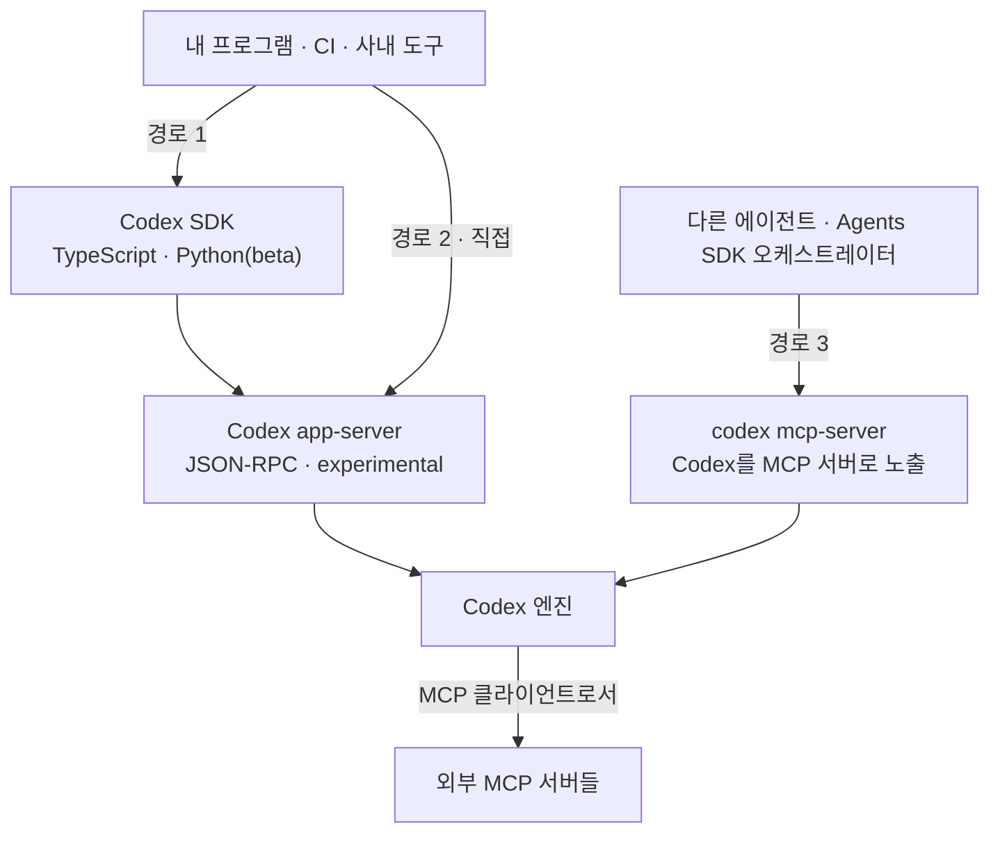

# 11장. 내 손 밖으로 — SDK·app-server·MCP, 그리고 조직이 개인을 이기는 지점

Codex를 내가 여는 창이 아니라 **내 프로그램이 부르는 부품**으로 만들 수 있을까?

답부터 말하면 된다. 세 가지 경로가 문서에 열려 있고, 어느 것을 고를지도 문서가 직접 알려준다. 그런데 이 장에는 방향이 반대인 이야기가 하나 더 붙는다. 내가 Codex를 남의 프로그램에 끼우는 이야기가 앞이라면, 뒤는 **남의 정책이 내 설정을 덮는 이야기**다. 조직 워크스페이스에 계정이 들어간 순간부터 지금까지 쌓아온 설정 중 일부는 더 이상 내 것이 아니게 된다.

두 이야기는 방향만 반대일 뿐 같은 축이다. **내 손 밖에서 내 환경이 결정된다.** 앞쪽은 내가 그렇게 만드는 것이고, 뒤쪽은 그렇게 되는 것이다. 그리고 뒤쪽에서 우리가 던질 질문은 하나다. **내 설정이 왜 안 먹히는가.** 이 책의 독자는 관리자가 아니므로 "관리자가 무엇을 정할 수 있는가"는 우리 질문이 아니다.

## SDK는 app-server의 얇은 래퍼다

먼저 지형부터 정리하자. Codex를 코드에서 부르는 경로는 셋이고, 셋은 층이 다르다.

`/codex/codex-sdk`는 TypeScript와 Python 라이브러리를 제공한다. TypeScript는 `npm install @openai/codex-sdk`, Python은 `pip install openai-codex`로 설치하며 Node.js 18 이상, Python 3.10 이상을 요구한다. 코드는 짧다.

```typescript
import { Codex } from "@openai/codex-sdk";

const codex = new Codex();
const thread = codex.startThread();
const result = await thread.run(
  "Make a plan to diagnose and fix the CI failures"
);

console.log(result.finalResponse);
```

스레드를 만들고 돌리고 응답을 받는다. 이어서 같은 스레드에 `thread.run("Implement the plan")`을 부르거나, 스레드 ID로 `codex.resumeThread(threadId)` 해서 나중에 재개할 수도 있다. 2장에서 본 chat 개념이 그대로 객체가 된 모양이다.

그런데 이 SDK가 실제로 무엇을 하는지가 흥미롭다. 문서가 한 문장으로 밝힌다.

> "The Python SDK controls the local Codex app-server over JSON-RPC."

**SDK는 로컬 app-server를 JSON-RPC로 조종한다.** 임포트 흐름을 따라가며 이미 만난 그 프로토콜 위에 얹힌 얇은 층이라는 뜻이다. 그때 `externalAgentConfig/detect`와 `externalAgentConfig/import`를 봤는데, 그 메서드들이 사는 곳이 바로 여기다. 데스크톱 앱의 임포트 버튼도, SDK의 `thread.run()`도 결국 같은 프로토콜을 두드린다.

이 사실이 실무에서 갖는 의미가 둘이다. 첫째, SDK로 안 되는 일은 app-server를 직접 열면 대개 된다. SDK가 감싸지 않은 메서드가 프로토콜에는 있기 때문이다. 둘째, 반대로 app-server의 불안정성은 SDK로도 그대로 전달된다. 앞서 봤듯 `codex app-server`는 실험적 등급이고 문서가 예고 없이 바뀔 수 있다고 적어뒀다. 그 위에 얹힌 SDK도 같은 바람을 맞는다.

Python SDK 쪽에는 조건이 하나 더 붙는다. 2026-08-02 문서 기준으로 beta다. 설치 규칙도 그래서 조금 헷갈리게 적혀 있다.

> "While the Python SDK is in beta, `pip install openai-codex` selects the latest published beta build. After a stable SDK release exists, use `pip install --pre openai-codex` to opt in to newer prerelease builds."

베타인 동안에는 그냥 설치해도 베타 빌드가 잡히고, 안정판이 나온 뒤에 프리릴리스를 원하면 그때 `--pre`를 쓰라는 것이다. 지금 `--pre`를 붙일 이유는 없다.

app-server를 직접 열 생각이라면 두 가지를 미리 알아두면 좋다. 첫째, 이 프로토콜은 스레드·턴·아이템 세 층으로 대화를 모델링한다. 스레드를 시작하거나 재개하고, 그 안에서 턴을 돌리고, 턴이 아이템을 만든다. SDK가 노출하는 `startThread`·`run`·`resumeThread`가 이 층에 그대로 대응하므로, SDK를 먼저 익히면 프로토콜이 낯설지 않다.

둘째, 안정 표면과 실험 표면이 명시적으로 갈라져 있다. 초기화할 때 `experimentalApi` 능력을 켜야만 열리는 메서드와 필드가 따로 있고, 켜지 않으면 서버가 실험 메서드를 거절한다. 문서의 표현은 이렇다 — "Some app-server methods and fields are intentionally gated behind `experimentalApi` capability." 자동화를 오래 굴릴 생각이라면 이 스위치를 끈 채로 설계하는 쪽이 안전하다. 켜야만 되는 기능이 있다면, 그 기능이 예고 없이 바뀔 수 있다는 뜻이기도 하다.

세 번째 경로가 MCP다. 그리고 이 경로는 방향이 둘이다. Codex가 MCP 클라이언트가 되어 남의 서버를 부르는 방향과, Codex 자신이 MCP 서버가 되어 남에게 불리는 방향.


그림 1. Codex를 부르는 세 경로 — SDK는 app-server 위에 얹히고, `mcp-server`는 반대 방향의 입구다

## 문서가 고르는 법을 알려준다

세 경로 중 무엇을 쓸지 고민할 필요가 별로 없다. 문서가 결정 규칙을 한 문장으로 준다.

> "Use the Codex SDK for coding-focused Codex threads. If Codex is one specialist inside a broader orchestrated workflow, run Codex CLI as an MCP server and orchestrate it with the Agents SDK."

코딩 중심의 Codex 스레드면 SDK, Codex가 더 큰 오케스트레이션 워크플로 안의 **한 전문가**라면 CLI를 MCP 서버로 띄우고 Agents SDK로 지휘하라. 기준이 "무엇을 시키느냐"보다 "Codex가 그 시스템에서 어떤 지위냐"에 걸려 있다는 점이 좋다. Codex가 주인공이면 SDK, 조연이면 MCP다.

SDK를 쓸 자리로 문서가 드는 예는 CI/CD 파이프라인 통합, 복잡한 엔지니어링 작업을 부리는 에이전트 구축, 사내 도구·워크플로 임베드, 커스텀 애플리케이션 편입이다. `codex exec`가 "명령줄에서 한 번 돌리는" 자리였다면, SDK는 그 호출을 프로그램의 제어 흐름 안에 넣는 자리다. 샌드박스도 코드에서 지정한다 — `Sandbox.read_only`, `Sandbox.workspace_write`, `Sandbox.full_access` 셋이고, 생략하면 app-server의 설정 기본값을 따른다. 5장에서 세운 축이 코드에서도 그대로 살아 있다는 뜻이다.

그리고 반대 방향, 이 장에서 가장 눈길이 가는 명령이 하나 있다.

```bash
codex mcp-server
```

문서의 설명은 이렇다 — "Run Codex itself as an MCP server over stdio. Useful when another agent consumes Codex." 다른 에이전트가 Codex를 소비할 때 유용하다는 것이다. 노출되는 도구는 정확히 둘이다. `codex`(대화 시작)와 `codex-reply`(대화 이어가기). `tools/list`로 확인할 수 있고, 붙기 전에 점검하려면 인스펙터를 쓴다.

```bash
npx @modelcontextprotocol/inspector codex mcp-server
```

`codex` 도구가 받는 파라미터에는 `prompt`(필수) 외에 `approval-policy`, `model`, `cwd`, `config`, `base-instructions`, `developer-instructions` 같은 것들이 있다. 즉 **부르는 쪽이 승인 정책과 모델과 작업 디렉터리를 지정한다.** 우리가 손으로 고르던 축이 여기서는 호출자의 인자가 된다.

이 한 명령의 함의가 작지 않다. MCP는 벤더 중립 프로토콜이므로, **MCP 클라이언트인 다른 에이전트가 Codex를 도구로 부르는 구성이 문서상 가능하다.** 10장에서 `codex-security` 계열이 스스로를 MCP 서버로 등록하고 스킬을 동기화한다는 것을 봤는데, 같은 설계가 Codex 본체에도 적용돼 있는 셈이다. 이 책의 마지막 장이 "둘 중 하나를 고르라"로 끝나지 않는 기술적 근거가 여기 있다. 두 하네스를 나란히 쓰는 것과 하나를 다른 하나의 부품으로 쓰는 것은 다른 이야기이고, 후자의 문이 열려 있다.

## MCP를 옮기면 컨텍스트부터 줄어든다

이제 반대 방향, Codex가 클라이언트인 경우다. 서버 목록만 옮기면 끝나는 일일까? 설정 이식 자체는 임포트가 다뤘다. `MCP_SERVER_CONFIG`가 항목으로 들어 있으니 서버 목록은 그대로 넘어온다. 문제는 그다음이다.

문법부터 보자. `config.toml`의 `[mcp_servers.<name>]` 아래에 STDIO 서버면 `command`와 `args`를, HTTP 서버면 `url`을 둔다. 인증은 베어러 토큰(`bearer_token_env_var`), 정적 헤더(`http_headers`), 환경 변수 기반 헤더(`env_http_headers`), OAuth 중에 고른다. 눈여겨볼 옵션은 타임아웃과 도구 통제 쪽이다. `startup_timeout_sec`은 기본 `10`초, `tool_timeout_sec`은 기본 `60`초다. `enabled_tools`로 허용 목록을, `disabled_tools`로 거부 목록을 걸 수 있고 거부가 나중에 적용된다. `default_tools_approval_mode`에는 `auto`·`prompt`·`writes`·`approve`가 있는데, `writes`는 읽기 전용으로 표시되지 않은 도구에만 승인을 묻는다. 승인 축이 MCP 층에도 따로 하나 더 있는 셈이다.

여기까지는 옮기면 되는 일이다. 그런데 커뮤니티가 보고한 진짜 함정은 그다음에 있었다.

buildxjordan은 r/codex에 2026-02-11에 MCP 서버 8개를 그대로 옮겼더니 **세션이 컨텍스트 90~91%에서 시작**하더라고 적었다. 도구 정의가 세션 시작부터 상주하기 때문이다. 같은 보고에서 `[features] search_tool = true`로 바꾸자 99%까지 회복됐다고 덧붙였다. 옮긴 직후에 할 일이 여기서 나온다 — **붙여둔 서버 목록을 세어보는 것이 첫 점검이다.** 여덟 개가 다 지금 필요한지, 지난달 실험하다 남긴 것이 섞여 있지는 않은지부터 확인하자.

같은 서브레딧의 ChoasMaster777은 2026-03-19에 선언되지 않은 MCP가 `rg`로 폴백하면서 메모리를 100GB까지 먹었다고 보고했다. 설정에서 지웠다고 생각한 서버가 실제로는 어딘가에 남아 다른 경로로 동작한 경우다. 그러니 메모리나 디스크가 이상하게 튀면 **선언되지 않은 서버가 남아 있는지부터 본다.** 4장에서 본 대로 유효 설정과 그 출처를 함께 찍어보면 어느 파일이 그 서버를 들고 있는지 드러난다.

역시 같은 서브레딧에서 tokovar는 2026-07-13에 상주 MCP 서버 하나가 Sol을 세 시간 멈춰 세웠다며 자기 진단 프롬프트를 공개했다. 이런 멈춤은 원인이 하나로 좁혀지지 않아 재현이 어렵다. **멈춤이 반복되면 상주 서버를 하나씩 내려보는 이분 탐색이 가장 빠르다.** 앞에서 본 `enabled = false`가 지우지 않고 끄는 스위치라, 이 탐색에 쓰기 좋게 만들어져 있다.

세 보고 전부 커뮤니티 관측이고 공식 문서가 인정한 동작은 아니다. 다만 세 보고가 가리키는 방향이 같다 — **MCP는 붙이는 순간이 아니라 붙여둔 동안 비용을 낸다.**

경로 문제도 하나 걸려 있다. WSL 환경에서 Windows 쪽 `config.toml`이 쓰이면서 "MCP etc. not being configured correctly"가 된다는 보고다([#13762](https://github.com/openai/codex/issues/13762), 👍 55, open). 설정이 안 먹는 것처럼 보이는데 원인은 어느 파일을 읽었느냐에 있다. 4장에서 `/debug-config`로 레이어를 확인하라고 했던 이유가 이런 자리다.

그리고 이 절에서 컨텍스트 예산 이야기가 끝난다. 6장에서 스킬 메타데이터가 컨텍스트의 2%를 차지하도록 하드코딩돼 있다는 것을 봤고, 뒤이어 그 백분율의 분모조차 광고값과 실측이 갈린다는 보고를 봤다. 그리고 여기서 MCP 서버 몇 개가 세션 시작부터 90%대를 차지한다. 세 이야기를 겹쳐 놓으면 결론이 하나로 모인다. **컨텍스트는 내가 쓰기 전에 이미 상당 부분 예약돼 있고, 그 예약을 하는 것은 내가 붙여둔 것들이다.** 스킬 설명문을 다이어트하고, 안 쓰는 MCP 서버를 `enabled = false`로 내리고, 도구 목록을 허용 목록으로 좁히는 일이 곧 예산 관리인 이유다.

## 내 설정이 왜 안 먹히는가 — 조직이 개인을 이기는 네 지점

여기서 이야기의 방향이 바뀐다. 지금까지는 내가 Codex를 어딘가에 끼우는 이야기였다. 이제부터는 내 계정이 조직 워크스페이스 안에 있을 때, 내가 지금까지 세운 설정 중 무엇이 무력화되는가를 본다.

먼저 큰 그림 하나. `/codex/enterprise/roles-and-workspace-permissions`가 통제 경계를 여러 겹으로 나누고, 그중 하나를 통과했다고 다른 경계가 열리지는 않는다고 못 박는다.

> "A request must pass every boundary that applies to it. For example, workspace access can make a plugin available, but the connected service still decides which data the signed-in account can read. A local permission profile can restrict a run in a supported local client, but it can't grant a workspace feature or model."

로컬 권한 프로필은 실행을 제한할 수는 있어도 워크스페이스 기능이나 모델을 부여하지는 못한다. 방향이 한쪽이다. 내 설정은 나를 더 좁힐 수만 있고, 조직이 닫아둔 것을 열지는 못한다. 이 비대칭을 알고 나면 아래 네 지점이 왜 전부 한 방향으로 작동하는지 이해된다.

**첫째, 관리형 설정이 내 `config.toml`을 이긴다.** `/codex/enterprise/managed-configuration`이 두 종류를 구분한다.

> "Requirements: admin-enforced constraints that users can't override."
> "Managed defaults: starting values applied when a supported client launches. Users can still change settings during a run; the client reapplies managed defaults the next time it starts."

요구사항은 내가 덮을 수 없고, 관리형 기본값은 세션 중에 바꿔도 다음 실행에서 되돌아온다. 무엇을 강제할 수 있는지도 원문이 열거한다 — 승인 정책, 승인 리뷰어, 자동 리뷰 정책, 샌드박스 모드, 권한 프로필, 웹 검색 모드, 관리형 훅, 어떤 MCP 서버를 켤 수 있는지, 어떤 플러그인 마켓플레이스 소스를 추가·설치·갱신할 수 있는지. 4·5·6장에서 우리가 손으로 세운 것들이 거의 그대로 목록에 있다.

충돌하면 어떻게 될까? 조용히 무시되지는 않는다.

> "When resolving configuration (for example from `config.toml`, profile files, or CLI config overrides), if a value conflicts with an enforced rule, the local client falls back to a compatible value and notifies the user."

호환되는 값으로 폴백하고 사용자에게 알린다. 그러니 "왜 내 설정과 다르게 동작하지"의 첫 확인처는 4장에서 배운 `/debug-config`다. 정책의 출처까지 함께 찍히기 때문이다. 거기서 세운 3계층이 여기서 한 층 더 얹혀 넷이 된다고 보면 된다.

관리형 요구사항이 실리는 위치도 여럿이다. 시스템 `requirements.toml`(Unix는 `/etc/codex/requirements.toml`, Windows는 `%ProgramData%\OpenAI\Codex\requirements.toml`), 클라우드 설정 번들, 재해석되는 레거시 필드, 그리고 macOS MDM의 `com.openai.codex:requirements_toml_base64`. 개인 개발자에게 중요한 것은 목록 자체보다 **내 눈에 안 보이는 곳에서 설정이 내려온다는 사실**이다. 클라우드 번들은 특히 그렇다 — 요청이 실패하고 유효한 캐시도 없으면 클라이언트는 조용히 시작하지 않고 오류를 낸다고 문서가 적어뒀다.

**둘째, `allowed_permission_profiles`가 내 권한 프로필을 제한한다.** 5장에서 우리는 권한 프로필이 Beta이고, 구 설정이 어디엔가 있으면 구 체계가 이긴다는 폴백 규칙을 봤다. 그리고 그 규칙에 **유일한 예외가 조직 설정**이라는 것도 그때 확인했다. 관리자가 프로필 허용 목록을 내려보내면 프로필 쪽이 강제된다. 버전 조건이 붙는다.

> "Permission-profile allowlists require Codex 0.138.0 or later. Codex 0.137.0 and earlier ignore `allowed_permission_profiles` and managed `default_permissions`."

`0.137.0` 이하는 이 설정을 무시한다. 조직이 정책을 내려보냈는데 내 클라이언트가 구버전이면 정책이 적용되지 않는다는 뜻이고, 이건 **양쪽이 서로 다른 규칙으로 도는 상황**이다. 개인에게 유리할 것도 없다. 팀 전체가 같은 버전선을 넘기 전까지 관리자가 `allowed_sandbox_modes` 같은 구 체계 제약을 임시 호환 장치로 남겨두는 이유도 여기 있다.

허용 목록의 성격도 알아둘 만하다. 이 키가 존재하면 그것이 허용 프로필의 완전한 목록이 되고, `true`로 적힌 것만 허용된다. 생략되거나 `false`인 것은 거부이며 앞으로 추가될 내장 프로필까지 포함해서 거부다. 화이트리스트 방식이라는 뜻이다.

**셋째, 워크스페이스 모델 가용성이 내 모델 목록을 줄인다.** 8장에서 우리는 표면별 가용성과 크레딧 요율을 보고 작업 유형별 모델 선택 가이드까지 만들었다. 그 설계 전체가 조직 정책 아래에서는 한 겹 더 걸린다. 목록에 없는 모델은 고를 수 없고, **내 설정이 멀쩡한데 특정 모델이 안 보인다면 이쪽을 의심할 자리**다. 크레딧 요율을 아무리 잘 계산해둬도, 그 계산의 전제인 후보 목록을 내가 정하지 못하는 상황이 생긴다는 뜻이다.

**넷째, access token 만료가 내 자동화를 끊는다.** 앞서 비대화형 실행을 다루며 CI에 Codex를 태우는 이야기를 했다. 그 인증을 access token으로 한다면 조건이 두 겹 붙는다. 하나는 플랜이고 하나는 시간이다. `/codex/enterprise/access-tokens`는 지원 범위를 이렇게 적는다.

> "Codex access tokens are currently supported for ChatGPT Business and Enterprise workspaces."

그리고 만료가 있다. 커스텀 만료의 최단은 하루이고, 문서는 7·30·60·90일 같은 유한 만료를 권한다. 만료 없음을 고르면 정기적으로 교체하라고 덧붙인다. 관리자 쪽에는 Access token expiration limit이라는 상한 설정이 따로 있고, 그 상한은 새로 만드는 토큰에만 적용되며 기존 토큰은 자기 만료를 유지한다. 그러니 어느 날 야간 파이프라인이 인증 오류로 멈췄다면, 조직이 상한을 조인 뒤 내가 토큰을 재발급한 시점을 의심해볼 만하다.

| 지점 | 조직이 설정하는 것 | 내 어느 설정을 덮는가 | 관련 장 | 최소 버전 요구 |
|---|---|---|---|---|
| 관리형 설정 | `requirements.toml`의 요구사항과 관리형 기본값 | `config.toml`·프로필 파일·CLI `-c` 오버라이드 | 4장 | — |
| 권한 프로필 허용 목록 | `allowed_permission_profiles`·관리형 `default_permissions` | 내가 정의한 권한 프로필과 기본 프로필 선택 | 5장 | Codex `0.138.0` 이상(이하 버전은 무시) |
| 워크스페이스 모델 가용성 | 워크스페이스에서 고를 수 있는 모델 목록 | 8장에서 세운 모델·비용 설계 | 8장 | — |
| access token 정책 | 발급 허용 여부와 만료 상한 | 비대화형·CI 자동화의 인증 수명 | 9장 | Business·Enterprise 워크스페이스 |

표 1. 조직이 개인을 이기는 네 지점 (2026-08-02 문서 기준)

네 지점의 공통점이 보인다. 전부 **내가 손댈 수 없는 층에서 내려와, 내가 이미 세운 설정을 덮는다.** 그리고 전부 조용하지 않다 — 폴백은 알림을 주고, 모델은 목록에서 사라지고, 토큰은 오류를 낸다. 문제는 그 신호를 어디서 봐야 하는지 모르면 원인을 엉뚱한 데서 찾게 된다는 것이다. 그래서 이 절의 실용적 결론은 짧다. **조직 계정에서 설정이 이상하면, 내 파일을 고치기 전에 유효 설정과 그 출처부터 확인하자.**

## 관리자에게 무엇을 물어야 하는가

그렇다면 이 네 가지를 확인하려면 어느 문서를 열어야 할까? 관리 관련 문서가 열일곱 개쯤 되는데, 개인 개발자가 그걸 다 읽을 이유는 없다. 필요한 것은 어떤 문제가 생겼을 때 누구에게 무엇을 물어야 하는지의 지도다.

한 가지를 미리 알리고 표를 보자. 아래 표의 오른쪽 열에 "위임"이 자주 등장한다. 게으른 정리로 읽으면 곤란하다. 문서의 실제 상태다. OpenAI 문서 여러 편이 구체 목록과 스키마를 자기 페이지에 두지 않고 Help Center나 인증이 필요한 레퍼런스로 넘긴다. 그 사실을 감추고 그럴듯한 값을 채워 넣는 쪽이 훨씬 나쁘다.

| 문서 | 무엇을 정하는가 | 개인 개발자에게 미치는 영향 | 문서가 위임하는 것 |
|---|---|---|---|
| 관리 개요(`administration`) | 관리 영역의 지도 | 어디서부터 물어야 할지의 출발점 | — |
| 관리자 롤아웃 가이드(`admin-setup`) | 도입 단계와 순서 | 우리 조직이 어느 단계인지 짐작 | — |
| Work 관리자 FAQ(`work-admin-faq`) | 내장 역할 Owner·Admin·Member | 내 계정이 무엇을 할 수 있는지의 뼈대 | 나머지 역할·권한 목록 → Help Center |
| 역할·워크스페이스 권한 | 통제 경계의 정전 지도 | "왜 이건 되고 저건 안 되나"의 개념 틀 | 현재 권한 목록·설정 절차 → Help Center |
| 그룹·프로비저닝 | 계정이 어떻게 만들어지고 묶이는가 | 내 그룹이 내 권한을 좌우한다 | — |
| 관리형 설정(`managed-configuration`) | 요구사항·관리형 기본값 | **네 지점 중 첫째** — 내 `config.toml`을 덮는다 | — |
| 워크스페이스 모델 가용성 | 고를 수 있는 모델 목록 | **네 지점 중 셋째** — 8장 설계에 걸린다 | — |
| access tokens | 발급 허용·만료 상한 | **네 지점 중 넷째** — CI 인증 수명 | — |
| 플러그인 통제(`apps-and-connectors`) | 설치 가능한 플러그인·커넥터 | 6장에서 옮긴 확장 자산이 막힐 수 있다 | 연결된 서비스의 권한 → 해당 서비스 |
| 스킬 통제(`enterprise/skills`) | 조직 배포 스킬 | 내 스킬과 조직 스킬이 함께 로드된다 | — |
| 거버넌스 | 정책·감사 방향 | 로그가 어디까지 남는지의 근거 | — |
| 워크스페이스 분석 | 사용량 집계 화면 | 내 사용량이 집계된다는 사실 | — |
| Analytics API · Compliance API | 사용량·감사 이벤트의 프로그래밍 접근 | 직접 쓸 일은 드물다 | 엔드포인트·스키마 → 인증된 레퍼런스 |
| HIPAA 구성 가이드 | 규제 환경의 로컬 구성 | 해당 조직이면 설정이 크게 좁아진다 | — |
| Windows 앱 배포 | 조직 배포 방식 | 내 설치본이 관리 배포본일 수 있다 | — |

표 2. 관리 문서 지도 — 개인 개발자 관점 (2026-08-02 문서 기준)

표에서 세 가지를 읽어두자.

첫째, **확정할 수 있는 내장 역할은 Owner·Admin·Member 셋뿐이다.** 역할·권한 문서가 그 이상을 자기 페이지에 두지 않고 명시적으로 위임한다 — "Because available seats, roles, and permissions change with product and plan updates, use the Help Center for the current permission list and setup procedure." 제품과 플랜이 바뀌면 목록도 바뀌기 때문이다. 그러니 이 책도 셋까지만 적는다.

둘째, **Analytics API와 Compliance API는 엔드포인트가 공개 문서에 없다.** 두 페이지 모두 계약을 자기 페이지에서 복제하지 않는다고 밝히고 인증된 레퍼런스로 넘긴다. 그런 API가 존재한다는 사실까지가 공개 정보다.

표에서 개인 개발자가 실제로 부딪힐 자리를 둘만 더 짚자. 조직 스킬 배포는 6장에서 옮긴 확장 자산과 같은 층에서 만난다. 내가 넣은 스킬과 조직이 배포한 스킬이 함께 로드되므로, 그때 본 스킬 메타데이터 예산도 나 혼자 관리하는 값이 아니게 된다. 플러그인 통제도 마찬가지다. 설치 가능한 플러그인과 커넥터가 목록으로 제한될 수 있고, 그 목록을 통과하더라도 연결된 서비스가 다시 자기 권한으로 데이터를 가른다. 앞 절에서 본 "모든 경계를 통과해야 한다"는 원칙이 여기서 구체적인 실패로 나타난다 — 플러그인은 설치됐는데 정작 데이터를 못 읽는 상황이 그것이다.

셋째, 위임되지 않은 항목들을 보면 공통점이 있다. 내 클라이언트의 런타임 동작을 실제로 바꾸는 것들이다. 관리형 설정, 모델 가용성, 토큰 정책, 플러그인 통제. 조직 구조에 관한 것은 Help Center로 가고, 내 노트북에서 벌어지는 일은 문서에 남아 있다. 개인 개발자에게는 다행스러운 배분이다.

그래서 관리자에게 물을 것도 네 가지로 줄어든다. 우리 워크스페이스에 관리형 요구사항이 걸려 있는지, 권한 프로필 허용 목록을 쓰는지(쓴다면 클라이언트 최소 버전은 무엇인지), 모델 목록이 제한돼 있는지, access token 발급이 허용되고 만료 상한이 얼마인지. 이 넷이면 앞 절의 네 지점을 그대로 덮는다.

## 인용 하나에 조건 셋을 붙여야 하는 문서

관리 문서 옆에는 성격이 다른 문서가 하나 더 있다. `/codex/guides/build-ai-native-engineering-team`은 설정도 API도 아니고 일하는 방식에 관한 글이다. 개인 개발자가 팀을 설계할 일은 없더라도, 이 문서가 제시하는 프레임 하나는 가져갈 만하다.

문서는 개발 주기의 각 단계마다 무엇을 위임하고(Delegate), 무엇을 검토하고(Review), 무엇을 소유할지(Own) 나눈다. 앞서 우리는 어떤 작업을 클라우드에 보낼지 저울질했는데, 그 저울질을 단계 단위로 올린 셈이다. 그리고 문서가 그 이동을 이렇게 요약한다.

> "In practice, this shifts much of the mechanical 'build work' from engineers to agents. The agent becomes the first-pass implementer; the engineer becomes the reviewer, editor, and source of direction."

에이전트가 1차 구현자가 되고 엔지니어가 리뷰어이자 편집자이자 방향의 출처가 된다는 것이다. 리뷰를 다루며 봤던 관점과 정확히 맞물린다. 다만 문서는 곧바로 선을 긋는다.

> "True ownership of code—especially for new or ambiguous problems—still rests with engineers, and certain challenges exceed the capabilities of current models."

코드의 진짜 소유는, 특히 새롭거나 모호한 문제에서는, 여전히 엔지니어에게 있다.

같은 문서에서 하나만 더 가져오자. 이 가이드가 내놓는 관점 중 개인 작업에도 곧바로 쓸 수 있는 것이 있다.

> "as agents remove barriers to generating code, tests serve a more and more important function as a source of truth for application functionality. Since agents can run the test suite and iterate based on the output, defining high quality tests is often the first step to allowing an agent to build a feature."

에이전트가 코드 생성의 장벽을 없앨수록 **테스트가 기능의 진실을 정의하는 자리**로 올라온다는 것이다. 에이전트가 테스트를 돌리고 그 출력으로 스스로를 고칠 수 있기 때문에, 좋은 테스트를 먼저 정의하는 것이 기능을 맡기는 첫 단계가 된다. 프롬프트에 "무엇이 완료인지" 적으라고 했던 조언의 코드판이라고 봐도 좋다. 완료 조건을 산문으로 적는 대신 실행 가능한 형태로 적어두면, 에이전트가 그것을 읽고 자기 결과를 검증한다.

여기까지는 인용해도 좋다. 문제는 이 문서에 실린 수치들이다. 조건 없이 옮기면 틀린 인용이 되므로 하나씩 짚어두자.

첫째, "모델이 2시간 17분 동안 연속 작업을 약 50% 신뢰도로 해낸다"는 수치가 나온다. 이건 **OpenAI의 측정이 아니라 METR의 연구 결과**이고, 원문이 스스로 2025년 8월 기준이라고 못 박는다. 지금 시점에서는 한 해가 지난 값이다. 게다가 같은 문단이 "과제 길이가 약 7개월마다 배증한다"고 덧붙이는데, 그 배증률로 오늘 값을 계산해내는 것은 문서에 없는 산수다. 그런 외삽은 하지 말자.

둘째, "개발자가 코드 리뷰에 주당 평균 2~5시간을 쓴다"는 수치도 있다. 이쪽은 사정이 더 단순하다. **출처가 표기돼 있지 않다.** 그러니 이 책은 이 값을 사실로 쓰지 않고, 이 가이드의 주장으로만 옮긴다.

셋째, "몇 주 걸리던 일이 며칠 만에 나온다"는 서술은 OpenAI 자신의 주장이다. 벤더 자체 보고를 다루며 세운 태도를 여기서도 적용하면 된다. 방향의 참고로는 쓰되 측정치로는 쓰지 않는다.

정리하면 이 문서는 **관점을 빌리기에는 좋고 수치를 빌리기에는 나쁘다.** 이런 구분이 필요한 문서를 만났을 때 쓸 수 있는 기준이 하나 있다. 문서가 자기 수치의 출처와 시점을 함께 적었는가. 적었다면 그대로 옮기고, 안 적었다면 "이 문서의 주장"으로 옮기자. 이 장에서 우리가 관리 문서를 다룰 때 "위임"을 정직하게 표기한 것과 같은 원칙이다.

## 더 읽을 곳

마지막으로 자료 경로만 짧게 남긴다. `/codex/developers`가 개발자용 기능의 목차 역할을 하는데, 이 페이지의 묶음 방식 자체가 한 번 볼 만하다. 개발 워크플로(코드 리뷰·통합 터미널), 확장과 자동화(스킬·플러그인·훅), 환경(로컬·클라우드·Git worktree), Codex로 만들기(SDK·App Server·MCP 서버·GitHub Action·비대화형 모드), 서드파티 통합(GitHub·Slack·Linear), 그리고 레퍼런스로 나뉜다.

이 여섯 묶음이 이 책이 지나온 순서와 꽤 겹친다. 우리는 지침과 설정에서 시작해 권한과 확장을 거쳐 운용과 위임으로 왔고, 지금 마지막 묶음인 "Codex로 만들기"에 와 있다. 그러니 어느 장을 다시 펼칠지 정할 때 이 목차를 역방향 색인처럼 쓸 수 있다. 문서의 한 카드에서 막히면 그 주제를 다룬 이 책의 장으로 돌아오고, 반대로 이 책이 압축한 부분이 아쉬우면 그 카드를 열면 된다.

그 밖에 사용 사례와 컬렉션, 리소스, 비디오 페이지가 따로 있다. 다만 이쪽은 동적으로 갱신되는 목록 페이지다. 항목 이름과 주소, 날짜는 신뢰할 수 있지만 **개수를 세어 외우는 것은 의미가 없다.** 오늘 몇 개인지가 다음 주에 달라지기 때문이다. 이 책이 여러 번 반복한 태도를 마지막으로 한 번 더 적용하자. 목록은 열어서 보고, 종이에는 열어야 할 자리만 적어둔다.

## 세 갈래 앞에서

이 장은 두 방향을 함께 봤다. 내가 Codex를 부품으로 만드는 방향과, 조직이 내 설정을 덮는 방향. 마지막으로 남는 것은 선택이다. 상황에 따라 갈림길이 셋으로 갈린다.

**Codex가 내 시스템의 주인공이라면 SDK다.** 코딩 스레드를 프로그램의 제어 흐름 안에 넣고, 스레드를 재개하고, 샌드박스를 코드에서 지정한다. TypeScript는 안정적으로 쓸 수 있고 Python은 아직 beta라는 조건만 계산에 넣자. SDK가 감싸지 않은 기능이 필요해지는 날에는 그 아래의 app-server가 기다리고 있다 — 다만 실험적 등급이라는 값을 함께 치러야 한다.

**Codex가 더 큰 워크플로의 한 전문가라면 MCP다.** `codex mcp-server`로 띄우고 오케스트레이터가 `codex`·`codex-reply` 두 도구를 부른다. 이 경로를 고르면 승인 정책과 모델을 호출자가 넘기게 되므로, 앞서 세운 기준이 사람의 손을 떠나 코드에 박힌다. 좋은 일이다. 다만 그 코드가 곧 정책이 되므로 리뷰 대상도 된다.

**세 번째 갈림길은 성격이 다르다.** 내 계정이 조직 워크스페이스 안에 있다면, 위의 두 선택 위에 조직의 네 지점이 얹힌다. 관리형 설정이 내 파일을 덮고, 허용 목록이 내 프로필을 좁히고, 모델 목록이 줄고, 토큰에 수명이 붙는다. 이 경우에 필요한 것은 더 나은 설정이 아니라 **더 나은 질문**이다. 앞 절의 네 가지를 관리자에게 묻고, 답을 받은 뒤에 내 설정을 세우자. 순서를 바꾸면 같은 설정을 두 번 쓰게 된다.

어느 갈래를 고르든 공통으로 남는 것이 하나 있다. 내 환경의 일부는 이제 내 손 밖에 있다. 그 사실을 알고 설계하는 것과 모르고 부딪히는 것의 차이가, 이 장이 실제로 다룬 내용이다.
