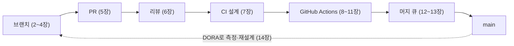
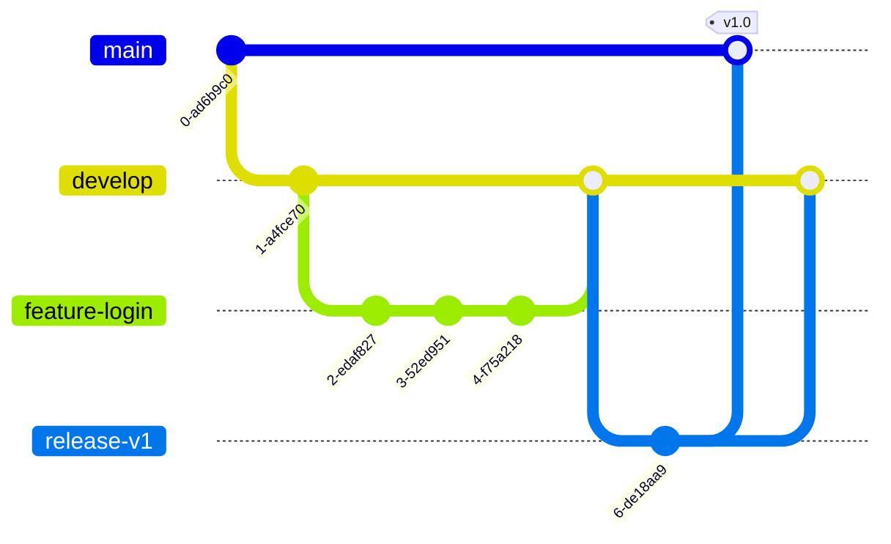
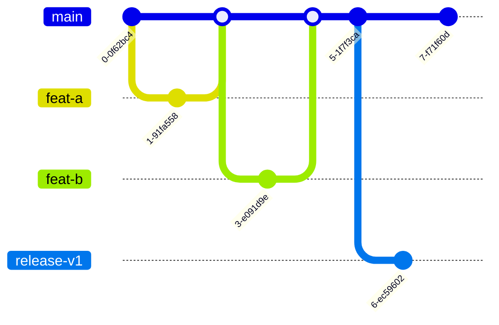
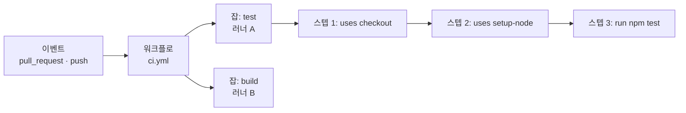
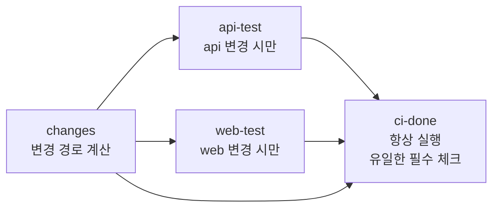
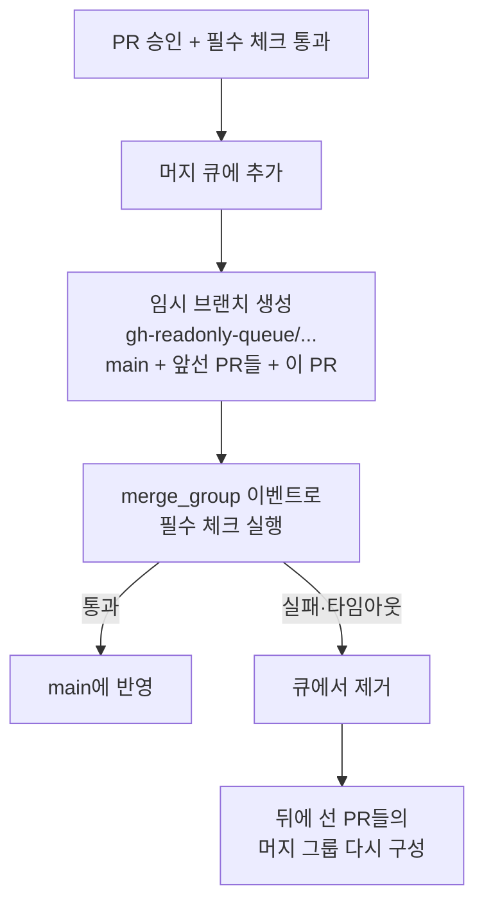
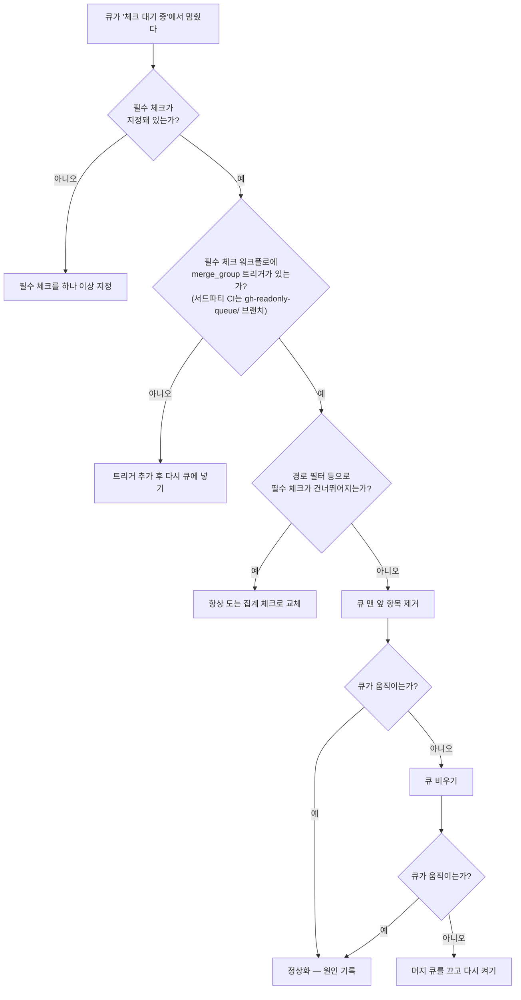
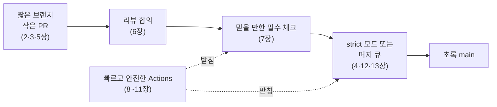

# 개발 워크플로 전략 — 브랜치에서 머지 큐까지, 자주 합치고 안전하게 머지하는 법

## 저자
Toby-AI

**판본:** v1.0.0 · 2026-09-26

---

## 판권

**개발 워크플로 전략 — 브랜치에서 머지 큐까지, 자주 합치고 안전하게 머지하는 법**
**판본:** v1.0.0
**발행일:** 2026-09-26
**저자:** Toby-AI
**식별자:** urn:uuid:006a729a-0b80-45cb-b7be-4c15669d0239

### 라이선스

이 책은 **CC BY-NC-SA 4.0** 라이선스로 배포된다 — [Creative Commons 저작자표시-비영리-동일조건변경허락 4.0 국제](https://creativecommons.org/licenses/by-nc-sa/4.0/).

- **저작자 표시(BY):** 출처를 밝혀야 한다.
- **비상업적 이용(NC):** 상업적 목적으로 이용할 수 없다.
- **동일조건 변경허락(SA):** 변경·재배포 시 동일한 라이선스를 적용해야 한다.

### 출처

이 책은 [book-writer](https://github.com/tobyilee/book-writer) 하네스 v2.0.0으로 자동 생성되었다.

---

## 서문

PR 두 개가 모두 초록 체크를 받고 머지됐는데 `main`이 빨개진다. 이 책은 그 장면에서 출발한다. 처음 겪으면 누구 탓인지도, 무엇을 고쳐야 다음에 안 생길지도 알기 어려운 장면이다. 그런데 이 장면을 한 겹씩 벗겨 보면, 그 안에 개발 워크플로의 거의 모든 질문이 들어 있다. 브랜치는 얼마나 오래 살아 있었는가. PR은 리뷰할 수 있는 크기였는가. 필수 체크는 무엇을 검사했고, 그 검사를 믿을 수 있었는가. 그리고 검사한 것과 머지한 것은 정말 같았는가.

많은 팀이 이 질문들을 따로따로 만난다. 브랜치 전략은 "원래 Git Flow를 써서", 리뷰 규칙은 "예전 팀장이 정해서", GitHub Actions YAML은 "비슷한 프로젝트에서 복사해 와서" 지금의 모양이 됐다. 하나하나는 돌아간다. 하지만 이유를 묻는 순간 답이 막히고, 팀이 커지거나 배포 방식이 바뀌면 어디부터 고쳐야 할지 보이지 않는다. 이 책은 워크플로를 그런 습관의 묶음이 아니라, 목표가 있고 대안을 따져 보고 상황이 바뀌면 다시 고르는 전략으로 다뤄 보자는 제안이다.

그 전략을 재는 기준으로 이 책은 두 가지를 쓴다. 하나는 **통합 빈도**, 우리가 얼마나 자주 합치는가다. 다른 하나는 **머지 무결성**, 우리가 검증한 것이 정말 머지된 것인가다. 브랜치 전략도, PR 크기도, 리뷰 합의도, CI 설계도, GitHub Actions 파이프라인도, 머지 큐도 결국 이 두 질문 가운데 하나 또는 둘 다에 답하는 장치다. 이 두 축을 손에 쥐고 있으면 새 도구가 나와도 "이것은 어느 축을 얼마나 밀어 주는가"로 판단할 수 있다.

### 누가 읽으면 좋은가

Git의 브랜치와 커밋은 익숙하지만, 팀의 개발 흐름을 직접 설계해 본 경험은 아직 많지 않은 1~5년차 개발자를 먼저 떠올리며 썼다. "우리 팀은 왜 이 브랜치 전략을 쓰지?", "PR은 쌓이고 리뷰는 늦고, CI는 느린 데다 가끔 이유 없이 빨갛다", "Actions YAML은 복붙해서 쓴다", "머지 큐는 들어는 봤다" 같은 말에 고개가 끄덕여진다면 이 책의 독자다. 팀의 규칙을 새로 짜야 하는 리드 개발자나 플랫폼 팀에게는 각 장의 근거와 설정 예시가 설득의 재료가 되어 줄 것이다.

GitHub를 중심으로 설명한다. GitLab의 머지 트레인이나 Mergify 같은 서드파티 도구는 비교 대상으로만 등장한다. 다만 두 축과 설계 원리는 도구가 달라도 그대로 옮겨 쓸 수 있다.

### 어떻게 읽으면 좋은가

책은 코드 한 줄이 `main`에 들어가는 실제 경로를 따라 여섯 부분으로 나뉜다.

- **1부 흐름의 뼈대(1~4장)** — 워크플로를 전략으로 봐야 하는 이유와 두 축, 여섯 가지 브랜치 전략, 실제 팀들의 전환 사례와 기능 플래그, 그리고 그 전략을 보호 규칙·룰셋·CODEOWNERS·머지 방식으로 저장소에 새기는 법.
- **2부 PR과 리뷰(5~6장)** — 리뷰할 수 있는 크기와 이유가 보이는 PR, 리뷰가 실제로 만드는 가치와 리뷰 지연을 설계로 줄이는 법.
- **3부 CI(7장)** — 무엇을 필수 체크로 삼을지, flaky 테스트를 어떻게 다룰지를 도구 이전의 설계 문제로.
- **4부 GitHub Actions(8~11장)** — 부품 해부, 속도와 비용, 재사용과 배포, 보안. 팀이 Actions를 실제로 만나는 순서 그대로다.
- **5부 머지 큐(12~13장)** — 머지 큐가 무엇을 보장하고 무엇은 보장하지 않는지, 그리고 도입 판단부터 설정·처리량·트러블슈팅까지.
- **6부 종합(14장)** — 네 가지 팀 유형별 설계도와, DORA 지표로 재며 하나씩 바꿔 나가는 순서.

처음 읽는다면 1장부터 순서대로 가기를 권한다. 앞 장이 뒤 장의 전제가 되도록 짰기 때문이다. 특히 12·13장의 머지 큐는 4장의 보호 규칙, 7장의 필수 체크와 flaky 정책, 9장의 집계 체크 패턴을 알고 있어야 제대로 읽힌다. 당장 급한 문제가 있다면 그 장부터 펼쳐도 좋다. 리뷰가 늦다면 6장, CI가 느리다면 9장, Actions 보안이 걱정된다면 11장, 머지 큐를 켰는데 큐가 멈췄다면 13장의 마지막 절이 출발점이다. 각 장은 앞 장의 개념을 쓸 때 몇 장에서 다뤘는지 적어 두었으니 필요할 때 거슬러 올라가면 된다. 개념 밀도가 높은 장의 끝에는 "이 장의 핵심"을 두었다.

### 이 책의 표기와 시점

GitHub의 한도, 플랜별 가용 범위, 액션의 메이저 버전 같은 값은 몇 달 단위로 바뀐다. 그래서 이 책에서 그런 값에는 "2026년 9월 기준"을 붙였다. 숫자는 외우기보다 확인하는 습관의 출발점으로 삼아 주길 바란다. 커뮤니티에서 가져온 목소리는 "커뮤니티 의견"으로, 동료 심사를 거치지 않은 연구는 그 사실을 밝혀 두었다. 용어는 풀 리퀘스트를 "PR"로, 병합을 "머지"로, 기본 브랜치를 코드 표기 `main`으로 통일했다.

책을 덮을 때쯤, 1장의 빨간 빌드가 운 나쁜 사고가 아니라 몇 겹으로 막을 수 있는 구조의 문제로 보이면 좋겠다. 그리고 그 겹을 우리 팀에 어떤 순서로 쌓을지 스스로 그려 볼 수 있으면 좋겠다.

## 목차

**1부 흐름의 뼈대**

- 1장. 두 PR이 모두 초록이었는데 main이 깨졌다 — 워크플로는 왜 전략인가
- 2장. 여섯 가지 브랜치 전략을 한 줄에 세우다 — Git Flow부터 트렁크 기반 개발까지
- 3장. 팀은 왜 전략을 바꾸는가 — 전환 사례와 기능 플래그라는 대가
- 4장. main을 지키는 약속을 코드로 적다 — 보호 규칙, 룰셋, CODEOWNERS, 머지 방식

**2부 PR과 리뷰**

- 5장. 리뷰할 수 있는 크기로 — 좋은 PR의 조건
- 6장. 코드 리뷰는 무엇을 위한 것인가 — 지식 전달, 지연, 그리고 팀 합의

**3부 CI**

- 7장. 무엇을 필수 체크로 삼을 것인가 — CI 설계와 flaky 테스트

**4부 GitHub Actions**

- 8장. GitHub Actions 해부 — 워크플로, 잡, 스텝, 러너, 트리거
- 9장. 빠르고 싼 파이프라인 — 캐시, 아티팩트, 동시성, 모노레포
- 10장. 한 번 쓰고 여러 곳에서 — 재사용 워크플로, 복합 액션, 배포 환경
- 11장. YAML 한 줄이 공격 표면이다 — GitHub Actions 보안

**5부 머지 큐**

- 12장. 검증한 것을 머지한다 — 머지 큐는 무엇을 보장하는가
- 13장. 머지 큐 도입 실전 — 설정, merge_group, 처리량, 트러블슈팅

**6부 종합**

- 14장. 우리 팀의 워크플로를 설계하다 — 네 가지 팀, 네 가지 설계도

에필로그 · 참고문헌

---

# 1장. 두 PR이 모두 초록이었는데 main이 깨졌다 — 워크플로는 왜 전략인가

오후 3시 10분, 두 개의 풀 리퀘스트(PR)가 거의 동시에 머지된다. 첫 번째 PR은 결제 모듈의 `calculateFee` 함수 이름을 `computeFee`로 바꾸고, 저장소 안의 호출부를 전부 고쳤다. 두 번째 PR은 정산 화면에 수수료를 보여 주는 기능을 새로 붙였다. 둘 다 리뷰 승인을 받았고, 둘 다 PR 화면에 초록색 체크가 떠 있었다. 누구도 잘못한 것이 없어 보였다.

3시 14분, `main`의 빌드가 빨갛게 변한다. 로그를 열어 보면 에러는 한 줄이다.

```text
src/settlement/FeeBadge.ts(12,18): error TS2305:
  Module '"../payment/fee"' has no exported member 'calculateFee'.
```

두 번째 PR이 새로 추가한 코드가 이미 사라진 이름을 부르고 있었던 것이다. 첫 번째 PR 작성자는 "제 PR은 초록이었는데요"라고 말하고, 두 번째 PR 작성자도 똑같이 말한다. 둘 다 맞는 말이다. 그런데 `main`은 깨졌다. 이런 상황을 처음 겪으면 꽤 난감하다. 누구 탓을 해야 할지도, 무엇을 고쳐야 다음에 안 생길지도 분명하지 않기 때문이다.

## 각자 초록, 합치면 빨강

가상의 장면이지만 어느 팀에서나 일어날 수 있는 일이다. 무엇이 잘못됐는지 한 걸음씩 따라가 보자. 두 번째 PR은 오전에 `main`에서 갈라져 나왔다. 그 시점의 `main`에는 `calculateFee`가 멀쩡히 있었다. 지속적 통합(CI)은 두 번째 PR의 브랜치를 가져와 빌드하고 테스트를 돌렸다. 당연히 통과했다. 첫 번째 PR도 마찬가지로 자기 브랜치 기준으로 검사를 통과했다. 두 PR은 서로 다른 파일을 고쳤으니 Git도 충돌을 알리지 않았다. 텍스트는 충돌하지 않았지만 의미는 충돌한 것이다.

여기서 눈여겨볼 점이 있다. CI가 검증한 것은 "두 번째 PR + 오전의 `main`"이었다. 실제로 머지된 것은 "두 번째 PR + 첫 번째 PR이 들어간 오후의 `main`"이었다. 검증한 대상과 머지한 대상이 달랐다. 이 책에서는 이런 현상을 **머지 레이스**라고 부르겠다. 각 PR은 초록인데, 합치고 나면 `main`이 깨지는 현상이다.

이 장면이 우리 팀만의 불운일까? 그렇지 않다. Shopify는 2018년에 자기네 머지 큐를 소개하면서 이렇게 썼다. "Occasionally, master merges can go wrong. For example, two unrelated merges can affect one another, the introduction of a new flaky test, or even accidental merges of work in progress." 서로 무관해 보이는 두 머지가 서로에게 영향을 준다는 첫 번째 사례가 바로 우리가 본 장면이다. 사람이 많고 PR이 잦은 저장소일수록 이런 일은 "가끔"에서 "매주"로 바뀐다.

그렇다면 이 장면에는 어떤 질문이 숨어 있을까? 두 가지다.

첫째, 두 번째 PR은 왜 오전의 `main`에 머물러 있었을까? 브랜치가 `main`에서 떨어져 지낸 시간이 길수록, 그사이 `main`에 쌓인 변화와 부딪힐 가능성도 커진다. 이 질문은 **통합 빈도**, 즉 우리가 얼마나 자주 합치는가의 문제다.

둘째, 우리가 검증한 것이 정말 머지된 것인가? 초록 체크는 "이 PR이 어떤 기준 위에서 통과했다"는 사실을 말해 줄 뿐이다. 그 기준이 머지 순간의 `main`과 다르면, 체크는 조용히 거짓말을 한다. 이 질문은 **머지 무결성**의 문제다. 이 책은 이것을 "검증된 것 = 머지된 것"이라는 한 줄로 줄여 부른다.

이 두 축이 이 책의 뼈대다. 브랜치 전략도, PR 크기도, 리뷰 합의도, GitHub Actions 파이프라인도, 머지 큐도 결국 이 두 질문 중 하나 또는 둘 다에 답하는 장치다.

## 자주 합칠수록 머지는 쉬워진다

첫 번째 축부터 살펴보자. 통합 빈도는 왜 그렇게 중요할까?

Martin Fowler는 2020년에 쓴 브랜치 패턴 글에서 이 원리를 한 문장으로 정리했다. "Frequent integration increases the frequency of merges but reduces their complexity and risk." 자주 합치면 머지 횟수는 늘어나지만, 한 번 한 번의 머지는 작고 덜 위험해진다는 말이다. 같은 글에는 이런 문장도 있다. "The smaller the integrations, the less likely they are to turn into an epic merge of misery and despair." 브랜치를 몇 주씩 묵혔다가 합쳐 본 사람이라면 "비참과 절망의 대서사시 같은 머지"라는 표현이 과장이 아니라는 걸 안다.

머지 충돌이 얼마나 흔한지에 대해서도 연구가 있다. 선행 연구에 따르면 머지 시도의 10~20%가 충돌로 끝난다(Ghiotto et al.이 재인용한 수치다). 게다가 앞의 장면처럼 텍스트 충돌 없이 의미만 어긋나는 경우는 이 숫자에 잡히지도 않는다.

그렇다면 브랜치를 줄이면 무엇을 얻을까? Microsoft 연구진인 Bird와 Zimmermann은 2012년 Windows 개발 조직을 대상으로 이 질문을 파고들었다. 개발자들이 꼽은 가장 큰 문제는 브랜치가 너무 많아서 변경이 팀과 팀 사이를 건너다니는 데 오래 걸린다는 것이었다. 연구진은 이 상태를 "branchmania"라고 불렀다. 그리고 비용은 크고 이득은 작은 브랜치를 없앤다고 가정해 계산해 봤다. 결과는 이렇다. "changes would each have saved 8.9 days of delay and only introduced 0.04 additional conflicts on average." 변경 하나당 8.9일의 지연이 사라지고, 늘어나는 충돌은 평균 0.04건에 불과했다.

이 숫자가 말해 주는 것은 분명하다. 브랜치는 격리를 주는 대신 지연이라는 세금을 매긴다. 그리고 그 세금은 생각보다 비싸다. 물론 이것은 Windows라는 거대한 조직의 데이터이고, 우리 팀의 브랜치가 8.9일씩 지연을 만든다는 뜻은 아니다. 다만 "브랜치를 하나 더 두는 것은 공짜"라는 직관이 틀렸다는 점만큼은 분명히 보여 준다.

Fowler는 여기서 한 걸음 더 나간다. "Continuous Integration allows a team to get the benefits of high-frequency integration, while decoupling feature length from integration frequency." 기능 하나를 완성하는 데 몇 주가 걸리더라도, 통합은 매일 할 수 있다는 말이다. 기능의 길이와 통합의 주기를 떼어 놓는 것, 이것이 이 책 1부와 2부가 향하는 방향이다.

## 브랜치 구조는 조직 구조를 닮는다

여기까지만 보면 "브랜치를 짧게 쓰자"는 기술적 조언으로 끝날 것 같다. 그런데 브랜치 이야기는 왜 늘 팀 회의에서 길어질까?

같은 Microsoft 연구 그룹의 Shihab, Bird, Zimmermann은 2012년 Windows Vista와 Windows 7의 브랜치 구조를 분석했다. 그들이 찾은 결과는 이렇다. "misalignment of branching structure and organizational structure is associated with higher post-release failure rates." 브랜치 구조가 조직 구조와 어긋나면 릴리스 후 실패율이 높아졌다.

이 결과를 곱씹어 보자. 브랜치는 코드를 담는 그릇이지만, 동시에 누가 누구의 변경을 언제 받아들이는지를 정하는 경로이기도 하다. 릴리스 브랜치를 누가 관리하는지, 핫픽스는 누가 승인하는지, 어떤 팀의 코드가 어떤 팀의 리뷰를 거쳐야 하는지가 모두 브랜치 모양에 새겨진다. 그러니 브랜치 전략을 바꾸는 일은 곧 일하는 방식을 바꾸는 일이다.

전략으로 다룬다는 것이 구체적으로 무엇일까? 적어도 다음 질문들에 팀이 같은 답을 할 수 있어야 한다. 브랜치는 얼마나 오래 살려 두는가. `main`에는 누가, 어떤 조건을 채웠을 때 머지할 수 있는가. 머지된 코드는 언제 사용자에게 나가는가. 이미 나간 버전에 문제가 생기면 어느 브랜치에서 고치는가. 이 질문들은 하나하나가 기술 설정이면서 동시에 팀의 약속이다. 답이 사람마다 다르면, 설정 화면이 어떻게 되어 있든 흐름은 그때그때 가장 목소리 큰 사람의 방식으로 흘러간다.

그래서 워크플로는 "습관"으로 두면 안 되고 "전략"으로 다뤄야 한다. 습관은 누군가 처음 정한 방식이 이유 없이 굳은 것이다. 전략은 목표가 있고, 대안을 따져 봤고, 상황이 바뀌면 다시 고를 수 있는 것이다. "우리 팀은 원래 Git Flow를 써요"라는 말에 "왜요?"라고 물었을 때 답이 나오지 않는다면, 그건 전략이 아니라 습관이다.

## 두 번째 축, 검증한 것을 머지하고 있는가

이제 두 번째 축으로 넘어가 보자. 통합 빈도를 아무리 높여도 머지 레이스는 사라지지 않는다. 오히려 PR이 잦아질수록 두 PR이 몇 분 차이로 머지될 확률은 커진다. 첫 번째 축만 밀어붙이면 두 번째 축이 무너지는 셈이다.

사람이 조금 더 조심하면 되지 않을까? 머지 버튼을 누르기 전에 "혹시 방금 누가 머지했나?" 확인하는 습관을 들이자는 식이다. 물론 몇 명짜리 팀에서는 그걸로 버틸 수 있다. 하지만 조심은 규모를 견디지 못한다. 오늘 오후의 두 작성자도 부주의하지 않았다. 각자 확인할 수 있는 것은 다 확인했다. 문제는 확인할 수 없는 것, 즉 머지 순간에 `main`이 어떤 모습일지였다. 사람의 주의로 막을 수 없는 틈이라면, 규칙이나 도구로 막는 편이 낫다.

그렇다면 어떻게 해야 할까? 떠올릴 수 있는 방법은 몇 가지 있다. 가장 단순한 것은 "머지하기 직전에 늘 최신 `main`을 받아서 다시 검사하라"는 규칙이다. GitHub는 이것을 필수 상태 체크(required status check)의 한 옵션으로 제공한다. 효과는 확실하지만 대가가 따른다. 누군가 머지할 때마다 나머지 PR은 전부 `main`을 따라잡고 검사를 처음부터 다시 돌려야 한다. PR이 많은 팀이라면 "따라잡기 → 재검사 → 그사이 또 누가 머지 → 다시 따라잡기"라는 끝없는 줄서기가 된다. 이 옵션은 4장에서 자세히 본다.

이 줄서기를 사람 대신 기계가 대신 서 주는 장치가 **머지 큐(merge queue)**다. 머지 큐는 머지할 PR을 줄 세우고, 앞선 PR이 들어간 상태를 기준으로 검사한 다음 그 결과 그대로 머지한다. 검증한 것과 머지한 것을 일치시키는 장치인 셈이다. 머지 큐가 무엇을 보장하고 무엇은 보장하지 않는지는 12장에서, 실제로 켜고 운영하는 법은 13장에서 다룬다. 지금은 두 번째 축에도 도구가 있다는 것만 알고 넘어가자.

한 가지 짚어 둘 것이 있다. 두 축은 서로 당기는 관계다. 머지 무결성을 지키는 가장 쉬운 방법은 아무도 머지하지 않는 것이고, 통합 빈도를 올리는 가장 쉬운 방법은 검사 없이 `main`에 바로 밀어 넣는 것이다. 좋은 워크플로는 이 둘을 동시에 높은 수준으로 유지한다. 1부부터 5부까지의 도구들은 결국 이 줄다리기를 푸는 방법들이다.

## 무엇으로 잴 것인가 — DORA 다섯 지표

전략이라고 말하려면 성과를 잴 자가 있어야 한다. "요즘 좀 나아진 것 같다"는 느낌만으로는 바꿀지 말지를 판단할 수 없다. 이 책은 그 자로 DORA 지표를 쓴다.

DORA(DevOps Research and Assessment)는 소프트웨어 전달 성과를 측정하는 지표 체계를 오래 다듬어 왔다. 흔히 "4 key metrics"와 MTTR로 알려져 있지만, 2026년 1월 5일 갱신판 기준으로 지표는 다섯 개다. 처리량 셋과 불안정성 둘로 나뉘고, 예전의 MTTR은 실패한 배포에서 회복하는 시간으로 바뀌었다. 옛 자료를 보다가 헷갈리지 않도록 이 차이는 기억해두자.

| 지표 | DORA 정의 (2026-01 갱신판) | 분류 |
|---|---|---|
| 변경 리드 타임 (Change Lead Time) | "The amount of time it takes for a change to go from committed to version control to deployed in production." | 처리량 |
| 배포 빈도 (Deployment Frequency) | "The number of deployments over a given period or the time between deployments." | 처리량 |
| 실패 배포 복구 시간 (Failed Deployment Recovery Time) | "The time it takes to recover from a deployment that fails and requires immediate intervention." | 처리량 |
| 변경 실패율 (Change Fail Rate) | "The ratio of deployments that require immediate intervention following a deployment." | 불안정성 |
| 배포 재작업률 (Deployment Rework Rate) | "The ratio of deployments that are unplanned but happen as a result of an incident in production." | 불안정성 |

이 다섯 지표를 이 책의 두 축에 겹쳐 보면 흥미로운 그림이 나온다. 변경 리드 타임과 배포 빈도는 통합 빈도의 결과다. 브랜치가 오래 살수록, 리뷰가 늦을수록, CI가 느릴수록 리드 타임은 길어진다. 반대로 변경 실패율과 배포 재작업률은 머지 무결성이 얼마나 지켜지는지를 비춘다. 검증하지 않은 조합이 `main`에 들어가 배포까지 가면, 그것은 곧 즉각 개입이 필요한 배포로 잡힌다.

물론 DORA 지표를 도입한다고 팀이 저절로 좋아지지는 않는다. 숫자는 방향을 알려 줄 뿐이다. 하지만 워크플로를 바꿀 때마다 "리드 타임은 줄었는가, 실패율은 늘지 않았는가"를 함께 보면, 한쪽 축만 밀어붙이다 다른 쪽을 무너뜨리는 실수를 피할 수 있다. 14장에서 팀 유형별 설계도를 그릴 때 이 다섯 지표로 다시 돌아온다.

측정 도구가 없다고 미룰 필요는 없다. 처음에는 거칠어도 괜찮다. 지난 한 달 동안 머지된 PR 몇 개를 골라, 첫 커밋 시각과 배포된 시각을 나란히 적어 보자. 그 사이 어디에서 시간이 가장 많이 흘렀는지만 봐도 병목이 드러난다. 리뷰를 기다리는 데 이틀이 걸렸다면 6장이, CI가 40분씩 돈다면 9장이 먼저 필요한 셈이다. 같은 기간에 "배포 후 급히 되돌리거나 고친 적"이 몇 번이었는지도 세어 두자. 그 숫자가 머지 무결성의 출발선이 된다.

## 이 책의 지도

이제 코드 한 줄이 `main`에 들어가기까지의 길을 한 장의 그림으로 그려 보자. 이 책의 목차는 이 길을 그대로 따라간다.


그림 1. 코드 한 줄이 `main`에 들어가는 경로와 이 책의 구성

출발점은 브랜치다. 2장에서 여섯 가지 브랜치 전략을 통합 빈도라는 축 위에 나란히 세우고, 3장에서 실제 팀들이 왜 전략을 바꿨는지를 살핀다. 4장에서는 고른 전략을 브랜치 보호 규칙과 룰셋으로 저장소에 새긴다.

그다음은 통합의 단위인 PR이다. 5장은 리뷰할 수 있는 크기로 PR을 나누는 법을, 6장은 리뷰가 실제로 무엇을 위한 것이며 리뷰 지연을 어떻게 설계로 줄이는지를 다룬다.

7장부터는 기계의 몫이다. 무엇을 필수 체크로 삼을지를 먼저 설계하고, 8장부터 11장까지 네 장에 걸쳐 GitHub Actions로 그 설계를 구현한다. 기초 해부, 속도와 비용, 재사용과 배포, 그리고 보안 순서다.

마지막 관문이 머지 큐다. 12장과 13장에서 오늘 오후의 장면으로 돌아와, 머지 레이스를 어떻게 막는지 본다. 그리고 14장에서 이 모든 도구를 묶어 팀 유형별 설계도를 그리고, 그림의 점선처럼 DORA 지표로 재고 다시 설계하는 순환을 만든다.

목표 상태는 단순하다. PR은 자주 들어오고, `main`은 늘 초록이다. 이 두 가지를 동시에 지키는 것이 생각보다 어렵다는 것을 오늘 오후의 빨간 빌드가 보여 줬다.

그러니 책장을 넘기기 전에 한 가지만 확인해 보자. 당신 팀에서 브랜치 하나가 `main`에서 갈라져 나와 다시 합쳐지기까지, 보통 며칠이 걸리는가? 그 숫자를 정확히 모른다면, 이미 첫 번째 축의 답을 찾아 나설 이유가 생긴 셈이다.


# 2장. 여섯 가지 브랜치 전략을 한 줄에 세우다 — Git Flow부터 트렁크 기반 개발까지

> "To conclude, always remember that panaceas don't exist. Consider your own context. Don't be hating. Decide for yourself."

만병통치약은 없다, 자기 맥락을 따져 보라, 미워하지 말고, 스스로 결정하라. 이 문장을 쓴 사람은 Vincent Driessen이다. 바로 Git Flow를 만든 사람이다. 그는 2010년 1월 "A successful Git branching model"이라는 글로 Git Flow를 세상에 내놓았고, 그로부터 10년이 지난 2020년 3월에 같은 글 맨 위에 짧은 반성 노트를 덧붙였다. 위 문장은 그 노트의 마지막 줄이다.

원저자가 굳이 반성문을 쓴 이유는 무엇일까? 노트의 앞부분에 답이 있다. Git Flow가 너무 인기를 얻은 나머지 사람들이 그것을 일종의 표준처럼, 나아가 "dogma or panacea", 즉 교리나 만병통치약처럼 대하기 시작했다는 것이다. 여기서 "10년"은 2010년부터 노트를 쓴 2020년까지를 말한다. 2026년인 지금 보면 Git Flow는 이미 열여섯 살이 넘었다.

그의 진단은 구체적이다. "Web apps are typically continuously delivered, not rolled back, and you don't have to support multiple versions of the software running in the wild." 웹 앱은 대개 지속적으로 배포되고, 되돌리기보다 앞으로 고쳐 나가며, 여러 버전을 동시에 지원할 필요도 없다. Git Flow는 애초에 그런 소프트웨어를 염두에 둔 모델이 아니었다는 고백이다. 그래서 그는 지속적 배포를 하는 팀이라면 GitHub Flow처럼 훨씬 단순한 흐름을 쓰라고 권했다. 반대로 명시적인 버전이 있는 소프트웨어, 여러 버전을 동시에 지원해야 하는 소프트웨어라면 Git Flow가 여전히 잘 맞을 수 있다고 덧붙였다.

이 노트를 "Git Flow는 낡았다"로만 읽으면 절반을 놓친다. 노트가 정말 말하는 것은, 브랜치 전략을 고를 때 이름보다 우리 소프트웨어가 어떻게 배포되고 몇 개의 버전이 동시에 살아 있는지를 먼저 보라는 것이다. 그러려면 먼저 각 전략이 무엇인지 원문 그대로 알아야 한다. 여섯 가지 전략을 하나씩 살펴보고, 마지막에 1장에서 세운 통합 빈도라는 축 위에 나란히 세워 보자.

## Git Flow — 영원한 브랜치 두 개

Git Flow의 중심에는 끝나지 않는 브랜치 두 개가 있다. Driessen의 원문(2010)은 이 둘을 이렇게 정의한다. `master`는 "the main branch where the source code of `HEAD` always reflects a _production-ready_ state"이고, `develop`은 "the main branch where the source code of `HEAD` always reflects a state with the latest delivered development changes for the next release"이다. 한쪽은 언제나 출시 가능한 상태, 다른 쪽은 다음 릴리스를 향해 쌓이고 있는 상태다. 원문이 쓰인 시절의 관례대로 여기서는 `master`라는 이름을 그대로 두었다.

이 두 기둥 주위로 짧게 살다 사라지는 보조 브랜치들이 붙는다. 기능 브랜치는 `develop`에서 갈라져 `develop`으로 돌아가고, 릴리스를 준비할 때는 릴리스 브랜치를 따서 마무리 작업을 한 뒤 `master`와 `develop` 양쪽에 합친다. 이미 나간 버전에 급한 문제가 생기면 `master`에서 핫픽스 브랜치를 따서 고치고, 역시 양쪽에 합친다.

머지 방식에도 의도가 담겨 있다. Git Flow는 기능 브랜치를 합칠 때 `--no-ff` 옵션을 쓰라고 권한다. 원문의 설명은 이렇다. "This avoids losing information about the historical existence of a feature branch and groups together all commits that together added the feature." 빨리 감기(fast-forward)가 가능해도 굳이 머지 커밋을 만들어서, 어떤 커밋들이 한 기능을 이뤘는지를 이력에 남기겠다는 것이다. 이 선택은 4장에서 머지 방식을 고를 때 다시 등장한다.

Git Flow의 강점은 분명하다. 출시된 코드와 개발 중인 코드가 브랜치 단위로 확실히 갈린다. 릴리스 브랜치가 있으니 다음 버전 기능을 계속 받으면서도 이번 버전을 다듬을 수 있다. 버전 번호가 붙어 나가는 소프트웨어라면 이 구조가 주는 안정감은 크다.

그렇다면 대가는 무엇일까? 통합 빈도의 관점에서 보면 기능 브랜치는 기능이 완성될 때까지 `develop`에서 떨어져 산다. 기능이 커질수록 브랜치 수명도 길어진다. 또 `develop`과 `master`라는 두 개의 기준선이 있으니, 개발자는 늘 "지금 이 코드는 어느 쪽에 있지?"를 머릿속에 담아 두어야 한다. 커뮤니티에서는 이 부담을 두고 "Every repo that is following gitflow comes with a mental overhead for me"(Lobsters, 2020)라는 불평이 나왔다. 규칙이 많다는 것 자체가 번거로움이다. 또 다른 댓글은 Git Flow가 "weakly defined enough to evolve into something I call 'X as practiced'"라고 꼬집었다. 규칙이 느슨하게 정의돼 있어서 팀마다 제각각 변형된 "우리 식 Git Flow"가 된다는 지적이다. "우리 팀은 Git Flow를 써요"라는 말이 팀마다 다른 뜻을 갖게 되는 이유다.

## GitHub Flow — 브랜치 하나와 PR

GitHub Flow는 반대편 끝에 있다. GitHub Docs는 이것을 "a lightweight, branch-based workflow"라고 소개한다(2026년 9월 조회 기준). 단계는 여섯 개뿐이다. 브랜치를 만든다, 변경한다, PR을 연다, 리뷰 코멘트에 답한다, PR을 머지한다, 브랜치를 지운다.

마지막 단계가 의외로 중요하다. Docs는 머지한 뒤 브랜치를 지우라고 하면서 그 이유를 이렇게 적는다. "This indicates that the work on the branch is complete and prevents you or others from accidentally using old branches." 브랜치는 일이 끝나면 사라지는 작업 공간이고, 영원히 남는 것은 `main` 하나뿐이다. `develop`도 릴리스 브랜치도 없다.

구조가 단순하니 배우기 쉽다. 하지만 여기서 한 가지 의문이 생긴다. GitHub Flow에서 배포는 언제 하는가? Docs의 단계 목록에는 배포가 따로 나오지 않는다. 머지하고 브랜치를 지우면 끝이다. 그런데 Microsoft는 자기네 개발 방식을 설명하는 문서에서 GitHub Flow를 다르게 해석한다. "an often overlooked part of GitHub Flow is that pull requests must deploy to production for testing before they can merge to the main branch." Microsoft의 해석에 따르면 PR은 `main`에 머지되기 전에 먼저 운영 환경에 배포해 검증을 거친다.

두 설명 중 어느 쪽이 맞을까? 굳이 한쪽을 정답으로 고를 필요는 없다. 중요한 것은 GitHub Flow가 "`main`은 언제든 배포할 수 있다"는 전제 위에 서 있다는 점이다. 머지 전에 배포하든 머지 직후에 배포하든, `main`에 들어간 코드가 곧 사용자에게 나간다는 가정은 같다. 이 가정이 성립하지 않는 팀, 예를 들어 앱 스토어 심사를 기다려야 하거나 여러 버전을 동시에 지원해야 하는 팀에게 GitHub Flow는 금세 좁게 느껴진다. 3장에서 바로 그런 팀의 이야기를 본다. 배포 시점을 배포 환경 승인으로 통제하는 방법은 10장에서 다룬다.

## GitLab Flow — 환경을 브랜치로

GitLab Flow는 GitHub Flow에 "배포 대상"을 브랜치로 덧붙인 모델이다. 원문은 2014년 9월 GitLab 블로그에 실렸고, 지금은 GitLab의 토픽 페이지가 그 내용을 이어받고 있다. 설명은 이렇다. "teams practice feature branching, while also maintaining a separate production branch. Whenever the 'main' branch is ready to be deployed, users merge it into the production branch and release."

기능 브랜치를 `main`에 합치는 것까지는 GitHub Flow와 같다. 차이는 그다음이다. 배포할 준비가 되면 `main`을 `production` 브랜치로 머지하고, 그 브랜치가 곧 운영 환경의 상태를 나타낸다. 필요하면 중간 단계를 얼마든지 둘 수 있다. "Teams can add as many pre-production branches as needed — for example, from `main` to test, from test to acceptance, and from acceptance to production." 원칙은 "Commits flow downstream"이다. 커밋은 늘 위에서 아래로, `main`에서 운영 쪽으로만 흐른다. 여러 버전을 유지해야 한다면 `v1`, `v2` 같은 릴리스 브랜치를 따로 둔다.

이 모델은 "지금 운영에 무엇이 나가 있는가"를 브랜치 하나만 보고 알 수 있다는 장점이 있다. 배포 전에 테스트 환경, 인수 환경을 반드시 거쳐야 하는 조직이라면 절차가 그대로 브랜치에 새겨지니 편하다.

물론 비판도 있다. Martin Fowler는 환경 브랜치를 두고 꽤 날카롭게 말했다. "Environment branches are an example of using source branching as a poor man's modular architecture." 환경마다 달라야 하는 것은 대개 설정이지 코드가 아니다. 그런데 그 차이를 브랜치로 표현하기 시작하면, 환경 브랜치에만 있는 커밋이 슬그머니 생기고 브랜치끼리 조금씩 어긋난다. 테스트 환경에서 검증한 코드와 운영 환경에 나간 코드가 달라지는 것이다. 1장의 두 번째 축, "검증된 것 = 머지된 것"이 여기서도 흔들린다. GitLab Flow를 쓴다면 환경 브랜치에는 머지 말고 다른 커밋이 들어가지 않도록 규칙으로 막아 두는 편이 낫다.

## 트렁크 기반 개발 — 브랜치를 안 쓴다는 오해

트렁크 기반 개발(Trunk-Based Development, TBD)은 이름 때문에 가장 많이 오해받는 전략이다. 대표 레퍼런스인 trunkbaseddevelopment.com의 정의부터 보자. "A source-control branching model, where developers collaborate on code in a single branch called 'trunk' and resist any pressure to create other long-lived development branches."

핵심 단어는 "long-lived"다. 오래 사는 개발 브랜치를 만들지 않는다는 것이지, 브랜치를 아예 쓰지 않는다는 뜻이 아니다. 같은 사이트는 짧게 사는 기능 브랜치를 분명히 인정한다. 그 용도는 "for code-review and build checking (CI), but not artifact creation or publication, to happen before commits land in the trunk"이다. 리뷰와 CI를 위해 브랜치를 잠깐 쓰되, 그 브랜치에서 배포용 결과물을 만들지는 않는다. 흔히 "TBD 팀은 모두 `main`에 직접 push한다"고 여기기 쉽다. 하지만 GitHub에서 TBD를 하는 팀 대부분은 몇 시간에서 하루쯤 사는 짧은 브랜치와 PR을 쓴다.

얼마나 짧아야 할까? DORA가 제시하는 기준이 가장 구체적이다. "Each developer divides their own work into small batches and merges that work into trunk at least once (and potentially several times) a day." 여기에 "Have three or fewer active branches in the application's code repository", "Don't have code freezes and don't have integration phases"가 더해진다. 하루에 한 번 이상 트렁크에 합치고, 활성 브랜치는 셋 이하로 유지하며, 코드 동결이나 별도의 통합 단계를 두지 않는다.

TBD에도 릴리스 브랜치는 있을 수 있다. 다만 성격이 다르다. "Release branches that are cut from the trunk on a just-in-time basis, are 'hardened' before a release ... and those branches are deleted some time after release." 릴리스 직전에 트렁크에서 따고, 다듬고, 릴리스 후 얼마 지나면 지운다. 그 브랜치에서 새 개발은 하지 않는다.

TBD가 이렇게 통합을 밀어붙이는 이유는 무엇일까? 같은 사이트는 TBD를 "a key enabler of Continuous Integration and by extension Continuous Delivery"라고 설명한다. 1장에서 본 Fowler의 문장, 기능의 길이와 통합 주기를 떼어 놓는다는 생각을 가장 곧이곧대로 실천하는 모델이 TBD다. 그런데 기능 하나가 사흘 걸린다면, 하루에 한 번 합치는 미완성 코드는 어떻게 숨길까? 그 답이 3장에서 볼 기능 플래그다.

## OneFlow와 Release Flow — 그 사이의 선택지

양 끝 사이에도 선택지가 있다. 먼저 OneFlow다. Adam Ruka가 제안한 이 모델은 출발점부터 Git Flow에 대한 반론이다. "OneFlow has been conceived as a simpler alternative to GitFlow." 기본 전제는 한 줄이다. "OneFlow's basic premise is to have one eternal branch in your repository." 영원한 브랜치는 하나뿐이고, `develop`을 따로 두지 않는다. 릴리스가 끝나면 그 시점 브랜치 끝에 버전 번호로 태그를 단다. Ruka는 이 모델이 Git Flow만큼 강력하다고 주장한다. "There is not a single thing that can be done using GitFlow that can't be achieved (in a simpler way) with OneFlow." 명시적 버전이 필요하지만 브랜치 두 개를 오가는 부담은 싫은 팀에게 어울리는 절충안이다.

Release Flow는 Microsoft가 자기네 대규모 저장소에서 쓰는 방식이다. 평소에는 트렁크 기반으로 개발하고, 스프린트 단위로 릴리스 브랜치를 딴다. 독특한 규칙이 하나 있다. "Release branches never merge back to the main branch, so they might require *cherry-picking* important changes." 릴리스 브랜치는 절대 `main`으로 되돌아오지 않는다. 필요한 수정은 체리픽으로 옮긴다. 왜 이런 규칙을 뒀는지, 핫픽스는 어떤 순서로 흐르는지는 3장에서 사례와 함께 살펴보자.

## 이름 말고 축으로 비교하자

여섯 가지 전략을 모두 봤다. 이제 이름표를 떼고 같은 축 위에 나란히 세워 보자. 비교할 축은 다섯 개다. 영원히 사는 브랜치가 몇 개인가, 코드가 얼마나 자주 기준선에 합쳐지는가, 릴리스는 연속 배포인가 명시적 버전인가, 여러 버전을 동시에 지원할 수 있는가, 핫픽스는 어떤 경로로 흐르는가.

| 전략 | 장기 브랜치 | 통합 빈도 | 릴리스 방식 | 다중 버전 | 핫픽스 경로 |
|---|---|---|---|---|---|
| Git Flow | `master` + `develop` | 기능 완성 시 `develop`으로 (낮음~중간) | 명시적 버전, 릴리스 브랜치 | 적합 | `master`에서 핫픽스 브랜치 → 양쪽에 머지 |
| GitHub Flow | `main` 하나 | PR 머지 시 (브랜치 수명에 좌우) | 연속 배포 전제 | 부적합 | 일반 PR과 같은 경로 |
| GitLab Flow | `main` + 환경 브랜치 | 기능은 `main`으로, 배포는 아래로 | 환경 브랜치로 승격 | 릴리스 브랜치(`v1`, `v2`)로 | `main`에서 고쳐 아래로 흘림 |
| 트렁크 기반 개발 | 트렁크 하나 | 하루 1회 이상 (DORA 기준) | 트렁크 배포 또는 직전에 딴 릴리스 브랜치 | 짧게 사는 릴리스 브랜치로 제한적 | 트렁크에서 먼저 고친 뒤 릴리스 브랜치로 체리픽 |
| OneFlow | 영원한 브랜치 하나 | 기능 브랜치 머지 시 | 명시적 버전, 태그 | 가능 | 최신 버전 태그에서 핫픽스 브랜치 → 태그 후 영원한 브랜치로 머지 |
| Release Flow | `main` + 스프린트별 릴리스 브랜치 | 트렁크 기반 | 릴리스 브랜치에서 배포 | 릴리스 브랜치별 | `main` 먼저, 릴리스 브랜치로 체리픽 |

표를 가로로 읽지 말고 세로로 읽어 보자. 통합 빈도 칸을 보면 전략들이 하나의 스펙트럼 위에 있다는 게 보인다. 한쪽 끝에는 기능이 완성돼야 합치는 Git Flow가, 반대편 끝에는 하루에도 여러 번 합치는 TBD가 있다. 브랜치 모양만 보면 두 전략은 전혀 다른 세계 같다. 하지만 두 그림을 나란히 놓으면 차이는 결국 "브랜치가 기준선에서 얼마나 오래 떨어져 사는가"로 모인다.


그림 1. Git Flow — 기능 브랜치가 여러 커밋을 쌓은 뒤 `develop`으로, 릴리스 브랜치를 거쳐 `main`(원문의 `master`)으로 간다


그림 2. 트렁크 기반 개발 — 짧은 브랜치가 하루 안에 트렁크로 돌아오고, 릴리스 브랜치는 필요할 때 딴다

여기서 흔한 오해 하나를 짚고 가자. GitHub Flow는 브랜치가 하나뿐이니 당연히 통합 빈도가 높다고 여기기 쉽다. 하지만 표의 GitHub Flow 칸에 "브랜치 수명에 좌우"라고 적어 둔 데는 이유가 있다. 기능 브랜치를 2주씩 끌고 다니는 GitHub Flow 팀은, 기능을 이틀 만에 `develop`에 합치는 Git Flow 팀보다 오히려 통합이 드물다. 장기 브랜치의 개수는 전략의 이름이 정하지만, 통합 빈도는 팀의 습관이 정한다. 그래서 전략을 바꾸기 전에 지금 브랜치들이 실제로 며칠씩 사는지부터 재 보는 편이 낫다.

반대 방향의 오해도 있다. "Git Flow는 단계가 많으니 더 안전하다"는 생각이다. Fowler는 릴리스 브랜치의 쓸모를 이렇게 평가했다. "Release branches are a valuable tool when a team isn't able to keep their mainline in a healthy state." 릴리스 브랜치는 기준선을 건강하게 유지하지 못하는 팀에게 유용한 도구라는 말이다. 뒤집어 읽으면, 릴리스 브랜치가 주는 안전은 기준선이 불안하다는 사실을 덮는 안전일 수 있다. 명시적 버전이 필요해서 쓰는 릴리스 브랜치와, `develop`을 믿을 수 없어서 쓰는 릴리스 브랜치는 겉모양만 같다.

다른 칸도 의미가 있다. 다중 버전 칸이 "적합"이나 "가능"인 전략은 모두 명시적 버전을 전제로 한다. Driessen이 반성 노트에서 그은 선과 정확히 일치한다. 결국 전략을 가르는 첫 질문은 "우리 소프트웨어는 한 번에 몇 개의 버전이 살아 있는가"이고, 두 번째 질문은 "통합을 얼마나 자주 할 수 있는가"다.

## 어떤 조건에서 무엇을 고를까

두 질문에 대한 답을 바탕으로 결정 가이드를 한 장으로 압축해 보자. 이 표는 출발점일 뿐이다. Driessen의 말처럼 맥락을 따지는 일은 결국 우리 몫이다.

| 우리 팀의 조건 | 먼저 검토할 전략 |
|---|---|
| 웹 서비스, 연속 배포, 운영 중인 버전은 하나 | GitHub Flow, 또는 통합을 더 자주 하고 싶다면 트렁크 기반 개발 |
| 모바일 앱·라이브러리·펌웨어처럼 명시적 버전을 내고 여러 버전을 지원 | Git Flow, 브랜치 부담을 줄이고 싶다면 OneFlow |
| 배포 전 테스트·인수 환경을 반드시 거쳐야 하는 조직 | GitLab Flow (환경 브랜치에 머지 외 커밋 금지) |
| 수백 명이 한 저장소에서 일하고 스프린트 단위로 릴리스 | Release Flow, 또는 트렁크 기반 개발 + 직전에 딴 릴리스 브랜치 |
| 릴리스 전에 몇 주짜리 수동 검증이 필요 | Git Flow 계열 (릴리스 브랜치에서 검증) |

마지막 행에는 사연이 있다. Hacker News의 한 개발자는 자기 팀이 전력 분석 테스트를 포함해 전체 검증에 2주가 걸린다고 하면서 이렇게 정리했다. "Git-flow is bad if you have CD. Git-flow is great if you can't do that." 커뮤니티 의견이지만, 전략을 가르는 기준이 브랜치 모양이 아니라 배포 능력이라는 점을 잘 보여 준다.

그런데 이 표를 보고 "우리는 웹 서비스니까 TBD로 가자"고 바로 결정하기엔 아직 이르다. 브랜치를 짧게 가져가려면 그 짧은 주기를 받쳐 줄 장치가 필요하다. 하루에 몇 번씩 올라오는 PR을 제때 리뷰할 수 있어야 하고, 합칠 때마다 `main`이 깨지지 않는다는 확신을 줄 CI가 있어야 하며, 1장의 머지 레이스를 막을 방법도 있어야 한다. 그 장치들이 없는 상태에서 브랜치만 짧게 줄이면, 통합 빈도는 올라가도 `main`은 더 자주 빨개진다.

그래서 이 결정 표는 일부러 열어 둔 채로 둔다. 리뷰, CI, GitHub Actions, 머지 큐를 하나씩 갖춰 가다 보면 표의 왼쪽 칸, "우리 팀의 조건" 자체가 바뀐다. 14장에서 모든 도구를 손에 쥔 채로 이 표를 다시 펼쳐 보자.


# 3장. 팀은 왜 전략을 바꾸는가 — 전환 사례와 기능 플래그라는 대가

세 명이 GitHub Flow로 잘 굴리던 앱 팀이 있다고 해보자. 브랜치를 따서 작업하고, PR을 올리고, 서로 리뷰하고, `main`에 머지한다. 머지된 코드는 모아서 앱 스토어에 올린다. 브랜치는 `main` 하나뿐이라 헷갈릴 일이 없다. 2장에서 본 GitHub Flow 그대로다.

어느 월요일, 다음 버전의 큰 기능 두 개가 `main`에 이미 절반쯤 들어가 있는 상황에서 문의가 쏟아진다. 지난주에 스토어에 올린 현재 버전에서 로그인 버그가 터졌다. 당장 고쳐서 내보내야 한다. 그런데 어디서 고쳐야 할까?

`main`에서 고치면 수정 사항과 함께 아직 덜 된 다음 버전 기능까지 딸려 나간다. 그렇다고 지난주 배포 시점의 커밋으로 돌아가서 고치자니, 그 지점에는 브랜치가 없다. 누군가 태그라도 달아 뒀다면 다행이지만, 태그가 없다면 커밋 로그를 뒤지며 "우리가 올린 게 이 커밋 맞지?"를 확인해야 한다. 아찔한 상황이다. 급히 임시 브랜치를 따서 고치고 배포는 했는데, 이번엔 그 수정을 `main`에 다시 옮기는 걸 깜빡한다. 다음 버전이 나가는 날, 고쳤던 로그인 버그가 그대로 되살아난다.

이 팀은 무엇을 잘못한 걸까? 사실 잘못한 건 없다. 팀이 처한 조건이 바뀌었을 뿐이다. 처음에는 현재 버전과 다음 버전을 동시에 다룰 일이 없었다. 이제는 있다. 전략이 조건을 따라가지 못한 것이다. 실제 팀들이 전략을 바꾼 이야기에는 거의 예외 없이 이런 "조건의 변화"가 먼저 등장한다. 세 가지 사례를 차례로 들여다보자.

## 배민 안드로이드 — GitHub Flow에서 Git Flow로

우아한형제들 배민프론트개발팀의 안드로이드 파트는 2017년 10월 기술 블로그에 "우린 Git-flow를 사용하고 있어요"라는 글을 올렸다. 제목만 보면 흔한 Git Flow 소개 글 같지만, 흥미로운 것은 그 앞의 이력이다. 글은 이력을 이렇게 적는다. "2016년 1월, Github로 소스코드를 이전하면서 Github-flow를 사용하기 시작했습니다." 그리고 1년 반쯤 지난 2017년 6월부터 Git-flow로 브랜치 전략을 바꿨다.

무엇이 이들을 움직였을까? 팀은 2~3명에서 5명으로 늘었다. 그리고 현재 릴리스를 마무리하는 작업과 다음 릴리스를 준비하는 작업을 병렬로 해야 하는 상황이 생겼다. 오프닝의 가상 팀이 월요일에 부딪힌 바로 그 문제다. 브랜치 하나로는 "지금 나가 있는 버전"과 "다음에 나갈 버전"을 동시에 담을 수 없었다.

그래서 이 팀은 Git Flow의 구조를 들였다. 저장소도 세 겹으로 나눴다. 팀 공용 저장소(Upstream), 개인이 포크한 저장소(Origin), 그리고 각자의 로컬이다. 이력은 squash와 rebase로 선형으로 유지했고, PR은 작성자가 직접 머지하도록 했다. Git Flow를 받아들이면서도 팀의 크기와 습관에 맞게 다듬은 셈이다.

오프닝의 가상 팀에 이 구조를 대 보면 무엇이 달라질까? 다음 버전 기능은 `develop`에 쌓이니 `main`(Git Flow 원문의 `master`)에는 지금 스토어에 나가 있는 코드만 남는다. 로그인 버그가 터지면 `main`에서 핫픽스 브랜치를 따서 고치고, 그 수정을 `main`과 `develop` 양쪽에 합친다. 절차가 수정 사항을 다음 버전 쪽으로도 옮겨 주니, 누군가의 기억에 기댈 필요가 없다. 대신 비용도 생긴다. 모두가 두 기준선을 머릿속에 담아야 하고, 릴리스 브랜치와 핫픽스 브랜치를 양쪽에 합치는 일이 매번 따라온다. 배민 안드로이드 팀이 이력을 선형으로 유지하고 작성자가 직접 머지하게 한 것은, 늘어난 절차의 부담을 다른 곳에서 덜어 내려는 선택으로 읽힌다.

이 사례를 2장의 Driessen 노트 옆에 놓아 보면 앞뒤가 딱 맞는다. Driessen은 명시적 버전이 있는 소프트웨어라면 Git Flow가 여전히 잘 맞을 수 있다고 했다. 모바일 앱이 바로 그런 소프트웨어다. 웹 서비스는 배포하는 순간 모든 사용자가 새 버전을 쓰지만, 앱은 스토어 심사를 거쳐 나가고, 사용자 기기에는 예전 버전이 한동안 남는다. 버전 번호가 붙어 나가고, 나간 버전을 따로 고쳐야 할 일이 생긴다. 이런 조건에서 GitHub Flow가 좁게 느껴지는 건 자연스럽다.

한 가지 짚어 두자. 이 팀은 Git Flow가 "더 좋은 전략"이라서 바꾼 게 아니다. GitHub Flow로 시작한 1년 반 동안은 그게 맞는 선택이었다. 조건이 바뀌자 선택도 바뀌었을 뿐이다. 워크플로를 전략으로 다룬다는 말은 바로 이런 뜻이다.

## 맘시터 — Git Flow에서 트렁크 기반 개발로

반대 방향의 전환도 있다. 맘시터 개발팀은 2022년 8월 "Git Flow에서 트렁크 기반 개발으로 나아가기"라는 글을 썼다. 이 팀의 출발점은 Git Flow였다. 여러 개의 장기 브랜치를 오가며 개발했는데, 그 과정에서 두 가지 문제가 쌓였다. 브랜치끼리 충돌이 잦았고, 배포는 드물었다.

두 문제는 사실 한 뿌리다. 브랜치가 오래 살수록 서로 멀어지고, 멀어진 브랜치를 합칠 때 충돌이 커진다. 충돌이 두려우니 합치는 걸 미루고, 합치는 걸 미루니 배포도 뜸해진다. 1장에서 본 Bird와 Zimmermann의 "branchmania"가 작은 스타트업 규모에서 재현된 모습이다.

맘시터는 트렁크 기반 개발로 방향을 틀었다. 그리고 브랜치 규칙을 바꾸면서 함께 들인 것들이 있다. 글에서 눈에 띄는 것은 전환을 받쳐 준 세 가지 장치다. 첫째, 배포를 작게 쪼갰다. 한 달 걸릴 작업이라도 일주일에 한 번씩 나눠 배포하는 식이다. 둘째, 기능 플래그를 도입했다. 아직 사용자에게 보이면 안 되는 코드도 트렁크에 합칠 수 있게 된 것이다. 셋째, 테스트 자동화를 강화했다. 자주 합치려면 합칠 때마다 괜찮다는 확신이 필요하기 때문이다.

전환 뒤의 모습에 대해서는 날마다 다르지만 하루 평균 5건 안팎의 배포가 나가고, PR은 대개 300줄 이하의 변경을 담아 리뷰가 쉬워졌다고 적었다. 숫자 자체보다 눈여겨볼 것은 인과의 순서다. 트렁크 기반 개발을 선언하자 배포가 늘어난 것이 아니다. 작은 배포, 기능 플래그, 테스트 자동화라는 장치를 갖추자 트렁크 기반 개발이 가능해졌다.

두 사례를 나란히 놓으면 재미있는 대칭이 보인다. 배민 안드로이드는 단순한 쪽에서 복잡한 쪽으로, 맘시터는 복잡한 쪽에서 단순한 쪽으로 옮겼다. 방향은 반대지만 이유의 구조는 같다. 소프트웨어가 어떻게 출시되는지, 팀이 얼마나 자주 안전하게 합칠 수 있는지가 바뀌었고, 전략이 그 변화를 따라갔다.

맘시터의 글에서 한 가지 더 배울 점이 있다. 전환은 하루아침에 끝나지 않는다는 것이다. 이미 몇 주째 살아 있는 장기 브랜치들을 어느 날 갑자기 없앨 수는 없다. 일반적으로는 새 작업부터 짧은 브랜치와 기능 플래그로 시작하고, 기존 장기 브랜치는 하나씩 정리하며 수를 줄여 가는 편이 안전하다. 그 과정에서 2장의 DORA 기준, 즉 하루 한 번 이상 합치고 활성 브랜치를 셋 이하로 두는 목표를 이정표로 삼을 수 있다. 전략을 바꾸는 일도 결국 작은 배치로 하는 게 낫다.

## Microsoft Release Flow — 돌아오지 않는 릴리스 브랜치

세 번째 사례는 규모가 전혀 다르다. Microsoft 문서에 따르면 어떤 팀은 수백 명의 개발자가 한 저장소에서 쉬지 않고 일하며, 하루에 200개가 넘는 PR을 `main`에 머지한다. 이 규모에서 쓰는 방식이 2장에서 잠깐 본 Release Flow다.

평소 개발은 트렁크 기반이다. 모두가 `main`에 짧은 브랜치를 합친다. 스프린트가 끝날 때쯤 `main`에서 릴리스 브랜치를 따고, 그 브랜치에서 배포한다. 여기까지는 TBD의 "직전에 따는 릴리스 브랜치"와 비슷하다. 차이는 두 가지 규칙에 있다.

첫 번째 규칙은 릴리스 브랜치가 `main`으로 돌아오지 않는다는 것이다. "Release branches never merge back to the main branch, so they might require *cherry-picking* important changes." Git Flow에서는 릴리스 브랜치를 마무리하면 `master`와 `develop` 양쪽에 머지했다. Release Flow는 그 되돌림 머지를 아예 없앴다.

두 번째 규칙은 핫픽스의 순서다. 운영 중인 버전에서 버그가 나오면 어디부터 고칠까? 급한 마음에 릴리스 브랜치부터 고치고 싶어진다. 하지만 Release Flow는 반대로 한다. "The process always starts by making the change in `main` first." 수정은 늘 `main`에서 먼저 하고, 그 커밋을 릴리스 브랜치로 체리픽한다.

왜 이렇게 손이 더 가는 순서를 지킬까? 문서는 이유를 분명히 적는다. "Fixing a bug in the release branch without bringing the change back to `main` would mean the bug would recur during the next deployment." 릴리스 브랜치에서만 고치고 `main`에 옮기는 걸 잊으면 다음 배포에서 버그가 되살아난다. 오프닝의 가상 팀이 겪은 바로 그 사고다. 사람의 기억에 "나중에 옮기기"를 맡기면 언젠가는 빠진다. 그래서 순서 자체를 뒤집어, 옮기는 걸 잊어도 `main`에는 이미 수정이 들어가 있게 만든 것이다.

두 규칙을 합치면 Release Flow의 철학이 보인다. 정보는 늘 `main`에서 릴리스 브랜치 쪽으로만 흐른다. `main`이 유일한 진실이고, 릴리스 브랜치는 `main`의 특정 시점을 잘라 낸 사본일 뿐이다. 2장의 GitLab Flow가 말한 "Commits flow downstream"과 같은 원리다.

물론 대가가 없지는 않다. 릴리스 브랜치를 딴 뒤에도 `main`은 하루 수백 개의 PR로 계속 움직인다. 시간이 지날수록 두 브랜치의 코드는 멀어지고, `main`에서 만든 수정을 릴리스 브랜치로 체리픽할 때 충돌이 날 수 있다. 그래서 릴리스 브랜치는 짧게 살아야 하고, 체리픽은 급한 수정으로만 제한하는 편이 낫다. Microsoft가 PR 단계에서는 빠른 테스트를, 머지 후에는 긴 테스트를 돌리도록 테스트를 나눠 둔 것도 이 흐름과 맞물린다. 그 테스트 계층화는 7장에서 자세히 본다.

## 기능 플래그라는 대가

세 사례 가운데 두 사례, 맘시터와 Release Flow는 트렁크에 자주 합치는 쪽을 택했다. 그런데 기능 하나를 완성하는 데 2주가 걸린다면, 하루에 한 번씩 트렁크에 합치는 미완성 코드는 어떻게 할까? 사용자에게 반쯤 만든 화면을 보여 줄 수는 없다.

여기서 등장하는 것이 기능 플래그다. 코드는 트렁크에 합쳐서 배포까지 하되, 실행 시점에 스위치로 켜고 끈다.

```typescript
if (flags.isEnabled("new-checkout", user)) {
  return renderNewCheckout(cart);
}
return renderLegacyCheckout(cart);
```

Pete Hodgson은 2017년 martinfowler.com에 실은 글에서 기능 플래그(feature toggle)를 네 가지로 나눴다. 수명이 얼마나 긴지, 얼마나 동적으로 바뀌는지를 기준으로 한 분류다.

| 종류 | 용도 | 수명 |
|---|---|---|
| Release Toggle | 미완성 기능을 숨긴 채 배포 | 짧아야 한다 |
| Experiment Toggle | A/B 테스트처럼 사용자 집단별로 다른 동작 | 실험 기간 |
| Ops Toggle | 장애 시 무거운 기능을 끄는 운영 스위치 | 길 수 있다 |
| Permissioning Toggle | 특정 사용자·요금제에만 기능 공개 | 길다 |

브랜치 전략과 직접 맞닿는 것은 첫 번째, Release Toggle이다. Hodgson은 이렇게 설명한다. "Release Toggles allow incomplete and un-tested codepaths to be shipped to production as latent code which may never be turned on." 미완성 코드를 잠든 코드로 운영 환경에 실어 보낼 수 있게 해 준다는 것이다. 브랜치가 해 주던 격리를 코드 안의 조건문이 대신하는 셈이다. 덕분에 통합과 출시를 떼어 놓을 수 있다. 1장의 Fowler 문장, 기능의 길이와 통합 빈도를 분리한다는 말이 실제로 이렇게 구현된다.

그런데 공짜일까? 전혀 그렇지 않다. Hodgson은 같은 글에서 이렇게 경고한다. "Savvy teams view the Feature Toggles in their codebase as inventory which comes with a carrying cost and seek to keep that inventory as low as possible." 노련한 팀은 기능 플래그를 유지 비용이 드는 재고로 보고, 그 재고를 가능한 한 적게 유지하려 한다.

재고라는 비유가 정확하다. 플래그 하나가 생길 때마다 코드에는 경로가 둘 생긴다. 플래그가 열 개면 조합은 금세 테스트할 수 없는 수준으로 불어난다. 연구도 같은 이야기를 한다. Rahman 등은 2016년 Chrome의 릴리스 39개, 5년치를 분석했다. 기능 토글 덕분에 빠른 릴리스와 긴 기능 개발을 병행할 수 있었지만, 토글은 기술 부채와 유지보수 부담을 함께 남겼다.

현장에서 흔히 보는 실패는 이런 식이다. 기능을 모두에게 공개한 지 반년이 지났는데 플래그는 코드에 그대로 남아 있다. 누구도 끄지 않을 스위치지만, 지우자니 옛 경로가 정말 안 쓰이는지 확신이 없다. 그사이 옛 경로는 아무도 테스트하지 않는 코드가 되어 조용히 썩어 간다. 어느 날 운영 중에 누군가 설정을 잘못 건드려 플래그가 꺼지면, 몇 달 동안 아무도 돌려 보지 않은 코드가 갑자기 사용자 앞에 나타난다. 생각만 해도 끔찍한 일이다. 플래그를 두는 동안에는 CI에서 켠 경로와 끈 경로를 모두 검사하고, 공개가 끝나면 빨리 걷어 내는 편이 낫다.

그렇다면 어떻게 관리해야 할까? 원칙은 단순하다. 플래그를 만들 때 없앨 계획도 함께 만드는 것이다. 플래그마다 담당자와 만료 예정일을 적어 두고, 기능을 100% 공개한 뒤에는 플래그와 옛 경로를 지우는 PR을 곧바로 올리자. 저장소에 플래그 목록을 두고 리뷰 때 함께 보는 방법도 있다.

```yaml
# feature-flags.yaml — 플래그 재고 목록 (예시 형식)
- name: new-checkout
  type: release
  owner: "@payments-team"
  created: 2026-09-01
  remove_by: 2026-10-15
```

형식은 무엇이든 괜찮다. 중요한 것은 "만료일이 지난 플래그"가 눈에 보이게 만드는 것이다. 브랜치를 짧게 가져가겠다고 선택했다면, 그 대가로 플래그 재고를 관리하는 일을 떠안겠다고 선택한 것이기도 하다. 이 점은 기억해두자.

## 브랜치 모양 뒤에 있는 질문

세 사례에서 한 걸음 물러서 보자. 팀들은 서로 다른 방향으로 움직였다. 그렇다면 전략을 가르는 기준은 무엇이었을까?

브랜치의 개수나 모양은 겉으로 드러난 결과일 뿐이다. 그 밑에는 하나의 질문이 있다. "`main`의 아무 커밋이나 골라서 지금 당장 안전하게 배포할 수 있는가?" 이 질문에 "그렇다"고 답할 수 있으면 짧은 브랜치와 트렁크 기반 개발이 가능하다. "아니다"라면 어딘가에 배포 가능한 상태를 따로 붙잡아 둘 브랜치가 필요해진다.

이 질문에 답하려면 세 가지를 따져 봐야 한다. 먼저 CD 성숙도다. 합칠 때마다 자동으로 검증하고 배포할 수 있는가? 맘시터가 테스트 자동화부터 챙긴 이유다. 다음은 릴리스 승인 절차다. 스토어 심사나 몇 주짜리 수동 검증, 규제 승인처럼 배포 앞에 사람이나 외부 기관의 문이 있는가? 배민 안드로이드가 Git Flow를 들인 배경이다. 마지막은 다중 버전 지원이다. 이미 나간 여러 버전을 동시에 고쳐야 하는가? Release Flow가 릴리스 브랜치를 두는 이유다.

우리 팀은 어디쯤일까? 간단한 사고 실험을 해 보자. 지난주 `main`에 들어간 커밋 중 하나를 눈 감고 골랐다고 치자. 그 커밋을 지금 운영에 배포하라는 요청을 받는다면 무엇이 걱정되는가? "테스트가 그 커밋에서 다 통과했는지 모르겠다"는 걱정이라면 CI와 머지 무결성의 문제다. "그 시점엔 반쯤 만든 기능이 켜져 있었다"는 걱정이라면 기능 플래그의 문제다. "스토어 심사를 다시 받아야 한다"거나 "고객사 승인이 필요하다"는 걱정이라면 브랜치로 풀어야 할 문제일 가능성이 크다. 걱정의 종류가 곧 우리 팀에 맞는 전략을 가리킨다.

1장에서 본 Shihab 등의 연구도 다시 떠올려 보자. 브랜치 구조가 조직 구조와 어긋나면 릴리스 후 실패가 늘었다. 브랜치는 팀이 어떻게 나뉘고, 누가 무엇을 승인하고, 소프트웨어가 어떤 경로로 사용자에게 닿는지를 비추는 거울이다.

그러니 전환의 신호도 팀에서 먼저 온다. 팀원이 늘었다, 현재 버전과 다음 버전을 동시에 다루게 됐다, 배포가 무서워서 미루게 됐다, 충돌 해결에 반나절씩 쓴다. 이런 말이 회의에서 들리기 시작하면 브랜치 전략을 다시 꺼내 볼 때다.

브랜치 구조는 결국, 팀이 어떻게 생겼고 무엇을 얼마나 자신 있게 내보낼 수 있는지가 저장소 위에 드리운 그림자다.


# 4장. main을 지키는 약속을 코드로 적다 — 보호 규칙, 룰셋, CODEOWNERS, 머지 방식

브랜치 보호는 흔히 누군가를 막는 장치로 여겨진다. 신입이 실수로 `main`에 force push하지 못하게, 급한 선배가 리뷰 없이 머지하지 못하게 채우는 자물쇠 말이다. 그래서 보호 규칙을 켜자고 하면 "우리 팀은 서로 믿는데 굳이?"라는 반응이 돌아오기도 한다.

하지만 보호 규칙은 사실 팀이 합의한 흐름을 실행 가능한 형태로 적어 둔 문서에 가깝다. 2장과 3장에서 우리는 브랜치 전략을 골랐다. "`main`에는 PR로만 들어간다", "머지하려면 한 명 이상 승인해야 한다", "CI가 초록이어야 한다" 같은 약속도 함께 정했을 것이다. 이 약속을 위키 페이지에 적어 두면 어떻게 될까? 바쁜 금요일 오후에는 아무도 위키를 열지 않는다. 같은 약속을 저장소 설정에 적어 두면 다르다. 약속을 어기는 머지 버튼이 아예 눌리지 않는다.

이렇게 보면 보호 규칙을 켜는 일은 불신의 표현이 아니다. 우리가 무엇에 합의했는지를 모두가 볼 수 있는 곳에, 모두에게 똑같이 적용되는 형태로 남기는 일이다. 1장에서 워크플로를 전략으로 다루자고 했다. 전략이 문서로만 남아 있으면 금세 다시 습관으로 돌아간다. 이제 그 전략을 코드로 적는 법을 살펴보자.

## 보호 규칙이라는 메뉴판

GitHub의 브랜치 보호 규칙(branch protection rule)은 특정 브랜치 이름 패턴에 조건을 거는 기능이다. 2026년 9월 기준 GitHub Docs에 나오는 설정 항목은 다음과 같다.

| 설정 항목 | 무엇을 강제하는가 |
|---|---|
| Require pull request reviews before merging | 머지 전 리뷰 승인 필요 |
| Require status checks before merging | 지정한 CI 체크가 통과해야 머지 가능 |
| Require conversation resolution before merging | 리뷰 대화가 모두 해결돼야 머지 가능 |
| Require signed commits | 서명된 커밋만 허용 |
| Require linear history | 머지 커밋 push 금지 |
| Require merge queue | 머지 큐를 거쳐야 머지 가능 |
| Require deployments to succeed before merging | 지정한 배포 환경에 배포 성공 후 머지 |
| Lock branch | 브랜치를 읽기 전용으로 |
| Do not allow bypassing the above settings | 관리자도 위 규칙 적용 |
| Restrict who can push to matching branches | push 가능한 사람 제한 |
| Allow force pushes / Allow deletions | force push·삭제 허용 여부 |

메뉴판이 길다. 전부 켜고 싶은 유혹이 들지만, 항목마다 대가가 있으니 하나씩 이유를 따져 볼 필요가 있다.

리뷰 필수는 거의 모든 팀에 권할 만하다. 여기에 붙은 옵션 하나가 특히 중요하다. Docs의 설명을 보자. "Optionally, you can choose to dismiss stale pull request approvals when commits are pushed that affect the diff in the pull request." 승인을 받은 뒤에 변경을 더 push하면 기존 승인을 무효로 돌리는 옵션이다. 이 옵션이 꺼져 있으면 어떻게 될까? 오탈자 수정으로 승인을 받아 놓고, 그 뒤에 결제 로직을 통째로 바꿔 push해도 승인이 그대로 살아 있다. 리뷰어가 본 코드와 머지되는 코드가 달라지는 셈이다. 1장의 두 번째 축, 검증한 것을 머지하고 있느냐는 질문이 사람의 리뷰에서도 똑같이 등장한다.

대화 해결 필수는 리뷰 코멘트가 흐지부지 묻히는 것을 막는다. "나중에 고칠게요"라는 답만 달고 머지되는 PR이 많은 팀이라면 효과가 크다.

선형 이력 필수도 흥미롭다. Docs는 이렇게 설명한다. "Enforcing a linear commit history prevents collaborators from pushing merge commits to the branch." 이 옵션을 켜면 머지 커밋 방식은 쓸 수 없고, 스쿼시나 리베이스로만 들어올 수 있다. 머지 방식에 대한 팀의 선택을 강제하는 스위치인 셈이다. 머지 방식은 이 장 뒷부분에서 따로 살펴본다.

마지막으로 관리자 포함 여부다. "You can enable this setting to apply the restrictions to admins and roles with the 'bypass branch protections' permission, too." 이것을 켜지 않으면 관리자는 모든 규칙을 건너뛸 수 있다. 그리고 규칙을 건너뛰는 일은 대개 가장 급하고 가장 위험한 순간, 즉 장애 대응 중에 일어난다. 급할수록 검증을 건너뛰고 싶어지지만, 급할 때 들어간 검증 안 된 코드가 두 번째 장애를 부른다. 관리자까지 규칙에 포함하고, 정말 규칙을 풀어야 한다면 그 사실이 기록에 남게 하는 편이 낫다.

## strict와 loose — 머지 레이스를 막는 값

1장에서 잠깐 언급한 필수 체크는 이 메뉴판에서 가장 중요한 항목이다. CI가 돈다는 것과, CI가 통과해야만 머지할 수 있다는 것은 전혀 다른 이야기다. 체크를 필수로 지정하지 않으면 빨간 체크가 떠 있어도 머지 버튼은 눌린다.

필수 체크에는 두 가지 모드가 있다. Docs는 이렇게 구분한다. strict 모드는 "Require branches to be up to date before merging" 체크박스가 켜진 상태로, "The branch **must** be up to date with the base branch before merging." loose 모드는 그 체크박스가 꺼진 상태로, "The branch **does not** have to be up to date with the base branch before merging."

1장의 장면을 떠올려 보자. 두 번째 PR은 오전의 `main`을 기준으로 초록이었고, 그 상태로 오후의 `main`에 머지됐다. 이것이 loose 모드에서 일어나는 일이다. strict 모드였다면 어떻게 됐을까? 첫 번째 PR이 머지되는 순간 두 번째 PR은 "최신이 아님" 상태가 된다. 머지하려면 `main`을 받아서 체크를 다시 돌려야 하고, 그 과정에서 사라진 함수 이름 때문에 빌드가 실패한다. 머지 레이스는 `main`에 닿기 전에 PR 안에서 잡힌다.

그렇다면 항상 strict를 켜면 되지 않을까? 여기서 대가가 등장한다. strict 모드에서는 누군가 머지할 때마다 열려 있는 모든 PR이 낡은 상태가 된다. 각 작성자는 `main`을 따라잡고, CI를 처음부터 다시 돌리고, 그 사이 또 누가 머지하면 다시 따라잡아야 한다. PR이 하루에 몇 개인 팀에서는 문제 되지 않는다. 하지만 하루에 수십 개씩 머지되는 저장소라면, 개발자들은 "업데이트 버튼 누르고 CI 기다리기"를 반복하느라 오후를 다 쓴다. 게다가 CI가 20분씩 걸린다면? 번거로움을 넘어 머지 자체가 병목이 된다.

loose는 빠르지만 머지 레이스에 문을 열어 두고, strict는 안전하지만 트래픽이 늘수록 줄서기 비용이 커진다. 이 딜레마를 푸는 것이 1장에서 잠깐 소개한 머지 큐다. 머지 큐는 strict 모드의 따라잡기와 재검사를 사람 대신 큐가 차례로 처리한다. 이 이야기는 12장과 13장에서 이어진다. 지금은 팀 규모와 PR 트래픽을 보고 둘 중 하나를 의도적으로 고르자. 기본값을 그대로 두고 무엇이 켜져 있는지 모르는 상태가 가장 위험하다.

## 룰셋 — 겹쳐 쓰는 규칙

보호 규칙은 오래된 기능이다. GitHub는 2023년에 그 다음 단계로 룰셋(ruleset)을 내놓았다. 2023년 4월 17일 public beta, 7월 24일 GA였고, 체인지로그는 룰셋을 브랜치 보호의 다음 진화로 소개했다. Docs의 정의는 이렇다. "A ruleset is a named list of rules that applies to a repository or to multiple repositories in an organization for customers on GitHub Team and GitHub Enterprise plans." 이름이 붙은 규칙 묶음이고, 저장소 하나에도, 조직 안의 여러 저장소에도 걸 수 있다. 정의에 붙은 플랜 조건은 조직 단위 룰셋에 걸리는 말이다. 저장소 룰셋은 Free 플랜에서는 공개 저장소에만, Pro·Team·Enterprise Cloud에서는 비공개 저장소에도 쓸 수 있다(2026년 9월 GitHub Docs 기준). 플랜 조건은 바뀔 수 있으니 자기 플랜에서 무엇이 되는지 먼저 확인하자.

보호 규칙과 무엇이 다를까? 가장 큰 차이는 겹칠 수 있다는 점이다. "Multiple rulesets can apply to the same branch at the same time, while only one branch protection rule applies." 보호 규칙은 한 브랜치에 하나만 적용되지만, 룰셋은 여러 개가 동시에 걸린다. 조직 전체에 "모든 저장소의 `main`은 리뷰 1명 필수"라는 룰셋을 걸고, 결제 저장소에는 "서명된 커밋 필수" 룰셋을 하나 더 거는 식이다.

두 룰셋이 같은 규칙을 다르게 정하는 경우도 있다. 한쪽은 리뷰 1명, 다른 쪽은 2명을 요구하는 식이다. 답은 분명하다. "If the same rule is defined in different ways across the aggregated rulesets, the most restrictive version of the rule applies." 가장 엄격한 쪽이 이긴다. 그러니 조직 룰셋은 모두가 지킬 최소 기준으로, 저장소 룰셋은 그 위에 얹는 추가 기준으로 설계하면 된다.

운영 측면의 장점도 있다. 룰셋은 지우지 않고 켜고 끌 수 있다. "You can change a ruleset's enforcement status without deleting the ruleset." 장애 대응 중에 규칙을 잠시 풀어야 한다면, 규칙을 지웠다가 기억에 의존해 다시 만드는 대신 상태만 바꾸면 된다. 또 "Anyone with read access to a repository can view its active rulesets." 저장소를 읽을 수 있는 사람은 누구나 지금 어떤 규칙이 걸려 있는지 볼 수 있다. 약속을 모두가 볼 수 있는 곳에 적어 두자는 이 장의 생각과 잘 맞는다.

적용 전에 시험해 보는 방법도 있다. GA 체인지로그는 규칙을 강제하기 전에 시험하는 평가 모드(evaluation mode)를 소개하는데, 발표 당시 기준으로 Enterprise Cloud 전용이었다. 다른 플랜이라면 먼저 작은 저장소에 걸어 보고 넓히는 편이 현실적이다. 한도도 알아 두자. 저장소당 75개, 조직 전체 룰셋도 75개까지다(2026년 9월 기준). 이런 수치는 바뀔 수 있으니 Docs를 함께 확인하는 편이 좋다.

2026년 2월 17일에는 룰셋에 required reviewer rule이 GA로 추가됐다. 파일 경로 패턴별로 지정한 팀의 승인을 몇 개 이상 받아야 머지할 수 있게 하는 규칙이다. 경로 패턴에 `!`로 제외를 표현할 수 있다는 점이 눈에 띈다. 예를 들어 "`infra/` 아래는 플랫폼 팀 승인 필수, 단 `infra/docs/`는 제외" 같은 규칙을 쓸 수 있다. 그렇다면 이제 CODEOWNERS는 필요 없을까? GitHub는 선을 분명히 그었다. "CODEOWNERS files remain the best way to manage ownership, support individuals as reviewers, and request reviews even when not required." 강제는 룰셋이, 소유권 표시와 리뷰 요청은 CODEOWNERS가 맡는 식으로 역할을 나누면 된다.

## CODEOWNERS — 누가 봐야 하는가

CODEOWNERS는 "이 경로의 코드는 누가 책임지는가"를 적는 파일이다. 파일을 두면 해당 경로를 건드리는 PR에 코드 오너가 자동으로 리뷰어로 요청된다. 리뷰 필수 설정에서 코드 오너의 리뷰를 요구하도록 켜면, 오너의 승인이 머지 조건이 된다.

파일 위치는 세 곳 중 하나다. "create a new file called `CODEOWNERS` in the `.github/`, root, or `docs/` directory of the repository." GitHub는 이 순서로 찾아서 처음 발견한 파일을 쓴다. 한 저장소에 여러 개를 두면 헷갈리니 하나만, 되도록 `.github/`에 두자.

```text
# .github/CODEOWNERS
*                    @acme/backend
/web/                @acme/frontend
/payments/           @acme/payments
/payments/docs/      @acme/tech-writers
/.github/workflows/  @acme/platform
```

이 파일을 읽을 때 기억할 규칙이 하나 있다. "Order is important; the last matching pattern takes the most precedence." 위에서 아래로 읽다가 마지막으로 일치한 줄이 이긴다. 위 예에서 `/payments/docs/guide.md`는 `*`, `/payments/`, `/payments/docs/`에 모두 일치하지만, 마지막 줄인 `@acme/tech-writers`가 오너가 된다. 그래서 넓은 패턴을 위에, 좁은 패턴을 아래에 두는 게 기본 모양이다. 순서를 거꾸로 쓰면 `*`가 맨 아래에서 모든 규칙을 덮어 버리는 난감한 일이 생긴다.

쓸 수 없는 문법도 있다. Docs는 `!`로 패턴을 제외하는 것, `[ ]`로 문자 범위를 지정하는 것, `\`로 `#`을 이스케이프하는 것을 지원하지 않는다고 적어 둔다. 앞에서 본 required reviewer rule이 `!` 제외를 지원한다는 점과 대비된다. 제외 규칙이 필요하다면 룰셋 쪽이 맞는 도구다. 그 밖에 파일 크기는 3MB 미만이어야 하고, 코드 오너는 저장소 쓰기 권한이 있어야 한다.

마지막으로 자주 놓치는 규칙이다. 한 경로에 오너가 여럿일 때다. "an approval from *any* of the owners is sufficient to meet this requirement." 오너 중 아무나 한 명만 승인해도 요건이 충족된다. `/payments/ @alice @bob`이라고 적어도 둘 중 한 명의 승인이면 충분하다. 둘 다의 승인이 꼭 필요하다면 CODEOWNERS만으로는 부족하고, 룰셋의 required reviewer rule이나 승인 인원 설정과 조합해야 한다.

예시의 마지막 줄 `/.github/workflows/`에도 이유가 있다. 워크플로 파일은 CI가 어떤 권한으로 무엇을 실행할지 정한다. 이 경로를 누구나 고칠 수 있다면 보호 규칙의 필수 체크 자체를 우회하는 PR이 가능해진다. 그래서 GitHub의 보안 가이드도 이 디렉터리를 코드 오너 목록에 넣으라고 권한다. 왜 이것이 공격 표면이 되는지는 11장에서 자세히 다룬다.

## 머지 커밋, 스쿼시, 리베이스 — 이력에 무엇을 남길까

보호 규칙을 모두 통과한 PR은 이제 머지된다. 그런데 어떤 방식으로? GitHub는 세 가지를 제공한다. 머지 커밋(Create a merge commit), 스쿼시 머지(Squash and merge), 리베이스 머지(Rebase and merge)다. 저장소 설정에서 허용할 방식을 고를 수 있다.

| 방식 | GitHub Docs의 설명 | `main`에 남는 것 |
|---|---|---|
| 머지 커밋 | "All commits from the feature branch are added to the base branch in a merge commit. The pull request is merged using the `--no-ff` option." | 브랜치의 모든 커밋 + 머지 커밋 |
| 스쿼시 머지 | "The pull request's commits are squashed into a single commit." | PR당 커밋 하나 |
| 리베이스 머지 | "All commits from the topic branch (or head branch) are added onto the base branch individually without a merge commit." | 브랜치의 커밋들이 한 줄로 |

머지 커밋의 `--no-ff`에는 2장에서 본 Git Flow의 동기가 그대로 담겨 있다. 기능 브랜치가 존재했다는 사실과, 어떤 커밋들이 하나의 기능을 이뤘는지를 이력에 남기겠다는 것이다. 대신 이력은 갈래가 많은 그래프가 된다.

리베이스 머지에는 알아 둘 함정이 있다. 로컬에서 `git rebase`를 하는 것과 GitHub의 리베이스 머지는 같지 않다. Docs에 따르면 GitHub의 리베이스 머지는 "Always updates the committer information and creates new commit SHAs"이고, "The commits in the head branch are added to the base branch without commit signature verification." 항상 새 SHA가 만들어지니 PR 브랜치에서 본 커밋 해시와 `main`의 커밋 해시가 달라진다. 서명 검증도 거치지 않는다. 커밋 서명을 중요하게 여기는 팀이라면 놓치기 쉬운 부분이다.

어느 방식이 옳을까? 개발자 커뮤니티에서 이 논쟁은 끝나지 않는다. 한쪽은 커밋 하나하나에 이야기를 담자고 말한다. Hacker News의 한 개발자는 스쿼시를 싫어하는 이유를 이렇게 썼다. "I wrote it as several separate commits for a _reason_: documenting each step, making each step revertible, separating refactors from semantic changes." 반대쪽은 PR이 곧 작업 단위라고 본다. "PR is the atomic level of work. I'd argue PR-level history (i.e. squash) is often enough and is way cleaner." 스쿼시를 하면 `main`의 커밋 하나가 PR 하나와 대응해서 PR 단위로 되돌리기는 쉽지만, 그 안의 일부만 체리픽하기는 어려워진다는 지적도 있다. 결국 한 개발자의 말처럼 "The real answer to this whole debate is 'it depends'"다.

무엇에 달려 있을까? 세 가지 질문으로 정리할 수 있다. 첫째, 팀원들이 PR 안의 커밋을 하나하나 다듬는가? 커밋마다 의미 있는 메시지와 독립적인 변경을 담는 문화라면 리베이스 머지가 그 노력을 살린다. 대부분의 커밋이 "fix", "리뷰 반영" 같은 중간 기록이라면 스쿼시가 이력을 깨끗하게 지킨다. 둘째, 되돌리기는 어떤 단위로 하는가? PR 단위로 되돌리는 일이 많다면 스쿼시가 편하다. 셋째, 브랜치의 존재 자체를 기록해야 하는가? Git Flow처럼 릴리스 브랜치를 합치는 흐름이라면 머지 커밋이 자연스럽다.

한 가지 방식만 고집할 필요도 없다. 커뮤니티에서도 "Why not use squash & merge when appropriate and rebase & merge otherwise?"라는 절충안이 나온다. 다만 PR마다 작성자가 기분대로 고르게 두면 이력이 뒤죽박죽이 된다. 팀 합의로 기본 방식을 정하고, 설정에서 허용 방식을 그에 맞게 좁혀 두자.

머지 방식의 영향은 이력의 모양에서 끝나지 않는다. 5장에서 볼 스택 PR은 스쿼시와 부딪히는 지점이 있고, 12장에서는 스쿼시 방식의 머지 그룹에서만 발생한 머지 큐 사고를 만난다. 머지 방식이 도구 버그에 노출되는 범위까지 바꿀 수 있다는 이야기다.

## 두 가지 설정 예시

지금까지 본 항목을 묶어 두 팀의 설정을 그려 보자. 하나는 다섯 명이 웹 서비스를 연속 배포하는 팀, 다른 하나는 금융처럼 감사와 규제를 받는 팀이다.

| 항목 | 소규모 웹 팀 (5명) | 규제 있는 팀 |
|---|---|---|
| 적용 수단 | 저장소 보호 규칙 또는 룰셋 하나 | 조직 룰셋(최소 기준) + 저장소 룰셋(추가 기준) |
| 리뷰 승인 | 1명 | 2명 + 코드 오너 승인 |
| 경로별 승인 | CODEOWNERS로 리뷰 요청만 | required reviewer rule로 결제·인프라 경로에 담당 팀 승인 강제 |
| stale 승인 무효화 | 켬 | 켬 |
| 대화 해결 필수 | 켬 | 켬 |
| 필수 체크 | lint·단위 테스트·빌드, strict 켬 | 같은 체크 + 보안 검사, strict 또는 머지 큐 |
| 서명된 커밋 | 선택 | 켬 (리베이스 머지의 서명 검증 누락 주의) |
| 선형 이력 | 켬 (스쿼시만 허용) | 팀 합의에 따라 |
| 관리자 포함 | 켬 | 켬 |
| force push·삭제 | 금지 | 금지 |

소규모 팀의 설정에서 핵심은 가벼움이다. 리뷰 한 명과 빠른 필수 체크, 그리고 스쿼시로 통일한 이력이면 충분하다. PR 트래픽이 적으니 strict 모드의 따라잡기 비용도 크지 않다. 규제 있는 팀은 누가 무엇을 승인했는지를 나중에 증명할 수 있어야 한다. 그래서 조직 룰셋으로 모든 저장소에 최소 기준을 강제하고, 민감한 경로에는 담당 팀의 승인을 규칙으로 못 박는다. 두 설정 모두 관리자 포함을 켠 것은 우연이 아니다. 규칙은 모두에게 똑같이 적용될 때 약속이 된다.

## 지금 설정 화면을 열어 보자

이 장을 덮기 전에 자기 저장소의 설정 화면을 직접 열어 보자. 다섯 가지만 확인하면 된다.

첫째, `main`에 보호 규칙이나 룰셋이 실제로 걸려 있는가? 그리고 관리자도 예외 없이 적용되는가?

둘째, CI 체크가 "돌기만" 하는가, "필수"로 지정돼 있는가? 필수라면 strict와 loose 중 무엇인지, 그리고 그 선택을 의도해서 했는지 확인하자.

셋째, 승인 후 새 커밋이 올라오면 기존 승인이 무효가 되는가?

넷째, CODEOWNERS 파일이 있는가? 있다면 넓은 패턴이 위에, 좁은 패턴이 아래에 있는가? `.github/workflows/`에 오너가 지정돼 있는가?

다섯째, 저장소에서 허용한 머지 방식이 팀이 합의한 방식과 같은가?

다섯 개 중 몇 개에 바로 답할 수 있었는가? 답하지 못한 항목이 있다면, 그 항목이 지금 팀의 약속이 문서에만 남아 있는 곳이다.

## 이 장의 핵심

- 브랜치 보호 규칙과 룰셋은 팀이 합의한 흐름을 누구나 볼 수 있고 누구에게나 똑같이 적용되는 형태로 적어 둔 문서다. 관리자까지 포함해야 약속이 된다.
- 필수 체크의 strict 모드는 머지 레이스를 PR 안에서 잡아내지만, PR 트래픽이 늘수록 따라잡기와 재검사 비용이 커진다. 이 비용이 머지 큐의 동기다.
- 룰셋은 여러 개가 겹쳐 적용되고 가장 엄격한 규칙이 이긴다. 조직 룰셋은 최소 기준, 저장소 룰셋은 추가 기준으로 설계한다.
- CODEOWNERS는 마지막으로 일치한 패턴이 이기고, 오너 중 한 명의 승인으로 충족된다. 강제와 제외 패턴은 룰셋의 required reviewer rule이 맡는다.
- 머지 방식은 커밋을 다듬는 문화, 되돌리기 단위, 브랜치 이력 보존 필요에 따라 고르고, 저장소 설정으로 허용 방식을 좁혀 둔다.


# 5장. 리뷰할 수 있는 크기로 — 좋은 PR의 조건

Google에서 코드 변경 하나가 수정하는 줄 수의 중앙값은 24줄이다. 변경의 35% 이상은 파일 딱 하나만 건드리고, 약 90%는 파일 10개 미만이며, 10% 이상은 코드 한 줄짜리다. Sadowski 등이 2018년에 Google의 2년 치 리뷰 로그, 변경 약 900만 건을 들여다보고 내놓은 숫자다. 이 규모에서 첫 피드백까지 걸린 시간의 중앙값은 작은 변경이면 1시간이 안 되고, 아주 큰 변경이면 5시간쯤이다. 리뷰 과정 전체의 중앙값은 4시간 미만이다.

우리 팀 PR 목록을 떠올려 보자. 24줄짜리 PR이 몇 개나 있을까? 어쩌면 "24줄이면 PR을 올릴 거리도 안 된다"고 느낄지도 모른다.

4장까지 우리는 `main`으로 들어가는 문을 골랐고, 그 문에 규칙을 달았다. 그런데 그 문을 하루에도 몇 번씩 두드리는 것은 PR이다. 규칙이 아무리 잘 짜여 있어도, 문 앞에 도착하는 PR이 리뷰어가 감당할 수 없는 크기라면 "리뷰 승인 필수"는 형식만 남는다. 이제 통합의 단위, PR 자체를 들여다볼 차례다.

다만 이 숫자를 그대로 우리 팀의 목표로 삼기 전에 짚어 둘 것이 있다. Google은 거대한 단일 저장소(monorepo)와 사내 리뷰 도구, 언어별 가독성 인증 제도를 함께 갖춘 곳이다. 작은 변경이 자연스럽게 나올 수밖에 없는 토양 위에서 나온 숫자라는 뜻이다. 그러니 24줄은 넘어야 할 기준선이라기보다 "이렇게까지 작게 굴러가는 팀도 있다"는 기준점으로 읽는 편이 낫다. 그렇다면 우리는 어디까지 작게 만들어야 하고, 왜 그래야 할까?

## 1,800줄짜리 PR이 도착했다

월요일 아침, 리뷰 요청 알림이 하나 와 있다고 해보자. 열어 보니 파일 42개, 변경 1,800줄이다. 설명란에는 "결제 모듈 리팩터링 및 쿠폰 기능 추가"라는 한 줄뿐이다.

이런 PR을 받으면 리뷰어는 대개 둘 중 하나를 고른다. "오후에 제대로 볼게요"라고 미뤄 두거나, 스크롤을 쭉 내리며 눈에 띄는 오타 몇 개를 지적하고 LGTM을 누르거나. 커뮤니티에서 반복되는 진단도 같다. 변경이 클수록 리뷰어의 인지 부하가 커지고, 반응은 "내일 볼게"와 "대충 읽고 승인"으로 갈라진다. 형식적으로 도장만 찍는 승인과 사소한 트집만 잡는 리뷰는 겉보기엔 반대지만 뿌리가 같다. 평가하기엔 너무 큰 변경을, 이미 결정이 끝난 뒤에 받았기 때문이다. SK DEVOCEAN의 한 글도 이 부담을 솔직하게 적었다. "변경 사항의 사이즈가 커서 리뷰하는 데 있어 확인해야 하는 범위가 크고 부담으로 다가온다."

연구도 비슷한 이야기를 한다. Bosu, Greiler, Bird는 2015년에 Microsoft의 리뷰 코멘트 150만 개를 분석했다. 결론은 이렇다. 변경에 포함된 파일이 많을수록, 리뷰 코멘트 중 작성자에게 실제로 쓸모 있는 코멘트의 비율이 낮아진다. 리뷰어가 게을러서 생기는 일이 아니다. 42개 파일을 한 번에 머릿속에 올려 두고 서로의 관계까지 따져 보기란 누구에게나 버겁다.

문제는 크기에서 그치지 않는다. 이 PR에는 리팩터링과 새 기능이 한데 섞여 있다. 리뷰어는 어떤 줄이 "동작은 그대로인데 모양만 바뀐 줄"이고 어떤 줄이 "동작이 바뀐 줄"인지 하나하나 가려내야 한다. 만약 배포 후 쿠폰 계산에 문제가 생긴다면? 되돌리는 순간 리팩터링까지 함께 날아간다. 뒷맛이 찜찜한 PR이다.

## "작게"는 어디까지 옳은가

그렇다면 무조건 작게 쪼개면 될까? 여기서 연구들이 서로 부딪힌다. 이 긴장을 정직하게 보고 넘어가야 "작게"를 팀에 설득할 수 있다.

먼저 작게를 지지하는 쪽이다. Google의 공개 엔지니어링 가이드(small CLs, 2019년 공개)는 이렇게 말한다. "100 lines is usually a reasonable size for a CL, and 1000 lines is usually too large, but it's up to the judgment of your reviewer." 줄 수만 보지도 않는다. 한 파일에서 200줄을 바꾼 건 괜찮을 수 있어도, 같은 200줄이 50개 파일에 흩어져 있으면 대개 너무 크다고 본다. 리뷰어의 시간 쪼개기도 근거로 든다. 30분짜리 블록을 한 번 비워 두기보다 5분짜리 틈을 여러 번 찾는 편이 훨씬 쉽다는 것이다. 여기에 앞서 본 Sadowski의 실측과 Bosu의 결과까지 더하면 "작을수록 빠르고 좋다"는 그림이 선다.

그런데 반대편 자료가 있다. Kudrjavets, Nagappan, Rastogi는 2022년에 10개 언어의 인기 프로젝트 100개에서 PR 845,316건을 분석하고, Gerrit·Phabricator 리뷰 401,790건으로 교차 확인했다. 결론은 짧다. "Our study shows that pull request size and composition do not relate to time-to-merge." PR 크기와 머지까지 걸리는 시간 사이에 의미 있는 관계가 보이지 않았다는 것이다.

di Biase 등의 2018년 통제 실험(참가자 28명)은 또 다른 각도를 보탠다. 변경을 쪼개서 리뷰하게 하자 잘못 보고되는 이슈가 줄고 맥락을 찾아보는 행동이 늘었다. 하지만 변경 이유를 이해한 정도와 찾아낸 결함 수에는 차이가 없었다.

세 결과를 나란히 놓으면 무엇이 남을까? "작은 PR이 빨리 머지된다"는 주장은 생각보다 근거가 약하다. "쪼개면 버그를 더 잡는다"는 주장도 과장이다. 대신 두 가지는 꽤 단단하다. 하나는 리뷰의 질이다. 파일이 적을수록 쓸모 있는 코멘트의 비율이 높고, 쪼갤수록 헛짚는 지적이 줄어든다. 다른 하나는 되돌리기 쉬움이다. 한 가지 일만 하는 PR은 문제가 생겼을 때 그것만 깔끔하게 되돌릴 수 있다.

팀에 "작게 올리자"고 제안할 때 이 차이를 기억해두자. "빨리 머지하려고"라는 이유를 내세우면 누군가 반례를 들고 오는 순간 설득이 무너진다. "리뷰어가 제대로 볼 수 있게, 그리고 문제가 생겼을 때 그것만 되돌릴 수 있게"라고 말하는 편이 오래간다.

참고로 업계에서 자주 인용되는 "한 번에 200~400줄" 같은 수치는 이 책에서 쓰지 않는다. 학술 연구가 아니라 업계 보고에서 나온 숫자라 근거를 확인할 수 없었다.

## 잘못 쪼개기

작게 만들기로 마음먹었다고 해보자. 1,800줄 PR을 어떻게 나눌까? 가장 먼저 떠오르는 방법은 대개 기계적인 쪼개기다.

첫째, 계층별로 자르는 방식이다. "DB 스키마 PR", "리포지토리 PR", "서비스 PR", "컨트롤러 PR"로 나눈다. 크기는 줄었다. 하지만 스키마 PR만 받은 리뷰어는 이 컬럼이 왜 필요한지 알 수 없다. 쓰이는 곳이 아직 없기 때문이다. 판단의 근거가 다음 PR, 그다음 PR에 흩어져 있으니 리뷰어는 결국 네 개를 모두 열어 놓고 머릿속으로 다시 조립해야 한다. 크기는 작아졌는데 리뷰는 더 어려워진 셈이다.

둘째, 파일 개수로 자르는 방식이다. "파일 10개씩 끊어서 올리자." 숫자 기준은 지키기 쉽지만, 한 PR 안에 서로 무관한 조각이 섞이고 서로 관련 있는 조각은 다른 PR로 찢어진다.

셋째, 중간 상태가 깨진 채로 쪼개는 방식이다. 첫 PR을 머지하면 빌드는 되지만 기존 기능 하나가 동작하지 않는다. "어차피 다음 PR에서 고칠 거니까"라는 계산이다. 그런데 다음 PR이 리뷰에서 사흘 묶이면? 그동안 `main`은 배포할 수 없는 상태로 남는다. `main`은 언제든 배포할 수 있어야 한다는 약속을 스스로 깨는 쪼개기다.

반대쪽 극단도 있다. 변경 하나를 스무 개의 한두 줄짜리 PR로 잘게 부수는 경우다. PR마다 리뷰 요청, CI 실행, 승인, 머지라는 고정 비용이 붙는다. 리뷰어는 알림 스무 개를 받고, 그중 무엇이 무엇에 기대는지 따로 추적해야 한다. Google에서 한 줄짜리 변경이 10%를 넘는다는 건 그 고정 비용이 아주 낮은 환경이라서 가능한 일로 봐야 한다. 우리 팀의 PR 한 건이 머지되기까지 드는 고정 비용이 크다면, 쪼개는 단위도 그만큼 커지는 게 자연스럽다.

앞의 세 방식과 이 극단에는 공통점이 있다. "작게"를 줄 수나 파일 수로만 이해했다는 점이다. di Biase의 실험에서 쪼갠 변경을 받은 리뷰어가 맥락을 찾아 헤매는 행동이 늘었다는 결과도 이와 무관하지 않다. 잘못 쪼개면 리뷰어가 맥락을 찾는 비용을 떠안는다.

## 올바르게 쪼개기

그렇다면 좋은 쪼개기의 기준은 무엇일까? 한 문장으로 줄이면 이렇다. 각 PR이 혼자서도 이해되고, 혼자 머지돼도 `main`을 깨뜨리지 않아야 한다.

가장 효과가 큰 기술은 리팩터링과 동작 변경을 떼어 내는 것이다. 1,800줄 PR이라면 먼저 "동작은 그대로, 구조만 바꾸는" PR을 올린다. 결제 모듈의 함수를 옮기고 이름을 바꾸고 인터페이스를 정리하는 일이다. 리뷰어는 "동작이 바뀐 곳이 없는가"라는 한 가지 질문만 들고 보면 된다. 테스트가 전부 그대로 통과한다는 사실이 좋은 증거가 된다. 그다음에 쿠폰 기능을 올린다. 구조가 이미 정리돼 있으니 이 PR은 훨씬 작고, 리뷰어는 "쿠폰 계산이 맞는가"에만 집중할 수 있다.

앞의 1,800줄 PR에 이 기술을 적용하면 대략 이런 순서가 나온다. 첫 PR은 결제 금액 계산 함수를 별도 모듈로 옮기고 이름만 정리한다. 두 번째 PR은 그 모듈에 할인 규칙을 끼울 자리를 만든다. 역시 동작은 그대로다. 세 번째 PR부터 쿠폰이 등장한다. 순서를 이렇게 잡으면 앞의 두 PR은 "동작 불변"이라는 같은 질문으로 빠르게 통과하고, 리뷰어의 진짜 집중력은 세 번째 PR부터 쓰인다.

두 번째 기술은 계층이 아니라 기능의 얇은 단면으로 자르는 것이다. 쿠폰 기능 전체를 한 번에 넣지 말고, "정액 할인 쿠폰 한 종류를 적용하는 가장 단순한 경로"를 DB부터 API까지 한 번에 관통하는 PR로 만든다. 그다음 PR이 정률 할인을, 그다음이 중복 사용 제한을 더한다. PR마다 스스로 완결된 이야기가 있으니 리뷰어는 앞뒤 PR을 뒤지지 않아도 된다.

아직 사용자에게 보여 주면 안 되는 기능이라면 어떻게 할까? 코드는 `main`에 조금씩 넣되 기능 자체는 꺼 두는 기능 플래그가 이 문제를 푼다. 기능 플래그의 종류와 수명 관리는 3장에서 다뤘으니, 여기서는 "작은 PR을 가능하게 하는 도구"라는 점만 짚고 넘어가자.

쪼개는 동안 초안 상태를 공유하고 싶을 때는 Draft PR이 쓸모 있다. GitHub는 2019년 2월에 Draft PR을 도입했다. Draft 상태의 PR은 "Ready for review"로 바꾸기 전까지 머지할 수 없고, CODEOWNERS에 따른 리뷰 요청 알림도 가지 않는다. 2025년 5월 1일부터는 Free 플랜의 private 저장소에서도 쓸 수 있다. "방향이 맞는지만 먼저 봐 달라"는 요청을 담아 올리면, 1,800줄을 다 쓴 뒤에 방향이 틀렸다는 말을 듣는 난감한 일을 피할 수 있다.

## 스택 PR — 앞 PR을 기다리지 않고 이어 쓰기

올바르게 쪼갰는데 새 고민이 생긴다. 리팩터링 PR이 리뷰를 기다리는 동안 쿠폰 PR은 어떻게 쓸까? 리팩터링이 머지돼야 그 위에서 작업할 수 있는데, 기다리는 동안 손을 놓고 있을 수는 없다.

Google 가이드는 이 상황의 해법을 이렇게 적었다. "Write one small CL, send it off for review, and then immediately start writing another CL based on the first CL." 첫 변경을 리뷰에 보내 놓고, 곧바로 그 위에 다음 변경을 쌓는다. 이렇게 앞 변경에 기대어 차례로 쌓은 PR 묶음을 스택 PR(stacked PR)이라고 부른다. Phabricator나 Google의 Critique 같은 도구에서 먼저 자리 잡은 관행이다.

GitHub도 2026년 7월 30일 네이티브 스택 PR을 public preview로 내놓았다. `gh extension install github/gh-stack`으로 설치하는 CLI 확장과 웹·모바일 지원이 함께 나왔다. 스택의 가장 위쪽 PR을 머지하면 그 아래 머지되지 않은 층이 한 번에 들어가고, 아래층만 먼저 머지하면 위쪽 PR들이 자동으로 리베이스되고 대상 브랜치도 바뀐다. 2026년 9월 기준으로는 아직 preview이고, 머지 큐 지원도 점진적으로 배포되는 중이라고 공지돼 있다. 빠르게 바뀔 수 있는 기능이니 도입 전에 공식 문서를 함께 확인하자. 머지 큐와의 연동은 13장에서 다시 본다.

도구가 생겼다고 고민이 끝나는 것은 아니다. 스택 PR은 스쿼시 머지와 잘 맞지 않는다. 4장에서 본 스쿼시 머지는 PR의 커밋들을 하나로 합쳐 새 커밋을 만든다. 그러면 스택 위쪽 브랜치가 품고 있던 아래층 커밋과 `main`에 들어간 스쿼시 커밋이 서로 다른 커밋이 된다. 한 개발자는 연쇄 PR에서 스쿼시를 하면 "the changes done in 1 are now present TWICE"라는 상황을 겪는다고 적었다. 국내 개발자 커뮤니티의 preview 반응에도 스쿼시 머지와 필수 리뷰를 함께 쓰면 재승인을 요구받는다는 불만이 있었다.

회의론도 만만치 않다. "Git에는 이미 커밋이라는 개념이 있는데 왜 그 위에 스택 PR이라는 추상을 또 얹는가"라는 반문이 대표적이다. 따지고 보면 문제는 GitHub가 커밋 하나하나를 리뷰 단위로 보여 주지 않는다는 데 있다는 지적도 나온다. 리뷰 단위(PR)와 이력 단위(커밋)가 UI에서 뒤섞여 있다는 불만이 스택 PR 논쟁 밑바닥에 반복해서 깔려 있다.

지금 우리 팀은 어떻게 할까? 스택이 두세 층을 넘지 않는다면 도구 없이도 충분하다. 앞 PR의 브랜치를 기준으로 다음 브랜치를 따고, PR 설명에 "#123 위에 쌓인 PR"이라고 적어 두면 된다. 스택이 늘 깊어지는 팀이라면 preview 도구를 시험해 볼 만하다. 다만 머지 방식과 필수 리뷰 설정이 서로 어떻게 맞물리는지를 작은 저장소에서 먼저 확인해 보는 편이 안전하다.

## 이유가 보이는 PR

크기를 줄이고 잘 쪼갰다. 그래도 리뷰어가 막히는 곳이 하나 더 있다. Bacchelli와 Bird는 2013년 Microsoft 개발자 인터뷰에서 이런 말을 들었다.

> "the most difficult thing when doing a code review is understanding the reason of the change"

리뷰어가 가장 어려워하는 일은 코드를 읽는 것이 아니라 왜 바꿨는지 이해하는 것이다. 코드는 무엇을 했는지만 말해 준다. 왜 이 방법을 골랐는지, 무엇을 검토하고 버렸는지, 어디를 특히 봐 줬으면 하는지는 코드에 없다. 그 빈칸을 채우는 곳이 PR 설명이다.

SK DEVOCEAN 팀은 리뷰가 쌓이는 문제를 풀면서 PR 템플릿에 세 칸을 두었다. 요구사항, 핵심 변경, 리뷰 포인트다. 이를 조금 다듬으면 다음과 같은 템플릿이 된다.

```markdown
## 왜 바꾸나요
- 관련 이슈: #
- 해결하려는 문제를 한두 문장으로

## 무엇을 바꿨나요
- 핵심 변경 2~3개
- 이 PR에서 일부러 하지 않은 것

## 어떻게 확인했나요
- 테스트 / 수동 확인 내용

## 리뷰 포인트
- 특히 봐 줬으면 하는 곳과 이유
```

"일부러 하지 않은 것" 칸이 의외로 쓸모 있다. 리뷰어가 "여기 이것도 고쳐야 하지 않나요?"라고 묻기 전에 "다음 PR에서 한다"는 답을 먼저 주기 때문이다. 앞 절에서 쪼갠 PR이라면 이 칸에 스택의 다음 층을 적어 두면 된다.

설명이 부족한 PR이 어떤 대접을 받는지는 오래된 데이터가 보여 준다. Gousios 등은 2014년 GitHub PR을 분석해 거절 사유를 분류했다. 구현 오류 같은 기술 문제로 거절된 PR은 13%에 그쳤다. 반면 53%는 동시 수정(다른 PR과 겹치거나 이미 낡은 변경)과 프로젝트의 목표·관행을 어떻게 소통하느냐 같은, 분산 협업의 특성 때문에 거절됐다. 2012~2013년 무렵 GitHub 오픈소스 데이터라 지금 팀에 숫자를 그대로 대입할 수는 없다. 그래도 방향은 분명하다. PR은 코드만으로 받아들여지지 않는다. 설명으로 미리 답해 두면 불필요한 왕복이 줄어든다.

설명을 다 썼다면 리뷰를 요청하기 전에 한 가지를 더 해보자. 자기 PR의 diff를 리뷰어의 화면 그대로 한 번 읽는 것이다. 에디터에서 볼 때는 보이지 않던 것들이 diff 화면에서는 눈에 걸린다. 디버깅하다 남긴 로그 한 줄, 실수로 섞여 들어간 포매팅 변경, 이 PR과 상관없는 파일 하나. 이런 잡음은 리뷰어의 주의를 엉뚱한 곳으로 끌고 간다. 그리고 이유를 설명해야 할 것 같은 줄에는 작성자가 먼저 코멘트를 달아 두자. "이 분기는 레거시 쿠폰 때문에 남겨 둔 것"이라는 한 줄이 리뷰어의 질문 하나와 하루치 왕복을 아껴 준다.

여기까지 오면 좋은 PR의 조건이 한 줄로 모인다. 리뷰어가 한자리에서 이해할 수 있는 크기, 혼자 머지돼도 안전한 단위, 그리고 이유가 적힌 설명이다. 셋을 갖추면 PR은 "리뷰할 수 있는" 상태가 된다.

완벽하게 쪼개고 이유까지 정성껏 적은 PR을 올렸다. 그런데 사흘째 아무도 열어 보지 않는다면?


# 6장. 코드 리뷰는 무엇을 위한 것인가 — 지식 전달, 지연, 그리고 팀 합의

코드 리뷰를 하는 이유를 물으면 대부분 "버그를 잡으려고"라고 답한다. 정말 그럴까?

앞 장에서 우리는 리뷰하기 좋은 PR을 만들었다. 작고, 혼자 머지돼도 안전하고, 이유가 적힌 PR이다. 그런데 그 PR이 사흘째 아무도 열어 보지 않은 채 목록에 머물러 있다. 이 문제를 풀려면 한 걸음 물러서서 먼저 물어야 한다. 리뷰는 도대체 무엇을 하는 과정인가? 목적을 잘못 알고 있으면 지연을 줄이는 장치도 엉뚱한 곳에 달게 된다. 연구와 기업 사례를 차례로 짚어 가며 리뷰의 실제 얼굴을 살펴보자.

## 버그 그물이라는 기대

Bacchelli와 Bird는 2013년 Microsoft의 리뷰 도구(CodeFlow) 사용자를 대상으로 리뷰에 대한 기대와 실제를 나란히 조사했다. 기대 쪽부터 보자. 설문에 응답한 개발자 가운데 383명(44%)이 결함 발견을 리뷰의 첫째 동기로 꼽았다. 우리의 직관과 같다.

그렇다면 실제 리뷰 코멘트는 무엇을 이야기하고 있었을까? 연구팀은 코멘트 570개(스레드 200개)를 직접 분류했다. 가장 많은 범주는 코드 개선으로, 165개(29%)였다. 결함을 지적한 코멘트는 78개(14%)로 아홉 개 범주 가운데 네 번째였다. 저자들은 이렇게 정리했다.

> "Review comments about defects are few, comprising one-eighth of the total in our sample, and mostly address 'micro' level and superficial concerns"

결함 코멘트는 전체의 8분의 1 남짓이고, 그마저도 대부분 작고 표면적인 문제였다는 것이다. 기대와 결과 사이에 꽤 큰 틈이 있다. 물론 잡힌 결함이 사소하기만 한 것은 아니다. 결함 코멘트 78개 가운데 65개는 로직 문제였다. 다만 리뷰라는 그물이 걸러 내는 것의 대부분은 결함이 아니었다.

다른 연구들도 같은 방향을 가리킨다. Mäntylä와 Lassenius는 리뷰에서 발견된 결함의 75%가 소프트웨어의 겉으로 보이는 기능에 영향을 주지 않는다고 보고했다. Beller 등은 2014년에 오픈소스 두 프로젝트에서 리뷰 후 일어난 변경 1,400건 이상을 분석했는데, 유지보수성 관련 변경과 기능 관련 변경의 비율이 75 대 25였다. 리뷰가 바꾸는 코드의 네 줄 중 세 줄은 "동작은 맞지만 읽기 어렵거나 고치기 어려운" 코드라는 뜻이다. 같은 연구는 리뷰의 또 다른 면도 보여 준다. 리뷰 코멘트의 7~35%는 결국 반영되지 않았고, 변경의 10~22%는 명시적인 코멘트 없이 일어났다. 리뷰어가 무언가를 말하지 않았는데도 작성자가 스스로 고친 것이다. 누군가 읽을 것이라는 사실만으로 코드가 달라진다는 뜻으로 읽을 수 있다.

Google이 리뷰를 도입한 동기도 처음부터 결함 쪽에 있지 않았다. Sadowski 등의 2018년 논문에는 이런 문장이 있다. "Reviewing was introduced at Google to ensure code readability and maintainability." 리뷰를 들여온 이유로 꼽힌 것은 가독성과 유지보수성이었다.

## 리뷰가 실제로 만드는 것

여기까지만 읽으면 "리뷰로 버그를 못 잡으니 리뷰는 쓸모없다"고 결론 내리고 싶어질 수 있다. 그렇게 읽으면 곤란하다. 연구들이 보여 주는 것은 리뷰의 가치가 결함 외의 곳에 더 크다는 사실이지, 리뷰가 무용하다는 사실이 아니다.

먼저 지식이다. Rigby와 Bird는 2013년 여러 조직의 리뷰 데이터를 비교하며 지식 확산을 측정했다. 리뷰에 참여하면 한 개발자가 알고 있는 서로 다른 파일의 수가 프로젝트에 따라 66%에서 150%까지 늘었다. 리뷰는 코드를 고치는 과정이면서 동시에 팀원들이 서로의 코드를 알아 가는 과정이다. 누군가 휴가를 가도, 퇴사해도 그 코드를 아는 사람이 남는다.

다음은 품질의 바닥이다. McIntosh 등은 2014년 Qt, VTK, ITK 프로젝트를 분석해, 리뷰 커버리지가 낮거나 리뷰 참여도가 낮은 컴포넌트에서 릴리스 후 결함이 늘어난다는 결과를 냈다. 추정치로 커버리지가 낮으면 최대 2개, 참여도가 낮으면 최대 5개의 결함이 더 생겼다. 눈여겨볼 대목은 "참여도"다. 리뷰를 형식적으로 통과시키는 도장 찍기는 커버리지 숫자로는 리뷰를 한 것처럼 보이지만 참여도는 바닥이다. 결함 코멘트가 8분의 1뿐이라는 결과를 리뷰를 건너뛸 근거로 삼기는 어렵다.

국내에서도 같은 관점을 볼 수 있다. 2022년 우아한테크세미나에서 코드 리뷰를 다룬 발표의 소개문은 결함 발견을 가장 중요한 목적으로 인정하면서도, 팀원들과 주고받는 피드백을 통해 "상호 성장을 할 수 있는" 과정이라는 점을 함께 강조했다.

이렇게 정리해 보자. 리뷰는 버그 그물이라기보다 공동 이해를 만드는 장치에 가깝다. 코드가 읽히는지, 팀의 관행에 맞는지, 다른 사람이 이 코드를 이어받을 수 있는지를 확인하고, 그 과정에서 지식이 퍼진다. 결함은 그 부산물로 걸린다. 이렇게 목적을 다시 세우면 리뷰에서 무엇을 봐야 하는지도 바뀐다. 들여쓰기나 세미콜론은 린터에게 맡기고, 사람은 설계와 이름과 의도를 본다.

## 좋은 리뷰어는 만들어진다

리뷰의 목적이 공동 이해라면, 리뷰어의 역량도 한 번에 완성되지 않는다. Bosu, Greiler, Bird의 2015년 Microsoft 연구에는 흥미로운 관찰이 하나 있다. 리뷰어가 입사한 첫해에는 작성자에게 쓸모 있는 코멘트의 비율이 가파르게 오르고, 그 뒤로는 거의 평평해진다. 코드베이스와 팀의 관행을 익히는 첫 1년이 리뷰어로서의 성장이 몰리는 시기라는 뜻이다.

이 결과는 두 방향으로 쓸 수 있다. 하나는 신입에게 리뷰를 맡기기를 망설이지 말자는 것이다. 신입의 리뷰가 당장 날카롭지 않더라도, 리뷰에 참여하는 것 자체가 코드베이스를 배우는 가장 빠른 길이다. Rigby와 Bird가 본 지식 확산이 바로 이 경로로 일어난다. 다른 하나는 신입의 리뷰만으로 머지를 결정하지는 말자는 것이다. 처음 몇 달은 경험 많은 리뷰어와 짝을 지어 함께 리뷰하게 하면, 배움과 품질을 동시에 챙길 수 있다.

코멘트를 쓰는 방식도 배워야 하는 기술이다. Tsay 등은 2014년 GitHub 연구에서 코멘트가 많이 달린 PR일수록 수락될 가능성이 크게 낮았다고 보고했다. 코멘트가 많다는 것은 대개 이견이 많다는 신호다. 그렇다면 리뷰어는 코멘트마다 무게를 드러내 주는 편이 좋다. 머지 전에 꼭 고쳐야 하는 지적인지, 고치면 좋지만 다음으로 미뤄도 되는 사소한 제안인지, 단지 궁금해서 묻는 질문인지. 이 구분이 없으면 작성자는 모든 코멘트를 수정 요청으로 받아들이고, PR은 필요 이상으로 오래 머문다. 이 장 끝의 합의문에 코멘트 표기 규칙을 넣은 이유다.

## 리뷰어는 몇 명이어야 하나

목적을 정했으니 구체적인 질문으로 넘어가자. 리뷰어는 몇 명이 적당할까?

Rigby와 Bird는 여러 조직의 리뷰 관행이 리뷰어 2명 수준으로 수렴한다는 점을 발견했다. 반면 Google은 다르다. Sadowski의 연구에서 Google 변경의 리뷰어 수 중앙값은 1명이었고, 리뷰어가 2명 이상인 변경은 25%가 안 됐다. 저자들은 이렇게 적었다. "one reviewer is often deemed as sufficient, compared to two in the other projects."

속도 차이도 크다. 같은 논문이 재인용한 비교에 따르면 승인까지 걸린 시간의 중앙값은 AMD 17.5시간, Chrome OS 15.7시간, Microsoft의 세 프로젝트 14.7·19.8·18.9시간이었다. Google의 리뷰 과정 전체 중앙값은 4시간 미만이다. 코멘트를 해소하려고 주고받는 반복도 80% 이상의 변경에서 최대 한 번이었다. 리뷰어가 적고, 변경이 작고, 왕복이 짧다. 세 가지가 서로를 받쳐 준다.

어느 쪽이 맞을까? 상황에 따라 다르다. Google의 1명은 가독성 인증 제도, 강한 코드 소유권, 일관된 사내 도구 위에 서 있다. 리뷰어 한 명이 언어 관행과 해당 코드의 소유권을 동시에 책임질 수 있는 구조다. 그런 뒷받침이 없는 팀이라면 2명이 더 안전할 수 있다.

실무에서는 이렇게 나누는 편이 무난하다. 기본은 1명으로 두고, 결제·인증·데이터 마이그레이션처럼 되돌리기 어려운 영역에만 2명을 요구한다. 영역별로 누가 리뷰해야 하는지는 4장에서 본 CODEOWNERS와 룰셋으로 정해 두면, 매번 사람이 판단하지 않아도 된다. 리뷰어를 늘리는 것은 비용이 드는 선택이라는 점도 기억해두자. 리뷰어가 둘이면 기다려야 하는 사람도 둘이다.

## 두 종류의 기다림

이제 앞 장 마지막의 질문으로 돌아가자. 리뷰는 왜 늦어질까?

Kudrjavets 등은 2022년 Gerrit과 Phabricator의 코드 리뷰 약 50만 건을 분석하면서 리뷰의 기다림을 두 종류로 나눴다. 하나는 리뷰를 요청한 뒤 첫 응답이 올 때까지의 기다림이다. 다른 하나는 승인이 난 뒤 실제로 머지될 때까지의 기다림이다.

첫 번째 기다림은 우리가 흔히 "리뷰가 늦다"고 말하는 그것이다. 두 번째 기다림은 잘 보이지 않는다. 승인은 끝났는데 작성자가 회의에 들어갔거나, 퇴근했거나, 머지 버튼을 누르는 걸 잊었다. 그 사이에 `main`이 앞서 나가 충돌이 생기면 다시 리베이스하고 CI를 기다려야 한다. 번거로운 일이다. 연구팀은 승인 후 머지까지의 시간을 줄이면 Phabricator의 리뷰가 29~63% 빨라질 수 있다고 봤고, 이렇게 권했다. "Our analysis suggests that switching from manual to automatic merges can help increase code velocity."

두 번째 기다림에 대한 답은 자동 머지(auto-merge)다. GitHub에서는 저장소 설정에서 자동 머지를 허용해 두고 PR에 자동 머지를 켜 두면, 필요한 승인과 필수 체크가 모두 채워지는 순간 PR이 알아서 머지된다. 작성자가 자리에 없어도 된다. 승인 후 대기가 사람의 기억에 달린 팀이라면 가장 싸게 줄일 수 있는 기다림이 바로 이것이다. 다만 자동 머지는 "조건이 채워지면 머지한다"까지만 해 준다. 머지 직전의 `main`과 합친 결과를 다시 검증해 주지는 않는다. 그 빈틈을 메우는 머지 큐는 12장에서 이 두 번째 기다림과 함께 다시 만난다.

두 기다림을 나눠 보는 것만으로도 팀의 병목이 달리 보인다. 최근 머지된 PR 스무 건쯤을 골라 네 개의 시각을 적어 보자. PR을 연 시각, 첫 리뷰가 달린 시각, 승인된 시각, 머지된 시각이다. 앞의 두 시각 사이가 길다면 사람의 주의가 병목이고, 뒤의 두 시각 사이가 길다면 머지 절차가 병목이다. 둘 다 "리뷰가 느리다"는 한 문장으로 뭉뚱그려 불평하는 동안에는 어느 쪽을 고쳐야 할지 보이지 않는다.

그렇다면 첫 번째 기다림, 첫 응답까지의 시간은 어떻게 줄일까? 이쪽은 도구보다 사람의 주의가 병목이다.

## 사람의 주의를 설계하다

Microsoft의 Nudge 연구(Maddila 등, 2023)는 이 병목에 정면으로 부딪혔다. 기한을 넘긴 PR을 찾아 담당자에게 알림을 보내는 시스템을 147개 저장소에서 무작위 시험으로 운영했더니, 기한을 넘긴 PR 8,500건의 해결 시간이 60% 줄었다. 알림의 73%는 긍정적으로 처리됐다. 이후 이 시스템은 8,000개 저장소로 넓어져 1년간 알림 210,000건을 보냈다. 누군가 "이 PR이 기다리고 있어요"라고 알려 주는 것만으로 이만큼의 차이가 났다.

Meta의 연구(Shan 등, 2022)는 무엇을 재야 하는지 알려 준다. 개발자의 84.7%는 리뷰 대기 시간에 만족했다. 불만은 평균이 아니라 꼬리에서 나왔다. 각 응답자가 올린 diff의 리뷰 시간 75백분위, 즉 24시간을 넘기는 diff가 불만과 밀접하게 연관됐다. 팀의 리뷰 속도를 평균으로만 보면 괜찮아 보이는데, 사람들이 기억하는 것은 사흘 묵은 그 PR 하나다. 리뷰 지표를 만든다면 평균 대신 느린 쪽 꼬리를 보는 편이 체감에 가깝다.

국내 팀들은 이 원리를 자기 방식으로 구현했다. 코멘토는 2024년 글에서 "업무일 1일 이내 리뷰"라는 기준과 전원 참여 원칙을 소개했다. 해외 실무자 글에서도 피드백 지연은 하루가 상한이고 이상적으로는 1시간이라는 주장이 나온다. 한 개인 블로그는 말투 문제로 보이는 리뷰 갈등의 상당수가 사실은 사흘을 기다린 뒤 받은 지적이라 더 크게 느껴지는 것이라고 짚었다. 개인 의견이지만 한 번쯤 곱씹어 볼 만하다.

토스페이먼츠는 2024년 2월 글에서 GitHub Actions로 리뷰 문화를 손본 경험을 공유했다. 리뷰어 목록에서 PR 작성자를 빼고 랜덤으로 리뷰어를 자동 할당하고, 슬랙 DM으로 알리고, 평일 오후 2시에는 아직 리뷰되지 않은 PR을 팀 채널에 모아 알린다. 이 오후 2시 알림은 Actions의 예약 실행(cron)으로 돌린다. 예약 실행을 어떻게 쓰는지는 8장에서 직접 해볼 것이다. 토스페이먼츠는 이후 평균 PR 리뷰 시간이 하루 내외가 됐고 코멘트 수도 평균 두 배 이상 늘었다고 보고했다.

SK DEVOCEAN 팀의 출발점도 비슷했다. "구성원이 많아지면서 PR이 쌓이는 속도가 점점 빨라지기 시작했습니다." 기능 개발이 바쁘면 리뷰는 자연스럽게 뒤로 밀린다. 이 팀은 PR에 우선순위 레이블을 붙이는 Pn 룰, 리뷰 마감일을 붙이는 D-n 룰을 만들고 평일 오전 9시에 슬랙 리마인더 봇을 돌렸다.

사례들을 겹쳐 보면 공통된 뼈대가 드러난다. 첫째, 응답 시한을 숫자로 정한다. 둘째, 누가 리뷰할지 사람이 고민하지 않게 자동으로 정한다. 셋째, 기다리는 PR을 사람이 기억하지 않아도 되게 기계가 알린다. 리뷰 지연은 개인의 성실함 문제로 다루면 끝나지 않는다. 팀이 합의한 규칙과 그 규칙을 대신 기억해 주는 자동화의 문제로 다뤄야 줄어든다.

## 리뷰는 연극인가

여기까지 리뷰를 옹호하는 쪽에 섰으니, 반대편 목소리도 들어 보자. 2025년 무렵 Hacker News에는 "The Theatre of Pull Requests and Code Review"라는 글이 올라와 긴 토론이 이어졌다. 리뷰가 실질 없는 의식, 일종의 연극이 됐다는 주장이다. 한 참가자는 이렇게 말했다. "It's going to be cheaper to just have a chat with your coworker when a PR is confusing." GeekNews의 비슷한 토론에 달린 댓글도 날카로웠다. 설계에 대한 리뷰가 코드 리뷰 단계에서야 일어나니 피드백이 너무 늦다는 것이다. 이미 다 만든 뒤에 "구조를 바꾸자"는 말을 듣는 것만큼 난감한 일도 드물다.

반론도 뚜렷했다. 큰 오픈소스 프로젝트에서 일해 본 사람들은 분산된 대규모 협업에서 리뷰는 없어서는 안 되는 장치라고 말한다. 서로 얼굴도 모르는 기여자 수백 명이 한 코드베이스를 만지는 환경에서, 리뷰 없이 품질을 지킬 방법은 마땅치 않다. Gousios 등이 2015년 오픈소스 통합자(머지 권한을 가진 메인테이너) 749명을 설문했을 때, 이들이 가장 어렵다고 꼽은 일도 품질을 유지하는 것과 쏟아지는 기여의 우선순위를 정하는 것이었다. 이들에게 리뷰는 품질을 지키는 핵심 관문이다. McIntosh의 결과도 이쪽에 힘을 싣는다.

어느 한쪽이 옳다고 결론 내리기보다 두 주장이 겨누는 곳을 보는 편이 유익하다. "연극" 비판이 겨누는 것은 리뷰 자체보다 리뷰가 늦게, 그리고 너무 큰 단위로 일어나는 관행이다. 그러니 답도 거기서 나온다. 설계 수준의 결정은 코드를 쓰기 전에 짧은 설계 문서나 대화로 먼저 합의하고, 코드 리뷰는 5장에서 본 작은 PR 단위로 빨리 돈다. 가까이 앉은 작은 팀이라면 페어 프로그래밍으로 리뷰를 대신하거나, 리뷰어가 직접 고쳐서 머지하는 방식도 선택지다.

한 가지 변화는 방향만 적어 둔다. AI 코딩 도구가 올리는 PR이 늘면서, 사람이 읽어야 할 변경의 양과 크기가 커지고 있다는 이야기가 나온다. 신뢰할 만한 수치는 아직 없지만, 리뷰 시간이 가장 먼저 부족해질 자원이라는 점만은 분명해 보인다. 그럴수록 이 장에서 본 원칙들, 즉 작은 단위와 이유가 적힌 설명, 응답 시한과 자동화가 더 중요해진다.

## 리뷰 합의문 초안

지금까지 본 원리를 팀이 바로 채택할 수 있는 형태로 옮겨 보자. 아래는 리뷰 합의문의 초안이다. 숫자와 영역 이름은 팀 사정에 맞게 바꿔 쓰면 된다. 중요한 것은 문서로 적고, 적은 것을 자동화로 받치는 것이다.

```markdown
# 우리 팀 코드 리뷰 합의 (초안)

## 리뷰의 목적
- 리뷰는 버그 찾기보다 공동 이해를 위한 것이다.
  읽히는가, 팀 관행에 맞는가, 다른 사람이 이어받을 수 있는가를 본다.
- 포매팅·스타일은 린터와 CI가 본다. 사람은 설계·이름·의도를 본다.

## 응답 시한
- 첫 응답은 업무일 1일 이내. 바로 못 보면 "언제 보겠다"고 먼저 답한다.
- 24시간을 넘긴 PR은 리마인더가 팀 채널에 알린다(평일 1회).
- 우리가 재는 지표는 평균이 아니라 느린 쪽(75백분위) 리뷰 시간이다.

## 리뷰어 수
- 기본 1명. 리뷰어는 자동 할당한다(작성자 제외).
- 결제·인증·데이터 마이그레이션 경로는 2명. CODEOWNERS로 강제한다.

## 코멘트 표기
- 꼭 고쳐야 하는 것에는 표시를 붙이지 않는다.
- 고치면 좋지만 머지를 막지 않는 것은 "nit:"로 시작한다.
- 질문은 "질문:"으로 시작한다. 질문은 수정 요청이 아니다.

## 머지
- 승인 후에는 자동 머지를 켠다. 작성자가 버튼을 기다리지 않는다.
- 설계 수준의 이견은 PR 코멘트에서 길게 다투지 않고 대화로 옮긴다.

## 작성자의 약속
- PR은 혼자 이해되고 혼자 머지돼도 안전한 단위로 올린다.
- 설명에 "왜"와 "리뷰 포인트"를 적는다.
```

합의문의 항목 하나하나에는 이 장에서 본 근거가 붙어 있다. 목적 항목은 Bacchelli와 Bird, Google의 도입 동기에서 왔다. 응답 시한과 75백분위 지표는 Nudge와 Meta의 연구, 국내 팀들의 SLA에서 왔다. 리뷰어 수는 Rigby와 Bird의 2명과 Google의 1명 사이에서 영역별로 고른 결과이고, 코멘트 표기는 Tsay의 관찰에서, 자동 머지는 Kudrjavets의 두 번째 기다림에서 왔다. 팀에 이 문서를 제안할 때 근거를 함께 들고 가면 "왜 이런 규칙을 만드느냐"는 질문에 답하기 한결 쉽다.

이 문서가 팀 위키 어딘가에 잠들어 있으면 아무 일도 일어나지 않는다. 응답 시한은 리마인더가, 리뷰어 수는 CODEOWNERS와 보호 규칙이, 머지는 자동 머지가 대신 지키게 하자. 사람의 선의에 기대는 규칙은 바쁜 주에 가장 먼저 무너진다.


# 7장. 무엇을 필수 체크로 삼을 것인가 — CI 설계와 flaky 테스트

금요일 오후, CI가 또 빨갛다. 로그를 보지도 않고 Re-run 버튼을 누른다고 해보자.

익숙한 장면일 것이다. 방금 올린 PR은 문서 한 줄을 고친 것뿐이다. 그런데 결제 모듈의 통합 테스트 하나가 실패했다. 지난주에도 이 테스트가 한 번 빨갛게 떴다가 다시 돌리니 초록이 됐다. 이번에도 그러겠지. 12분을 기다리니 정말 초록이 된다. 머지하고 퇴근한다.

이 장면에서 잘못된 선택은 무엇일까? 재실행 버튼을 누른 것 자체는 합리적이었다. 문서 한 줄이 결제 테스트를 깨뜨렸을 리는 없으니까. 문제는 그 판단을 반복하는 사이에 팀 전체가 "빨간 CI는 일단 다시 돌려 본다"는 습관을 익힌다는 데 있다. 어느 날 진짜 결함이 그 테스트를 빨갛게 만들었을 때도 누군가 똑같이 재실행을 누르고, 운 좋게 초록이 뜨면 결함은 그대로 `main`에 들어간다.

그렇다면 거슬러 올라가 보자. 이 테스트는 애초에 왜 모든 PR의 머지를 막는 자리에 있었을까? CI로 무엇을 얻으려 했고, PR마다 무엇을 돌려야 했을까? GitHub Actions라는 도구를 펼치기 전에, 이 설계 질문부터 차근차근 풀어 보자.

## 초록 불이 사 주는 것

CI는 무엇을 위해 돌리는가? 흔한 대답은 "개발을 빠르게 하려고"다. 연구들을 따라가 보면 이 대답은 반만 맞다.

긍정적인 결과부터 보자. Vasilescu 등은 2015년 Travis CI를 도입한 GitHub 프로젝트 246개를 분석했다. 도입 후 코어 개발자가 머지한 PR은 20.5% 늘고, 거절한 PR은 42.3% 줄었다. 저자들의 결론은 이렇다. "continuous integration improves the productivity of project teams, who can integrate more outside contributions, without an observable diminishment in code quality."

Hilton 등은 2016년 더 큰 규모로 들여다봤다. 프로젝트 34,544개와 Travis 빌드 1,529,291건, 개발자 설문 442명이다. CI를 쓰는 프로젝트는 쓰지 않는 프로젝트보다 두 배 이상 자주 릴리스했다(월 0.54회 대 0.24회). PR 수락에 걸린 시간의 중앙값도 CI 정보가 있으면 5.2시간, 없으면 6.8시간으로, 1.6시간 빨랐다.

여기까지 보면 "빨라진다"가 맞는 것 같다. 그런데 같은 설문에서 개발자들이 CI를 쓰는 이유를 물었더니 1위는 뜻밖의 항목이었다. "빌드가 깨질 걱정이 줄어서"가 87.71%로 1위, "버그를 더 일찍 잡아서"가 79.61%로 2위였다. 개발자들이 CI에게 가장 크게 기대한 것은 안심이었다. 반대로 CI를 쓰지 않는 이유의 1위는 "팀원이 CI에 익숙하지 않아서"(47.00%), 2위는 "자동화 테스트가 없어서"(44.12%)였다. 흥미로운 대목이 하나 더 있다. 연구팀은 "CI is not widely perceived as helpful with debugging."이라고 적었다. CI는 무언가 깨졌다는 사실은 알려 주지만, 왜 깨졌는지까지 친절하게 알려 주는 도구로 여겨지지는 않는다는 것이다. 금요일 오후에 로그를 열어 보지도 않고 재실행을 누르는 손이 바로 이 인식에서 나온다.

반대편 연구도 있다. Bernardo 등은 2018년 87개 프로젝트의 PR 162,653건을 분석했는데, CI 도입 후 머지된 PR을 더 빨리 전달하게 된 프로젝트는 51.3%에 그쳤다. 도입 후 PR 제출이 크게 늘어난 것이 주된 이유였다. 2023년 확장판에서 저자들은 설문 450건을 더해 이렇게 결론지었다. "adopting a CI service may not necessarily quicken the delivery of merge PRs. Instead, the pivotal benefit of a CI service is to improve the decision making on PR submissions." GitHub Actions 시대의 연구도 비슷한 신호를 준다. Kinsman 등(2021)과 Wessel 등(2023)은 Actions 도입 후 거절되는 PR이 늘었고, Wessel의 연구에서는 승인까지 걸리는 시간도 늘었다고 보고했다.

이 연구들 상당수가 Travis CI 시대의 데이터라는 점은 짚어 두자. 지금의 Actions 환경에서는 수치가 다를 수 있다. 그래도 방향은 일관된다. CI의 핵심 이득은 속도보다 판단이다. 한마디로 CI는 안심과 판단의 도구다. 이 PR을 받아도 되는가를 더 확신하게 해 주고, 그 확신 덕분에 머지할 때 덜 불안하다. 이렇게 보면 필수 체크를 고르는 기준도 선명해진다. 필수 체크는 "이 PR을 머지해도 되는가"라는 판단에 믿을 만한 근거를 주는 검사여야 한다. 금요일 오후의 그 테스트는 이 기준을 통과할까?

## PR은 빠르게, 머지 후는 넓게

판단의 근거가 되려면 검사는 믿을 만해야 한다. 동시에 기다릴 만해야 한다. 모든 테스트를 모든 PR에서 돌리면 믿을 만하긴 하지만 기다릴 만하지 않다. 그래서 규모 있는 팀들은 테스트를 계층으로 나눈다.

Microsoft의 Release Flow 문서가 좋은 예다. 수백 명이 하나의 저장소에서 일하고 하루에 200건이 넘는 PR을 `main`에 머지하는 팀들이다. 이들의 PR 단계 테스트는 이렇게 설명된다. "The first- and second-level test suites run around 60,000 tests in less than five minutes." 6만 개의 테스트를 5분 안에 돌린다. 문서가 굳이 "first- and second-level"이라고 수준을 밝힌 데서 보듯, PR 단계에서 돌릴 테스트의 수준을 따로 정해 두었기에 가능한 숫자다.

Hilton 등은 2017년 연구에서 CI의 트레이드오프를 세 축으로 정리했는데, 그 첫 번째가 이 문제다. 속도와 확실성 사이의 줄다리기, 즉 보증(Assurance)의 축이다. 빠른 피드백을 원하면 확실성을 일부 내려놓아야 하고, 확실성을 끝까지 원하면 기다림이 길어진다. 어느 쪽을 얼마나 내려놓을지는 팀이 정해야 하는 설계 결정이다.

규모의 끝에서는 이 줄다리기가 극단으로 간다. Google의 지속적 테스트 시스템 TAP은 2017년 논문 기준으로 하루 평균 13,000개 이상의 프로젝트를 통합·테스트하고, 테스트를 1억 5천만 번 실행한다. 커밋이 평균 초당 한 건씩 들어오니 변경마다 따로 테스트하는 것은 비용 대비 효과가 없어서, 피크 시간에는 약 45분마다 변경을 묶어 한꺼번에 돌린다. Meta는 다른 길을 택했다. 2019년에 발표한 연구에서, 변경마다 실패할 가능성이 높은 테스트만 골라 돌리는 예측 테스트 선택으로, 테스트 인프라 비용을 절반으로 줄이면서도 개별 테스트 실패의 95% 이상, 결함 있는 변경의 99.9% 이상을 잡아냈다고 보고했다.

우리 팀이 이런 인프라를 만들 일은 없을 것이다. 하지만 원리는 가져올 수 있다. 일반 팀의 축소판은 경로 기반 선택이다. 프론트엔드 파일만 바뀐 PR에서 백엔드 통합 테스트를 돌릴 이유가 없다. 바뀐 경로에 따라 돌릴 검사를 고르면 된다. 다만 경로 필터를 필수 체크와 섞으면 체크가 영원히 대기하는 함정이 있는데, 그 해법은 9장에서 전체 YAML과 함께 다룬다.

## 무엇을 필수 체크로 삼을까

이제 금요일의 질문에 답할 준비가 됐다. 무엇을 필수 체크로 삼고, 무엇을 뒤로 미룰까?

원칙은 두 가지다. 첫째, 빨라야 한다. 필수 체크는 모든 PR이 거쳐 가는 길목이라, 여기서 1분이 늘면 팀 전체의 PR마다 1분씩 늘어난다. 둘째, 결정적이어야 한다. 같은 코드에 대해 언제 돌려도 같은 결과를 내야 한다. 결과가 흔들리는 검사는 판단의 근거가 될 수 없고, 앞에서 본 것처럼 팀에게 재실행 습관만 가르친다.

이 두 기준으로 검사를 나누면 대략 다음과 같은 층이 생긴다.

| 층 | 언제 도는가 | 무엇을 | 필수 체크인가 |
|---|---|---|---|
| 1층 | 모든 PR, 매 push | 빌드, 린트, 타입 검사, 단위 테스트 | 예 |
| 2층 | 모든 PR (바뀐 경로 기준) | 해당 모듈의 통합 테스트 | 예, 단 빠르고 결정적인 것만 |
| 3층 | 머지 직전(머지 큐) 또는 머지 후 | 전체 통합 테스트, E2E | 머지 큐를 쓰면 큐의 필수 체크 |
| 4층 | 야간·예약 실행 | 성능·부하 테스트, 긴 회귀 스위트 | 아니오 (실패 시 담당자 알림) |

표에서 눈여겨볼 곳은 3층이다. 느리지만 중요한 검사를 PR 단계에서 빼면 어디서 잡을까? 머지 후에 돌리면 문제는 이미 `main`에 들어간 뒤다. 그래서 등장하는 것이 머지 큐다. PR 단계에서는 가벼운 검사만 돌리고, 머지 큐에 들어갈 때 비싼 검사를 돌리는 이른바 two-step CI 구성이다. 머지 큐의 원리는 12장에서, 이 구성을 실제로 짜는 법은 13장에서 본다. 머지 큐를 아직 쓰지 않는 팀이라면 3층은 머지 후 실행으로 두고, 실패하면 바로 되돌리거나 고치는 규칙을 함께 정해 두면 된다.

필수 체크 목록을 짤 때 한 가지 더 기억해두자. 필수 체크가 늘수록 PR이 머지되기까지의 관문이 늘어난다. Wessel의 연구에서 Actions 도입 후 승인 시간이 늘었다는 결과는 자동화가 공짜가 아니라는 신호로 읽을 만하다. 검사를 추가할 때마다 "이 검사가 머지 판단을 바꾼 적이 있는가?"라고 물어보자. 몇 달 동안 한 번도 실패하지 않은 느린 검사라면 3층이나 4층으로 내려도 판단의 질은 거의 떨어지지 않는다. Google TAP의 데이터도 같은 이야기를 한다. 변경의 영향을 받는 테스트 대상 550만 개 중 91.3%는 분석 기간 동안 한 번도 실패하지 않았다.

## flaky 테스트는 신호를 죽인다

이제 금요일 오후의 그 테스트를 정면으로 보자. 같은 코드에 대해 어떤 때는 통과하고 어떤 때는 실패하는 테스트, 이른바 flaky 테스트(실행마다 결과가 달라지는 불안정한 테스트)다.

flaky 테스트가 해로운 이유는 실패 자체보다 실패를 대하는 사람의 태도를 바꾸기 때문이다. Luo 등의 2014년 논문은 이 점을 이렇게 적었다.

> "if a flaky test fails frequently, developers tend to ignore its failures and, thus, could miss real bugs."

현장의 목소리는 더 생생하다. Hacker News의 한 개발자는 이렇게 썼다. "once anyone anywhere thinks 'oh it's just flaky' they stop treating it like signal. Once they treat it like noise, it's very hard to unwind." 누군가 한 번 "그거 원래 flaky야"라고 말하는 순간, 그 테스트는 신호에서 잡음이 된다. 그리고 잡음이 된 신호를 다시 신호로 되돌리기는 무척 어렵다. 다른 개발자는 이렇게 덧붙였다. 연속으로 몇 번 실패하기 전까지는 아무도 진짜 실패인지 확인하려 들지 않는다고. Parry 등의 2022년 연구도 flaky를 자주 겪는 개발자일수록 진짜 실패를 무시할 가능성이 높다고 보고했다.

그렇다면 flaky는 어디서 올까? Luo 등은 Apache 51개 프로젝트에서 flaky를 고친 커밋 201건을 분석했다. 근본 원인이 분류된 사례 중 상위 셋은 비동기 대기(Async Wait) 45%, 동시성 20%, 테스트 실행 순서 의존 12%였다. 비동기 대기란 어떤 작업이 끝나기를 기다려야 하는 테스트가 고정된 시간만큼 `sleep`하고 결과를 확인하는 식으로 짜인 경우다. CI 러너가 조금만 느려도 작업이 아직 끝나지 않아 실패한다. 이 유형의 flaky 가운데 54%는 조건이 충족될 때까지 기다리는 방식(waitFor)으로 고쳐졌다. 원인이 뻔한 만큼 고치는 방법도 뻔한 셈이다.

같은 논문에는 눈에 띄는 발견이 둘 더 있다. flaky 테스트의 78%는 처음 작성될 때부터 flaky했다. 그리고 96%는 플랫폼과 무관했다. 새 테스트를 추가하는 PR이야말로 flaky가 들어오는 입구라는 뜻이다. 새 테스트를 머지하기 전에 여러 번 반복 실행해 보는 습관이 생각보다 큰 효과를 낸다.

규모가 커지면 문제도 커진다. Luo의 논문이 재인용한 Google TAP 데이터에서는 하루 평균 테스트 실패 160만 건 중 7.3만 건, 즉 실패의 4.56%가 flaky 때문이었다. 여기서 flaky의 기준은 실패한 테스트를 같은 코드로 10번 다시 돌려 한 번이라도 통과하는 경우였다.

Google은 이와 별개로 2016년 테스트 블로그에서, 자사 테스트의 16% 가까이가 어느 정도 flaky하다는 관찰을 공유했다. 이 두 수치는 무엇을 분모로 삼았는지가 다르니 서로 견주지 말고 각자의 맥락에서만 읽자. 어느 쪽이든 결론은 같다. Memon 등의 2017년 논문이 적었듯 "it is impossible to weed out all flaky tests". flaky를 완전히 없앨 수는 없다. 우리가 정할 수 있는 것은 flaky를 어떻게 다룰지다.

## 무관용인가, 재시도와 격리인가

flaky 테스트를 다루는 방식에 대해서는 커뮤니티의 의견이 뚜렷하게 갈린다.

한쪽은 무관용이다. 한 개발자는 "I have a zero tolerance policy for flaky tests"라며, 권한이 있는 코드베이스에서는 flaky 테스트를 발견하는 즉시 제거한다고 말했다. 2026년 초 Hacker News에 올라온 한 글은 더 짧게 정리했다. "Every retry rule in your CI pipeline is a painkiller." 재시도는 진통제일 뿐 치료가 아니라는 말이다. 진통제는 통증을 가리고, 통증이 가려지면 아무도 병을 고치지 않는다.

다른 쪽은 현실론이다. 테스트가 수만 개인 대규모 조직에서 flaky를 모두 즉시 고치거나 지우는 것은 불가능하다는 것이다. 이들은 재시도, 자동 격리, 소유 팀 통지를 묶어서 쓴다. Shopify도 머지 큐를 운영하면서 flaky에 대응하려고 실패 허용 임계값을 두었다. 그리고 앞서 본 대로 Google조차 flaky를 다 걸러 낼 수 없다고 인정한다.

어느 쪽이 맞을까? 팀의 규모와 테스트 수에 따라 다르다. 다만 두 진영이 공유하는 것이 하나 있다. flaky를 방치하면 안 된다는 점이다. 둘의 차이는 방치하지 않는 방법에 있다. 그렇다면 일반적인 팀은 어떤 정책을 가질 수 있을까? 다음 네 가지를 조합해 보자.

첫째, 판별 규칙을 정한다. 실패한 테스트를 같은 커밋에서 다시 돌려 통과하면 flaky 후보로 기록한다. 재실행 버튼을 누르는 것 자체는 괜찮다. 누른 사실이 어딘가에 남지 않는 것이 문제다.

둘째, 격리하되 소유자를 붙인다. flaky로 판별된 테스트는 필수 체크에서 빼서 별도의 비필수 잡으로 옮긴다. 이때 그 테스트를 고칠 담당자와 기한을 함께 정한다. 소유자 없는 격리는 사실상 삭제다. 격리 목록이 조용히 길어지다가 아무도 보지 않는 무덤이 된다.

셋째, 재시도는 보이게 한다. 재시도 규칙을 두더라도 재시도로 통과한 횟수를 지표로 남긴다. 재시도 횟수가 늘어나는 추세라면 진통제가 병을 가리고 있다는 신호다.

넷째, 입구를 지킨다. 새 테스트를 추가하는 PR에서는 그 테스트를 여러 번 반복 실행해 본다. flaky의 78%가 태어날 때부터 flaky했다는 사실을 떠올리면, 가장 싼 방어선은 입구에 있다.

테스트 수가 적고 팀이 작다면 무관용 쪽으로 기울어도 좋다. 격리 목록을 관리할 여력도 없는데 flaky를 쌓아 두는 것은 아찔한 일이다. 테스트가 많고 여러 팀이 한 저장소를 나눠 쓴다면 격리와 통지 쪽이 현실적이다. 어느 쪽을 고르든 금요일 오후의 재실행 버튼이 아무 기록도 남기지 않는 상태만은 벗어나자.

## 큐에 올라가면 흔들림은 커진다

flaky 테스트 이야기를 여기서 마무리하기 전에, 이 문제가 나중에 더 커지는 지점을 하나 예고해 두자.

지금까지는 flaky 테스트 하나가 PR 하나의 머지를 늦추는 상황을 봤다. 괴롭긴 해도 피해는 그 PR에 머문다. 그런데 12장과 13장에서 다룰 머지 큐는 여러 PR을 묶어서 함께 검증한다. 이때 flaky 테스트가 한 번 실패하면 어떻게 될까? 묶음 전체가 떨어진다. 아무 잘못 없는 PR 여러 개가 함께 큐에서 밀려나고 다시 검증을 기다린다. flaky 하나의 고통이 머지 큐 위에서는 묶음의 크기만큼 증폭되는 셈이다.

묶음이 떨어진 뒤에는 범인 찾기가 기다린다. 묶음 속 어느 PR이 실패를 일으켰는지 가려내야 하는데, flaky가 섞여 있으면 이 일이 몹시 까다로워진다. 진짜 범인이 없는데 범인을 찾아 헤매게 되기 때문이다. Google이 2023년에 flaky 잡음 속에서 범인 커밋을 찾는 방법(Flake Aware Culprit Finding)을 따로 연구해 테스트 파손 13,000건 이상에 적용해 본 것도, 규모가 커지면 이 문제가 무시할 수 없는 비용이 되기 때문이다.

한 개발자의 계산이 이 증폭을 잘 보여 준다. 테스트 하나가 한두 주에 한 번 실패하는 정도라면 견딜 만해 보인다. 하지만 그런 테스트가 여럿 쌓이면 이야기가 달라진다. 그의 말로는 "now builds are failing 2x a day on average". 개별로는 드문 실패가 모이면 매일의 일상이 된다. 여기에 머지 큐의 묶음 효과까지 곱해지면, flaky를 방치한 팀은 머지 큐를 켜는 순간 큐가 멈춰 서는 광경을 보게 된다.

그래서 순서가 중요하다. 머지 큐를 도입하기 전에 flaky 테스트부터 정리해 두는 편이 낫다. 13장의 도입 체크리스트에 "flaky 먼저 정리"가 들어가는 이유가 여기 있다.

처음의 통념으로 돌아가 보자. "CI는 개발을 빠르게 하는 도구다." 이 문장은 틀렸다고 하기도, 맞았다고 하기도 어렵다. 연구들은 CI가 속도를 보장하지 않는다고 말하고, 개발자들은 CI를 쓰는 가장 큰 이유로 깨질 걱정이 줄어드는 것을 꼽는다. CI를 빠르게 하는 도구로만 여기면 우리는 느린 검사를 빼고, 흔들리는 테스트는 재시도로 덮고, 초록 불이 뜨는 속도만 잰다. 그러다 초록 불이 아무것도 보장하지 않는 순간이 온다. CI를 판단하는 도구로 보면 질문이 바뀐다. 이 초록 불을 믿어도 되는가? 믿을 수 없는 검사는 필수 체크에서 내리고, 믿을 수 있는 검사는 빠르게 만든다. 빠름은 목표가 아니라, 믿을 수 있는 판단을 모든 PR에 부담 없이 적용하기 위한 조건이다.


# 8장. GitHub Actions 해부 — 워크플로, 잡, 스텝, 러너, 트리거

앞 장에서 무엇을 필수 체크로 삼을지 정했다. 빠르고 결정적인 검사는 PR마다 돌리고, 느리고 넓은 검사는 머지 큐나 머지 뒤, 야간으로 미룬다. flaky 테스트는 필수 체크 목록에 올리기 전에 먼저 다스린다. 설계는 끝났다. 이제 그 검사를 실제로 돌릴 차례다.

여기서부터 네 장은 그 설계를 GitHub Actions로 옮기는 이야기다. 이 장에서 부품을 해부하고, 9장에서 빠르고 싸게 만들고, 10장에서 여러 저장소로 퍼뜨리고, 11장에서 공격에 버티도록 굳힌다. 실제 팀이 Actions를 만나는 순서 그대로다.

그런데 막상 저장소에 CI를 붙이려는 순간, 많은 개발자가 비슷한 경로를 밟는다. 비슷한 프로젝트의 `.github/workflows` 폴더를 열어 YAML 파일 하나를 통째로 복사한다. 언어 버전 숫자 몇 개를 바꾸고 push한다. 초록 체크가 뜨면 그걸로 끝이다. 돌아가기는 한다. 문제는 그다음이다. 테스트를 두 단계로 나누고 싶을 때, 특정 폴더가 바뀔 때만 돌리고 싶을 때, 앞 잡의 결과를 뒤 잡에 넘기고 싶을 때, 어디를 건드려야 할지 모른다. 복사해 온 YAML은 이해해서 쓰는 코드가 아니라 건드리기 무서운 부적이 된다.

이 부적을 풀어 보자. GitHub Actions는 겉보기보다 단순한 몇 개의 부품으로 이루어져 있다. 부품의 이름과 역할, 그리고 부품끼리 어떻게 맞물리는지를 알면, 남의 YAML도 읽히고 내 YAML도 자신 있게 고칠 수 있다.

## 워크플로 한 벌을 펼쳐 놓고 보자

설명보다 실물이 먼저다. 7장에서 PR 필수 체크로 정한 "빠른 단위 테스트와 린트"를 돌리는 최소 CI 워크플로 하나에서 출발한다. Node.js 프로젝트를 예로 들었지만, 언어가 달라도 뼈대는 같다.

```yaml
# .github/workflows/ci.yml
name: CI

on:
  pull_request:
    branches: [main]
  push:
    branches: [main]

permissions:
  contents: read

jobs:
  test:
    runs-on: ubuntu-latest
    steps:
      - uses: actions/checkout@v7
      - uses: actions/setup-node@v7
        with:
          node-version: '22'
      - run: npm ci
      - run: npm run lint
      - run: npm test
```

위에서부터 한 줄씩 읽어 보자. 파일 하나가 **워크플로(workflow)** 하나다. 저장소의 `.github/workflows` 디렉터리에 놓인 YAML 파일은 각각 독립된 워크플로가 된다. `name`은 GitHub 화면의 Actions 탭에 보일 이름이다.

`on`은 이 워크플로를 깨우는 **이벤트**, 흔히 말하는 트리거다. 여기서는 `main`을 향한 PR이 열리거나 갱신될 때, 그리고 `main`에 push가 일어날 때 돈다. PR 단계에서 한 번 검사하고, 머지된 뒤 `main`에서도 한 번 더 확인하는 구성이다.

`permissions`는 이 워크플로가 받는 토큰의 권한을 정한다. 지금은 "저장소 내용을 읽기만 한다"고 못 박아 두었다. 이 한 줄이 왜 중요한지는 조금 뒤에, 그리고 11장에서 제대로 살펴본다.

`jobs` 아래에 **잡(job)**이 온다. 이 예제에는 `test`라는 잡 하나뿐이다. `runs-on`은 이 잡을 어떤 **러너(runner)**, 즉 어떤 기계에서 돌릴지 정한다. `ubuntu-latest`는 GitHub가 제공하는 리눅스 가상 머신을 뜻한다.

잡 안에는 **스텝(step)**이 순서대로 늘어선다. 스텝은 두 종류다. `uses`로 시작하는 스텝은 남이 만들어 둔 재사용 단위인 **액션(action)**을 불러 쓴다. `actions/checkout`은 저장소 코드를 러너로 내려받고, `actions/setup-node`는 지정한 버전의 Node.js를 설치한다. `run`으로 시작하는 스텝은 셸 명령을 그대로 실행한다. 예제에 쓴 메이저 버전은 2026년 9월 기준 최신값으로, `actions/checkout`과 `actions/setup-node` 모두 v7이다. 이 숫자는 시간이 지나면 바뀌니 각 액션 저장소의 릴리스 페이지에서 확인해두자.

부품들의 관계를 그림으로 정리하면 이렇다.


그림 1. 이벤트가 워크플로를 깨우고, 워크플로는 잡을 러너에 배정하며, 잡 안의 스텝은 순서대로 실행된다

이 그림에서 기억할 경계선이 하나 있다. 잡과 잡 사이, 그리고 스텝과 스텝 사이는 성격이 전혀 다르다. 한 잡 안의 스텝들은 같은 러너에서 순서대로 돌기 때문에 파일 시스템을 공유한다. 앞 스텝이 설치한 `node_modules`를 뒤 스텝이 그대로 쓸 수 있는 이유다. 반면 잡은 저마다 새 러너에서 시작하고, 따로 순서를 정하지 않으면 동시에 돈다. 앞 잡이 만든 파일은 뒤 잡에서 보이지 않는다. 주방에 비유하면 이해하기 쉽다. 스텝은 한 조리대 위에서 이어지는 손질 순서이고, 잡은 서로 다른 조리대다. 옆 조리대에 재료를 넘기려면 따로 옮기는 수단이 필요하다. 그 수단이 잡 출력(outputs)과 아티팩트이고, 출력은 이 장에서, 아티팩트는 9장에서 다룬다.

마지막으로 4장과 연결되는 지점이 하나 있다. 브랜치 보호 규칙이나 룰셋에서 필수 체크를 고를 때 목록에 나타나는 이름은 대개 잡의 이름이다. 워크플로를 만들고 한 번 이상 돌려야 그 이름이 필수 체크 후보로 나타난다. 잡 이름을 아무렇게나 바꾸면 보호 규칙이 기다리는 체크 이름과 어긋나 PR이 영원히 대기하는 일이 생긴다. 잡 이름은 팀이 필수 체크로 합의한 계약의 일부다.

## 언제 도는가 — 트리거를 깊게

워크플로가 무엇을 하는지는 `jobs`가 정하고, 언제 하는지는 `on`이 정한다. 실무에서 사고는 대개 "언제"에서 난다. 돌아야 할 때 돌지 않거나, 돌면 안 되는 맥락에서 돈다. 자주 쓰는 트리거를 하나씩 보면 이렇다.

**`push`와 `pull_request`**는 CI의 기본이다. 둘은 비슷해 보이지만 결정적인 차이가 있다. `pull_request`는 외부 기여자가 fork한 저장소에서 올린 PR에도 반응하는데, 이때 GitHub는 러너에 시크릿을 넘기지 않는다. GitHub Docs는 이렇게 적는다.

> "With the exception of `GITHUB_TOKEN`, secrets are not passed to the runner when a workflow is triggered from a forked repository. The `GITHUB_TOKEN` has read-only permissions in pull requests from forked repositories."

왜 이렇게 막아 두었을까? fork PR의 코드는 아무나 쓸 수 있기 때문이다. 누군가 테스트 스크립트에 "환경 변수를 전부 외부로 보내라"는 한 줄을 끼워 넣은 PR을 올렸다고 해보자. 그 PR에 배포 키가 전달된다면 끔찍한 일이다. 그래서 fork PR은 시크릿 없이, 읽기 전용 토큰으로만 돈다. 오픈소스 저장소에서 "외부 기여자 PR에서만 배포 미리보기 잡이 실패한다"는 현상을 보면 대개 이 규칙 때문이다.

**`workflow_dispatch`**는 사람이 Actions 탭에서 버튼을 눌러 워크플로를 수동으로 실행하게 해 준다. 입력값을 받을 수도 있어서, 간단한 운영 작업이나 새 워크플로를 시험할 때 요긴하다.

**`schedule`**은 cron 문법으로 정해진 시각에 워크플로를 돌린다. 6장에서 본 토스페이먼츠 사례가 좋은 예다. 이 팀은 평일 오후 2시에 아직 리뷰되지 않은 PR 목록을 팀 채널로 보내는 리마인더를 Actions로 만들었다. 비슷한 워크플로의 뼈대는 이렇게 생겼다.

```yaml
name: Review reminder

on:
  schedule:
    # 평일 14:00 KST = 05:00 UTC
    - cron: '0 5 * * 1-5'
  workflow_dispatch:

permissions:
  pull-requests: read

jobs:
  remind:
    runs-on: ubuntu-latest
    steps:
      - name: 리뷰 대기 중인 PR 목록 만들기
        env:
          GH_TOKEN: ${{ github.token }}
          REPO: ${{ github.repository }}
        run: gh pr list --repo "$REPO" --search "review:required" --limit 50
```

cron 시각은 따로 지정하지 않으면 한국 시간이 아니라 UTC 기준으로 해석되니 주의해야 한다. 그래서 오후 2시 리마인더가 `0 5`로 적혀 있다. 2026년 9월 GitHub Docs 기준으로는 cron 항목에 `timezone: 'Asia/Seoul'`처럼 IANA 시간대를 지정할 수도 있지만, 기본값이 UTC라는 점은 기억해두자. `workflow_dispatch`를 같이 달아 둔 것도 습관으로 삼을 만하다. 예약 시각까지 기다리지 않고 버튼 한 번으로 동작을 확인할 수 있기 때문이다. 슬랙으로 보내는 부분은 팀마다 달라서 생략했다.

**`workflow_run`**은 다른 워크플로가 끝난 뒤에 이어서 돈다. "빌드 워크플로가 끝나면 결과를 PR에 코멘트로 남긴다" 같은 연쇄에 쓴다. 그런데 이 트리거에는 눈여겨볼 성질이 있다.

> "The workflow started by the `workflow_run` event is able to access secrets and write tokens, even if the previous workflow was not."

앞 워크플로가 시크릿 없는 fork PR에서 돌았더라도, 뒤따르는 워크플로는 시크릿과 쓰기 권한을 가진다. 이 성질은 양날의 칼이다. 안전하게 쓰면 fork PR의 결과를 받아 코멘트를 다는 깔끔한 설계가 되고, 잘못 쓰면 공격 통로가 된다. 그 안전한 패턴은 11장에서 완성한다.

나머지 두 트리거는 이 장에서는 이름만 소개한다. **`merge_group`**은 머지 큐가 PR 묶음을 검사할 때 발생하는 이벤트다. 머지 큐를 켠다면 필수 체크를 만드는 워크플로에 이 트리거도 함께 달아 줘야 하는데, 그 이유와 설정은 13장의 몫이다. **`pull_request_target`**은 이름이 `pull_request`와 비슷해서 헷갈리기 쉬운데, 성격은 정반대다. 대상 저장소의 권한과 시크릿을 쥔 채 돈다. 이 트리거에서 PR의 코드를 체크아웃해 실행하는 순간 저장소 전체를 내주게 될 수 있다. 쓰기 전에 11장을 먼저 읽기를 권한다.

트리거에는 필터를 걸 수 있다. `branches`, `branches-ignore`, `tags`, `tags-ignore`는 글롭(glob) 패턴을 받는다. 예를 들어 `branches: [main, 'release/**']`라고 적으면 `main`과 `release/` 아래 모든 브랜치를 대상으로 삼는다. `paths`로는 특정 경로가 바뀐 경우에만 돌게 할 수 있다. 문서만 고친 PR에서 테스트를 건너뛰고 싶을 때 쓰면 편리하다. 다만 `paths` 필터를 건 워크플로를 필수 체크로 지정하면 곤란한 함정이 기다리고 있다. 해당 경로를 건드리지 않은 PR에서는 워크플로가 아예 돌지 않으니, 필수 체크가 끝내 보고되지 않는다. 모노레포에서 특히 자주 부딪히는 이 문제와 해법은 9장에서 전체 YAML로 푼다.

## 표현식과 컨텍스트, 그리고 잡 사이의 대화

YAML은 원래 데이터를 적는 형식이지 로직을 담는 언어가 아니다. 그런데 CI에는 조건과 값의 전달이 필요하다. Actions는 이 틈을 `${{ }}`로 감싼 **표현식**으로 메운다. 표현식 안에서는 **컨텍스트**라는 객체들을 읽을 수 있다. `github` 컨텍스트에는 이벤트 이름, 브랜치, 저장소, PR 정보가 들어 있다. `secrets`에는 시크릿이, `needs`에는 앞선 잡의 결과와 출력이, `matrix`에는 매트릭스의 현재 조합이 들어 있다.

여기서 미리 경고할 것이 하나 있다. `${{ github.event.pull_request.title }}`처럼 PR 제목이나 본문을 읽는 표현식을 `run` 스크립트 안에 그대로 넣지 말자. 표현식은 셸이 실행되기 전에 문자열로 치환되기 때문에, 누군가 PR 제목에 셸 명령을 적어 넣으면 그 명령이 러너에서 실행될 수 있다. 앞의 리마인더 예제에서 저장소 이름을 `env`로 한 번 거쳐 넘긴 것도 같은 습관이다. 왜 이것이 위험한지, 어떤 규모로 벌어지는지는 11장에서 자세히 본다.

잡끼리 순서를 정하려면 `needs`를 쓴다. `needs`가 없는 잡들은 동시에 출발하고, `needs: build`라고 적은 잡은 `build`가 성공한 뒤에야 출발한다. 여기에 `if`를 더하면 조건부 실행이 된다. 가장 흔한 쓰임은 "PR에서는 검사만, `main`에 push됐을 때만 배포"다.

앞 잡에서 계산한 값을 뒤 잡이 받아야 할 때도 있다. 예를 들어 첫 잡에서 버전 문자열을 한 번 계산하고, 뒤 잡 여럿이 그 값을 쓰고 싶다고 해보자. 스텝 출력을 잡 출력으로 올리고, 뒤 잡이 `needs`를 통해 읽는 세 단계를 거친다.

```yaml
name: Build and publish

on:
  push:
    branches: [main]

permissions:
  contents: read

jobs:
  version:
    runs-on: ubuntu-latest
    outputs:
      tag: ${{ steps.meta.outputs.tag }}
    steps:
      - id: meta
        env:
          SHA: ${{ github.sha }}
        run: echo "tag=build-${SHA::7}" >> "$GITHUB_OUTPUT"

  build:
    needs: version
    runs-on: ubuntu-latest
    steps:
      - uses: actions/checkout@v7
      - env:
          TAG: ${{ needs.version.outputs.tag }}
        run: echo "빌드 태그는 $TAG"

  publish:
    needs: [version, build]
    if: github.ref == 'refs/heads/main'
    runs-on: ubuntu-latest
    steps:
      - env:
          TAG: ${{ needs.version.outputs.tag }}
        run: echo "$TAG 게시"
```

스텝에 `id`를 붙이고, 그 스텝이 `$GITHUB_OUTPUT` 파일에 `이름=값`을 적으면 스텝 출력이 된다. 잡의 `outputs`가 이를 잡 출력으로 끌어올리고, 뒤 잡은 `needs.version.outputs.tag`로 읽는다. 처음 보면 번거롭게 느껴진다. 하지만 이 번거로움에는 이유가 있다. 잡은 서로 다른 기계에서 도니까, 값은 명시된 통로로만 흐를 수밖에 없다. 어디서 값이 오는지 YAML만 보고도 추적할 수 있다는 점은 오히려 장점이다.

`if`에는 알아 둘 성질이 하나 더 있다. 아무 조건도 적지 않은 잡은 "앞선 잡이 모두 성공했을 때만" 돈다. 앞 잡이 실패하거나 건너뛰어지면 뒤 잡도 따라서 건너뛴다. 대부분은 이 기본 동작이 원하는 바다. 테스트가 실패했는데 배포가 나가면 안 되니까. 그런데 "앞 잡이 어떻게 끝났든 항상 돌아서 결과를 정리해야 하는 잡"도 있다. 실패 알림을 보내는 잡이나, 여러 잡의 결과를 모아 하나의 판정을 내리는 잡이 그렇다. 이런 잡에는 `if: always()`처럼 상태 함수를 써서 기본 동작을 명시적으로 덮어쓴다. 이 작은 차이가 9장의 모노레포 필수 체크 설계에서 결정적인 역할을 한다.

**`matrix`**는 같은 잡을 여러 조합으로 복제한다. Node 20과 22, 리눅스와 윈도처럼 여러 환경에서 같은 테스트를 돌리고 싶을 때 쓴다.

```yaml
jobs:
  test:
    strategy:
      matrix:
        os: [ubuntu-latest, windows-latest]
        node: ['20', '22']
    runs-on: ${{ matrix.os }}
    steps:
      - uses: actions/checkout@v7
      - uses: actions/setup-node@v7
        with:
          node-version: ${{ matrix.node }}
      - run: npm ci
      - run: npm test
```

이 잡은 운영체제 두 개와 Node 버전 두 개를 곱해 네 개의 잡으로 펼쳐진다. 한 워크플로 런에서 매트릭스가 만들 수 있는 잡은 최대 256개다(2026년 9월 GitHub Docs 기준). 256개까지 갈 일은 드물지만, 축을 하나 더할 때마다 잡 수가 곱으로 늘어난다는 점은 기억해두자. 조합 하나가 곧 러너 한 대의 실행 시간이고, 그 시간은 9장에서 살펴볼 비용으로 돌아온다. 매트릭스 잡을 필수 체크로 지정할 때는 조합마다 별도의 체크 이름이 생긴다는 점도 함께 챙기자.

## 권한과 러너 — 누가, 어디서 돌리는가

워크플로가 돌 때마다 GitHub는 그 런 전용의 토큰, `GITHUB_TOKEN`을 발급한다. 체크아웃도, PR 코멘트도, 릴리스 게시도 이 토큰으로 한다. 이 토큰이 무엇을 할 수 있는지를 정하는 것이 `permissions` 키다. 2026년 9월 GitHub Docs 기준으로 지정할 수 있는 권한 범위는 `contents`, `pull-requests`, `issues`, `checks`, `statuses`, `deployments`, `packages`, `id-token`, `security-events` 등 열 개가 넘는다. 범위마다 `read`, `write`, `none` 가운데 하나를 준다.

`permissions`를 적지 않으면 어떻게 될까? 저장소나 조직에 설정된 기본값을 따른다. 그런데 이 기본값이 모든 저장소에서 같지 않다. GitHub는 2023년 2월부터 새로 만드는 조직과 저장소의 기본값을 읽기 전용으로 바꿨지만, 그 전에 만든 조직의 설정은 그대로 두었다. 오래된 조직이라면 지금도 모든 워크플로가 쓰기 권한 토큰을 들고 돌고 있을 수 있다. 그래서 이 장의 예제들은 모두 워크플로 맨 위에 `permissions`를 적어 두었다. 기본값에 기대지 않고 이 워크플로에 필요한 권한을 파일에 드러내는 습관이다. 기본은 `contents: read`로 두고, 쓰기가 필요한 잡에서만 그 잡 단위로 권한을 올리는 편이 낫다. 모양은 이렇다.

```yaml
permissions:
  contents: read

jobs:
  test:
    runs-on: ubuntu-latest
    steps:
      - uses: actions/checkout@v7
      - run: npm ci && npm test

  comment:
    needs: test
    runs-on: ubuntu-latest
    permissions:
      contents: read
      pull-requests: write
    steps:
      - run: echo "테스트 요약을 PR 코멘트로 남긴다"
```

`test` 잡은 워크플로 수준의 읽기 권한만 받고, PR에 코멘트를 달아야 하는 `comment` 잡만 `pull-requests: write`를 추가로 받는다. 잡 수준에 `permissions`를 적으면 워크플로 수준 설정을 합치는 것이 아니라 대체한다는 점에 주의하자. 잡 수준에서 권한을 하나라도 적으면 적지 않은 나머지 권한은 모두 `none`이 된다. 그래서 `comment` 잡에도 `contents: read`를 다시 적었다. 권한이 필요한 곳과 필요 없는 곳이 파일에 그대로 드러나니, 리뷰어도 "이 잡이 왜 쓰기 권한을 받는가"를 물을 수 있게 된다. 왜 이것이 보안의 첫 단추인지는 11장에서 사고 사례와 함께 다시 본다.

이제 "어디서"의 문제다. 러너는 크게 두 종류다. **GitHub 호스트 러너**는 GitHub가 관리하는 가상 머신으로, 잡이 시작될 때 깨끗한 상태로 준비되고 끝나면 사라진다. 관리할 것이 없다는 점이 가장 큰 장점이다. **셀프호스트 러너**는 우리가 준비한 서버에 러너 프로그램을 설치해 쓰는 방식이다. 사내망 자원에 접근해야 하거나, GPU나 특정 CPU 아키텍처 같은 하드웨어가 필요하거나, 빌드 캐시를 기계에 오래 남겨 두고 싶을 때 고른다. 대신 기계 관리와 보안은 전부 우리 몫이 된다.

둘 중 무엇이 싼지는 단순 비교가 어렵다. 게다가 GitHub의 가격 정책 자체가 최근에도 크게 흔들렸다. 비용과 러너 선택의 판단 기준은 9장에서, 셀프호스트 러너를 공개 저장소에 붙이면 왜 위험한지는 11장에서 다룬다. 지금은 `runs-on` 한 줄이 "누구의 기계에서, 어떤 신뢰 경계 안에서" 코드가 실행되는지를 정한다는 점만 붙잡아 두면 충분하다.

## 한도 — 숫자는 Docs에서 다시 확인하자

Actions에는 여러 한도가 있다. 평소에는 의식할 일이 없다가, 어느 날 긴 E2E 테스트가 갑자기 취소되거나 PR 몇 개가 한꺼번에 올라오면서 잡이 줄줄이 대기에 걸릴 때 비로소 마주친다. 대표적인 수치를 모아 보면 다음과 같다.

| 항목 | 한도 (2026년 9월 GitHub Docs 기준) |
|---|---|
| 잡 하나의 실행 시간 (GitHub 호스트 러너) | 최대 6시간 |
| 워크플로 런 하나의 전체 기간 | 최대 35일 |
| 매트릭스가 만드는 잡 수 | 워크플로 런당 최대 256개 |
| 셀프호스트 러너 잡의 대기 | 24시간 대기하면 자동 취소 |
| 동시에 도는 잡 수 | Free 20 / Pro 40 / Team 60 / Enterprise 500 |
| `GITHUB_TOKEN` API 요청 | 저장소당 시간당 1,000회 (Enterprise Cloud 15,000회) |

이 표에서 실무에 가장 자주 닿는 것은 동시 잡 한도다. 매트릭스 네 조합짜리 CI를 쓰는 팀에서 PR 다섯 개가 동시에 갱신되면 그것만으로 스무 개의 잡이 필요하다. Free 플랜의 동시 잡 한도에 바로 닿는 셈이다. 한도를 넘은 잡은 실패하지 않고 대기하지만, 개발자 입장에서는 "CI가 느려졌다"로 느껴진다. 이 대기를 줄이는 기법이 9장의 주제다.

나머지 수치도 저마다 설계에 흔적을 남긴다. 잡당 6시간은 넉넉해 보이지만, 거대한 E2E 스위트를 한 잡에 몰아넣은 팀은 어느 날 이 벽에 닿는다. 그때 필요한 것은 한도를 늘리는 방법이 아니라 테스트를 여러 잡으로 쪼개 병렬로 돌리는 구조다. 워크플로 런의 최대 기간이 35일로 잡의 한도보다 훨씬 긴 이유는, 런이 사람을 기다리는 경우가 있기 때문이다. 배포 직전에 승인자를 기다리는 워크플로가 대표적인데, 이 승인 게이트는 10장에서 배포 환경(environment)과 함께 다룬다. `GITHUB_TOKEN`의 요청 한도는 봇처럼 PR마다 코멘트를 달고 라벨을 붙이는 워크플로가 많아질 때 문제가 된다. 매트릭스 조합마다 코멘트를 하나씩 남기는 식의 설계는 한도를 금세 갉아먹는다. 결과를 한 잡에서 모아 한 번만 쓰자.

수치를 옮겨 적으면서도 찜찜한 구석이 남는다. 이 숫자들은 자주 바뀐다. 플랜 구성이 바뀌기도 하고, 새 기능이 나오면서 한도가 늘기도 한다. 그래서 이 책에 적힌 값은 "2026년 9월에 GitHub Docs에서 확인한 값"으로만 읽고, 한도가 설계를 좌우하는 결정을 내릴 때는 GitHub Docs의 Actions 한도 페이지를 직접 열어 보자. 팀 위키에 한도를 옮겨 적는다면 확인한 날짜도 함께 적어 두자.

## YAML이 어렵다고 느끼는 건 당신만이 아니다

여기까지 읽으며 "부품은 알겠는데 YAML은 여전히 어렵다"고 느꼈다면, 그 감각은 정상이다. Saroar와 Nayebi가 2023년 GitHub Actions 사용자 90명을 설문한 연구에서 응답자의 60.87%가 워크플로 YAML 작성이 어렵고 오류가 나기 쉽다고 답했다. 커뮤니티의 불만은 더 직설적이다. Hacker News의 한 개발자는 YAML에 제어 흐름을 끼워 넣는 설계를 두고 "그냥 진짜 프로그래밍 언어를 쓰라"고 토로했다(커뮤니티 의견). 들여쓰기 한 칸으로 의미가 달라지고, 표현식은 문자열 안에 숨어 있고, 실수는 push한 뒤 러너에서 돌아 봐야 드러난다. 어렵게 느껴지는 데는 구조적인 이유가 있다.

그렇다면 어떻게 다뤄야 할까? 도구 하나로 해결되는 문제는 아니지만, 몇 가지 습관이 실수를 크게 줄여 준다.

첫째, 작게 시작해서 한 번에 하나씩 바꾸자. 트리거, 잡 구조, 캐시를 한 커밋에 전부 바꾸면 실패했을 때 원인을 좁히기 어렵다. 워크플로도 코드다. 코드 리뷰에서 작은 PR을 권하던 이유가 여기에도 그대로 적용된다.

둘째, push하기 전에 정적 검사 도구로 걸러 내자. actionlint 같은 워크플로 린터는 문법 오류, 존재하지 않는 컨텍스트 참조, 잘못된 표현식 같은 실수를 러너에 올리기 전에 잡아 준다. 에디터 확장이나 커밋 전 훅에 붙여 두면, "push하고 기다렸더니 오타였다"는 허탈한 루프를 상당 부분 끊을 수 있다.

셋째, 로직은 YAML 밖으로 빼자. 여러 줄짜리 셸 스크립트가 `run:` 안에 길게 들어가기 시작하면 저장소의 스크립트 파일이나 `make` 같은 빌드 도구로 옮기자. 그러면 같은 명령을 로컬에서도 돌려 볼 수 있다. YAML은 "언제, 어디서, 무엇을 부를지"만 적는 얇은 층으로 남긴다. 이 원칙은 9장에서 피드백 루프 문제와 함께 한 번 더 다룬다.

넷째, 새 워크플로를 만들 때는 `workflow_dispatch`를 함께 달아 두자. 트리거 조건을 맞추려고 빈 커밋을 밀어 넣는 대신, 버튼 한 번으로 시험해 볼 수 있다.

이 습관들의 공통점이 보이는가? YAML을 잘 외우는 사람이 되기보다, YAML에서 실수가 적게 나는 구조를 만드는 쪽에 힘을 쓰자는 것이다.

## 직접 해보자 — 실패하는 체크로 머지를 막아 보기

부품의 이름을 아는 것과 부품이 맞물려 머지를 막는 장면을 직접 보는 것은 다르다. 이 장을 덮기 전에 작은 실험을 하나 해보자. 연습용 저장소 하나면 충분하다.

1. 이 장 첫머리의 최소 CI 워크플로를 `.github/workflows/ci.yml`로 넣는다. 테스트 명령은 자기 프로젝트에 맞게 바꾼다.
2. 새 브랜치에서 아무 변경이나 하고 PR을 연다. Actions 탭에서 `test` 잡이 도는 것을 확인하고, PR 화면에 초록 체크가 뜨는지 본다.
3. 저장소 설정에서 `main`에 브랜치 보호 규칙이나 룰셋을 걸고, 필수 상태 체크로 방금 본 `test`를 지정한다. 4장에서 정한 규칙을 실제로 켜는 순간이다.
4. PR 브랜치에 일부러 실패하는 테스트를 하나 커밋한다.
5. PR 화면을 연다. 체크가 빨갛게 바뀌고 머지 버튼이 막혔는지 확인한다.
6. 실패하는 테스트를 되돌리고, 체크가 다시 통과하며 머지 버튼이 열리는지 본다.

실험하면서 세 가지를 관찰해 보자. 필수 체크 목록에 나타나는 이름이 워크플로 이름인지 잡 이름인지. 잡 이름을 바꿔 push하면 보호 규칙 쪽에서 무슨 일이 벌어지는지. 그리고 `on`에 `paths` 필터를 걸고 그 경로 밖의 파일만 바꾼 PR을 올리면 머지 버튼이 어떤 상태로 남는지. 마지막 관찰에서 이상한 장면을 보게 될 텐데, 그 장면이 바로 다음 장의 출발점 가운데 하나다.

## 이 장의 핵심

- 워크플로는 파일 하나, 잡은 러너 하나, 스텝은 그 러너 위의 순서다. 스텝끼리는 파일 시스템을 공유하고, 잡끼리는 `needs`와 출력 같은 명시적 통로로만 값을 주고받는다.
- 트리거가 실행 맥락을 정한다. fork PR의 `pull_request`는 시크릿 없이 읽기 전용 토큰으로 돌고, `workflow_run`과 `pull_request_target`은 권한을 쥔 채 돈다.
- 필수 체크는 잡 이름에 묶인 계약이다. 이름을 바꾸거나 `paths` 필터로 워크플로가 돌지 않으면 PR은 체크를 영원히 기다린다.
- `permissions`는 기본값에 맡기지 말고 파일에 적는다. 기본은 `contents: read`, 쓰기는 필요한 잡에서만 올린다.
- 한도와 플랜 수치는 자주 바뀐다. 이 장의 값은 2026년 9월 기준이며, 설계 결정 전에는 Docs를 다시 확인한다.


# 9장. 빠르고 싼 파이프라인 — 캐시, 아티팩트, 동시성, 모노레포

유료로 GitHub Actions를 쓰는 저장소 가운데 의존성 캐시를 쓰는 곳은 셋에 하나꼴이다. Bouzenia와 Pradel이 2024년 ICSE에 발표한 GitHub Actions 비용 연구에서 캐시를 쓴 유료 저장소는 32.9%였다. 같은 연구에 따르면 Actions에 들어가는 자원의 91.2%가 테스트와 빌드에 쓰였다. 돈과 시간의 대부분이 매번 같은 일을 반복하는 데 들어가는데, 반복을 줄이는 가장 기초적인 장치는 셋 중 둘이 쓰지 않고 있다는 뜻이다.

놀라운 수치지만, 막상 자기 저장소를 들여다보면 고개가 끄덕여진다. 8장에서 만든 최소 워크플로를 떠올려 보자. 돌기는 잘 돈다. 그런데 PR에 커밋을 하나 올릴 때마다 러너는 빈손으로 시작해 의존성을 전부 새로 내려받는다. 커밋을 연달아 세 번 올리면 이미 낡은 앞의 두 런도 끝까지 돈다. 모노레포라면 문서 한 줄을 고쳐도 모든 서비스의 테스트가 돈다. 하나하나는 몇 분의 낭비지만, 사람 수와 하루 실행 횟수를 곱하면 이야기가 달라진다.

## 느린 CI의 값은 누가 치르는가

뱅크샐러드는 2022년 CI 최적화 경험을 공유하며 이렇게 계산했다. "하나의 action이 3분이 걸린다면 20명의 동료들이 한 번씩만 사용한다고 하더라도 1시간이 허비될 수 있습니다." 이 팀은 캐시를 손봐 의존성 설치를 1분 8초에서 21초로 줄였고, 전체 CI를 약 40초로 만들었다고 보고했다.

이 계산이 말해 주는 것은 CI의 비용이 러너 요금만이 아니라는 점이다. 더 큰 비용은 기다리는 사람의 시간이다. 7장에서 본 것처럼 필수 체크는 머지 버튼 앞을 지키는 문지기다. 문지기의 판정이 느리면 그 앞에 선 모든 PR이 같이 느려진다. 느린 CI는 개발자가 PR을 올린 뒤 다른 일로 문맥을 옮기게 만들고, 돌아왔을 때는 이미 흐름이 끊겨 있다.

물론 러너 요금도 무시할 수 없다. Bouzenia와 Pradel의 연구에서 유료 저장소는 평균 연 504달러를 Actions에 썼다. 실행을 부른 트리거를 보면 PR이 50.7%, push가 30.9%, 스케줄이 15.5%였다. 스케줄 비중이 생각보다 크다. 연구진은 더 이상 활동이 없는 저장소에서 예약 워크플로만 꺼도 실행 시간을 1.1~31.6% 줄일 수 있다고 추정했다. 아무도 보지 않는 야간 빌드가 매일 밤 조용히 돌고 있다면, 가장 쉬운 절감은 그 스케줄을 끄는 일이다.

우리 워크플로는 어디서 새고 있을까? 흔히 보는 모양을 하나 놓고 따져 보자.

```yaml
name: CI

on: [push, pull_request]

jobs:
  test:
    runs-on: ubuntu-latest
    steps:
      - uses: actions/checkout@v7
      - uses: actions/setup-node@v7
        with:
          node-version: '22'
      - run: npm ci
      - run: npm test
```

짧고 깔끔해 보이지만 찜찜한 구석이 세 군데 있다. 첫째, `on: [push, pull_request]`는 모든 브랜치의 push와 모든 PR에 반응한다. PR 브랜치에 커밋을 올리면 push 이벤트와 pull_request 이벤트가 둘 다 발생해 같은 커밋을 두 번 검사한다. 둘째, 매 실행이 의존성을 처음부터 설치한다. 셋째, 낡은 런을 멈추는 장치가 없다. 이 세 가지를 하나씩 고쳐 간다. 첫 번째는 8장에서 이미 답을 봤다. push는 `main`으로만 좁히고, PR 브랜치의 검사는 `pull_request`에 맡긴다.

```yaml
on:
  pull_request:
  push:
    branches: [main]
```

이 세 줄만으로 PR 브랜치의 커밋마다 두 번씩 돌던 검사가 한 번으로 줄어든다. 가장 싼 최적화는 돌 필요가 없는 것을 돌리지 않는 일이다. 같은 눈으로 저장소의 다른 워크플로도 훑어보자. 문서 사이트 빌드나 린트처럼 필수 체크가 아닌 워크플로라면 `paths`나 `paths-ignore` 필터로 관련 없는 변경에서 건너뛰게 해도 안전하다. 반대로 필수 체크를 만드는 워크플로에 경로 필터를 걸면 곤란한 일이 생기는데, 이 문제는 뒤의 모노레포 절에서 따로 다룬다. 예약 워크플로도 점검 대상이다. 누가 왜 만들었는지 아무도 기억하지 못하는 야간 빌드가 있다면, 그 결과를 실제로 보는 사람이 있는지부터 물어보자. 결과를 아무도 보지 않는 검사는 안심도 판단도 주지 못한다. 7장에서 CI를 "안심과 판단의 도구"라고 했던 것을 떠올리면, 그런 검사는 러너 시간만 쓰는 셈이다.

## 캐시 — 무엇을 기억하고 언제 잊는가

캐시는 한 실행에서 만든 파일을 저장해 두었다가 다음 실행에서 되살리는 장치다. 가장 흔한 대상은 패키지 매니저가 내려받은 의존성이다. `actions/cache`로 npm 캐시를 저장하는 모양은 이렇다.

```yaml
      - uses: actions/cache@v6
        with:
          path: ~/.npm
          key: npm-${{ runner.os }}-${{ hashFiles('package-lock.json') }}
          restore-keys: |
            npm-${{ runner.os }}-
      - run: npm ci
```

핵심은 `key`다. 키에 잠금 파일의 해시를 넣었기 때문에, 의존성이 바뀌지 않는 한 같은 키가 나오고 저장된 캐시를 그대로 쓴다. 의존성이 바뀌면 키도 바뀌어 새 캐시를 만든다. 그럼 의존성이 한 줄 바뀔 때마다 빈손으로 시작해야 할까? 그래서 `restore-keys`가 있다. GitHub Docs가 설명하는 매칭 순서는 이렇다. 먼저 `key`와 정확히 일치하는 캐시를 찾는다. 없으면 `key`와 부분적으로 일치하는 캐시를 찾고, 그래도 없으면 `restore-keys`를 위에서부터 차례로 부분 일치로 찾는다. 위 예제에서는 잠금 파일이 바뀌었어도 같은 운영체제의 가장 최근 npm 캐시를 되살려 쓰고, 달라진 패키지만 새로 받는다. 언어별 셋업 액션이 캐시 옵션을 내장한 경우도 많으니(`actions/setup-node`의 `cache: npm` 입력 등), 직접 `actions/cache`를 쓰기 전에 확인해 볼 만하다.

여기까지는 대부분 알고 있다. 흔한 오해는 캐시의 **범위**에서 생긴다. GitHub Docs는 이렇게 적는다.

> "Workflow runs can restore caches created in either the current branch or the default branch (usually `main`). If a workflow run is triggered for a pull request, it can also restore caches created in the base branch."
>
> "Workflow runs cannot restore caches created for child branches or sibling branches."

`feature-a` 브랜치에서 만든 캐시를 `feature-b` 브랜치가 쓸 수 없다는 뜻이다. 동료가 방금 같은 의존성으로 캐시를 만들어 두었어도, 내 브랜치의 첫 실행은 그 캐시를 보지 못한다. 내 브랜치가 기댈 수 있는 것은 기본 브랜치와 PR의 base 브랜치 캐시뿐이다.

그래서 실무에서 중요한 것은 `main`의 캐시를 늘 따뜻하게 유지하는 일이다. `main`에 push될 때 CI가 돌며 캐시를 저장해 두면, 새로 따는 모든 브랜치가 첫 실행부터 그 캐시를 되살린다. 8장에서 `push: branches: [main]`을 트리거에 남겨 둔 이유가 하나 더 생긴 셈이다.

캐시는 영원하지 않다. GitHub는 7일 넘게 접근하지 않은 캐시 항목을 지우고, 저장소당 캐시 용량은 기본 10GB다(2026년 9월 기준). 이 한도는 조직이나 저장소 관리자가 늘릴 수 있고 초과분은 유료로 확장할 수 있다. 용량이 차면 마지막으로 쓰인 지 오래된 항목부터 밀려나는데, 매트릭스 조합마다 큰 캐시를 따로 저장하면 생각보다 빨리 찬다. 캐시 적중률이 이유 없이 떨어졌다면 용량부터 의심할 일이다. 셀프호스트 러너에서는 GitHub 캐시 저장소와의 전송이 오히려 느리다는 경험담도 있으니(Discussion #18549, 커뮤니티 의견), 그런 환경이라면 러너 기계의 로컬 디스크를 활용하는 쪽이 나을 수 있다.

무엇을 캐시에 넣을지도 생각해 볼 문제다. 잠금 파일로 내용이 결정되는 의존성 다운로드는 캐시하기 좋은 대상이다. 키만 보면 무엇이 들어 있는지 알 수 있기 때문이다. 반면 빌드 산출물이나 테스트 중간 결과처럼 코드 전체에 따라 달라지는 것을 넓은 키로 캐시하면, 낡은 결과가 되살아나 "로컬에서는 실패하는데 CI에서는 통과하는" 기묘한 현상을 만든다. 신뢰의 문제도 있다. GitHub Docs는 `pull_request_target`에서 신뢰할 수 없는 코드를 실행하면 생길 수 있는 취약점으로 캐시 오염(cache poisoning)을 꼽는다. 캐시는 다른 실행이 믿고 되살리는 파일이니, 누가 그 캐시를 쓸 수 있는지는 11장에서 보안의 눈으로 다시 본다.

기억해두자. 캐시는 "있으면 빨라지는 것"이지 "있어야 동작하는 것"이 아니다. 캐시가 통째로 사라져도 워크플로는 느려질 뿐 정확히 돌아야 한다. 이 원칙이 다음에 볼 아티팩트와 캐시를 가르는 기준이다.

## 아티팩트 — 캐시와 헷갈리지 말자

아티팩트도 파일을 저장한다는 점에서는 캐시와 닮았다. 하지만 목적이 다르다. 캐시가 다음 실행을 빠르게 하려고 쓰는 것이라면, 아티팩트는 이번 실행이 만든 결과물을 전달하거나 보관하려고 쓴다. 빌드 결과물을 배포 잡에 넘기거나, 테스트 리포트와 스크린샷을 나중에 내려받아 보려고 남기는 것이 아티팩트의 일이다. 8장에서 "옆 조리대에 재료를 넘기는 수단"이라고 했던 그것이다.

```yaml
jobs:
  build:
    runs-on: ubuntu-latest
    steps:
      - uses: actions/checkout@v7
      - run: npm ci && npm run build
      - uses: actions/upload-artifact@v7
        with:
          name: dist
          path: dist/

  e2e:
    needs: build
    runs-on: ubuntu-latest
    steps:
      - uses: actions/checkout@v7
      - uses: actions/download-artifact@v8
        with:
          name: dist
          path: dist/
      - run: npm ci && npm run test:e2e
```

`build` 잡이 한 번 만든 결과물을 `e2e` 잡이 그대로 받아 쓴다. 두 잡이 따로 빌드하면 시간도 두 배지만, 더 곤란한 것은 두 빌드 결과가 미묘하게 다를 수 있다는 점이다. 한 번 빌드한 것을 검사하고, 검사한 그것을 배포해야 한다.

아티팩트 액션은 최근 몇 년 사이 큰 변화를 겪었다. GitHub는 2025년 1월 30일부터 `actions/upload-artifact`와 `actions/download-artifact`의 v3 사용을 막았다. 2024년 4월 공지에 따르면 v4는 백엔드를 새로 설계해 최악의 경우 업로드가 90% 이상 빨라졌고, 워크플로 런의 잡 하나가 만들 수 있는 아티팩트는 500개로 제한된다. 오래된 워크플로가 어느 날 갑자기 실패한다면 버전이 첫 번째 용의자다. 그 뒤로도 메이저 버전은 계속 올라가, 2026년 9월 기준 최신은 `upload-artifact` v7, `download-artifact` v8이다. 두 액션의 버전 숫자가 짝을 이루지 않는다는 점도 눈여겨보자. 이 영역은 계속 움직이고 있으니 지금 쓸 메이저 버전은 액션 저장소의 릴리스 페이지에서 확인하는 편이 안전하다.

아티팩트 저장에도 플랜별 한도가 있다. 2026년 9월 GitHub Docs 기준으로 Free 500MB, Pro 1GB, Team 2GB, Enterprise Cloud 50GB다. 적용 단위와 과금 방식은 바뀌기 쉬우니 Docs에서 확인하자. 한도에 여유를 두는 기본기는 필요한 때에만 올리는 것이다. E2E 테스트의 스크린샷과 영상은 실패를 분석할 때나 필요하니, 실패했을 때만 올리도록 조건을 걸자.

```yaml
      - run: npm run test:e2e
      - if: failure()
        uses: actions/upload-artifact@v7
        with:
          name: e2e-screenshots
          path: test-results/
          retention-days: 7
```

`if: failure()`는 앞선 스텝이 실패했을 때만 이 스텝을 실행한다. 통과한 수백 번의 실행에서는 아무것도 올리지 않고, 실패한 한 번에서만 분석 자료를 남긴다. 보관 기간도 기본값에 맡기지 말고 팀이 실제로 들여다보는 기간만큼으로 줄이는 편이 낫다. `retention-days` 옵션이 그 일을 한다.

## 동시성 — 낡은 런은 버린다

PR을 올리고 나서 오타를 발견해 커밋을 하나 더 올리고, 테스트 하나를 고쳐 또 올렸다고 해보자. 세 번의 push가 세 개의 워크플로 런을 만든다. 그런데 우리가 궁금한 것은 마지막 커밋의 결과뿐이다. 앞의 두 런은 결과가 나와도 아무도 보지 않는다. 그런데도 러너를 붙잡고 끝까지 돈다. 동시 잡 한도가 있는 팀이라면 이 쓸모없는 런들이 다른 PR의 검사까지 줄 세운다.

`concurrency`가 이 문제를 푼다. 같은 그룹 이름을 가진 런은 동시에 하나만 돌게 하고, `cancel-in-progress: true`를 주면 새 런이 올 때 진행 중인 옛 런을 취소한다.

```yaml
concurrency:
  group: ${{ github.workflow }}-${{ github.head_ref || github.run_id }}
  cancel-in-progress: true
```

그룹 이름의 뒷부분이 이 패턴의 요령이다. `github.head_ref`는 PR 이벤트에서만 값이 있는 PR 브랜치 이름이다. 그래서 같은 PR의 런들은 같은 그룹에 묶여 옛 런이 취소된다. `main`에 대한 push처럼 `head_ref`가 비어 있는 이벤트에서는 런마다 고유한 `github.run_id`가 그룹 이름이 되니, 아무것도 취소되지 않는다. `main`의 커밋은 하나하나가 검증과 캐시 저장의 대상이니 끝까지 도는 편이 맞다. 앞에 워크플로 이름을 붙인 것은 같은 PR에서 도는 서로 다른 워크플로가 서로를 취소하지 않게 하려는 것이다.

`cancel-in-progress` 없이 그룹만 지정하면 어떻게 될까? GitHub Docs는 이렇게 설명한다.

> "When you limit concurrency, by default only one run can be pending in a concurrency group—any additional pending runs cancel the previous one."

그룹 안에서 하나가 돌고, 하나만 대기한다. 세 번째 런이 오면 대기하던 두 번째 런이 취소된다. PR 검사에는 이 동작이 충분하지만, 배포처럼 순서대로 전부 돌아야 하는 작업에는 곤란하다. 이 지점에서 2026년 5월에 새 옵션이 생겼다. `queue: max`를 주면 그룹 안에서 최대 100개까지 대기시킬 수 있다. 다만 `queue: max`와 `cancel-in-progress: true`는 함께 쓸 수 없고, 같이 적으면 워크플로 검증 오류가 난다. "대기하는 것은 모두 살리겠다"와 "진행 중인 것을 죽이겠다"는 서로 모순된 요구이니 당연한 제약이다. 이 옵션은 나온 지 얼마 되지 않았다. "대기는 항상 하나뿐"이라고 설명하는 이전 자료와 충돌하니 주의하자. 배포 직렬화에 이 옵션을 어떻게 쓰는지는 10장에서 이어서 본다.

## 모노레포 — paths 필터가 필수 체크를 만날 때

모노레포에서 CI 비용을 줄이려는 첫 시도는 거의 늘 같다. 서비스별 워크플로를 만들고, 각 워크플로에 `paths` 필터를 걸어 자기 폴더가 바뀔 때만 돌게 한다. 그리고 각 워크플로를 필수 체크로 지정한다. 여기서 사고가 난다.

`services/web`만 고친 PR을 올렸다고 해보자. `api` 워크플로는 `paths` 필터에 걸려 아예 시작하지 않는다. 그런데 보호 규칙은 `api` 체크를 필수로 기다리고 있다. 시작하지 않은 워크플로는 결과를 보고하지 않으니, 체크는 영원히 "대기 중"으로 남고 PR은 머지할 수 없다. GitHub Community의 Discussion #13690이 바로 이 문제로 2022년 3월에 열렸고, 101개의 추천을 받으며 지금까지 이어지고 있다. 한 참여자는 2022년 11월에 이렇게 썼다.

> "we've been asking for it for 3 years now, the only way to safely protect branches in this scenario is to run all checks always."

2026년 8월에도 "이 문제 때문에 GH Actions를 떠날까 주기적으로 고민한다"는 글이 올라왔다(커뮤니티 의견). 그렇다면 모든 검사를 항상 돌리는 것만이 답일까? 커뮤니티가 다듬어 온 우회 패턴이 있다. 경로 판정을 워크플로 트리거에서 잡 안으로 옮기는 것이다.


그림 1. 변경 감지 잡이 하위 잡의 실행 여부를 정하고, 항상 도는 집계 잡 하나만 필수 체크가 된다

워크플로는 모든 PR에서 항상 시작한다. 첫 잡이 바뀐 경로를 계산하고, 서비스별 잡은 그 결과를 보고 스스로 건너뛴다. 마지막 집계 잡은 무슨 일이 있어도 돌아서 전체 판정을 내린다. 필수 체크로는 이 집계 잡 하나만 지정한다.

```yaml
name: CI

on:
  pull_request:
  push:
    branches: [main]

permissions:
  contents: read

jobs:
  changes:
    runs-on: ubuntu-latest
    outputs:
      api: ${{ steps.diff.outputs.api }}
      web: ${{ steps.diff.outputs.web }}
    steps:
      - uses: actions/checkout@v7
        with:
          fetch-depth: 0
      - id: diff
        env:
          EVENT_NAME: ${{ github.event_name }}
          BASE_SHA: ${{ github.event.pull_request.base.sha }}
        run: |
          if [ "$EVENT_NAME" != "pull_request" ]; then
            echo "api=true" >> "$GITHUB_OUTPUT"
            echo "web=true" >> "$GITHUB_OUTPUT"
            exit 0
          fi
          changed="$(git diff --name-only "$BASE_SHA"...HEAD)"
          if echo "$changed" | grep -qE '^(services/api/|libs/shared/)'; then
            echo "api=true" >> "$GITHUB_OUTPUT"
          fi
          if echo "$changed" | grep -qE '^(services/web/|libs/shared/)'; then
            echo "web=true" >> "$GITHUB_OUTPUT"
          fi

  api-test:
    needs: changes
    if: needs.changes.outputs.api == 'true'
    runs-on: ubuntu-latest
    steps:
      - uses: actions/checkout@v7
      - run: make -C services/api test

  web-test:
    needs: changes
    if: needs.changes.outputs.web == 'true'
    runs-on: ubuntu-latest
    steps:
      - uses: actions/checkout@v7
      - run: make -C services/web test

  ci-done:
    needs: [changes, api-test, web-test]
    if: always()
    runs-on: ubuntu-latest
    steps:
      - name: 하위 잡 결과 확인
        if: contains(needs.*.result, 'failure') || contains(needs.*.result, 'cancelled')
        run: exit 1
      - run: echo "필요한 검사가 모두 통과했거나 건너뛰었다"
```

이 YAML에는 이 패턴을 쓰다 흔히 밟는 함정 두 개가 녹아 있다.

첫 번째는 `fetch-depth`다. `actions/checkout`은 기본적으로 최신 커밋 하나만 가져온다. 이 상태에서 base 커밋과 비교하려 들면 비교할 이전 이력이 없다. 그래서 `changes` 잡은 `fetch-depth: 0`으로 전체 이력을 받는다. 저장소가 아주 크다면 필요한 깊이만 받도록 조정할 수 있지만, 우선은 정확하게 동작하는 쪽에서 출발하자.

두 번째가 더 까다롭다. `needs`의 눈으로 보면 건너뛴(skipped) 잡은 성공(success)이 아니다. 8장에서 본 것처럼 조건 없는 잡은 앞 잡이 모두 성공해야 돈다. `ci-done`에 `if: always()`가 없다면, `web-test`가 건너뛰어진 순간 `ci-done`도 따라서 건너뛴다. 더 위험한 경우도 있다. `api-test`가 실패했을 때도 `ci-done`이 건너뛰어지는데, GitHub Docs에 따르면 건너뛴 잡은 상태를 "Success"로 보고하고, 필수 체크여도 머지를 막지 않는다. 테스트가 실패한 PR이 머지될 수 있다는 뜻이다. 그래서 `ci-done`은 `always()`로 항상 돌게 하고, 대신 `needs.*.result`를 직접 들여다보며 실패나 취소가 하나라도 있으면 스스로 실패한다. 건너뛴 것은 통과로, 실패와 취소는 실패로 판정하는 규칙을 우리가 명시적으로 쓰는 것이다.

`libs/shared/`가 두 정규식에 모두 들어 있는 데도 이유가 있다. 워크플로 수준의 `paths` 필터는 공유 코드의 의존 관계를 모른다. 잡 안에서 판정하면 "공용 라이브러리가 바뀌면 그것을 쓰는 서비스를 모두 검사한다" 같은 규칙을 자유롭게 적을 수 있다. 서비스가 많아지면 이 판정을 빌드 도구의 의존 그래프에 맡기는 방향으로 발전시키면 된다. 이 집계 잡 패턴은 13장에서 머지 큐와 결합할 때 다시 등장한다.

## 어디서 돌리고 어떻게 기다릴 것인가 — 러너와 피드백 루프

러너 선택은 비용 문제처럼 보이지만, 실제로는 비용·보안·하드웨어가 얽힌 결정이다. GitHub 호스트 러너는 관리가 필요 없고, 잡마다 깨끗한 기계에서 시작한다는 보안상의 장점이 있다. 셀프호스트 러너는 사내망 접근, GPU나 ARM 같은 특수 하드웨어, 기계에 오래 남는 빌드 캐시가 필요할 때 고른다. 2025년 12월 Hacker News 토론에서 한 참여자는 이렇게 정리했다.

> "The primary reason teams use self-hosted is not to save money, but for security (VPC access) and specialized hardware (GPUs/ARM)."

가격 쪽은 최근 크게 흔들렸다. GitHub는 2025년 12월 16일 공지에서 2026년 1월 1일부터 GitHub 호스트 러너 가격을 최대 39% 낮추겠다고 밝히면서, 동시에 2026년 3월 1일부터 셀프호스트 러너에도 분당 0.002달러의 플랫폼 요금을 매기겠다고 예고했다. 반발은 즉각적이었다. "셀프호스트 러너의 시간은 내 기계의 처리 시간인데 왜 분당 요금을 받느냐"는 항의가 이어졌고, GitHub는 이틀 만에 "접근 방식을 재검토하겠다"며 셀프호스트 요금 변경을 연기했다. 한 개발자의 반응은 짧았다. "Postponed, not abandoned." 2026년 중반까지 셀프호스트 요금은 시행되지 않은 상태로 알려져 있지만, 재도입 여부는 GitHub의 공지를 직접 확인하자. 이 사건이 알려 주는 것은, 러너 선택이 벤더의 가격 정책에 기대는 결정이기도 하다는 점이다. 비용 비교표를 만들었다면 그 표에도 날짜를 적어 두자.

무엇을 기준으로 고를까? 순서대로 물어보면 대개 답이 나온다. 먼저, 빌드가 사내망이나 특수 하드웨어를 꼭 필요로 하는가? 그렇다면 셀프호스트 러너가 사실상 유일한 선택이다. 다음으로, 외부 기여자의 PR을 받는 공개 저장소인가? 그렇다면 셀프호스트 러너는 피하자. 아무나 PR을 올려 우리 기계에서 코드를 실행할 수 있기 때문인데, 이 위험은 11장에서 자세히 본다. 마지막으로, 둘 다 해당하지 않는다면 GitHub 호스트 러너에서 출발하고, 대기 시간과 요금이 실제로 문제가 될 때 다시 따져 보자. 셀프호스트 러너를 들이면 기계와 함께 그 기계를 패치하고 감시하고, 오염되면 갈아엎을 책임까지 떠안게 된다.

러너 요금보다 더 자주 개발자를 괴롭히는 비용이 있다. push하고 기다리는 시간이다. 워크플로 자체를 고칠 때 특히 그렇다. 한 개발자는 Actions의 가장 큰 문제로 이것을 꼽았다.

> "the lack of a tight feedback loop. Pushing and waiting for completion on what's often a very simple failure mode is frustrating."

오타 하나를 확인하려고 커밋하고, push하고, 러너가 뜨기를 기다리고, 로그를 여는 과정을 열 번 반복해 본 적이 있다면 이 좌절감을 안다. 워크플로를 로컬에서 흉내 내는 도구도 있지만, 지원하려면 이런저런 결정을 따로 내려야 해서 "그냥 되지는 않는다"는 경험담이 많다(커뮤니티 의견).

해법은 무엇일까? 커뮤니티에서 반복해서 나오는 답은 YAML을 얇게 두는 것이다. "대부분의 CI는 빌드 시스템으로 들어가는 입구로만 쓰면 괜찮다"는 말처럼, 빌드와 테스트의 실제 로직은 `make`, `just`, `mise` 같은 로컬에서 도는 도구에 두고, 워크플로는 그 도구를 부르기만 한다.

```yaml
    steps:
      - uses: actions/checkout@v7
      - run: make ci
```

이렇게 하면 CI에서 실패한 명령을 로컬에서 그대로 재현할 수 있다. 워크플로 파일이 바뀌는 일도 줄어들어 push하고 기다리는 루프에 갇히는 횟수가 줄어든다. 앞의 모노레포 예제가 서비스별 테스트를 `make -C services/api test`로 부른 것도 같은 이유다. 나중에 다른 CI로 옮겨야 할 때 다시 써야 할 부분이 줄어드는 것은 덤이다.

## 한 줄 공식으로 셈해 보자

이 장에서 캐시로 설치 시간을 줄이고, 아티팩트로 중복 빌드를 없애고, 동시성으로 낡은 런을 버리고, 모노레포에서는 필요한 검사만 돌리는 법을 살펴봤다. 그런데 이 가운데 무엇부터 손대야 할까? 모든 최적화에는 YAML이 복잡해지는 대가가 따른다. 투자할 가치가 있는지 가늠할 셈법이 필요하다.

> CI 한 번의 비용 = 대기 시간 × 기다리는 사람 수 × 하루 실행 횟수

뱅크샐러드의 계산이 바로 이 공식이다. 3분 × 20명 × 1회 = 60분. 이번에는 가상의 팀 하나를 넣어 본다. PR 검사가 12분 걸리고, PR 하나에 작성자 한 명이 결과를 기다리며, 팀 전체에서 하루에 PR 검사가 40번 돈다고 해보자. 12분 × 1명 × 40회 = 480분, 하루 여덟 시간이다. 팀원 한 명의 하루가 매일 CI 앞에서 사라지는 셈이다. 캐시와 동시성 설정으로 검사를 6분으로 줄이면 매일 네 시간이 돌아온다. 러너 요금 절감은 그 위에 얹히는 보너스다.

이제 자기 팀의 값을 넣어 보자. Actions 탭에서 최근 일주일 PR 검사의 평균 소요 시간을 보고, 하루 실행 횟수를 세고, 결과를 기다리는 사람이 몇 명인지 떠올린다. 머지 큐처럼 여러 사람이 한 줄로 기다리는 구조라면 "기다리는 사람 수"가 한 명보다 훨씬 커진다는 점도 함께 적어 두자. 나온 숫자가 이 장의 기법들 가운데 어디에 먼저 손을 댈지 알려 줄 것이다.

## 이 장의 핵심

- 느린 CI의 가장 큰 비용은 기다리는 사람의 시간이다. 대기 시간 × 기다리는 사람 수 × 하루 실행 횟수로 셈해 보면 우선순위가 보인다.
- 캐시는 현재 브랜치, 기본 브랜치, PR의 base 브랜치에서만 복원된다. `main`의 캐시를 따뜻하게 유지하고, 캐시가 없어도 정확히 도는 워크플로를 만든다.
- 아티팩트는 이번 실행의 결과물을 넘기는 수단이다. 한 번 빌드한 것을 검사하고 배포한다.
- `concurrency`와 `cancel-in-progress`로 PR의 낡은 런을 버리되, `main`의 런은 끝까지 돌게 그룹 이름을 설계한다.
- 모노레포에서는 `paths` 필터 워크플로를 필수 체크로 두지 않는다. 변경 감지 잡과 항상 도는 집계 잡을 두고, 집계 잡 하나만 필수 체크로 지정한다.


# 10장. 한 번 쓰고 여러 곳에서 — 재사용 워크플로, 복합 액션, 배포 환경

똑같은 YAML 40줄을 스무 개 저장소에 복붙해 두었다면, 버그 하나를 고치려면 몇 번 PR을 올려야 할까?

답은 스무 번이다. 운이 좋으면 그렇다. 실제로는 스무 개 가운데 몇 곳은 누군가 이미 조금씩 고쳐 놓아서, 같은 수정이 그대로 들어가지 않는다. 9장에서 만든 모노레포 집계 잡 패턴을 떠올려 보자. 변경 감지, 조건부 잡, `if: always()`로 도는 집계 잡까지, 한 번 제대로 만들기도 꽤 품이 드는 YAML이다. 이것을 저장소마다 복사해 두면 어느 날 한 곳에서 발견한 함정을 나머지 열아홉 곳에 전파할 방법이 마땅치 않다. 난감한 일이다.

연구자들도 같은 지점을 짚는다. Valenzuela-Toledo와 동료들은 2024년 약 200개 프로젝트의 워크플로 변경을 분석하며, 워크플로 역시 유지보수해야 하는 코드이고 자동화에는 숨은 비용이 따른다고 정리했다. 2019년 11월부터 2025년 8월까지 4만 9천여 개 저장소의 워크플로 변경을 추적한 2026년 프리프린트(동료 심사 미확인)에 따르면, 저장소당 워크플로 파일은 중앙값 3개였고 워크플로의 7.3%가 매주 바뀌었다. 워크플로는 한 번 쓰고 잊는 설정 파일이 아니라 계속 손이 가는 코드다. 코드라면 우리가 늘 하던 대로 하면 된다. 중복을 걷어 내고, 한곳에서 고치고, 버전을 붙여 배포하는 것이다.

## 두 가지 재사용 도구

GitHub Actions에는 재사용 단위가 두 가지 있다. 이름이 비슷해서 헷갈리기 쉬우니 실물부터 본다.

첫 번째는 **재사용 워크플로(reusable workflow)**다. 워크플로 파일 하나를 통째로 다른 워크플로에서 불러 쓴다. 조직 공용 저장소 `my-org/ci-templates`에 Node 프로젝트용 표준 CI를 만들어 둔다고 해보자.

```yaml
# my-org/ci-templates/.github/workflows/node-ci.yml
name: Node CI (reusable)

on:
  workflow_call:
    inputs:
      node-version:
        description: 사용할 Node.js 버전
        type: string
        required: false
        default: '22'
    secrets:
      NPM_TOKEN:
        required: false

permissions:
  contents: read

jobs:
  lint:
    runs-on: ubuntu-latest
    steps:
      - uses: actions/checkout@v7
      - uses: actions/setup-node@v7
        with:
          node-version: ${{ inputs.node-version }}
      - run: npm ci
        env:
          NPM_TOKEN: ${{ secrets.NPM_TOKEN }}
      - run: npm run lint

  test:
    runs-on: ubuntu-latest
    steps:
      - uses: actions/checkout@v7
      - uses: actions/setup-node@v7
        with:
          node-version: ${{ inputs.node-version }}
      - run: npm ci
        env:
          NPM_TOKEN: ${{ secrets.NPM_TOKEN }}
      - run: npm test
```

재사용 워크플로가 되려면 조건이 하나 있다. GitHub Docs의 표현대로 "the values for `on` must include `workflow_call`". `workflow_call` 아래의 `inputs`와 `secrets`가 이 워크플로의 입력 계약이다. 각 저장소는 이 파일을 이렇게 부른다.

```yaml
name: CI

on:
  pull_request:
  push:
    branches: [main]

permissions:
  contents: read

jobs:
  ci:
    uses: my-org/ci-templates/.github/workflows/node-ci.yml@v1
    with:
      node-version: '22'
    secrets:
      NPM_TOKEN: ${{ secrets.NPM_TOKEN }}
```

`uses`가 스텝 안이 아니라 잡 바로 아래에 있다는 점을 눈여겨보자. Docs도 이 차이를 분명히 적는다. "you call reusable workflows directly within a job, and not from within job steps." 호출하는 쪽의 잡 하나가 호출된 워크플로의 잡 전체, 여기서는 `lint`와 `test`로 펼쳐진다.

이 구조의 이점은 스무 개 저장소 쪽 파일이 스무 줄 남짓으로 줄어든다는 데서 그치지 않는다. 9장의 모노레포 패턴이 좋은 예다. 변경 감지 잡의 경로 규칙은 저장소마다 다르지만, 감지 결과로 하위 잡을 건너뛰고 집계 잡이 `needs.*.result`를 확인하는 뼈대는 어느 저장소에서나 같다. 달라지는 부분은 `inputs`로 받고 같은 부분은 공용 워크플로에 두면, 집계 잡의 판정 규칙에서 함정을 하나 발견했을 때 한 번만 고치면 된다. 재사용 워크플로로 옮길 첫 후보를 고른다면, 이처럼 "한 번 틀리면 모든 저장소가 같이 틀리는" 까다로운 YAML부터 고르는 편이 낫다.

두 번째는 **복합 액션(composite action)**이다. 여러 스텝을 묶어 하나의 액션으로 만든다. 체크아웃 뒤 언어 설치와 의존성 설치를 매번 반복하고 있다면 이것부터 묶을 만하다.

```yaml
# .github/actions/setup-project/action.yml
name: Setup project
description: Node.js와 의존성을 한 번에 준비한다
inputs:
  node-version:
    description: 사용할 Node.js 버전
    required: false
    default: '22'
  npm-token:
    description: 사설 레지스트리 토큰
    required: false
    default: ''
runs:
  using: composite
  steps:
    - uses: actions/setup-node@v7
      with:
        node-version: ${{ inputs.node-version }}
    - run: npm ci
      shell: bash
      env:
        NPM_TOKEN: ${{ inputs.npm-token }}
```

부르는 쪽에서는 평범한 스텝 하나로 보인다.

```yaml
    steps:
      - uses: actions/checkout@v7
      - uses: ./.github/actions/setup-project
        with:
          npm-token: ${{ secrets.NPM_TOKEN }}
      - run: npm test
```

같은 저장소 안의 복합 액션은 경로로 부르고, 다른 저장소에 둔 것은 `owner/repo@버전` 형식으로 부른다. 저장소 경로로 부를 때는 먼저 체크아웃이 되어 있어야 액션 파일이 러너에 존재한다는 점도 챙기자. 복합 액션의 `run` 스텝에는 `shell`을 명시해야 한다는 규칙도 처음에 자주 걸리는 부분이다. 워크플로처럼 기본 셸을 정해 둘 수 없어서, `run`이 있는 스텝마다 `shell`을 적어야 한다.

## 나란히 놓고 고르기

두 도구 모두 "YAML을 한곳에 두고 여러 곳에서 부른다"는 목적은 같다. 그런데 부르는 위치가 다르다는 한 가지 차이에서 나머지 차이가 줄줄이 따라 나온다. 2026년 9월 GitHub Docs 기준으로 정리하면 이렇다.

| 항목 | 재사용 워크플로 | 복합 액션 |
|---|---|---|
| 부르는 위치 | 잡 수준 (`jobs.<id>.uses`) | 스텝 수준 (`steps[*].uses`) |
| 담을 수 있는 것 | 여러 잡, 잡마다 러너 지정 | 스텝 묶음 (부른 잡의 러너에서 실행) |
| 로그 | 스텝마다 실시간으로 표시 | 여러 스텝이어도 한 스텝으로 묶여 표시 |
| 시크릿 | `secrets`로 명시 전달, 같은 조직·엔터프라이즈는 `inherit` 가능 | 시크릿을 직접 쓰지 못하고 입력값으로 전달 |
| 중첩 한도 | 최상위 호출자 포함 최대 10단계, 순환 금지 | 한 워크플로에서 최대 10개까지 중첩 |
| 공유 방식 | 저장소 경로로 호출 | 저장소 경로로 호출, Marketplace 게시 가능 |

표를 한 줄씩 풀면 이렇다.

재사용 워크플로는 잡을 품으니 러너, 권한, `needs`로 엮인 잡 사이의 순서까지 통째로 표준화할 수 있다. 9장의 변경 감지와 집계 잡처럼 여러 잡이 맞물려야 하는 구조는 재사용 워크플로라야 담을 수 있다. 반면 복합 액션은 부른 잡의 러너 위에서 스텝으로 풀려 실행된다. 러너를 고를 수도, 잡을 나눌 수도 없다. 그 대신 잡 중간 어디에나 끼워 넣을 수 있어 훨씬 가볍다.

로그 차이는 사소해 보이지만 운영에서는 체감이 크다. 복합 액션 안에서 다섯 스텝 가운데 네 번째가 실패하면, 호출한 워크플로의 로그에는 "setup-project 스텝이 실패했다"는 한 줄 단위로만 보인다. 안쪽을 펼쳐 원인을 찾아야 한다. 재사용 워크플로는 호출된 쪽의 스텝이 하나하나 로그에 드러난다.

시크릿 전달은 가장 헷갈리는 부분이다. 재사용 워크플로는 `secrets` 아래에 필요한 시크릿을 하나씩 넘기거나, 같은 조직이나 엔터프라이즈 안에서라면 `secrets: inherit`로 호출자의 시크릿을 통째로 넘길 수 있다. Docs의 표현으로는 "use the `inherit` keyword to implicitly pass the secrets"다. 편리하지만 호출된 워크플로가 호출자의 모든 시크릿에 손을 뻗을 수 있게 된다는 뜻이기도 하다. 필요한 것만 이름을 적어 넘기는 편이 무엇이 어디로 흘러가는지 드러난다. 복합 액션은 Docs 비교표에 "Cannot use secrets"로 적혀 있다. 액션 안에서 `secrets` 컨텍스트를 쓸 수 없으니, 앞의 예제처럼 호출하는 쪽이 시크릿을 입력값으로 넘겨준다.

그렇다면 어느 쪽이 나을까? 상황에 따라 다르다. 판단 기준은 묶으려는 단위가 무엇인가다.

스텝 몇 개가 여러 잡과 여러 워크플로에서 반복된다면 복합 액션이 맞다. 언어 설치와 의존성 설치, 사내 레지스트리 로그인, 공통 리포트 업로드처럼 "잡 안의 한 동작"에 해당하는 것들이다. 잡 하나를 새로 만들 필요 없이 기존 잡의 스텝 하나를 바꾸면 된다.

파이프라인의 모양 자체를 표준화하고 싶다면 재사용 워크플로가 맞다. "우리 조직의 모든 서비스는 린트와 테스트를 병렬로 돌리고, 집계 잡 하나를 필수 체크로 삼는다" 같은 규칙은 잡 구조의 문제이고, 잡 구조는 재사용 워크플로라야 담을 수 있다. 플랫폼 팀이 여러 제품 팀에 CI의 뼈대를 제공하는 경우라면 대개 이쪽이다.

실무에서는 둘을 함께 쓰는 경우가 많다. 재사용 워크플로가 잡의 뼈대를 정하고, 그 안의 스텝들은 복합 액션을 부른다. 조직의 CI가 여러 층으로 쌓이는 셈이다.

흔한 오해가 하나 있다. 재사용 워크플로가 더 많은 것을 담을 수 있으니 모든 재사용을 재사용 워크플로로 하는 편이 낫다고 여기기 쉽다. 하지만 재사용 워크플로로 부르는 순간 그 부분은 별도의 잡이 된다. 새 러너가 뜨고, 체크아웃과 설치를 다시 하고, 앞 잡과 값을 주고받으려면 출력과 아티팩트를 거쳐야 한다. 스텝 세 개를 묶으려고 잡을 하나 더 띄우는 것은 배보다 배꼽이 크다. 반대로 복합 액션 안에 조건 분기와 스텝을 계속 쌓아 올리다 보면, 로그는 한 줄로 뭉개지고 디버깅은 점점 괴로워진다. 복합 액션이 스무 스텝을 넘어가고 있다면 잡으로 분리할 때가 됐다는 신호로 읽자.

필수 체크와 관련한 함정도 하나 있다. 재사용 워크플로를 부르면 PR 화면에 보이는 체크 이름이 "호출자 잡 이름 / 호출된 잡 이름" 형태로 바뀐다. 기존 워크플로를 재사용 워크플로 호출로 바꾸는 날, 보호 규칙에 걸어 둔 필수 체크 이름과 새 체크 이름이 어긋나 PR들이 줄줄이 대기에 빠질 수 있다. 8장에서 "잡 이름은 계약"이라고 했던 것이 여기서 다시 돌아온다. 전환 PR을 머지하기 전에 새 체크 이름으로 필수 체크를 먼저 바꿔 두자.

## 조직 공용 워크플로를 설계하는 법

재사용 워크플로를 조직 전체에 퍼뜨리는 순간, 그 파일은 여러 팀이 기대는 라이브러리가 된다. 라이브러리를 설계할 때 따지는 것을 똑같이 따져야 한다.

먼저 버전이다. 호출하는 쪽의 `@v1`이 무엇을 가리키는지 생각해 보자. 브랜치 이름(`@main`)으로 부르면 공용 저장소에 머지되는 모든 변경이 즉시 모든 저장소에 퍼진다. 버그 수정도 즉시 퍼지지만, 실수도 즉시 퍼진다. 어느 날 스무 개 저장소의 CI가 한꺼번에 빨개질 수도 있다. 태그(`@v1`, `@v1.4.0`)로 부르면 공용 저장소 쪽에서 언제 새 버전을 내보낼지 통제할 수 있다. 호환되는 변경은 `v1` 태그를 앞으로 옮기고, 호환되지 않는 변경은 `v2`로 낸다. 호출하는 쪽은 준비됐을 때 올라간다.

그런데 태그는 옮길 수 있다. 우리가 의도해서 옮길 수 있다는 것은 공격자도 옮길 수 있다는 뜻이다. 가장 엄격한 방법은 커밋 SHA로 고정하는 것인데, 이 선택이 왜 중요한지는 11장의 사건이 생생하게 보여 준다. 조직 내부의 공용 워크플로라면 태그로 부르되 태그를 바꿀 수 있는 사람을 좁히고, 외부 제3자의 액션이라면 SHA로 고정하는 식으로 신뢰 수준에 따라 나누는 팀이 많다.

다음은 입력 계약이다. `inputs`는 공개 API다. 이름을 바꾸거나, 필수 입력을 새로 추가하거나, 기본값의 의미를 바꾸는 것은 모두 호환성을 깨는 변경이다. 새 입력은 기본값을 두어 선택 입력으로 추가하고, 호환성을 깨야 한다면 메이저 버전을 올리자. `type`과 `description`을 빠짐없이 적어 두면 호출하는 쪽이 문서를 따로 찾지 않아도 된다.

마지막은 권한이다. 재사용 워크플로를 부를 때 토큰 권한의 최종 범위는 호출하는 쪽이 정한 범위를 넘지 못한다. Docs의 표현으로는 "permissions can only be maintained or reduced—not elevated—throughout the chain." 공용 워크플로가 PR 코멘트를 달아야 한다면, 호출하는 저장소가 `pull-requests: write`를 허락해야 한다. 이 구조는 오히려 반가운 것이다. 공용 워크플로가 몰래 권한을 넓힐 수 없고, 각 저장소는 자기 워크플로 파일만 보고도 무엇을 허락했는지 알 수 있다. 공용 워크플로의 README에 필요한 권한 목록을 적어 두는 것을 잊지 말자.

재사용은 여러 겹으로 쌓을 수 있지만, 최상위 호출자를 포함해 최대 10단계까지만 연결되고 순환은 허용되지 않는다. 한도에 닿을 만큼 깊게 쌓았다면 기술적 한도보다 설계를 먼저 의심하는 편이 낫다. 세 겹만 넘어가도 문제가 생겼을 때 어느 층을 고쳐야 하는지 찾기가 괴로워진다.

공용 워크플로 자체의 검증도 잊지 말자. 스무 개 저장소가 기대는 파일을 PR 리뷰 한 번만 거쳐 태그를 옮기는 것은 테스트 없이 라이브러리를 배포하는 것과 같다. 흔히 쓰는 방법은 공용 저장소 안에 작은 예제 프로젝트를 두고, 공용 워크플로가 바뀌는 PR마다 그 예제 프로젝트에서 새 버전을 실제로 호출해 보는 것이다. 호출이 성공하고 기대한 체크 이름이 나오는지까지 확인하면, 태그를 옮긴 다음 날 아침 여러 팀의 CI가 한꺼번에 멈추는 사태를 상당 부분 막을 수 있다. 변경 내역을 CHANGELOG로 남기고 메이저 버전을 올릴 때 이전 버전의 지원 기간을 알려 주는 것도, 라이브러리를 운영할 때와 똑같은 예의다.

## 배포 환경 — 사람의 승인을 파이프라인에 넣기

지금까지는 검사를 재사용하는 이야기였다. 이제 파이프라인의 끝, 배포로 넘어간다. 검사는 잘못돼도 다시 돌리면 되지만, 배포는 잘못되면 사용자가 먼저 안다. 그래서 배포에는 검사에 없던 장치가 필요하다. 누가 승인했는지, 어떤 자격 증명으로 나갔는지, 동시에 두 배포가 겹치지 않는지.

GitHub Actions에서 이 장치의 중심은 **배포 환경(environment)**이다. 저장소 설정에서 `production` 같은 환경을 만들고 보호 규칙을 건 뒤, 잡에서 `environment: production`이라고 선언하면 그 잡은 규칙을 통과해야만 시작된다. 2026년 9월 GitHub Docs 기준으로 걸 수 있는 규칙은 이렇다.

- **required reviewers**: 최대 6명의 사용자 또는 팀을 승인자로 지정한다. 이 중 한 명이 승인해야 잡이 진행된다.
- **자기 승인 금지**: 켜 두면 배포를 시작한 사람은 승인자 목록에 있어도 자기 배포를 승인할 수 없다. Docs의 표현으로 "users who initiate a deployment cannot approve the deployment job, even if they are a required reviewer."
- **wait timer**: 잡이 시작되기 전 정해진 시간을 기다린다. 1분에서 43,200분(30일) 사이의 정수로 지정한다.
- **배포 보호 규칙**: 외부 서비스의 판정을 기다리는 규칙까지 포함해 환경마다 동시에 최대 6개까지 켤 수 있다.

가장 중요한 성질은 따로 있다. "a job cannot access environment secrets until one of the required reviewers approves it." 운영 DB 비밀번호 같은 시크릿을 저장소 시크릿이 아니라 환경 시크릿으로 두면, 승인이 떨어지기 전까지는 그 잡조차 시크릿을 볼 수 없다. 승인이 절차상의 도장이 아니라 자격 증명의 자물쇠가 되는 것이다.

플랜 제약도 짚어 두자. required reviewers와 wait timer는 Free, Pro, Team 플랜에서는 public 저장소에서만 쓸 수 있다(2026년 9월 기준). private 저장소에서 승인 게이트가 필요하다면 플랜부터 확인해야 한다.

배포 워크플로의 모양은 이렇다. 9장에서 예고한 배포 직렬화도 여기서 함께 건다.

```yaml
name: Deploy

on:
  push:
    branches: [main]

permissions:
  contents: read

jobs:
  deploy:
    runs-on: ubuntu-latest
    environment: production
    concurrency:
      group: deploy-production
      queue: max
    permissions:
      contents: read
      id-token: write
    steps:
      - uses: actions/checkout@v7
      - name: OIDC로 클라우드 자격 증명 받기
        run: ./scripts/cloud-login.sh
      - name: 배포
        run: ./scripts/deploy.sh
```

`concurrency`의 그룹을 `deploy-production`으로 고정했으니, `main`에 머지가 연달아 일어나도 배포는 한 번에 하나씩만 나간다. 여기에 `cancel-in-progress`를 쓰지 않은 것은 의도다. 진행 중인 배포를 중간에 끊으면 서버 절반만 새 버전인 상태가 남을 수 있다. 9장에서 본 기본 동작대로라면 대기는 하나뿐이고 세 번째 머지가 오면 두 번째 배포가 취소된다. 최신 커밋만 나가면 된다는 팀에게는 그것으로 충분하다. 머지된 커밋 하나하나가 순서대로 배포되어야 한다면 2026년 5월에 생긴 `queue: max`로 최대 100개까지 줄을 세운다.

2장에서 GitHub Flow의 배포 시점을 두고 해석이 갈린다는 점을 봤다. Microsoft의 해석에 따르면 GitHub Flow에서는 PR을 `main`에 머지하기 전에 운영에 배포해 시험한다. GitHub Docs의 단계 설명은 배포 시점을 명시하지 않는다. 어느 쪽을 택하든 배포 환경은 같은 방식으로 쓸 수 있다. 머지 전 배포라면 PR 이벤트로 도는 잡에, 머지 후 배포라면 `main` push로 도는 잡에 `environment`를 선언하면 된다. 배포 시점은 팀의 전략이 정하고, 배포 환경은 어느 시점이든 같은 승인과 자격 증명의 문을 달아 준다.

환경은 하나만 만들 필요가 없다. 흔한 구성은 `staging`과 `production` 두 환경을 두고, 스테이징 배포 잡이 성공해야 운영 배포 잡이 시작되도록 `needs`로 잇는 것이다. 스테이징 환경에는 승인자를 두지 않아 머지 직후 자동으로 나가게 하고, 운영 환경에만 승인자와 자기 승인 금지를 건다. wait timer는 스테이징 배포 뒤 모니터링 지표를 지켜볼 시간을 강제로 확보하는 용도로 쓸 수 있다. 환경마다 시크릿과 변수를 따로 두면, 같은 배포 스크립트가 선언된 환경에 따라 다른 대상으로 나간다. 스테이징용 키로 운영에 배포하는 실수가 구조적으로 막히는 셈이다.

## OIDC — 오래 사는 비밀을 없애기

배포 예제에서 클라우드 로그인 스텝을 눈여겨본 독자가 있을 것이다. 클라우드에 배포하려면 자격 증명이 필요하다. 가장 흔한 방법은 클라우드 콘솔에서 접근 키를 발급받아 GitHub 시크릿에 넣어 두는 것이다. 동작은 한다. 하지만 이 키는 누군가 폐기하기 전까지 계속 유효하다. 시크릿이 어떤 경로로든 새어 나가면, 공격자는 그 키로 우리 클라우드 계정에 언제든 들어올 수 있다. 몇 달 전에 발급한 키가 어느 저장소 시크릿에 남아 있는지 아무도 모르는 상태를 떠올리면 찜찜하다.

OpenID Connect(OIDC)는 이 오래 사는 비밀을 없앤다. GitHub Docs의 설명은 이렇다.

> "OpenID Connect allows your workflows to exchange short-lived tokens directly from your cloud provider."
>
> "With OIDC, your cloud provider issues a short-lived access token that is only valid for a single job, and then automatically expires."

흐름은 이렇다. 잡이 실행되면 GitHub가 "이 잡은 어느 저장소의, 어느 브랜치나 환경에서 도는 잡이다"라는 정보를 담은 토큰을 발급한다. 클라우드는 미리 맺어 둔 신뢰 관계에 따라 이 토큰을 확인하고, 그 잡 하나 동안만 유효한 짧은 자격 증명을 내준다. 잡이 끝나면 자격 증명도 만료된다. GitHub 시크릿에 클라우드 키를 복사해 둘 필요가 없다. 워크플로에서 이 토큰을 요청하려면 앞의 예제처럼 `id-token: write` 권한을 잡에 주어야 한다. Docs도 이 권한 없이는 OIDC 토큰을 요청할 수 없다고 적는다. 워크플로 수준에 `permissions`를 두었더라도 잡에 `permissions`를 쓰면 그 잡의 권한은 잡 쪽 선언으로 대체되니, 예제처럼 `contents: read`도 잡에 함께 적어 두자. 클라우드 쪽 설정과 로그인 스텝은 클라우드마다 다르니 각 클라우드의 공식 안내를 따르자.

여기서 설계의 핵심은 클라우드가 어떤 토큰을 믿을지 정하는 조건, 특히 토큰의 subject다. subject는 이런 모양이다.

- `repo:octo-org/octo-repo:environment:prod`
- `repo:my-org/my-repo:ref:refs/heads/main`

이것은 오랫동안 쓰인 기본 형식이다. 2026년 7월 15일 이후 새로 만든 저장소는 소유자와 저장소의 고유 ID를 덧붙인 `repo:octo-org@123/octo-repo@456:ref:refs/heads/main` 형식이 기본이 됐으니(기존 저장소는 선택 적용), 신뢰 조건을 적기 전에 우리 저장소 토큰의 subject가 어느 형식인지 확인하자(2026년 9월 기준).

신뢰 조건을 "이 저장소에서 온 토큰이면 무엇이든"으로 넓게 잡으면 어떻게 될까? 누군가 아무 브랜치에서 워크플로를 고쳐 push하는 것만으로 운영 권한을 얻게 된다. 그래서 subject를 환경이나 ref로 좁힌다. 첫 번째 예처럼 `environment:prod`로 묶으면, 운영 자격 증명은 `prod` 환경을 선언한 잡, 즉 승인자의 승인을 통과한 잡에서만 얻을 수 있다. 배포 환경의 승인 게이트와 OIDC의 신뢰 조건이 맞물려, 사람의 승인 없이는 클라우드 자격 증명이 존재하지도 않는 구조가 된다.

이미 장기 키로 배포하고 있는 팀이라면 한 번에 바꾸려 하지 말자. 운영 환경 하나를 골라 OIDC 신뢰 관계를 만들고, 배포 잡을 OIDC 로그인으로 바꾼 뒤 몇 번의 배포가 문제없이 나가는 것을 확인한다. 그다음에 GitHub 시크릿에 남아 있던 장기 키를 지우고, 클라우드 쪽에서도 키를 폐기한다. 이 마지막 단계를 빼먹으면 OIDC를 도입하고도 새어 나갈 수 있는 비밀은 그대로 남는다.

## 세 줄로 줄이면

이 장에서 다룬 재사용과 배포를 세 문장으로 줄여 보자.

첫째, 스텝을 묶을 때는 복합 액션을, 파이프라인의 모양을 표준화할 때는 재사용 워크플로를 쓴다.

둘째, 공용 워크플로는 라이브러리처럼 버전을 붙여 내보내고, 입력과 권한을 공개 계약으로 다룬다.

셋째, 배포 자격은 사람의 승인과 짧게 사는 토큰에 묶는다. 장기 시크릿 대신 배포 환경과 OIDC를 쓴다.

둘째 줄의 "버전"이라는 단어는 가볍게 넘기기 쉽다. 그런데 버전 태그가 한꺼번에 옮겨지면서 2만 개가 넘는 저장소(보안 업체 추정)의 시크릿이 위험에 놓인 일이 실제로 있었다.

## 이 장의 핵심

- 재사용 워크플로는 잡 수준에서 부르고 여러 잡과 러너를 담는다. 복합 액션은 스텝 수준에서 부르고 부른 잡의 러너에서 한 스텝처럼 돈다.
- 선택 기준은 묶으려는 단위다. 반복되는 스텝 묶음은 복합 액션, 파이프라인의 뼈대는 재사용 워크플로로 만든다.
- 공용 워크플로는 라이브러리다. 버전을 붙여 내보내고, `inputs`는 공개 API처럼 호환성을 지키며, 필요한 권한을 문서화한다.
- 배포 환경은 승인자, 자기 승인 금지, wait timer로 배포 앞에 사람을 세우고, 승인 전에는 환경 시크릿을 잠근다.
- OIDC는 장기 클라우드 키를 잡 단위의 짧은 토큰으로 바꾼다. subject를 환경이나 ref로 좁혀야 승인 게이트와 맞물린다.


# 11장. YAML 한 줄이 공격 표면이다 — GitHub Actions 보안

2025년 3월 14일. 여느 금요일처럼 PR이 올라오고, CI가 돈다. 체크는 초록이다. 누구도 워크플로 파일을 고치지 않았다. `uses: tj-actions/changed-files@v45`라는 한 줄은 어제와 글자 하나 다르지 않다.

그런데 그 한 줄이 가리키는 코드는 어제와 다르다. PR에서 바뀐 파일 목록을 뽑아 주던 이 인기 액션의 버전 태그들이 한꺼번에 다른 커밋을 가리키기 시작했다. v1부터 v45.0.7까지, 사람들이 "버전"이라고 믿고 적어 둔 태그 거의 전부다. 새로 가리키게 된 커밋은 파일 목록을 뽑는 대신 러너가 쥐고 있던 시크릿을 빌드 로그에 찍어 냈다. 공개 저장소의 빌드 로그는 누구나 읽을 수 있다. 2만 개가 넘는 저장소가 이 액션을 쓰고 있었다.

아찔한 것은 이 모든 일이 아무 경보 없이 일어났다는 점이다. 워크플로는 성공했고, 테스트도 통과했다. 겉으로는 평소와 똑같은 하루였다.

## 그 주말에 무슨 일이 있었나

사건을 차분히 재구성해 보자. 먼저 공식 기관이 확인한 사실부터다. 미국 사이버보안·인프라보안청(CISA)은 2025년 3월 18일 경보를 냈고, GitHub Advisory는 이 취약점에 CVE-2025-30066을 붙였다. 확인된 내용은 이렇다.

- 2025년 3월 14일부터 15일 사이, 공격자가 `tj-actions/changed-files`의 v1부터 v45.0.7까지 태그를 악성 커밋으로 재지정했다.
- 악성 코드는 워크플로 로그를 통해 시크릿을 노출했다. Advisory의 제목이 요약하는 그대로다. "tj-actions changed-files through 45.0.7 allows remote attackers to discover secrets by reading actions logs."
- 영향받은 저장소는 2만 3천 개 이상으로 추정됐다(보안업체 추정치).
- 문제는 v46.0.1에서 해소됐다.
- CISA 경보는 `reviewdog/action-setup`의 침해를 같은 경보에서 함께 다뤘다.

여기서부터는 보도와 커뮤니티 분석의 영역이다. 공격의 발단은 이 저장소에 쓰기 권한을 가진 봇 계정의 개인 액세스 토큰(PAT)이 탈취된 것이었고, `reviewdog` 쪽 침해가 연쇄의 앞 단계였다는 분석이 나왔다. 보안 업체 Endor Labs는 로그에 시크릿이 실제로 찍혀 노출된 저장소를 218개로 추산했고, 국내 보도도 이 수치를 전했다. 이런 세부는 출처마다 조금씩 다르니, 이 책에서는 앞의 확정 사실 위에서만 교훈을 끌어내자.

사건 당일 Hacker News에는 이런 반응들이 올라왔다(커뮤니티 의견).

> "many people mistakenly assume that git tags are immutable"
>
> "People don't pin versions. Referencing a tag is not pinning a version, those can be updated"

두 번째 문장이 이 사건의 핵심을 찌른다. 우리는 `@v45`라고 적으면서 버전을 고정했다고 믿었다. 실제로는 "이 저장소 주인이 v45라고 부르기로 한 것이 무엇이든 그것을 실행하겠다"고 적은 것이었다.

## 태그는 약속일 뿐이다 — SHA 고정

왜 이렇게 쉽게 번졌을까? 세 가지가 겹쳤다.

첫째, Git 태그는 움직일 수 있다. 태그는 특정 커밋을 가리키는 이름표일 뿐이라, 저장소에 쓰기 권한이 있는 사람은 이름표를 다른 커밋에 옮겨 붙일 수 있다. 보통은 메인테이너가 `v4`를 최신 `v4.x`로 옮기는 편의 기능으로 쓰지만, 권한을 훔친 공격자도 똑같이 할 수 있다.

둘째, 서드파티 액션은 우리 잡 안에서, 우리 권한으로 돈다. 8장에서 스텝끼리는 같은 러너를 공유한다고 했다. 같은 잡에 시크릿을 쓰는 스텝이 있다면, 같은 잡의 다른 스텝도 그 러너 위에 있다. 파일 목록을 뽑는 작은 액션 하나가 배포 키와 한 방을 쓰고 있었던 셈이다.

셋째, 공개 저장소의 로그는 공개다. 시크릿을 외부 서버로 빼돌릴 필요도 없었다. 로그에 찍기만 하면 누구나 읽을 수 있었다.

그렇다면 첫 번째 고리를 어떻게 끊을까? GitHub의 Actions 보안 문서는 분명하게 답한다.

> "Pinning an action to a full-length commit SHA is currently the only way to use an action as an immutable release."

커밋 SHA는 커밋 내용에서 계산된 값이라, 같은 SHA가 다른 내용을 가리키게 만들려면 공격자가 SHA-1 충돌을 만들어 내야 한다. 문서의 표현으로는 "as they would need to generate a SHA-1 collision for a valid Git object payload." 실제로 tj-actions 사건에서 SHA로 고정해 둔 사용자는 영향을 받지 않았다. 태그가 어디로 옮겨지든, 그들의 워크플로는 원래의 커밋을 실행했다.

SHA로 고정하면 이렇게 된다.

```yaml
    steps:
      - uses: actions/checkout@<full-commit-sha> # v7
      - uses: some-org/some-action@<full-commit-sha> # v2.3.1
```

`<full-commit-sha>` 자리에는 40자리 커밋 해시 전체가 들어간다. 짧은 해시는 쓰지 않는다. 뒤에 주석으로 사람이 읽을 버전을 적어 두는 것이 관례다. 해시만 보고는 이것이 어느 버전인지 알 수 없기 때문이다.

물론 번거롭다. 액션이 업데이트될 때마다 해시를 찾아 바꿔야 한다면 아무도 오래 지키지 못한다. 그래서 SHA 고정은 자동 갱신과 짝을 이룬다. Dependabot이나 Renovate가 새 버전의 SHA로 갱신하는 PR을 올려 주게 하는 조합이 흔히 권장된다.

```yaml
# .github/dependabot.yml
version: 2
updates:
  - package-ecosystem: github-actions
    directory: /
    schedule:
      interval: weekly
```

이렇게 하면 해시 변경이 PR로 들어온다. 업데이트가 저장소 몰래 일어나는 것이 아니라, 리뷰와 CI를 거쳐 머지되는 변경이 된다. 태그 참조에서는 누군가 태그를 옮기는 순간 우리 CI가 바뀌었다. SHA 참조에서는 우리가 PR을 머지해야만 바뀐다. 통제권이 우리 쪽으로 돌아온다.

조직 차원의 장치도 생겼다. GitHub는 2025년 8월 15일 허용 액션 정책에 "full SHA로 고정한 액션만 허용"하는 옵션을 추가했다. 이 옵션을 켜면 SHA로 고정하지 않은 액션을 쓰는 워크플로는 실패한다. 같은 업데이트에서 `!owner/action` 형태로 특정 액션을 차단하는 기능도 들어왔다. 공지가 특정 사건을 거론하지는 않지만, tj-actions 사건 다섯 달 뒤에 나온 장치다. 2025년 10월 28일에는 immutable releases가 정식 출시됐다. 이 기능을 켠 릴리스는 자산을 추가·수정·삭제할 수 없고, 태그를 삭제하거나 옮길 수 없으며, 서명된 증명(attestation)이 함께 발급된다. 다만 이 보호는 액션을 배포하는 쪽이 저장소에서 켜야 작동한다. 우리가 쓰는 액션의 메인테이너가 켜 두었는지는 우리가 정할 수 없다. 소비자가 스스로 쥘 수 있는 통제는 여전히 SHA 고정이다.

## 토큰은 필요한 만큼만

두 번째 고리는 권한이다. 8장에서 `permissions`를 파일에 적는 습관을 권했다. 이제 그 이유를 제대로 볼 차례다. GitHub 보안 문서는 이렇게 권한다.

> "It's good security practice to set the default permission for the `GITHUB_TOKEN` to read access only for repository contents. The permissions can then be increased, as required, for individual jobs within the workflow file."

이 권고가 왜 필요한지는 숫자가 말해 준다. Koishybayev와 동료들은 2022년 USENIX Security에서 저장소 213,854개의 워크플로 447,238개를 분석해 이렇게 보고했다. "99.8% of workflows are overprivileged and have read-write access (instead of read-only) to the repository." 같은 연구에서 저장소의 99.7%가 외부 액션을 실행했고, 97%는 검증되지 않은 제작자의 액션을 하나 이상 썼으며, 18%는 보안 업데이트가 빠진 액션을 실행하고 있었다.

다만 이 99.8%를 지금의 비율로 읽으면 안 된다. 연구 데이터는 GitHub가 2023년 2월 2일 기본 권한을 바꾸기 전의 것이다. 그날부터 새로 만드는 엔터프라이즈, 조직, 개인 저장소의 `GITHUB_TOKEN` 기본 권한은 읽기 전용이 됐다. 그런데 기존 조직과 저장소의 설정은 바뀌지 않았다. 2023년 2월 이전에 만든 조직이라면, 지금도 모든 워크플로가 기본으로 쓰기 권한 토큰을 들고 돌고 있을 수 있다. 오늘 할 수 있는 가장 싼 보안 점검은 조직 설정에서 워크플로 기본 권한이 무엇으로 되어 있는지 확인하는 일이다.

설정을 바꾸는 것과 별개로, 워크플로 파일 자체에 권한을 적어 두자.

```yaml
permissions:
  contents: read

jobs:
  test:
    runs-on: ubuntu-latest
    steps:
      - uses: actions/checkout@<full-commit-sha> # v7
      - run: make test

  release:
    needs: test
    if: github.ref == 'refs/heads/main'
    runs-on: ubuntu-latest
    permissions:
      contents: write
    steps:
      - uses: actions/checkout@<full-commit-sha> # v7
      - run: make release
```

테스트 잡은 읽기만 하고, 릴리스를 만드는 잡만 쓰기 권한을 받는다. 서드파티 액션이 침해되더라도 그 액션이 도는 잡의 토큰이 읽기 전용이라면, 공격자가 그 토큰으로 할 수 있는 일은 저장소를 읽는 데 그친다.

여기서 구분할 것이 하나 있다. `GITHUB_TOKEN`은 잡이 시작될 때마다 새로 발급되고 잡이 끝나면 만료되는 짧은 토큰이다. GitHub 호스트 러너라면 아무리 길어도 잡의 최대 실행 시간인 6시간을 넘기지 못한다. 정말 위험한 것은 우리가 저장소 시크릿에 넣어 둔 오래 사는 비밀들, 즉 개인 액세스 토큰, 클라우드 접근 키, 배포 키다. tj-actions 사건에서 로그로 새어 나간 것도 이런 시크릿이었다. 토큰 권한을 줄이는 일과 오래 사는 시크릿 자체를 줄이는 일은 함께 가야 한다. 10장의 OIDC가 그 두 번째 일이다.

사건의 발단으로 지목된 것이 봇 계정의 개인 액세스 토큰이었다는 분석도 곱씹어 볼 만하다. 사실이라면 공격자가 태그를 옮길 수 있었던 것은 누군가의 자동화가 저장소 쓰기 권한을 가진 오래 사는 토큰을 들고 있었기 때문이다. 이 교훈은 액션을 쓰는 쪽보다 만드는 쪽에 더 무겁다. 우리 팀이 사내외에 공유하는 액션이나 10장의 공용 워크플로 저장소를 운영한다면, 그 저장소에 쓰기 권한을 가진 토큰이 어디에 몇 개나 있는지부터 세어 보자. 편의를 위해 만들어 둔 토큰 하나가 그 액션을 쓰는 모든 저장소의 뒷문이 될 수 있다.

## pwn request — pull_request_target의 함정

세 번째 고리는 트리거다. 8장에서 이름만 소개하고 넘어간 `pull_request_target`을 이제 열어 볼 차례다.

외부 기여를 받는 오픈소스 저장소를 운영한다고 해보자. fork에서 온 PR에 "테스트 커버리지 요약"을 코멘트로 달아 주고 싶다. 그런데 8장에서 봤듯 fork PR의 `pull_request` 워크플로는 읽기 전용 토큰으로 돌아 코멘트를 달 수 없다. 그때 눈에 들어오는 것이 `pull_request_target`이다. 이 트리거는 fork PR에서도 대상 저장소의 권한으로 돈다. GitHub Security Lab의 2021년 글은 그 성질을 이렇게 적는다.

> "Workflows triggered via `pull_request_target` have write permission to the target repository. They also have access to target repository secrets."

여기에 PR의 코드를 체크아웃해 빌드하는 스텝을 더하면 어떻게 될까?

```yaml
# 위험한 패턴 — 이렇게 쓰지 말자
name: Coverage comment
on: pull_request_target
jobs:
  build:
    runs-on: ubuntu-latest
    steps:
      - uses: actions/checkout@<full-commit-sha> # v7
        with:
          ref: ${{ github.event.pull_request.head.sha }}
      - run: npm ci && npm test
```

이 워크플로는 쓰기 토큰과 시크릿을 쥔 채로, 아무나 올릴 수 있는 PR의 코드를 실행한다. 공격자는 테스트 코드를 고칠 필요도 없다. Security Lab의 설명대로 "They may submit malicious changes to the existing build scripts like `make` or `powershell` files or redefine the build script in the `package.json` file." `npm test`가 부르는 스크립트 하나만 바꾸면 된다. 이런 공격을 "pwn request"라고 부른다. Security Lab의 결론은 단호하다. "Combining `pull_request_target` workflow trigger with an explicit checkout of an untrusted PR is a dangerous practice that may lead to repository compromise." Koishybayev의 연구에서 `pull_request_target`을 쓰는 저장소는 7,485개(3.5%)였다. 드문 트리거지만, 쓰는 곳에서는 치명적이다.

피해가 그 실행 한 번에서 끝나지 않을 수도 있다. GitHub Docs는 `pull_request_target`에서 신뢰할 수 없는 코드를 실행하면 생길 수 있는 취약점으로 쓰기 권한·시크릿 노출과 함께 캐시 오염(cache poisoning)을 꼽는다. 9장에서 본 대로 캐시는 다른 실행이 믿고 되살리는 파일이다. 권한 있는 맥락에서 돌아간 공격자의 코드가 캐시에 손을 댈 수 있다면, 그 캐시를 되살리는 이후의 실행까지 오염될 수 있다는 뜻이다.

그렇다면 fork PR에 코멘트를 달고 싶은 요구는 포기해야 할까? 안전한 패턴이 있다. 신뢰할 수 없는 코드를 실행하는 일과 쓰기 권한이 필요한 일을 두 워크플로로 나누는 것이다. 첫 워크플로는 권한 없는 `pull_request`로 PR 코드를 빌드하고 테스트한 뒤, 결과를 아티팩트로 남기고 끝난다. 두 번째 워크플로가 `workflow_run`으로 이어받아 결과를 읽고 코멘트를 단다. Security Lab이 권하는 구조 그대로다.

```yaml
# .github/workflows/pr-build.yml — 신뢰할 수 없는 코드를 권한 없이 실행
name: PR Build
on:
  pull_request:
permissions:
  contents: read
jobs:
  test:
    runs-on: ubuntu-latest
    steps:
      - uses: actions/checkout@<full-commit-sha> # v7
      - run: npm ci && npm run coverage:summary
      - env:
          PR_NUMBER: ${{ github.event.pull_request.number }}
        run: echo "$PR_NUMBER" > coverage/pr-number.txt
      - uses: actions/upload-artifact@<full-commit-sha> # v7
        with:
          name: coverage
          path: coverage/
```

```yaml
# .github/workflows/pr-comment.yml — 결과만 읽고 쓰기 작업을 한다
name: PR Comment
on:
  workflow_run:
    workflows: [PR Build]
    types: [completed]
permissions:
  contents: read
  actions: read
  pull-requests: write
jobs:
  comment:
    if: github.event.workflow_run.conclusion == 'success'
    runs-on: ubuntu-latest
    steps:
      - uses: actions/download-artifact@<full-commit-sha> # v8
        with:
          name: coverage
          run-id: ${{ github.event.workflow_run.id }}
          github-token: ${{ github.token }}
      - name: 커버리지 요약을 코멘트로 남기기
        env:
          GH_TOKEN: ${{ github.token }}
          REPO: ${{ github.repository }}
        run: |
          pr="$(cat pr-number.txt)"
          case "$pr" in
            ''|*[!0-9]*) echo "PR 번호 형식이 아니다"; exit 1 ;;
          esac
          gh pr comment "$pr" --repo "$REPO" --body-file summary.md
```

두 번째 워크플로는 PR의 코드를 체크아웃하지도, 실행하지도 않는다. 아티팩트로 받은 파일은 공격자가 조작했을 수 있는 데이터로 다룬다. 그래서 PR 번호가 숫자인지 확인하고, 요약 파일은 실행하지 않고 코멘트 본문으로만 쓴다. 8장에서 `workflow_run`이 시크릿과 쓰기 토큰을 가진다고 했던 성질이 여기서는 정확히 필요한 곳에만 쓰인다.

`pull_request_target`에는 최근 달라진 점도 있다. GitHub는 2025년 11월 7일 공지하고 12월 8일부터 동작을 바꿨다. "The workflow file and checkout commit will always be taken from the repository's default branch, regardless of the pull request's base branch." `GITHUB_REF`는 기본 브랜치를, `GITHUB_SHA`는 그 브랜치의 최신 커밋을 가리킨다. 이전에는 PR의 base 브랜치로 지정된 브랜치라면 어느 것이든 실행할 워크플로의 출처가 될 수 있었기 때문에, 기본 브랜치에서는 이미 고친 취약한 워크플로가 오래된 릴리스 브랜치에 남아 공격 통로가 되곤 했다. GitHub의 설명대로 "Historically, this behavior has led to the exploitation of outdated workflows that contained vulnerabilities in pull_request_target workflows that were presumed to be remediated since they were fixed in the default branch." 2021년 Security Lab 글을 포함해 2025년 12월 이전 자료는 이전 동작을 기준으로 설명하고 있으니 읽을 때 주의하자. 달라지지 않은 것도 있다. `pull_request_target`에서 PR의 코드를 명시적으로 체크아웃해 실행하는 것은 여전히 위험하다. GitHub 보안 문서의 말 그대로 "Workflows that use these triggers must not explicitly check out untrusted code."

## 스크립트 인젝션 — PR 제목이 명령이 될 때

네 번째 고리는 문자열이다. PR 제목이 팀의 규칙(`feat:`, `fix:` 같은 접두어)을 지키는지 검사하는 워크플로를 만든다고 해보자. 처음 떠오르는 모양은 이렇다.

```yaml
# 위험한 패턴 — 이렇게 쓰지 말자
      - name: PR 제목 검사
        run: |
          title="${{ github.event.pull_request.title }}"
          echo "$title" | grep -qE '^(feat|fix|docs):'
```

무엇이 문제일까? 8장에서 짚었듯 `${{ }}` 표현식은 셸이 실행되기 전에 문자열로 치환된다. 셸이 받는 것은 변수가 아니라 제목이 그대로 박혀 들어간 스크립트다. 누군가 제목에 따옴표를 닫고 그 뒤에 명령을 이어 붙이면, 그 명령이 우리 러너에서 실행된다. PR 제목은 아무나 정할 수 있는 입력이다. 이 워크플로가 시크릿이나 쓰기 권한을 가진 맥락에서 돈다면 결과는 앞의 pwn request와 다르지 않다.

해법은 간단하다. GitHub 보안 문서의 권고대로 "the preferred approach to handling untrusted input is to set the value of the expression to an intermediate environment variable."

```yaml
      - name: PR 제목 검사
        env:
          TITLE: ${{ github.event.pull_request.title }}
        run: |
          echo "$TITLE" | grep -qE '^(feat|fix|docs):'
```

이제 제목은 스크립트의 일부가 아니라 환경 변수의 값으로 셸에 전달된다. 셸은 `$TITLE`을 데이터로만 다룬다. 따옴표로 감싸 쓰는 것도 잊지 말자. 이 장과 앞 장들의 예제가 저장소 이름이나 PR 번호처럼 위험해 보이지 않는 값까지 `env`로 거쳐 넘긴 것은 이 습관을 몸에 붙이기 위해서다.

이것이 드문 실수라면 좋겠지만 현실은 그렇지 않다. Muralee와 동료들이 2023년 USENIX Security에 발표한 ARGUS 연구는 워크플로 2,778,483개와 액션 31,725개를 분석해, 워크플로 4,307개와 액션 80개에서 치명적인 코드 주입 취약점을 찾아냈다. 이 도구는 기존 패턴 기반 스캐너보다 7배 이상 많은 취약점을 발견했다. 연구진의 결론은 이렇다.

> "command injection vulnerabilities in the GitHub Actions ecosystem are not only pervasive but also require taint analysis to be detected."

패턴 검사만으로는 다 잡기 어렵다는 뜻이다. PR 제목만의 문제도 아니다. PR 본문, 브랜치 이름, 커밋 메시지, 이슈 제목과 코멘트처럼 외부인이 정할 수 있는 값은 모두 같은 규칙으로 다루자. `${{ }}` 안에 `github.event`로 시작하는 값이 `run`에 직접 들어가 있다면, 일단 의심하고 보는 편이 낫다.

## 공격자의 눈으로 워크플로 점검하기

네 고리를 지나왔다. 태그, 권한, 트리거, 문자열. 이 사례들이 알려 주는 원리는 하나로 모인다. 워크플로는 코드를 실행하는 시스템이고, 누가 그 코드를 정할 수 있는지와 그 코드가 무엇을 쥐고 도는지가 곧 공격 표면이다. 몇 가지 방어선을 더 보태자.

먼저 워크플로 파일 자체를 지키자. 4장에서 다룬 CODEOWNERS에 워크플로 디렉터리를 올려, 이 디렉터리를 바꾸는 PR은 플랫폼 팀이나 보안 담당의 리뷰를 거치게 한다.

```text
/.github/workflows/  @my-org/platform-team
/.github/actions/    @my-org/platform-team
```

보호 규칙에서 코드 오너 리뷰를 필수로 켜 두어야 이 한 줄이 실제 문이 된다. 권한과 트리거를 바꾸는 변경은 기능 코드와 다른 눈으로 봐야 한다.

다음은 셀프호스트 러너다. GitHub 보안 문서는 이렇게 적는다. "Self-hosted runners should almost never be used for public repositories on GitHub, because any user can open pull requests against the repository and compromise the environment." GitHub 호스트 러너는 잡마다 깨끗한 기계에서 시작하고 끝나면 사라지지만, 셀프호스트 러너는 한 번 오염되면 다음 잡에도 그 흔적이 남을 수 있다. 9장에서 러너를 고를 때 공개 저장소라면 셀프호스트를 피하자고 한 이유가 이것이다.

새로운 표면도 생기고 있다. 이슈나 PR 내용을 읽고 스스로 코드를 고치거나 코멘트를 다는 AI 에이전트 액션이 늘면서, 이슈 본문 자체가 에이전트를 조종하는 입력이 되는 프롬프트 인젝션 취약점이 2026년에도 여럿 보고되고 패치됐다. 원리는 스크립트 인젝션과 같다. 외부인이 정한 텍스트가 권한을 가진 실행자에게 명령으로 해석되는 것이다. 이런 액션을 들일 때는 어떤 권한과 시크릿을 쥐여 주는지부터 따져 보자.

이 모든 것을 자기 저장소에 대입해 볼 수 있게 점검표로 모으면 다음과 같다.

| 점검할 질문 | 확인할 곳 |
|---|---|
| 서드파티 액션을 full commit SHA로 고정했는가? 갱신은 자동화했는가? | 워크플로의 `uses:`, `dependabot.yml`, 조직의 액션 정책 |
| `GITHUB_TOKEN` 기본 권한이 읽기 전용인가? 워크플로에 `permissions`를 적었는가? | 조직·저장소 Actions 설정, 워크플로 상단 |
| `pull_request_target`에서 PR 코드를 체크아웃하는 곳이 있는가? | `on: pull_request_target`이 있는 워크플로 |
| `${{ github.event... }}`가 `run`에 직접 들어간 곳이 있는가? | 모든 `run:` 블록 |
| 오래 사는 클라우드 키가 저장소 시크릿에 남아 있는가? | 저장소·조직 시크릿 목록, OIDC 전환 여부(10장) |
| 워크플로 디렉터리가 CODEOWNERS로 보호되는가? | `CODEOWNERS`, 보호 규칙의 코드 오너 리뷰 |
| 공개 저장소에 셀프호스트 러너가 붙어 있는가? | 저장소·조직 러너 설정 |

일곱 가지를 한 번에 다 고치려 들면 지친다. 어디서부터 시작할까? 비용은 적고 효과는 큰 것부터 가자. 조직의 기본 토큰 권한을 읽기 전용으로 바꾸는 것은 설정 하나로 모든 워크플로의 기본 피해 범위를 줄인다. 그다음 저장소 전체에서 `pull_request_target`과 `run:` 안의 `github.event` 표현식을 검색해 보자. 검색 몇 번으로 가장 위험한 곳이 드러난다. SHA 고정은 Dependabot 설정을 먼저 넣고 나서 시작하면 한 번에 모든 참조를 바꾸는 PR을 받을 수 있고, 저장소들이 준비되면 조직 정책으로 강제한다. 오래 사는 시크릿을 OIDC로 옮기는 일은 시간이 걸리니 운영 배포부터 하나씩 옮긴다. 이 점검을 분기에 한 번쯤 반복하는 습관을 들이면, 워크플로가 늘어나는 속도를 방어선이 따라잡을 수 있다.

## 다시 그 금요일로

2025년 3월 14일로 돌아가 보자. 같은 액션을 쓰던 두 저장소가 있다.

첫 번째 저장소의 워크플로에는 `@v45`가 적혀 있다. 태그가 옮겨지는 순간 이 저장소의 CI는 악성 커밋을 실행한다. 토큰은 쓰기 권한을 쥐고 있고, 저장소 시크릿에는 1년 전에 발급한 클라우드 접근 키가 들어 있다. 로그에 찍힌 키는 누군가 폐기할 때까지 유효하다. 이 팀의 월요일은 키를 교체하고, 어디에 쓰였는지 추적하고, 무엇이 새어 나갔는지 확인하는 데 통째로 들어간다.

두 번째 저장소의 워크플로에는 40자리 SHA와 `# v45` 주석이 적혀 있다. 태그가 어디로 옮겨지든 이 저장소는 원래 커밋을 실행한다. 악성 코드는 애초에 이 저장소의 러너에 도달하지 못한다. 설령 다른 경로로 뚫렸다고 해도, 이 잡의 토큰은 읽기 전용이고, 클라우드 자격 증명은 OIDC로 받은 잡 한 번짜리 토큰이다. 새어 나가더라도 쓸 수 있는 시간은 길어야 잡 하나가 도는 동안이다. 이 팀은 월요일 아침 뉴스를 읽고 Dependabot이 올린 v46.0.1 갱신 PR을 리뷰하면 된다.

두 저장소의 차이는 거창한 보안 제품이 아니었다. `uses:` 한 줄의 참조 방식, `permissions:` 두 줄, 그리고 시크릿 대신 OIDC를 고른 배포 설정이었다. YAML 한 줄이 공격 표면이라면, 방어선도 YAML 한 줄에서 시작한다.

## 이 장의 핵심

- 태그는 움직일 수 있다. 서드파티 액션은 full commit SHA로 고정하고, Dependabot이나 Renovate로 갱신을 PR로 받는다.
- `GITHUB_TOKEN`의 기본 권한은 읽기 전용으로 두고 필요한 잡에서만 올린다. 2023년 2월 이전에 만든 조직은 기본값부터 점검한다.
- `pull_request_target`에서 PR 코드를 체크아웃해 실행하지 않는다. 쓰기가 필요하면 `pull_request` → 아티팩트 → `workflow_run`으로 나누고, 아티팩트는 데이터로만 다룬다.
- PR 제목·본문·브랜치 이름 같은 외부 입력은 `run`에 직접 넣지 말고 중간 환경 변수를 거친다.
- 워크플로 디렉터리는 CODEOWNERS로 지키고, 공개 저장소에는 셀프호스트 러너를 붙이지 않으며, 오래 사는 시크릿은 OIDC로 줄인다.


# 12장. 검증한 것을 머지한다 — 머지 큐는 무엇을 보장하는가

## 기차를 타고 여덟 시간을 기다리던 시절

GitHub에는 한때 "기차(train)"가 다녔다. 머지 큐가 생기기 전, GitHub 사내 모놀리식 저장소에 변경을 싣는 방식이다. 2024년 3월 GitHub 엔지니어링 블로그에 이 시절을 돌아보는 글이 올라왔는데, 설명은 이렇다. "A train was a special pull request that grouped together multiple pull requests (passengers)." 기차는 여러 PR을 승객처럼 태운 특별한 PR이었다. 한 번에 최대 15개까지 태웠다고 한다.

승객 입장에서 보면 어떨까? 같은 글에 이런 문장이 있다. 기차에 탄 뒤 "wait 8+ hours after joining a train for it to ship, only for it to be removed due to a conflict". 여덟 시간 넘게 기다렸는데 다른 승객과 충돌이 났다며 내리라는 것이다. 다시 줄을 서야 한다. 아찔한 일이다. 하루 업무 시간을 통째로 기다렸는데 출발선으로 돌아간 셈이니까.

GitHub는 이 기차를 머지 큐로 바꿨다. 같은 글은 30,000건이 넘는 PR과 그에 딸린 450만 번의 CI 실행을 머지 큐로 처리했고, 변경을 배포하기까지 평균 대기 시간이 33% 줄었다고 보고한다. 모놀리식 저장소에 30개 이상의 배포를 동시에 진행할 수 있게 됐다는 말도 있다. 사내 개발자 한 명은 이렇게 평했다. "one of the best quality-of-life improvements to shipping changes that I've seen at GitHub!"

그렇다면 GitHub는 왜 애초에 기차 같은 번거로운 장치를 만들었을까? 그냥 각자 PR을 머지하면 안 됐을까? 답은 이 책의 첫 장면에 있다. 1장에서 본 오후를 떠올려 보자. PR 두 개가 각자 초록 체크를 받고 머지됐는데 `main`이 빨개졌다. 기차는 그 장면을 막으려던 장치였고, 머지 큐도 마찬가지다. 8~11장에서 우리는 필수 체크를 돌릴 파이프라인을 빠르고 안전하게 다듬었다. 하지만 체크가 아무리 믿을 만해도, 체크가 검사한 커밋과 `main`에 들어간 커밋이 다르다면 그 초록은 아무것도 보증하지 못한다. 이제 그 장면을 정면으로 다룰 때가 됐다.

## 머지 레이스는 어디서 생기는가

1장에서 머지 레이스를 "각 PR은 초록인데 합치면 `main`이 깨지는 현상"이라고 정의했다. 왜 이런 일이 생기는지 조금 더 깊이 들어가보자.

1장의 두 PR을 A와 B라고 부르자. 둘 다 A가 머지되기 전의 `main`에서 갈라져 나왔다. A는 결제 모듈의 `calculateFee`를 `computeFee`로 바꾸고 호출하는 곳을 전부 고쳤다. B는 정산 화면에 수수료를 보여 주려고 `calculateFee`를 새로 호출했다. 두 PR은 서로 다른 파일을 건드렸으니 Git은 충돌 없이 둘을 합친다. CI도 각각 초록이다. A의 CI는 "B가 없는 `main` + A"를 검사했고, B의 CI는 "A가 없는 `main` + B"를 검사했기 때문이다. 그런데 둘이 모두 머지된 `main`은 "`main` + A + B"다. 아무도 이 조합을 검사하지 않았다. B가 부르는 `calculateFee`는 이제 존재하지 않는다. 빌드가 깨진다.

핵심은 여기 있다. CI가 검사한 커밋과 실제로 `main`에 들어간 커밋이 다르다. 이 책이 1장부터 붙들고 온 두 번째 축, "검증된 것 = 머지된 것"이 깨지는 순간이다. Shopify는 2018년 자사 머지 큐를 소개하며 이 현상을 이렇게 적었다. "Occasionally, master merges can go wrong. For example, two unrelated merges can affect one another, the introduction of a new flaky test, or even accidental merges of work in progress." 서로 무관해 보이는 두 머지가 서로에게 영향을 준다는 것이다.

물론 4장에서 본 장치가 있다. 필수 상태 체크를 strict 모드로 두면 "The branch **must** be up to date with the base branch before merging." 즉 `main`을 따라잡은 상태에서만 머지할 수 있다. A가 먼저 머지되면 B는 `main`을 다시 받아와 CI를 다시 돌려야 하고, 그 과정에서 깨진 조합이 드러난다. 머지 레이스는 막힌다.

하지만 대가가 있다. PR이 하루에 몇 건뿐인 팀이라면 견딜 만하다. 그런데 PR이 수십 건씩 몰리면 어떻게 될까? 누군가 머지할 때마다 나머지 모든 PR이 낡은 상태가 된다. 모두가 "Update branch"를 누르고 CI를 다시 기다린다. 그사이 또 누군가 머지하면 다시 낡는다. 먼저 초록을 받는 사람이 이기는 경주다. 경주에서 진 사람은 방금 받은 초록을 버리고 처음부터 기다려야 한다. CI가 20분 걸린다면 하루가 이렇게 녹는다.

그러니 선택지는 둘 중 하나처럼 보인다. loose 모드로 두고 머지 레이스를 감수하거나, strict 모드로 두고 끝없는 따라잡기 경주를 감수하거나. 정말 그것뿐일까? 따라잡기와 재검사를 사람 대신 기계가 순서대로 해 주면 어떨까? 머지 큐가 바로 그 발상이다.

## 뿌리 — 항상 테스트를 통과하는 저장소

이 발상은 새롭지 않다. 흔히 그 뿌리로 Graydon Hoare가 2014년에 정리한 "Not Rocket Science Rule"을 꼽는다. 널리 인용되는 요지는 "automatically maintain a repository of code that always passes all the tests"다. 다만 Graydon의 원문 페이지는 이 책을 쓰는 시점에 접근이 막혀 있어서, 여기서는 bors 프로젝트 등을 통한 2차 인용으로 옮긴다는 점을 밝혀 둔다.

규칙의 내용은 이름처럼 단순하다. 사람이 `main`에 직접 머지하지 않는다. 대신 봇에게 "이걸 머지해 줘"라고 요청한다. 봇은 `main`에 그 변경을 합친 결과를 테스트하고, 통과했을 때만 `main`을 그 결과로 옮긴다. 테스트한 커밋과 `main`에 들어가는 커밋이 정확히 같다. 이 규칙을 구현한 봇이 bors다. 이후 커뮤니티에서는 GitHub 머지 큐와 GitLab의 머지 트레인(merge train)을 모두 bors의 계보로 본다. 그 bors-ng는 2023년 4월 30일 메인테이너가 "feature frozen and deprecated"를 선언하며 사실상 은퇴했다. GitHub가 네이티브 머지 큐를 내놓았기 때문이다.

규모가 아주 커지면 이야기가 달라진다. 변경을 하나씩 줄 세워 테스트하는 직렬 큐는 금세 한계에 닿는다. Uber의 SubmitQueue(EuroSys 2019)가 이 문제를 다뤘다. 저자 발표 자료에 따르면 동시에 들어오는 변경이 늘수록 서로 충돌할 확률이 5%에서 40%까지 오른다. 그렇다고 가능한 조합을 모두 미리 빌드하면 변경 n개에 2^n개의 빌드가 필요하다. 그래서 SubmitQueue는 각 변경이 성공할 확률을 예측해 가치 있는 조합만 미리 빌드하고(투기 실행), 빌드 그래프를 분석해 서로 영향이 없는 변경은 병렬로 커밋한다. Uber 보고에 따르면 도입 전 iOS `main`은 일주일 표본에서 52%의 시간만 초록이었고, 도입 후에는 1년 넘게 항상 초록이었다고 한다.

여기서 한 가지 주의하자. SubmitQueue는 GitHub 머지 큐와 같은 문제를 풀지만 구현은 다르다. GitHub 머지 큐는 확률 예측이나 빌드 그래프 분석을 하지 않는다. SubmitQueue는 개념의 계보로, 즉 "직렬 큐 → 묶음 → 투기 실행"으로 진화하는 방향을 보여 주는 사례로만 읽는 편이 정확하다.

## GitHub 머지 큐는 어떻게 움직이는가

GitHub Docs는 머지 큐를 이렇게 정의한다. "A merge queue helps increase velocity by automating pull request merges into a busy branch and ensuring the branch is never broken by incompatible changes." 바쁜 브랜치로의 머지를 자동화하면서, 호환되지 않는 변경 때문에 그 브랜치가 깨지는 일은 없게 한다는 것이다. 2023년 7월 GA 공지는 핵심 약속을 더 짧게 말한다. "ensuring each pull request queued for merging is tested with any other pull requests queued ahead of it." 큐에 선 PR은 자기보다 앞에 선 모든 PR과 함께 테스트된다.

흐름을 따라가 보자. 리뷰 승인과 필수 체크를 통과한 PR을 개발자가 머지 버튼 대신 큐에 넣는다. 머지 큐는 `gh-readonly-queue/`로 시작하는 임시 브랜치를 만든다. 이 브랜치에는 현재 `main`, 큐에서 앞에 선 PR들, 그리고 이 PR의 변경이 차례로 쌓여 있다. 이렇게 만든 묶음을 머지 그룹이라고 부른다. 머지 큐는 머지 그룹마다 `merge_group` 이벤트를 보내고, CI는 이 임시 브랜치에서 필수 체크를 돌린다. 필수 체크가 통과하면 그 결과가 `main`에 반영된다.


그림 1. GitHub 머지 큐의 작동 흐름

실패하면 어떻게 될까? Docs는 PR이 큐에서 빠지는 사유를 네 가지로 적는다. CI가 머지 그룹의 테스트 실패를 보고한 경우("Configured CI service is reporting test failures for a merge group"), 성공 결과를 기다리다 시간이 초과된 경우("Timed out awaiting a successful CI result"), 사용자가 API나 화면에서 제거를 요청한 경우, 자동으로 해결할 수 없는 브랜치 보호 규칙 위반이 생긴 경우다. 실패한 PR이 빠지면 그 PR을 품고 있던 뒤쪽 머지 그룹들도 그대로 쓸 수 없다. 뒤에 선 PR들은 실패한 PR을 뺀 조합으로 다시 검사를 받는다.

여기서 머지 레이스가 어떻게 사라지는지 보이는가? 1장의 PR B는 큐에서 "`main` + A + B"라는 조합으로 검사된다. 깨진 조합은 `main`에 들어가기 전에 큐 안에서 걸러진다. strict 모드가 사람에게 시키던 따라잡기와 재검사를 머지 큐가 순서대로 대신한다. 그리고 앞선 PR이 통과할 것이라 가정하고 뒤쪽 그룹을 동시에 미리 검사하기 때문에, 순서대로 하나씩 기다리는 것보다 빠르다.

설정의 세부 — 동시에 몇 개의 그룹을 검사할지, 한 번에 몇 개의 PR을 묶을지, CI 응답을 얼마나 기다릴지 — 와 `merge_group` 트리거를 워크플로에 넣는 법은 13장에서 한 벌로 다룬다. 여기서는 원리만 붙들어 두자.

## 승인 후 대기라는 숨은 시간

머지 큐가 지우는 대기가 하나 더 있다. 6장에서 Kudrjavets 등(2022)이 찾은 두 종류의 대기를 봤다. 제안부터 첫 응답까지의 대기, 그리고 승인부터 머지까지의 대기. 이들의 분석에서 승인 후 머지까지의 시간을 줄이면 Phabricator 리뷰가 29~63% 빨라질 수 있었고, 저자들은 수동 머지를 자동 머지로 바꾸라고 권했다.

승인은 났는데 아무도 머지 버튼을 누르지 않는 시간. 작성자는 회의에 들어갔고, 돌아와 보니 `main`이 움직여서 브랜치를 다시 따라잡아야 하고, 그러다 퇴근 시간이 된다. 난감한 일이지만 너무 흔해서 아무도 대기로 세지 않는 시간이다.

6장에서 본 자동 머지가 이 시간을 줄이는 첫 번째 도구다. 조건이 채워지면 알아서 머지해 주니 사람이 버튼 앞에 대기하지 않아도 된다. 그렇다면 자동 머지와 머지 큐는 무엇이 다를까? 자동 머지는 "언제 머지할지"를 자동화한다. 그 PR 자체의 체크가 통과하면 머지한다. loose 모드라면 머지 레이스는 그대로 남는다. strict 모드라면 `main`이 움직일 때마다 브랜치를 따라잡고 재검사하는 경주도 그대로 남는다. 자동 머지가 기다려 줄 뿐이다. 머지 큐는 한 걸음 더 나아가 "무엇을 머지할지"를 보장한다. 앞선 PR과 합친 조합을 검사하고, 검사한 그 조합을 머지한다. 대기 제거와 머지 무결성을 한 장치가 함께 해결하는 셈이다.

## 실제 팀들이 얻은 것

앞서 본 GitHub 사내 사례 말고도 공개된 도입 사례가 몇 있다.

Shopify는 GitHub 네이티브 기능이 나오기 한참 전부터 자체 배포 도구 Shipit에 머지 큐를 넣어 썼다. 2018년 글에서 코어 애플리케이션 PR의 90% 이상이 이 큐를 거친다고 밝혔다. 2019년의 두 번째 버전은 더 흥미롭다. "a 'predictive branch,' implemented as a git branch, onto which pull requests are merged, and CI is run." PR들을 예측 브랜치에 쌓아 CI를 돌리는 방식이다. GitHub 머지 큐의 임시 브랜치와 닮았다. 한 번에 묶는 크기는 8로 정했는데, 그 이유가 "a batch size of 8 as a balance between throughput and risk"였다. 많이 묶을수록 처리량은 늘지만, 하나만 실패해도 묶음 전체가 흔들리는 위험도 커진다. 이 균형은 13장에서 처리량을 계산할 때 다시 만난다. 당시 Shopify가 내건 원칙의 첫 줄은 "Master must always be green (passing CI)"였다.

Block의 사례는 GA 발표에 실렸다. "We would routinely experience post-merge build failures in our monorepo several times a week and merge queue has practically eliminated all build failures in that category." 일주일에도 몇 번씩 겪던 머지 후 빌드 실패가 그 범주에서는 사실상 사라졌다는 것이다. 머지 레이스라는 한 가지 실패 유형을 거의 지워 버렸다는 뜻이다.

커뮤니티의 경험담도 대체로 같은 방향이다. 2026년 7월 Lobsters의 한 토론에서 한 사용자는 "the switch to merge queues was an enormous improvement in quality of life for both reviewers and PR authors."라고 했다. 같은 토론에서 다른 사용자는 선을 그었다. "Merge Queues don't replace CI, they're mostly a solution to merge races on project with a high throughput." 머지 큐의 자리는 처리량이 많은 프로젝트의 머지 레이스라는 말이다. 이 문장은 13장의 도입 판단에서 기준점이 된다.

## 보장의 경계 — 머지 큐가 틀린 날

여기까지 오면 머지 큐가 만능처럼 보인다. 그런데 2026년 4월 23일, 머지 큐가 `main`을 조용히 망가뜨리는 일이 일어났다.

그날 UTC 16시 5분부터 20시 43분까지, GitHub 머지 큐에서 스쿼시 머지 방식을 쓰고 머지 그룹에 PR이 두 개 이상 들어간 경우 잘못된 머지 커밋이 만들어졌다. 그 결과 앞서 머지된 PR의 변경이 뒤 PR의 머지로 되돌려졌다. GitHub의 설명에 따르면 원인은 아직 공개되지 않은 기능을 위해 만든 새 머지 베이스 계산 경로였다. 기능 플래그로 막혀 있어야 할 이 경로가 게이팅 누락으로 스쿼시 머지 그룹에 적용된 것이다. 머지 커밋·리베이스 방식의 그룹과 머지 큐를 거치지 않은 PR은 영향이 없었고, 커밋 자체는 Git에 남아 있어 데이터 손실은 없었다고 GitHub는 닷새 뒤 블로그에서 설명했다. 영향 규모는 인시던트 요약과 HN에 인용된 GitHub 측 발언의 수치가 서로 달라서 여기서는 옮기지 않는다.

Hacker News에 올라온 반응은 이 사고가 왜 끔찍한지 잘 보여 준다. 한 사용자는 "4 people spent hours putting our repo back together at my company."라고 썼다. 다른 사용자의 말은 더 서늘하다. "This happened in complete silence and since the PR was just code refactor I would most likely never noticed." 조용했다는 점이 핵심이다. CI는 초록이었고, 큐는 정상적으로 머지를 끝냈다고 알렸다. 그런데 `main`에 들어간 것은 검증한 것과 달랐다.

이 사고에서 두 가지를 배울 수 있다. 첫째, 머지 큐는 "검증된 것 = 머지된 것"을 보장하려는 장치지만, 그 보장은 도구의 구현이 옳다는 전제 위에 서 있다. 도구도 소프트웨어이고, 소프트웨어는 틀린다. 머지 큐를 켰다고 해서 `main`의 이력을 들여다볼 일이 없어지지는 않는다. 둘째, 4장에서 고른 머지 방식이 도구 버그의 노출면까지 바꿨다. 같은 날 같은 머지 큐를 썼어도 머지 커밋이나 리베이스 방식 팀은 무사했다. 스쿼시가 나쁜 선택이라는 뜻은 아니다. 머지 방식은 이력의 모양만 정하는 취향이 아니며, 도구가 `main`에 쓰는 방식을 바꾸고 그래서 실패의 모양도 바꾼다는 점을 기억해두자.

그러니 머지 큐에 대한 기대는 이렇게 두 줄로 적어 두는 편이 정확하다.

**머지 큐가 보장하는 것:** 큐에 선 PR은 앞선 PR들과 합친 상태로 검사되고, 그 검사를 통과한 조합만 `main`에 들어간다. 머지 레이스와 승인 후 대기가 사라진다.

**머지 큐가 보장하지 않는 것:** 필수 체크가 잡지 못하는 결함, flaky 테스트가 만드는 잡음, 그리고 머지 큐 자신의 버그. 검사의 품질은 여전히 우리 몫이고, 초록 `main`은 도구가 아니라 도구를 믿되 확인하는 팀이 지킨다.


# 13장. 머지 큐 도입 실전 — 설정, merge_group, 처리량, 트러블슈팅

## 한 시간째 "체크 대기 중"

머지 큐를 켰다. 앞 장에서 본 원리에 설득됐고, 팀 회의에서도 반대가 없었다. 저장소 설정에서 머지 큐를 요구하도록 바꾸고, 첫 PR을 큐에 넣었다. 그런데 한 시간째 "체크 대기 중"이다. CI 대시보드를 열어 보면 아무것도 돌고 있지 않다. 그사이 동료들이 하나둘 PR을 큐에 넣는다. 줄은 길어지는데 맨 앞이 꿈쩍도 하지 않는다. 슬랙에 "머지가 안 되는데요?"라는 메시지가 올라오기 시작한다.

초난감한 상황이다. `main`을 지키려고 들인 장치가 `main`으로 가는 길을 통째로 막아 버렸다. 이 장면은 지어낸 것이 아니다. GitHub Community의 "Why does our Merge Queue get stuck?" 토론(#15254)에는 2022년 베타 시절부터 비슷한 하소연이 쌓여 있고, 2026년에도 이런 댓글이 달렸다. "the required merge-queue checks were never produced and the head entry hung in AWAITING_CHECKS, blocking ~23 PRs." 큐 맨 앞 항목이 체크를 기다리며 멈췄고, 그 뒤로 23개쯤의 PR이 막혔다는 것이다.

원인은 대개 싱겁다. 필수 체크를 만드는 워크플로가 머지 큐가 보내는 이벤트에 반응하지 않는 것이다. 큐는 머지 그룹을 만들고 필수 체크 결과를 기다리는데, 그 결과를 보고할 워크플로가 애초에 실행되지 않는다. 기다림은 타임아웃이 날 때까지 계속된다.

그렇다면 이런 일을 어떻게 피할까? 그보다 먼저 물어야 할 질문이 있다. 우리 팀은 머지 큐가 정말 필요한가? 켜는 법은 그다음이다.

## 우리 팀에 머지 큐가 필요한가

12장에서 인용한 문장을 다시 꺼내 보자. "Merge Queues don't replace CI, they're mostly a solution to merge races on project with a high throughput." 머지 큐는 처리량이 많은 프로젝트의 머지 레이스를 푸는 도구다. 거꾸로 말하면, 머지 레이스가 드물고 PR이 많지 않은 팀에는 큐가 풀어 줄 문제가 별로 없다.

판단 신호는 세 가지로 추릴 수 있다. 첫째는 트래픽이다. 하루에 `main`으로 들어가는 PR이 몇 건이고, 그중 몇 건이 비슷한 시간대에 몰리는가? 둘째는 빌드 시간이다. CI가 3분이면 strict 모드의 따라잡기 경주도 견딜 만하다. 30분이면 이야기가 다르다. 셋째는 `main` 파손 빈도다. 12장의 Block처럼 머지 후 빌드 실패를 일주일에 몇 번씩 겪는다면, 그리고 그 원인이 대부분 "각자는 초록이었다"라면 큐가 정확히 그 문제를 겨눈다. 4장의 strict 모드를 켜 두고 "Update branch" 버튼을 누르느라 하루를 쓰는 팀도 같은 신호를 받고 있는 셈이다.

반론도 들어 보자. 가장 흔한 것은 비용이다. GA 무렵 Hacker News에서 한 사용자는 이렇게 지적했다. "the merge group needs to pass the same checks as the branch itself, making it doubly expensive." PR 단계에서 한 번, 머지 그룹에서 또 한 번. 같은 검사를 두 번 돌리니 CI 비용이 두 배라는 것이다. 베타 피드백 토론(#14801)에는 더 직설적인 댓글도 있다. "the CI is running against the exact same code, it's unnecessary."

정말 같은 코드일까? 머지 그룹은 앞선 PR들과 합친 조합이니 엄밀히는 다른 코드다. 그 차이를 검사하는 것이 머지 큐의 존재 이유다. 다만 비용이 두 배가 된다는 지적 자체는 맞다. 그렇다면 어떻게 해야 할까?

Mergify 문서가 정리한 two-step CI가 좋은 답이다. PR 단계에는 lint·단위 테스트처럼 빠르고 가벼운 검사만 돌린다. 통합 테스트·E2E처럼 비싼 검사는 큐에 들어간 머지 그룹에서만 돌린다. 7장에서 세운 원칙 — PR은 빠르게, 머지 전후는 넓게 — 을 머지 큐 위에 그대로 얹는 셈이다. 이렇게 나누면 비싼 검사는 여전히 한 번만 돈다. 그것도 실제로 `main`에 들어갈 조합 위에서. 리뷰어는 PR 단계의 빠른 피드백을 받고, `main`은 넓은 검사를 통과한 조합만 받는다. 비용 두 배라는 반론은 설계가 한 벌뿐일 때의 이야기다.

## 쓸 수 있는가, 쓸 수 없다면

도입하기로 했다면 먼저 우리 저장소에서 GitHub 머지 큐를 쓸 수 있는지 확인하자. 2023년 7월 GA 당시 GitHub 머지 큐를 쓸 수 있는 범위는 Enterprise Cloud의 private·public 저장소, 그리고 조직이 소유한 모든 public 저장소였다. 2026년 9월 기준 GitHub Docs도 같은 범위를 적는다. 조직이 소유한 public 저장소, 그리고 GitHub Enterprise Cloud를 쓰는 조직의 private 저장소다. Team 플랜의 private 저장소는 여기에 들지 않는다. 커뮤니티에 지원을 요청하는 토론이 남아 있는 것도 그래서다. 플랜별 가용 범위는 자주 바뀌니 도입 전에 공식 문서를 함께 확인해두자.

쓸 수 없다면 어떻게 할까? 선택지가 없지는 않다.

가장 가까운 대안은 4장의 strict 필수 체크에 6장의 자동 머지를 더하는 조합이다. strict 모드가 머지 레이스를 막고, 자동 머지가 승인 후 대기를 줄인다. 따라잡기와 재검사는 여전히 PR마다 일어나니 트래픽이 많으면 경주는 남는다. 하루 PR이 손에 꼽히는 팀이라면 이것으로 충분한 경우가 많다. 사실 머지 큐를 쓸 수 있는 팀이라도 여기서 출발하는 편이 낫다. strict 모드와 자동 머지로 몇 주를 지내 보면 "Update branch"를 몇 번 누르는지, 따라잡기 때문에 머지가 몇 시간씩 밀리는지가 숫자로 보인다. 그 숫자가 앞 절의 판단 신호가 된다. 불편이 측정되기 전에 도구부터 들이면, 큐가 무엇을 해결했는지도 나중에 설명하기 어렵다.

서드파티 머지 큐도 있다. Mergify, Graphite, Trunk 같은 도구가 자체 큐를 제공한다. 배치 실패를 쪼개 범인을 찾는 방식처럼 GitHub 머지 큐에 없는 기능을 갖춘 것도 있다. 다만 이 분야는 벤더가 쓴 글이 워낙 많아서, 비교 글을 읽을 때는 누가 썼는지부터 보자. 오랫동안 이 자리를 지키던 bors-ng는 2023년 4월 30일 기능 동결과 지원 중단을 선언했다.

GitLab을 쓰는 팀이라면 같은 기능을 머지 트레인(merge train)이라는 이름으로 만난다. GitLab 문서 기준 Premium·Ultimate 티어에서만 쓸 수 있는 기능이니(2026년 9월 기준), 이것도 도입 전에 플랜부터 확인하자.

## 설정 한 벌 — 보호 규칙과 merge_group

이제 켜 보자. 설정은 두 곳에서 한다. 저장소 설정과 워크플로 파일이다. 둘 중 하나만 하면 이 장 첫 장면을 그대로 재현하게 된다.

먼저 저장소 쪽이다. 4장에서 본 브랜치 보호 규칙 항목에 "Require merge queue"가 있다. `main`에 이 항목을 켜면 PR은 머지 버튼 대신 큐를 거쳐야 한다. 룰셋으로 `main`을 관리하고 있다면 룰셋의 "Require merge queue" 규칙을 켠다. 다만 이 규칙은 저장소 수준 룰셋에만 있고 조직 수준 룰셋에서는 쓸 수 없다. 이때 필수 체크가 최소 하나는 지정돼 있어야 한다. #15254 토론의 원 게시자는 원인을 이렇게 찾았다. "The issue was that we had no required status checks set. After setting one, it started to work." 큐는 필수 체크를 기준으로 머지 그룹의 성패를 판단한다. 기준이 없으면 판단도 없다.

머지 큐를 켜면 조정할 값이 몇 가지 생긴다. GitHub Docs(2026년 9월 기준)가 설명하는 항목은 다음과 같다.

| 설정 | 의미 | 확인된 범위 |
|---|---|---|
| Build concurrency | 동시에 보낼 `merge_group` 웹훅의 최대 수. 동시 CI 빌드 수를 조절한다 | 1~100 |
| Merge limits | 한 번에 base 브랜치에 머지할 PR의 최소·최대 수, 그리고 최소 수가 찰 때까지 기다리는 시간 | 1~100 |
| Status check timeout | CI 응답을 얼마나 기다린 뒤 실패로 볼 것인가 | — |
| Only merge non-failing pull requests | 그룹 안의 앞 PR이 실패했을 때, 뒤 PR이 통과했다고 앞 PR까지 함께 머지할지 여부 | 켜기/끄기 |

표 1. GitHub 머지 큐 주요 설정 (GitHub Docs, 2026년 9월 기준)

기본값이 얼마인지는 일부러 적지 않았다. 여러 블로그가 제각각의 기본값을 적고 있지만 공식 문서로 확인되지 않았고, 이런 값은 조용히 바뀌곤 한다. 자기 저장소 설정 화면에 보이는 값을 출발점으로 삼고, 아래 처리량 계산을 거쳐 조정하는 편이 안전하다. 큐가 `main`에 반영할 때 쓰는 머지 방식(merge·rebase·squash)도 여기서 고른다. 12장의 2026년 4월 사고가 스쿼시 방식 머지 그룹에서만 일어났다는 점을 떠올리면, 이 선택도 가볍게 넘길 일은 아니다.

다음은 워크플로 쪽이다. Docs는 분명하게 말한다. GitHub Actions로 필수 체크를 돌리고 있다면 "you need to update the workflows to include the `merge_group` event as an additional trigger." 트리거를 빠뜨리면 큐에 PR을 넣어도 상태 체크가 실행되지 않고, 필수 체크가 보고되지 않으니 머지는 실패한다. 첫 장면의 범인이 바로 이것이다.

앞 절의 two-step CI를 9장의 집계 체크 패턴과 합쳐 한 벌로 써 보자. 11장에서 본 대로 서드파티 액션은 전체 커밋 SHA로 고정하고, 여기서는 자리표시로 적었다.

```yaml
name: CI

on:
  pull_request:
  merge_group:
    types: [checks_requested]

permissions:
  contents: read

jobs:
  quick:
    runs-on: ubuntu-latest
    steps:
      - uses: actions/checkout@<full-commit-sha> # v7
      - run: make lint test-unit

  integration:
    if: github.event_name == 'merge_group'
    needs: quick
    runs-on: ubuntu-latest
    steps:
      - uses: actions/checkout@<full-commit-sha> # v7
      - run: make test-integration test-e2e

  ci-done:
    if: always()
    needs: [quick, integration]
    runs-on: ubuntu-latest
    steps:
      - name: Aggregate results
        env:
          EVENT_NAME: ${{ github.event_name }}
          QUICK_RESULT: ${{ needs.quick.result }}
          INTEGRATION_RESULT: ${{ needs.integration.result }}
        run: |
          test "$QUICK_RESULT" = "success"
          if [ "$EVENT_NAME" = "merge_group" ]; then
            test "$INTEGRATION_RESULT" = "success"
          fi
```

`merge_group` 이벤트의 활동 유형은 `checks_requested` 하나뿐이다. 필수 체크로는 `ci-done` 하나만 지정한다. PR 단계에서는 `integration`이 건너뛰어지고 `ci-done`은 `quick`의 결과만 본다. 머지 그룹에서는 두 잡이 모두 성공해야 `ci-done`이 초록이 된다. 9장에서 짚은 함정 — 건너뛴 잡은 success가 아니다 — 을 `if: always()`와 명시적인 결과 검사로 피한 것이다. 이렇게 두면 같은 이름의 필수 체크가 두 이벤트 모두에서 보고되어, 큐와 PR 화면이 같은 기준을 본다.

GitHub Actions가 아닌 서드파티 CI를 쓴다면 `merge_group` 이벤트 대신 브랜치 push에 반응하게 설정한다. 머지 큐의 임시 브랜치는 `gh-readonly-queue/{base_branch}`로 시작하므로, `main`이 base라면 `gh-readonly-queue/main/**` 같은 패턴에 CI가 반응하도록 두자. 이 임시 브랜치는 PR과 다른 SHA를 가진다는 점도 기억해두자. PR의 헤드 SHA를 기준으로 캐시나 결과를 찾는 스크립트가 있다면 여기서 어긋난다.

## 처리량을 계산하자

큐를 켜고 나서 가장 먼저 듣는 불평은 "큐가 느리다"다. 느린지 아닌지는 계산해 보면 안다.

베타 피드백 토론(#14801)에 좋은 예가 있다. "queue with 8 PRs, that is going to take 2 hours to clear because our build takes 30 mins and the 2-build limit." 빌드가 30분, 동시 빌드 한도가 2라면 30분마다 PR 두 건이 빠진다. 여덟 건이 빠지려면 두 시간이다. 어림 공식으로 쓰면 이렇다.

> 시간당 처리량(PR) ≈ 동시 빌드 수 × (60 ÷ 빌드 시간(분)) × 그룹당 PR 수

모든 그룹이 통과한다는 가정 아래의 상한이다. 이 식은 거꾸로 쓸 때 더 쓸모가 있다. 우리 팀에 필요한 동시 빌드 수를 역산하는 것이다. 예를 들어 하루 업무 시간 8시간 동안 PR 40건이 큐에 들어온다고 해보자. 시간당 5건을 빼내야 줄이 늘어나지 않는다. 빌드가 30분이고 그룹마다 PR 하나씩 머지한다면 빌드 한 줄이 시간당 2건을 처리하니, 동시 빌드는 최소 3이 필요하다. 여기에 실패와 재빌드를 감안해 여유를 얹는다. 물론 PR은 하루 종일 고르게 들어오지 않는다. 점심 직후와 퇴근 직전에 몰린다면 그 시간대의 유입량으로 다시 계산해 보자. 큐가 느리다는 불평은 대개 평균이 아니라 이 봉우리에서 나온다.

이 식을 보면 처리량을 늘리는 손잡이는 셋이다. 빌드 시간을 줄이거나, 동시 빌드 수를 늘리거나, 한 그룹에 더 많은 PR을 묶거나. 빌드 시간은 9장의 캐시·경로 선택과 앞 절의 two-step CI가 줄인다. 나머지 두 손잡이에는 대가가 붙는다.

동시 빌드 수를 늘리면 러너가 더 많이 필요하다. 그리고 실패의 비용이 커진다. 큐의 뒤쪽 머지 그룹은 앞선 PR을 품고 있으니, 앞에서 하나가 실패하면 그 PR을 품었던 뒤쪽 빌드는 모두 헛돈 셈이 된다. 뒤에 선 PR들은 실패한 PR을 뺀 조합으로 다시 검사를 받는다. 동시 빌드가 열 개라면 실패 한 번에 최대 아홉 개의 빌드가 버려질 수 있다.

그룹에 더 많은 PR을 묶는 것도 마찬가지다. 12장의 Shopify가 배치 크기 8을 두고 "a balance between throughput and risk"라고 말한 이유가 여기 있다. 묶음이 커지면 한 번 통과할 때 많이 머지되지만, 묶음 안의 PR 하나만 실패해도 묶음 전체가 흔들린다. 그리고 누가 범인인지 찾는 비용이 생긴다. Mergify는 이 문제를 쪼개기로 푼다. 문서에 따르면 배치가 실패하면 뒤따르는 배치도 모두 실패로 보고 큐로 되돌린 뒤, 실패한 배치를 나눠 문제 PR을 가려낸다. PR 하나짜리 배치가 여전히 실패하면 그 PR을 범인으로 보고 큐에서 뺀다.

하나 더 조심할 것이 있다. 급한 PR을 큐 맨 앞으로 끼워 넣는 기능이다. Docs는 이렇게 경고한다. "jumping to the top of a merge queue will cause a full rebuild of all in-progress pull requests." 앞자리가 바뀌면 뒤에 선 모든 머지 그룹의 조합이 바뀌니 진행 중인 빌드를 모두 다시 해야 한다. 그래서 GA 이후 이 기능은 기본적으로 관리자만 쓸 수 있다. 긴급 핫픽스 한 건이 큐 전체를 한 바퀴 되돌린다는 사실을 팀에 미리 알려 두자.

## 운영 — flaky, 모노레포, 스택 PR

큐를 켜 두면 전에 보이지 않던 문제가 도드라진다. 가장 먼저 드러나는 것이 flaky 테스트다.

7장에서 flaky 테스트가 신호를 잡음으로 바꾼다고 했다. 머지 큐에서는 그 잡음이 증폭된다. PR 단계에서 flaky 테스트가 한 번 실패하면 그 PR 하나가 다시 돌면 그만이다. 머지 그룹에서 실패하면 그 PR이 큐에서 빠지고, 앞 절에서 본 대로 뒤에 선 그룹들까지 다시 검사를 받는다. 아무 잘못 없는 PR이 큐에서 계속 밀려날 수 있다. 찜찜한 점은, 작성자가 이 실패를 자기 코드 탓으로 오해하기 쉽다는 것이다.

그래서 머지 큐 도입 체크리스트에서 flaky 정리는 설정보다 앞에 온다. 7장에서 고른 정책 — 무관용이든, 재시도와 격리와 소유자 통지든 — 을 먼저 실행해 두자. Shopify가 자사 큐에 flaky 대응용 실패 허용 임계값을 뒀던 것도 같은 맥락이다. 머지 그룹 단계에 오는 테스트일수록, 즉 two-step CI에서 뒤로 미룬 통합·E2E 테스트일수록 flaky가 많기 쉽다는 점도 함께 기억해두자.

모노레포라면 9장의 함정이 큐에서도 그대로 재현된다. `paths` 필터가 걸린 워크플로를 필수 체크로 지정하면, 그 경로를 건드리지 않은 머지 그룹에서는 체크가 영영 보고되지 않는다. 큐는 타임아웃까지 기다린다. 해법도 같다. 변경 감지 잡이 할 일을 정하고, 항상 도는 집계 잡 하나만 필수 체크로 둔다. 앞 절의 `ci-done`이 바로 그 자리에 선다. 9장에서 본 낡은 런 취소용 concurrency 설정 `group: ${{ github.head_ref || github.run_id }}`는 `merge_group` 이벤트에서 `github.head_ref`가 비어 런마다 다른 그룹이 되므로 머지 그룹 빌드를 서로 취소하지 않는다. Docs에 따르면 `github.head_ref`는 `pull_request`·`pull_request_target` 이벤트에서만 채워지기 때문이다. 다만 concurrency 그룹을 브랜치 이름 같은 고정 값으로 바꿔 두었다면 머지 그룹 빌드끼리 서로를 취소할 수 있으니 한 번 점검해 보자. 트리거가 겹쳐도 비슷한 일이 난다. "PR repeatedly removed from merge queue due to failed status checks"라는 토론(#168145)에서는 워크플로가 `merge_group` 이벤트와 `gh-readonly-queue/` 브랜치 push 양쪽에 반응해 같은 CI가 두 번 돌며 서로를 취소했고, 그 바람에 PR이 큐에서 거듭 빠졌다. 해법은 push 트리거의 `branches-ignore`에 `gh-readonly-queue/**`를 넣는 것이었다.

5장에서 본 스택 PR은 머지 큐와 아직 온전히 만나지 못했다. GitHub 네이티브 스택 PR은 2026년 7월 30일 public preview로 나왔고, 공지에는 "Merge queue support for stacked pull requests is rolling out progressively over the coming weeks."라고 적혀 있었다. 2026년 9월 기준으로 이 연동이 모든 저장소에 적용됐는지는 확인하지 못했다. 빠르게 바뀌는 부분이니 스택 PR과 머지 큐를 함께 쓰려면 공식 문서를 함께 확인하자.

마지막으로, 커뮤니티에 올라온 보고 하나를 짚고 가자. 2025년 2월 토론(#151100)에, 머지 큐가 `merge_group` 이벤트가 아닌 `pull_request` 이벤트로 돈 `ci_done`의 결과를 보고 머지했다는 보고가 올라왔다. 참여자가 전한 GitHub 지원팀 답변에 따르면 CI 실행을 줄이려던 변경의 부작용이었고 곧 되돌려졌다. 그런데 그 뒤에도 같은 증상을 겪었다는 댓글이 이어졌다. 공식 문서에 적힌 동작은 아니니 과하게 일반화할 일은 아니다. 다만 큐가 예상과 다르게 움직인다면, 필수 체크가 두 이벤트에서 같은 이름으로 같은 기준을 보고하는지부터 확인하는 편이 낫다. 앞 절의 집계 체크 구성이 이 점에서도 도움이 된다.

## 큐가 멈췄을 때

이 장의 첫 장면으로 돌아가자. 큐가 한 시간째 "체크 대기 중"이다. 무엇부터 봐야 할까?

순서가 중요하다. 설정을 의심하는 일은 싸고, 큐를 비우는 일은 비싸다. 싼 것부터 확인하자. 먼저 필수 체크가 하나라도 지정돼 있는지 본다. 다음으로 그 필수 체크를 만드는 워크플로에 `merge_group` 트리거가 있는지, 서드파티 CI라면 `gh-readonly-queue/` 브랜치에 반응하는지 본다. 모노레포라면 경로 필터 때문에 필수 체크가 건너뛰어지고 있지 않은지도 본다. 설정이 멀쩡한데도 큐 맨 앞이 움직이지 않는다면, 그때 커뮤니티 토론에서 GitHub 측이 권장한 복구 순서를 따른다. 큐 맨 앞 항목을 빼 보고, 그래도 안 되면 큐를 비우고, 마지막으로 머지 큐를 껐다가 다시 켠다.


그림 1. 머지 큐가 멈췄을 때의 진단 흐름

설정 세 줄을 확인하는 데 5분이면 되고, 큐를 비우면 팀 전체의 한 시간이 날아간다 — 그러니 멈춘 큐 앞에서는 늘 위에서부터 내려오자.

## 이 장의 핵심

- 머지 큐는 처리량이 많아 머지 레이스와 strict 모드의 따라잡기 경주가 실제 비용이 된 팀에 필요하다. 트래픽·빌드 시간·`main` 파손 빈도로 판단한다.
- "비용 두 배" 반론에는 two-step CI로 답한다. PR에는 빠른 검사, `merge_group`에는 비싼 검사를 두고, 필수 체크는 항상 도는 집계 잡 하나로 모은다.
- 필수 체크를 만드는 워크플로에 `merge_group` 트리거를 빠뜨리면 큐가 멈춘다. 설정값의 기본값을 믿지 말고 처리량 공식으로 조정한다.
- 처리량 ≈ 동시 빌드 수 × 시간당 빌드 횟수 × 그룹당 PR 수. 손잡이를 돌릴수록 실패 한 번의 재빌드 비용이 커지므로 flaky 정리가 설정보다 먼저다.


# 14장. 우리 팀의 워크플로를 설계하다 — 네 가지 팀, 네 가지 설계도

## 그 오후로 돌아가서

1장의 오후로 돌아가 보자. PR 두 개가 각자 초록 체크를 받고 머지됐는데 `main`이 빨개졌다. 책을 처음 펼쳤을 때 이 장면은 운 나쁜 사고처럼 보였을 것이다. 이제는 어떻게 보이는가?

이 장면을 막을 수 있는 지점을 하나씩 세어 보자. 두 PR이 몇 시간 만에 합쳐지는 작은 변경이었다면, 서로 모르는 채 엇갈릴 시간 자체가 짧았을 것이다(2·5장). 리뷰어가 두 PR을 모두 봤다면 이름이 바뀐 함수를 새로 부르는 코드를 알아챘을 수도 있다(6장). 필수 체크가 빌드와 테스트를 제대로 검사하고 flaky 테스트 없이 믿을 만했다면, 깨진 조합이 드러나는 순간 그 빨강을 곧바로 신호로 받아들였을 것이다(7장). strict 모드였다면 뒤에 머지한 PR은 `main`을 따라잡으며 재검사를 받았을 것이고(4장), 머지 큐였다면 "`main` + A + B"라는 조합이 큐 안에서 걸러졌을 것이다(12·13장). 그리고 그 모든 검사를 돌리는 GitHub Actions 파이프라인이 빠르고 안전했다면, 누구도 느린 CI를 피해 체크를 건너뛰고 싶어 하지 않았을 것이다(8~11장).


그림 1. 1장의 머지 레이스를 막는 겹

막는 겹은 여럿이고, 각 겹이 조금씩 확률을 줄인다. 어느 한 겹이 구멍 나도 다음 겹이 받친다. 이 책이 브랜치 전략 한 장이나 머지 큐 한 장으로 끝나지 않은 이유가 여기 있다.

그렇다면 이 겹들을 우리 팀에 어떻게 쌓을까? 모든 팀이 모든 겹을 같은 두께로 쌓을 필요는 없다. 지금까지의 여정을 두 축으로 정리한 다음, 성격이 뚜렷한 네 팀의 설계도를 그려 보자.

## 두 축으로 다시 보기

1장에서 워크플로를 평가할 두 기준을 세웠다. 우리는 얼마나 자주 합치는가(통합 빈도). 그리고 우리가 검증한 것이 정말 머지된 것인가(머지 무결성). 지나온 장들은 모두 이 두 축 위의 한 칸이었다.

통합 빈도 쪽에는 2·3·5·6장이 있다. 2장에서 여섯 가지 브랜치 전략을 나란히 세웠을 때, 전략을 가르는 축은 장기 브랜치가 얼마나 오래 사는가, 즉 통합 빈도였다. 3장은 팀이 전략을 바꾸는 순간을 보며 기능 플래그가 그 대가라는 점을 짚었다. 5장은 통합의 단위인 PR을 리뷰할 수 있는 크기로 만들었고, 6장은 그 PR이 리뷰를 기다리며 늙어 가는 시간을 줄였다. 이 네 장이 합쳐져야 "자주 합친다"가 구호에서 실제 흐름이 된다.

머지 무결성 쪽에는 4·7·12·13장이 있다. 4장은 `main`을 지키는 약속을 보호 규칙과 룰셋으로 적었다. 7장은 무엇을 필수 체크로 삼을지 정했고, flaky 테스트가 그 신호를 어떻게 무너뜨리는지 봤다. 12·13장은 검사한 조합과 머지한 조합을 같게 만드는 머지 큐를 원리와 실전으로 다뤘다. 그리고 12장의 2026년 4월 사고가 보여 줬듯, 그 보장조차 도구를 믿되 확인하는 습관 위에 서 있다.

8~11장의 GitHub Actions는 두 축을 받치는 바닥이다. 필수 체크는 결국 워크플로로 돈다. 워크플로가 느리면(9장) 사람들은 자주 합치기를 꺼리고, 복붙으로 흩어지면(10장) 기준이 저장소마다 달라지고, 권한이 헐거우면(11장) `main`을 지키던 파이프라인이 곧 공격 경로가 된다.

두 축은 서로를 당긴다. 자주 합치려면 머지가 안전해야 하고, 머지가 안전해야 두려움 없이 자주 합친다. 어느 한쪽만 밀면 다른 쪽이 발목을 잡는다. 그래서 설계도는 늘 두 축을 함께 본다.

## 네 가지 팀, 네 가지 설계도

성격이 다른 네 팀을 떠올려 보자. (1) 개발자 다섯 명이 웹 서비스 하나를 private 저장소에서 만드는 스타트업, (2) 앱 스토어 심사를 거쳐 명시적 버전으로 출시하는 모바일 앱 팀, (3) 외부 기여를 fork PR로 받는 오픈소스 라이브러리, (4) 수백 명이 한 저장소에서 일하는 모노레포 조직. 각 팀의 설계를 한 표에 모으면 이렇다.

| 항목 | (1) 5명 웹 스타트업 | (2) 모바일 앱 팀 | (3) 오픈소스 라이브러리 | (4) 수백 명 모노레포 |
|---|---|---|---|---|
| 브랜치 전략 | GitHub Flow (하루 안에 합치는 짧은 브랜치) | 트렁크 + 출시 시점에 따는 release 브랜치, 또는 Git Flow | 영구 브랜치 하나 + 버전 태그 | TBD + 기능 플래그 + 필요 시점에 따는 release 브랜치 |
| 보호 규칙 | `main`: PR 필수, 승인 1명, 필수 체크 | `main`·`release/*`: PR 필수, 필수 체크 | `main`: 메인테이너 승인, CODEOWNERS(`.github/workflows` 포함) | 조직 룰셋 + 경로별 required reviewer rule + CODEOWNERS |
| 머지 방식 | 스쿼시 머지 | 스쿼시 또는 머지 커밋 | 기여 이력 보존 방침에 따라 | 팀 합의 (머지 큐 방식과 함께 결정) |
| 리뷰 합의 | 업무일 1일 응답 | 업무일 1일 + release 브랜치 변경은 2명 | 응답 목표를 CONTRIBUTING에 명시 | SLA + 리마인더 자동화 |
| 필수 체크 | lint·단위 테스트 (집계 체크 1개) | lint·단위 테스트, UI 테스트는 야간 | 지원 버전 `matrix` 전체 | 변경 감지 + 집계 체크, two-step CI |
| Actions 구성 | 캐시, 낡은 런 취소, 배포 워크플로 직렬화 | `schedule` 야간 빌드, release 브랜치 빌드 | `pull_request` 트리거, SHA 고정, 읽기 전용 토큰 | 조직 공용 재사용 워크플로, OIDC, 배포 환경 게이트 |
| 머지 큐 | 불필요 (strict + 자동 머지) | 대개 불필요 | 기여가 몰리면 고려 | 필수 |

표 1. 팀 유형별 워크플로 설계도

표만으로는 "왜"가 보이지 않는다. 각 칸 뒤의 판단을 짧게 따라가 보자.

**(1) 5명 웹 스타트업.** 웹 서비스는 한 버전만 운영하고 계속 배포한다. Driessen이 2020년 노트에서 GitHub Flow처럼 단순한 흐름을 권한 바로 그 조건이다. PR은 하루에 몇 건이고 CI가 몇 분이면 strict 모드와 자동 머지로 머지 레이스를 막기에 충분하다. 머지 큐까지 들일 이유가 아직 없다. 한 가지 함정이 있다. 10장에서 봤듯 배포 환경의 required reviewers와 wait timer는 Free·Pro·Team 플랜에서는 public 저장소에만 쓸 수 있다(2026년 9월 기준). private 저장소의 작은 팀이라면 사람 승인 게이트 대신 concurrency로 배포를 직렬화하고, 클라우드 자격 증명은 OIDC로 두는 편이 현실적이다.

**(2) 모바일 앱 팀.** 앱 스토어에 올라간 버전은 사용자 기기에 오래 남는다. Driessen이 "explicitly versioned"라고 부른 소프트웨어다. 3장의 우아한형제들 사례처럼 현재 버전의 핫픽스와 다음 버전 개발이 겹치는 순간 release 브랜치가 필요해진다. 이때 Microsoft Release Flow의 규칙 — 핫픽스는 `main`에 먼저, release 브랜치로는 체리픽 — 을 따르면 고친 버그가 다음 출시에서 되살아나는 일을 막을 수 있다. 보호 규칙은 `main`뿐 아니라 `release/*`에도 건다. 여러 브랜치에 같은 규칙을 거는 데는 룰셋이 편하다. 느린 UI 테스트는 7장의 계층화대로 야간 `schedule`로 미룬다.

**(3) 오픈소스 라이브러리.** 이 팀의 설계는 보안이 먼저 끌고 간다. 누구나 PR을 올릴 수 있으니 11장의 방어선이 전부 적용된다. fork에서 온 `pull_request` 워크플로에는 시크릿이 전달되지 않고 `GITHUB_TOKEN`도 읽기 전용이다. 이 제약을 풀려고 `pull_request_target`에서 PR 코드를 체크아웃하는 순간 pwn request의 문이 열린다. 라벨 달기나 코멘트처럼 쓰기가 필요한 일은 `workflow_run`으로 분리하자. 서드파티 액션은 SHA로 고정하고, public 저장소에 셀프호스트 러너는 두지 않는다. 릴리스 배포는 public 저장소라서 무료 플랜에서도 배포 환경의 승인 게이트를 쓸 수 있다. 머지 큐는 GA 당시부터 조직 소유 public 저장소에서 쓸 수 있었으니, 기여가 몰려 `main`이 자주 깨진다면 검토해 볼 만하다.

**(4) 수백 명 모노레포.** 12·13장의 모든 장치가 여기서 한꺼번에 필요해진다. 하루 수백 건의 PR이 한 `main`으로 몰리면 strict 모드의 따라잡기 경주는 감당이 안 된다. 머지 큐와 two-step CI, 변경 감지와 집계 체크가 한 세트로 들어간다. 저장소가 하나라도 팀은 여럿이니, 경로별 승인은 required reviewer rule과 CODEOWNERS로 나누고 조직 공용 재사용 워크플로로 기준을 한곳에 둔다. 리뷰 지연은 6장의 리마인더처럼 자동화로 다룬다. 수백 명 규모에서 사람의 선의에만 기대기는 어렵다. 브랜치는 짧게 유지하고 미완성 기능은 기능 플래그 뒤에 숨긴다. 3장에서 본 대로 그 플래그는 재고이니 제거 계획도 함께 세워 두자.

## 브랜치 전략을 다시 고르다

2장은 결론을 열어 둔 채 끝났다. 짧은 브랜치가 좋다는 것은 알겠는데, 그것을 받쳐 줄 장치가 없으면 짧은 브랜치는 위험하다고. 이제 그 장치가 모두 손에 있다. 다시 골라 보자.

표 1을 세로로 읽으면 흥미로운 점이 보인다. 네 팀 중 세 팀이 결국 하나의 `main`에 자주 합치는 쪽으로 기울었다. 모바일 앱 팀도 release 브랜치를 쓰지만 개발은 `main`에서 한다. 왜 그럴까? 앞 장들이 짧은 브랜치의 위험을 하나씩 지웠기 때문이다. 작은 PR과 빠른 리뷰가 통합을 쉽게 하고, 믿을 만한 필수 체크와 머지 큐가 통합을 안전하게 하고, 기능 플래그가 미완성 코드를 `main`에 둘 수 있게 한다. 장기 브랜치가 막아 주던 위험을 다른 장치가 대신 막으니 장기 브랜치를 유지할 이유가 줄어든다.

그렇다고 Git Flow가 틀렸다는 뜻은 아니다. 3장의 결론을 다시 떠올리자. 전략을 가르는 질문은 "`main`의 임의 커밋을 안전하게 배포할 수 있는가"였다. 여러 버전을 동시에 지원해야 하거나, 2주씩 걸리는 검증 단계가 따로 있거나, 출시마다 외부 승인을 받아야 하는 팀에게 그 답은 여전히 "아니오"일 수 있다. 그런 팀에게 장기 브랜치는 치를 만한 비용이다. Driessen의 말처럼 만병통치약은 없다.

다만 한 가지는 분명해졌다. 브랜치 전략은 워크플로 설계의 출발점이라기보다 결과에 가깝다. 리뷰가 얼마나 빠른지, CI를 얼마나 믿을 수 있는지, 머지가 얼마나 안전한지가 정해지면 브랜치를 얼마나 짧게 가져갈 수 있는지가 따라 나온다. 장치 없이 TBD라는 이름만 들여오면 `main`이 깨진다. 장치를 갖춘 뒤에도 Git Flow에 머물면 쓸데없이 느리다. 전략 이름보다 장치의 수준을 먼저 보자.

그렇다면 우리 팀은 어디에 서 있을까? 다음 질문을 순서대로 던져 보면 설계도의 첫 줄이 나온다. 운영 중인 버전이 하나인가, 여럿인가? 여럿이라면 release 브랜치는 피할 수 없으니, 그 브랜치를 얼마나 짧게 살릴지부터 고민하자. 하나라면 다음 질문으로 간다. PR이 첫 리뷰를 받기까지 하루 안쪽인가? 필수 체크를 팀이 믿는가, 빨강을 보면 로그보다 Re-run 버튼에 손이 먼저 가는가? `main`이 깨지는 일이 한 달에 몇 번인가? 이 세 질문에 자신 있게 답할 수 있다면 하루 한 번 이상 `main`에 합치는 흐름으로 옮겨도 좋다. 하나라도 머뭇거려진다면, 브랜치를 줄이기 전에 그 질문이 가리키는 장으로 돌아가 장치부터 채우자.

## 먼저 재고, 하나씩 바꾸기

설계도를 그렸으니 바로 바꾸고 싶어질 것이다. 잠시 멈추고 생각해보자. 한꺼번에 다 바꾸면 무엇이 효과를 냈는지 알 수 없다. 나빠졌을 때 무엇을 되돌려야 할지도 모른다.

그래서 먼저 잰다. 1장에서 본 DORA의 다섯 지표 — 변경 리드 타임(Change Lead Time), 배포 빈도(Deployment Frequency), 실패 배포 복구 시간(Failed Deployment Recovery Time), 변경 실패율(Change Fail Rate), 배포 재작업률(Deployment Rework Rate) — 를 지금 값으로 기록해 두자. 2026년 1월 갱신판 기준의 다섯 지표다. 여기에 이 책에서 자주 본 워크플로 고유의 값 몇 가지를 더하면 좋다. 브랜치가 `main`에 합쳐지기까지 걸리는 날수, PR이 첫 리뷰를 받기까지의 시간, 승인 후 머지까지의 시간, `main`이 빨간 상태로 있던 시간. 1장 끝에서 던진 질문 — 당신 팀에서 브랜치가 `main`에 합쳐지기까지 며칠이 걸리는가 — 에 이제 숫자로 답할 차례다.

그다음 한 번에 하나씩 바꾼다. 순서는 싸고 효과가 큰 것부터가 좋다.

첫째, `main` 보호 규칙과 필수 체크를 건다(4·7장). 설정 몇 개로 가장 큰 사고를 막는다. 둘째, Actions의 보안 기본값을 굳힌다(11장). 토큰 권한을 읽기로 내리고 서드파티 액션을 SHA로 고정하는 일은 사고가 나기 전에 해야 의미가 있다. 셋째, PR 크기와 설명, 리뷰 합의를 정한다(5·6장). 넷째, CI를 빠르게 하고 flaky 테스트를 정리한다(7·9장). 다섯째, 필요하다면 머지 큐를 들인다(12·13장). 여섯째, 이 모든 장치가 자리 잡은 뒤에 브랜치 수명을 줄이거나 전략을 바꾼다(2·3장).

브랜치 전략이 마지막인 것이 의아할 수 있다. 책은 브랜치 전략으로 시작했는데 말이다. 하지만 앞 절에서 봤듯 브랜치 전략은 장치의 결과다. 장치가 없는 상태에서 브랜치부터 줄이면 `main`이 먼저 비명을 지른다. 각 단계 사이에는 몇 주를 두고 지표를 다시 재자. 좋아졌다면 다음으로, 나빠졌다면 원인을 찾는다.

## 앞으로 볼 변화

이 책의 많은 문장에 "2026년 9월 기준"이 붙어 있다. 워크플로 도구가 그만큼 빨리 바뀌기 때문이다. 이 책을 쓰는 동안에도 여러 가지가 움직였다. concurrency에 대기열을 두는 `queue` 옵션이 2026년 5월에 생겼고, `pull_request_target`은 2025년 12월 8일부터 항상 기본 브랜치의 워크플로를 쓰도록 동작이 바뀌었다. 2025년 12월에는 셀프호스트 러너에 요금을 매기겠다는 발표가 나왔다가 반발 끝에 연기되기도 했다.

그러니 수치와 한도를 외우기보다 확인하는 습관을 들이는 편이 낫다. 팀 문서에 설정을 적을 때 "어느 날짜의 어느 문서 기준"인지 함께 적고, 분기에 한 번쯤 GitHub Changelog를 훑으며 우리 설정에 닿는 변경이 있는지 보자. 기본값에 기대는 설정일수록 조용히 바뀔 때 알아채기 어렵다.

지켜볼 흐름도 두 가지 있다. 하나는 스택 PR이다. GitHub 네이티브 스택 PR이 2026년 7월 public preview로 나왔고, 머지 큐 연동은 점진적으로 롤아웃 중이라고 했다. 5장에서 본 회의론처럼 이것이 정말 필요한 추상인지는 아직 논쟁 중이지만, 큰 변경을 작은 PR로 나누는 방식을 바꿀 수 있는 변화다.

다른 하나는 AI 에이전트가 올리는 PR이다. 에이전트는 사람보다 훨씬 많은 PR을 동시에 연다. 2026년에 나온 한 프리프린트는 에이전트 PR이 동시에 열리는 일이 흔하고 서로 충돌하는 비율도 적지 않다는 관찰을 내놓았다. 아직 동료 심사를 거치지 않은 연구이니 수치보다 방향으로 읽자. 머지 큐 토론에서 한 사용자가 남긴 말이 그 방향을 요약한다. "you need to follow the not-rocket-science rule with agents or they will break main." 동시에 열리는 PR이 많아질수록 머지 레이스는 드문 사고에서 일상이 된다. 이 책이 다룬 두 축은 에이전트 시대에 오히려 더 중요해진다.

## 초록 main은 결과다

책을 닫기 전에 처음 장면을 한 번 더 보자. 두 PR이 모두 초록이었는데 `main`이 깨졌다. 처음에는 이 장면이 운의 문제처럼 보였다. 이제는 이 장면을 구성 요소로 나눠 볼 수 있다. 브랜치가 얼마나 오래 떨어져 있었는지, PR이 얼마나 컸는지, 리뷰가 얼마나 늦었는지, 필수 체크가 무엇을 검사했는지, 검사한 조합과 머지한 조합이 같았는지. 이 질문들 각각에 이 책의 한두 장이 답한다.

지나온 길을 되짚어 보자. 2·3장에서 브랜치 전략을 통합 빈도라는 축에 세웠고, 4장에서 그 약속을 저장소 설정으로 적었다. 5·6장에서 통합의 단위인 PR과 리뷰를 다듬었고, 7장에서 무엇을 필수 체크로 삼을지 정했다. 8~11장에서 그 검사를 GitHub Actions로 빠르고 안전하게 돌리는 법을 익혔고, 12·13장에서 검증한 것을 그대로 머지하는 머지 큐를 원리부터 운영까지 따라갔다.

이 여정에서 가져갈 것이 하나 있다면 이것이다. 워크플로는 한 번 정해 두는 규칙이 아니라 계속 재고 고치는 전략이다. 팀은 자라고, 제품은 바뀌고, 도구는 분기마다 달라진다. 작년에 맞던 설정이 올해는 병목이 된다. 그러니 두 기준을 손에서 놓지 말자. 우리는 얼마나 자주 합치는가. 우리가 검증한 것이 정말 머지된 것인가. 이 두 질문을 주기적으로 던지고 숫자로 답하는 팀에게, 초록 `main`은 결과로 따라온다.

이제 당신 팀의 저장소를 열 차례다.


---

## 에필로그

1장을 열 때 우리 손에 있던 것은 빨간 빌드 로그 한 줄이었다. 사라진 `calculateFee`를 부르는 코드, 그리고 "제 PR은 초록이었는데요"라는 두 사람의 말. 열네 장을 지나오며 그 한 줄 뒤에 겹겹이 쌓인 결정들을 하나씩 들춰 봤다. 브랜치를 얼마나 오래 살려 두는지, 저장소 설정이 팀의 약속을 얼마나 정확히 적고 있는지, PR이 리뷰어가 한자리에서 이해할 수 있는 크기인지, 리뷰가 무엇을 위해 있는지, 필수 체크를 믿을 수 있는지, 그 체크를 돌리는 파이프라인이 빠르고 안전한지, 그리고 검사한 조합을 그대로 머지하고 있는지. 이 가운데 어느 하나도 혼자서 `main`을 지켜 주지 않았다. 여러 겹이 조금씩 확률을 줄일 뿐이었다.

### 이 책이 답하지 못한 것

솔직히 적어 두고 싶은 빈칸이 있다.

먼저 국내 팀의 이야기가 한쪽에 몰려 있다. 브랜치 전략과 코드 리뷰에서는 우아한형제들, 맘시터, 토스페이먼츠, SK DEVOCEAN, 코멘토 같은 국내 팀의 경험을 빌려 올 수 있었지만, 머지 큐와 Actions 보안, 룰셋을 다룬 8~13장은 해외 사례와 공식 문서에 기댈 수밖에 없었다. 한국 팀이 머지 큐를 들이며 무엇에 걸려 넘어졌는지는 아직 이 책이 들려주지 못한 이야기다.

머지 큐의 학문적 근거도 얇다. 이 책을 준비하며 찾은 자료 가운데 머지 큐를 직접 다룬 동료 심사 연구는 12장에서 계보로 소개한 Uber SubmitQueue 정도였고, 그마저 원문 대신 저자 발표 자료로 읽어야 했다. 나머지는 기업 블로그와 공식 문서, 커뮤니티 토론이다. 머지 큐가 팀의 리드 타임이나 변경 실패율을 얼마나 바꾸는지 여러 조직에 걸쳐 잰 연구가 나온다면, 13장의 도입 판단은 지금보다 훨씬 단단해질 것이다.

브랜치 전략을 두고도 비슷하다. 트렁크 기반 개발과 Git Flow를 같은 조건에서 직접 비교한 실증 연구는 찾지 못했다. 2장과 14장의 결정 기준이 원저자의 설명, 팀들의 전환 사례, 통합 빈도에 관한 연구를 엮어 추론한 것이라는 점을 기억해 주길 바란다.

그리고 가장 빠르게 움직이는 질문이 남아 있다. 14장 끝에서 방향만 적어 둔 AI 에이전트의 PR이다. 사람이 아닌 작성자가 동시에 수많은 PR을 연다면 리뷰는 어떤 모양이 되어야 할까. 두 축이 여전히 유효하리라는 데는 자신이 있지만, 그 위에 어떤 장치가 새로 필요해질지는 아직 누구도 확실히 말하지 못한다.

### 다음 걸음

책을 덮었다면 거창한 개편 계획 대신 작은 일 하나로 시작하자. 1장 끝에서 던진 질문, 우리 팀에서 브랜치가 `main`에서 갈라져 나와 다시 합쳐지기까지 며칠이 걸리는가를 이번 주 안에 숫자로 적어 보자. 최근 머지된 PR 스무 건쯤의 생성·첫 리뷰·승인·머지 시각을 나란히 적고, 4장 끝의 다섯 가지 설정 점검과 11장의 보안 점검표를 한 번씩 돌려 보는 것으로 충분하다. 그 숫자와 점검 결과가 14장에서 제안한 "싸고 효과가 큰 것부터" 순서의 첫 칸을 알려 줄 것이다.

더 깊이 읽고 싶다면 이 책이 여러 번 기대 선 원전으로 가 보길 권한다. Martin Fowler의 "Patterns for Managing Source Code Branches"는 통합 빈도라는 축을 가장 넓게 펼쳐 보이는 글이다. Vincent Driessen이 2020년에 Git Flow 원문 위에 덧붙인 반성 노트는 짧지만, 전략을 고르는 태도에 대해 이 책 전체보다 간결하게 말한다. Google의 엔지니어링 실무 가이드 가운데 small CLs 편은 5장의 출발점이었고, GitHub Security Lab의 pwn request 글은 11장의 뼈대가 됐다. 측정 쪽으로는 DORA의 지표 가이드가 있다. 모두 참고문헌에 주소를 적어 두었다.

마지막으로, 이 책의 "2026년 9월 기준"들은 시간이 지나면 하나씩 낡을 것이다. 그때 이 책에서 남기를 바라는 것은 숫자가 아니라 질문 두 개다. 우리는 얼마나 자주 합치는가. 우리가 검증한 것이 정말 머지된 것인가.

## 참고문헌

본문에서 인용하거나 근거로 삼은 자료다. 서지 정보와 확인 등급 표기는 이 책의 리서치 원장(`01_reference.md`, `research/*.md`)과 사실 확인 기록(`factcheck_log.md`)에 적힌 그대로 옮겼다. 유형별로 묶고, 각 묶음 안에서는 원장의 순서를 따랐다. "2026-09 조회"는 상시 갱신되는 문서를 2026년 9월에 확인했다는 뜻이다.

### 공식 문서·체인지로그

- GitHub Docs. About protected branches. https://docs.github.com/en/repositories/configuring-branches-and-merges-in-your-repository/managing-protected-branches/about-protected-branches, 2026-09 조회.
- GitHub Docs. About rulesets. https://docs.github.com/en/repositories/configuring-branches-and-merges-in-your-repository/managing-rulesets/about-rulesets, 2026-09 조회.
- GitHub. Introducing repository rules (public beta). https://github.blog/changelog/2023-04-17-introducing-repository-rules-public-beta/, 2023-04-17.
- GitHub. Repository rules are generally available. https://github.blog/changelog/2023-07-24-repository-rules-are-generally-available/, 2023-07-24.
- GitHub. Required reviewer rule is now generally available. https://github.blog/changelog/2026-02-17-required-reviewer-rule-is-now-generally-available/, 2026-02-17.
- GitHub Docs. About code owners. https://docs.github.com/en/repositories/managing-your-repositorys-settings-and-features/customizing-your-repository/about-code-owners, 2026-09 조회.
- GitHub Docs. About merge methods on GitHub. https://docs.github.com/en/repositories/configuring-branches-and-merges-in-your-repository/configuring-pull-request-merges/about-merge-methods-on-github, 2026-09 조회.
- GitHub. Stacked pull requests are now in public preview. https://github.blog/changelog/2026-07-30-stacked-pull-requests-are-now-in-public-preview/, 2026-07-30.
- GitHub. Draft pull requests. https://github.blog/changelog/2019-02-14-draft-pull-requests/, 2019-02-14; Introducing draft pull requests. https://github.blog/news-insights/product-news/introducing-draft-pull-requests/; Draft pull requests are now available in all repositories. https://github.blog/changelog/2025-05-01-draft-pull-requests-are-now-available-in-all-repositories/, 2025-05-01.
- GitHub Docs. Workflow syntax. https://docs.github.com/en/actions/reference/workflows-and-actions/workflow-syntax; Limits. https://docs.github.com/en/actions/reference/limits, 2026-09 조회.
- GitHub Docs. Events that trigger workflows. https://docs.github.com/en/actions/reference/workflows-and-actions/events-that-trigger-workflows, 2026-09 조회.
- GitHub Docs. Dependency caching reference. https://docs.github.com/en/actions/reference/workflows-and-actions/dependency-caching, 2026-09 조회.
- GitHub. Deprecation notice: v3 of the artifact actions. https://github.blog/changelog/2024-04-16-deprecation-notice-v3-of-the-artifact-actions/, 2024-04-16.
- GitHub Docs. Reuse workflows. https://docs.github.com/en/actions/how-tos/reuse-automations/reuse-workflows; Reusing workflow configurations. https://docs.github.com/en/actions/concepts/workflows-and-actions/reusing-workflow-configurations, 2026-09 조회.
- GitHub Docs. Control the concurrency of workflows and jobs. https://docs.github.com/en/actions/how-tos/write-workflows/choose-when-workflows-run/control-workflow-concurrency, 2026-09 조회.
- GitHub. GitHub Actions concurrency groups now allow larger queues. https://github.blog/changelog/2026-05-07-github-actions-concurrency-groups-now-allow-larger-queues/, 2026-05-07.
- GitHub Docs. Deployments and environments. https://docs.github.com/en/actions/reference/workflows-and-actions/deployments-and-environments, 2026-09 조회.
- GitHub Docs. OpenID Connect. https://docs.github.com/en/actions/concepts/security/openid-connect, 2026-09 조회.
- GitHub. Coming soon: simpler pricing and a better experience for GitHub Actions. https://github.blog/changelog/2025-12-16-coming-soon-simpler-pricing-and-a-better-experience-for-github-actions/, 2025-12-16 (이후 연기 공지 추가); 2026 pricing changes for GitHub Actions. https://github.com/resources/insights/2026-pricing-changes-for-github-actions.
- GitHub Docs. Secure use reference. https://docs.github.com/en/actions/reference/security/secure-use, 2026-09 조회.
- Jaroslav Lobačevski. Keeping your GitHub Actions and workflows secure Part 1: Preventing pwn requests. GitHub Security Lab. https://securitylab.github.com/resources/github-actions-preventing-pwn-requests/, 2021-08-03.
- GitHub. Actions pull_request_target and environment branch protections changes. https://github.blog/changelog/2025-11-07-actions-pull_request_target-and-environment-branch-protections-changes/, 2025-11-07 (2025-12-08 시행); Docs https://docs.github.com/en/actions/reference/security/securely-using-pull_request_target.
- GitHub. GitHub Actions: updating the default GITHUB_TOKEN permissions to read-only. https://github.blog/changelog/2023-02-02-github-actions-updating-the-default-github_token-permissions-to-read-only/, 2023-02-02.
- GitHub. GitHub Actions policy now supports blocking and SHA pinning actions. https://github.blog/changelog/2025-08-15-github-actions-policy-now-supports-blocking-and-sha-pinning-actions/, 2025-08-15.
- CISA. Supply Chain Compromise of Third-Party tj-actions/changed-files (CVE-2025-30066) and reviewdog/action-setup. https://www.cisa.gov/news-events/alerts/2025/03/18/supply-chain-compromise-third-party-tj-actionschanged-files-cve-2025-30066-and-reviewdogaction, 2025-03-18; GitHub Advisory https://github.com/advisories/ghsa-mrrh-fwg8-r2c3.
- GitHub. Immutable releases are now generally available. https://github.blog/changelog/2025-10-28-immutable-releases-are-now-generally-available/, 2025-10-28.
- GitHub Docs. GitHub flow. https://docs.github.com/en/get-started/using-github/github-flow, 2026-09 조회.
- GitHub Docs. Managing a merge queue. https://docs.github.com/en/repositories/configuring-branches-and-merges-in-your-repository/configuring-pull-request-merges/managing-a-merge-queue, 2026-09 조회.
- GitHub Docs. Merging a pull request with a merge queue. https://docs.github.com/en/pull-requests/how-tos/merge-and-close-pull-requests/merging-a-pull-request-with-a-merge-queue, 2026-09 조회.
- GitHub. Pull request merge queue public beta. https://github.blog/changelog/2023-02-08-pull-request-merge-queue-public-beta/, 2023-02-08; Pull request merge queue is now generally available. https://github.blog/changelog/2023-07-12-pull-request-merge-queue-is-now-generally-available/, 2023-07-12.
- Dustin Yin. GitHub merge queue is generally available. GitHub Blog. https://github.blog/news-insights/product-news/github-merge-queue-is-generally-available/, 2023-07-12 (2024-04-25 갱신).
- Microsoft Learn. How Microsoft develops with DevOps. https://learn.microsoft.com/en-us/devops/develop/how-microsoft-develops-devops, ms.date 2022-07-18 (updated_at 2026-09-04).
- DORA. DORA's software delivery metrics. https://dora.dev/guides/dora-metrics/, 2026-01-05 갱신.
- DORA. Capabilities: Trunk-based development. https://dora.dev/capabilities/trunk-based-development/, 상시.
- Mergify. Merge Queue docs (batches, parallel checks, two-step). https://docs.mergify.com/merge-queue/batches/, https://docs.mergify.com/merge-queue/parallel-checks/, https://docs.mergify.com/merge-queue/two-step/, 2026-09 조회.

### 사실 확인 과정에서 대조한 자료

`factcheck_log.md`에 근거로 기록된 자료다. 원장에 적힌 만큼의 서지 정보만 옮겼다.

- GitHub Docs. Automatically merging a pull request. 2026-09 조회.
- GitHub Docs. Managing rulesets for a repository (managing-rulesets). 2026-09 조회.
- GitHub Docs. Available rules for rulesets (enterprise-cloud@latest). 2026-09 조회.
- GitHub Docs. Metadata syntax for GitHub Actions. 2026-09 조회.
- GitHub Docs. Automatic token authentication (GITHUB_TOKEN). 2026-09 조회.
- GitHub Docs. Using conditions to control job execution; About status checks. 2026-09 조회.
- GitHub. Immutable subject claims for GitHub Actions OIDC tokens. GitHub Changelog, 2026-04-23 (2026-06-10 editor's note).
- Vlad Fedorov. An update on GitHub availability. GitHub Blog, 2026-04-28.
- GitHub. actions/checkout v7.0.1 (2026-07-20), actions/setup-node v7.0.0 (2026-07-14), actions/cache v6.1.0 (2026-06-26), actions/upload-artifact v7.0.1 (2026-04-10), actions/download-artifact v8.0.1 (2026-03-11). GitHub 릴리스, 2026-09-26 조회.
- GitLab Docs. Merge trains. https://docs.gitlab.com/ci/pipelines/merge_trains, 2026-09 조회.
- Trunk Based Development. Branch for release. https://trunkbaseddevelopment.com/branch-for-release/, 상시.
- BleepingComputer, The Hacker News. tj-actions/changed-files 관련 보도 (Endor Labs 추산 218개 저장소, CVE-2025-30154 경유 PAT 획득 분석).

### 원저자·엔지니어링 블로그

- Google. Engineering Practices: Small CLs. https://google.github.io/eng-practices/review/developer/small-cls.html, 2019 공개.
- John Micco. Flaky Tests at Google and How We Mitigate Them. Google Testing Blog. https://testing.googleblog.com/2016/05/flaky-tests-at-google-and-how-we.html, 2016-05-27.
- Vincent Driessen. A successful Git branching model (+ Note of reflection). https://nvie.com/posts/a-successful-git-branching-model/, 2010-01-05 / 2020-03-05.
- GitLab. What is GitLab Flow. https://about.gitlab.com/topics/version-control/what-is-gitlab-flow/; 원문 https://about.gitlab.com/blog/2014/09/29/gitlab-flow/, 2014-09-29.
- Paul Hammant 외. Trunk Based Development. https://trunkbaseddevelopment.com/, 상시.
- Martin Fowler. Patterns for Managing Source Code Branches. https://martinfowler.com/articles/branching-patterns.html, 2020-05-28.
- Adam Ruka. OneFlow – a Git branching model and workflow. https://www.endoflineblog.com/oneflow-a-git-branching-model-and-workflow, 페이지 표기 2017-04-30. / GitFlow considered harmful. https://www.endoflineblog.com/gitflow-considered-harmful, 2015.
- Pete Hodgson. Feature Toggles (aka Feature Flags). https://martinfowler.com/articles/feature-toggles.html, 2017-10-09.
- Will Smythe, Lawrence Gripper. How GitHub uses merge queue to ship hundreds of changes every day. GitHub Blog. https://github.blog/engineering/engineering-principles/how-github-uses-merge-queue-to-ship-hundreds-of-changes-every-day/, 2024-03-06.
- Darren Worrall. Introducing the Merge Queue. Shopify Engineering. https://shopify.engineering/introducing-the-merge-queue, 2018-06-08.
- Jack Li. Successfully Merging the Work of 1000+ Developers. Shopify Engineering. https://shopify.engineering/successfully-merging-work-1000-developers, 2019-11-14.
- bors-ng. This Month in Bors #76. https://bors.tech/newsletter/2023/04/30/tmib-76/, 2023-04-30. Graydon Hoare. Not Rocket Science Rule. https://graydon2.dreamwidth.org/1597.html, 2014 (조회 403).
- 백명석. 우아한테크세미나 "지속가능한 SW개발을 위한 코드리뷰". 우아한형제들 기술블로그. https://techblog.woowahan.com/8159/, 2022-04-19.
- 김성일. GitHub Actions로 개선하는 코드 리뷰 문화. 토스 기술블로그. https://toss.tech/article/25431, 2024-02-07.
- 우아한형제들 배민프론트개발팀 안드로이드 파트. 우린 Git-flow를 사용하고 있어요. https://techblog.woowahan.com/2553/, 2017-10-30.
- 맘시터(Mfort). Git Flow에서 트렁크 기반 개발으로 나아가기. https://tech.mfort.co.kr/blog/2022-08-05-trunk-based-development/, 2022-08-05.
- 뱅크샐러드. GitHub Action npm cache. https://blog.banksalad.com/tech/github-action-npm-cache/, 2022-08-29.

### 논문·연구

- Bacchelli, A., Bird, C. Expectations, Outcomes, and Challenges of Modern Code Review. ICSE 2013, pp. 712-721. DOI 10.1109/ICSE.2013.6606617.
- Sadowski, C., Söderberg, E., Church, L., Sipko, M., Bacchelli, A. Modern Code Review: A Case Study at Google. ICSE-SEIP 2018, pp. 181-190. DOI 10.1145/3183519.3183525.
- Rigby, P. C., Bird, C. Convergent Contemporary Software Peer Review Practices. ESEC/FSE 2013, pp. 202-212. DOI 10.1145/2491411.2491444.
- Mäntylä, M. V., Lassenius, C. What Types of Defects Are Really Discovered in Code Reviews? IEEE TSE, pp. 430-448, 2009. DOI 10.1109/TSE.2008.71.
- Beller, M., Bacchelli, A., Zaidman, A., Juergens, E. Modern Code Reviews in Open-Source Projects: Which Problems Do They Fix? MSR 2014, pp. 202-211. DOI 10.1145/2597073.2597082.
- McIntosh, S., Kamei, Y., Adams, B., Hassan, A. E. The Impact of Code Review Coverage and Code Review Participation on Software Quality. MSR 2014, pp. 192-201. DOI 10.1145/2597073.2597076.
- Bosu, A., Greiler, M., Bird, C. Characteristics of Useful Code Reviews: An Empirical Study at Microsoft. MSR 2015, pp. 146-156. DOI 10.1109/MSR.2015.21.
- di Biase, M., Bruntink, M., van Deursen, A., Bacchelli, A. The Effects of Change Decomposition on Code Review — A Controlled Experiment. arXiv:1805.10978, 2018. (게재지·DOI 미확인)
- Kudrjavets, G., Nagappan, N., Rastogi, A. Do Small Code Changes Merge Faster? A Multi-Language Empirical Investigation. MSR 2022, pp. 537-548. DOI 10.1145/3524842.3528448.
- Kudrjavets, G., Kumar, A., Nagappan, N., Rastogi, A. Mining Code Review Data to Understand Waiting Times Between Acceptance and Merging. MSR 2022, pp. 579-590. DOI 10.1145/3524842.3528432.
- Maddila, C. et al. Nudge: Accelerating Overdue Pull Requests toward Completion. ACM TOSEM, pp. 1-30, 2023. DOI 10.1145/3544791.
- Shan, Q. et al. Using Nudges to Accelerate Code Reviews at Scale. ESEC/FSE 2022, pp. 472-482. DOI 10.1145/3540250.3549104.
- Gousios, G., Pinzger, M., van Deursen, A. An Exploratory Study of the Pull-based Software Development Model. ICSE 2014, pp. 345-355. DOI 10.1145/2568225.2568260.
- Gousios, G., Zaidman, A., Storey, M.-A., van Deursen, A. Work Practices and Challenges in Pull-Based Development: The Integrator's Perspective. ICSE 2015, pp. 358-368. DOI 10.1109/ICSE.2015.55.
- Tsay, J., Dabbish, L., Herbsleb, J. Influence of Social and Technical Factors for Evaluating Contribution in GitHub. ICSE 2014, pp. 356-366. DOI 10.1145/2568225.2568315.
- Vasilescu, B., Yu, Y., Wang, H., Devanbu, P., Filkov, V. Quality and Productivity Outcomes Relating to Continuous Integration in GitHub. ESEC/FSE 2015, pp. 805-816. DOI 10.1145/2786805.2786850.
- Hilton, M., Tunnell, T., Huang, K., Marinov, D., Dig, D. Usage, Costs, and Benefits of Continuous Integration in Open-Source Projects. ASE 2016, pp. 426-437. DOI 10.1145/2970276.2970358.
- Hilton, M., Nelson, N., Tunnell, T., Marinov, D., Dig, D. Trade-offs in Continuous Integration: Assurance, Security, and Flexibility. ESEC/FSE 2017, pp. 197-207. DOI 10.1145/3106237.3106270.
- Bernardo, J. H., da Costa, D. A., Kulesza, U. Studying the Impact of Adopting Continuous Integration on the Delivery Time of Pull Requests. MSR 2018, pp. 131-141. DOI 10.1145/3196398.3196421.
- Bernardo, J. H., da Costa, D. A., Kulesza, U., Treude, C. The impact of a continuous integration service on the delivery time of merged pull requests. EMSE, 2023. DOI 10.1007/s10664-023-10327-6.
- Luo, Q., Hariri, F., Eloussi, L., Marinov, D. An Empirical Analysis of Flaky Tests. FSE 2014, pp. 643-653. DOI 10.1145/2635868.2635920.
- Memon, A. et al. Taming Google-Scale Continuous Testing. ICSE-SEIP 2017, pp. 233-242. DOI 10.1109/ICSE-SEIP.2017.16.
- Parry, O. et al. Surveying the developer experience of flaky tests. ICSE-SEIP 2022, pp. 253-262. DOI 10.1145/3510457.3513037.
- Machalica, M., Samylkin, A., Porth, M., Chandra, S. Predictive Test Selection. ICSE-SEIP 2019, pp. 91-100. DOI 10.1109/ICSE-SEIP.2019.00018.
- Henderson, T. A. D., Dorward, B., Nickell, E., Johnston, C., Kondareddy, A. Flake Aware Culprit Finding. ICST 2023, pp. 362-373. DOI 10.1109/ICST57152.2023.00041.
- Shihab, E., Bird, C., Zimmermann, T. The Effect of Branching Strategies on Software Quality. ESEM 2012, pp. 301-310. DOI 10.1145/2372251.2372305.
- Bird, C., Zimmermann, T. Assessing the Value of Branches with What-if Analysis. FSE 2012, pp. 1-11. DOI 10.1145/2393596.2393648.
- Ghiotto, G., Murta, L., Barros, M., van der Hoek, A. On the Nature of Merge Conflicts: A Study of 2,731 Open Source Java Projects Hosted by GitHub. IEEE TSE, pp. 892-915, 2020 (온라인 2018). DOI 10.1109/TSE.2018.2871083.
- Rahman, M. T., Querel, L.-P., Rigby, P. C., Adams, B. Feature Toggles: Practitioner Practices and a Case Study. MSR 2016, pp. 201-211. DOI 10.1145/2901739.2901745.
- Xu, G., Subramanian, A., Karthik, N. AI Agent Pull Requests on GitHub: Frequency, Structure, and Merge Conflict Rates. arXiv:2607.04697, 2026. (동료 심사 미확인)
- Ananthanarayanan, S. et al. Keeping Master Green at Scale. EuroSys 2019, pp. 1-15. DOI 10.1145/3302424.3303970. (원문 미확보 — 저자 슬라이드 sundaram.io/slides/eurosys19.pdf, The Morning Paper blog.acolyer.org 2019-04-18)
- Kinsman, T., Wessel, M., Gerosa, M. A., Treude, C. How Do Software Developers Use GitHub Actions to Automate Their Workflows? MSR 2021, pp. 420-431. DOI 10.1109/MSR52588.2021.00054.
- Wessel, M., Vargovich, J., Gerosa, M. A., Treude, C. GitHub Actions: The Impact on the Pull Request Process. EMSE, 2023. DOI 10.1007/s10664-023-10369-w.
- Bouzenia, I., Pradel, M. Resource Usage and Optimization Opportunities in Workflows of GitHub Actions. ICSE 2024. DOI 10.1145/3597503.3623303.
- Valenzuela-Toledo, P., Bergel, A., Kehrer, T., Nierstrasz, O. The Hidden Costs of Automation: An Empirical Study on GitHub Actions Workflow Maintenance. SCAM 2024. DOI 10.1109/SCAM63643.2024.00029 (arXiv:2409.02366).
- Rostami Mazrae, P., Decan, A., Mens, T., Wessel, M. An Empirical Study of the Evolution of GitHub Actions Workflows. arXiv:2602.14572, 2026. (저널 게재 미확인)
- Saroar, S. G., Nayebi, M. Developers' Perception of GitHub Actions: A Survey Analysis. EASE 2023, pp. 121-130. DOI 10.1145/3593434.3593475.
- Koishybayev, I. et al. Characterizing the Security of GitHub CI Workflows. USENIX Security 2022. https://www.usenix.org/system/files/sec22-koishybayev.pdf (DOI 없음).
- Muralee, S. et al. ARGUS: A Framework for Staged Static Taint Analysis of GitHub Workflows and Actions. USENIX Security 2023. https://www.usenix.org/system/files/usenixsecurity23-muralee.pdf (DOI 없음).

### 커뮤니티 (전부 커뮤니티 의견, 검증 필요)

- GitHub Community Discussion #193645 (머지 큐 squash 되돌림 인시던트), 2026-04. https://github.com/orgs/community/discussions/193645
- HN "GitHub Merge Queue Silently Reverted Code", 2026-04. https://news.ycombinator.com/item?id=47881672
- HN "Tj-actions/changed-files GitHub Action Compromised", 2025-03-14. https://news.ycombinator.com/item?id=43367987 (+ 43368870, 43382055)
- 데일리시큐. tj-actions 관련 보도. https://www.dailysecu.com/news/articleView.html?idxno=164700
- GitHub Community Discussion #182089, 2025-12-16. https://github.com/orgs/community/discussions/182089 ; HN 46309821 (2025-12-17), 46301772, 46291156
- GitHub Community Discussion #13690 (2022-03-28~), #26251, #44490, #177835 (path 필터 + 필수 체크)
- SK DEVOCEAN. 코드 리뷰 문화를 리뷰해 봐요 (PR Reminder Bot 개발 이야기). https://devocean.sk.com/blog/techBoardDetail.do?ID=165255, 게시일 미확인.
- 코멘토 개발팀. 리뷰는 버릇이다: 코드 리뷰 문화 되살리기. https://developer.comento.kr/post/code-review-culture-24-10-15, 2024-10-15.
- HN "The Theatre of Pull Requests and Code Review", 2025-09경. https://news.ycombinator.com/item?id=45371283
- youngju.dev. code-review-that-teaches. https://www.youngju.dev/blog/career/code-review-that-teaches (개인 블로그)
- HN "GitHub Stacked PRs", 2026-04경. https://news.ycombinator.com/item?id=47757495 ; GeekNews https://news.hada.io/topic?id=32001 ; Lobsters https://lobste.rs/s/sda7hr/your_github_pull_request_workflow_is (2023-12-06)
- HN flaky 스레드: 23493249 (2020-06), 47024638 (2026-02경), 42429601 (2024-12-18), 36513060
- HN "I hate GitHub Actions with passion", 2026-01경. https://news.ycombinator.com/item?id=46614558 ; Lobsters "GitHub Actions Is Slowly Killing Your Engineering Team" (Ian Duncan, 2026-02-05) https://lobste.rs/s/hkqnro/github_actions_is_slowly_killing_your ; HN 46909274 ; HN "The Pain That Is GitHub Actions" (2025-03-20) https://news.ycombinator.com/item?id=43419701
- velog. CI 빌드 시간 400% 개선하기. https://velog.io/@rhkrwngud445/CI-%EB%B9%8C%EB%93%9C-%EC%8B%9C%EA%B0%84-400-%EA%B0%9C%EC%84%A0%ED%95%98%EA%B8%B0-feat-Github-Action ; Discussion #18549
- GitHub Community Discussion #15254 (2022-04-20~), #151100, #14801 (2022-04-12~), #201908, #168145 (머지 큐 트리거 중복·상호 취소) https://github.com/orgs/community/discussions/168145
- The Hacker News. Claude Code GitHub Action flaw. https://thehackernews.com/2026/06/claude-code-github-action-flaw-let-one.html, 2026-06.
- Steve Berczuk. Timely reviews. https://steveberczuk.substack.com/p/timely-reviews
- HN 9744059 (2015-06-19); HN 22485489 (2020-03-04); Lobsters https://lobste.rs/s/o76cit/please_stop_recommending_git_flow (2020-03-05); velog https://velog.io/@gmlstjq123/Git-Flow-VS-Github-Flow
- HN "The merge vs. rebase debate", 2023-12-29~31. https://news.ycombinator.com/item?id=38800454 ; Mitchell Hashimoto gist https://gist.github.com/mitchellh/319019b1b8aac9110fcfb1862e0c97fb ; GeekNews https://news.hada.io/topic?id=22651
- HN 36707239 (merge queue GA, 2023-07-13); Lobsters "Replace Your CI With a Merge Queue" https://lobste.rs/s/drtmhv/replace_your_ci_with_merge_queue (2026-07-27)
