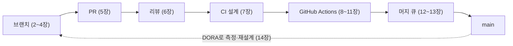

# 1장. 두 PR이 모두 초록이었는데 main이 깨졌다 — 워크플로는 왜 전략인가

오후 3시 10분, 두 개의 풀 리퀘스트(PR)가 거의 동시에 머지된다. 첫 번째 PR은 결제 모듈의 `calculateFee` 함수 이름을 `computeFee`로 바꾸고, 저장소 안의 호출부를 전부 고쳤다. 두 번째 PR은 정산 화면에 수수료를 보여 주는 기능을 새로 붙였다. 둘 다 리뷰 승인을 받았고, 둘 다 PR 화면에 초록색 체크가 떠 있었다. 누구도 잘못한 것이 없어 보였다.

3시 14분, `main`의 빌드가 빨갛게 변한다. 로그를 열어 보면 에러는 한 줄이다.

```text
src/settlement/FeeBadge.ts(12,18): error TS2305:
  Module '"../payment/fee"' has no exported member 'calculateFee'.
```

두 번째 PR이 새로 추가한 코드가 이미 사라진 이름을 부르고 있었던 것이다. 첫 번째 PR 작성자는 "제 PR은 초록이었는데요"라고 말하고, 두 번째 PR 작성자도 똑같이 말한다. 둘 다 맞는 말이다. 그런데 `main`은 깨졌다. 이런 상황을 처음 겪으면 꽤 난감하다. 누구 탓을 해야 할지도, 무엇을 고쳐야 다음에 안 생길지도 분명하지 않기 때문이다.

## 각자 초록, 합치면 빨강

가상의 장면이지만 어느 팀에서나 일어날 수 있는 일이다. 무엇이 잘못됐는지 한 걸음씩 따라가 보자. 두 번째 PR은 오전에 `main`에서 갈라져 나왔다. 그 시점의 `main`에는 `calculateFee`가 멀쩡히 있었다. 지속적 통합(CI)은 두 번째 PR의 브랜치를 가져와 빌드하고 테스트를 돌렸다. 당연히 통과했다. 첫 번째 PR도 마찬가지로 자기 브랜치 기준으로 검사를 통과했다. 두 PR은 서로 다른 파일을 고쳤으니 Git도 충돌을 알리지 않았다. 텍스트는 충돌하지 않았지만 의미는 충돌한 것이다.

여기서 눈여겨볼 점이 있다. CI가 검증한 것은 "두 번째 PR + 오전의 `main`"이었다. 실제로 머지된 것은 "두 번째 PR + 첫 번째 PR이 들어간 오후의 `main`"이었다. 검증한 대상과 머지한 대상이 달랐다. 이 책에서는 이런 현상을 **머지 레이스**라고 부르겠다. 각 PR은 초록인데, 합치고 나면 `main`이 깨지는 현상이다.

이 장면이 우리 팀만의 불운일까? 그렇지 않다. Shopify는 2018년에 자기네 머지 큐를 소개하면서 이렇게 썼다. "Occasionally, master merges can go wrong. For example, two unrelated merges can affect one another, the introduction of a new flaky test, or even accidental merges of work in progress." 서로 무관해 보이는 두 머지가 서로에게 영향을 준다는 첫 번째 사례가 바로 우리가 본 장면이다. 사람이 많고 PR이 잦은 저장소일수록 이런 일은 "가끔"에서 "매주"로 바뀐다.

그렇다면 이 장면에는 어떤 질문이 숨어 있을까? 두 가지다.

첫째, 두 번째 PR은 왜 오전의 `main`에 머물러 있었을까? 브랜치가 `main`에서 떨어져 지낸 시간이 길수록, 그사이 `main`에 쌓인 변화와 부딪힐 가능성도 커진다. 이 질문은 **통합 빈도**, 즉 우리가 얼마나 자주 합치는가의 문제다.

둘째, 우리가 검증한 것이 정말 머지된 것인가? 초록 체크는 "이 PR이 어떤 기준 위에서 통과했다"는 사실을 말해 줄 뿐이다. 그 기준이 머지 순간의 `main`과 다르면, 체크는 조용히 거짓말을 한다. 이 질문은 **머지 무결성**의 문제다. 이 책은 이것을 "검증된 것 = 머지된 것"이라는 한 줄로 줄여 부른다.

이 두 축이 이 책의 뼈대다. 브랜치 전략도, PR 크기도, 리뷰 합의도, GitHub Actions 파이프라인도, 머지 큐도 결국 이 두 질문 중 하나 또는 둘 다에 답하는 장치다.

## 자주 합칠수록 머지는 쉬워진다

첫 번째 축부터 살펴보자. 통합 빈도는 왜 그렇게 중요할까?

Martin Fowler는 2020년에 쓴 브랜치 패턴 글에서 이 원리를 한 문장으로 정리했다. "Frequent integration increases the frequency of merges but reduces their complexity and risk." 자주 합치면 머지 횟수는 늘어나지만, 한 번 한 번의 머지는 작고 덜 위험해진다는 말이다. 같은 글에는 이런 문장도 있다. "The smaller the integrations, the less likely they are to turn into an epic merge of misery and despair." 브랜치를 몇 주씩 묵혔다가 합쳐 본 사람이라면 "비참과 절망의 대서사시 같은 머지"라는 표현이 과장이 아니라는 걸 안다.

머지 충돌이 얼마나 흔한지에 대해서도 연구가 있다. 선행 연구에 따르면 머지 시도의 10~20%가 충돌로 끝난다(Ghiotto et al.이 재인용한 수치다). 게다가 앞의 장면처럼 텍스트 충돌 없이 의미만 어긋나는 경우는 이 숫자에 잡히지도 않는다.

그렇다면 브랜치를 줄이면 무엇을 얻을까? Microsoft 연구진인 Bird와 Zimmermann은 2012년 Windows 개발 조직을 대상으로 이 질문을 파고들었다. 개발자들이 꼽은 가장 큰 문제는 브랜치가 너무 많아서 변경이 팀과 팀 사이를 건너다니는 데 오래 걸린다는 것이었다. 연구진은 이 상태를 "branchmania"라고 불렀다. 그리고 비용은 크고 이득은 작은 브랜치를 없앤다고 가정해 계산해 봤다. 결과는 이렇다. "changes would each have saved 8.9 days of delay and only introduced 0.04 additional conflicts on average." 변경 하나당 8.9일의 지연이 사라지고, 늘어나는 충돌은 평균 0.04건에 불과했다.

이 숫자가 말해 주는 것은 분명하다. 브랜치는 격리를 주는 대신 지연이라는 세금을 매긴다. 그리고 그 세금은 생각보다 비싸다. 물론 이것은 Windows라는 거대한 조직의 데이터이고, 우리 팀의 브랜치가 8.9일씩 지연을 만든다는 뜻은 아니다. 다만 "브랜치를 하나 더 두는 것은 공짜"라는 직관이 틀렸다는 점만큼은 분명히 보여 준다.

Fowler는 여기서 한 걸음 더 나간다. "Continuous Integration allows a team to get the benefits of high-frequency integration, while decoupling feature length from integration frequency." 기능 하나를 완성하는 데 몇 주가 걸리더라도, 통합은 매일 할 수 있다는 말이다. 기능의 길이와 통합의 주기를 떼어 놓는 것, 이것이 이 책 1부와 2부가 향하는 방향이다.

## 브랜치 구조는 조직 구조를 닮는다

여기까지만 보면 "브랜치를 짧게 쓰자"는 기술적 조언으로 끝날 것 같다. 그런데 브랜치 이야기는 왜 늘 팀 회의에서 길어질까?

같은 Microsoft 연구 그룹의 Shihab, Bird, Zimmermann은 2012년 Windows Vista와 Windows 7의 브랜치 구조를 분석했다. 그들이 찾은 결과는 이렇다. "misalignment of branching structure and organizational structure is associated with higher post-release failure rates." 브랜치 구조가 조직 구조와 어긋나면 릴리스 후 실패율이 높아졌다.

이 결과를 곱씹어 보자. 브랜치는 코드를 담는 그릇이지만, 동시에 누가 누구의 변경을 언제 받아들이는지를 정하는 경로이기도 하다. 릴리스 브랜치를 누가 관리하는지, 핫픽스는 누가 승인하는지, 어떤 팀의 코드가 어떤 팀의 리뷰를 거쳐야 하는지가 모두 브랜치 모양에 새겨진다. 그러니 브랜치 전략을 바꾸는 일은 곧 일하는 방식을 바꾸는 일이다.

전략으로 다룬다는 것이 구체적으로 무엇일까? 적어도 다음 질문들에 팀이 같은 답을 할 수 있어야 한다. 브랜치는 얼마나 오래 살려 두는가. `main`에는 누가, 어떤 조건을 채웠을 때 머지할 수 있는가. 머지된 코드는 언제 사용자에게 나가는가. 이미 나간 버전에 문제가 생기면 어느 브랜치에서 고치는가. 이 질문들은 하나하나가 기술 설정이면서 동시에 팀의 약속이다. 답이 사람마다 다르면, 설정 화면이 어떻게 되어 있든 흐름은 그때그때 가장 목소리 큰 사람의 방식으로 흘러간다.

그래서 워크플로는 "습관"으로 두면 안 되고 "전략"으로 다뤄야 한다. 습관은 누군가 처음 정한 방식이 이유 없이 굳은 것이다. 전략은 목표가 있고, 대안을 따져 봤고, 상황이 바뀌면 다시 고를 수 있는 것이다. "우리 팀은 원래 Git Flow를 써요"라는 말에 "왜요?"라고 물었을 때 답이 나오지 않는다면, 그건 전략이 아니라 습관이다.

## 두 번째 축, 검증한 것을 머지하고 있는가

이제 두 번째 축으로 넘어가 보자. 통합 빈도를 아무리 높여도 머지 레이스는 사라지지 않는다. 오히려 PR이 잦아질수록 두 PR이 몇 분 차이로 머지될 확률은 커진다. 첫 번째 축만 밀어붙이면 두 번째 축이 무너지는 셈이다.

사람이 조금 더 조심하면 되지 않을까? 머지 버튼을 누르기 전에 "혹시 방금 누가 머지했나?" 확인하는 습관을 들이자는 식이다. 물론 몇 명짜리 팀에서는 그걸로 버틸 수 있다. 하지만 조심은 규모를 견디지 못한다. 오늘 오후의 두 작성자도 부주의하지 않았다. 각자 확인할 수 있는 것은 다 확인했다. 문제는 확인할 수 없는 것, 즉 머지 순간에 `main`이 어떤 모습일지였다. 사람의 주의로 막을 수 없는 틈이라면, 규칙이나 도구로 막는 편이 낫다.

그렇다면 어떻게 해야 할까? 떠올릴 수 있는 방법은 몇 가지 있다. 가장 단순한 것은 "머지하기 직전에 늘 최신 `main`을 받아서 다시 검사하라"는 규칙이다. GitHub는 이것을 필수 상태 체크(required status check)의 한 옵션으로 제공한다. 효과는 확실하지만 대가가 따른다. 누군가 머지할 때마다 나머지 PR은 전부 `main`을 따라잡고 검사를 처음부터 다시 돌려야 한다. PR이 많은 팀이라면 "따라잡기 → 재검사 → 그사이 또 누가 머지 → 다시 따라잡기"라는 끝없는 줄서기가 된다. 이 옵션은 4장에서 자세히 본다.

이 줄서기를 사람 대신 기계가 대신 서 주는 장치가 **머지 큐(merge queue)**다. 머지 큐는 머지할 PR을 줄 세우고, 앞선 PR이 들어간 상태를 기준으로 검사한 다음 그 결과 그대로 머지한다. 검증한 것과 머지한 것을 일치시키는 장치인 셈이다. 머지 큐가 무엇을 보장하고 무엇은 보장하지 않는지는 12장에서, 실제로 켜고 운영하는 법은 13장에서 다룬다. 지금은 두 번째 축에도 도구가 있다는 것만 알고 넘어가자.

한 가지 짚어 둘 것이 있다. 두 축은 서로 당기는 관계다. 머지 무결성을 지키는 가장 쉬운 방법은 아무도 머지하지 않는 것이고, 통합 빈도를 올리는 가장 쉬운 방법은 검사 없이 `main`에 바로 밀어 넣는 것이다. 좋은 워크플로는 이 둘을 동시에 높은 수준으로 유지한다. 1부부터 5부까지의 도구들은 결국 이 줄다리기를 푸는 방법들이다.

## 무엇으로 잴 것인가 — DORA 다섯 지표

전략이라고 말하려면 성과를 잴 자가 있어야 한다. "요즘 좀 나아진 것 같다"는 느낌만으로는 바꿀지 말지를 판단할 수 없다. 이 책은 그 자로 DORA 지표를 쓴다.

DORA(DevOps Research and Assessment)는 소프트웨어 전달 성과를 측정하는 지표 체계를 오래 다듬어 왔다. 흔히 "4 key metrics"와 MTTR로 알려져 있지만, 2026년 1월 5일 갱신판 기준으로 지표는 다섯 개다. 처리량 셋과 불안정성 둘로 나뉘고, 예전의 MTTR은 실패한 배포에서 회복하는 시간으로 바뀌었다. 옛 자료를 보다가 헷갈리지 않도록 이 차이는 기억해두자.

| 지표 | DORA 정의 (2026-01 갱신판) | 분류 |
|---|---|---|
| 변경 리드 타임 (Change Lead Time) | "The amount of time it takes for a change to go from committed to version control to deployed in production." | 처리량 |
| 배포 빈도 (Deployment Frequency) | "The number of deployments over a given period or the time between deployments." | 처리량 |
| 실패 배포 복구 시간 (Failed Deployment Recovery Time) | "The time it takes to recover from a deployment that fails and requires immediate intervention." | 처리량 |
| 변경 실패율 (Change Fail Rate) | "The ratio of deployments that require immediate intervention following a deployment." | 불안정성 |
| 배포 재작업률 (Deployment Rework Rate) | "The ratio of deployments that are unplanned but happen as a result of an incident in production." | 불안정성 |

이 다섯 지표를 이 책의 두 축에 겹쳐 보면 흥미로운 그림이 나온다. 변경 리드 타임과 배포 빈도는 통합 빈도의 결과다. 브랜치가 오래 살수록, 리뷰가 늦을수록, CI가 느릴수록 리드 타임은 길어진다. 반대로 변경 실패율과 배포 재작업률은 머지 무결성이 얼마나 지켜지는지를 비춘다. 검증하지 않은 조합이 `main`에 들어가 배포까지 가면, 그것은 곧 즉각 개입이 필요한 배포로 잡힌다.

물론 DORA 지표를 도입한다고 팀이 저절로 좋아지지는 않는다. 숫자는 방향을 알려 줄 뿐이다. 하지만 워크플로를 바꿀 때마다 "리드 타임은 줄었는가, 실패율은 늘지 않았는가"를 함께 보면, 한쪽 축만 밀어붙이다 다른 쪽을 무너뜨리는 실수를 피할 수 있다. 14장에서 팀 유형별 설계도를 그릴 때 이 다섯 지표로 다시 돌아온다.

측정 도구가 없다고 미룰 필요는 없다. 처음에는 거칠어도 괜찮다. 지난 한 달 동안 머지된 PR 몇 개를 골라, 첫 커밋 시각과 배포된 시각을 나란히 적어 보자. 그 사이 어디에서 시간이 가장 많이 흘렀는지만 봐도 병목이 드러난다. 리뷰를 기다리는 데 이틀이 걸렸다면 6장이, CI가 40분씩 돈다면 9장이 먼저 필요한 셈이다. 같은 기간에 "배포 후 급히 되돌리거나 고친 적"이 몇 번이었는지도 세어 두자. 그 숫자가 머지 무결성의 출발선이 된다.

## 이 책의 지도

이제 코드 한 줄이 `main`에 들어가기까지의 길을 한 장의 그림으로 그려 보자. 이 책의 목차는 이 길을 그대로 따라간다.


그림 1. 코드 한 줄이 `main`에 들어가는 경로와 이 책의 구성

출발점은 브랜치다. 2장에서 여섯 가지 브랜치 전략을 통합 빈도라는 축 위에 나란히 세우고, 3장에서 실제 팀들이 왜 전략을 바꿨는지를 살핀다. 4장에서는 고른 전략을 브랜치 보호 규칙과 룰셋으로 저장소에 새긴다.

그다음은 통합의 단위인 PR이다. 5장은 리뷰할 수 있는 크기로 PR을 나누는 법을, 6장은 리뷰가 실제로 무엇을 위한 것이며 리뷰 지연을 어떻게 설계로 줄이는지를 다룬다.

7장부터는 기계의 몫이다. 무엇을 필수 체크로 삼을지를 먼저 설계하고, 8장부터 11장까지 네 장에 걸쳐 GitHub Actions로 그 설계를 구현한다. 기초 해부, 속도와 비용, 재사용과 배포, 그리고 보안 순서다.

마지막 관문이 머지 큐다. 12장과 13장에서 오늘 오후의 장면으로 돌아와, 머지 레이스를 어떻게 막는지 본다. 그리고 14장에서 이 모든 도구를 묶어 팀 유형별 설계도를 그리고, 그림의 점선처럼 DORA 지표로 재고 다시 설계하는 순환을 만든다.

목표 상태는 단순하다. PR은 자주 들어오고, `main`은 늘 초록이다. 이 두 가지를 동시에 지키는 것이 생각보다 어렵다는 것을 오늘 오후의 빨간 빌드가 보여 줬다.

그러니 책장을 넘기기 전에 한 가지만 확인해 보자. 당신 팀에서 브랜치 하나가 `main`에서 갈라져 나와 다시 합쳐지기까지, 보통 며칠이 걸리는가? 그 숫자를 정확히 모른다면, 이미 첫 번째 축의 답을 찾아 나설 이유가 생긴 셈이다.
