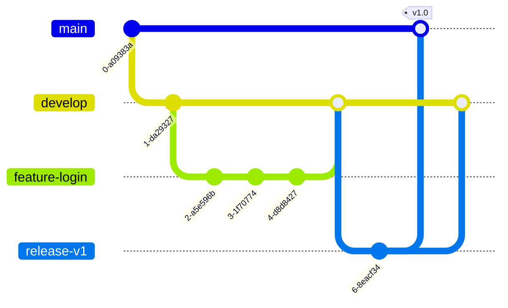
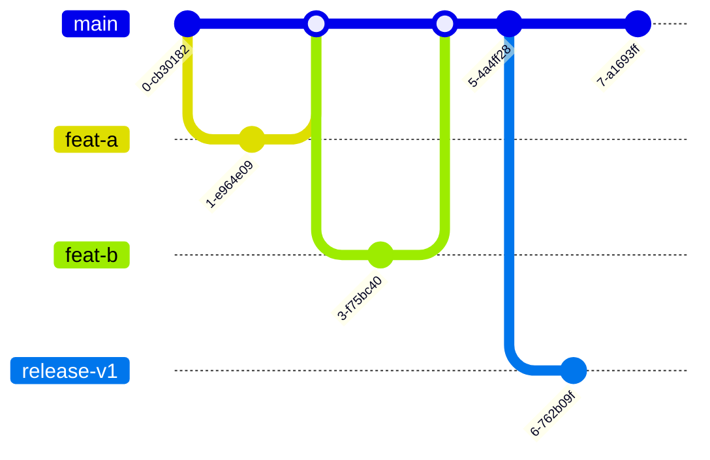

# 2장. 여섯 가지 브랜치 전략을 한 줄에 세우다 — Git Flow부터 트렁크 기반 개발까지

> "To conclude, always remember that panaceas don't exist. Consider your own context. Don't be hating. Decide for yourself."

만병통치약은 없다, 자기 맥락을 따져 보라, 미워하지 말고, 스스로 결정하라. 이 문장을 쓴 사람은 Vincent Driessen이다. 바로 Git Flow를 만든 사람이다. 그는 2010년 1월 "A successful Git branching model"이라는 글로 Git Flow를 세상에 내놓았고, 그로부터 10년이 지난 2020년 3월에 같은 글 맨 위에 짧은 반성 노트를 덧붙였다. 위 문장은 그 노트의 마지막 줄이다.

원저자가 굳이 반성문을 쓴 이유는 무엇일까? 노트의 앞부분에 답이 있다. Git Flow가 너무 인기를 얻은 나머지 사람들이 그것을 일종의 표준처럼, 나아가 "dogma or panacea", 즉 교리나 만병통치약처럼 대하기 시작했다는 것이다. 여기서 "10년"은 2010년부터 노트를 쓴 2020년까지를 말한다. 2026년인 지금 보면 Git Flow는 이미 열여섯 살이 넘었다.

그의 진단은 구체적이다. "Web apps are typically continuously delivered, not rolled back, and you don't have to support multiple versions of the software running in the wild." 웹 앱은 대개 지속적으로 배포되고, 되돌리기보다 앞으로 고쳐 나가며, 여러 버전을 동시에 지원할 필요도 없다. Git Flow는 애초에 그런 소프트웨어를 염두에 둔 모델이 아니었다는 고백이다. 그래서 그는 지속적 배포를 하는 팀이라면 GitHub Flow처럼 훨씬 단순한 흐름을 쓰라고 권했다. 반대로 명시적인 버전이 있는 소프트웨어, 여러 버전을 동시에 지원해야 하는 소프트웨어라면 Git Flow가 여전히 잘 맞을 수 있다고 덧붙였다.

이 노트를 "Git Flow는 낡았다"로만 읽으면 절반을 놓친다. 노트가 정말 말하는 것은, 브랜치 전략을 고를 때 이름보다 우리 소프트웨어가 어떻게 배포되고 몇 개의 버전이 동시에 살아 있는지를 먼저 보라는 것이다. 그러려면 먼저 각 전략이 무엇인지 원문 그대로 알아야 한다. 여섯 가지 전략을 하나씩 살펴보고, 마지막에 1장에서 세운 통합 빈도라는 축 위에 나란히 세워 보자.

## Git Flow — 영원한 브랜치 두 개

Git Flow의 중심에는 끝나지 않는 브랜치 두 개가 있다. Driessen의 원문(2010)은 이 둘을 이렇게 정의한다. `master`는 "the main branch where the source code of `HEAD` always reflects a _production-ready_ state"이고, `develop`은 "the main branch where the source code of `HEAD` always reflects a state with the latest delivered development changes for the next release"이다. 한쪽은 언제나 출시 가능한 상태, 다른 쪽은 다음 릴리스를 향해 쌓이고 있는 상태다. 원문이 쓰인 시절의 관례대로 여기서는 `master`라는 이름을 그대로 두었다.

이 두 기둥 주위로 짧게 살다 사라지는 보조 브랜치들이 붙는다. 기능 브랜치는 `develop`에서 갈라져 `develop`으로 돌아가고, 릴리스를 준비할 때는 릴리스 브랜치를 따서 마무리 작업을 한 뒤 `master`와 `develop` 양쪽에 합친다. 이미 나간 버전에 급한 문제가 생기면 `master`에서 핫픽스 브랜치를 따서 고치고, 역시 양쪽에 합친다.

머지 방식에도 의도가 담겨 있다. Git Flow는 기능 브랜치를 합칠 때 `--no-ff` 옵션을 쓰라고 권한다. 원문의 설명은 이렇다. "This avoids losing information about the historical existence of a feature branch and groups together all commits that together added the feature." 빨리 감기(fast-forward)가 가능해도 굳이 머지 커밋을 만들어서, 어떤 커밋들이 한 기능을 이뤘는지를 이력에 남기겠다는 것이다. 이 선택은 4장에서 머지 방식을 고를 때 다시 등장한다.

Git Flow의 강점은 분명하다. 출시된 코드와 개발 중인 코드가 브랜치 단위로 확실히 갈린다. 릴리스 브랜치가 있으니 다음 버전 기능을 계속 받으면서도 이번 버전을 다듬을 수 있다. 버전 번호가 붙어 나가는 소프트웨어라면 이 구조가 주는 안정감은 크다.

그렇다면 대가는 무엇일까? 통합 빈도의 관점에서 보면 기능 브랜치는 기능이 완성될 때까지 `develop`에서 떨어져 산다. 기능이 커질수록 브랜치 수명도 길어진다. 또 `develop`과 `master`라는 두 개의 기준선이 있으니, 개발자는 늘 "지금 이 코드는 어느 쪽에 있지?"를 머릿속에 담아 두어야 한다. 커뮤니티에서는 이 부담을 두고 "Every repo that is following gitflow comes with a mental overhead for me"(Lobsters, 2020)라는 불평이 나왔다. 규칙이 많다는 것 자체가 번거로움이다. 또 다른 댓글은 Git Flow가 "weakly defined enough to evolve into something I call 'X as practiced'"라고 꼬집었다. 규칙이 느슨하게 정의돼 있어서 팀마다 제각각 변형된 "우리 식 Git Flow"가 된다는 지적이다. "우리 팀은 Git Flow를 써요"라는 말이 팀마다 다른 뜻을 갖게 되는 이유다.

## GitHub Flow — 브랜치 하나와 PR

GitHub Flow는 반대편 끝에 있다. GitHub Docs는 이것을 "a lightweight, branch-based workflow"라고 소개한다(2026년 9월 조회 기준). 단계는 여섯 개뿐이다. 브랜치를 만든다, 변경한다, PR을 연다, 리뷰 코멘트에 답한다, PR을 머지한다, 브랜치를 지운다.

마지막 단계가 의외로 중요하다. Docs는 머지한 뒤 브랜치를 지우라고 하면서 그 이유를 이렇게 적는다. "This indicates that the work on the branch is complete and prevents you or others from accidentally using old branches." 브랜치는 일이 끝나면 사라지는 작업 공간이고, 영원히 남는 것은 `main` 하나뿐이다. `develop`도 릴리스 브랜치도 없다.

구조가 단순하니 배우기 쉽다. 하지만 여기서 한 가지 의문이 생긴다. GitHub Flow에서 배포는 언제 하는가? Docs의 단계 목록에는 배포가 따로 나오지 않는다. 머지하고 브랜치를 지우면 끝이다. 그런데 Microsoft는 자기네 개발 방식을 설명하는 문서에서 GitHub Flow를 다르게 해석한다. "an often overlooked part of GitHub Flow is that pull requests must deploy to production for testing before they can merge to the main branch." Microsoft의 해석에 따르면 PR은 `main`에 머지되기 전에 먼저 운영 환경에 배포해 검증을 거친다.

두 설명 중 어느 쪽이 맞을까? 굳이 한쪽을 정답으로 고를 필요는 없다. 중요한 것은 GitHub Flow가 "`main`은 언제든 배포할 수 있다"는 전제 위에 서 있다는 점이다. 머지 전에 배포하든 머지 직후에 배포하든, `main`에 들어간 코드가 곧 사용자에게 나간다는 가정은 같다. 이 가정이 성립하지 않는 팀, 예를 들어 앱 스토어 심사를 기다려야 하거나 여러 버전을 동시에 지원해야 하는 팀에게 GitHub Flow는 금세 좁게 느껴진다. 3장에서 바로 그런 팀의 이야기를 본다. 배포 시점을 배포 환경 승인으로 통제하는 방법은 10장에서 다룬다.

## GitLab Flow — 환경을 브랜치로

GitLab Flow는 GitHub Flow에 "배포 대상"을 브랜치로 덧붙인 모델이다. 원문은 2014년 9월 GitLab 블로그에 실렸고, 지금은 GitLab의 토픽 페이지가 그 내용을 이어받고 있다. 설명은 이렇다. "teams practice feature branching, while also maintaining a separate production branch. Whenever the 'main' branch is ready to be deployed, users merge it into the production branch and release."

기능 브랜치를 `main`에 합치는 것까지는 GitHub Flow와 같다. 차이는 그다음이다. 배포할 준비가 되면 `main`을 `production` 브랜치로 머지하고, 그 브랜치가 곧 운영 환경의 상태를 나타낸다. 필요하면 중간 단계를 얼마든지 둘 수 있다. "Teams can add as many pre-production branches as needed — for example, from `main` to test, from test to acceptance, and from acceptance to production." 원칙은 "Commits flow downstream"이다. 커밋은 늘 위에서 아래로, `main`에서 운영 쪽으로만 흐른다. 여러 버전을 유지해야 한다면 `v1`, `v2` 같은 릴리스 브랜치를 따로 둔다.

이 모델은 "지금 운영에 무엇이 나가 있는가"를 브랜치 하나만 보고 알 수 있다는 장점이 있다. 배포 전에 테스트 환경, 인수 환경을 반드시 거쳐야 하는 조직이라면 절차가 그대로 브랜치에 새겨지니 편하다.

물론 비판도 있다. Martin Fowler는 환경 브랜치를 두고 꽤 날카롭게 말했다. "Environment branches are an example of using source branching as a poor man's modular architecture." 환경마다 달라야 하는 것은 대개 설정이지 코드가 아니다. 그런데 그 차이를 브랜치로 표현하기 시작하면, 환경 브랜치에만 있는 커밋이 슬그머니 생기고 브랜치끼리 조금씩 어긋난다. 테스트 환경에서 검증한 코드와 운영 환경에 나간 코드가 달라지는 것이다. 1장의 두 번째 축, "검증된 것 = 머지된 것"이 여기서도 흔들린다. GitLab Flow를 쓴다면 환경 브랜치에는 머지 말고 다른 커밋이 들어가지 않도록 규칙으로 막아 두는 편이 낫다.

## 트렁크 기반 개발 — 브랜치를 안 쓴다는 오해

트렁크 기반 개발(Trunk-Based Development, TBD)은 이름 때문에 가장 많이 오해받는 전략이다. 대표 레퍼런스인 trunkbaseddevelopment.com의 정의부터 보자. "A source-control branching model, where developers collaborate on code in a single branch called 'trunk' and resist any pressure to create other long-lived development branches."

핵심 단어는 "long-lived"다. 오래 사는 개발 브랜치를 만들지 않는다는 것이지, 브랜치를 아예 쓰지 않는다는 뜻이 아니다. 같은 사이트는 짧게 사는 기능 브랜치를 분명히 인정한다. 그 용도는 "for code-review and build checking (CI), but not artifact creation or publication, to happen before commits land in the trunk"이다. 리뷰와 CI를 위해 브랜치를 잠깐 쓰되, 그 브랜치에서 배포용 결과물을 만들지는 않는다. 흔히 "TBD 팀은 모두 `main`에 직접 push한다"고 여기기 쉽다. 하지만 GitHub에서 TBD를 하는 팀 대부분은 몇 시간에서 하루쯤 사는 짧은 브랜치와 PR을 쓴다.

얼마나 짧아야 할까? DORA가 제시하는 기준이 가장 구체적이다. "Each developer divides their own work into small batches and merges that work into trunk at least once (and potentially several times) a day." 여기에 "Have three or fewer active branches in the application's code repository", "Don't have code freezes and don't have integration phases"가 더해진다. 하루에 한 번 이상 트렁크에 합치고, 활성 브랜치는 셋 이하로 유지하며, 코드 동결이나 별도의 통합 단계를 두지 않는다.

TBD에도 릴리스 브랜치는 있을 수 있다. 다만 성격이 다르다. "Release branches that are cut from the trunk on a just-in-time basis, are 'hardened' before a release ... and those branches are deleted some time after release." 릴리스 직전에 트렁크에서 따고, 다듬고, 릴리스 후 얼마 지나면 지운다. 그 브랜치에서 새 개발은 하지 않는다.

TBD가 이렇게 통합을 밀어붙이는 이유는 무엇일까? 같은 사이트는 TBD를 "a key enabler of Continuous Integration and by extension Continuous Delivery"라고 설명한다. 1장에서 본 Fowler의 문장, 기능의 길이와 통합 주기를 떼어 놓는다는 생각을 가장 곧이곧대로 실천하는 모델이 TBD다. 그런데 기능 하나가 사흘 걸린다면, 하루에 한 번 합치는 미완성 코드는 어떻게 숨길까? 그 답이 3장에서 볼 기능 플래그다.

## OneFlow와 Release Flow — 그 사이의 선택지

양 끝 사이에도 선택지가 있다. 먼저 OneFlow다. Adam Ruka가 제안한 이 모델은 출발점부터 Git Flow에 대한 반론이다. "OneFlow has been conceived as a simpler alternative to GitFlow." 기본 전제는 한 줄이다. "OneFlow's basic premise is to have one eternal branch in your repository." 영원한 브랜치는 하나뿐이고, `develop`을 따로 두지 않는다. 릴리스가 끝나면 그 시점 브랜치 끝에 버전 번호로 태그를 단다. Ruka는 이 모델이 Git Flow만큼 강력하다고 주장한다. "There is not a single thing that can be done using GitFlow that can't be achieved (in a simpler way) with OneFlow." 명시적 버전이 필요하지만 브랜치 두 개를 오가는 부담은 싫은 팀에게 어울리는 절충안이다.

Release Flow는 Microsoft가 자기네 대규모 저장소에서 쓰는 방식이다. 평소에는 트렁크 기반으로 개발하고, 스프린트 단위로 릴리스 브랜치를 딴다. 독특한 규칙이 하나 있다. "Release branches never merge back to the main branch, so they might require *cherry-picking* important changes." 릴리스 브랜치는 절대 `main`으로 되돌아오지 않는다. 필요한 수정은 체리픽으로 옮긴다. 왜 이런 규칙을 뒀는지, 핫픽스는 어떤 순서로 흐르는지는 3장에서 사례와 함께 살펴보자.

## 이름 말고 축으로 비교하자

여섯 가지 전략을 모두 봤다. 이제 이름표를 떼고 같은 축 위에 나란히 세워 보자. 비교할 축은 다섯 개다. 영원히 사는 브랜치가 몇 개인가, 코드가 얼마나 자주 기준선에 합쳐지는가, 릴리스는 연속 배포인가 명시적 버전인가, 여러 버전을 동시에 지원할 수 있는가, 핫픽스는 어떤 경로로 흐르는가.

| 전략 | 장기 브랜치 | 통합 빈도 | 릴리스 방식 | 다중 버전 | 핫픽스 경로 |
|---|---|---|---|---|---|
| Git Flow | `master` + `develop` | 기능 완성 시 `develop`으로 (낮음~중간) | 명시적 버전, 릴리스 브랜치 | 적합 | `master`에서 핫픽스 브랜치 → 양쪽에 머지 |
| GitHub Flow | `main` 하나 | PR 머지 시 (브랜치 수명에 좌우) | 연속 배포 전제 | 부적합 | 일반 PR과 같은 경로 |
| GitLab Flow | `main` + 환경 브랜치 | 기능은 `main`으로, 배포는 아래로 | 환경 브랜치로 승격 | 릴리스 브랜치(`v1`, `v2`)로 | `main`에서 고쳐 아래로 흘림 |
| 트렁크 기반 개발 | 트렁크 하나 | 하루 1회 이상 (DORA 기준) | 트렁크 배포 또는 직전에 딴 릴리스 브랜치 | 짧게 사는 릴리스 브랜치로 제한적 | 트렁크에서 먼저 고친 뒤 릴리스 브랜치로 체리픽 |
| OneFlow | 영원한 브랜치 하나 | 기능 브랜치 머지 시 | 명시적 버전, 태그 | 가능 | 최신 버전 태그에서 핫픽스 브랜치 → 태그 후 영원한 브랜치로 머지 |
| Release Flow | `main` + 스프린트별 릴리스 브랜치 | 트렁크 기반 | 릴리스 브랜치에서 배포 | 릴리스 브랜치별 | `main` 먼저, 릴리스 브랜치로 체리픽 |

표를 가로로 읽지 말고 세로로 읽어 보자. 통합 빈도 칸을 보면 전략들이 하나의 스펙트럼 위에 있다는 게 보인다. 한쪽 끝에는 기능이 완성돼야 합치는 Git Flow가, 반대편 끝에는 하루에도 여러 번 합치는 TBD가 있다. 브랜치 모양만 보면 두 전략은 전혀 다른 세계 같다. 하지만 두 그림을 나란히 놓으면 차이는 결국 "브랜치가 기준선에서 얼마나 오래 떨어져 사는가"로 모인다.

그림 1. Git Flow — 기능 브랜치가 여러 커밋을 쌓은 뒤 `develop`으로, 릴리스 브랜치를 거쳐 `main`(원문의 `master`)으로 간다

그림 2. 트렁크 기반 개발 — 짧은 브랜치가 하루 안에 트렁크로 돌아오고, 릴리스 브랜치는 필요할 때 딴다

여기서 흔한 오해 하나를 짚고 가자. GitHub Flow는 브랜치가 하나뿐이니 당연히 통합 빈도가 높다고 여기기 쉽다. 하지만 표의 GitHub Flow 칸에 "브랜치 수명에 좌우"라고 적어 둔 데는 이유가 있다. 기능 브랜치를 2주씩 끌고 다니는 GitHub Flow 팀은, 기능을 이틀 만에 `develop`에 합치는 Git Flow 팀보다 오히려 통합이 드물다. 장기 브랜치의 개수는 전략의 이름이 정하지만, 통합 빈도는 팀의 습관이 정한다. 그래서 전략을 바꾸기 전에 지금 브랜치들이 실제로 며칠씩 사는지부터 재 보는 편이 낫다.

반대 방향의 오해도 있다. "Git Flow는 단계가 많으니 더 안전하다"는 생각이다. Fowler는 릴리스 브랜치의 쓸모를 이렇게 평가했다. "Release branches are a valuable tool when a team isn't able to keep their mainline in a healthy state." 릴리스 브랜치는 기준선을 건강하게 유지하지 못하는 팀에게 유용한 도구라는 말이다. 뒤집어 읽으면, 릴리스 브랜치가 주는 안전은 기준선이 불안하다는 사실을 덮는 안전일 수 있다. 명시적 버전이 필요해서 쓰는 릴리스 브랜치와, `develop`을 믿을 수 없어서 쓰는 릴리스 브랜치는 겉모양만 같다.

다른 칸도 의미가 있다. 다중 버전 칸이 "적합"이나 "가능"인 전략은 모두 명시적 버전을 전제로 한다. Driessen이 반성 노트에서 그은 선과 정확히 일치한다. 결국 전략을 가르는 첫 질문은 "우리 소프트웨어는 한 번에 몇 개의 버전이 살아 있는가"이고, 두 번째 질문은 "통합을 얼마나 자주 할 수 있는가"다.

## 어떤 조건에서 무엇을 고를까

두 질문에 대한 답을 바탕으로 결정 가이드를 한 장으로 압축해 보자. 이 표는 출발점일 뿐이다. Driessen의 말처럼 맥락을 따지는 일은 결국 우리 몫이다.

| 우리 팀의 조건 | 먼저 검토할 전략 |
|---|---|
| 웹 서비스, 연속 배포, 운영 중인 버전은 하나 | GitHub Flow, 또는 통합을 더 자주 하고 싶다면 트렁크 기반 개발 |
| 모바일 앱·라이브러리·펌웨어처럼 명시적 버전을 내고 여러 버전을 지원 | Git Flow, 브랜치 부담을 줄이고 싶다면 OneFlow |
| 배포 전 테스트·인수 환경을 반드시 거쳐야 하는 조직 | GitLab Flow (환경 브랜치에 머지 외 커밋 금지) |
| 수백 명이 한 저장소에서 일하고 스프린트 단위로 릴리스 | Release Flow, 또는 트렁크 기반 개발 + 직전에 딴 릴리스 브랜치 |
| 릴리스 전에 몇 주짜리 수동 검증이 필요 | Git Flow 계열 (릴리스 브랜치에서 검증) |

마지막 행에는 사연이 있다. Hacker News의 한 개발자는 자기 팀이 전력 분석 테스트를 포함해 전체 검증에 2주가 걸린다고 하면서 이렇게 정리했다. "Git-flow is bad if you have CD. Git-flow is great if you can't do that." 커뮤니티 의견이지만, 전략을 가르는 기준이 브랜치 모양이 아니라 배포 능력이라는 점을 잘 보여 준다.

그런데 이 표를 보고 "우리는 웹 서비스니까 TBD로 가자"고 바로 결정하기엔 아직 이르다. 브랜치를 짧게 가져가려면 그 짧은 주기를 받쳐 줄 장치가 필요하다. 하루에 몇 번씩 올라오는 PR을 제때 리뷰할 수 있어야 하고, 합칠 때마다 `main`이 깨지지 않는다는 확신을 줄 CI가 있어야 하며, 1장의 머지 레이스를 막을 방법도 있어야 한다. 그 장치들이 없는 상태에서 브랜치만 짧게 줄이면, 통합 빈도는 올라가도 `main`은 더 자주 빨개진다.

그래서 이 결정 표는 일부러 열어 둔 채로 둔다. 리뷰, CI, GitHub Actions, 머지 큐를 하나씩 갖춰 가다 보면 표의 왼쪽 칸, "우리 팀의 조건" 자체가 바뀐다. 14장에서 모든 도구를 손에 쥔 채로 이 표를 다시 펼쳐 보자.
