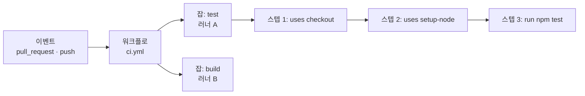

<!-- fact-check 메모(저술가): 예제 YAML의 공식 액션 메이저 버전(actions/checkout@v5, actions/setup-node@v5)은 레퍼런스 근거가 없는 저술가 추정값이다. 2026-09 기준 최신 메이저로 대조·교체 필요. 레퍼런스 밖의 문법 요소(`$GITHUB_OUTPUT`, `schedule` cron의 UTC 기준, 체크 이름이 잡 이름으로 보고되는 방식, 잡 기본 병렬 실행, `if: always()` 상태 함수, 잡 수준 `permissions`가 워크플로 수준을 대체한다는 점)도 GitHub Docs 대조 대상. -->

# 8장. GitHub Actions 해부 — 워크플로, 잡, 스텝, 러너, 트리거

앞 장에서 무엇을 필수 체크로 삼을지 정했다. 빠르고 결정적인 검사는 PR마다 돌리고, 느리고 넓은 검사는 머지 뒤나 야간으로 미룬다. flaky 테스트는 필수 체크 목록에 올리기 전에 먼저 다스린다. 설계는 끝났다. 이제 그 검사를 실제로 돌릴 차례다.

그런데 막상 저장소에 CI를 붙이려는 순간, 많은 개발자가 비슷한 경로를 밟는다. 비슷한 프로젝트의 `.github/workflows` 폴더를 열어 YAML 파일 하나를 통째로 복사한다. 언어 버전 숫자 몇 개를 바꾸고 push한다. 초록 체크가 뜨면 그걸로 끝이다. 돌아가기는 한다. 문제는 그다음이다. 테스트를 두 단계로 나누고 싶을 때, 특정 폴더가 바뀔 때만 돌리고 싶을 때, 앞 잡의 결과를 뒤 잡에 넘기고 싶을 때, 어디를 건드려야 할지 모른다. 복사해 온 YAML은 이해해서 쓰는 코드가 아니라 건드리기 무서운 부적이 된다.

이 부적을 풀어 보자. GitHub Actions는 겉보기보다 단순한 몇 개의 부품으로 이루어져 있다. 부품의 이름과 역할, 그리고 부품끼리 어떻게 맞물리는지를 알면, 남의 YAML도 읽히고 내 YAML도 자신 있게 고칠 수 있다.

## 워크플로 한 벌을 펼쳐 놓고 보자

설명보다 실물이 먼저다. 7장에서 PR 필수 체크로 정한 "빠른 단위 테스트와 린트"를 돌리는 최소 CI 워크플로 하나에서 출발한다. Node.js 프로젝트를 예로 들었지만, 언어가 달라도 뼈대는 같다.

```yaml
# .github/workflows/ci.yml
name: CI

on:
  pull_request:
    branches: [main]
  push:
    branches: [main]

permissions:
  contents: read

jobs:
  test:
    runs-on: ubuntu-latest
    steps:
      - uses: actions/checkout@v5
      - uses: actions/setup-node@v5
        with:
          node-version: '22'
      - run: npm ci
      - run: npm run lint
      - run: npm test
```

위에서부터 한 줄씩 읽어 보자. 파일 하나가 **워크플로(workflow)** 하나다. 저장소의 `.github/workflows` 디렉터리에 놓인 YAML 파일은 각각 독립된 워크플로가 된다. `name`은 GitHub 화면의 Actions 탭에 보일 이름이다.

`on`은 이 워크플로를 깨우는 **이벤트**, 흔히 말하는 트리거다. 여기서는 `main`을 향한 PR이 열리거나 갱신될 때, 그리고 `main`에 push가 일어날 때 돈다. PR 단계에서 한 번 검사하고, 머지된 뒤 `main`에서도 한 번 더 확인하는 구성이다.

`permissions`는 이 워크플로가 받는 토큰의 권한을 정한다. 지금은 "저장소 내용을 읽기만 한다"고 못 박아 두었다. 이 한 줄이 왜 중요한지는 조금 뒤에, 그리고 11장에서 제대로 살펴본다.

`jobs` 아래에 **잡(job)**이 온다. 이 예제에는 `test`라는 잡 하나뿐이다. `runs-on`은 이 잡을 어떤 **러너(runner)**, 즉 어떤 기계에서 돌릴지 정한다. `ubuntu-latest`는 GitHub가 제공하는 리눅스 가상 머신을 뜻한다.

잡 안에는 **스텝(step)**이 순서대로 늘어선다. 스텝은 두 종류다. `uses`로 시작하는 스텝은 남이 만들어 둔 재사용 단위인 **액션(action)**을 불러 쓴다. `actions/checkout`은 저장소 코드를 러너로 내려받고, `actions/setup-node`는 지정한 버전의 Node.js를 설치한다. `run`으로 시작하는 스텝은 셸 명령을 그대로 실행한다. 예제에 쓴 액션의 메이저 버전 숫자는 시간이 지나면 바뀌니 각 액션 저장소의 릴리스 페이지에서 확인해두자(사실 확인 필요).

부품들의 관계를 그림으로 정리하면 이렇다.


그림 1. 이벤트가 워크플로를 깨우고, 워크플로는 잡을 러너에 배정하며, 잡 안의 스텝은 순서대로 실행된다

이 그림에서 기억할 경계선이 하나 있다. 잡과 잡 사이, 그리고 스텝과 스텝 사이는 성격이 전혀 다르다. 한 잡 안의 스텝들은 같은 러너에서 순서대로 돌기 때문에 파일 시스템을 공유한다. 앞 스텝이 설치한 `node_modules`를 뒤 스텝이 그대로 쓸 수 있는 이유다. 반면 잡은 저마다 새 러너에서 시작하고, 따로 순서를 정하지 않으면 동시에 돈다. 앞 잡이 만든 파일은 뒤 잡에서 보이지 않는다. 주방에 비유하면 이해하기 쉽다. 스텝은 한 조리대 위에서 이어지는 손질 순서이고, 잡은 서로 다른 조리대다. 옆 조리대에 재료를 넘기려면 따로 옮기는 수단이 필요하다. 그 수단이 잡 출력(outputs)과 아티팩트이고, 출력은 이 장에서, 아티팩트는 9장에서 다룬다.

마지막으로 4장과 연결되는 지점이 하나 있다. 브랜치 보호 규칙이나 룰셋에서 필수 체크를 고를 때 목록에 나타나는 이름은 대개 잡의 이름이다. 워크플로를 만들고 한 번 이상 돌려야 그 이름이 필수 체크 후보로 나타난다. 잡 이름을 아무렇게나 바꾸면 보호 규칙이 기다리는 체크 이름과 어긋나 PR이 영원히 대기하는 일이 생긴다. 잡 이름은 팀이 필수 체크로 합의한 계약의 일부라고 여기는 편이 낫다.

## 언제 도는가 — 트리거를 깊게

워크플로가 무엇을 하는지는 `jobs`가 정하고, 언제 하는지는 `on`이 정한다. 실무에서 사고는 대개 "언제"에서 난다. 돌아야 할 때 돌지 않거나, 돌면 안 되는 맥락에서 돈다. 자주 쓰는 트리거를 하나씩 보면 이렇다.

**`push`와 `pull_request`**는 CI의 기본이다. 둘은 비슷해 보이지만 결정적인 차이가 있다. `pull_request`는 외부 기여자가 fork한 저장소에서 올린 PR에도 반응하는데, 이때 GitHub는 러너에 시크릿을 넘기지 않는다. GitHub Docs는 이렇게 적는다.

> "With the exception of `GITHUB_TOKEN`, secrets are not passed to the runner when a workflow is triggered from a forked repository. The `GITHUB_TOKEN` has read-only permissions in pull requests from forked repositories."

왜 이렇게 막아 두었을까? fork PR의 코드는 아무나 쓸 수 있기 때문이다. 누군가 테스트 스크립트에 "환경 변수를 전부 외부로 보내라"는 한 줄을 끼워 넣은 PR을 올렸다고 해보자. 그 PR에 배포 키가 전달된다면 끔찍한 일이다. 그래서 fork PR은 시크릿 없이, 읽기 전용 토큰으로만 돈다. 오픈소스 저장소에서 "외부 기여자 PR에서만 배포 미리보기 잡이 실패한다"는 현상을 보면 대개 이 규칙 때문이다.

**`workflow_dispatch`**는 사람이 Actions 탭에서 버튼을 눌러 워크플로를 수동으로 실행하게 해 준다. 입력값을 받을 수도 있어서, 간단한 운영 작업이나 새 워크플로를 시험할 때 요긴하다.

**`schedule`**은 cron 문법으로 정해진 시각에 워크플로를 돌린다. 6장에서 본 토스페이먼츠 사례가 좋은 예다. 이 팀은 평일 오후 2시에 아직 리뷰되지 않은 PR 목록을 팀 채널로 보내는 리마인더를 Actions로 만들었다. 비슷한 워크플로의 뼈대는 이렇게 생겼다.

```yaml
name: Review reminder

on:
  schedule:
    # 평일 14:00 KST = 05:00 UTC
    - cron: '0 5 * * 1-5'
  workflow_dispatch:

permissions:
  pull-requests: read

jobs:
  remind:
    runs-on: ubuntu-latest
    steps:
      - name: 리뷰 대기 중인 PR 목록 만들기
        env:
          GH_TOKEN: ${{ github.token }}
          REPO: ${{ github.repository }}
        run: gh pr list --repo "$REPO" --search "review:required" --limit 50
```

cron 시각은 한국 시간이 아니라 UTC 기준으로 해석되니 주의해야 한다(사실 확인 필요). 그래서 오후 2시 리마인더가 `0 5`로 적혀 있다. `workflow_dispatch`를 같이 달아 둔 것도 습관으로 삼을 만하다. 예약 시각까지 기다리지 않고 버튼 한 번으로 동작을 확인할 수 있기 때문이다. 슬랙으로 보내는 부분은 팀마다 달라서 생략했다.

**`workflow_run`**은 다른 워크플로가 끝난 뒤에 이어서 돈다. "빌드 워크플로가 끝나면 결과를 PR에 코멘트로 남긴다" 같은 연쇄에 쓴다. 그런데 이 트리거에는 눈여겨볼 성질이 있다.

> "The workflow started by the `workflow_run` event is able to access secrets and write tokens, even if the previous workflow was not."

앞 워크플로가 시크릿 없는 fork PR에서 돌았더라도, 뒤따르는 워크플로는 시크릿과 쓰기 권한을 가진다. 이 성질은 양날의 칼이다. 안전하게 쓰면 fork PR의 결과를 받아 코멘트를 다는 깔끔한 설계가 되고, 잘못 쓰면 공격 통로가 된다. 그 안전한 패턴은 11장에서 완성한다.

나머지 두 트리거는 이 장에서는 이름만 소개한다. **`merge_group`**은 머지 큐가 PR 묶음을 검사할 때 발생하는 이벤트다. 머지 큐를 켠다면 필수 체크를 만드는 워크플로에 이 트리거도 함께 달아 줘야 하는데, 그 이유와 설정은 13장의 몫이다. **`pull_request_target`**은 이름이 `pull_request`와 비슷해서 헷갈리기 쉬운데, 성격은 정반대다. 대상 저장소의 권한과 시크릿을 쥔 채 돈다. 이 트리거에서 PR의 코드를 체크아웃해 실행하는 순간 저장소 전체를 내주게 될 수 있다. 쓰기 전에 11장을 먼저 읽기를 권한다.

트리거에는 필터를 걸 수 있다. `branches`, `branches-ignore`, `tags`, `tags-ignore`는 글롭(glob) 패턴을 받는다. 예를 들어 `branches: [main, 'release/**']`라고 적으면 `main`과 `release/` 아래 모든 브랜치를 대상으로 삼는다. `paths`로는 특정 경로가 바뀐 경우에만 돌게 할 수 있다. 문서만 고친 PR에서 테스트를 건너뛰고 싶을 때 쓰면 편리하다. 다만 `paths` 필터를 건 워크플로를 필수 체크로 지정하면 곤란한 함정이 기다리고 있다. 해당 경로를 건드리지 않은 PR에서는 워크플로가 아예 돌지 않으니, 필수 체크가 끝내 보고되지 않는다. 모노레포에서 특히 자주 부딪히는 이 문제와 해법은 9장에서 전체 YAML로 푼다.

## 표현식과 컨텍스트, 그리고 잡 사이의 대화

YAML은 원래 데이터를 적는 형식이지 로직을 담는 언어가 아니다. 그런데 CI에는 조건과 값의 전달이 필요하다. Actions는 이 틈을 `${{ }}`로 감싼 **표현식**으로 메운다. 표현식 안에서는 **컨텍스트**라는 객체들을 읽을 수 있다. `github` 컨텍스트에는 이벤트 이름, 브랜치, 저장소, PR 정보가 들어 있다. `secrets`에는 시크릿이, `needs`에는 앞선 잡의 결과와 출력이, `matrix`에는 매트릭스의 현재 조합이 들어 있다.

여기서 미리 경고할 것이 하나 있다. `${{ github.event.pull_request.title }}`처럼 PR 제목이나 본문을 읽는 표현식을 `run` 스크립트 안에 그대로 넣지 말자. 표현식은 셸이 실행되기 전에 문자열로 치환되기 때문에, 누군가 PR 제목에 셸 명령을 적어 넣으면 그 명령이 러너에서 실행될 수 있다. 앞의 리마인더 예제에서 저장소 이름을 `env`로 한 번 거쳐 넘긴 것도 같은 습관이다. 왜 이것이 위험한지, 어떤 규모로 벌어지는지는 11장에서 자세히 본다.

잡끼리 순서를 정하려면 `needs`를 쓴다. `needs`가 없는 잡들은 동시에 출발하고, `needs: build`라고 적은 잡은 `build`가 성공한 뒤에야 출발한다. 여기에 `if`를 더하면 조건부 실행이 된다. 가장 흔한 쓰임은 "PR에서는 검사만, `main`에 push됐을 때만 배포"다.

앞 잡에서 계산한 값을 뒤 잡이 받아야 할 때도 있다. 예를 들어 첫 잡에서 버전 문자열을 한 번 계산하고, 뒤 잡 여럿이 그 값을 쓰고 싶다고 해보자. 스텝 출력을 잡 출력으로 올리고, 뒤 잡이 `needs`를 통해 읽는 세 단계를 거친다.

```yaml
name: Build and publish

on:
  push:
    branches: [main]

permissions:
  contents: read

jobs:
  version:
    runs-on: ubuntu-latest
    outputs:
      tag: ${{ steps.meta.outputs.tag }}
    steps:
      - id: meta
        env:
          SHA: ${{ github.sha }}
        run: echo "tag=build-${SHA::7}" >> "$GITHUB_OUTPUT"

  build:
    needs: version
    runs-on: ubuntu-latest
    steps:
      - uses: actions/checkout@v5
      - env:
          TAG: ${{ needs.version.outputs.tag }}
        run: echo "빌드 태그는 $TAG"

  publish:
    needs: [version, build]
    if: github.ref == 'refs/heads/main'
    runs-on: ubuntu-latest
    steps:
      - env:
          TAG: ${{ needs.version.outputs.tag }}
        run: echo "$TAG 게시"
```

스텝에 `id`를 붙이고, 그 스텝이 `$GITHUB_OUTPUT` 파일에 `이름=값`을 적으면 스텝 출력이 된다. 잡의 `outputs`가 이를 잡 출력으로 끌어올리고, 뒤 잡은 `needs.version.outputs.tag`로 읽는다. 처음 보면 번거롭게 느껴진다. 하지만 이 번거로움에는 이유가 있다. 잡은 서로 다른 기계에서 도니까, 값은 명시된 통로로만 흐를 수밖에 없다. 어디서 값이 오는지 YAML만 보고도 추적할 수 있다는 점은 오히려 장점이다.

`if`에는 알아 둘 성질이 하나 더 있다. 아무 조건도 적지 않은 잡은 "앞선 잡이 모두 성공했을 때만" 돈다. 앞 잡이 실패하거나 건너뛰어지면 뒤 잡도 따라서 건너뛴다. 대부분은 이 기본 동작이 원하는 바다. 테스트가 실패했는데 배포가 나가면 안 되니까. 그런데 "앞 잡이 어떻게 끝났든 항상 돌아서 결과를 정리해야 하는 잡"도 있다. 실패 알림을 보내는 잡이나, 여러 잡의 결과를 모아 하나의 판정을 내리는 잡이 그렇다. 이런 잡에는 `if: always()`처럼 상태 함수를 써서 기본 동작을 명시적으로 덮어쓴다(사실 확인 필요). 이 작은 차이가 9장의 모노레포 필수 체크 설계에서 결정적인 역할을 한다.

**`matrix`**는 같은 잡을 여러 조합으로 복제한다. Node 20과 22, 리눅스와 윈도처럼 여러 환경에서 같은 테스트를 돌리고 싶을 때 쓴다.

```yaml
jobs:
  test:
    strategy:
      matrix:
        os: [ubuntu-latest, windows-latest]
        node: ['20', '22']
    runs-on: ${{ matrix.os }}
    steps:
      - uses: actions/checkout@v5
      - uses: actions/setup-node@v5
        with:
          node-version: ${{ matrix.node }}
      - run: npm ci
      - run: npm test
```

이 잡은 운영체제 두 개와 Node 버전 두 개를 곱해 네 개의 잡으로 펼쳐진다. 한 워크플로 런에서 매트릭스가 만들 수 있는 잡은 최대 256개다(2026년 9월 GitHub Docs 기준). 256개까지 갈 일은 드물지만, 축을 하나 더할 때마다 잡 수가 곱으로 늘어난다는 점은 기억해두자. 조합 하나가 곧 러너 한 대의 실행 시간이고, 그 시간은 9장에서 살펴볼 비용으로 돌아온다. 매트릭스 잡을 필수 체크로 지정할 때는 조합마다 별도의 체크 이름이 생긴다는 점도 함께 챙기자.

## 권한과 러너 — 누가, 어디서 돌리는가

워크플로가 돌 때마다 GitHub는 그 런 전용의 토큰, `GITHUB_TOKEN`을 발급한다. 체크아웃도, PR 코멘트도, 릴리스 게시도 이 토큰으로 한다. 이 토큰이 무엇을 할 수 있는지를 정하는 것이 `permissions` 키다. 2026년 9월 GitHub Docs 기준으로 지정할 수 있는 권한 범위는 `contents`, `pull-requests`, `issues`, `checks`, `statuses`, `deployments`, `packages`, `id-token`, `security-events` 등 열 개가 넘는다. 범위마다 `read`, `write`, `none` 가운데 하나를 준다.

`permissions`를 적지 않으면 어떻게 될까? 저장소나 조직에 설정된 기본값을 따른다. 그런데 이 기본값이 모든 저장소에서 같지 않다. GitHub는 2023년 2월부터 새로 만드는 조직과 저장소의 기본값을 읽기 전용으로 바꿨지만, 그 전에 만든 조직의 설정은 그대로 두었다. 오래된 조직이라면 지금도 모든 워크플로가 쓰기 권한 토큰을 들고 돌고 있을 수 있다. 그래서 이 장의 예제들은 모두 워크플로 맨 위에 `permissions`를 적어 두었다. 기본값에 기대지 않고 이 워크플로에 필요한 권한을 파일에 드러내는 습관이다. 기본은 `contents: read`로 두고, 쓰기가 필요한 잡에서만 그 잡 단위로 권한을 올리는 편이 낫다. 모양은 이렇다.

```yaml
permissions:
  contents: read

jobs:
  test:
    runs-on: ubuntu-latest
    steps:
      - uses: actions/checkout@v5
      - run: npm ci && npm test

  comment:
    needs: test
    runs-on: ubuntu-latest
    permissions:
      contents: read
      pull-requests: write
    steps:
      - run: echo "테스트 요약을 PR 코멘트로 남긴다"
```

`test` 잡은 워크플로 수준의 읽기 권한만 받고, PR에 코멘트를 달아야 하는 `comment` 잡만 `pull-requests: write`를 추가로 받는다. 잡 수준에 `permissions`를 적으면 워크플로 수준 설정을 합치는 것이 아니라 대체한다는 점에 주의하자. 그래서 `comment` 잡에도 `contents: read`를 다시 적었다(사실 확인 필요). 권한이 필요한 곳과 필요 없는 곳이 파일에 그대로 드러나니, 리뷰어도 "이 잡이 왜 쓰기 권한을 받는가"를 물을 수 있게 된다. 왜 이것이 보안의 첫 단추인지는 11장에서 사고 사례와 함께 다시 본다.

이제 "어디서"의 문제다. 러너는 크게 두 종류다. **GitHub 호스트 러너**는 GitHub가 관리하는 가상 머신으로, 잡이 시작될 때 깨끗한 상태로 준비되고 끝나면 사라진다. 관리할 것이 없다는 점이 가장 큰 장점이다. **셀프호스트 러너**는 우리가 준비한 서버에 러너 프로그램을 설치해 쓰는 방식이다. 사내망 자원에 접근해야 하거나, GPU나 특정 CPU 아키텍처 같은 하드웨어가 필요하거나, 빌드 캐시를 기계에 오래 남겨 두고 싶을 때 고른다. 대신 기계 관리와 보안은 전부 우리 몫이 된다.

둘 중 무엇이 싼지는 단순 비교가 어렵다. 게다가 GitHub의 가격 정책 자체가 최근에도 크게 흔들렸다. 비용과 러너 선택의 판단 기준은 9장에서, 셀프호스트 러너를 공개 저장소에 붙이면 왜 위험한지는 11장에서 다룬다. 지금은 `runs-on` 한 줄이 "누구의 기계에서, 어떤 신뢰 경계 안에서" 코드가 실행되는지를 정한다는 점만 붙잡아 두면 충분하다.

## 한도 — 숫자는 Docs에서 다시 확인하자

Actions에는 여러 한도가 있다. 평소에는 의식할 일이 없다가, 어느 날 긴 E2E 테스트가 갑자기 취소되거나 PR 몇 개가 한꺼번에 올라오면서 잡이 줄줄이 대기에 걸릴 때 비로소 마주친다. 대표적인 수치를 모아 보면 다음과 같다.

| 항목 | 한도 (2026년 9월 GitHub Docs 기준) |
|---|---|
| 잡 하나의 실행 시간 (GitHub 호스트 러너) | 최대 6시간 |
| 워크플로 런 하나의 전체 기간 | 최대 35일 |
| 매트릭스가 만드는 잡 수 | 워크플로 런당 최대 256개 |
| 셀프호스트 러너 잡의 대기 | 24시간 대기하면 자동 취소 |
| 동시에 도는 잡 수 | Free 20 / Pro 40 / Team 60 / Enterprise 500 |
| `GITHUB_TOKEN` API 요청 | 저장소당 시간당 1,000회 (Enterprise Cloud 15,000회) |

이 표에서 실무에 가장 자주 닿는 것은 동시 잡 한도다. 매트릭스 네 조합짜리 CI를 쓰는 팀에서 PR 다섯 개가 동시에 갱신되면 그것만으로 스무 개의 잡이 필요하다. Free 플랜의 동시 잡 한도에 바로 닿는 셈이다. 한도를 넘은 잡은 실패하지 않고 대기하지만, 개발자 입장에서는 "CI가 느려졌다"로 느껴진다. 이 대기를 줄이는 기법이 9장의 주제다.

나머지 수치도 저마다 설계에 흔적을 남긴다. 잡당 6시간은 넉넉해 보이지만, 거대한 E2E 스위트를 한 잡에 몰아넣은 팀은 어느 날 이 벽에 닿는다. 그때 필요한 것은 한도를 늘리는 방법이 아니라 테스트를 여러 잡으로 쪼개 병렬로 돌리는 구조다. 워크플로 런의 최대 기간이 35일로 잡의 한도보다 훨씬 긴 이유는, 런이 사람을 기다리는 경우가 있기 때문이다. 배포 직전에 승인자를 기다리는 워크플로가 대표적인데, 이 승인 게이트는 10장에서 배포 환경(environment)과 함께 다룬다. `GITHUB_TOKEN`의 요청 한도는 봇처럼 PR마다 코멘트를 달고 라벨을 붙이는 워크플로가 많아질 때 문제가 된다. 매트릭스 조합마다 코멘트를 하나씩 남기는 식의 설계는 한도를 금세 갉아먹는다. 결과를 한 잡에서 모아 한 번만 쓰는 편이 낫다.

수치를 옮겨 적으면서도 찜찜한 구석이 남는다. 이 숫자들은 자주 바뀐다. 플랜 구성이 바뀌기도 하고, 새 기능이 나오면서 한도가 늘기도 한다. 그래서 이 책에 적힌 값은 "2026년 9월에 GitHub Docs에서 확인한 값"으로만 읽고, 한도가 설계를 좌우하는 결정을 내릴 때는 GitHub Docs의 Actions 한도 페이지를 직접 열어 보자. 팀 위키에 한도를 옮겨 적는다면 확인한 날짜도 함께 적어 두는 편이 낫다.

## YAML이 어렵다고 느끼는 건 당신만이 아니다

여기까지 읽으며 "부품은 알겠는데 YAML은 여전히 어렵다"고 느꼈다면, 그 감각은 정상이다. Saroar와 Nayebi가 2023년 GitHub Actions 사용자 90명을 설문한 연구에서 응답자의 60.87%가 워크플로 YAML 작성이 어렵고 오류가 나기 쉽다고 답했다. 커뮤니티의 불만은 더 직설적이다. Hacker News의 한 개발자는 YAML에 제어 흐름을 끼워 넣는 설계를 두고 "그냥 진짜 프로그래밍 언어를 쓰라"고 토로했다(커뮤니티 의견). 들여쓰기 한 칸으로 의미가 달라지고, 표현식은 문자열 안에 숨어 있고, 실수는 push한 뒤 러너에서 돌아 봐야 드러난다. 어렵게 느껴지는 데는 구조적인 이유가 있다.

그렇다면 어떻게 다뤄야 할까? 도구 하나로 해결되는 문제는 아니지만, 몇 가지 습관이 실수를 크게 줄여 준다.

첫째, 작게 시작해서 한 번에 하나씩 바꾸자. 트리거, 잡 구조, 캐시를 한 커밋에 전부 바꾸면 실패했을 때 원인을 좁히기 어렵다. 워크플로도 코드다. 코드 리뷰에서 작은 PR을 권하던 이유가 여기에도 그대로 적용된다.

둘째, push하기 전에 정적 검사 도구로 걸러 내자. actionlint 같은 워크플로 린터는 문법 오류, 존재하지 않는 컨텍스트 참조, 잘못된 표현식 같은 실수를 러너에 올리기 전에 잡아 준다. 에디터 확장이나 커밋 전 훅에 붙여 두면, "push하고 기다렸더니 오타였다"는 허탈한 루프를 상당 부분 끊을 수 있다.

셋째, 로직은 YAML 밖으로 빼자. 여러 줄짜리 셸 스크립트가 `run:` 안에 길게 들어가기 시작하면 저장소의 스크립트 파일이나 `make` 같은 빌드 도구로 옮기는 편이 낫다. 그러면 같은 명령을 로컬에서도 돌려 볼 수 있다. YAML은 "언제, 어디서, 무엇을 부를지"만 적는 얇은 층으로 남긴다. 이 원칙은 9장에서 피드백 루프 문제와 함께 한 번 더 다룬다.

넷째, 새 워크플로를 만들 때는 `workflow_dispatch`를 함께 달아 두자. 트리거 조건을 맞추려고 빈 커밋을 밀어 넣는 대신, 버튼 한 번으로 시험해 볼 수 있다.

이 습관들의 공통점이 보이는가? YAML을 잘 외우는 사람이 되기보다, YAML에서 실수가 적게 나는 구조를 만드는 쪽에 힘을 쓰자는 것이다.

## 직접 해보자 — 실패하는 체크로 머지를 막아 보기

부품의 이름을 아는 것과 부품이 맞물려 머지를 막는 장면을 직접 보는 것은 다르다. 이 장을 덮기 전에 작은 실험을 하나 해보자. 연습용 저장소 하나면 충분하다.

1. 이 장 첫머리의 최소 CI 워크플로를 `.github/workflows/ci.yml`로 넣는다. 테스트 명령은 자기 프로젝트에 맞게 바꾼다.
2. 새 브랜치에서 아무 변경이나 하고 PR을 연다. Actions 탭에서 `test` 잡이 도는 것을 확인하고, PR 화면에 초록 체크가 뜨는지 본다.
3. 저장소 설정에서 `main`에 브랜치 보호 규칙이나 룰셋을 걸고, 필수 상태 체크로 방금 본 `test`를 지정한다. 4장에서 정한 규칙을 실제로 켜는 순간이다.
4. PR 브랜치에 일부러 실패하는 테스트를 하나 커밋한다.
5. PR 화면을 연다. 체크가 빨갛게 바뀌고 머지 버튼이 막혔는지 확인한다.
6. 실패하는 테스트를 되돌리고, 체크가 다시 통과하며 머지 버튼이 열리는지 본다.

실험하면서 세 가지를 관찰해 보자. 필수 체크 목록에 나타나는 이름이 워크플로 이름인지 잡 이름인지. 잡 이름을 바꿔 push하면 보호 규칙 쪽에서 무슨 일이 벌어지는지. 그리고 `on`에 `paths` 필터를 걸고 그 경로 밖의 파일만 바꾼 PR을 올리면 머지 버튼이 어떤 상태로 남는지. 마지막 관찰에서 이상한 장면을 보게 될 텐데, 그 장면이 바로 다음 장의 출발점 가운데 하나다.

### 이 장의 핵심

- 워크플로는 파일 하나, 잡은 러너 하나, 스텝은 그 러너 위의 순서다. 스텝끼리는 파일 시스템을 공유하고, 잡끼리는 `needs`와 출력 같은 명시적 통로로만 값을 주고받는다.
- 트리거가 실행 맥락을 정한다. fork PR의 `pull_request`는 시크릿 없이 읽기 전용 토큰으로 돌고, `workflow_run`과 `pull_request_target`은 권한을 쥔 채 돈다.
- 필수 체크는 잡 이름에 묶인 계약이다. 이름을 바꾸거나 `paths` 필터로 워크플로가 돌지 않으면 PR은 체크를 영원히 기다린다.
- `permissions`는 기본값에 맡기지 말고 파일에 적는다. 기본은 `contents: read`, 쓰기는 필요한 잡에서만 올린다.
- 한도와 플랜 수치는 자주 바뀐다. 이 장의 값은 2026년 9월 기준이며, 설계 결정 전에는 Docs를 다시 확인한다.
