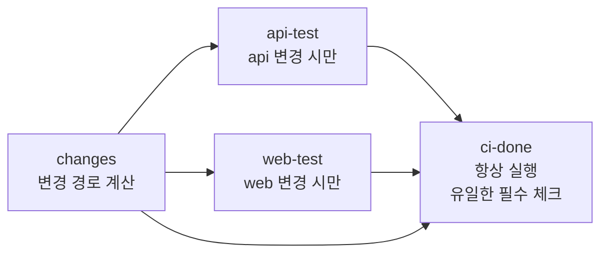

# 9장. 빠르고 싼 파이프라인 — 캐시, 아티팩트, 동시성, 모노레포

유료로 GitHub Actions를 쓰는 저장소 가운데 의존성 캐시를 쓰는 곳은 셋에 하나꼴이다. Bouzenia와 Pradel이 2024년 ICSE에 발표한 GitHub Actions 비용 연구에서 캐시를 쓴 유료 저장소는 32.9%였다. 같은 연구에 따르면 Actions에 들어가는 자원의 91.2%가 테스트와 빌드에 쓰였다. 돈과 시간의 대부분이 매번 같은 일을 반복하는 데 들어가는데, 반복을 줄이는 가장 기초적인 장치는 셋 중 둘이 쓰지 않고 있다는 뜻이다.

놀라운 수치지만, 막상 자기 저장소를 들여다보면 고개가 끄덕여진다. 8장에서 만든 최소 워크플로를 떠올려 보자. 돌기는 잘 돈다. 그런데 PR에 커밋을 하나 올릴 때마다 러너는 빈손으로 시작해 의존성을 전부 새로 내려받는다. 커밋을 연달아 세 번 올리면 이미 낡은 앞의 두 런도 끝까지 돈다. 모노레포라면 문서 한 줄을 고쳐도 모든 서비스의 테스트가 돈다. 하나하나는 몇 분의 낭비지만, 사람 수와 하루 실행 횟수를 곱하면 이야기가 달라진다.

## 느린 CI의 값은 누가 치르는가

뱅크샐러드는 2022년 CI 최적화 경험을 공유하며 이렇게 계산했다. "하나의 action이 3분이 걸린다면 20명의 동료들이 한 번씩만 사용한다고 하더라도 1시간이 허비될 수 있습니다." 이 팀은 캐시를 손봐 의존성 설치를 1분 8초에서 21초로 줄였고, 전체 CI를 약 40초로 만들었다고 보고했다.

이 계산이 말해 주는 것은 CI의 비용이 러너 요금만이 아니라는 점이다. 더 큰 비용은 기다리는 사람의 시간이다. 7장에서 본 것처럼 필수 체크는 머지 버튼 앞을 지키는 문지기다. 문지기의 판정이 느리면 그 앞에 선 모든 PR이 같이 느려진다. 느린 CI는 개발자가 PR을 올린 뒤 다른 일로 문맥을 옮기게 만들고, 돌아왔을 때는 이미 흐름이 끊겨 있다.

물론 러너 요금도 무시할 수 없다. Bouzenia와 Pradel의 연구에서 유료 저장소는 평균 연 504달러를 Actions에 썼다. 실행을 부른 트리거를 보면 PR이 50.7%, push가 30.9%, 스케줄이 15.5%였다. 스케줄 비중이 생각보다 크다. 연구진은 더 이상 활동이 없는 저장소에서 예약 워크플로만 꺼도 실행 시간을 1.1~31.6% 줄일 수 있다고 추정했다. 아무도 보지 않는 야간 빌드가 매일 밤 조용히 돌고 있다면, 가장 쉬운 절감은 그 스케줄을 끄는 일이다.

우리 워크플로는 어디서 새고 있을까? 흔히 보는 모양을 하나 놓고 따져 보자.

```yaml
name: CI

on: [push, pull_request]

jobs:
  test:
    runs-on: ubuntu-latest
    steps:
      - uses: actions/checkout@v7
      - uses: actions/setup-node@v7
        with:
          node-version: '22'
      - run: npm ci
      - run: npm test
```

짧고 깔끔해 보이지만 찜찜한 구석이 세 군데 있다. 첫째, `on: [push, pull_request]`는 모든 브랜치의 push와 모든 PR에 반응한다. PR 브랜치에 커밋을 올리면 push 이벤트와 pull_request 이벤트가 둘 다 발생해 같은 커밋을 두 번 검사한다. 둘째, 매 실행이 의존성을 처음부터 설치한다. 셋째, 낡은 런을 멈추는 장치가 없다. 이 세 가지를 하나씩 고쳐 간다. 첫 번째는 8장에서 이미 답을 봤다. push는 `main`으로만 좁히고, PR 브랜치의 검사는 `pull_request`에 맡긴다.

```yaml
on:
  pull_request:
  push:
    branches: [main]
```

이 세 줄만으로 PR 브랜치의 커밋마다 두 번씩 돌던 검사가 한 번으로 줄어든다. 가장 싼 최적화는 돌 필요가 없는 것을 돌리지 않는 일이다. 같은 눈으로 저장소의 다른 워크플로도 훑어보자. 문서 사이트 빌드나 린트처럼 필수 체크가 아닌 워크플로라면 `paths`나 `paths-ignore` 필터로 관련 없는 변경에서 건너뛰게 해도 안전하다. 반대로 필수 체크를 만드는 워크플로에 경로 필터를 걸면 곤란한 일이 생기는데, 이 문제는 뒤의 모노레포 절에서 따로 다룬다. 예약 워크플로도 점검 대상이다. 누가 왜 만들었는지 아무도 기억하지 못하는 야간 빌드가 있다면, 그 결과를 실제로 보는 사람이 있는지부터 물어보자. 결과를 아무도 보지 않는 검사는 안심도 판단도 주지 못한다. 7장에서 CI를 "안심과 판단의 도구"라고 했던 것을 떠올리면, 그런 검사는 러너 시간만 쓰는 셈이다.

## 캐시 — 무엇을 기억하고 언제 잊는가

캐시는 한 실행에서 만든 파일을 저장해 두었다가 다음 실행에서 되살리는 장치다. 가장 흔한 대상은 패키지 매니저가 내려받은 의존성이다. `actions/cache`로 npm 캐시를 저장하는 모양은 이렇다.

```yaml
      - uses: actions/cache@v6
        with:
          path: ~/.npm
          key: npm-${{ runner.os }}-${{ hashFiles('package-lock.json') }}
          restore-keys: |
            npm-${{ runner.os }}-
      - run: npm ci
```

핵심은 `key`다. 키에 잠금 파일의 해시를 넣었기 때문에, 의존성이 바뀌지 않는 한 같은 키가 나오고 저장된 캐시를 그대로 쓴다. 의존성이 바뀌면 키도 바뀌어 새 캐시를 만든다. 그럼 의존성이 한 줄 바뀔 때마다 빈손으로 시작해야 할까? 그래서 `restore-keys`가 있다. GitHub Docs가 설명하는 매칭 순서는 이렇다. 먼저 `key`와 정확히 일치하는 캐시를 찾는다. 없으면 `key`와 부분적으로 일치하는 캐시를 찾고, 그래도 없으면 `restore-keys`를 위에서부터 차례로 부분 일치로 찾는다. 위 예제에서는 잠금 파일이 바뀌었어도 같은 운영체제의 가장 최근 npm 캐시를 되살려 쓰고, 달라진 패키지만 새로 받는다. 언어별 셋업 액션이 캐시 옵션을 내장한 경우도 많으니(`actions/setup-node`의 `cache: npm` 입력 등), 직접 `actions/cache`를 쓰기 전에 확인해 볼 만하다.

여기까지는 대부분 알고 있다. 흔한 오해는 캐시의 **범위**에서 생긴다. GitHub Docs는 이렇게 적는다.

> "Workflow runs can restore caches created in either the current branch or the default branch (usually `main`). If a workflow run is triggered for a pull request, it can also restore caches created in the base branch."
>
> "Workflow runs cannot restore caches created for child branches or sibling branches."

`feature-a` 브랜치에서 만든 캐시를 `feature-b` 브랜치가 쓸 수 없다는 뜻이다. 동료가 방금 같은 의존성으로 캐시를 만들어 두었어도, 내 브랜치의 첫 실행은 그 캐시를 보지 못한다. 내 브랜치가 기댈 수 있는 것은 기본 브랜치와 PR의 base 브랜치 캐시뿐이다.

그래서 실무에서 중요한 것은 `main`의 캐시를 늘 따뜻하게 유지하는 일이다. `main`에 push될 때 CI가 돌며 캐시를 저장해 두면, 새로 따는 모든 브랜치가 첫 실행부터 그 캐시를 되살린다. 8장에서 `push: branches: [main]`을 트리거에 남겨 둔 이유가 하나 더 생긴 셈이다.

캐시는 영원하지 않다. GitHub는 7일 넘게 접근하지 않은 캐시 항목을 지우고, 저장소당 캐시 용량은 기본 10GB다(2026년 9월 기준). 이 한도는 조직이나 저장소 관리자가 늘릴 수 있고 초과분은 유료로 확장할 수 있다. 용량이 차면 마지막으로 쓰인 지 오래된 항목부터 밀려나는데, 매트릭스 조합마다 큰 캐시를 따로 저장하면 생각보다 빨리 찬다. 캐시 적중률이 이유 없이 떨어졌다면 용량부터 의심할 일이다. 셀프호스트 러너에서는 GitHub 캐시 저장소와의 전송이 오히려 느리다는 경험담도 있으니(Discussion #18549, 커뮤니티 의견), 그런 환경이라면 러너 기계의 로컬 디스크를 활용하는 쪽이 나을 수 있다.

무엇을 캐시에 넣을지도 생각해 볼 문제다. 잠금 파일로 내용이 결정되는 의존성 다운로드는 캐시하기 좋은 대상이다. 키만 보면 무엇이 들어 있는지 알 수 있기 때문이다. 반면 빌드 산출물이나 테스트 중간 결과처럼 코드 전체에 따라 달라지는 것을 넓은 키로 캐시하면, 낡은 결과가 되살아나 "로컬에서는 실패하는데 CI에서는 통과하는" 기묘한 현상을 만든다. 신뢰의 문제도 있다. GitHub Docs는 `pull_request_target`에서 신뢰할 수 없는 코드를 실행하면 생길 수 있는 취약점으로 캐시 오염(cache poisoning)을 꼽는다. 캐시는 다른 실행이 믿고 되살리는 파일이니, 누가 그 캐시를 쓸 수 있는지는 11장에서 보안의 눈으로 다시 본다.

기억해두자. 캐시는 "있으면 빨라지는 것"이지 "있어야 동작하는 것"이 아니다. 캐시가 통째로 사라져도 워크플로는 느려질 뿐 정확히 돌아야 한다. 이 원칙이 다음에 볼 아티팩트와 캐시를 가르는 기준이다.

## 아티팩트 — 캐시와 헷갈리지 말자

아티팩트도 파일을 저장한다는 점에서는 캐시와 닮았다. 하지만 목적이 다르다. 캐시가 다음 실행을 빠르게 하려고 쓰는 것이라면, 아티팩트는 이번 실행이 만든 결과물을 전달하거나 보관하려고 쓴다. 빌드 결과물을 배포 잡에 넘기거나, 테스트 리포트와 스크린샷을 나중에 내려받아 보려고 남기는 것이 아티팩트의 일이다. 8장에서 "옆 조리대에 재료를 넘기는 수단"이라고 했던 그것이다.

```yaml
jobs:
  build:
    runs-on: ubuntu-latest
    steps:
      - uses: actions/checkout@v7
      - run: npm ci && npm run build
      - uses: actions/upload-artifact@v7
        with:
          name: dist
          path: dist/

  e2e:
    needs: build
    runs-on: ubuntu-latest
    steps:
      - uses: actions/checkout@v7
      - uses: actions/download-artifact@v8
        with:
          name: dist
          path: dist/
      - run: npm ci && npm run test:e2e
```

`build` 잡이 한 번 만든 결과물을 `e2e` 잡이 그대로 받아 쓴다. 두 잡이 따로 빌드하면 시간도 두 배지만, 더 곤란한 것은 두 빌드 결과가 미묘하게 다를 수 있다는 점이다. 한 번 빌드한 것을 검사하고, 검사한 그것을 배포해야 한다.

아티팩트 액션은 최근 몇 년 사이 큰 변화를 겪었다. GitHub는 2025년 1월 30일부터 `actions/upload-artifact`와 `actions/download-artifact`의 v3 사용을 막았다. 2024년 4월 공지에 따르면 v4는 백엔드를 새로 설계해 최악의 경우 업로드가 90% 이상 빨라졌고, 워크플로 런의 잡 하나가 만들 수 있는 아티팩트는 500개로 제한된다. 오래된 워크플로가 어느 날 갑자기 실패한다면 버전이 첫 번째 용의자다. 그 뒤로도 메이저 버전은 계속 올라가, 2026년 9월 기준 최신은 `upload-artifact` v7, `download-artifact` v8이다. 두 액션의 버전 숫자가 짝을 이루지 않는다는 점도 눈여겨보자. 이 영역은 계속 움직이고 있으니 지금 쓸 메이저 버전은 액션 저장소의 릴리스 페이지에서 확인하는 편이 안전하다.

아티팩트 저장에도 플랜별 한도가 있다. 2026년 9월 GitHub Docs 기준으로 Free 500MB, Pro 1GB, Team 2GB, Enterprise Cloud 50GB다. 적용 단위와 과금 방식은 바뀌기 쉬우니 Docs에서 확인하자. 한도에 여유를 두는 기본기는 필요한 때에만 올리는 것이다. E2E 테스트의 스크린샷과 영상은 실패를 분석할 때나 필요하니, 실패했을 때만 올리도록 조건을 걸자.

```yaml
      - run: npm run test:e2e
      - if: failure()
        uses: actions/upload-artifact@v7
        with:
          name: e2e-screenshots
          path: test-results/
          retention-days: 7
```

`if: failure()`는 앞선 스텝이 실패했을 때만 이 스텝을 실행한다. 통과한 수백 번의 실행에서는 아무것도 올리지 않고, 실패한 한 번에서만 분석 자료를 남긴다. 보관 기간도 기본값에 맡기지 말고 팀이 실제로 들여다보는 기간만큼으로 줄이는 편이 낫다. `retention-days` 옵션이 그 일을 한다.

## 동시성 — 낡은 런은 버린다

PR을 올리고 나서 오타를 발견해 커밋을 하나 더 올리고, 테스트 하나를 고쳐 또 올렸다고 해보자. 세 번의 push가 세 개의 워크플로 런을 만든다. 그런데 우리가 궁금한 것은 마지막 커밋의 결과뿐이다. 앞의 두 런은 결과가 나와도 아무도 보지 않는다. 그런데도 러너를 붙잡고 끝까지 돈다. 동시 잡 한도가 있는 팀이라면 이 쓸모없는 런들이 다른 PR의 검사까지 줄 세운다.

`concurrency`가 이 문제를 푼다. 같은 그룹 이름을 가진 런은 동시에 하나만 돌게 하고, `cancel-in-progress: true`를 주면 새 런이 올 때 진행 중인 옛 런을 취소한다.

```yaml
concurrency:
  group: ${{ github.workflow }}-${{ github.head_ref || github.run_id }}
  cancel-in-progress: true
```

그룹 이름의 뒷부분이 이 패턴의 요령이다. `github.head_ref`는 PR 이벤트에서만 값이 있는 PR 브랜치 이름이다. 그래서 같은 PR의 런들은 같은 그룹에 묶여 옛 런이 취소된다. `main`에 대한 push처럼 `head_ref`가 비어 있는 이벤트에서는 런마다 고유한 `github.run_id`가 그룹 이름이 되니, 아무것도 취소되지 않는다. `main`의 커밋은 하나하나가 검증과 캐시 저장의 대상이니 끝까지 도는 편이 맞다. 앞에 워크플로 이름을 붙인 것은 같은 PR에서 도는 서로 다른 워크플로가 서로를 취소하지 않게 하려는 것이다.

`cancel-in-progress` 없이 그룹만 지정하면 어떻게 될까? GitHub Docs는 이렇게 설명한다.

> "When you limit concurrency, by default only one run can be pending in a concurrency group—any additional pending runs cancel the previous one."

그룹 안에서 하나가 돌고, 하나만 대기한다. 세 번째 런이 오면 대기하던 두 번째 런이 취소된다. PR 검사에는 이 동작이 충분하지만, 배포처럼 순서대로 전부 돌아야 하는 작업에는 곤란하다. 이 지점에서 2026년 5월에 새 옵션이 생겼다. `queue: max`를 주면 그룹 안에서 최대 100개까지 대기시킬 수 있다. 다만 `queue: max`와 `cancel-in-progress: true`는 함께 쓸 수 없고, 같이 적으면 워크플로 검증 오류가 난다. "대기하는 것은 모두 살리겠다"와 "진행 중인 것을 죽이겠다"는 서로 모순된 요구이니 당연한 제약이다. 이 옵션은 나온 지 얼마 되지 않았다. "대기는 항상 하나뿐"이라고 설명하는 이전 자료와 충돌하니 주의하자. 배포 직렬화에 이 옵션을 어떻게 쓰는지는 10장에서 이어서 본다.

## 모노레포 — paths 필터가 필수 체크를 만날 때

모노레포에서 CI 비용을 줄이려는 첫 시도는 거의 늘 같다. 서비스별 워크플로를 만들고, 각 워크플로에 `paths` 필터를 걸어 자기 폴더가 바뀔 때만 돌게 한다. 그리고 각 워크플로를 필수 체크로 지정한다. 여기서 사고가 난다.

`services/web`만 고친 PR을 올렸다고 해보자. `api` 워크플로는 `paths` 필터에 걸려 아예 시작하지 않는다. 그런데 보호 규칙은 `api` 체크를 필수로 기다리고 있다. 시작하지 않은 워크플로는 결과를 보고하지 않으니, 체크는 영원히 "대기 중"으로 남고 PR은 머지할 수 없다. GitHub Community의 Discussion #13690이 바로 이 문제로 2022년 3월에 열렸고, 101개의 추천을 받으며 지금까지 이어지고 있다. 한 참여자는 2022년 11월에 이렇게 썼다.

> "we've been asking for it for 3 years now, the only way to safely protect branches in this scenario is to run all checks always."

2026년 8월에도 "이 문제 때문에 GH Actions를 떠날까 주기적으로 고민한다"는 글이 올라왔다(커뮤니티 의견). 그렇다면 모든 검사를 항상 돌리는 것만이 답일까? 커뮤니티가 다듬어 온 우회 패턴이 있다. 경로 판정을 워크플로 트리거에서 잡 안으로 옮기는 것이다.


그림 1. 변경 감지 잡이 하위 잡의 실행 여부를 정하고, 항상 도는 집계 잡 하나만 필수 체크가 된다

워크플로는 모든 PR에서 항상 시작한다. 첫 잡이 바뀐 경로를 계산하고, 서비스별 잡은 그 결과를 보고 스스로 건너뛴다. 마지막 집계 잡은 무슨 일이 있어도 돌아서 전체 판정을 내린다. 필수 체크로는 이 집계 잡 하나만 지정한다.

```yaml
name: CI

on:
  pull_request:
  push:
    branches: [main]

permissions:
  contents: read

jobs:
  changes:
    runs-on: ubuntu-latest
    outputs:
      api: ${{ steps.diff.outputs.api }}
      web: ${{ steps.diff.outputs.web }}
    steps:
      - uses: actions/checkout@v7
        with:
          fetch-depth: 0
      - id: diff
        env:
          EVENT_NAME: ${{ github.event_name }}
          BASE_SHA: ${{ github.event.pull_request.base.sha }}
        run: |
          if [ "$EVENT_NAME" != "pull_request" ]; then
            echo "api=true" >> "$GITHUB_OUTPUT"
            echo "web=true" >> "$GITHUB_OUTPUT"
            exit 0
          fi
          changed="$(git diff --name-only "$BASE_SHA"...HEAD)"
          if echo "$changed" | grep -qE '^(services/api/|libs/shared/)'; then
            echo "api=true" >> "$GITHUB_OUTPUT"
          fi
          if echo "$changed" | grep -qE '^(services/web/|libs/shared/)'; then
            echo "web=true" >> "$GITHUB_OUTPUT"
          fi

  api-test:
    needs: changes
    if: needs.changes.outputs.api == 'true'
    runs-on: ubuntu-latest
    steps:
      - uses: actions/checkout@v7
      - run: make -C services/api test

  web-test:
    needs: changes
    if: needs.changes.outputs.web == 'true'
    runs-on: ubuntu-latest
    steps:
      - uses: actions/checkout@v7
      - run: make -C services/web test

  ci-done:
    needs: [changes, api-test, web-test]
    if: always()
    runs-on: ubuntu-latest
    steps:
      - name: 하위 잡 결과 확인
        if: contains(needs.*.result, 'failure') || contains(needs.*.result, 'cancelled')
        run: exit 1
      - run: echo "필요한 검사가 모두 통과했거나 건너뛰었다"
```

이 YAML에는 이 패턴을 쓰다 흔히 밟는 함정 두 개가 녹아 있다.

첫 번째는 `fetch-depth`다. `actions/checkout`은 기본적으로 최신 커밋 하나만 가져온다. 이 상태에서 base 커밋과 비교하려 들면 비교할 이전 이력이 없다. 그래서 `changes` 잡은 `fetch-depth: 0`으로 전체 이력을 받는다. 저장소가 아주 크다면 필요한 깊이만 받도록 조정할 수 있지만, 우선은 정확하게 동작하는 쪽에서 출발하자.

두 번째가 더 까다롭다. `needs`의 눈으로 보면 건너뛴(skipped) 잡은 성공(success)이 아니다. 8장에서 본 것처럼 조건 없는 잡은 앞 잡이 모두 성공해야 돈다. `ci-done`에 `if: always()`가 없다면, `web-test`가 건너뛰어진 순간 `ci-done`도 따라서 건너뛴다. 더 위험한 경우도 있다. `api-test`가 실패했을 때도 `ci-done`이 건너뛰어지는데, GitHub Docs에 따르면 건너뛴 잡은 상태를 "Success"로 보고하고, 필수 체크여도 머지를 막지 않는다. 테스트가 실패한 PR이 머지될 수 있다는 뜻이다. 그래서 `ci-done`은 `always()`로 항상 돌게 하고, 대신 `needs.*.result`를 직접 들여다보며 실패나 취소가 하나라도 있으면 스스로 실패한다. 건너뛴 것은 통과로, 실패와 취소는 실패로 판정하는 규칙을 우리가 명시적으로 쓰는 것이다.

`libs/shared/`가 두 정규식에 모두 들어 있는 데도 이유가 있다. 워크플로 수준의 `paths` 필터는 공유 코드의 의존 관계를 모른다. 잡 안에서 판정하면 "공용 라이브러리가 바뀌면 그것을 쓰는 서비스를 모두 검사한다" 같은 규칙을 자유롭게 적을 수 있다. 서비스가 많아지면 이 판정을 빌드 도구의 의존 그래프에 맡기는 방향으로 발전시키면 된다. 이 집계 잡 패턴은 13장에서 머지 큐와 결합할 때 다시 등장한다.

## 어디서 돌리고 어떻게 기다릴 것인가 — 러너와 피드백 루프

러너 선택은 비용 문제처럼 보이지만, 실제로는 비용·보안·하드웨어가 얽힌 결정이다. GitHub 호스트 러너는 관리가 필요 없고, 잡마다 깨끗한 기계에서 시작한다는 보안상의 장점이 있다. 셀프호스트 러너는 사내망 접근, GPU나 ARM 같은 특수 하드웨어, 기계에 오래 남는 빌드 캐시가 필요할 때 고른다. 2025년 12월 Hacker News 토론에서 한 참여자는 이렇게 정리했다.

> "The primary reason teams use self-hosted is not to save money, but for security (VPC access) and specialized hardware (GPUs/ARM)."

가격 쪽은 최근 크게 흔들렸다. GitHub는 2025년 12월 16일 공지에서 2026년 1월 1일부터 GitHub 호스트 러너 가격을 최대 39% 낮추겠다고 밝히면서, 동시에 2026년 3월 1일부터 셀프호스트 러너에도 분당 0.002달러의 플랫폼 요금을 매기겠다고 예고했다. 반발은 즉각적이었다. "셀프호스트 러너의 시간은 내 기계의 처리 시간인데 왜 분당 요금을 받느냐"는 항의가 이어졌고, GitHub는 이틀 만에 "접근 방식을 재검토하겠다"며 셀프호스트 요금 변경을 연기했다. 한 개발자의 반응은 짧았다. "Postponed, not abandoned." 2026년 중반까지 셀프호스트 요금은 시행되지 않은 상태로 알려져 있지만, 재도입 여부는 GitHub의 공지를 직접 확인하자. 이 사건이 알려 주는 것은, 러너 선택이 벤더의 가격 정책에 기대는 결정이기도 하다는 점이다. 비용 비교표를 만들었다면 그 표에도 날짜를 적어 두자.

무엇을 기준으로 고를까? 순서대로 물어보면 대개 답이 나온다. 먼저, 빌드가 사내망이나 특수 하드웨어를 꼭 필요로 하는가? 그렇다면 셀프호스트 러너가 사실상 유일한 선택이다. 다음으로, 외부 기여자의 PR을 받는 공개 저장소인가? 그렇다면 셀프호스트 러너는 피하자. 아무나 PR을 올려 우리 기계에서 코드를 실행할 수 있기 때문인데, 이 위험은 11장에서 자세히 본다. 마지막으로, 둘 다 해당하지 않는다면 GitHub 호스트 러너에서 출발하고, 대기 시간과 요금이 실제로 문제가 될 때 다시 따져 보자. 셀프호스트 러너를 들이면 기계와 함께 그 기계를 패치하고 감시하고, 오염되면 갈아엎을 책임까지 떠안게 된다.

러너 요금보다 더 자주 개발자를 괴롭히는 비용이 있다. push하고 기다리는 시간이다. 워크플로 자체를 고칠 때 특히 그렇다. 한 개발자는 Actions의 가장 큰 문제로 이것을 꼽았다.

> "the lack of a tight feedback loop. Pushing and waiting for completion on what's often a very simple failure mode is frustrating."

오타 하나를 확인하려고 커밋하고, push하고, 러너가 뜨기를 기다리고, 로그를 여는 과정을 열 번 반복해 본 적이 있다면 이 좌절감을 안다. 워크플로를 로컬에서 흉내 내는 도구도 있지만, 지원하려면 이런저런 결정을 따로 내려야 해서 "그냥 되지는 않는다"는 경험담이 많다(커뮤니티 의견).

해법은 무엇일까? 커뮤니티에서 반복해서 나오는 답은 YAML을 얇게 두는 것이다. "대부분의 CI는 빌드 시스템으로 들어가는 입구로만 쓰면 괜찮다"는 말처럼, 빌드와 테스트의 실제 로직은 `make`, `just`, `mise` 같은 로컬에서 도는 도구에 두고, 워크플로는 그 도구를 부르기만 한다.

```yaml
    steps:
      - uses: actions/checkout@v7
      - run: make ci
```

이렇게 하면 CI에서 실패한 명령을 로컬에서 그대로 재현할 수 있다. 워크플로 파일이 바뀌는 일도 줄어들어 push하고 기다리는 루프에 갇히는 횟수가 줄어든다. 앞의 모노레포 예제가 서비스별 테스트를 `make -C services/api test`로 부른 것도 같은 이유다. 나중에 다른 CI로 옮겨야 할 때 다시 써야 할 부분이 줄어드는 것은 덤이다.

## 한 줄 공식으로 셈해 보자

이 장에서 캐시로 설치 시간을 줄이고, 아티팩트로 중복 빌드를 없애고, 동시성으로 낡은 런을 버리고, 모노레포에서는 필요한 검사만 돌리는 법을 살펴봤다. 그런데 이 가운데 무엇부터 손대야 할까? 모든 최적화에는 YAML이 복잡해지는 대가가 따른다. 투자할 가치가 있는지 가늠할 셈법이 필요하다.

> CI 한 번의 비용 = 대기 시간 × 기다리는 사람 수 × 하루 실행 횟수

뱅크샐러드의 계산이 바로 이 공식이다. 3분 × 20명 × 1회 = 60분. 이번에는 가상의 팀 하나를 넣어 본다. PR 검사가 12분 걸리고, PR 하나에 작성자 한 명이 결과를 기다리며, 팀 전체에서 하루에 PR 검사가 40번 돈다고 해보자. 12분 × 1명 × 40회 = 480분, 하루 여덟 시간이다. 팀원 한 명의 하루가 매일 CI 앞에서 사라지는 셈이다. 캐시와 동시성 설정으로 검사를 6분으로 줄이면 매일 네 시간이 돌아온다. 러너 요금 절감은 그 위에 얹히는 보너스다.

이제 자기 팀의 값을 넣어 보자. Actions 탭에서 최근 일주일 PR 검사의 평균 소요 시간을 보고, 하루 실행 횟수를 세고, 결과를 기다리는 사람이 몇 명인지 떠올린다. 머지 큐처럼 여러 사람이 한 줄로 기다리는 구조라면 "기다리는 사람 수"가 한 명보다 훨씬 커진다는 점도 함께 적어 두자. 나온 숫자가 이 장의 기법들 가운데 어디에 먼저 손을 댈지 알려 줄 것이다.

## 이 장의 핵심

- 느린 CI의 가장 큰 비용은 기다리는 사람의 시간이다. 대기 시간 × 기다리는 사람 수 × 하루 실행 횟수로 셈해 보면 우선순위가 보인다.
- 캐시는 현재 브랜치, 기본 브랜치, PR의 base 브랜치에서만 복원된다. `main`의 캐시를 따뜻하게 유지하고, 캐시가 없어도 정확히 도는 워크플로를 만든다.
- 아티팩트는 이번 실행의 결과물을 넘기는 수단이다. 한 번 빌드한 것을 검사하고 배포한다.
- `concurrency`와 `cancel-in-progress`로 PR의 낡은 런을 버리되, `main`의 런은 끝까지 돌게 그룹 이름을 설계한다.
- 모노레포에서는 `paths` 필터 워크플로를 필수 체크로 두지 않는다. 변경 감지 잡과 항상 도는 집계 잡을 두고, 집계 잡 하나만 필수 체크로 지정한다.
