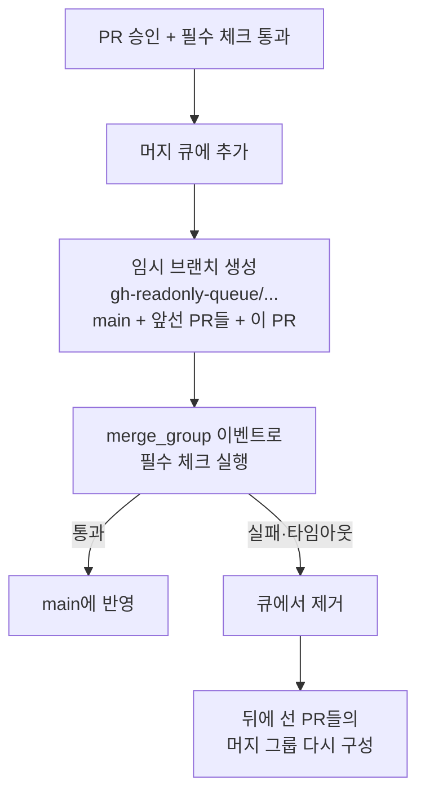

# 12장. 검증한 것을 머지한다 — 머지 큐는 무엇을 보장하는가

## 기차를 타고 여덟 시간을 기다리던 시절

GitHub에는 한때 "기차(train)"가 다녔다. 머지 큐가 생기기 전, GitHub 사내 모놀리식 저장소에 변경을 싣는 방식이다. 2024년 3월 GitHub 엔지니어링 블로그에 이 시절을 돌아보는 글이 올라왔는데, 설명은 이렇다. "A train was a special pull request that grouped together multiple pull requests (passengers)." 기차는 여러 PR을 승객처럼 태운 특별한 PR이었다. 한 번에 최대 15개까지 태웠다고 한다.

승객 입장에서 보면 어떨까? 같은 글에 이런 문장이 있다. 기차에 탄 뒤 "wait 8+ hours after joining a train for it to ship, only for it to be removed due to a conflict". 여덟 시간 넘게 기다렸는데 다른 승객과 충돌이 났다며 내리라는 것이다. 다시 줄을 서야 한다. 아찔한 일이다. 하루 업무 시간을 통째로 기다렸는데 출발선으로 돌아간 셈이니까.

GitHub는 이 기차를 머지 큐로 바꿨다. 같은 글은 30,000건이 넘는 PR과 그에 딸린 450만 번의 CI 실행을 머지 큐로 처리했고, 변경을 배포하기까지 평균 대기 시간이 33% 줄었다고 보고한다. 모놀리식 저장소에 30개 이상의 배포를 동시에 진행할 수 있게 됐다는 말도 있다. 사내 개발자 한 명은 이렇게 평했다. "one of the best quality-of-life improvements to shipping changes that I've seen at GitHub!"

그렇다면 GitHub는 왜 애초에 기차 같은 번거로운 장치를 만들었을까? 그냥 각자 PR을 머지하면 안 됐을까? 답은 이 책의 첫 장면에 있다. 1장에서 본 오후를 떠올려 보자. PR 두 개가 각자 초록 체크를 받고 머지됐는데 `main`이 빨개졌다. 기차는 그 장면을 막으려던 장치였고, 머지 큐도 마찬가지다. 8~11장에서 우리는 필수 체크를 돌릴 파이프라인을 빠르고 안전하게 다듬었다. 하지만 체크가 아무리 믿을 만해도, 체크가 검사한 커밋과 `main`에 들어간 커밋이 다르다면 그 초록은 아무것도 보증하지 못한다. 이제 그 장면을 정면으로 다룰 때가 됐다.

## 머지 레이스는 어디서 생기는가

1장에서 머지 레이스를 "각 PR은 초록인데 합치면 `main`이 깨지는 현상"이라고 정의했다. 왜 이런 일이 생기는지 조금 더 깊이 들어가보자.

1장의 두 PR을 A와 B라고 부르자. 둘 다 A가 머지되기 전의 `main`에서 갈라져 나왔다. A는 결제 모듈의 `calculateFee`를 `computeFee`로 바꾸고 호출하는 곳을 전부 고쳤다. B는 정산 화면에 수수료를 보여 주려고 `calculateFee`를 새로 호출했다. 두 PR은 서로 다른 파일을 건드렸으니 Git은 충돌 없이 둘을 합친다. CI도 각각 초록이다. A의 CI는 "B가 없는 `main` + A"를 검사했고, B의 CI는 "A가 없는 `main` + B"를 검사했기 때문이다. 그런데 둘이 모두 머지된 `main`은 "`main` + A + B"다. 아무도 이 조합을 검사하지 않았다. B가 부르는 `calculateFee`는 이제 존재하지 않는다. 빌드가 깨진다.

핵심은 여기 있다. CI가 검사한 커밋과 실제로 `main`에 들어간 커밋이 다르다. 이 책이 1장부터 붙들고 온 두 번째 축, "검증된 것 = 머지된 것"이 깨지는 순간이다. Shopify는 2018년 자사 머지 큐를 소개하며 이 현상을 이렇게 적었다. "Occasionally, master merges can go wrong. For example, two unrelated merges can affect one another, the introduction of a new flaky test, or even accidental merges of work in progress." 서로 무관해 보이는 두 머지가 서로에게 영향을 준다는 것이다.

물론 4장에서 본 장치가 있다. 필수 상태 체크를 strict 모드로 두면 "The branch **must** be up to date with the base branch before merging." 즉 `main`을 따라잡은 상태에서만 머지할 수 있다. A가 먼저 머지되면 B는 `main`을 다시 받아와 CI를 다시 돌려야 하고, 그 과정에서 깨진 조합이 드러난다. 머지 레이스는 막힌다.

하지만 대가가 있다. PR이 하루에 몇 건뿐인 팀이라면 견딜 만하다. 그런데 PR이 수십 건씩 몰리면 어떻게 될까? 누군가 머지할 때마다 나머지 모든 PR이 낡은 상태가 된다. 모두가 "Update branch"를 누르고 CI를 다시 기다린다. 그사이 또 누군가 머지하면 다시 낡는다. 먼저 초록을 받는 사람이 이기는 경주다. 경주에서 진 사람은 방금 받은 초록을 버리고 처음부터 기다려야 한다. CI가 20분 걸린다면 하루가 이렇게 녹는다.

그러니 선택지는 둘 중 하나처럼 보인다. loose 모드로 두고 머지 레이스를 감수하거나, strict 모드로 두고 끝없는 따라잡기 경주를 감수하거나. 정말 그것뿐일까? 따라잡기와 재검사를 사람 대신 기계가 순서대로 해 주면 어떨까? 머지 큐가 바로 그 발상이다.

## 뿌리 — 항상 테스트를 통과하는 저장소

이 발상은 새롭지 않다. 흔히 그 뿌리로 Graydon Hoare가 2014년에 정리한 "Not Rocket Science Rule"을 꼽는다. 널리 인용되는 요지는 "automatically maintain a repository of code that always passes all the tests"다. 다만 Graydon의 원문 페이지는 이 책을 쓰는 시점에 접근이 막혀 있어서, 여기서는 bors 프로젝트 등을 통한 2차 인용으로 옮긴다는 점을 밝혀 둔다.

규칙의 내용은 이름처럼 단순하다. 사람이 `main`에 직접 머지하지 않는다. 대신 봇에게 "이걸 머지해 줘"라고 요청한다. 봇은 `main`에 그 변경을 합친 결과를 테스트하고, 통과했을 때만 `main`을 그 결과로 옮긴다. 테스트한 커밋과 `main`에 들어가는 커밋이 정확히 같다. 이 규칙을 구현한 봇이 bors다. 이후 커뮤니티에서는 GitHub 머지 큐와 GitLab의 머지 트레인(merge train)을 모두 bors의 계보로 본다. 그 bors-ng는 2023년 4월 30일 메인테이너가 "feature frozen and deprecated"를 선언하며 사실상 은퇴했다. GitHub가 네이티브 머지 큐를 내놓았기 때문이다.

규모가 아주 커지면 이야기가 달라진다. 변경을 하나씩 줄 세워 테스트하는 직렬 큐는 금세 한계에 닿는다. Uber의 SubmitQueue(EuroSys 2019)가 이 문제를 다뤘다. 저자 발표 자료에 따르면 동시에 들어오는 변경이 늘수록 서로 충돌할 확률이 5%에서 40%까지 오른다. 그렇다고 가능한 조합을 모두 미리 빌드하면 변경 n개에 2^n개의 빌드가 필요하다. 그래서 SubmitQueue는 각 변경이 성공할 확률을 예측해 가치 있는 조합만 미리 빌드하고(투기 실행), 빌드 그래프를 분석해 서로 영향이 없는 변경은 병렬로 커밋한다. Uber 보고에 따르면 도입 전 iOS `main`은 일주일 표본에서 52%의 시간만 초록이었고, 도입 후에는 1년 넘게 항상 초록이었다고 한다.

여기서 한 가지 주의하자. SubmitQueue는 GitHub 머지 큐와 같은 문제를 풀지만 구현은 다르다. GitHub 머지 큐는 확률 예측이나 빌드 그래프 분석을 하지 않는다. SubmitQueue는 개념의 계보로, 즉 "직렬 큐 → 묶음 → 투기 실행"으로 진화하는 방향을 보여 주는 사례로만 읽는 편이 정확하다.

## GitHub 머지 큐는 어떻게 움직이는가

GitHub Docs는 머지 큐를 이렇게 정의한다. "A merge queue helps increase velocity by automating pull request merges into a busy branch and ensuring the branch is never broken by incompatible changes." 바쁜 브랜치로의 머지를 자동화하면서, 호환되지 않는 변경 때문에 그 브랜치가 깨지는 일은 없게 한다는 것이다. 2023년 7월 GA 공지는 핵심 약속을 더 짧게 말한다. "ensuring each pull request queued for merging is tested with any other pull requests queued ahead of it." 큐에 선 PR은 자기보다 앞에 선 모든 PR과 함께 테스트된다.

흐름을 따라가 보자. 리뷰 승인과 필수 체크를 통과한 PR을 개발자가 머지 버튼 대신 큐에 넣는다. 머지 큐는 `gh-readonly-queue/`로 시작하는 임시 브랜치를 만든다. 이 브랜치에는 현재 `main`, 큐에서 앞에 선 PR들, 그리고 이 PR의 변경이 차례로 쌓여 있다. 이렇게 만든 묶음을 머지 그룹이라고 부른다. 머지 큐는 머지 그룹마다 `merge_group` 이벤트를 보내고, CI는 이 임시 브랜치에서 필수 체크를 돌린다. 필수 체크가 통과하면 그 결과가 `main`에 반영된다.

그림 1. GitHub 머지 큐의 작동 흐름

실패하면 어떻게 될까? Docs는 PR이 큐에서 빠지는 사유를 네 가지로 적는다. CI가 머지 그룹의 테스트 실패를 보고한 경우("Configured CI service is reporting test failures for a merge group"), 성공 결과를 기다리다 시간이 초과된 경우("Timed out awaiting a successful CI result"), 사용자가 API나 화면에서 제거를 요청한 경우, 자동으로 해결할 수 없는 브랜치 보호 규칙 위반이 생긴 경우다. 실패한 PR이 빠지면 그 PR을 품고 있던 뒤쪽 머지 그룹들도 그대로 쓸 수 없다. 뒤에 선 PR들은 실패한 PR을 뺀 조합으로 다시 검사를 받는다.

여기서 머지 레이스가 어떻게 사라지는지 보이는가? 1장의 PR B는 큐에서 "`main` + A + B"라는 조합으로 검사된다. 깨진 조합은 `main`에 들어가기 전에 큐 안에서 걸러진다. strict 모드가 사람에게 시키던 따라잡기와 재검사를 머지 큐가 순서대로 대신한다. 그리고 앞선 PR이 통과할 것이라 가정하고 뒤쪽 그룹을 동시에 미리 검사하기 때문에, 순서대로 하나씩 기다리는 것보다 빠르다.

설정의 세부 — 동시에 몇 개의 그룹을 검사할지, 한 번에 몇 개의 PR을 묶을지, CI 응답을 얼마나 기다릴지 — 와 `merge_group` 트리거를 워크플로에 넣는 법은 13장에서 한 벌로 다룬다. 여기서는 원리만 붙들어 두자.

## 승인 후 대기라는 숨은 시간

머지 큐가 지우는 대기가 하나 더 있다. 6장에서 Kudrjavets 등(2022)이 찾은 두 종류의 대기를 봤다. 제안부터 첫 응답까지의 대기, 그리고 승인부터 머지까지의 대기. 이들의 분석에서 승인 후 머지까지의 시간을 줄이면 Phabricator 리뷰가 29~63% 빨라질 수 있었고, 저자들은 수동 머지를 자동 머지로 바꾸라고 권했다.

승인은 났는데 아무도 머지 버튼을 누르지 않는 시간. 작성자는 회의에 들어갔고, 돌아와 보니 `main`이 움직여서 브랜치를 다시 따라잡아야 하고, 그러다 퇴근 시간이 된다. 난감한 일이지만 너무 흔해서 아무도 대기로 세지 않는 시간이다.

6장에서 본 자동 머지가 이 시간을 줄이는 첫 번째 도구다. 조건이 채워지면 알아서 머지해 주니 사람이 버튼 앞에 대기하지 않아도 된다. 그렇다면 자동 머지와 머지 큐는 무엇이 다를까? 자동 머지는 "언제 머지할지"를 자동화한다. 그 PR 자체의 체크가 통과하면 머지한다. loose 모드라면 머지 레이스는 그대로 남는다. strict 모드라면 `main`이 움직일 때마다 브랜치를 따라잡고 재검사하는 경주도 그대로 남는다. 자동 머지가 기다려 줄 뿐이다. 머지 큐는 한 걸음 더 나아가 "무엇을 머지할지"를 보장한다. 앞선 PR과 합친 조합을 검사하고, 검사한 그 조합을 머지한다. 대기 제거와 머지 무결성을 한 장치가 함께 해결하는 셈이다.

## 실제 팀들이 얻은 것

앞서 본 GitHub 사내 사례 말고도 공개된 도입 사례가 몇 있다.

Shopify는 GitHub 네이티브 기능이 나오기 한참 전부터 자체 배포 도구 Shipit에 머지 큐를 넣어 썼다. 2018년 글에서 코어 애플리케이션 PR의 90% 이상이 이 큐를 거친다고 밝혔다. 2019년의 두 번째 버전은 더 흥미롭다. "a 'predictive branch,' implemented as a git branch, onto which pull requests are merged, and CI is run." PR들을 예측 브랜치에 쌓아 CI를 돌리는 방식이다. GitHub 머지 큐의 임시 브랜치와 닮았다. 한 번에 묶는 크기는 8로 정했는데, 그 이유가 "a batch size of 8 as a balance between throughput and risk"였다. 많이 묶을수록 처리량은 늘지만, 하나만 실패해도 묶음 전체가 흔들리는 위험도 커진다. 이 균형은 13장에서 처리량을 계산할 때 다시 만난다. 당시 Shopify가 내건 원칙의 첫 줄은 "Master must always be green (passing CI)"였다.

Block의 사례는 GA 발표에 실렸다. "We would routinely experience post-merge build failures in our monorepo several times a week and merge queue has practically eliminated all build failures in that category." 일주일에도 몇 번씩 겪던 머지 후 빌드 실패가 그 범주에서는 사실상 사라졌다는 것이다. 머지 레이스라는 한 가지 실패 유형을 거의 지워 버렸다는 뜻이다.

커뮤니티의 경험담도 대체로 같은 방향이다. 2026년 7월 Lobsters의 한 토론에서 한 사용자는 "the switch to merge queues was an enormous improvement in quality of life for both reviewers and PR authors."라고 했다. 같은 토론에서 다른 사용자는 선을 그었다. "Merge Queues don't replace CI, they're mostly a solution to merge races on project with a high throughput." 머지 큐의 자리는 처리량이 많은 프로젝트의 머지 레이스라는 말이다. 이 문장은 13장의 도입 판단에서 기준점이 된다.

## 보장의 경계 — 머지 큐가 틀린 날

여기까지 오면 머지 큐가 만능처럼 보인다. 그런데 2026년 4월 23일, 머지 큐가 `main`을 조용히 망가뜨리는 일이 일어났다.

그날 UTC 16시 5분부터 20시 43분까지, GitHub 머지 큐에서 스쿼시 머지 방식을 쓰고 머지 그룹에 PR이 두 개 이상 들어간 경우 잘못된 머지 커밋이 만들어졌다. 그 결과 앞서 머지된 PR의 변경이 뒤 PR의 머지로 되돌려졌다. GitHub의 설명에 따르면 원인은 아직 공개되지 않은 기능을 위해 만든 새 머지 베이스 계산 경로였다. 기능 플래그로 막혀 있어야 할 이 경로가 게이팅 누락으로 스쿼시 머지 그룹에 적용된 것이다. 머지 커밋·리베이스 방식의 그룹과 머지 큐를 거치지 않은 PR은 영향이 없었고, 커밋 자체는 Git에 남아 있어 데이터 손실은 없었다고 GitHub는 닷새 뒤 블로그에서 설명했다. 영향 규모는 인시던트 요약과 HN에 인용된 GitHub 측 발언의 수치가 서로 달라서 여기서는 옮기지 않는다.

Hacker News에 올라온 반응은 이 사고가 왜 끔찍한지 잘 보여 준다. 한 사용자는 "4 people spent hours putting our repo back together at my company."라고 썼다. 다른 사용자의 말은 더 서늘하다. "This happened in complete silence and since the PR was just code refactor I would most likely never noticed." 조용했다는 점이 핵심이다. CI는 초록이었고, 큐는 정상적으로 머지를 끝냈다고 알렸다. 그런데 `main`에 들어간 것은 검증한 것과 달랐다.

이 사고에서 두 가지를 배울 수 있다. 첫째, 머지 큐는 "검증된 것 = 머지된 것"을 보장하려는 장치지만, 그 보장은 도구의 구현이 옳다는 전제 위에 서 있다. 도구도 소프트웨어이고, 소프트웨어는 틀린다. 머지 큐를 켰다고 해서 `main`의 이력을 들여다볼 일이 없어지지는 않는다. 둘째, 4장에서 고른 머지 방식이 도구 버그의 노출면까지 바꿨다. 같은 날 같은 머지 큐를 썼어도 머지 커밋이나 리베이스 방식 팀은 무사했다. 스쿼시가 나쁜 선택이라는 뜻은 아니다. 머지 방식은 이력의 모양만 정하는 취향이 아니며, 도구가 `main`에 쓰는 방식을 바꾸고 그래서 실패의 모양도 바꾼다는 점을 기억해두자.

그러니 머지 큐에 대한 기대는 이렇게 두 줄로 적어 두는 편이 정확하다.

**머지 큐가 보장하는 것:** 큐에 선 PR은 앞선 PR들과 합친 상태로 검사되고, 그 검사를 통과한 조합만 `main`에 들어간다. 머지 레이스와 승인 후 대기가 사라진다.

**머지 큐가 보장하지 않는 것:** 필수 체크가 잡지 못하는 결함, flaky 테스트가 만드는 잡음, 그리고 머지 큐 자신의 버그. 검사의 품질은 여전히 우리 몫이고, 초록 `main`은 도구가 아니라 도구를 믿되 확인하는 팀이 지킨다.
