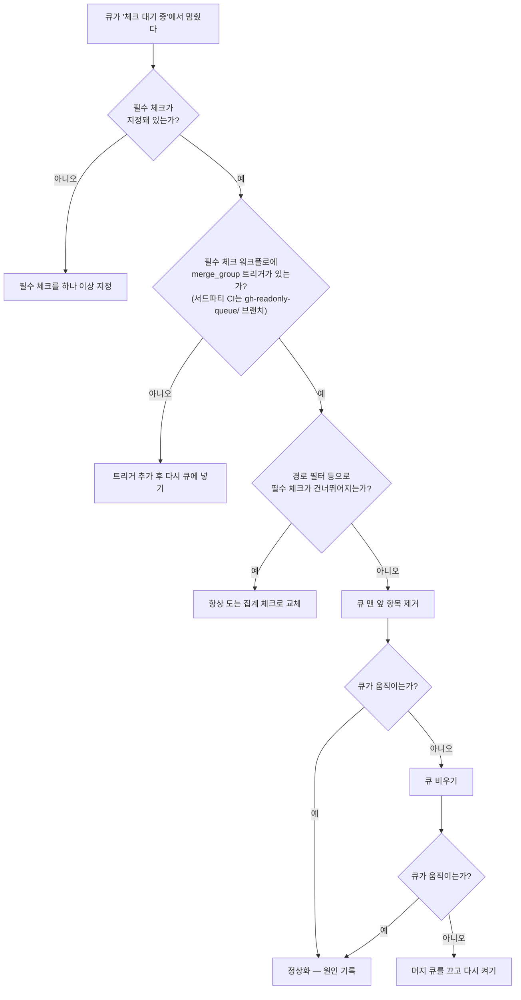

# 13장. 머지 큐 도입 실전 — 설정, merge_group, 처리량, 트러블슈팅

## 한 시간째 "체크 대기 중"

머지 큐를 켰다. 앞 장에서 본 원리에 설득됐고, 팀 회의에서도 반대가 없었다. 저장소 설정에서 머지 큐를 요구하도록 바꾸고, 첫 PR을 큐에 넣었다. 그런데 한 시간째 "체크 대기 중"이다. CI 대시보드를 열어 보면 아무것도 돌고 있지 않다. 그사이 동료들이 하나둘 PR을 큐에 넣는다. 줄은 길어지는데 맨 앞이 꿈쩍도 하지 않는다. 슬랙에 "머지가 안 되는데요?"라는 메시지가 올라오기 시작한다.

초난감한 상황이다. `main`을 지키려고 들인 장치가 `main`으로 가는 길을 통째로 막아 버렸다. 이 장면은 지어낸 것이 아니다. GitHub Community의 "Why does our Merge Queue get stuck?" 토론(#15254)에는 2022년 베타 시절부터 비슷한 하소연이 쌓여 있고, 2026년에도 이런 댓글이 달렸다. "the required merge-queue checks were never produced and the head entry hung in AWAITING_CHECKS, blocking ~23 PRs." 큐 맨 앞 항목이 체크를 기다리며 멈췄고, 그 뒤로 23개쯤의 PR이 막혔다는 것이다.

원인은 대개 싱겁다. 필수 체크를 만드는 워크플로가 머지 큐가 보내는 이벤트에 반응하지 않는 것이다. 큐는 머지 그룹을 만들고 필수 체크 결과를 기다리는데, 그 결과를 보고할 워크플로가 애초에 실행되지 않는다. 기다림은 타임아웃이 날 때까지 계속된다.

그렇다면 이런 일을 어떻게 피할까? 그보다 먼저 물어야 할 질문이 있다. 우리 팀은 머지 큐가 정말 필요한가? 켜는 법은 그다음이다.

## 우리 팀에 머지 큐가 필요한가

12장에서 인용한 문장을 다시 꺼내 보자. "Merge Queues don't replace CI, they're mostly a solution to merge races on project with a high throughput." 머지 큐는 처리량이 많은 프로젝트의 머지 레이스를 푸는 도구다. 거꾸로 말하면, 머지 레이스가 드물고 PR이 많지 않은 팀에는 큐가 풀어 줄 문제가 별로 없다.

판단 신호는 세 가지로 추릴 수 있다. 첫째는 트래픽이다. 하루에 `main`으로 들어가는 PR이 몇 건이고, 그중 몇 건이 비슷한 시간대에 몰리는가? 둘째는 빌드 시간이다. CI가 3분이면 strict 모드의 따라잡기 경주도 견딜 만하다. 30분이면 이야기가 다르다. 셋째는 `main` 파손 빈도다. 12장의 Block처럼 머지 후 빌드 실패를 일주일에 몇 번씩 겪는다면, 그리고 그 원인이 대부분 "각자는 초록이었다"라면 큐가 정확히 그 문제를 겨눈다. 4장의 strict 모드를 켜 두고 "Update branch" 버튼을 누르느라 하루를 쓰는 팀도 같은 신호를 받고 있는 셈이다.

반론도 들어 보자. 가장 흔한 것은 비용이다. GA 무렵 Hacker News에서 한 사용자는 이렇게 지적했다. "the merge group needs to pass the same checks as the branch itself, making it doubly expensive." PR 단계에서 한 번, 머지 그룹에서 또 한 번. 같은 검사를 두 번 돌리니 CI 비용이 두 배라는 것이다. 베타 피드백 토론(#14801)에는 더 직설적인 댓글도 있다. "the CI is running against the exact same code, it's unnecessary."

정말 같은 코드일까? 머지 그룹은 앞선 PR들과 합친 조합이니 엄밀히는 다른 코드다. 그 차이를 검사하는 것이 머지 큐의 존재 이유다. 다만 비용이 두 배가 된다는 지적 자체는 맞다. 그렇다면 어떻게 해야 할까?

Mergify 문서가 정리한 two-step CI가 좋은 답이다. PR 단계에는 lint·단위 테스트처럼 빠르고 가벼운 검사만 돌린다. 통합 테스트·E2E처럼 비싼 검사는 큐에 들어간 머지 그룹에서만 돌린다. 7장에서 세운 원칙 — PR은 빠르게, 머지 전후는 넓게 — 을 머지 큐 위에 그대로 얹는 셈이다. 이렇게 나누면 비싼 검사는 여전히 한 번만 돈다. 그것도 실제로 `main`에 들어갈 조합 위에서. 리뷰어는 PR 단계의 빠른 피드백을 받고, `main`은 넓은 검사를 통과한 조합만 받는다. 비용 두 배라는 반론은 설계가 한 벌뿐일 때의 이야기다.

## 쓸 수 있는가, 쓸 수 없다면

도입하기로 했다면 먼저 우리 저장소에서 GitHub 머지 큐를 쓸 수 있는지 확인하자. 2023년 7월 GA 당시 GitHub 머지 큐를 쓸 수 있는 범위는 Enterprise Cloud의 private·public 저장소, 그리고 조직이 소유한 모든 public 저장소였다. 2026년 9월 기준 GitHub Docs도 같은 범위를 적는다. 조직이 소유한 public 저장소, 그리고 GitHub Enterprise Cloud를 쓰는 조직의 private 저장소다. Team 플랜의 private 저장소는 여기에 들지 않는다. 커뮤니티에 지원을 요청하는 토론이 남아 있는 것도 그래서다. 플랜별 가용 범위는 자주 바뀌니 도입 전에 공식 문서를 함께 확인해두자.

쓸 수 없다면 어떻게 할까? 선택지가 없지는 않다.

가장 가까운 대안은 4장의 strict 필수 체크에 6장의 자동 머지를 더하는 조합이다. strict 모드가 머지 레이스를 막고, 자동 머지가 승인 후 대기를 줄인다. 따라잡기와 재검사는 여전히 PR마다 일어나니 트래픽이 많으면 경주는 남는다. 하루 PR이 손에 꼽히는 팀이라면 이것으로 충분한 경우가 많다. 사실 머지 큐를 쓸 수 있는 팀이라도 여기서 출발하는 편이 낫다. strict 모드와 자동 머지로 몇 주를 지내 보면 "Update branch"를 몇 번 누르는지, 따라잡기 때문에 머지가 몇 시간씩 밀리는지가 숫자로 보인다. 그 숫자가 앞 절의 판단 신호가 된다. 불편이 측정되기 전에 도구부터 들이면, 큐가 무엇을 해결했는지도 나중에 설명하기 어렵다.

서드파티 머지 큐도 있다. Mergify, Graphite, Trunk 같은 도구가 자체 큐를 제공한다. 배치 실패를 쪼개 범인을 찾는 방식처럼 GitHub 머지 큐에 없는 기능을 갖춘 것도 있다. 다만 이 분야는 벤더가 쓴 글이 워낙 많아서, 비교 글을 읽을 때는 누가 썼는지부터 보자. 오랫동안 이 자리를 지키던 bors-ng는 2023년 4월 30일 기능 동결과 지원 중단을 선언했다.

GitLab을 쓰는 팀이라면 같은 기능을 머지 트레인(merge train)이라는 이름으로 만난다. GitLab 문서 기준 Premium·Ultimate 티어에서만 쓸 수 있는 기능이니(2026년 9월 기준), 이것도 도입 전에 플랜부터 확인하자.

## 설정 한 벌 — 보호 규칙과 merge_group

이제 켜 보자. 설정은 두 곳에서 한다. 저장소 설정과 워크플로 파일이다. 둘 중 하나만 하면 이 장 첫 장면을 그대로 재현하게 된다.

먼저 저장소 쪽이다. 4장에서 본 브랜치 보호 규칙 항목에 "Require merge queue"가 있다. `main`에 이 항목을 켜면 PR은 머지 버튼 대신 큐를 거쳐야 한다. 룰셋으로 `main`을 관리하고 있다면 룰셋의 "Require merge queue" 규칙을 켠다. 다만 이 규칙은 저장소 수준 룰셋에만 있고 조직 수준 룰셋에서는 쓸 수 없다. 이때 필수 체크가 최소 하나는 지정돼 있어야 한다. #15254 토론의 원 게시자는 원인을 이렇게 찾았다. "The issue was that we had no required status checks set. After setting one, it started to work." 큐는 필수 체크를 기준으로 머지 그룹의 성패를 판단한다. 기준이 없으면 판단도 없다.

머지 큐를 켜면 조정할 값이 몇 가지 생긴다. GitHub Docs(2026년 9월 기준)가 설명하는 항목은 다음과 같다.

| 설정 | 의미 | 확인된 범위 |
|---|---|---|
| Build concurrency | 동시에 보낼 `merge_group` 웹훅의 최대 수. 동시 CI 빌드 수를 조절한다 | 1~100 |
| Merge limits | 한 번에 base 브랜치에 머지할 PR의 최소·최대 수, 그리고 최소 수가 찰 때까지 기다리는 시간 | 1~100 |
| Status check timeout | CI 응답을 얼마나 기다린 뒤 실패로 볼 것인가 | — |
| Only merge non-failing pull requests | 그룹 안의 앞 PR이 실패했을 때, 뒤 PR이 통과했다고 앞 PR까지 함께 머지할지 여부 | 켜기/끄기 |

표 1. GitHub 머지 큐 주요 설정 (GitHub Docs, 2026년 9월 기준)

기본값이 얼마인지는 일부러 적지 않았다. 여러 블로그가 제각각의 기본값을 적고 있지만 공식 문서로 확인되지 않았고, 이런 값은 조용히 바뀌곤 한다. 자기 저장소 설정 화면에 보이는 값을 출발점으로 삼고, 아래 처리량 계산을 거쳐 조정하는 편이 안전하다. 큐가 `main`에 반영할 때 쓰는 머지 방식(merge·rebase·squash)도 여기서 고른다. 12장의 2026년 4월 사고가 스쿼시 방식 머지 그룹에서만 일어났다는 점을 떠올리면, 이 선택도 가볍게 넘길 일은 아니다.

다음은 워크플로 쪽이다. Docs는 분명하게 말한다. GitHub Actions로 필수 체크를 돌리고 있다면 "you need to update the workflows to include the `merge_group` event as an additional trigger." 트리거를 빠뜨리면 큐에 PR을 넣어도 상태 체크가 실행되지 않고, 필수 체크가 보고되지 않으니 머지는 실패한다. 첫 장면의 범인이 바로 이것이다.

앞 절의 two-step CI를 9장의 집계 체크 패턴과 합쳐 한 벌로 써 보자. 11장에서 본 대로 서드파티 액션은 전체 커밋 SHA로 고정하고, 여기서는 자리표시로 적었다.

```yaml
name: CI

on:
  pull_request:
  merge_group:
    types: [checks_requested]

permissions:
  contents: read

jobs:
  quick:
    runs-on: ubuntu-latest
    steps:
      - uses: actions/checkout@<full-commit-sha> # v7
      - run: make lint test-unit

  integration:
    if: github.event_name == 'merge_group'
    needs: quick
    runs-on: ubuntu-latest
    steps:
      - uses: actions/checkout@<full-commit-sha> # v7
      - run: make test-integration test-e2e

  ci-done:
    if: always()
    needs: [quick, integration]
    runs-on: ubuntu-latest
    steps:
      - name: Aggregate results
        env:
          EVENT_NAME: ${{ github.event_name }}
          QUICK_RESULT: ${{ needs.quick.result }}
          INTEGRATION_RESULT: ${{ needs.integration.result }}
        run: |
          test "$QUICK_RESULT" = "success"
          if [ "$EVENT_NAME" = "merge_group" ]; then
            test "$INTEGRATION_RESULT" = "success"
          fi
```

`merge_group` 이벤트의 활동 유형은 `checks_requested` 하나뿐이다. 필수 체크로는 `ci-done` 하나만 지정한다. PR 단계에서는 `integration`이 건너뛰어지고 `ci-done`은 `quick`의 결과만 본다. 머지 그룹에서는 두 잡이 모두 성공해야 `ci-done`이 초록이 된다. 9장에서 짚은 함정 — 건너뛴 잡은 success가 아니다 — 을 `if: always()`와 명시적인 결과 검사로 피한 것이다. 이렇게 두면 같은 이름의 필수 체크가 두 이벤트 모두에서 보고되어, 큐와 PR 화면이 같은 기준을 본다.

GitHub Actions가 아닌 서드파티 CI를 쓴다면 `merge_group` 이벤트 대신 브랜치 push에 반응하게 설정한다. 머지 큐의 임시 브랜치는 `gh-readonly-queue/{base_branch}`로 시작하므로, `main`이 base라면 `gh-readonly-queue/main/**` 같은 패턴에 CI가 반응하도록 두자. 이 임시 브랜치는 PR과 다른 SHA를 가진다는 점도 기억해두자. PR의 헤드 SHA를 기준으로 캐시나 결과를 찾는 스크립트가 있다면 여기서 어긋난다.

## 처리량을 계산하자

큐를 켜고 나서 가장 먼저 듣는 불평은 "큐가 느리다"다. 느린지 아닌지는 계산해 보면 안다.

베타 피드백 토론(#14801)에 좋은 예가 있다. "queue with 8 PRs, that is going to take 2 hours to clear because our build takes 30 mins and the 2-build limit." 빌드가 30분, 동시 빌드 한도가 2라면 30분마다 PR 두 건이 빠진다. 여덟 건이 빠지려면 두 시간이다. 어림 공식으로 쓰면 이렇다.

> 시간당 처리량(PR) ≈ 동시 빌드 수 × (60 ÷ 빌드 시간(분)) × 그룹당 PR 수

모든 그룹이 통과한다는 가정 아래의 상한이다. 이 식은 거꾸로 쓸 때 더 쓸모가 있다. 우리 팀에 필요한 동시 빌드 수를 역산하는 것이다. 예를 들어 하루 업무 시간 8시간 동안 PR 40건이 큐에 들어온다고 해보자. 시간당 5건을 빼내야 줄이 늘어나지 않는다. 빌드가 30분이고 그룹마다 PR 하나씩 머지한다면 빌드 한 줄이 시간당 2건을 처리하니, 동시 빌드는 최소 3이 필요하다. 여기에 실패와 재빌드를 감안해 여유를 얹는다. 물론 PR은 하루 종일 고르게 들어오지 않는다. 점심 직후와 퇴근 직전에 몰린다면 그 시간대의 유입량으로 다시 계산해 보자. 큐가 느리다는 불평은 대개 평균이 아니라 이 봉우리에서 나온다.

이 식을 보면 처리량을 늘리는 손잡이는 셋이다. 빌드 시간을 줄이거나, 동시 빌드 수를 늘리거나, 한 그룹에 더 많은 PR을 묶거나. 빌드 시간은 9장의 캐시·경로 선택과 앞 절의 two-step CI가 줄인다. 나머지 두 손잡이에는 대가가 붙는다.

동시 빌드 수를 늘리면 러너가 더 많이 필요하다. 그리고 실패의 비용이 커진다. 큐의 뒤쪽 머지 그룹은 앞선 PR을 품고 있으니, 앞에서 하나가 실패하면 그 PR을 품었던 뒤쪽 빌드는 모두 헛돈 셈이 된다. 뒤에 선 PR들은 실패한 PR을 뺀 조합으로 다시 검사를 받는다. 동시 빌드가 열 개라면 실패 한 번에 최대 아홉 개의 빌드가 버려질 수 있다.

그룹에 더 많은 PR을 묶는 것도 마찬가지다. 12장의 Shopify가 배치 크기 8을 두고 "a balance between throughput and risk"라고 말한 이유가 여기 있다. 묶음이 커지면 한 번 통과할 때 많이 머지되지만, 묶음 안의 PR 하나만 실패해도 묶음 전체가 흔들린다. 그리고 누가 범인인지 찾는 비용이 생긴다. Mergify는 이 문제를 쪼개기로 푼다. 문서에 따르면 배치가 실패하면 뒤따르는 배치도 모두 실패로 보고 큐로 되돌린 뒤, 실패한 배치를 나눠 문제 PR을 가려낸다. PR 하나짜리 배치가 여전히 실패하면 그 PR을 범인으로 보고 큐에서 뺀다.

하나 더 조심할 것이 있다. 급한 PR을 큐 맨 앞으로 끼워 넣는 기능이다. Docs는 이렇게 경고한다. "jumping to the top of a merge queue will cause a full rebuild of all in-progress pull requests." 앞자리가 바뀌면 뒤에 선 모든 머지 그룹의 조합이 바뀌니 진행 중인 빌드를 모두 다시 해야 한다. 그래서 GA 이후 이 기능은 기본적으로 관리자만 쓸 수 있다. 긴급 핫픽스 한 건이 큐 전체를 한 바퀴 되돌린다는 사실을 팀에 미리 알려 두자.

## 운영 — flaky, 모노레포, 스택 PR

큐를 켜 두면 전에 보이지 않던 문제가 도드라진다. 가장 먼저 드러나는 것이 flaky 테스트다.

7장에서 flaky 테스트가 신호를 잡음으로 바꾼다고 했다. 머지 큐에서는 그 잡음이 증폭된다. PR 단계에서 flaky 테스트가 한 번 실패하면 그 PR 하나가 다시 돌면 그만이다. 머지 그룹에서 실패하면 그 PR이 큐에서 빠지고, 앞 절에서 본 대로 뒤에 선 그룹들까지 다시 검사를 받는다. 아무 잘못 없는 PR이 큐에서 계속 밀려날 수 있다. 찜찜한 점은, 작성자가 이 실패를 자기 코드 탓으로 오해하기 쉽다는 것이다.

그래서 머지 큐 도입 체크리스트에서 flaky 정리는 설정보다 앞에 온다. 7장에서 고른 정책 — 무관용이든, 재시도와 격리와 소유자 통지든 — 을 먼저 실행해 두자. Shopify가 자사 큐에 flaky 대응용 실패 허용 임계값을 뒀던 것도 같은 맥락이다. 머지 그룹 단계에 오는 테스트일수록, 즉 two-step CI에서 뒤로 미룬 통합·E2E 테스트일수록 flaky가 많기 쉽다는 점도 함께 기억해두자.

모노레포라면 9장의 함정이 큐에서도 그대로 재현된다. `paths` 필터가 걸린 워크플로를 필수 체크로 지정하면, 그 경로를 건드리지 않은 머지 그룹에서는 체크가 영영 보고되지 않는다. 큐는 타임아웃까지 기다린다. 해법도 같다. 변경 감지 잡이 할 일을 정하고, 항상 도는 집계 잡 하나만 필수 체크로 둔다. 앞 절의 `ci-done`이 바로 그 자리에 선다. 9장에서 본 낡은 런 취소용 concurrency 설정 `group: ${{ github.head_ref || github.run_id }}`는 `merge_group` 이벤트에서 `github.head_ref`가 비어 런마다 다른 그룹이 되므로 머지 그룹 빌드를 서로 취소하지 않는다. Docs에 따르면 `github.head_ref`는 `pull_request`·`pull_request_target` 이벤트에서만 채워지기 때문이다. 다만 concurrency 그룹을 브랜치 이름 같은 고정 값으로 바꿔 두었다면 머지 그룹 빌드끼리 서로를 취소할 수 있으니 한 번 점검해 보자. 트리거가 겹쳐도 비슷한 일이 난다. "PR repeatedly removed from merge queue due to failed status checks"라는 토론(#168145)에서는 워크플로가 `merge_group` 이벤트와 `gh-readonly-queue/` 브랜치 push 양쪽에 반응해 같은 CI가 두 번 돌며 서로를 취소했고, 그 바람에 PR이 큐에서 거듭 빠졌다. 해법은 push 트리거의 `branches-ignore`에 `gh-readonly-queue/**`를 넣는 것이었다.

5장에서 본 스택 PR은 머지 큐와 아직 온전히 만나지 못했다. GitHub 네이티브 스택 PR은 2026년 7월 30일 public preview로 나왔고, 공지에는 "Merge queue support for stacked pull requests is rolling out progressively over the coming weeks."라고 적혀 있었다. 2026년 9월 기준으로 이 연동이 모든 저장소에 적용됐는지는 확인하지 못했다. 빠르게 바뀌는 부분이니 스택 PR과 머지 큐를 함께 쓰려면 공식 문서를 함께 확인하자.

마지막으로, 커뮤니티에 올라온 보고 하나를 짚고 가자. 2025년 2월 토론(#151100)에, 머지 큐가 `merge_group` 이벤트가 아닌 `pull_request` 이벤트로 돈 `ci_done`의 결과를 보고 머지했다는 보고가 올라왔다. 참여자가 전한 GitHub 지원팀 답변에 따르면 CI 실행을 줄이려던 변경의 부작용이었고 곧 되돌려졌다. 그런데 그 뒤에도 같은 증상을 겪었다는 댓글이 이어졌다. 공식 문서에 적힌 동작은 아니니 과하게 일반화할 일은 아니다. 다만 큐가 예상과 다르게 움직인다면, 필수 체크가 두 이벤트에서 같은 이름으로 같은 기준을 보고하는지부터 확인하는 편이 낫다. 앞 절의 집계 체크 구성이 이 점에서도 도움이 된다.

## 큐가 멈췄을 때

이 장의 첫 장면으로 돌아가자. 큐가 한 시간째 "체크 대기 중"이다. 무엇부터 봐야 할까?

순서가 중요하다. 설정을 의심하는 일은 싸고, 큐를 비우는 일은 비싸다. 싼 것부터 확인하자. 먼저 필수 체크가 하나라도 지정돼 있는지 본다. 다음으로 그 필수 체크를 만드는 워크플로에 `merge_group` 트리거가 있는지, 서드파티 CI라면 `gh-readonly-queue/` 브랜치에 반응하는지 본다. 모노레포라면 경로 필터 때문에 필수 체크가 건너뛰어지고 있지 않은지도 본다. 설정이 멀쩡한데도 큐 맨 앞이 움직이지 않는다면, 그때 커뮤니티 토론에서 GitHub 측이 권장한 복구 순서를 따른다. 큐 맨 앞 항목을 빼 보고, 그래도 안 되면 큐를 비우고, 마지막으로 머지 큐를 껐다가 다시 켠다.


그림 1. 머지 큐가 멈췄을 때의 진단 흐름

설정 세 줄을 확인하는 데 5분이면 되고, 큐를 비우면 팀 전체의 한 시간이 날아간다 — 그러니 멈춘 큐 앞에서는 늘 위에서부터 내려오자.

## 이 장의 핵심

- 머지 큐는 처리량이 많아 머지 레이스와 strict 모드의 따라잡기 경주가 실제 비용이 된 팀에 필요하다. 트래픽·빌드 시간·`main` 파손 빈도로 판단한다.
- "비용 두 배" 반론에는 two-step CI로 답한다. PR에는 빠른 검사, `merge_group`에는 비싼 검사를 두고, 필수 체크는 항상 도는 집계 잡 하나로 모은다.
- 필수 체크를 만드는 워크플로에 `merge_group` 트리거를 빠뜨리면 큐가 멈춘다. 설정값의 기본값을 믿지 말고 처리량 공식으로 조정한다.
- 처리량 ≈ 동시 빌드 수 × 시간당 빌드 횟수 × 그룹당 PR 수. 손잡이를 돌릴수록 실패 한 번의 재빌드 비용이 커지므로 flaky 정리가 설정보다 먼저다.
