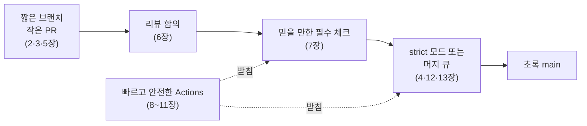

# 14장. 우리 팀의 워크플로를 설계하다 — 네 가지 팀, 네 가지 설계도

## 그 오후로 돌아가서

1장의 오후로 돌아가 보자. PR 두 개가 각자 초록 체크를 받고 머지됐는데 `main`이 빨개졌다. 책을 처음 펼쳤을 때 이 장면은 운 나쁜 사고처럼 보였을 것이다. 이제는 어떻게 보이는가?

이 장면을 막을 수 있는 지점을 하나씩 세어 보자. 두 PR이 몇 시간 만에 합쳐지는 작은 변경이었다면, 서로 모르는 채 엇갈릴 시간 자체가 짧았을 것이다(2·5장). 리뷰어가 두 PR을 모두 봤다면 이름이 바뀐 함수를 새로 부르는 코드를 알아챘을 수도 있다(6장). 필수 체크가 빌드와 테스트를 제대로 검사하고 flaky 테스트 없이 믿을 만했다면, 깨진 조합이 드러나는 순간 그 빨강을 곧바로 신호로 받아들였을 것이다(7장). strict 모드였다면 뒤에 머지한 PR은 `main`을 따라잡으며 재검사를 받았을 것이고(4장), 머지 큐였다면 "`main` + A + B"라는 조합이 큐 안에서 걸러졌을 것이다(12·13장). 그리고 그 모든 검사를 돌리는 GitHub Actions 파이프라인이 빠르고 안전했다면, 누구도 느린 CI를 피해 체크를 건너뛰고 싶어 하지 않았을 것이다(8~11장).

그림 1. 1장의 머지 레이스를 막는 겹

막는 겹은 여럿이고, 각 겹이 조금씩 확률을 줄인다. 어느 한 겹이 구멍 나도 다음 겹이 받친다. 이 책이 브랜치 전략 한 장이나 머지 큐 한 장으로 끝나지 않은 이유가 여기 있다.

그렇다면 이 겹들을 우리 팀에 어떻게 쌓을까? 모든 팀이 모든 겹을 같은 두께로 쌓을 필요는 없다. 지금까지의 여정을 두 축으로 정리한 다음, 성격이 뚜렷한 네 팀의 설계도를 그려 보자.

## 두 축으로 다시 보기

1장에서 워크플로를 평가할 두 기준을 세웠다. 우리는 얼마나 자주 합치는가(통합 빈도). 그리고 우리가 검증한 것이 정말 머지된 것인가(머지 무결성). 지나온 장들은 모두 이 두 축 위의 한 칸이었다.

통합 빈도 쪽에는 2·3·5·6장이 있다. 2장에서 여섯 가지 브랜치 전략을 나란히 세웠을 때, 전략을 가르는 축은 장기 브랜치가 얼마나 오래 사는가, 즉 통합 빈도였다. 3장은 팀이 전략을 바꾸는 순간을 보며 기능 플래그가 그 대가라는 점을 짚었다. 5장은 통합의 단위인 PR을 리뷰할 수 있는 크기로 만들었고, 6장은 그 PR이 리뷰를 기다리며 늙어 가는 시간을 줄였다. 이 네 장이 합쳐져야 "자주 합친다"가 구호에서 실제 흐름이 된다.

머지 무결성 쪽에는 4·7·12·13장이 있다. 4장은 `main`을 지키는 약속을 보호 규칙과 룰셋으로 적었다. 7장은 무엇을 필수 체크로 삼을지 정했고, flaky 테스트가 그 신호를 어떻게 무너뜨리는지 봤다. 12·13장은 검사한 조합과 머지한 조합을 같게 만드는 머지 큐를 원리와 실전으로 다뤘다. 그리고 12장의 2026년 4월 사고가 보여 줬듯, 그 보장조차 도구를 믿되 확인하는 습관 위에 서 있다.

8~11장의 GitHub Actions는 두 축을 받치는 바닥이다. 필수 체크는 결국 워크플로로 돈다. 워크플로가 느리면(9장) 사람들은 자주 합치기를 꺼리고, 복붙으로 흩어지면(10장) 기준이 저장소마다 달라지고, 권한이 헐거우면(11장) `main`을 지키던 파이프라인이 곧 공격 경로가 된다.

두 축은 서로를 당긴다. 자주 합치려면 머지가 안전해야 하고, 머지가 안전해야 두려움 없이 자주 합친다. 어느 한쪽만 밀면 다른 쪽이 발목을 잡는다. 그래서 설계도는 늘 두 축을 함께 본다.

## 네 가지 팀, 네 가지 설계도

성격이 다른 네 팀을 떠올려 보자. (1) 개발자 다섯 명이 웹 서비스 하나를 private 저장소에서 만드는 스타트업, (2) 앱 스토어 심사를 거쳐 명시적 버전으로 출시하는 모바일 앱 팀, (3) 외부 기여를 fork PR로 받는 오픈소스 라이브러리, (4) 수백 명이 한 저장소에서 일하는 모노레포 조직. 각 팀의 설계를 한 표에 모으면 이렇다.

| 항목 | (1) 5명 웹 스타트업 | (2) 모바일 앱 팀 | (3) 오픈소스 라이브러리 | (4) 수백 명 모노레포 |
|---|---|---|---|---|
| 브랜치 전략 | GitHub Flow (하루 안에 합치는 짧은 브랜치) | 트렁크 + 출시 시점에 따는 release 브랜치, 또는 Git Flow | 영구 브랜치 하나 + 버전 태그 | TBD + 기능 플래그 + 필요 시점에 따는 release 브랜치 |
| 보호 규칙 | `main`: PR 필수, 승인 1명, 필수 체크 | `main`·`release/*`: PR 필수, 필수 체크 | `main`: 메인테이너 승인, CODEOWNERS(`.github/workflows` 포함) | 조직 룰셋 + 경로별 required reviewer rule + CODEOWNERS |
| 머지 방식 | 스쿼시 머지 | 스쿼시 또는 머지 커밋 | 기여 이력 보존 방침에 따라 | 팀 합의 (머지 큐 방식과 함께 결정) |
| 리뷰 합의 | 업무일 1일 응답 | 업무일 1일 + release 브랜치 변경은 2명 | 응답 목표를 CONTRIBUTING에 명시 | SLA + 리마인더 자동화 |
| 필수 체크 | lint·단위 테스트 (집계 체크 1개) | lint·단위 테스트, UI 테스트는 야간 | 지원 버전 `matrix` 전체 | 변경 감지 + 집계 체크, two-step CI |
| Actions 구성 | 캐시, 낡은 런 취소, 배포 워크플로 직렬화 | `schedule` 야간 빌드, release 브랜치 빌드 | `pull_request` 트리거, SHA 고정, 읽기 전용 토큰 | 조직 공용 재사용 워크플로, OIDC, 배포 환경 게이트 |
| 머지 큐 | 불필요 (strict + 자동 머지) | 대개 불필요 | 기여가 몰리면 고려 | 필수 |

표 1. 팀 유형별 워크플로 설계도

표만으로는 "왜"가 보이지 않는다. 각 칸 뒤의 판단을 짧게 따라가 보자.

**(1) 5명 웹 스타트업.** 웹 서비스는 한 버전만 운영하고 계속 배포한다. Driessen이 2020년 노트에서 GitHub Flow처럼 단순한 흐름을 권한 바로 그 조건이다. PR은 하루에 몇 건이고 CI가 몇 분이면 strict 모드와 자동 머지로 머지 레이스를 막기에 충분하다. 머지 큐까지 들일 이유가 아직 없다. 한 가지 함정이 있다. 10장에서 봤듯 배포 환경의 required reviewers와 wait timer는 Free·Pro·Team 플랜에서는 public 저장소에만 쓸 수 있다(2026년 9월 기준). private 저장소의 작은 팀이라면 사람 승인 게이트 대신 concurrency로 배포를 직렬화하고, 클라우드 자격 증명은 OIDC로 두는 편이 현실적이다.

**(2) 모바일 앱 팀.** 앱 스토어에 올라간 버전은 사용자 기기에 오래 남는다. Driessen이 "explicitly versioned"라고 부른 소프트웨어다. 3장의 우아한형제들 사례처럼 현재 버전의 핫픽스와 다음 버전 개발이 겹치는 순간 release 브랜치가 필요해진다. 이때 Microsoft Release Flow의 규칙 — 핫픽스는 `main`에 먼저, release 브랜치로는 체리픽 — 을 따르면 고친 버그가 다음 출시에서 되살아나는 일을 막을 수 있다. 보호 규칙은 `main`뿐 아니라 `release/*`에도 건다. 여러 브랜치에 같은 규칙을 거는 데는 룰셋이 편하다. 느린 UI 테스트는 7장의 계층화대로 야간 `schedule`로 미룬다.

**(3) 오픈소스 라이브러리.** 이 팀의 설계는 보안이 먼저 끌고 간다. 누구나 PR을 올릴 수 있으니 11장의 방어선이 전부 적용된다. fork에서 온 `pull_request` 워크플로에는 시크릿이 전달되지 않고 `GITHUB_TOKEN`도 읽기 전용이다. 이 제약을 풀려고 `pull_request_target`에서 PR 코드를 체크아웃하는 순간 pwn request의 문이 열린다. 라벨 달기나 코멘트처럼 쓰기가 필요한 일은 `workflow_run`으로 분리하자. 서드파티 액션은 SHA로 고정하고, public 저장소에 셀프호스트 러너는 두지 않는다. 릴리스 배포는 public 저장소라서 무료 플랜에서도 배포 환경의 승인 게이트를 쓸 수 있다. 머지 큐는 GA 당시부터 조직 소유 public 저장소에서 쓸 수 있었으니, 기여가 몰려 `main`이 자주 깨진다면 검토해 볼 만하다.

**(4) 수백 명 모노레포.** 12·13장의 모든 장치가 여기서 한꺼번에 필요해진다. 하루 수백 건의 PR이 한 `main`으로 몰리면 strict 모드의 따라잡기 경주는 감당이 안 된다. 머지 큐와 two-step CI, 변경 감지와 집계 체크가 한 세트로 들어간다. 저장소가 하나라도 팀은 여럿이니, 경로별 승인은 required reviewer rule과 CODEOWNERS로 나누고 조직 공용 재사용 워크플로로 기준을 한곳에 둔다. 리뷰 지연은 6장의 리마인더처럼 자동화로 다룬다. 수백 명 규모에서 사람의 선의에만 기대기는 어렵다. 브랜치는 짧게 유지하고 미완성 기능은 기능 플래그 뒤에 숨긴다. 3장에서 본 대로 그 플래그는 재고이니 제거 계획도 함께 세워 두자.

## 브랜치 전략을 다시 고르다

2장은 결론을 열어 둔 채 끝났다. 짧은 브랜치가 좋다는 것은 알겠는데, 그것을 받쳐 줄 장치가 없으면 짧은 브랜치는 위험하다고. 이제 그 장치가 모두 손에 있다. 다시 골라 보자.

표 1을 세로로 읽으면 흥미로운 점이 보인다. 네 팀 중 세 팀이 결국 하나의 `main`에 자주 합치는 쪽으로 기울었다. 모바일 앱 팀도 release 브랜치를 쓰지만 개발은 `main`에서 한다. 왜 그럴까? 앞 장들이 짧은 브랜치의 위험을 하나씩 지웠기 때문이다. 작은 PR과 빠른 리뷰가 통합을 쉽게 하고, 믿을 만한 필수 체크와 머지 큐가 통합을 안전하게 하고, 기능 플래그가 미완성 코드를 `main`에 둘 수 있게 한다. 장기 브랜치가 막아 주던 위험을 다른 장치가 대신 막으니 장기 브랜치를 유지할 이유가 줄어든다.

그렇다고 Git Flow가 틀렸다는 뜻은 아니다. 3장의 결론을 다시 떠올리자. 전략을 가르는 질문은 "`main`의 임의 커밋을 안전하게 배포할 수 있는가"였다. 여러 버전을 동시에 지원해야 하거나, 2주씩 걸리는 검증 단계가 따로 있거나, 출시마다 외부 승인을 받아야 하는 팀에게 그 답은 여전히 "아니오"일 수 있다. 그런 팀에게 장기 브랜치는 치를 만한 비용이다. Driessen의 말처럼 만병통치약은 없다.

다만 한 가지는 분명해졌다. 브랜치 전략은 워크플로 설계의 출발점이라기보다 결과에 가깝다. 리뷰가 얼마나 빠른지, CI를 얼마나 믿을 수 있는지, 머지가 얼마나 안전한지가 정해지면 브랜치를 얼마나 짧게 가져갈 수 있는지가 따라 나온다. 장치 없이 TBD라는 이름만 들여오면 `main`이 깨진다. 장치를 갖춘 뒤에도 Git Flow에 머물면 쓸데없이 느리다. 전략 이름보다 장치의 수준을 먼저 보자.

그렇다면 우리 팀은 어디에 서 있을까? 다음 질문을 순서대로 던져 보면 설계도의 첫 줄이 나온다. 운영 중인 버전이 하나인가, 여럿인가? 여럿이라면 release 브랜치는 피할 수 없으니, 그 브랜치를 얼마나 짧게 살릴지부터 고민하자. 하나라면 다음 질문으로 간다. PR이 첫 리뷰를 받기까지 하루 안쪽인가? 필수 체크를 팀이 믿는가, 빨강을 보면 로그보다 Re-run 버튼에 손이 먼저 가는가? `main`이 깨지는 일이 한 달에 몇 번인가? 이 세 질문에 자신 있게 답할 수 있다면 하루 한 번 이상 `main`에 합치는 흐름으로 옮겨도 좋다. 하나라도 머뭇거려진다면, 브랜치를 줄이기 전에 그 질문이 가리키는 장으로 돌아가 장치부터 채우자.

## 먼저 재고, 하나씩 바꾸기

설계도를 그렸으니 바로 바꾸고 싶어질 것이다. 잠시 멈추고 생각해보자. 한꺼번에 다 바꾸면 무엇이 효과를 냈는지 알 수 없다. 나빠졌을 때 무엇을 되돌려야 할지도 모른다.

그래서 먼저 잰다. 1장에서 본 DORA의 다섯 지표 — 변경 리드 타임(Change Lead Time), 배포 빈도(Deployment Frequency), 실패 배포 복구 시간(Failed Deployment Recovery Time), 변경 실패율(Change Fail Rate), 배포 재작업률(Deployment Rework Rate) — 를 지금 값으로 기록해 두자. 2026년 1월 갱신판 기준의 다섯 지표다. 여기에 이 책에서 자주 본 워크플로 고유의 값 몇 가지를 더하면 좋다. 브랜치가 `main`에 합쳐지기까지 걸리는 날수, PR이 첫 리뷰를 받기까지의 시간, 승인 후 머지까지의 시간, `main`이 빨간 상태로 있던 시간. 1장 끝에서 던진 질문 — 당신 팀에서 브랜치가 `main`에 합쳐지기까지 며칠이 걸리는가 — 에 이제 숫자로 답할 차례다.

그다음 한 번에 하나씩 바꾼다. 순서는 싸고 효과가 큰 것부터가 좋다.

첫째, `main` 보호 규칙과 필수 체크를 건다(4·7장). 설정 몇 개로 가장 큰 사고를 막는다. 둘째, Actions의 보안 기본값을 굳힌다(11장). 토큰 권한을 읽기로 내리고 서드파티 액션을 SHA로 고정하는 일은 사고가 나기 전에 해야 의미가 있다. 셋째, PR 크기와 설명, 리뷰 합의를 정한다(5·6장). 넷째, CI를 빠르게 하고 flaky 테스트를 정리한다(7·9장). 다섯째, 필요하다면 머지 큐를 들인다(12·13장). 여섯째, 이 모든 장치가 자리 잡은 뒤에 브랜치 수명을 줄이거나 전략을 바꾼다(2·3장).

브랜치 전략이 마지막인 것이 의아할 수 있다. 책은 브랜치 전략으로 시작했는데 말이다. 하지만 앞 절에서 봤듯 브랜치 전략은 장치의 결과다. 장치가 없는 상태에서 브랜치부터 줄이면 `main`이 먼저 비명을 지른다. 각 단계 사이에는 몇 주를 두고 지표를 다시 재자. 좋아졌다면 다음으로, 나빠졌다면 원인을 찾는다.

## 앞으로 볼 변화

이 책의 많은 문장에 "2026년 9월 기준"이 붙어 있다. 워크플로 도구가 그만큼 빨리 바뀌기 때문이다. 이 책을 쓰는 동안에도 여러 가지가 움직였다. concurrency에 대기열을 두는 `queue` 옵션이 2026년 5월에 생겼고, `pull_request_target`은 2025년 12월 8일부터 항상 기본 브랜치의 워크플로를 쓰도록 동작이 바뀌었다. 2025년 12월에는 셀프호스트 러너에 요금을 매기겠다는 발표가 나왔다가 반발 끝에 연기되기도 했다.

그러니 수치와 한도를 외우기보다 확인하는 습관을 들이는 편이 낫다. 팀 문서에 설정을 적을 때 "어느 날짜의 어느 문서 기준"인지 함께 적고, 분기에 한 번쯤 GitHub Changelog를 훑으며 우리 설정에 닿는 변경이 있는지 보자. 기본값에 기대는 설정일수록 조용히 바뀔 때 알아채기 어렵다.

지켜볼 흐름도 두 가지 있다. 하나는 스택 PR이다. GitHub 네이티브 스택 PR이 2026년 7월 public preview로 나왔고, 머지 큐 연동은 점진적으로 롤아웃 중이라고 했다. 5장에서 본 회의론처럼 이것이 정말 필요한 추상인지는 아직 논쟁 중이지만, 큰 변경을 작은 PR로 나누는 방식을 바꿀 수 있는 변화다.

다른 하나는 AI 에이전트가 올리는 PR이다. 에이전트는 사람보다 훨씬 많은 PR을 동시에 연다. 2026년에 나온 한 프리프린트는 에이전트 PR이 동시에 열리는 일이 흔하고 서로 충돌하는 비율도 적지 않다는 관찰을 내놓았다. 아직 동료 심사를 거치지 않은 연구이니 수치보다 방향으로 읽자. 머지 큐 토론에서 한 사용자가 남긴 말이 그 방향을 요약한다. "you need to follow the not-rocket-science rule with agents or they will break main." 동시에 열리는 PR이 많아질수록 머지 레이스는 드문 사고에서 일상이 된다. 이 책이 다룬 두 축은 에이전트 시대에 오히려 더 중요해진다.

## 초록 main은 결과다

책을 닫기 전에 처음 장면을 한 번 더 보자. 두 PR이 모두 초록이었는데 `main`이 깨졌다. 처음에는 이 장면이 운의 문제처럼 보였다. 이제는 이 장면을 구성 요소로 나눠 볼 수 있다. 브랜치가 얼마나 오래 떨어져 있었는지, PR이 얼마나 컸는지, 리뷰가 얼마나 늦었는지, 필수 체크가 무엇을 검사했는지, 검사한 조합과 머지한 조합이 같았는지. 이 질문들 각각에 이 책의 한두 장이 답한다.

지나온 길을 되짚어 보자. 2·3장에서 브랜치 전략을 통합 빈도라는 축에 세웠고, 4장에서 그 약속을 저장소 설정으로 적었다. 5·6장에서 통합의 단위인 PR과 리뷰를 다듬었고, 7장에서 무엇을 필수 체크로 삼을지 정했다. 8~11장에서 그 검사를 GitHub Actions로 빠르고 안전하게 돌리는 법을 익혔고, 12·13장에서 검증한 것을 그대로 머지하는 머지 큐를 원리부터 운영까지 따라갔다.

이 여정에서 가져갈 것이 하나 있다면 이것이다. 워크플로는 한 번 정해 두는 규칙이 아니라 계속 재고 고치는 전략이다. 팀은 자라고, 제품은 바뀌고, 도구는 분기마다 달라진다. 작년에 맞던 설정이 올해는 병목이 된다. 그러니 두 기준을 손에서 놓지 말자. 우리는 얼마나 자주 합치는가. 우리가 검증한 것이 정말 머지된 것인가. 이 두 질문을 주기적으로 던지고 숫자로 답하는 팀에게, 초록 `main`은 결과로 따라온다.

이제 당신 팀의 저장소를 열 차례다.
