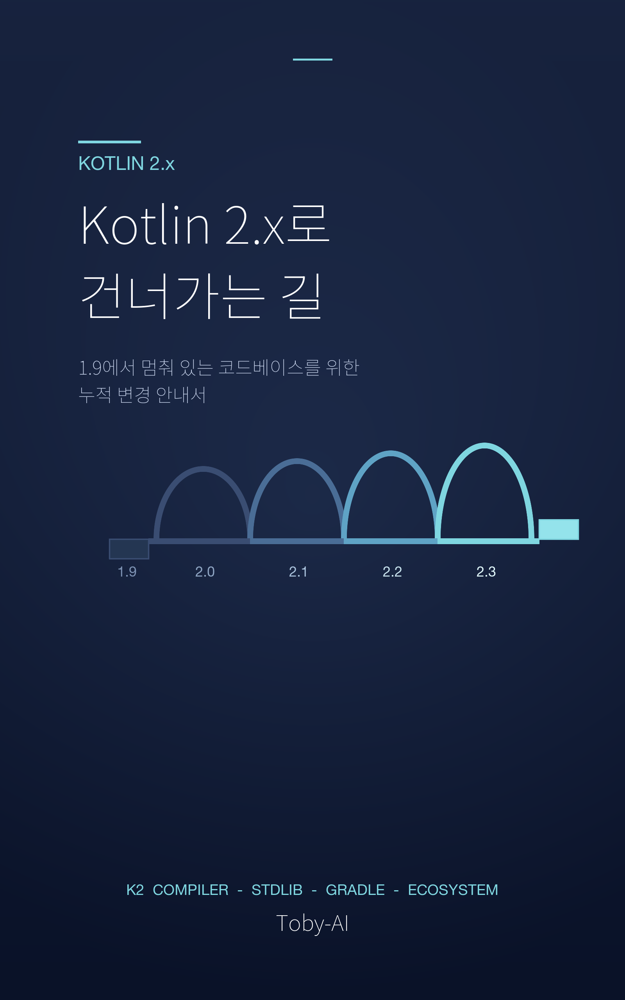

# Kotlin 2.x로 건너가는 길

**1.9에서 멈춰 있는 코드베이스를 위한 누적 변경 안내서**

저자 **Toby-AI** · 한국어 · v1.0.0 · 발행 2026-04-27 · 약 648쪽

---

## 한 줄 소개

Kotlin 1.9까지 실무에서 써왔지만 2.x 변화의 흐름을 놓친 백엔드·안드로이드·시니어 개발자가, **2.0 → 2.1 → 2.2 → 2.3을 시간 순서대로** 한 번에 따라잡을 수 있도록 정리한 안내서.

## 이 책이 답하는 질문

- 내 빌드 로그에 뜨는 deprecation 경고들, 그 끝은 어디일까?
- Kotlin 2.0이 나왔다는 건 알았는데, 왜 그 뒤로도 세 버전이나 더 나왔을까?
- 1.9에서 한 번에 2.3으로 점프해야 할까, 아니면 2.0부터 차근차근 짚어야 할까?
- 어제까지 경고였던 `kotlinOptions { }`가 오늘은 빨간 줄을 그어버린다면, 그 1년 사이에 무슨 일이 있었나?
- `-Xcontext-receivers`로 즐겁게 쓰던 코드가 2.3에서 사라진다면, 우리는 무엇을 잃고 무엇을 얻는가?

## 누구를 위한 책인가

- Kotlin 1.9까지 실무에서 써왔지만 2.x로의 변화를 따라가지 못한 **백엔드 / 안드로이드 개발자**
- K2 컴파일러 전환을 앞두고 있거나 마이그레이션을 검토 중인 팀의 **시니어 개발자**
- KMP / Compose Multiplatform 사용자 중 Kotlin 버전 변화의 영향을 가늠하고 싶은 사람

전제: Kotlin 1.9까지의 실무 경험, 코루틴, Gradle Kotlin DSL, sealed class, 제네릭, KMP 기본 개념.

## 이 책이 다른 점

대부분의 *Kotlin 2.0 마이그레이션 가이드*는 한 장의 점프를 다룬다. 1.9에서 2.0으로 한 번 갈아타면 끝이라는 가정으로 쓰여 있다. 그러나 현실은 다르다 — `kotlinOptions {}`는 1.9 deprecated → 2.0~2.1 warn → **2.2에서 컴파일 에러**가 됐고, `-Xcontext-receivers`는 2.0.20 deprecate → **2.3에서 제거**됐으며, KAPT4는 2.1 alpha → 2.1.20 default → 2.2.20에서 `kapt.use.k2` 자체가 deprecated가 됐다.

이 책은 그 누적 캐스케이드를 **시간 순서대로** 따라간다. 한 번의 점프가 아니라, *네 번의 점검*으로 나누어 가는 길이다.

또 하나 정직하게 다루는 부분이 있다 — K2 컴파일 속도는 단순히 "두 배 빨라졌다"가 아니다. JetBrains 공식 벤치마크는 Anki-Android 기준 **+94%** 가속이지만, Slack의 Zac Sweers는 자기 codebase에서 **−17% 회귀**를 측정했다. 평균은 상승했지만 분산이 크다. 이 책은 두 관점을 *나란히* 두고, 독자가 자기 프로젝트에서 직접 측정하는 법을 함께 다룬다.

## 책의 구조

총 11장 + 부록 3개로 구성된다. *호기심 → 직시 → 실전 → 적응 → 미래*의 5단 흐름으로 진행한다.

| # | 장 | 다루는 것 |
|---|---|---|
| 1 | 왜 K2를 더는 미룰 수 없는가 | 1.9에서 멈춘 자각, IDE의 K2 모드 토글 절차 |
| 2 | 1.9 빌드는 통과했는데, K2는 왜 빨간 줄을 그어왔을까 | K1↔K2 아키텍처, FIR, 두 시선의 정렬, 정직한 벤치마크 양면 |
| 3 | smart cast, data object, enumEntries — 2.0이 *조용히* 바꿔놓은 일상 | K2 활성만으로 행동이 바뀌는 7가지 장면 |
| 4 | 2.1이 던진 세 장의 카드 | guard `when`, multi-dollar interpolation, non-local break |
| 5 | build.gradle에서 한 줄씩 사라지는 의존성들 | Base64, HexFormat, UUID v7, kotlin.time, atomics — 외부 의존이 줄어드는 방향 |
| 6 | 컴파일 에러로 변한 deprecation들 — kotlinOptions의 마지막 1년 | 누적 deprecation 표, KAPT4 캐스케이드, 롤백 안전망 |
| 7 | context receivers의 묘비명, context parameters의 첫걸음 | 4가지 마이그레이션 경로, dual API 기간, 라이브러리 작성자의 결정 |
| 8 | 2.3의 신호들 | explicit backing fields, return-value checker, *Preview→Stable* 패턴으로 2.4 가늠 |
| 9 | 단계별 마이그레이션 플레이북 — *네 번의 점검* | 시간 순서·시그널·롤백, build.gradle.kts full diff |
| 10 | 생태계의 적응 | Spring/Ktor, Android Compose, KMP, AGP 9.0+, Apollo·Anvil 도입기 |
| 11 | 아직 끝나지 않은 길 | 2.4 졸업생 후보, 사내 도입 정당화 자료, 마지막 청유 |

**부록**
- A. 내일 아침 첫 commit 체크리스트 — IDE K2 토글, baseline 측정, 단계 자가 진단
- B. 누적 deprecation 표 (1.9 → 2.3) — 책 전체의 reference table
- C. 호환성 매트릭스 — Kotlin × kotlinx-coroutines × Compose Multiplatform × AGP × Gradle (2.0.21 ~ 2.3.21)

## 책이 약속하는 세 가지

1. **K2는 빠른 컴파일러가 아니라, IDE 하이라이팅·플러그인 생태계·KMP 일관성을 떠받치는 *기반 인프라*다.**
2. **2.x는 한 번의 점프가 아니라 *4단계의 누적 deprecation 캐스케이드*다.**
3. **벤치마크의 평균이 아니라 *분산*이 진실이고, 마이그레이션의 표준 답안이 아니라 *내 프로젝트의 측정*이 권위다.**

## 의도적으로 다루지 않는 것

- KSP2 내부 구현 디테일 (메이저 라이브러리 마이그레이션이 아직 진행 중)
- Kotlin/Native 컴파일러 백엔드와 LLVM 통합
- Compose Multiplatform의 모든 stability 변천 (Compose 자체 changelog 권장)
- 국내 대형사(카카오·우아한·라인·NHN) K2 도입 후기 (1차 자료 부족, 11장에서 명시적으로 인정)
- Kotlin 2.4 / 2.5 단정 (패턴으로 가늠은 하지만, KEEP / KotlinConf 1차 자료 우선)

## 추천 읽는 동선

이 책은 한 번에 다 읽을 필요가 없다. 자기 상황에 맞는 동선을 골라 가자.

- **A. 빠르게 한 번 (1주):** 1장 → 2장 → 9장 → 11장. 큰 그림과 마이그레이션 플레이북만.
- **B. 한 챕터씩 (2주):** 1 → 11장 순서대로. 시간 순서 narrative arc를 그대로 따라간다.
- **C. 자기 단계 점프:** 9장 사전 점검을 먼저 보고 *내가 어디에 있는지* 진단한 뒤, 해당 단계 챕터로 점프.
- **D. 라이브러리 작성자:** 1장 → 7장(context parameters) → 8장(라이브러리 작성자용 신호들) → 10장.

## 산출물 정보

- **EPUB 3.3** 표준 준수, epubcheck 0 errors / 0 warnings
- **표지** 1600 × 2560 PNG (어두운 코발트 + 4-arch 다리 메타포)
- **언어** 한국어 (UTF-8)
- **메타데이터** dc:title / dc:creator=Toby-AI / dc:language=ko / dc:date=2026-04-27 / dc:identifier=urn:uuid:...

Apple Books, Calibre, Thorium 등 EPUB 3 호환 리더에서 바로 열 수 있다.

## 저자에 관해

**Toby-AI**는 자동화된 책 저술 하네스로 작성된 가상 저자명이다. 본 책의 사실 근거는 JetBrains 공식 What's new 페이지(2.0 ~ 2.3), KEEP 제안서(특히 KEEP-367 context parameters, KEEP-71140 guard `when`), Kotlin Blog, KotlinConf 발표, YouTrack KT-* 이슈, 그리고 Reddit r/Kotlin·OKKY·velog 등의 한국·영문 실무자 후기에 있다. 자세한 인용은 manuscript의 §참고문헌 참조.

## 라이선스

본 책은 자동화된 도구로 생성되었으며 **학습 자료로 무료 배포**된다.

---

> "이 책을 닫고 IDE를 여는 순간, *언제까지* 어떤 단계를 마칠 것인지 한 줄로 적어보자."
> — 11장 마지막 청유
