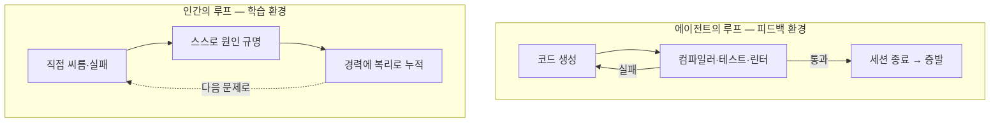
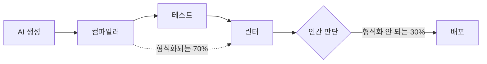
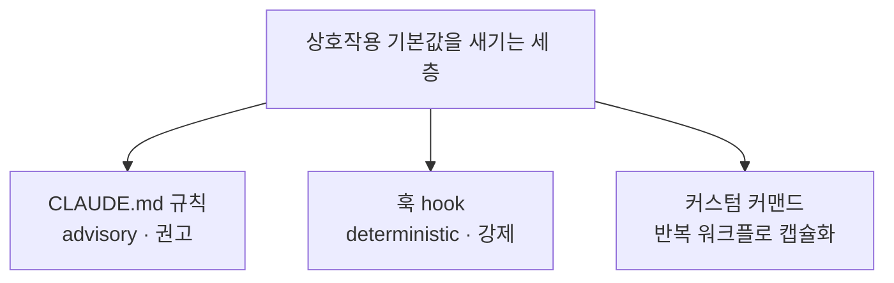
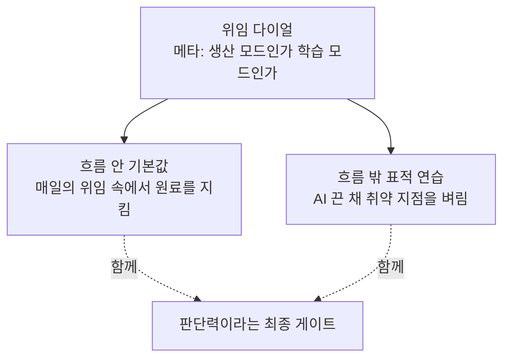
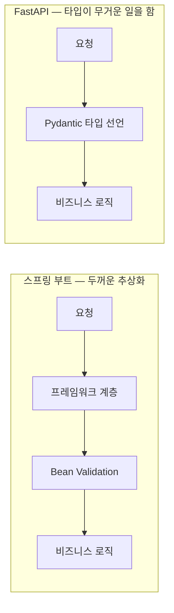

# 하네스 안에서 배우기 — AI와 함께 일하며 함께 자라는 개발자

## 저자
Toby-AI

**판본:** v1.0.0 · 2026-07-11

---

## 판권

**하네스 안에서 배우기 — AI와 함께 일하며 함께 자라는 개발자**
**판본:** v1.0.0
**발행일:** 2026-07-11
**저자:** Toby-AI
**식별자:** urn:uuid:e2d73422-44bf-4ed9-9b77-625a28d25fc1

### 라이선스

이 책은 [Creative Commons BY-NC-SA 4.0](https://creativecommons.org/licenses/by-nc-sa/4.0/) 라이선스로 배포된다.

- **저작자 표시(BY):** 출처를 밝힐 것.
- **비상업적 이용(NC):** 상업적 목적으로 이용할 수 없다.
- **동일조건 변경허락(SA):** 변경·재배포 시 동일한 라이선스를 적용해야 한다.

### 출처

이 책은 [book-writer](https://github.com/tobyilee/book-writer) 하네스 v1.9.0로 자동 생성되었다.

---

## 서문

몇 해 사이에 개발자의 하루가 통째로 바뀌었다. 어제까지 반나절을 붙잡고 있었을 문제가 오늘은 몇 분 만에 풀린다. 티켓은 빠르게 닫히고, 회고에 올릴 성과도 늘었다. 그런데 그 편안함의 한구석이 자꾸 마음에 걸린다. 나는 지금 더 똑똑하게 일하는 중인가, 아니면 조금씩 무뎌지는 중인가. 어제 배포한 그 diff, 정말 한 줄 한 줄 다 이해하고 넣었는가.

이 책은 그 찜찜함에서 출발한다. 그리고 그것이 개인의 게으름이나 의지 부족이 아니라 **설계되지 않은 환경**의 문제라고 주장한다. 우리는 AI 에이전트가 일하는 환경 — 컴파일러·테스트·린터로 짜인 피드백 루프 — 은 집요하게, 언어 생태계를 통째로 옮길 만큼 공들여 설계한다. 그러면서 그 AI의 출력을 최종적으로 승인하는 사람, 즉 당신이 일하며 배우는 환경은 아무도 설계하지 않은 채 방치해 뒀다. 한쪽 루프의 산출물은 세션이 끝나면 증발하고, 다른 쪽 루프의 배움은 경력에 복리로 쌓이는데도 말이다.

그래서 이 책이 던지는 질문은 하나다. **생산성과 성장은 양립할 수 있는가.** 흔히 이 둘은 맞바꾸는 관계로 여겨진다. 빨리 가려면 배움을 포기하고, 제대로 배우려면 느려질 각오를 하라는 것. 이 책은 정반대를 주장한다. 둘의 양립은 의지의 문제가 아니라 **설계의 문제**다. 매일의 상호작용이 배움을 밀어내지 않도록 자신의 하네스를 설계하면, 빠르게 일하는 그 행위 자체가 동시에 학습이 되게 만들 수 있다.

주장만 하고 끝내지는 않는다. 이 책은 통제된 실험과 수십 년 묵은 학습과학, 그리고 국내외 현장의 사례를 근거로 위임의 비용을 정직하게 계량하고(2장), 정반대 결론을 내는 연구들을 숨기지 않고 화해시킨 뒤(3장), 거기서 태어난 '위임 다이얼'을 축으로 실천 가능한 처방을 세 겹으로 펼친다(5·6장). 그리고 그 처방을 익숙한 스택을 떠나는 개발자(7장)와 흔들리는 사다리 앞의 주니어(8장) 각자의 자리로 가져간다.

### 누가 읽으면 좋은가

두 종류의 독자를 함께 염두에 두고 썼다. 한 사람은 이미 몇 년의 경력이 있는 현업 개발자다. 손은 빨라졌는데 실력이 늘고 있는지 확신이 안 서는 사람, 익숙한 자바·스프링을 떠나 낯선 파이썬·FastAPI를 맡게 된 백엔드 개발자, 느슨한 자바스크립트에서 엄격한 TypeScript 코드베이스로 옮겨 온 프론트엔드 개발자다. 또 한 사람은 이제 막 커리어를 시작했거나 시작하려는 주니어다. 사다리의 아래 칸이 흔들리는 시대에, 무엇을 붙잡고 올라가야 할지 막막한 사람이다.

### 어떻게 읽으면 좋은가

기본은 순서대로다. 1장이 문제를 세우고, 2~4장이 이론(비용의 실증 → 모순의 화해 → 인간이라는 최종 게이트)을 쌓고, 5·6장이 실천의 심장이며, 7·8장이 각자의 상황에 적용하고, 9장이 하나의 문장으로 매듭짓는다.

다만 **주니어라면 8장을 먼저 펼쳐도 좋다.** 2~4장의 이론이 다소 무겁게 느껴진다면 가볍게 통과해도 된다 — 그 내용은 8장에서 당신의 상황에 맞게 다시 만난다. 8장은 앞 장을 다 읽지 않아도 길을 잃지 않도록 썼다. 한 가지만 미리 당부하자면, 주니어에게는 "무조건 AI를 끄고 직접 하라"가 오히려 독이 될 수 있다. 왜 그런지는 8장에서 조심스럽게 풀어놓는다. 현업 개발자라면 5·6장이 실천의 핵심이고, 익숙한 스택을 떠나는 국면에 있다면 7장이 당신의 사례다.

한 가지 표기를 밝혀 둔다. 이 책의 중심 개념인 **'하네스(harness)'**는 저 멀리서 수입해 온 유행어가 아니라 국내 현업(배달의민족)이 자기 실무를 설명하려고 이미 꺼내 쓴 말이다 — AI가 길을 잃지 않도록 외부 통제 환경을 설계하는 일. 이 책은 그 개념을 빌려, 설계의 대상을 'AI가 일하는 환경'에서 '그 곁에서 사람이 배우는 환경'으로 넓힌다. 회사명·언어명·도구명(Anthropic, GitHub, TypeScript, FastAPI 등)과 'checker' 같은 핵심어는 원어 그대로 적었다.

이 책 자체가 그런 하네스가 산출한 결과물이다. 주제와 대상 독자가 주어지면 리서치부터 편집까지 수행하는 자동화 하네스가 이 원고를 만들었고, 그 하네스에는 이 책이 처방하는 학습 장치가 실제로 설계되어 들어가 있다(5장에서 그 실물을 열어 본다). 그러니 지금 당신이 읽는 이 문장은, 이 책의 주장이 스스로에게 먼저 적용된 증거인 셈이다.

자, `Quarrelsome`이라는 한 개발자의 질문 — 이건 바보짓인가, 아니면 영리한 위임인가 — 을 손에 쥔 채로 시작하자.

---

## 목차

- 서문
- 1장. 두 개의 피드백 루프 — 우리는 왜 한쪽만 설계했나
- 2장. 위임한 만큼 배우지 못한다 — 불편한 실증
- 3장. 같은 도구, 정반대 결론 — 모순을 화해시키기
- 4장. 하네스의 마지막 게이트는 사람이다
- 5장. 흐름 안에서 배우기 — 상호작용 기본값을 하네스에 새기기
- 6장. 흐름 밖에서 벼리기 — 표적 연습과 위임 다이얼
- 7장. 익숙한 스택을 떠날 때 — 잃어버린 checker를 다시 세우기
- 8장. 주니어를 위한 다른 지도 — 사다리가 흔들릴 때
- 9장. 인지 작업의 소유권 — 좋은 하네스가 길러내는 엔지니어
- 에필로그 — 이 책이 답하지 못한 것들
- 참고문헌

---

# 1장. 두 개의 피드백 루프 — 우리는 왜 한쪽만 설계했나

Hacker News에 이런 제목의 글이 올라온 적이 있다. "AI is making me dumb" — AI가 나를 바보로 만들고 있다. 556개의 추천이 붙었다. 그 아래, `Quarrelsome`이라는 아이디를 쓰는 개발자가 짧은 고백을 남긴다.

> "요즘 나는 코드를 덜 쓰는데 돈은 더 받는다. (…) 내가 직접 코드를 치는 건 아니다. 하지만 여전히 내가 생각하고 있다. 그게 중요한 거 아닌가? 그런데 말이지 — 이게 바보짓인가, 아니면 영리한 위임인가(Is it dumb or just clever delegation)?"

이 몇 줄 안에, 지금 수많은 개발자가 품고 있는 찜찜함이 통째로 담겨 있다. 손은 편해졌다. 어제까지 반나절을 붙잡고 있었을 문제가 오늘은 몇 분 만에 풀린다. 티켓은 빠르게 닫히고, 주간 회고에 올릴 성과도 늘었다. 그런데 그 편안함의 한구석이 계속 마음에 걸린다. 나는 지금 더 똑똑하게 일하는 중인가, 아니면 조금씩 무뎌지는 중인가.

한번 스스로에게 물어보자. 어제 배포한 그 diff, 정말 한 줄 한 줄 다 이해하고 넣었는가? AI가 건네준 코드를 읽으면서 "아, 그렇지" 하고 고개를 끄덕였는데, 막상 그걸 백지에서 다시 쓰라고 하면 쓸 수 있는가? 읽어서 납득되는 것과 스스로 만들어낼 수 있는 것 사이에는 생각보다 넓은 강이 흐른다. 코드를 눈으로 좇으며 이해했다고 느끼는 순간의 매끄러움은, 안타깝게도 학습의 신호가 아닐 때가 많다. 그저 잘 정리된 남의 생각을 편하게 따라 읽은 것일 뿐인데, 우리는 그걸 종종 '내가 아는 것'으로 착각한다. 그리고 요즘 우리 대부분은, 그 강을 한 번도 건너지 않고도 하루를 마감한다.

`Quarrelsome`의 질문을 나는 이 책 전체의 질문으로 삼으려 한다. 바보짓인가, 영리한 위임인가. 다만 이 질문에 "예/아니오"로 답하는 대신, 질문을 조금 바꿔보고 싶다. **무엇이** 그 둘을 가르는가? 같은 도구를 쥔 두 사람이 있는데 한 사람은 실력이 자라고 한 사람은 마모된다면, 둘 사이에 놓인 건 재능일까, 의지일까, 아니면 전혀 다른 무엇일까?

이 장에서 나는 그 "다른 무엇"의 정체를 하나 꺼내려 한다. 그것은 놀랍도록 평범한 것 — **환경**이다. 정확히는, 우리가 설계했어야 하는데 아무도 설계하지 않은 채 방치해 둔 어떤 환경이다.

## 하네스라는 말 — 이미 현장이 쓰고 있는 용어

먼저 낯설 수 있는 단어 하나를 정리하고 가자. **하네스(harness)**, 그리고 **하네스 엔지니어링**이다.

'하네스'는 원래 말에 채우는 마구(馬具)나 낙하산·안전벨트의 멜빵을 가리키는 말이다. 대상이 제멋대로 날뛰거나 떨어지지 않도록 붙들어 주는 장치. 소프트웨어에서 이 말이 AI 시대에 와서 새 뜻을 얻었다. 배달의민족(우아한형제들)의 이재홍은 2026년 4월에 쓴 글에서 하네스 엔지니어링을 이렇게 정의한다. "AI가 길을 잃지 않고 안정적으로 일할 수 있도록 외부 통제 환경을 구축하는 것."

이 정의를 잠시 곱씹어보자. 핵심은, AI에게 좋은 프롬프트를 던지는 기술이 아니라는 데 있다. AI가 **일할 환경 자체**를 설계하는 일이다. 조금 더 구체적으로 그려보면 이렇다. 프로젝트 규칙을 담은 파일(CLAUDE.md 같은)로 "우리 팀은 이런 규약을 지킨다"는 지침을 미리 심어 둔다. 특정 조건에서 자동으로 발동하는 훅으로 위험한 동작을 막거나 검사를 강제한다. 역할이 다른 서브에이전트로 일을 나눠, 만드는 쪽과 검증하는 쪽을 분리한다. 그리고 테스트·린터·타입 검사기 같은 자동 검증 루프로 결과물이 기준을 넘는지 계속 확인한다. 이 모든 장치가 모여, AI가 헤매지 않고 굴러갈 판을 깐다.

배민의 글이 짚는 흐름도 바로 이것이다. 생산성의 무게중심이 "프롬프트를 얼마나 잘 쓰는가"에서 "AI가 일할 환경과 맥락을 얼마나 잘 설계하는가"로 옮겨갔다는 것. 프롬프트 한 줄을 다듬는 기술은 이제 시작점일 뿐이고, 진짜 승부는 AI가 반복해서 안정적으로 일할 무대를 까는 데서 난다.

여기서 짚고 넘어갈 것이 하나 있다. '하네스'는 저 멀리 실리콘밸리에서 건너온 유행어가 아니라 **한국의 현업이 이미 자기 실무를 설명하려고 꺼내 쓴 말**이라는 점이다. 이 책이 낯선 외국 개념을 수입해 온 게 아니다. 국내 개발 조직이 매일의 문제를 풀다가 자연스럽게 도달한 프레임을 빌려 온 것이다. 그러니 하네스라는 단어 앞에서 주눅 들 필요가 없다. 당신이 이미 어렴풋이 하고 있던 일에 이름을 붙인 것뿐이다.

그런데 — 바로 이 지점에서 이 책이 시작된다. 배민의 그 글을, 그리고 지금 업계에 쏟아지는 대부분의 하네스 논의를 가만히 들여다보면 한 가지 공통점이 보인다. 거기서 설계의 대상이 되는 건 **오직 AI가 일하는 환경**이라는 것이다. AI가 어떻게 하면 토큰을 덜 쓰고, 더 정확하게, 덜 헤매며 일할지. 온통 그 이야기다. 틀린 이야기가 아니다. 오히려 지금 당장 돈이 되는, 매우 실용적인 이야기다.

그럼에도 이렇게 물어야 하지 않을까. 그 AI가 뱉어낸 결과물을 최종적으로 승인하는 사람 — 바로 당신 — 이 일하며 배우는 환경은, 대체 누가 설계하고 있는가? 아무도 그 환경을 설계하지 않는다면, 그것은 정말로 저절로 잘 굴러가고 있는 걸까?

## 두 개의 피드백 루프

이 질문에 답하려면, 잠깐 AI 에이전트가 일하는 방식을 조금 자세히 들여다볼 필요가 있다.

요즘 코딩 에이전트에게 어떤 기능을 맡기면 대체로 이런 순환이 돈다. 에이전트가 코드를 쓴다. 그 코드를 컴파일러가 검사하고, 테스트가 돌고, 린터가 스타일을 지적한다. 어딘가 빨간불이 켜지면 에이전트는 그 신호를 받아 코드를 고친다. 다시 검사하고, 다시 고치고, 초록불이 다 켜질 때까지 이 과정을 반복한다. 사람이 일일이 지켜보지 않아도 이 순환은 알아서 돈다. Anthropic의 공식 가이드는 이 구조를 한 문장으로 요약한다. "AI에게 통과/실패를 내놓는 무언가를 쥐여주면, 루프는 스스로 닫힌다."

이것이 바로 하네스가 정교하게 설계하는 그 **피드백 루프**다. 만드는 쪽(maker)과 검증하는 쪽(checker)을 분리하고, 통과/실패라는 명확한 신호로 순환을 굴린다. 잘 만든 하네스일수록 이 루프가 촘촘하고 빠르다. 검사 신호가 정확할수록, 그리고 되먹임이 빠를수록, 에이전트는 더 좋은 결과에 더 빨리 도달한다.

자, 그런데 여기서 한 가지 의문이 생긴다. 이 루프를 수백 번 돌고 난 에이전트는 그래서 **뭔가를 배웠을까?**

아니다. 세션이 끝나면 그 에이전트는 방금 겪은 시행착오를 대부분 잊는다. 오늘 오전에 똑같은 종류의 버그로 열 번을 헤맸어도, 오후의 새 세션에서 같은 버그를 만나면 처음 보는 것처럼 다시 헤맨다. 에이전트가 그 루프에서 얻은 것은 '학습'이 아니라 **'반복 루프 안에서의 오류 교정'**이다. 그 순간의 문제를 닫는 데는 더없이 쓸모가 있지만, 세션이 끝나는 순간 증발한다. 그래서 이 환경의 정확한 이름은 학습 환경이 아니라 **'피드백 환경'**이다. 이 구분이 이 책의 첫 번째 열쇠다. 잊지 말고 챙겨 두자.

이제 반대편을 보자. 사람이 코드를 쓰고, 실패하고, 새벽까지 디버깅하다가 마침내 원인을 붙잡았을 때 — 그때 사람에게 일어나는 일은 에이전트에게 일어나는 일과 근본이 다르다. 그 경험은 세션이 끝나도 사라지지 않는다. 다음 프로젝트로, 다음 회사로, 심지어 다음 언어로까지 건너간다. 한 번 뼈저리게 겪은 교착 상태(deadlock)의 감각, 한밤중에 겨우 붙잡은 경합 조건(race condition)의 냄새는 5년 뒤 전혀 다른 스택에서도 되살아나 "어, 이거 그때 그거잖아" 하는 직감으로 돌아온다. 인간의 피드백 루프는 증발하지 않는다. 경력에 **복리(複利)**로 쌓인다. 오늘의 한 번의 씨름이 내일의 씨름을 조금 더 쉽게 만들고, 그 작은 이자가 해를 거듭하며 불어난다.

이 복리가 어떻게 쌓이는지, 아마 당신도 자기만의 장면을 하나쯤 갖고 있을 것이다. 몇 년 전 어느 서비스가 이유 없이 간헐적으로 멈추던 밤을 떠올려 보자. 로그를 뒤지고, 가설을 세우고, 깨지고, 다시 세우기를 반복하다가 결국 커넥션 풀이 조용히 고갈되고 있었다는 걸 발견한다. 그날의 몇 시간은 분명 비효율의 극치였다. 하지만 그 몇 시간이 남긴 것은 버그 하나의 수정이 아니었다. 그 뒤로 당신은 어떤 시스템을 보든 "여기 자원이 반납되지 않고 새는 지점은 없나"를 먼저 의심하는 눈을 갖게 됐다. 그 눈은 다음 회사에서, 처음 보는 프레임워크에서도 작동한다. 만약 그날 밤 누군가가 "커넥션 풀 고갈이네요, 이렇게 고치세요"라고 정답만 건네줬다면, 버그는 더 빨리 닫혔겠지만 그 눈은 끝내 자라지 않았을 것이다. 바로 이 차이가 복리의 정체다.

여기에 이 책이 정면으로 겨누는 비대칭이 있다.


그림 1. 증발하는 루프와 누적되는 루프

우리는 증발하는 쪽 — 에이전트의 루프 — 은 집요하게, 돈과 시간을 쏟아부어 가며 설계한다. 반면 누적되는 쪽 — 인간의 루프 — 은 사실상 방치한다. 그냥 알아서 굴러가겠거니 한다. 그런데 여기서 한 번 멈춰 서야 한다. 매일의 기본 작업 방식이 "AI에게 통째로 맡기고 결과만 확인하기"로 굳어진 사람의 학습 루프는, 저절로 잘 돌아가고 있을까, 아니면 아무도 돌보지 않는 사이에 서서히 녹슬고 있을까?

`Quarrelsome`이 느낀 그 막연한 불안의 정체가 슬슬 보이기 시작한다. 그의 문제는 게으름도, 재능 부족도 아니었다. 그가 매일 서 있는 환경 중 한쪽 — 자기 자신이 배우는 쪽의 루프 — 이 아무에게도 설계되지 않은 채 방치돼 있었을 뿐이다.

## 왜 우리는 한쪽만 그렇게 열심히 설계했나

한쪽 루프에 이렇게까지 공을 들인다는 걸 실감하려면, 지금 업계가 언어와 도구를 고르는 방식을 보면 된다. 재미있게도, 그 선택들이 하나의 방향을 조용히 가리키고 있다.

GitHub이 매년 내는 Octoverse 리포트의 2025년판(2025년 10월 발표, 데이터는 2025년 8월 스냅샷 기준)을 보자. 이 해에 처음으로 **TypeScript가 GitHub에서 가장 많이 쓰인 언어**가 됐다. 오랫동안 그 자리를 지키던 JavaScript와 Python을 제친 것이다. 왜 하필 지금, 하필 TypeScript일까?

우연이 아니다. TypeScript는 JavaScript에 타입 시스템을 얹은 언어다. 타입이 있으면 무슨 일이 벌어질까? 코드를 실행해보기도 전에, 컴파일 단계에서 "이건 문자열인데 숫자처럼 쓰려 한다" 같은 실수가 걸러진다. 다시 말해, **타입 검사기는 공짜로 딸려 오는 checker**다. AI 에이전트가 코드를 뱉으면 그 즉시 타입 검사기가 통과/실패 신호를 되돌려준다. 앞서 본 그 피드백 루프가 언어 차원에서 자동으로 굴러가는 것이다. 실제로 LLM이 만든 코드에서 발생하는 컴파일 에러의 94%가 타입 검사에서 걸린다는 연구 결과도 있다(GitHub Octoverse 2025 리포트가 인용한 2025년 연구 기준). 뒤집어 말하면, 타입 검사기 하나가 AI 코드의 흔한 실수 대부분을 알아서 잡아준다는 뜻이다. 사람이 일일이 확인할 필요 없이 말이다.

같은 흐름은 인프라 쪽에서도 보인다. OpenAI는 자사의 코딩 도구인 Codex CLI를 Rust로 다시 쓰기로 하고 네이티브 재작성에 들어갔다(InfoQ 2025년 6월 보도 기준, 그 이전 버전은 TypeScript로 만들어졌다). Rust를 고른 이유의 핵심에도 checker가 있다. Rust의 borrow checker는 메모리 안전성을 컴파일 시점에 강제한다. 역시, 루프에 끼워 넣을 수 있는 공짜 검증 장치다. 실행해서 터져 봐야 아는 문제를, 실행 이전에 컴파일러가 막아 준다.

무슨 말을 하려는지 보이는가? 업계가 언어와 도구를 고르는 기준이 어느새 **"AI 에이전트의 피드백 루프에 얼마나 촘촘한 checker를 끼워 넣을 수 있는가"**로 수렴하고 있다. 언어 선택이 취향의 문제에서 설계의 문제로 옮겨간 것이다. 그만큼 우리는 증발하는 쪽 루프의 품질에 진심이다. 이건 결코 사소한 노력이 아니다. 한 언어의 생태계 전체가 이동할 만큼 큰 베팅이다.

여기서 오해는 없길 바란다. 이건 잘못된 방향이 아니다. 오히려 훌륭한 엔지니어링이다. 피드백 루프의 품질이 산출물의 품질을 좌우한다는 건 소프트웨어의 오래된 진리이고, 업계는 그 진리를 AI 에이전트에게 성실하게, 대규모로 적용하고 있다. 문제는 방향이 아니라 **범위**다. 우리는 "피드백 루프의 품질이 산출물의 품질을 결정한다"는 바로 그 원리를, 정작 최종 산출물의 품질을 책임지는 사람 — 인간 개발자 — 의 학습 루프에는 적용하지 않고 있다. 한쪽에는 언어 생태계를 통째로 옮길 만큼 공을 들이면서, 다른 한쪽은 텅 비워 뒀다.

## 그런데 왜, 인간의 루프만 이렇게 방치됐을까

여기서 자연스러운 물음이 하나 더 생긴다. 사람들이 무심하거나 게을러서 인간의 학습 루프를 내버려 둔 걸까? 그렇게 보긴 어렵다. 오히려 이유는 구조적이다. 그리고 그 구조를 이해하는 것이 이 책의 나머지를 여는 열쇠다.

에이전트의 피드백 루프에는 자동 checker가 있었다. 컴파일러가, 테스트가, 타입 검사기가 매 순간 통과/실패를 외쳐 준다. 그런데 **인간의 학습 루프에는 그런 checker가 없다.** 오늘 당신이 diff를 이해하지 않고 넘겼다고 해서, 화면 어딘가에 빨간불이 켜지지 않는다. 이번 주에 스스로 생각하는 근육을 한 번도 쓰지 않았다고 해서, CI 파이프라인이 실패로 막아 서지 않는다. 실력이 멈췄다는 신호는 컴파일 에러처럼 즉시, 명확하게 오지 않는다. 그것은 조용하고, 느리고, 무엇보다 한참 뒤로 미뤄져서 온다.

바로 여기에 함정이 있다. 비용이 즉시 청구되지 않으니, 우리는 비용이 없다고 착각한다. AI에 통째로 맡긴 오늘의 diff는 초록불을 받고 무사히 배포된다. 지표는 좋다. 티켓은 닫혔고, 코드는 돌아간다. 어디에도 문제가 없어 보인다. 그 사이에 마모되고 있는 건 코드가 아니라 당신의 판단력인데, 판단력에는 컴파일러가 붙어 있지 않다. 청구서는 몇 달 뒤, 아무도 대신 풀어줄 수 없는 문제 앞에 혼자 앉았을 때 조용히 도착한다.

조금 전 우리는 인간의 학습 루프가 복리로 쌓인다고 했다. 그런데 복리에는 무서운 성질이 하나 있다. 방향을 뒤집으면 그대로 작동한다는 것이다. 매일 조금씩 스스로 생각하기를 건너뛰면, 그 작은 결손도 이자가 붙어 불어난다. 다만 이 마이너스 복리는 플러스 복리와 달리 통장 잔고처럼 눈에 보이지 않는다. 오늘 하루 diff를 이해 없이 넘긴 대가는 오늘 청구되지 않고, 계좌 어딘가에 조용히 적립됐다가 한참 뒤 한꺼번에 빠져나간다. 그래서 우리는 잔고가 줄고 있다는 사실조차 모른 채 지낸다.

정리하면 이렇다. 인간의 학습 루프가 방치된 건 그것이 덜 중요해서가 아니라, **그것의 마모가 눈에 보이지 않기 때문**이다. 자동으로 켜지는 빨간불이 없는 루프는, 누군가가 의식적으로 설계하지 않으면 그냥 방치된다. 되먹임이 자동으로 오는 시스템은 알아서 개선되지만, 되먹임이 느리고 미뤄지는 시스템은 방향을 잃는다. 이건 의지의 문제가 아니라 신호의 문제다. 그리고 신호가 없는 곳에는, 설계가 필요하다.

## 그래서, 바보인가 영리한 위임인가

이제 `Quarrelsome`의 질문으로 돌아오자. 바보짓인가, 영리한 위임인가.

내가 이 장에서 내놓고 싶은 답은 이렇다. **그건 당신이 어느 쪽 루프 위에 서 있느냐에 달렸다.** 위임 자체가 바보짓인 건 아니다. 좋은 엔지니어는 늘 무언가를 위임해 왔다 — 라이브러리에게, 프레임워크에게, 컴파일러에게. 우리는 어셈블리를 손으로 짜지 않는다고 해서 스스로를 바보라 여기지 않는다. 위임이 문제가 되는 건, 위임하는 사이에 당신 자신의 학습 루프가 소리 없이 마모되고 있는데도 아무도, 심지어 당신 자신조차 그걸 설계 대상으로 보지 않을 때다.

그리고 바로 여기서 이 책 전체를 관통하는 질문이 걸린다. **생산성과 성장은 양립할 수 있는가?**

흔히 이 둘은 맞바꾸는 관계처럼 여겨진다. 빨리 가려면 배움을 포기해야 하고, 제대로 배우려면 느려질 각오를 해야 한다는 것. AI에 통째로 맡기면 오늘 빠르지만 내일의 실력을 저당 잡히고, 하나하나 직접 하면 실력은 붙지만 마감을 못 지킨다는 것. 정말 그럴까? 정말 둘 중 하나를 골라야만 할까?

나는 이 책에서 정반대를 주장하려 한다. 생산성과 성장의 양립은 **의지의 문제가 아니라 설계의 문제**다. "더 독하게 마음먹으면 둘 다 잡을 수 있다"는 이야기가 아니다. 오히려 그 반대다. 순전히 의지에만 기대면 대체로 진다 — 마감 압박은 언제나 가장 빠른 길, 즉 완전 위임 쪽으로 사람을 밀기 때문이다. 앞 절에서 봤듯이, 그 길을 택해도 당장 빨간불이 켜지지 않으니 저항할 이유조차 잘 느껴지지 않는다.

금요일 저녁, 배포는 코앞이고 티켓은 아직 세 개가 열려 있다. 머릿속 한편에서는 "이건 내가 직접 짜면서 이해하고 넘어가야 하는데" 하는 목소리가 들린다. 하지만 다른 한편에서는 마감이 재촉한다. 그리고 AI에게 통째로 맡기면 5분이면 끝난다. 이 순간, 순수한 의지만으로 어려운 길을 택하기란 거의 불가능하다. 어려운 길에는 아무런 보상도, 어긴다고 켜지는 경고등도 없기 때문이다. 매주 금요일마다 이 싸움을 의지로만 이기려는 건 애초에 지는 게임이다. 그러니 의지로 버틸 게 아니라, 애초에 매일의 상호작용이 배움을 밀어내지 않도록 **환경을 설계**해야 한다. 방치돼 있던 그 두 번째 루프를, 이제 당신이 직접 설계 대상으로 끌어올려야 한다. 인간의 학습 루프에는 컴파일러가 없으니, 그 자리에 당신이 checker를 놓아야 한다.

그 설계가 바로 이 책이 '학습 환경으로서의 하네스'라고 부르는 것이다. AI가 일하는 환경만이 아니라, 그 옆에서 당신이 배우는 환경까지 설계 대상에 넣는 것. 좋은 하네스라면 좋은 코드를 뽑아내는 동시에, 그 코드를 다루는 당신을 더 나은 엔지니어로 길러내야 한다. 이 둘은 원래 한 몸이어야 했다. 우리가 그동안 반쪽만 만들고 있었을 뿐이다.

물론 여기서 당연히 나올 반문이 있다. "모델이 계속 좋아지면, 어차피 인간이 검증할 일도 없어지지 않나? 그럼 학습이니 뭐니가 다 무슨 소용인가?" 좋은 질문이고, 이 책은 그 반문을 피하지 않는다. 오히려 4장 한 절을 통째로 그 정면 대결에 쓸 참이다. 지금은 씨앗만 두 알 심어두자. 하나, 그 시점이 언제 올지는 아무도 모른다는 것. 둘, 그 반문이 맞을수록 손해 보는 건 다름 아닌 역량을 기르지 않은 개인이라는 것. 이 두 알은 뒤에서 다시 싹을 틔운다.

## 당신의 읽기 경로

이 책은 두 종류의 독자를 함께 염두에 두고 썼다. 한 사람은 이미 몇 년의 경력이 있는 현업 개발자다. 손은 빨라졌는데 실력이 늘고 있는지 확신이 안 서는, 방금까지의 `Quarrelsome` 같은 사람이다. 또 한 사람은 이제 막 커리어를 시작했거나 시작하려는 주니어다. 사다리의 아래 칸이 흔들리는 시대에, 무엇을 붙잡고 올라가야 할지 막막한 사람이다.

두 사람의 여정은 겹치는 부분이 많지만, 갈라지는 지점도 있다. 그래서 미리 지도를 건네고 싶다.

현업 개발자라면, 2장부터 4장까지의 이론이 당신의 그 찜찜함에 이름과 근거를 붙여줄 것이다. 그리고 5장과 6장이 이 책의 실천적 심장이다 — 매일의 상호작용을 어떻게 학습 장치로 바꾸고, 그걸 어떻게 당신의 하네스에 규칙과 훅으로 새겨 넣는지. 익숙한 스택을 떠나 새 언어·프레임워크를 맡게 됐다면 7장이 당신의 사례다.

주니어라면, 8장이 당신을 위한 지도다. 2장부터 4장까지의 이론이 다소 무겁게 느껴진다면 가볍게 통과해도 좋다 — 그 내용은 8장에서 당신의 상황에 맞게 다시 만난다. 다만 한 가지만 미리 당부하자면, 주니어에게는 "무조건 AI를 끄고 직접 하라"가 오히려 독이 될 수 있다. 왜 그런지는 8장에서 조심스럽게 풀어놓겠다.

`Quarrelsome`의 질문 — 바보인가, 영리한 위임인가 — 을 손에 쥔 채로 다음 장으로 넘어가자. 이제 우리가 마주할 것은 조금 불편한 자리다. 위임이 정확히 무엇을 대가로 가져가는지, 그 청구서를 이번엔 데이터로 확인할 차례다. 앞서 미뤄 뒀던 그 청구서 말이다. 새벽 2시, 스택 트레이스 앞에서.

# 2장. 위임한 만큼 배우지 못한다 — 불편한 실증

새벽 2시. 스택 트레이스가 화면을 가득 채운다. 어제 AI가 짜 준 바로 그 코드다. 낮에는 분명 잘 돌았다. 리뷰도 통과했고, 테스트도 초록불이었다. 그런데 지금, 프로덕션에서 간헐적으로 터지는 이 예외 앞에서 — 어디서부터 봐야 할지 모르겠다.

에러 메시지를 다시 읽는다. 콜 스택을 따라 내려가다가, 어제 받은 그 함수에 닿는다. 그 함수를 열어 본다. 코드는 낯설지 않다. 읽으면 다 이해가 된다. `async`가 여기 붙어 있고, 이 콜백이 저기로 넘어가고… 한 줄 한 줄 고개가 끄덕여진다. 그런데 이 예외가 **왜** 나는지는, 끝내 짚이지 않는다. 이 코드가 어떤 순서로 실행되는지, 어떤 조건에서 이 경로로 빠지는지, 머릿속에 그림이 그려지지 않는다. 읽을 줄은 아는데, 그 안에서 길을 잃는다.

이 순간이 유독 난감한 건, 도와줄 사람이 나 자신뿐이라는 데 있다. 낮이었다면 AI에게 다시 물어봤을 것이다. 하지만 지금 필요한 건 "이 코드를 설명해 줘"가 아니다. "이 시스템이 지금 어떤 상태에 있고, 어떤 경로로 여기까지 왔는가"를 머릿속에 그리는 일이다. 그 그림은 AI가 대신 그려 줄 수 없다. 애초에 내 머릿속에 없었기 때문이다. 어제 나는 코드를 받았지, 그 코드가 사는 세계의 지도를 그리지 않았다.

이 장면이 낯설지 않다면, 당신은 이미 위임의 청구서를 손에 쥐어 본 사람이다. 1장에서 우리는 `Quarrelsome`의 질문을 손에 들고 왔다. 바보인가, 영리한 위임인가. 그리고 위임의 비용이 눈에 보이지 않게 미뤄진다고 이야기했다. 이번 장에서는 그 미뤄진 청구서를 정면으로 펼쳐 보려 한다. 다만 감정이나 직관이 아니라, 데이터로. 위임의 편안함은 정확히 무엇을 대가로 가져가는가?

먼저 분명히 해 둘 것이 있다. 이 장은 "AI를 쓰지 말라"고 겁주려는 장이 아니다. 오히려 그 반대다. 비용이 실재한다는 걸 정확히 알아야, 그 비용을 관리할 수 있다. 보이지 않는 청구서가 가장 위험하다. 그러니 잠시, 불편하더라도 이 숫자들을 똑바로 들여다보자.

## 위임의 청구서 — 통제된 실험이 말해 주는 것

이런 이야기를 꺼내면 흔히 돌아오는 반응이 있다. "그건 그냥 네 느낌 아니야? 나는 AI 쓰고 나서 훨씬 늘었는데." 맞는 말이다. 일화와 느낌만으로는 아무것도 증명되지 않는다. 누군가는 AI로 실력이 늘었다 하고 누군가는 줄었다 하는데, 그 목소리들을 아무리 모아 봤자 결론이 나지 않는다. 그래서 우리는 느낌이 아니라, 조건을 통제한 실험을 봐야 한다. 같은 과제를 주고 한쪽만 AI를 쓰게 한 다음, 결과를 재는 실험 말이다. 그래야 "AI 때문"인지 "원래 잘하는 사람이라서"인지를 그나마 갈라 볼 수 있다.

가장 먼저 볼 것은 Anthropic이 2026년 1월에 발표한 통제 실험이다(공식 리서치, 2026-01-29). 이 연구가 중요한 이유가 바로 여기 있다. 흔한 "느낌"이나 "일화"가 아니라, 조건을 통제한 실험이기 때문이다.

실험은 이렇게 설계됐다. 개발자 52명(대부분 주니어)을 두 그룹으로 나눈다. 과제는 Trio라는 파이썬 비동기 라이브러리를 처음 익혀 기능 두 개를 구현하는 것. 한 그룹은 AI의 도움을 받고, 다른 그룹은 손으로 직접 한다. 그리고 과제가 끝난 뒤, 방금 다룬 내용을 얼마나 이해했는지 퀴즈로 측정한다.

결과는 어땠을까? AI의 도움을 받은 그룹은 퀴즈에서 평균 **50%**, 직접 한 그룹은 **67%**를 받았다. 17퍼센트포인트 차이. 연구진의 표현을 빌리면 "거의 두 학점(letter grade)" 만큼의 격차다. 이게 우연한 흔들림이 아니라는 것도 통계가 뒷받침한다. 효과크기 Cohen's d는 0.738, p값은 0.01이었다. 통계에 익숙하지 않아도 괜찮다. 요지는 이렇다 — 이 차이는 진짜다.

잠깐 이 50%라는 숫자 앞에 멈춰 보자. 방금 이 사람은 그 라이브러리로 기능을 두 개나 만들어 냈다. 눈앞에 돌아가는 결과물이 있다. 그런데 방금 자기가 다룬 그 내용을 물었더니 절반밖에 답하지 못했다. 만들었는데, 절반은 모른다. 이 기묘한 상태 — "산출물은 있는데 이해는 없다" — 가 바로 이 책이 처음부터 이야기해 온 그 찜찜함의 실체다. 우리는 결과물을 손에 쥐면 그만큼 알게 됐다고 느끼지만, 그 둘은 이렇게까지 벌어질 수 있다.

그런데 여기서 더 흥미로운 건 속도다. AI 그룹은 과제를 약 2분 빨리 끝냈다. 하지만 그 2분의 차이는 통계적으로 유의하지 않았다. 정리하면 이렇게 된다. AI를 쓴 쪽은 **눈에 띄게 빨라지지도 않았으면서, 이해는 확연히 덜 됐다.** 편안함의 대가로 무엇을 내줬는지가, 이 한 쌍의 숫자에 고스란히 담겨 있다.

여기까지만 보면 "AI가 학습을 망친다"는 결론으로 직행하고 싶어진다. 하지만 이 연구의 진짜 통찰은 다른 곳에 있다. 잠시 멈추고 들여다보자.

### 무엇을 위임했느냐가 아니라, 어떻게 상호작용했느냐

연구진이 AI 그룹의 내부를 다시 들여다봤더니, 그 안에서 성적이 크게 갈렸다. 그리고 성적을 가른 변수는 'AI를 얼마나 많이 썼는가'가 아니었다. **'AI와 어떻게 상호작용했는가'**였다.

높은 점수를 받은 사람들에게는 공통된 패턴이 있었다. 연구진은 이들의 상호작용에서 몇 갈래의 결을 짚어냈다. 첫 번째 결은, 먼저 스스로 코드를 생성해 본 다음에 AI의 설명으로 이해를 채우는 방식이다. 순서가 중요하다. AI에게 답을 받기 전에 자기 머리를 먼저 굴렸다는 것. 두 번째 결은, 코드와 설명을 계속 오가며 섞어 묻는 방식이다. "이 코드 줘"에서 끝내지 않고 "이 부분은 왜 이렇게 했어? 이렇게 하면 안 돼?"로 이어 간다. 세 번째 결은, 구체적인 코드가 아니라 "이게 대체 왜 이렇게 동작하지?"라는 개념 자체를 파고드는 질문이다. 세 결의 공통점이 보이는가? 하나같이, AI를 만나기 전이나 후에 **자기 머리를 반드시 한 번은 통과시킨다.**

반대로 낮은 점수를 받은 사람들은 한 가지로 수렴했다. AI에게 통째로 맡기고 결과를 그대로 받는 것. 요청하고, 붙여넣고, 다음으로 넘어간다. 그 사이에 자기 생각이 끼어드는 자리가 없다. 이 '완전 위임'에 의존한 사람들의 점수는 40%를 밑돌았다.

무슨 뜻인가? 같은 도구를 쥐고도, AI를 자기 대신 생각해 주는 오라클로 쓴 사람과 자기 생각을 검증하고 확장하는 조수로 쓴 사람의 결과가 갈렸다는 것이다. 여기서 꼭 붙들어 둘 게 있다. 결과를 가른 변수는 'AI를 얼마나 썼는가(양)'가 아니라 'AI를 어떻게 썼는가(방식)'였다. 이건 이 책 전체에 걸쳐 계속 돌아올 구분이다. 그러니 "AI를 덜 써라"가 아니다. "AI를 어떤 방식으로 쓰느냐가 전부를 가른다"가 이 실험의 진짜 메시지다.

그리고 하필, 가장 빠른 길이 가장 많이 배우지 못하는 길이었다. 완전 위임이 제일 편하고 제일 빠른데, 바로 그 패턴이 학습을 가장 크게 희생시켰다. 1장에서 말한 "마감 압박이 사람을 완전 위임 쪽으로 민다"가, 여기서 데이터로 확인된다. 아무도 막지 않으면 우리는 가장 편한 길로 흐르고, 그 길이 하필 가장 덜 배우는 길이다.

### 격차는 하필 디버깅에서 가장 컸다

이 실험에서 놓치면 안 될 대목이 하나 더 있다. 이해의 격차가 **디버깅에서 가장 크게 벌어졌다**는 점이다.

이게 왜 중요할까? 디버깅은 단순히 코드를 읽는 일이 아니다. "이 증상이라면 원인은 여기 어디쯤일 것"이라는 인과 모델을 머릿속에 세우고, 그 모델을 따라 추적하는 일이다. 그 인과 모델은 어디서 오는가? 스스로 만들어 보고, 실패해 보고, 왜 실패했는지 붙잡아 본 경험에서 온다. AI가 만든 코드를 읽기만 해서는 그 모델이 자라지 않는다. 그래서 평소엔 괜찮다가, 하필 그 스택 트레이스 앞에서 — 인과 모델이 절실히 필요한 바로 그 순간에 — 구멍이 드러난다.

조금 더 파고들어 보자. 코드를 짤 때와 코드를 읽을 때, 머릿속에서 벌어지는 일은 전혀 다르다. 짤 때 우리는 수많은 갈림길을 지난다. "여기서 예외를 던질까, 조용히 무시할까." "이 값이 없을 수도 있는데 어떻게 처리하지." 그 하나하나의 선택 앞에서 잠시 멈추고 판단할 때, 그 판단의 흔적이 인과 모델로 남는다. 그런데 완성된 코드를 읽을 때는 그 갈림길들이 이미 다 지나간 뒤다. 우리는 선택된 길만 볼 뿐, 선택되지 않은 길들 — 그리고 왜 그 길을 버렸는지 — 은 보지 못한다. 버그는 바로 그 '버려진 길' 근처에 숨어 있는 경우가 많다. 짜 본 사람은 그 근처를 안다. 읽기만 한 사람은 거기 길이 있었다는 것조차 모른다.

그래서 디버깅은 일종의 카나리아다. 광부들이 유독가스를 먼저 감지하려고 카나리아를 데리고 들어갔듯, 위임의 비용이 가장 먼저 드러나는 곳이 디버깅이다. 이해가 얕아지고 있다는 신호는 새 기능을 뚝딱 만들 때는 잘 안 보인다. AI가 잘 만들어 주니까. 그런데 무언가 잘못됐을 때, 그 잘못을 스스로 추적해야 할 때, 얕은 이해는 더 이상 숨을 곳이 없다. 이 장을 연 그 새벽 2시 장면이, 사실은 이 실험 결과의 육화다. 낮에는 AI 코드가 술술 읽혔다. 그런데 밤이 되어 "왜?"를 물어야 하는 순간, 읽어서 이해한 것과 스스로 세운 인과 모델 사이의 간극이 정확히 그 자리에서 벌어진다. 그리고 이 자각이 뒤에서 하나의 처방으로 이어진다 — 하필 디버깅이 가장 크게 마모된다면, 벼려야 할 곳도 하필 디버깅이다. 이 실은 6장에서 다시 잡는다.

이 실험을 진지하게 받아야 하는 이유가 하나 더 있다. 이 결과가 허공에서 튀어나온 게 아니라는 점이다. 스스로 만들어낸 것이 받아 든 것보다 머리에 오래 남는다는 원리는, 학습과학이 수십 년에 걸쳐 반복해서 확인해 온 이야기다(그 뿌리는 5장에서 제대로 파 볼 것이다). 이론이 "이런 자리에서 이런 격차가 날 것"이라고 미리 말해 둔 곳에서, 실험이 정확히 그 격차를 관측했다. 예측과 관측이 맞아떨어질 때 우리는 그 결과를 조금 더 믿는다. 이건 단발성 우연이 아니라, 알려진 원리가 새 도구 위에서 다시 확인된 사건에 가깝다.

물론 이 연구에도 한계는 있다. 정직하게 짚고 가자. 표본은 52명으로 작고, 단 한 번의 단기 실험이다. 과제도 "낯선 라이브러리를 처음 익히는" 특정 국면에 한정된다. 무엇보다 연구진 스스로가 명확히 못 박았다 — 상호작용 패턴과 학습 결과의 관계는 **상관이지 인과가 아니다.** 애초에 잘 배우는 사람이 좋은 상호작용 패턴을 택했을 수도 있다. 그러니 이 실험 하나로 "완전 위임이 당신을 바보로 만든다"고 단정할 수는 없다. 다만 방향은 분명하다. 고관여가 저위임보다 낫다는 쪽으로, 데이터는 일관되게 기운다.

## 역량의 착각

방금 본 실험에는 이름을 붙일 만한 현상이 하나 숨어 있다. **역량의 착각(illusion of competence)**이다.

AI가 짜 준 코드는 잘 읽힌다. 잘 정리돼 있고, 논리가 매끄럽고, 주석까지 친절하다. 그걸 읽으며 우리는 "그래, 이해했어"라고 느낀다. 그리고 여기서 결정적인 착각이 일어난다. **읽어서 이해되는 것을, 스스로 만들 수 있는 것으로 착각하는 것.** 이 매끄러운 이해의 감각이, 실제 실력과 같다고 믿어 버리는 것이다.

학습과학에는 이 착각을 정확히 겨냥한 구분이 오래전부터 있었다. 심리학자 로버트 비요크(Robert Bjork)가 강조한 **'수행(performance)'과 '학습(learning)'의 구분**이다. 지금 이 순간 매끄럽게 해내는 것(수행)과, 시간이 지나 다른 맥락에서도 꺼내 쓸 수 있게 몸에 남는 것(학습)은 다르다. 그리고 우리를 속이는 게 바로 이 지점이다. 유창함, 즉 지금 술술 읽히고 매끄럽게 넘어가는 느낌은 학습의 신호처럼 느껴지지만, 사실은 학습의 신호가 아닐 때가 많다. 오히려 더디고 버벅대는 어려움 속에서 진짜 학습이 붙곤 한다.

일상의 예로 옮겨 보면 이 착각이 얼마나 흔한지 실감이 난다. 시험 전날 노트를 여러 번 다시 읽으면, 내용이 점점 익숙해지고 "이제 안다"는 느낌이 든다. 그런데 막상 노트를 덮고 백지에 써 보라고 하면 잘 안 나온다. 익숙함을 앎으로 착각한 것이다. 실제로 학습과학의 여러 연구는, 사람들이 '다시 읽기'가 '스스로 인출해 보기'보다 효과적이라고 믿지만 그 믿음이 틀렸다는 걸 반복해서 보여줬다. 다시 읽기는 편안하고 인출은 괴로운데, 우리 뇌는 편안함을 학습으로 오독한다. AI 코드를 읽으며 끄덕이는 것은 정확히 이 '다시 읽기'와 닮았다. 편안하고, 익숙해지고, 안다고 느껴진다 — 그런데 백지 앞에 서면 안 나온다.

이걸 알고 나면 조금 아찔해진다. AI 코드를 읽으며 느끼는 그 "이해했다"는 매끄러운 감각이야말로, 가장 조심해야 할 신호일 수 있다는 뜻이니까. 편안하게 이해되는 순간, 우리는 배우고 있다고 믿지만 실은 남의 정리된 결론을 편히 소비하고 있을 뿐인지도 모른다. 앞 실험에서 완전 위임 그룹이 딱 이 함정에 빠졌다. 그들도 아마 코드를 받아 읽으며 "이해했다"고 느꼈을 것이다. 퀴즈가 그 느낌을 배신하기 전까지는. 여기서 미리 한 조각 귀띔하자면, 5장에서 만날 처방들은 바로 이 착각을 깨는 장치들이다 — 편안함을 걷어내고, 인출을 강제하는 작은 습관들 말이다.

그렇다면 이 착각은 개인만의 문제일까? 아니다. 다음 숫자들은, 이 착각이 팀과 산업 전체에도 스며들어 있음을 보여준다.

## 빨라졌다는 착각

역량의 착각에는 쌍둥이가 있다. **생산성의 착각**이다. 스스로는 빨라졌다고 느끼는데, 실측해 보면 오히려 느려져 있는 괴리다.

이걸 정면으로 측정한 연구가 있다. METR이 2025년 7월에 공개한 무작위 대조 실험(RCT, arXiv:2507.09089, 2025-07-10)이다. 대상은 초보가 아니라, 자기 오픈소스 프로젝트를 오래 다뤄 온 숙련 개발자들이었다. 이들에게 실제 이슈를 나눠 주되, 어떤 이슈는 AI 도구 사용을 허용하고 어떤 이슈는 금지한 뒤 걸린 시간을 쟀다. 도구는 Cursor Pro에 Claude 3.5/3.7 Sonnet 조합이었고, 개발자 16명이 246개 이슈를 다뤘다.

상식적으로는 AI를 허용한 쪽이 빨랐어야 한다. 그런데 결과는 정반대였다. AI를 쓸 수 있었던 쪽이 오히려 **19% 더 느렸다.**

더 인상적인 건 인식과 실측의 어긋남이다. 개발자들은 실험 전 "AI가 있으면 24% 빨라질 것"이라 예상했고, 실험이 끝난 뒤에도 "20% 정도 빨라진 것 같다"고 스스로 추정했다. 그런데 실제 측정치는 19% 느려짐이었다. 예상과 실측의 **부호가 반대**였던 것이다. 그들은 빨라졌다고 느꼈지만, 시계는 느려졌다고 말했다.

왜 느려졌을까? 연구는 몇 가지 원인을 짚는다. 하나씩 보면 고개가 끄덕여진다. 첫째, AI가 내놓은 출력을 읽고 검토하고 다듬는 데 시간이 든다. 둘째, AI와의 대화 자체를 관리하는 오버헤드가 있다 — 무엇을 물을지, 어떻게 맥락을 줄지 챙겨야 한다. 셋째, 자기 코드베이스에 대한 품질 기준이 높다 보니 AI 출력이 그 기준에 못 미쳐 결국 손보게 된다. 넷째, 새 도구에 적응하는 학습곡선이 있다. 다섯째, 오래 다뤄 온 성숙한 대형 저장소에는 문서 어디에도 안 적혀 있는 암묵적 관행과 요구가 많은데, AI는 그걸 알 리가 없다. 요컨대, 숙달한 영역에서 성숙한 코드베이스를 다루는 전문가에게는 AI가 오히려 발목을 잡을 수 있다는 이야기다. 이 대목은 뒤에서 위임 다이얼을 이야기할 때 다시 만난다 — 내가 훤히 아는 영역일수록, 위임의 이득이 줄거나 뒤집힐 수 있다는 신호다.

여기서 두 가지를 조심하자. 첫째, 이 연구도 한계가 뚜렷하다. 표본은 16명이고, 숙련자가 성숙한 대형 저장소를 다룬다는 아주 특정한 조건이다. 이걸 "AI는 개발을 느리게 한다"로 일반화하면 과장이다. 실제로 뒤에서 볼 다른 연구들은 정반대 결과를 내놓기도 한다. 둘째, 무엇보다 중요한 단서 — METR 스스로가 이 결과에 **"historical(그 시점의 기록)"**이라는 라벨을 달았다. 실험에 쓰인 모델과 도구는 그 시점의 것이고, 도구는 빠르게 나아진다. 그러니 "AI는 늘 사람을 느리게 한다"가 아니라 "이 시점, 이 조건에서 이런 결과가 나왔다"로 읽는 게 정직하다.

그럼에도 이 연구가 남기는 교훈은 단단하다. **우리의 체감은 믿을 게 못 된다.** 빨라졌다는 느낌만으로 실제로 빨라진 건 아니다. 이 대목이 특히 서늘한 이유는, 그 개발자들이 아마추어가 아니었다는 데 있다. 자기 프로젝트를 오래 다뤄 온 숙련자들이, 자기 작업 속도조차 정반대로 잘못 느꼈다. 그렇다면 우리 같은 보통 개발자가 "나는 AI로 훨씬 빨라졌어"라고 말할 때, 그 체감은 얼마나 믿을 만할까?

그리고 이 교훈은 속도만이 아니라 학습에도 그대로 적용된다. 배웠다는 느낌만으로 실제로 배운 건 아니다. 느낌과 실측은 다르다 — 역량의 착각과 생산성의 착각은 결국 같은 뿌리에서 나온 한 나무의 두 가지다. 둘 다, 내 안의 계기판이 고장 나 있을 수 있다는 경고다. 그리고 계기판을 믿을 수 없다면, 우리에게 필요한 건 더 강한 의지가 아니라 바깥에서 눈금을 읽어 주는 외부 장치다. 이 생각의 씨앗을 기억해 두자. 뒤에서 하네스가 왜 필요한지의 뿌리가 여기 있다.

## 비용은 코드에도 남는다

지금까지의 비용은 사람 머릿속의 이야기였다. 이해가 덜 붙고, 착각에 빠진다는 것. 그런데 이 비용은 머릿속에만 머물지 않는다. 코드에도 흔적을 남긴다.

2025년 Nature Computational Science에 실린 한 논의(DOI 10.1038/s43588-025-00845-2)가 이 지점을 짚는다. AI에 과하게 의존하면, 생성된 코드에 숨어 있는 미탐지 오류를 걸러내지 못하고 그대로 받아들이게 된다는 것이다. 실제 사례로, 명령어 주입 취약점과 미정의 변수로 인한 버그가 **3주 넘게** 발견되지 않은 채 코드베이스에 남아 있던 경우가 보고됐다.

앞의 '역량의 착각'이 왜 실제 위험인지, 이 사례가 구체적으로 보여준다. 코드를 스스로 세운 인과 모델 없이 받아들이면, 무엇이 잘못될 수 있는지도 함께 보이지 않는다. AI가 "그럴듯한" 코드를 내놓으면, 그 그럴듯함에 속아 검증을 건너뛴다.

여기에 고약한 함정이 하나 더 있다. AI가 만든 코드는 대개 '틀린 티'가 안 난다는 것이다. 사람이 급하게 짠 코드는 어딘가 어설프고 변수명이 엉성해서 "이거 좀 수상한데" 하는 경계심을 부른다. 그런데 AI 코드는 문법도 깔끔하고, 관례도 지키고, 변수명도 그럴듯하다. 겉모습이 멀쩡하니 리뷰어의 경계심이 스르르 풀린다. 문제는, 겉모습의 매끄러움과 속의 정확함은 전혀 다른 것이라는 데 있다. 명령어 주입 취약점은 문법이 틀려서 생기는 게 아니라, 신뢰할 수 없는 입력을 신뢰해서 생긴다. 그건 코드를 아무리 예쁘게 써도 드러나지 않고, 오직 "이 값이 어디서 오는가"를 스스로 따져 봐야만 보인다. 읽기만 해서는 안 보이고, 따져 봐야 보인다. 그리고 그 대가는 추상적인 '학습 손실'이 아니라, 3주간 프로덕션에 살아 있는 보안 취약점이라는 아주 구체적인 형태로 남는다.

이 근거도 한계는 있다. 이건 대규모 통계라기보다 관점과 리뷰에 가까운 논의이고, 워낙 최신이라 재현 연구가 아직 충분히 쌓이지 않았다. 그러니 "AI가 항상 이런 버그를 만든다"는 게 아니라, "이해를 건너뛴 수용이 이런 종류의 잔존 결함으로 이어질 수 있다"는 경고로 받아들이는 게 맞다. 다만 이 경고는 앞의 실험 결과들과 방향이 정확히 일치한다. 여러 갈래의 근거가 같은 곳을 가리킬 때, 우리는 그걸 조금 더 진지하게 받아들이는 편이 낫다.

## 하방이 깊을수록, 학습이라는 보험은 비싸진다

지금까지는 한 사람의 머리와 한 덩어리의 코드 이야기였다. 이제 시선을 조금 넓혀, 이 비용이 노동시장이라는 큰 판에서 어떤 모양으로 나타나는지 보자. 여기서는 숫자를 다루되, 아주 조심스럽게 다뤄야 한다.

스탠퍼드 디지털 이코노미 랩이 2025년 11월에 낸 보고서 "Canaries in the Coal Mine?"(데이터는 2025년 9월까지, ADP 급여 데이터 기반)를 보자. 이 보고서에 따르면, 소프트웨어 개발자 가운데 22~25세 연령층의 고용이 2022년 말 정점 대비 **약 20% 감소**했다. 반면 30세 이상은 오히려 6~12% 늘었다. 젊은 개발자만 골라 줄어든 셈이다.

여기서 반드시 짚고 넘어갈 게 있다. 이 수치를 인용할 때 흔히 섞이는 다른 숫자가 있다. 이 보고서에는 AI 노출이 큰 직군 전반의 젊은 층을 두고 나온 '13%'라는 수치도 등장하는데, 이건 방금 말한 '소프트웨어 개발자 22~25세의 약 20%'와는 **집계 단위가 다른 숫자**다. 하나는 여러 직군을 아우른 넓은 그림이고, 다른 하나는 소프트웨어 개발자만 좁혀 본 그림이다. 이 둘을 뒤섞으면 근거가 헐거워진다. 우리가 여기서 이야기하는 건 후자, 소프트웨어 개발자 22~25세의 약 20% 감소다.

더 중요한 조심은 해석 쪽이다. 이 숫자를 보고 곧장 "AI가 젊은 개발자 일자리를 없앴다"고 말하고 싶어진다. 하지만 그렇게 단정하면 안 된다. 같은 시기에 금리 인상도 있었고, 팬데믹 이후의 채용 조정도 있었다. 보고서 스스로도 "같은 직무 안에서 연령별로 다른 양상이 나타난다"는 점을 근거로 조심스럽게 논의할 뿐, 인과를 못 박지는 않는다. 그러니 우리도 인과로 취하지 말자. 대신 이 책은 이 데이터를 **'위험 구조'**로만 취한다.

그래도 이 데이터에서 눈길이 가는 대목이 하나 있다. 같은 시기에 30세 이상 개발자는 오히려 늘었다는 것. 만약 순수하게 경기 탓이라면 전 연령이 고르게 줄었을 텐데, 하필 젊은 층만 도려낸 듯 빠졌다. 이 연령별 비대칭이 "무언가 젊은 개발자에게 특히 불리한 일이 벌어지고 있다"는 의심을 낳는다. 다만 — 다시 강조하지만 — 이건 의심이지 증명이 아니다. 우리는 여기서 멈춘다.

무슨 뜻인가? 이 데이터가 확실히 말해 주는 건 인과가 아니라, 하방이 생각보다 깊을 수 있다는 것이다. 그리고 하방이 깊을수록, **학습이라는 보험의 값어치가 올라간다.** 보험은 원래 그런 것이다. 아무 일도 없으면 괜히 돈 낸 것 같고, 사고가 나야 비로소 그 값을 한다. 시장이 언제나 따뜻하고 자리가 넘친다면, 실력이 좀 덜 자라도 큰일이 아닐지 모른다 — 보험이 아깝게 느껴지는 시절이다. 하지만 아래 칸이 흔들리는 시장에서는, "나는 AI 없이도 스스로 판단할 수 있는 사람"이라는 역량이 곧 나를 지키는 보험이 된다. 그리고 그 보험은 하필, 시장이 흔들려 정말 필요해지는 순간에는 새로 들 수가 없다. 역량은 미리, 평온할 때 쌓아 두는 것이기 때문이다. 이 장에서 본 위임의 비용들이 왜 사소하지 않은지, 이 위험 구조가 배경으로 깔아 준다.

여기서 주니어 독자에게는 한 가지 예고만 남겨 두자. 이 노동시장 이야기는 주니어에게 훨씬 절박하고, 파이프라인이 어떻게 무너지는지에 대한 더 깊은 메커니즘이 있다. 그 이야기는 8장에서 당신의 상황에 맞게 따로 펼쳐 놓겠다. 지금은 "학습은 보험이다"라는 한 줄만 챙겨 두면 충분하다.

## 청구서를 덮기 전에

이 장에서 펼친 청구서를 잠깐 정리해 보자. 통제된 실험은 완전 위임이 이해를 확연히 덜 남긴다고 말했다(50% 대 67%). 그 손상은 하필 디버깅에서 가장 컸다. 우리는 읽어서 이해한 것을 만들 수 있는 것으로 착각하고(역량의 착각), 빨라졌다는 느낌마저 실측과 어긋난다(생산성의 착각). 그 비용은 머릿속에만 있지 않고 3주짜리 보안 버그로 코드에 남기도 하며, 흔들리는 노동시장은 그 배경 위험을 키운다.

이 근거들이 각각만 보면 저마다 한계가 있다는 걸, 나는 항목마다 정직하게 짚어 왔다. 실험은 표본이 작고, METR은 특정 조건이고, Nature의 논의는 재현이 덜 쌓였고, 노동 데이터는 인과를 못 박지 못한다. 어느 하나도 단독으로는 "결정적 증거"라 부르기 어렵다. 그런데 여기서 눈여겨볼 것이 있다. 이 근거들은 서로 완전히 다른 출처에서, 서로 다른 방법으로 나왔다. 통제 실험, 현장 RCT, 학습과학의 오랜 원리, 관점 논문, 거시 노동 통계 — 성격이 제각각인 이 조각들이 **하나같이 같은 방향을 가리킨다.** 위임의 편안함에는 눈에 안 보이는 대가가 따르고, 그 대가는 이해와 판단력에서 빠져나간다는 방향으로. 서로 무관한 여러 갈래가 우연히 같은 곳을 가리키기는 어렵다. 그래서 우리는 이 방향만큼은 꽤 믿어도 좋다. 개별 수치를 절대적 진리로 떠받들 필요는 없지만 말이다.

여기까지 오면 결론은 뻔해 보인다. "AI에 위임하지 마라. 직접 해라." 그런데 — 정말 그게 답일까?

만약 그렇게 끝난다면, 이 책은 그저 "AI가 나쁘다"고 말하는 흔한 책 중 하나가 됐을 것이다. 하지만 이야기는 그렇게 단순하지 않다. 놀랍게도, 지금까지 본 것과 **정반대의 결론**을 내놓는 진지한 연구들이 있다. 어떤 연구는 AI 코드 생성기가 학습을 전혀 해치지 않는다고 말하고, 어떤 연구는 오히려 크게 빨라졌다고 말한다. 이들도 허술한 연구가 아니다.

그렇다면 우리는 곤란해진다. 한쪽은 이해가 손상된다 하고, 다른 쪽은 멀쩡하다 한다. 둘 다 진지한 근거를 갖고 있다면, 누가 거짓말을 하는 걸까? 아니면 — 둘 다 옳은데, 우리가 아직 그 둘을 가르는 축을 못 본 것일까? 다음 장에서 그 축을 찾으러 가 보자.

# 3장. 같은 도구, 정반대 결론 — 모순을 화해시키기

흔히들 이렇게 생각한다. 배우는 사람에게 안내는 많을수록 좋다고. 친절한 예시, 단계별 설명, 옆에서 짚어 주는 힌트 — 이런 도움이 두툼할수록 학습이 잘 될 거라고. 교육이란 좋은 안내를 충분히 깔아 주는 일이라고 여긴다. 그럴듯하지 않은가?

그런데 만약, 초보에게 그렇게 유익했던 바로 그 안내가, 실력이 붙은 사람에게는 오히려 걸림돌이 된다면? 같은 힌트, 같은 스캐폴딩(비계·발판)이 한 사람에게는 사다리가 되고 다른 사람에게는 족쇄가 된다면? 이게 단순한 말장난이 아니라 수십 년간 축적된 학습과학의 발견이라면, 우리는 "안내는 많을수록 좋다"는 상식을 통째로 다시 봐야 한다.

자전거 보조바퀴를 떠올려 보면 감이 쉽다. 처음 자전거를 배우는 아이에게 보조바퀴는 고마운 물건이다. 넘어지지 않게 붙잡아 주고, 페달 밟는 감각에 집중하게 해 준다. 그런데 이미 자전거를 잘 타는 어른에게 보조바퀴를 달아 주면 어떻게 될까? 고마운 게 아니라 거추장스럽다. 코너를 돌 때 몸을 기울일 수도 없고, 오히려 속도와 균형을 방해한다. 도구는 그대로인데, 타는 사람의 숙련도가 그 도구의 의미를 정반대로 뒤집는다. AI라는 안내도 이와 다르지 않을지 모른다.

이 뒤집힌 상식이, 사실은 이 책이 2장에서 맞닥뜨린 곤란을 푸는 열쇠다. 기억하는가. 2장 끝에서 우리는 이상한 자리에 도착했다. 어떤 진지한 연구는 AI가 이해를 손상시킨다 하고, 또 어떤 진지한 연구는 AI가 학습을 전혀 해치지 않는다 한다. 둘 다 허술하지 않다. 그렇다면 누가 틀린 걸까? 아니면 — 둘 다 옳은데, 우리가 그 둘을 가르는 축을 아직 못 본 것일까?

이 장은 이 책에서 내가 가장 아끼는 장이다. 여기서 우리는 모순을 덮지 않고 정면으로 마주 세운 다음, 그 둘을 화해시킬 것이다. 그리고 그 화해의 자리에서, 이 책의 나머지를 떠받칠 개념 하나가 태어난다.

## 두 개의 정반대 결론

먼저 2장에서 본 어두운 결과를 다시 떠올려 보자. Anthropic의 통제 실험. 현업 개발자(대부분 주니어)에게 AI를 자유롭게 쓰게 했더니, 완전 위임에 기댄 사람들의 이해가 확연히 낮았다(퀴즈 50% 대 67%). AI에게 통째로 넘길 수 있는 '위임형' 도구를, 완전 위임을 선택할 자유와 함께 쥐여줬을 때 벌어진 일이다.

이제 정반대 결과를 보자. 2023년 CHI 학회에서 발표된 한 연구다(Kazemitabaar 외, CHI 2023, arXiv:2302.07427). 연구진은 10세에서 17세 사이의 입문 학습자 69명에게 45개의 파이썬 과제를 내주고, 절반쯤에게 AI 코드 생성기(당시의 Codex)를 쓸 수 있게 했다. 결과가 흥미롭다. AI를 쓴 학습자들은 과제 완성률이 약 1.15배, 코드 점수가 약 1.8배 높았다. 여기까지는 "AI가 도움이 된다" 정도다. 그런데 진짜 중요한 건 그다음이다. AI 없이 코드를 손으로 수정하는 능력을 따로 측정했더니 — **저하가 없었다.** AI를 쓴 그룹이라고 해서 맨손 실력이 깎이지 않았다는 것이다. 심지어 1주 뒤에 다시 본 사후 검사에서도, AI를 썼던 쪽이 오히려 약간 우세했다(통계적으로 유의하진 않았지만).

이 연구에는 놓치기 쉬운 세부가 하나 더 있는데, 사실 이게 이 장 전체의 실마리다. 연구진이 학습자들을 사전지식 수준으로 나눠 봤더니, 원래 프로그래밍 사전지식(스크래치 경험 등)이 많았던 학습자일수록 AI로부터 얻은 파지(오래 기억에 남는 학습) 이득이 **더 컸다.** 다시 말해, 같은 AI 도구인데 사전지식이 있는 쪽이 더 잘 써먹었다. 이 대목을 잘 기억해 두자. 뒤에서 "왜 두 연구가 정반대인가"를 풀 때, 바로 이 '사전지식과 도구의 상호작용'이 결정적 단서가 된다.

자, 나란히 놓고 보자. 한쪽은 "AI에 위임하니 이해가 손상됐다"고 하고, 다른 한쪽은 "AI를 썼는데 실력이 안 깎였고 오히려 더 잘했다"고 한다. 같은 'AI로 코딩하기'인데 결론이 정반대다. 이걸 어떻게 받아들여야 할까? 한 연구를 골라 다른 하나를 버려야 할까?

두 연구 모두 한계는 있다. CHI 쪽은 입문 학습자를 대상으로 한, 짧은 기간의, 제안형 도구를 쓴, 구조화된 교육 환경의 실험이다. 완전 위임을 마음껏 할 자유가 애초에 제한돼 있었다는 뜻이다. 이 한계 자체가, 곧 보겠지만 화해의 실마리이기도 하다. 어쨌든 두 연구 다 자기 조건 안에서는 진지하고 정직하다. 그러니 하나를 버리는 건 답이 아니다.

그건 지적으로 게으른 선택이다. 그런데 솔직히 말하면, 우리는 대개 이 게으른 선택을 한다. AI를 옹호하고 싶은 사람은 CHI를 인용하고, AI를 경계하고 싶은 사람은 Anthropic을 인용한다. 각자 자기 결론에 맞는 연구를 골라 들고 와서는, 반대편 연구는 못 본 척한다. 이게 편하다. 하지만 이렇게 하면 우리는 아무것도 배우지 못한다. 그저 원래 믿던 걸 한 번 더 확인할 뿐이다. 두 연구가 정면으로 부딪히는 이 자리는 불편하지만, 바로 이 불편함을 견딜 때 새로운 이해가 열린다.

두 연구 다 조건을 통제한 진지한 작업이다. 더 정직한 태도는, 두 연구가 **서로 다른 조건**을 봤다는 걸 인정하고, 그 조건의 차이에서 답을 찾는 것이다. "누가 옳은가"를 묻는 대신 "어떤 조건에서 어느 쪽이 옳은가"를 묻는 것. 질문을 이렇게 바꾸는 순간, 모순은 풀 수 있는 퍼즐로 바뀐다. 표를 하나 그려 보면 그 조건의 차이가 선명해진다.

| 축 | CHI 2023 | Anthropic |
|---|---|---|
| 결론 | 학습 저해 없음(스캐폴딩 가능) | 완전 위임 시 이해 손상 |
| 대상 | 입문 학습자(10–17세) | 현업 개발자(대부분 주니어) |
| 도구 | 제안형 생성기(코드를 보여줌) | 위임형(통째로 넘길 수 있음) |
| 맥락 | 교육 환경, 구조화된 작성→수정 루프 | 업무형, 완전 위임 선택 자유 |

이 표를 물끄러미 보고 있으면, 두 연구의 차이가 최소한 두 개의 축 위에 놓여 있다는 게 보인다. 하나는 **대상의 전문성**(입문자냐 현업이냐), 다른 하나는 **수용 방식의 구조**(구조화된 루프냐 완전 위임 자유냐). 이 두 축이 이 장의 두 열쇠다. 이제 하나씩 돌려 본다.

## 화해의 첫 번째 열쇠 — 전문성이 뒤집는다

첫 번째 열쇠는 이 장을 연 그 뒤집힌 상식이다. 학습과학에는 **전문성 역전 효과(expertise reversal effect)**라는 이름의 발견이 있다(Kalyuga 외, 2003). 이름은 거창하지만 뜻은 단순하다. 초보에게 학습을 돕던 안내(스캐폴딩)가, 학습자의 사전지식이 쌓이면 어느 순간부터 오히려 학습과 수행을 방해한다는 것이다.

왜 그럴까? 초보는 머릿속에 아직 지도가 없다. 그래서 친절한 안내가 그 빈자리를 채워 주며 길을 낸다. 초보에게는 정보 하나하나가 다 부담이라, 안내가 그 부담을 덜어 줄 때 비로소 학습에 쓸 여력이 생긴다. 그런데 이미 지도를 가진 사람에게 같은 안내를 들이밀면, 그건 도움이 아니라 소음이 된다. 그의 머릿속에는 이미 자기만의 정리된 구조가 있는데, 바깥에서 들어온 안내가 그 구조와 충돌하거나 겹치면서 오히려 처리할 게 늘어난다. 이미 아는 걸 다시 설명받느라 인지적 부담만 커지고, 스스로 인출하고 구성하며 얻었을 학습의 기회는 빼앗긴다. 아는 길을 운전할 때 옆에서 누가 계속 "여기서 좌회전, 저기서 직진" 하고 일러 주면 고맙기는커녕 거슬리는 것과 같다.

코딩에서 가까운 예를 들면 자동완성이 그렇다. 갓 배우는 사람에겐 함수 이름과 인자 순서를 띄워 주는 자동완성이 큰 버팀목이 된다. 아직 API가 손에 안 익었으니, 그 힌트가 없으면 문서를 뒤지느라 흐름이 끊긴다. 그런데 그 API를 눈 감고도 쓰는 숙련자에겐, 매번 튀어나와 화면을 가리는 제안이 오히려 사고의 흐름을 방해하기도 한다. 같은 자동완성인데 한쪽엔 버팀목, 한쪽엔 거슬림이다. AI에게 통째로 맡기는 위임은, 이 자동완성보다 훨씬 큰 스캐폴딩이다. 그러니 전문성에 따라 그 효과가 뒤집히는 폭도 훨씬 클 수밖에 없다.

여기에 한 겹을 더 얹으면 그림이 완성된다. 학습과학에는 '바람직한 어려움(desirable difficulties)'이라는 개념이 있다. 단기적으로는 더디고 힘든 학습 조건이, 장기적으로는 기억에 더 오래 남고 다른 맥락으로도 잘 옮겨 간다는 것이다. 스스로 끙끙대며 답을 만들어 내는 그 '바람직한 어려움'이야말로 학습이 붙는 자리다. 그런데 완전 위임은 바로 이 어려움을 통째로 제거한다. 숙련자가 자기 영역에서 AI에 통째로 맡기면, 그는 원래라면 겪었을 생산적인 씨름을 건너뛰는 셈이다. 편해진 만큼, 배움의 자리가 사라진다. CHI에서 사전지식 많은 학습자가 이득을 더 봤다는 그 하위 발견도 이 그림 안에 들어온다 — 아직 완전 위임 유혹에 넘어갈 만큼 숙련되진 않았지만, 도구를 소화할 바탕은 갖춘 그 중간 지점에서 AI가 가장 잘 작동한 것이다.

이 열쇠를 두 연구에 대 본다. CHI의 입문 학습자들은 아직 지도가 없는 초보다. 그들에게 AI 코드 생성기는 스캐폴딩 구간에서 작동했다 — 빈 지도를 채워 주는 안내였다. 반면 Anthropic의 현업 개발자들은 이미 어느 정도 스키마(지식의 뼈대)를 가진 사람들이다. 그들이 완전 위임으로 넘어가면, 스스로 생성하고 인출하고 씨름하며 얻었을 학습 — 즉 '바람직한 어려움' — 을 통째로 건너뛰게 된다. 그 지점에서 손상이 온다. 두 결과는 모순이 아니다. **하나의 곡선 위, 서로 다른 지점**일 뿐이다. 초보 쪽 끝과 숙련 쪽 끝에서 같은 도구가 정반대로 작동한 것이다.

여기서 나는 정직한 유보를 하나 달아 두고 싶다. 이 화해를 너무 깔끔하게만 그리면 과장이 된다. 사실 두 연구는 전문성만 다른 게 아니라 도구의 양식 자체도 달랐다. CHI는 코드를 '보여주는' 제안형이었고, Anthropic은 통째로 '넘기는' 위임형이었다. 그러니 순수하게 교과서적인 전문성 역전이라고 잘라 말하긴 어렵다. 가장 보수적으로 보자면, **사전지식 축과 도구 양식 축이 겹쳐서** 작동했다고 보는 게 맞다. 그래도 상관없다. 어느 쪽이든, 결론은 하나로 모인다 — 조건이 결과를 뒤집는다는 것. 그리고 그 조건 안에 '전문성 수준'이 확실히 한 자리를 차지한다는 것.

## 화해의 두 번째 열쇠 — 구조가 있느냐 없느냐

두 번째 열쇠는 도구가 아니라 **판을 어떻게 깔았느냐**에 있다.

CHI의 학습 환경을 다시 짚어 본다. 거기서 학습자들은 그냥 AI에게 답을 받아 넘어갈 수 없었다. 작성하고, 수정하는 루프가 환경에 짜여 있었다. 과제 자체가 "AI가 준 코드를 네 손으로 고쳐서 완성하라"는 식으로 설계돼 있었던 셈이다. 그러니 학습자는 AI 코드를 받아도 그것을 읽고, 자기 손으로 만지고, 왜 이렇게 되는지 따져 봐야 다음으로 갈 수 있었다. 생성과 인출이 과제 구조 안에 내장돼 있었던 것이다. 다시 말해, 학습자가 게을러지고 싶어도 구조가 그걸 허용하지 않았다.

반면 Anthropic의 저성과 집단은 완전 위임을 '선택'할 수 있었다. 그리고 여기가 함정이다. 선택할 수 있으면, 사람은 가장 편한 쪽을 고른다. 마감이 코앞이고 옆자리 동료는 벌써 다음 티켓을 잡았는데, 굳이 어려운 길을 자청하기란 난감하다. 그래서 '선택의 자유'는 흔히 '가장 편한 길로의 미끄러짐'으로 끝난다. CHI에는 그 미끄러짐을 막아 줄 난간이 있었고, Anthropic의 자유로운 환경에는 없었다. 차이는 학습자의 됨됨이가 아니라, 난간의 유무였다.

이게 그냥 추측이 아니라는 걸 보여주는 연구가 있다. 같은 연구진이 발표한 다른 실험인데(Koli Calling 2023, arXiv:2309.14049), 학습자들이 AI 코드 생성기를 어떻게 쓰는지 760개 과제에 걸쳐 관찰했다. 그랬더니 **92%의 과제에서 학습자들이 손으로 코딩해 보기도 전에 곧바로 AI에게 위임**했다. 열에 아홉은, 시켜만 놓으면 자기 머리를 쓰기 전에 먼저 맡긴다는 뜻이다.

이 숫자가 1장·2장의 이야기와 어떻게 맞물리는지 보이는가? 구조가 없으면 사람은 기본적으로 "먼저 위임한다." 이건 의지박약이 아니라 인간의 기본 성향에 가깝다. 그래서 학습이 일어나려면, 개인의 각오가 아니라 **환경의 구조**가 필요하다. CHI가 학습을 지켜낸 건 학습자들이 유별나게 성실해서가 아니라, 판이 그렇게 깔려 있어서였다. 학습자가 아무리 게으르고 싶어도, 작성하고 수정하는 단계가 과제에 박혀 있으니 자기 머리를 한 번은 통과할 수밖에 없었다. 구조가 의지를 대신해 준 것이다. 이것이 이 책이 처음부터 밀고 온 논지 — "의지가 아니라 설계" — 의 또 다른 증거다.

그리고 이 구조라는 축은 전문성 축과는 별개로 작동한다는 걸 짚어 두자. 숙련자라도 좋은 구조 안에서 AI를 쓰면 학습을 지킬 수 있고, 초보라도 구조 없이 완전 위임만 하면 배움을 놓칠 수 있다. 전문성은 내가 지금 어디에 서 있는지를 말해 주는 축이고, 구조는 내가 그 자리에서 AI를 어떻게 다루는지를 말해 주는 축이다. 두 축은 서로를 대신하지 못한다.

두 열쇠를 합치면 한 문장이 나온다. 두 연구는 모순이 아니라, **전문성 수준 × 수용 방식의 구조화**라는 두 축이 만든 좌표평면 위의 서로 다른 두 점이다. 그리고 이 좌표평면이야말로, 곧 태어날 개념의 밑그림이다.

## 생산성도 똑같은 이야기다

여기서 잠깐 시선을 학습에서 생산성으로 옮겨 본다. 재미있게도, 학습에서 본 것과 똑같은 구조가 생산성 논쟁에서도 되풀이된다.

한쪽에는 "AI가 개발을 빠르게 한다"는 근거가 있다. 2023년의 GitHub Copilot 무작위 대조 실험(Peng 외, 2023, arXiv:2302.06590)에서, 처치군은 HTTP 서버 구현 과제를 **55.8% 더 빠르게** 끝냈다. 특히 경험이 적은 개발자일수록 이득이 컸다. 반대쪽에는 2장에서 본 METR의 결과가 있다. 숙련 개발자가 자기 코드베이스에서 AI를 쓰자 오히려 19% 느려졌다(그리고 METR 스스로 이 결과에 "그 시점의 기록"이라는 단서를 달았다는 것도 기억해 두자).

또 정반대다. 그런데 이제 우리는 이 정반대에 당황하지 않는다. 두 연구가 무엇을 쟀는지 보면 되니까. Copilot 연구는 **속도**를 쟀다. 그것도 처음부터 새로 만드는 과제에서, 경험이 적은 개발자를 상대로. 반면 METR은 숙련자가 성숙한 코드베이스에서 일하는 **현실적 조건**을 봤고, 재는 대상도 달랐다. 여기서도 답은 같은 모양이다. **무엇을 측정하느냐가 결론을 가른다.** 속도만 보면 AI는 빛나고, 이해와 유지보수성과 숙련자의 실질 작업까지 보면 그림이 복잡해진다. 게다가 Copilot 연구는 그 도구를 만드는 회사가 직접 수행한 연구라는 점도 감안하는 편이 낫다 — 그렇다고 결과가 거짓이란 뜻은 아니지만, 측정의 초점이 어디에 맞춰졌는지는 늘 물어야 한다.

한 가지 더 짚고 싶은 게 있다. 이 두 생산성 연구를 나란히 두면, 앞에서 본 전문성 역전이 여기서도 어른거린다는 점이다. Copilot 연구에서 이득이 가장 컸던 건 **경험이 적은 개발자**였다. 반대로 METR에서 발목이 잡힌 건 **숙련 개발자**였다. 초보 쪽에서는 AI가 속도를 크게 밀어 주고, 숙련 쪽에서는 오히려 끌어내린다. 학습에서 봤던 그 곡선 — 초보엔 약, 숙련자엔 독 — 이 생산성에서도 똑같은 모양으로 반복되는 것이다. 이건 우연이라기엔 너무 닮았다. 같은 전문성 축이 학습과 생산성 양쪽에서 함께 작동하고 있다는 신호로 읽는 편이 자연스럽다.

이 대목에서 한 가지 습관을 챙겨 두자. 출처가 불분명한 화려한 수치를 경계하는 습관이다. 예컨대 "AI를 쓰니 생산성이 150% 올랐고 버그가 83% 줄었다" 같은 문장을 종종 만난다. 그런데 이런 수치는 상당수가 마케팅성 2차 인용이고, 원 출처를 따라가 보면 근거가 흐릿하다. (이 구체적 수치도 신뢰할 만한 1차 출처를 찾기 어렵다 — 그러니 벤더의 주장 정도로만 받아 두는 게 안전하다.) 숫자가 클수록, 그 숫자가 '무엇을 어떻게 측정한' 것인지를 더 깐깐하게 물어야 한다. 이건 AI를 불신하자는 게 아니다. 근거를 근거답게 다루자는 것이다. 이 책이 개별 수치보다 여러 근거가 가리키는 '방향'을 더 신뢰하는 이유도 여기 있다.

## 한국의 현장에서 — 배민의 한 달

이 장의 논지 — 같은 도구가 조건에 따라 정반대 좌표에 놓인다 — 를 가장 생생하게 보여주는 국내 사례가 있다. 방금 본 METR의 냉정한 결과 바로 옆에, 이 이야기를 나란히 놓아 보자. 한쪽에서는 AI가 숙련자를 느리게 만들었는데, 다른 한쪽에서는 AI가 오랜 숙원을 단숨에 풀어냈다. 이 두 이야기가 같은 도구에 대한 것이라는 게 믿기지 않을 정도다. 바로 그 간극에, 이 장이 하려는 말이 통째로 들어 있다.

배달의민족(우아한형제들)에는 5년 동안 끝내지 못한 다국어 지원 프로젝트가 있었다. 그런데 이걸 LLM과 빠른 실행 루프를 결합해 약 한 달 만에 완성했다(2026년 4월 공개된 사례 기준). METR에서는 AI가 숙련자의 발목을 잡았는데, 여기서는 AI가 5년 묵은 일을 한 달로 압축했다. 같은 도구가 어떻게 이렇게 다를 수 있을까?

비결은 AI를 어떻게 '판'에 앉혔느냐에 있다. 배민은 확률적인 AI를 홀로 굴리지 않았다. 그 옆에 **결정론적인 checker**를 세웠다. 번역이 빠지면 안 되는 자리를 린팅(정적 검사)으로 강제해, 180개가 넘는 번역 누락을 기계적으로 잡아냈다. 확률적으로 그럴듯한 것을 만드는 일은 AI에게 맡기되, 절대 틀리면 안 되는 것은 결정론적 규칙으로 못 박은 것이다. 게다가 컨텍스트를 미리 다듬어 넣어 AI가 처리할 데이터를 96.5%나 줄였다. 되는 대로 맡긴 게 아니라, AI가 잘할 자리와 못 미더운 자리를 갈라 판을 깐 것이다.

눈치챘겠지만, 이건 우리가 1장에서 이야기한 '하네스'의 실물이다. AI에게 통째로 맡긴 vibe coding이 아니라, 확률적 생성과 결정론적 검증을 분업시킨 잘 설계된 환경. METR의 숙련자들은 (그 실험 조건에서) 그런 판 없이 AI와 씨름했고, 배민은 판을 깔고 AI를 앉혔다. 같은 도구, 정반대 좌표. 그 좌표를 가른 건 도구의 성능이 아니라 **판을 어떻게 설계했느냐**였다.

여기서 한 가지 원리를 뽑아 두면 두고두고 쓸모가 있다. **잘하는 것은 AI에게, 틀리면 안 되는 것은 규칙에게.** AI는 그럴듯한 것을 빠르게 만들어 내는 데 강하지만, "절대 빠지면 안 되는 번역"처럼 확실성이 필요한 자리에서는 미덥지 못하다. 그 자리를 확률에 맡기지 말고 결정론적 checker(린터·타입 검사·테스트)로 못 박는 것. 이 분업이 하네스 설계의 핵심 감각이다. 배민은 이걸 실무에서 해냈다. 뒤에서 우리가 각자의 하네스를 설계할 때도, 이 감각이 나침반이 된다.

다만 여기서도 균형을 잡자. 배민의 한 달은 '판을 잘 깔면 AI로 놀라운 생산성이 난다'는 것을 보여주지, '그 과정에서 참여한 개발자들이 무엇을 배웠는가'까지 측정한 이야기는 아니다. 이 책의 관심은 생산성과 학습을 함께 보는 데 있다는 걸 잊지 말자. 좋은 판은 생산성을 내는 동시에 학습도 지켜야 한다 — 그 두 마리 토끼를 어떻게 함께 잡는지가 5장부터의 이야기다.

## 그래서 태어나는 것 — 위임 다이얼

이제 이 장이 향해 온 곳에 도착했다. 지금까지의 화해를 한 손에 쥘 수 있는 개념 하나로 응축해 보자.

우리가 본 것을 정리하면 이렇다. AI 위임의 결과는 좋지도 나쁘지도 않다. 그것은 **조건에 따라 뒤집힌다.** 그리고 그 조건은 크게 두 축이었다. 하나는 내가 그 영역에 대해 얼마나 아는가(전문성 수준). 다른 하나는 내가 AI를 어떤 구조로 쓰는가(수용 방식).

이 두 축을 교차시키면 네 개의 칸이 나온다. 표로 그리면 지금까지의 이야기가 한눈에 들어온다.

| 전문성 ↓ · 구조 → | 구조 있음 | 구조 없음 |
|---|---|---|
| **초보** | CHI — AI가 스캐폴딩으로 학습을 도움 | Koli 92% — 머리 쓰기 전에 위임, 배움 없음 |
| **숙련** | 이상적 — 위임으로 속도, 구조가 검증을 지킴 | Anthropic·METR — 배울 씨름을 편안함과 맞바꿈 |

각 칸을 한 바퀴 돌아보자. **초보인데 구조가 있는** 칸 — 여기가 CHI의 자리다. AI가 스캐폴딩으로 작동해 학습을 돕는다. **초보인데 구조가 없는** 칸 — Koli의 92%가 여기 빠졌다. 자기 머리를 쓰기도 전에 위임해 버려, 도구는 있는데 배움이 없다. **숙련인데 구조가 있는** 칸 — 이상적인 자리다. 훤히 아는 영역이니 위임으로 속도를 내되, 구조가 최소한의 검증을 지켜 준다. **숙련인데 구조가 없는** 칸 — 여기가 Anthropic의 완전 위임 집단이자, METR의 발목 잡힌 숙련자들이다. 이미 배울 수 있는 씨름을 편안함과 맞바꾼다. 같은 도구인데, 어느 칸에 서 있느냐에 따라 결과가 이렇게 갈린다.

정리하면, 초보이고 구조가 있으면 위임이 학습을 도울 수 있고, 숙련 영역인데 구조 없이 완전 위임하면 학습이 손상된다. 답은 도구에 있지 않고, 내가 어느 칸에 서 있는지에 있다.

그렇다면 처방은 자명하게도 "금지"가 아니다. 그렇다고 "마음껏 맡겨라"라는 방임도 아니다. 처방은 그 둘 사이 어딘가를, **상황에 따라 조절하는 손잡이**다. 나는 이것을 **위임 다이얼**이라 부르려 한다. 볼륨 손잡이를 돌리듯, 위임의 정도를 상황에 맞춰 올리고 내리는 것이다.

새 도메인, 새 언어, 아직 지도가 없는 영역에서는 다이얼을 낮춘다 — 직접 씨름하고, 생성하고, 설명을 요구한다. 반대로 내가 훤히 아는 숙달 영역에서는 다이얼을 높인다 — 공격적으로 위임해 속도를 낸다.

구체적인 장면으로 옮겨 본다. 자바만 쓰던 개발자가 처음으로 파이썬·FastAPI 서비스를 맡았다고 해 보자. 이 영역엔 아직 지도가 없다. 여기서 AI에 통째로 맡기면 코드는 나오겠지만, 그 코드가 사는 세계의 지도는 끝내 안 생긴다. 그러니 다이얼을 낮춰야 한다. 반대로 같은 개발자가 5년째 다뤄 온 자바 스프링 코드베이스에서 흔한 CRUD 엔드포인트를 하나 더 붙이는 일이라면? 여기선 다이얼을 높여도 된다. 이미 머릿속에 지도가 있으니, 위임으로 속도를 내도 잃을 학습이 거의 없다. (자바에서 파이썬으로 건너가는 이 전환의 구체적인 플레이북은 7장에서 통째로 다룬다.)

다만 한 가지 미묘함을 더 얹자. METR의 숙련자들이 자기 영역에서 오히려 느려졌던 걸 떠올리면, 숙달 영역에서의 위임조차 무조건 이득은 아니라는 걸 알 수 있다. 성숙한 코드베이스의 암묵적 맥락을 AI가 모를 때, 위임이 오히려 발목을 잡을 수 있으니까. 그러니 다이얼은 "숙달=무조건 위임"처럼 단순하지 않다. 요는, 하나의 고정된 답이 없다는 것이다. 있는 것은 상황을 읽고 손잡이를 돌리는 감각이다.

이 다이얼이 왜 중요한가. 만약 우리가 2장에서 멈췄다면, 결론은 "AI에 위임하지 마라"는 금지였을 것이다. 만약 이 장의 CHI·Copilot·배민만 봤다면, 결론은 "AI 마음껏 써도 된다"는 방임이었을 것이다. 둘 다 틀렸다. 모순을 정면으로 화해시킨 자리에서만, 처방이 금지도 방임도 아닌 '조절'이 될 수 있다. 이 다이얼이 없었다면, 뒤에 이어질 모든 실천적 처방은 근거를 잃었을 것이다. 다이얼은 이 책의 처방들이 서 있는 주춧돌이다.

한 가지 오해만 미리 풀어 두자. '다이얼을 낮춘다'가 'AI를 끈다'는 뜻은 아니다. 다이얼을 낮춘다는 건 AI를 안 쓰는 게 아니라, AI를 쓰는 방식을 바꾸는 것이다. 답을 통째로 받는 대신 내 접근을 먼저 세우고, 코드를 받되 설명을 함께 요구하고, 이해가 될 때까지 되묻는다. 위임의 '양'을 줄이는 게 아니라 위임의 '방식'을 바꾸는 것 — 2장에서 결과를 가른 게 양이 아니라 방식이었다는 걸 떠올리면, 다이얼의 진짜 정체가 보인다. 다이얼은 AI를 얼마나 쓸지가 아니라, AI와 어떤 관계로 설지를 정하는 손잡이다.

물론 다이얼을 손에 쥔 것과 그것을 실제로 잘 돌리는 것은 다른 이야기다. 언제, 무엇을 보고, 어느 쪽으로 돌려야 하는가. 그 손잡이를 잡는 구체적인 방법은 6장에서 따로 다룬다. 지금은 이 개념 하나를 챙겨 가는 것으로 충분하다.

그런데 다이얼을 이야기하다 보면 자연스레 떠오르는 질문이 있다. 그 손잡이를 돌리는 건 대체 누구인가? "지금 이 일은 학습 모드로 갈까, 생산 모드로 갈까." "이 코드는 그냥 받아도 될까, 설명을 요구해야 할까." 이런 판단은 AI가 대신해 주지 않는다. 아니, 대신하게 두면 안 된다. AI에게 "내가 지금 위임을 얼마나 해야 할지 정해 줘"라고 묻는 건, 고양이에게 생선 지킴이를 맡기는 격이다.

그러니 AI가 아무리 많은 일을 대신 해내도, "지금은 다이얼을 낮춰야 한다"고 판단하는 그 자리에는 여전히 사람이 앉아 있어야 한다. 이 판단이야말로 위임할 수 없는 마지막 몫이다. 그 사람의 판단이 왜 기계로 대체되지 않는지, 그 판단력이 대체 무엇으로 이루어져 있으며 어디서 길러지는지 — 그리고 "모델이 더 좋아지면 그 판단마저 필요 없어지지 않겠느냐"는 만만치 않은 반론까지, 이제 그 최종 게이트를 정면으로 들여다볼 차례다.

# 4장. 하네스의 마지막 게이트는 사람이다

AI는 당신 일의 70%를 해낸다. 보일러플레이트를 붓고, CRUD 엔드포인트를 찍어내고, 테스트 골격을 세우고, 익숙한 패턴을 순식간에 재현한다. 어제 걸리던 반나절짜리 작업이 오전 한나절이면 끝난다. 놀라운 일이다.

진짜 문제는 나머지 30%에 있다.

이 숫자는 애디 오스마니(Addy Osmani)가 2025년 3월에 쓴 글 「Beyond the 70%」에서 온 것이다. 그의 관찰은 이렇다. AI는 우발적 복잡성(accidental complexity), 즉 본질과 무관하게 그냥 손이 많이 가는 부분 — 보일러플레이트, 반복되는 구조 — 을 아주 잘 채운다. 대략 70%다. 그런데 남는 30%가 하필 가장 어려운 것들이다. 엣지 케이스를 어디까지 막을 것인가, 이 구조가 6개월 뒤 요구가 바뀌었을 때 감당이 되는가, 팀의 다른 사람이 이걸 유지보수할 수 있는가, 그리고 애초에 무엇을 왜 만들어야 하는가. 오스마니는 이 30%를 "인간의 전문성이 들어가는 자리"라고 불렀다.

그러니 잠시 멈추고 생각해보자. 그 30%는 정확히 무엇이고, 왜 기계가 대신할 수 없는가? 그리고 — 이게 이 장에서 가장 정직하게 마주해야 할 질문인데 — 모델이 지금보다 훨씬 더 좋아지면, 그 30%마저 사라지지 않을까?

## 형식화되는 것과 형식화되지 않는 것

먼저 AI가 잘 해내는 70%가 왜 잘 되는지부터 짚어보자. 그래야 안 되는 30%의 정체가 또렷해진다.

앞 장들에서 우리는 하네스의 심장이 maker/checker 구조라는 걸 봤다. 생성하는 쪽(maker)과 검증하는 쪽(checker)을 분리하고, 검증 가능한 신호로 루프를 닫는 구조다. Anthropic의 공식 문서는 이 원리를 한 문장으로 요약한다. "AI에게 통과/실패를 내놓는 무언가를 쥐여주면, 루프는 스스로 닫힌다(Give Claude something that produces a pass or fail, and the loop closes on its own)."

여기서 핵심 단어는 **통과/실패**다. 컴파일러는 타입이 맞는지 틀리는지 딱 잘라 말해준다. 테스트는 초록불 아니면 빨간불이다. 린터는 규칙을 어겼는지 아닌지 판정한다. 이것들은 전부 **형식화된 속성**이다. 옳고 그름을 기계가 읽을 수 있는 신호로 환원할 수 있다는 뜻이다. 그리고 신호로 환원되는 순간, 기계 checker가 그 자리를 닫는다. AI가 코드를 뱉고, 컴파일 에러가 나면, 그 에러를 읽고 스스로 고친다. 몇 바퀴 돌면 초록불이 켜진다. 이게 70%가 잘 되는 이유다. 이 영역엔 이미 촘촘한 checker가 깔려 있다.

여기서 한 가지 눈여겨볼 게 있다. 잘 만든 하네스는 checker를 한 겹이 아니라 여러 겹으로 쌓는다. Anthropic이 정리한 검증 게이트는 대략 네 단계다. 프롬프트 안에서의 자체 점검, 목표 조건이 충족됐는지 확인, 정해진 횟수만큼 연속으로 막히면 작업을 강제로 멈추는 훅(Stop hook), 그리고 마지막으로 **작업을 수행한 에이전트가 아니라 새로운 컨텍스트의 검증 에이전트**가 그 결과를 반증하려 든다. 왜 굳이 검증을 다른 에이전트에게 맡길까? 이유가 아주 명료하다. Anthropic의 표현을 그대로 옮기면, "일을 한 에이전트가 자기 일을 채점하지 않는다(the agent doing the work isn't the one grading it)."

이 원칙을 붙잡아두자. maker는 자기 자신을 온전히 검증할 수 없다. 만든 사람은 자기가 놓친 것을 놓친 줄 모르기 때문이다. 그래서 checker는 maker와 분리돼야 한다. 놀랍게도 이 원칙은 기계들의 세계에서도 이토록 철저히 지켜진다. 그렇다면 질문을 한 걸음 더 밀어보자. 형식화조차 되지 않아 어떤 자동 checker도 판정하지 못하는 그 30%의 최종 checker는, 논리상 누구여야 하는가? maker가 아닌 누군가여야 하고, 형식화된 신호로 환원되지 않는 판단을 내릴 수 있어야 한다. 그 두 조건을 동시에 만족하는 존재는 하나뿐이다.

그런데 나머지 30%를 다시 보자. 도메인 적합성. 6개월 뒤의 변경 감당. 팀 유지보수성. "무엇을 왜 만드는가."

이것들엔 컴파일러가 없다. 테스트가 초록불이어도 도메인에 안 맞는 코드일 수 있다. 린터를 다 통과해도 여섯 달 뒤에 손대기 무서운 구조일 수 있다. 왜냐하면 이 속성들은 **형식화되지 않기 때문**이다. "이 설계가 앞으로의 요구 변화를 잘 흡수할까?"라는 질문을 통과/실패로 환원할 방법이 없다. pass/fail 신호가 없으니 루프가 스스로 닫히지 않는다. 그럼 누가 닫는가?

사람이다. 정확히 여기가 인간의 판단이 들어가는 자리다.

그리고 이 판단은 공짜로 생기지 않는다. "이 구조는 6개월 뒤에 무너진다"는 직감은 어디서 오는가? 비슷한 구조를 직접 만들어 보고, 여섯 달 뒤에 그게 무너지는 걸 겪어 본 경험에서 온다. "이 추상화는 과하다"는 판단은? 과한 추상화를 세웠다가 오히려 발목을 잡혀 본 사람만이 안다. 시드 아티클의 표현을 빌리면, 형식화되지 않는 속성에 대한 판단은 **"유사한 것을 만들어 보고 실패해 본 경험"**을 요구한다. 읽어서 아는 게 아니라, 만들어서 실패해 봐야 아는 것이다.

너무 추상적으로 들린다면 한 장면을 그려보자. AI에게 "주문 취소 기능을 만들어줘"라고 시켰다고 하자. 5초 만에 코드가 나온다. 주문의 상태를 `CANCELLED`로 바꾸고, 관련 테스트도 함께 짜 준다. 테스트는 전부 초록불이다. 컴파일도 깨끗하고, 린터도 조용하다. 형식화된 checker 전부가 통과라고 말한다. 그런데 이 도메인에서 '취소'가 정말 상태 플래그 하나를 바꾸는 일이었던가? 실제로는 결제 취소가 물려 있고, 재고가 복구되어야 하고, 적립 포인트가 환급되어야 하고, 이미 넘어간 정산 데이터가 되돌려져야 한다. AI는 이 도메인의 '취소'가 무엇인지 모르니 가장 단순한 해석을 골랐고, 테스트 역시 그 단순한 해석에 맞춰 짜였으니 당연히 초록불이다. 테스트가 요구를 검증한 게 아니라, **구현이 자기 자신을 검증한 것**이다. 이 결함을 잡아낼 수 있는 건 오직 하나다. 이 서비스에서 '취소'가 어떤 파장을 일으키는지 겪어 본 사람. 그 사람만이 초록불 앞에서 "잠깐, 정산은?"이라고 멈춰 설 수 있다. 컴파일러도 테스트도 그 질문을 던지지 못한다.

여기서 한 가지가 분명해진다. 우리가 '시니어'라고 부르는 사람의 값어치가 정확히 이 30%에 있다는 것이다. 시니어를 시니어로 만드는 건 타이핑 속도가 아니다. 남들이 다 초록불이라고 넘어가는 코드 앞에서 "잠깐, 정산은?"이라고 멈춰 서는 판단, "이 구조는 다음 분기 요구를 못 버틴다"고 미리 보는 눈이다. AI가 70%를 순식간에 채우는 2026년의 국면에서, 사람의 시장 가치는 흩어지는 게 아니라 오히려 이 30%로 더 응축된다. 그런데 — 바로 여기서 이 장의 불편한 진실이 시작된다 — 그 30%를 길러 내는 유일한 통로를, 우리는 매일 스스로 막고 있는지도 모른다.

정리하면 이렇다. 하네스는 여러 겹의 checker로 되어 있는데, 형식화되는 속성은 기계 checker가 닫고, 형식화되지 않는 속성은 **인간이라는 최종 checker**가 닫는다. 컴파일러도 테스트도 린터도 잡지 못하고 마지막까지 남는 그 판단, 그것이 하네스의 마지막 게이트다. 그리고 그 게이트에 서 있는 건 당신이다.


그림 2. 형식화되는 속성은 기계 checker가, 형식화되지 않는 30%는 인간이 닫는다

## 게이트가 스스로를 마모시킨다

여기까지는 좋은 소식처럼 들린다. 기계가 70%를 해주고, 나는 가장 중요한 30%, 즉 판단에 집중하면 된다. 역할 분담이 아름답게 맞아떨어진다.

그런데 한 가지 의문이 생긴다. 그 판단력은 어디서 오는가?

방금 우리는 답을 봤다. "유사한 것을 만들어 보고 실패해 본 경험"에서 온다. 판단의 원료는 **생성 경험**이다. 직접 짜 보고, 틀려 보고, 고쳐 본 시간이 쌓여야 "이건 6개월 뒤에 무너진다"는 감각이 자란다.

이제 두 문장을 나란히 놓아보자.

하나 — 하네스의 최종 품질 게이트는 인간의 판단력이다.
둘 — 그 판단력의 원료는 직접 만들어 본 경험이다.

그리고 하네스의 기본 작업 방식은 무엇인가? **완전 위임**이다. 가장 빠르니까. 마감이 코앞이면 사람은 가장 빠른 길을 택한다. AI에게 통째로 맡기고, 초록불이 켜지면 배포한다. 직접 만들어 보는 그 과정 — 판단력의 원료가 만들어지는 바로 그 과정 — 을 건너뛴다.

솔직해지자. 오늘 밤 릴리스 브랜치를 따기로 했는데, 아직 들어가야 할 기능이 셋 남았고 손에 쥔 시간은 두어 시간뿐이다. 이런 순간에 "AI에게 시키기 전에 내 접근을 먼저 한 문단으로 써 보고 나중에 비교한다" 같은 건 한가한 소리처럼 느껴진다. 그냥 시키면 3분이면 나오는데, 굳이 먼저 끙끙댈 이유가 있나? 그렇게 하루가 가고, 한 주가 가고, 한 분기가 간다. 매일의 작은 선택은 하나하나 지극히 합리적이다. 문제는 그 합리적인 선택이 매번 같은 방향, 즉 위임 쪽을 가리킨다는 데 있다. 그리고 판단력의 원료는 조용히, 눈에 띄지 않게 말라간다. 근육이 하루아침에 사라지지 않듯, 실력도 어느 날 갑자기 없어지지 않는다. 다만 어느 순간 새벽 2시의 스택 트레이스 앞에서 — 2장에서 우리가 함께 서 봤던 그 자리에서 — 텅 빈 자신을 발견할 뿐이다. 생각만 해도 아찔한 일이다.

무슨 일이 벌어지는지 보이는가? **하네스의 최종 게이트(인간 판단)를 지탱하는 원료(생성 경험)를, 하네스의 기본값(완전 위임)이 갉아먹는다.** 게이트가 스스로를 마모시키는 구조다. 가만히 들여다보면 어딘가 찜찜하다. 우리는 품질을 지키려고 하네스를 세웠는데, 그 하네스의 기본값이 정작 품질의 최후 보루를 조금씩 허물고 있는 셈이니까.

이게 단순한 걱정이 아니라 실제로 관찰되는 패턴이라는 증거가 있다. 앞 장에서 잠깐 스친 콜리 콜링(Koli Calling) 2023 연구를 다시 떠올려보자. 학습자들에게 코딩 과제를 줬더니, 760개 과제 가운데 **92%에서 사람들이 직접 손대기 전에 곧바로 AI에게 위임**했다. 구조적으로 위임을 막지 않으면, 사람은 기본적으로 "먼저 위임한다." 의지가 약해서가 아니다. 그게 가장 빠른 경로라서다. 그리고 마감은 언제나 가장 빠른 경로 쪽으로 우리를 민다.

그래서 시드 아티클은 이 상황을 아주 날카롭게 재프레이밍한다.

> "시스템이 자신의 최종 품질 게이트를 마모시키는 기본값 위에 서 있다면, 그것은 개인 의지의 문제가 아니라 설계 결함이다."

이 문장을 천천히 다시 읽어보자. 여기엔 우리 대부분이 놓치고 있던 전환이 들어 있다.

"내 실력이 안 느는 건 내가 게을러서야, 자제력이 부족해서야"라고 자책하는 사람이 많다. AI를 너무 많이 쓴 자기 자신을 탓한다. 그런데 이 재프레이밍은 그 자책의 방향을 튼다. 문제는 당신의 의지가 아니다. 당신을 완전 위임 쪽으로 미는 **기본값의 구조**다. 아무리 의지가 강해도, 마감이라는 압력과 완전 위임이라는 가장 빠른 경로가 매일 당신을 같은 쪽으로 밀면, 개인의 의지력으로 그걸 이겨내는 건 지속 가능하지 않다. 의지력은 소모되지만 구조는 매일 작동하기 때문이다.

흥미로운 건, 이 진단이 시드 혼자만의 것이 아니라는 점이다. 2025년에 나온 학술 논의들이 독립적으로 비슷한 결론에 닿았다. 학술지 《AI & Society》의 한 논의는 AI 시대의 역량 저하(deskilling)를 개인의 습관 문제가 아니라 **"구조적 문제"**로 규정한다. 같은 해 《Nature Computational Science》의 논평은, AI에 과도하게 기대다가 생성 코드의 미탐지 오류를 그대로 받아들여 명령어 주입·미정의 변수 같은 버그가 3주 넘게 방치된 사례를 보고했다. 서로 다른 곳에서 출발한 사람들이, 시드가 도달한 지점 — "이건 개인이 아니라 기본값의 문제다" — 에 각자 도착한 셈이다.

물론 여기엔 정직한 유보가 필요하다. 이 논의들은 아주 최근 것이고, 재현 연구가 충분히 쌓이지 않았다. 관점과 논평의 성격이 강해서, 통제 실험만큼의 무게로 인용하기엔 이르다. 하지만 방향은 분명하다. 여러 관찰자가 같은 구조를 보고 있다.

그렇다면 여기서 얻을 결론은 무엇일까? 자책을 멈추자는 게 아니다. 진짜 결론은 훨씬 실천적이다. **설계 결함은 설계로 고친다.** 의지로 매일 싸우는 대신, 나를 학습 쪽으로 미는 기본값을 새로 설계하면 된다.

조금 더 깊이 들어가보자. 이 재프레이밍은 사실 이 책이 첫 장부터 걸어 둔 질문 — 생산성과 성장은 양립하는가 — 에 대한 답의 절반이기도 하다. 만약 이게 의지의 문제라면 답은 우울하다. 빨리 가려면 성장을 포기하고 성장하려면 속도를 포기하라는, 둘 중 하나만 고르라는 함정에 갇히기 때문이다. 그런데 설계의 문제라면 이야기가 완전히 달라진다. 잘 설계된 기본값 위에서는, 빠르게 일하는 그 행위 자체가 동시에 학습이 되게 만들 수 있다. 양립은 의지로 억지로 붙드는 게 아니라 설계로 자연스럽게 흐르게 하는 것이다. 그러니 '설계 결함'이라는 진단은 절망이 아니라 오히려 희망의 다른 이름이다.

이 결론이 이 책의 후반부 전체 — 흐름 안의 상호작용 기본값, 흐름 밖의 표적 연습, 위임 다이얼 — 를 여는 열쇠다. 하지만 그 처방으로 넘어가기 전에, 먼저 흔한 오해 하나를 걷어내야 한다.

## "그럼 AI로 코드를 짜지 말라는 건가?"

지금까지의 이야기를 이렇게 받아들인 사람이 있을지 모른다. "결국 AI에 위임하는 게 나쁘다는 거네. 손해 보기 싫으면 직접 다 짜라는 거지." 그런데 그건 아니다. 오히려 정반대에 가깝다. 이 오해를 풀지 않으면 뒤의 처방이 전부 "AI를 쓰지 마라"는 금욕주의로 잘못 읽힌다.

여기서 사이먼 윌리슨(Simon Willison)의 구분이 결정적이다. 그는 '바이브 코딩(vibe coding)'과 'AI를 활용한 엔지니어링(AI-assisted engineering)'을 이렇게 가른다. 코드의 모든 줄을 LLM이 썼다 해도, 당신이 그걸 **읽고, 테스트하고, 이해했다면** 그건 바이브 코딩이 아니다. 반대로, 코드를 거의 안 봤고 왜 그렇게 짜였는지도 모르는 채 초록불만 보고 넘겼다면 — 설령 당신이 한 줄 한 줄 타이핑을 지시했다 해도 — 그건 바이브 코딩이다.

무슨 뜻인지 붙잡아보자. 문제는 **위임의 양**이 아니다. AI가 코드의 100%를 썼는지 30%를 썼는지가 실력 손실을 가르는 게 아니다. 가르는 것은 **이해를 건너뛰었는가**다. 이해하고 위임하면 엔지니어링이고, 이해를 건너뛰고 수용하면 그냥 받아쓰기다.

두 개발자를 나란히 세워보자. 한 사람은 AI에게 전체 모듈을 통째로 맡겼다. 하지만 나온 코드를 한 줄씩 읽으며 "왜 여기서 이 자료구조를 골랐지?" 하고 되묻고, 미심쩍은 부분은 직접 돌려 보고, 이해가 안 되는 곳은 설명을 요구했다. 다른 사람은 AI와 함께 한 줄 한 줄 지시하며 짰다. 하지만 나오는 대로 받아 넣기 바빴고, 왜 그렇게 짜였는지는 끝내 묻지 않았다. 자, 코드의 겉모습만 보면 첫 번째 사람이 훨씬 더 많이 "위임"했다. 그런데 윌리슨의 기준으로 보면, 실력이 자라는 쪽은 첫 번째다. 두 번째는 손을 더 많이 움직였을 뿐, 인지 작업은 오히려 더 많이 건너뛰었다. 누가 타이핑을 했느냐가 아니라, **누가 생각을 소유했느냐**가 갈림길이다.

그러니 나쁜 것은 도구가 아니다. AI 자체가 사람을 바보로 만드는 게 아니다. 나쁜 것은 **'이해를 건너뛴 수용'이 기본값이 된 국면**이다. 오스마니가 시드와 독립적으로 던진 경고가 정확히 이 지점을 찌른다. "AI가 왜 이런 코드를 생성하는지 능동적으로 파고들지 않으면, 오히려 더 적게 배우게 될지 모른다(If you're not actively engaging with why the AI is generating certain code, you might actually learn less)."

핵심은 '왜'에 능동적으로 개입하느냐다. 개입하면 위임은 학습의 지렛대가 되고, 개입하지 않으면 위임은 실력의 누수가 된다. 같은 도구, 정반대 결과 — 3장에서 우리가 화해시킨 그 구조가 여기서도 반복된다.

이 점을 기억해두자. 앞으로 이 책이 권하는 것은 "AI를 덜 써라"가 아니다. "이해를 소유한 채로 위임하라"다. 둘은 완전히 다른 처방이다.

## 가장 강한 반론과 마주 앉기

이제 이 장에서 가장 정직해야 할 대목이다. 지금까지의 논증에는 아주 강력한 반론이 하나 있다. 이걸 피하고 넘어가면 이 책 전체가 얄팍해진다. 그러니 정면으로 마주 앉자.

반론은 이렇다.

> "당신 말이 다 맞다고 치자. 지금은 인간 검증이 필요하다. 그런데 모델이 계속 좋아지고 있잖은가. 몇 년 뒤면 AI가 그 30%, 즉 판단까지 해낼 텐데. 그럼 인간이 검증을 배우는 건 결국 사라질 기술에 시간을 쏟는 것 아닌가?"

이 반론을 희화화하고 싶지 않다. 실제로 진지한 실무자들이 이 입장을 갖고 있고, 그들의 논거는 허술하지 않다. 커뮤니티에서 오가는 목소리를 그대로 들어보자.

어떤 이는 **컴파일러 비유**를 든다(HN의 `largbae`). 고급 언어가 나오면서 자기 컴파일러 작성 실력은 녹슬었지만, 그 대신 훨씬 더 많은 일을 해냈다는 것이다 — AI 코딩도 그런 맞바꿈, 추상화 계층의 상승일 뿐이라는 얘기다. 어떤 이는 **계산기 비유**를 든다(`devolving-dev`). 계산기가 나온 뒤로 사람들의 암산 실력이 떨어진 건 사실이지만, 그게 재앙이었느냐는 것이다. 또 어떤 이는 아예, 코드를 직접 읽고 쓰는 능력이 언젠가 지금 우리가 어셈블리를 모르는 것처럼 필요 없어질 거라고 단언한다(`pton_xd`).

솔직히 말하면, 이 논거들엔 힘이 있다. 소프트웨어의 역사는 실제로 추상화 계층이 계속 올라온 역사였다. 그러니 이 반론에 "그럴 리 없다"고 코웃음 치는 건 정직하지 않다. 대신 세 가지로 진지하게 답해보자.

### 답 하나 — 시점을 아무도 모른다

첫 번째 답은 겸손에서 나온다. 그 반론이 언젠가 옳아질 수 있다. 문제는 **그 '언젠가'가 언제인지 아무도 모른다**는 것이다.

만약 그 시점이 3년 뒤라면, 지금 판단력을 기르는 건 낭비일지 모른다. 그런데 30년 뒤라면? 그 30년 동안 당신은 판단력 없이 일해야 한다. 그리고 정직하게 말해서, 우리 중 누구도 그게 3년인지 30년인지 모른다. 이런 불확실성 아래서 "곧 필요 없어질 테니 지금 안 길러도 된다"에 베팅하는 것은, **낙하산을 안 메고 뛰어내리면서 "떨어지기 전에 착지 기술이 필요 없어질 거야"라고 믿는 것**과 비슷하다. 맞을 수도 있다. 하지만 틀렸을 때 치르는 대가가 너무 크고, 되돌릴 수도 없다.

### 답 둘 — 내용은 바뀌어도 구조는 남는다

두 번째 답이 가장 중요하다. 여기서 아까의 컴파일러·계산기 비유에 정면으로 응수해보자.

반론자들의 비유는 사실 그들 생각보다 더 좋은 반례가 된다. 컴파일러가 나온 뒤에도 어셈블리를 아는 사람은 사라지지 않았다. 성능 병목을 잡아야 할 때, 컴파일러가 만들어낸 기계어가 이상하게 느릴 때, 결국 어셈블리를 읽을 줄 아는 사람이 불려 온다. 계산기가 나온 뒤에도 수(數) 감각이 없는 사람은 계산기가 뱉은 자리 수가 하나 틀린 답을 걸러내지 못한다. 추상화 계층이 올라가도, **그 위에서 판단하는 사람은 아래 계층을 겪어 본 사람**이다.

이것이 시드의 두 번째 답이다. 역량의 **내용**은 바뀐다. 앞으로 개발자의 판단은 한 줄 한 줄의 코드에서 설계와 스펙의 계층으로 올라갈 것이다. "이 함수를 어떻게 짜지"가 아니라 "이 시스템을 어떤 구조로 세우지", "이 요구를 어떤 스펙으로 못 박지"가 판단의 무대가 된다. 그런데 여기 함정이 있다. **상위 계층의 판단은 하위 계층의 경험 위에 선다.** 좋은 스펙을 쓰려면 그 스펙이 어떻게 구현으로 풀리는지, 어디서 어긋나는지를 몸으로 알아야 한다. 구현을 한 번도 안 해 본 사람이 쓴 스펙은 공중에 뜬다.

한 장면으로 그려보자. 어느 팀이 스펙만 잘 쓰면 AI가 시스템을 통째로 지어 준다는 미래에 도달했다고 하자. 그럼 이제 개발자는 스펙을 쓴다. "주문 취소 시 결제·재고·포인트·정산을 원자적으로 함께 되돌린다." 좋은 스펙이다. 그런데 이 한 줄을 쓸 줄 아는 사람은 누구인가? 예전에 취소 로직을 직접 짜다가 정산이 어긋나 밤을 새워 본 사람이다. 취소가 무엇을 건드리는지 몸으로 겪은 사람만이 그 한 줄을 쓸 수 있다. 구현을 한 번도 안 해 본 사람이 쓴 스펙은 "취소 기능을 만들어라" 수준에서 멈추고, 그 공허한 스펙을 받은 AI는 다시 상태 플래그 하나만 바꾼다. 계층은 올라갔는데, 함정은 그대로 따라 올라왔을 뿐이다.

그러니 "추상화가 올라가니 아래는 필요 없다"는 반은 맞고 반은 틀리다. 무대는 올라간다. 하지만 그 무대에 설 자격은 아래를 통과한 사람에게 있다. 검증이라는 **구조** 자체는 사라지지 않고, 다만 더 높은 계층으로 자리를 옮길 뿐이다. 그리고 그 높은 계층의 검증은 더더욱 형식화하기 어렵다 — 즉 더더욱 인간의 몫이다.

### 답 셋 — 손해는 누구에게 돌아가나

세 번째 답은 유인(incentive)의 문제다. 이건 좀 냉정한 계산이다.

반론이 맞다고 가정해보자. 정말로 몇 년 뒤 AI가 판단까지 다 해낸다고 하자. 그럼 그동안 판단력을 안 기른 사람은? 아무 손해가 없다. 어차피 필요 없어질 기술을 안 배웠으니 오히려 이득이다.

이번엔 반론이 틀렸다고 해보자. AI가 그 30%까지는 못 가고, 판단은 여전히 인간의 몫으로 남는다고 하자. 그럼 판단력을 기른 사람은 자기 자리를 지키고, 안 기른 사람은 — 마모된 게이트만 남은 사람은 — 대체된다.

두 시나리오를 나란히 놓고 보면 결론이 분명해진다. 반론이 맞을 때 판단력을 기른 사람의 손해는 **작고**(약간의 여분 노력), 반론이 틀릴 때 안 기른 사람의 손해는 **크다**(대체). 불확실성 아래서 어느 쪽에 베팅하는 게 합리적인가? 판단력을 기르는 쪽이다. 그리고 여기서 중요한 건, 그 손해든 이득이든 **결국 개인에게 돌아간다**는 점이다. 회사도 아니고 업계도 아니고, 역량을 안 기른 바로 그 개인에게. 반론이 맞을수록, 역설적으로 학습에 대한 개인의 유인은 더 커진다.

한 커뮤니티 참여자(`georgemcbay`)는 이 걱정을 개인을 넘어 사회 수준으로 확장한다. 정작 진짜 위협은 AI가 너무 똑똑해지는 게 아니라, "AI가 현재 수준에 머무는데 우리가 사고를 너무 많이 오프로딩해서, 혁신 자체가 정체되는 것"일지 모른다는 것이다. 판단하는 사람이 사라지면, 판단이 필요한 새로운 문제를 풀 사람도 사라진다.

세 답을 종합하면 이렇게 정리된다. 모델이 좋아진다는 사실은 학습을 그만둘 이유가 아니라, 무엇을 학습할지를 바꿀 이유다. 검증과 판단의 구조는 사라지지 않고 계층을 옮긴다. 그리고 그 이동한 자리에 설 사람은, 아래를 통과해 본 사람이다.

## 당신은 부품이 아니라 게이트다

이 장에서 붙잡고 갈 그림 하나를 남기자.

하네스를 처음 배우면, 자칫 자기 자신을 그 시스템의 한 부품처럼 여기기 쉽다. AI가 생성하고, 컴파일러가 걸러내고, 테스트가 검증하고, 나는 그 컨베이어 벨트 끝에서 초록불을 확인하고 승인 버튼을 누르는 사람. 마치 자동화 라인의 마지막 검수원처럼. 그런데 이 그림은 틀렸다. 그것도 아주 중요하게 틀렸다.

당신은 컨베이어 벨트의 한 공정이 아니다. 당신은 **그 어떤 기계 checker도 닫지 못하는 마지막 게이트**다. 형식화되는 70%는 기계가 닫지만, 형식화되지 않는 30% — 도메인 적합성, 6개월 뒤의 감당, 팀 유지보수성, 무엇을 왜 만드는가 — 는 오직 당신의 판단만이 닫는다. 이건 대단히 무거운 자리다. 그리고 이 자리의 무게를 아는 순간, 앞의 모든 이야기가 다르게 읽힌다.

당신을 완전 위임 쪽으로 미는 기본값은, 다름 아닌 이 게이트를 지탱하는 원료를 갉아먹고 있다. 그리고 우리는 그것이 개인 의지의 문제가 아니라 **설계 결함**임을 봤다. 설계 결함이라는 진단이 왜 반가운 소식인지, 이제 분명해진다. 의지 문제라면 매일 이를 악물고 싸우는 수밖에 없다. 하지만 설계 결함이라면 — **설계로 고칠 수 있다.**

그러니 남은 질문은 단 하나다. 나를 학습 쪽으로 미는 기본값을, 어떻게 내 하네스에 직접 새겨 넣을 것인가? CLAUDE.md의 규칙 한 줄로, 훅 하나로, 커스텀 커맨드 하나로, 그 마모를 멈추고 오히려 매일의 상호작용을 학습 장치로 바꿀 수 있다면? 이 게이트를 지키는 일은 이제 의지가 아니라 설계의 문제가 된다. 그 설계의 첫 삽을, 다음에서 함께 떠보자.

# 5장. 흐름 안에서 배우기 — 상호작용 기본값을 하네스에 새기기

당신의 CLAUDE.md에 규칙을 딱 한 줄 더한다고 해보자.

> 코드를 받기 전에, 내 접근을 한 문단으로 먼저 쓴다.

별것 아닌 것처럼 보인다. 그런데 이 한 줄이 매일의 상호작용을 조용히 바꾼다. 예전엔 "이거 만들어줘"라고 던지면 5초 뒤에 완성된 코드가 왔고, 나는 그걸 읽고 초록불을 확인하고 넘겼다. 이제는 코드가 오기 전에 잠깐 멈춰서 "나라면 이렇게 접근하겠다"를 한 문단으로 쓴다. 그리고 AI가 내놓은 걸 내 문단과 나란히 놓고 본다. 어긋나는 지점이 보인다. "아, 나는 이 엣지 케이스를 아예 생각 못 했네." 그 어긋남이 바로 배움이다.

앞 장에서 우리는 무거운 결론에 도달했다. 하네스의 최종 게이트는 사람인데, 그 게이트를 지탱하는 판단력의 원료를 기본값(완전 위임)이 갉아먹는다고. 그리고 그건 개인 의지가 아니라 설계 결함이라고. 설계 결함은 설계로 고친다 — 그 말의 뜻을, 이제 손에 만져지는 것으로 바꿔보자. 핵심 질문은 이것이다. 추가 시간을 거의 들이지 않고, 매일 어차피 하는 상호작용 자체를 학습 장치로 바꾸려면, 그걸 어떻게 하네스에 **'기본값'으로 새겨 넣을** 수 있을까?

'거의 추가 시간 없이'가 핵심이다. 따로 시간을 내서 공부하라는 게 아니다. 어차피 AI와 대화하며 일하는 그 흐름 **안에서**, 상호작용의 모양만 살짝 바꾸는 것이다. 그래서 이 장의 처방을 '흐름 안(in-flow)'이라고 부른다.

## 네 개의 기본값

흐름 안에서 바꿀 상호작용은 네 가지다. 하나씩 살펴보자. 신기하게도 이 네 가지는 전부 학습과학이 수십 년 전에 이미 검증해 둔 원리에 뿌리를 두고 있다.

**첫째, 선(先)설계 후(後)생성.** 방금 본 그 규칙이다. 코드를 받기 전에 내 접근을 먼저 쓴다. 왜 이게 효과가 있을까? 학습과학에 **생성 효과(generation effect)**라는 게 있다. 슬라메카와 그라프가 1978년에 밝힌 것으로, 답을 스스로 먼저 생성해 본 뒤에 확인하면 학습이 붙지만, 답을 먼저 받아 버리면 안 붙는다는 원리다. AI에게 바로 코드를 받는 건 답을 먼저 받는 것이다. 내 접근을 한 문단 먼저 쓰는 건 답을 스스로 생성해 보는 것이다. 겨우 한 문단인데, 이 순서 하나가 학습의 스위치를 켠다.

구체적으로 어떤 모양인지 보자. "결제 실패 시 재시도 로직을 짜야 한다"는 일을 맡았다고 하자. 예전 방식은 곧장 "결제 재시도 로직 짜줘"였다. 새 방식은 이렇다. 먼저 내가 세 줄을 쓴다. "지수 백오프로 최대 3회 재시도한다. 멱등성 키로 중복 결제를 막는다. 3회 실패하면 데드레터 큐로 보낸다." 그 다음에야 AI에게 넘긴다. 그러면 AI가 내놓은 코드에서 이런 게 보인다 — "어, 나는 멱등성 키를 생각했는데 AI는 그걸 빠뜨렸네" 혹은 "AI는 지터(jitter)를 넣었는데 나는 그 개념을 몰랐네." 전자는 내가 AI보다 앞선 지점, 후자는 내가 배울 지점이다. 두 경우 다, 그냥 코드를 받아 넘겼다면 영영 보이지 않았을 것들이다.

**둘째, 실행 전 예측.** 코드를 돌리기 전에 "이걸 실행하면 어떻게 될까"를 먼저 말해 본다. 그리고 실제로 돌려서 맞춰 본다. 예측이 맞으면 멘탈 모델이 튼튼하다는 뜻이고, 틀리면 — 여기가 중요하다 — **바로 그 자리가 내 멘탈 모델의 구멍**이다. 예측 오류는 가장 강한 학습 신호다. 이건 로디거와 카픽이 2006년에 정리한 **testing effect**와 통한다. 미리 인출을 시도(예측)하는 행위 자체가 기억을 강화하고, 특히 틀렸을 때 그 교정이 오래 남는다. 그냥 돌려 보고 "아 되네" 하고 넘기면 이 신호를 통째로 버리는 것이다.

AI가 짜 준 SQL 쿼리를 돌리기 직전을 떠올려 보자. "이 쿼리는 몇 건을 반환할까? 인덱스는 탈까, 풀 스캔을 할까?"를 먼저 말해 본다. 그리고 `EXPLAIN`을 돌린다. 내 예측이 "인덱스를 탄다"였는데 실제로는 풀 스캔이면 — 아찔한 순간이지만 — 바로 거기서 배운다. "아, 이 컬럼에 함수를 씌우면 인덱스가 무력화되는구나." 이런 예측 오류 하나가, 인덱스 최적화 문서 열 페이지보다 오래 남는다. 몸으로 틀려 봤기 때문이다.

**셋째, 설명 동봉 요구.** AI에게 코드만 받지 말고, "왜 이 방식을 택했고, 어떤 대안을 기각했는지"를 함께 달라고 한다. 이건 그냥 좋은 습관이 아니다. 2장에서 봤던 Anthropic 실험 기억하는가? 그 실험에서 학습 성과가 가장 좋았던 집단의 상호작용 패턴이 바로 이것이었다 — AI에게 설명을 요구하고 개념을 되묻는 집단. 반대로 완전 위임 집단은 성과가 바닥이었다. 설명을 함께 받으면, 나는 코드를 '결과'가 아니라 '결정'으로 읽게 된다. 결정을 읽으면 그 결정을 평가하게 되고, 평가하려면 이해해야 한다.

여기서 한 가지 조심할 게 있다. "설명해줘"라고 하면 AI는 코드가 무슨 일을 하는지 **줄줄이 되풀이**해 줄 때가 많다. "이 함수는 리스트를 순회하며…" 같은 설명은 사실상 코드를 한국어로 다시 읽어 주는 것일 뿐, 아무것도 더 주지 않는다. 우리가 원하는 건 그게 아니다. **결정의 근거**다. "왜 해시맵을 썼는가(대안인 정렬 배열은 왜 기각했는가)", "이 트레이드오프에서 무엇을 포기했는가", "어떤 가정 위에서 이게 맞는가." 그러니 요구를 구체적으로 하는 편이 낫다. "코드 설명 말고, 네가 내린 설계 결정 세 가지와 각각 기각한 대안을 알려줘." 되풀이가 아니라 근거를 받을 때, 비로소 나는 그 결정을 평가할 위치에 선다.

**넷째, 설명 가능성 게이트.** diff를 승인하기 전에 스스로에게 딱 한 가지를 묻는다. **"이걸 지금 동료에게 설명할 수 있는가?"** 설명할 수 있으면 통과. 막히면 — 그 막히는 지점이 내가 이해 못한 부분이다. 4장에서 만난 사이먼 윌리슨의 기준을 기억하자. 리뷰하고, 테스트하고, 이해한 코드는 바이브 코딩이 아니다. 이 게이트가 바로 "이해했는가"를 매번 자문하는 장치다.

그리고 이 네 번째 게이트에는 팀 차원의 얼굴이 하나 있다. 바로 **코드 리뷰**다. 우리는 코드 리뷰를 '남의 코드를 봐주는 일' 정도로 여기기 쉽다. 그런데 다시 보자. 리뷰는 "이 diff를 설명할 수 있는가, 이해했는가"를 **팀이 매일 함께 작동시키는 의례**다. 2장에서 세운 원칙, "이해 못한 diff는 배포 금지"가 개인의 다짐에 그치지 않고 팀의 규칙으로 실행되는 자리가 리뷰다.

AI가 코드를 쓰는 시대에 리뷰의 무게중심은 미묘하게 이동한다. 예전 리뷰의 주 관심은 '이 코드가 맞는가'였다. 그런데 맞는지 틀리는지의 상당 부분은 이미 컴파일러·테스트·린터 — 형식화된 checker들 — 이 걸러 준다. 그러니 사람 리뷰어가 정말 봐야 할 것은 4장에서 말한 그 30%, 그리고 **올린 사람이 이걸 이해하고 있는가**다. 그래서 좋은 질문은 "이 변수명 바꾸죠"가 아니라 "이 락(lock)을 여기 둔 이유가 뭐예요? 없으면 어떤 경합이 나요?"에 가깝다. AI가 짠 코드를 올린 사람에게 리뷰어가 그렇게 물었을 때, "AI가 그렇게 줬어요"라고밖에 답 못 한다면 — 그 diff는 통과할 코드일지언정, 그 사람은 아직 게이트를 통과하지 못한 것이다. 리뷰가 이 질문을 던지는 문화를 가진 팀은, 코드 품질과 사람의 성장을 같은 자리에서 동시에 지킨다.

이 넷을 따로따로 지켜야 할 네 개의 숙제로 여기지 말자. 사실은 한 번의 리듬 변화다. 한 작업의 흐름으로 이어 보면 이렇다. 일감을 받으면 (1) 내 접근을 세 줄 먼저 쓰고 → AI에게 넘기며 설명을 함께 요구하고(3) → 돌아온 코드를 돌리기 전에 동작을 예측해 보고(2) → 승인 전에 "이걸 설명할 수 있나"를 자문한다(4). 매끄럽게 이어지는 하나의 동작이다. 예전 흐름이 "던지고 → 받고 → 넘기고"였다면, 새 흐름은 "생각하고 → 던지고 → 맞춰 보고 → 이해하고 넘기고"다. 딱 두 마디가 늘었을 뿐이다.

네 개를 한 줄로 묶으면 이렇다. **인지 작업의 첫 시도**를 내가 소유한다. 먼저 설계하고, 먼저 예측하고, 결정을 이해하고, 설명할 수 있을 때 넘긴다. 추가되는 시간은 하루에 다 합쳐도 몇 분이다. 그런데 그 몇 분이 위임과 학습을 가른다.

## 규칙을 하네스에 새기기

좋다. 그런데 여기서 솔직한 문제가 하나 있다. 이 네 가지를 "앞으로 잘 지켜야지" 하고 마음먹는 것만으로는 안 된다. 왜냐하면 4장에서 봤듯이, 마감은 매일 우리를 완전 위임 쪽으로 밀기 때문이다. 의지력은 소모되고 구조는 매일 작동한다. 그러니 이 기본값들을 **의지가 아니라 하네스에 새겨** 넣어야 한다. 그래야 마감이 코앞이어도 기본값이 나를 붙잡아 준다.

하네스에 규칙을 새기는 도구는 크게 세 가지다. 각각 성격이 다르니 구분해서 쓰는 편이 낫다.


그림 3. 규칙을 새기는 세 층 — 권고·강제·캡슐화

**CLAUDE.md 규칙 — 권고(advisory).** CLAUDE.md는 AI가 매 세션 읽어 들이는 프로젝트 지침 파일이다. 여기 적힌 것은 '권고'다. AI가 읽고 대체로 따르지만, 강제되지는 않는다. 앞의 네 기본값 대부분은 여기서 출발한다. 예를 들면 이렇게 적을 수 있다.

```markdown
## 협업 규칙 (학습 기본값)
- 코드를 생성하기 전에, 접근 방식을 3~5줄로 먼저 제시하고 내 확인을 기다린다.
  내가 "좋아, 진행"이라고 답하기 전에는 구현하지 않는다.
- 모든 변경에는 "왜 이 방식이고, 어떤 대안을 왜 기각했는지"를 한 문단 덧붙인다.
- 테스트(Red)와 구현(Green)을 같은 응답에 함께 만들지 않는다.
- diff를 제시할 때, 내가 놓치기 쉬운 엣지 케이스나 트레이드오프를
  한 줄로 짚어 준다. (내 판단을 대신하지 말고, 판단할 재료를 달라.)
```

이 네 줄이 앞의 1·3·4·(다음 절의) TDD 기본값을 하네스에 심는다. 별도 코드가 아니라 그냥 문장이다. 그런데 이게 매 세션 자동으로 상호작용의 모양을 잡아 준다. 눈여겨볼 건 마지막 줄이다. "내 판단을 대신하지 말고, 판단할 재료를 달라." 이 한 줄이 AI를 '결정하는 자'에서 '결정을 돕는 자'로 되돌려 놓는다. 4장에서 우리가 지키려 한 자기 위치 — 나는 부품이 아니라 최종 게이트다 — 를 규칙으로 못 박은 셈이다.

**훅(hook) — 강제(deterministic).** 권고만으로 부족한 게 있다. AI가 급할 때 규칙을 건너뛸 수도 있고, 내가 흐름에 취해 그냥 승인해 버릴 수도 있다. 정말로 양보하면 안 되는 선은 **훅**으로 못 박는다. 훅은 특정 이벤트(도구 실행 전후, 세션 종료 등)에 반드시 실행되는 결정론적 장치다. 권고와 달리 조건에 걸리면 **실제로 막는다**. 예컨대 "테스트를 돌리지 않은 채로는 커밋을 막는다" 같은 걸 도구 실행 직전 훅에 걸 수 있다. 커밋 직전에 테스트 통과를 강제하는 훅은 이런 골격이다.

```jsonc
// settings.json (일부) — 커밋 전에 테스트 통과를 강제하는 훅
{
  "hooks": {
    "PreToolUse": [
      {
        "matcher": "Bash",                       // 셸 명령을 실행하려 할 때
        "hooks": [
          { "type": "command",
            "command": "scripts/guard-commit.sh" } // git commit이면 테스트 먼저 확인, 실패 시 차단
        ]
      }
    ]
  }
}
```

권고(CLAUDE.md)와 이 훅의 차이가 핵심이다. CLAUDE.md의 "테스트 없이 커밋하지 말자"는 AI가 잊을 수도, 내가 넘길 수도 있다. 하지만 훅은 사람이 깜빡해도 **기계가 대신 막는다**. Anthropic이 정리한 검증 게이트 네 단계 가운데 하나가 바로 이 훅 계층이다 — 프롬프트 안 자체 점검, 목표 조건 확인, 그리고 정해진 횟수만큼 연속으로 막히면 작업을 강제 종료하는 **Stop hook**, 마지막으로 검증 서브에이전트. 여기서 양보 불가능한 선을 훅으로, 방향을 잡는 습관을 권고로 나누는 감각을 길러 두는 편이 낫다. 모든 걸 훅으로 막으면 하네스가 뻣뻣해지고, 모든 걸 권고로 두면 마감 앞에서 무너진다.

> 훅의 정확한 설정 형식(이벤트 이름·매처·명령 구조)은 도구 버전에 따라 바뀔 수 있다. 위 예시는 2026년 기준 Claude Code의 훅 체계를 전제로 한 illustration이니, 실제로 설정할 때는 쓰는 도구의 공식 문서를 함께 확인하자. 이 점은 빠르게 바뀌는 영역이다.

**커스텀 커맨드 — 반복 워크플로 캡슐화.** 매번 같은 순서로 하는 상호작용이 있다면, 그걸 하나의 명령으로 묶어 둘 수 있다. 예를 들어 `/design-first`라는 커맨드를 만들어 '선설계 후생성' 절차를 통째로 캡슐화하는 식이다. 커스텀 커맨드는 대개 `.claude/commands/` 아래의 마크다운 파일 하나로 정의된다.

```markdown
<!-- .claude/commands/design-first.md -->
다음 요구사항에 대해, 아직 구현하지 마라: $ARGUMENTS

1. 접근 방식을 3~5줄로 제시한다.
2. 고려한 대안을 하나 이상 적고, 왜 그것을 고르지 않았는지 밝힌다.
3. 내가 놓치기 쉬운 엣지 케이스를 짚는다.
4. 그리고 멈춘다. 내가 "진행"이라고 답하기 전에는 코드를 쓰지 않는다.
```

이제 `/design-first 결제 재시도 로직`이라고 치면, 그 절차가 매번 정확히 재현된다. 손이 기억하지 못해도 명령이 기억한다. 마감에 쫓겨 무심코 "그냥 짜줘"라고 하려던 순간, `/design-first`를 치는 아주 작은 마찰 하나가 나를 선설계 쪽으로 되돌려 놓는다.

셋을 어떻게 조합할지가 곧 당신의 하네스 설계다. 양보 불가능한 선은 훅으로 강제하고, 방향을 잡는 습관은 CLAUDE.md 권고로 깔고, 반복되는 절차는 커맨드로 캡슐화한다.

여기서 흔히 빠지는 함정 하나를 미리 경계하자. 이 이야기를 들으면 의욕이 앞서서, 규칙을 스무 개쯤 CLAUDE.md에 쏟아붓고 훅을 대여섯 개 걸어 두고 싶어진다. 그런데 그렇게 만든 하네스는 며칠 못 간다. 규칙이 너무 많으면 AI도 다 지키지 못하고, 사람은 매번 마찰에 부딪혀 결국 하네스를 통째로 꺼 버린다. 마감 앞에서 "아, 몰라, 그냥 다 끄고 짜자"가 되는 순간, 애써 만든 학습 장치가 0이 된다. 지나치게 뻣뻣한 하네스는 없느니만 못하다.

그래서 좋은 하네스는 규칙이 많은 하네스가 아니라 **살아남는 하네스**다. 처음엔 딱 하나만 새겨 보는 편이 낫다. 이를테면 "선설계 후생성" 하나. 그게 2주쯤 몸에 붙어 마찰이 사라지면, 그때 다음 하나를 얹는다. **당신을 학습 쪽으로 미는 최소한의 기본값**이 마감의 압력에도 살아남도록 배치하는 것 — 그게 설계다. 많이 새기는 게 아니라, 오래 견디게 새기는 것이다.

## TDD의 Red를 인간이 소유하기

이 흐름 안 처방 가운데 특별히 힘이 센 장치가 하나 있다. TDD(테스트 주도 개발)다. 그런데 AI 시대의 TDD에는 반드시 붙잡아야 할 조건이 하나 있다. 이걸 놓치면 TDD가 그냥 형식만 남고 알맹이가 증발한다.

먼저 왜 TDD가 학습 장치이기도 한지 보자. 켄트 벡은 AI와 함께하는 TDD의 핵심을 이렇게 표현했다. **"당신이 스펙을 소유하고, AI가 구현을 소유한다. 그래서 AI는 자기 버그를 스스로 검증할 수 없다."** 이게 왜 중요한가? 4장에서 우리는 maker가 자기 자신을 검증할 수 없다는 원칙을 봤다. 테스트를 내가 쓰면, 그 테스트는 '요구'에서 나온 것이다. 구현은 AI가 한다. 그러면 구현(maker)과 검증(checker·테스트)이 서로 다른 주체에서 나오니, AI가 자기 구현에 맞춰 테스트를 슬쩍 구부리는 일이 원천적으로 막힌다.

그런데 여기 함정이 있다. AI에게 "테스트랑 구현 같이 만들어줘"라고 하면 어떻게 될까? AI가 한 응답에 테스트와 구현을 함께 낸다. 그러면 그 테스트는 '요구'에 맞춘 게 아니라 '자기 구현'에 맞춘 테스트가 된다. 구현이 어떻게 동작하든 테스트는 초록불이다. 왜냐하면 그 테스트가 바로 그 구현을 통과시키려고 짜였으니까. maker와 checker가 다시 한 몸이 되어 버렸다. 이러면 TDD의 안전장치도, 학습 효과도 통째로 사라진다. 초록불은 켜지지만 아무것도 검증하지 못한다.

그래서 시드 아티클의 처방은 명료하다. **Red를 인간이 소유하라.** 실패하는 테스트(Red)를 먼저 내가 쓰거나, 최소한 내가 승인한다. "이 기능이 완성되면 이런 조건을 만족해야 한다"를 내가 못 박는다. 그 다음에야 AI에게 구현(Green)을 맡긴다. 이 순서를 지키면 두 가지를 동시에 얻는다. 품질(자기 검증 불가 구조)과 학습(요구를 내 손으로 명세하는 생성 경험). 앞 절에서 CLAUDE.md에 적은 "테스트와 구현을 같은 응답에 함께 만들지 않는다"가 바로 이걸 하네스에 새긴 것이다.

그런데 "Red를 소유한다"는 게 반드시 테스트 코드를 내가 한 자 한 자 타이핑한다는 뜻은 아니다. 핵심은 **요구를 못 박는 판단이 내 손을 거친다**는 것이다. 앞의 결제 재시도 예로 돌아가 보자. 구현을 시키기 전에, 나는 이런 조건들을 먼저 확정한다.

```python
# 내가 먼저 소유하는 Red — "이 기능이 완성되면 반드시 참이어야 할 것"
def test_결제는_최대_3회까지만_재시도한다(): ...
def test_같은_멱등성_키로는_중복_결제되지_않는다(): ...
def test_3회_실패하면_데드레터_큐로_보낸다(): ...
```

테스트의 뼈대를 AI가 채우게 하더라도, **어떤 조건을 검증할지**는 내가 정한다. "멱등성 키" 조건을 넣을지 말지를 결정하는 순간, 나는 이미 이 도메인의 핵심을 한 번 생성해 본 것이다. 그게 학습이다. AI에게 "테스트도 알아서"라고 맡기면, 바로 이 생성의 순간을 통째로 넘겨 버린다.

실무에서는 이걸 커맨드로 나눠 둘 수도 있다. `/red`는 실패하는 테스트만 제안하고 멈춘다(구현 금지). 내가 그 테스트를 검토·수정·승인한 뒤에 `/green`으로 구현을 시킨다. Red와 Green 사이에 인간의 승인이 물리적으로 끼어들게 만드는 것이다. 이렇게 하면 "빨리 가려다 무심코 둘을 한꺼번에 시키는" 실수 자체가 구조적으로 어려워진다.

## 프론트엔드 개발자를 위한 흐름 안 기본값 (React · Next.js · TypeScript)

지금까지의 예시가 백엔드 냄새가 났다면, 프론트엔드 독자에게도 이 처방이 똑같이 — 어쩌면 더 강하게 — 걸린다는 걸 짚고 넘어가자. 당신의 스택이 React, Next.js, TypeScript라면 이 절은 당신 것이다.

먼저 반가운 소식. 프론트엔드는 이미 '공짜 checker'를 손에 쥐고 있다. **타입 시스템**이다. 1장에서 우리는 TypeScript가 GitHub 최다 언어 1위에 오른 것을, 그리고 LLM이 낸 컴파일 에러의 94%가 타입 체크 실패라는 수치를 봤다 — "타입이라는 공짜 checker를 에이전트 루프에 끼워 넣는 움직임"으로. 그 이야기가 바로 이 스택의 이야기다. AI가 코드를 뱉으면 타입 검사기가 즉시 통과/실패를 알려 준다. 타입 시스템이 AI의 실수 대부분을 자동으로 걸러 주는 checker로 작동한다는 뜻이다.

그러니 프론트엔드에서 흐름 안 기본값을 새기는 첫걸음은 명확하다. 타입을 **느슨하게 두지 말자**. AI가 `any`를 남발하거나 타입을 우회하도록 놔두면, 공짜로 얻을 수 있는 checker를 스스로 꺼 버리는 셈이다. "strict 모드를 켜고, `any`를 금지한다"를 팀 규칙으로 두는 것만으로도 하네스의 checker 한 겹이 살아난다.

프론트엔드에는 이런 규칙과 자동화를 심는 자리가 이미 잘 갖춰져 있다. 예를 들어 Cursor를 쓴다면 **Cursor Rules(또는 Skills)**로 팀 규칙과 반복 워크플로를 인코딩한다. Swagger/OpenAPI 명세에서 TypeScript 타입을 자동 생성하고, API 호출 훅을 만들고, 테스트와 PR 초안을 뽑는 흐름을 규칙으로 정착시키는 팀이 많다. 규칙 파일을 하나 들여다보자.

```markdown
<!-- .cursor/rules — 예시 -->
- 컴포넌트를 만들기 전에, props와 상태의 타입을 먼저 정의하고 내 확인을 받는다.
- `any`와 타입 단언(`as`)을 쓰지 않는다. 불가피하면 이유를 주석으로 남긴다.
- API 응답 타입은 OpenAPI 스키마에서 생성한 타입만 쓰고, 손으로 짜지 않는다.
- 리렌더링에 영향을 주는 변경(메모이제이션·의존성 배열)은
  "왜 필요한지"를 한 줄로 설명하고 제안한다.
```

이건 앞 절에서 말한 'CLAUDE.md 규칙·커스텀 커맨드'의 프론트엔드판이다. 도구 이름만 다를 뿐, 원리는 똑같다 — 상호작용 기본값을 하네스에 새긴다. 첫 줄이 '선설계 후생성', 마지막 줄이 '설명 동봉 요구'의 프론트엔드 번역이라는 게 보이는가?

그리고 흐름 밖 표적 연습(6장에서 자세히 다룬다)의 프론트엔드 버전도 하나 미리 던져 두자. **"이 컴포넌트가 왜 이렇게 리렌더되는지, AI 없이 설명해보기."** 리렌더링은 프론트엔드의 디버깅에서 가장 인과 모델을 요구하는 영역이다. `useMemo`를 어디에 넣을지 AI에게 물어 바로 받는 대신, 먼저 "이 컴포넌트는 부모가 리렌더될 때 왜 같이 리렌더되는가"를 스스로 설명해 본다. 막히는 지점이, 당신이 리액트의 렌더링 모델을 아직 손에 넣지 못한 지점이다.

## 이 책이 태어난 하네스 — 만질 수 있는 사례

지금까지의 처방이 여전히 조금 추상적으로 느껴진다면, 아주 구체적인 실물 하나를 보여주고 싶다. 바로 **이 책을 만들어 낸 하네스** 자체다.

이 책은 사람이 처음부터 끝까지 손으로 쓴 게 아니다. 주제와 대상 독자가 주어지면 리서치 → 계획 → 저술 → 편집 → EPUB 빌드까지 수행하는 자동화 하네스가 산출했다. 그러니 이 하네스야말로 "인지 작업을 AI에게 위임하는" 전형적인 시스템이다. 그리고 바로 그렇기 때문에, 이 하네스는 4장이 경고한 함정 — 위임이 인간(여기서는 책을 발주하고 승인하는 '운영자')의 판단력 원료를 고갈시키는 함정 — 에 그대로 노출된다. 그래서 이 하네스에는 이 책이 처방하는 흐름 안 기본값이 **실제로 설계되어 들어가 있다.** 문서 이름은 '운영자 학습 루프'다.

몇 가지만 열어 보자.

**선판단 후공개 — 설계 근거 동봉.** 이 하네스는 계획 단계에서 `02_plan.md`라는 문서를 만드는데, 거기에 **"설계 근거" 섹션이 의무**다. 채택한 구조의 이유만 적는 게 아니라, **진지하게 고려했다가 기각한 대안 구조를 두 개 이상, 기각 사유와 함께** 적어야 한다. 이게 바로 앞에서 본 '설명 동봉 요구'의 하네스 버전이다. 지금 이 책의 `02_plan.md`를 열어 보면, 실제로 세 개의 기각된 구조 — "아티클 확장판", "독자별 분권", "주제별 백과" — 가 각각의 기각 사유와 함께 적혀 있다. 왜 이 구조여야 하는지를, 왜 다른 구조가 아니어야 하는지로 증명하게 만든 것이다.

**선판단 초대.** 이 하네스는 완성된 계획을 운영자에게 보여주기 *직전에*, 이렇게 묻도록 설계되어 있다. "이 주제·독자라면 어떤 챕터 흐름을 기대하시나요? 한두 줄이면 됩니다(건너뛰어도 됩니다)." 왜 굳이 보여주기 전에 물을까? 운영자가 먼저 자기 예상을 세우게 하려는 것이다. 그래야 계획을 봤을 때 자기 예상과 갈라진 지점이 보이고, 그 예측 오류가 학습 신호가 된다. 앞에서 본 '선설계 후생성'과 정확히 같은 원리를, 책을 발주하는 사람에게 적용한 것이다.

**설명 가능성 자문.** 완료 보고의 말미에는 자문 한 줄이 붙는다. "이 책의 핵심 논지를 남에게 한 문단으로 설명할 수 있는가? 막히는 지점이 바로 직접 읽을 지점이다." 앞의 '설명 가능성 게이트'가 그대로 옮겨 온 것이다.

이 하네스에는 흐름 안 기본값만 있는 게 아니다. 아예 위임의 세기를 조절하는 손잡이도 달려 있다. 운영자가 "이 주제를 공부하려고" 같은 신호를 주면 하네스가 `learning` 모드로 전환되어, 선판단 초대를 기본 단계로 올리고 첫 챕터를 직접 읽으라 권한다. 신호가 없으면 잠자코 `production` 모드로 돈다. 이게 바로 다음 장에서 다룰 **위임 다이얼**의 실물이다 — 같은 도구를, 지금이 생산 국면인지 학습 국면인지에 따라 다르게 잡는 손잡이. 여기서는 이런 게 하네스에 새겨진다는 것만 봐 두고, 자세한 건 6장에서 만나자.

여기서 한 가지 원칙을 짚어 두자. 이 모든 터치포인트는 **비블로킹**이다. 운영자가 응답하지 않거나 자율 실행 중이면 조용히 생략된다. 학습 장치가 파이프라인을 멈춰 세워선 안 되기 때문이다. 품질을 막는 게이트(사실 검증·연속성·수락 게이트)는 따로 있고, 이건 어디까지나 판단력의 원료를 계속 공급하기 위한 흐름 안 장치다.

이 사례가 말해 주는 건 단순하다. 흐름 안 기본값은 개인의 코딩 습관에만 적용되는 게 아니라, **위임을 다루는 어떤 시스템에도 설계해 넣을 수 있는 것**이라는 점이다. 하네스가 코드를 뽑든 책을 뽑든, 최종 게이트가 사람이라면, 그 사람의 학습 루프도 설계 대상이다. 지금 당신이 읽는 이 문장 자체가, 그 설계가 실제로 작동한 결과물인 셈이다.

## 흐름은 절반이다

흐름 안 기본값의 가장 큰 매력은 값이 싸다는 것이다. 따로 시간을 내지 않는다. 어차피 하는 상호작용의 모양만 바꾼다. 그런데 매일 이걸 지키면, 위임하면서도 배우는 사람과 위임하면서 마모되는 사람의 길이 조금씩, 그러나 확실히 갈라진다.

CLAUDE.md의 규칙 한 줄, 커밋 훅 하나, `/red`와 `/green`을 가르는 커맨드 하나 — 오늘 당장 자기 하네스에 넣을 수 있는 것들이다. 거창한 결심이 아니라 작은 설정이다. 그리고 그 작은 설정이 마감의 압력 앞에서 당신을 대신 붙잡아 준다.

하지만 솔직히 말하면, 흐름 안만으로는 절반이다. 매일의 상호작용을 아무리 잘 설계해도, 그 안에서는 결국 AI가 옆에 있다. 정말로 실력의 바닥이 드러나는 건, AI를 끄고 혼자 섰을 때다. 이제 그 흐름 **밖**으로 나가 볼 차례다.

# 6장. 흐름 밖에서 벼리기 — 표적 연습과 위임 다이얼

마지막으로 AI 없이, 스택 트레이스 하나만 들고 버그의 원인까지 끝까지 걸어가 본 게 언제인가?

잠깐 진짜로 떠올려 보자. 최근 한 달, 스택 트레이스를 그대로 AI에게 붙여 넣지 않고 — "이거 왜 나?"라고 묻지 않고 — 첫 줄부터 호출 스택을 따라 손으로 내려가며 원인을 짚어 본 적이 있는가? 기억이 잘 안 난다면, 당신만 그런 게 아니다. 대부분이 그렇다. 그리고 바로 그게 이 장이 다루려는 문제다.

솔직히 말하면, 이 질문 앞에서 살짝 찜찜해지는 데는 이유가 있다. AI 없이 혼자 서 봤을 때 내가 어디까지 갈 수 있는지를, 우리는 은근히 **확인하고 싶어 하지 않는다.** 매일 빠르게 쳐내고 있으니 실력이 유지되고 있다고 믿고 싶고, 그 믿음을 굳이 시험대에 올리기가 두렵다. 그런데 이 장의 처방은 정확히 그 시험대다. 흐름 밖으로 나가 혼자 서 보는 것 — 불편하지만, 그 불편함이야말로 실력이 살아 있다는 신호이거나, 되살려야 한다는 신호다.

앞 장에서 우리는 흐름 안(in-flow) 기본값을 하네스에 새겼다. 매일의 상호작용을 학습 장치로 바꾸는, 값싸고 지속 가능한 처방이었다. 그런데 5장 끝에서 솔직하게 인정했듯, 흐름 안만으로는 절반이다. 왜냐하면 그 흐름 안에는 항상 AI가 옆에 있기 때문이다. 아무리 잘 설계된 상호작용이라도, 막히면 손을 뻗을 수 있는 도구가 팔 길이 안에 있다. 그런 조건에서는 결코 확인되지 않는 게 하나 있다. **AI를 껐을 때 나 혼자 어디까지 갈 수 있는가.**

그래서 흐름 안을 보완할 두 번째 처방이 필요하다. 흐름 **밖(off-flow)**, 즉 의도적으로 AI를 끄고 하는 표적 연습이다. 그리고 그 위에, 언제 위임을 늘리고 언제 줄일지를 정하는 손잡이 — 위임 다이얼이 얹힌다. 이 장에서 그 둘을 손에 쥐어 보자.

## 흐름 안만으로 안 되는 이유

먼저 왜 흐름 밖이 따로 필요한지부터 분명히 하자. "흐름 안에서 매일 조금씩 배우면 충분하지 않나?"라는 반문이 자연스럽기 때문이다.

여기 조금 불편한 연구가 하나 있다. 인적 요인(human factors) 분야에서 파라수라만과 만지가 2010년에 정리한 **자동화 안주(automation complacency)** 현상이다. 자동화된 시스템을 오래 쓰면, 사람은 그 시스템을 과신하게 되어 감시를 게을리하고, 정작 시스템이 틀렸을 때 그걸 잡아내지 못한다. 항공과 의료에서 수십 년간 확립된 현상이다. 그런데 이 연구가 던지는 두 가지 사실이 뼈아프다. 첫째, **전문가도 예외가 아니다.** 경력이 자동으로 방패가 되어 주지 않는다. 둘째 — 이게 핵심인데 — **단순히 오래 그 일을 한다고 예방되지 않는다.** 그냥 계속 자동화와 함께 일하는 것만으로는 이 안주가 풀리지 않는다.

물론 정직하게 짚자. 이 연구는 항공·의료의 감시 과제에서 나온 것이고, 소프트웨어 개발로 그대로 옮기는 건 엄밀히는 유추다. 하지만 생각해보면 'AI가 짠 diff를 승인한다'는 것도 결국 자동화의 출력을 감시·검증하는 과제다. 개연성은 충분히 높다.

이게 왜 뼈아픈가? **흐름 안 처방만으로는 부족하다는 뜻**이기 때문이다. 매일 AI와 함께 일하며 상호작용을 아무리 잘 설계해도, 그 자체가 '자동화와 함께 오래 일하는 것'이라서, 안주는 그 안에서 조용히 자란다. 이걸 풀려면 질적으로 다른 것이 필요하다. 바로 **의도적으로 자동화를 끊는 연습**이다.

여기서 방점을 어디에 찍을지가 중요하다. 흔히 "그럼 AI 없이 코딩하는 시간을 많이 가지면 되겠네"라고 생각하기 쉽다. 그런데 방점은 **총량이 아니라 규칙성과 표적**이다. 어쩌다 하루 날 잡아 AI 없이 몇 시간 코딩하는 것보다, 매주 정해진 짧은 블록에 **정확히 취약한 지점을** 연습하는 편이 훨씬 낫다. "언젠가 시간 나면 해야지"는 영영 오지 않는다. 캘린더에 15분이라도 박아 두는 편이 낫다. 짧아도 규칙적이고 표적화된 것 — 그게 흐름 밖 연습의 핵심이다.

## 표적 연습 세 가지

그렇다면 무엇을, 어떻게 연습할까? 세 가지 메뉴를 보자. 셋 다 공통점이 있다. AI를 끄고, 짧게, 자기 스택의 취약 지점을 정조준한다.

### 하나 — 디버깅을 맨손으로

첫 번째 표적은 **디버깅**이다. 왜 하필 디버깅일까? 2장을 떠올려 보자. Anthropic 실험에서 AI 그룹과 수동 그룹의 격차가 가장 크게 벌어진 영역이 바로 디버깅이었다. 우연이 아니다. 디버깅은 **인과 모델**을 요구하는 활동이기 때문이다. "이 증상이 나타났다 → 그렇다면 원인은 이 지점일 수밖에 없다"를 거꾸로 추론하는 일인데, 이 인과의 사슬은 코드를 읽어서가 아니라 스스로 여러 번 추적해 봐서 몸에 새겨진다.

인지과학에 이걸 뒷받침하는 고전이 있다. 치와 동료들이 1981년에 밝힌 **전문가의 표상** 연구다. 초보는 문제를 표면적 특징으로 보고, 전문가는 심층 원리로 본다. 전문성이란 결국 지식이 얼마나 잘 **조직화**되어 있느냐다. 그런데 이 조직화는 남이 정리해 준 걸 읽는다고 생기지 않는다. 스스로 인과를 쫓아 본 경험이 쌓여야 생긴다. 그래서 AI가 준 원인 진단을 읽기만 하면, 답은 알아도 그 답에 이르는 조직화된 표상은 안 생긴다. 혼자 남았을 때 무너지는 이유가 이것이다.

연습은 단순하다. 버그를 만나면, 스택 트레이스를 AI에 붙여 넣기 전에 **15분만 혼자 걸어 본다**. 자바/스프링 개발자라면 이런 것들이다. `NullPointerException`이 터졌을 때, 어느 참조가 왜 널이었는지를 스택의 첫 줄부터 짚어 내려간다. 트랜잭션이 롤백되지 않았을 때, `@Transactional`의 프록시가 왜 그 호출에는 안 걸렸는지를 추론한다(자기 호출이었나? 체크 예외였나?). N+1 쿼리가 의심될 때, 로그의 SQL을 세어 보며 어느 연관 매핑이 지연 로딩을 트리거했는지 찾는다.

리액트/Next.js 개발자라면 5장 끝에서 예고한 그 연습이다. 컴포넌트가 예상보다 자주 리렌더될 때, `useEffect`가 무한 루프에 빠졌을 때, 상태 업데이트가 한 박자 늦게 반영될 때(stale closure) — 이걸 AI에게 "왜 이래?" 묻기 전에, 리액트의 렌더링 모델을 머릿속에서 돌려 스스로 설명해 본다.

맨손 추론이 실제로 어떤 모양인지, `NullPointerException` 하나로 짧게 걸어 보자. 트레이스의 맨 윗줄이 어느 클래스 어느 메서드에서 터졌는지 읽는다. 그 줄에서 널일 수 있는 참조를 추린다. "이 필드가 널이려면, 그 앞 어딘가에서 주입·초기화가 안 됐다는 뜻이다." 그럼 그 참조가 원래 어디서 채워져야 하는지를 거꾸로 따라 올라간다. 생성자였나, 세터였나, 스프링의 의존성 주입이었나? 주입이었다면 그 빈이 실제로 컨텍스트에 등록됐나, 혹시 `@Component`를 빠뜨린 클래스인가? 이 사슬을 한 칸씩 짚는 게 인과 추론이다. AI에게 트레이스를 던지면 답은 3초 만에 오지만, 이 사슬은 안 생긴다. 다음에 비슷한 널을 만나도 여전히 처음처럼 막막하다. 반대로 한 번 손으로 걸어 본 사람은, 다음번엔 트레이스 첫 줄만 봐도 "아, 주입이 안 됐네" 하고 짚는다.

15분 안에 못 풀어도 괜찮다. 그 15분 동안 세운 가설과 그것이 틀린 지점이, 다음번엔 5분 만에 풀리게 만드는 조직화를 남긴다. 15분이 지나면 그때 AI를 켜서 내 추론과 맞춰 본다 — 5장의 '선(先)추론 후(後)확인'을 디버깅에 적용하는 것이다. 그러면 AI의 답은 '정답 배달'이 아니라 '내 가설에 대한 채점'이 되고, 채점은 배달과 달리 기억에 남는다.

### 둘 — 일부러 깨뜨려 보기

두 번째 표적은 조금 짓궂다. **AI가 짜 준 코드를 일부러 망가뜨려 보는 것**이다.

멀쩡히 돌아가는 코드를 왜 부수나 싶겠지만, 여기엔 이유가 있다. 코드가 어떻게 동작하는지 진짜로 이해했는지는, 그걸 **어떻게 하면 망가지는지 알 때** 드러난다. 이해했다면 부수는 방법을 안다. 모른다면, 부술 곳조차 못 짚는다.

자바/스프링에서 이 연습은 이런 모양이다. AI가 짜 준 서비스 메서드에서 `@Transactional`을 떼어내면, 어느 시나리오에서 데이터 정합성이 깨질까? 예측해 보고, 실제로 떼고, 중간에 예외를 던져 본다. 혹은 AI가 넣어 준 낙관적 락(`@Version`)을 제거하면, 두 요청이 동시에 같은 엔티티를 수정할 때 무슨 일이 벌어질까? 커넥션 풀 크기를 1로 줄여 어디서 먼저 막히는지 관찰한다. 리액트라면, AI가 `useMemo`로 감싼 값에서 의존성 배열의 한 항목을 빼 보고 어떤 stale 값이 새어 나오는지 관찰한다. `key` prop을 일부러 바꿔 컴포넌트가 언마운트·리마운트되는 순간을 눈으로 확인한다. 예측을 세우고, 실제로 건드리고, 맞춰 본다.

이 연습이 좋은 이유는 **무너지는 지점이 곧 그 코드의 핵심**을 가리키기 때문이다. 코드에서 가장 중요한 줄은 대개 없애면 가장 크게 망가지는 줄이다. AI가 왜 하필 그 자리에 `@Transactional`을 붙였는지, 왜 그 의존성 배열에 그 항목이 들어갔는지 — 부숴 봐야 비로소 그 '왜'가 손에 잡힌다. 그걸 찾아내는 순간, 나는 그 코드를 '읽은 사람'에서 '이해한 사람'으로 넘어간다. 게다가 이건 위험 부담도 없다. 어차피 실험용 브랜치에서 부수는 거니까. 5장에서 CLAUDE.md에 규칙을 새기던 그 신중함과는 정반대로, 여기선 마음껏 망가뜨려도 된다.

### 셋 — 백지에서 다시 지어 보기

세 번째 표적은 **작은 모듈을 백지에서 직접 구현한 뒤, AI 버전과 나란히 비교하는 것**이다.

크게 잡을 필요 없다. 최근에 AI에게 맡겼던 작은 유틸리티 하나 — 날짜 파싱, 간단한 LRU 캐시, 재시도 래퍼 정도 — 를 골라, AI 버전을 덮어 두고 백지에서 다시 짜 본다. 그리고 둘을 나란히 편다. 차이가 나는 지점, **바로 거기가 배울 지점**이다. AI는 처리했는데 나는 빠뜨린 엣지 케이스가 있다면 그건 내 멘탈 모델의 구멍이고, 반대로 내가 더 명료하게 짠 부분이 있다면 그건 내가 이미 가진 강점이다.

구체적으로, 자바 개발자라면 스레드 안전한 간단한 캐시를 백지에서 짜 본 뒤 AI 버전과 비교해 볼 만하다. 나는 `synchronized`로 막았는데 AI는 `ConcurrentHashMap`의 `computeIfAbsent`를 썼다면, 왜 후자가 나은지(락 경합) 스스로 설명해 본다. 리액트 개발자라면 디바운스 훅(`useDebounce`)이나 외부 클릭 감지 훅을 백지에서 짜 본다. 내 버전은 클린업을 빠뜨려 메모리 누수가 나는데 AI 버전은 `useEffect`의 반환 함수로 이벤트 리스너를 걷어냈다면 — 그 클린업의 자리가 바로 내가 리액트의 생명주기를 아직 손에 넣지 못한 지점이다. 비교가 없으면 이 구멍은 영영 안 보인다. AI 버전은 늘 매끄럽게 돌아가서, 내 것과 나란히 놓기 전엔 내가 뭘 몰랐는지조차 모른다.

이 세 연습의 이론적 뿌리는 에릭슨의 **의도적 연습(deliberate practice)**이다. 능력의 경계에서, 즉각적인 피드백과 함께, 반복해서 교정하는 연습이 전문성을 만든다는 것이다. 세 메뉴 모두 정확히 이 구조다 — 취약한 경계(디버깅·이해·생성)에서, AI 버전이라는 피드백과 함께, 짧게 반복한다. 다만 여기엔 정직한 단서를 하나 붙여야 한다. 에릭슨의 원 연구는 이후 2019년 재검토에서 "연습이 전문성의 **필요조건이지 충분조건은 아니다**"로 다듬어졌다. 연습만 하면 무조건 전문가가 된다는 뜻이 아니라, 좋은 연습 없이는 전문성에 이르기 어렵다는 뜻으로 새기는 편이 안전하다.

### 주간 루틴에 심기

세 메뉴를 알아도, "다음에 해야지" 하면 영영 안 한다. 앞에서 방점은 총량이 아니라 규칙성이라고 했다. 그러니 이걸 **캘린더에 박제**하는 게 핵심이다. 거창할 필요 없다. 이런 정도면 충분하다.

- **디버깅 표적은 실시간으로.** 따로 시간을 내는 게 아니라, 이번 주에 만나는 버그 가운데 하나를 골라 "이건 15분간 맨손으로 간다"고 정해 둔다. 규칙은 하나 — 그 15분 동안은 스택 트레이스를 AI에 붙여 넣지 않는다.
- **깨뜨리기·백지 구현은 짧은 고정 블록으로.** 이를테면 매주 금요일 오후에 25분. 스프린트를 닫기 전, 이번 주 AI에게 맡겼던 코드 중 하나를 골라 부수거나 백지에서 다시 짜 본다.

핵심은 **작고 규칙적으로**다. 주 1회 25분이 월 1회 반나절보다 낫다. 근육은 몰아서 한 번 크게 쓰는 것보다 자주 쓸 때 붙기 때문이다. 그리고 이 블록에는 한 가지 심리적 장치가 숨어 있다. 캘린더에 박혀 있으면, 그 시간은 "생산해야 하는 시간"이 아니라 "배워도 되는 시간"으로 공식 승인을 받는다. 마감의 죄책감 없이 느리게 헤맬 허락 — 흐름 밖 연습에는 이 허락이 필요하다.

한 가지 오해를 미리 풀어 두자. 흐름 밖 연습은 'AI를 안 쓰는 순수주의자'가 되려는 게 아니다. 오히려 정반대다. 이 연습의 진짜 보상은 **AI를 더 잘 쓰게 된다**는 데 있다. 4장에서 우리는 인간이 하네스의 최종 게이트, 즉 형식화되지 않는 30%를 판정하는 checker라고 했다. 그런데 그 판정 능력은 어디서 오는가? 직접 디버깅해 보고, 부숴 보고, 백지에서 짜 본 경험에서 온다. 스스로 해 본 사람만이 AI가 내놓은 코드에서 "이건 좀 이상한데"를 느낀다. 그러니 흐름 밖 연습은 AI에게서 멀어지는 게 아니라, AI의 출력을 판별할 눈을 벼려 다시 흐름 안으로 돌아오는 왕복이다. 연습이 깊을수록, 위임은 더 대담해질 수 있다 — 무엇이 잘못됐는지 알아볼 수 있으니까.

## 위임 다이얼 — 손잡이를 잡는 법

흐름 안(5장)과 흐름 밖(6장 앞부분)을 갖췄다면, 이제 그 위에 얹을 마지막 층이 있다. 메타 계층, 즉 **매 작업마다 위임을 얼마나 할지 정하는 손잡이**다. 이걸 위임 다이얼이라 부른다.

먼저 왜 '스위치'가 아니라 '다이얼'인지부터 짚자. 이 책은 처음부터 "AI를 쓰지 마라"고도, "다 맡겨라"고도 하지 않았다. 세상엔 두 가지 흔한 극단이 있다. 하나는 **금지주의** — "AI 쓰면 바보 된다, 다 손으로 짜라." 다른 하나는 **방임주의** — "이제 다 맡기면 된다, 검증도 곧 AI가 한다." 3장에서 우리는 정반대 결론을 낸 연구들을 놓고, 답이 이 두 극단 어디에도 없다는 걸 봤다. 같은 도구가 조건에 따라 정반대 좌표에 놓이니, 처방도 금지도 방임도 아닌 **손잡이**여야 한다는 결론에 이르렀다. 그 손잡이가 위임 다이얼이다. 켜고 끄는 스위치가 아니라, 상황에 따라 세기를 조절하는 다이얼. 그렇다면 무엇을 기준으로 돌려야 할까?

3장을 다시 불러오자. 거기서 우리는 정반대 결론을 낸 연구들을 **expertise reversal(전문성 역전)**로 화해시켰다. 초보에게 유익한 안내(스캐폴딩)가 사전지식이 쌓인 숙련자에겐 오히려 독이 된다는 원리였다. 위임도 정확히 같은 곡선 위에 있다. **멘탈 모델이 없는 영역에서 공격적으로 위임하면**, 스스로 조직화할 기회를 통째로 건너뛰어 실력이 안 붙는다. 반대로 **이미 숙달한 영역에서 굳이 손으로 다 짜면**, 바람직한 어려움은커녕 그냥 시간 낭비다. 그러니 다이얼의 방향은 직관과 정반대일 때가 있다.

- **새 도메인·새 언어·새 아키텍처처럼 멘탈 모델이 없는 곳** — 위임을 낮춘다. 직접 써 보고, 설명을 요구하고, 예측하고 틀린다. 여기선 느린 게 남는 것이다.
- **오래 해서 손에 익은 숙달 영역** — 공격적으로 위임한다. 여기서 손으로 다 짜는 건 배움이 아니라 관성이다. 다이얼을 올려 속도를 얻는다.

여기에 함정이 하나 숨어 있다. 다이얼을 **거꾸로 잡기가 너무 쉽다**는 것이다. 왜냐하면 낯선 영역일수록 위임이 더 달콤하기 때문이다. 처음 만지는 스택에서 AI에게 맡기면 순식간에 돌아가는 코드가 나온다. 막막하던 게 5초 만에 해결되니 안도감이 크다. 그래서 우리는 **가장 배워야 할 영역에서 가장 많이 위임하게 된다.** 정확히 반대로 해야 하는데 말이다. 낯선 영역에서 완전 위임의 편안함에 몸을 맡기는 순간, 그 편안함이 곧 배움의 증발이라는 걸 그 자리에서는 알아채기 어렵다. 대가는 나중에, 그 스택을 혼자 감당해야 하는 순간에 온다. 다이얼의 방향이 직관과 어긋난다는 걸 아는 것만으로도, 이 함정의 절반은 피한 셈이다.

그런데 숙달 영역이라고 무작정 다 맡겨도 될까? 여기에도 3장의 경고가 걸린다. 우리가 봤던 METR 연구를 기억하자. 숙련된 개발자가 자기가 잘 아는 성숙한 코드베이스에서 AI를 썼을 때 오히려 느려졌던 그 결과 말이다. 숙달 영역에서도 AI의 이득이 역전될 수 있다는 뜻이다. 특히 자바/스프링처럼 당신이 몇 년째 깊이 아는 스택이라면, "AI에게 맡기면 무조건 빠르다"는 가정을 한 번쯤 의심해 보는 편이 낫다. 다이얼은 '숙달=무조건 최대 위임'이 아니라, 숙달 영역에서도 신중히 잡아야 하는 손잡이다.

이걸 실제 하루에 얹으면 이런 모양이다. 자바/스프링을 오래 해 온 개발자의 어느 날을 상상해 보자. 오전에 익숙한 CRUD 엔드포인트 서너 개를 쳐낸다 — 여긴 다이얼을 최대로 올린다. AI에게 통째로 맡기고, 나온 걸 빠르게 검수하고 넘긴다. 배울 게 없는 영역에서 손으로 짜는 건 관성일 뿐이다. 그런데 오후에 처음 써 보는 메시지 큐(가령 Kafka)로 이벤트 파이프라인을 붙이는 일이 있다면 — 여긴 다이얼을 내린다. AI에게 컨슈머를 통째로 시키는 대신, 파티션과 오프셋 커밋이 어떻게 도는지 직접 짚어 가며, 설명을 요구하고, 작은 조각을 손으로 짜 본다. **같은 사람이 같은 날, 작업마다 다른 세기로 위임하는 것** — 이게 다이얼을 쓴다는 뜻이다. 하나의 고정된 스타일("나는 AI를 많이/적게 쓰는 사람")이 아니라, 매 작업마다 손잡이를 다시 잡는 것이다.

이 모든 걸 매번 계산할 수는 없다. 그래서 손잡이를 잡는 **한 문장짜리 결정 규칙**이 있다. 작업을 시작하기 전에 스스로에게 이렇게 묻는다.

> **"나는 지금 생산 모드인가, 학습 모드인가?"**

생산 모드 — 잘 아는 걸 빠르게 쳐내야 하는 상황이면 다이얼을 올린다. 학습 모드 — 낯선 영역이라 실력을 쌓아야 하는 상황이면 다이얼을 내린다. 딱 이 한 질문이 대부분의 경우 방향을 정해 준다. 그리고 이 질문을 던지는 것 자체가, 4장에서 우리가 지키려 한 자기 위치 — 나는 이 시스템의 부품이 아니라 손잡이를 쥔 사람이다 — 를 매번 확인하는 의례가 된다.

한 개발자가 커뮤니티에 남긴 말이 이 다이얼의 철학을 정확히 짚는다(HN의 `gchamonlive`). "LLM은 사실 아무것도 바꾸지 않았다. 그저 사람의 의도를 증폭할 뿐이다. 당신의 의도가 배우는 것이라면, 당신은 운이 좋은 것이다." AI는 방향을 정해 주지 않는다. 학습 쪽으로 다이얼을 돌린 사람에게는 학습을 증폭하고, 위임 쪽으로 돌린 사람에게는 위임을 증폭한다. 손잡이를 쥔 건 언제나 당신이다.

## 무엇을 머리에 남기고 무엇을 넘길까

다이얼에는 한 가지 얼굴이 더 있다. 위임의 세기뿐 아니라, **무엇을 내 머릿속에 내재화하고 무엇을 밖에 맡길지**를 정하는 문제다.

여기서 흔한 오해를 하나 걷어내자. "외부에 저장하는 건 나쁘다, 다 외워야 한다"가 아니다. 우리는 이미 수많은 걸 외부에 맡기고 산다. 전화번호를 통째로 외우던 시절로 돌아갈 필요는 없다. 인지과학에서 이걸 **인지 오프로딩(cognitive offloading)**이라 부르는데, 리스코와 길버트가 2016년에 정리했듯 오프로딩 자체가 죄는 아니다. 문제는 **무엇을** 오프로딩하느냐를 잘못 고르는 것이다.

경계해야 할 건 스패로우와 동료들이 2011년에 관찰한 **구글 효과**다. 나중에 다시 찾아볼 수 있다고 기대하면, 사람은 그 내용 자체를 덜 기억하고 '어디서 찾는지'만 기억한다. (이 연구는 상식 기억 과제에서 나온 것이라 방향성 정도로 보수적으로 새기는 편이 낫다.) AI 시대엔 이게 증폭된다. "AI에게 물으면 되지"라고 기대하는 순간, 그 지식은 내 머리에 안 남는다. 그런데 어떤 지식은 밖에 둬도 되고(자주 안 쓰는 API의 정확한 인자 순서), 어떤 지식은 반드시 안에 있어야 한다(내 도메인의 핵심 인과 모델, 자주 밟는 지뢰의 위치).

그럼 실제로 무엇을 안에 두고 무엇을 밖에 둘까? 경계선은 사람마다, 도메인마다 다르지만 방향은 이렇게 잡을 수 있다. **밖에 둬도 되는 것** — 자주 안 쓰는 라이브러리 API의 정확한 인자 순서, 특정 CLI 명령의 플래그, 보일러플레이트의 관용 형태. 이런 건 필요할 때 찾으면 그만이고, 외우려 애쓰는 게 오히려 낭비다. **반드시 안에 있어야 하는 것** — 내 서비스 도메인의 핵심 인과 모델(무엇이 무엇을 건드리는가), 자주 밟는 지뢰의 위치(이 프레임워크에서 늘 사람들이 틀리는 지점), 그리고 디버깅의 추론 패턴. 이것들은 판단의 원료라서, 밖에 맡기는 순간 4장에서 말한 그 최종 게이트가 텅 빈다.

가장 위험한 건 이 둘을 헷갈리는 **메타인지 오판**이다. "이건 안다"는 착각, "이건 알 필요 없다"는 착각. AI 코드가 술술 읽히니 안다고 느끼지만(2장의 역량의 착각), 백지 앞에선 못 짠다. 그러니 무엇을 내재화할지는 저절로 정해지지 않는다. **의식적으로 선택**해야 한다. 그리고 그 선택의 기준은 다시 다이얼의 질문으로 돌아온다 — 이건 내가 판단의 원료로 삼아야 할 핵심인가, 아니면 필요할 때 찾으면 그만인 주변부인가.

## 세 겹이 맞물릴 때

이제 처방의 세 겹이 다 모였다. 5장의 흐름 안 기본값, 이 장의 흐름 밖 표적 연습, 그리고 그 위의 위임 다이얼.


그림 4. 세 겹의 처방 — 다이얼이 세기를 정하고, 흐름 안·밖이 게이트를 지킨다

셋은 따로 노는 게 아니라 하나로 맞물린다. 흐름 안 기본값이 매일의 위임 속에서도 판단력의 원료가 마르지 않게 지키고, 흐름 밖 표적 연습이 자동화 안주로 무뎌지는 날을 벼려 세우고, 위임 다이얼이 그 둘의 세기를 상황에 맞게 조절한다. 어느 하나만으로는 부족하다. 흐름 안만 있으면 AI를 껐을 때의 바닥이 확인되지 않고, 흐름 밖만 있으면 매일의 일이 여전히 마모되며, 다이얼이 없으면 언제 무엇을 해야 할지 모른 채 표류한다. 세 겹이 함께 서야, 5장 첫머리에서 던진 약속 — 빠르게 일하면서도 성장하는 것 — 이 의지가 아니라 설계로 지탱된다.

여기까지가 이 책의 처방편이다. 그런데 처방은 진공 속에 있지 않다. 당신은 자바를 10년 쓰다 처음으로 파이썬 서비스를 맡을 수도 있고, 이제 막 커리어를 시작한 주니어일 수도 있다. 같은 세 겹의 처방이라도, 그 손잡이를 어디에 맞출지는 당신이 선 자리에 따라 달라진다. 이제 그 자리들로 내려가 보자.

# 7장. 익숙한 스택을 떠날 때 — 잃어버린 checker를 다시 세우기

자바만 10년 쓰던 당신이 월요일 아침, 팀의 새 FastAPI 서비스를 맡았다고 해보자. 첫 엔드포인트 하나가 필요하다. AI에게 시켰더니 5초 만에 코드가 나온다. 데코레이터 한 줄, 함수 하나, 반환값 하나. 짧고 깔끔하다. 돌려보니 200이 떨어진다.

그런데 화면을 보는 당신의 표정이 개운하지 않다. 이게 맞는 코드인지 판단이 서지 않기 때문이다. 자바였다면 달랐을 것이다. 반환 타입이 계약과 어긋나면 컴파일러가 빨간 줄을 그었을 테고, 계층을 잘못 나눴으면 팀의 오래된 규약이 눈에 밟혔을 테고, 검증이 빠졌으면 어노테이션 자리가 허전해 보였을 것이다. 그 모든 신호가 지금은 없다. 코드는 돌아가는데, 이게 좋은 코드인지 나쁜 코드인지 당신 안에서 아무 경보도 울리지 않는다. 뭔가 잃어버린 느낌. 그 느낌의 정체를 이 장에서 함께 파헤쳐보자.

> **프론트엔드 독자라면** 이 장면을 이렇게 바꿔 읽어도 좋다. 느슨한 자바스크립트만 쓰던 당신이 팀의 엄격한 TypeScript(strict) 코드베이스에 합류했다. 혹은 익숙한 프레임워크를 떠나 새 프레임워크, 낯선 백엔드 스택을 처음 만졌다. 스택 이름만 다를 뿐, 이 장이 다루는 문제 — 익숙한 안전망을 떠날 때 무엇을 잃고 무엇으로 메우는가 — 는 똑같이 당신의 것이다. 백엔드 사례를 따라오다가, 중간중간 프론트 전용 대목에서 자기 상황으로 갈아타면 된다.

## 5초 만에 나온 코드가 개운하지 않은 이유

1장에서 우리는 타입 시스템과 컴파일러를 '공짜 checker'라고 불렀다. TypeScript가 GitHub에서 가장 많이 쓰는 언어로 올라선 것도(Octoverse 2025 기준), 에이전트 인프라가 Rust로 모여드는 것도, 결국 타입과 borrow checker라는 공짜 검증기를 루프 안에 끼워 넣으려는 움직임이라고 읽었다. AI가 코드를 쏟아낼수록, 그 코드를 자동으로 걸러줄 결정론적 게이트가 귀해지기 때문이다.

그런데 여기서 우리가 놓치기 쉬운 사실이 하나 있다. 그 공짜 checker는 언어와 프레임워크마다 **구성이 다르다**는 것이다.

자바와 스프링을 오래 쓴 사람은 자기도 모르게 두꺼운 안전망 위에서 일해 왔다. 정적 타입 컴파일러가 있고, `@Valid`·`@NotNull` 같은 선언적 검증이 있고, 무엇보다 스프링이라는 프레임워크 자체가 "컨트롤러는 여기, 서비스는 여기, 리포지토리는 여기"라고 강하게 정해주는 규약이 있었다. 이 세 겹은 너무 당연해서 평소엔 있는 줄도 몰랐다. 공기처럼. 그러다 그 공기가 얇아지는 곳으로 가면, 그제야 자기가 얼마나 그것에 기대고 있었는지 깨닫는다.

이 세 겹이 조용히 무슨 일을 하고 있었는지 잠깐 헤아려보자. 컴파일러는 타입이 어긋난 코드를 아예 실행 전에 걸러냈다. 선언적 검증은 "이 필드는 널이면 안 된다"는 계약을 코드 위에 붙여, 잘못된 데이터가 안으로 새어 드는 걸 입구에서 막았다. 강한 규약은 새 코드가 들어올 자리를 미리 정해둬서, 아무렇게나 흩어지지 않게 붙들었다. 요컨대 이 셋은 당신이 판단하기도 전에 상당수의 나쁜 코드를 **미리 쳐내주는 자동 필터**였다. 당신의 판단력은 그 필터를 통과한 것들만 상대하면 됐다. 그래서 편했고, 그래서 그게 있는 줄도 몰랐다.

파이썬과 FastAPI로 넘어온 순간이 바로 그 필터가 얇아지는 지점이다. 동적 타입이라 컴파일러의 빨간 줄이 없고, 프레임워크가 프로젝트 구조를 강제하지 않는다. AI가 뱉은 5초짜리 코드가 개운하지 않은 진짜 이유는 문법이 낯설어서가 아니다. **그 코드를 걸러주던 세 겹의 자동 필터가 통째로 사라졌기 때문**이다. 필터가 없으니, 필터가 하던 판단이 전부 당신 앞으로 돌아온다. 그런데 정작 당신은 이 스택에서 무엇이 좋고 나쁜지 아직 감이 없다. 판단의 근거는 없는데 판단의 책임만 커진 상태 — 마음이 놓일 리가 없다.

여기서 잠깐 멈추고 4장의 이야기를 떠올려보자. 하네스의 최종 품질 게이트는 결국 사람의 판단력이라고 했다. 그런데 그 판단력은 진공에서 작동하지 않는다. 익숙한 스택에서는 컴파일러와 규약이 판단의 상당 부분을 대신 짊어져 줬다. 새 스택에서는 그 짐이 고스란히 당신에게 돌아온다. 안전망이 얇아진 만큼, 사람이라는 최종 게이트의 부담이 커진다. 그러니 새 스택에서 AI와 일하는 건, 익숙한 스택에서보다 오히려 **더 깨어 있어야 하는** 국면이다. 역설적이지 않은가. 가장 손이 서툰 자리에서 가장 정신을 바짝 차려야 한다니. 하지만 이 역설을 받아들이는 데서 이 장의 이야기가 시작된다.

## FastAPI는 파이썬의 스프링 부트인가

낯선 곳에 떨어졌을 때 가장 먼저 필요한 건 지도다. 그리고 다행히도, 우리에겐 이미 훌륭한 지도가 하나 있다. 자바에서 쌓아온 스프링의 멘탈 모델이다. 완전히 처음부터 배우는 것과, 아는 것에 빗대어 배우는 것은 부담이 전혀 다르다. 익숙한 언어의 개념 위에 새 언어를 얹으면, 백지에서 시작할 때보다 훨씬 빠르게 지형이 눈에 들어온다.

실제로 자바 개발자를 위한 FastAPI 안내들이 반복해서 건네는 한 문장이 있다. "FastAPI is to Python what Spring Boot is to Java" — 파이썬 세계에서 FastAPI의 위치는 자바 세계에서 스프링 부트의 위치와 같다는 것이다. 이 대응을 몇 갈래로 펼쳐보면 지도가 제법 선명해진다.

- 요청을 받아 처리하는 웹 서버 층: 스프링에선 Tomcat이나 Undertow가 맡던 자리를, FastAPI에선 Uvicorn 같은 ASGI 서버가 맡는다.
- 들어온 데이터를 검증하고 형(型)을 맞추는 층: 스프링의 Bean Validation과 DTO가 하던 일을, FastAPI에선 Pydantic 모델이 한다.
- 요청을 함수에 연결하는 라우팅: `@GetMapping` 자리에 `@app.get`이 있다.

여기까지만 보면 "아, 그냥 이름만 다른 거네" 싶다. 자바에서 하던 걸 파이썬 방언으로 다시 말하는 정도로 느껴진다. 하지만 지도는 어디까지나 지도다. 실제 지형은 그 위에 없는 함정을 숨기고 있다.

가장 큰 차이는 철학에 있다. 스프링은 추상화 위에 추상화를 쌓아 올린 세계다. 개발자가 HTTP의 날것을 거의 만지지 않도록, 두꺼운 계층이 아래를 가려준다. 요청이 어떻게 파싱되고 어떻게 객체로 바뀌는지, 대부분 프레임워크가 보이지 않는 곳에서 처리한다. 반면 FastAPI는 HTTP에 훨씬 가깝게 붙어 있고, 스프링이 프레임워크의 무게로 처리하던 많은 일을 **타입 시스템에게 떠넘긴다.** 검증도, 직렬화도, API 문서 생성도, 상당 부분이 "이 값은 이 타입"이라는 선언 하나에서 파생된다.


그림 5. 같은 요청 처리라도 무게중심이 다르다 — 스프링은 프레임워크 계층에, FastAPI는 타입 선언에 일이 몰린다

이 차이를 놓치면 지도만 믿다가 길을 잘못 든다. 스프링 감각으로 "프레임워크가 알아서 해주겠지" 하고 타입 선언을 대충 하면, FastAPI에서는 검증이 통째로 헐거워진다. 무거운 일을 넘겨받은 쪽(타입)을 소홀히 했으니 당연한 결과다.

구체적으로 그려보자. AI에게 "사용자 생성 엔드포인트를 만들어 줘"라고 하면, 그럴듯한 라우터 함수 하나가 뚝딱 나온다. 자바 개발자의 눈은 본능적으로 익숙한 걸 찾는다. 계층은 잘 나뉘었나, 트랜잭션 경계는 맞나. 그런데 정작 이 스택에서 먼저 봐야 할 건 다른 데 있다. 요청 본문을 받는 자리에 Pydantic 모델이 제대로 서 있는가, 아니면 그냥 아무 타입이나 받아 넘기고 있는가. 스프링이라면 DTO 없이 요청을 받는 건 상상하기 어려운데, FastAPI에서는 AI가 태연히 그렇게 짜 놓을 수 있다. 그래도 코드는 돌아가니까. 지도가 "여기가 DTO 자리"라고 알려줘도, 실제로 그 자리에 계약을 세우는 건 당신 몫이다. 지도와 지형이 어긋나는 바로 그 지점에 배울 것이 있다. 그러니 대응표는 출발점으로만 쓰고, "어디가 1:1이 아닌가"를 늘 의심하는 편이 낫다.

## 진짜 통증은 문법이 아니다

자바 개발자가 FastAPI를 처음 만졌을 때 어디서 가장 크게 휘청이는지, 리서치 자료의 여러 목소리가 놀랍도록 한곳으로 모인다. 그 통증은 문법이 아니다. 세미콜론이 사라지고 중괄호가 들여쓰기로 바뀌는 건 며칠이면 적응한다. 진짜 통증은 두 가지 **부재**에서 온다. 규약의 부재, 그리고 타입 안전망의 부재.

먼저 규약의 부재를 보자. 한 자바 개발자의 전환기를 잘 요약한 문장이 있다. "FastAPI does not dictate a strict project structure like Spring Boot does" — FastAPI는 스프링 부트처럼 엄격한 프로젝트 구조를 강요하지 않는다는 것이다. 스프링에 익숙한 사람에게 이건 자유가 아니라 **공포**에 가깝다. 컨트롤러와 서비스를 어디에 둘지, 폴더를 어떻게 나눌지, 파일 하나에 무엇까지 담을지 — 아무도 정해주지 않는다. 열 명이 짜면 열 개의 구조가 나온다. 파이썬 세계 자체가 코딩 표준이 느슨한 편이라, 같은 문제를 두고도 사람마다 스타일이 크게 갈린다.

이게 왜 난감한가. 스프링에서는 규약이 곧 공용 언어였다. 처음 보는 코드베이스라도 "이건 컨트롤러, 저건 서비스" 하고 자리만 봐도 역할이 읽혔다. 규약이 팀 전체의 인지 부담을 줄여준 것이다. 그 공용 언어가 사라지면, 코드를 읽을 때마다 "이 파일은 대체 무슨 역할이지"를 매번 처음부터 추론해야 한다. 여기에 AI까지 끼면 혼란은 배가된다. AI는 물어볼 때마다 조금씩 다른 구조를 제안하기 때문이다. 어제는 이렇게, 오늘은 저렇게. 규약이라는 닻이 없으니 코드베이스가 조용히 표류한다.

여기에 두 번째 부재가 겹친다. 타입 안전망의 부재. 자바에서는 잘못된 타입을 넘기면 컴파일이 아예 안 됐다. 파이썬에서는 그냥 돌아간다. 돌아가다가 엉뚱한 데이터가 흘러 들어간 한참 뒤, 런타임에 가서야 터진다. 그것도 운이 좋아야 터지고, 운이 나쁘면 조용히 잘못된 값을 반환하고 만다. 정수가 와야 할 자리에 문자열이 들어와도 한동안 아무 일 없이 흘러가다가, 저 아래 어딘가에서 계산이 어긋나는 식이다. 자바 개발자가 무의식적으로 기대던 "타입이 안 맞으면 시작조차 안 된다"는 감각이, 여기선 통하지 않는다.

이제 이 두 부재가 왜 하필 **AI와 함께일 때** 특히 위험한지 생각해보자. 규약이 없고 컴파일러가 없다는 건, AI가 뱉은 코드를 걸러줄 자동 게이트가 그만큼 얇다는 뜻이다. 자바였다면 AI가 이상한 구조를 제안해도 컴파일러가 막거나 팀 규약이 어색함을 드러냈을 텐데, 여기선 그 방어선이 없다. AI는 그럴듯한 코드를 5초 만에 만들어내고, 그걸 판단할 checker는 사라졌다. 3장에서 우리는 조건에 따라 같은 도구가 정반대 결과를 낸다고 했다. 새 스택에 AI를 풀어놓는 건, 하필 안전망이 가장 얇은 조건에서 위임의 편안함에 몸을 맡기는 일이다. 찜찜할 수밖에 없다.

작은 예로 실감해보자. 자바였다면 상상하기 어려운 버그가 파이썬에서는 태연히 흘러간다. AI가 만든 함수가 사용자 나이를 문자열로 받아 그대로 다른 함수에 넘기고, 그 함수는 그걸 숫자처럼 비교한다고 해보자. 자바 컴파일러라면 시작조차 안 시켰을 코드다. 그런데 파이썬에서는 잘 돌아간다. 테스트 데이터가 우연히 다 정상 범위라면 며칠, 몇 주를 아무 문제 없이 지나간다. 그러다 어느 날 예외적인 입력이 들어오는 순간, 저 아래 엉뚱한 자리에서 조용히 터진다. 그 시점엔 "어디서부터 잘못됐지"를 되짚기가 훨씬 어렵다. 컴파일러가 입구에서 잡아줬을 문제를, 이제는 런타임 저 안쪽에서 사람이 손으로 캐내야 하는 것이다. 이런 일이 반복되면 왜 새 스택에서 checker의 부재가 뼈아픈지 몸으로 알게 된다.

## 잃어버린 checker를 다시 세우기

그렇다면 어떻게 해야 할까? 사라진 안전망을 그리워하며 손을 놓고 있을 수는 없다. 여기서 이 장의 핵심 발상이 나온다. 잃어버린 checker를, **다른 재료로 다시 세우는 것**이다.

핵심을 먼저 말하면 이렇다. 스프링에서 잃은 checker는 사라진 게 아니라, FastAPI에서는 **다른 자리로 옮겨간 것**뿐이다. 그 자리를 알면 다시 세울 수 있다.

FastAPI 공식 문서가 스스로를 소개하는 방식이 결정적인 단서다. "FastAPI is all based on these type hints" — FastAPI는 전부 이 타입 힌트에 기반한다. 그리고 검증은 Pydantic에 기반한다. 무슨 뜻인가. 스프링에서 프레임워크와 컴파일러가 나눠 지던 검증의 짐을, FastAPI에서는 **타입 힌트와 Pydantic이 도맡는다.** 그러니 checker를 되찾는 길은 분명하다. 타입 힌트를 성실히 붙이고, Pydantic 모델로 계약을 세우고, 그 위에 테스트를 얹는 것이다.

자바 개발자에게 이건 사실 완전히 새로운 사고가 아니다. 오히려 **이미 가진 무기를 새 언어로 옮기는 일**에 가깝다. 자바에서 몸에 밴 '타입은 곧 계약'이라는 감각 — 그걸 파이썬으로 그대로 가져오면 된다. 파이썬의 타입 힌트를 자바의 타입 선언처럼 진지하게 대하고, Pydantic 모델을 DTO처럼 데이터의 계약서로 삼는 것이다. 예를 들어 사용자 요청을 이렇게 계약으로 못 박아 둔다고 해보자.

```python
class CreateUserRequest(BaseModel):
    email: str
    age: int
```

겨우 몇 줄이지만, 이 선언 하나가 스프링에서 DTO와 `@Valid`가 하던 일의 상당 부분을 되살린다. 잘못된 타입의 데이터는 이 계약을 통과하지 못하고 입구에서 걸린다. 동적 타입 언어라고 타입을 대충 쓰는 게 아니라, 오히려 자바보다 더 의식적으로 타입을 계약으로 세우는 것이다. 그러면 잃었던 안전망의 상당 부분이 되돌아온다. (물론 검증 규칙의 구체적인 문법이나 옵션은 버전에 따라 달라질 수 있으니, 실제로 쓸 때는 공식 문서를 함께 확인해두자.)

여기서 5장의 흐름 안 기본값 하나가 이 전환에 절묘하게 들어맞는다. 바로 '선(先)설계 후(後)생성'이다. 새 스택이라고 AI에게 곧장 "엔드포인트 만들어 줘"부터 던지지 말고, 그 전에 이 계약(어떤 필드가 어떤 타입으로 오가는가)을 **내가 먼저 한 줄로 적어보는 것**이다. 그렇게 내가 세운 계약과 AI가 만든 코드를 맞대보면, 어긋나는 지점이 곧 내가 이 스택에서 아직 모르는 부분이다. 생성 효과가 여기서 조용히 일한다. 먼저 스스로 답을 만들어 본 뒤 확인하면 학습이 붙지만, 답부터 받으면 붙지 않는다고 했다. 새 스택은 그 원리를 적용하기에 더없이 좋은 땅이다.

이제 한 걸음 더 나아가, 이 checker를 사람의 성실함에만 맡기지 않고 **하네스에 인코딩**해보자. 5장에서 흐름 안 기본값을 CLAUDE.md 규칙과 훅과 커스텀 커맨드로 새겨 넣는 법을 이야기했는데, 새 스택 전환이야말로 그 도구가 빛나는 자리다. 몇 가지를 손에 잡히게 그려보자.

- **타입 검사와 린트를 훅으로 강제한다.** 파이썬에도 정적 타입 검사기와 린터가 있다. 자바 컴파일러가 자동으로 하던 일을, 여기선 이 도구들을 커밋 전 훅에 걸어 대신 시킨다. AI가 타입을 흐트러뜨린 코드를 내면, 사람의 눈이 아니라 훅이 먼저 막아준다. 잃어버린 컴파일러 게이트를 결정론적 훅으로 복원하는 셈이다.
- **Pydantic 모델을 데이터 계약으로 CLAUDE.md에 명시한다.** "새 엔드포인트는 요청·응답을 Pydantic 모델로 먼저 정의하고 시작한다" 같은 규칙 한 줄이면, AI에게 스프링의 DTO 규약에 해당하는 뼈대를 강제할 수 있다.
- **프로젝트 구조 규약을 스스로 정해 문서로 박는다.** 프레임워크가 안 정해주면, 팀이 정하면 된다. "라우터는 여기, 서비스 로직은 여기, 스키마는 여기"를 CLAUDE.md에 적어두면, AI가 매번 제멋대로 흩어놓던 구조에 규약의 뼈대가 생긴다. 스프링이 프레임워크의 무게로 주던 것을, 당신이 하네스의 규칙으로 준다.

이렇게 해두면 새 스택에서도 AI가 뱉은 코드가 자동으로 한 번 걸러진다. 다만 여기서 놓치지 말아야 할 게 있다. 이 도구들과 규칙들은 낯선 만큼, 처음엔 당신이 그 하나하나를 직접 만져보며 익혀야 한다는 것이다. 타입 검사기가 무엇을 잡고 무엇을 못 잡는지, Pydantic 모델이 어디까지 검증하는지 — 이걸 AI에게 통째로 맡겨 세팅하면, checker는 세워지되 그 checker를 이해하는 사람은 여전히 없다. 그건 안전망을 남의 손에 맡기고 그 밑에서 뛰어내리는 것과 같다. 그래서 새 스택에서는 위임 다이얼을 학습 모드 쪽으로 낮춰야 한다.

### 첫 엔드포인트를 이렇게 통과시켜 보자

말이 추상적으로 들릴 수 있으니, 지금까지의 이야기를 하나의 절차로 묶어보자. 새 스택에서 AI와 함께 첫 엔드포인트를 만들 때, 이렇게 밟아보는 편이 낫다.

먼저 **계약부터 내 손으로 적는다.** AI에게 코드를 시키기 전에, 이 엔드포인트가 어떤 데이터를 받고 무엇을 돌려주는지 Pydantic 모델의 형태로 스스로 먼저 스케치한다. 완벽할 필요는 없다. 틀려도 좋다. 중요한 건 AI의 답을 보기 전에 내 예측을 세우는 것이다. 앞서 말한 선설계 후생성이 여기서 작동한다.

그다음 **AI에게 시키되, 설명을 함께 요구한다.** "왜 이 구조로 짰는지, 어떤 대안을 버렸는지"를 코드와 함께 받는다. 스프링이라면 당연했을 계층 분리나 검증이 왜 여기선 이렇게 처리되는지, 그 이유를 AI의 입으로 듣는다. 5장에서 본 '설명 동봉' 기본값 그대로다.

그리고 **내 계약과 AI의 코드를 맞대본다.** 어긋나는 지점이 바로 내가 이 스택에서 아직 모르는 부분이다. 거기서 멈춰 공식 문서를 찾아보고, 왜 다른지 이해한다. 이 대조가 곧 학습이다.

마지막으로 **checker를 통과시키고, 스스로에게 설명할 수 있는지 묻는다.** 타입 검사와 린트 훅을 통과했는가. 그리고 이 코드를 동료에게 처음부터 설명할 수 있는가. 5장의 설명 가능성 게이트를 새 스택에서도 그대로 세우는 것이다. 이 네 걸음이 처음엔 번거롭게 느껴질 수 있다. 하지만 새 스택에 발을 들인 처음 몇 주가, 그 스택에 대한 당신의 멘탈 모델이 잡히느냐 마느냐를 가르는 결정적 구간이다. 이때 다이얼을 낮춰 직접 붙든 만큼, 나중이 편해진다. 위임 다이얼 이야기는 잠시 뒤 '이 전환에서 다이얼을 어디에 맞출까'에서 제대로 이어가자.

## 프론트엔드 독자를 위한 병렬 — 되찾은 checker

잠시 백엔드 사례에서 눈을 돌려, 프론트엔드 독자의 전환을 나란히 보자. 방향이 흥미롭게 뒤집히는 경우가 있기 때문이다.

느슨한 자바스크립트만 쓰던 개발자가 팀의 엄격한 TypeScript 코드베이스에 합류했다고 해보자. 여기서는 checker를 잃는 게 아니라, 오히려 **되찾는다.** 그동안 없던 타입 안전망이 갑자기 생기는 것이다. 처음엔 이 엄격함이 거추장스럽게 느껴질 수도 있다. 자바스크립트에서는 그냥 지나가던 게 여기선 사사건건 빨간 줄로 막히니까. 하지만 이 안전망의 가치는 AI 시대에 오히려 더 커졌다. 1장에서 본 그 수치 — LLM이 낸 컴파일 에러의 94%가 타입 체크에서 걸리고, TypeScript가 GitHub 최다 언어에 올랐다는 것 — 이 실은 이 스택의 이야기였다. 타입 시스템이 AI가 저지르는 실수의 상당수를 사람이 보기도 전에 자동으로 잡아준다는 뜻이다. AI가 코드를 쏟아내는 시대에, 그걸 걸러줄 타입이라는 공짜 checker가 그만큼 값어치를 한다.

그런데 되찾은 checker에도 함정이 있다. AI에게 엄격 TypeScript 코드를 시키면, 타입이 까다로울 때 AI가 손쉬운 탈출구를 택하곤 한다. `any`를 남발하거나, 단언(assertion)으로 타입 검사를 우회하거나, 타입 오류를 억누르는 주석을 슬쩍 붙인다. 백엔드 개발자가 앞서 본 Pydantic 계약을 떠올린다면, 그 정반대 장면이라고 보면 된다. 이를테면 이런 식이다.

```typescript
// AI가 슬쩍 택하는 탈출구 — 타입이 까다로우니 그냥 우회
const user = response.data as any;
```

`as any` 한 줄이면 컴파일러는 입을 다문다. 코드는 컴파일되고 화면도 잘 돈다. 그런데 방금 되찾았던 안전망에 조용히 구멍이 뚫린 것이다. 겉으로는 멀쩡해서 더 위험하다. 백엔드에서 AI가 Pydantic 계약을 빼먹는 것과 정확히 대칭인 문제다. 도구가 다를 뿐, "AI가 타입이라는 안전망을 슬쩍 우회한다"는 본질은 같다.

그러니 프론트엔드 전환에서 학습 포인트는 분명하다. **AI가 타입을 우회하지 못하게 하는 것**이 곧 되찾은 checker를 지키는 일이다. 이것도 하네스에 새길 수 있다. "`any`와 타입 단언을 함부로 쓰지 않는다"를 팀 규칙(예컨대 Cursor Rules 같은 규칙 파일)에 박아두고, 타입 우회를 린트로 잡는 것이다. 프론트 팀들이 이미 Swagger에서 TypeScript 타입을 자동 생성하고, API 훅과 테스트와 PR 생성을 규칙으로 자동화해 온 흐름의 연장선이다. 백엔드 독자가 "잃어버린 checker를 다시 세운다"면, 프론트 독자는 "되찾은 checker에 뚫린 구멍을 막는다." 재료와 방향은 달라도, 원리는 하나다. **새 스택에서 AI를 믿을 수 있으려면, 그 코드를 걸러줄 결정론적 게이트를 내 손으로 세워야 한다.**

## 이 전환에서 다이얼을 어디에 맞출까

이제 6장에서 손에 쥔 위임 다이얼을 이 상황에 대봐야 할 차례다. 다이얼의 손잡이는 한 질문이었다. "나는 지금 생산 모드인가, 학습 모드인가."

새 스택 앞에서 이 질문의 답은 거의 자명하다. 명백히 학습 모드다. 멘탈 모델이 아직 없는 영역이기 때문이다. 6장에서 정한 원칙 그대로 — 멘탈 모델이 없는 새 도메인·새 언어·새 아키텍처에서는 위임을 낮추고 직접 작성과 설명 요구를 늘린다. 숙달 영역에서 공격적으로 위임하던 그 손을, 여기선 반대로 조여야 한다.

왜 그래야 하는지, 학습과학이 단단한 근거를 준다. 전이 연구에서 반복해서 확인되는 사실이 있다. 표면이 다를수록 — 학자들이 '먼 전이(far transfer)'라 부르는 상황일수록 — 지식은 잘 건너가지 않고, **오직 심층 원리를 제대로 익혔을 때만** 새 영역으로 전이된다는 것이다. 자바에서 파이썬으로, 익숙한 프레임워크에서 낯선 프레임워크로 건너가는 건 표면이 크게 다른 먼 전이다. 이럴 때 표면만 복사하면 — 즉 AI가 준 코드를 이해 없이 받아 붙이면 — 전이는 일어나지 않는다. `@GetMapping`을 `@app.get`으로 기계적으로 바꿔 넣는 수준에 머문다.

전문성이 무엇으로 이뤄지는지를 들여다보면 이 대목이 더 또렷해진다. 초보와 전문가가 같은 문제를 봐도, 초보는 표면적 특징에 매달리고 전문가는 심층 원리로 문제를 표상한다는 오래된 발견이 있다. 전문성이란 결국 지식이 얼마나 잘 **조직화**되어 있느냐의 문제라는 것이다. 그런데 이 조직화는 남이 대신 해줄 수 없다. AI가 짜 준 파이썬 코드를 눈으로 읽어 내려가는 것만으로는, 표면을 훑을 뿐 심층 구조가 내 안에 조직되지 않는다. 그래서 "AI 코드를 많이 읽으면 언젠가 이 스택의 시니어가 되겠지"라는 기대는 어긋난다. 디버깅에 필요한 인과 모델은, 스스로 만들어 보고 스스로 깨뜨려 본 경험에서만 조직되기 때문이다. 새 스택에서 위임을 낮추라는 건 금욕이 아니라, 바로 이 조직화의 기회를 스스로에게 주라는 뜻이다.

여기서 4장이 방어했던 반론 하나가 다시 힘을 얻는다. "모델이 좋아지면 인간 검증은 필요 없어지지 않나"라는 물음에, 우리는 "역량의 내용은 바뀌어도 구조는 남는다"고 답했다. 새 스택 전환이 바로 그 '구조는 남는다'의 생생한 증거다. 문법과 API라는 표면은 스택마다 갈아치워지지만, "타입을 계약으로 세운다", "잃은 checker를 다른 재료로 복원한다" 같은 심층 구조는 스택을 건너 살아남는다. 자바에서 벼린 '타입은 계약'이라는 감각이 파이썬에서 그대로 무기가 되는 것처럼 말이다. 그 구조를 손에 쥔 사람에게, 다음 스택 전환은 처음보다 덜 두렵다.

## 위험 균형추 — 익숙한 자리에도 함정은 있다

한쪽으로만 다이얼을 이야기하면 반쪽짜리 조언이 된다. 새 스택에서 위임을 낮추라고 했으니, 반대로 숙달 영역에서는 마음껏 위임하면 되는가? 대체로는 그렇다. 하지만 여기에도 균형추가 하나 걸린다.

2장에서 만난 METR 실험을 떠올려보자. 숙련된 개발자가 자기가 잘 아는 성숙한 코드베이스에서 AI를 썼더니, 스스로는 빨라졌다고 느꼈는데 실측은 오히려 느려졌다. 자기 홈그라운드에서조차 AI가 늘 이득은 아니라는 것이다.

이게 어떤 장면인지 그려보면 이렇다. 오래 다룬 큰 코드베이스에 작은 기능을 하나 얹는다. AI에게 시키면 금방 나올 것 같다. 그런데 이 코드베이스에는 문서에 없는 암묵적 규칙이 잔뜩 배어 있다. 이 모듈은 저 순서로 초기화해야 하고, 이 함수는 저 엣지 케이스를 특별히 다뤄야 하고 — 당신 머릿속엔 있지만 AI는 모르는 맥락이다. AI가 뱉은 코드를 그 맥락에 맞춰 고치고, 다시 시키고, 또 고친다. 그 왕복에 든 시간을 다 더하면, 그냥 당신 손으로 짰을 때보다 오래 걸린다. 그런데도 "AI가 뭔가 해줬다"는 느낌 때문에 빨랐다고 착각한다. METR가 잡아낸 게 바로 이 착각이다. 그러니 "숙달 영역이니 무조건 공격적으로 위임"도 방심이 될 수 있다. 코드베이스가 깊고 암묵적 맥락이 많은 영역에서는, 위임의 이득이 생각만큼 크지 않거나 심지어 뒤집힐 수 있다.

정리하면 다이얼은 양쪽 모두에서 신중해야 한다. 새 스택에서는 학습을 위해 낮추고, 숙달 영역에서는 속도를 위해 높이되 — 자기가 지금 정말 이득을 보고 있는지 이따금 실측으로 되물어야 한다. 다이얼은 한 번 맞춰두고 잊는 스위치가 아니라, 상황마다 다시 돌려야 하는 손잡이다.

익숙한 스택을 떠나는 일은 늘 조금 불안하다. 발밑의 안전망이 얇아지는 걸 몸이 먼저 느끼기 때문이다. 하지만 이 장을 지나온 지금, 그 불안의 정체는 분명해졌다. 사라진 건 checker였고, checker는 다른 재료로 다시 세울 수 있다. 그리고 그 checker를 스스로 세워본 경험은, 다음번 낯선 스택 앞에서 당신이 챙겨 갈 가장 단단한 짐이 된다. 스택은 갈아치워져도, 잃은 안전망을 되세우는 그 감각만은 당신 안에 남는다. 그리고 바로 그 감각이, 다음 장에서 만날 또 다른 사람들 — 아직 되세울 안전망조차 가져본 적 없는 이들 — 에게는 어떻게 주어질 수 있을지, 자연스레 묻게 된다.

# 8장. 주니어를 위한 다른 지도 — 사다리가 흔들릴 때

evan-moon이라는 개발자가 이런 말을 남긴 적이 있다. "10년을 일해도 1년짜리 경험을 10번 반복하는 것은 10년의 경험이 아니다." 그리고 한마디를 덧붙인다. "뇌는 편하면 기억하지 않는다."

이 문장이 유독 아프게 박히는 사람들이 있다. 이제 막 개발자로 첫발을 뗐거나, 떼려고 애쓰는 사람들이다. 자기 힘으로 무언가를 처음부터 끝까지 만들어 본 경험이 아직 얼마 없는데, 옆에서는 AI가 코드를 척척 뽑아낸다. 그걸 받아 쓰면 오늘 할 일은 끝난다. 심지어 잘 돌아간다. 그런데 문득 불안이 스친다. 이렇게 1년을 보내면, 나는 1년치 실력이 붙을까, 아니면 그냥 1년을 흘려보내는 걸까? 매일 무언가를 만들어 내는데, 정작 내 안에는 아무것도 쌓이지 않는 것 같은 이 느낌. 그 느낌의 정체를 함께 들여다보는 것이 이 장이다.

같은 개발자가 한 문장을 더 남겼다. "AI를 가장 잘 활용할 수 있는 개발자는, AI 없이도 코드를 판단할 수 있는 개발자다." 이 문장은 언뜻 주니어에게 가혹하게 들린다. AI 없이 판단할 힘이 아직 없는 게 주니어니까. 하지만 뒤집어 보면 이건 가장 희망적인 지도이기도 하다. 목적지가 분명하기 때문이다. 그 판단력을 어떻게 기르느냐 — 이 장은 거기에 답하려 한다.

한 가지 미리 말해둔다. 앞 장들을 아직 다 읽지 않았어도 괜찮다. 이 장은 혼자 읽어도 길을 잃지 않도록 썼다. 필요한 개념은 그때그때 다시 짚어줄 테니, 이 장부터 펼친 사람도 편하게 따라오면 된다.

## 사다리가 흔들린다

먼저 냉정한 현실부터 보자. 지금 주니어가 서 있는 자리는, 불과 몇 년 전 선배들이 서 있던 자리와 지형이 다르다.

한 업계 관측자가 이 변화를 날카롭게 요약했다(Laurie Voss, 2026년 7월 기준의 논쟁적 진단이니 배경으로만 읽자). 그의 논리를 풀면 이렇다. AI가 이제 평범한 수준의 코드를 대신 써 준다. 그러니 회사는 그 평범한 코드를 짜던 주니어를 굳이 뽑지 않는다. 그런데 주니어를 안 뽑으면, 몇 년 뒤 시니어가 되어 코드를 리뷰할 사람의 대기열이 텅 비게 된다. 당장의 비용은 아꼈는데, 미래의 인재 파이프라인이 마르는 것이다. 이것을 **파이프라인 붕괴**라 부를 만하다.

이 메커니즘의 무서운 점은, 개별 회사에게는 하나하나가 다 합리적인 선택이라는 데 있다. 어느 회사도 "주니어를 없애자"고 결심하지 않는다. 그저 각자 "지금은 시니어 한 명이 더 낫겠다"는 판단을 할 뿐이다. 실제로 한 조사(Fastly, 2025년 8월 기준의 자체 설문이니 참고만 하자)는 시니어가 주니어보다 훨씬 많은 코드를 실질적으로 내보낸다고 짚었다. AI를 손에 쥔 시니어의 생산성이 도드라져 보이니, 회사의 저울은 자연히 시니어 쪽으로 기운다. 각자의 합리적 선택이 모여, 아무도 원하지 않은 결과 — 다음 세대가 자라날 계단의 아랫칸이 사라지는 것 — 를 만든다. 값싼 AI 구독료가 비싼 주니어 인건비를 대체한다는 냉소가 괜히 도는 게 아니다.

수치도 이 진단을 거든다. 신입 공고가 눈에 띄게 줄었고, 컴퓨터공학을 갓 졸업한 이들의 실업률이 평균을 웃돈다는 통계가 오간다(신입 개발자 공고는 2022년 정점 대비 약 28% 줄었고, CS 졸업생 실업률은 6.1%로 문과 전공자보다도 높다 — Laurie Voss가 2026년 7월에 제시한 수치다). 다만 여기서 두 가지를 분명히 해두자. 첫째, 이 수치들은 시점에 민감하고 출처마다 집계가 달라 그대로 못 박기 어렵다. 둘째, 그리고 더 중요하게 — 이것을 "AI가 주니어를 없앤다"는 **인과의 확정**으로 읽어선 안 된다. 노동시장을 흔드는 변수는 금리도 있고 경기도 있고 팬데믹의 여진도 있다. AI는 그중 하나의 압력일 뿐이다. 이 절제는 지적 정직성의 문제이기도 하지만, 실은 주니어 자신을 위한 것이기도 하다. "AI가 다 망쳤다"고 결론지어 버리면 내가 할 수 있는 일이 아무것도 남지 않기 때문이다.

그렇다면 왜 굳이 이 어두운 그림을 펼쳤을까? 겁을 주려는 게 아니다. 2장에서 우리는 노동시장의 위험 구조를 이야기하며, 발밑이 깊을수록 학습이라는 보험의 가치가 커진다고 했다. 지금 하는 이야기는 그 보험 논리를 주니어의 자리에서 다시 세우는 것이다. 사다리의 아래쪽 칸이 흔들릴수록, 남보다 빨리 실력을 쌓는 일 — 즉 학습이라는 보험 — 의 값어치는 오히려 커진다. 그러니 이 장의 목적은 분명하다. 흔들리는 사다리 앞에서, 주니어가 어떻게 다른 지도를 그려야 하는가. 그 지도의 첫 번째 조심할 점부터 이야기하자. 자칫하면, 좋은 처방이 주니어에게는 독이 되기 때문이다.

## 그런데 앞 장의 처방을 그대로 쓰면 안 된다

이 대목이 이 장에서 가장 중요하다. 자칫하면 주니어에게 정확히 반대되는 처방을 줄 수 있기 때문이다.

이 책은 지금까지 이렇게 말해 왔다. 위임을 낮춰라, 직접 써 봐라, 가끔은 AI를 끄고 스스로 부딪혀라. 숙련된 개발자에게 이건 옳은 처방이다. 그들은 이미 머릿속에 탄탄한 뼈대 — 학습과학에서 스키마라 부르는 것 — 가 있어서, AI에 기대다 그 뼈대가 녹슬지 않도록 이따금 스스로 벼려야 하기 때문이다.

그런데 완전한 초심자에게 "무조건 AI 끄고 직접"을 들이대면 어떻게 될까? 역효과가 날 수 있다. 왜 그럴까? 학습과학에 **생성 효과**라는 원리가 있다. 스스로 답을 만들어 본 뒤 확인하면 학습이 단단히 붙고, 답을 먼저 받아버리면 잘 안 붙는다는 것이다. 이 책의 처방 상당수가 여기에 뿌리를 둔다. 그런데 이 생성 효과에는 사람들이 자주 놓치는 단서가 하나 달려 있다. **생성 효과가 제대로 작동하려면 어느 정도의 사전지식이 필요하다**는 것이다.

머릿속에 아무 재료도 없는 상태에서 "스스로 생성해 봐"라고 하면, 생성할 밑천이 없어 그저 막막함에 빠진다. 예컨대 프로그래밍을 시작한 지 두 달 된 사람에게 "이 기능 AI 없이 백지에서 짜 봐"라고 하면, 그는 몇 시간을 빈 화면 앞에서 헤매다 지쳐버린다. 무엇을 모르는지조차 모르기 때문이다. 이건 학습이 아니라 좌절이다. 생성 효과가 작동하려면, 최소한 무엇을 생성해야 할지 감이라도 잡을 밑천이 있어야 한다.

같은 이야기를 다른 각도에서 확인해주는 원리가 하나 더 있다. **전문성 역전 효과**라 부르는 것이다. 초보에게 친절한 안내(스캐폴딩)는 큰 도움이 되지만, 사전지식이 충분히 쌓인 숙련자에게는 같은 안내가 오히려 거추장스럽고 학습을 방해한다. 초보와 숙련자는 하나의 곡선 위 서로 다른 지점에 서 있는 것이다. 그러니 위치가 다르면 처방도 달라야 한다. 숙련자에게 맞는 '안내 걷어내기'를 초보에게 그대로 주면, 사다리를 오르라면서 사다리를 치워버리는 격이다. 아찔한 일이다.

이 단서를 반드시 기억해두자. **초보에게는 오히려 넉넉한 안내가 맞다.** AI를 완전히 끄는 게 아니라, AI를 잘 쓰는 법을 배우는 것이 주니어의 출발점이다. 이 점을 놓치면, 좋은 의도로 주니어에게 독을 건네게 된다. 이 책이 앞에서 한 처방들을, 주니어는 자기 좌표에 맞게 번역해서 읽어야 한다는 뜻이다. 그렇다면 그 번역은 구체적으로 어떤 모습일까?

## 그렇다면 주니어의 다이얼은 어떻게 다른가

정리해보자. 주니어에게 필요한 건 'AI를 끄는 것'이 아니라, **AI를 쓰는 방식을 바꾸는 것**이다. 여기서 핵심 개념 하나를 꺼내자. 위임 다이얼이다.

위임 다이얼이란, AI에게 일을 얼마나 넘길지를 상황에 따라 조절하는 손잡이라고 생각하면 된다. 손잡이를 끝까지 올리면 전부 AI에게 맡기는 것이고, 내리면 직접 손을 대는 것이다. 숙련자는 자기가 잘 아는 영역에선 손잡이를 올려 속도를 얻고, 낯선 영역에선 내려 실력을 지킨다. 그렇다면 주니어의 다이얼은 어디에, 어떻게 놓여야 할까? 두 가지 점에서 다르다.

첫째, **완전 위임도 완전 차단도 아닌, 그 사이의 '구조화된 수용'에 놓는다.** AI가 준 답을 그냥 복사해 붙이는 것(완전 위임)도 아니고, AI를 아예 안 쓰는 것(완전 차단)도 아니다. 대신 이런 구조를 만든다. AI가 코드를 주면, 그것을 그대로 받지 않고 내가 손을 대어 고치고 다시 써 보는 것이다. 실제로 입문 학습자를 대상으로 한 어느 연구에서, 학습자가 AI 코드 생성기를 쓰되 **작성하고 수정하는 루프가 강제된** 조건에서는 학습이 저해되지 않았다. 생성과 인출이 그 루프 안에 자연스럽게 박혀 있었기 때문이다. 반대로 구조가 없으면, 사람은 기본적으로 "일단 위임"부터 한다. 그러니 구조를 스스로 만들어 주는 것이 핵심이다.

이 '구조화된 수용'을 한마디로 하면, AI를 **답변기가 아니라 튜터로** 쓰는 것이다. 이 둘의 차이를 실감해보자. 에러가 하나 났다고 해보자.

- **답변기로 쓰는 주니어:** "이 에러 고쳐 줘." → AI가 준 수정본을 붙여넣는다. 에러는 사라진다. 오늘은 끝났다. 그런데 왜 났는지, 다음에 또 만나면 어떻게 할지는 그대로 백지다.
- **튜터로 쓰는 주니어:** "이 에러가 왜 났어? 내가 뭘 놓친 거야? 다음에 같은 실수를 피하려면 뭘 봐야 해?" → 수정본과 함께 이유를 듣는다. 시간은 조금 더 걸린다. 하지만 이번에 하나를 배웠고, 다음번엔 스스로 잡을 수 있게 된다.

같은 AI, 같은 5분이다. 그런데 한쪽은 오늘의 문제만 지웠고, 다른 쪽은 내일의 실력을 얻었다. 이 작은 물음의 차이가 1년 뒤 두 사람을 전혀 다른 자리에 데려다 놓는다.

둘째, **주니어의 다이얼은 시간이 지나며 움직인다.** 이게 숙련자와 결정적으로 다른 점이다. 숙련자의 다이얼이 영역마다 오르내리는 것이라면, 주니어의 다이얼은 성장과 함께 한 방향으로 천천히 내려가는 경로다. 처음엔 안내를 넉넉히 받는 자리에서 출발한다(앞서 말한 전문성 역전 효과 때문이다 — 초보에겐 안내가 약이다). AI에게 많이 묻고, 많이 설명을 듣고, 많이 기댄다. 그러다 이 스택과 이 도메인의 뼈대가 머릿속에 잡혀 갈수록, 조금씩 손잡이를 내린다. "이건 이제 AI 없이 해볼까"의 영역을 하나씩 늘려가는 것이다. 고정된 눈금이 아니라, 성장에 따라 이동하는 경로. 이 경로를 스스로 설계하는 것이 주니어의 진짜 과제다.

### 다이얼이 내려가는 경로를 그려보자

말이 추상적으로 들릴 수 있으니, 그 경로를 한 사람의 성장으로 따라가 보자. 정해진 정답이 아니라, 다이얼이 어떻게 움직이는지 감을 잡기 위한 스케치다.

**첫 구간 — 안내를 넉넉히, 대신 튜터로.** 아직 밑천이 얇을 때다. 이때는 AI를 많이 쓰는 게 맞다. 다만 답변기가 아니라 튜터로 쓴다. 코드를 받으면 그대로 붙여넣지 말고, "왜 이렇게 했는지" 설명을 함께 청한다. 모르는 개념이 나오면 그 자리에서 되묻는다. 이 구간의 목표는 '혼자 다 하기'가 아니라 '개념의 밑천을 빠르게 쌓기'다. 여기서 무리하게 AI를 꺼버리면, 앞서 말한 좌절의 함정에 빠진다.

**둘째 구간 — 먼저 스스로, 그다음 AI로 대조.** 어느 정도 뼈대가 잡히면, 순서를 뒤집는다. 작은 기능이라면 AI에게 시키기 전에 내가 먼저 짜 본다. 서툴러도 좋다. 그런 다음 AI에게 같은 걸 시켜 내 것과 비교한다. 차이가 나는 지점, 바로 거기가 내가 아직 모르는 부분이다. 이게 생성 효과를 제대로 쓰는 법이다 — 밑천이 생긴 뒤에야 이 순서가 힘을 낸다.

**셋째 구간 — 다이얼을 상황에 따라 잡는다.** 이제 숙련자의 다이얼에 가까워진다. 익숙해진 영역은 공격적으로 위임해 속도를 내고, 새로 배우는 영역은 다시 손잡이를 내린다. 여기까지 오면, 이 책이 앞 장들에서 한 처방을 이제 자기 것으로 쓸 수 있다. 주니어의 다른 지도가 결국 데려다주려는 자리가 여기다.

이 세 구간에 정해진 기한은 없다. 사람마다, 영역마다 속도가 다르다. 중요한 건 눈금의 위치가 아니라 **방향**이다. 오늘의 나는 어제보다 조금 더 스스로 하고 있는가. 그 방향만 맞으면 된다.

## 재능이 아니라 태도가 가른다

여기서 희망적인 이야기를 하나 하고 싶다. 주니어의 성장을 가르는 결정적 변수는 재능이 아니라는 것이다.

그 전에, 재미있는 간극 하나를 짚고 가자. 한 개발자가 이런 관찰을 남겼다. 미디어에서 AI 이야기를 볼 때는 "AI가 나를 대체하면 어쩌지" 하고 불안한데, 막상 현실에서 AI를 붙들고 일하다 보면 "아니, 제발 좀 답답하네" 소리가 절로 나온다는 것이다. 담론 속의 전능한 AI와, 실제로 옆에 앉혀 놓고 쓰는 AI 사이에는 제법 큰 틈이 있다. 이 틈을 아는 것이 중요하다. AI는 마법이 아니라, 내가 어떻게 부리느냐에 따라 답답한 도구도 되고 든든한 튜터도 되는 물건이라는 뜻이기 때문이다.

그래서 다시 묻자. 무엇이 가를까? 커뮤니티의 여러 목소리가 놀랍도록 한곳으로 모인다. **AI를 답변기로 쓰느냐, 튜터로 쓰느냐**다. 생각해보면 AI라는 도구 자체는 우리를 성장시키지도, 망치지도 않는다. 그것은 내가 품은 의도를 키워주는 확성기에 가깝다. 배우려는 의도를 얹으면 그 의도가 커져 성장이 빨라지고, 그저 오늘 하루를 빨리 끝내려는 마음을 얹으면 그 편의가 커져 실력이 야금야금 깎인다. 같은 도구가 내 의도에 따라 정반대로 작동하는 것이다.

그래서 의욕 있는 주니어는 오히려 AI로 **더 빨리** 성장할 수 있다. 예전 같으면 바쁜 선배의 눈치를 보며 물어야 했을 초보적인 질문을, 이제는 언제든 AI에게 던지고 차분한 설명을 들을 수 있다. 부끄러움 없이, 몇 번이고. "AI와 함께 실패하고 그것을 극복하는 사람"에게, AI는 24시간 곁에 있는 인내심 좋은 튜터다. 이건 이전 세대 주니어가 갖지 못한 강력한 무기다. 그러니 지금이 주니어에게 최악의 시대인 것만은 아니다. 흔들리는 사다리와 24시간 튜터가 동시에 주어진, 양면적인 시대인 것이다.

다만 경고도 함께 새겨야 한다. 주니어에게 특히 위험한 함정이 둘 있다. 하나는 **역량의 착각**이다. AI 코드가 술술 읽히니까 "나도 이 정도는 만들 수 있다"고 착각하는 것이다. 그런데 읽어서 이해되는 것과 백지에서 생성하는 것은 전혀 다르다. 학습과학은 오래전부터 이걸 '수행과 학습은 다르다'는 말로 경고해 왔다. 눈앞에서 술술 되는 것이 곧 내 실력이 된 것은 아니라는 뜻이다.

이 간극은 대개 갑자기 들이닥친다. 한 주 내내 AI와 함께 기능을 척척 만들어 냈다. 코드는 다 읽혔고, 리뷰도 무사히 통과했고, 스스로도 "나 좀 하는데" 싶었다. 그러다 어느 날 밤, 예전에 넣은 코드에서 버그가 터진다. 이번엔 AI도 뾰족한 답을 못 준다. 스택 트레이스만 화면을 채우고 있고, 어디서부터 봐야 할지 감이 오지 않는다. 그 순간 깨닫는다. 나는 이 코드를 '읽을' 줄만 알았지, '이해'하고 있진 않았구나. 술술 읽히던 그 편안함이 실은 착각이었음을, 아무도 없는 새벽에 혼자 마주하게 되는 것이다. 이건 겁주려는 이야기가 아니다. 이 간극이 언제 어떻게 드러나는지 미리 알면, 그것을 메우는 연습을 평소에 해둘 수 있기 때문이다.

또 하나는 **자동화 안주**다. AI가 알아서 잘하는 것 같으니 검증을 게을리하게 되는 것인데, 이 함정은 전문가조차 예외가 아니라고 알려져 있다. 항공기 조종사도, 숙련된 의사도 자동화에 안주하다 실수한다. 하물며 판단의 밑천이 얕은 주니어에게는 더 위험하다. AI가 내놓은 좋은 제안과 그럴듯하지만 틀린 제안을 구별하는 눈 — 바로 이 지점에서 주니어가 가장 취약하다는 지적이 반복해서 나온다. 그 눈이 아직 여물지 않았기 때문이다.

그러니 주니어의 자세는 이래야 한다. AI를 곁에 두되, 그 곁에서 끊임없이 "왜"를 물으며 자기 눈을 키우는 것. 편안함에 안주하는 순간, 뇌는 기억하기를 멈춘다. 오프닝에서 만난 그 문장 그대로다.

## 세 가지 진단, 하나의 결론

주니어의 위기를 두고 커뮤니티에서는 원인 진단이 크게 세 갈래로 갈린다. 어느 하나만 옳다고 우기는 책은 정직하지 않다. 그러니 이 논쟁을 숨기지 않고 그대로 펼쳐보자.

**첫째, AI 탓이라는 진단.** AI가 주니어가 하던 일을 삼켜버려서 자리가 사라졌다는 것이다. 한 매체는 이를 "월 몇 달러짜리 AI 구독이 연봉 수천만 원짜리 주니어를 대체한다"는 냉정한 저울로 표현했다. 앞서 본 파이프라인 붕괴 진단이 여기 속한다.

**둘째, 거시 경제 탓이라는 진단.** 주니어 채용 둔화는 사실 AI 이전, 몇 년 전 금리 인상기부터 시작됐다는 반론이다. AI를 희생양 삼는 건 원인을 오독하는 것이며, 장기적으로는 소프트웨어 개발 수요가 여전히 성장하리라는 전망(예컨대 미국 노동통계국은 향후 10년간 소프트웨어 개발 직군의 두 자릿수 성장을 전망한다)도 함께 제시된다. 지금의 위축을 구조적 종말로 오해하지 말라는 것이다.

**셋째, 자세 탓이라는 진단.** 이건 조금 아프다. "복사-붙여넣기만 하는 주니어는 스택오버플로우 시절에도 쓸모없었다"는 말이 대표적이다. 도구가 바뀌었을 뿐, 스스로 생각하지 않는 사람은 어느 시대에도 대체 가능했다는 것이다. 냉정하지만, 뒤집으면 스스로 생각하는 사람은 어느 시대에도 자리를 잃지 않았다는 뜻이기도 하다.

세 진단 중 무엇이 옳을까? 아마 셋 다 조금씩 맞을 것이다. 시장을 움직이는 힘은 대개 하나가 아니다. 하지만 주니어 개인의 입장에서 결정적인 건 이것이다. AI 탓과 거시 탓은 내가 당장 어쩔 수 없는 바깥의 힘이다. 나 혼자 금리를 낮출 수도, AI의 진보를 멈출 수도 없다. 반면 **자세는 지금 내가 쥘 수 있는 유일한 손잡이**다. 그래서 teo라는 개발자의 결론이 서늘하게 남는다. 우리는 기술적으로 대체되는 것이 아니라, **스스로 생각하기를 포기함으로써 대체당하는 것**이라고. 흔들리는 사다리 앞에서, 내가 통제할 수 있는 그 한 가지를 붙드는 것 — 그것이 주니어의 다른 지도가 가리키는 방향이다.

### 시니어를 위한 반쪽 — 주니어를 지도하고 채용하기

이 장은 주니어를 위한 지도지만, 나머지 반쪽은 시니어의 것이다. 파이프라인이 흔들리는 시대에, 이미 자리를 잡은 개발자가 할 수 있는 일이 있기 때문이다. 앞의 이야기를 팀의 언어로 옮겨보자.

먼저 **구조화된 수용을 팀 규칙으로 심는다.** 주니어에게 그냥 "AI 잘 써 봐"라고 던지면 대개 답변기로 쓰게 된다. 그게 가장 편한 길이니까. 대신 규칙을 준다. 코드 리뷰에서 "이거 왜 이렇게 짰어?"를 반드시 묻는 것이다. 설명하지 못하면 이해하지 못한 것이고, 이해하지 못한 코드는 배포하지 않는다. 이 질문 하나가 주니어를 답변기 사용자에서 튜터 사용자로 옮겨준다. 앞서 본 그 물음의 차이를, 팀 문화가 대신 만들어 주는 셈이다.

다음으로 **AI를 끄는 표적 연습을 온보딩에 넣는다.** 신입에게 처음부터 AI 전면 개방을 주기보다, "이 작은 모듈은 AI 없이 직접 구현해 보자" 같은 표적 과제를 온보딩 과정에 배치한다. 앞서 말한 '다이얼이 시간에 따라 내려가는 경로'를 팀 차원에서 설계해주는 것이다. 처음엔 안내를 넉넉히, 그러나 스스로 뼈대를 세우는 연습도 함께. 이때 전문성 역전 효과를 기억하는 게 중요하다. 너무 이르게 사다리를 치우지는 말자. 밑천이 붙는 속도에 맞춰 조금씩.

마지막으로 **채용의 눈을 바꾼다.** AI 시대에 주니어를 볼 때, "이 코드를 복붙했는가 아닌가"를 색출하는 건 큰 의미가 없다. 모두가 AI를 쓰는 시대에 그건 헛된 술래잡기다. 그보다 물어야 할 건 **설명 가능성**이다. 자기가 낸 코드를 왜 그렇게 짰는지, 어떤 대안을 왜 버렸는지 설명할 수 있는가. 복붙 여부가 아니라 이해의 깊이를 보는 것이다. 이 눈을 가진 팀이, 흔들리는 파이프라인 속에서도 다음 세대의 시니어를 길러낼 수 있다.

주니어에게든 시니어에게든, 결국 같은 곳으로 모인다. 사다리가 흔들리는 시대에 사람을 지켜주는 것은 자리도 연차도 아니다. 자기가 다루는 것을 스스로 이해하고 있느냐 — 그 한 가지다. 그리고 그 '이해의 소유', 즉 자기 손으로 붙든 인지 작업의 몫이야말로, 이 책 전체가 마지막으로 하려는 이야기이기도 하다.

# 9장. 인지 작업의 소유권 — 좋은 하네스가 길러내는 엔지니어

1장에서 우리는 두 개의 피드백 루프를 이야기했다. 하나는 세션이 끝나면 증발하고, 다른 하나는 경력에 복리로 누적된다고. 업계는 증발하는 쪽 — 에이전트가 컴파일러와 테스트로 배우는 루프 — 은 집요하게 설계하면서, 누적되는 쪽 — 그 코드를 최종 승인하는 사람이 배우는 루프 — 은 방치했다고. 이제 이 책의 마지막 자리에서, 그 누적되는 쪽을 당신이 직접 설계할 차례다.

여기까지 오는 데 여덟 개의 장을 지나왔다. 새 개념을 하나 더 얹으려는 게 아니다. 오히려 반대다. 흩어져 있던 이야기들이 실은 하나였음을, 한 걸음 물러서서 함께 바라보려 한다.

## 우리가 지나온 길

되짚어 보자. 다만 목차를 다시 읽듯 나열하지는 말고, 각 장이 어떻게 다음 장을 불러왔는지 그 연결을 따라가 보자.

1장에서 던진 질문은 이것이었다. AI가 나 대신 생각하는 것 같은데, 나는 지금 영리하게 위임하는 걸까, 아니면 바보가 되는 중일까? 이 질문에 성급히 답하지 않고, 먼저 그 불안의 실체를 보기로 했다.

그래서 2장은 불편한 실증을 펼쳤다. 위임한 만큼 배우지 못한다는 것 — 그것도 하필 인과 모델을 요구하는 디버깅에서 격차가 가장 컸다는 것. 위임의 편안함에는 값이 붙어 있었다. 하지만 여기서 곧장 "그러니 AI를 멀리하라"로 갔다면, 이 책은 단순한 경고문이 되었을 것이다.

그래서 3장이 필요했다. 정반대 결론을 내는 연구들을 숨기지 않고 나란히 놓았다. 어떤 연구는 학습이 저해되지 않는다 하고, 어떤 연구는 이해가 손상된다 한다. 둘 다 옳다면, 그 둘을 가르는 축은 무엇인가? 전문성의 수준과 수용 방식의 구조 — 이 두 축 위에서 같은 도구가 정반대 좌표에 놓인다는 것을 확인했다. 그리고 바로 여기서 **위임 다이얼**이 태어났다. 처방은 금지도 방임도 아닌, 상황에 따라 돌리는 손잡이여야 한다는 것.

4장은 그 논지를 온전히 착지시켰다. AI가 일의 70%를 해내도, 형식화되지 않는 마지막 30%는 사람의 판단 몫이다. 하네스의 최종 품질 게이트는 결국 사람이다. 그런데 기본 작업 방식(완전 위임)이 그 판단력의 원료를 고갈시킨다면 — 이건 개인의 의지 문제가 아니라 **설계 결함**이다. 설계 결함은 설계로 고친다. 이 선언이 실천편의 문을 열었다.

5장과 6장이 그 문 안으로 들어갔다. 5장은 흐름 안에서 — 매일의 상호작용을 학습 장치로 바꾸는 기본값들(선설계 후생성, 실행 전 예측, 설명 동봉, 설명 가능성 게이트)을 CLAUDE.md 규칙과 훅과 TDD로 하네스에 새겨 넣는 법이었다. 6장은 흐름 밖에서 — AI를 끄고 벼리는 표적 연습과, 그 모든 것을 조율하는 위임 다이얼의 손잡이였다.

그리고 7장과 8장은 그 처방을 각자의 자리로 가져갔다. 7장은 익숙한 스택을 떠나는 사람에게 — 잃어버린 checker를 다른 재료로 다시 세우는 이야기. 8장은 흔들리는 사다리 앞의 주니어에게 — 앞의 처방을 자기 좌표에 맞게 번역해 그리는 다른 지도. 두 장 모두 이론을 되풀이하지 않고, 지금까지 세운 것을 콜백으로 이어 각자의 상황에 적용했다.

이 적용 단계는 사족이 아니라 여정의 필수였다. 추상적인 처방은 좀처럼 몸에 붙지 않기 때문이다. "흐름 안 기본값을 새겨라", "표적 연습을 하라"는 말은 옳지만, 그것이 내 월요일 아침의 구체적 상황에 놓이기 전까지는 자꾸 남의 이야기처럼 들린다. 같은 처방이라도 자바를 떠나는 백엔드 개발자의 손에서, 낯선 타입 코드베이스를 처음 만난 프론트엔드 개발자의 손에서, 사다리 앞에 선 주니어의 손에서 저마다 다른 모양으로 쥐어진다. 그걸 직접 보여줘야 비로소 독자가 "이건 내 이야기"라고 느낀다. 이론을 공통으로 세우고 적용을 각자에게 나눠 준 이 구조가, 두 독자를 한 권으로 섬기면서도 중복 없이 갈 수 있었던 이유다.

이 여정을 다시 보면, 매 굽이에서 이 책이 한 가지를 고집했다는 걸 알 수 있다. 쉬운 결론을 거부한 것이다. 2장에서 위임의 비용을 확인했을 때, 가장 손쉬운 마무리는 "AI는 해롭다"로 마침표를 찍는 것이었다. 그러나 이 책은 그렇게 하지 않고, 3장에서 정반대 증거를 끌어와 스스로를 반박했다. 4장에서 "사람이 최종 게이트"라고 선언했을 때도, 가장 손쉬운 길은 그것을 개인의 각오 문제로 돌리는 것이었다. 그러나 그렇게 하지 않고 "설계 결함"이라 이름 붙여, 처방의 책임을 개인에게서 시스템으로 옮겼다. 적용을 이야기한 7·8장에서도, 하나의 처방을 모두에게 똑같이 들이대는 대신 각자의 좌표에 맞게 번역했다 — 자바를 떠나는 사람과 사다리 앞의 주니어에게 같은 말을 되풀이하지 않았다. 조건을 지우고 단순한 구호로 뭉개는 대신 조건을 끝까지 끌어안는 것, 이것이 이 책의 척추였다. 그리고 바로 그 고집 덕분에 이 책의 처방이 금지도 방임도 아닌 '다이얼'일 수 있었다. 단순한 구호였다면 애초에 다이얼은 필요하지도 않았을 것이다. "무조건 위임하라"거나 "무조건 직접 하라"면, 돌릴 손잡이가 왜 필요하겠는가.

그리고 이 장들은 앞뒤로만 이어진 게 아니다. 멀리 떨어진 장들 사이에도 실이 지난다. 2장이 위임의 비용이 하필 디버깅에서 가장 크다고 짚었기에, 6장은 그 디버깅을 표적 연습의 첫 자리에 놓았다 — 가장 크게 잃는 자리에서 가장 열심히 벼리라는 것이다. 3장에서 태어난 위임 다이얼은 6장에서 손잡이가 되고, 7장에서는 새 스택 앞에서, 8장에서는 주니어의 성장 경로 위에서 각각 다른 각도로 돌려졌다. 4장이 사람을 하네스의 최종 게이트라 불렀다면, 5장의 '설명 가능성 게이트'는 그 최종 게이트가 매일 아침 diff 앞에서 실제로 작동하는 의례였다. 이렇게 비인접한 장들이 실로 엮일 때, 이 책은 여덟 개의 조각이 아니라 하나의 짜임이 된다.

이렇게 늘어놓고 보면, 이 여정에는 하나의 결이 관통한다. 전제에서 실증으로, 실증에서 화해로, 화해에서 논지로, 논지에서 처방으로, 그리고 처방에서 각자의 적용으로. 흩어진 장들이 아니라, 한 문장을 향해 굽이쳐 온 하나의 논증이었다.

논증만 흘러온 게 아니다. 이 책을 펼칠 때 당신이 어디에 서 있었는지 떠올려 보자. 아마 이런 자리였을 것이다. "AI로 빨라지긴 했는데, 내 실력이 늘고 있는 건지 불안하다. 어제 배포한 diff, 사실 다 이해하고 넣은 게 아니다." 그 찜찜함을 개인의 게으름 탓으로 돌리며 혼자 삼키던 자리. 여덟 개의 장을 지난 지금, 그 자리에서 한 걸음 옮겨 왔기를 바란다. 그 불안은 의지의 문제가 아니라 **설계의 문제**였고, 설계의 문제라면 당신이 손댈 수 있다. 찜찜함을 삼키던 사람에서, 자기 학습 루프를 설계하는 사람으로 — 이 이동이야말로 이 책이 남기려던 것이다.

## 세 겹의 처방이 하나로 맞물리는 방식

그 처방을 다시 모아 보자. 흐름 안 기본값, 흐름 밖 표적 연습, 위임 다이얼. 이 셋은 따로 노는 세 가지 팁이 아니다. 각각이 2장에서 본 비용의 서로 다른 얼굴에 정확히 대응하는, 하나의 시스템이다.

흐름 안 기본값은 **매일의 위임이 학습을 증발시키는 문제**에 대응한다. 위임 자체를 없애는 게 아니라, 위임하는 그 순간에 생성과 예측과 설명을 끼워 넣어, 흘려보낼 뻔한 학습을 흐름 안에 붙든다. 추가 시간은 거의 들지 않으면서.

흐름 밖 표적 연습은 **그렇게 붙들어도 얇아지는 근육**에 대응한다. 특히 디버깅처럼 격차가 큰 영역은, 이따금 AI를 끄고 스스로 끝까지 걸어가 봐야 벼려진다. 방점은 총량이 아니라 규칙성과 표적 — 캘린더에 박힌 짧은 블록이 "언젠가"보다 낫다.

위임 다이얼은 **이 둘을 언제 얼마나 적용할지**에 대응한다. 새 영역에선 내리고 숙달 영역에선 올리되, 자기가 지금 생산 모드인지 학습 모드인지를 물으며. 앞의 두 겹이 '무엇을'이라면, 다이얼은 '언제'를 쥔 손잡이다.

세 겹이 맞물리면 비로소 하나의 그림이 완성된다. 매일은 흐름 안에서 조금씩 배우고, 이따금은 흐름 밖에서 벼리고, 그 강도는 다이얼로 조율한다. 어느 한 겹만으로는 부족하다. 셋이 함께 돌 때, 생산성과 성장이 더 이상 서로를 갉아먹지 않고 같은 방향을 향한다.

어느 한 겹만으로 왜 부족한지는, 하나씩 빼 보면 분명해진다. 흐름 안 기본값만 있고 흐름 밖 표적 연습이 없으면, 매일 조금씩 배우긴 해도 크게 벌어진 근육 — 이를테면 디버깅 — 은 끝내 벼려지지 않는다. 2장이 하필 디버깅에서 격차가 가장 크다고 짚었던 바로 그 자리가 방치되는 것이다. 거꾸로 흐름 밖 표적 연습만 있고 흐름 안 기본값이 없으면, 일주일에 한 번 삼십 분을 벼려 봐야 나머지 시간의 완전 위임이 그 이득을 도로 갉아먹는다. 그리고 이 둘이 다 갖춰져도 다이얼이 없으면, 새 언어를 처음 배우는 자리에서 숙달 영역처럼 공격적으로 위임해 버리거나, 반대로 익숙한 영역에서까지 불필요하게 손을 묶어 속도를 잃는다. 3장이 확인한 '조건에 따라 결과가 뒤집힌다'를 놓치는 셈이다. 요컨대 세 겹은 저마다 실증이 짚어낸 다른 구멍을 메운다. 그래서 하나라도 빠지면, 그 구멍으로 학습이 샌다. 세 겹을 굳이 함께 굴려야 하는 이유가 여기 있다.

이게 실제 하루에서 어떻게 도는지 그려보자. 아침에 익숙한 기능 하나를 손봐야 한다. 숙달 영역이니 다이얼을 올려 AI에 공격적으로 위임하고, 다만 받은 diff는 배포 전에 "동료에게 설명할 수 있는가"만 스스로 묻고 넘긴다 — 흐름 안 기본값이 여기서 잠깐 작동한다. 오후엔 낯선 라이브러리를 처음 만진다. 다이얼을 내리고, 코드를 받기 전에 내 접근을 한 문단 먼저 적어 AI의 답과 맞대본다 — 어긋난 지점이 오늘 배운 것이다. 그리고 이번 주 캘린더엔 30분짜리 블록이 하나 박혀 있다. 지난주 넘어갔던 그 버그를, 이번엔 AI를 끄고 스택 트레이스만으로 끝까지 쫓아가 보는 시간이다 — 흐름 밖 표적 연습이다. 대단한 결심이 필요한 하루가 아니다. 그저 각 순간에 다이얼을 어디 둘지, 무엇을 흐름 안에 붙들고 무엇을 흐름 밖으로 미룰지를 아는 것뿐이다. 그렇게 하루가 곧 학습이 된다.

## 역량을 결정하는 것은 시간이 아니라 소유권이다

이제 이 여정이 남기는 한 문장을 꺼낼 때가 됐다.

흔히 우리는 실력이 투입한 시간에 비례한다고 여긴다. 오래 앉아 있으면, 많은 코드를 거치면, 언젠가 시니어가 되리라고. 그런데 이 책이 지나온 길은 다른 이야기를 한다. 8장에서 만난 문장 그대로 — 1년짜리 경험을 10번 반복하는 것은 10년의 경험이 아니다. 같은 자리에 오래 있는 것과, 그 자리에서 실제로 자라는 것은 다르다.

무엇이 그 둘을 가를까? **인지 작업의 소유권**이다. 코드가 만들어지는 과정에서, 설계하고 예측하고 판단하는 그 인지 작업을 누가 소유하는가. AI에게 통째로 넘겼는가, 아니면 핵심을 내 손에 쥐고 있었는가. 같은 diff를 배포해도, 그 뒤의 인지 작업을 소유한 사람에게는 경험이 누적되고, 넘겨버린 사람에게는 아무것도 남지 않는다. 투입한 시간이 같아도 결과가 갈리는 지점이 여기다.

4장에서 우리는 두 개발자를 나란히 세워 본 적이 있다. 그 두 사람을 마지막으로 한 번만 더 떠올려 보자. 둘 다 같은 하루 동안 AI로 같은 양의 코드를 배포했다. 한 사람은 AI가 준 답을 받기 전에 잠깐이라도 자기 접근을 그려봤고, 이해되지 않는 diff는 그냥 넘기지 않았고, 이따금 AI를 끄고 스스로 부딪혀 봤다. 다른 사람은 그저 요청하고, 받고, 붙여넣었다. 오늘 하루의 산출물은 둘이 거의 같아 보인다. 어쩌면 두 번째 사람이 조금 더 빨랐을 것이다. 그런데 1년이 지나면 두 사람은 전혀 다른 자리에 서 있다. 왜 그럴까? 학습과학이 오래전에 답해 두었다. 스스로 생성하고 인출한 것만이 남는다고. 편안하게 받기만 한 것은, 그 순간엔 내 것 같아도 이튿날이면 손가락 사이로 빠져나간다. 새벽 2시의 스택 트레이스 앞에서, 그 차이는 잔인할 만큼 선명해진다.

그래서 이 책이 처음부터 하려던 말은 이렇게 정리된다. 위험한 것은 코드를 안 쓰는 것이 아니라 **생각을 안 하는 것**이다. 3장에서 언뜻 충돌하는 듯 보였던 두 메시지 — "숙달 영역은 공격적으로 위임하라"와 "생각을 위임하지 마라" — 도 여기서 화해한다. 위임해도 좋은 것은 코드지, 생각이 아니다. 손이 하는 일은 얼마든 넘겨도, 판단의 소유권만은 내 것으로 남긴다.

누군가는 이렇게 물을지 모른다. 도구가 이토록 빨리 바뀌는데, 무엇을 소유한들 금방 낡지 않겠느냐고. 4장에서 우리는 이미 이 반론에 답한 적이 있다. 역량의 내용은 바뀌어도 구조는 남는다고. 소유권이 바로 그 남는 구조다. 오늘 내가 소유한 것이 특정 언어의 문법이나 특정 프레임워크의 관행뿐이라면, 그것은 다음 버전에서 낡는다. 그러나 "코드를 받기 전에 스스로 설계해 본다", "이해하지 못한 것은 배포하지 않는다", "무엇을 내재화하고 무엇을 오프로딩할지 스스로 고른다" — 이런 소유의 습관은 도구가 바뀌어도 그대로 건너간다. 7장에서 자바의 '타입은 계약'이라는 감각이 파이썬으로 건너갔던 것처럼, 소유권이라는 구조는 스택과 시대를 건너 살아남는다. 그래서 무엇을 배우느냐보다, 무엇을 소유하며 배우느냐가 더 오래 남는 질문이다. 도구는 앞으로도 계속 바뀔 것이다. 그때마다 새로 세워야 하는 것은 지식의 내용이지, 소유의 습관이 아니다.

그리고 이 소유권은 개인의 의지에만 맡길 문제가 아니었다. 4장에서 보았듯, 마감 압박은 늘 완전 위임 쪽으로 사람을 민다. 그래서 우리는 그것을 **하네스**에 새겨 넣기로 했다. 좋은 하네스는 좋은 코드를 뽑는 환경이면서, 동시에 좋은 엔지니어를 길러내는 환경이어야 한다. 이 두 목표는 양자택일이 아니다. 잘 설계된 하네스 안에서는, 좋은 코드가 나오는 바로 그 과정이 사람을 함께 자라게 한다.

돌이켜 보면 이건 1장에서 출발한 하네스의 정의를 한 뼘 넓힌 것이기도 하다. 처음에 우리는 하네스를 "AI가 길을 잃지 않도록 설계하는 외부 환경"이라 불렀다 — 국내 현업이 이미 쓰는 정의 그대로. 그 정의는 훌륭하지만 한쪽만 본다. 에이전트가 길을 잃지 않는 것에만 초점을 맞추고, 그 곁에서 코드를 최종 승인하는 사람에 대해서는 침묵하기 때문이다. 이 책이 더한 것은 바로 그 빠진 반쪽이다. 하네스가 지켜야 할 대상에는 AI의 실행만이 아니라 사람의 성장도 포함된다는 것. 길을 잃지 않아야 할 것은 에이전트만이 아니다. 좋은 하네스 안에서는 사람도 길을 잃지 않고, 오히려 매일 조금씩 자란다. 그것이 이 책이 처음부터 그리려 한 하네스의 온전한 모습이다.

이 소유권 앞에서는, 이 책을 읽어 온 서로 다른 사람들이 결국 한자리에 선다. 익숙한 자바를 떠나 낯선 스택 앞에 선 개발자도, 엄격한 타입 코드베이스를 처음 만난 프론트엔드 개발자도, 흔들리는 사다리 앞의 주니어도 — 각자의 장에서 다른 지도를 받아 들었지만, 그 지도들이 가리키는 목적지는 같았다. 자기가 다루는 것을 스스로 이해하고 있는가. 인지 작업의 핵심을 손에 쥐고 있는가. 스택이 무엇이든, 연차가 얼마든, 끝내 사람을 지켜주는 것은 이 소유권 하나다.

그러니 이 책 전체를 몇 개의 물음으로 접어 주머니에 넣어 두자. 거창한 방법론이 아니라, 다음 작업 앞에서 스스로에게 던질 짧은 질문들이다. 지금 나는 생산 모드인가, 학습 모드인가 — 그에 따라 다이얼을 어디에 둘까. 이 코드를 받기 전에 내 접근을 한 줄이라도 먼저 그려봤는가. 방금 승인한 diff를, 나는 동료에게 처음부터 설명할 수 있는가. 그리고 이번 주에, AI를 끄고 스스로 벼릴 짧은 블록 하나를 어디에 박아 둘까. 이 물음들에 답하며 하루를 보내면, 그날의 위임은 학습을 증발시키는 대신 흐름 안에 붙든다. 답이 막히는 자리가 있다면, 바로 거기가 당신의 하네스에서 아직 설계되지 않은 구석이다.

## 당신의 하네스는 이미 무언가를 하고 있다

여기까지 왔으니, 한 가지 사실을 마주하자. 당신의 하네스는 이미 존재한다.

CLAUDE.md에 규칙을 한 줄도 안 적었어도, 훅을 하나도 안 걸었어도, 당신은 이미 어떤 방식으로 AI와 일하고 있다. 그 방식이 곧 당신의 하네스다. 그리고 그 하네스는 지금 이 순간에도 당신 안의 무언가를 기르거나, 마모시키고 있다. 어제 배포한 diff를 다 이해하고 넣었다면 무언가가 자랐을 것이고, 이해를 건너뛰고 넣었다면 무언가가 조금 닳았을 것이다. 설계하지 않은 기본값도 기본값이다. 다만 그것이 무엇을 기르는지 당신이 모를 뿐이다.

여기에 중립은 없다. 하네스를 설계하지 않기로 하는 것도 하나의 설계다 — 우연과 마감 압박이 대신 설계하도록 내버려 두는 설계. 그리고 4장에서 보았듯, 그 우연이 미는 방향은 늘 완전 위임 쪽, 즉 판단력을 마모시키는 쪽이다. 그러니 "나는 아직 내 하네스를 설계할 준비가 안 됐다"는 말은, 실은 "마감 압박이 내 학습 루프를 대신 설계하도록 두겠다"는 말과 다르지 않다. 준비될 때까지 기다릴 수 있는 중립 지대는 없다. 오늘의 기본값이 오늘의 나를 이미 조금씩 빚고 있기 때문이다. 이왕 빚어질 것이라면, 그 손을 우연이 아니라 내가 쥐는 편이 낫지 않을까.

이제 달라지는 건 하나다. 그 기본값을 당신이 **의식적으로** 설계한다는 것. 어떤 상호작용을 흐름 안에 새길지, 무엇을 흐름 밖에서 벼릴지, 다이얼을 어디에 둘지 — 이제 그것을 우연에 맡기지 않고 고른다. 이 책이 건넨 것은 정답 세트가 아니라 그 설계를 시작할 렌즈였다.

그 설계를 거창하게 시작할 필요는 없다. 당장 월요일 아침에, 자기 하네스를 딱 한 번 들여다보는 것으로 족하다. 세 군데만 보면 된다. 첫째, 지난 한 주 동안 배포한 diff들을 떠올려 보자. 그중 지금 이 자리에서 동료에게 처음부터 설명할 수 있는 것이 몇이나 되는가. 설명이 자주 막힌다면, 흐름 안 기본값 — 특히 설명 가능성 게이트 — 이 아직 내 하네스에 새겨지지 않았다는 신호다. 둘째, 내 CLAUDE.md와 훅을 열어 보자. 거기에 "코드를 받기 전에 내 접근을 먼저 쓴다" 같은 학습 장치가 한 줄이라도 들어 있는가, 아니면 오로지 AI를 빠르게 부리기 위한 규칙뿐인가. 만약 후자라면, 당신의 하네스는 좋은 코드는 뽑고 있을지언정 당신을 기르는 일은 하고 있지 않은 것이다. 셋째, 이번 주 캘린더에 AI를 끄고 벼릴 삼십 분이 잡혀 있는가. 없다면 지금 하나 잡아 두자. 이 세 가지 점검은 자기 하네스가 지금 무엇을 기르고 무엇을 마모시키는지를 비추는 거울이다. 완벽한 설계도가 필요한 게 아니다. 다음 한 걸음을 어디에 둘지, 그것만 알면 충분하다.

1장에서 한 실무자가 스스로에게 던진 질문을 기억하는가. "내가 직접 코드를 치는 건 아니다. 하지만 여전히 내가 생각하고 있다. 그게 중요한 거 아닌가? 이게 바보짓인가, 아니면 영리한 위임인가?" 그때 우리는 이 질문에 답을 미뤘다. 이제는 당신이 답할 수 있다. 그 답은 AI를 쓰느냐 마느냐에 있지 않다. 코드를 넘길 때 생각까지 함께 넘겼는지, 아니면 생각만은 손에 쥐고 있었는지에 있다. 인지 작업의 소유권을 쥔 채로 위임한다면, 그것은 영리한 위임이다. 놓아버린다면, 그때는 다른 이야기가 된다.

돌아보면 1장의 그 비대칭이 이 책의 출발점이었다. 에이전트가 배우는 루프는 그토록 정교하게 설계하면서, 사람이 배우는 루프는 아무도 설계하지 않았다는 것. 그런데 이 두 루프는 시간을 대하는 방식부터 다르다. 에이전트의 피드백 루프는 세션 안에서 빠르게 돌지만 세션이 끝나면 증발한다. 반면 사람의 학습 루프는 더디게 돌아도 경력을 가로질러 복리로 쌓인다. 오늘 스스로 붙든 인지 작업 하나는 그 자리에서 끝나지 않고, 내년의 판단과 그 다음 해의 설계 위에 얹힌다. 그동안 우리가 방치해 온 것은 하필 그 복리가 붙는 쪽이었다. 이 책이 처음부터 끝까지 한 일은, 방치돼 있던 그 누적되는 루프를 설계의 대상으로 끌어올린 것뿐이다. 소유권이란 결국, 그 루프에 매일 한 줌씩 넣는 연료다.

두 개의 피드백 루프 가운데 누적되는 쪽, 경력에 복리로 쌓이는 그 루프를 설계하는 일은 이제 당신의 몫이다. 좋은 하네스는 좋은 코드를 뽑으면서 좋은 엔지니어를 길러낸다. 그 하네스를, 당신이 만든다.

## 에필로그 — 이 책이 답하지 못한 것들

9장이 이 책의 논증을 매듭지었으니, 이 짧은 뒷이야기에서는 매듭 밖으로 삐져나온 실 몇 가닥을 정직하게 남겨 두려 한다.

이 책은 근거를 딛고 섰지만, 그 근거들이 완결된 진리는 아니다. 본문에서 항목마다 짚었듯 — Anthropic의 스킬 형성 실험은 표본이 작고 단기이며, METR의 결과에는 저자들 스스로가 "그 시점의 기록"이라는 단서를 달았고, 과의존·deskilling을 다룬 최신 논의들은 아직 재현이 충분히 쌓이지 않았다. 이 책이 신뢰한 것은 개별 수치의 절대값이 아니라, 서로 다른 출처들이 **같은 방향**을 가리킨다는 사실이었다. 그러니 몇 년 뒤 더 큰 표본과 더 긴 관찰이 이 그림의 세부를 고쳐 그릴 수 있다. 그것은 이 책의 실패가 아니라, 빠르게 변하는 분야를 정직하게 다루는 일의 조건이다.

가장 크게 열려 있는 질문은 4장에서 정면으로 마주했던 그것이다. 모델이 더 좋아지면 인간의 판단은 어디까지 필요할까. 이 책은 "검증의 구조는 사라지지 않고 계층을 옮긴다"고 답했지만, 그 이동이 얼마나 빠를지, 어느 계층에서 멈출지는 정직하게 말해 아무도 모른다. 이 책이 권하는 것은 그 불확실성 위에서의 한 가지 베팅이다 — 판단력을 기르는 쪽의 손해는 작고, 기르지 않은 쪽의 손해는 크고 되돌릴 수 없다는 계산.

그렇다면 책을 덮은 뒤의 첫걸음은 무엇일까. 거창할 필요는 없다. 5장에서 말했듯, 오래 견디는 하네스는 규칙이 많은 하네스가 아니라 **살아남는** 하네스다. 그러니 내일 당장 CLAUDE.md에 규칙을 딱 한 줄 새겨 보는 것으로 충분하다. "코드를 받기 전에 내 접근을 한 문단 먼저 쓴다" 하나면 된다. 그게 2주쯤 몸에 붙으면 다음 하나를 얹는다. 그리고 이번 주 캘린더 어딘가에 15분짜리 블록을 하나 박아, 만나는 버그 하나를 AI 없이 끝까지 쫓아가 본다. 이 두 가지가 이 책 전체를 실천으로 옮기는 가장 작은 시작이다.

더 깊이 파고들고 싶다면, 이 책이 딛고 선 근거들로 직접 걸어가 보길 권한다. 이 책의 씨앗이 된 아티클, Anthropic의 스킬 형성 연구, 학습과학의 원전들(생성 효과·전문성 역전·testing effect) — 아래 참고문헌에 출처를 모아 두었다. 이 책은 그것들을 향한 지도일 뿐, 목적지가 아니다.

마지막으로, 이 책을 가능하게 한 손길들에 감사를 남긴다. 하네스라는 개념을 현장의 언어로 벼려 준 국내외 실무자들, 자기 시행착오를 커뮤니티에 정직하게 털어놓아 이 책의 공감 재료가 되어 준 이름 모를 개발자들, 그리고 이 책을 산출한 하네스 자체를 함께 설계하며 그 곁에서 배우기를 택한 운영자에게. 좋은 하네스는 좋은 코드를 뽑으면서 좋은 엔지니어를 길러낸다 — 이 책을 만드는 과정이, 그 문장의 첫 번째 증거였기를 바란다.

---

## 참고문헌

인용 순서가 아니라 성격별로 묶었다. 발행일·URL/DOI를 함께 적어 독자가 1차 출처로 곧장 걸어갈 수 있게 했다. 빠르게 변하는 값(버전·순위·노동 데이터 등)은 본문에 명시한 시점을 기준으로 한다.

### 공식 리서치 · 업계 자료

- Anthropic. "How AI assistance impacts the formation of coding skills." 2026-01-29. https://www.anthropic.com/research/AI-assistance-coding-skills
- Anthropic. "Best practices for Claude Code." (2026 현행). https://code.claude.com/docs/en/best-practices
- InfoQ (Wiggers). "Anthropic Study: AI Assistance Reduces Developer Skill Mastery." 2026-02-23. https://www.infoq.com/news/2026/02/ai-coding-skill-formation/
- GitHub. "Octoverse 2025." 2025-10-28. https://github.blog/news-insights/octoverse/octoverse-a-new-developer-joins-github-every-second-as-ai-leads-typescript-to-1/
- InfoQ (Couriol). "Another Rust Rewrite: OpenAI's Codex CLI Goes Native." 2025-06-04. https://www.infoq.com/news/2025/06/codex-cli-rust-native-rewrite/
- Addy Osmani. "Beyond the 70%: Maximizing the human 30%." 2025-03-13. https://addyo.substack.com/p/beyond-the-70-maximizing-the-human
- Addy Osmani. "Agentic Code Review" (vibe coding과 AI-assisted engineering의 구분, Simon Willison 인용). https://addyosmani.com/blog/agentic-code-review/
- 우아한형제들(배달의민족) 이재홍. "하네스 엔지니어링으로 팀 맞춤형 AI 환경 구축하기." 2026-04-17. https://techblog.woowahan.com/26177/
- Stanford Digital Economy Lab (Brynjolfsson, Chandar, Chen). "Canaries in the Coal Mine?" 2025-11. https://digitaleconomy.stanford.edu/app/uploads/2025/11/CanariesintheCoalMine_Nov25.pdf
- Laurie Voss. "AI has torched the market for junior programmers." 2026-07-04. https://seldo.com/posts/ai-has-torched-the-market-for-junior-programmers/
- CIO (Gross). "Demand for junior developers softens as AI takes over." 2025-09-24. https://www.cio.com/article/4062024/demand-for-junior-developers-softens-as-ai-takes-over.html
- Fastly (Lehtinen-Vela). "Senior Developers Ship 2.5x More Than Juniors." 2025-08-27. https://www.fastly.com/blog/senior-developers-ship-more-ai-code
- FastAPI. "Python Types Intro." (공식 문서, 현행). https://fastapi.tiangolo.com/python-types/
- Reshma Shaik. "FastAPI for Java Developers: Transition from Spring Boot to Python." 2025. https://medium.com/@shaikreshma21082000/fastapi-for-java-developers-transition-from-spring-boot-to-python-fe2d44d3c623

### 학술 원전

- Slamecka, N. J., & Graf, P. (1978). The generation effect. *Journal of Experimental Psychology: Human Learning and Memory*, 4(6), 592–604. DOI 10.1037/0278-7393.4.6.592
- Ericsson, K. A., Krampe, R. T., & Tesch-Römer, C. (1993). The role of deliberate practice in the acquisition of expert performance. *Psychological Review*, 100(3), 363–406. DOI 10.1037/0033-295X.100.3.363 [재검토: Macnamara & Maitra (2019). *Royal Society Open Science*, 6(8), 190327. DOI 10.1098/rsos.190327]
- Bjork, R. A., & Bjork, E. L. (2011). Making things hard on yourself, but in a good way: Creating desirable difficulties to enhance learning. [정리: (2020). *JARMAC*, 9(4), 475–479. DOI 10.1016/j.jarmac.2020.09.003]
- Roediger, H. L., & Karpicke, J. D. (2006). Test-enhanced learning. *Psychological Science*, 17(3), 249–255. DOI 10.1111/j.1467-9280.2006.01693.x
- Kalyuga, S., Ayres, P., Chandler, P., & Sweller, J. (2003). The expertise reversal effect. *Educational Psychologist*, 38(1), 23–31. DOI 10.1207/S15326985EP3801_4
- Sweller, J. (1988). Cognitive load during problem solving. *Cognitive Science*, 12(2), 257–285. DOI 10.1207/s15516709cog1202_4
- Kazemitabaar, M., et al. (2023). Studying the Effect of AI Code Generators on Supporting Novice Learners. *CHI '23*. DOI 10.1145/3544548.3580919 · arXiv:2302.07427
- Kazemitabaar, M., et al. (2023). How Novices Use LLM-based Code Generators. *Koli Calling '23*. DOI 10.1145/3631802.3631806 · arXiv:2309.14049
- Peng, S., Kalliamvakou, E., Cihon, P., & Demirer, M. (2023). The Impact of AI on Developer Productivity: Evidence from GitHub Copilot. arXiv:2302.06590
- METR (2025). Measuring the Impact of Early-2025 AI on Experienced Open-Source Developer Productivity. arXiv:2507.09089
- Parasuraman, R., & Manzey, D. H. (2010). Complacency and Bias in Human Use of Automation. *Human Factors*, 52(3), 381–410. DOI 10.1177/0018720810376055
- Sparrow, B., Liu, J., & Wegner, D. M. (2011). Google Effects on Memory. *Science*, 333(6043), 776–778. DOI 10.1126/science.1207745
- Risko, E. F., & Gilbert, S. J. (2016). Cognitive Offloading. *Trends in Cognitive Sciences*, 20(9), 676–688. DOI 10.1016/j.tics.2016.07.002
- Chi, M. T. H., Feltovich, P. J., & Glaser, R. (1981). Categorization and Representation of Physics Problems by Experts and Novices. *Cognitive Science*, 5(2), 121–152. DOI 10.1207/s15516709cog0502_2
- Barnett, S. M., & Ceci, S. J. (2002). When and where do we apply what we learn? A taxonomy for far transfer. *Psychological Bulletin*, 128(4), 612–637. DOI 10.1037/0033-2909.128.4.612
- Threats to scientific software from over-reliance on AI code assistants. (2025). *Nature Computational Science*. DOI 10.1038/s43588-025-00845-2 [동반 논의: *AI & Society* (2025), deskilling을 구조적 문제로 규정]

### 커뮤니티 · 현장의 목소리

- Hacker News. "AI is making me dumb." 2026-05-14. https://news.ycombinator.com/item?id=48139148 (1장 `Quarrelsome` 인용)
- Hacker News. "Avoiding skill atrophy in the age of AI." 2025-04-25. https://news.ycombinator.com/item?id=43791474 (4장 미래 반론 논쟁 · 6장 `gchamonlive` 인용)
- Hacker News. "Is AI ruining our skills?" 2026-06-19. https://news.ycombinator.com/item?id=48601286
- evan-moon. "AI 코딩 시대, 더이상 성장하지 않는 개발자들." 2026-04-18. https://evan-moon.github.io/2026/04/18/developers-who-stopped-growing-in-ai-era/ (8장 오프닝 인용)
- teo. "AI 시대의 개발자: 현업 개발자의 솔직한 이야기." 2025-11-03. https://velog.io/@teo/ai-and-developer (8장 인용)
- GeekNews. "AI가 주니어 개발자를 쓸모없게 만들고 있다." https://news.hada.io/topic?id=27162
- GeekNews. "주니어 채용 위기: 인재 사다리의 붕괴." https://news.hada.io/topic?id=24811

### 씨앗이 된 글

- Toby-AI. "에이전트의 실행 환경만이 아니라, 개발자의 학습 환경도 설계 대상이다." 2026-07-01. https://codex.epril.com/designing-developer-learning-environments-for-ai-agents
