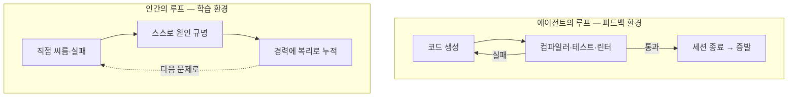

# 1장. 두 개의 피드백 루프 — 우리는 왜 한쪽만 설계했나

Hacker News에 이런 제목의 글이 올라온 적이 있다. "AI is making me dumb" — AI가 나를 바보로 만들고 있다. 556개의 추천이 붙었다. 그 아래, `Quarrelsome`이라는 아이디를 쓰는 개발자가 짧은 고백을 남긴다.

> "요즘 나는 코드를 덜 쓰는데 돈은 더 받는다. (…) 내가 직접 코드를 치는 건 아니다. 하지만 여전히 내가 생각하고 있다. 그게 중요한 거 아닌가? 그런데 말이지 — 이게 바보짓인가, 아니면 영리한 위임인가(Is it dumb or just clever delegation)?"

이 몇 줄 안에, 지금 수많은 개발자가 품고 있는 찜찜함이 통째로 담겨 있다. 손은 편해졌다. 어제까지 반나절을 붙잡고 있었을 문제가 오늘은 몇 분 만에 풀린다. 티켓은 빠르게 닫히고, 주간 회고에 올릴 성과도 늘었다. 그런데 그 편안함의 한구석이 계속 마음에 걸린다. 나는 지금 더 똑똑하게 일하는 중인가, 아니면 조금씩 무뎌지는 중인가.

한번 스스로에게 물어보자. 어제 배포한 그 diff, 정말 한 줄 한 줄 다 이해하고 넣었는가? AI가 건네준 코드를 읽으면서 "아, 그렇지" 하고 고개를 끄덕였는데, 막상 그걸 백지에서 다시 쓰라고 하면 쓸 수 있는가? 읽어서 납득되는 것과 스스로 만들어낼 수 있는 것 사이에는 생각보다 넓은 강이 흐른다. 코드를 눈으로 좇으며 이해했다고 느끼는 순간의 매끄러움은, 안타깝게도 학습의 신호가 아닐 때가 많다. 그저 잘 정리된 남의 생각을 편하게 따라 읽은 것일 뿐인데, 우리는 그걸 종종 '내가 아는 것'으로 착각한다. 그리고 요즘 우리 대부분은, 그 강을 한 번도 건너지 않고도 하루를 마감한다.

`Quarrelsome`의 질문을 나는 이 책 전체의 질문으로 삼으려 한다. 바보짓인가, 영리한 위임인가. 다만 이 질문에 "예/아니오"로 답하는 대신, 질문을 조금 바꿔보고 싶다. **무엇이** 그 둘을 가르는가? 같은 도구를 쥔 두 사람이 있는데 한 사람은 실력이 자라고 한 사람은 마모된다면, 둘 사이에 놓인 건 재능일까, 의지일까, 아니면 전혀 다른 무엇일까?

이 장에서 나는 그 "다른 무엇"의 정체를 하나 꺼내려 한다. 그것은 놀랍도록 평범한 것 — **환경**이다. 정확히는, 우리가 설계했어야 하는데 아무도 설계하지 않은 채 방치해 둔 어떤 환경이다.

## 하네스라는 말 — 이미 현장이 쓰고 있는 용어

먼저 낯설 수 있는 단어 하나를 정리하고 가자. **하네스(harness)**, 그리고 **하네스 엔지니어링**이다.

'하네스'는 원래 말에 채우는 마구(馬具)나 낙하산·안전벨트의 멜빵을 가리키는 말이다. 대상이 제멋대로 날뛰거나 떨어지지 않도록 붙들어 주는 장치. 소프트웨어에서 이 말이 AI 시대에 와서 새 뜻을 얻었다. 배달의민족(우아한형제들)의 이재홍은 2026년 4월에 쓴 글에서 하네스 엔지니어링을 이렇게 정의한다. "AI가 길을 잃지 않고 안정적으로 일할 수 있도록 외부 통제 환경을 구축하는 것."

이 정의를 잠시 곱씹어보자. 핵심은, AI에게 좋은 프롬프트를 던지는 기술이 아니라는 데 있다. AI가 **일할 환경 자체**를 설계하는 일이다. 조금 더 구체적으로 그려보면 이렇다. 프로젝트 규칙을 담은 파일(CLAUDE.md 같은)로 "우리 팀은 이런 규약을 지킨다"는 지침을 미리 심어 둔다. 특정 조건에서 자동으로 발동하는 훅으로 위험한 동작을 막거나 검사를 강제한다. 역할이 다른 서브에이전트로 일을 나눠, 만드는 쪽과 검증하는 쪽을 분리한다. 그리고 테스트·린터·타입 검사기 같은 자동 검증 루프로 결과물이 기준을 넘는지 계속 확인한다. 이 모든 장치가 모여, AI가 헤매지 않고 굴러갈 판을 깐다.

배민의 글이 짚는 흐름도 바로 이것이다. 생산성의 무게중심이 "프롬프트를 얼마나 잘 쓰는가"에서 "AI가 일할 환경과 맥락을 얼마나 잘 설계하는가"로 옮겨갔다는 것. 프롬프트 한 줄을 다듬는 기술은 이제 시작점일 뿐이고, 진짜 승부는 AI가 반복해서 안정적으로 일할 무대를 까는 데서 난다.

여기서 짚고 넘어갈 것이 하나 있다. '하네스'는 저 멀리 실리콘밸리에서 건너온 유행어가 아니라 **한국의 현업이 이미 자기 실무를 설명하려고 꺼내 쓴 말**이라는 점이다. 이 책이 낯선 외국 개념을 수입해 온 게 아니다. 국내 개발 조직이 매일의 문제를 풀다가 자연스럽게 도달한 프레임을 빌려 온 것이다. 그러니 하네스라는 단어 앞에서 주눅 들 필요가 없다. 당신이 이미 어렴풋이 하고 있던 일에 이름을 붙인 것뿐이다.

그런데 — 바로 이 지점에서 이 책이 시작된다. 배민의 그 글을, 그리고 지금 업계에 쏟아지는 대부분의 하네스 논의를 가만히 들여다보면 한 가지 공통점이 보인다. 거기서 설계의 대상이 되는 건 **오직 AI가 일하는 환경**이라는 것이다. AI가 어떻게 하면 토큰을 덜 쓰고, 더 정확하게, 덜 헤매며 일할지. 온통 그 이야기다. 틀린 이야기가 아니다. 오히려 지금 당장 돈이 되는, 매우 실용적인 이야기다.

그럼에도 이렇게 물어야 하지 않을까. 그 AI가 뱉어낸 결과물을 최종적으로 승인하는 사람 — 바로 당신 — 이 일하며 배우는 환경은, 대체 누가 설계하고 있는가? 아무도 그 환경을 설계하지 않는다면, 그것은 정말로 저절로 잘 굴러가고 있는 걸까?

## 두 개의 피드백 루프

이 질문에 답하려면, 잠깐 AI 에이전트가 일하는 방식을 조금 자세히 들여다볼 필요가 있다.

요즘 코딩 에이전트에게 어떤 기능을 맡기면 대체로 이런 순환이 돈다. 에이전트가 코드를 쓴다. 그 코드를 컴파일러가 검사하고, 테스트가 돌고, 린터가 스타일을 지적한다. 어딘가 빨간불이 켜지면 에이전트는 그 신호를 받아 코드를 고친다. 다시 검사하고, 다시 고치고, 초록불이 다 켜질 때까지 이 과정을 반복한다. 사람이 일일이 지켜보지 않아도 이 순환은 알아서 돈다. Anthropic의 공식 가이드는 이 구조를 한 문장으로 요약한다. "통과(pass)냐 실패(fail)냐를 내놓는 무언가를 쥐여주면, 루프는 알아서 닫힌다."

이것이 바로 하네스가 정교하게 설계하는 그 **피드백 루프**다. 만드는 쪽(maker)과 검증하는 쪽(checker)을 분리하고, 통과/실패라는 명확한 신호로 순환을 굴린다. 잘 만든 하네스일수록 이 루프가 촘촘하고 빠르다. 검사 신호가 정확할수록, 그리고 되먹임이 빠를수록, 에이전트는 더 좋은 결과에 더 빨리 도달한다.

자, 그런데 여기서 한 가지 의문이 생긴다. 이 루프를 수백 번 돌고 난 에이전트는 그래서 **뭔가를 배웠을까?**

아니다. 세션이 끝나면 그 에이전트는 방금 겪은 시행착오를 대부분 잊는다. 오늘 오전에 똑같은 종류의 버그로 열 번을 헤맸어도, 오후의 새 세션에서 같은 버그를 만나면 처음 보는 것처럼 다시 헤맨다. 에이전트가 그 루프에서 얻은 것은 '학습'이 아니라 **'반복 루프 안에서의 오류 교정'**이다. 그 순간의 문제를 닫는 데는 더없이 쓸모가 있지만, 세션이 끝나는 순간 증발한다. 그래서 이 환경의 정확한 이름은 학습 환경이 아니라 **'피드백 환경'**이다. 이 구분이 이 책의 첫 번째 열쇠다. 잊지 말고 챙겨 두자.

이제 반대편을 보자. 사람이 코드를 쓰고, 실패하고, 새벽까지 디버깅하다가 마침내 원인을 붙잡았을 때 — 그때 사람에게 일어나는 일은 에이전트에게 일어나는 일과 근본이 다르다. 그 경험은 세션이 끝나도 사라지지 않는다. 다음 프로젝트로, 다음 회사로, 심지어 다음 언어로까지 건너간다. 한 번 뼈저리게 겪은 교착 상태(deadlock)의 감각, 한밤중에 겨우 붙잡은 경합 조건(race condition)의 냄새는 5년 뒤 전혀 다른 스택에서도 되살아나 "어, 이거 그때 그거잖아" 하는 직감으로 돌아온다. 인간의 피드백 루프는 증발하지 않는다. 경력에 **복리(複利)**로 쌓인다. 오늘의 한 번의 씨름이 내일의 씨름을 조금 더 쉽게 만들고, 그 작은 이자가 해를 거듭하며 불어난다.

이 복리가 어떻게 쌓이는지, 아마 당신도 자기만의 장면을 하나쯤 갖고 있을 것이다. 몇 년 전 어느 서비스가 이유 없이 간헐적으로 멈추던 밤을 떠올려 보자. 로그를 뒤지고, 가설을 세우고, 깨지고, 다시 세우기를 반복하다가 결국 커넥션 풀이 조용히 고갈되고 있었다는 걸 발견한다. 그날의 몇 시간은 분명 비효율의 극치였다. 하지만 그 몇 시간이 남긴 것은 버그 하나의 수정이 아니었다. 그 뒤로 당신은 어떤 시스템을 보든 "여기 자원이 반납되지 않고 새는 지점은 없나"를 먼저 의심하는 눈을 갖게 됐다. 그 눈은 다음 회사에서, 처음 보는 프레임워크에서도 작동한다. 만약 그날 밤 누군가가 "커넥션 풀 고갈이네요, 이렇게 고치세요"라고 정답만 건네줬다면, 버그는 더 빨리 닫혔겠지만 그 눈은 끝내 자라지 않았을 것이다. 바로 이 차이가 복리의 정체다.

여기에 이 책이 정면으로 겨누는 비대칭이 있다.

그림 1. 증발하는 루프와 누적되는 루프

우리는 증발하는 쪽 — 에이전트의 루프 — 은 집요하게, 돈과 시간을 쏟아부어 가며 설계한다. 반면 누적되는 쪽 — 인간의 루프 — 은 사실상 방치한다. 그냥 알아서 굴러가겠거니 한다. 그런데 여기서 한 번 멈춰 서야 한다. 매일의 기본 작업 방식이 "AI에게 통째로 맡기고 결과만 확인하기"로 굳어진 사람의 학습 루프는, 저절로 잘 돌아가고 있을까, 아니면 아무도 돌보지 않는 사이에 서서히 녹슬고 있을까?

`Quarrelsome`이 느낀 그 막연한 불안의 정체가 슬슬 보이기 시작한다. 그의 문제는 게으름도, 재능 부족도 아니었다. 그가 매일 서 있는 환경 중 한쪽 — 자기 자신이 배우는 쪽의 루프 — 이 아무에게도 설계되지 않은 채 방치돼 있었을 뿐이다.

## 왜 우리는 한쪽만 그렇게 열심히 설계했나

한쪽 루프에 이렇게까지 공을 들인다는 걸 실감하려면, 지금 업계가 언어와 도구를 고르는 방식을 보면 된다. 재미있게도, 그 선택들이 하나의 방향을 조용히 가리키고 있다.

GitHub이 매년 내는 Octoverse 리포트의 2025년판(2025년 10월 발표, 데이터는 2025년 8월 스냅샷 기준)을 보자. 이 해에 처음으로 **TypeScript가 GitHub에서 가장 많이 쓰인 언어**가 됐다. 오랫동안 그 자리를 지키던 JavaScript와 Python을 제친 것이다. 왜 하필 지금, 하필 TypeScript일까?

우연이 아니다. TypeScript는 JavaScript에 타입 시스템을 얹은 언어다. 타입이 있으면 무슨 일이 벌어질까? 코드를 실행해보기도 전에, 컴파일 단계에서 "이건 문자열인데 숫자처럼 쓰려 한다" 같은 실수가 걸러진다. 다시 말해, **타입 검사기는 공짜로 딸려 오는 checker**다. AI 에이전트가 코드를 뱉으면 그 즉시 타입 검사기가 통과/실패 신호를 되돌려준다. 앞서 본 그 피드백 루프가 언어 차원에서 자동으로 굴러가는 것이다. 실제로 LLM이 만든 코드에서 발생하는 컴파일 에러의 94%가 타입 검사에서 걸린다는 연구 결과도 있다(GitHub Octoverse 2025 리포트가 인용한 2025년 연구 기준). 뒤집어 말하면, 타입 검사기 하나가 AI 코드의 흔한 실수 대부분을 알아서 잡아준다는 뜻이다. 사람이 일일이 확인할 필요 없이 말이다.

같은 흐름은 인프라 쪽에서도 보인다. OpenAI는 자사의 코딩 도구인 Codex CLI를 Rust로 다시 쓰기로 하고 네이티브 재작성에 들어갔다(InfoQ 2025년 6월 보도 기준, 그 이전 버전은 TypeScript로 만들어졌다). Rust를 고른 이유의 핵심에도 checker가 있다. Rust의 borrow checker는 메모리 안전성을 컴파일 시점에 강제한다. 역시, 루프에 끼워 넣을 수 있는 공짜 검증 장치다. 실행해서 터져 봐야 아는 문제를, 실행 이전에 컴파일러가 막아 준다.

무슨 말을 하려는지 보이는가? 업계가 언어와 도구를 고르는 기준이 어느새 **"AI 에이전트의 피드백 루프에 얼마나 촘촘한 checker를 끼워 넣을 수 있는가"**로 수렴하고 있다. 언어 선택이 취향의 문제에서 설계의 문제로 옮겨간 것이다. 그만큼 우리는 증발하는 쪽 루프의 품질에 진심이다. 이건 결코 사소한 노력이 아니다. 한 언어의 생태계 전체가 이동할 만큼 큰 베팅이다.

여기서 오해는 없길 바란다. 이건 잘못된 방향이 아니다. 오히려 훌륭한 엔지니어링이다. 피드백 루프의 품질이 산출물의 품질을 좌우한다는 건 소프트웨어의 오래된 진리이고, 업계는 그 진리를 AI 에이전트에게 성실하게, 대규모로 적용하고 있다. 문제는 방향이 아니라 **범위**다. 우리는 "피드백 루프의 품질이 산출물의 품질을 결정한다"는 바로 그 원리를, 정작 최종 산출물의 품질을 책임지는 사람 — 인간 개발자 — 의 학습 루프에는 적용하지 않고 있다. 한쪽에는 언어 생태계를 통째로 옮길 만큼 공을 들이면서, 다른 한쪽은 텅 비워 뒀다.

## 그런데 왜, 인간의 루프만 이렇게 방치됐을까

여기서 자연스러운 물음이 하나 더 생긴다. 사람들이 무심하거나 게을러서 인간의 학습 루프를 내버려 둔 걸까? 그렇게 보긴 어렵다. 오히려 이유는 구조적이다. 그리고 그 구조를 이해하는 것이 이 책의 나머지를 여는 열쇠다.

에이전트의 피드백 루프에는 자동 checker가 있었다. 컴파일러가, 테스트가, 타입 검사기가 매 순간 통과/실패를 외쳐 준다. 그런데 **인간의 학습 루프에는 그런 checker가 없다.** 오늘 당신이 diff를 이해하지 않고 넘겼다고 해서, 화면 어딘가에 빨간불이 켜지지 않는다. 이번 주에 스스로 생각하는 근육을 한 번도 쓰지 않았다고 해서, CI 파이프라인이 실패로 막아 서지 않는다. 실력이 멈췄다는 신호는 컴파일 에러처럼 즉시, 명확하게 오지 않는다. 그것은 조용하고, 느리고, 무엇보다 한참 뒤로 미뤄져서 온다.

바로 여기에 함정이 있다. 비용이 즉시 청구되지 않으니, 우리는 비용이 없다고 착각한다. AI에 통째로 맡긴 오늘의 diff는 초록불을 받고 무사히 배포된다. 지표는 좋다. 티켓은 닫혔고, 코드는 돌아간다. 어디에도 문제가 없어 보인다. 그 사이에 마모되고 있는 건 코드가 아니라 당신의 판단력인데, 판단력에는 컴파일러가 붙어 있지 않다. 청구서는 몇 달 뒤, 아무도 대신 풀어줄 수 없는 문제 앞에 혼자 앉았을 때 — 혹은 새벽 2시 스택 트레이스 앞에서 — 조용히 도착한다.

조금 전 우리는 인간의 학습 루프가 복리로 쌓인다고 했다. 그런데 복리에는 무서운 성질이 하나 있다. 방향을 뒤집으면 그대로 작동한다는 것이다. 매일 조금씩 스스로 생각하기를 건너뛰면, 그 작은 결손도 이자가 붙어 불어난다. 다만 이 마이너스 복리는 플러스 복리와 달리 통장 잔고처럼 눈에 보이지 않는다. 오늘 하루 diff를 이해 없이 넘긴 대가는 오늘 청구되지 않고, 계좌 어딘가에 조용히 적립됐다가 한참 뒤 한꺼번에 빠져나간다. 그래서 우리는 잔고가 줄고 있다는 사실조차 모른 채 지낸다.

정리하면 이렇다. 인간의 학습 루프가 방치된 건 그것이 덜 중요해서가 아니라, **그것의 마모가 눈에 보이지 않기 때문**이다. 자동으로 켜지는 빨간불이 없는 루프는, 누군가가 의식적으로 설계하지 않으면 그냥 방치된다. 되먹임이 자동으로 오는 시스템은 알아서 개선되지만, 되먹임이 느리고 미뤄지는 시스템은 방향을 잃는다. 이건 의지의 문제가 아니라 신호의 문제다. 그리고 신호가 없는 곳에는, 설계가 필요하다.

## 그래서, 바보인가 영리한 위임인가

이제 `Quarrelsome`의 질문으로 돌아오자. 바보짓인가, 영리한 위임인가.

내가 이 장에서 내놓고 싶은 답은 이렇다. **그건 당신이 어느 쪽 루프 위에 서 있느냐에 달렸다.** 위임 자체가 바보짓인 건 아니다. 좋은 엔지니어는 늘 무언가를 위임해 왔다 — 라이브러리에게, 프레임워크에게, 컴파일러에게. 우리는 어셈블리를 손으로 짜지 않는다고 해서 스스로를 바보라 여기지 않는다. 위임이 문제가 되는 건, 위임하는 사이에 당신 자신의 학습 루프가 소리 없이 마모되고 있는데도 아무도, 심지어 당신 자신조차 그걸 설계 대상으로 보지 않을 때다.

그리고 바로 여기서 이 책 전체를 관통하는 질문이 걸린다. **생산성과 성장은 양립할 수 있는가?**

흔히 이 둘은 맞바꾸는 관계처럼 여겨진다. 빨리 가려면 배움을 포기해야 하고, 제대로 배우려면 느려질 각오를 해야 한다는 것. AI에 통째로 맡기면 오늘 빠르지만 내일의 실력을 저당 잡히고, 하나하나 직접 하면 실력은 붙지만 마감을 못 지킨다는 것. 정말 그럴까? 정말 둘 중 하나를 골라야만 할까?

나는 이 책에서 정반대를 주장하려 한다. 생산성과 성장의 양립은 **의지의 문제가 아니라 설계의 문제**다. "더 독하게 마음먹으면 둘 다 잡을 수 있다"는 이야기가 아니다. 오히려 그 반대다. 순전히 의지에만 기대면 대체로 진다 — 마감 압박은 언제나 가장 빠른 길, 즉 완전 위임 쪽으로 사람을 밀기 때문이다. 앞 절에서 봤듯이, 그 길을 택해도 당장 빨간불이 켜지지 않으니 저항할 이유조차 잘 느껴지지 않는다.

금요일 저녁, 배포는 코앞이고 티켓은 아직 세 개가 열려 있다. 머릿속 한편에서는 "이건 내가 직접 짜면서 이해하고 넘어가야 하는데" 하는 목소리가 들린다. 하지만 다른 한편에서는 마감이 재촉한다. 그리고 AI에게 통째로 맡기면 5분이면 끝난다. 이 순간, 순수한 의지만으로 어려운 길을 택하기란 거의 불가능하다. 어려운 길에는 아무런 보상도, 어긴다고 켜지는 경고등도 없기 때문이다. 매주 금요일마다 이 싸움을 의지로만 이기려는 건 애초에 지는 게임이다. 그러니 의지로 버틸 게 아니라, 애초에 매일의 상호작용이 배움을 밀어내지 않도록 **환경을 설계**해야 한다. 방치돼 있던 그 두 번째 루프를, 이제 당신이 직접 설계 대상으로 끌어올려야 한다. 인간의 학습 루프에는 컴파일러가 없으니, 그 자리에 당신이 checker를 놓아야 한다.

그 설계가 바로 이 책이 '학습 환경으로서의 하네스'라고 부르는 것이다. AI가 일하는 환경만이 아니라, 그 옆에서 당신이 배우는 환경까지 설계 대상에 넣는 것. 좋은 하네스라면 좋은 코드를 뽑아내는 동시에, 그 코드를 다루는 당신을 더 나은 엔지니어로 길러내야 한다. 이 둘은 원래 한 몸이어야 했다. 우리가 그동안 반쪽만 만들고 있었을 뿐이다.

물론 여기서 당연히 나올 반문이 있다. "모델이 계속 좋아지면, 어차피 인간이 검증할 일도 없어지지 않나? 그럼 학습이니 뭐니가 다 무슨 소용인가?" 좋은 질문이고, 이 책은 그 반문을 피하지 않는다. 오히려 4장 한 절을 통째로 그 정면 대결에 쓸 참이다. 지금은 씨앗만 두 알 심어두자. 하나, 그 시점이 언제 올지는 아무도 모른다는 것. 둘, 그 반문이 맞을수록 손해 보는 건 다름 아닌 역량을 기르지 않은 개인이라는 것. 이 두 알은 뒤에서 다시 싹을 틔운다.

## 당신의 읽기 경로

이 책은 두 종류의 독자를 함께 염두에 두고 썼다. 한 사람은 이미 몇 년의 경력이 있는 현업 개발자다. 손은 빨라졌는데 실력이 늘고 있는지 확신이 안 서는, 방금까지의 `Quarrelsome` 같은 사람이다. 또 한 사람은 이제 막 커리어를 시작했거나 시작하려는 주니어다. 사다리의 아래 칸이 흔들리는 시대에, 무엇을 붙잡고 올라가야 할지 막막한 사람이다.

두 사람의 여정은 겹치는 부분이 많지만, 갈라지는 지점도 있다. 그래서 미리 지도를 건네고 싶다.

현업 개발자라면, 2장부터 4장까지의 이론이 당신의 그 찜찜함에 이름과 근거를 붙여줄 것이다. 그리고 5장과 6장이 이 책의 실천적 심장이다 — 매일의 상호작용을 어떻게 학습 장치로 바꾸고, 그걸 어떻게 당신의 하네스에 규칙과 훅으로 새겨 넣는지. 익숙한 스택을 떠나 새 언어·프레임워크를 맡게 됐다면 7장이 당신의 사례다.

주니어라면, 8장이 당신을 위한 지도다. 2장부터 4장까지의 이론이 다소 무겁게 느껴진다면 가볍게 통과해도 좋다 — 그 내용은 8장에서 당신의 상황에 맞게 다시 만난다. 다만 한 가지만 미리 당부하자면, 주니어에게는 "무조건 AI를 끄고 직접 하라"가 오히려 독이 될 수 있다. 왜 그런지는 8장에서 조심스럽게 풀어놓겠다.

`Quarrelsome`의 질문 — 바보인가, 영리한 위임인가 — 을 손에 쥔 채로 다음 장으로 넘어가자. 이제 우리가 마주할 것은 조금 불편한 자리다. 위임이 정확히 무엇을 대가로 가져가는지, 그 청구서를 이번엔 데이터로 확인할 차례다. 앞서 미뤄 뒀던 그 청구서 말이다. 새벽 2시, 스택 트레이스 앞에서.
