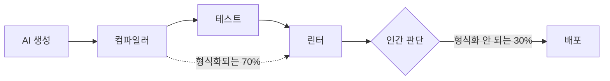

# 4장. 하네스의 마지막 게이트는 사람이다

AI는 당신 일의 70%를 해낸다. 보일러플레이트를 붓고, CRUD 엔드포인트를 찍어내고, 테스트 골격을 세우고, 익숙한 패턴을 순식간에 재현한다. 어제 걸리던 반나절짜리 작업이 오전 한나절이면 끝난다. 놀라운 일이다.

진짜 문제는 나머지 30%에 있다.

이 숫자는 애디 오스마니(Addy Osmani)가 2025년 3월에 쓴 글 「Beyond the 70%」에서 온 것이다. 그의 관찰은 이렇다. AI는 우발적 복잡성(accidental complexity), 즉 본질과 무관하게 그냥 손이 많이 가는 부분 — 보일러플레이트, 반복되는 구조 — 을 아주 잘 채운다. 대략 70%다. 그런데 남는 30%가 하필 가장 어려운 것들이다. 엣지 케이스를 어디까지 막을 것인가, 이 구조가 6개월 뒤 요구가 바뀌었을 때 감당이 되는가, 팀의 다른 사람이 이걸 유지보수할 수 있는가, 그리고 애초에 무엇을 왜 만들어야 하는가. 오스마니는 이 30%를 "인간의 전문성이 들어가는 자리"라고 불렀다.

그러니 잠시 멈추고 생각해보자. 그 30%는 정확히 무엇이고, 왜 기계가 대신할 수 없는가? 그리고 — 이게 이 장에서 가장 정직하게 마주해야 할 질문인데 — 모델이 지금보다 훨씬 더 좋아지면, 그 30%마저 사라지지 않을까?

## 형식화되는 것과 형식화되지 않는 것

먼저 AI가 잘 해내는 70%가 왜 잘 되는지부터 짚어보자. 그래야 안 되는 30%의 정체가 또렷해진다.

앞 장들에서 우리는 하네스의 심장이 maker/checker 구조라는 걸 봤다. 생성하는 쪽(maker)과 검증하는 쪽(checker)을 분리하고, 검증 가능한 신호로 루프를 닫는 구조다. 앤트로픽의 공식 문서는 이 원리를 한 문장으로 요약한다. "AI에게 통과/실패를 내놓는 무언가를 쥐여주면, 루프는 스스로 닫힌다(Give Claude something that produces a pass or fail, and the loop closes on its own)."

여기서 핵심 단어는 **통과/실패**다. 컴파일러는 타입이 맞는지 틀리는지 딱 잘라 말해준다. 테스트는 초록불 아니면 빨간불이다. 린터는 규칙을 어겼는지 아닌지 판정한다. 이것들은 전부 **형식화된 속성**이다. 옳고 그름을 기계가 읽을 수 있는 신호로 환원할 수 있다는 뜻이다. 그리고 신호로 환원되는 순간, 기계 checker가 그 자리를 닫는다. AI가 코드를 뱉고, 컴파일 에러가 나면, 그 에러를 읽고 스스로 고친다. 몇 바퀴 돌면 초록불이 켜진다. 이게 70%가 잘 되는 이유다. 이 영역엔 이미 촘촘한 checker가 깔려 있다.

여기서 한 가지 눈여겨볼 게 있다. 잘 만든 하네스는 checker를 한 겹이 아니라 여러 겹으로 쌓는다. 앤트로픽이 정리한 검증 게이트는 대략 네 단계다. 프롬프트 안에서의 자체 점검, 목표 조건이 충족됐는지 확인, 정해진 횟수만큼 연속으로 막히면 작업을 강제로 멈추는 훅(Stop hook), 그리고 마지막으로 **작업을 수행한 에이전트가 아니라 새로운 컨텍스트의 검증 에이전트**가 그 결과를 반증하려 든다. 왜 굳이 검증을 다른 에이전트에게 맡길까? 이유가 아주 명료하다. 앤트로픽의 표현을 그대로 옮기면, "일을 한 에이전트가 자기 일을 채점하지 않는다(the agent doing the work isn't the one grading it)."

이 원칙을 붙잡아두자. maker는 자기 자신을 온전히 검증할 수 없다. 만든 사람은 자기가 놓친 것을 놓친 줄 모르기 때문이다. 그래서 checker는 maker와 분리돼야 한다. 놀랍게도 이 원칙은 기계들의 세계에서도 이토록 철저히 지켜진다. 그렇다면 질문을 한 걸음 더 밀어보자. 형식화조차 되지 않아 어떤 자동 checker도 판정하지 못하는 그 30%의 최종 checker는, 논리상 누구여야 하는가? maker가 아닌 누군가여야 하고, 형식화된 신호로 환원되지 않는 판단을 내릴 수 있어야 한다. 그 두 조건을 동시에 만족하는 존재는 하나뿐이다.

그런데 나머지 30%를 다시 보자. 도메인 적합성. 6개월 뒤의 변경 감당. 팀 유지보수성. "무엇을 왜 만드는가."

이것들엔 컴파일러가 없다. 테스트가 초록불이어도 도메인에 안 맞는 코드일 수 있다. 린터를 다 통과해도 여섯 달 뒤에 손대기 무서운 구조일 수 있다. 왜냐하면 이 속성들은 **형식화되지 않기 때문**이다. "이 설계가 앞으로의 요구 변화를 잘 흡수할까?"라는 질문을 통과/실패로 환원할 방법이 없다. pass/fail 신호가 없으니 루프가 스스로 닫히지 않는다. 그럼 누가 닫는가?

사람이다. 정확히 여기가 인간의 판단이 들어가는 자리다.

그리고 이 판단은 공짜로 생기지 않는다. "이 구조는 6개월 뒤에 무너진다"는 직감은 어디서 오는가? 비슷한 구조를 직접 만들어 보고, 여섯 달 뒤에 그게 무너지는 걸 겪어 본 경험에서 온다. "이 추상화는 과하다"는 판단은? 과한 추상화를 세웠다가 오히려 발목을 잡혀 본 사람만이 안다. 시드 아티클의 표현을 빌리면, 형식화되지 않는 속성에 대한 판단은 **"유사한 것을 만들어 보고 실패해 본 경험"**을 요구한다. 읽어서 아는 게 아니라, 만들어서 실패해 봐야 아는 것이다.

너무 추상적으로 들린다면 한 장면을 그려보자. AI에게 "주문 취소 기능을 만들어줘"라고 시켰다고 하자. 5초 만에 코드가 나온다. 주문의 상태를 `CANCELLED`로 바꾸고, 관련 테스트도 함께 짜 준다. 테스트는 전부 초록불이다. 컴파일도 깨끗하고, 린터도 조용하다. 형식화된 checker 전부가 통과라고 말한다. 그런데 이 도메인에서 '취소'가 정말 상태 플래그 하나를 바꾸는 일이었던가? 실제로는 결제 취소가 물려 있고, 재고가 복구되어야 하고, 적립 포인트가 환급되어야 하고, 이미 넘어간 정산 데이터가 되돌려져야 한다. AI는 이 도메인의 '취소'가 무엇인지 모르니 가장 단순한 해석을 골랐고, 테스트 역시 그 단순한 해석에 맞춰 짜였으니 당연히 초록불이다. 테스트가 요구를 검증한 게 아니라, **구현이 자기 자신을 검증한 것**이다. 이 결함을 잡아낼 수 있는 건 오직 하나다. 이 서비스에서 '취소'가 어떤 파장을 일으키는지 겪어 본 사람. 그 사람만이 초록불 앞에서 "잠깐, 정산은?"이라고 멈춰 설 수 있다. 컴파일러도 테스트도 그 질문을 던지지 못한다.

여기서 한 가지가 분명해진다. 우리가 '시니어'라고 부르는 사람의 값어치가 정확히 이 30%에 있다는 것이다. 시니어를 시니어로 만드는 건 타이핑 속도가 아니다. 남들이 다 초록불이라고 넘어가는 코드 앞에서 "잠깐, 정산은?"이라고 멈춰 서는 판단, "이 구조는 다음 분기 요구를 못 버틴다"고 미리 보는 눈이다. AI가 70%를 순식간에 채우는 2026년의 국면에서, 사람의 시장 가치는 흩어지는 게 아니라 오히려 이 30%로 더 응축된다. 그런데 — 바로 여기서 이 장의 불편한 진실이 시작된다 — 그 30%를 길러 내는 유일한 통로를, 우리는 매일 스스로 막고 있는지도 모른다.

정리하면 이렇다. 하네스는 여러 겹의 checker로 되어 있는데, 형식화되는 속성은 기계 checker가 닫고, 형식화되지 않는 속성은 **인간이라는 최종 checker**가 닫는다. 컴파일러도 테스트도 린터도 잡지 못하고 마지막까지 남는 그 판단, 그것이 하네스의 마지막 게이트다. 그리고 그 게이트에 서 있는 건 당신이다.

그림 1. 형식화되는 속성은 기계 checker가, 형식화되지 않는 30%는 인간이 닫는다

## 게이트가 스스로를 마모시킨다

여기까지는 좋은 소식처럼 들린다. 기계가 70%를 해주고, 나는 가장 중요한 30%, 즉 판단에 집중하면 된다. 역할 분담이 아름답게 맞아떨어진다.

그런데 한 가지 의문이 생긴다. 그 판단력은 어디서 오는가?

방금 우리는 답을 봤다. "유사한 것을 만들어 보고 실패해 본 경험"에서 온다. 판단의 원료는 **생성 경험**이다. 직접 짜 보고, 틀려 보고, 고쳐 본 시간이 쌓여야 "이건 6개월 뒤에 무너진다"는 감각이 자란다.

이제 두 문장을 나란히 놓아보자.

하나 — 하네스의 최종 품질 게이트는 인간의 판단력이다.
둘 — 그 판단력의 원료는 직접 만들어 본 경험이다.

그리고 하네스의 기본 작업 방식은 무엇인가? **완전 위임**이다. 가장 빠르니까. 마감이 코앞이면 사람은 가장 빠른 길을 택한다. AI에게 통째로 맡기고, 초록불이 켜지면 배포한다. 직접 만들어 보는 그 과정 — 판단력의 원료가 만들어지는 바로 그 과정 — 을 건너뛴다.

솔직해지자. 오늘 밤 릴리스 브랜치를 따기로 했는데, 아직 들어가야 할 기능이 셋 남았고 손에 쥔 시간은 두어 시간뿐이다. 이런 순간에 "AI에게 시키기 전에 내 접근을 먼저 한 문단으로 써 보고 나중에 비교한다" 같은 건 한가한 소리처럼 느껴진다. 그냥 시키면 3분이면 나오는데, 굳이 먼저 끙끙댈 이유가 있나? 그렇게 하루가 가고, 한 주가 가고, 한 분기가 간다. 매일의 작은 선택은 하나하나 지극히 합리적이다. 문제는 그 합리적인 선택이 매번 같은 방향, 즉 위임 쪽을 가리킨다는 데 있다. 그리고 판단력의 원료는 조용히, 눈에 띄지 않게 말라간다. 근육이 하루아침에 사라지지 않듯, 실력도 어느 날 갑자기 없어지지 않는다. 다만 어느 순간 새벽 2시의 스택 트레이스 앞에서 — 2장에서 우리가 함께 서 봤던 그 자리에서 — 텅 빈 자신을 발견할 뿐이다. 생각만 해도 아찔한 일이다.

무슨 일이 벌어지는지 보이는가? **하네스의 최종 게이트(인간 판단)를 지탱하는 원료(생성 경험)를, 하네스의 기본값(완전 위임)이 갉아먹는다.** 게이트가 스스로를 마모시키는 구조다. 가만히 들여다보면 어딘가 찜찜하다. 우리는 품질을 지키려고 하네스를 세웠는데, 그 하네스의 기본값이 정작 품질의 최후 보루를 조금씩 허물고 있는 셈이니까.

이게 단순한 걱정이 아니라 실제로 관찰되는 패턴이라는 증거가 있다. 앞 장에서 잠깐 스친 콜리 콜링(Koli Calling) 2023 연구를 다시 떠올려보자. 학습자들에게 코딩 과제를 줬더니, 760개 과제 가운데 **92%에서 사람들이 직접 손대기 전에 곧바로 AI에게 위임**했다. 구조적으로 위임을 막지 않으면, 사람은 기본적으로 "먼저 위임한다." 의지가 약해서가 아니다. 그게 가장 빠른 경로라서다. 그리고 마감은 언제나 가장 빠른 경로 쪽으로 우리를 민다.

그래서 시드 아티클은 이 상황을 아주 날카롭게 재프레이밍한다.

> "시스템이 자신의 최종 품질 게이트를 마모시키는 기본값 위에 서 있다면, 그것은 개인 의지의 문제가 아니라 설계 결함이다."

이 문장을 천천히 다시 읽어보자. 여기엔 우리 대부분이 놓치고 있던 전환이 들어 있다.

"내 실력이 안 느는 건 내가 게을러서야, 자제력이 부족해서야"라고 자책하는 사람이 많다. AI를 너무 많이 쓴 자기 자신을 탓한다. 그런데 이 재프레이밍은 그 자책의 방향을 튼다. 문제는 당신의 의지가 아니다. 당신을 완전 위임 쪽으로 미는 **기본값의 구조**다. 아무리 의지가 강해도, 마감이라는 압력과 완전 위임이라는 가장 빠른 경로가 매일 당신을 같은 쪽으로 밀면, 개인의 의지력으로 그걸 이겨내는 건 지속 가능하지 않다. 의지력은 소모되지만 구조는 매일 작동하기 때문이다.

흥미로운 건, 이 진단이 시드 혼자만의 것이 아니라는 점이다. 2025년에 나온 학술 논의들이 독립적으로 비슷한 결론에 닿았다. 학술지 《AI & Society》의 한 논의는 AI 시대의 역량 저하(deskilling)를 개인의 습관 문제가 아니라 **"구조적 문제"**로 규정한다. 같은 해 《Nature Computational Science》의 논평은, AI에 과도하게 기대다가 생성 코드의 미탐지 오류를 그대로 받아들여 명령어 주입·미정의 변수 같은 버그가 3주 넘게 방치된 사례를 보고했다. 서로 다른 곳에서 출발한 사람들이, 시드가 도달한 지점 — "이건 개인이 아니라 기본값의 문제다" — 에 각자 도착한 셈이다.

물론 여기엔 정직한 유보가 필요하다. 이 논의들은 아주 최근 것이고, 재현 연구가 충분히 쌓이지 않았다. 관점과 논평의 성격이 강해서, 통제 실험만큼의 무게로 인용하기엔 이르다. 하지만 방향은 분명하다. 여러 관찰자가 같은 구조를 보고 있다.

그렇다면 여기서 얻을 결론은 무엇일까? 자책을 멈추자는 게 아니다. 진짜 결론은 훨씬 실천적이다. **설계 결함은 설계로 고친다.** 의지로 매일 싸우는 대신, 나를 학습 쪽으로 미는 기본값을 새로 설계하면 된다.

조금 더 깊이 들어가보자. 이 재프레이밍은 사실 이 책이 첫 장부터 걸어 둔 질문 — 생산성과 성장은 양립하는가 — 에 대한 답의 절반이기도 하다. 만약 이게 의지의 문제라면 답은 우울하다. 빨리 가려면 성장을 포기하고 성장하려면 속도를 포기하라는, 둘 중 하나만 고르라는 함정에 갇히기 때문이다. 그런데 설계의 문제라면 이야기가 완전히 달라진다. 잘 설계된 기본값 위에서는, 빠르게 일하는 그 행위 자체가 동시에 학습이 되게 만들 수 있다. 양립은 의지로 억지로 붙드는 게 아니라 설계로 자연스럽게 흐르게 하는 것이다. 그러니 '설계 결함'이라는 진단은 절망이 아니라 오히려 희망의 다른 이름이다.

이 결론이 이 책의 후반부 전체 — 흐름 안의 상호작용 기본값, 흐름 밖의 표적 연습, 위임 다이얼 — 를 여는 열쇠다. 하지만 그 처방으로 넘어가기 전에, 먼저 흔한 오해 하나를 걷어내야 한다.

## "그럼 AI로 코드를 짜지 말라는 건가?"

지금까지의 이야기를 이렇게 받아들인 사람이 있을지 모른다. "결국 AI에 위임하는 게 나쁘다는 거네. 손해 보기 싫으면 직접 다 짜라는 거지." 그런데 그건 아니다. 오히려 정반대에 가깝다. 이 오해를 풀지 않으면 뒤의 처방이 전부 "AI를 쓰지 마라"는 금욕주의로 잘못 읽힌다.

여기서 사이먼 윌리슨(Simon Willison)의 구분이 결정적이다. 그는 '바이브 코딩(vibe coding)'과 'AI를 활용한 엔지니어링(AI-assisted engineering)'을 이렇게 가른다. 코드의 모든 줄을 LLM이 썼다 해도, 당신이 그걸 **읽고, 테스트하고, 이해했다면** 그건 바이브 코딩이 아니다. 반대로, 코드를 거의 안 봤고 왜 그렇게 짜였는지도 모르는 채 초록불만 보고 넘겼다면 — 설령 당신이 한 줄 한 줄 타이핑을 지시했다 해도 — 그건 바이브 코딩이다.

무슨 뜻인지 붙잡아보자. 문제는 **위임의 양**이 아니다. AI가 코드의 100%를 썼는지 30%를 썼는지가 실력 손실을 가르는 게 아니다. 가르는 것은 **이해를 건너뛰었는가**다. 이해하고 위임하면 엔지니어링이고, 이해를 건너뛰고 수용하면 그냥 받아쓰기다.

두 개발자를 나란히 세워보자. 한 사람은 AI에게 전체 모듈을 통째로 맡겼다. 하지만 나온 코드를 한 줄씩 읽으며 "왜 여기서 이 자료구조를 골랐지?" 하고 되묻고, 미심쩍은 부분은 직접 돌려 보고, 이해가 안 되는 곳은 설명을 요구했다. 다른 사람은 AI와 함께 한 줄 한 줄 지시하며 짰다. 하지만 나오는 대로 받아 넣기 바빴고, 왜 그렇게 짜였는지는 끝내 묻지 않았다. 자, 코드의 겉모습만 보면 첫 번째 사람이 훨씬 더 많이 "위임"했다. 그런데 윌리슨의 기준으로 보면, 실력이 자라는 쪽은 첫 번째다. 두 번째는 손을 더 많이 움직였을 뿐, 인지 작업은 오히려 더 많이 건너뛰었다. 누가 타이핑을 했느냐가 아니라, **누가 생각을 소유했느냐**가 갈림길이다.

그러니 나쁜 것은 도구가 아니다. AI 자체가 사람을 바보로 만드는 게 아니다. 나쁜 것은 **'이해를 건너뛴 수용'이 기본값이 된 국면**이다. 오스마니가 시드와 독립적으로 던진 경고가 정확히 이 지점을 찌른다. "AI가 왜 이런 코드를 생성하는지 능동적으로 파고들지 않으면, 오히려 더 적게 배우게 될지 모른다(If you're not actively engaging with why the AI is generating certain code, you might actually learn less)."

핵심은 '왜'에 능동적으로 개입하느냐다. 개입하면 위임은 학습의 지렛대가 되고, 개입하지 않으면 위임은 실력의 누수가 된다. 같은 도구, 정반대 결과 — 3장에서 우리가 화해시킨 그 구조가 여기서도 반복된다.

이 점을 기억해두자. 앞으로 이 책이 권하는 것은 "AI를 덜 써라"가 아니다. "이해를 소유한 채로 위임하라"다. 둘은 완전히 다른 처방이다.

## 가장 강한 반론과 마주 앉기

이제 이 장에서 가장 정직해야 할 대목이다. 지금까지의 논증에는 아주 강력한 반론이 하나 있다. 이걸 피하고 넘어가면 이 책 전체가 얄팍해진다. 그러니 정면으로 마주 앉자.

반론은 이렇다.

> "당신 말이 다 맞다고 치자. 지금은 인간 검증이 필요하다. 그런데 모델이 계속 좋아지고 있잖은가. 몇 년 뒤면 AI가 그 30%, 즉 판단까지 해낼 텐데. 그럼 인간이 검증을 배우는 건 결국 사라질 기술에 시간을 쏟는 것 아닌가?"

이 반론을 희화화하고 싶지 않다. 실제로 진지한 실무자들이 이 입장을 갖고 있고, 그들의 논거는 허술하지 않다. 커뮤니티에서 오가는 목소리를 그대로 들어보자.

어떤 이는 **컴파일러 비유**를 든다(HN의 `largbae`). 고급 언어가 나오면서 자기 컴파일러 작성 실력은 녹슬었지만, 그 대신 훨씬 더 많은 일을 해냈다는 것이다 — AI 코딩도 그런 맞바꿈, 추상화 계층의 상승일 뿐이라는 얘기다. 어떤 이는 **계산기 비유**를 든다(`devolving-dev`). 계산기가 나온 뒤로 사람들의 암산 실력이 떨어진 건 사실이지만, 그게 재앙이었느냐는 것이다. 또 어떤 이는 아예, 코드를 직접 읽고 쓰는 능력이 언젠가 지금 우리가 어셈블리를 모르는 것처럼 필요 없어질 거라고 단언한다(`pton_xd`).

솔직히 말하면, 이 논거들엔 힘이 있다. 소프트웨어의 역사는 실제로 추상화 계층이 계속 올라온 역사였다. 그러니 이 반론에 "그럴 리 없다"고 코웃음 치는 건 정직하지 않다. 대신 세 가지로 진지하게 답해보자.

### 답 하나 — 시점을 아무도 모른다

첫 번째 답은 겸손에서 나온다. 그 반론이 언젠가 옳아질 수 있다. 문제는 **그 '언젠가'가 언제인지 아무도 모른다**는 것이다.

만약 그 시점이 3년 뒤라면, 지금 판단력을 기르는 건 낭비일지 모른다. 그런데 30년 뒤라면? 그 30년 동안 당신은 판단력 없이 일해야 한다. 그리고 정직하게 말해서, 우리 중 누구도 그게 3년인지 30년인지 모른다. 이런 불확실성 아래서 "곧 필요 없어질 테니 지금 안 길러도 된다"에 베팅하는 것은, **낙하산을 안 메고 뛰어내리면서 "떨어지기 전에 착지 기술이 필요 없어질 거야"라고 믿는 것**과 비슷하다. 맞을 수도 있다. 하지만 틀렸을 때 치르는 대가가 너무 크고, 되돌릴 수도 없다.

### 답 둘 — 내용은 바뀌어도 구조는 남는다

두 번째 답이 가장 중요하다. 여기서 아까의 컴파일러·계산기 비유에 정면으로 응수해보자.

반론자들의 비유는 사실 그들 생각보다 더 좋은 반례가 된다. 컴파일러가 나온 뒤에도 어셈블리를 아는 사람은 사라지지 않았다. 성능 병목을 잡아야 할 때, 컴파일러가 만들어낸 기계어가 이상하게 느릴 때, 결국 어셈블리를 읽을 줄 아는 사람이 불려 온다. 계산기가 나온 뒤에도 수(數) 감각이 없는 사람은 계산기가 뱉은 자리 수가 하나 틀린 답을 걸러내지 못한다. 추상화 계층이 올라가도, **그 위에서 판단하는 사람은 아래 계층을 겪어 본 사람**이다.

이것이 시드의 두 번째 답이다. 역량의 **내용**은 바뀐다. 앞으로 개발자의 판단은 한 줄 한 줄의 코드에서 설계와 스펙의 계층으로 올라갈 것이다. "이 함수를 어떻게 짜지"가 아니라 "이 시스템을 어떤 구조로 세우지", "이 요구를 어떤 스펙으로 못 박지"가 판단의 무대가 된다. 그런데 여기 함정이 있다. **상위 계층의 판단은 하위 계층의 경험 위에 선다.** 좋은 스펙을 쓰려면 그 스펙이 어떻게 구현으로 풀리는지, 어디서 어긋나는지를 몸으로 알아야 한다. 구현을 한 번도 안 해 본 사람이 쓴 스펙은 공중에 뜬다.

한 장면으로 그려보자. 어느 팀이 스펙만 잘 쓰면 AI가 시스템을 통째로 지어 준다는 미래에 도달했다고 하자. 그럼 이제 개발자는 스펙을 쓴다. "주문 취소 시 결제·재고·포인트·정산을 원자적으로 함께 되돌린다." 좋은 스펙이다. 그런데 이 한 줄을 쓸 줄 아는 사람은 누구인가? 예전에 취소 로직을 직접 짜다가 정산이 어긋나 밤을 새워 본 사람이다. 취소가 무엇을 건드리는지 몸으로 겪은 사람만이 그 한 줄을 쓸 수 있다. 구현을 한 번도 안 해 본 사람이 쓴 스펙은 "취소 기능을 만들어라" 수준에서 멈추고, 그 공허한 스펙을 받은 AI는 다시 상태 플래그 하나만 바꾼다. 계층은 올라갔는데, 함정은 그대로 따라 올라왔을 뿐이다.

그러니 "추상화가 올라가니 아래는 필요 없다"는 반은 맞고 반은 틀리다. 무대는 올라간다. 하지만 그 무대에 설 자격은 아래를 통과한 사람에게 있다. 검증이라는 **구조** 자체는 사라지지 않고, 다만 더 높은 계층으로 자리를 옮길 뿐이다. 그리고 그 높은 계층의 검증은 더더욱 형식화하기 어렵다 — 즉 더더욱 인간의 몫이다.

### 답 셋 — 손해는 누구에게 돌아가나

세 번째 답은 유인(incentive)의 문제다. 이건 좀 냉정한 계산이다.

반론이 맞다고 가정해보자. 정말로 몇 년 뒤 AI가 판단까지 다 해낸다고 하자. 그럼 그동안 판단력을 안 기른 사람은? 아무 손해가 없다. 어차피 필요 없어질 기술을 안 배웠으니 오히려 이득이다.

이번엔 반론이 틀렸다고 해보자. AI가 그 30%까지는 못 가고, 판단은 여전히 인간의 몫으로 남는다고 하자. 그럼 판단력을 기른 사람은 자기 자리를 지키고, 안 기른 사람은 — 마모된 게이트만 남은 사람은 — 대체된다.

두 시나리오를 나란히 놓고 보면 결론이 분명해진다. 반론이 맞을 때 판단력을 기른 사람의 손해는 **작고**(약간의 여분 노력), 반론이 틀릴 때 안 기른 사람의 손해는 **크다**(대체). 불확실성 아래서 어느 쪽에 베팅하는 게 합리적인가? 판단력을 기르는 쪽이다. 그리고 여기서 중요한 건, 그 손해든 이득이든 **결국 개인에게 돌아간다**는 점이다. 회사도 아니고 업계도 아니고, 역량을 안 기른 바로 그 개인에게. 반론이 맞을수록, 역설적으로 학습에 대한 개인의 유인은 더 커진다.

한 커뮤니티 참여자(`georgemcbay`)는 이 걱정을 개인을 넘어 사회 수준으로 확장한다. 정작 진짜 위협은 AI가 너무 똑똑해지는 게 아니라, "AI가 현재 수준에 머무는데 우리가 사고를 너무 많이 오프로딩해서, 혁신 자체가 정체되는 것"일지 모른다는 것이다. 판단하는 사람이 사라지면, 판단이 필요한 새로운 문제를 풀 사람도 사라진다.

세 답을 종합하면 이렇게 정리된다. 모델이 좋아진다는 사실은 학습을 그만둘 이유가 아니라, 무엇을 학습할지를 바꿀 이유다. 검증과 판단의 구조는 사라지지 않고 계층을 옮긴다. 그리고 그 이동한 자리에 설 사람은, 아래를 통과해 본 사람이다.

## 당신은 부품이 아니라 게이트다

이 장에서 붙잡고 갈 그림 하나를 남기자.

하네스를 처음 배우면, 자칫 자기 자신을 그 시스템의 한 부품처럼 여기기 쉽다. AI가 생성하고, 컴파일러가 걸러내고, 테스트가 검증하고, 나는 그 컨베이어 벨트 끝에서 초록불을 확인하고 승인 버튼을 누르는 사람. 마치 자동화 라인의 마지막 검수원처럼. 그런데 이 그림은 틀렸다. 그것도 아주 중요하게 틀렸다.

당신은 컨베이어 벨트의 한 공정이 아니다. 당신은 **그 어떤 기계 checker도 닫지 못하는 마지막 게이트**다. 형식화되는 70%는 기계가 닫지만, 형식화되지 않는 30% — 도메인 적합성, 6개월 뒤의 감당, 팀 유지보수성, 무엇을 왜 만드는가 — 는 오직 당신의 판단만이 닫는다. 이건 대단히 무거운 자리다. 그리고 이 자리의 무게를 아는 순간, 앞의 모든 이야기가 다르게 읽힌다.

당신을 완전 위임 쪽으로 미는 기본값은, 다름 아닌 이 게이트를 지탱하는 원료를 갉아먹고 있다. 그리고 우리는 그것이 개인 의지의 문제가 아니라 **설계 결함**임을 봤다. 설계 결함이라는 진단이 왜 반가운 소식인지, 이제 분명해진다. 의지 문제라면 매일 이를 악물고 싸우는 수밖에 없다. 하지만 설계 결함이라면 — **설계로 고칠 수 있다.**

그러니 남은 질문은 단 하나다. 나를 학습 쪽으로 미는 기본값을, 어떻게 내 하네스에 직접 새겨 넣을 것인가? CLAUDE.md의 규칙 한 줄로, 훅 하나로, 커스텀 커맨드 하나로, 그 마모를 멈추고 오히려 매일의 상호작용을 학습 장치로 바꿀 수 있다면? 이 게이트를 지키는 일은 이제 의지가 아니라 설계의 문제가 된다. 그 설계의 첫 삽을, 다음에서 함께 떠보자.
