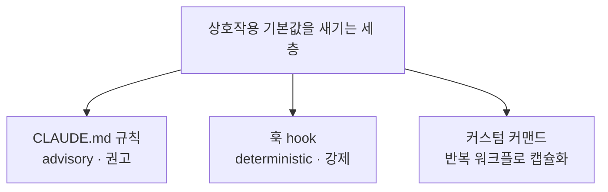

# 5장. 흐름 안에서 배우기 — 상호작용 기본값을 하네스에 새기기

당신의 CLAUDE.md에 규칙을 딱 한 줄 더한다고 해보자.

> 코드를 받기 전에, 내 접근을 한 문단으로 먼저 쓴다.

별것 아닌 것처럼 보인다. 그런데 이 한 줄이 매일의 상호작용을 조용히 바꾼다. 예전엔 "이거 만들어줘"라고 던지면 5초 뒤에 완성된 코드가 왔고, 나는 그걸 읽고 초록불을 확인하고 넘겼다. 이제는 코드가 오기 전에 잠깐 멈춰서 "나라면 이렇게 접근하겠다"를 한 문단으로 쓴다. 그리고 AI가 내놓은 걸 내 문단과 나란히 놓고 본다. 어긋나는 지점이 보인다. "아, 나는 이 엣지 케이스를 아예 생각 못 했네." 그 어긋남이 바로 배움이다.

앞 장에서 우리는 무거운 결론에 도달했다. 하네스의 최종 게이트는 사람인데, 그 게이트를 지탱하는 판단력의 원료를 기본값(완전 위임)이 갉아먹는다고. 그리고 그건 개인 의지가 아니라 설계 결함이라고. 설계 결함은 설계로 고친다 — 그 말의 뜻을, 이제 손에 만져지는 것으로 바꿔보자. 핵심 질문은 이것이다. 추가 시간을 거의 들이지 않고, 매일 어차피 하는 상호작용 자체를 학습 장치로 바꾸려면, 그걸 어떻게 하네스에 **'기본값'으로 새겨 넣을** 수 있을까?

'거의 추가 시간 없이'가 핵심이다. 따로 시간을 내서 공부하라는 게 아니다. 어차피 AI와 대화하며 일하는 그 흐름 **안에서**, 상호작용의 모양만 살짝 바꾸는 것이다. 그래서 이 장의 처방을 '흐름 안(in-flow)'이라고 부른다.

## 네 개의 기본값

흐름 안에서 바꿀 상호작용은 네 가지다. 하나씩 살펴보자. 신기하게도 이 네 가지는 전부 학습과학이 수십 년 전에 이미 검증해 둔 원리에 뿌리를 두고 있다.

**첫째, 선(先)설계 후(後)생성.** 방금 본 그 규칙이다. 코드를 받기 전에 내 접근을 먼저 쓴다. 왜 이게 효과가 있을까? 학습과학에 **생성 효과(generation effect)**라는 게 있다. 슬라메카와 그라프가 1978년에 밝힌 것으로, 답을 스스로 먼저 생성해 본 뒤에 확인하면 학습이 붙지만, 답을 먼저 받아 버리면 안 붙는다는 원리다. AI에게 바로 코드를 받는 건 답을 먼저 받는 것이다. 내 접근을 한 문단 먼저 쓰는 건 답을 스스로 생성해 보는 것이다. 겨우 한 문단인데, 이 순서 하나가 학습의 스위치를 켠다.

구체적으로 어떤 모양인지 보자. "결제 실패 시 재시도 로직을 짜야 한다"는 일을 맡았다고 하자. 예전 방식은 곧장 "결제 재시도 로직 짜줘"였다. 새 방식은 이렇다. 먼저 내가 세 줄을 쓴다. "지수 백오프로 최대 3회 재시도한다. 멱등성 키로 중복 결제를 막는다. 3회 실패하면 데드레터 큐로 보낸다." 그 다음에야 AI에게 넘긴다. 그러면 AI가 내놓은 코드에서 이런 게 보인다 — "어, 나는 멱등성 키를 생각했는데 AI는 그걸 빠뜨렸네" 혹은 "AI는 지터(jitter)를 넣었는데 나는 그 개념을 몰랐네." 전자는 내가 AI보다 앞선 지점, 후자는 내가 배울 지점이다. 두 경우 다, 그냥 코드를 받아 넘겼다면 영영 보이지 않았을 것들이다.

**둘째, 실행 전 예측.** 코드를 돌리기 전에 "이걸 실행하면 어떻게 될까"를 먼저 말해 본다. 그리고 실제로 돌려서 맞춰 본다. 예측이 맞으면 멘탈 모델이 튼튼하다는 뜻이고, 틀리면 — 여기가 중요하다 — **바로 그 자리가 내 멘탈 모델의 구멍**이다. 예측 오류는 가장 강한 학습 신호다. 이건 로디거와 카픽이 2006년에 정리한 **testing effect**와 통한다. 미리 인출을 시도(예측)하는 행위 자체가 기억을 강화하고, 특히 틀렸을 때 그 교정이 오래 남는다. 그냥 돌려 보고 "아 되네" 하고 넘기면 이 신호를 통째로 버리는 것이다.

AI가 짜 준 SQL 쿼리를 돌리기 직전을 떠올려 보자. "이 쿼리는 몇 건을 반환할까? 인덱스는 탈까, 풀 스캔을 할까?"를 먼저 말해 본다. 그리고 `EXPLAIN`을 돌린다. 내 예측이 "인덱스를 탄다"였는데 실제로는 풀 스캔이면 — 아찔한 순간이지만 — 바로 거기서 배운다. "아, 이 컬럼에 함수를 씌우면 인덱스가 무력화되는구나." 이런 예측 오류 하나가, 인덱스 최적화 문서 열 페이지보다 오래 남는다. 몸으로 틀려 봤기 때문이다.

**셋째, 설명 동봉 요구.** AI에게 코드만 받지 말고, "왜 이 방식을 택했고, 어떤 대안을 기각했는지"를 함께 달라고 한다. 이건 그냥 좋은 습관이 아니다. 2장에서 봤던 앤트로픽 실험 기억하는가? 그 실험에서 학습 성과가 가장 좋았던 집단의 상호작용 패턴이 바로 이것이었다 — AI에게 설명을 요구하고 개념을 되묻는 집단. 반대로 완전 위임 집단은 성과가 바닥이었다. 설명을 함께 받으면, 나는 코드를 '결과'가 아니라 '결정'으로 읽게 된다. 결정을 읽으면 그 결정을 평가하게 되고, 평가하려면 이해해야 한다.

여기서 한 가지 조심할 게 있다. "설명해줘"라고 하면 AI는 코드가 무슨 일을 하는지 **줄줄이 되풀이**해 줄 때가 많다. "이 함수는 리스트를 순회하며…" 같은 설명은 사실상 코드를 한국어로 다시 읽어 주는 것일 뿐, 아무것도 더 주지 않는다. 우리가 원하는 건 그게 아니다. **결정의 근거**다. "왜 해시맵을 썼는가(대안인 정렬 배열은 왜 기각했는가)", "이 트레이드오프에서 무엇을 포기했는가", "어떤 가정 위에서 이게 맞는가." 그러니 요구를 구체적으로 하는 편이 낫다. "코드 설명 말고, 네가 내린 설계 결정 세 가지와 각각 기각한 대안을 알려줘." 되풀이가 아니라 근거를 받을 때, 비로소 나는 그 결정을 평가할 위치에 선다.

**넷째, 설명 가능성 게이트.** diff를 승인하기 전에 스스로에게 딱 한 가지를 묻는다. **"이걸 지금 동료에게 설명할 수 있는가?"** 설명할 수 있으면 통과. 막히면 — 그 막히는 지점이 내가 이해 못한 부분이다. 4장에서 만난 사이먼 윌리슨의 기준을 기억하자. 리뷰하고, 테스트하고, 이해한 코드는 바이브 코딩이 아니다. 이 게이트가 바로 "이해했는가"를 매번 자문하는 장치다.

그리고 이 네 번째 게이트에는 팀 차원의 얼굴이 하나 있다. 바로 **코드 리뷰**다. 우리는 코드 리뷰를 '남의 코드를 봐주는 일' 정도로 여기기 쉽다. 그런데 다시 보자. 리뷰는 "이 diff를 설명할 수 있는가, 이해했는가"를 **팀이 매일 함께 작동시키는 의례**다. 2장에서 세운 원칙, "이해 못한 diff는 배포 금지"가 개인의 다짐에 그치지 않고 팀의 규칙으로 실행되는 자리가 리뷰다.

AI가 코드를 쓰는 시대에 리뷰의 무게중심은 미묘하게 이동한다. 예전 리뷰의 주 관심은 '이 코드가 맞는가'였다. 그런데 맞는지 틀리는지의 상당 부분은 이미 컴파일러·테스트·린터 — 형식화된 checker들 — 이 걸러 준다. 그러니 사람 리뷰어가 정말 봐야 할 것은 4장에서 말한 그 30%, 그리고 **올린 사람이 이걸 이해하고 있는가**다. 그래서 좋은 질문은 "이 변수명 바꾸죠"가 아니라 "이 락(lock)을 여기 둔 이유가 뭐예요? 없으면 어떤 경합이 나요?"에 가깝다. AI가 짠 코드를 올린 사람에게 리뷰어가 그렇게 물었을 때, "AI가 그렇게 줬어요"라고밖에 답 못 한다면 — 그 diff는 통과할 코드일지언정, 그 사람은 아직 게이트를 통과하지 못한 것이다. 리뷰가 이 질문을 던지는 문화를 가진 팀은, 코드 품질과 사람의 성장을 같은 자리에서 동시에 지킨다.

이 넷을 따로따로 지켜야 할 네 개의 숙제로 여기지 말자. 사실은 한 번의 리듬 변화다. 한 작업의 흐름으로 이어 보면 이렇다. 일감을 받으면 (1) 내 접근을 세 줄 먼저 쓰고 → AI에게 넘기며 설명을 함께 요구하고(3) → 돌아온 코드를 돌리기 전에 동작을 예측해 보고(2) → 승인 전에 "이걸 설명할 수 있나"를 자문한다(4). 매끄럽게 이어지는 하나의 동작이다. 예전 흐름이 "던지고 → 받고 → 넘기고"였다면, 새 흐름은 "생각하고 → 던지고 → 맞춰 보고 → 이해하고 넘기고"다. 딱 두 마디가 늘었을 뿐이다.

네 개를 한 줄로 묶으면 이렇다. **인지 작업의 첫 시도**를 내가 소유한다. 먼저 설계하고, 먼저 예측하고, 결정을 이해하고, 설명할 수 있을 때 넘긴다. 추가되는 시간은 하루에 다 합쳐도 몇 분이다. 그런데 그 몇 분이 위임과 학습을 가른다.

## 규칙을 하네스에 새기기

좋다. 그런데 여기서 솔직한 문제가 하나 있다. 이 네 가지를 "앞으로 잘 지켜야지" 하고 마음먹는 것만으로는 안 된다. 왜냐하면 4장에서 봤듯이, 마감은 매일 우리를 완전 위임 쪽으로 밀기 때문이다. 의지력은 소모되고 구조는 매일 작동한다. 그러니 이 기본값들을 **의지가 아니라 하네스에 새겨** 넣어야 한다. 그래야 마감이 코앞이어도 기본값이 나를 붙잡아 준다.

하네스에 규칙을 새기는 도구는 크게 세 가지다. 각각 성격이 다르니 구분해서 쓰는 편이 낫다.


그림 1. 규칙을 새기는 세 층 — 권고·강제·캡슐화

**CLAUDE.md 규칙 — 권고(advisory).** CLAUDE.md는 AI가 매 세션 읽어 들이는 프로젝트 지침 파일이다. 여기 적힌 것은 '권고'다. AI가 읽고 대체로 따르지만, 강제되지는 않는다. 앞의 네 기본값 대부분은 여기서 출발한다. 예를 들면 이렇게 적을 수 있다.

```markdown
## 협업 규칙 (학습 기본값)
- 코드를 생성하기 전에, 접근 방식을 3~5줄로 먼저 제시하고 내 확인을 기다린다.
  내가 "좋아, 진행"이라고 답하기 전에는 구현하지 않는다.
- 모든 변경에는 "왜 이 방식이고, 어떤 대안을 왜 기각했는지"를 한 문단 덧붙인다.
- 테스트(Red)와 구현(Green)을 같은 응답에 함께 만들지 않는다.
- diff를 제시할 때, 내가 놓치기 쉬운 엣지 케이스나 트레이드오프를
  한 줄로 짚어 준다. (내 판단을 대신하지 말고, 판단할 재료를 달라.)
```

이 네 줄이 앞의 1·3·4·(다음 절의) TDD 기본값을 하네스에 심는다. 별도 코드가 아니라 그냥 문장이다. 그런데 이게 매 세션 자동으로 상호작용의 모양을 잡아 준다. 눈여겨볼 건 마지막 줄이다. "내 판단을 대신하지 말고, 판단할 재료를 달라." 이 한 줄이 AI를 '결정하는 자'에서 '결정을 돕는 자'로 되돌려 놓는다. 4장에서 우리가 지키려 한 자기 위치 — 나는 부품이 아니라 최종 게이트다 — 를 규칙으로 못 박은 셈이다.

**훅(hook) — 강제(deterministic).** 권고만으로 부족한 게 있다. AI가 급할 때 규칙을 건너뛸 수도 있고, 내가 흐름에 취해 그냥 승인해 버릴 수도 있다. 정말로 양보하면 안 되는 선은 **훅**으로 못 박는다. 훅은 특정 이벤트(도구 실행 전후, 세션 종료 등)에 반드시 실행되는 결정론적 장치다. 권고와 달리 조건에 걸리면 **실제로 막는다**. 예컨대 "테스트를 돌리지 않은 채로는 커밋을 막는다" 같은 걸 도구 실행 직전 훅에 걸 수 있다. 커밋 직전에 테스트 통과를 강제하는 훅은 이런 골격이다.

```jsonc
// settings.json (일부) — 커밋 전에 테스트 통과를 강제하는 훅
{
  "hooks": {
    "PreToolUse": [
      {
        "matcher": "Bash",                       // 셸 명령을 실행하려 할 때
        "hooks": [
          { "type": "command",
            "command": "scripts/guard-commit.sh" } // git commit이면 테스트 먼저 확인, 실패 시 차단
        ]
      }
    ]
  }
}
```

권고(CLAUDE.md)와 이 훅의 차이가 핵심이다. CLAUDE.md의 "테스트 없이 커밋하지 말자"는 AI가 잊을 수도, 내가 넘길 수도 있다. 하지만 훅은 사람이 깜빡해도 **기계가 대신 막는다**. 앤트로픽이 정리한 검증 게이트 네 단계 가운데 하나가 바로 이 훅 계층이다 — 프롬프트 안 자체 점검, 목표 조건 확인, 그리고 정해진 횟수만큼 연속으로 막히면 작업을 강제 종료하는 **Stop hook**, 마지막으로 검증 서브에이전트. 여기서 양보 불가능한 선을 훅으로, 방향을 잡는 습관을 권고로 나누는 감각을 길러 두는 편이 낫다. 모든 걸 훅으로 막으면 하네스가 뻣뻣해지고, 모든 걸 권고로 두면 마감 앞에서 무너진다.

> 훅의 정확한 설정 형식(이벤트 이름·매처·명령 구조)은 도구 버전에 따라 바뀔 수 있다. 위 예시는 2026년 기준 Claude Code의 훅 체계를 전제로 한 illustration이니, 실제로 설정할 때는 쓰는 도구의 공식 문서를 함께 확인하자. 이 점은 빠르게 바뀌는 영역이다.

**커스텀 커맨드 — 반복 워크플로 캡슐화.** 매번 같은 순서로 하는 상호작용이 있다면, 그걸 하나의 명령으로 묶어 둘 수 있다. 예를 들어 `/design-first`라는 커맨드를 만들어 '선설계 후생성' 절차를 통째로 캡슐화하는 식이다. 커스텀 커맨드는 대개 `.claude/commands/` 아래의 마크다운 파일 하나로 정의된다.

```markdown
<!-- .claude/commands/design-first.md -->
다음 요구사항에 대해, 아직 구현하지 마라: $ARGUMENTS

1. 접근 방식을 3~5줄로 제시한다.
2. 고려한 대안을 하나 이상 적고, 왜 그것을 고르지 않았는지 밝힌다.
3. 내가 놓치기 쉬운 엣지 케이스를 짚는다.
4. 그리고 멈춘다. 내가 "진행"이라고 답하기 전에는 코드를 쓰지 않는다.
```

이제 `/design-first 결제 재시도 로직`이라고 치면, 그 절차가 매번 정확히 재현된다. 손이 기억하지 못해도 명령이 기억한다. 마감에 쫓겨 무심코 "그냥 짜줘"라고 하려던 순간, `/design-first`를 치는 아주 작은 마찰 하나가 나를 선설계 쪽으로 되돌려 놓는다.

셋을 어떻게 조합할지가 곧 당신의 하네스 설계다. 양보 불가능한 선은 훅으로 강제하고, 방향을 잡는 습관은 CLAUDE.md 권고로 깔고, 반복되는 절차는 커맨드로 캡슐화한다.

여기서 흔히 빠지는 함정 하나를 미리 경계하자. 이 이야기를 들으면 의욕이 앞서서, 규칙을 스무 개쯤 CLAUDE.md에 쏟아붓고 훅을 대여섯 개 걸어 두고 싶어진다. 그런데 그렇게 만든 하네스는 며칠 못 간다. 규칙이 너무 많으면 AI도 다 지키지 못하고, 사람은 매번 마찰에 부딪혀 결국 하네스를 통째로 꺼 버린다. 마감 앞에서 "아, 몰라, 그냥 다 끄고 짜자"가 되는 순간, 애써 만든 학습 장치가 0이 된다. 지나치게 뻣뻣한 하네스는 없느니만 못하다.

그래서 좋은 하네스는 규칙이 많은 하네스가 아니라 **살아남는 하네스**다. 처음엔 딱 하나만 새겨 보는 편이 낫다. 이를테면 "선설계 후생성" 하나. 그게 2주쯤 몸에 붙어 마찰이 사라지면, 그때 다음 하나를 얹는다. **당신을 학습 쪽으로 미는 최소한의 기본값**이 마감의 압력에도 살아남도록 배치하는 것 — 그게 설계다. 많이 새기는 게 아니라, 오래 견디게 새기는 것이다.

## TDD의 Red를 인간이 소유하기

이 흐름 안 처방 가운데 특별히 힘이 센 장치가 하나 있다. TDD(테스트 주도 개발)다. 그런데 AI 시대의 TDD에는 반드시 붙잡아야 할 조건이 하나 있다. 이걸 놓치면 TDD가 그냥 형식만 남고 알맹이가 증발한다.

먼저 왜 TDD가 학습 장치이기도 한지 보자. 켄트 벡은 AI와 함께하는 TDD의 핵심을 이렇게 표현했다. **"당신이 스펙을 소유하고, AI가 구현을 소유한다. 그래서 AI는 자기 버그를 스스로 검증할 수 없다."** 이게 왜 중요한가? 4장에서 우리는 maker가 자기 자신을 검증할 수 없다는 원칙을 봤다. 테스트를 내가 쓰면, 그 테스트는 '요구'에서 나온 것이다. 구현은 AI가 한다. 그러면 구현(maker)과 검증(checker·테스트)이 서로 다른 주체에서 나오니, AI가 자기 구현에 맞춰 테스트를 슬쩍 구부리는 일이 원천적으로 막힌다.

그런데 여기 함정이 있다. AI에게 "테스트랑 구현 같이 만들어줘"라고 하면 어떻게 될까? AI가 한 응답에 테스트와 구현을 함께 낸다. 그러면 그 테스트는 '요구'에 맞춘 게 아니라 '자기 구현'에 맞춘 테스트가 된다. 구현이 어떻게 동작하든 테스트는 초록불이다. 왜냐하면 그 테스트가 바로 그 구현을 통과시키려고 짜였으니까. maker와 checker가 다시 한 몸이 되어 버렸다. 이러면 TDD의 안전장치도, 학습 효과도 통째로 사라진다. 초록불은 켜지지만 아무것도 검증하지 못한다.

그래서 시드 아티클의 처방은 명료하다. **Red를 인간이 소유하라.** 실패하는 테스트(Red)를 먼저 내가 쓰거나, 최소한 내가 승인한다. "이 기능이 완성되면 이런 조건을 만족해야 한다"를 내가 못 박는다. 그 다음에야 AI에게 구현(Green)을 맡긴다. 이 순서를 지키면 두 가지를 동시에 얻는다. 품질(자기 검증 불가 구조)과 학습(요구를 내 손으로 명세하는 생성 경험). 앞 절에서 CLAUDE.md에 적은 "테스트와 구현을 같은 응답에 함께 만들지 않는다"가 바로 이걸 하네스에 새긴 것이다.

그런데 "Red를 소유한다"는 게 반드시 테스트 코드를 내가 한 자 한 자 타이핑한다는 뜻은 아니다. 핵심은 **요구를 못 박는 판단이 내 손을 거친다**는 것이다. 앞의 결제 재시도 예로 돌아가 보자. 구현을 시키기 전에, 나는 이런 조건들을 먼저 확정한다.

```python
# 내가 먼저 소유하는 Red — "이 기능이 완성되면 반드시 참이어야 할 것"
def test_결제는_최대_3회까지만_재시도한다(): ...
def test_같은_멱등성_키로는_중복_결제되지_않는다(): ...
def test_3회_실패하면_데드레터_큐로_보낸다(): ...
```

테스트의 뼈대를 AI가 채우게 하더라도, **어떤 조건을 검증할지**는 내가 정한다. "멱등성 키" 조건을 넣을지 말지를 결정하는 순간, 나는 이미 이 도메인의 핵심을 한 번 생성해 본 것이다. 그게 학습이다. AI에게 "테스트도 알아서"라고 맡기면, 바로 이 생성의 순간을 통째로 넘겨 버린다.

실무에서는 이걸 커맨드로 나눠 둘 수도 있다. `/red`는 실패하는 테스트만 제안하고 멈춘다(구현 금지). 내가 그 테스트를 검토·수정·승인한 뒤에 `/green`으로 구현을 시킨다. Red와 Green 사이에 인간의 승인이 물리적으로 끼어들게 만드는 것이다. 이렇게 하면 "빨리 가려다 무심코 둘을 한꺼번에 시키는" 실수 자체가 구조적으로 어려워진다.

## 프론트엔드 개발자를 위한 흐름 안 기본값 (React · Next.js · TypeScript)

지금까지의 예시가 백엔드 냄새가 났다면, 프론트엔드 독자에게도 이 처방이 똑같이 — 어쩌면 더 강하게 — 걸린다는 걸 짚고 넘어가자. 당신의 스택이 React, Next.js, TypeScript라면 이 절은 당신 것이다.

먼저 반가운 소식. 프론트엔드는 이미 '공짜 checker'를 손에 쥐고 있다. **타입 시스템**이다. 1장에서 우리는 TypeScript가 GitHub 최다 언어 1위에 오른 것을, 그리고 LLM이 낸 컴파일 에러의 94%가 타입 체크 실패라는 수치를 봤다 — "타입이라는 공짜 checker를 에이전트 루프에 끼워 넣는 움직임"으로. 그 이야기가 바로 이 스택의 이야기다. AI가 코드를 뱉으면 타입 검사기가 즉시 통과/실패를 알려 준다. 타입 시스템이 AI의 실수 대부분을 자동으로 걸러 주는 checker로 작동한다는 뜻이다.

그러니 프론트엔드에서 흐름 안 기본값을 새기는 첫걸음은 명확하다. 타입을 **느슨하게 두지 말자**. AI가 `any`를 남발하거나 타입을 우회하도록 놔두면, 공짜로 얻을 수 있는 checker를 스스로 꺼 버리는 셈이다. "strict 모드를 켜고, `any`를 금지한다"를 팀 규칙으로 두는 것만으로도 하네스의 checker 한 겹이 살아난다.

프론트엔드에는 이런 규칙과 자동화를 심는 자리가 이미 잘 갖춰져 있다. 예를 들어 Cursor를 쓴다면 **Cursor Rules(또는 Skills)**로 팀 규칙과 반복 워크플로를 인코딩한다. Swagger/OpenAPI 명세에서 TypeScript 타입을 자동 생성하고, API 호출 훅을 만들고, 테스트와 PR 초안을 뽑는 흐름을 규칙으로 정착시키는 팀이 많다. 규칙 파일을 하나 들여다보자.

```markdown
<!-- .cursor/rules — 예시 -->
- 컴포넌트를 만들기 전에, props와 상태의 타입을 먼저 정의하고 내 확인을 받는다.
- `any`와 타입 단언(`as`)을 쓰지 않는다. 불가피하면 이유를 주석으로 남긴다.
- API 응답 타입은 OpenAPI 스키마에서 생성한 타입만 쓰고, 손으로 짜지 않는다.
- 리렌더링에 영향을 주는 변경(메모이제이션·의존성 배열)은
  "왜 필요한지"를 한 줄로 설명하고 제안한다.
```

이건 앞 절에서 말한 'CLAUDE.md 규칙·커스텀 커맨드'의 프론트엔드판이다. 도구 이름만 다를 뿐, 원리는 똑같다 — 상호작용 기본값을 하네스에 새긴다. 첫 줄이 '선설계 후생성', 마지막 줄이 '설명 동봉 요구'의 프론트엔드 번역이라는 게 보이는가?

그리고 흐름 밖 표적 연습(6장에서 자세히 다룬다)의 프론트엔드 버전도 하나 미리 던져 두자. **"이 컴포넌트가 왜 이렇게 리렌더되는지, AI 없이 설명해보기."** 리렌더링은 프론트엔드의 디버깅에서 가장 인과 모델을 요구하는 영역이다. `useMemo`를 어디에 넣을지 AI에게 물어 바로 받는 대신, 먼저 "이 컴포넌트는 부모가 리렌더될 때 왜 같이 리렌더되는가"를 스스로 설명해 본다. 막히는 지점이, 당신이 리액트의 렌더링 모델을 아직 손에 넣지 못한 지점이다.

## 이 책이 태어난 하네스 — 만질 수 있는 사례

지금까지의 처방이 여전히 조금 추상적으로 느껴진다면, 아주 구체적인 실물 하나를 보여주고 싶다. 바로 **이 책을 만들어 낸 하네스** 자체다.

이 책은 사람이 처음부터 끝까지 손으로 쓴 게 아니다. 주제와 대상 독자가 주어지면 리서치 → 계획 → 저술 → 편집 → EPUB 빌드까지 수행하는 자동화 하네스가 산출했다. 그러니 이 하네스야말로 "인지 작업을 AI에게 위임하는" 전형적인 시스템이다. 그리고 바로 그렇기 때문에, 이 하네스는 4장이 경고한 함정 — 위임이 인간(여기서는 책을 발주하고 승인하는 '운영자')의 판단력 원료를 고갈시키는 함정 — 에 그대로 노출된다. 그래서 이 하네스에는 이 책이 처방하는 흐름 안 기본값이 **실제로 설계되어 들어가 있다.** 문서 이름은 '운영자 학습 루프'다.

몇 가지만 열어 보자.

**선판단 후공개 — 설계 근거 동봉.** 이 하네스는 계획 단계에서 `02_plan.md`라는 문서를 만드는데, 거기에 **"설계 근거" 섹션이 의무**다. 채택한 구조의 이유만 적는 게 아니라, **진지하게 고려했다가 기각한 대안 구조를 두 개 이상, 기각 사유와 함께** 적어야 한다. 이게 바로 앞에서 본 '설명 동봉 요구'의 하네스 버전이다. 지금 이 책의 `02_plan.md`를 열어 보면, 실제로 세 개의 기각된 구조 — "아티클 확장판", "독자별 분권", "주제별 백과" — 가 각각의 기각 사유와 함께 적혀 있다. 왜 이 구조여야 하는지를, 왜 다른 구조가 아니어야 하는지로 증명하게 만든 것이다.

**선판단 초대.** 이 하네스는 완성된 계획을 운영자에게 보여주기 *직전에*, 이렇게 묻도록 설계되어 있다. "이 주제·독자라면 어떤 챕터 흐름을 기대하시나요? 한두 줄이면 됩니다(건너뛰어도 됩니다)." 왜 굳이 보여주기 전에 물을까? 운영자가 먼저 자기 예상을 세우게 하려는 것이다. 그래야 계획을 봤을 때 자기 예상과 갈라진 지점이 보이고, 그 예측 오류가 학습 신호가 된다. 앞에서 본 '선설계 후생성'과 정확히 같은 원리를, 책을 발주하는 사람에게 적용한 것이다.

**설명 가능성 자문.** 완료 보고의 말미에는 자문 한 줄이 붙는다. "이 책의 핵심 논지를 남에게 한 문단으로 설명할 수 있는가? 막히는 지점이 바로 직접 읽을 지점이다." 앞의 '설명 가능성 게이트'가 그대로 옮겨 온 것이다.

이 하네스에는 흐름 안 기본값만 있는 게 아니다. 아예 위임의 세기를 조절하는 손잡이도 달려 있다. 운영자가 "이 주제를 공부하려고" 같은 신호를 주면 하네스가 `learning` 모드로 전환되어, 선판단 초대를 기본 단계로 올리고 첫 챕터를 직접 읽으라 권한다. 신호가 없으면 잠자코 `production` 모드로 돈다. 이게 바로 다음 장에서 다룰 **위임 다이얼**의 실물이다 — 같은 도구를, 지금이 생산 국면인지 학습 국면인지에 따라 다르게 잡는 손잡이. 여기서는 이런 게 하네스에 새겨진다는 것만 봐 두고, 자세한 건 6장에서 만나자.

여기서 한 가지 원칙을 짚어 두자. 이 모든 터치포인트는 **비블로킹**이다. 운영자가 응답하지 않거나 자율 실행 중이면 조용히 생략된다. 학습 장치가 파이프라인을 멈춰 세워선 안 되기 때문이다. 품질을 막는 게이트(사실 검증·연속성·수락 게이트)는 따로 있고, 이건 어디까지나 판단력의 원료를 계속 공급하기 위한 흐름 안 장치다.

이 사례가 말해 주는 건 단순하다. 흐름 안 기본값은 개인의 코딩 습관에만 적용되는 게 아니라, **위임을 다루는 어떤 시스템에도 설계해 넣을 수 있는 것**이라는 점이다. 하네스가 코드를 뽑든 책을 뽑든, 최종 게이트가 사람이라면, 그 사람의 학습 루프도 설계 대상이다. 지금 당신이 읽는 이 문장 자체가, 그 설계가 실제로 작동한 결과물인 셈이다.

## 흐름은 절반이다

흐름 안 기본값의 가장 큰 매력은 값이 싸다는 것이다. 따로 시간을 내지 않는다. 어차피 하는 상호작용의 모양만 바꾼다. 그런데 매일 이걸 지키면, 위임하면서도 배우는 사람과 위임하면서 마모되는 사람의 길이 조금씩, 그러나 확실히 갈라진다.

CLAUDE.md의 규칙 한 줄, 커밋 훅 하나, `/red`와 `/green`을 가르는 커맨드 하나 — 오늘 당장 자기 하네스에 넣을 수 있는 것들이다. 거창한 결심이 아니라 작은 설정이다. 그리고 그 작은 설정이 마감의 압력 앞에서 당신을 대신 붙잡아 준다.

하지만 솔직히 말하면, 흐름 안만으로는 절반이다. 매일의 상호작용을 아무리 잘 설계해도, 그 안에서는 결국 AI가 옆에 있다. 정말로 실력의 바닥이 드러나는 건, AI를 끄고 혼자 섰을 때다. 이제 그 흐름 **밖**으로 나가 볼 차례다.
