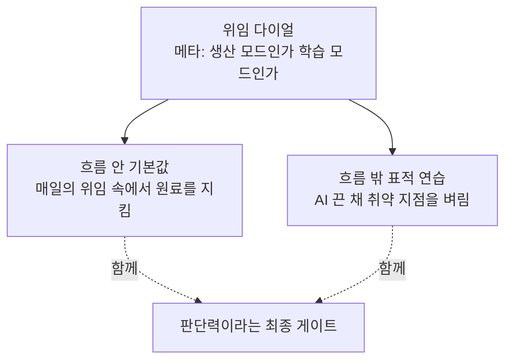

# 6장. 흐름 밖에서 벼리기 — 표적 연습과 위임 다이얼

마지막으로 AI 없이, 스택 트레이스 하나만 들고 버그의 원인까지 끝까지 걸어가 본 게 언제인가?

잠깐 진짜로 떠올려 보자. 최근 한 달, 스택 트레이스를 그대로 AI에게 붙여 넣지 않고 — "이거 왜 나?"라고 묻지 않고 — 첫 줄부터 호출 스택을 따라 손으로 내려가며 원인을 짚어 본 적이 있는가? 기억이 잘 안 난다면, 당신만 그런 게 아니다. 대부분이 그렇다. 그리고 바로 그게 이 장이 다루려는 문제다.

솔직히 말하면, 이 질문 앞에서 살짝 찜찜해지는 데는 이유가 있다. AI 없이 혼자 서 봤을 때 내가 어디까지 갈 수 있는지를, 우리는 은근히 **확인하고 싶어 하지 않는다.** 매일 빠르게 쳐내고 있으니 실력이 유지되고 있다고 믿고 싶고, 그 믿음을 굳이 시험대에 올리기가 두렵다. 그런데 이 장의 처방은 정확히 그 시험대다. 흐름 밖으로 나가 혼자 서 보는 것 — 불편하지만, 그 불편함이야말로 실력이 살아 있다는 신호이거나, 되살려야 한다는 신호다.

앞 장에서 우리는 흐름 안(in-flow) 기본값을 하네스에 새겼다. 매일의 상호작용을 학습 장치로 바꾸는, 값싸고 지속 가능한 처방이었다. 그런데 5장 끝에서 솔직하게 인정했듯, 흐름 안만으로는 절반이다. 왜냐하면 그 흐름 안에는 항상 AI가 옆에 있기 때문이다. 아무리 잘 설계된 상호작용이라도, 막히면 손을 뻗을 수 있는 도구가 팔 길이 안에 있다. 그런 조건에서는 결코 확인되지 않는 게 하나 있다. **AI를 껐을 때 나 혼자 어디까지 갈 수 있는가.**

그래서 흐름 안을 보완할 두 번째 처방이 필요하다. 흐름 **밖(off-flow)**, 즉 의도적으로 AI를 끄고 하는 표적 연습이다. 그리고 그 위에, 언제 위임을 늘리고 언제 줄일지를 정하는 손잡이 — 위임 다이얼이 얹힌다. 이 장에서 그 둘을 손에 쥐어 보자.

## 흐름 안만으로 안 되는 이유

먼저 왜 흐름 밖이 따로 필요한지부터 분명히 하자. "흐름 안에서 매일 조금씩 배우면 충분하지 않나?"라는 반문이 자연스럽기 때문이다.

여기 조금 불편한 연구가 하나 있다. 인적 요인(human factors) 분야에서 파라수라만과 만지가 2010년에 정리한 **자동화 안주(automation complacency)** 현상이다. 자동화된 시스템을 오래 쓰면, 사람은 그 시스템을 과신하게 되어 감시를 게을리하고, 정작 시스템이 틀렸을 때 그걸 잡아내지 못한다. 항공과 의료에서 수십 년간 확립된 현상이다. 그런데 이 연구가 던지는 두 가지 사실이 뼈아프다. 첫째, **전문가도 예외가 아니다.** 경력이 자동으로 방패가 되어 주지 않는다. 둘째 — 이게 핵심인데 — **단순히 오래 그 일을 한다고 예방되지 않는다.** 그냥 계속 자동화와 함께 일하는 것만으로는 이 안주가 풀리지 않는다.

물론 정직하게 짚자. 이 연구는 항공·의료의 감시 과제에서 나온 것이고, 소프트웨어 개발로 그대로 옮기는 건 엄밀히는 유추다. 하지만 생각해보면 'AI가 짠 diff를 승인한다'는 것도 결국 자동화의 출력을 감시·검증하는 과제다. 개연성은 충분히 높다.

이게 왜 뼈아픈가? **흐름 안 처방만으로는 부족하다는 뜻**이기 때문이다. 매일 AI와 함께 일하며 상호작용을 아무리 잘 설계해도, 그 자체가 '자동화와 함께 오래 일하는 것'이라서, 안주는 그 안에서 조용히 자란다. 이걸 풀려면 질적으로 다른 것이 필요하다. 바로 **의도적으로 자동화를 끊는 연습**이다.

여기서 방점을 어디에 찍을지가 중요하다. 흔히 "그럼 AI 없이 코딩하는 시간을 많이 가지면 되겠네"라고 생각하기 쉽다. 그런데 방점은 **총량이 아니라 규칙성과 표적**이다. 어쩌다 하루 날 잡아 AI 없이 몇 시간 코딩하는 것보다, 매주 정해진 짧은 블록에 **정확히 취약한 지점을** 연습하는 편이 훨씬 낫다. "언젠가 시간 나면 해야지"는 영영 오지 않는다. 캘린더에 15분이라도 박아 두는 편이 낫다. 짧아도 규칙적이고 표적화된 것 — 그게 흐름 밖 연습의 핵심이다.

## 표적 연습 세 가지

그렇다면 무엇을, 어떻게 연습할까? 세 가지 메뉴를 보자. 셋 다 공통점이 있다. AI를 끄고, 짧게, 자기 스택의 취약 지점을 정조준한다.

### 하나 — 디버깅을 맨손으로

첫 번째 표적은 **디버깅**이다. 왜 하필 디버깅일까? 2장을 떠올려 보자. 앤트로픽 실험에서 AI 그룹과 수동 그룹의 격차가 가장 크게 벌어진 영역이 바로 디버깅이었다. 우연이 아니다. 디버깅은 **인과 모델**을 요구하는 활동이기 때문이다. "이 증상이 나타났다 → 그렇다면 원인은 이 지점일 수밖에 없다"를 거꾸로 추론하는 일인데, 이 인과의 사슬은 코드를 읽어서가 아니라 스스로 여러 번 추적해 봐서 몸에 새겨진다.

인지과학에 이걸 뒷받침하는 고전이 있다. 치와 동료들이 1981년에 밝힌 **전문가의 표상** 연구다. 초보는 문제를 표면적 특징으로 보고, 전문가는 심층 원리로 본다. 전문성이란 결국 지식이 얼마나 잘 **조직화**되어 있느냐다. 그런데 이 조직화는 남이 정리해 준 걸 읽는다고 생기지 않는다. 스스로 인과를 쫓아 본 경험이 쌓여야 생긴다. 그래서 AI가 준 원인 진단을 읽기만 하면, 답은 알아도 그 답에 이르는 조직화된 표상은 안 생긴다. 새벽 2시에 혼자 남았을 때 무너지는 이유가 이것이다.

연습은 단순하다. 버그를 만나면, 스택 트레이스를 AI에 붙여 넣기 전에 **15분만 혼자 걸어 본다**. 자바/스프링 개발자라면 이런 것들이다. `NullPointerException`이 터졌을 때, 어느 참조가 왜 널이었는지를 스택의 첫 줄부터 짚어 내려간다. 트랜잭션이 롤백되지 않았을 때, `@Transactional`의 프록시가 왜 그 호출에는 안 걸렸는지를 추론한다(자기 호출이었나? 체크 예외였나?). N+1 쿼리가 의심될 때, 로그의 SQL을 세어 보며 어느 연관 매핑이 지연 로딩을 트리거했는지 찾는다.

리액트/Next.js 개발자라면 5장 끝에서 예고한 그 연습이다. 컴포넌트가 예상보다 자주 리렌더될 때, `useEffect`가 무한 루프에 빠졌을 때, 상태 업데이트가 한 박자 늦게 반영될 때(stale closure) — 이걸 AI에게 "왜 이래?" 묻기 전에, 리액트의 렌더링 모델을 머릿속에서 돌려 스스로 설명해 본다.

맨손 추론이 실제로 어떤 모양인지, `NullPointerException` 하나로 짧게 걸어 보자. 트레이스의 맨 윗줄이 어느 클래스 어느 메서드에서 터졌는지 읽는다. 그 줄에서 널일 수 있는 참조를 추린다. "이 필드가 널이려면, 그 앞 어딘가에서 주입·초기화가 안 됐다는 뜻이다." 그럼 그 참조가 원래 어디서 채워져야 하는지를 거꾸로 따라 올라간다. 생성자였나, 세터였나, 스프링의 의존성 주입이었나? 주입이었다면 그 빈이 실제로 컨텍스트에 등록됐나, 혹시 `@Component`를 빠뜨린 클래스인가? 이 사슬을 한 칸씩 짚는 게 인과 추론이다. AI에게 트레이스를 던지면 답은 3초 만에 오지만, 이 사슬은 안 생긴다. 다음에 비슷한 널을 만나도 여전히 처음처럼 막막하다. 반대로 한 번 손으로 걸어 본 사람은, 다음번엔 트레이스 첫 줄만 봐도 "아, 주입이 안 됐네" 하고 짚는다.

15분 안에 못 풀어도 괜찮다. 그 15분 동안 세운 가설과 그것이 틀린 지점이, 다음번엔 5분 만에 풀리게 만드는 조직화를 남긴다. 15분이 지나면 그때 AI를 켜서 내 추론과 맞춰 본다 — 5장의 '선(先)추론 후(後)확인'을 디버깅에 적용하는 것이다. 그러면 AI의 답은 '정답 배달'이 아니라 '내 가설에 대한 채점'이 되고, 채점은 배달과 달리 기억에 남는다.

### 둘 — 일부러 깨뜨려 보기

두 번째 표적은 조금 짓궂다. **AI가 짜 준 코드를 일부러 망가뜨려 보는 것**이다.

멀쩡히 돌아가는 코드를 왜 부수나 싶겠지만, 여기엔 이유가 있다. 코드가 어떻게 동작하는지 진짜로 이해했는지는, 그걸 **어떻게 하면 망가지는지 알 때** 드러난다. 이해했다면 부수는 방법을 안다. 모른다면, 부술 곳조차 못 짚는다.

자바/스프링에서 이 연습은 이런 모양이다. AI가 짜 준 서비스 메서드에서 `@Transactional`을 떼어내면, 어느 시나리오에서 데이터 정합성이 깨질까? 예측해 보고, 실제로 떼고, 중간에 예외를 던져 본다. 혹은 AI가 넣어 준 낙관적 락(`@Version`)을 제거하면, 두 요청이 동시에 같은 엔티티를 수정할 때 무슨 일이 벌어질까? 커넥션 풀 크기를 1로 줄여 어디서 먼저 막히는지 관찰한다. 리액트라면, AI가 `useMemo`로 감싼 값에서 의존성 배열의 한 항목을 빼 보고 어떤 stale 값이 새어 나오는지 관찰한다. `key` prop을 일부러 바꿔 컴포넌트가 언마운트·리마운트되는 순간을 눈으로 확인한다. 예측을 세우고, 실제로 건드리고, 맞춰 본다.

이 연습이 좋은 이유는 **무너지는 지점이 곧 그 코드의 핵심**을 가리키기 때문이다. 코드에서 가장 중요한 줄은 대개 없애면 가장 크게 망가지는 줄이다. AI가 왜 하필 그 자리에 `@Transactional`을 붙였는지, 왜 그 의존성 배열에 그 항목이 들어갔는지 — 부숴 봐야 비로소 그 '왜'가 손에 잡힌다. 그걸 찾아내는 순간, 나는 그 코드를 '읽은 사람'에서 '이해한 사람'으로 넘어간다. 게다가 이건 위험 부담도 없다. 어차피 실험용 브랜치에서 부수는 거니까. 5장에서 CLAUDE.md에 규칙을 새기던 그 신중함과는 정반대로, 여기선 마음껏 망가뜨려도 된다.

### 셋 — 백지에서 다시 지어 보기

세 번째 표적은 **작은 모듈을 백지에서 직접 구현한 뒤, AI 버전과 나란히 비교하는 것**이다.

크게 잡을 필요 없다. 최근에 AI에게 맡겼던 작은 유틸리티 하나 — 날짜 파싱, 간단한 LRU 캐시, 재시도 래퍼 정도 — 를 골라, AI 버전을 덮어 두고 백지에서 다시 짜 본다. 그리고 둘을 나란히 편다. 차이가 나는 지점, **바로 거기가 배울 지점**이다. AI는 처리했는데 나는 빠뜨린 엣지 케이스가 있다면 그건 내 멘탈 모델의 구멍이고, 반대로 내가 더 명료하게 짠 부분이 있다면 그건 내가 이미 가진 강점이다.

구체적으로, 자바 개발자라면 스레드 안전한 간단한 캐시를 백지에서 짜 본 뒤 AI 버전과 비교해 볼 만하다. 나는 `synchronized`로 막았는데 AI는 `ConcurrentHashMap`의 `computeIfAbsent`를 썼다면, 왜 후자가 나은지(락 경합) 스스로 설명해 본다. 리액트 개발자라면 디바운스 훅(`useDebounce`)이나 외부 클릭 감지 훅을 백지에서 짜 본다. 내 버전은 클린업을 빠뜨려 메모리 누수가 나는데 AI 버전은 `useEffect`의 반환 함수로 이벤트 리스너를 걷어냈다면 — 그 클린업의 자리가 바로 내가 리액트의 생명주기를 아직 손에 넣지 못한 지점이다. 비교가 없으면 이 구멍은 영영 안 보인다. AI 버전은 늘 매끄럽게 돌아가서, 내 것과 나란히 놓기 전엔 내가 뭘 몰랐는지조차 모른다.

이 세 연습의 이론적 뿌리는 에릭슨의 **의도적 연습(deliberate practice)**이다. 능력의 경계에서, 즉각적인 피드백과 함께, 반복해서 교정하는 연습이 전문성을 만든다는 것이다. 세 메뉴 모두 정확히 이 구조다 — 취약한 경계(디버깅·이해·생성)에서, AI 버전이라는 피드백과 함께, 짧게 반복한다. 다만 여기엔 정직한 단서를 하나 붙여야 한다. 에릭슨의 원 연구는 이후 2019년 재검토에서 "연습이 전문성의 **필요조건이지 충분조건은 아니다**"로 다듬어졌다. 연습만 하면 무조건 전문가가 된다는 뜻이 아니라, 좋은 연습 없이는 전문성에 이르기 어렵다는 뜻으로 새기는 편이 안전하다.

### 주간 루틴에 심기

세 메뉴를 알아도, "다음에 해야지" 하면 영영 안 한다. 앞에서 방점은 총량이 아니라 규칙성이라고 했다. 그러니 이걸 **캘린더에 박제**하는 게 핵심이다. 거창할 필요 없다. 이런 정도면 충분하다.

- **디버깅 표적은 실시간으로.** 따로 시간을 내는 게 아니라, 이번 주에 만나는 버그 가운데 하나를 골라 "이건 15분간 맨손으로 간다"고 정해 둔다. 규칙은 하나 — 그 15분 동안은 스택 트레이스를 AI에 붙여 넣지 않는다.
- **깨뜨리기·백지 구현은 짧은 고정 블록으로.** 이를테면 매주 금요일 오후에 25분. 스프린트를 닫기 전, 이번 주 AI에게 맡겼던 코드 중 하나를 골라 부수거나 백지에서 다시 짜 본다.

핵심은 **작고 규칙적으로**다. 주 1회 25분이 월 1회 반나절보다 낫다. 근육은 몰아서 한 번 크게 쓰는 것보다 자주 쓸 때 붙기 때문이다. 그리고 이 블록에는 한 가지 심리적 장치가 숨어 있다. 캘린더에 박혀 있으면, 그 시간은 "생산해야 하는 시간"이 아니라 "배워도 되는 시간"으로 공식 승인을 받는다. 마감의 죄책감 없이 느리게 헤맬 허락 — 흐름 밖 연습에는 이 허락이 필요하다.

한 가지 오해를 미리 풀어 두자. 흐름 밖 연습은 'AI를 안 쓰는 순수주의자'가 되려는 게 아니다. 오히려 정반대다. 이 연습의 진짜 보상은 **AI를 더 잘 쓰게 된다**는 데 있다. 4장에서 우리는 인간이 하네스의 최종 게이트, 즉 형식화되지 않는 30%를 판정하는 checker라고 했다. 그런데 그 판정 능력은 어디서 오는가? 직접 디버깅해 보고, 부숴 보고, 백지에서 짜 본 경험에서 온다. 스스로 해 본 사람만이 AI가 내놓은 코드에서 "이건 좀 이상한데"를 느낀다. 그러니 흐름 밖 연습은 AI에게서 멀어지는 게 아니라, AI의 출력을 판별할 눈을 벼려 다시 흐름 안으로 돌아오는 왕복이다. 연습이 깊을수록, 위임은 더 대담해질 수 있다 — 무엇이 잘못됐는지 알아볼 수 있으니까.

## 위임 다이얼 — 손잡이를 잡는 법

흐름 안(5장)과 흐름 밖(6장 앞부분)을 갖췄다면, 이제 그 위에 얹을 마지막 층이 있다. 메타 계층, 즉 **매 작업마다 위임을 얼마나 할지 정하는 손잡이**다. 이걸 위임 다이얼이라 부른다.

먼저 왜 '스위치'가 아니라 '다이얼'인지부터 짚자. 이 책은 처음부터 "AI를 쓰지 마라"고도, "다 맡겨라"고도 하지 않았다. 세상엔 두 가지 흔한 극단이 있다. 하나는 **금지주의** — "AI 쓰면 바보 된다, 다 손으로 짜라." 다른 하나는 **방임주의** — "이제 다 맡기면 된다, 검증도 곧 AI가 한다." 3장에서 우리는 정반대 결론을 낸 연구들을 놓고, 답이 이 두 극단 어디에도 없다는 걸 봤다. 같은 도구가 조건에 따라 정반대 좌표에 놓이니, 처방도 금지도 방임도 아닌 **손잡이**여야 한다는 결론에 이르렀다. 그 손잡이가 위임 다이얼이다. 켜고 끄는 스위치가 아니라, 상황에 따라 세기를 조절하는 다이얼. 그렇다면 무엇을 기준으로 돌려야 할까?

3장을 다시 불러오자. 거기서 우리는 정반대 결론을 낸 연구들을 **expertise reversal(전문성 역전)**로 화해시켰다. 초보에게 유익한 안내(스캐폴딩)가 사전지식이 쌓인 숙련자에겐 오히려 독이 된다는 원리였다. 위임도 정확히 같은 곡선 위에 있다. **멘탈 모델이 없는 영역에서 공격적으로 위임하면**, 스스로 조직화할 기회를 통째로 건너뛰어 실력이 안 붙는다. 반대로 **이미 숙달한 영역에서 굳이 손으로 다 짜면**, 바람직한 어려움은커녕 그냥 시간 낭비다. 그러니 다이얼의 방향은 직관과 정반대일 때가 있다.

- **새 도메인·새 언어·새 아키텍처처럼 멘탈 모델이 없는 곳** — 위임을 낮춘다. 직접 써 보고, 설명을 요구하고, 예측하고 틀린다. 여기선 느린 게 남는 것이다.
- **오래 해서 손에 익은 숙달 영역** — 공격적으로 위임한다. 여기서 손으로 다 짜는 건 배움이 아니라 관성이다. 다이얼을 올려 속도를 얻는다.

여기에 함정이 하나 숨어 있다. 다이얼을 **거꾸로 잡기가 너무 쉽다**는 것이다. 왜냐하면 낯선 영역일수록 위임이 더 달콤하기 때문이다. 처음 만지는 스택에서 AI에게 맡기면 순식간에 돌아가는 코드가 나온다. 막막하던 게 5초 만에 해결되니 안도감이 크다. 그래서 우리는 **가장 배워야 할 영역에서 가장 많이 위임하게 된다.** 정확히 반대로 해야 하는데 말이다. 낯선 영역에서 완전 위임의 편안함에 몸을 맡기는 순간, 그 편안함이 곧 배움의 증발이라는 걸 그 자리에서는 알아채기 어렵다. 대가는 나중에, 그 스택을 혼자 감당해야 하는 순간에 온다. 다이얼의 방향이 직관과 어긋난다는 걸 아는 것만으로도, 이 함정의 절반은 피한 셈이다.

그런데 숙달 영역이라고 무작정 다 맡겨도 될까? 여기에도 3장의 경고가 걸린다. 우리가 봤던 METR 연구를 기억하자. 숙련된 개발자가 자기가 잘 아는 성숙한 코드베이스에서 AI를 썼을 때 오히려 느려졌던 그 결과 말이다. 숙달 영역에서도 AI의 이득이 역전될 수 있다는 뜻이다. 특히 자바/스프링처럼 당신이 몇 년째 깊이 아는 스택이라면, "AI에게 맡기면 무조건 빠르다"는 가정을 한 번쯤 의심해 보는 편이 낫다. 다이얼은 '숙달=무조건 최대 위임'이 아니라, 숙달 영역에서도 신중히 잡아야 하는 손잡이다.

이걸 실제 하루에 얹으면 이런 모양이다. 자바/스프링을 오래 해 온 개발자의 어느 날을 상상해 보자. 오전에 익숙한 CRUD 엔드포인트 서너 개를 쳐낸다 — 여긴 다이얼을 최대로 올린다. AI에게 통째로 맡기고, 나온 걸 빠르게 검수하고 넘긴다. 배울 게 없는 영역에서 손으로 짜는 건 관성일 뿐이다. 그런데 오후에 처음 써 보는 메시지 큐(가령 Kafka)로 이벤트 파이프라인을 붙이는 일이 있다면 — 여긴 다이얼을 내린다. AI에게 컨슈머를 통째로 시키는 대신, 파티션과 오프셋 커밋이 어떻게 도는지 직접 짚어 가며, 설명을 요구하고, 작은 조각을 손으로 짜 본다. **같은 사람이 같은 날, 작업마다 다른 세기로 위임하는 것** — 이게 다이얼을 쓴다는 뜻이다. 하나의 고정된 스타일("나는 AI를 많이/적게 쓰는 사람")이 아니라, 매 작업마다 손잡이를 다시 잡는 것이다.

이 모든 걸 매번 계산할 수는 없다. 그래서 손잡이를 잡는 **한 문장짜리 결정 규칙**이 있다. 작업을 시작하기 전에 스스로에게 이렇게 묻는다.

> **"나는 지금 생산 모드인가, 학습 모드인가?"**

생산 모드 — 잘 아는 걸 빠르게 쳐내야 하는 상황이면 다이얼을 올린다. 학습 모드 — 낯선 영역이라 실력을 쌓아야 하는 상황이면 다이얼을 내린다. 딱 이 한 질문이 대부분의 경우 방향을 정해 준다. 그리고 이 질문을 던지는 것 자체가, 4장에서 우리가 지키려 한 자기 위치 — 나는 이 시스템의 부품이 아니라 손잡이를 쥔 사람이다 — 를 매번 확인하는 의례가 된다.

한 개발자가 커뮤니티에 남긴 말이 이 다이얼의 철학을 정확히 짚는다(HN의 `gchamonlive`). "LLM은 사실 아무것도 바꾸지 않았다. 그저 사람의 의도를 증폭할 뿐이다. 당신의 의도가 배우는 것이라면, 당신은 운이 좋은 것이다." AI는 방향을 정해 주지 않는다. 학습 쪽으로 다이얼을 돌린 사람에게는 학습을 증폭하고, 위임 쪽으로 돌린 사람에게는 위임을 증폭한다. 손잡이를 쥔 건 언제나 당신이다.

## 무엇을 머리에 남기고 무엇을 넘길까

다이얼에는 한 가지 얼굴이 더 있다. 위임의 세기뿐 아니라, **무엇을 내 머릿속에 내재화하고 무엇을 밖에 맡길지**를 정하는 문제다.

여기서 흔한 오해를 하나 걷어내자. "외부에 저장하는 건 나쁘다, 다 외워야 한다"가 아니다. 우리는 이미 수많은 걸 외부에 맡기고 산다. 전화번호를 통째로 외우던 시절로 돌아갈 필요는 없다. 인지과학에서 이걸 **인지 오프로딩(cognitive offloading)**이라 부르는데, 리스코와 길버트가 2016년에 정리했듯 오프로딩 자체가 죄는 아니다. 문제는 **무엇을** 오프로딩하느냐를 잘못 고르는 것이다.

경계해야 할 건 스패로우와 동료들이 2011년에 관찰한 **구글 효과**다. 나중에 다시 찾아볼 수 있다고 기대하면, 사람은 그 내용 자체를 덜 기억하고 '어디서 찾는지'만 기억한다. (이 연구는 상식 기억 과제에서 나온 것이라 방향성 정도로 보수적으로 새기는 편이 낫다.) AI 시대엔 이게 증폭된다. "AI에게 물으면 되지"라고 기대하는 순간, 그 지식은 내 머리에 안 남는다. 그런데 어떤 지식은 밖에 둬도 되고(자주 안 쓰는 API의 정확한 인자 순서), 어떤 지식은 반드시 안에 있어야 한다(내 도메인의 핵심 인과 모델, 자주 밟는 지뢰의 위치).

그럼 실제로 무엇을 안에 두고 무엇을 밖에 둘까? 경계선은 사람마다, 도메인마다 다르지만 방향은 이렇게 잡을 수 있다. **밖에 둬도 되는 것** — 자주 안 쓰는 라이브러리 API의 정확한 인자 순서, 특정 CLI 명령의 플래그, 보일러플레이트의 관용 형태. 이런 건 필요할 때 찾으면 그만이고, 외우려 애쓰는 게 오히려 낭비다. **반드시 안에 있어야 하는 것** — 내 서비스 도메인의 핵심 인과 모델(무엇이 무엇을 건드리는가), 자주 밟는 지뢰의 위치(이 프레임워크에서 늘 사람들이 틀리는 지점), 그리고 디버깅의 추론 패턴. 이것들은 판단의 원료라서, 밖에 맡기는 순간 4장에서 말한 그 최종 게이트가 텅 빈다.

가장 위험한 건 이 둘을 헷갈리는 **메타인지 오판**이다. "이건 안다"는 착각, "이건 알 필요 없다"는 착각. AI 코드가 술술 읽히니 안다고 느끼지만(2장의 역량의 착각), 백지 앞에선 못 짠다. 그러니 무엇을 내재화할지는 저절로 정해지지 않는다. **의식적으로 선택**해야 한다. 그리고 그 선택의 기준은 다시 다이얼의 질문으로 돌아온다 — 이건 내가 판단의 원료로 삼아야 할 핵심인가, 아니면 필요할 때 찾으면 그만인 주변부인가.

## 세 겹이 맞물릴 때

이제 처방의 세 겹이 다 모였다. 5장의 흐름 안 기본값, 이 장의 흐름 밖 표적 연습, 그리고 그 위의 위임 다이얼.

그림 1. 세 겹의 처방 — 다이얼이 세기를 정하고, 흐름 안·밖이 게이트를 지킨다

셋은 따로 노는 게 아니라 하나로 맞물린다. 흐름 안 기본값이 매일의 위임 속에서도 판단력의 원료가 마르지 않게 지키고, 흐름 밖 표적 연습이 자동화 안주로 무뎌지는 날을 벼려 세우고, 위임 다이얼이 그 둘의 세기를 상황에 맞게 조절한다. 어느 하나만으로는 부족하다. 흐름 안만 있으면 AI를 껐을 때의 바닥이 확인되지 않고, 흐름 밖만 있으면 매일의 일이 여전히 마모되며, 다이얼이 없으면 언제 무엇을 해야 할지 모른 채 표류한다. 세 겹이 함께 서야, 5장 첫머리에서 던진 약속 — 빠르게 일하면서도 성장하는 것 — 이 의지가 아니라 설계로 지탱된다.

여기까지가 이 책의 처방편이다. 그런데 처방은 진공 속에 있지 않다. 당신은 자바를 10년 쓰다 처음으로 파이썬 서비스를 맡을 수도 있고, 이제 막 커리어를 시작한 주니어일 수도 있다. 같은 세 겹의 처방이라도, 그 손잡이를 어디에 맞출지는 당신이 선 자리에 따라 달라진다. 이제 그 자리들로 내려가 보자.
